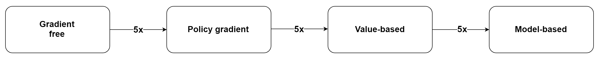
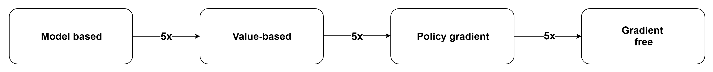
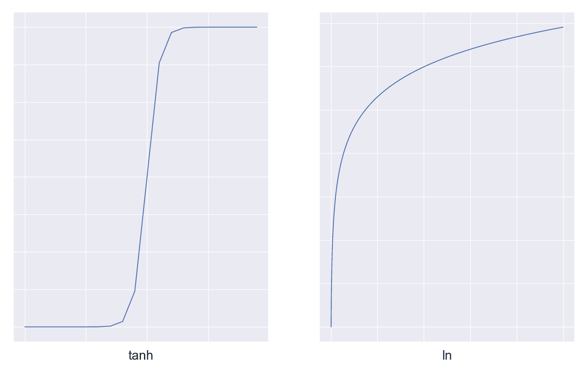
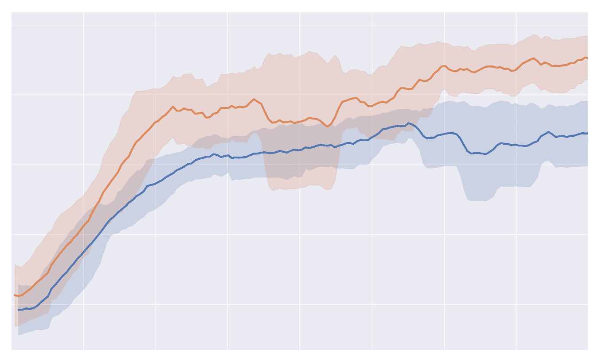

# 第十三章：解决强化学习挑战的实用实现

本章中，我们将总结前几章中解释的**深度强化学习**（**深度 RL**）算法的部分概念，以便给你一个广泛的视角来了解它们的应用，并为选择最适合某一问题的算法制定一个通用的规则。此外，我们还将提出一些指导方针，帮助你开始开发自己的深度 RL 算法。这些指导方针展示了从开发开始时需要采取的步骤，使你可以轻松地进行实验，而不至于在调试过程中浪费太多时间。在同一节中，我们还列出了最重要的超参数调优以及需要处理的额外标准化过程。

接下来，我们将通过解决稳定性、效率和泛化等问题，探讨这一领域的主要挑战。我们将以这三个主要问题为转折点，过渡到更先进的强化学习技术，如无监督强化学习和迁移学习。无监督强化学习和迁移学习对于部署和解决要求高的强化学习任务至关重要，因为它们是解决我们之前提到的三个挑战的技术。

我们还将探讨如何将强化学习应用于实际问题，以及强化学习算法如何在弥合仿真与现实世界之间的差距方面发挥作用。

为了总结本章及整本书，我们将从技术和社会角度讨论强化学习的未来。

本章将涵盖以下主题：

+   深度强化学习的最佳实践

+   深度强化学习的挑战

+   高级技术

+   强化学习在现实世界中的应用

+   强化学习的未来及其对社会的影响

# 深度强化学习的最佳实践

在整本书中，我们介绍了许多强化学习算法，其中一些仅是升级版（例如 TD3、A2C 等），而其他一些则与其他算法有根本性的不同（例如 TRPO 和 DPG），并提出了达成相同目标的替代方式。此外，我们还探讨了非强化学习优化算法，如模仿学习和进化策略，以解决序列决策任务。所有这些替代方案可能会让你感到困惑，你可能不确定哪种算法最适合某一特定问题。如果是这种情况，别担心，我们现在将介绍一些规则，帮助你决定在给定任务中使用最合适的算法。

此外，如果你在本书中实现了我们介绍的一些算法，可能会发现很难将所有部分整合起来，使算法正常工作。深度强化学习算法因调试和训练难度大而著称，而且训练时间非常长。因此，整个训练过程非常缓慢且艰难。幸运的是，有一些策略可以帮助你避免在开发深度强化学习算法时遇到一些可怕的头痛问题。但在讨论这些策略之前，我们先来看看如何选择合适的算法。

# 选择合适的算法

区分不同类型的强化学习（RL）算法的主要驱动力是样本效率和训练时间。

我们将样本效率视为一个智能体在学习任务时与环境交互的次数。我们提供的数字是算法效率的一个指标，是相对于其他算法在典型环境中的表现进行衡量的。

显然，还有其他参数会影响算法选择，但通常这些参数的影响较小，重要性较低。举个例子，其他需要评估的参数包括 CPU 和 GPU 的可用性、奖励函数的类型、可扩展性、算法的复杂度以及环境的复杂度。

在本次比较中，我们将考虑无梯度黑箱算法（如进化策略）、基于模型的 RL 算法（如 DAgger）以及无模型的 RL 算法。在后者中，我们将区分策略梯度算法（如 DDPG 和 TRPO）和基于价值的算法（如 DQN）。

以下图表展示了这四类算法的数据效率（注意，最左侧的方法在样本效率上低于最右侧的方法）。特别地，随着图表向右移动，算法的效率逐渐增加。因此，你可以看到，无梯度方法需要从环境中获取更多的数据点，其次是策略梯度方法、基于价值的方法，最后是基于模型的 RL，它们是最具样本效率的。

图 13.1：基于模型的 RL 方法、策略梯度算法、基于价值的算法和无梯度算法的样本效率比较（最左侧的方法效率低于最右侧的方法）。

相反，这些算法的训练时间与样本效率呈反比关系。这个关系在以下图表中总结（注意，最左侧的方法训练速度慢于最右侧的方法）。我们可以看到，基于模型的算法的训练速度远低于基于价值的算法，几乎慢了五倍，而基于策略梯度的算法则比无梯度方法慢约**5 倍**。

请注意，这些数字只是为了突出平均情况，训练时间仅与算法的训练速度相关，而与从环境中获取新过渡所需的时间无关：

图 13.2\. 模型基础 RL 方法、策略梯度算法、值基算法和无梯度算法的训练时间效率比较（最左侧的方法训练速度比最右侧的慢）

我们可以看到，算法的样本效率与其训练时间是互补的，这意味着一个数据高效的算法训练起来很慢，反之亦然。因此，由于智能体的总体学习时间既考虑到训练时间，也考虑到环境的速度，你需要在样本效率和训练时间之间找到一个平衡点，以满足你的需求。事实上，基于模型的算法和更高效的无模型算法的主要目的是减少与环境的交互步骤，使得这些算法在实际世界中更容易部署和训练，因为实际世界中的交互速度通常比模拟器中的慢。

# 从零到一

一旦你定义了最适合你需求的算法，无论它是一个广为人知的算法还是一个新的算法，你就需要开发它。正如本书所示，强化学习算法与监督学习算法没有太多共同之处。出于这个原因，有一些不同的方面值得注意，以便于调试、实验和调整算法：

+   **从简单问题开始**：最初，你可能会想尽快尝试一个可行版本的代码。然而，建议你逐步进行，逐渐增加环境的复杂度。这将大大帮助减少整体的训练和调试时间。让我举个例子。如果你需要一个离散环境，可以从 CartPole-v1 开始；如果需要一个连续环境，可以选择 RoboschoolInvertedPendulum-v1。接着，你可以进入一个中等复杂度的环境，例如 RoboschoolHopper-v1、LunarLander-v2，或者一个带有 RGB 图像的相关环境。在这个阶段，你应该已经拥有一份没有 bug 的代码，最终可以在你的最终任务上进行训练和调整。此外，你应该尽可能熟悉这些简单的任务，这样如果出现问题，你能够知道应该查找哪些方面。

+   **训练很慢**：训练深度强化学习算法需要时间，学习曲线可能呈现任何形状。正如我们在前几章中看到的，学习曲线（即相对于步数的轨迹累积奖励）可能类似于对数函数、双曲正切函数（如下图所示），或更复杂的函数。可能的形状取决于奖励函数、其稀疏性和环境的复杂性。如果你正在处理一个新环境，并且不知道会有什么结果，建议你保持耐心，直到你确定进展已停止为止。同时，训练过程中不要过于关注图表。

+   **开发一些基准线**：对于新任务，建议至少开发两个基准线，以便与它们比较你的算法。一个基准线可以是一个随机代理，另一个基准线可以是像 REINFORCE 或 A2C 这样的算法。这些基准线可以用作性能和效率的下限。

+   **图表和直方图**：为了监控算法的进展并帮助调试阶段，一个重要的因素是绘制并显示关键参数的直方图，如损失函数、累积奖励、动作（如果可能）、轨迹的长度、KL 惩罚、熵和价值函数。除了绘制均值外，你还可以添加最小值、最大值和标准差。在本书中，我们主要使用 TensorBoard 来可视化这些信息，但你可以使用任何你喜欢的工具。

+   **使用多个种子**：深度强化学习在神经网络和环境中都嵌入了随机性，这通常导致不同运行之间的结果不一致。因此，为了确保一致性和稳定性，最好使用多个随机种子。

+   **归一化**：根据环境的设计，归一化奖励、优势和观测值可能会有所帮助。优势值（例如，在 TRPO 和 PPO 中）可以在一个批次中进行归一化，使其均值为 0，标准差为 1。此外，观测值可以使用一组初始随机步骤进行归一化。奖励则可以通过折扣或未折扣奖励的均值和标准差的运行估计来归一化。

+   **超参数调优**：超参数根据算法的类别和类型变化很大。例如，基于值的方法与策略梯度方法相比有多个不同的超参数，但这些类别的实例，如 TRPO 和 PPO，也有许多独特的超参数。也就是说，对于本书中介绍的每一个算法，我们都指定了所使用的超参数以及最重要的调优参数。在这些参数中，至少有两个是所有强化学习算法都会用到的：学习率和折扣因子。前者在监督学习中稍微不那么重要，但仍然是调优的首要参数之一，因为它决定了我们是否能够得到一个有效的算法。折扣因子是强化学习算法特有的。引入折扣因子可能会引入偏差，因为它会修改目标函数。然而，在实际应用中，它能够生成更好的策略。因此，从某种程度上来说，时间跨度越短越好，因为它可以减少不稳定性：

图 13.3\. 对数函数和双曲正切函数的示例

关于本章中提到的所有颜色参考，请参阅[`www.packtpub.com/sites/default/files/downloads/9781789131116_ColorImages.pdf`](http://www.packtpub.com/sites/default/files/downloads/9781789131116_ColorImages.pdf)中的彩色图像包。

采用这些技术后，你将能够更轻松地训练、开发和部署算法。此外，你将拥有更加稳定和健壮的算法。

对深度强化学习的缺点有一个批判性的视角和理解，是推动强化学习算法发展的关键因素，这样才能设计出更好的最先进算法。在接下来的部分中，我们将以更简洁的方式呈现深度强化学习的主要挑战。

# 深度强化学习中的挑战

近年来，在强化学习算法的研究中投入的努力巨大。特别是深度神经网络作为函数逼近方法引入之后，进展和成果都非常突出。然而，一些主要问题仍未解决，这些问题限制了强化学习算法在更广泛和有趣任务中的应用。我们在这里讨论的是稳定性、可重复性、效率和泛化性问题，尽管可扩展性和探索问题也可以列入此清单。

# 稳定性和可重复性

稳定性和可重复性在某种程度上是相互关联的，因为目标是设计一个能够在多次运行中保持一致的算法，并且不会对微小的调整产生过大敏感性。例如，算法不应该对超参数值的变化过于敏感。

使深度强化学习算法难以复制的主要因素，源自深度神经网络的固有特性。这主要是因为深度神经网络的随机初始化和优化过程的随机性。此外，在强化学习中，这种情况因环境的随机性而加剧。综合来看，这些因素也不利于结果的可解释性。

稳定性还面临强化学习（RL）算法高不稳定性的考验，就像我们在 Q-learning 和 REINFORCE 中看到的那样。例如，在基于值的算法中，没有任何收敛的保证，算法会受到高偏差和不稳定性的困扰。DQN 使用了许多技巧来稳定学习过程，比如经验回放和目标网络更新的延迟。尽管这些策略可以缓解不稳定性问题，但它们并未完全消除这些问题。

为了克服算法在稳定性和可重复性方面的固有限制，我们需要在算法之外进行干预。为此，可以采用许多不同的基准测试和一些经验法则，以确保较高的可重复性和结果一致性。具体方法如下：

+   如果可能，应该在多个相似的环境中测试算法。例如，可以在 Roboschool 或 Atari Gym 等环境集上测试，其中任务在动作和状态空间上相似，但目标不同。

+   运行多个不同随机种子的实验。通过改变种子，结果可能会有显著差异。以下图示为例，展示了相同超参数的算法在不同种子下的两次运行，你可以看到差异很大。因此，根据你的目标，使用多个随机种子（一般为三到五个）可能会有帮助。例如，在学术论文中，通常的做法是对五次运行的结果进行平均，并考虑标准差。

+   如果结果不稳定，考虑使用更稳定的算法或采取进一步的策略。同时，请记住，超参数的变化对不同算法和环境的影响可能会有显著差异：

图 13.4. 两次相同算法在不同随机种子下的性能对比

# 效率

在上一节*选择合适的算法*中，我们看到算法之间的样本效率差异很大。此外，从前几章我们了解到，更高效的方法，如基于值的学习，仍然需要大量的环境交互才能学习。也许只有基于模型的强化学习才能解决数据匮乏的问题。不幸的是，基于模型的方法也有其他缺点，比如较低的性能上限。

因此，已经构建了混合的基于模型和无模型的方法。然而，这些方法在工程实现上较为困难，且不适用于现实世界中的问题。正如你所看到的，效率相关的问题非常难以解决，但同时也非常重要，需要解决这些问题才能将强化学习方法应用于现实世界。

有两种替代方法可以处理像物理世界这样非常缓慢的环境。一种方法是在最初使用低保真度的模拟器，然后在最终环境中微调智能体。另一种方法是直接在最终环境中训练智能体，但需要转移一些先前的相关知识，以避免从头开始学习任务。这就像是在你已经训练了自己的感官系统后学习驾驶。无论哪种方式，因为我们是在将知识从一个环境转移到另一个环境，所以我们讨论了一种叫做迁移学习的方法。我们将在*高级技术*部分进一步详细阐述这种方法。

# 泛化

泛化的概念涉及两个不同但又相关的方面。一般而言，强化学习中的泛化概念指的是算法在相关环境中获得良好表现的能力。例如，如果一个智能体已经接受了在泥泞道路上行走的训练，我们可能会期望该智能体在铺设的道路上表现良好。泛化能力越强，智能体在不同环境中的表现就越好。第二种较少使用的泛化方式是指算法在只能收集有限数据的环境中取得良好表现的特性。

在强化学习中，智能体可以自行选择要访问的状态，并且可以任意停留在这些状态上，从而可能会在某个特定问题空间上过拟合。然而，如果需要良好的泛化能力，就必须找到一种折中方法。如果允许智能体为环境收集潜在的无限数据，这种做法只在某种程度上是有效的，因为它会作为一种自我正则化方法。

尽管如此，为了帮助智能体在其他环境中实现泛化，它必须具备抽象推理的能力，从简单的状态-动作映射中辨别出任务，并使用多个因素来解释任务。抽象推理的例子可以在基于模型的强化学习、迁移学习以及使用辅助任务中找到。我们稍后会介绍后者，但简而言之，这是一种通过将辅助任务与主任务共同学习来改善泛化和样本效率的技术。

# 高级技术

我们之前列出的挑战没有简单的解决方案。然而，已经有努力在尝试克服这些挑战，并提出新的策略来提高效率、泛化能力和稳定性。专注于效率和泛化的两种最广泛且有前景的技术是无监督强化学习和迁移学习。在大多数情况下，这些策略与我们在前几章中开发的深度强化学习算法是相辅相成的。

# 无监督强化学习

无监督强化学习与常规的无监督学习相关，因为两者都不使用任何监督来源。在无监督学习中，数据没有标签，而在强化学习的对等体中，奖励并没有给出。也就是说，在给定一个动作时，环境只返回下一个状态。奖励和**完成**状态都被移除。

无监督强化学习（Unsupervised RL）在许多场景中都有帮助，例如，当用手工设计的奖励对环境进行标注不可扩展，或者当一个环境可以服务于多个任务时。在后一种情况下，可以采用无监督学习，以便我们能够了解环境的动态。能够从无监督来源中学习的方法，也可以作为在奖励非常稀疏的环境中额外的信息来源。

我们如何设计一个能够在没有任何监督来源的情况下学习环境的算法？难道我们不能仅仅采用基于模型的学习吗？实际上，基于模型的强化学习仍然需要奖励信号来规划或推断下一个动作。因此，需要一个不同的解决方案。

# 内在奖励

一个潜在的公平替代方法是开发一个内在的奖励函数，这个函数是由智能体的信念独立控制的。这种方法接近新生儿学习所采用的方式。实际上，他们采用纯探索的范式，在没有直接利益的情况下探索世界。然而，所获得的知识可能在以后的生活中有所帮助。

内在奖励是一种基于对状态新颖性估计的**探索奖励**。一个状态越陌生，它的内在奖励就越高。因此，代理通过这种奖励被激励去探索环境中的新空间。到现在为止，可能已经清楚，内在奖励可以作为一种替代的探索策略。事实上，许多算法将内在奖励与外在奖励（即环境返回的常规奖励）结合使用，以增强在稀疏环境中的探索，例如《Montezuma's Revenge》。然而，尽管估算内在奖励的方法与我们在第十二章《开发 ESBAS 算法》中研究的非常相似，用于激励策略探索（这些探索策略仍与外部奖励相关），但在这里，我们仅专注于纯粹的无监督探索方法。

两种主要的基于好奇心驱动的策略，它们能在未知状态下提供奖励并有效探索环境，分别是基于计数的策略和基于动态的策略：

+   基于计数的策略（也称为**访问计数**策略）旨在计数或估算每个状态的访问次数，并鼓励探索那些访问次数较少的状态，对这些状态分配较高的内在奖励。

+   基于动态的策略训练一个环境的动态模型，并与智能体的策略结合，计算内在奖励，通常基于预测误差、预测不确定性或预测改进。其基本思想是通过对已访问状态进行建模，新颖和未知的状态将具有更高的不确定性或估计误差。然后，这些值被用来计算内在奖励，并激励探索未知状态。

如果我们仅对常规环境应用好奇心驱动的方法，会发生什么？论文《好奇心驱动学习的大规模研究》提出了这个问题，并发现，在 Atari 游戏中，纯粹的好奇心驱动代理可以在没有任何外部奖励的情况下学习并掌握任务。此外，他们还注意到，在 Roboschool 中，步态行为完全是由这些基于内在奖励的无监督算法产生的。论文的作者还提出，这些发现是由于环境设计的方式。确实，在人类设计的环境中（如游戏），外部奖励通常与寻求新奇的目标是一致的。然而，在非游戏化的环境中，纯粹的好奇心驱动的无监督方法能够完全依靠自己探索并学习环境，而无需任何监督。或者，RL 算法也可以通过结合内在奖励与外在奖励，从而显著提高探索能力，并因此提升性能。

# 迁移学习

在两个环境之间迁移知识，尤其是当这些环境彼此相似时，是一项困难的任务。迁移学习策略旨在弥合知识差距，使得从初始环境到新环境的过渡尽可能平滑和容易。具体而言，迁移学习是将知识从源环境（或多个源环境）高效地迁移到目标环境的任务。因此，从一组源任务中获取的经验越多，并且迁移到新目标任务，智能体学习的速度就越快，在目标任务上的表现也会越好。

一般来说，当你想到一个尚未经过训练的智能体时，你需要想象一个完全没有任何信息的系统。相反，当你玩游戏时，你会使用大量的先验知识。例如，你可能会根据敌人的形状、颜色以及它们的动态来推测敌人的含义。这意味着，当敌人向你开火时，你能识别出敌人，就像下面的《太空侵略者》游戏截图所示。此外，你还可以轻松地猜测游戏的基本动态。然而，在训练的开始阶段，强化学习智能体什么都不知道。这个比较非常重要，因为它提供了关于在多个环境之间传递知识重要性的宝贵洞察。一个能够利用从源任务中获得的经验的智能体，在目标环境中可以更快地学习。例如，如果源环境是 Pong 而目标环境是 Breakout，那么许多视觉组件可以被重用，从而节省大量计算时间。为了准确理解其总体重要性，想象一下在更复杂的环境中获得的效率：

图 13.5\. 《太空侵略者》的截图。你能推测出精灵的角色吗？

说到迁移学习时，我们通常提到 0-shot 学习、1-shot 学习，依此类推，这些术语指的是在目标领域中所需的尝试次数。例如，0-shot 学习意味着在源领域上训练的策略可以直接应用到目标领域，而无需进一步训练。在这种情况下，智能体必须具备强大的泛化能力，以便适应新任务。

# 迁移学习的类型

存在多种类型的迁移学习，其使用取决于具体情况和需求。一个区分点与源环境的数量有关。显然，你训练智能体的源环境越多，它的多样性就越大，能够在目标领域使用的经验也就越多。从多个源领域迁移学习被称为多任务学习。

# 1-任务学习

单任务学习或称为迁移学习，是在一个领域上训练策略并将其迁移到另一个领域的任务。可以采用三种主要技术来实现这一目标，具体如下：

+   **微调**：这涉及对目标任务上学到的模型进行优化。如果你参与过机器学习，尤其是在计算机视觉或自然语言处理领域，你可能已经使用过这种技术。不幸的是，在强化学习中，微调并不像在上述领域那样容易，因为它需要更精细的工程设计，并且通常带来的收益较小。其原因在于，一般而言，两个强化学习任务之间的差距比两个不同图像领域之间的差距要大。例如，猫和狗的分类差异较小，而 Pong 和 Breakout 之间的差异则较大。然而，微调仍然可以在强化学习中使用，调整最后几层（或者在动作空间完全不同的情况下替换它们）可能会带来更好的泛化能力。

+   **领域随机化**：这一方法基于这样一个思想，即源领域的动态多样化可以增强策略在新环境中的鲁棒性。领域随机化通过操控源领域来实现，例如，通过改变仿真器的物理特性，使得在多个随机修改的源领域上训练的策略足够鲁棒，能够在目标领域中表现良好。这种策略对于训练需要应用于现实世界的代理更加有效。在这种情况下，策略更具鲁棒性，仿真不必与物理世界完全相同，仍然能够提供所需的性能水平。

+   **领域适应**：这是另一个常用的过程，尤其用于将仿真源领域的策略映射到目标物理世界。领域适应的核心是将源领域的数据分布调整为与目标领域匹配。它主要应用于基于图像的任务，模型通常使用**生成对抗网络**（**GANs**）将合成图像转化为真实图像。

# 多任务学习

在多任务学习中，代理已训练的环境数量越多，代理在目标环境上的多样性和性能就会越好。多个源任务可以由一个或多个代理来学习。如果只有一个代理被训练，那么将其部署到目标任务上很容易。否则，如果多个代理学习了不同的任务，那么得到的策略可以作为一个集成模型使用，并对目标任务的预测进行平均，或者使用一个名为蒸馏的中间步骤，将多个策略合并为一个。具体来说，蒸馏过程将多个模型的知识压缩成一个，便于部署且推理速度更快。

# 真实世界中的强化学习

到目前为止，在本章中，我们介绍了开发深度强化学习算法的最佳实践和强化学习背后的挑战。我们还看到无监督强化学习和元学习如何缓解低效和泛化不良的问题。现在，我们想向你展示在将强化学习智能体应用于真实世界时需要解决的问题，以及如何弥合模拟环境中的差距。

设计一个能够在真实世界中执行动作的智能体是非常具有挑战性的。但大多数强化学习应用需要在现实世界中部署。因此，我们必须了解在面对物理世界的复杂性时所面临的主要挑战，并考虑一些有用的技术。

# 面对真实世界的挑战

除了样本效率和泛化能力方面的重大问题之外，在处理真实世界时，我们还需要面对诸如安全性和领域约束等问题。事实上，由于安全性和成本约束，智能体通常不能自由地与世界进行交互。一种解决方案可能来自使用约束算法，例如 TRPO 和 PPO，这些算法被嵌入系统机制中，以限制在训练过程中行动的变化。这可以防止智能体行为的剧烈变化。不幸的是，在高度敏感的领域，这还不够。例如，如今，你不能直接在道路上开始训练自动驾驶汽车。政策可能需要经过数百或数千个周期才能理解从悬崖上掉下来会导致不良结果，并学会避免这种情况。先在模拟中训练政策的替代方案是可行的。然而，当应用到城市环境时，必须做出更多与安全相关的决策。

正如我们刚才提到的，模拟优先的解决方案是一种可行的方法，根据实际任务的复杂性，它可能会带来良好的性能。然而，模拟器必须尽可能地模仿真实世界的环境。例如，如果下图左侧的模拟器与右侧的真实世界相似，那么该模拟器就无法使用。真实世界与模拟世界之间的差距被称为现实差距：

图 13.6\. 人工世界与物理世界的比较

另一方面，使用高度准确和现实的环境可能也不可行。瓶颈现在是模拟器所需的计算能力。这个限制可以通过从一个速度更快、精度更低的模拟器开始，并逐步增加保真度以缩小现实差距来部分克服。最终，这将牺牲速度，但此时，代理应该已经学习了大部分任务，可能只需要少量的迭代来进行微调。然而，开发高度准确的模拟器来模拟物理世界是非常困难的。因此，在实践中，现实差距将依然存在，改善泛化的技术将有责任处理这种情况。

# 弥合模拟和现实世界之间的差距

为了从模拟到现实世界无缝过渡，从而克服现实差距，我们之前提出的一些泛化技术，例如领域自适应和领域随机化，可以被使用。例如，在论文《学习灵巧的手内操作》中，作者通过领域随机化训练了一个类人机器人，利用惊人的灵巧性操作物理物体。该策略通过许多不同的平行模拟进行训练，这些模拟旨在提供具有随机物理和视觉属性的多样化体验。这种偏向于泛化而非现实的机制至关重要，考虑到系统在部署时展示了一系列丰富的手内灵巧操作策略，其中许多策略也被人类使用。

# 创建你自己的环境

出于教育目的，在本书中，我们主要使用了适合我们需求的快速且小规模的任务。然而，现有许多模拟器可以用于运动任务（如 Gazebo、Roboschool 和 Mujoco）、机械工程、运输、自动驾驶汽车、安全等。这些现有环境种类繁多，但并不是每个应用都有现成的模拟器。因此，在某些情况下，你可能需要自己创建环境。

奖励函数本身很难设计，但它是强化学习（RL）中的关键部分。如果奖励函数设置错误，环境可能无法解决，代理可能会学到错误的行为。在第一章《强化学习的全景》中，我们举了一个赛船游戏的例子，其中船通过绕圈子来最大化奖励，捕捉重新生成的目标，而不是尽可能快地朝着轨迹终点行驶。这些就是在设计奖励函数时需要避免的行为。

设计奖励函数的一般建议（适用于任何环境）是使用正奖励来激励探索，并通过负奖励来抑制终止状态，或者如果目标是尽可能快速地达到终止状态，则使用负奖励。奖励函数的形状是一个重要的考虑因素。在本书中，我们曾多次警告稀疏奖励的问题。一个理想的奖励函数应该提供平滑且密集的反馈。

如果由于某些原因，奖励函数非常难以用公式表示，可以通过两种额外方式提供监督信号：

+   使用模仿学习或逆强化学习展示任务。

+   使用人类偏好来提供关于智能体行为的反馈。

后者仍然是一种新颖的方法，如果你对此感兴趣，可以阅读论文《*从依赖策略的人类反馈中进行深度强化学习*》([`arxiv.org/abs/1902.04257`](https://arxiv.org/abs/1902.04257))，这将是一本有趣的读物。

# 强化学习的未来及其对社会的影响

人工智能的最初基础建立于 50 多年前，但直到最近几年，人工智能所带来的创新才作为主流技术传播到世界各地。这一波创新的浪潮主要得益于深度神经网络在监督学习系统中的演变。然而，人工智能的最新突破涉及强化学习，特别是深度强化学习。在围棋和 Dota 游戏中取得的成果突显了强化学习算法的卓越质量，这些算法能够进行长期规划、展现团队协作能力，并发现新的游戏策略，甚至是人类难以理解的策略。

在模拟环境中取得的显著成果开启了强化学习在物理世界中的新应用浪潮。我们才刚刚开始，但许多领域正在并将继续受到影响，带来深刻的变革。嵌入日常生活中的强化学习智能体可以通过自动化繁琐的工作、解决全球性挑战、发现新药物等方式提升生活质量——这些只是一些可能性。然而，这些将在我们世界和生活中广泛应用的系统需要安全可靠。目前我们尚未达到这一点，但我们在朝着正确的方向迈进。

AI 的伦理使用已经成为广泛关注的问题，比如在使用自主武器时。随着技术的快速发展，政策制定者和民众很难在这些问题上进行开放讨论。许多有影响力和有声望的人也认为 AI 是对人类的潜在威胁。但未来是无法预测的，且技术还有很长的路要走，才能开发出具备与人类相当能力的代理。我们有创造力、情感和适应性，这些现在是强化学习无法模拟的。

通过细心的关注，强化学习带来的短期益处可以显著超过其负面影响。但是，要将复杂的强化学习代理嵌入到物理环境中，我们需要解决之前提到的强化学习挑战。这些问题是可以解决的，一旦解决，强化学习有可能减少社会不平等，改善我们的生活质量以及地球的质量。

# 总结

在本书中，我们学习并实现了许多强化学习算法，但所有这些不同的算法在选择时可能会让人感到困惑。因此，在最后一章中，我们提供了一个经验法则，帮助你选择最适合你问题的强化学习算法类别。它主要考虑算法的计算时间和样本效率。此外，我们还提供了一些技巧，以帮助你更好地训练和调试深度强化学习算法，从而使这个过程更容易。

我们还讨论了强化学习中的隐性挑战：稳定性与可复现性、效率和泛化能力。这些是必须克服的主要问题，以便将强化学习代理应用于物理世界。事实上，我们详细介绍了无监督强化学习和迁移学习，这两种策略可以大大提高泛化能力和样本效率。

此外，我们详细阐述了强化学习可能对我们的生活产生的最关键的开放性问题，以及它在文化和技术方面的影响。

我们希望这本书能让你对强化学习有一个全面的了解，并激发你对这个迷人领域的兴趣。

# 问题

1.  你会如何根据样本效率来排名 DQN、A2C 和 ES？

1.  如果根据训练时间并且提供 100 个 CPU，他们的排名会如何？

1.  你会在调试强化学习算法时从 CartPole 还是 MontezumaRevenge 开始？

1.  为什么在比较多个深度强化学习算法时，使用多个种子更好？

1.  内在奖励是否有助于环境探索？

1.  什么是迁移学习？

# 进一步阅读

+   如果你对在 Atari 游戏中使用纯粹的好奇心驱动方法感兴趣，可以阅读这篇论文 *Large-scale study of curiosity-driven learning* ([`arxiv.org/pdf/1808.04355.pdf`](https://arxiv.org/pdf/1808.04355.pdf))。

+   关于将领域随机化应用于学习灵巧的手内操作，阅读论文 *学习灵巧的手内操作* ([`arxiv.org/pdf/1808.00177.pdf`](https://arxiv.org/pdf/1808.00177.pdf))。

+   关于展示如何将人类反馈作为奖励函数的替代方法的工作，阅读论文 *基于策略依赖的人类反馈的深度强化学习* ([`arxiv.org/pdf/1902.04257.pdf`](https://arxiv.org/pdf/1902.04257.pdf))。
