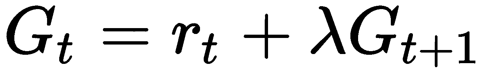
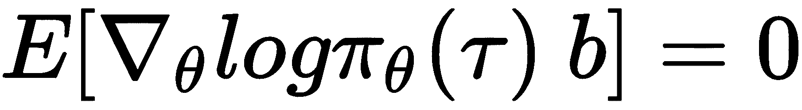

# 第十四章：评估

第三章

+   什么是随机策略？

    +   它是一个基于概率分布定义的策略。

+   如何用下一个时间步的回报来定义回报？

    +   

+   为什么贝尔曼方程如此重要？

    +   因为它提供了一个通用公式，用于计算一个状态的价值，利用当前的奖励和后续状态的价值。

+   DP 算法的限制因素是什么？

    +   由于状态数量的复杂性爆炸，它们必须受到限制。另一个限制是系统的动态必须完全已知。

+   什么是策略评估？

    +   是一种使用贝尔曼方程计算给定策略的价值函数的迭代方法。

+   策略迭代和价值迭代有什么区别？

    +   策略迭代在策略评估和策略改进之间交替进行，而价值迭代则将二者结合在一个单一的更新中，使用最大函数。

第四章

+   RL 中使用的 MC 方法的主要特点是什么？

    +   将状态的平均回报作为价值函数的估计。

+   为什么蒙特卡洛（MC）方法是离线的？

    +   因为它们只有在完整的轨迹可用时才会更新状态值。因此，它们必须等到本轮结束。

+   TD 学习的两大主要思想是什么？

    +   它们结合了采样和自举的思想。

+   MC 和 TD 有什么不同？

    +   MC 从完整的轨迹中学习，而 TD 则在每一步都学习，也能从不完整的轨迹中获取知识。

+   为什么探索在 TD 学习中如此重要？

    +   因为 TD 更新仅在访问的状态-动作对上进行，所以如果某些状态-动作对未被发现，在没有探索策略的情况下，它们将永远不会被访问到。因此，一些好的策略可能永远不会被发现。

+   为什么 Q 学习是脱离策略的？

    +   因为 Q 学习的更新独立于行为策略。它使用最大操作的贪婪策略。

第五章

+   死亡三元组问题的产生原因是什么？

    +   当脱离策略学习与函数逼近和自举（bootstrapping）结合时。

+   DQN 如何克服不稳定性？

    +   使用重放缓冲区和独立的在线网络与目标网络。

+   什么是移动目标问题？

    +   这是一个问题，当目标值不是固定的，它们会随着网络的优化而变化。

+   DQN 是如何减轻移动目标问题的？

    +   引入一个目标网络，其更新频率低于在线网络。

+   DQN 中使用的优化过程是什么？

    +   通过**随机梯度下降**优化均方误差损失函数，这是一种对批量进行梯度下降的迭代方法。

+   状态-动作优势值函数的定义是什么？

    +   

第六章

+   PG 算法如何最大化目标函数？

    +   它们通过沿着目标函数的导数的相反方向迈出一步来进行。该步长与回报成正比。

+   PG 算法背后的主要直觉是什么？

    +   鼓励好的行为，并劝阻代理执行不好的行为。

+   为什么在 REINFORCE 中引入基准仍然保持无偏？

    +   因为在期望下 

+   REINFORCE 属于哪个更广泛的算法类别？

    +   它是一种蒙特卡罗方法，因为它像 MC 方法一样依赖完整的轨迹。

+   AC 方法中的评论员（critic）与 REINFORCE 中作为基准使用的价值函数有何不同？

    +   除了学习的函数相同，评论员使用的是近似的价值函数来为动作-状态值进行自举，而在 REINFORCE（但也在 AC 中），它被用作基准来减少方差。

+   如果你需要为一个必须学会移动的代理开发算法，你会选择 REINFORCE 还是 AC？

    +   你应该首先尝试一个演员-评论员算法，因为代理需要学习一个连续任务。

+   你可以使用 n 步演员-评论员算法作为 REINFORCE 算法吗？

    +   是的，只要  大于环境中可能的最大步骤数，你就可以这么做。

第七章

+   策略神经网络如何控制一个连续的代理？

    +   一种方法是预测描述高斯分布的均值和标准差。标准差可以根据状态（神经网络的输入）进行条件化，或者是一个独立的参数。

+   什么是 KL 散度？

    +   是两个概率分布接近程度的度量。

+   TRPO 背后的主要思想是什么？

    +   在接近旧概率分布的区域内优化新的目标函数。

+   KL 散度在 TRPO 中是如何使用的？

    +   它作为硬约束用于限制旧策略和新策略之间的偏差。

+   PPO 的主要优点是什么？

    +   它只使用一阶优化，这提高了算法的简洁性，并且具有更好的样本效率和性能。

+   PPO 是如何实现良好的样本效率的？

    +   它运行小批量更新，充分利用数据。

第八章

+   Q 学习算法的主要限制是什么？

    +   动作空间必须是离散的且较小，以便计算全局最大值。

+   为什么随机梯度算法样本效率低？

    +   因为它们是策略梯度方法，需要每次策略变化时都获取新的数据。

+   确定性策略梯度是如何克服最大化问题的？

    +   DPG 将策略建模为一个确定性函数，只预测一个确定性的动作，确定性策略梯度定理提供了一种计算梯度的方法，用于更新策略。

+   DPG 是如何保证足够的探索的？

    +   通过向确定性策略中加入噪声，或通过学习不同的行为策略。

+   DDPG 代表什么？它的主要贡献是什么？

    +   DDPG 代表深度确定性策略梯度，是一种将确定性策略梯度适应深度神经网络的算法。它们使用新策略来稳定和加速学习。

+   TD3 提出了哪些问题以进行最小化？

    +   Q 学习中常见的高估偏差和高方差估计。

+   TD3 采用了哪些新机制？

    +   为了减少高估偏差，他们使用了剪切双 Q 学习（Clipped Double Q-learning），同时通过延迟策略更新和平滑正则化技术来解决方差问题。

第九章

+   如果你只有 10 局棋的时间来训练你的智能体玩跳棋，你会选择基于模型的算法还是无模型的算法？

    +   我会使用基于模型的算法。跳棋的模型是已知的，并且规划是可行的任务。

+   基于模型的算法有哪些缺点？

    +   总的来说，它们需要更多的计算能力，并且相较于无模型算法，获得的渐近性能较低。

+   如果环境的模型未知，如何学习该模型？

    +   一旦通过与真实环境的交互收集了数据集，动态模型可以通过常规的监督学习方式进行学习。

+   为什么要使用数据聚合方法？

    +   因为通常与环境的首次交互是通过一个天真的策略完成的，该策略没有探索环境的全部。后续的交互需要更明确的策略来优化环境模型。

+   ME-TRPO 如何稳定训练过程？

    +   ME-TRPO 采用了两个主要特性：一组模型和早停技术。

+   为什么一组模型可以改善策略学习？

    +   因为由一组模型做出的预测考虑了单一模型的任何不确定性。

第十章

+   模仿学习是否被视为强化学习技术？

    +   不，因为它们的底层框架不同。IL 的目标不是像 RL 那样最大化奖励。

+   你会使用模仿学习来构建一个不可战胜的围棋智能体吗？

    +   可能不是，因为它需要一个专家来学习。如果智能体必须成为世界上最强的玩家，那么就没有值得学习的专家了。

+   DAgger 的全名是什么？

    +   数据集聚合

+   DAgger 的主要优势是什么？

    +   它通过让专家主动教导学习者从错误中恢复，克服了分布不匹配的问题。

+   在什么情况下你会使用 IRL 而不是 IL？

    +   在奖励函数更容易学习并且需要学习比专家更好的策略的情况下。

第十一章

+   有哪两种强化学习的替代算法可以解决顺序决策问题？

    +   进化策略和遗传算法

+   在进化算法中，哪些过程会产生新的个体？

    +   突变是改变父代基因，而交叉是结合来自两个父代的遗传信息。

+   启发式算法，如遗传算法，的灵感来源于什么？

    +   进化算法主要受到生物进化的启发。

+   CMA-ES 如何进化进化策略？

    +   CMA-ES 从一个多元正态分布中采样新候选，协方差矩阵会根据种群进行调整。

+   进化策略的一个优点和一个缺点是什么？

    +   一个优点是它们是无导数的方法，而缺点是样本效率较低。

+   在“进化策略作为可扩展的强化学习替代方案”论文中，采用了什么技巧来减少方差？

    +   他们提出使用镜像噪声，并生成一个带有相反符号扰动的附加突变。

第十二章

+   什么是探索-开发困境？

    +   这是一个决策问题，是否最好进行探索，以便在未来做出更好的决策，还是利用当前最好的选项。

+   我们在之前的 RL 算法中使用过哪两种探索策略？

    +   - 贪心策略和一个向策略中引入额外噪声的策略。

+   什么是 UCB？

    +   上置信界（UCB）是一种乐观的探索算法，它为每个值估计一个上置信界，并选择最大化该值的动作（12.3）。

+   是 Montezuma's Revenge 还是多臂老虎机问题更难解决？

    +   Montezuma's Revenge 比多臂老虎机问题要难得多，仅仅因为后者是无状态的，而前者有着天文数字般的可能状态。Montezuma's Revenge 游戏本身也具有更多的内在复杂性。

+   ESBAS 如何解决在线 RL 算法选择的问题？

    +   通过使用一个元算法，学习在特定情况下哪个固定算法组合表现更好。

第十三章

+   如何根据样本效率对 DQN、A2C 和 ES 进行排名？

    +   DQN 是最具样本效率的，其次是 A2C 和 ES。

+   如果按训练时间和可用的 100 个 CPU 排名，它们的排名会是多少？

    +   ES 可能是训练最快的，然后是 A2C 和 DQN。

+   你会在 CartPole 还是 MontezumaRevenge 上开始调试一个 RL 算法？

    +   CartPole。你应该从一个简单的任务开始调试算法。

+   为什么在比较多个深度 RL 算法时，使用多个种子会更好？

    +   单次试验的结果可能因为神经网络和环境的随机性而高度波动。通过对多个随机种子进行平均，结果会接近平均情况。

+   内在奖励是否有助于环境的探索？

    +   是的，这是因为内在奖励是一种探索奖励，它会增加智能体对访问新状态的好奇心。

+   什么是迁移学习？

    +   任务是有效地在两个环境之间转移知识。
