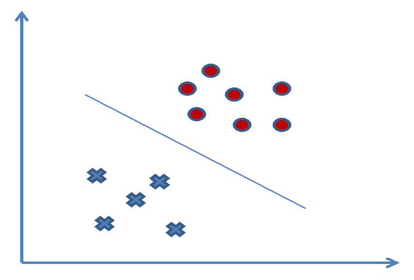
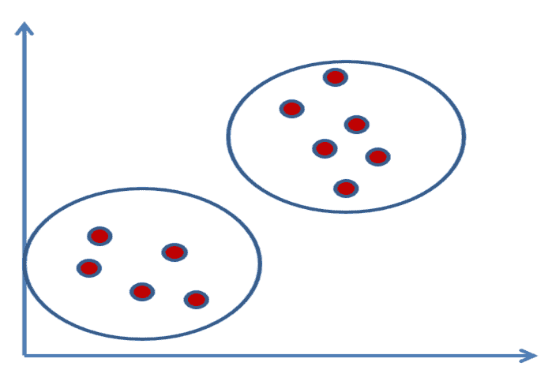
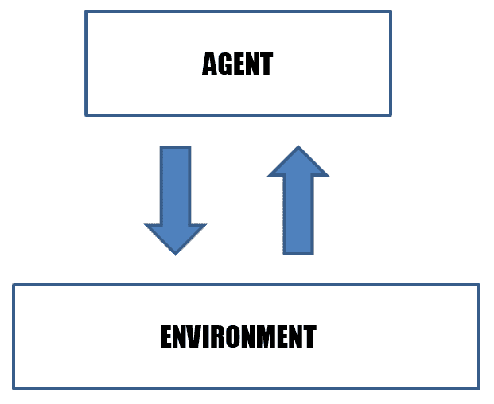
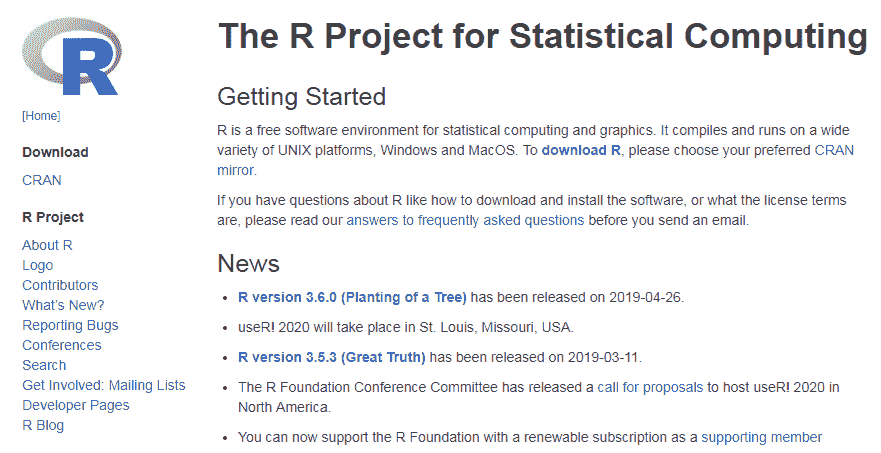
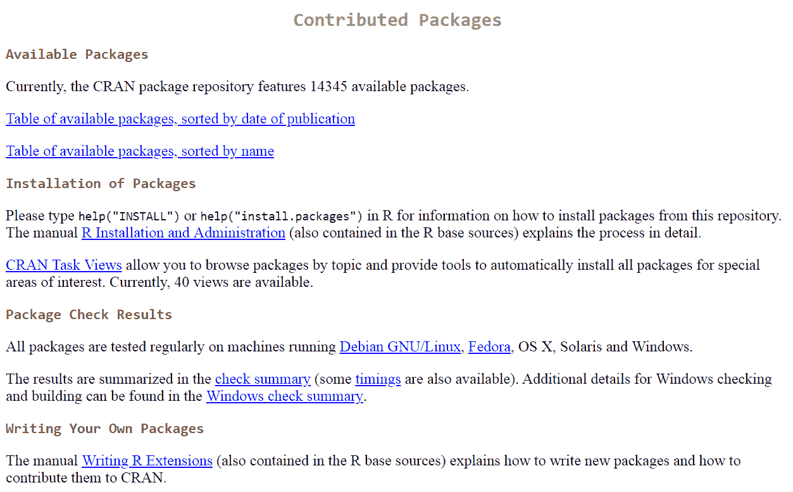

# 第一章：使用 R 进行强化学习概述

**强化学习** (**RL**) 是机器学习中一个非常激动人心的领域，广泛应用于从自动驾驶汽车到游戏的各种应用中。学习是一种过程，表现为由个体经验引发的持久适应性行为变化。学习的能力——即建立事件之间的因果关系、根据这些经验修改行为并记忆这些关系——是通过我们神经系统的功能组织得以实现的。动物研究表明，大脑具有一个或多个神经机制，通过这些机制，刺激和动作可以相互关联。基于这些考虑，提出了一个新的范式，它将认知学习的概念转移到机器学习中。在这个范式中，环境、智能体和奖励的概念成为寻找决策策略的关键，这些策略帮助我们做出正确的选择。

在强化学习中，算法是通过学习和适应环境变化而创建的。与外界的互动通过环境基于算法选择生成的外部反馈信号（奖励信号）来实现。正确的选择会带来奖励，而错误的选择则会导致惩罚。

在本章中，你将接触到 R 环境，并学习如何利用它通过强化学习解决问题。我们将首次了解 R 中可用的解决马尔可夫决策问题的包，并看到许多来自现实世界的应用示例。

到本章结束时，我们将了解强化学习的基本概念和该技术的不同方法。我们还将开始学习如何在 R 环境中使用可用的包来处理这项技术，并了解一些不同的实际应用。

本章将涵盖以下主题：

+   强化学习简介

+   理解强化学习算法

+   选择 R 进行强化学习

+   使用 MDPtoolbox 包

+   强化学习应用

# 强化学习简介

强化学习是个体在其所生活的环境中所采用的主要行为方式。通过老师给予的口头奖励，学习正确行为的孩子；通过反复练习学会投篮的篮球运动员；通过分析可能的对方反制措施来规划自己行动的战略家：这些都是适应性行为的例子。在这些情境中，一切都取决于代理所处的环境条件。强化学习是指解决上述问题的过程以及适用于最大化某个奖励函数的一组计算方法。它是研究这些问题及其可能解决方法的学科。在强化学习中，系统并不会提供问题的正确答案，而是对一个响应进行批评。

之前我们提到过，强化学习（**RL**）代表了一种新的机器学习范式，因此，在继续之前，区分人工智能中不同的方法是有用的。机器学习指的是能够在没有外部帮助的情况下从经验中学习，这正是我们人类在大多数情况下所做的。为什么机器不能做到这一点呢？

机器学习在解决日常生活中的多个问题中的成功，归功于其算法的质量。这些算法经过时间的不断改进和更新。可以通过根据用于学习的信号性质或系统采用的反馈类型将其分组为大的类别，从而实现多样化。

这些类别如下：

+   **监督学习**：该算法基于一系列示例的观察，每个数据输入都已事先标注。通过这种初步分析，它生成一个将输入值与期望输出关联的函数。它用于构建预测模型。

+   **无监督学习**：该算法家族试图从非标记的通用输入中提取知识。这些算法用于构建描述性模型。一个典型的应用例子是搜索引擎。

+   **RL**：这种算法可以根据其执行环境中发生的变化进行学习。事实上，由于每个动作都会对相关环境产生影响，算法便受到相同反馈环境的驱动。这些算法中的一些应用于语音或文本识别。

我们刚才提出的细分并不禁止在这些不同领域之间使用混合方法，事实上，这些方法常常取得良好的结果。

强化学习（RL）是指进行可以学习并适应自然变化的计算。这种编程策略依赖于根据计算决策接受外部升级的思想。正确的决策会得到奖励，而错误的决策会导致惩罚。系统的目标是实现最优结果，显然。在这一节中，我们了解了 RL 的基础。

让我们尝试更好地描述我们所介绍的不同范式，从监督算法开始。

# 监督学习

在监督学习中，我们尝试构建一个模型，从带标签的训练数据开始，利用该模型预测不可用的数据或未来的数据。因此，**监督**意味着在我们的样本集（数据集）中，期望的输出信号已经被标记为已知。在这种学习方式中，基于离散类的标签，我们将进行基于分类技术的任务。监督学习中使用的另一种技术是**回归**，其中输出信号是连续的数值。

在下图中，属于两个集合的样本被标记为不同的符号，从而使得容易识别分隔这两个集合的线：

监督学习算法，从足够数量的示例开始，使我们能够创建一个派生函数，该函数能够近似目标函数。如果算法返回了足够的近似度，提供输入数据给派生函数，我们应该能够得到类似于目标函数所提供的输出响应。这些算法基于这样一个概念：相似的输入对应相似的输出。

在现实世界中，这并不总是成立；然而，在某些情况下，这种近似是可以接受的。这些算法的成功在很大程度上依赖于输入数据。如果只有少量的训练输入，算法可能没有足够的经验来提供正确的输出。相反，输入值过多可能会使算法变得非常慢，因为由许多输入生成的导数函数可能非常复杂。此外，错误的数据会使整个系统不可靠，并导致智能体做出错误的决策，这告诉我们监督算法对噪声非常敏感。监督算法分为两大类：

+   **分类**：如果输出值是类别性的——例如，属于某个类或不属于某个类——这就是一个分类问题。

+   **回归**：如果输出是某个范围内的连续实数值，那么这就是一个回归问题。

在现实生活中，我们并不总是有带标签的数据可以用于学习。当这种情况发生时，我们需要通过不同的方式来解决问题，正如我们将在下一节中看到的那样。

# 无监督学习

与监督学习不同，无监督学习中我们有没有标签的数据或非结构化数据。通过这些技术，我们可以观察数据结构并提取有意义的信息。然而，在这些技术中，不能依赖于已知与结果相关的变量或奖励函数。在下面的图表中，我们看到了**聚类**的例子，这是一种探索性技术，允许我们将数据聚合到之前不知道属于的组（称为**聚类**）中：

这些算法的成功取决于它们能够从数据库中提取信息的重要性。原则上，这些算法基于比较数据并搜索相似性或差异。输入数据必须仅包含描述每个示例所需的功能集。如果输入数据由数值元素组成，无监督算法将实现出色的结果，但对非数值数据的精度要低得多。显然，在存在包含明确可识别的顺序或分组的数据时，它们可以正常工作。从数据中学习是监督和无监督算法基于的方法。在这两种情况下，都没有与环境的实时交互，这限制了这些技术用于解决众多问题的能力。在接下来的部分中，我们将看到如何处理这些问题。

# 强化学习

机器学习的第三种范式是强化学习。这种学习的目标是通过与环境的互动来提高系统（代理）的性能。为了提高系统功能，引入了强化信号，即奖励信号。这种强化不是由标签或正确值来确定，而是衡量系统所采取的行动质量的度量。因此，它不能用于监督学习。

在下面的图表中，我们可以看到代理-环境交互方案的示意图：

在现实世界中，我们并不总是有明确的指示来确定正确的输出；我们通常只有定性信息（强化信号）。现有的数据通常不提供任何有关如何更新代理行为的信息，因此没有指示如何更新权重的策略。无法定义成本函数或梯度。在这些情况下，我们可以定义一个系统，旨在创建能够从自身经验中学习的智能代理。

与环境的互动是这项技术的主要概念。让我们深入理解这一切是如何发生的。

# 理解强化学习算法

正如我们在前面章节中所看到的，强化学习（**RL**）是一种编程技术，旨在开发能够学习和适应环境变化的算法。这种编程技术基于一个假设，即代理能够从外部接收刺激并根据这些刺激改变自己的行为。因此，正确的选择会带来奖励，而错误的选择则会导致系统的惩罚。系统的目标是获得尽可能高的奖励，从而得到最佳的结果。

这一结果可以通过两种方法来实现：

+   第一种方法涉及评估算法的选择，然后根据结果对算法进行奖励或惩罚。这些技术还可以适应环境中的重大变化。一个例子是随着使用而提高性能的图像识别程序。在这种情况下，我们可以说学习是持续进行的。

+   在第二种方法中，首先进行一个阶段，在这个阶段中算法进行预先训练，当系统被认为是可靠的时，它变得固定且不可修改。这源于一个观察结果，即不断评估算法的行为可能是一个无法自动化或非常昂贵的过程。

这些仅仅是实现选择，因此可能存在某些算法包含了新分析的方法。

到目前为止，我们已经介绍了强化学习的基本概念。现在我们可以分析这些概念如何转化为算法。在本节中，我们将列出这些方法，提供一个概述，并深入探讨我们将在接下来的章节中处理的实际案例。

# 动态规划

**动态规划**（**DP**）代表一类算法，用于在环境的完美模型（即**马尔可夫决策过程**（**MDP**））下计算最优策略。动态规划的基本思想，以及强化学习（**RL**）的一般理念，是利用状态值和动作寻找好的策略。

# **蒙特卡洛方法**

蒙特卡洛方法用于估计价值函数和发现优秀策略，不需要环境模型的存在。它们能够仅通过智能体的经验或从智能体与环境交互中获得的状态序列、动作和奖励的样本来进行学习。经验可以通过智能体在学习过程中获得，或者通过预先填充的数据集进行模拟。学习过程中获得经验的可能性（在线学习）非常有趣，因为它使得智能体即使在没有*先验*环境动态知识的情况下，也能够获得优秀的行为。即使是通过一个已经填充的经验数据集进行学习也很有趣，因为当它与在线学习结合时，它使得通过他人经验引发的自动策略改进成为可能。

# 时序差分学习

**时序差分**（**TD**）学习算法基于减少智能体在不同时间点的估计差异。TD 算法试图预测一个依赖于给定信号未来值的量。其名称来源于在预测连续时间步时所使用的差异，以引导学习过程。任何时刻的预测都会更新，以使其更接近下一个时间步预测的同一量。在强化学习（RL）中，这些预测用于预测未来期望的总奖励量。

在接下来的章节中，我们将介绍三种处理时序差分学习的算法家族，每种家族采用不同的方法。

# SARSA

SARSA 算法实现了一种基于策略的时序差分方法，其中动作-价值函数的更新是基于从状态 *s* 到状态 *t* 通过动作 *a* 的转移结果，并基于选择的策略进行更新， (*s*, *a*)。

# Q 学习

Q 学习是最常用的强化学习算法之一。这是因为它能够在不需要环境模型的情况下比较可用动作的预期效用。得益于这一技术，可以在已完成的 MDP 中找到每个给定状态的最优动作。

# 深度 Q 学习

**深度 Q 学习**这个术语标识了一种强化学习方法，用于函数近似。因此，它代表了基本 Q 学习方法的进化，因为状态-动作表被神经网络所取代，目的是近似最优价值函数。

与之前的方法相比，它们用于构建网络，以请求输入和动作并提供预期回报，深度 Q 学习通过结构上的革命，仅请求环境的状态，并提供与环境中可执行的动作数量相同的状态-动作值。

因此，RL 代表了一种先进技术，能够解决不同的现实生活问题。现在，随着这项技术基础知识的详细介绍，是时候探索我们将在本书其余部分中使用的编程平台了。

# 选择 R 用于 RL

R 表示一种解释型脚本语言，其中“解释型”一词意味着应用程序将在不需要事先编译的情况下执行。R 采用面向对象的编程范式，通过这种方式，它将能够创建现代且灵活的应用程序；在 R 环境中，一切都是可以根据特定需求重用的对象。R 还是一个最初为统计计算和生成高质量图形而开发的环境。它由一个语言和一个运行时环境组成，拥有图形界面、调试器、以及访问一些系统功能的能力，并提供执行存储在脚本文件中的程序的能力。

它对统计学的偏向并非源自语言的性质，而是源自大量统计函数的可用性以及最初发明并随着时间发展这一语言的研究人员的兴趣。

R 的核心是一个解释型编程语言，允许使用常见的结构来控制信息流，并使用函数进行模块化编程。在 R 环境中，用户可见的大多数函数是用 R 本身编写的。R 还是一个开源程序，其受欢迎程度反映了公司内部使用的软件类型的变化。在这方面，我们应该记住，开源软件不仅在使用上没有任何限制，更重要的是，在开发过程中也没有限制。R 的强项在于其在数据分析和表示方面的灵活性。该语言专注于这一领域，并拥有无数的功能，以便为统计学家或数据科学家提供便利。

我们可以总结 R 的特点如下：

+   数据管理和操作的简便性

+   提供一套计算向量、矩阵和其他复杂操作的工具

+   访问大量集成的统计分析工具

+   产生大量特别灵活的图形潜力

+   使用面向对象的编程语言的可能性，该语言允许使用条件和循环结构，以及用户创建的函数

是什么使 R 如此有用，并有助于解释它为何迅速获得用户的接受？原因在于，统计学家、工程师和科学家们随着时间的推移，使用该软件改进代码或为特定任务编写变种，已经开发出了大量的脚本，并将其以包的形式汇集在一起。用 R 编写的包可以为分析数据库中信息提供更详细的高级算法、带有纹理的彩色图形以及数据挖掘技术。现在，让我们看看如何在我们的计算机上安装 R 环境，以便能够复制书中的示例。

# 安装 R

首先，让我们看看可以在哪里获取软件以便在我们的计算机上安装 R，开始用它进行编程。我们需要安装的包可以在语言的官方网站上找到，[`www.r-project.org/`](https://www.r-project.org/)。

**综合 R 档案网络**（CRAN）是一个分布在全球各地的服务器网络（实时更新），用于存储与 R 相关的源代码和文档的相同版本。CRAN 可以通过 R 网站直接访问，在该网站上，还可以找到关于 R 的信息、一些技术手册、R 杂志，以及开发用于 R 并存储在 CRAN 仓库中的包的详细信息。

在以下截图中，我们可以看到 R 项目的官方网站：

自然，在下载软件版本之前，我们需要了解可用的计算机类型以及它们上面安装的操作系统；然而，值得注意的是，R 实际上可以在所有流通中的操作系统上使用。R 环境中的编程得益于众多包的可用性。我们来看一下这些包是什么。

# R 包

这些包利用 R 的功能将复杂的算法分解成执行特定任务的简单单元，从而便于数据共享。在编程中，我们经常使用重复的代码片段，可能是因为需要对来自不同来源的数据执行相同的操作，或者更简单地说，两个不同的程序执行相似的过程。在这种情况下，每次为执行类似操作而重新编写相同的代码单元显然是低效的。

在这方面，R 语言与所有高级编程语言一样，允许实现子程序，这些子程序可以表示在单独文件中编写的程序部分，或者在同一个文件中作为独立单元，并且可以由主程序调用。从 R 脚本语言的第一个版本开始，就可以利用包（packages），这是一种现代且极其有效的信息交换方式，用于在不同程序单元之间交换信息，并实现增强编程环境的附加功能。R 环境由一系列函数组成，这些函数被聚合到包中——也就是说，这些包是一般专门用于实现某些目标和任务的函数组。因此，一个包就是一组相关的函数、帮助文件和数据文件，它们被整合到一个单独的文件中。R 中的包就像 Perl 模块，它们与 C 或 C++ 中的库以及 Java 类一起使用。

我们机器上安装的 R 发行版默认已经安装了一系列包。这些包与许多其他包一起，在需要时可以激活。此外，还有大量高度专业化的包（贡献包），它们提供执行各种计算和分析类型的有用功能。这些包必须先进行安装。一般而言，安装过程是自动进行的：R 会通过互联网连接到一个存储库（包存档），允许你选择所需的包，下载所需的程序并进行安装。安装后的程序必须通过在工作区加载它来激活。R 提供了良好的工具，可以在 GUI 内安装包，但没有提供同样有效的方式来查找特定的包。幸运的是，借助简单的网页浏览器，在网上找到包非常容易。例如，我们可以在 CRAN 网站上搜索我们的包，网址为 [`cran.r-project.org/web/packages/`](https://cran.r-project.org/web/packages/)。

当前，CRAN 包存储库中提供 14,345 个可用包。以下截图显示了 CRAN 存储库的网页：

此时，确定实现基于 RL 的算法所需的包就足够了——让我们从 `MDPtoolbox` 包开始。

# 使用 MDPtoolbox 包

在强化学习（RL）中，通常假设环境可以通过马尔可夫决策过程（MDP）来描述。这个话题将在第三章中进一步讨论，*马尔可夫决策过程的应用*。现在，我们将讨论 `MDPtoolbox` 包，它是一个专门为解决基于马尔可夫决策过程的问题而创建的 R 语言包。该包提供了与解决离散时间马尔可夫决策过程相关的函数——如有限时域、值迭代、策略迭代和线性规划算法（以及一些变体）——并且还提供了与强化学习（RL）相关的一些函数。

以下表格提供了该包的一些信息：

| 包名 | `MDPtoolbox` |
| --- | --- |
| 日期 | 2017-03-02 |
| 版本 | 4.0.3 |
| 标题 | 马尔可夫决策过程工具包 |
| 作者 | Iadine Chades, Guillaume Chapron, Marie-Josee Cros, Frederick Garcia, Regis Sabbadin |

以下列表展示了该包中最有用的函数，并附上了来自官方文档的简短描述：

+   `mdp_Q_learning`: 使用 Q 学习算法（RL）解决折扣马尔可夫决策过程（MDP）

+   `mdp_computePR`: 计算任意形式的转移和奖励函数的奖励矩阵

+   `mdp_eval_policy_iterative`: 使用迭代方法评估策略

+   `mdp_LP`: 使用线性规划算法解决折扣马尔可夫决策过程（MDP）

+   `mdp_policy_iteration`: 使用策略迭代算法解决折扣马尔可夫决策过程（MDP）

+   `mdp_relative_value_iteration`: 使用相对值迭代算法解决具有平均奖励的马尔可夫决策过程（MDP）

+   `mdp_value_iteration`: 使用值迭代算法解决折扣马尔可夫决策过程（MDP）

`MDPtoolbox` 通过设定优化准则来解决马尔可夫决策过程，找出最优策略。在这个准则的基础上，识别出能提供最高累计奖励的策略。该包使用了四种最常用的优化准则。强化学习（RL）在现实生活中的各种应用中尤其有用：我们来看看其中一些应用。

# 强化学习（RL）应用

从手机到无人驾驶汽车，消费社会已经开始关注强化学习（RL）的力量。事实上，近年来，强化学习作为一项基础技术在多个领域崭露头角：从语音、文本和面部识别到多语言翻译，从交通控制系统到互联网流量控制系统。然而，近年来，这项技术在现实世界中的最新应用例子包括医学诊断、互联网安全以及构建预测模型来做出重要商业决策。

事实上，强化学习（RL）教会机器人和机器像人类一样自然地做事：与环境互动并从经验中学习。新的低成本硬件推动了深度和多层神经网络的使用，这些网络模拟人脑的神经网络。因此，生产技术获得了识别图像和趋势、做出预测以及做出智能决策的全新能力。从最初训练期间发展出的基本逻辑开始，基于强化学习的算法可以通过监控环境状态的代理提供的反馈，持续优化性能。在接下来的部分，我们将讨论一些示例。

# 软件故障预测

现代软件系统的复杂性不断增长，而这种复杂性的增加也导致了软件故障的增加，后者在系统故障中发挥着重要作用。我们的目标是尽可能地提高系统在某段时间内不发生故障的概率，这段时间被称为任务时间。处理软件故障通常是一项复杂的工作，其中一个主要问题是故障的可重现性，即识别故障激活模式的能力。测试活动在应对这种类型的故障时被证明是不足的。由于几乎不可能识别所有可能的故障，关键系统通常采用容错机制。

容错机制由一系列程序组成，使得系统即使在出现故障的情况下也能继续运行。验证容错机制的主要技术之一是软件故障注入，即在系统组件中引入软件故障（错误），以分析它对其他组件以及整个系统的影响。这一技术非常重要，因为软件故障是系统故障的一个重要原因。现代的解决方案采用基于强化学习（RL）的方法，在复杂的软件系统中进行故障注入。这种系统架构使我们能够以简单而有效的方式分析算法，易于集成到复杂系统中，并且具有良好的可扩展性。此外，它还允许我们对算法进行探索性分析，以评估该方法在重大案例中的适用性，并为未来的集成做好准备。

# 自适应交通流量控制

道路交通理想情况下应像流体动力学研究方法那样进行研究。同样，交通流有自然的惯性，会随着时间的推移稳定下来，就像流体因其固有特性而在积聚时形成不稳定的失衡情况一样。然而，任何瓶颈的出现都会阻碍流动，交通拥堵总是迫在眉睫。在信号控制交叉口的自适应调整中，目标是调整孤立的交叉口，以优化其容量并最小化车辆延误。自适应控制方法有许多种，通常会考虑可用的检测能力。

最广泛的自治方法是基于不同交叉口入口处的流量和密度测量，这些入口距离交叉口的距离不同。其他较新的方法则利用摄像头提供的数据，如尾巴长度和转弯动作。因此，有用的数据基本上是基本变量——流量和密度（或使用率）、排队长度以及转弯动作。在这些系统中，基于机器学习的技术已多次被用于解决这一问题。强化学习（RL）尤其适合，因为它能够通过传感器实时检测到的测量与环境进行交互，这些传感器通常放置在信号控制交叉口附近。

# 展示广告

展示广告使用网页上的商业空间来推广产品或服务。这种广告方式不同于按点击付费模式，因为它还利用了图形元素。公司购买一个或多个属于**广告网络**的网页空间，并在这些已购买的空间中展示自己的广告。此外，搜索引擎不会随机地在广告商购买的空间中展示广告，而是仅展示与用户搜索相关的广告，并与用户浏览的页面历史记录相符。为了自动且最佳地投放广告，广告商必须开发一种学习算法，以便在实时展示广告时提供智能报价。

到目前为止，使用的大多数算法采用了基于静态优化的方式来处理每次展示的价值。优化过程要么独立进行，要么为每个广告量段设定报价；然而，在广告活动的过程中，广告报价会在预算到期之前多次重复。出价决策可以视为一个强化学习问题，其中状态空间由拍卖信息和实时的活动参数表示，而动作则是需要设置的出价。

# 机器人自治

自我治理意味着在独特和非结构化的条件下工作，且不需要持续的人类参与。在这种情况下，许多情况是无法通过以往经验得知的，这要求机器人（或任何自我治理系统）能够识别当前环境的显著特征，并根据需要进行行动，决定采取哪些措施。

避免在长时间内进行人类干预的需求意味着，机器人自我管理和生存的完全能力（例如，通过避开障碍保持身体自由或避免完全耗尽能量供应）必须是首要任务。通常，这些机器在工作单元内执行任务，工作单元能促进这些操作，并且禁止接触任何外部元素，包括人类。这类机器人可以通过评估与工作场所相关的多个角度来创建，且大多数情况下，会使用大型的编程控制算法来赋予机器人通过利用从环境中收集的数据来工作的能力。

# 计算机视觉识别

计算机视觉是一组旨在通过二维图像创建现实世界（3D）近似模型的过程。机器视觉的主要目的是再现人类视觉。视觉不仅仅是理解为获取某一地区的二维照片，更重要的是对该地区内容的解释。在这种情况下，信息被理解为意味着自动决策的事物。

机器学习已经成为解决与计算机视觉相关的各种任务的标准，例如特征检测、图像分割、物体识别和跟踪。在现代控制系统中，机器人配备了视觉传感器，可以利用这些传感器通过解决相应的计算机视觉任务来学习周围环境的状态。这些系统用于决策关于可能的未来行动。强化学习（RL）用于解决计算机视觉问题——如物体检测、视觉检测和动作识别——以及机器人导航。

# 游戏

游戏是**人工智能**（**AI**）的一个重要研究领域，因为它们提供了现实问题的便捷模型。事实上，游戏虽然呈现出与现实世界问题相当的复杂性，但却有明确且可形式化的规则。此外，每个游戏都有能够评估机器所产生结果质量的专家。因此，首先在一个明确的环境中进行工作和实验（如游戏世界），然后将获得的结果推广和适应到更具变化性的环境中（如现实世界），是非常方便的。

在现有的各种游戏类型中，最成功的科学研究对象是完美信息游戏，即具有两个玩家的确定性游戏。这个类别包括国际象棋、跳棋和围棋。因此，研究人员的注意力主要集中在国际象棋游戏上。在过去的几年中，得益于多位科学家的努力和奉献，已经创造出了一个能够达到世界冠军水平的人工智能棋手。

该项目中最重要的成功是在深蓝击败国际象棋世界冠军加里·卡斯帕罗夫时取得的。另一个例子是人工智能学习如何下围棋——这是一种类似于国际象棋的中国起源的游戏。2016 年初，韩国棋手李世石与谷歌的人工智能 AlphaGo 之间进行了一场历史性的围棋对局。

# 金融市场预测

最近，金融市场的分析经历了重要的发展，无论是在基础研究方面还是在市场直接应用方面。尤其是数据的计算机化使得关于价格趋势和交易量的详细信息变得轻松可得，从而创造了新的研究领域。同时，电子交易系统的引入使得大型金融机构有兴趣通过算法自动化交易过程。

然而，这些模型不能盲目应用。虽然有一些通用的规则，但研究者的任务是确定最适合描述所提出问题的特征参数。在这种背景下，强化学习（RL）自然地适应了这个环境，因为它具有与环境互动的能力，可以实时验证市场对已做出的预测的反应。根据收到的反馈，它可以通过将数据引导到正确的方向来修正预测。

# 摘要

在本章中，我们探索了机器学习的奇妙世界，并根据用于学习的信号性质以及系统采用的反馈类型，分析了三种可用的范式。我们游览了最流行的强化学习（RL）算法，以选择最适合我们需求的算法，并理解什么最适合我们的需求。

接着，我们介绍了 R 脚本语言及其使其特别适合处理强化学习问题的特点。然后，我们探索了`MDPtoolbox`包——该包提供了与离散时间马尔可夫决策过程求解相关的函数：有限时域、值迭代、策略迭代和线性规划算法。最后，我们分析了一系列强化学习应用，特别是那些正在现实世界中迅速传播并取得惊人结果的现代应用。

在下一章中，我们将学习代理–环境接口。我们将学习如何使用马尔可夫决策过程。我们还将了解规范的梯度方法，并且将研究最广泛使用的强化学习包——R。
