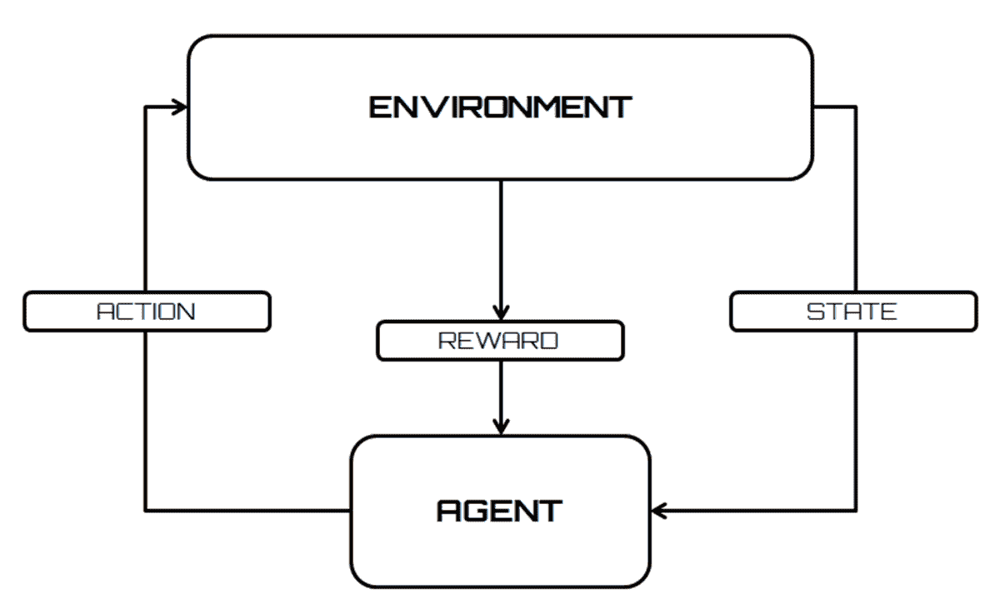
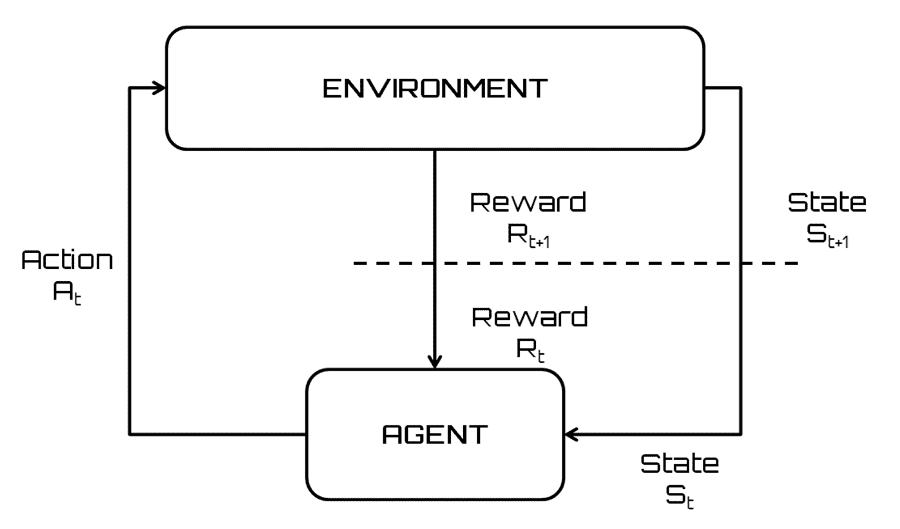
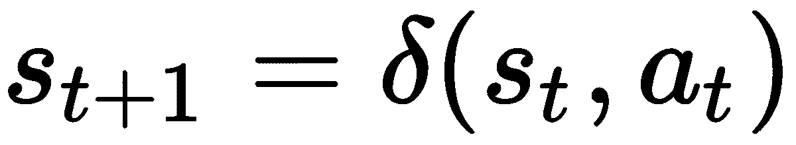
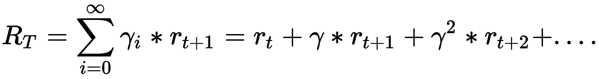
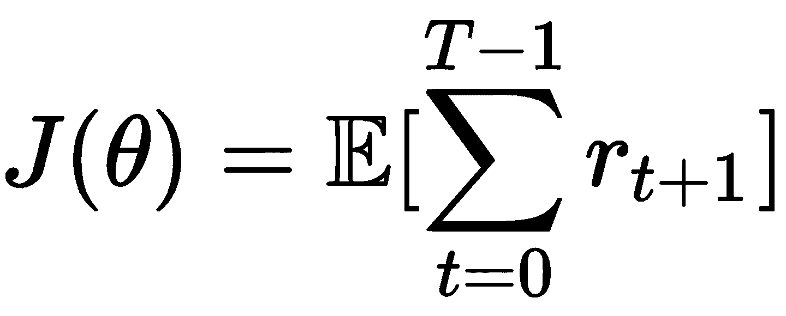
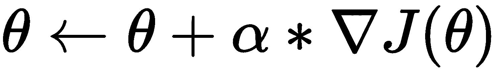

# 第二章：强化学习的构建模块

基于强化学习的算法的主要目标是学习并适应环境的变化。为了实现这一目标，我们利用环境根据算法做出的选择生成的外部反馈信号（奖励信号）。在这种情况下，算法推荐的正确选择将会获得奖励，而错误的选择将会受到惩罚。所有这些操作都是为了实现最佳的结果。在本章中，你将会了解构建模型的智能体与环境接口的概念。在本章结束时，你将准备好深入研究马尔可夫决策过程。我们还将探索策略的基本概念，并通过应用策略梯度来提升结果。

在本章中，我们将涵盖以下主题：

+   智能体与环境的接口

+   理解马尔可夫决策过程

+   解释策略

+   探索策略梯度方法

# 智能体与环境接口

在强化学习中，智能体学习并适应环境的变化。这种编程技术的基础源于根据算法选择接收外部刺激的概念。正确的选择会带来奖励，而错误的选择会带来惩罚。系统的目标是实现最佳的结果。

这些机制源自机器学习的基本概念（从经验中学习），旨在模拟人类推理。事实上，在我们的脑海中，我们激活了大脑机制，促使我们追逐并重复那些带来满足感和幸福感的体验。每当我们经历愉悦的时刻（如食物、音乐、艺术等），我们的脑部会分泌一些物质，这些物质通过强化同样的刺激来加深这种体验。伴随着这种神经化学强化机制，我们的记忆会记住这一经历，以便将来能够重新体验这些感觉。进化为我们提供了这种机制，使我们能够重复对我们有益的经历。

这就是为什么我们记得生活中重要的经历，特别是那些带来巨大奖励的经历，它们成为我们记忆的一部分，并影响我们未来的探索。根据所使用的学习信号的性质或系统返回的反馈类型，学习经验可以通过数值算法以不同方式进行模拟。

在监督学习中，系统有一个教师，告诉它正确的输出是什么。实际上，并不总是有一个导师引导我们做出选择。通常，我们只能获得定性的反馈信息，了解环境如何回应我们的行为。这些信息被称为强化信号。系统不会提供关于如何更新智能体行为（即权重）的任何信息。你不能定义代价函数或梯度。系统的目标是创建能够从经验中学习的智能代理。在下图中，我们可以看到展示强化学习如何与环境交互的流程图：



科学文献对于强化学习是否作为一种范式的分类持不确定态度。事实上，在其初期阶段，它被视为监督学习的一个特例，直到完全被推广为机器学习算法的第三大范式。它应用于监督学习效率低下的不同场景：与环境交互的问题就是一个明显的例子。

我们需要遵循以下步骤来正确应用强化学习算法：

1.  准备智能体。

1.  观察环境。

1.  选择最佳策略。

1.  执行动作。

1.  计算相应的奖励（或惩罚）。

1.  开发更新的策略（如果需要）。

1.  反复执行*步骤 2 - 5*，直到智能体学会最佳策略。

强化学习基于一个心理学理论，该理论源自一系列对动物进行的实验。特别是，美国心理学家爱德华·桑代克（Edward Thorndike）指出，如果一只猫在表现出被认为正确的行为后立即获得奖励，那么猫重复这一行为的概率会增加。然而，面对不想要的行为时，施加惩罚则会降低猫重复该行为的概率。

基于这一理论，强化学习试图最大化执行某个行为或一组行为时获得的奖励，以便实现某个特定目标。

强化学习可以看作是实现目标的交互问题的特例。必须实现目标的实体被称为智能体。智能体必须与之交互的实体被称为环境，它对应着智能体外部的一切。

到目前为止，我们一直关注术语“智能体”，但它代表什么呢？智能体（软件）是一个代表其他程序执行服务的软件实体，通常是自动和隐形的。这些软件也被称为智能代理。

以下是智能体最重要的特征：

+   它可以选择对环境执行的动作，动作可以是连续的或离散的。

+   执行的动作取决于情况。情况在系统状态中得到总结。

+   代理持续监控环境（输入），并不断改变状态。

+   选择动作并非 trivial（微不足道），需要一定程度的“智能”。

+   代理具有智能记忆。

代理有目标导向的行为，但它在不确定环境中如何行动是事先无法知道的。代理通过与环境的互动来学习。规划可以在代理通过其测量了解环境时逐步开发。这一策略与试错理论接近。

试错理论是解决问题的一个关键方法。试验会不断重复，直到代理成功或停止尝试。

代理与环境的互动是持续的，因为代理选择要采取的行动，并且环境会改变状态，呈现出代理将面临的新情况。

在强化学习的情况下，环境为代理提供奖励。奖励的来源必须是环境，以避免形成个人强化机制，这样会妨碍学习。

奖励的值与行动在达成目标方面的影响成正比，因此在正确的行动下奖励是正向或高的，在错误的行动下奖励是负向或低的。

以下是一些现实生活中的例子，其中代理和环境通过互动解决了特定问题：

+   一个棋手，每一步都能提供关于对手可能采取反击的提示。

+   一只小长颈鹿，几小时内可以学会站起来并以每小时 50 公里的速度奔跑。

+   一台真正的自主机器人学会在房间里移动，从而能够走出房间。

+   炼油厂的参数（如油压、流量等）实时设置，以便我们获得最大产量或最高质量。

所有这些例子有以下共同特点：

+   与环境的互动

+   代理的目标

+   环境的不确定性或部分知识

从中可以得出以下观察：

+   代理从自身经验中学习

+   行为会改变状态（情况）以及未来可以做出多少变化（延迟奖励）。

+   一项行为的效果无法完全预测。

+   代理具有对其行为的全局评估。

+   代理必须利用这些信息来改善其选择。这些选择随着经验的积累而改进。

+   问题可以有有限或无限的时间范围。

本质上，代理通过其传感器从环境中接收感知。根据其感受，代理决定在环境中采取什么行动。根据其行动的即时结果，代理可能会得到奖励。

如果你想使用自动学习方法，你需要给出环境的正式描述。知道环境的具体构成并不重要——有趣的是对环境的属性做出一般性假设。在强化学习中，通常假设环境可以用马尔可夫决策过程来描述。让我们来学习一下。

# 理解马尔可夫决策过程

为了避免负载问题和计算困难，代理-环境交互被视为马尔可夫决策过程。**马尔可夫决策过程**是一个离散时间随机控制过程。

**随机过程**是用于研究遵循随机或概率法则的现象演化的数学模型。在所有自然现象中，已知由于其本质以及观察误差，存在随机或偶然成分。这个成分表明，在每一时刻 *t*，观察现象的结果是一个随机数或随机变量 *st*：无法确定地预测结果是什么；我们只能说它将取多个可能值中的一个，每个值都有一个给定的概率。

当选择某一时刻 *t* 的观察时，若一个随机过程被认为是马尔可夫过程，则从 *t* 开始，过程的演变仅依赖于 *t*，而与之前的时刻无关。因此，马尔可夫过程指的是在给定观察时刻的情况下，时刻决定了过程的未来演变，而这一演变不依赖于过去。

在马尔可夫过程中，每个时间步，过程处于某一状态 *s ∈ S*，代理可以选择状态 *s* 中可用的任何动作 *a ∈ A*。在下一时间步，过程会通过随机移动到新状态 *s'*，并给予代理一个相应的奖励 *r(s,s')*。

在以下图示中，我们可以看到马尔可夫决策过程中代理与环境的交互：



前面图示中的代理-环境交互可以总结如下：

+   代理与环境在离散的时间间隔上进行交互，t = 0, 1, 2… n。

+   在每个间隔时，代理接收环境状态的表示 *st*。

+   每个元素 *st S*，其中 *S* 是可能状态的集合。

+   一旦状态被识别，代理必须在 *A(st)* 中采取一个动作，其中 *A(st)* 是状态 *st* 中可能的动作集合。

+   采取行动的选择依赖于要实现的目标，并通过策略 *π*（折扣累积奖励）进行映射，该策略将每个状态 *s* 中的动作与 *A(s)* 关联。术语 *πt(s,a)* 表示在状态 *s* 中执行动作 *a* 的概率。

+   在接下来的时间间隔 *t + 1* 中，作为行动的结果，代理会收到一个数值奖励，*rt + 1 R*，对应于之前采取的行动。

+   现在，行动的结果代表新的状态 *st*。此时，代理必须对状态进行编码，并根据将要采取的行动做出选择。

+   这个迭代会不断重复，以便代理达到目标。

状态 *st + 1* 的定义取决于前一个状态和所采取的行动（MDP），如下所示：



在公式中，δ 代表状态函数。

总结来说，我们可以陈述以下内容：

+   在马尔可夫决策过程中，代理可以感知它所处的状态 *s S*，并且有一组可用的行动。

+   在每个离散时间间隔 *t* 中，代理会检测当前状态 *st* 并决定执行某个动作 *A*。

+   环境通过提供奖励（强化）*rt = r (st, at)* 并进入状态 *st + 1 = δ (st, at)* 来做出回应。

+   r 和 δ 函数是环境的一部分；它们仅依赖于当前的状态和行动（而非之前的状态和行动），且不一定为代理所知。

+   强化学习的目标是学习一个策略，对于系统所处的每个状态 *s*，为代理指定一个行动，以便它能够最大化在整个行动序列中获得的总强化。

让我们更详细地讨论一下我们使用的一些术语：

+   奖励函数定义了强化学习问题中的目标。它将环境检测到的状态映射为一个数值，从而定义了奖励。正如我们之前提到的，唯一的目标是最大化它在长期内获得的总奖励。奖励函数决定了哪些行动对代理是正面的，哪些是负面的。奖励函数需要是正确的，并且可以作为改变策略的基础。如果策略建议的行动返回较低的奖励，那么在下一步中，可以修改策略以在相同情况下建议其他行动。

+   策略定义了学习代理在给定时间的行为。它将检测到的环境状态和在这些状态下应采取的行动进行映射。这对应于心理学中所谓的刺激反应规则或关联。策略是强化学习代理的核心部分，因为它足以决定行为。

+   值函数表示某个状态对于代理的价值。它等于从状态 *s* 开始，代理预期获得的总奖励。值函数依赖于代理为所要执行的动作选择的策略。

+   动作值函数返回一个值，即在某一状态 *s* 下，按照策略执行动作 *a* 后的预期回报（总体奖励）。

在下一节中，我们将学习如何最大化在学习过程中获得的总强化。

# 折扣累积奖励

在*马尔可夫决策过程*部分，我们提到过，强化学习的目标是学习一个策略，对于每个状态*s*，在该状态下，指定一个动作给代理，以便它能够最大化在整个动作序列中获得的总强化。那么，我们如何在整个动作序列中最大化获得的总强化呢？

从策略中获得的总强化计算如下：


这里，r[T]表示驱动环境进入终止状态 s[T]的动作的奖励。

解决这个问题的一个可能方法是将提供最高奖励的动作与每个状态关联；也就是说，我们必须确定一个最优策略，以便最大化前述量。

对于在有限步数内无法到达目标或终止状态的问题（持续任务），Rt 会趋向于无限大。

在这些情况下，我们希望最大化的奖励和会在无穷大处发散，因此这种方法不可行。由于这个原因，有必要开发一种替代的强化技术。

最适合强化学习范式的技巧是折扣累积奖励，它试图最大化以下量：



这里，γ被称为折扣因子，代表未来奖励的重要性。该参数可以取值 0 ≤ γ ≤ 1，具有以下含义：

+   如果γ < 1，序列*rt*将收敛到一个有限值。

+   如果γ = 0，代理将不关心未来的奖励，而是尝试最大化当前状态的奖励。

+   如果γ = 1，代理将尽力增加未来奖励，即使这会以当前的奖励为代价。

折扣因子可以在学习过程中进行修改，以突出特定的动作或状态。一个最优策略可以导致执行单一动作时获得的强化较低（甚至为负），前提是这会导致更大的强化。当你希望收集有用信息时，探索环境是一种正确的方式。然而，在某些情况下，这也是一个计算开销较大的过程，所以我们来看一下如何处理这个问题。

# 探索与利用

理想情况下，代理必须将每个动作与相应的奖励*r*相关联，以选择最有奖励的行为来实现目标。对于复杂问题，这种方法是不实际的，因为状态数量特别高，且可能的关联以指数级增长。

这个问题被称为**探索-开发**困境。理想情况下，代理必须探索每个状态下所有可能的行为，并找到当其被开发时奖励最多的行为。

因此，决策涉及一个根本性的选择：

+   **开发**：根据当前信息做出最佳决策。

+   **探索**：这会收集更多信息。

在这个过程中，最好的长期策略可能需要在短期内做出相当大的牺牲。因此，有必要收集足够的信息来做出最佳决策。

探索-开发困境在我们尝试学习新事物时总会有所启示。通常，我们必须决定是选择我们已经知道的东西（开发），从而让我们的文化包袱保持不变，还是选择新的东西，转而通过这种方式来学习（探索）。第二种选择有可能使我们做出错误的决策。这是我们经常面临的一个经历；例如，想一想我们在餐厅选择菜单时所做的决策：

+   我们可以选择已经了解的东西，过去曾给我们带来已知的满足感和奖励（开发），比如比萨饼（谁不知道玛格丽塔比萨的美味呢？）。

+   我们可以尝试一些以前从未品尝过的新东西，看看会有什么收获（探索），比如千层面（唉，并不是每个人都知道千层面碗中的神奇味道）。

我们做出的选择将取决于许多边界条件：菜肴的价格、我们的饥饿程度、我们对菜肴的了解等等。重要的是，研究如何做出这种选择的最佳方法表明，最佳学习有时需要我们做出错误的选择。这意味着，有时你必须选择避免你认为最有回报的行动，而选择一个你认为回报较少的行动。其逻辑是，这些行动对于获得长期利益是必要的：有时候，你需要弄脏你的双手才能学到更多。

以下是一些在实际案例中采用此技术的更多示例：

+   选择商店：

    +   **开发**：去你最喜欢的商店

    +   **探索**：尝试新商店

+   选择路线：

    +   **开发**：选择你已知的最佳路线

    +   **探索**：尝试一条新路线

在实践中，对于非常复杂的问题，收敛到一个非常好的策略可能太慢。解决这个问题的一个好方法是找到探索和开发之间的平衡：

+   一个仅限于探索的代理将在每个状态下始终采取随意的行动，显然收敛到一个最优策略是不可能的。

+   如果一个代理仅仅进行少量探索，它将总是使用它通常会使用的行为，这可能不是最优的。

在每一步，代理都必须在重复迄今为止的做法和尝试新的方法之间做出选择，后者可能会获得更好的结果。

在选择要执行的动作时，策略至关重要。在下一节中，我们将通过分析在寻找最佳策略时可以使用的不同方法来进一步探讨这一点。

# 解释策略

正如我们在*马尔可夫决策过程*部分提到的，策略定义了学习代理在某一时刻的行为。它将环境中检测到的状态与在这些状态下采取的行动对应起来。策略是强化学习代理的核心部分，因为仅凭策略就足以决定行为。策略在代理需要做出选择时至关重要。事实上，一旦获得观察结果，接下来的决策就是基于策略来做出的。在这种情况下，我们不需要状态的值或特定动作的值——我们只需要考虑能够实现总奖励的策略。

策略可以是确定性的，即对于给定状态采取相同的动作；也可以是概率性的，即基于某些分布计算在状态之间选择的动作。

为了更好地理解策略的含义，我们来看一个例子。假设我们需要实现一个算法，让送货车辆从商店开到顾客家里。我们可以定义以下元素：

+   道路地图是环境。

+   车辆的当前位置是一个状态。

+   策略就是代理为完成任务所采取的行动。

现在，我们提供一些我们的车辆可以采用的策略示例，以完成任务，比如送货：

+   **策略 1**：不受控制的车辆将随机移动，直到它们偶然到达正确的地方（顾客家）。在这里，可能会消耗大量燃料，且送货过程会持续很长时间。

+   **策略 2**：其他车辆可以学会只在主干道上行驶，从而行驶更长的距离。

+   **策略 3**：受控车辆将通过选择一条能将它们带到目的地的路线来规划路线，从而行驶较少的道路。

显然，一些策略优于其他策略，且有许多方法可以评估它们，即状态的函数值和值-行动函数。目标是学习最佳策略。策略可以通过两种方式来接近：**策略迭代**和**策略搜索**。这两种技术的主要区别在于价值函数的使用。在接下来的部分中，我们将详细分析这两种方法。

# 策略迭代

策略迭代是一种动态规划算法，使用价值函数来建模每对动作-状态的期望回报。强化学习中的许多技术都基于这一技术，包括 Q 学习、TD 学习、SARSA、QV 学习等。这些技术通过立即奖励和下一个状态的（折扣后）价值来更新价值函数，这一过程称为**引导法**。因此，它们隐含了将*Q(s, a)*存储在表格中或使用近似函数技术的做法。

策略迭代通常应用于离散的马尔可夫决策过程，其中状态空间*S*和动作空间*A*都是离散且有限的集合。

从初始的 P[0]策略开始，策略迭代在以下两个阶段之间交替进行：

1.  **策略评估**：给定当前策略 P，估计动作价值函数 Q[P]。

1.  **策略改进**：基于 Q[P]计算更好的策略 P'，然后将 P'设为新的策略并返回到上一步。

当可以计算每个动作-状态对的动作价值函数时，采用贪婪策略改进的策略迭代会通过返回最优策略而收敛。实质上，反复执行这两个过程将一般过程收敛到最优解。

不幸的是，Q[P]价值函数并非总能被精确计算；通常只能通过样本进行估计。在这种情况下，必须在策略中引入一定程度的随机性，以确保对状态空间的充分探索。这些算法将价值函数存储在有限的表格中（表格方法）。这些算法的局限性在于，它们无法应用于连续马尔可夫决策过程的情况。此外，在某些离散情况下，如果状态-动作空间的基数过高，这些方法也可能无法使用。让我们看看另一种解决这一问题的方法。

# 策略搜索

在策略搜索方法中，存储的是一个参数化的策略，但不使用或估计价值函数。策略搜索方法可以依赖于使用基于轨迹的采样的展开策略。其他策略搜索方法则使用如进化算法等优化技术来搜索最优策略参数。策略梯度方法就是策略搜索的一个例子。让我们详细看看这些方法。

# 探索策略梯度方法

策略梯度是一类基于参数化策略的强化学习算法。其思想是计算每个参数相对于预期回报梯度（奖励），从而在有利的方向上调整参数，以提高性能。该方法没有传统强化学习中的问题，如缺乏值函数保证、状态不确定性带来的问题以及连续空间中状态和动作的复杂性。在策略搜索方法中，不使用或估计值函数。值函数可以用来学习策略参数；然而，动作选择时并不一定需要它。策略梯度方法通过直接寻找最优策略，绕过了与基于值函数的技术相关的所有问题。

应用策略梯度方法的优点如下：

+   连续状态和动作可以视作离散情况处理，学习性能通常会提高。

+   文献中有各种不同的算法，它们具有强大的理论基础。

+   即使没有使用特定的状态估计器，状态不确定性也不会降低学习过程的效果。

应用策略梯度方法的缺点如下：

+   学习率可以决定收敛速度的数量级。

+   它们需要非常快速地更新数据，以避免在梯度估计器中引入错误。这意味着样本数据的使用效率不高。

实际中，策略梯度返回的是我们需要修改算法参数的方向，以改善策略并最大化总的累积奖励。这个梯度等于所选动作的对数概率的梯度。换句话说，我们希望增加那些能带来良好总奖励的动作的概率，并减少那些带来负面结果的动作的概率——我们保留有效的部分，剔除无效的部分。

正如我们在*马尔可夫决策过程*部分提到的，选择要执行的动作取决于要实现的目标，并通过表示为π的策略（折扣累积奖励）映射， π将每个状态 s 下的动作与 a ∈ A(s)关联。术语πt(s,a)表示在状态*s*下执行动作*a*的概率。

该过程的目的是通过使用θ参数对策略进行参数化，这样我们就可以确定在状态*s*下的最佳动作*a*。这个策略函数将定义为πθ(s,a)。

为了找到最优策略，我们将使用一个神经网络，该网络将输入状态并输出该状态下每个动作的概率。这个概率将用于从该分布中采样一个动作，并在该状态下执行该动作。没有任何信息告诉我们，所采样的动作是执行该状态下的正确动作。然后，我们执行该动作并记录奖励。这个过程将对每个状态重复进行。获取的数据将作为我们的训练数据。在此时，为了更新梯度，我们将使用一个基于梯度下降的算法。

通过这样做，在某一状态下返回高奖励的动作将具有较高的概率，而低奖励的动作将具有较低的概率。

与所有梯度下降方法一样，参数向量按照性能度量的梯度方向进行更新。在此情况下，性能的度量由以下公式给出：



在上述公式中，*E* 是期望回报，*r* 是奖励。我们的目标是学习一个能够最大化累积未来奖励的策略。期望回报的梯度被称为策略梯度，我们将利用它来更新 θ 参数，如下所示：



这里，我们有以下内容：

+   θ 是参数

+   ∇ 是期望回报的梯度

+   α 是学习率

每次学习迭代时都会执行参数更新。梯度下降算法保证至少会收敛到一个局部最优解。

一般的策略梯度算法可以总结如下：

```py
set initial policy parametrization
repeat until converge
    generate N trajectories following a policy πθ
    compute policy gradient estimate
    update the parameter θ
```

在接下来的部分，我们将分析一些基于策略梯度的方法，即**蒙特卡洛策略梯度**和**演员-评论员方法**。

# 蒙特卡洛策略梯度

蒙特卡洛策略梯度，亦称为**REINFORCE**，是一类用于与随机单元连接的网络的关联强化学习算法。研究表明，在具有即时强化的任务中，且在一些限制条件下，甚至在一些具有延迟强化的任务中，这些算法能够在期望强化的梯度方向上进行参数调整。由于其特性，这些算法能够与其他梯度下降方法，尤其是反向传播方法，轻松结合。主要的缺点是它们无法区分局部（全局）最大值（最小值），且没有通用的收敛理论。

在这类算法中，智能体通过当前策略生成一个情节轨迹，并利用该轨迹来更新策略参数。该算法提供了一种脱离策略的更新，因为必须完成完整的轨迹才能构建样本空间。

以下代码是 REINFORCE 算法的伪代码：

```py
Initialise θ randomly
For each episode
   For t=1:T-1
     calculate return
     update θ
```

如我们所见，不需要显式的探索。在这种情况下，通过神经网络计算概率后，探索会自动进行。首先，使用随机权重初始化网络，并返回均匀概率分布。该分布等价于随机智能体的行为。

为了减少梯度估计的方差同时保持偏差，可以通过从回报中减去基准值来修改 REINFORCE 算法。

现在，让我们看看基于策略梯度的另一种方法。

# Actor-critic 方法

Actor-critic 方法结合了策略搜索和价值函数估计，以便执行低方差的梯度更新。这些方法将记忆结构分开，使得策略与价值函数相互独立。策略模块被称为**演员**，因为它选择动作，而估计的价值函数模块被称为**评论员**，因为它对由策略执行的动作进行评估。从这一点来看，可以明确地看出学习是一种基于策略的方法，在这种方法中，评论员学习并评估所跟随的策略的执行结果。

通常，评论员是状态评估函数。每次选择动作后，评论员评估新状态，以确定事情是否比预期更好或更糟。

智能体执行两项任务，并通过两种不同的网络扮演两个角色：

+   **演员** 网络是根据评论员建议的方向，通过更新策略参数来确定在某一状态下需要执行的动作。

+   **评论员** 网络是评估该动作后果的网络，修改下一时间步的函数值，并更新价值函数参数。

环境通过输入传感器进行感知和测量。系统在状态的评估/估计过程中处理这些输入。然后，状态估计和任何奖励会传递给智能体。

以下是 Actor-critic 算法的伪代码：

```py
Initialize parameters randomly
For t=1:T
    Sample reward and next state
    Sample the next action
    Update the policy parameters
    Compute the correction for action-value at time t
    Use the correction to update the parameters of action-value function
    Update action and state
```

如我们所见，评论员网络和演员网络在每一步都进行更新。

# 总结

在本章中，我们学习了如何基于马尔可夫过程构建模型的基础知识。马尔可夫决策过程是一个由五个元素组成的随机过程：时刻、状态、动作、转移概率和奖励。过程的路径由一个控制的智能体来决定。在路径的某个特定点和时刻，*t*，智能体介入并做出决定，这个决定将影响过程未来的演变。这些时刻称为决策的时刻，而所做的决策则具有动作的含义。

接着，我们发现了定义学习智能体在特定时刻行为的策略。它映射了环境的检测状态以及在这些状态下应该采取的行动。策略是强化学习智能体的核心部分，因为单凭它就足以决定行为。策略可以通过两种方式来处理：**策略迭代**和**策略搜索**。这两种技术的主要区别在于它们对价值函数的使用。

最后，我们学习了如何基于策略梯度方法构建模型，也就是基于使用参数化策略的一类强化学习算法。其核心思想是计算相对于每个参数的期望回报梯度（奖励），以便在某个方向上调整参数，从而提高性能。

在下一章，我们将看到马尔可夫决策过程的实际应用。我们将深入理解马尔可夫决策过程的概念，并理解智能体与环境的交互过程。接下来，我们将学习如何使用贝尔曼方程作为最优价值函数的一致性条件，从而确定最优策略。最后，我们将发现并实现马尔可夫链，并学习如何使用它们来模拟随机游走。
