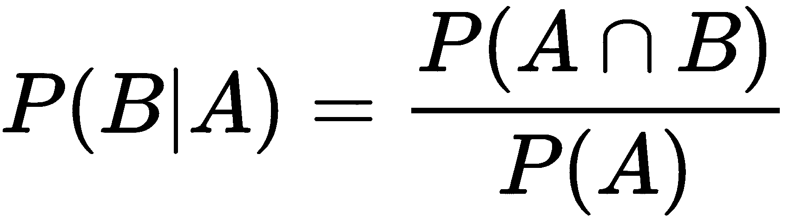
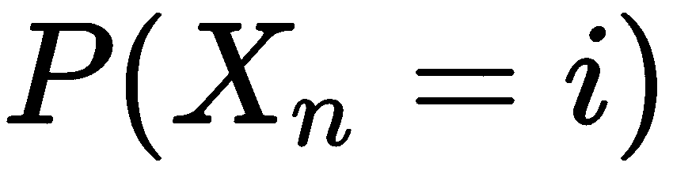

# 第三章：马尔科夫决策过程实践

随机过程涉及根据概率法则随时间（或更广泛地，随空间）演变的系统。此类系统或模型描述了具有随机性的现实世界复杂现象。这些现象比我们想象的更常见。当我们感兴趣的量无法被绝对确定地预测时，我们便遇到这些现象。然而，当这些现象表现出多种可能的结果，并且能够以某种方式被解释或描述时，我们便可以引入该现象的概率模型。

马尔科夫链是一种随机过程，其中系统的演变仅依赖于其当前状态，而不依赖于其过去状态。马尔科夫链由一组状态和状态之间转移发生的概率所表征。可以想象一个点在一条线上沿着离散时间间隔随机向前或向后移动，每个时间间隔覆盖一定的距离。

在本章中，我们将深入理解马尔科夫过程的概念。我们将详细分析随机马尔科夫过程。我们将介绍马尔科夫链，并学习如何利用这些算法进行天气预测。最后，我们将学习如何评估解决马尔科夫奖励问题的最优策略。

本章将涵盖以下主题：

+   马尔科夫过程概述

+   马尔科夫链简介

+   马尔科夫链应用 —— 天气预测

+   马尔科夫奖励模型

# 技术要求

查看以下视频，查看代码的实际应用：

[`bit.ly/36xyVLj`](http://bit.ly/36xyVLj)

# 马尔科夫过程概述

正如我们在第二章《强化学习的构建模块》中提到的，当选择某一时刻 *t* 进行观察时，随机过程被称为**马尔科夫过程**。从 *t* 开始的过程演变仅依赖于 *t*，而不依赖于之前的任何时刻。因此，当给定观察时刻后，只有该时刻决定了过程的未来演变，而该演变不依赖于过去时刻时，过程就是马尔科夫过程。在接下来的部分，我们将探索随机过程的概念，并看到它如何与概率论相关联。

# 理解随机过程

为了提供马尔科夫过程的正式定义，有必要明确什么是具有时间顺序的随机变量集合。这样一个随机变量集合最好通过一个随机过程来表示。

随机过程理论研究的是那些根据概率法则随时间（但也可以更一般地随空间）演变的系统。这类系统或模型描述了现实世界中那些可能是随机的复杂现象。这样的现象比我们想象的更为频繁，我们在面对那些我们无法确定预测的量时，常常会遇到这种情况。我们定义了一个在离散时间和离散状态下的随机过程，它由以下随机变量构成：


在前面的序列中，每个 *X[n]* 都是一个离散随机变量，取值来自一个集合 *S = s[1], s[2],…, s[n],* 这个集合被称为**状态空间**。为了不失一般性，假设 *S* 是整数集 *Z* 的子集。随着索引 *n* 的变化，每个 *X[n]* 的值将代表系统随时间变化的状态。我们将要分析的过程从任何由 *X[n]* 表示的状态开始，并将转移到下一个状态 *X[n + 1]*。每一次转移称为**一步**。

随着时间的推移，过程可以从一个状态跳跃到另一个状态。如果第 *n* 步处于状态 *i*，而在下一步 *n + 1* 处于状态 *j ≠ i*，我们可以说发生了转移。

# 计算概率

给定一个随机过程（*X[n]*），我们感兴趣的是计算与之相关的概率。现在，让我们探讨概率的基本概念。如果你已经了解这些概念，可以跳过本节内容。不管怎样，本节内容将帮助你探索概率论的基础知识。

给定事件发生的**概率**（**先验概率**）是事件本身的有利情况数（*s*）与所有可能情况总数（*n*）的比率，前提是所有考虑的情况具有相等的概率：


让我们看一个简单的例子：

+   在掷骰子的过程中，掷出 3 的概率是多少？可能的情况数是 6，{1, 2, 3, 4, 5, 6}，而符合条件的情况数是 1，即 {3}。所以，P(3) = 1/6 = 0.166 = 16.6%。

事件的概率 *P(E)* 总是介于 0 和 1 之间，可以如下表示：


极值的定义如下：

+   概率为 0 的事件称为不可能事件。假设我们有六个红球在一个袋子里，那么抽到黑球的概率是多少？可能的情况数是 6，符合条件的情况数是 0，因为袋子里没有黑球。因此，*P(E) = 0/6 = 0*。

+   概率为 1 的事件称为必然事件。假设我们有六个红球在一个袋子里，那么抽到红球的概率是多少？可能的情况数是 6，符合条件的情况数是 6，因为袋子里只有红球。因此，*P(E) = 6/6 = 1*。

到目前为止，我们已经讨论了事件发生的可能性，那么如果有多个可能的事件会发生呢？如果事件 A 的发生概率不依赖于事件 B 是否发生，且反之亦然，那么两个随机事件 A 和 B 是独立的。

举个例子，假设我们有两副 52 张的法国扑克牌。当从每副牌中抽出一张卡片时，以下两个事件是独立的：

+   **E1**: 从第一副牌中抽出的卡片是一个王牌。

+   **E2**: 从第二副牌中抽出的卡片是一张梅花牌。

每个事件都可以以相同的概率发生，且不受另一个事件发生的影响。

相反，如果事件 A 的发生概率依赖于事件 B 是否发生，那么事件 A 就依赖于事件 B。假设我们有一副 52 张的牌；如果连续抽出两张卡片且不将第一张卡片放回牌堆，以下两个事件是相关的：

+   **E1**: 第一张抽出的卡片是一个王牌。

+   **E2**: 第二张抽出的卡片是一个王牌。

精确地说，E2 的概率取决于 E1 是否发生，具体如下：

+   E1 的概率是 4/52。

+   如果第一张卡片是王牌，那么 E2 的概率是 3/51。

+   如果第一张卡片不是王牌，那么 E2 的概率是 4/51。

# 理解联合概率

现在，让我们来处理**联合概率**的情况，既包括独立事件，也包括相关事件。给定两个事件 A 和 B，如果这两个事件是独立的（即一个事件的发生不会影响另一个事件的概率），那么事件的联合概率等于 A 和 B 的概率的乘积：


让我们来看一个例子。我们有两副 52 张的扑克牌。当从每副牌中抽出一张卡片时，让我们考虑这两个独立的事件：

+   A: 从第一副牌中抽出的卡片是一个王牌。

+   B: 从第二副牌中抽出的卡片是一张梅花牌。

两个事件都发生的概率是多少？

+   P(A) = 4/52

+   P(B) = 13/52

+   P(A ∩ B) = 4/52 * 13/52 = 52 / (52 * 52) = 1/52

如果两个事件是相关的（即一个事件的发生会影响另一个事件的概率），那么可以应用相同的规则，只要 P(B|A)是事件 B 在事件 A 发生的条件下的概率。这个条件引入了条件概率，我们将深入探讨：


一个袋子里有两个白球和三个红球。从袋子里连续抽出两颗球，且不将第一颗抽出的球放回袋中。

让我们计算抽出的两颗球都是白球的概率：

+   第一颗球是白色的概率是 2/5。

+   如果第一颗球是白色的，那么第二颗球是白色的概率是 1/4。

两颗球都是白球的概率如下：

+   P(两颗白球) = 2/5 * 1/4 = 2/20 = 1/10

# 理解条件概率

现在，是时候向你介绍条件概率的概念了。事件 B 发生的概率，在事件 A 发生的条件下计算，被称为条件概率，用符号 P(B | A)表示。它是通过以下公式计算的：



现在我们能够理解不同种类的概率了，让我们将它们应用到随机过程上。我们从最简单的概率类型开始，它写作以下形式：



这表示在第 n 步时观察系统处于状态 i 的概率。除了这些简单的概率之外，我们应该对计算涉及多个步骤的更复杂概率感兴趣。

例如，计算在第 n + 1 步处于状态 j 的概率，知道在第 n 步时它处于状态 i，可能是很有意思的（正如我们所看到的，这就是我们之前定义的条件概率）：


这被称为从 i 到 j 在第 n 步的转移概率。通过条件概率定义，它可以重写如下：


因此，对于这个计算，知道先验概率和联合概率就足够了。要计算更复杂的表达式，需要知道通过以下公式给出的通用联合概率：


所有这些都源于整数集合 Z 中所有 i[0],...,i[n]的变化。从某种意义上讲，这些概率消耗了所有可能的信息：当所有联合（离散）密度已知时，随机过程在统计上是确定的，也就是说，已知所有多个离散变量（X[1], ..., X[n]）的密度对所有 i[0],...,i[n] Z 的变化。计算这些联合概率通常是一个非常困难的问题。

在下一节中，我们将深入探讨马尔可夫过程背后的概念。

# 马尔可夫链简介

马尔可夫链是一个随机现象的数学模型，它随时间演变，以这样的方式：过去通过现在仅影响未来。时间可以是离散的（整数变量）、连续的（实数变量），或完全有序的整数。在本节中，我们将只考虑离散链。马尔可夫链由安德烈·安德烈耶维奇·马尔可夫（1856–1922）在 1906 年引入，这也是该名称的由来。

马尔可夫链是一种随机模型，表示可能的案例序列，其中每个案例发生的概率仅依赖于相对于前一个案例的状态。因此，马尔可夫链具有**无记忆性**特性。

让我们考虑一个由随机变量序列 X = X[0], ..., X[n]描述的随机过程，它可以在一个集合中取值，即 j[0], j[1], …, jn。假设我们分析的过程具有马尔科夫性质，即过程未来的演化只依赖于当前状态的值，而不依赖于过去的历史。在公式中，使用条件概率，我们将得到以下表达式：


如果所有的参数都是良好定义的条件概率，那么这个关系必须适用于所有参数。一个具有马尔科夫性质的离散时间随机过程 X 被称为马尔科夫链。如果转移概率满足以下条件，则该马尔科夫链是齐次的：


这与 n 无关，仅与 i 和 j 有关。当这种情况发生时，我们得到以下结果：


我们可以通过知道概率 p[ij] 和以下初始分布来计算所有的联合概率：


这个概率被称为**过程在零时刻的分布**。p[ij] 概率被称为转移概率，而 p[ij] 是从状态 i 到状态 j 在一个时间步长内发生转移的概率。

# 理解转移矩阵

研究齐次马尔科夫链在使用矩阵表示时变得特别简单且有效。特别是，前述命题所表达的公式变得更加易于阅读。由于这一点，马尔科夫链的结构可以通过以下转移矩阵完全表示：


转移概率矩阵的性质直接来源于构成它们的元素的特性。事实上，通过观察矩阵的元素是概率，它们必须在 0 和 1 之间。因此，这是一种正矩阵，其中每一行元素的和为 1。事实上，第 i 行的元素是链在时刻 t 处于状态 Si 时，下一步转移到 S1 或 S2，...或 Sn 的概率。这些转移是互斥的，并且涵盖了所有可能性。这样的矩阵（每行和为 1 的正矩阵）被称为**随机矩阵**。因此，我们需要将每个正行向量定义为随机矩阵，如下所示：


在这个向量中，元素的和取值为 1，如下式所示：


现在，我们将看到，在一维随机游走的情况下，这个矩阵采用了特定的形式。如以下图所示，在一维随机游走中，我们研究的是一个类点粒子的运动，它被限制只能沿着直线在两个允许的方向（右和左）上移动。在每次运动中，它以固定的概率 p 随机向右移动一步，或以概率 q 向左移动一步，使得 p+q=1。每一步的长度相等，并且与其他步独立：


假设随机变量 Z[n]，其中 n = 1,2, ..，是独立的并且具有相同的分布。因此，粒子在时刻 n 的位置由以下公式给出：


这里，X[0] = 0。状态空间为 S = (0, ±1, ±2,…)。X[n]过程是一个马尔可夫链，因为，为了确定粒子下一个时刻处于某个位置的概率，我们只需要知道它在当前时刻的位置，即使我们知道它在当前时刻之前的所有时刻的位置。这一概念可以通过以下方程表达：


这里，Zn 变量是独立的。转移矩阵是一个行数有限且列数相等的矩阵，其中主对角线上是 0，主对角线上的上方是 p，下方是 q，其他地方都是 0，公式如下所示：


在这里，我们可以看到，这一概化极大地简化了当前的问题。

# 理解转移图

将马尔可夫链与转移矩阵的描述相对直观的替代方法是将马尔可夫链与一个有向图（转移图）关联。在这里，发生以下情况：

+   顶点通过 S1、S2、…、Sn 状态标记（或者简而言之，通过状态的索引 1、2、…、n 标记）。

+   如果且仅如果从 Si 到 Sj 的转移概率为正，则存在一个有向边将顶点 Si 连接到顶点 Sj（这个概率也作为边本身的标签）。

很明显，转移矩阵和转移图提供了关于相同马尔可夫链的相同信息。为了理解这种二重性，我们需要看一个简单的例子——考虑一个具有三个可能状态的马尔可夫链，即 1、2 和 3，及其以下的转移矩阵：


新引入的马尔可夫链的转移图可以在以下图中看到。我们可以识别出三个可能的状态：1、2 和 3。两状态边界包含转移概率 p[ij]。当两个状态之间没有边界时，表示转移的概率为零：


在上述图示中，我们可以看到从一个状态出来的箭头总和恰好为 1，就像转移矩阵中每一行的值必须加起来恰好为 1 —— 这代表了概率分布。通过比较转移矩阵和转移图，我们可以理解两者之间的对偶性。像往常一样，图示要比文字更具解释性。

在接下来的部分，我们将通过解决一个与马尔可夫链相关的预测问题来实践我们学到的内容。

# 马尔可夫链应用 —— 天气预测

为了应用我们迄今为止学到的内容，我们将查看一个基于马尔可夫链的天气预测模型。为了简化这个模型，我们假设只有三种状态——雨天、阴天和晴天。我们还假设我们已经进行了一些计算，并发现明天的天气某种程度上依赖于今天的天气，依据以下转移矩阵：


每一行必须包含非负数，且它们的和必须等于 1。回想一下，这个矩阵包含了条件概率，形式为 *P (A | B)*，即在给定 *B* 的情况下 *A* 发生的概率。因此，这个矩阵包含了以下条件概率：


这里，我们有以下几个属性：

+   *Ra*：雨天

+   *Cl*：阴天

+   *Su*：晴天

两天之间的天气状况不一定相关，因此该过程是马尔可夫过程。

此时，以下问题浮现在脑海中：

+   如果今天是晴天，我们如何计算未来几天变成雨天的概率？

+   在若干天之后，晴天和雨天的比例将会是多少？

这两个问题，以及可能浮现的其他问题，都可以通过使我们能够使用马尔可夫链的工具来解答。

以下是允许我们在特定初始条件下交替出现晴天、阴天和雨天的 R 代码：

```py
library(markovchain)
set.seed(1)
States <- c("Rainy","Cloudy","Sunny")
TransMat <- matrix(c(0.30,0.50,0.20,0.25,0.4,0.35,0.1,0.2,0.70),
                 nrow = 3, byrow = TRUE,dimnames = list(States,States))

MarkovChainModel <- new("markovchain",transitionMatrix=TransMat, states=States,
                    byrow = TRUE, name="MarkovChainModel")
MarkovChainModel

states(MarkovChainModel)
dim(MarkovChainModel)
str(MarkovChainModel)
MarkovChainModel@transitionMatrix

library(diagram)
plot(MarkovChainModel,package="diagram")

transitionProbability(MarkovChainModel, "Sunny", "Rainy")

StartState<-c(0,0,1)
After3Days <- StartState * (MarkovChainModel ^ 3)
print (round(After3Days, 3))
After1Week <- StartState * (MarkovChainModel ^ 7)
print (round(After1Week, 3))

steadyStates(MarkovChainModel)

YearWeatherState <- rmarkovchain(n = 365, object = MarkovChainModel, t0 = "Sunny")
YearWeatherState[1:40]
```

让我们逐行分析这段代码：

1.  第一行加载了库：

```py
library(markovchain)
```

请记住，如果需要安装 R 初始分发版中没有的库，必须使用`install.packages()`函数。这个函数只需使用一次，而不是每次运行代码时都使用。

1.  例如，要安装 `markovchain` 包，我们应该写如下代码：

```py
install.packages("markovchain")
```

这个函数从 CRAN 类的仓库或本地文件下载并安装软件包。相反，必须在每次在新的 R 会话中执行脚本时使用加载命令。

# 导入 markovchain 包

`markovchain`包包含我们可以用来创建和管理离散时间马尔可夫链的函数和 S4 方法。除此之外，还提供了可用于执行统计（拟合和绘制随机变量）和概率（分析其结构属性）分析的函数。从官方文档中提取的`markovchain`包的简要描述如下表所示：

| 版本 | 0.6.9.14 |
| --- | --- |
| 日期 | 2019-01-20 |
| 维护者 | Giorgio Alfredo Spedicato |
| 许可证 | GPL-2 |
| 作者 | Giorgio Alfredo Spedicato, Tae Seung Kang, Sai Bhargav Yalamanchi, Mildenberger Thoralf, Deepak Yadav, Ignacio Cordón, Vandit Jain, Toni Giorgino |

我们将在本书的多个章节中使用此包，以演示它所提供的功能的实用性。让我们开始吧：

1.  让我们继续分析代码：

```py
set.seed(1)
```

`set.seed()`命令设置 R 随机数生成器的种子。每当我们希望使示例可重现时，这都是必要的。当使用`set.seed()`时，算法中使用的随机数将始终相同，因此随后的算法重现将提供相同的结果。每个种子值将对应于为给定随机数生成器生成的值序列。

1.  在接下来的行中，我们定义天气条件的状态：

```py
States <- c("Rainy","Cloudy","Sunny")
```

如图所示，仅提供了三种状态：`Rainy`、`Cloudy`和`Sunny`。此时，我们需要定义天气条件的可能转移。

1.  接下来，我们根据本节开始时的内容来定义转移矩阵：

```py
TransMat <- matrix(c(0.30,0.50,0.20,0.25,0.4,0.35,0.1,0.2,0.70),nrow = 3, byrow = TRUE,dimnames = list(States,States))
```

记住，这个矩阵包含的是条件概率类型，表达式为*P(A | B)*，即给定*B*时*A*发生的概率。正如我们之前提到的，这个矩阵的行加起来等于 1。

1.  现在，我们可以创建`markovchain`对象：

```py
MarkovChainModel <- new("markovchain",transitionMatrix=TransMat, states=States, byrow = TRUE, name="MarkovChainModel")
```

`markovchain`类旨在处理同质马尔可夫链过程。以下槽将被传递：

+   `transitionMatrix`：包含转移矩阵概率的方阵。

+   `states`：状态的名称。它必须与转移矩阵的列名和行名相同。这是一个字符向量，列出了定义了转移概率的状态。

+   `byrow`：二进制标志。一个逻辑元素，指示转移概率是按行显示还是按列显示。

+   `name`：可选的字符元素，用于为离散时间马尔可夫链命名。

为了提供我们刚刚创建的模型的总结，请使用以下命令：

```py
MarkovChainModel
```

返回以下结果：

```py
MarkovChainModel
 A  3 - dimensional discrete Markov Chain defined by the following states:
 Rainy, Cloudy, Sunny
 The transition matrix  (by rows)  is defined as follows:
 Rainy Cloudy Sunny
Rainy   0.30    0.5  0.20
Cloudy  0.25    0.4  0.35
Sunny   0.10    0.2  0.70
```

如您所见，物体的维度、状态和转移矩阵已被打印出来。为了单独获取这些信息，我们可以使用一些与`markovchain`对象相关的方法：

1.  例如，要获取`markovchain`对象的状态，我们可以使用`states`方法，如下所示：

```py
states(MarkovChainModel)
```

返回以下结果：

```py
[1] "Rainy" "Cloudy" "Sunny"
```

1.  要获取`markovchain`对象的维度，我们可以使用`dim`方法，如下所示：

```py
dim(MarkovChainModel)
```

返回以下结果：

```py
[1] 3
```

1.  要查看我们创建的对象中包含哪些元素，我们可以使用`str()`函数，它显示了 R 对象内部结构的紧凑视图：

```py
str(MarkovChainModel)
```

打印以下结果：

```py
Formal class 'markovchain' [package "markovchain"] with 4 slots
 ..@ states          : chr [1:3] "Rainy" "Cloudy" "Sunny"
 ..@ byrow           : logi TRUE
 ..@ transitionMatrix: num [1:3, 1:3] 0.3 0.25 0.1 0.5 0.4 0.2 0.2 0.35 0.7
 .. ..- attr(*, "dimnames")=List of 2
 .. .. ..$ : chr [1:3] "Rainy" "Cloudy" "Sunny"
 .. .. ..$ : chr [1:3] "Rainy" "Cloudy" "Sunny"
 ..@ name            : chr "MarkovChainModel"
```

如我们所见，列出了四个槽：`states`、`byrow`、`transitionMatrix`和`name`。要检索每个槽中包含的元素，我们可以使用对象的名称（`MarkovChainModel`），后跟槽的名称，中间用`@`符号分隔。

1.  例如，要打印转移矩阵，我们将写如下代码：

```py
MarkovChainModel@transitionMatrix
```

返回以下结果：

```py
 Rainy Cloudy Sunny
Rainy   0.30    0.5  0.20
Cloudy  0.25    0.4  0.35
Sunny   0.10    0.2  0.70
```

正如我们在*转移图*部分所提到的，通过转移矩阵描述马尔可夫链的一个非常直观的替代方法是将马尔可夫链与有向图（转移图）关联。

# 导入`diagram`包

要绘制转移图，我们可以使用`diagram`包。这个包包含了几个用于可视化简单图（网络）和绘制流程图的函数。

我们可以在下面的表格中看到从官方文档提取的`diagram`包的简短描述：

| 版本 | 1.6.4 |
| --- | --- |
| 日期 | 2017-08-16 |
| 维护者 | Karline Soetaert |
| 许可证 | GPL-2 |
| 作者 | Karline Soetaert |

现在，让我们学习如何使用包中提供的函数来创建图：

1.  让我们从导入库开始：

```py
library(diagram)
```

1.  现在，我们可以创建名为`diagram`的`markovchain`对象：

```py
plot(MarkovChainModel,package="diagram")
```

打印以下图：


在前面的图中，我们可以看到，所有从状态中流出的箭头的总和始终等于 1，就像转移矩阵中每一行的值必须加起来等于 1 一样。这代表了概率分布。

# 获取转移概率

我们还可以从新开发的模型中提取转移概率，它表示从一个状态到另一个状态的概率。请记住，如果从一个状态到另一个状态的转移概率不依赖于时间索引，则称一个马尔可夫链是时间齐次的。要获取这些信息，我们将使用`transitionProbability()`函数，它可以帮助我们获取从初始状态到后续状态的转移概率。让我们开始吧：

1.  使用以下命令获取此信息：

```py
transitionProbability(MarkovChainModel, "Sunny", "Rainy")
```

返回以下结果：

```py
[1] 0.1
```

我们可以通过分析转移矩阵和转移图来验证这个结果。在转移矩阵中，从`Sunny`状态到`Rainy`状态的转移由元素`p31`给出，其值为 0.1。同样，在转移图中，从`Sunny`状态到`Rainy`状态的分支的值也为 0.1。

在正确设置好我们的基于马尔科夫链的模型后，接下来就是用它来做预测了。但首先，我们需要设定初始状态。假设我们从晴天（`Sunny`）状态开始。

1.  基于包含我们模型三种状态的向量，这个条件用向量 (0,0,1) 来表示。我们可以这样设置这个值：

```py
StartState<-c(0,0,1)
```

例如，为了计算 3 天后的天气状态，我们可以利用马尔科夫链的一个特性。如果 X[n] 是一个齐次马尔科夫链，具有转移概率 p[ij] 和初始分布 p^([0])，那么以下公式成立：


这个公式在向量形式下变成了如下：


在前面的公式中，p^([n]) 和 p^([0]) 是行向量，而 p^([0]) x P^([n]) 表示行向量与矩阵之间的乘积（行与列的乘积）。

1.  让我们用我们的模型来写出这个乘积：

```py
Pred3Days <- StartState * (MarkovChainModel ^ 3)
print (round(Pred3Days, 3))
```

返回以下结果：

```py
 Rainy Cloudy Sunny
[1,]  0.17  0.299  0.53
```

1.  这样，我们得到了一个三天的预测。为了得到一周的预测，我们将写下如下代码：

```py
Pred1Week <- StartState * (MarkovChainModel ^ 7)
print (round(Pred1Week, 3))
```

返回以下结果：

```py
 Rainy Cloudy Sunny
[1,] 0.184  0.319 0.497
```

我们从已开发的模型中还可以得到一个静态分布。一个马尔科夫链的静态分布是一个向量π，满足π⋅P = π（换句话说，π是由矩阵 P 保持不变的）。π是一个行向量，其元素是概率，总和为 1。这个概率分布在马尔科夫链随着时间演变时保持不变。

`markovchain` 包含一个特定函数，叫做 `steadyStates()` 函数，用来获取马尔科夫链的静态分布。我们来调用它：

```py
steadyStates(MarkovChainModel)
```

返回以下结果：

```py
 Rainy    Cloudy     Sunny
[1,] 0.1848739 0.3193277 0.4957983
```

最后，让我们学习如何从一个特定状态开始，逐日生成一整年的天气状态预测。为此，我们可以使用 `rmarkovchain()` 函数，它返回来自齐次或非齐次马尔科夫链的状态序列。让我们这样做：

```py
YearWeatherState <- rmarkovchain(n = 365, object = MarkovChainModel, t0 = "Sunny")
```

传入以下参数：

+   `n`: 样本大小

+   `object`: 一个 `markovchain` 或 `markovchainList` 对象

+   `t0`: 初始状态

此时，我们可以提取明年每一天的预测结果。让我们打印接下来的 40 天的预测结果：

```py
YearWeatherState[1:40]
```

返回以下结果：

```py
[1] "Sunny"  "Sunny"  "Sunny"  "Rainy"  "Cloudy" "Rainy"  "Sunny"  "Sunny"  "Sunny"  "Sunny"  "Sunny"
[12] "Sunny"  "Sunny"  "Sunny"  "Cloudy" "Sunny"  "Cloudy" "Rainy"  "Cloudy" "Rainy"  "Sunny"  "Sunny"
[23] "Sunny"  "Sunny"  "Sunny"  "Sunny"  "Sunny"  "Sunny"  "Cloudy" "Cloudy" "Sunny"  "Sunny"  "Sunny"
[34] "Sunny"  "Cloudy" "Sunny"  "Cloudy" "Cloudy" "Sunny"  "Sunny"
```

预测序列是明确定义的，从初始状态开始。

在下一部分，我们将开发使用奖励来扩展马尔科夫链特性的模型。

# 马尔科夫奖励模型

到目前为止，我们处理了马尔科夫过程、没有记忆的随机过程、一系列满足马尔科夫性质的随机状态等等。这个过程是通过状态空间 S 和转移函数 P 来定义的，后者决定了其动态。在这些模型中，没有与特定状态相关联的值能够帮助我们达成目标。

如果我们为每个状态添加一个奖励率，我们就得到了一个马尔可夫奖励模型，它表示一个扩展了马尔可夫链或连续时间马尔可夫链特性的随机过程。随时间累积的奖励（R）被记录在一个额外的变量中。这些概念在第二章，*强化学习的基本构建块*中介绍。现在，让我们尝试将这些概念应用于森林管理的实际案例。

# 微型森林管理问题

为了理解这些新修订的概念，我们将使用`MDPToolbox`包中的一个示例（`mdp_example_forest`）。该示例处理森林经营管理问题，并有两个主要目标：

+   第一个目标是保持一片古老的森林供野生动物栖息。

+   第二个目标是通过出售砍伐的木材赚取收入。

为了实现这些目标，可以选择两种行动：等待或砍伐。每 20 年周期决定一次行动，并在该周期开始时应用。

根据三个树木年龄组定义了三种状态：

+   **状态 1**：年龄组 0-20 岁

+   **状态 2**：年龄组 21-40 岁

+   **状态 3**：年龄组 40 年以上

状态 3 对应于最老的年龄组。在一个周期 t 结束时，如果状态是 s 并选择了等待动作，则下一个周期的状态将由以下两个值中的较小者给出（s + 1, 3），如果没有发生火灾。这是因为，如果没有发生火灾，树木会衰老，但永远不能超过状态 3。如果发生火灾，应用动作后可能会烧毁森林，使得整个群体回到较年轻的年龄组（状态 1）。

假设 p = 0.1 是某一时期内发生野火的概率。问题在于如何从长远来看管理这个过程，以最大化奖励。这个问题可以视为一个马尔可夫决策过程（MDP）。

首先，我们定义过渡矩阵 P（s，s'，a）。记住，它告诉我们从一个状态到另一个状态的概率。由于可用的行动是（等待，砍伐），我们将定义两个过渡矩阵。如果我们用 p 表示火灾的概率，那么我们将得到与选择行动 1（等待）相关的以下过渡矩阵：


这是因为，如果我们处于状态 1，那么我们有概率 p 保持在该状态（如果发生火灾），而剩余的 1-p 概率转移到下一个状态（如果没有发生火灾）。虽然转移到状态 3 的概率为 0，不能直接从状态 1 转移到状态 3。另一方面，如果我们处于状态 2，我们有概率 p 转移到状态 1（如果发生火灾），而剩余的 1-p 概率转移到下一个状态，即状态 3（如果没有发生火灾）。

在这里，留在状态 2 的概率为 0。最后，如果我们处于状态 3，我们将有概率 p 进入状态 1（如果发生火灾），其余的 1-p 概率将保持在状态 3（如果没有发生火灾），因为这是时间上最后可能发生的情况。进入状态 2 的概率为 0。

现在，让我们定义在选择行动 2（砍伐）情况下的转换矩阵：


在这种情况下，当选择砍伐木材时，它的含义更加直观。这里，转换在三种情况下都以单位概率导致进入状态 1。

现在，我们可以定义奖励 R(s, a)的两个向量：


如果选择的行动是等待森林生长，那么前两个状态的奖励将是 0，而状态 3 的奖励将是最大值。在这种情况下，我们选择了 4 作为奖励，表示系统默认提供的值。如果选择的行动是砍伐木材，则我们将使用以下公式：


在这里，如果选择的行动是砍伐木材，那么状态 1 的奖励为 0，状态 2 的奖励为 1，状态 3 的奖励为 2。

我们的目标是计算一个策略，使我们能够根据刚才开发的设置获得最大回报：

1.  让我们看看实现这个的代码：

```py
library(MDPtoolbox)
data = mdp_example_forest()

print(data$P[,,1])
print(data$P[,,2])

print(data$R[,1])
print(data$R[,2])

mdp_check(data$P, data$R)

solver=mdp_policy_iteration(P=data$P, R=data$R, discount = 0.95)

print(solver$V)
print(solver$policy)
print(solver$iter)
print(solver$time)
```

1.  让我们逐行分析代码，以理解每个命令的含义。首先，我们导入库：

```py
library(MDPtoolbox)
```

`MDPtoolbox`包提供了与离散时间马尔可夫决策过程求解相关的函数，也就是有限时间、值迭代、策略迭代、线性规划算法的一些变种，以及一些与强化学习相关的函数。我们可以从官方文档中提取出以下表格，简要描述`MDPtoolbox`包：

| 版本 | 4.0.3 |
| --- | --- |
| 日期 | 2017-03-02 |
| 维护者 | Guillaume Chapron |
| 许可证 | BSD_3_clause + 文件 LICENSE |
| 作者 | Iadine Chades, Guillaume Chapron, Marie-Josee Cros, Frederick Garcia, Regis Sabbadin |

正如我们预期的那样，首先需要做的是定义转换函数的矩阵 P 和奖励函数的矩阵 R。首先，我们将使用包中提供的示例数据：

1.  为此，只需调用示例，如下所示：

```py
data = mdp_example_forest()
```

1.  我们创建的对象（在这种情况下是一个列表）包含了转换矩阵 P 和奖励向量。让我们看看它的内容：

```py
str(data)
```

以下是返回的结果：

```py
List of 2
 $ P: num [1:3, 1:3, 1:2] 0.1 0.1 0.1 0.9 0 0 0 0.9 0.9 1 ...
 $ R: num [1:3, 1:2] 0 0 4 0 1 2
 ..- attr(*, "dimnames")=List of 2
 .. ..$ : NULL
 .. ..$ : chr [1:2] "R1" "R2"
```

1.  为了提取转换矩阵，我们可以写出以下内容：

```py
print(data$P[,,1])
print(data$P[,,2])
```

这样做后，我们可以看到两个转换矩阵：

```py
> print(data$P[,,1])
 [,1] [,2] [,3]
[1,] 0.1 0.9 0.0
[2,] 0.1 0.0 0.9
[3,] 0.1 0.0 0.9

> print(data$P[,,2])
 [,1] [,2] [,3]
[1,] 1 0 0
[2,] 1 0 0
[3,] 1 0 0
```

1.  默认情况下，`p = 0.1`。这里，p 表示发生火灾的概率。使用这个值，我们可以确认转换矩阵的形状。接下来，我们来看奖励向量：

```py
print(data$R[,1])
print(data$R[,2])
```

以下是返回的结果：

```py
> print(data$R[,1])
[1] 0 0 4

> print(data$R[,2])
[1] 0 1 2
```

1.  在开发模型之前，需要验证 P 和 R 是否满足问题属于 MDP 类型所必需的标准。为此，我们将使用 `mdp_check()` 函数：

```py
mdp_check(data$P, data$R)
```

该函数检查由转移概率数组 (P) 和奖励数组 (R) 定义的 MDP 是否有效。如果 P 和 R 正确，函数将返回空的错误信息。如果它们不正确，函数将返回描述问题的错误信息。返回的结果如下：

```py
> mdp_check(data$P, data$R)
[1] ""
```

在这里，我们可以看到问题已经设定好了。现在，我们可以开始搜索最佳的森林管理策略。

# 策略迭代算法

正如我们在第二章中提到的，*强化学习的基础构建模块*，策略迭代是一个动态规划算法，它使用价值函数来模拟每对动作-状态的预期回报。我们将把这个方法应用到当前的问题中。

此时，我们将尝试使用 `mdp_policy_iteration()` 函数来解决当前的问题：

```py
solver=mdp_policy_iteration(P=data$P, R=data$R, discount = 0.95)
```

该函数通过策略迭代算法解决了折扣 MDP 问题。正如我们在第二章中提到的，*强化学习的基础构建模块*，`策略迭代`是一个动态规划算法，它使用价值函数来模拟每对动作-状态的预期回报。这些技术通过使用即时奖励和下一个状态的（折扣）价值来更新价值函数，这一过程称为自举（bootstrapping）。因此，它们意味着将 Q (s, a) 存储在表格中或使用近似函数技术。

从初始的 P0 策略开始，策略的迭代在以下两个阶段之间交替进行：

+   `策略评估`：给定当前的策略 P，估计动作-价值函数 QP。

+   `策略改进`：如果我们基于 QP 计算出一个更好的策略 P'，则将 P' 设置为新的策略，并返回上一步。

当 QP 值函数可以准确计算每个动作-状态对时，采用贪婪策略改进的策略迭代会导致收敛，并返回最优策略。实际上，反复执行这两个过程使得整个过程向最优解收敛。

传递以下参数：

+   **P**：转移概率数组。P 可以是一个三维数组 [S,S,A] 或一个列表 [[A]]，每个元素包含一个稀疏矩阵 [S,S]。

+   **R**：奖励数组。R 可以是一个三维数组 [S,S,A] 或一个列表 [[A]]，每个元素包含一个稀疏矩阵 [S,S] 或一个可能是稀疏的二维矩阵 [S,A]。

+   **折扣**：折扣因子。折扣因子是一个实数，属于 ]0; 1[ 区间。

策略迭代算法通过评估当前策略来逐步改进策略。当两个连续的策略相同时，或已执行指定次数（`max_iter`）的迭代时，迭代停止。

返回以下结果：

+   **V：** 最优值函数。V 是一个长度为 S 的向量。

+   **policy**：最优策略。策略是一个长度为 S 的向量。每个元素是一个整数，表示最大化值函数的行动。

+   **iter**：迭代次数。

+   **cpu_time**：运行程序所用的 CPU 时间。

现在模型已准备就绪，我们只需通过检查获得的策略来评估结果：

1.  让我们学习如何从模型中提取这些结果：

```py
print(solver$V)
```

我们首先可视化的元素是最优值函数。

记住，值函数表示一个状态对代理来说有多好。它等于代理从状态 s 预期的总奖励。值函数取决于代理为执行的动作选择的策略。

返回以下结果：

```py
[1] 58.482 61.902 65.902
```

1.  让我们看看模型返回的策略：

```py
print(solver$policy)
```

回忆一下，策略定义了在给定时间内学习代理的行为。它将环境中检测到的状态映射到在这些状态下要采取的行动。这相当于心理学中所说的刺激-反应规则或联结。策略是强化学习代理的核心部分，因为它单独足以决定行为。

返回以下结果：

```py
[1] 1 1 1
```

在这里，最优策略是在三个状态下都不砍伐森林。这是因为火灾发生的概率较低，导致等待成为最佳行动。这样，森林有时间生长，我们可以实现两个目标：保护老森林以供野生动物栖息，并通过销售砍伐的木材赚钱。

1.  现在，我们可以看看模型收敛所需的迭代次数：

```py
print(solver$iter)
```

打印出以下结果：

```py
[1] 2
```

1.  如我们所见，只需两次迭代就能得到结果。最后，我们想看看处理程序所需的 CPU 时间：

```py
print(solver$time)
```

打印出以下结果：

```py
Time difference of 0.4140239 secs
```

这个第一个例子让我们理解了从一个已恰当表述的问题中得出最优策略是多么简单。现在，让我们看看当我们修改系统的初始条件时会发生什么。

# 新的状态转移矩阵

到目前为止，我们已经看到，当火灾发生的概率较低时，最优策略建议我们等待而不是砍伐森林。那么如果火灾发生的概率更高会怎样呢？在这里，我们只需通过更改概率值 p 来修改问题设置。让我们开始吧：

1.  以下代码允许我们做到这一点：

```py
library(MDPtoolbox)
data = mdp_example_forest(3,4,2,0.8)

print(data$P[,,1])
print(data$P[,,2])

print(data$R[,1])
print(data$R[,2])

mdp_check(data$P, data$R)

solver=mdp_policy_iteration(P=data$P, R=data$R, discount = 0.95)

print(solver$V)
print(solver$policy)
print(solver$iter)
print(solver$time)
```

1.  让我们逐行分析代码，重点关注对初始代码所做的更改：

```py
data = mdp_example_forest(3,4,2,0.8)
```

这是修改后的代码。我们没有使用问题提供的值；相反，我们设置了新的值。请记住，`mdp_example_forest()`函数的语法如下：

```py
mdp_example_forest(S, r1, r2, p)
```

传递以下参数：

+   **S**（可选）：状态的数量。S 是大于 0 的整数。默认情况下，S 设置为 3。

+   **r1**（可选）：当森林处于最老状态且执行等待操作时的奖励。r1 是一个大于 0 的实数。默认情况下，r1 设置为 4。

+   **r2**（可选）：当森林处于最老状态且执行砍伐操作时的奖励。r2 是一个大于 0 的实数。默认情况下，r2 设置为 2。

+   **p**（可选）：火灾发生的概率。p 是一个实数，范围在 ]0, 1[ 之间。默认情况下，p 设置为 0.1。

在这里，我们确认了三个状态，合法地修改了奖励，并增加了火灾发生的概率，将其从初始值 0.1 提高到新的值 0.8。

1.  让我们看看通过进行此更改我们能得到什么结果：

```py
print(data$P[,,1])
print(data$P[,,2])
```

在这里，我们可以看到两个转移矩阵：

```py
> print(data$P[,,1])
 [,1] [,2] [,3]
[1,] 0.8 0.2 0.0
[2,] 0.8 0.0 0.2
[3,] 0.8 0.0 0.2

> print(data$P[,,2])
 [,1] [,2] [,3]
[1,] 1 0 0
[2,] 1 0 0
[3,] 1 0 0
```

1.  让我们继续查看奖励数组：

```py
print(data$R[,1])
print(data$R[,2])
```

以下结果被返回：

```py
> print(data$R[,1])
[1] 0 0 3

> print(data$R[,2])
[1] 0 1 2
```

1.  在开发模型之前，有必要验证 P 和 R 是否满足问题的标准，以确保它们属于 MDP 类型。为此，我们将使用 `mdp_check()` 函数：

```py
mdp_check(data$P, data$R)
```

以下结果被返回：

```py
> mdp_check(data$P, data$R)
[1] ""
```

1.  现在问题已经设置完毕，我们可以尝试使用 `mdp_policy_iteration` 函数来解决问题：

```py
solver=mdp_policy_iteration(P=data$P, R=data$R, discount = 0.95)
```

让我们从模型中提取结果：

```py
print(solver$V)
```

我们已经可视化的第一个元素是最优价值函数。

回忆一下，价值函数表示一个状态对代理的价值。它等于代理从状态 s 中预期的总奖励。价值函数依赖于代理为执行动作选择的策略。

以下结果被返回：

```py
[1] 3.193277 4.033613 6.699865
```

1.  通过将其与我们在初始模型中获得的结果进行比较，我们可以看到总奖励明显减少了。让我们看看模型返回的策略：

```py
print(solver$policy)
```

以下结果被返回：

```py
[1] 1 2 1
```

在这里，我们可以看到最优策略发生了变化。在这种情况下，在状态 1 和状态 3 中，建议选择等待操作。然而，在状态 2 中，建议进行砍伐，以避免失去至今获得的木材。

1.  现在，让我们看看模型需要经历多少次迭代才能收敛：

```py
print(solver$iter)
```

以下结果被打印出来：

```py
[1] 1
```

1.  最后，我们可以看到处理程序所需的 CPU 时间：

```py
print(solver$time)
```

以下结果被打印出来：

```py
Time difference of 0.009001017 secs
```

这个例子展示了如何修改问题的参数。在这里，我们可以看到，通过增加火灾发生的概率，模型开发出的最优策略发生了变化。

# 总结

在这一章中，我们讨论了随机过程及其应用。随机过程理论研究的是根据概率法则随时间演变的系统。由于这一点，我们关注的是与之相关的概率计算。因此，我们学习了概率的基本概念。我们定义了先验概率、联合概率和条件概率，并通过示例展示了如何计算它们。

接着，我们被介绍了马尔科夫链。马尔科夫链是一种随机现象的数学模型，随着时间的推移以某种方式演变，使得过去通过现在影响未来。换句话说，它表示了一系列可能事件的随机描述。每个事件的概率取决于前一个事件所达到的状态。在这里，我们学习了如何定义和读取转移矩阵以及转移图。我们使用马尔科夫链预测了连续 365 天的天气状况。最后，我们看到了如何使用`MDPtoolbox`包来计算管理一个小森林的最优策略。

在下一章，我们将探讨多臂赌博机模型的基本概念。我们将发现可以使用的不同技术以及行动值实现的含义。我们将学习如何通过上下文方法来解决问题，并学习如何实现异步演员-评论家代理。
