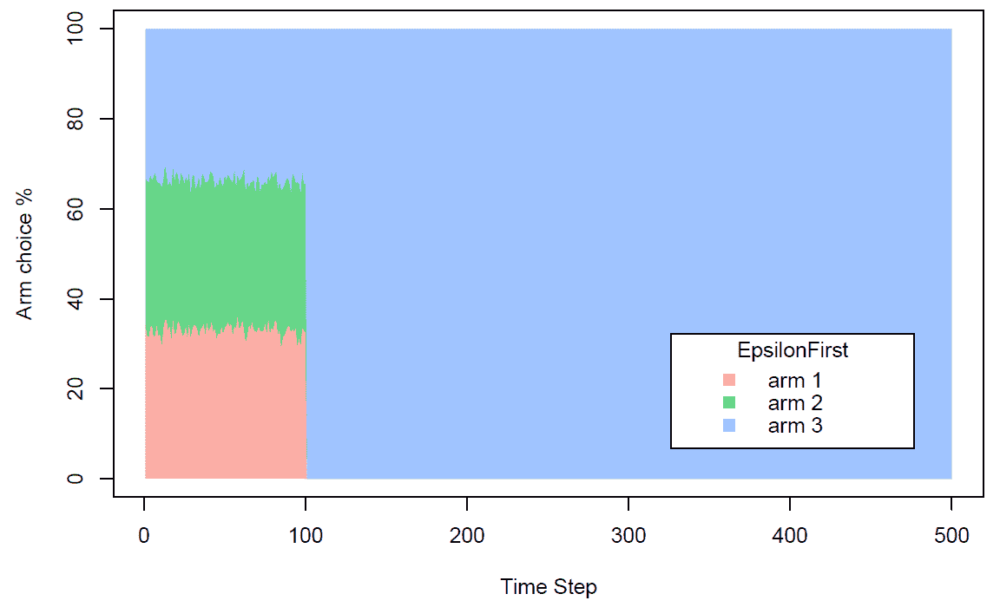

# 第四章：多臂老虎机模型

多臂老虎机问题是一个经典的强化学习问题，体现了探索与利用的困境。当我们只能依赖有限的资源来做出选择时，采用一种方法来确定哪些竞争选择可以最大化预期利润变得至关重要。**多**臂**老虎机**这个名字源于一个赌徒在一排老虎机中挣扎，他必须决定是继续使用当前的机器，还是尝试不同的机器。

本章将概述多臂老虎机模型的基本概念，探索可用于解决此问题的不同技术，并深入了解行动-价值实现的含义。接着，我们将学习如何使用情境方法来解决这个问题，如何实现异步演员-评论家代理，以及如何在 R 中实现多臂老虎机问题。

本章将涵盖以下主题：

+   多臂老虎机模型

+   多臂老虎机应用

+   行动-价值实现

+   理解问题解决技术

+   实现情境方法

+   理解异步演员-评论家代理

+   使用 MAB 模型进行在线广告

# 多臂老虎机模型

学习理论中的一个常见问题是，在不知道每个选项能提供何种收益的情况下，如何在一组选项中识别最佳选项，同时最小化选择的成本。

**多臂老虎机**（**MAB**）问题得名于决策理论中遇到的一个著名问题。一个赌徒必须从他面前的多台老虎机中选择一台进行游戏。游戏后，他将获得关于某些机器奖励的某种程度的知识，但他对其他机器一无所知，因此他将被迫在部分已知的机器和完全未知的机器之间做出选择。

这个问题非常适合模拟已知机会的利用与未知机会的探索之间的妥协，也可以在高度无知和不确定的情况下测试策略。

从技术术语上讲，每台老虎机都被建模为一个概率分布，具有一个平均值和一个标准差。这两个参数可以随时间变化，可能是相互依赖的，也可能是独立变化的，例如，模拟随时间的演变或竞争场景的动态，或者响应一个或多个玩家的选择，以模拟竞争或对情境的影响。

概率分布显然对玩家来说是未知的，但随着每台老虎机奖励的获取，玩家可以逐渐学习这些分布。

MAB 问题是由 H. Robbins 提出的，用来模拟在环境未知的情况下的决策制定。这些问题在以下论文中有所讨论：*实验设计的某些方面*，Robbins, H. (1952)，《美国数学学会公报》，55，527–535。

在每个时间步长中，只有一个杠杆被操作，并且观察到一个随机奖励，其中每次操作杠杆 k 会生成独立同分布的样本，这些样本来自某个未知的分布。目标是最大化在定义的时间区间内获得的所有奖励之和。

每个指定应当选择哪个杠杆的算法，基于已获得的奖励历史，代表了我们的策略。通常用来衡量后者表现的度量是遗憾，它是衡量我们所选策略与最佳策略（已知收益的分布平均值）相比，预期损失的程度。

由于这些分布对于我们的策略来说是未知的，因此需要通过多次操作来学习它们，但同时，我们也希望通过选择已经被评定为好的机器来最大化奖励。这两个冲突的目标——探索未知和利用已知——是广泛的机器学习问题中存在的一个基本权衡。

# 数学模型

K 臂赌博机问题由随机变量 *X[i, n]* 定义，其中 1 ≤ i ≤ K 和 n ≥ 1（n 是游戏次数），其中 i 是识别老虎机杠杆的索引。通过操作杠杆 i，可以获得奖励 X[i, 1], X[i, 2], · · ·，这些奖励是独立且同分布的，遵循一个未知的概率分布，并具有未知的期望 µi（期望值）。此外，不同杠杆之间的奖励保持独立，即，对于每一个 1 ≤ i < j ≤ K 和所有的 s, t ≥ 1，X[i, s] 和 X[j, t] 是独立的（且通常不是同分布的）。这个问题在形式上等价于一个单状态的马尔可夫决策过程。

分配策略是一种算法，它根据之前投注的序列和获得的奖励来选择下一个要操作的杠杆。正如我们之前提到的，遗憾的概念被用来衡量模型的表现，衡量的是跟随所选策略获得的收益与最佳策略之间的累计损失。

设 *T[i] (n)* 为策略在前 *n* 次游戏中操作杠杆 *i* 的次数。这里，策略在 *n* 次游戏后的遗憾定义如下公式：


在这里，我们有以下内容：

+   *µ* = max[i=1;:::k] µ[i]*

+   *Ε(Tk)* 是关于策略将在多少次中选择机器 k 的期望值。

目标是最小化这种遗憾，或者等价地，最大化 n 次操作后获得的奖励总和。事实上，我们可以将遗憾解释为最大可能收益与实际收益之间的差异（最大可能收益是通过定义中每次拉动最佳杆获得的µ*奖励）。

在下一部分，你将看到可以通过这项技术解决的实际应用示例。

# 多臂老虎机应用

到目前为止，我们已经从数学角度看到了如何解决 MAB 问题。那么，哪些实际应用可以用这种方式建模呢？我们将在以下子章节中探讨一些示例。

# 在线广告

在在线广告中，MAB 解决方案使用机器学习算法动态地将广告分配给表现良好的网站页面，同时避免显示表现较差的广告。从理论上讲，MAB 应当能更快地得出结果，因为不需要等待单一获胜的变体。

# 新闻分配系统

MAB 的另一个应用涉及新闻网站：当一个新用户访问网站时，他们必须从一系列文章中选择一个新闻项目，每次用户点击文章时，网站都会收到奖励。由于网站的目标是最大化收入，它希望展示最有可能被点击的内容。显然，这个选择依赖于用户的特征。问题在于，我们不知道一篇文章被点击的概率，这是我们希望学习的参数。我们可以清楚地看到，前述情境中展示的探索与开发的困境可以被建模为 MAB 问题。

# 健康护理

在这一领域有多种治疗方法可供选择。管理者需要在最小化患者损失的同时决定使用哪种治疗方法。这些治疗方法是实验性的，意味着治疗的效果需要通过对患者的实施来学习。上述问题可以被建模为一个 MAB 问题，其中治疗方法如同“臂”一样，治疗效率也需要被学习。管理者可以通过探索不同的治疗方法来了解它们的成功率（效率），或者选择利用至今为止成功率最高的治疗方法。

# 人员招聘

在新员工选拔中，应用这种方法论代表了一种强大的工具，雇主或服务需求方可以利用它按时且经济地完成任务。雇主的目标是最大化完成的任务数量。可用的员工在这种情况下充当“武器”，因为他们的特质对雇主来说是未知的。因此，这个问题可以被看作是一个 MAB 问题，雇主可以通过探索员工的特质来了解他们，或者选择利用迄今为止已识别的最佳员工。

# 财务投资组合的选择

最优投资组合的选择是一个典型的决策问题，因此它的解决方案包括以下要素：识别一组备选方案，使用选择标准对不同的可能性进行排序，以及问题的解决。为了优化金融投资组合，我们首先要衡量可用产品的收益和风险。风险与回报变量可以看作是同一枚硬币的两面，因为一定程度的风险将对应于一定的回报。

收益可以定义为与所使用的资本相关的投资结果的总和，而风险的概念可以通过与特定金融工具相关的回报波动度来表示。这个问题可以被建模为一个多臂老虎机（MAB）问题，其中金融产品作为“臂”，产品表现作为结果。

在下一节中，我们将学习如何估计动作价值函数，以实现多臂老虎机算法。

# 动作价值实现

强化学习问题的一般解决方案是通过学习过程估计一个价值函数。这个函数必须能够通过奖励的总和来评估一个特定策略的便利性或其他方面。首先，我们将定义状态价值函数。

# 状态价值函数

价值函数表示一个状态对智能体来说有多好。它等于从状态 s 开始，智能体所期望的总奖励。价值函数依赖于智能体选择要执行的动作的策略。

策略π将概率π(s, a)与状态-动作对(s, a)关联，从而返回在状态 s 下执行动作 a 的概率。基于此，我们可以定义一个价值函数 Vπ(s)，它是根据策略π从状态 s 开始的总奖励 R[t]的期望值：


这里，序列 rt 是在状态 s 下按照策略π生成的。换句话说，训练模式的示例必须指导学习过程朝向评估最优策略π*，如下所示：


假设δ(s, a)是由状态-动作对(s, a)生成的新状态的函数，我们可以执行前瞻搜索，从状态 s 开始选择最佳动作，因为我们可以表达以下内容：


这里，r(s, a)表示在状态 s 下执行动作 a 所获得的奖励。只有在已知这些函数的情况下，这个解才是可接受的，如下方方程所示：


然而，这种情况并不总是被遵守。

现在我们理解了状态价值函数的作用，我们可以继续定义动作价值函数。

# 动作价值函数

当这种情况没有发生时，需要定义一个类似于 Vπ ∗的新函数：


如果智能体能够估计函数 Q，那么即使不知道函数δ，也可以选择最优动作 s：


函数 Q 通常被称为动作值函数。根据策略π，动作值函数返回在特定状态 s 下使用动作 a 的期望奖励。

状态值函数和动作值函数之间的主要区别在于，Q 值允许你——至少在第一阶段——采取与策略预期不同的动作。这是因为 Q 是根据总奖励来推理的，因此在特定状态下，它也可能返回比其他动作获得的奖励更低的奖励。状态值函数包含到达某一状态的价值，而动作值函数包含在某一状态下选择一个动作的价值。如何选择最佳动作呢？让我们一探究竟。

# 选择一个动作

假设我们选择 n 个动作：a = a[1]… .a[n]。每个动作都有其自身的动作值函数值。在 t-t[h]时刻（回合）其估计值为 Q[t] (a[k])。回想一下，动作的真实值是当选择该动作时获得的平均奖励。估计这个值的自然方法是计算实际选择该动作时获得的奖励的平均值。换句话说，如果在第 t 回合选择了动作 a，并且在 t 之前选择了 k 次，获得了奖励 r[1], r[2], ..., r[ka]，那么它的估计值为：


这里，我们有如下内容：

+   对于 k[a] = 0，我们将 Q[t] (a[k])设置为默认值，Q[0] (a[k]) = 0（没有可用的估计）。

+   对于 k[a] → ∞，Q[t] (a[k]) → Q ^* (a[k])（根据大数法则）。

在所有这些情况下，动作值函数是作为平均值（样本平均法）计算的。

现在我们已经探讨了这项技术的基本概念，接下来我们将继续探索可能的解决方案。

# 理解问题解决技巧

到目前为止，我们已经将问题形式化，并且我们已经看到有哪些工具可以帮助我们选择那些能带来最小遗憾的动作。现在，我们可以制定选择方法。我们将在以下小节中探讨以下问题解决技巧：

+   贪心方法

+   上置信界

# 贪心方法

这个问题，比看起来更复杂，可以通过使用一个非常简单的策略来解决，尽管它并不非常有效：

1.  最初，每个拉杆都会被试验。

1.  选择返回平均最高奖励的拉杆。

在这个算法中，我们可以观察到以下内容：

+   我们允许智能体拥有记忆

+   我们存储与不同动作相关的值

+   我们选择给出最大奖励的动作

最佳动作称为**贪婪动作**，基于这一动作的算法称为**贪婪**方法。执行以下步骤：

1.  在时间步 t，按照如下方式估计每个动作的值：


1.  选择具有最大值的动作：


在贪婪方法中，没有通过该方法探索其他替代解决方案。为什么我们必须选择一个看起来不是最好的动作？这是因为我们需要探索不同的解决方案，因为奖励并不是确定性的。这意味着我们可能通过其他动作获得更多的奖励，因为重要的不是瞬时的奖励，而是通过这些动作累计的奖励。在贪婪解法中，算法完全基于利用。为了提升模型的表现，必须引入探索。接下来我们看看怎么做。

# ε-贪婪方法

在这里，需要保持一种倾向于探索不同动作的心态。我们再次面对一个基于探索与利用困境的问题，正如我们在第二章《强化学习的构建模块》中详细讨论过的那样，*探索与利用困境*。

理想情况下，智能体必须探索每个状态下所有可能的动作，找出最能通过利用该动作来达成目标的动作。因此，决策过程涉及一个基本的选择：

+   **利用**：根据当前信息做出最佳决策

+   **探索**：收集更多信息

在这个过程中，最佳的长期策略可能会在短期内带来相当大的牺牲。因此，需要收集足够的信息来做出最佳决策。

我假设以概率ε，选择一个不同的动作。这个动作是以均匀概率从 n 个可用动作中选择的。执行以下步骤：

1.  在时间步 t，按照如下方式估计每个动作的值：


1.  以概率 1-𝜖，选择最大值的动作，如下所示：


1.  以概率𝜖，从所有动作中随机选择一个，且每个动作的概率相同。

最常用的参数值是𝜖 = 0.1，但这可以根据具体情况有所不同。在这种方法中，我们引入了探索的元素，以改善性能。然而，如果两个动作的 Q 值差异非常小，这个算法也会选择一个概率比其他动作更高的动作。

# ε-贪婪方法与渐进递减

引入𝜀进行探索使我们有机会尝试那些至今未知的选项。然而，策略中的随机成分意味着那些已经采取并且得到较差结果的行动仍然可能被重新探索。通过逐渐减少随机探索成分，可以避免这种低效的探索。

换句话说，通过随着时间的推移减少参数𝜖，我们可以减少探索，因为我们已经对具有强大潜力的最优值的行动产生了信心。该策略在开始时提供了高度的探索行为，而在最后则表现出高度的利用行为。让我们一起来学习如何同时进行利用与探索。

# 上置信界

在游戏开始时，我们并不知道哪个臂是最好的。因此，我们无法对任何一个臂进行描述。因此，UCB 算法假设所有臂的观察平均值都是相同的。于是，将为每个臂创建一个置信区间，并随机选择一个臂。

在这种情况下，每个臂要么给出奖励，要么不给。如果选中的臂返回错误，臂的观察平均值以及置信区间都会下降。如果选中的臂返回奖励，观察到的平均值和置信区间都会增加。通过利用最佳臂，我们降低了置信区间。随着更多回合的进行，其他臂表现良好的可能性也在增加。

为了实施这一策略，请按照以下步骤操作：

1.  每一轮中，都会计算两个变量：

    +   *Ri*：杠杆 *i* 在进行 *n* 次操作后获得的奖励总和

    +   *T**[i]**(n)*：策略在前 *n* 次操作中选择杠杆 *i* 的次数

1.  我们使用以下公式计算在进行 *n* 次操作后杠杆 *i* 的平均奖励：


1.  我们使用以下公式计算在进行 *n* 次操作后的置信区间：


1.  我们按照以下方式选择返回最大 UCB 的杠杆 *i*：


这两种算法都记录它们对任何可用臂的了解程度，只关注它们从各个臂获得的奖励。与此相反，我们迄今为止分析的算法，对于那些初始经验没有返回显著奖励的选项，进行了不足的探索，即使它们没有足够的数据来确定这些臂。

在接下来的章节中，我们将介绍“状态”的概念，它代表了智能体可以用来执行有针对性行动的环境描述。

# 实现情境方法

到目前为止，在解决多臂老虎机（MAB）问题时，我们已经生成了一个动作，但我们并没有利用环境（上下文）的任何状态信息。代理可用的动作范围包括拉动一个或多个老虎机的臂。通过这种方式，可以获得+1 或-1 的奖励。

如果代理选择的臂不断返回正奖励，那么问题就被认为已解决。在这种情况下，我们可以设计一个完全忽视环境状态的代理，因为实际上，始终只有一个不可变的状态。

在上下文老虎机中，引入了“状态”概念，它表示环境的描述，代理可以利用该描述执行有针对性的动作。该模型通过将决策与环境状态相联系，扩展了原始模型。

下图展示了这两个模型的示意图：


原始问题在本质上发生了变化，因为在问题的新形式化中，不再只有一个老虎机（我们至今考虑的情况），而是有多个老虎机。环境的状态告诉我们正在处理哪个老虎机，代理的目标是学习针对任何可用老虎机的最佳动作。由于每个老虎机对每个臂的奖励概率不同，我们的代理需要学习根据环境状态来调整其行动。除非他们这样做，否则无法随着时间推移获得最大的奖励。

使用**上下文老虎机**模型，你不仅基于先前的观察优化决策，还可以根据每种情况个性化决策。

从前面的模型中，我们可以观察到以下几点：

+   算法观察一个上下文。

+   算法通过从一系列备选动作中选择一个动作来做出决策。

+   我们可以观察到该决策的结果，它返回一个奖励。

+   目标是最大化平均奖励。

将该算法应用于现实世界的一个例子是选择要在网站上展示的广告，以优化点击率的问题。上下文是关于用户的信息：用户来自哪里、使用的设备信息、之前访问过的网站页面、地理位置等等。一个动作对应于选择展示哪条广告。一个结果是用户是否点击了广告横幅。奖励是二元的：如果没有点击，则奖励为 0；如果点击，则奖励为 1。现在，让我们学习如何交替评估策略与改进策略。

# 理解异步演员-评论员代理

Actor-Critic 方法实现了一个广义的策略迭代，交替进行策略评估和策略改进步骤。Actor 改进的两个紧密相关的过程旨在改善当前策略，而 Critic 评估则是通过评估当前策略来实现的。如果 Critic 所定义的过程具有引导作用，那么方差就会减少。通过这样做，相比于策略梯度方法，算法的学习会变得更加稳定。

这些方法的特点是分离内存结构，使得策略与价值函数相互独立。策略模块被称为 Actor，因为它选择行动，而估计的价值函数则被称为 Critic，从这个角度看，Critic 批评的是策略执行的动作。从这一点我们可以理解，学习是基于策略类型的——事实上，Critic 学习并批评当前策略的工作。

我们已经介绍了 Actor-Critic 模型，现在我们将解释“异步”这一术语。这非常简单，并且具有有效的直觉，例子如下：

+   该模型有多个智能体同时探索环境（每个智能体都有整个环境的副本）。

+   该模型给出不同的初始策略，使得各个智能体彼此独立。

+   在该模型中，全局状态会随着每个智能体的贡献而更新，整个过程会重新开始。

2016 年，Google DeepMind 小组提出了一种名为**异步优势 Actor-Critic**（**A3C**）的算法。该算法比大多数现有算法更快、更简洁。

在此算法中，处理了多个不同初始化的智能体实例，它们处于各自的环境中。每个开始行动并学习的智能体都会积累自己的经验。然后，这些经验将用于更新所有智能体共享的全局神经网络。该网络会影响所有智能体的行动，每个智能体的新经验会加速整体网络的更新。由于有多个实例的智能体，训练将变得更加快速和高效。

在接下来的章节中，我们将通过解决一个实际案例，应用迄今为止学到的概念。

# 使用 MAB 模型的在线广告

在线广告属于新媒体范畴，并利用了互联网能够接触到大量人群的优势。广告对公司至关重要，因为公司可以以比传统方式更低的成本，轻松接触到广泛的受众。互联网广告的主要优势之一是结果的可追踪性，或者说它对公众的影响。这得益于广告服务器，在横幅广告的情况下，它们可以衡量展示次数、实际用户数量和点击次数。

在在线广告中，我们可以区分以下两种宏类型：

+   上下文

+   行为广告

在上下文广告中，谷歌是典型的案例，您可以根据页面上的词语或网站的类型或主题放置广告。在行为广告中，我们通过收集关于每个用户在网络和应用程序上的行为（访问的页面、进行的搜索）来选择目标，以识别他们的兴趣和需求，然后根据这些信息投放相关广告。

在这两种情况下，明显的是，引用上下文需要与环境交互。也显然，在展示广告之前，我们无法先知用户的行为。这些问题可以通过基于 MAB 的模型来解决，如下所示：

+   上下文由访问者和网页的特征表示。

+   手臂通过可用的广告类型来表示。

+   一个动作等同于将要展示的广告类型。

+   奖励由访问者的行为返回。通过点击展示的广告，您会收到奖励 1，而不点击广告则会收到奖励 0。

为了使这个讨论尽可能易于理解，我们将限制我们希望评估的广告数量为三个，并旨在找出在一定数量的展示后，哪个策略能提供最大的总点击率。所以，让我们通过采用上下文方法来学习如何解决这个问题。

# 实现上下文包

在*上下文方法*部分，我们提到，在上下文赌博机中，引入了状态的概念，表示代理可以用来执行有针对性行动的环境描述。该模型通过将决策与环境的状态联系起来，扩展了原始模型。在本节中，我们将看到一些使用上下文方法解决武装赌博机问题的应用示例。为此，我们将使用`contextual`包。

该包简化了无上下文和上下文 MAB 策略或算法的模拟和评估，便于现有和新算法及策略的实现、评估和传播。

`diagram`包的简要描述已从官方文档中提取，并显示在下表中：

| 版本 | 0.9.8.2 |
| --- | --- |
| 日期 | 2019-07-08 |
| 维护者 | Robin van Emden |
| 许可证 | GPL-3 |
| 作者 | Robin van Emden, Maurits Kaptein |

`contextual`包由作者在以下论文中提出：van Emden, R. 和 Kaptein, M., 2018\. *Contextual: Evaluating Contextual Multi-Armed Bandit Problems in R*. arXiv 预印本 arXiv:1811.01926。

在此包中，MAB 问题是在以下假设下处理的：

+   赌博机是一组手臂，每个手臂由某些奖励函数定义，这些奖励函数将维度上下文向量映射到每个时间步长的奖励，直到预定的时间范围。

+   政策的功能是最大化累积奖励。这个功能是通过选择当前可用的赌博机臂之一来实现的。

+   在学习过程中，策略观察环境的当前状态，状态由上下文特征向量表示。之后，策略使用臂选择策略选择一个可用的动作。作为结果，它会获得一个奖励。这个过程允许策略更新策略臂的选择。此过程随后会重复*T*次。

为了表示算法中所述的内容，我们可以说，对于每一轮，策略执行以下操作：

+   观察当前上下文特征向量

+   选择一个动作

+   获得奖励

+   更新臂选择策略参数

策略的目标是优化其累积奖励。

然后，我们将应用上下文包中包含的函数到实际案例中。

# 在线广告无上下文策略

我们将进行的第一次模拟将不考虑上下文。我们将简单地评估在一定次数展示后，每个广告收到的点击量。首先，我们需要设置初始设置。正如预期的那样，我们只考虑三个公告，它们在 MAB 模型中对应于三条臂，每条臂都有不同的点击概率。让我们开始吧：

1.  我们将使用以下代码进行分析：

```py
library(contextual)
horizon <- 500
simulations <- 1000
ProbClick <- c(0.1, 0.3, 0.7)
bandit <- BasicBernoulliBandit$new(weights = ProbClick)
policy <- EpsilonFirstPolicy$new(time_steps = 100)
agent <- Agent$new(policy, bandit)
simulator <- Simulator$new(agent, horizon, simulations, do_parallel = FALSE)
history <- simulator$run()
plot(history, type = "average", regret = FALSE, lwd = 2, legend_position = "bottomright")
plot(history, type = "cumulative", regret = FALSE, rate = TRUE, lwd = 2)
plot(history, type = "arms")
```

1.  我们将逐行分析这段代码。第一行加载了库：

```py
library(contextual)
```

该库包含许多函数，允许模拟和评估无上下文和有上下文的 MAB 策略或算法。

1.  现在，让我们固定一些必要的参数，以将问题设定为 MAB：

```py
horizon <- 500
```

1.  视野是必须玩的轮次数。让我们设置模拟的次数：

```py
simulations <- 1000
```

模拟次数表示重复模拟的次数。

1.  继续并设置用户点击广告的概率：

```py
ProbClick <- c(0.1, 0.3, 0.7)
```

已经定义了一个向量，包含每个广告被点击的概率。在 MAB 术语中，它们表示与三条臂相关联的概率。此时，初始参数已经固定，因此我们可以继续定义对象。

第一个将是赌博机：

```py
bandit <- BasicBernoulliBandit$new(weights = ProbClick)
```

在这里，我们使用了`BasicBernoulliBandit()`函数。这个函数模拟 k 个伯努利臂，其中每个臂以均匀概率 p 发放奖励 1，否则发放奖励 0。在一个赌博机场景中，这可以用来模拟一个命中或未命中的事件，比如用户是否点击了一个标题、广告或推荐的产品。只需要一个参数（权重）：它是一个数值向量，表示每个赌博机臂的奖励概率。`new()`方法生成并实例化一个新的`BasicBernoulliBandit`实例。

1.  接下来定义策略：

```py
policy <- EpsilonFirstPolicy$new(time_steps = 100)
```

这里，我们使用了 `EpsilonFirstPolicy()` 函数来实现一个简单的策略，其中纯探索阶段后跟纯利用阶段。在前 N 个时间步内进行探索。在此期间，每个时间步 t，`EpsilonFirstPolicy` 会随机选择一个 arm。接下来的步骤中进行利用，我们选择最佳的 arm，直到 N 为止，或者在剩余的 N 次试验或时间步长 T 内进行利用。这里，我们使用了 `new()` 方法来生成一个新的 `EpsilonFirstPolicy` 对象。接下来继续：

```py
agent <- Agent$new(policy, bandit)
```

agent 类负责运行一个 bandit/policy 配对。以下是可用的参数：

+   `policy`：一个策略实例。

+   `bandit`：一个 bandit 实例。

+   `name character`：设置 agent 的名称。如果为 NULL（默认值），则 agent 根据其策略实例的名称生成一个名称。

+   `sparse numeric`：通过为当前的 bandit 和 policy 配对设置稀疏度水平，人工降低数据大小。

在我们的例子中，只有两个参数被传递：`policy` 和 `bandit`。接下来我们来运行模拟：

```py
simulator <- Simulator$new(agent, horizon, simulations, do_parallel = FALSE)
```

这是任何模拟的入口点。`Simulator` 类封装了一个或多个 agent，针对每个 agent 创建一个克隆进行重复模拟，运行这些 agent，并将所有 agent 交互的日志保存在历史对象中。以下参数将被传递：

+   `agent`：一个 agent 实例或一个 agent 实例列表

+   `horizon`：运行每个 agent 的拉取次数或时间步数，其中 t = 1, . . . , T（整数值）

+   `simulations`：每个 agent 在 t = 1, . . . , T 的模拟重复次数，每次重复时使用新的随机种子（整数值）

+   `do_parallel`：是否并行运行模拟器进程（逻辑值）

关于 R6 类模拟器覆盖的所有主题的详细列表，请参阅官方文档：[`CRAN.R-project.org/package=contextual`](https://CRAN.R-project.org/package=contextual)。

这里，我们使用了 `new()` 方法来生成一个新的模拟器对象。现在是时候运行模拟了：

```py
history <- simulator$run()
```

`run()` 方法只是运行一个模拟器实例。在此时，我们已经将所有模拟历史记录保存在历史变量中。现在，我们可以利用这些数据绘制图表。首先，我们将分析平均奖励：

```py
plot(history, type = "average", regret = FALSE, lwd = 2, legend_position = "bottomright")
```

`plot()` 函数根据历史数据生成图表。以下是可用的图表类型：

+   `cumulative`：绘制累计遗憾或奖励随时间变化的曲线。如果传入 regret=TRUE，则返回累计遗憾；如果传入 regret=FALSE，则返回累计奖励。

+   `average`：绘制平均遗憾或奖励的曲线。如果传入 regret=TRUE，则返回累计遗憾；如果传入 regret=FALSE，则返回累计奖励。

+   `arms`：绘制每个时间步中每个 arm 被选择的模拟百分比。如果运行了多个 agent，则仅绘制第一个 agent。

接下来的图表将被打印：


请注意，在第一次探索阶段中，所有的臂都被平等测试后，我们进入了利用阶段，在该阶段中，返回最高奖励的臂会被优先选择。两个阶段之间的过渡可以通过平均奖励的净增加看到。接下来，让我们查看累积图：

```py
plot(history, type = "cumulative", regret = FALSE, rate = TRUE, lwd = 2)
```

以下图表被返回：


这张图中探索阶段和利用阶段的过渡更为明显。在前 100 步中，只有探索阶段被使用，之后累积遗憾开始呈现对数型增长。最后，我们将绘制臂的类型：

```py
plot(history, type = "arms")
```

这种类型的图表返回了每个时间步骤中每个臂被选择的模拟次数百分比。以下图表被打印出来：



从前面的图表中，我们可以看到最常选择的臂是 3 号臂。事实上，即使在这种情况下，在首次探索阶段中，三个臂的选择比例相近，但进入利用阶段后，选择的臂就完全集中在了 3 号臂上。

# 基于 ε-greedy 策略的在线广告

现在，我们将通过采用 ε-greedy 策略来解决同样的问题。正如我们之前提到的，使用这种方法，我们引入了探索元素，从而提高了性能。以下代码展示了使用 ε-greedy 方法时的分析过程：

```py
library(contextual)
horizon <- 500
simulations <- 1000
ProbClick <- c(0.1, 0.3, 0.7)
bandit <- BasicBernoulliBandit$new(weights = ProbClick)
policy <- EpsilonGreedyPolicy$new(epsilon = 0.1)
agent <- Agent$new(policy,bandit)
simulator <- Simulator$new(agent, horizon, simulations, do_parallel = FALSE)
history <- simulator$run()
plot(history, type = "average", regret = FALSE, lwd = 2, legend_position = "bottomright")
plot(history, type = "cumulative", regret = FALSE, rate = TRUE, lwd = 2, legend_position = "bottomright")
plot(history, type = "arms", legend_position = "topright")
```

我们将逐行分析这段代码。第一行加载了库：

```py
library(contextual)
```

现在，让我们设置一些必要的参数，以将问题设为 MAB：

```py
horizon <- 500
```

horizon 是必须进行的回合数。让我们设置模拟次数：

```py
simulations <- 1000
```

接下来，我们设置用户点击广告的概率：

```py
ProbClick <- c(0.1, 0.3, 0.7)
```

我们使用了与前一个示例相同的概率向量。接下来，我们定义对象：

```py
bandit <- BasicBernoulliBandit$new(weights = ProbClick)
```

为了定义赌博机，我们使用了 `BasicBernoulliBandit()` 函数。这个函数模拟了 k 个伯努利臂，其中每个臂以均匀概率 p 发出奖励 1，否则发出奖励 0。接下来，我们来定义策略：

```py
policy <- EpsilonGreedyPolicy$new(epsilon = 0.1)
```

这里，我们使用了 `EpsilonGreedyPolicy()` 函数。该函数在探索阶段以概率 epsilon 随机选择一个臂；否则，它会在利用阶段贪婪地选择回报最高的臂。只有 epsilon 参数被传入，表示随机选择臂的概率。`new()` 方法用于生成一个新的 `EpsilonGreedyPolicy` 对象。最后，我们将创建一个代理对象，如下所示：

```py
agent <- Agent$new(policy,bandit)
```

代理类负责运行一个 Bandit/Policy 配对。现在，我们可以运行模拟：

```py
simulator <- Simulator$new(agent, horizon, simulations, do_parallel = FALSE)
```

以下结果被打印出来：

```py
Simulation horizon: 500
Number of simulations: 1000
Number of batches: 1
Starting main loop.
data.table 1.12.0 Latest news: r-datatable.com
Finished main loop.
Completed simulation in 0:01:25.191
Computing statistics.
```

现在，我们可以运行模拟：

```py
history <- simulator$run()
```

我们进行的模拟历史记录保存在 history 变量中。我们可以使用这些数据来绘制图表。首先，绘制了遗憾平均值图：

```py
plot(history, type = "average", regret = TRUE, lwd = 2, legend_position = "topright")
```

以下图表被返回：


然后，我们绘制累计遗憾图：

```py
plot(history, type = "cumulative", regret = TRUE, rate = TRUE, lwd = 2,legend_position = "topright")
```

返回以下图表：


最后，绘制了臂选择的百分比图：

```py
plot(history, type = "arms")
```

返回以下图表：


在前面三个图中，突出了一个特征（**Arm choice %**）。遗憾随时间的减少是逐渐的，并不像之前的仿真（基于无上下文策略的例子）那样出现不连续。这是因为算法同时进行了探索和利用阶段。一方面，它在 ε 的时间里随机均匀地探索某个广告，而另一方面，它在 1-ε 的时间里利用点击率最高的广告。

# 在线广告基于上下文的策略

如果将访问者分为男性和女性，或者年轻人和成年人两类，会发生什么情况？我们可以在迄今为止分析的模型中引入对上下文的引用。回想一下，在上下文 Bandit 模型中，引入了状态的概念，状态代表了代理可以用来执行有针对性行动的环境描述。该模型通过将决策与环境状态关联，扩展了原始模型。以下代码使用上下文方法进行分析：

```py
library(contextual)
horizon <- 500
simulations <- 1000
ProbClickContx <- matrix(c(0.1, 0.3, 0.7, 0.8, 0.4, 0.1),
 nrow = 2, ncol = 3, byrow = TRUE)
bandit <- ContextualBinaryBandit$new(weights = ProbClickContx)
policy <- EpsilonGreedyPolicy$new(epsilon = 0.1)
agent <- Agent$new(policy,bandit)
simulator <- Simulator$new(agent, horizon, simulations, do_parallel = FALSE)
history <- simulator$run()
plot(history, type = "arms", legend_position = "bottomright")
```

我们将逐行分析这段代码。第一行加载了库：

```py
library(contextual)
```

现在，让我们设置一些必要的参数，将问题设置为 MAB：

```py
horizon <- 500
```

横向轴表示必须进行的轮次数。我们来设置仿真次数：

```py
simulations <- 1000
```

继续设置用户点击广告的概率。在这种情况下，引入了对二元上下文的引用。定义了两种可能的概率分布，它们分别对应两种用户画像：

```py
ProbClickContx <- matrix(c(0.1, 0.3, 0.7, 0.8, 0.4, 0.1),
                    nrow = 2, ncol = 3, byrow = TRUE)
```

第一个画像的概率向量为 (0.1, 0.3, 0.7)，而第二个画像的概率向量为 (0.8, 0.4, 0.1)。接下来，让我们继续定义对象：

```py
bandit <- ContextualBinaryBandit$new(weights = ProbClickContx)
```

为了定义 Bandit，我们使用了 `ContextualBinaryBandit()` 函数。该函数模拟了一个上下文 Bernoulli MAB 问题，其中至少有一个上下文特征在任何时刻是活动的。在这种情况下，`weights` 参数包含一个 d x k 的数值矩阵，其中包含了每个 k 个臂的 d 个上下文特征的奖励概率。接下来，让我们继续定义策略：

```py
policy <- EpsilonGreedyPolicy$new(epsilon = 0.1)
```

在这里，我们使用了 `EpsilonGreedyPolicy()` 函数。最后，我们将创建一个代理对象，如下所示：

```py
agent <- Agent$new(policy,bandit)
```

代理类负责运行一个 Bandit/Policy 配对。现在，我们可以运行仿真：

```py
simulator <- Simulator$new(agent, horizon, simulations, do_parallel = FALSE)
```

输出以下结果：

```py
Simulation horizon: 500
Number of simulations: 1000
Number of batches: 1
Starting main loop.
Finished main loop.
Completed simulation in 0:01:43.277
Computing statistics.
```

现在，我们可以存储仿真结果：

```py
history <- simulator$run()
```

仿真的历史记录保存在 history 变量中。现在，我们可以使用这些数据绘制图表。在此情况下，仅绘制了臂选择的百分比：

```py
plot(history, type = "arms", legend_position = "bottomright")
```

返回以下图表：


从这个分析中可以看出，最常选择的臂是第 1 号臂，然后是第 3 号臂，最后是第 2 号臂。

# 解决技术比较

解决 MAB 问题有几种策略。在*问题解决技术*部分，我们分析了一些策略。上下文包提出了一些策略。以下是可用策略的列表：

+   `上下文时期贪心策略`

+   `上下文ε-贪心策略`

+   `上下文 LogitBTS 策略`

+   `` `上下文 TSProbit 策略` ``

+   `ε-贪心策略`

+   `ε-贪心策略`

+   `Exp3 策略`

+   `固定策略`

+   `GittinsBrezziLai 策略`

+   `梯度策略`

+   `Lif 策略`

+   `LinUCB 不相交优化策略`

+   `LinUCB 不相交策略`

+   `LinUCB 通用策略`

+   `LinUCB 混合优化策略`

+   `LinUCB 混合策略`

+   `Oracle 策略`

+   `随机策略`

+   `Softmax 策略`

+   `汤普森采样策略`

+   `UCB1 策略`

+   `UCB2 策略`

有关这些策略的详细描述，请参阅该包的官方文档，文档可通过以下网址访问：[`CRAN.R-project.org/package=contextual`](https://cran.r-project.org/package=contextual)。

其中一些策略已经在我们本章查看的示例中采用过。为了分析这些策略的特点，我们可以基于已经获得的结果进行比较。以下是完整的代码：

```py
library(contextual)
horizon <- 500
simulations <- 1000
ProbClick <- c(0.8, 0.3, 0.1)
bandit <- BasicBernoulliBandit$new(weights = ProbClick)

agents <- list(Agent$new(OraclePolicy$new(), bandit),
 Agent$new(UCB1Policy$new(), bandit),
 Agent$new(ThompsonSamplingPolicy$new(1.0, 1.0), bandit),
 Agent$new(EpsilonGreedyPolicy$new(0.1), bandit),
 Agent$new(SoftmaxPolicy$new(tau = 0.1),bandit),
 Agent$new(Exp3Policy$new(0.1), bandit))

simulation <- Simulator$new(agents, horizon, simulations)
history <- simulation$run()

plot(history, type = "cumulative", regret = FALSE)
```

我们将逐行分析这段代码。第一行加载了库：

```py
library(contextual)
```

现在，让我们设置一些必要的参数，将问题设置为 MAB：

```py
horizon <- 500
simulations <- 1000
```

现在，让我们继续设置用户点击广告的概率：

```py
ProbClick <- c(0.8, 0.3, 0.1)
```

现在我们继续定义赌博机对象：

```py
bandit <- BasicBernoulliBandit$new(weights = ProbClick)
```

这里，我们使用了`BasicBernoulliBandit()`函数。现在，我们将创建一个代理对象的列表，如下所示：

```py
agents <- list(Agent$new(OraclePolicy$new(), bandit),
               Agent$new(UCB1Policy$new(), bandit),
               Agent$new(ThompsonSamplingPolicy$new(1.0, 1.0), bandit),
               Agent$new(EpsilonGreedyPolicy$new(0.1), bandit),
               Agent$new(SoftmaxPolicy$new(tau = 0.1),bandit),
               Agent$new(Exp3Policy$new(0.1), bandit))
```

定义了六个具有不同策略的代理，如下所示：

+   `Oracle 策略`：此策略始终知道奖励概率，并将始终选择最优臂。它通常作为基准，用于与其他策略进行比较。

+   `UCB1 策略`：此策略构建了一个乐观的估计，以上置信区间的形式创建每个动作的预期回报估计，并选择具有最高估计值的动作。如果估计错误，乐观估计会迅速下降，直到另一个动作的估计值更高。

+   `汤普森采样策略`：此策略的过程利用了武器的平均奖励记忆。为此，使用带有 alpha 和 beta 参数的 beta-二项式模型，从上一步中为每个臂采样值，并选择具有最高值的臂。当拉动一个臂并观察到一个伯努利奖励时，它根据奖励修改先验。此过程会为下一次拉臂重复。

+   `EpsilonGreedyPolicy`：该策略遵循的程序是以 epsilon 概率随机选择一个臂来探索环境。否则，它会贪婪地选择估计奖励最高的臂。通过这种方式，代理可以利用前一步获得的信息。

+   `SoftmaxPolicy`：该策略基于 Boltmann 分布中的概率选择一个臂。它使用了一个温度参数 tau，指定我们可以探索多少个臂。当 tau 较高时，所有臂的探索机会相同；而当 tau 较低时，系统会选择那些提供更高奖励的臂。

+   `Exp3Policy`：该策略遵循的程序使用概率分布，它是均匀分布的混合物。它还使用一种分布，将每个动作的概率质量分配在该动作的累积奖励的指数值上。

现在，我们可以运行仿真并存储其历史记录：

```py
simulation <- Simulator$new(agents, horizon, simulations)
history <- simulation$run()
```

最后，我们将绘制我们模拟的代理的累积悔恨值：

```py
plot(history, type = "cumulative")
```

返回以下图表：


正如我们预期的那样，OraclePolicy 在绝对悔恨值上表现最低，这意味着它成功地更好地利用了提供更好结果的臂。

# 总结

在本章中，我们学习了多臂强盗模型的基本概念。该模型基于探索与开发的困境。在资源有限的情况下，基于我们做出选择的标准，了解哪些竞争性替代方案可以最大化预期利润至关重要。该名称源于一个例子，描述了一位玩家在面对一排老虎机时的困境，他必须决定是否继续使用当前机器还是尝试另一台机器。我们描述了该问题的数学模型。然后，我们了解了行动价值实现的含义，并探讨了它与价值函数的区别。状态值函数包含到达某个状态的值，而行动值函数包含在某个状态下选择一个行动的值。

分析了几种问题求解技术，并讨论了上下文方法。我们还查看了 MAB 问题的一些实际应用列表。最后，使用几个 MAB 模型处理了在线广告问题。

在下一章中，我们将学习优化技术的基本概念。我们将学习如何将一个问题分解为子问题，并如何实现各种优化技术。然后，我们将理解递归与记忆化的区别，并发现如何使用动态规划方法做出最合适的选择。
