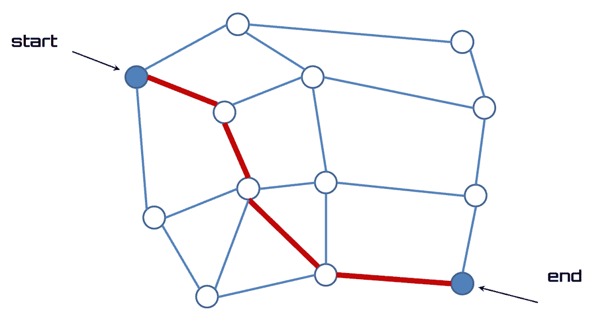
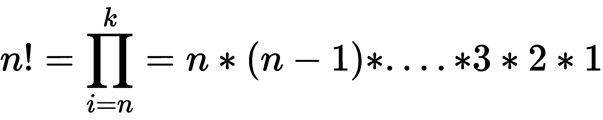
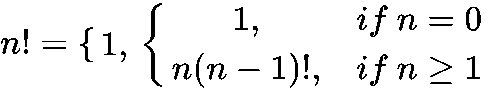
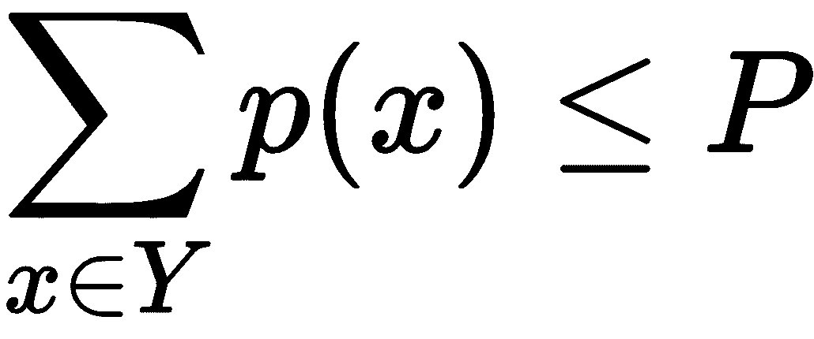
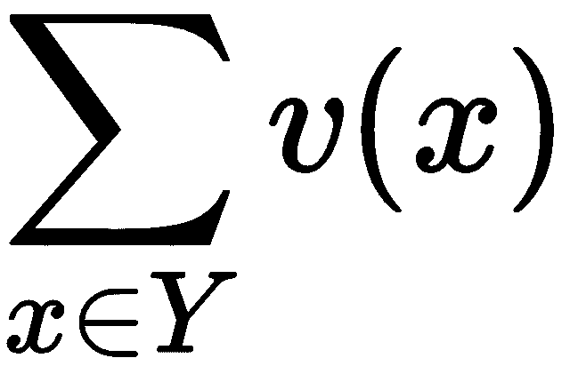
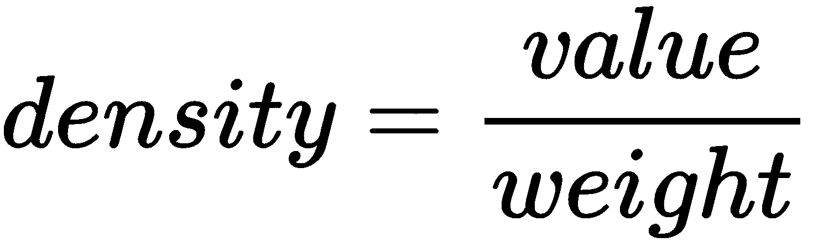
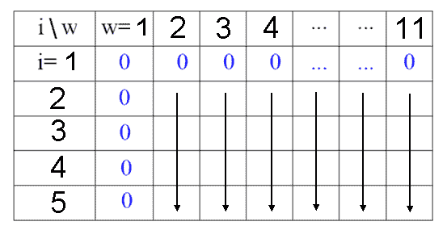
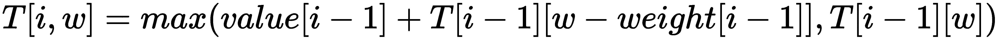
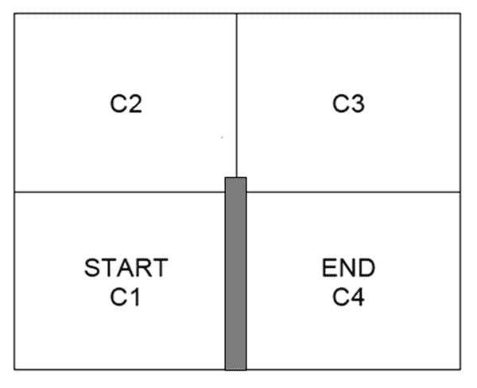

# 第五章：动态规划与最优策略

**动态规划**（**DP**）代表了一组可以用来计算最优策略的算法，前提是有一个完美的环境模型，以**马尔可夫决策过程**（**MDP**）的形式给出。DP 方法根据之前步骤中的估计值来更新状态值的估计。在 DP 中，优化问题被分解为更简单的子问题，每个子问题的解被存储，以便每个子问题只被解决一次。在本章中，我们将学习如何通过 R 代码实现 DP 来选择最优的投资组合。

本章涵盖以下主题：

+   理解 DP

+   学习自顶向下的 DP 方法

+   分析递归与备忘录化的区别

+   学习优化技术

+   在强化学习应用中实现 DP

+   解决背包问题

+   机器人导航系统的优化

# 技术要求

查看以下视频，了解代码如何运行：

[`bit.ly/2RPIFfB`](http://bit.ly/2RPIFfB)

# 理解 DP

DP（动态规划）是理查德·贝尔曼（Richard Bellman）在 1950 年代开发的数学方法论。它用于解决需要按顺序处理一系列相互依赖的决策问题。该方法论背后的基本原则是贝尔曼的最优性——无论初始状态和初始决策如何，后续的决策必须相对于前一个决策所导致的状态提供最优的策略。这是最优策略的本质特征。

设想一个寻找连接两个位置的最佳路径的例子。最优性原则指出，路径中每一个子路径，无论是从中间位置到最终位置，都必须是最优的。基于这一原则，DP 通过一次作出一个决策来解决问题。在每一步，都会确定未来的最佳策略，而不考虑过去的选择（它是一个马尔可夫过程），前提是这些选择也是最优的。

因此，DP 在原问题可以分解为一系列较小的子问题，或当支付的成本或获得的利润可以表示为与每个单独决策相关的基本成本之和时，DP 是有效的。更一般地，成本必须通过某些运算符表示为基本成本的组合，这些基本成本各自依赖于单个决策。

以下图示展示了网络中两个节点之间的最佳路径（红色路径），在所有可用路径中选择的“最佳”路径是“最短”的：



有许多路径可以到达相同的目的地：只有一条是最短的。

现在让我们来分析这项技术的基本概念。我们将通过比较两种非常流行的技术开始。

# 学习自顶向下的 DP 方法

为了理解动态规划背后的机制，我们可以将其与另一种非常常见的解决问题的机制——**分治法**进行比较。通过分治法，一个问题被分解成两个或更多的子问题，原问题的解是从子问题的解开始构建的。这种方法叫做自顶向下的技术，按以下步骤进行：

1.  将问题实例分解成两个或更多的子实例。

1.  对每个子实例递归地解决问题。

1.  重新组合子问题的解，以获得全局解。

这种机制广泛应用于解决多个问题。最常见的应用是两种最常用的排序算法——快速排序和归并排序。

例如，在**快速排序**算法中，待排序列表的元素被分为两个块，一块是小于主元的元素，另一块是大于主元的元素，然后算法会递归地对这两个块进行调用。归并排序中，算法找到中间位置的索引，并将列表分成两个各包含 n/2 元素的块。然后，算法会递归地对这两个块进行调用。

有些情况下，分治法无法应用，因为我们不知道如何获得子问题——问题本身并不包含足够的信息来让我们决定如何将其分解为多个部分。

在这种情况下，动态规划发挥作用：我们继续计算所有可能的子问题的解，并从子解开始，逐步得到新的子解，直到解决原问题。与分治法不同，待解决的子问题不一定是互不相交的，这意味着一个子问题可以是多个其他子问题的共同部分。为了避免对子问题进行重复计算，子问题通过自底向上的策略解决——从最小的子问题开始解决，逐步向大的子问题推进，并将这些子问题的解存储在适当的表格中，以便它们可以在需要时（如有必要）为解决其他子问题提供帮助。

在递归算法中，我们常常遇到一些从计算角度来看不必要的繁重过程。让我们看看如何解决这个问题。

# 分析递归和记忆化之间的区别

在这里所说的基础上，我们可以推断出动态规划（DP）用于那些具有递归定义的问题，但将该定义直接转化为算法会由于不同递归调用对相同数据子集的重复计算，导致程序的时间复杂度呈指数增长。一个例子是斐波那契数的计算，我们将在后续详细分析。

我们已经看到，动态规划（DP）是一种更高效地解决递归问题的技术。这是为什么呢？在递归过程中，我们很多时候会重复地解决子问题。在动态规划中，情况并非如此——我们会记住这些子问题的解，从而避免再次求解。这种做法叫做**记忆化**。

如果一个变量在某一给定步骤的值依赖于之前计算的结果，并且这些计算会被重复多次，那么存储中间结果就变得非常有用，从而避免重复计算那些计算成本高昂的部分。

为了更好地理解递归和记忆化之间的区别，我们来分析一个简单的例子：计算一个数字的阶乘。一个自然数 n 的阶乘，记作*n!*，是小于或等于该数字的所有正整数的乘积。n 的阶乘计算公式如下：



一个数字的阶乘也可以通过递归来定义：



如果一个函数调用自身，则称该函数为**递归**函数。递归函数只能直接解决问题的某些特定情况，这些特定情况称为基准情况（例如之前公式中的那些情况）：如果传入的数据属于某个基准情况，它就返回一个结果。在每次调用时，数据都会减少，直到某个时刻，我们到达了基准情况。当函数调用自身时，它会暂停当前执行，去执行新的调用。内部调用结束后，执行会恢复。递归调用的序列在最内层的调用遇到基准情况时终止。现在让我们看看如何优化这种技术。

# 学习优化技术

优化问题是一个可以通过成本函数（也叫做目标函数）来衡量其解的问题。要寻找的值通常是该函数的最小值或最大值。优化问题可以被简化为一系列的决策问题。

要解决优化问题，必须使用迭代算法。即一种计算程序，它在给定当前解的近似值时，通过适当的操作序列来确定一个新的近似值。从一个初始近似值开始，问题的可能解就以一种连续的方式被确定出来。

最优解的搜索算法可以分为以下三类：

+   **列举技术**：列举技术通过遍历函数定义域内的所有点来寻找最优解。通过将问题简化为更简单的子问题，可以减少问题的复杂性。动态规划（DP）就是其中的一种技术。

+   **数值技巧**：这些技巧通过利用一组必要且充分的条件来优化问题。它们可以分为直接方法和间接方法。间接方法通过求解一组非线性方程并迭代地寻找解，直到代价函数的梯度为零，来寻找最小值。直接方法则通过梯度指导搜索解的过程。

+   **概率技巧**：概率技巧基于枚举技术，但它们使用额外的信息来进行研究，可以看作是进化过程。这一类包括模拟退火算法，它使用热力学进化过程，以及基因算法类，它们利用生物进化技术。

在下一部分，我们将讨论基于动态规划（DP）的优化技术。

# 计算费波那契数列

列奥纳多·皮萨诺，也叫费波那契，是一位著名的意大利数学家（皮萨，1175 - 1240）。他的名字与费波那契数列相关，该数列源自斯瓦比亚皇帝腓特烈二世提出的一个问题。1223 年，在比萨的数学家比赛中，他提出了如下问题：*在不考虑死亡的情况下，每对兔子每月生育一对兔子，且最年轻的兔子在生命的第二个月就能繁殖，一年内能得到多少对兔子？*

费波那契对测试给出了如此快速的回答，以至于有人认为比赛是作弊的：


看看这里给出的数列：

+   前两个元素是 1, 1。

+   每个元素是由前两个元素之和给出的。

以 *F(n)* 表示第 n 个月的对数，费波那契数列变为以下形式：

+   *F(1) = 1*

+   *F(2) = 1*

+   *F(n) = F (n-1) + F (n-2)* 在第 *n* 个月，其中 *n*> 2

基于这个定义，我们通常假设 *F(0) = 0*，以便递归关系 *F(n) = F(n-1) + F(n-2)* 在 *n = 2* 时也成立。

费波那契数列促使我们研究了数学和自然科学的许多领域。然而，尽管发现了这一重要数列，费波那契并没有掌握它的许多方面。四个世纪后，开普勒观察到，两个连续项之间的关系趋向于黄金比例。

那么，来看看一个简单的 R 函数，它通过递归过程计算费波那契数：

```py
FibRec <- function(n) {
  if (n<=2)
    return(1)
  return (FibRec(n-1)+FibRec(n-2))
}

StartTime <- Sys.time()
paste("20th Fibonacci number is: ",FibRec(20))
EndTime <- Sys.time()
paste("Computational time using Recursion is: ",EndTime - StartTime)
```

在函数内部，有一个 `if` 结构包含两个选项：如果 `n> 2`，函数会调用自身；当 `n<=2` 时返回 `1`。对 `FibRec(n-1)` 的调用要求函数解决比最初问题更简单的问题（数值较小），但问题始终是相同的。函数会一直调用自身，直到达到它可以立即解决的基本情况。为了比较两种解决技术，使用 `Sys.time()` 函数来计算计算成本。结果如下所示：

```py
"20th Fibonacci number is:  6765"
Computational time using Recursion is:  0.0400021076202393
```

由于使用的递归算法的性质，该程序需要进行 n + 1 次阶乘函数调用才能得到结果，并且每次调用都伴随着与函数返回计算值所需时间相关的成本。

通过记忆化，可以按如下方式改进该程序：

1.  创建一个变量来存储临时结果（`RecTable`）。

1.  在进行计算之前，先检查该计算是否已经完成。如果完成了，则使用存储的结果。

1.  如果这是第一次计算，存储结果以备将来使用。

以下代码展示了程序的记忆化版本：

```py
RecTable <- c(1, 1, rep(NA, 100))
FibMem <- function(x) {
    if(!is.na(RecTable[x])) return(RecTable[x])
    ans <- FibMem(x-2) + FibMem(x-1)
    RecTable[x] <<- ans
    ans
  }

StartTime <- Sys.time()
paste("20th Fibonacci number is: ",FibMem(20))
EndTime <- Sys.time()

paste("Computational time using Memoization is: ",EndTime - StartTime)
```

在这种情况下，我们将斐波那契数存储在一个表中，之后可以在下一次计算时检索。这样，避免了每次都进行整个计算。记忆化提高了函数的时间效率。每次该函数被调用时，都会突出改进，从而加速了算法。以下是结果：

```py
20th Fibonacci number is:  6765
Computational time using Memoization is:  0.0310020446777344
```

通过比较两种计算成本，可以发现带有记忆化的版本更快。现在让我们来看一下如何在强化学习的背景下利用 DP 提供的潜力。

# 在强化学习应用中实现 DP

DP 代表一组算法，可用于在环境的完美模型（以 MDP 形式）下计算最优策略。DP 的基本思想，以及强化学习的一般思想，是利用状态值和动作来寻找良好的策略。

DP 方法通过迭代两个过程来解决马尔可夫决策过程，分别是 **策略评估** 和 **策略改进**：

+   策略评估算法通过应用迭代方法来求解贝尔曼方程。由于只有当 k → ∞ 时收敛才有保障，我们必须满足于通过设置停止条件得到良好的近似。

+   策略改进算法基于当前值来改进策略。

策略迭代算法的一个缺点是每一步都需要评估一个策略。这涉及到一个迭代过程，我们事先并不知道它的收敛时间，这将取决于起始策略是如何选择的。

克服这一缺点的一种方法是，在特定步骤中切断策略的评估。这一操作不会改变收敛到最优值的保证。在策略评估被逐步阻断（也叫做遍历）的特殊情况下，定义了值迭代算法。在值迭代算法中，每次政策改进步骤之间都会执行一次值计算的迭代。

因此，DP 算法本质上是基于策略评估和策略改进，这两个过程并行进行。反复执行这两个过程使得整个过程趋向于最优解。在策略迭代算法中，这两个阶段交替进行，且每个阶段结束后才开始下一个阶段。

DP 方法通过环境中所有可能的状态集进行操作，在每次迭代时对每个状态执行完整的备份操作。每次备份操作都根据所有可能的后继状态的值更新一个状态的值。这些状态会根据它们发生的概率进行加权，这个概率由策略选择和环境的动态性共同决定。完整备份与贝尔曼方程密切相关，它们不过是将贝尔曼方程转化为赋值指令的过程。

当一次完整的备份迭代没有对状态值产生任何变化时，收敛就达成，因此最终的状态值完全满足贝尔曼方程。DP 方法仅在存在完美的交替器模型时适用，该模型必须等同于马尔可夫决策过程（MDP）。

正是由于这个原因，DP 算法在强化学习中的应用有限，既因为它假设环境有完美模型，又因为计算量高且昂贵。但仍然有必要提及它们，因为它们代表了强化学习的理论基础。事实上，所有强化学习方法都试图达到 DP 方法的同样目标，只是计算成本较低，并且不假设环境有完美的模型。

DP 方法通过与状态数 𝑛 和动作数 𝑚 相比的多项式操作次数，收敛到最优解，而与之相对的是基于直接搜索的方法需要 𝑚*𝑛 的指数操作次数。

DP 方法基于先前步骤中做出的估计，更新状态值的估算。这代表了一种特殊的属性，称为自举（bootstrapping）。多种强化学习方法执行自举，即便是那些不要求环境的完美模型（如 DP 方法所需的），也同样执行自举。我们来看一个使用 DP 的实际案例。

# 求解背包问题

在这一节中，我们将分析一个经过超过一个世纪研究的经典问题，自 1897 年以来—背包问题。首位处理背包问题的是数学家托比亚斯·丹齐格，他将其命名为源自普通的装载最有用物品而不过载背包的问题。

这种类型的问题可以与现实生活中不同情况联系起来。为了更好地描述这个问题，我们将提出一个非常独特的情景：一个小偷进入房子并想偷走贵重物品。他把它们放在他的背包里，但受到重量的限制。每个物体都有自己的价值和重量，所以他必须选择价值高但重量不大的物品。不能超过背包的重量限制，但同时又要优化价值。

现在，我们将从数学的角度解决这个问题。假设我们有一个由整数标记为 1 到*n*的 n 个对象组成的集合 X：{1, 2, ..., *n*}。这些对象满足以下条件：

+   第 i 个物品具有重量 p[i]和价值 v[i]。

+   每个物体只有一个实例。

我们有一个容器，最多可以携带重量为 P 的物品。我们想确定对象的子集 Y ⊆ X：

+   Y 中物品的总重量≤ P。

+   Y 中物品的总价值是可能的最大值。

这两个数学形式中的条件如下：

+   我们希望确定一个对象的子集 Y ⊆ X，以便：



+   为了最大化以下总价值：



如所放置的那样，这是一个优化问题。一般来说，优化问题有两个部分：

+   一组必须遵守的约束（可能为空）。

+   必须最大化或最小化的目标函数。

我们已经采用的数学形式定义问题，明确澄清了我们刚才提到的两部分。许多实际问题可以相对简单地被表述为可以使用计算器解决的优化问题。将新问题简化为已知问题允许使用现有的解决方案。

与大多数问题一样，即使对于优化问题，解决问题的不同方法也允许我们达到解决方案。它们在时间和内存要求的复杂性以及所需的编程工作方面自然有所不同。

有两个问题的版本：

+   **0-1 背包问题**：每个物品要么全部接受，要么全部拒绝。

+   **分数背包问题**：我们可以取物品的分数部分。

这两个问题之间的实质差异在于物品是否可以分割。在 0-1 背包问题中，我们不能分割物品。相反，在分数背包中，我们可以分割物体以最大化背包的总价值。

我们介绍的背包问题可以很容易地应用于金融投资组合优化问题。实际上，只需将物体的重量与考虑中的金融产品的风险权重相关联，将物体的价值与金融产品的预期价值相关联即可。基于这些假设，可以选择使预期价值最大化，并将风险保持在特定值以下的金融产品。

在接下来的部分，我们将通过三种不同的方法解决背包问题：

+   暴力算法

+   贪婪算法

+   DP

我们将深入探讨每个解决方案，突出它们的优缺点。

# 暴力算法

暴力算法列出了可能表示解决方案的所有可能值，并检查每个值是否满足问题所施加的条件。此算法易于实现，如果存在解决方案，则总是返回解决方案，但其成本与可能解的数量成正比。因此，通常在问题规模有限或存在可以减少可能解集的假设时使用暴力搜索。该方法也用于在实现简单性比速度更重要时。

要解决背包问题，暴力算法是最直接的解决方案：检查填充背包的所有可能方法，这些方法有*2n*种，并打印出一个最优解（可能不止一个）。对于*n* > 15，这种方法变得非常慢。这种算法通常直接基于问题的定义和相关概念的理解。

这里是这个简单算法的要点：

+   枚举每种可能的组合。

+   选择最佳解决方案（检查所有组合，返回最大值且总重量小于或等于 P 的组合）。

+   优化性得到保证。

+   对于较大的*n*，时间成本极高。运行时间将为*O(2n)*。

在下面的代码块中是解决 0-1 背包问题的示例代码：

```py
W = 10
WeightArray = c(5,2,4,6)
ValueArray = c(18,9,12,25)
DataKnap<-data.frame(WeightArray,ValueArray)

BestValue = 0    
ItemsSelected = c()
TempWeights<-c()
TempValues<-c()

for(i in 1:4){
  CombWeights<-as.data.frame(combn(DataKnap[,1], i))
  CombValues<-as.data.frame(combn(DataKnap[,2], i))
  SumWeights<-colSums(CombWeights)
  SumValue<-colSums(CombValues)
  TempWeights<-which(SumWeights<=W)
    if(length(TempWeights) != 0){
      TempValues<-SumValue[TempWeights]
      BestValue<-max(TempValues)
      Index<-which((TempValues)==BestValue)
      MaxIndex<-TempWeights[Index]
      MaxVW<-CombWeights[, MaxIndex]
      j=1
      while (j<=i){
        ItemsSelected[j]<-which(DataKnap[,1]==MaxVW[j])
        j=j+1
      }
    }
  }
list(value=round(BestValue),elements=ItemsSelected) 
```

我们将逐行分析这段代码。前几行设置了数据：

```py
W = 10
WeightArray = c(5,2,4,6)
ValueArray = c(18,9,12,25)
DataKnap<-data.frame(WeightArray,ValueArray)
```

让我们逐个元素看一下：

+   `W` 是最大重量容量。

+   `WeightArray` 是重量数组。

+   `ValueArray` 是值数组。

+   `DataKnap` 是包含重量和值的数据框。

现在我们将初始化算法中使用的变量：

```py
BestValue = 0    
ItemsSelected = c()
TempWeights<-c()
TempValues<-c()
```

如前所述，暴力算法系统地列出了可能表示解决方案的所有可能值，并检查每个值是否满足问题所施加的条件。由于系统传递了四个对象，将设置一个四步循环如下：

```py
for(i in 1:4){
```

对于`for`循环的每一步，我们将计算所有取出的物体的组合，`i`次不重复。为此，使用了`combn()`函数：

```py
CombWeights<-as.data.frame(combn(DataKnap[,1], i))
CombValues<-as.data.frame(combn(DataKnap[,2], i))
```

这个函数生成所有`DataKnap`列中元素的组合，取`i`个元素。接下来，我们将对返回的数组进行求和：

```py
SumWeights<-colSums(CombWeights)
SumValue<-colSums(CombValues)
```

现在需要选择只返回重量总和`<=W`的组合：

```py
TempWeights<-which(SumWeights<=W)
```

如果该操作返回至少一个组合，我们将计算最佳解：

```py
if(length(TempWeights) != 0){
      TempValues<-SumValue[TempWeights]
      BestValue<-max(TempValues)
      Index<-which((TempValues)==BestValue)
      MaxIndex<-TempWeights[Index]
      MaxVW<-CombWeights[, MaxIndex]
      j=1
      while (j<=i){
        ItemsSelected[j]<-which(DataKnap[,1]==MaxVW[j])
        j=j+1
      }
    }
  }
```

最后，最佳组合的列表将被打印出来：

```py
list(value=round(BestValue),elements=ItemsSelected) 
```

以下是 0-1 背包问题解返回的结果：

```py
$value
[1] 37

$elements
[1] 3 4
```

结果表明，最佳解返回值为 37，所选物体位于第 3 和第 4 位置。正如预期的那样，我们刚才处理的背包问题的最优解是最直接的，但从计算的角度来看也是最昂贵的。在接下来的部分中，我们将尝试获得其他解，力求在计算上节省开销。

# 贪心算法

在引入贪心算法来寻找背包问题的最优解之前，回顾一下任何贪心技术的主要特点是很有必要的。任何贪心技术都是迭代进行的。从一个空的解开始，在每次迭代中，元素 A 会被添加到正在构建的部分解中。在所有可以添加的候选元素中，元素 A 是最有前途的，即如果选择它，它将导致目标函数的最大改进。显然，并不是所有问题都能通过这种策略解决；只有那些可以证明当前做出最佳选择能导致全局最优解的问题，才能使用这种方法。

让我们首先看一个简单的算法，执行以下操作：

1.  丢弃所有重量超过最大容量的物体（预处理）。

1.  根据给定的标准对物体进行排序。

1.  一次选择一个物体，直到满足重量限制。

1.  返回解的值和所选物体的集合。

在以下代码块中，我们可以看到执行该算法的代码：

```py
K = 10
w = c(5,2,4,6)
v = c(18,9,12,25)
DataKnap<-data.frame(w,v)

DataKnap$rows_idx <- row(DataKnap)
DataKnap <- DataKnap[DataKnap$w < K,]
DataKnap$VWRatio <- DataKnap$v/DataKnap$w
DescOrder <- order(DataKnap$VWRatio, decreasing = TRUE)
DataKnap <- DataKnap[DescOrder,]

KnapSol <- list(value = 0)
SumWeights <- 0
i <- 1

while (i<=nrow(DataKnap) & SumWeights + DataKnap$w[i]<=K){
    SumWeights <- SumWeights + DataKnap$w[i]
    KnapSol$value <- KnapSol$value + DataKnap$v[i]
    KnapSol$elements[i] <- DataKnap$row[i]
    i <- i + 1
}

print(KnapSol)
```

我们将逐行分析这段代码。初始的几行设置了初始数据：

```py
K = 10
w = c(5,2,4,6)
v = c(18,9,12,25)
DataKnap<-data.frame(w,v)
```

为了找到最佳解，我们首先对物体按价值密度进行降序排列，计算方法如下：



这种技术在以下代码中实现：

```py
DataKnap$rows_idx <- row(DataKnap)
DataKnap <- DataKnap[DataKnap$w < K,]
DataKnap$VWRatio <- DataKnap$v/DataKnap$w
DescOrder <- order(DataKnap$VWRatio, decreasing = TRUE)
DataKnap <- DataKnap[DescOrder,]
```

以下几行用于初始化变量：

```py
KnapSol <- list(value = 0)
SumWeights <- 0
i <- 1
```

现在，将使用`while`循环来迭代该过程：

```py
while (i<=nrow(DataKnap) & SumWeights + DataKnap$w[i]<=K){
    SumWeights <- SumWeights + DataKnap$w[i]
    KnapSol$value <- KnapSol$value + DataKnap$v[i]
    KnapSol$elements[i] <- DataKnap$row[i]
    i <- i + 1
}
```

循环会一直重复，直到两个条件都为真。一旦其中一个条件为假，循环就会停止。第一次检查是在数据矩阵的行数上进行的，最多会有与行数相等的迭代次数。第二次检查是在设定的最大容量上进行的。一旦超过这个容量，循环会停止。

最后，结果会被打印出来：

```py
print(KnapSol)
```

结果显示如下：

```py
$value
[1] 34

$elements
[1] 2 4
```

从对前面数据的分析中，我们可以注意到，我们没有像暴力算法那样获得最优解，但这个过程非常快速。

# 使用动态规划实现解法

在前面的章节中，我们已经看到了如何通过不同的方式解决背包问题。特别是，我们学会了用一种叫做暴力求解的算法来处理这个问题。在这种情况下，我们通过极大的计算代价获得了最优解。相反，后面看到的贪心算法从计算的角度给我们提供了一个更轻量的算法，但它无法获得最优解。通过动态规划（DP），可以提供一个同时满足最优解和快速算法这两个需求的解法。

在动态规划中，我们将一个优化问题分解为更简单的子问题，并存储每个子问题的解，以便每个子问题仅解决一次。该方法的核心思想是，首先计算子问题的解并将其存储在表格中，以便稍后可以重复使用这些解（重复使用）。

在下面的代码块中，使用动态规划实现了一个背包问题的解决方案：

```py
v <- c(18,9,12,25)
w <- c(5,2,4,6)
W <- 10

Tabweights<-c(0,w)
TabValues<-c(0,v)
n<-length(w)
TabMatrix<-matrix(NA,nrow =n+1,ncol = W+1)

TabMatrix[,]<-0

for (j in 2:W+1){
  for (i in 2:n+1){
      if (Tabweights[i] > j) {
        TabMatrix[i,j] = TabMatrix[i-1,j]
      } 
      else
      {
        TabMatrix[i,j]<-max(TabMatrix[i-1,j], TabValues[i] + TabMatrix[i-1,j-Tabweights[i]])
      }
  }
}

cat("The best value is",TabMatrix[i,j])

i = n+1
w = W+1
ItemSelected = c()
while(i>1 & w>0)
  {
  if(TabMatrix[i,w]!=TabMatrix[i-1,w])
    {
    ItemSelected<-c(ItemSelected,(i)-1)
    w = w - Tabweights[i]
    i = i - 1
   }
  else
  {
    i = i - 1
  }
}

cat("The items selected are",ItemSelected)
```

我们将逐行分析这段代码。这个算法从定义将在过程中使用的数据开始：

```py
v <- c(18,9,12,25)
w <- c(5,2,4,6)
W <- 10
```

然后定义其他变量：

```py
Tabweights<-c(0,w)
TabValues<-c(0,v)
n<-length(w)
TabMatrix<-matrix(NA,nrow =n+1,ncol = W+1)
TabMatrix[,]<-0
```

我们来看一下这段代码的元素：

+   `Tabweights` 是一个包含重量和 0 作为第一个元素的向量。

+   `TabValues` 是一个包含值和 0 作为第一个元素的向量。

+   `n` 是物品的数量。

+   `TabMatrix` 是一个表格矩阵。

我们首先定义并初始化一个将包含值的表格。该表格是从上到下按列构建的，如下图所示：



然后我们设置一个对所有物品和所有重量值的迭代循环：

```py
for (j in 2:W+1){
  for (i in 2:n+1){
      if (Tabweights[i] > j) {
        TabMatrix[i,j] = TabMatrix[i-1,j]
      } 
      else
      {
        TabMatrix[i,j]<-max(TabMatrix[i-1,j], TabValues[i] + TabMatrix[i-1,j-Tabweights[i]])
      }
  }
}
```

首先，我们用 0 填充第一行 `i=1`。这意味着当没有物品时，重量为 0，因此我们将第一列 w = 1 填充为 0。这意味着当重量为 0 时，所考虑的物品为 0。实际上，我们将第一行初始化为 0，这对应于对于不同的可运输重量，我们没有任何物品的情况（T[1, w] = 0）。将第一列初始化为 0，这对应于对于多个可能的物品，我有一个零容量的背包的情况（T[i, 1] = 0）。

填充表格的规则由以下算法提供：

```py
if (Tabweights[i] > j) {
        TabMatrix[i,j] = TabMatrix[i-1,j]
      } 
      else
      {
        TabMatrix[i,j]<-max(TabMatrix[i-1,j], TabValues[i] + TabMatrix[i-1,j-Tabweights[i]])
```

如果第 *i^(th)* 个元素的重量大于列的重量，则第 *i^(th)* 个元素将等于前一个元素，海拔将通过以下公式计算：



一旦到达表格最后一行的最后一个单元格，我们可以记住得到的结果，这代表背包中可以携带物品的最大值：

```py
cat("The best value is",TabMatrix[i,j])
```

返回以下结果：

```py
The best value is 37
```

到目前为止的过程没有指出哪个子集提供最优解。我们必须通过分析表格的最后一列（w = P）来提取此信息；我们将从最后一个值开始，逐步向上运行。

```py
i = n+1
w = W+1
ItemSelected = c()
while(i>1 & w>0)
  {
  if(TabMatrix[i,w]!=TabMatrix[i-1,w])
    {
    ItemSelected<-c(ItemSelected,(i)-1)
    w = w - Tabweights[i]
    i = i - 1
   }
  else
  {
    i = i - 1
  }
}
```

如果当前元素与前一个元素相同，我们就跳到下一个；否则，当前物体将被包含在背包中：

```py
 if(TabMatrix[i,w]!=TabMatrix[i-1,w])
    {
    ItemSelected<-c(ItemSelected,(i)-1)
```

如果元素被插入到背包中，通过从选定物体的重量中减去当前`w`值来获得列值：

```py
w = w - Tabweights[i]
```

最后，所选的物品将被打印出来：

```py
cat("The best value is",TabMatrix[i,j])
```

结果如下所示：

```py
The items selected are 4 3
```

动态规划（DP）算法使我们能够获得最优解，从而节省计算成本。

在下一节中，我们将分析一个实际案例；我们将优化机器人的导航系统。

# 机器人导航系统的优化

机器人是一种根据提供的指令执行特定动作的机器，这些指令可以是基于直接人工监督，或基于使用人工智能过程的通用指导来独立执行的。机器人应该能够替代或协助人类完成诸如制造、建筑、在不适合人类的条件下处理重型和危险物料，或者仅仅是解放一个人免于承担某些责任的工作。

机器人应通过感知与行动之间的反馈来装备引导连接，而不是通过直接的人工控制。动作可以通过电磁马达或执行器的形式来进行，这些执行器可以移动四肢、开关夹爪或移动机器人。逐步控制和反馈由一个外部或内部机器人计算机或微控制器运行的程序提供。根据这个定义，机器人概念几乎可以包括所有自动化设备。

# 训练一个代理在环境中移动

为了理解如何解决与机器人自主导航相关的问题，我们将从一个广泛的问题开始——`gridworld`问题。在这些问题中，环境被定义为一个简单的二维矩形网格，尺寸为(N, M)，代理从一个网格格子出发，试图移动到另一个位于其他位置的网格格子。这个环境非常适合应用强化学习算法，帮助代理在网格上发现到达目标网格格子的最优路径和策略，以最少的移动次数达到目标。

以下图示展示了一个 5 x 5 的网格：


代理在探索状态的过程中不断演化。该环境没有终止状态。代理可以执行{右移、左移、上移、下移}的动作。如果动作使代理移出网格，代理将保持在当前状态，但会应用一个负奖励。对于所有其他状态（和动作），奖励为 R = -2，除了将代理移至终点的动作。在这种情况下，四个动作的奖励为 R = +20，并将代理带到最终状态。

为了更好地理解上下文，我们将只处理一个 2 x 2 网格的问题，该网格中有一堵墙，禁止从第 1 格到第 4 格的通过，具体如以下图所示：



我们的目标是制定出最优策略，从 C1（起点）出发，最终到达 C4（终点）。以下代码是解决网格世界问题的一个示例：

```py
library(MDPtoolbox)

UpAct=matrix(c(0.3, 0.7, 0, 0,
            0, 0.9, 0.1, 0,
            0, 0.1, 0.9, 0,
            0, 0, 0.7, 0.3),
          nrow=4,ncol=4,byrow=TRUE)

DownAct=matrix(c( 1, 0, 0, 0,
               0.7, 0.2, 0.1, 0,
               0, 0.1, 0.2, 0.7,
               0, 0, 0, 1),
            nrow=4,ncol=4,byrow=TRUE)

LeftAct=matrix(c( 0.9, 0.1, 0, 0,
               0.1, 0.9, 0, 0,
               0, 0.7, 0.2, 0.1,
               0, 0, 0.1, 0.9),
            nrow=4,ncol=4,byrow=TRUE)

RightAct=matrix(c( 0.9, 0.1, 0, 0,
                0.1, 0.2, 0.7, 0,
                0, 0, 0.9, 0.1,
                0, 0, 0.1, 0.9),
             nrow=4,ncol=4,byrow=TRUE)

AllActions=list(up=UpAct, down=DownAct, left=LeftAct, right=RightAct)

AllRewards=matrix(c( -2, -2, -2, -2,
                  -2, -2, -2, -2,
                  -2, -2, -2, -2,
                  20, 20, 20, 20),
               nrow=4,ncol=4,byrow=TRUE)

mdp_check(AllActions, AllRewards)
GridModel=mdp_policy_iteration(P=AllActions, R=AllRewards, discount = 0.1)
GridModel$policy
names(AllActions)[GridModel$policy]
GridModel$V
GridModel$iter
GridModel$time
```

我们将逐行分析这段代码。首先，我们加载了库：

```py
library(MDPtoolbox)
```

接下来，我们设置所有可能的动作：

```py
UpAct=matrix(c(0.3, 0.7, 0, 0,
 0, 0.9, 0.1, 0,
 0, 0.1, 0.9, 0,
 0, 0, 0.7, 0.3),
 nrow=4,ncol=4,byrow=TRUE)

DownAct=matrix(c( 1, 0, 0, 0,
 0.7, 0.2, 0.1, 0,
 0, 0.1, 0.2, 0.7,
 0, 0, 0, 1),
 nrow=4,ncol=4,byrow=TRUE)

LeftAct=matrix(c( 0.9, 0.1, 0, 0,
 0.1, 0.9, 0, 0,
 0, 0.7, 0.2, 0.1,
 0, 0, 0.1, 0.9),
 nrow=4,ncol=4,byrow=TRUE)

RightAct=matrix(c( 0.9, 0.1, 0, 0,
 0.1, 0.2, 0.7, 0,
 0, 0, 0.9, 0.1,
 0, 0, 0.1, 0.9),
 nrow=4,ncol=4,byrow=TRUE)
```

每个动作矩阵都是 4 x 4 类型。事实上，它包含了从每个状态（由行表示）出发，在可能转移到其他状态（由列表示）时的所有概率。例如，MoveUp 矩阵的第一行包含了从 C1 状态出发，进行向上的动作时能够转移到其他状态的所有概率。显然，在这个状态下，执行此动作时，我可以转移到状态 C2。事实上，相关的概率是 0.7。相同矩阵的第二行包含了从 C2 状态出发，执行向上的动作时能够转移到其他状态的概率，在这种情况下，最大概率是它保持在此状态。

在下一步，我们将把所有定义的动作合并成一个列表：

```py
AllActions=list(up=UpAct, down=DownAct, left=LeftAct, right=RightAct)
```

根据假设，我们来定义问题允许的奖励和惩罚：

```py
AllRewards=matrix(c( -2, -2, -2, -2,
                  -2, -2, -2, -2,
                  -2, -2, -2, -2,
                  20, 20, 20, 20),
               nrow=4,ncol=4,byrow=TRUE)
```

在继续之前，我们必须检查我们定义的问题格式。我们将使用`mdp_check()`函数：

```py
mdp_check(AllActions, AllRewards)
```

这个函数检查由转移概率数组（`AllActions`）和奖励矩阵（`AllRewards`）定义的 MDP 是否有效。如果`AllActions`和`AllRewards`是正确的，函数将返回一个空的错误消息。反之，函数将返回一个描述问题的错误消息。让我们搜索从 C1 到 C4 的最优策略：

```py
GridModel=mdp_policy_iteration(P=AllActions, R=AllRewards, discount = 0.1)
```

使用了`mdp_policy_iteration()`函数。这个函数应用策略迭代算法来解决折扣 MDP。该算法的基本思路是通过评估当前策略，迭代地改善策略。当两次连续的策略相同或已达到指定的迭代次数时，迭代过程停止。传入了三个参数：

+   `AllActions`：转移概率数组。这个数组可以是一个三维数组，也可以是一个列表，每个元素包含一个稀疏矩阵。

+   `AllRewards`：奖励数组。这个数组可以是一个三维数组或一个列表，每个元素包含一个稀疏矩阵或一个可能是稀疏的二维矩阵。

+   `discount`：折扣因子。折扣因子是一个介于[0; 1]之间的实数。

到此为止，我们可以恢复策略：

```py
GridModel$policy
```

返回以下结果：

```py
1 4 2 2
```

为了更好地理解策略，我们可以提取由策略定义的动作名称：

```py
names(AllActions)[GridModel$policy]
```

返回以下结果：

```py
"up"    "right" "down"  "down"
```

现在我们可以提取每个步骤的最优值。这些值在每次运行时可能不同：

```py
GridModel$V
```

返回以下结果：

```py
-2.213209 -2.097323 -0.474916 22.222222
```

我们讨论了迭代。实际上，我们可以看到算法在多少次迭代后达到收敛：

```py
GridModel$iter
```

返回以下结果：

```py
3
```

最后，我们打印了执行时间：

```py
GridModel$time
```

返回以下结果：

```py
Time difference of 0.377022 secs
```

面临的问题看似微不足道，但它让我们理解了必须如何处理。除非定义了最大行动和奖励的矩阵，否则必须以相同的方式处理更大的网格。

# 总结

在本章中，我们讨论了优化技术的基本概念。首先，我们学习了动态规划（DP）背后的基本元素。在动态规划中，我们将一个优化问题细分为更简单的子问题：我们计算所有可能子问题的解，从这些子解中获取新的子解，然后解决原始问题。

然后我们学习了递归与备忘录化的区别。随后，我们学习了背包问题的基础。这个问题通过三种不同的方法进行了解决：暴力法、贪心算法和动态规划。对于每种方法，提供了一个解法算法并进行了结果比较。

最后，我们讨论了导航路径的优化问题。为了处理机器人自主导航，我们学习了如何解决在网格世界中寻找路径的问题。通过这种方式，我们看到了如何解决找到最佳策略以确定路径的问题。

在下一章，我们将学习预测技术的基本概念。
