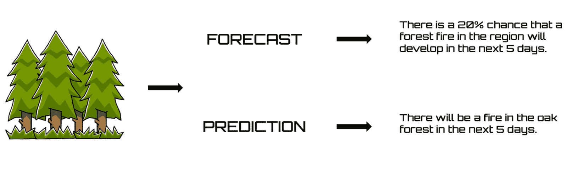
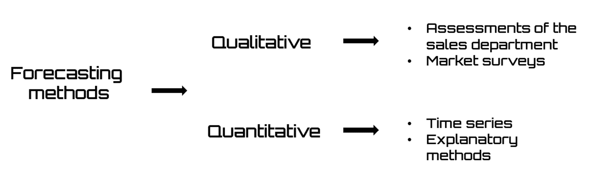
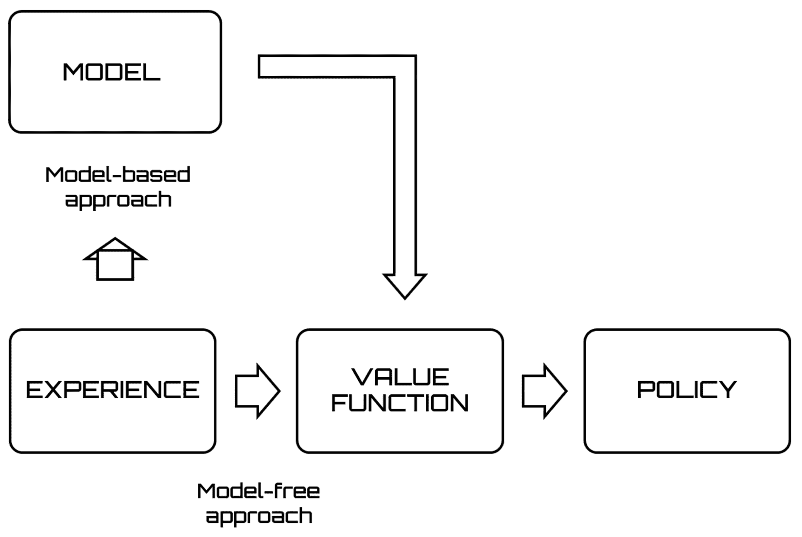
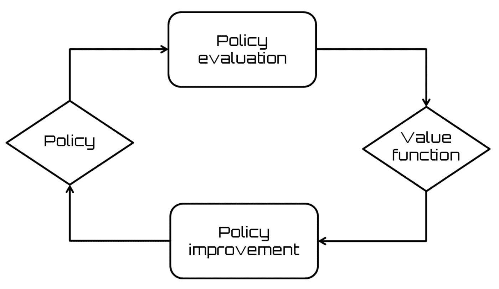
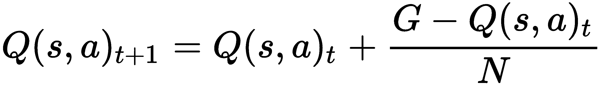
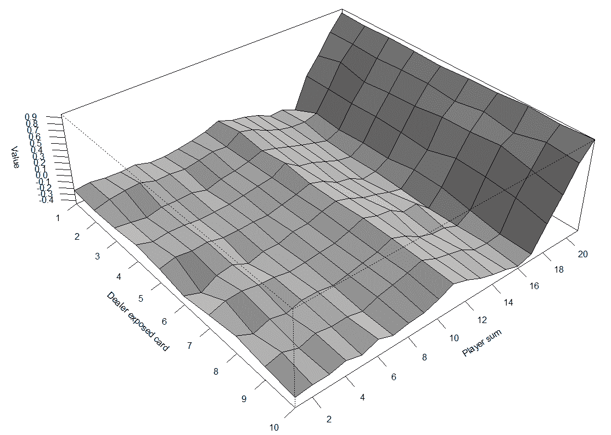

# 第六章：蒙特卡洛方法在预测中的应用

蒙特卡洛方法用于估计价值函数并发现优秀策略时，并不需要环境的模型。你可以仅通过智能体的经验，或通过从智能体与环境交互中获得的状态序列、动作和奖励样本来进行学习。经验可以通过智能体的学习过程获得，或者通过先前填充的数据集进行模拟。在本章中，我们将学习如何使用蒙特卡洛方法来预测最优策略。

到本章结束时，你应该熟悉预测技术的基本概念，并学会如何应用蒙特卡洛方法来预测环境行为。我们还将学习无模型方法来处理强化学习问题，如何估计动作值，以及如何通过学习最优策略的价值来构成一个脱离策略的算法，而无需考虑智能体的动作。

本章将覆盖以下主题：

+   预测概述

+   理解蒙特卡洛方法

+   接近无模型算法

+   动作值估计

+   使用蒙特卡洛方法预测黑杰克策略

# 技术要求

请观看以下视频，查看代码的实际应用：

[`bit.ly/2qONScL`](http://bit.ly/2qONScL)

# 预测概述

试图预测未来有着悠久的历史，贯穿了整个人类历史，适应了不同文明的典型方式和宗教背景。预测未来事件的需求似乎不仅仅是为了纯粹的推测和认知目的，还具有操作性目的。其目标是选择最合适的行为来应对将要出现的问题，并尽力充分利用未来的情况。

**预测**和**预言**常常被作为同义词使用，但区分这两个术语的含义通常是个好主意。预测允许你将未来事件的发生概率与之关联，或者指定置信区间来估计将来可观察和可测量的大小。另一方面，预言涉及识别某一可测量量在未来将呈现的具体值。因此，使用推断统计的经典工具，可以轻松地将相应的预测与所制定的预言关联起来，从而得出相关的置信区间。

在下图中，我们可以看到两个例子，用来理解预测与预言之间的区别：



预测中遇到的困难源于未来的不确定性，而在预期的时刻，未来尚未确定。预测中不确定性元素的强大相关性意味着概率计算工具在制定良好预测时至关重要。

在制定预测时，需要观察一些方面，如下所示：

+   预测的性质可以是定性的或定量的，但通常在复杂现象中，两者的方面都会出现。

+   预测对象可以是以连续性表现出来的现象的未来值，或者是现象发生的时间，或者是未来将发生事件的方式和特征。

+   预测的时间范围通常被划分为短期、中期和长期。这个区分并不清晰和精确。通常，我们谈论短期预测时，结构条件保持不变。这是因为要预测的事件将在很大程度上由在预测时已经实施的行为和行动决定。而如果决定要预测事件的基本条件仍然基本不确定时，我们则称之为长期预测。

+   最后，关于维度，预测可以仅涉及一个现象（单变量预测），或者同时涉及更多相关现象（多变量预测）。在这种情况下，它可以基于因果关系，通过这些关系，现象的行为可能会在一定的时间滞后后，决定其他现象的趋势（因果预测）。

风险和不确定性在预测制定中至关重要。事实上，最好标明与预测相关的不确定性程度。无论如何，数据必须更新，以便预测尽可能准确。

与统计预测概念相关的三个术语是：对象、目的和方法。让我们尝试理解统计预测的含义。统计预测适用于概念上定义的现象，以便进行客观测量。因此，现象和测量方法必须明确和定义，并且在整个调查过程中保持不变。预测的目的是研究现象的未来表现，这些表现由过去所发生的结构性稳定性决定。最后，预测方法代表了使用与随机过程相关的概率计算发展的数学模型，一方面，另一方面是统计推理的范式和在不确定条件下的决策理论原则。现在，让我们通过分析实际例子来理解如何使用不同的方法。

# 预测方法

预测方法的差异主要基于所使用决策的特征和目标。时间范围的长度、广泛历史数据库的可用性与均质性，以及预测所涉及产品的特征（如生命周期阶段）是影响方法选择的一些因素。

从本质上讲，预测方法分为两大类——**定性**和**定量**。在下图中，我们可以看到这两类方法的示例：



在接下来的章节中，我们将讨论这两种方法。我们将分析具体案例，理解这种分类的依据。

# 定性方法

定性预测方法用于根据过去的数据预测未来的数据。当过去的数值数据可用，并且合理假设数据中的某些模式应当延续时，便采用这些方法。这些方法通常应用于短期或中期决策。因此，定性方法主要依赖于判断，因此依赖于消费者和专家的意见与判断。当定量信息有限或不存在时，但有足够的定性信息时，便采用这些方法。

以下项目列出了一些定性方法的应用示例：

+   **销售部门评估**：每位销售代表估计其所在区域下一个时期的未来需求。该方法的假设是，最接近客户的人比其他任何人更了解客户的未来需求。然后，这些信息会被汇总，得出每个地理区域或产品系列的全球预测。

+   **市场调查**：公司通常会寻求专门从事市场调查的公司来进行此类预测。信息通常直接来自客户，或者更常见的是来自他们的代表性样本。然而，这种调查主要用于寻找新想法、了解客户是否喜欢或不喜欢现有产品、查找某个产品的最受欢迎品牌等等。

# 定量方法

当定量信息充分可用时，我们谈论定量方法。它们也用于根据过去的数据预测未来的数据。这些方法通常应用于短期或中期决策。

定量预测方法的示例包括以下内容：

+   **时间序列**：待预测的现象被视为一个黑箱，因为它并不试图识别可能影响它的现象。该方法的目标是识别现象的过去演变，并通过外推过去的数据来做出预测。换句话说，待预测的现象是相对于时间进行建模的，而不是相对于某个解释性变量（考虑销售趋势、国内生产总值（GDP）趋势等）。

+   **解释性方法**：假设待预测的变量可以与一个或多个独立变量或解释性变量相关联。例如，一个家庭的消费品需求取决于其收入和商品的年龄。

这样的预测技术采用回归方法，因此，分析的主要阶段是指定并估计一个模型，该模型将待预测的变量（响应变量）与解释变量（例如，广告和/或价格促销对销售的影响）关联起来。

这些方法可以用于以下假设：

+   关于现象过去演变的足够信息是可用的。

+   这些信息是可以量化的。

+   可以假设过去演变的特征在未来仍然存在，以便做出预测。

最终，定量方法在有足够的定量信息可用时被使用。

在接下来的部分，我们将介绍蒙特卡罗方法，特别是我们将重点介绍这些方法在解决强化学习问题中的应用。我们还将探讨使用这些方法进行预测和控制意味着什么。

# 理解蒙特卡罗方法

蒙特卡罗方法用于估计价值函数并发现优秀策略，不需要环境模型的存在。这些方法可以仅通过代理的经验来进行学习，或通过从代理与环境交互中获得的状态序列、动作和奖励样本来进行学习。经验可以通过代理在学习过程中的获取，也可以通过先前填充的数据集来模拟。在线学习中获得经验的可能性非常有趣，因为它使得即使在没有事先了解环境动态的情况下，也能获得优秀的行为。即使是通过已经填充的经验数据集进行学习，也可以很有趣，因为如果与在线学习相结合，它使得由他人经验所引发的自动策略改进成为可能。

为了解决强化学习问题，蒙特卡洛方法通过基于过去回合中获得的奖励总和（平均值）来估计价值函数。这假设经验被分为回合，并且每个回合由有限数量的过渡组成。这是因为在蒙特卡洛方法中，策略更新和价值函数估计发生在回合完成之后。事实上，蒙特卡洛方法是通过迭代估计策略和价值函数的。然而，在这种情况下，每次迭代周期相当于完成一个回合。因此，策略更新和价值函数估计是按回合进行的，正如我们刚才所说的。

蒙特卡洛方法通过使用示例回报来获取最佳策略。因此，一个能够生成这些示例过渡的环境模型就足够了。与动态规划不同，蒙特卡洛方法不需要知道所有可能过渡的概率。在许多情况下，实际上很容易生成满足期望概率分布的样本，而显式表达所有概率分布是不可行的。这些算法模拟一个称为“回合”的示例序列，并基于观察值、更新值和策略估计进行运算。在经过足够多的回合迭代后，所得结果显示出令人满意的准确性。

与基于动态规划的算法相比，蒙特卡洛算法不需要完整的系统模型。然而，它们提供了在每次仿真结束时才更新价值和策略的可能性，而不像动态规划算法那样在每一步都更新估计。

现在是时候理解使用蒙特卡洛方法进行预测和控制的意义了。

# 蒙特卡洛预测方法

蒙特卡洛预测用于估计价值函数。在这种情况下，给定策略下，从任何给定状态开始的预期总奖励将被预测。该过程遵循以下流程：

+   给出策略

+   计算价值函数

你会回忆到，策略定义了代理在当前状态下的行为方式，从而以特定方式表示在特定状态下采取某一动作的概率。

预测任务要求提供策略，目的是衡量其表现，即预测在给定状态下由策略提供的总奖励，假设策略是预先设定的。

# 蒙特卡洛控制方法

蒙特卡洛控制用于优化价值函数，以使价值函数比估计更准确。在控制中，策略并非固定，目标是找到最优策略。在这种情况下，我们的目标是找到能够最大化每个给定状态下总奖励的策略。

控制算法也适用于预测，以不同的方式预测动作的值，并调整策略以在每个阶段选择最佳动作。因此，这些算法的输出提供了一个近似最优策略和遵循该策略的未来预期奖励。

在接下来的部分中，我们将了解如何区分模型无关和模型基础的算法。

# 接近模型无关算法

在上一节中，*理解蒙特卡罗方法*，我们说过蒙特卡罗方法不需要环境模型来估计值函数或发现优秀的策略。这意味着蒙特卡罗是模型无关的：不需要**马尔可夫决策过程**（**MDP**）转移或奖励的知识。因此，我们之前不需要对环境进行建模，但在与环境的交互中会收集必要的信息（在线学习）。蒙特卡罗方法直接从经验中学习，其中一段经验是一系列元组（状态、动作、奖励和下一个状态）。

在下面的截图中，我们可以看到模型基础和模型无关方法的比较：



模型无关方法可以应用于许多不需要任何环境模型的强化学习问题。许多模型无关方法尝试学习值函数并从中推断出最优策略，或者直接在策略参数空间中搜索最优策略。这些方法也可以分类为在策略方法或离策略方法。在策略方法使用当前策略生成动作，并更新策略本身，而离策略方法则使用不同的探索策略生成动作，并相对于更新的策略。两种方法——模型无关和模型基础的差异是什么？在接下来的部分中，我们将尝试突出这些差异，以便选择解决问题的正确方法。

# 模型无关与模型基础

在这一部分中，我们将尝试通过强化学习来澄清这两种方法的差异，以解决问题。在这些问题中，代理人不知道系统的所有元素，这使他无法计划解决方案。特别是，代理人不知道环境将如何响应他的行动而发生变化。这是因为转移函数*T*是未知的。此外，他甚至不知道他的行动将获得什么即时奖励。这是因为他还没有注意到奖励函数。代理人将不得不通过尝试行动、观察回答，并在某种程度上找到一个好的策略，以获得可能的最佳最终奖励。

接下来出现一个问题：如果代理既不知道转移函数，也不知道奖励函数，那么他如何推导出好的策略呢？为此，可以采取两种方法：基于模型的方法和无模型的方法。

在第一种方法（基于模型的方法）中，代理从其观察到的环境功能中学习一个模型，然后利用该模型推导出解决方案。例如，如果代理处于状态 s1，并执行一个动作 a1，他可以观察到环境转移将其带到状态 s2，从而获得奖励 r2。此信息可以用于更新转移矩阵 T(s2 | s1, a1)和 R(s1, a1)的评估。可以使用监督学习范式执行此更新。一旦代理充分建模了环境，他就可以使用该模型来找到一个策略。采用这种方法的算法被称为基于模型的方法。

第二种方法不涉及学习环境模型来找到一个好的策略。最经典的例子之一是 Q 学习，我们将在第七章中详细分析，*时间差学习*。该算法直接估计每个状态下每个动作的最优值，从中可以通过选择当前状态下值最高的动作来推导出策略。由于这些方法不学习环境模型，它们被称为**无模型**方法。

最终，如果在学习之后，代理能够在采取任何行动之前预测下一个状态和奖励，那么我们的算法就是基于模型的。否则，它就是一个无模型算法。

现在，让我们看看蒙特卡洛方法中的动作值是如何更新的。

# 动作值的估计

一般来说，蒙特卡洛方法依赖于重复的随机采样来获得数值结果。为此，它们使用随机性来解决确定性问题。在我们的例子中，我们将使用状态和动作-状态对的随机采样，查看奖励，然后以迭代的方式回顾策略。随着我们探索每个可能的动作-状态对，过程的迭代将收敛到最优策略。

例如，我们可以使用以下程序：

+   我们将正确的动作赋予奖励+1，错误的动作赋予奖励-1，平局赋予奖励 0。

+   我们建立一个表格，其中每个键对应于一个特定的状态-动作对，每个值是该对的值。这代表了在该状态下执行该动作所获得的平均奖励。

为了解决强化学习问题，蒙特卡罗方法通过估计基于过去回合中平均获得的总奖励的值函数。这个假设是经验被分为若干回合，并且每个回合包含有限数量的转换。因为在蒙特卡罗方法中，新的值估计和策略修改发生在每个回合结束后。蒙特卡罗方法通过迭代方式估计策略和值函数。然而，在这种情况下，每个迭代周期相当于完成一次回合——新的策略和值函数估计是在每个回合后逐步进行的，如下图所示：



工作流包括对经验回合的采样以及在每个回合结束时更新估计值。由于每个回合中有许多随机决策，这些方法的方差很高，尽管它们是无偏的。

你可能会回忆起两个过程，分别叫做**策略评估**和**策略改进**：

+   策略评估算法通过应用迭代方法解决贝尔曼方程。由于我们只能在 k → ∞时保证收敛性，因此我们必须通过设置停止条件来获得良好的近似值。

+   策略改进算法基于当前的值来改进策略。

正如我们所说，新的策略和值函数估计是在每个回合后逐步进行的；因此，策略仅在回合结束时更新。

以下代码块显示了蒙特卡罗策略评估的伪代码：

```py
Initialize
    arbitrary policy π
    arbitrary state-value function
Repeat
    generate episode using π
    for each state s in episode
        the received reward R is added to the set of
       reinforcers obtained so far
        estimate the value function on the basis on the average
        of the total sum of rewards obtained
```

通常，**蒙特卡罗**一词用于描述涉及随机组件的估计方法。在这里，**蒙特卡罗**指的是基于总奖励平均值的强化学习方法。与动态规划方法通过计算每个状态的值不同，蒙特卡罗方法计算每个状态-动作对的值，因为在没有模型的情况下，只有状态值不足以决定在某个状态下执行哪个动作最优。

在详细分析了蒙特卡罗方法如何基于强化学习解决问题之后，接下来我们将查看一个实际案例。为此，我们将使用一个非常流行的游戏——二十一点。我们将看到如何使用蒙特卡罗方法预测最佳游戏策略。

# 使用蒙特卡罗方法进行二十一点策略预测

二十一点是一种在庄家和玩家之间进行的纸牌游戏。玩家如果得分超过庄家且不超过 21 点，则获胜；而得分超过 21 点的玩家**爆牌**并输掉游戏。二十一点通常使用由两副法式扑克牌组成的牌组（104 张牌）。在游戏中，A 牌可以算作 11 点或 1 点，图牌算作 10 点，其它牌按照面值计算。种子牌不具备影响或价值。点数的计算通过简单的算术运算来完成。

一旦玩家下注，庄家从左到右依次为每位玩家发放一张未盖面的牌，在每个位置上发一张，最后一张发给自己。然后庄家进行第二轮发牌，仍然不发给自己。一旦发牌结束，庄家按顺序读取每位玩家的得分，并邀请他们展示自己的牌：他们可以选择要牌（hit）或停牌（stick），完全由他们决定。如果某个玩家的点数超过 21 点，他就会输，庄家将赢得该玩家的赌注。一旦玩家们确定了自己的得分，庄家根据一个简单的规则进行游戏；也就是说，如果庄家的点数低于 17 点，他必须继续要牌，一旦得分达到或超过 17 点，他就必须停牌。如果庄家的点数超过 21 点，庄家**爆牌**，并且必须支付桌面上所有剩余的赌注。一旦所有得分都确定，庄家会将自己的得分与其他玩家进行比较，支付比自己高的组合，收取低于自己的赌注，并对平局的赌注不做处理。赢钱的赌注按面值支付。

# 二十一点游戏作为一个 MDP

二十一点可以视为一个 MDP（马尔可夫决策过程），因为玩家的状态可以通过他们手中的牌的点数来定义，而与玩家自己手中的牌无关。庄家的状态完全由他面前显示的单张牌的点数决定，因此整个游戏的最终状态由玩家和庄家的状态共同决定。最后，游戏的下一状态完全由当前状态和玩家的行动以随机方式定义。

我们回顾一下，问题可以被定义为 MDP，如果下一状态仅仅是当前状态和执行的动作的随机函数。此外，MDP 适用于那些决策空间有限且离散，结果不确定，且终止状态和相对奖赏明确的情况。MDP 的解决方案为我们提供了基于一个旨在最大化每个可能状态的奖励的过程，来执行的最优行动。

在接下来的章节中，我们将逐行解释代码：

1.  我们将开始定义可用的操作：

```py
HIT <- 1 
STICK <- 2
```

让我们来看一下*要牌*和*停牌*的含义：

+   `HIT`：从庄家那里再拿一张牌。

+   `STICK`：不再拿牌。

1.  现在，我们需要模拟从牌堆中发牌的过程，这个操作由庄家执行，庄家会给每个玩家发两张牌：

```py
BJCard <- function()
  return(sample(10,1))
```

`sample()`函数从传递的元素中提取指定大小的样本，可以选择有放回（`1`）或无放回（`0`）抽样。

1.  现在，让我们开始随机生成一个初始状态：

```py
StateInput <- function () {
   return ( c(sample(10, 1), sample(10, 1), 0))
}
```

因此，初始状态以及一般的所有可能状态，由具有这里指定的三个元素的向量表示：

+   **庄家牌**（sample(10, 1)）：一个介于 1 到 10 之间的值

+   **玩家手牌值**（sample(10, 1)）：玩家卡牌值的总和

+   **终止状态**（0）：一个二进制值（0-1），告诉我们手牌是否结束

# 状态和奖励更新

在接下来的代码块中，我们将分析并更新状态以及从环境中返回的奖励。

1.  现在，我们将创建一个函数来执行过程的单步操作（`StepFunc`），根据传递的状态（s）和动作（a），返回新的状态和奖励：

```py
StepFunc <- function (s, a) {
 if(s[3]==1)
 return(list(s, 0))

 NewState <- s
 BJReward <- 0
```

第一个检查项是验证我们是否处于终止状态（手牌结束），如果是，则退出循环，返回当前状态和奖励为零。

1.  让我们检查传递的动作：

```py
 if(a==1) { 
     NewState[2] <- s[2] + BJCard() 
     if (NewState[2]>21 || NewState[2]<1) { 
         NewState[3] <- 1
         BJReward <- -1
     }
}
```

如果要执行的动作是`HIT`，则会发现一张新卡，并更新状态和奖励。

1.  让我们看看如果过去的动作是`STICK`会发生什么：

```py
else { 
    NewState[3] <- 1
     DealerWork <- FALSE
     DealerSum <- s[1]
     while(!DealerWork) { 
         DealerSum <- DealerSum + BJCard()
         if (DealerSum>21) { 
             DealerWork <- TRUE
             BJReward <- 1
         } else if (DealerSum >= 17) { 
             DealerWork <- TRUE
             if(DealerSum==s[2])
                 BJReward <- 0
             else 
                 BJReward <- 2*as.integer(DealerSum<s[2])-1
             }
         }
     }
 return(list(NewState, BJReward))
}
```

然后，手牌传给庄家，庄家执行他的游戏。你开始通过将玩家的终止状态更新为 1 来开始。然后，庄家状态（`DealerWork` <- `FALSE`）及其当前分数被更新（`DealerSum <- s [1]`）。从这一点开始，使用`while`循环运行庄家的游戏。首先，发一张新卡。这时，使用第一个`IF`值检查庄家是否爆掉（`DealerSum > 21`）。如果爆掉了，游戏以玩家胜利结束。庄家游戏的状态更新（`DealerWork <- TRUE`），并且总奖励`BJReward` <- 1。如果不是，若`DealerSum >= 17`，则庄家停止游戏并检查玩家状态。如果分数相等（`DealerSum == s [2]`），则游戏以平局结束（`BJReward <- 0`）；否则，如果庄家的分数大于玩家的分数，玩家的`BJReward` = -1，玩家失败。如果庄家的分数小于玩家的分数，则玩家的`BJReward` = 1，玩家胜利。最后，如前所述，函数返回更新后的状态和步骤的最终奖励。

# 策略预测

现在是预测成功游戏最佳策略的时候了：

1.  在定义了更新状态和奖励的函数后，现在是定义策略的时候了：

```py
ActionsEpsValGreedy <- function(s, QFunc, EpsVal) {
 if(runif(1)<EpsVal)
 return(sample(1:2, 1))
 else
 return(which.max(QFunc[s[1],s[2],])) 
}
```

为了定义策略，创建了一个`ActionsEpsValGreedy()`函数。该函数接受以下输入：

+   `s`: 状态

+   `QFunc`: 动作值函数

+   `EpsVAl`: epsilon 的数值

这返回要遵循的动作。

正如我们在第四章中所说的，*多臂老虎机模型*，在ε-贪婪方法中，我们假设以ε的概率选择不同的行动。这个行动是在 n 个可能的行动中均匀选择的。通过这种方式，我们引入了一种探索的元素，从而提高了性能。然而，如果两个行动之间的 Q 值差异非常小，那么该算法也会选择 Q 值更高的那个行动。

1.  现在，让我们加载`foreach`库：

```py
library("foreach")
```

该包处理`foreach`循环结构。`foreach`命令允许你在不使用显式计数器的情况下遍历集合中的项。我们建议使用该包的返回值，而不是它的副作用。以这种方式使用时，它类似于标准的`lapply`函数，但不需要评估函数。因此，使用`foreach`可以方便地并行执行循环。

1.  最后，我们可以定义`MontecarloFunc`函数，它将指导我们解决问题。此函数接受以下变量作为输入：

+   `NumEpisode`：要播放的回合数

`MontecarloFunc()`函数返回以下值：

+   `QFunc`：更新的行动值函数

+   `N`：更新后的状态-行动访问次数

1.  让我们详细分析一下：

```py
MontecarloFunc <- function(NumEpisode){
  QFunc <- array(0, dim=c(10, 21, 2))
  N <- array(0, c(10,21,2))
  N0=100
```

一旦传入输入，以下变量将被初始化：

+   `QFunc`：作为数组的行动值函数，包含以下变量：所有可能的卡牌值（dim=10）、所有可能的和值（dim=21）以及所有可能的行动（dim=2）

+   `N`：状态-行动访问次数

+   `N0`：N 的偏移量

1.  然后，我们将定义一个策略：

```py
 policy <- function(s) {
     ActionsEpsValGreedy(s, QFunc, N0/(sum(N[s[1], s[2],])+N0))
 }
```

1.  我们现在将使用一个循环执行所有必要的回合，以计算最佳策略：

```py
foreach(i=1:NumEpisode) %do% {
 s <- StateInput()
 SumReturns <- 0
 N.episode <- array(0, c(10,21,2))
```

1.  现在，让我们为每个回合玩一场游戏：

```py
while(s[3]==0) {
 a <- policy(s)
 N.episode[s[1], s[2], a] <- N.episode[s[1], s[2], a] + 1
 StateReward <- StepFunc(s, a)
 s <- StateReward[[1]]
 SumReturns <- SumReturns + StateReward[[2]]
}
```

在游戏的终止状态为 0（游戏进行中）之前，它执行以下操作：

+   根据定义的策略选择一个行动来执行

+   增加访问计数器

+   通过调用`StepFunc()`函数执行一个步骤

+   更新你的奖励

1.  做完这些后，我们继续更新 Q 和 N：

```py
IndexValue <- which(N.episode!=0)
 N[IndexValue] <- (N[IndexValue]+N.episode[IndexValue])
 QFunc[IndexValue] <- QFunc[IndexValue] + (SumReturns-QFunc[IndexValue]) / N[IndexValue]
 }
```

上述代码块包括了整个过程的关键元素——Q 函数的更新模式。在这种情况下，采用了增量方法。

1.  事实上，函数*q*是使用以下函数更新的：



这里：

+   *G*：这是奖励的总和。

+   Q：这是行动值函数。

+   *N*：这是状态-行动访问次数。

1.  最后，返回以下结果：

```py
return(list(QFunc=QFunc, N=N))
 }
```

1.  定义了所有必要的函数后，到了运行模拟的时候：

```py
MCModel <- MontecarloFunc(NumEpisode=100000)
```

我们只需传递获得良好预期的最佳策略所需的回合数。

1.  此时，为了分析结果，我们可以绘制图形。然而，需要适当格式化行动值函数：

```py
StateValueFunc <- apply(MCModel$QFunc, MARGIN=c(1,2), FUN=max)
```

为此，我们使用了`apply()`函数，该函数返回一个向量或数组，或者是通过将函数应用于数组或矩阵的边界所得到的值列表。

1.  现在，我们可以绘制一张图表：

```py
persp(StateValueFunc, x=1:10, y=1:21, theta=50, phi=35, d=1.9, expand=0.3, border=NULL, ticktype="detailed",
 shade=0.6, xlab="Dealer exposed card", ylab="Player sum", zlab="Value", nticks=10)
```

使用了`persp()`函数。此函数绘制了一个在 x-y 平面上表面的透视图。

绘制了以下图表：



通过这种方式，我们对价值函数有了良好的估计。

# 总结

在本章中，我们探讨了蒙特卡罗方法的基本概念。蒙特卡罗方法通过将问题的解决方案表示为假设总体的一个参数，并通过随机数序列获取的总体样本来估算这个参数。之后，我们强调了这种技术为我们提供的不同方法之间的差异。蒙特卡罗预测用于估算价值函数，而蒙特卡罗控制用于优化价值函数，使价值函数比估算值更准确。

然后我们继续分析基于无模型方法的算法与基于有模型方法的算法之间的区别。此外，我们还逐步分析了进行蒙特卡罗策略评估的过程。最后，作为学习到的概念的实际案例，进行了涉及蒙特卡罗方法的二十一点策略预测。

在下一章中，我们将学习不同类型的**时序差分**（**TD**）学习算法。你将了解如何使用 TD 算法预测系统的未来行为，并学习 Q 学习算法的基本概念。你还将学习如何使用当前最佳策略估计通过 Q 学习算法生成系统行为。
