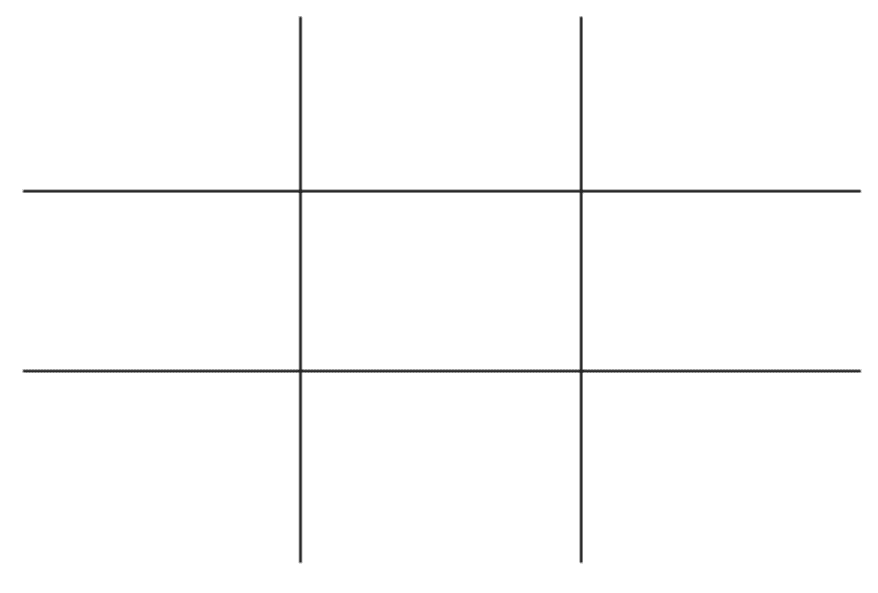
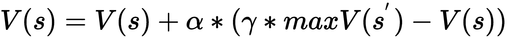
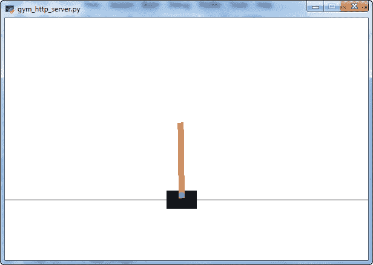
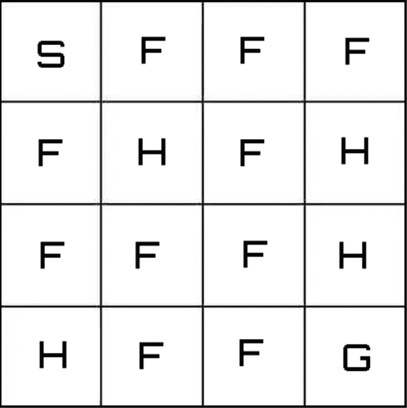
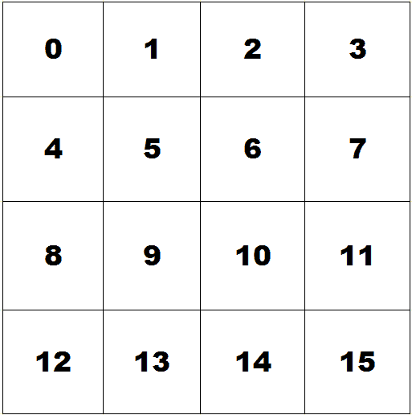
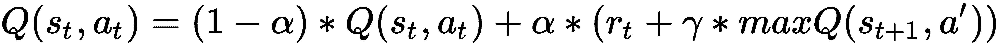

# 第八章：博弈应用中的强化学习

游戏一直是人类文化中的一种现象，人们通过它展现智慧、互动和竞争。但游戏也是逻辑学、**人工智能**（**AI**）、计算机科学、语言学、生物学以及最近越来越多地出现在社会科学和心理学中的一个重要理论范式。游戏，尤其是战略游戏，为强化学习算法提供了理想的测试环境，因为它们可以作为实际问题的模型。

在本章中，我们将学习如何使用强化学习算法解决博弈论中的问题。到本章结束时，我们将掌握博弈论的基本概念。我们还将学习如何安装和配置 OpenAI Gym 库，了解 OpenAI Gym 库的工作原理，并学习如何使用 Q 学习解决游戏问题。除此之外，我们还将了解如何进行学习和测试阶段，并学习如何使用 R 开发 OpenAI Gym 应用。

在本章中，我们将涵盖以下主题：

+   理解博弈论的基础

+   探索博弈论的应用

+   玩井字棋游戏

+   介绍 OpenAI Gym 库

+   使用 FrozenLake 环境的机器人控制系统

# 技术要求

查看以下视频，了解代码在实际应用中的表现：

[`bit.ly/2tffzMD`](http://bit.ly/2tffzMD)

# 理解博弈论的基础

博弈论是一门数学科学，研究和分析主体在冲突或战略互动情况下的个体决策，这些决策涉及与其他竞争主体的互动，目的是最大化每个主体的利润。在这种情况下，一个主体的决策可能会影响另一个（或多个）主体的结果，反之亦然，依据反馈机制，通过模型寻求竞争性和/或合作性解决方案。

博弈论的理论起源可以追溯到 1654 年，那时布莱兹·帕斯卡（Blaise Pascal）与皮埃尔·德·费马（Pierre de Fermat）就赌博概率的计算进行书信往来。**博弈论**一词最早由埃米尔·博雷尔（Emil Borel）在 1920 年代使用。博雷尔发展了**博弈理论**，提出了一个包含两名玩家的零和博弈，并试图寻找一种解决方案，即冯·诺依曼的零和博弈解决概念。普遍认为，约翰·冯·诺依曼（John von Neumann）和奥斯卡·摩根斯坦（Oskar Morgenstern）于 1944 年发布的《博弈论与经济行为》一书标志着现代博弈论的诞生，尽管其他作者（如恩斯特·泽梅洛（Ernst Zermelo）和阿尔芒·博雷尔（Armand Borel））也曾讨论过博弈论。

这两位学者的思想可以非正式地描述为试图在涉及资源的赢得或分配的情境下，用数学描述人类行为。后来的著名学者，特别是在**非合作博弈**方面有深入研究的，是数学家约翰·福布斯·纳什（John Forbes Nash jr.），他的事迹被荣·霍华德的电影《美丽心灵》所呈现。

曾有八位诺贝尔经济学奖获得者处理过博弈论问题。约翰·梅纳德·史密斯（John Maynard Smith），一位长期卓越的生物学家、遗传学家以及萨塞克斯大学教授，也因其在这一领域的贡献获得了克拉福德奖。

在接下来的章节中，我们将介绍博弈论的基本概念，然后分析研究人员所面临的主要博弈类型。

# 博弈论的基本概念

博弈论的主要目标是胜利。每个人必须了解游戏规则并意识到每一步的后果。个人打算做出的所有行动构成了一种策略。根据所有玩家采取的策略，每个玩家根据适当的衡量单位获得报酬。报酬可以是正面、负面或无。若每个玩家的支付与其他玩家的损失相对应，则该游戏称为**常数和**游戏。两名玩家之间的**零和**游戏代表了一个奖励从一方支付给另一方的情况。若策略对所有玩家都是满意的，则称为均衡策略；否则，就需要计算并最大化玩家的数学期望或预期值，即可能奖励的加权平均值，每个奖励根据该事件的概率进行加权。

在一个游戏中，有一个或多个竞争者试图赢得比赛，也就是最大化他们的收益。收益由一个规则定义，量化地规定了竞争者根据他们的行为获得的奖励。这种函数叫做支付函数。每个玩家可以采取有限或无限的行动或决策，从而确定一种策略。每种策略都有一个结果，表现为采纳该策略的玩家所获得的后果，可能是奖励（正面/负面）。游戏的结果完全由他们策略的顺序以及其他玩家所采取的策略决定。

如何为每个玩家表征游戏的结果呢？如果你以奖励来衡量策略的后果，那么每个策略都可以匹配一个数值：负值表示支付给对手，如罚款；而正值则表示收益，即获得奖励。与玩家所采取的策略以及其他所有玩家在某一时刻所采取的策略相关的增益或损失，通常通过支付函数所指示的货币值来表示。

玩家所做的决策自然会相互碰撞，或者与其他玩家所做的决策相一致，从而衍生出各种类型的博弈。

一个有用的工具来表示两个玩家、两家公司或两个个人之间的互动是一个双重决策矩阵或表格。这个决策表显示了由两个玩家进行的博弈的策略和获胜情况。因此，决策矩阵是一个表示工具，通过它我们可以列出玩家之间互动的所有可能结果，并为每种情形分配奖励值，该奖励值在每种情况下竞争给予每个玩家。另一种表示形式涉及到每个决策的采取顺序，或者行动的执行方式。游戏的这一特征可以通过树形图来描述，树形图表示从初始状态到最终状态之间，竞争者的每一个可能组合，最终在这些状态中分配奖励。

描述一个战略情境需要四个基本要素：

+   **玩家**： 游戏中的决策者（谁参与？）

+   **行动**： 玩家可以选择的可能行动或动作（他们能做什么？）

+   **策略**： 玩家们的行动计划（他们打算做什么？）

+   **收益**： 玩家获得的可能收益（他们得到了什么？）

因此，策略是一个完整且有条件的计划，或决策决策，明确规定了玩家在任何可能需要做出决策的情况下必须采取的行动。作为一个完整的有条件计划，策略通常定义了玩家在游戏中可能无法实现的情境下应该选择哪种行动。在接下来的部分中，游戏将被分类，并且每个主题会有简短的描述。

# 游戏类型

游戏可以根据不同的范式进行分类，以下是其中几种：

+   合作

+   对称性

+   总和

+   排序

在接下来的部分中，我们将简要描述这些主题。

# 合作博弈

当玩家的利益不直接对立，而是具有共同利益时，便呈现出合作博弈。玩家们追求一个共同的目标，至少在游戏进行期间如此；其中一些玩家可能会倾向于联合起来以提高他们的**回报**。保证由绑定协议提供。那么，如何用数学来表示共同利益呢？个人利益在联盟或联合中的结合体的概念通过定义本质性博弈来表达；而一个普通联盟的价值则通过一个称为特征函数的函数来衡量。

相反，在非合作博弈中，也称为**竞争性博弈**，玩家不能达成具有约束力的协议（即使是通过规定）。约翰·纳什提出的*纳什均衡*适用于这一类博弈，它可能是整个理论中最著名的概念，因为它有广泛的应用领域。在非合作博弈中采用的理性行为标准是个体化的，称为最大策略。

# 对称博弈

在对称博弈中，采用某一策略所获得的利润仅取决于其他玩家所采用的策略，而与采用该策略的玩家无关。如果玩家的身份可以改变而不改变支付结果，则该博弈是对称的。

相比之下，在不对称博弈中，两名玩家没有相同的策略系列。然而，也有可能一个博弈对于两名玩家来说具有相同的策略，但它依然是不对称的。

# 零和博弈

零和博弈是常数和博弈的一个特例，其中常数为零。零和博弈建模了所有对立的情境，其中两名玩家的对抗是完全的：一名玩家的胜利恰好与另一名玩家的失败相对应。换句话说，两个竞争者根据所使用策略所获得的总利润始终为零。例如，在象棋中，这意味着唯一的三种可能结果是：胜利、失败和平局（奖励：+1，-1 和 0）。

# 顺序博弈

在顺序博弈中，后续的玩家保留了一些关于前一玩家行为的知识。这并不意味着他们知道前一玩家的所有行动。例如，一名玩家可能知道前一名玩家没有进行某个动作，但不知道第一名玩家做了哪些其他可选动作。

现在我们已经学会了根据一些范式来分类游戏。为什么分析博弈如此重要？这是因为许多现实生活中的问题可以通过博弈论得出的解决方案来应对。在下一节中，我们将看到一些例子。

# 探索博弈论的应用

博弈论一直吸引着许多研究者，因为它在实际领域和人类各个工作领域中的应用非常有价值，例如以下几个方面：

+   **哲学**：哲学一直在分析博弈论，因为它提供了一种方法来澄清一些哲学家的逻辑难题，例如康德、卢梭、霍布斯以及其他社会政治理论家的难题。

+   **经济学**：商业世界中的许多投机行为可以通过博弈论的方法来建模。一个著名的例子是寡头定价与囚徒困境之间的相似性。

+   **生物学**：尽管大自然常被认为是残酷的，但许多不同物种之间存在合作。这种共存的原因可以通过博弈论来建模。

+   **AI**：人类可以根据其所接收的环境刺激做出决策。而机器则只能在编程时根据多种条件的决策列表进行规划。这个限制可以通过人工智能来克服，它赋予机器从创造者那里获取新决策的能力，而不是仅依赖预先计划的规则。为此，程序必须根据观察到的刺激和经验生成新的回报矩阵。

在接下来的章节中，我们将分析一个广泛流行的游戏，并学习如何使用强化学习进行处理。

# 玩井字游戏

井字游戏是用强化学习解决的第一个游戏的完美例子：实际上，与其他策略游戏相比，它有一些简单的规则。此外，它相对容易编程，而且因为游戏最多只进行九轮，评估函数的训练非常快速。井字游戏是一个完美信息的双人游戏，每个玩家被分配一个符号来进行游戏。通常使用的符号是叉和圈。游戏由使用叉号的玩家开始。

游戏网格具有 3x3 的结构，初始时呈现九个空单元格，如下所示：



玩家轮流选择一个空格，并绘制自己的符号。成功将三个符号放置在水平、垂直或对角线上的玩家获胜。如果游戏网格填满且没有任何玩家成功完成三符号的直线，游戏以平局结束。因此，如果正确玩法，井字游戏最终会以平局告终，使得游戏毫无意义。

在接下来的章节中，我们将介绍使用 Q-learning 算法玩游戏的`tictactoe`包。

# tictactoe 包

为了处理井字游戏，我们将使用 CRAN 网站上可用的`tictactoe`包。该包实现了一个控制台上的井字游戏，可以与人类或 AI 玩家对战。各种等级的 AI 玩家通过 Q-learning 算法进行训练。

以下表格提供了有关该包的一些信息：

| 包 | `tictactoe` |
| --- | --- |
| 日期 | 2017-05-26 |
| 版本 | 0.2.2 |
| 标题 | 井字游戏 |
| 作者 | 森本光太 |

在该包的帮助下，我们将与计算机进行第一次对局，以突出游戏的特性，然后我们将训练一个人工代理，按照最佳策略进行游戏，以获得最多的胜利。

# 玩井字游戏

首先，我们将看到如何设置游戏环境，并开始第一次游戏：

1.  首先，我们需要导入库：

```py
library(tictactoe)
```

1.  然后，我们可以在 R 控制台上使用`ttt()`函数启动井字游戏，如下所示：

```py
ttt(ttt_human(name = "GIUSEPPE"), ttt_random())
```

请注意以下事项：

+   `ttt_human()`创建一个人类井字游戏玩家；如果我们愿意，还可以通过 name 属性设置名字（例如`name = "GIUSEPPE"`）。

+   `ttt_random()`设置一个随机玩家，该玩家仅随机地将对方的符号（圆圈）放置在一个空位上。

控制台返回以下网格：

```py
A B C
 ------
 1| . . .
 2| . . .
 3| . . .

 Player 1 (GIUSEPPE) to play
choose move (e.g. A1) >
```

正如预期的那样，游戏基于一个简单的 3x3 网格；为了方便识别单元格，列用字母 A、B、C 命名，而行用数字 1、2、3 表示。这意味着左上角的第一个单元格将被标识为 A1。控制台打印的最后一行邀请玩家 1（`GIUSEPPE`）进行下一步操作。

1.  我们首先在单元格 A1 中放置 X，随后返回以下结果：

```py
action = A1

 A B C
 ------
 1| X . . 
 2| . . .
 3| . . .

Player 2 (random AI) to play

action = B1

 A B C
 ------
 1| X O .
 2| . . .
 3| . . .

Player 1 (GIUSEPPE) to play
choose move (e.g. A1) >
```

如我们在前面的代码块中看到的，X 已正确放置在左上角的单元格中，然后玩家 2（计算机）随机地将符号（O）放置在一个空位上。最后一行再次邀请玩家 1 进行下一步操作。我们可以这样进行，直到游戏结束。

有三种结果可供选择——0、1 和 2，分别表示平局、玩家 1 获胜和玩家 2 获胜。例如：

```py
action = B2
game over
 A B C
 ------
 1| X . X
 2| O X O
 3| X . O

won by Player 1 (GIUSEPPE)!
```

在这种情况下，我赢了，但仅仅是因为计算机随机地放置了它的符号，并没有遵循任何策略。

# 使用 Q-learning 训练代理

我们可以训练代理遵循一种策略。我们来看看怎么做：

1.  为了开始，我们可以模拟游戏，检查两个人工智能代理互相对弈时得到的结果：

```py
player1<- ttt_ai()
player2<- ttt_ai()
SimulatedGame <- ttt_simulate(player1, player2, N = 100)
```

在上述代码中，使用了以下函数：

+   `ttt_ai()`

+   `ttt_simulate`

`ttt_ai()`函数创建了一个人工智能的井字棋玩家。我们没有使用任何参数，实际上可以使用以下参数：

+   `name`：玩家名称。

+   `level`：AI 强度必须是从 0（最弱）到 5（最强）之间的整数。

`level`参数定义了我们创建的代理的有效性；从 0 到 5，代理的游戏管理技能逐渐提高，使得对手的游戏变得更加困难。在之前的指令中，我们已经使用`ttt_random()`函数创建了一个人工智能代理，它是`ttt_ai()`函数的别名，其中代理的级别默认设置为 0。

`ttt_ai()`函数返回一个对象，该对象与`getmove()`函数关联；此函数接受一个`ttt_game`类型的对象，并使用策略函数返回一个最优的动作。

一个`ttt_ai`对象包含值函数和策略函数。值函数将一个游戏状态与从第一个玩家视角的评估相关联。策略函数将一个游戏状态与通过评估值函数获得的一组最优动作相关联。这些函数通过基于 Q-learning 的算法进行训练，我们在第七章中详细讨论了*时序差分学习*。

使用的第二个函数是`ttt_simulate()`，它模拟了两个人工智能代理之间的井字棋游戏。传入的参数如下：

+   `player1`, `player2`：用于模拟的人工玩家。

+   `N`：模拟游戏的次数。

除这些外，还可以使用以下附加参数：

+   `verbose`：如果为真，则显示进度报告。

+   `showboard`：如果为真，则显示游戏过渡。

+   `pauseif`：当出现指定结果时暂停模拟。这对探索性目的很有用。

该函数返回一个整数向量，表示所执行模拟的结果。实际上，每次模拟都会返回一个值，介于 0、1 和 2 之间，分别代表平局、玩家 1 胜利或玩家 2 胜利，正如我们已经提到的那样。

1.  我们可以使用 `str()` 函数验证我们所说的内容，该函数返回一个 R 对象内部结构的紧凑视图：

```py
str(SimulatedGame)
```

返回以下结果：

```py
int [1:100] 1 2 2 0 1 1 2 1 2 2 ...
```

1.  我们可以做更多的事；例如，我们可以使用 `prop.table()` 函数验证整个模拟中的三种游戏结果的发生情况，方法如下：

```py
prop.table(table(SimulatedGame))
```

1.  此函数接受一个表格作为参数，并计算其包含的数据的比例。返回以下结果：

```py
SimulatedGame
 0   1    2
0.12 0.51 0.37
```

通过这种方式，我们可以看到，在进行的模拟中，玩家 1 获胜的次数更多（51%），而玩家 2 获胜的次数较少（37%），平局的次数明显较低（12%）。

1.  现在，我们重复实验，但这次我们将通过基于 Q 学习算法的训练来提高两个玩家之一的表现。如同之前的做法，我们首先创建两个代理：

```py
player3<- ttt_ai()
player4<- ttt_ai()
```

1.  完成此操作后，我们将重点放在玩家 4 上，尝试通过训练阶段提高他的表现，在这个阶段他将学习遵循最佳策略：

```py
TrainPlayer4 <- ttt_qlearn(player4, N = 500, verbose = FALSE)
```

`ttt_qlearn()` 函数通过 Q-learning 训练井字棋代理。以下参数可用：

+   `player`：待训练的人工玩家。

+   `N`：回合数。

+   `epsilon`：随机探索动作的比例。

+   `alpha`：学习率。

+   `gamma`：折扣因子。

+   `simulate`：如果为真，则在训练期间进行模拟。

+   `sim_every`：在进行此多次训练后进行模拟。

+   `N_sim`：模拟游戏的次数。

+   `verbose`：如果为真，则显示进度报告。

在基于 Q 学习的训练过程中，代理与自己对弈以更新值函数和策略。所使用的算法是带有 epsilon 贪心策略的 Q 学习。

对于每个状态 s，玩家根据以下公式更新值函数：



这发生在第一个玩家的回合。当第二个玩家的回合到来时，使用的公式将始终相同，只要你将最大值替换为最小值。以类似的方式，我们继续更新策略；也就是说，我们寻找一组行动，使我们能够到达下一个状态，从而最大化值函数。

控制过程的参数如下：

+   学习率决定了新信息被获取的频率，并将替代旧信息。折扣因子为 0 时，会阻止智能体学习；然而，折扣因子为 1 时，智能体只对最近的信息感兴趣。

+   折扣因子决定未来奖励的重要性。折扣因子为 0 时，智能体只会使用当前奖励，而折扣因子接近 1 时，智能体也会关注他在长期未来将获得的奖励。

算法中使用的策略使得玩家采用 e-greedy 方法选择下一个动作。这意味着智能体将在概率 1-e 下遵循其策略，而在概率 e 下选择随机动作。

游戏结束时，玩家将最终状态设置如下：

+   如果玩家 1 胜利，结果为 100

+   如果玩家 2 获胜，则结果为 -100

+   如果是平局，结果为 0

学习过程重复 N 次，N 是用户设定的值：

1.  在训练好玩家 4 后，我们可以模拟游戏：

```py
SimulatedGameQLearn <- ttt_simulate(player3, player4, N = 100)
```

1.  我们再次验证结果的出现次数：

```py
prop.table(table(SimulatedGameQLearn))
```

返回以下结果：

```py
SimulatedGameQLearn
 0    1    2
0.31 0.21 0.48
```

在这种情况下，训练过的智能体（玩家 4）赢得了最多的游戏（48%），其次是平局（31%），最后是玩家 3 赢得的游戏（21%）。因此，玩家的训练通过创建一个能够识别出让他获得更多胜利的策略的智能体，逆转了游戏的结果。

在接下来的部分中，将介绍 OpenAI Gym 库；这个库包含许多环境，可以让我们使用强化学习来训练智能体。

# 介绍 OpenAI Gym 库

OpenAI Gym 是一个帮助我们实现基于强化学习算法的库。它专注于强化学习中的阶段性设置。换句话说，智能体的经历被分为一系列的阶段。智能体的初始状态由一个分布随机采样，并且交互直到环境达到终止状态。这一过程对每个阶段重复，目的是最大化每个阶段的总奖励期望，并在尽可能少的阶段内实现高性能。

Gym 是一个用于开发和比较强化学习算法的工具包。它支持训练智能体完成从走路到玩 Pong 或弹球等游戏的各种任务。该库可以通过以下链接访问：[`gym.openai.com/`](https://gym.openai.com)。

OpenAI Gym 是一个更加宏大的项目的一部分，该项目被称为 OpenAI 项目。OpenAI 是一家由埃隆·马斯克和山姆·奥特曼创办的**人工智能**（**AI**）研究公司。它是一个非营利项目，旨在促进和发展友好的 AI，以便造福整个人类。该组织的目标是通过将专利和研究公开，来与其他机构和研究人员自由合作。创始人之所以启动这一项目，是因为他们对 AI 的不加限制使用可能带来的生存风险感到担忧。

OpenAI Gym 是一个程序库，允许你开发人工智能、衡量智能能力，并增强学习能力。简而言之，它是一个以算法形式呈现的*健身房*，用来训练当前的数字大脑，并将其投射到未来。除此之外，还有另一个目标。OpenAI 希望通过资助那些能够促进人类进步的项目来激励 AI 领域的研究，即便这些项目在经济上没有直接回报。而通过 Gym，它旨在标准化 AI 的衡量方法，以便研究人员能够在平等的条件下竞争，并了解他们的同事取得了哪些进展，最重要的是，它专注于那些对所有人都真正有益的成果。

可用的工具非常多。从玩像 Pong 这样的老式视频游戏，到在围棋中对战，再到控制机器人，我们只需将算法输入到这个数字化空间，便可看到它如何工作。第二步是将获得的基准数据与其他人进行比较，看看我们在同行中处于什么位置，也许我们还可以与他们合作，共享互利成果。

以下列表展示了库中可用的一些环境；这些环境按类别分组，便于搜索：

+   **算法**：执行计算任务，如加法多位数和反转序列。你可能会认为这些任务对计算机来说很简单，但挑战在于如何仅通过示例来学习这些算法。这些任务的一个优点是，可以通过变化序列长度轻松调节难度。

+   **Atari**：玩经典的 Atari 游戏。我们已将街机学习环境（对强化学习研究产生了巨大影响）集成到一个易于安装的形式中。

+   **Box2D**：在 Box2D 模拟器中进行连续控制任务。

+   **经典控制**：完成小规模任务，主要来自强化学习文献。它们的目的是帮助你入门。

+   **MuJoCo**：连续控制任务，在快速物理模拟器中运行。此任务使用 MuJoCo 物理引擎，该引擎专为快速且精确的机器人模拟设计。

+   **机器人技术**：为 Fetch 和 ShadowHand 机器人提供基于目标的模拟任务。

+   **Toy text**：简单的文本环境，帮助你入门。

特别是，经典控制类别提供了非常有用的环境，能够重现重要物理实验的场景。

OpenAI Gym 对我们代理的结构没有假设，并且与任何数值计算库兼容。Gym 库是一组测试问题——环境——我们可以用来处理强化学习算法。这些环境具有共享的接口，允许你编写通用的算法。首先，让我们看看如何安装这个库。

# OpenAI Gym 安装

如前所述，OpenAI Gym 是一个在 Python 环境中编写的库。为了能够将其集成到 R 环境中，必须在计算机上安装 Python 版本。首先，我们需要安装 OpenAI 的`gym-http-api` API；这些是允许访问越来越多环境的 API。

**API**，即**应用程序编程接口**，是创建和集成应用软件的一组定义和协议。它们允许你的产品或服务与其他产品或服务进行通信，而无需知道它们是如何实现的，从而简化了应用开发，并节省了时间和成本。在创建新工具和产品或管理现有工具时，API 提供了灵活性，保证了创新机会，并简化了设计、管理和使用。

1.  要下载并安装 OpenAI `gym-http-api` API，你可以运行以下 shell 命令。执行这些命令时，必须使用命令窗口：

```py
git clone https://github.com/openai/gym-http-api
cd gym-http-api
pip install -r requirements.txt
```

上面代码块中的第一行代码使用 Git 软件从 github 仓库下载蜜蜂并进行安装。Git 软件允许你在管理项目的同时保持对源代码及其历史的控制，并且允许更多开发者在项目中协作；它本质上是一个版本控制系统。Git 是开源社区的事实标准，由 Linus Torvald 在 2005 年为 Linux 内核开发而创建，且在创建两个月后由 Google 开发者 Junio Hamano 维护；Git 不断发展，并且完全免费且开源。第二行代码将命令行移动到我们复制仓库的文件夹中。最后，第三行使用 pip 软件安装 API。

上述代码旨在由单个用户在本地运行。包括一个 Python 客户端，用于演示如何与服务器进行交互。

1.  要从命令行启动服务器，进入我们安装 API 的文件夹，然后运行以下命令：

```py
python gym_http_server.py
```

返回以下结果：

```py
Server starting at: http://127.0.0.1:5000
```

1.  现在服务器已准备好与我们的脚本交互。我们可以安装`gym`包：

```py
install.packages("gym")
```

以下表格提供了一些关于`gym`包的信息：

| 包 | `gym` |
| --- | --- |
| 日期 | 2016-10-25 |
| 版本 | 0.1.0 |
| 标题 | 提供对 OpenAI Gym API 的访问 |
| 作者 | Paul Hendricks |

为了验证包的功能，我们可以执行文档中提供的示例脚本。

1.  让我们开始导入这个库：

```py
library(gym)
```

1.  首先，我们将与客户端建立连接，以便与服务器进行交互：

```py
RemoteBase <- "http://127.0.0.1:5000"
Client <- create_GymClient(RemoteBase)
print(Client)
```

`create_GymClient()`函数实例化一个`GymClient`实例，以便与 OpenAI Gym 服务器集成。以下结果已打印：

```py
<GymClient: http://127.0.0.1:5000>
```

1.  连接已建立，现在我们可以创建环境：

```py
EnvId <- "CartPole-v0"
InstanceId <- env_create(Client, EnvId)
print(InstanceId)
```

以下结果已打印：

```py
[1] "376e0df2"
```

1.  现在，我们可以列出当前工作会话中创建的所有环境，并列出可用的蜜蜂：

```py
AllEnvsAvailable <- env_list_all(Client)
print(AllEnvsAvailable)
```

以下结果已打印：

```py
$`376e0df2`
[1] "CartPole-v0"
```

1.  通过这种方式，我们可以确认模拟环境已正确创建，现在我们可以请求与其交互所需的信息：

```py
ActionSpaceInfo <- env_action_space_info(Client, InstanceId)
print(ActionSpaceInfo)
```

`env_action_space_info()`函数评估一个动作是否属于环境的动作空间。以下结果已打印：

```py
$n
[1] 2

$name
[1] "Discrete"
```

1.  在此环境中，只有两个动作可用。现在让我们创建代理：

```py
agent <- random_discrete_agent(ActionSpaceInfo[["n"]])
```

`random_discrete_agent()`函数仅创建一个示例随机离散代理。

1.  现在，我们将设置一个文件夹来保存结果，并打开一个窗口以监控环境变化：

```py
OutDir <- "/TempFolder/results"
env_monitor_start(Client, InstanceId, OutDir, force = TRUE, resume = FALSE)
```

1.  让我们初始化一些在模拟中需要的变量：

```py
EpisodeCount <- 100
MaxSteps <- 200
Reward <- 0
done <- FALSE
```

1.  现在，我们将实现两个循环来使用随机动作与环境进行交互：

```py
for (i in 1: EpisodeCount) {
  Object <- env_reset(Client, InstanceId)
  for (i in 1: MaxSteps) {
    action <- env_action_space_sample(Client, InstanceId)
    results <- env_step(Client, InstanceId, action, render = TRUE)
    if (results[["done"]]) break
  }
}
```

返回以下截图：



在截图中，你可以看到小车-杠杆（cart-pole），它将根据算法提供的指示进行移动。

1.  最后，我们将使用以下命令关闭窗口：

```py
env_monitor_close(Client, InstanceId)
```

这个例子帮助我们开始与 OpenAI Gym 中可用的环境进行交互。如果你没有理解某些部分，不用担心，接下来的部分我们可以深入学习它们。

# OpenAI Gym 方法

OpenAI Gym 提供了`env`类，该类封装了环境及其可能的内部动态。该类具有不同的方法和属性，用于实现创建新环境。最重要的方法分别是 reset、step 和 render，我们来简要了解一下它们：

+   **reset 方法**的任务是重置环境，将其初始化为初始状态。在 reset 方法中，必须包含构成环境的元素的定义，在本例中是机械臂、待抓取物体及其支撑物的定义。

+   **step 方法**的任务是将环境向前推进一步。它需要输入要执行的动作，并返回代理的新观察结果。在该方法中，必须定义运动动态的管理、状态和奖励的计算以及完成回合的控制。

+   第三种也是最后一种方法是我们必须定义要**渲染**到哪个内部，因为每个步骤的元素都必须被表示出来。该方法涉及不同类型的渲染，例如人类、`rgb_array`或`ansi`。使用人类类型时，渲染在屏幕或命令行界面上进行，且该方法不返回任何内容；使用`rgb_array`类型时，调用该方法会返回一个表示屏幕 RGB 像素的 n 维数组；选择第三种类型时，返回方法会返回一个包含文本表示的字符串。为了渲染，OpenAI Gym 提供了一个 viewer 类，通过它可以将环境的元素绘制为一组多边形和圆形。

关于环境的属性，`env`类提供了动作空间、观察空间和奖励范围的定义。动作空间属性表示动作空间，即智能体在环境中可以执行的可能动作的集合。通过观察空间属性，定义组成状态的参数的数量，并且为每个参数定义可以假设的值范围。奖励范围属性包含在环境中可以获得的最小和最大奖励，默认设置为（-∞，+∞）。

使用框架所提出的`env`类作为新环境的基础，采用工具包提供的通用接口。通过这种方式，创建的环境可以被集成到工具包库中，并且它们的动态可以通过 OpenAI Gym 社区用户已实现的算法进行学习。

在接下来的部分中，我们将使用 OpenAI Gym 环境实现一个机器人控制系统。

# 使用 FrozenLake 环境的机器人控制系统

从技术角度讲，机器人可以被看作是一种特殊类型的自动控制，即一种物理上位于环境中的自动化装置，它能够通过传感器感知环境的某些特征，并且可以执行动作以改变环境。这些动作是通过所谓的执行器来完成的。

传感器所做的测量与执行器所给出的命令之间的所有内容可以被定义为控制程序或机器人的控制器。这是机器人智能编码的组件，在某种意义上，它构成了必须引导其行动以获得期望行为的大脑。控制器可以通过多种方式实现：通常它是运行在一个或多个微控制器上的软件，这些微控制器物理集成在系统中（车载），但它也可以通过电子电路（模拟或数字）直接连接到机器人的硬件中。让我们从观察环境开始。

# FrozenLake 环境

FrozenLake 环境（[`gym.openai.com/envs/FrozenLake-v0/`](https://gym.openai.com/envs/FrozenLake-v0/)）是一个 4 x 4 的网格，包含四个可能的区域：**安全**（**S**）、**冰面**（**F**）、**洞**（**H**）和**目标**（**G**）。智能体在网格世界中控制一个角色的移动，并在网格中移动，直到到达目标或掉入洞中。网格中的一些瓷砖是可行走的，而其他瓷砖则会导致智能体掉进水里。如果掉进洞里，智能体必须从头开始，并且奖励为 0。智能体沿着一条不确定的路径移动，该路径仅部分依赖于所选择的方向。智能体在找到通向设定目标的可能路径时会获得奖励。智能体有四个可用的移动方向：上、下、左和右。该过程将持续，直到智能体从每次失败中学习并最终到达目标。

该表面使用如下网格进行描述：

+   SFFF (**S**: 起点，安全)

+   FHFH (**F**: 冰面，安全)

+   FFFH (**H**: 洞，掉进深渊)

+   HFFG (**G**: 目标，飞盘所在位置)

在下图中，我们可以看到 FrozenLake 网格（4 x 4）：



当你到达目标或掉进洞里时，剧集结束。如果你到达目标，你将获得奖励 1，否则奖励为 0。

# Q 学习解决方案

正如我们在第七章中所说的，*时序差分学习*，Q 学习是最常用的强化学习算法之一。这是因为它能够在不需要环境模型的情况下比较可用动作的期望效用。得益于这一技术，可以为每个给定状态找到一个最优动作，这适用于完备的 **马尔可夫决策过程**（**MDP**）。

在以下代码中，我们将使用 Q 学习方法，从起点单元格到目标单元格在 4 x 4 网格环境中找到正确的路径：

1.  一如既往，我们将逐行分析代码。让我们从导入库开始：

```py
library(gym)
```

1.  首先，我们将建立与客户端的连接，以便与服务器进行交互：

```py
remote_base <- "http://127.0.0.1:5000"
client <- create_GymClient(remote_base)
print(client)
```

`create_GymClient()` 函数实例化一个 `GymClient` 实例，以便与 OpenAI Gym 服务器进行集成。以下结果被打印出来：

```py
<GymClient: http://127.0.0.1:5000>
```

1.  连接已经建立；现在我们可以创建环境：

```py
env_id <- "FrozenLake-v0"
instance_id <- env_create(client, env_id)
print(instance_id)
```

以下结果被打印出来：

```py
[1] "af775b0a"
```

1.  现在我们可以列出当前工作会话中通过蜜蜂创建的所有环境：

```py
AllEnvsAvailable <- env_list_all(Client)
print(AllEnvsAvailable)
```

以下结果被打印出来：

```py
$af775b0a
[1] "FrozenLake-v0"
```

通过这种方式，我们确认模拟环境已被正确创建。

1.  现在，我们将从环境中获取一些信息：

```py
ActionSpaceInfo <- env_action_space_info(client, instance_id)
print(ActionSpaceInfo)
```

`env_action_space_info()` 函数评估某个动作是否为环境动作空间的成员。以下结果被打印出来：

```py
$n
[1] 4

$name
[1] "Discrete"
```

在这个环境中，有以下四个可用的动作：

+   0: 向左移动

+   1: 向下移动

+   2: 向右移动

+   3: 向上移动

1.  现在，让我们来看一下一个在此环境中移动的智能体可以采取的状态：

```py
ObservationSpaceInfo <- env_observation_space_info(client, instance_id)
print(ObservationSpaceInfo)
```

`env_observation_space_info()` 函数获取环境观察空间的信息（名称和维度/边界）。以下结果被打印出来：

```py
$n
[1] 16

$name
[1] "Discrete"
```

从以下图示中，我们可以看到这个环境中有十六个状态（0 – 15），覆盖一个 4x4 的网格，从左到右、从上到下依次编号，如下所示：



1.  然后我们将提取这些值以便重新使用：

```py
ActionSize = action_space_info$n
StateSize = observation_space_info$n
```

1.  现在，初始化参数，从 `QTable` 开始：

```py
Qtable <- matrix(data = 0, nrow = StateSize, ncol = ActionSize)
```

`QTable` 的行数等于观察空间的大小 (`observation_space_info$n`)，而列数等于动作空间的大小 (`action_space_info$n`)。正如我们所说，FrozenLake 环境为 4x4 网格中的每个单元提供一个状态，并且提供四个动作，从而返回一个 16 x 4 的表格。

这个表格通过 `matrix()` 函数初始化为全零，初始化方式如下：

```py
print(Qtable)
```

接下来，打印出以下表格：

```py
 [,1] [,2] [,3] [,4]
 [1,]    0    0    0    0
 [2,]    0    0    0    0
 [3,]    0    0    0    0
 [4,]    0    0    0    0
 [5,]    0    0    0    0
 [6,]    0    0    0    0
 [7,]    0    0    0    0
 [8,]    0    0    0    0
 [9,]    0    0    0    0
[10,]    0    0    0    0
[11,]    0    0    0    0
[12,]    0    0    0    0
[13,]    0    0    0    0
[14,]    0    0    0    0
[15,]    0    0    0    0
[16,]    0    0    0    0
```

现在，我们定义一些参数：

```py
alpha = 0.80
gamma = 0.95
```

基本上，`alpha` 是学习率，`gamma` 是折扣因子。学习率处理已获取信息的更新，它确定何时该用新的获取信息替代旧的。将学习率设置为 0 表示智能体不会学习任何东西，只会利用以前的知识。将学习率设置为 1 时，智能体只考虑最新的信息，并忽略以前的知识。这就是探索与利用的困境。理想情况下，智能体必须探索每个状态下的所有可能动作，找到那个实际上最能通过利用它来达成目标的动作。折扣因子决定了未来奖励的重要性。因子为 0 时，表示只考虑当前奖励，而接近 1 时，智能体将更加努力地追求长期的高奖励。

1.  现在，我们设置 episode 的数量：

```py
NumEpisodes = 200
```

`NumEpisodes` 参数的含义如下。智能体通过经验进行学习，没有导师来指导它；这种方式表示没有监督的学习。智能体将持续探索，直到达到目标，从一个状态移动到下一个状态。每次探索称为一次**episode**。每个 episode 包括智能体从初始状态到目标状态的移动。每当智能体到达目标状态时，我们就开始下一个 episode。

1.  现在，我们将创建一个列表来保存总奖励：

```py
RewardsList = list()
```

然后初始化另外两个参数；我们将需要它们来恢复结果：

```py
IndxList = 1
NumGoal=0
```

1.  在这一点上，设置好参数后，就可以开始 Q-learning 循环了：

```py
for (i in 1:NumEpisodes) {
  cat("######Episode ", i, " ######", "\n")
```

1.  所以，我们通过 `env_reset()` 方法初始化系统：

```py
  state = env_reset(client, instance_id)
```

然后，初始化一个奖励计数器和周期计数器：

```py
  SumReward = 0
  j = 0
```

从这一点出发，Q-learning 表格算法被实现：

```py
  while (j < 99){
```

1.  每当进入新的一步时，我们就增加周期计数器：

```py
    j=j+1
```

1.  现在，我们需要选择一个动作：

```py
    action = which.max(Qtable[state+1,] + runif(4,0, 1)*(1./(i+1)))
    action = action - 1
```

通过贪心方法从`Qtable`中选择动作。由于环境是未知的，因此必须以某种方式探索，代理将利用随机性的力量来进行探索。使用了两个函数，`which.max()`和`runif()`。`which.max()`函数返回沿某一轴的最大值的索引。`runif()`函数返回一个标准正态分布的样本（或多个样本）。在刚分析的代码块的第二行中，我们将动作索引减少了一单位。这是必要的，因为如前所述，环境中的可用动作范围是 0 到 3，而在 r 中表格的索引从 1 开始（与 Python 不同，后者从 0 开始）。因此，为了使结果与 r 环境兼容，必须进行这一修正。

1.  现在，我们将使用`env_step()`方法来返回根据我们传给它的动作作出的新状态。显然，我们传给方法的动作是我们刚刚决定的：

```py
Results<- env_step(client, instance_id, action, render = TRUE)
```

`env_step()`方法返回一个包含以下内容的列表：

+   `action`: 在环境中采取的动作

+   `observation`: 代理对当前环境的观察

+   `reward`: 上一个动作后返回的奖励数量

+   `done`: 回合是否已结束

+   `info`: 包含辅助诊断信息的列表

1.  目前，我们只对以下代码感兴趣：

```py
NewState<-Results$observation
ActualReward<-Results$reward
```

1.  然后，我们可以用新知识更新`Qtable`字段：

```py
    Qtable[state+1, action+1] = (1 - alpha) * Qtable[state+1, action+1] + alpha * (ActualReward + gamma * max(Qtable[NewState+1,]))
```

用于 Q 函数更新的公式如下：



同时，在这种情况下，我们必须为状态和动作引入修正（状态 + 1，动作 + 1），因为 FrozenLake 环境期望状态值为 0-15，动作值为 0-3，但我们知道在 r 中行和列索引是从 1 开始的。

1.  现在，我们将用刚刚获得的奖励和环境状态更新奖励总和：

```py
    SumReward = SumReward + ActualReward
    state = NewState
```

1.  最后，我们插入一个检查，查看是否已经到达回合结束的条件。关于这一点，我们记得当到达目标或掉入陷阱时，回合被视为结束：

```py
    if (Results[["done"]]) {
      print("#####STEP######")
      print(j)
      cat("State achieved", NewState+1, "\n")
      cat("Reward", ActualReward, "\n")

      if (state==15) {
        NumGoal=NumGoal+1

      }
      break
    }
  }
```

用于回合结束检查的`if`循环包含一系列指令，帮助我们找到解决方案。实际上，我插入了一个控制，用来区分是否到达目标或掉入陷阱，然后是一系列打印输出，让我们能够验证算法的成功。

1.  在最终离开贯穿各个回合的循环之前，我们将尝试更新奖励总和和奖励列表的索引：

```py
  RewardsList[IndxList]<-SumReward
  IndxList = IndxList +1
}
```

1.  最后，我们打印结果，首先是分数：

```py
cat("Numbers of goal achieved ", NumGoal, "\n")
print ("Score: ")
print(do.call(sum,RewardsList)/NumEpisodes)
```

然后，我们打印`Qtable`的值：

```py
print ("Final Q-Table Values")
print (Qtable)
```

返回以下表格：

```py
 [,1]         [,2]         [,3]         [,4]
 [1,] 8.269208e-02 2.915901e-03 0.0026752394 2.927068e-03
 [2,] 3.346197e-05 4.689209e-05 0.0001546271 1.524209e-01
 [3,] 6.866991e-04 9.183121e-04 0.0032547141 2.434100e-01
 [4,] 1.191637e-03 5.130816e-04 0.0005775460 7.667945e-02
 [5,] 8.717573e-02 2.206559e-04 0.0002355794 3.511920e-04
 [6,] 0.000000e+00 0.000000e+00 0.0000000000 0.000000e+00
 [7,] 6.317772e-05 4.168548e-05 0.1003525858 6.572051e-05
 [8,] 0.000000e+00 0.000000e+00 0.0000000000 0.000000e+00
 [9,] 2.501462e-03 9.431424e-04 0.0022643051 7.393004e-02
[10,] 4.658178e-05 5.656864e-01 0.0000000000 1.469386e-04
[11,] 1.261091e-02 4.726838e-04 0.0005489759 2.321079e-03
[12,] 0.000000e+00 0.000000e+00 0.0000000000 0.000000e+00
[13,] 0.000000e+00 0.000000e+00 0.0000000000 0.000000e+00
[14,] 8.009153e-04 0.000000e+00 0.8782760471 2.432799e-04
[15,] 0.000000e+00 9.929596e-01 0.0000000000 0.000000e+00
[16,] 0.000000e+00 0.000000e+00 0.0000000000 0.000000e+00
```

包含价值函数的表格已经准备好，我们可以使用它来提取从起始单元到目标单元的路径，而不掉入陷阱。

1.  首先，我们将搜索限制在五条可能的路径上：

```py
for (episode in 1:5) {
  print("****************EPISODE**********************")
  print(episode)
```

1.  为了做到这一点，我们使用了一个循环，并包括了每个回合的打印输出以进行检查。现在，正如我们在训练阶段所做的那样，开始吧：使用`env_reset()`函数重置环境：

```py
  state = env_reset(client, instance_id)
```

在这方面，我们回顾一下，`env_reset()`函数将环境恢复到初始状态，即状态 0，对应于 Qtable 的第一行。正如我们之前所强调的，为了使 OpenAI Gym 环境与该环境兼容，需要通过添加一个单位进行修正。这样，状态 0 就会对应于 Qtable 的第一行。

1.  接下来的`for`循环将允许我们在网格中移动，以按照`Qtable`提供的方向到达目标：

```py
for (step in 1:100) {
```

1.  现在，让我们初始化一个奖励计数器：

```py
TotRew = 0
```

1.  现在，我们将提取在给定实际状态下具有最大预期未来回报的动作，即与当前步骤相关的动作。Qtable 返回此值作为当前状态对应行中最大值的索引：

```py
action = which.max(Qtable[state+1,])
action = action - 1
```

我们再次将动作索引减去一个单位。

1.  现在，我们将使用`env_step()`方法返回响应提取的动作后的新状态：

```py
Results<- env_step(client, instance_id, action, render = TRUE)
```

对于`env_step()`函数返回的值，我们目前只关心状态和奖励：

```py
Newstate<-Results$observation
reward<-Results$reward
```

1.  接下来，我们将更新奖励计数器：

```py
TotRew <- TotRew + reward
```

1.  现在，我们将检查是否已到达回合的结束：

```py
    if (Results[["done"]]) {
      cat("Number of steps", step, "\n")
      print(TotRew)
      cat("STATO", Newstate, "\n")
      break

    }
    state = Newstate
  }
}
```

通过这种方式，我们得到了五条最佳路线，可以在不掉入陷阱的情况下到达目标。

# 总结

在这一章节中，我们学习了博弈论的基本概念。我们了解了游戏的基本特征，以及所采用的解决方案如何帮助我们解决现实问题。我们分析了一系列实际应用，在这些应用中使用了这些理论来获得解决方案。接着，我们详细分析了 OpenAI Gym 库，以及如何与可用的环境进行交互以模拟现实问题。

接着，我们使用强化学习解决了井字游戏问题。我们使用`tictactoe`包来设置环境，并通过 Q 学习训练代理玩游戏。最后，我们查看了 FrozenLake 环境。这个环境是一个 4 × 4 的网格，包含四个可能的区域：安全区（S）、冰面（F）、陷阱（H）和目标（G）。代理控制一个角色在网格世界中的移动，直到它到达目标或掉进陷阱。这个环境特别适合模拟与机器人在充满障碍物的环境中的移动问题。定义环境之后，我们创建了一个能够在环境中移动并使用基于 Q 学习的算法找到目标的代理。

在接下来的章节中，我们将学习金融问题的基本概念；如何预测股市价格，以及如何优化股票投资组合。然后，我们将了解如何实现欺诈检测技术。
