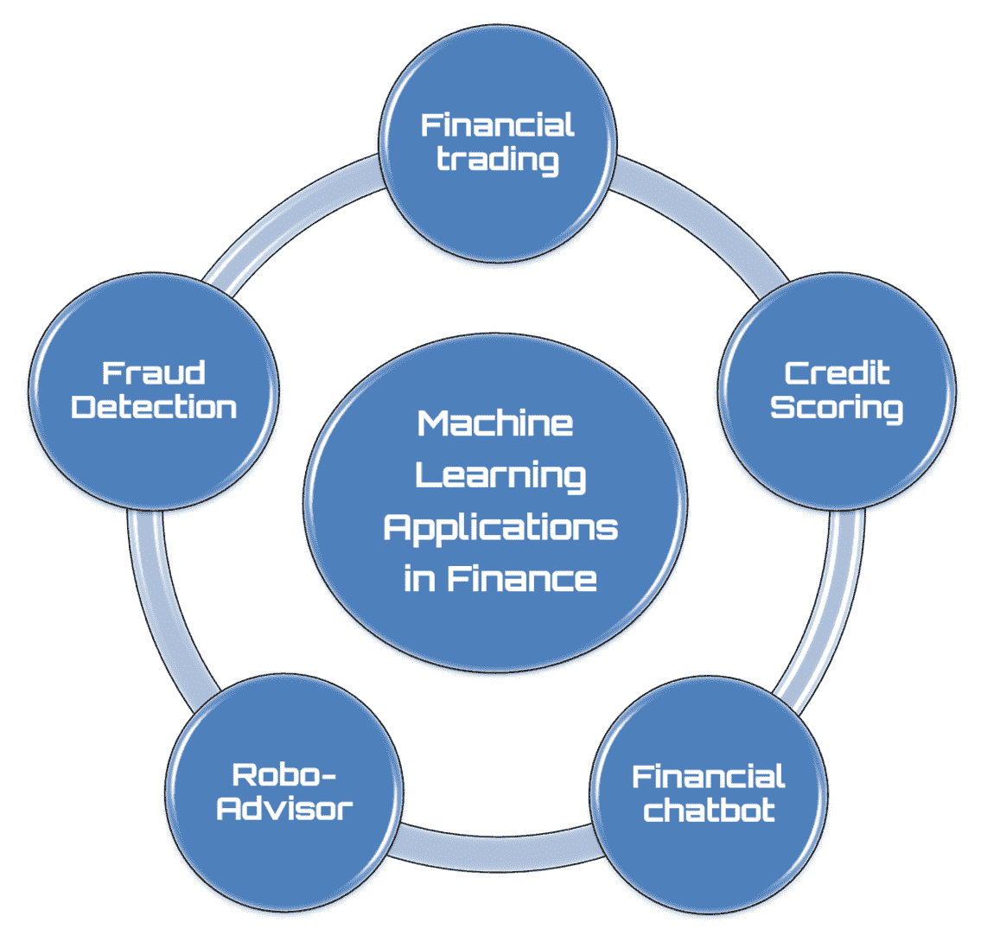
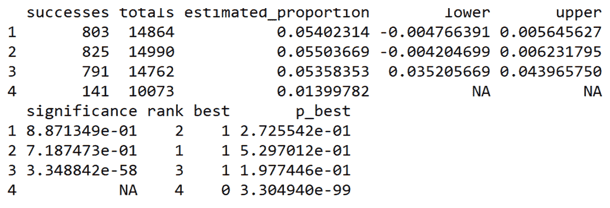
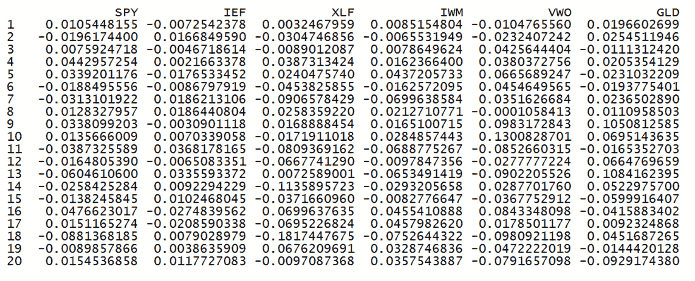
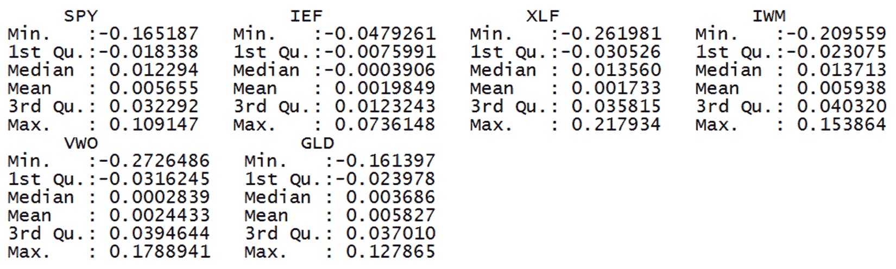
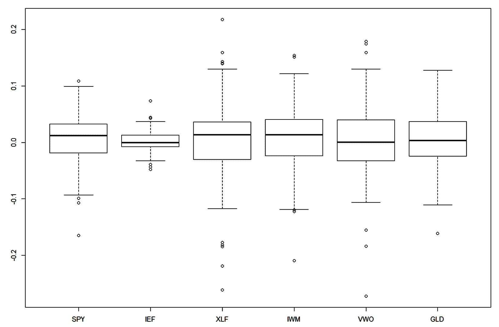
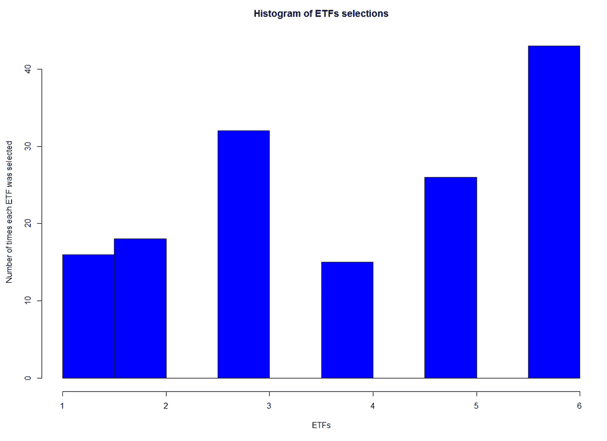

# 第九章：金融工程中的多臂老虎机（MAB）

今天，**机器学习**（**ML**）在金融生态系统中的许多领域已扮演着至关重要的角色：从贷款批准、活动管理到风险评估。**人工智能**（**AI**）系统在股票投资组合管理和交易算法的创建中具有重要作用。同样，AI 在欺诈检测中也变得越来越重要，用于寻找和识别欺诈行为。能够学习并根据新威胁调整行为的算法正在克服传统依赖严格检查清单的过程的局限性。本章将讨论一些金融工程问题，采用**强化学习**（**RL**）来学习优化和异常识别技术。

到本章结束时，我们将了解金融问题的基本概念，以及如何使用马尔可夫链来建模信用风险。我们还将理解如何构建一个定价优化系统，以找到推出新产品的最佳价格。最后，我们将学习如何优化股票投资组合。

本章将涵盖以下主题：

+   金融问题要点

+   将信用风险建模为马尔可夫链

+   定价优化系统

+   优化股票投资组合

+   欺诈检测技术

# 技术要求

查看以下视频，了解代码的实际应用：

[`bit.ly/34ee91x`](http://bit.ly/34ee91x)

# 金融问题要点

技术创新与金融领域已共同发展多年，并随着机器学习的引入而加速推进。大量的数据、访问精确历史文档的可能性以及金融领域的量化特性，使其成为集成自动学习的最合适行业之一。通过这种方式，行业从业者能够摆脱一系列低创意价值的必要活动。

机器学习使机器能够自主决策：与执行活动的指令序列不同，它提供了如何学习独立完成这些活动的指令。这种自我学习的能力，结合大数据分析和特殊算法，已在各种金融操作中扮演着基础性角色，从风险评估到贷款批准。

通过机器学习，金融公司可以创新其工作活动，提高效率、产出，并最终提升盈利能力。了解这些公司所进行的技术演进揭示了诸多机会，同时也凸显了需要识别变化、欢迎并管理变化的必要性。

在复杂的金融活动体系中，很难假设有任何一个领域是机器学习无法介入的，去加速、简化和精简程序，也正因如此，正是在这个背景下，关于人工员工在未来将扮演何种角色的深刻反思才得以展开。但不必担心：从持续增长的角度来看，金融机构将仅仅引导其员工从事高附加值的活动，在这些活动中，人工代理将作为重要的顾问，尽管无法扮演决策者的角色。

金融一直以来都充满数字，但在最近几十年，它的复杂性不断增长。首先是数字革命，随后是通信革命，促使各种数据的可用性呈指数级增长。社交网络上的互动、搜索引擎上的查询、银行交易和电子商务活动，都增加了可以自动分析的数字信息的庞大目录。

由于需要了解和稳定日益复杂的信用体系，电子商务网站内容推荐系统产生了对数据管理服务的新需求。对于金融而言，几乎是完美市场中的竞争压力促使持续改进。我们正目睹着代理商之间不断的张力：一些代理商试图打破平衡，追求新的利润形式，而另一些代理商则推向平衡点，力图实现小规模的、系统性的利润。

在金融领域，有许多领域可以利用人工代理来简化活动，如下图所示：



在接下来的章节中，我们将分析使用基于机器学习算法的最广泛应用活动。

# 金融交易

金融交易是一种高收益的投机性投资活动，涉及到金融市场。金融市场被定义为金融资产交易的场所。金融市场的交易基于一组因素：技术分析、微观和宏观经济基本面、新闻和市场情绪。当我们谈到高频交易时，仓位的保持时间甚至可能只有几分之一秒，这时由高级算法管理的作用是至关重要的。机器学习的引入使得技术得到了强有力的细化，可以通过各种指标进行战略性处理，用来识别套利机会、评估绩效、学习关键问题，并将改进的模型应用于即将到来的交易机会。

# 信用评分

信用评估过程是商业银行业务的支柱，并且随着新的方法论的出现以及对越来越大数据集的访问，已经得到了多年的精细化发展。在这一活动中，通常被称为**信用评分**，机器学习能够发挥关键作用，许多机构已经在这一领域有所作为，这也并非巧合。在这里，机器学习的作用体现在扩展现有流程：除了所有经过验证的参数，它们仍然是信用评分的基础，机器学习还可以通过分析非常异质的数据，如社交网络上的行为，来完善评估过程。

# 金融聊天机器人

在银行业中，机器学习的早期应用之一是虚拟助手。说到成本降低，将大量客户服务工作委托给由机器学习支持的机器人是极为高效的。此外，应用这一规则，常见的例行请求（如反索赔、转账和取款）是最常见的，也是最容易交给软件处理的。美国银行在 2016 年推出其 Erica 机器人，旨在简化个人财务管理，服务数千万客户，这并非巧合。

# 机器人顾问

一个虚拟助手的例子是机器人顾问，和简单的常规操作自动化相比，它属于金融咨询领域。通过机器人顾问，用户可以根据自身目标获得个性化的资产管理建议，可能还可以买卖金融产品。同样，机器人顾问还可以跟踪投资趋势，向客户提供定期报告，并提出任何必要的纠正措施。

在下一部分，我们将使用马尔可夫链来模拟公司信用风险。

# 将信用风险建模为马尔可夫链

金融公司面临着不同类型的风险，通常分为三大类：市场风险、信用风险和操作风险。在近年来的国际金融环境中，信用评分在被定义为**信用风险分析**的过程中发挥了至关重要的作用。**信用评分**模型的目标是能够正确地分类哪些申请人能获得信贷渠道的访问权限，从而减少与申请人可能违约相关的风险。继美国因次贷危机爆发后，金融和信贷机构在过去十年中遭遇了重大损失，随后进入了漫长的衰退期。所有这些不可避免地将整个信用风险分析过程置于放大镜下，特别强调了信用评分技术。

信用评分在近几十年来经历了显著的增长。在这些发展之前，贷款通常是根据主观评估来授予的，评估依据是申请人和信用机构的信用分析师之间建立的人际关系。在大多数情况下，信用分析师通常是代表着提供资金的银行。然而，日益增长的融资需求和众多可用的金融产品迫使我们不得不调整信用管理系统。我们越来越多地尝试应用自动化和客观的技术，使得对潜在客户的分析可以更快速、更高效。这些技术的输出结果通常是采用一个**评分**，能够可靠地分类客户的信用状况。

对信用风险的正确评估对于银行的所有活动能够成功管理至关重要。金融中介机构需要提高风险评估的准确性，这促使了新模型和新技术的发展、更新和发现，用于计算违约概率和预期回收率。对债务人信用状况演变的精确分析，以及对影响信用风险的参数的正确估计，也是解决与贷款和债券定价相关问题的必要条件。在各种模型和成熟的方法中，现代方法利用了新的数据存储、分析和统计理论训练的技术能力，以便更准确地识别信用风险的组成部分。

在下一节中，我们将介绍使用 R 中已存在的一些软件包进行信用评分建模。

# `CreditMetrics`软件包

为了处理信用评分技术，我们将使用在 CRAN 上可用的`CreditMetrics`软件包。该软件包包含一组用于计算`CreditMetrics`风险模型的函数。

下表提供了关于此软件包的一些信息：

| 软件包 | `CreditMetrics` |
| --- | --- |
| 日期 | 2015-02-19 |
| 版本 | 0.0-2 |
| 标题 | 用于计算`CreditMetrics`风险模型的函数 |
| 作者 | 安德烈亚斯·维特曼 |

`CreditMetrics` 模型首次由 J.P. 摩根提出，作为计算与信贷风险敞口相关的**风险价值**（**VAR**）的工具。该模型是最广泛使用的信用风险管理系统之一。它旨在定义贷款组合的构成，使其与中介所期望的风险-回报组合一致，从而实现更高效的资本配置。特别地，信用风险值会随着与投资组合中应收账款相关的质量变化而变化，导致单一信用（迁移）在识别的三个主要类别之间的变动（财务困境、信用评级的升级或改善，以及与单一贷款相关的质量下降或恶化）。信用风险与市场风险（`riskmetrics`）有显著不同，因为对于后者，可以假设相对于其平均值对称的正态概率分布，而与暴露于信用风险的投资组合相关的风险则是正向非对称的。在下一节中，我们将讨论一个使用`CreditMetrics`包进行信用风险建模的实际案例。

# CreditMetrics 风险模型

信用风险是指与对方的偿付能力或信用状况相关的意外事件，可能会改变信用头寸的价值。

在评估信用风险时，我们可以区分违约模式方法，它只考虑破产的发生，以及多状态方法，在这种方法中，即使对方信用状况的恶化也代表了信用风险的来源。

第一种方法设想了信用头寸的两种可能状态：违约或非违约。违约事件的发生仅由相关的二元变量的违约概率决定。多状态方法考虑了迁移风险，即由于对方信用状况的恶化，头寸价值发生变化的风险。违约状态代表可能的一个状态，而在该状态下的迁移与破产事件一致。

多状态方法的基本工具是转移矩阵，可以基于历史观察来估计，并由评级机构提供。

我们将通过定义迁移矩阵开始分析，正如我们预见的那样，该矩阵由评级机构提供：

1.  首先，我们将导入`CreditMetrics`库：

```py
library(CreditMetrics)
```

1.  现在，让我们复现这个实验：

```py
set.seed(1)
```

这个命令设置了 R 随机数生成器的种子。每次想要得到可重现的随机结果时，都必须使用这个函数。使用此命令时生成的随机数将始终相同，因此每次执行代码时，得到的结果也将始终相同。每个种子值将对应于给定随机数生成器生成的数值序列。

现在，让我们定义迁移矩阵，它表示马尔可夫过程的转移矩阵。评级机构，如 `Standard% Poor`，基于公司不同行业超过 20 年的观察数据提供转移矩阵。

有七个评级类别，从最高的 AAA 类到最低的 CCC 类。最后一个状态是默认状态，其特征是吸收状态，在这种状态下，退出的概率为零。

1.  然后，我们定义评级类别：

```py
RatingClasses <- c("AAA", "AA", "A", "BBB", "BB", "B", "CCC", "D")
```

1.  做完这些后，我们定义了转移矩阵：

```py
TransitionMatrix <- matrix(c(90.710, 8.340, 0.710, 0.075, 0.095, 0.025, 0.022, 0.023,
            0.710, 90.550, 7.810, 0.720, 0.060, 0.120, 0.020, 0.010,
             0.092, 2.220, 91.250, 5.420, 0.720, 0.230, 0.011, 0.057,
             0.020, 0.420, 5.890, 85.880, 5.290, 1.190, 1.140, 0.170,
             0.036, 0.124, 0.670, 7.730, 80.590, 8.790, 1.010, 1.050,
             0.011, 0.119, 0.230, 0.440, 6.510, 83.440, 4.060, 5.190,
             0.220, 0.000, 0.230, 1.330, 2.360, 11.210, 64.830, 19.820,
              0, 0, 0, 0, 0, 0, 0, 100
              )/100, 8, 8, dimnames = list(RatingClasses, RatingClasses), byrow = TRUE)
```

打印以下矩阵：

```py
 AAA     AA      A    BBB     BB      B    CCC      D
AAA 0.90710 0.08340 0.0071 0.00075 0.00095 0.00025 0.00022 0.00023
AA 0.00710 0.90550 0.0781 0.00720 0.00060 0.00120 0.00020 0.00010
A 0.00092 0.02220 0.9125 0.05420 0.00720 0.00230 0.00011 0.00057
BBB 0.00020 0.00420 0.0589 0.85880 0.05290 0.01190 0.01140 0.00170
BB 0.00036 0.00124 0.0067 0.07730 0.80590 0.08790 0.01010 0.01050
B 0.00011 0.00119 0.0023 0.00440 0.06510 0.83440 0.04060 0.05190
CCC 0.00220 0.00000 0.0023 0.01330 0.02360 0.11210 0.64830 0.19820
D 0.00000 0.00000 0.0000 0.00000 0.00000 0.00000 0.00000 1.00000
```

在这个表中，第一列的评级是起始或当前评级。第一行的评级是风险视野处的评级。此外，矩阵的每一行都总和为 100%。现在清楚了转移矩阵的含义。这是一个包含转移概率的方阵。例如，AAA 评级的信用有 8.33% 的概率在一年内降级为 AA 评级。通过这种方式，我们可以恢复出在任何一年内最有可能发生的信用评级，作为当前评级。作为一个规则，转移矩阵应该是在我们估计风险的风险视野内计算的同样时间间隔。在我们的情况下，我们对提供的值感到满意：

1.  首先，我们可以创建 `markovchain` 对象，如下所示：

```py
MCModel <- new("markovchain", transitionMatrix = TransitionMatrix, states=RatingClasses, byrow = TRUE, name="MarkovChainModel")
```

`markovchain` 类已被设计用来处理同质马尔可夫链过程。

传递了以下插槽：

+   +   `transitionMatrix`: 这是包含转移概率的方阵转移矩阵。

    +   `states`: 这是状态的名称。它必须与转移矩阵的 `colnames` 和 `rownames` 相同，这是一个字符向量，列出了定义了转移概率的状态。

    +   `byrow`: 这是一个二进制标志，一个逻辑元素，指示转移概率是按行还是按列显示。

    +   `name`: 这是一个可选的字符元素，用于命名离散时间马尔可夫链。

1.  要显示我们刚刚创建的模型的摘要，使用以下命令：

```py
MCModel
```

返回以下结果：

```py
MCModel

A  8 - dimensional discrete Markov Chain defined by the following states:
 AAA, AA, A, BBB, BB, B, CCC, D
 The transition matrix  (by rows)  is defined as follows:
 AAA     AA      A    BBB     BB      B    CCC      D
AAA 0.90710 0.08340 0.0071 0.00075 0.00095 0.00025 0.00022 0.00023
AA 0.00710 0.90550 0.0781 0.00720 0.00060 0.00120 0.00020 0.00010
A 0.00092 0.02220 0.9125 0.05420 0.00720 0.00230 0.00011 0.00057
BBB 0.00020 0.00420 0.0589 0.85880 0.05290 0.01190 0.01140 0.00170
BB 0.00036 0.00124 0.0067 0.07730 0.80590 0.08790 0.01010 0.01050
B 0.00011 0.00119 0.0023 0.00440 0.06510 0.83440 0.04060 0.05190
CCC 0.00220 0.00000 0.0023 0.01330 0.02360 0.11210 0.64830 0.19820
D 0.00000 0.00000 0.0000 0.00000 0.00000 0.00000 0.00000 1.00000
```

正如我们所见，列出了四个插槽——`states`、`byrow`、`transitionMatrix` 和 `name`。要检索每个插槽中包含的元素，使用对象的名称（`MarkovChainModel`），后跟插槽的名称，用`@`符号分隔。

1.  例如，要打印状态，我们将写以下内容：

```py
MCModel@states
```

返回以下结果：

```py
[1] "AAA" "AA"  "A"   "BBB" "BB"  "B"   "CCC" "D" 
```

我们可以从新开发的模型中提取的其他信息是过渡概率，表示从一种状态过渡到另一种状态的概率。请记住，如果马尔可夫链在时间上是齐次的，那么从一个状态到另一个状态的过渡概率是独立于时间指数的。为了获取此信息，我们将使用 `transitionProbability()` 函数，它允许我们获取从初始状态到后续状态的过渡概率。

1.  让我们学习如何获取这些信息：

```py
transitionProbability(MCModel,"AAA","AA")
```

返回以下结果：

```py
[1] 0.0834
```

我们可以通过分析过渡矩阵来确认这一结果。在该矩阵中，从 AAA 状态到 AA 状态的过渡由元素 p[12]给出，其值正好等于 0.083。

现在，让我们计算迁移矩阵的信用违约利差。信用违约利差指一系列用于确定投资者支付多少来补偿所承担的证券固有信用风险的措施。

要计算信用违约利差，我们将使用 `cm.cs()` 函数，它需要迁移矩阵和违约给予损失作为输入。违约给予损失表示信用机构由于交易对手破产而遭受的损失，仅在信用恢复操作结束时才能确定。因此，它从不是预先可预测的；它只有在信用恢复操作结束时才发生。

1.  在我们的情况下，我们将此值作为初始变量设置如下：

```py
LGD <- 0.40
```

1.  上述代码表明，在破产情况下，银行的损失将为 40%。现在，我们可以应用 `cm.cs()` 函数，如下所示：

```py
CreditRiskSpread<-cm.cs(TransitionMatrix, LGD)
```

1.  此函数返回迁移矩阵中每个评级在时间*t = 1*的信用违约利差，如下所示：

```py
AAA           AA            A          BBB           BB 
9.200423e-05 4.000080e-05 2.280260e-04 6.802313e-04 4.208845e-03 
 B          CCC
2.097852e-02 8.259931e-02 
```

1.  让我们计算一年内的信用价值。为此，我们可以使用 `cm.ref()` 函数。需要以下参数：

+   +   迁移矩阵，其中最后一行给出违约类别

    +   违约给予损失

    +   公司评级

    +   违约风险

    +   无风险利率

前两个参数已经定义并使用，即迁移矩阵和违约给予损失。对于剩余的三个参数，需要初始化它们。

1.  让我们从我们想要评估其信用价值的公司的评级开始。我们将设置三个值，如下：

```py
Rating <- c("B", "BB", "CCC")
```

**违约暴露**（**EAD**）是银行可能由于违约而遭受的损失金额。由于违约发生在未来的未知日期，这种损失取决于银行在违约时对借款人暴露的金额。

1.  我们将设置三个值，如下：

```py
EAD <- c(4000, 10000, 500000)
```

1.  然后，我们需要设置无风险利率；该参数表示投资者在给定时间段内从完全无风险投资中预期的利率。我们将此值设置如下：

```py
Rindex <- 0.02
```

现在我们已经有了 `cm.ref()` 函数所需的所有参数，我们只需应用它：

```py
RefValue<-cm.ref(TransitionMatrix, LGD, EAD, Rindex, Rating)
```

返回两个值：

+   +   `constVal`：一年内的信用价值

    +   `constPV`：一年内所有信用值的投资组合

1.  要提取这些值，我们可以使用以下命令：

```py
RefValue$constVal
RefValue$constPV
```

以下结果被打印：

```py
> RefValue$constVal
         B         BB        CCC
 3839.399   9760.818 451244.261
> RefValue$constPV
[1] 464844.5
```

1.  最后，我们可以搜索模型的吸收状态。记住，吸收状态是一种一旦进入就无法退出的状态。为了评估吸收状态，我们可以使用`absorbingStates()`函数，方法如下：

```py
absorbingStates(MCModel)
```

返回以下结果：

```py
[1] "D"
```

很容易理解，默认状态是一种吸收状态，一旦进入，就无法再退出。在下一节中，我们将使用多臂赌博机分析来解决价格优化问题。

# 定价优化系统

定价不仅仅是将价格与市场上竞争对手的价格对齐。全球贸易的一个负面方面是，总有某些地方有人以远低于市场价格的价格出售相同的产品。自动将价格与竞争对手对齐并不是一个可持续的策略。

有两种定价策略。第一种考虑的是交易员的观点，提供了一种直观的定价方法，根据该方法，选择正确的价格必须依赖于经理的直觉。由于这种策略非常主观，且结果在很大程度上取决于经理的能力，因此很难评估它。如果经理离开公司，关于该策略的大部分知识将会丧失。第二种策略基于更理论化的观点，提供了一种计量经济学定价方法，在该方法中，价格的选择必须基于先进的数学参数。

一旦我们选择了适用于金融产品的价格范围，采用一种优化程序来评估市场对我们想要推出的新产品的反应是一个良好的做法。在最简单的情况下，优化问题包括通过系统地选择允许集合中的输入值并计算函数值来最大化或最小化一个实数函数。理论和优化技术的推广到其他公式构成了应用数学的一个广阔领域。更一般地说，优化包括在每个领域中寻找一些目标函数的最佳可用值，涵盖了各种不同类型的目标函数和领域。

有许多优化方法可用；以下是一些最重要的方法：

+   线性规划

+   最小二乘法

+   单纯形算法

+   拉格朗日乘数法

+   随机优化

在这个例子中，我们将尝试通过多臂赌博机分析和 Bandit R 包来解决价格优化问题。欲了解更多关于多臂赌博机算法的信息，请参见第四章，*多臂赌博机模型*。我们将从介绍 Bandit 包开始。

# Bandit 包

该包包含一组用于分析 A/B 拆分测试数据和一般网页指标的函数。以下表格提供了有关该包的一些信息：

| 包 | `Bandit` |
| --- | --- |
| 日期 | 2015-02-19 |
| 版本 | 0.5.0 |
| 标题 | 用于简单 A/B 拆分测试和多臂强盗分析的函数 |
| 作者 | 托马斯·洛茨和马库斯·勒歇尔 |

在接下来的章节中，我们将形式化这个问题，并通过多臂强盗分析来解决它。

# 新金融服务的定价策略

一家在市场上非常活跃的金融公司正在考虑推出一项新的金融服务。在测试了市场上竞争对手已提供的所有服务并对其性能进行了比较后，该公司决定为其自己推出的服务设定一系列价格。

为了检查哪种确定的价格最能满足消费者的需求，他们决定通过收集服务订阅来测试四种不同的价格。每个价格将会在一段时间内归属于该服务，在此期间，将记录已经联系过的用户和已获得的订阅。

监控活动将持续三个月，每个月都会进行分析。最后，将采用表现最佳的价格。请按照以下步骤操作：

1.  首先，我们需要导入`Bandit`库：

```py
library(Bandit)
```

1.  现在，让我们重现实验：

```py
set.seed(1)
```

1.  现在，我们报告在第一个月内收集的数据，涉及已联系的用户、已购买的服务以及提供的价格：

```py
UsersContacted1 <- c(10000, 9580, 10011, 10007)
Purchases1 <- c(571, 579, 563, 312)
Prices <- c(299, 306, 312, 335)
```

1.  如我们所见，这里有三个向量，其中包含每个类别的数据。现在，我们可以开始模拟不同价格下每个手臂的后验分布：

```py
PostDistr1Month = sim_post(Purchases1,UsersContacted1, ndraws = 10000)
```

在这里，我们使用了`sim_post()`函数，该函数模拟了每个手臂作为最优二项分布强盗的贝叶斯概率的后验分布。以下是传递的参数：

+   +   `Purchases1`：成功次数的向量

    +   `UsersContacted1`：试验次数的向量

    +   `ndraws`：来自后验的随机抽样次数

通过这种方式，我们获得了 10,000 次对后验分布的评估，用于贝叶斯概率的估计。以下是前 10 次评估：

```py
 [,1]       [,2]       [,3]       [,4]
 [1,] 0.05836046 0.06371775 0.05441352 0.03088567
 [2,] 0.05829739 0.06186407 0.05624850 0.02976481
 [3,] 0.05621800 0.05805901 0.05795378 0.03280708
 [4,] 0.05841852 0.06459235 0.05968413 0.03087549
 [5,] 0.05342895 0.06145472 0.05901734 0.03027870
 [6,] 0.05382709 0.06170789 0.05352246 0.03130340
 [7,] 0.05566469 0.05698650 0.05440684 0.03335165
 [8,] 0.05723522 0.06025616 0.05833294 0.03082094
 [9,] 0.05617222 0.06314493 0.05721080 0.03309235
 [10,] 0.05308393 0.05988580 0.05163597 0.03038333
```

1.  因此，我们可以评估赢家：

```py
ProbWinner1 <- prob_winner(PostDistr1Month)
```

使用了`prob_winner()`函数，该函数计算每个手臂在给定前一步模拟后的结果时成为赢家的概率。该函数只接受一个参数——`sim_post()`函数提供的后验模拟结果。

1.  我们现在为我们模拟的赢家分配名称：

```py
names(ProbWinner2) <- Prices
```

1.  现在，让我们可视化模拟结果：

```py
ProbWinner1
```

返回以下结果：

```py
 299    306    312    335
0.1397 0.7846 0.0757 0.0000
```

如我们所见，模拟结果告诉我们，似乎在用户中最受欢迎的价格是$306，该价格收集了 78.5%的概率。

正如我们预期的那样，我们通过扩展分析到第二个月，继续我们的监控。

1.  首先，我们报告第二个月收集的数据，这些数据涉及联系的用户和进行的服务购买：

```py
UsersContacted2 <- c(12350, 12001, 11950, 12500)
Purchases2 <- c(621, 625, 601, 520)
```

正如我们所见，这些是分别包含每个类别四个数据的两个向量。

1.  此时，我们可以进入不同价格下每个臂的后验分布模拟：

```py
PostDistr2Month = sim_post(Purchases2,UsersContacted2, ndraws = 10000)
```

1.  因此，我们可以评估获胜者：

```py
ProbWinner2 <- prob_winner(PostDistr2Month)
```

1.  我们现在给模拟的获胜者分配名称：

```py
names(ProbWinner2) <- Prices
```

1.  现在，让我们可视化模拟结果：

```py
ProbWinner2
```

返回以下结果：

```py
 299    306    312    335
 0.196679 0.602588 0.200732 0.000001
```

正如我们所见，模拟结果告诉我们，似乎在用户中最受欢迎的价格是 $306，获得了 60.3%的概率。

1.  最后，让我们进入价格监控的最后一个月：

```py
UsersContacted3 <- c(14864, 14990, 14762, 10073)
Purchases3 <- c(803, 825, 791, 141)
```

1.  此时，我们可以进入不同价格下每个臂的后验分布模拟：

```py
PostDistr3Month = sim_post(Purchases3,UsersContacted3, ndraws = 10000)
```

1.  因此，我们可以评估获胜者：

```py
ProbWinner3 <- prob_winner(PostDistr3Month)
```

1.  我们现在给模拟的获胜者分配名称：

```py
names(ProbWinner3) <- Prices
```

1.  现在，让我们可视化模拟结果：

```py
ProbWinner3
```

返回以下结果：

```py
 299    306    312    335
0.272597 0.529096 0.198307 0.000000
```

正如我们所见，模拟结果告诉我们，似乎在用户中最受欢迎的价格是 $306，获得了 52.9%的概率。

让我们尝试看看得到的结果是否具有统计学意义。我们什么时候可以说我们的实验是显著的？实际上，没有任何结果是显著的。我们决定实验结果需要有多有说服力，才能得出它真的有效。表示研究显著性的一种常见方式是 P 值。P 值是一个数字，表示结果是由于偶然因素而非研究现象本身的概率。通常，在设计实验时，你会决定想要达到的特定 P 值，例如 1%，然后相应地决定样本大小；在其他情况下，样本大小无法控制，研究的显著性则是事后计算的。

为了进行显著性检验，我们将使用 `significance_analysis()` 函数，如下所示：

```py
significance_analysis(Purchases3,UsersContacted3)
```

该函数执行总体比例比较，并返回以下值：

+   `successes`: 成功次数的向量

+   `totals`: 试验次数的向量

+   `estimated_proportion`: 成功次数/试验次数

+   `lower`: 0.95 置信区间，表示此方案比下一个低效方案的估计优势

+   `upper`: 0.95 置信区间，表示此方案比下一个低效方案的估计优势

+   `significance`: 此方案比下一个低效方案的 P 值

+   `order`: 按成功比例从高到低排序

+   `best`: 如果它属于“表现最好的组”——即那些与最佳组没有显著差异的组，则为 1

+   `p_best`: 贝叶斯后验概率，表示此方案是最优二项带状选手

监控第三个月的数据返回了显著性检验的以下结果：



结果确认我们选择的第四个作为价格的值产生了不显著的结果，因此我们可以在后续的分析中将其排除。到目前为止进行的监控为我们提供了足够的数据。接下来，我们将计算另一个臂可能对当前最佳臂产生的改进金额的分布。

首先，我们将按如下方式计算剩余值：

```py
ValueRemaining <- value_remaining(Purchases3,UsersContacted3)
```

我们使用了`value_remaining()`函数，该函数返回另一个臂可能对当前最佳臂产生的改进金额的分布。最后，我们将计算潜在的剩余值：

```py
PotentialValue <- quantile(ValueRemaining, 0.95)
PotentialValue
```

在之前的代码中，我们使用了`quantile()`函数。该函数返回指定函数（`ValueRemaining`）对应的分位数值（0.95）。

返回以下结果：

```py
 95%
0.07145922
```

这个值告诉我们，相较于看似获胜的价格（$306），任何其他值都可能以高达 7.14%的概率击败它，这代表了剩余值的 95%分位数。

在接下来的部分，我们将处理一个优化问题：我们将尝试评估金融投资组合的最佳配置。

# 优化股票投资组合

选择一个最佳投资组合是一个典型的决策问题，因此其解决方案包括以下几个元素：识别一组备选方案，使用选择标准筛选不同的可能性，以及问题的解决。为了优化金融投资组合，我们首先衡量可用产品的收益和风险。风险-收益变量可以视为同一枚硬币的两面，因为一定水平的风险会对应一个给定的收益。收益可以定义为与所投入资本相关的投资产生的结果之和，而风险的概念可以转化为与特定金融工具相关的收益变动程度。前述问题可以建模为一个 MAB 问题，金融产品如同臂，产品性能作为结果。在分析代码之前，我们将定义一些与金融投资相关的概念。

# 交易型基金投资组合优化

**交易型基金**（**ETF**）这一术语指的是一种特定类型的投资基金，具有两个主要特点：它像股票一样在证券交易所交易，且其唯一的投资目标是通过完全被动的管理复制其所跟踪的指数（基准）。

ETF 总结了基金和股票的特点，允许投资者利用这两种工具的优势：

+   资金的多样化和风险降低

+   股票实时交易的灵活性和信息透明度

鉴于其特点，ETF 可以用于多种方式：中长期投资，甚至是日内交易和卖空，借此对基准指数采取看空立场。由于 ETF 可以轻松实现投资组合的多样化、精准复制基准指数以及管理成本低，这使得它特别适合通过定期小额付款（即使是个体投资者）来构建累积投资计划。让我们来看看 ETF 数据集的结构。

# ETF 数据集

因此，ETF 是一组证券，它追踪一个基础指数。最著名的例子是 SPDR S&P 500（SPY）ETF，它复制了 S&P 500 指数。在我们即将处理的示例中，我们将使用包含以下六只 ETF 的历史数据集：

+   **SPY**: SPDR S&P 500 ETF

+   **XLF**: 金融精选行业 SPDR 基金

+   **IWM**: iShares Russell 2000 ETF; IEF

+   **IEF**: iShares 7-10 年期美国国债 ETF

+   **GLD**: SPDR 黄金股票

+   **VWO**: Vanguard FTSE 新兴市场 ETF

这些数据对应的时间范围是从 2009 年 1 月 1 日到 2019 年 1 月 1 日，数据从雅虎财经网站下载。

首先，我们将导入数据集：

```py
dataset = read.csv('ETFs.csv')
```

数据集包含以下内容：

+   **150 次观察**: 月度历史数据

+   **6 个变量**: `EFTreturns`

以下信息是通过`str()`函数返回的，如下所示：

```py
str(dataset)
```

打印出以下列表：

```py
> str(dataset)
'data.frame':  150 obs. of  6 variables:
 $ SPY: num  0.01054 -0.01962 0.00759 0.0443 0.03392 ...
 $ IEF: num  -0.00725 0.01668 -0.00467 0.00217 -0.01765 ...
 $ XLF: num  0.00325 -0.03047 -0.0089 0.03873 0.02405 ...
 $ IWM: num  0.00852 -0.00655 0.00786 0.01624 0.04372 ...
 $ VWO: num  -0.0105 -0.0232 0.0426 0.038 0.0666 ...
 $ GLD: num  0.0197 0.0255 -0.0111 0.0205 -0.0231 ...
```

在下图中，我们可以看到数据集的前 20 行：



可以使用`summary()`函数获得更多信息，该函数生成每个变量的摘要：

```py
summary(dataset)
```

返回以下结果：



通过这种方式，我们获得了一系列统计描述符，展示了各指数的值分布。为了概览数据，我们可以绘制一个箱线图。箱线图通过简单的离散度和位置指标描述数据集的分布。箱线图可以是水平的或垂直的，并包含一个由两个分段组成的矩形分区。矩形（箱子）由以下特征限定：第一四分位数（25^(th) 百分位数）和第三四分位数（75^(th) 百分位数）。箱子内部的线表示中位数（50^(th) 百分位数）。通常，`boxplot()`函数用于绘制箱线图，如下所示：

```py
boxplot(dataset)
```

下图展示了数据集中包含的 ETF 的箱线图：



`boxplot()` 函数也可以用来识别异常值。异常值是远离其他可用观察值的极端值。这些值通常会扭曲数据分析的结果。因此，异常值必须在数据清理阶段提前识别，或者在随后的数据分析阶段处理中。通过分析前面的图表，我们可以看到，XLF 变量在极值处表现出不同的异常值。

# 上置信界限方法

正如我们在第四章 *多臂老虎机模型* 中提到的，游戏允许我们同时进行开发和探索。在游戏开始时，我们不知道哪个臂是最好的，因此我们无法对任何臂进行特征化。因此，UCB 算法假设所有臂的观察平均值相同。所以，每个臂都会创建一个置信区间，且臂会被随机选择。

在这个上下文中，每个臂会给出奖励或不奖励。如果所选的臂返回一个错误，则该臂观察到的平均值会下降，置信区间也会减小。如果所选的臂返回奖励，则观察到的平均值会增加，置信区间也会增加。通过利用最好的臂，我们实际上是在减少置信区间。增加更多的回合时，其他臂表现良好的概率也会增加。

我们的目标是选择那个在最多观察次数中显示最大回报的股票。为此，我们将把包含月度回报的数据矩阵转换成一个矩阵，其中每行会有一些零，除了最大值之外，最大值位置会呈现为 1。为此，我们将初始化一个与起始数据集大小相同的矩阵，并将其填充为零。然后，我们会在起始数据集每行的最大值位置填入 1：

```py
DataSel<- matrix(0, nrow = 150, ncol = 6)
rowmax = apply(dataset, 1, max)
for (i in 1:150){
  for (j in 1:6){
    if (dataset[i,j] == rowmax[i])
      DataSel[i,j] <- 1
  }
}
```

从这一刻起，我们将使用这个数据集。首先，我们将设置观察次数和臂的数量：

```py
NumObs = 150
NumArms = 6
```

做完这些之后，我们将尝试初始化一系列对我们的计算有用的变量：

```py
EFTSelected = integer()
NumSelections = integer(NumArms)
RewSum = integer(NumArms)
TotRew = 0
```

变量名称非常直观，但我们还是来验证一下它们的含义：

+   `EFTSelected`：在迭代周期中选定的 EFT

+   `NumSelections`：所做选择的次数

+   `RewSum`：每个臂的奖励总和

+   `TotRew`：获得的总奖励

在这一点上，我们必须使用两个迭代周期来遍历整个矩阵。第一个周期将允许我们遍历所有行，而第二个周期将处理列。之前，我们将这些定义为 `NumObs` 行数和 `NumArms` 列数：

```py
for (n in 1:NumObs){
```

对于每一行，我们初始化两个额外的变量：

```py
EFT = 0
MaxUpBound = 0
```

现在，我们可以查看各列：

```py
for (i in 1:NumArms){
```

记住，为了在每一轮进行上置信区间（UCB）计算，需要计算两个变量：杠杆*i*在*n*次操作后获得的奖励总和，以及策略在前*n*次操作中使用杠杆*i*的次数。我们按如下方式计算杠杆*i*在*n*次操作后获得的平均奖励：

```py
if(NumSelections[i]> 0 ){
      AverageReward = RewSum[i]/NumSelections[i]
```

我们使用以下命令计算在*n*次操作后获得的置信区间：

```py
DeltaI  = sqrt(3/2 * log(n)/NumSelections[i])
```

然后，我们选择返回最大 UCB 的杠杆*i*，如下所示：

```py
UpBound = AverageReward + DeltaI
```

完成此操作后，我们进行了一些检查：

```py
} else{
      UpBound  = 1e400
    }
    if(UpBound > MaxUpBound){
      MaxUpBound = UpBound
      EFT = i
    }
  }
```

最后，我们更新了这些值：

```py
  EFTSelected = append(EFTSelected, EFT)
  NumSelections[EFT] = NumSelections[EFT] + 1
  reward = DataSel[n, EFT]
  print(reward)
  RewSum[EFT] = RewSum[EFT] + reward
  TotRew = TotRew + reward
}
```

此时，我们的分析已经完成，可以查看结果。为了可视化结果，我们需要绘制一个直方图。直方图是一种显示给定项目在特定范围内出现频率的图形。直方图类似于条形图，但通常使用其面积来图示某个元素出现的频率。直方图用于表示一组连续数据，如时间、测量值或温度。直方图的主要问题在于，比较两组数据的困难，以及无法精确读取数据所假设的值。

为了绘制直方图，我们将使用`hist()`函数，它计算给定数据值的直方图，如下所示：

```py
hist(EFTSelected,
     col = 'blue',
     main = 'Histogram of EFTs selections',
     xlab = 'EFTs',
     ylab = 'Number of times each EFT was selected')
```

打印出以下直方图：



从前面的图表分析来看，股票（GLD）编号 6 是算法选择最多的。

最后，让我们看看如何处理欺诈识别的问题。

# 欺诈检测技术

在银行领域，防止欺诈至关重要。在这里，机器学习在整合算法中的应用也是一个明显的成功因素。在此，我们将回到人工智能的预测能力——一个可疑的动作不仅在数字的层面和地理位置上表现出异常，还可能偏离人工智能明确识别的客户行为模型。通过这种方式，面对明显的异常，人工智能可以在欺诈完全暴露之前就设定阻止措施或限制。

欺诈检测问题通常通过使用监督算法来解决。在这些算法中，一系列标签引导机器识别系统异常。强化学习是一种非常强大的算法，它允许智能体从环境中接收状态，然后根据这些状态执行行动。根据这些行动，智能体会相应地获得奖励。正如我们在第二章《强化学习的构建模块》中看到的，三个基本要素如下：

+   状态

+   行动

+   奖励

如果你想使用它来解决分类问题，就需要仔细定义我们刚刚提到的三个参数。

假设我们想要识别信用卡的欺诈使用，这是最常见的计算机犯罪之一。可用数据为我们提供了一些变量，这些变量展示了用户的行为，然后是标记操作的二进制类（1.0）。在这种情况下，问题的正确表述包括以下参数：

+   `status`: 这些是总结用户行为的所有变量。

+   `action`: 这是包含操作标签的二进制值（0 = 有效操作，1 = 欺诈操作）。

+   `reward`: 这为系统提供反馈。奖励是通过对操作的评估获得的。如果操作=0，或者操作有效，则会获得奖励。这将使基于强化学习的系统学会何时操作有效，并将其与欺诈行为区分开来。

为了改进奖励函数，可以在欺诈行为的情况下考虑负面奖励。

# 总结

在这一章中，我们学习了如何利用强化学习技术解决金融问题。在介绍应用领域之后，我们研究了一些实际案例。首先，我们学习了如何通过建模信用风险（如马尔科夫链）进行信用评分分析。然后，我们学习了如何为即将上市的新产品选择最佳价格。一旦我们选择了一系列价格来应用于金融产品，采用一种优化程序评估市场对新产品的反应是一种良好的做法。为此，我们通过一个基于多臂赌博机方法的算法对系统进行了建模。最后，我们学习了如何基于近年来获得的回报优化股票市场的选择。

在下一章中，我们将学习如何在医疗保健中应用强化学习。首先，我们将学习如何从观察数据中选择最优策略，并了解如何使用 TD 学习检测乳腺癌。最后，我们将学习如何使用 R 预测甲状腺疾病。
