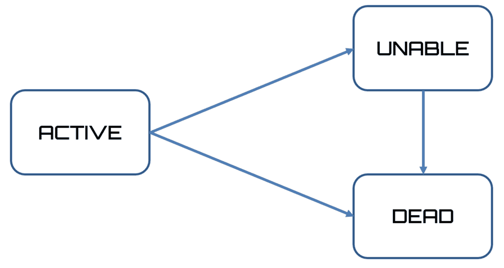
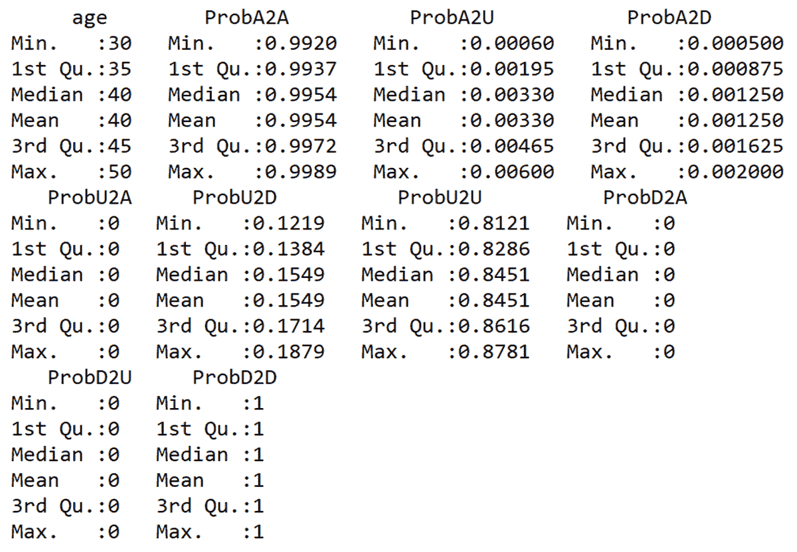
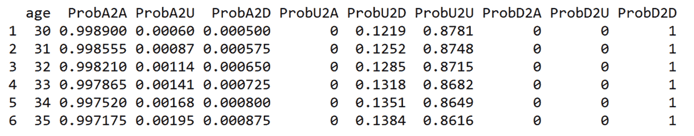
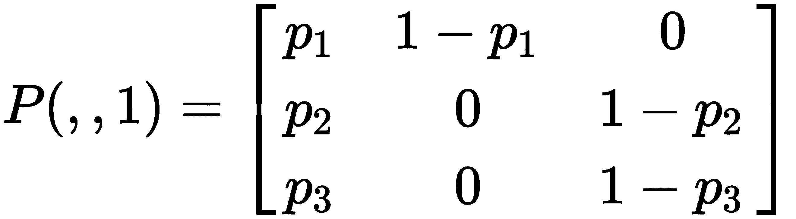
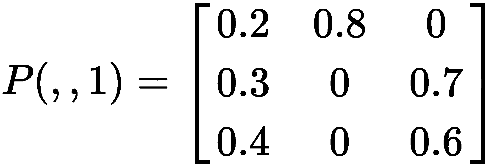
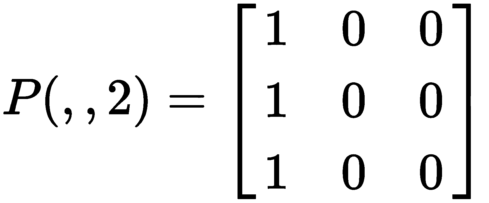
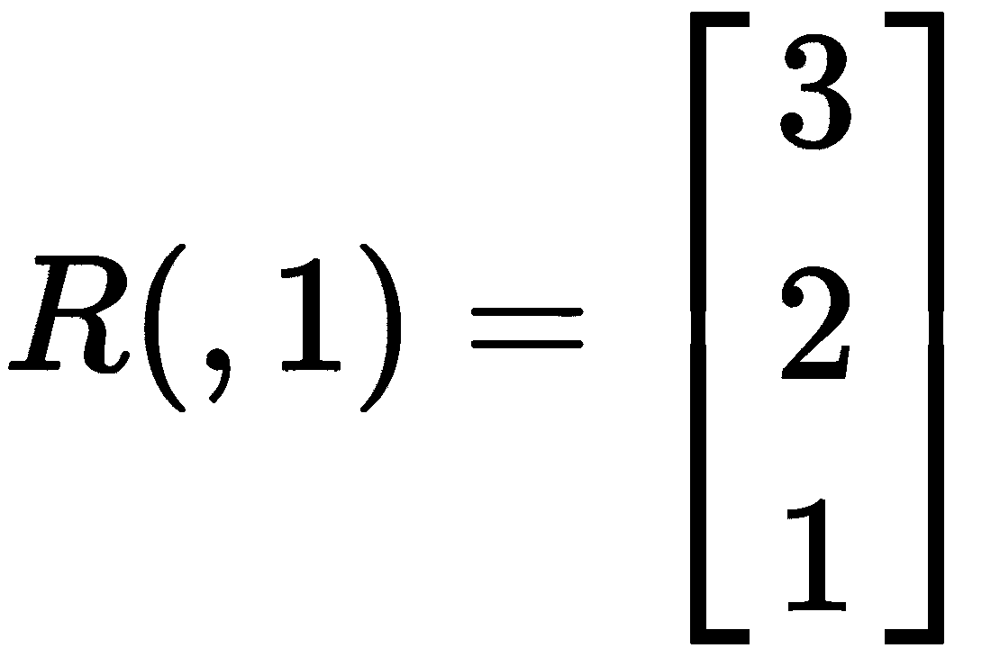
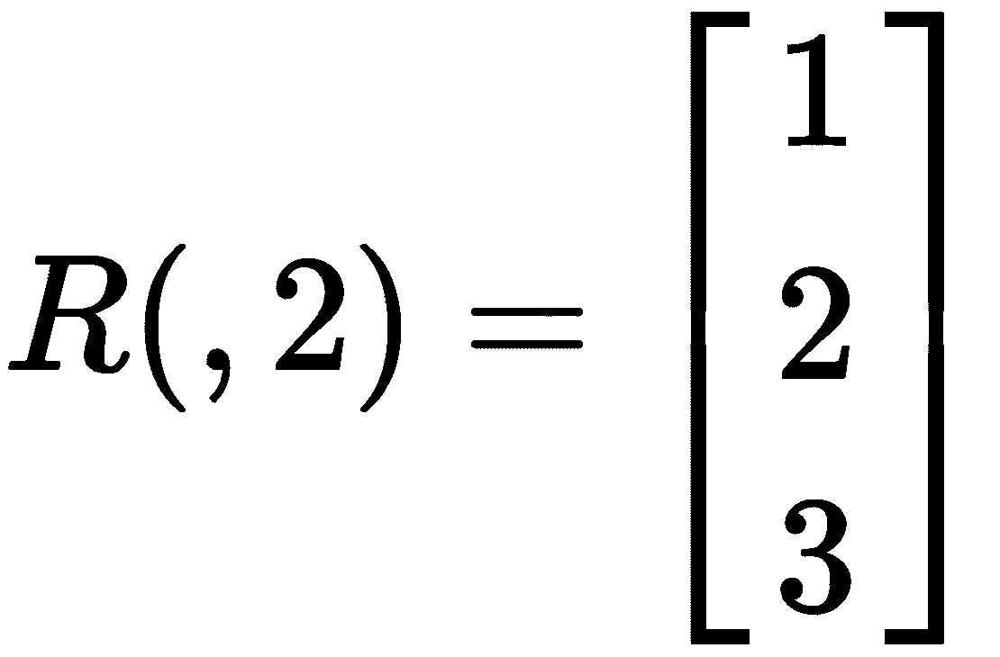
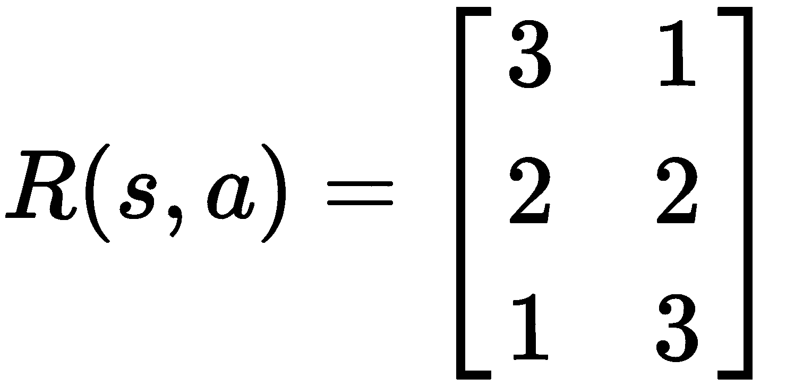
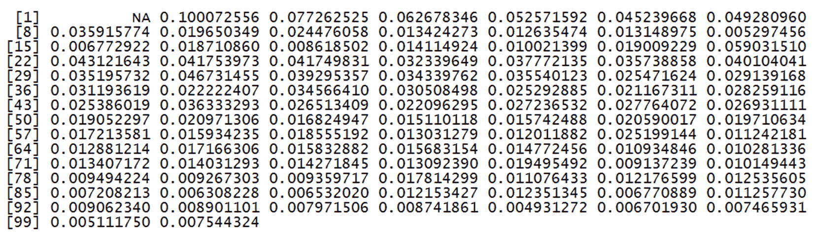

# 第十章：医疗领域中的 TD 学习

人工智能与医学——这两个领域虽然有着截然不同的起源，但它们已经开始建立起紧密的合作关系，基本目标是提高全球人口的健康水平和预期寿命。这种关系将在未来几十年内进一步加强，尤其是在 21 世纪医学面临的挑战极为严峻的背景下。在本章中，我们将通过强化学习来解决其中的一些问题。我们将学习如何在医疗领域应用强化学习。接着，我们将学习如何将医疗保险建模为马尔可夫决策过程。最后，我们将了解如何利用 TD 学习规划手术室卫生安排。

在本章中，我们将讨论以下主题：

+   在医疗领域引入强化学习

+   医疗保险计划建模

+   在健康保险中使用转移模型

+   手术室卫生安排

# 技术要求

请查看以下视频，观看代码示范：

[`bit.ly/2PE4NHe`](http://bit.ly/2PE4NHe)

# 在医疗领域引入强化学习

近年来，医疗行业对人工智能的关注巨大——事实上，我们已经观察到谷歌的 DeepMind 项目与英国国家医疗服务体系（NHS）的合作，以及 IBM 通过人工智能在基因组学和药物发现领域的持续投资。

很多人会问，机器学习在医疗领域带来的创新能够为患者的生活带来哪些具体的改善。在 5 到 10 年的时间里，人们普遍认为医疗行业将会发生彻底的革命。高层管理人员、医生、护士等是否已经为这一新挑战做好准备？

许多专家预测，在 2025 到 2030 年之间，健康领域将被基于人工智能和机器学习的新技术所席卷。这个时间框架实际上与许多其他预测一致，表明数字智能的使用将影响文化和人类活动的许多其他领域。

此刻，在西方世界，许多公司积极参与开发专门面向医疗领域的机器学习系统。除了这些知名公司外，我们还有一定数量的大学创业公司和衍生企业，几乎每天都在将注意力转向医学领域。

在接下来的章节中，我们将探讨机器学习在医疗领域的一些可能应用。

# 疾病诊断

诊断疾病是一个困难的过程，且需要大量经验。它旨在根据症状或现象识别疾病或心理病理，前者是病人身上的主观表现，后者也是医生或心理学家可以察觉的现象。症状和体征的集合，其中一些是特定的或*病理特征性的*，而其他则是更或更少具有通用性的，构成了疾病的临床表现。诊断方法的集合称为诊断学。诊断学在使用特殊设备或仪器时尤为重要，如影像学或临床诊断，尤其是在通过医生直接检查病人时。

信息技术在诊断方面提供了极大的支持。世界各地的各种中心利用全球最强大的超级计算机的空间和计算能力，获取快速而准确的诊断，这些诊断从搜索引擎和互联网数据库中庞大的知识库中提取和处理信息，包括匿名的电子病历。

近年来，基于机器的算法做出了巨大贡献。通过这些算法，病理的识别和分类受到的错误影响较小。通过这种方式，疾病的早期诊断可以使治疗更加有效。

# 流行病事件的预测

流行病一词指的是通过直接或间接传染迅速传播的疾病，直到影响到一个更或更广泛的地区的大量人群，并且在持续一段时间后消失。这一定义通常适用于传染性疾病，尽管目前有将这一术语转移到非传染性疾病领域的趋势，特别是当某些人群中这些疾病的发生频率发生明显且意外的增加时，这与因果因素的数量和质量变化相吻合。

疾病的传播依赖于由领土影响和人口流动所表征的现象。将所有这些信息关联起来是一个繁重的任务。为此，我们需要人工智能的帮助，人工智能可以通过考虑疾病发生地来预测流行病如何扩散。这项分析的结果可以帮助当局制定疫情风险控制计划。

# 新药实验

机器学习在新药的识别方面具有非常重要的作用，从药物成分的研究到预测其效果。

总部位于英国的皇家学会表示，机器学习是通过生物方法生产药物的最佳解决方案。通过这种方式，制药公司在药物生产过程中扮演着重要的助手角色，尤其是在时效性和降低生产成本方面。

在精准医学中，MIT 临床机器学习小组使用算法来识别生产药物和疗法的最佳方法，主要针对糖尿病。

另一个例子是微软的汉诺威项目，该项目在多个案例中使用了机器学习，特别是在治疗癌症的疗法技术中，尤其是在为急性髓性白血病识别个性化治疗方案方面。

# DeepMind 健康

DeepMind 可以在短短几分钟内处理数百万条医疗信息，大大加快了临床性质的医疗过程，如档案归档和诊断。DeepMind 的研究人员还在开发模拟预测行动后果能力的模型——实际上，他们正在试图理解什么是智能和想象力，并将其转化为算法。谷歌的生命科学分支 Verily 也在进行一个名为**基线研究**的项目，以收集基因数据。该项目的目的是采用一些谷歌的算法来分析是什么使人保持健康。为了这个项目，研究人员还使用了疾病监测技术，例如智能隐形眼镜来测量血糖水平。

现在，应用强化学习算法到与医疗保健相关的实际案例的时机已经到来。

# 建模健康保险计划

**长期护理**（**LTC**）一词指的是一系列必要的干预措施，旨在确保为主要是老年人提供足够的帮助，这些人因事故、疾病或仅仅因衰老而处于非自理状态。这些干预措施由公共或私人机构提供，可能包括整体健康服务和/或社会福利服务的内容，无论是在家中还是在专门为应对这些风险而设立的机构中。

这些形式的保险，无论是私人还是公共保险，其重要性本质上是由于人口老龄化进程，这一进程已经影响了所有工业化国家。这个过程正在各个福利国家的各个领域造成强烈的财务和保障问题。例如，包括养老金系统、健康服务的需求，更特别的是，当老年人在完全或部分失去自理能力时，他们所需的长期社会和健康服务的需求。

# 健康保险基础

**健康保险**指的是一类广泛的保险覆盖，允许保险公司在被保险人的健康状况因疾病或伤害而受到影响，导致高额医疗费用并无法产生收入，从而造成经济损失时进行干预。

这些保险形式的目标是保护被保险人免受与其健康状况和相对工作能力相关的风险，这些风险由于疾病的发生或事故的发生，可能会在较长或较短的时间内暂时或永久中断。

一些保险公司为替代公共卫生系统提供的健康解决方案提供财务支持，例如医疗费用报销保险；其他公司则提供收入或资本形式的收益，至少部分地补偿因工作能力丧失而导致的收入损失。

为了使保险合同货币化，需要专家介入，研究寿险公司及一般社会保障机构的技术组织，通过建立基础并从统计、财务和数学的角度检验结果。这个角色被称为精算师。

第一个生命保险精算模型实际上是在 17 世纪末和 18 世纪上半叶之间的时期出现的。几个世纪以来，已提出了不同的模型。在下一节中，我们将分析一个基于多重递减的模型。

# 引入多重递减模型

多重递减理论始于 18 世纪下半叶。这一理论在数学表述上提出了一个与其他任何类型保险活动都相关的问题。它首先在连续时间模型领域发展起来，直到 18 世纪末，才在离散时间模型的背景下发展。后者主要是在 19 世纪末期开始被考虑，用于精算计算在公共养老金系统中的首次应用。

保险费的计算基于大数法则，该法则指出，在事件*E*的*n*次独立试验中，成功的比例会随着* n*趋近于无穷大而趋向事件*E*发生的概率。这意味着，当参考样本足够大且疾病的概率彼此独立时，感染疾病的个体比例接近感染该疾病的概率，从而这部分人口将会患病。正因为有了这个原理，保险公司能够计算预期的赔付金额并提高同质性。被保险人的数量也增加了估算的准确性。因此，保险公司并不知晓谁会得病，而仅知道会生病的个体的百分比。

保费的计算必须得到双方的同意，即被保险人和保险人。在最简单的情况下，假设利率在保单的活动期内是恒定的，且个人的利益取决于死亡事件的发生。在基于共同集体的模型中，服务以相同的方式支付给每个群体。在这种情况下，必须定义何时支付利益。有两种可能的解决方案：支付群体中第一次死亡时的利益，或者支付群体中最后一次死亡时的利益。在这两种情况下，唯一的随机变量是由未来的预期寿命表示的。

寿命表用于计算预期寿命。寿命表是一种表格，显示每个年龄段的人在下一次生日之前死亡的概率。因此，在寿命表中，只有单一的退出模式。这个表格被定义为单一递减表。当我们预期一组个体有不同的递减原因时，我们可以通过基于多种递减原因的模型族来对系统进行建模。

在多重递减模型中，存在同时发生的不同递减原因。一个人的生命结束是由于这些递减功能之一。在接下来的部分中，我们将通过将问题建模为马尔可夫决策过程来计算将支付给被保险人的利益。

# 在健康保险中使用转移模型

递减模型可以看作是多状态模型的一种特殊情况。实际上，就像多状态模型中发生的那样，我们可以考虑一个年龄为*x*的个体，在时间*t*时处于*n + 1*个潜在状态之一。在多重递减模型中，从状态 0（活动）开始，所有其他转移状态都被定义为吸收状态，一旦到达这些状态，就不能再退出。

在我们的例子中，提供了三种状态：活动、无法工作和死亡。起始点显然是由活动状态表示，而其他两种（无法工作和死亡）是吸收状态，如下图所示：



我们之前已经提到，除了活动状态，所有的转移状态都是吸收状态。这意味着无法再返回活动状态。从无法工作状态转移是可能的——不幸的是，这并不愉快，因为它涉及死亡。现在，让我们学习如何设置递减表。

# 设置递减表

为了处理这个问题，必须有一个递减表。递减表包含个体从一个状态转移到另一个状态的概率，这听起来像是一个转移矩阵。我们在第三章中详细分析了转移矩阵，*马尔可夫决策过程的实际应用*。

首先，我们将学习如何构建减量表。你可能还记得，减量矩阵与寿命预期表的不同之处在于，除了包含死亡概率作为受试者年龄的函数外，它还包含其他预测状态下的转移概率：

1.  我们将创建包含这些信息的向量，并从年龄开始：

```py
age<-seq(from = 30,  to = 50, by=1)
```

在这里，我们使用了`seq()`函数，它会生成规则的序列。使用了三个参数，具体如下：

+   +   `from`：序列的起始值。

    +   `to`：序列的结束值。

    +   `by`：序列的增量。默认值为 1。

在我们的例子中，我们本可以省略`by`参数，但我们插入了它以提高代码的可读性。我们只考虑了一部分工作生涯，即从 30 岁开始到达 50 岁的这一段。当然，我们本可以将这个区间扩展到整个工作生涯，但对于我们的目的来说，这样就足够了。现在，我们可以创建包含从一个状态到另一个状态转移概率的向量。我们从活跃状态开始，接着有三个转移状态：从活跃到无法，从活跃到死亡，以及从活跃到活跃。

1.  我们将再次使用`seq()`函数，具体如下：

```py
ProbA2U<-seq(0.0006,0.0060,length.out = 21)
ProbA2D<-seq(0.0005,0.0020,length.out = 21)
ProbA2A<-1-(ProbA2U+ProbA2D)
```

我们再次使用了`seq()`函数，但这次使用了一个新的参数：`length.out`。此参数用于设置序列的期望长度。

让我们分析一下新创建的向量。第一个向量是从活跃状态到无法状态的转移概率，并且随着年龄的增长值不断增加。第二个向量是从活跃状态到死亡状态的转移概率，同样随着年龄的增长而增加。最后，第三个向量是从活跃状态到活跃状态的转移概率，得自于 1 减去前两个值的和。这是因为三个转移概率的总和必须等于 1。

1.  现在，让我们进入无法状态。同样地，我们有三个转移：无法到活跃，无法到死亡，以及无法到无法。我们来创建这三个向量：

```py
ProbU2A<-seq(0,0,length.out = 21)
ProbU2D<-seq(0.1219,0.1879,length.out = 21)
ProbU2U<-1-(ProbU2A+ProbU2D)
```

如我们所见，第一个向量仅包含零。这是因为，正如我们预料的那样，无法状态不允许转移到活跃状态；从这个意义上来说，它是一个吸收状态。第二个向量表示从无法状态到死亡状态的转移概率，且随着年龄的增长而增加。最后，第三个向量表示从无法状态到无法状态的转移概率，它是通过 1 减去前两个值的和得到的。这是因为三个转移概率的总和必须等于 1。

1.  最后，让我们进入死亡状态。同样地，我们有三个转移：死亡到活跃，死亡到无法，以及死亡到死亡。我们来创建这三个向量：

```py
ProbD2A<-seq(0,0,length.out = 21)
ProbD2U<-seq(0,0,length.out = 21)
ProbD2D<-1-(ProbD2A+ProbD2U)
```

与其他两个状态相比，死态无疑是最具吸引力的。为了验证这一点，前两个向量包含零，而第三个向量包含一。这是因为状态转移概率的和必须等于 1 这一规则仍然有效。

1.  此时，我们只需要使用这些向量来创建递减表，如下所示：

```py
DecrementsTable<- data.frame(age,ProbA2A,ProbA2U,ProbA2D,ProbU2A,ProbU2D,ProbU2U,ProbD2A,ProbD2U,ProbD2A)
```

1.  让我们看一下我们刚刚创建的表格；我们可以使用`str()`函数，它显示了 R 对象内部结构的紧凑表示：

```py
str(DecrementsTable)
```

结果显示在以下代码块中：

```py
'data.frame':  21 obs. of  10 variables:
 $ age    : num  30 31 32 33 34 35 36 37 38 39 ...
 $ ProbA2A: num  0.999 0.999 0.998 0.998 0.998 ...
 $ ProbA2U: num  0.0006 0.00087 0.00114 0.00141 0.00168 0.00195 0.00222 0.00249 0.00276 0.00303 ...
 $ ProbA2D: num  0.0005 0.000575 0.00065 0.000725 0.0008 ...
 $ ProbU2A: num  0 0 0 0 0 0 0 0 0 0 ...
 $ ProbU2D: num  0.122 0.125 0.128 0.132 0.135 ...
 $ ProbU2U: num  0.878 0.875 0.871 0.868 0.865 ...
 $ ProbD2A: num  0 0 0 0 0 0 0 0 0 0 ...
 $ ProbD2U: num  0 0 0 0 0 0 0 0 0 0 ...
 $ ProbD2D: num  1 1 1 1 1 1 1 1 1 1 ...
```

数据框包含 21 个观察值和 10 个变量。每个观察值表示从 30 岁到 50 岁的年龄。变量包括年龄和三个状态（活跃、无法工作和死亡）之间的九个转移概率。正如我们所看到的，表中包含的变量由其名称标识。要在数据框中引用变量，可以在数据框名称和变量名称之间插入美元符号（$）。此外，我们还可以读取其他信息：每个变量的类型。在本例中，我们有 10 个数值型变量。

1.  可以使用`summary()`函数获取更多信息，该函数生成变量分布的摘要：

```py
summary(TransMatrix)
```

以下结果被返回：



`summary()`函数调用特定的方法，这些方法依赖于第一个参数的类别。对于每个特征，返回以下描述符——最小值、第一四分位数、中位数、均值、第三四分位数和最大值。快速查看这些值可以帮助我们理解变量所采用值的统计分布。

1.  为了理解这个表格是如何显示的，我们可以打印递减表的前几行，如下所示：

```py
head(DecrementsTable)
```

以下是打印的结果：



如我们所见，每个观察值对应一个工人的年龄，对于每个年龄，都会报告从一个状态到另一个状态的转移概率。现在，我们可以在下一部分设置模型的基础。

# 马尔可夫决策过程模型

我们的目标是将这个问题视为一个马尔可夫决策过程。为此，我们必须定义状态。此前我们提到，工人可以处于三个状态——活跃、无法工作和死亡。让我们按照以下步骤进行：

1.  我们将创建一个包含这些信息的变量：

```py
WorkesStates<-c("Active","Unable","Dead")
```

马尔可夫过程由一个转移矩阵表示，该矩阵定义了从一个状态到另一个状态的转移概率。我们已经说过，我们的系统由三个状态定义，因此转移矩阵的大小将是 3x3。我们需要的信息包含在递减表中。

1.  然后，我们将提取在特定年龄时工人的转移矩阵：

```py
TransMatrix35<-matrix(as.numeric(DecrementsTable[DecrementsTable$age==35,2:10]),nrow = 3,ncol = 3, byrow = TRUE, dimnames = list(WorkesStates, WorkesStates))
```

为此，我们仅提取了与年龄变量值为 35 对应的观察值相关的递减表的最后九列。我们使用`matrix()`函数将提取的数据安排成一个 3x3 的矩阵（`nrow = 3, ncol = 3`），并固定了逐行的值（`byrow = TRUE`）。让我们看看结果：

```py
 Active   Unable  Dead 
Active 0.997175 0.00195 0.000875
Unable 0        0.8616  0.1384 
Dead   0        0       1        
```

通过分析前面的矩阵，我们可以看到它具有一个特殊的形状；实际上，主对角线下方的所有元素都等于零。此类矩阵称为上三角矩阵，并且具有以下特性：

+   +   秩等于主对角线上非零元素的数量。

    +   行列式等于主对角线上元素的乘积。

    +   特征值由主对角线上的元素表示。

1.  此时，我们可以定义模型：

```py
MCModel35<-new("markovchain", transitionMatrix = TransMatrix35, states = WorkesStates , name="MCModel35")
```

`markovchain` 类是专门设计用来处理同质马尔科夫链过程的。

传递以下参数：

+   +   `transitionMatrix`：这是一个方形转移矩阵，包含转移概率的元素。

    +   `states`：这是状态的名称，必须与转移矩阵的`colnames`和`rownames`相同。这是一个字符向量，列出了定义转移概率的状态。

    +   `name`：这是一个可选的字符元素，用于命名离散时间马尔科夫链。

1.  为了显示我们刚刚创建的模型的总结，让我们使用以下命令：

```py
MCModel35
```

返回以下结果：

```py
MCModel35
 A 3 - dimensional discrete Markov Chain defined by the following states:
 Active, Unable, Dead
 The transition matrix  (by rows)  is defined as follows:
 Active  Unable     Dead
Active 0.997175 0.00195 0.000875
Unable 0.000000 0.86160 0.138400
Dead   0.000000 0.00000 1.000000
```

1.  如我们在第三章《*马尔科夫决策过程实战*》中所见，要获取`markovchain`对象的状态，我们可以使用`states`方法，如下所示：

```py
states(MCModel35)
```

返回以下结果：

```py
[1] "Active" "Unable" "Dead" 
```

1.  要获取`markovchain`对象的维度，可以使用`dim()`方法，如下所示：

```py
dim(MCModel35)
```

返回以下结果：

```py
[1] 3
```

1.  要查看对象中包含哪些元素，可以使用`str()`函数，它展示了对象的内部结构的紧凑视图：

```py
str(MCModel35)
```

打印以下结果：

```py
Formal class 'markovchain' [package "markovchain"] with 4 slots
 ..@ states          : chr [1:3] "Active" "Unable" "Dead"
 ..@ byrow           : logi TRUE
 ..@ transitionMatrix: num [1:3, 1:3] 0.99718 0 0 0.00195 0.8616 ...
 .. ..- attr(*, "dimnames")=List of 2
 .. .. ..$ : chr [1:3] "Active" "Unable" "Dead"
 .. .. ..$ : chr [1:3] "Active" "Unable" "Dead"
 ..@ name            : chr "MCModel35"
```

1.  要检索每个元素，只需使用对象的名称（`MCModel35`），后跟插槽的名称，中间用`@`符号分隔。例如，要打印转移矩阵，我们可以写如下代码：

```py
MCModel35@transitionMatrix
```

返回以下结果：

```py
 Active  Unable     Dead
Active 0.997175 0.00195 0.000875
Unable 0.000000 0.86160 0.138400
Dead   0.000000 0.00000 1.000000
```

1.  我们可以这样评估吸收状态：

```py
absorbingStates(MCModel35)
```

返回以下状态：

```py
[1] "Dead"
```

1.  正如我们所知，从这个状态，我们无法回到之前的状态。此时，我们可以预测工人的状态。这是一个模拟，接下来让我们看看会发生什么：

```py
set.seed(5)
WorkerStatePred35<- rmarkovchain(n = 1000, object = MCModel35, t0 ="Active")
```

`set.seed()`命令定义了随机数生成器的种子。这样，每次执行代码时，所有使用的随机数都会是相同的，从而确保例子的可重复性。

1.  我们将从结果中提取统计数据：

```py
table(WorkerStatePred35)
```

返回以下结果：

```py
WorkerStatePred35
Active
 1000
```

让我们看看 50 岁工人的情况：

1.  首先，我们将提取工人 50 岁时的转移矩阵：

```py
TransMatrix50<-matrix(as.numeric(DecrementsTable[DecrementsTable$age==50,2:10]),nrow = 3,ncol = 3, byrow = TRUE, dimnames = list(WorkesStates, WorkesStates))
```

1.  然后，我们将设置模型：

```py
MCModel50<-new("markovchain", transitionMatrix = TransMatrix50, states = WorkesStates, name="MCModel50")
```

1.  最后，我们将模拟工作生活：

```py
WorkerStatePred50<- rmarkovchain(n = 1000, object = MCModel50, t0 ="Active")
```

1.  现在，我们可以提取结果：

```py
table(WorkerStatePred50)
```

以下结果被打印出来：

```py
WorkerStatePred50
Active   Dead Unable
 33    956     11
```

现在，我们可以预测工作生活，模拟一个工人在不同时间段的状态：

1.  我们需要做的第一件事是为每个可用的工作年龄创建一个`markovchain`对象。我们将参考 30 到 50 岁之间的区间，因为我们有该数据。

1.  为了加快这个过程，我们将创建一个迭代循环，并将每个`markovchain`对象插入一个列表中：

```py
MCModelsList=list()
j=1
for(i in 30:50){
  TransMatrix<-matrix(as.numeric(DecrementsTable[DecrementsTable$age==i,2:10]),nrow = 3,ncol = 3, byrow = TRUE, dimnames = list(WorkesStates, WorkesStates))
  MCModelsList[[j]]<-new("markovchain", transitionMatrix = TransMatrix, states = WorkesStates)
  j=j+1
}
```

1.  首先，我们初始化了一个列表和一个计数器，它将帮助我们更新列表。

1.  然后，我们从减少表中提取值，以获得每个年龄的转移矩阵。

1.  最后，我们为该年龄段创建了`markovchain`对象。在这一点上，我们可以创建一个`markovchainList`对象，如下所示：

```py
MCList30to50<-new("markovchainList", markovchains = MCModelsList,name="MCList30to50")
```

`markovchainlist`对象是一个`markovchain`对象的列表。这些对象可以用来建模非齐次离散时间马尔科夫链，当转移概率随时间变化时。

1.  现在，我们可以模拟工人可能处于的状态之间的转移：

```py
StatesSequence<-rmarkovchain(n=10000, object=MCList30to50,t0="Active")
```

`rmarkovchain()`函数生成一个从齐次或非齐次马尔科夫链生成的状态序列。在我们的例子中，我们已经生成了 10,000 次模拟的序列。

1.  让我们看看新创建的对象包含了什么：

```py
str(StatesSequence)
```

以下结果被打印出来：

```py
'data.frame':  210000 obs. of  2 variables:
 $ iteration: num  1 1 1 1 1 1 1 1 1 1 ...
 $ values   : Factor w/ 3 levels "Active","Dead",..: 1 1 1 1 1 1 1 1 1 1 ...
```

这是一个包含 210,000 个观察值的二维数据框。我们对第二个值变量感兴趣，该变量包含模拟的状态。

1.  接下来，我们将提取一些简单的统计数据，帮助我们获取所有模拟中每个状态出现的次数：

```py
StatesOccurences<-table(StatesSequence$value)
```

以下结果被返回：

```py
Active   Dead Unable
202189   4889   2922
```

1.  利用现有数据，计算工人处于`Unable`状态的预期时间非常容易：

```py
ExpectedUnableOccurence<-StatesOccurences[3]/nrow(StatesSequence)
```

这里，我们将无法出现的次数除以`StatesSequence`对象中包含的行数。`StatesSequence`对象中的行数等于模拟次数（10,000）与工作年限（21 年，从 30 岁到 50 岁）的乘积。

以下结果被返回：

```py
 Unable
0.01391429
```

从我们进行的模拟开始，保险公司可以预测预期的保费。

在下一部分中，我们将学习如何优化医院手术室的使用。

# 手术室卫生规划

每年，大约 8,000 例死亡与手术室感染相关。在美国，感染会增加住院时长，从而增加费用，并导致患者提起法律诉讼。医院是一个建筑，其中适当的清洁条件有助于患者及工作人员的生活质量，并减少微生物传播的概率。

环境卫生涉及到实际和卫生程序的复杂性，以及通过清洁和去污活动使植物或特定环境保持健康的操作。当使用消毒剂时，这被称为卫生处理。必须在消毒之前进行充分的清洁周期，并且在任何情况下，都必须与消毒操作结合进行。每个环境都有一个最佳标准，这是环境本身预期用途的结果。因此，手术室的卫生与病房的卫生完全不同，后者又与公共区域的卫生不同。医院可以分为三类感染风险区：低、中、高风险区。低风险区包括走廊、办公室和候诊室等公共区域。中风险区包括病房、诊所和实验室。高风险区包括手术室、重症监护室、复苏室和恢复室。

手术室感染的预防是一个重要且当前的问题，因为它代表着手术过程中常见的严重并发症，会对患者的健康造成严重后果，并增加住院和院外的费用。对于患者而言，医院感染意味着额外的疾病；对于医生或护士来说，这些感染可能会使治疗效果失效，质疑他们的专业性，并使他们对所治疗患者的死亡率增加负有责任。基于这些原因，实施旨在控制感染的预防性干预措施必须成为一个共同且共享的目标。

我们将通过定义可用的数据和希望实现的目标来框定问题。

# 定义背景

在这个例子中，我们将处理手术室的卫生和灭菌活动规划问题。这是一项常规操作，涉及到资源使用和手术室空闲时间的成本。在手术室卫生维护活动的规划中，必须追求两个主要目标：第一个目标是避免手术室内患者发生感染，第二个目标是节省卫生和灭菌操作的成本。

这两个目标在任何情况下都是相关的，因为手术室可能发生的感染会启动一个干预协议，该协议需要额外的操作，并会导致活动停止 9 小时。另一方面，标准操作会导致活动停止 3 小时。卫生消毒操作每 30 天进行一次。鉴于最近的感染案例，手术室管理者希望了解在截止日期之前进行额外操作的规划是否能够改善情况。有两个可用的操作：不执行额外操作（NoSS = 无卫生消毒）或执行额外操作（SS = 卫生消毒）。

两次操作之间的间隔（30 天）被划分为三个子间隔，分别对应手术室所处的三个状态：

+   状态 1：上次干预后的 0-10 天间隔

+   状态 2：上次干预后的 11-20 天间隔

+   状态 3：上次干预后的 21-30 天间隔

在卫生消毒操作之后，房间进入状态 1。如果在前 10 天内没有进行其他操作，房间将进入状态 2，最后，在接下来的 10 天后，房间进入状态 3，届时预期在所有情况下都需要进行干预。如果在两次操作之间，患者感染了，手术室的持续操作将被中断，并进行紧急操作，将系统恢复到状态 1。问题是如何在长期视角下，除了已经预见的操作之外，管理卫生消毒操作，以最大化奖励。

# 过渡概率和奖励

这个问题可以看作一个马尔科夫决策过程。首先，我们必须定义过渡矩阵 *P* (*s*, *s'*, *a*)。记住，它告诉我们从一个状态到另一个状态的概率是多少。由于有两个可用的操作（NoSS 和 SS），我们将定义两个过渡矩阵。我们用 *ps* 表示感染的概率，感染的概率取决于手术室的状态。上次干预的时间越长，感染的概率越高。在这方面，我们将定义三个感染概率：p1 = 0.2，p2 = 0.3 和 p3 = 0.4。请记住，由于有两个可能的操作，我们将定义两个过渡矩阵。与操作 1（NoSS）选择相关的过渡矩阵如下：



如果我们处于状态 1，那么我们将有概率*p1*保持在该状态，如果发生感染。剩余的概率*1-p1*则意味着如果没有感染，我们将转移到下一个状态。而进入状态 3 的概率为 0，不能直接从状态 1 转到状态 3。回想一下，在过渡矩阵中，处于同一行中的所有概率之和必须等于 1。如果我们处于状态 2，我们将有概率*p2*转移到状态 1，如果发生感染。剩余的概率*1-p2*则意味着如果没有感染，我们将转移到下一个状态，如状态 3。在这种情况下，保持在状态 2 的概率为 0。最后，如果我们处于状态 3，我们将有概率*p3*转移到状态 1，如果发生感染。

剩余的概率*1-p3*预计如果没有发生感染，仍然保持在状态 3。在这个状态之后，仍然会进行消毒-灭菌操作，而进入状态 2 的概率为 0。

通过替换与过渡矩阵中的三个状态相关联的三个概率值，我们得到以下矩阵：



现在，让我们定义与选择动作 2（SS）相关的过渡矩阵：



在这种情况下，过渡矩阵的形式更为直接：它是预见进行消毒-灭菌操作的行动，正如我们预期的那样，无论如何，房间都处于状态 1。这是我们所有三个状态中死去的人，这意味着我们转到状态 1 的概率是 1。

有了过渡矩阵，我们就完成了。现在，我们必须定义奖励矩阵。它是一个 3x2 的矩阵：三个状态和两个动作。动作 1（NoSS）计划不进行额外操作；在这种情况下，随着我们接近常规操作计划的结束期（30 天），奖励会递减。然后，奖励矩阵的第一列将呈现以下形式：



其含义显而易见：如果选择的行动是不给予消毒-灭菌操作，那么在第一种状态下我们将获得 3 的奖励，在第二种状态下我们将获得 2 的奖励，而在第三种状态下将获得最小奖励。如果选择的行动是进行消毒-灭菌操作，那么我们将得到以下结果：



如我们所见，情况与之前的情况相反：如果选择的行动是进行消毒-灭菌操作，那么在第一种状态下我们将获得 1 的奖励，在第二种状态下获得 2 的奖励，在第三种状态下获得最大奖励。

在这些条件下，奖励矩阵变为以下形式：



在定义了处理该问题所需的必要工具后，让我们继续构建模型。

# 模型设置

正如我们已经提到的，我们的目标是计算一个策略，使我们能够根据刚刚开发的设置获得最大奖励。这意味着通过最小化手术室卫生消毒操作的成本，减少感染风险。让我们开始吧：

1.  让我们看一下允许我们执行此操作的代码：

```py
library(MDPtoolbox)
P <- array(0, c(3,3,2))
P[,,1] <- matrix(c(0.2, 0.8, 0, 0.3,0,0.7,0.4,0,0.6), 3, 3, byrow=TRUE)
P[,,2] <- matrix(c(1, 0, 0, 1, 0, 0,1, 0, 0), 3, 3, byrow=TRUE)
R <- matrix(c(3, 1, 2, 2,1,3), 3, 2, byrow=TRUE)
mdp_check(P, R)
QLearnModel=mdp_Q_learning(P=P, R=R, discount = 0.95)
print(QLearnModel$Q)
print(QLearnModel$V)
print(QLearnModel$policy)
print(QLearnModel$mean_discrepancy)
```

1.  我们将逐行分析代码，以理解每条命令的含义。首先，导入库：

```py
library(MDPtoolbox)
```

**马尔可夫决策过程**（**MDP**）工具箱包含许多功能，帮助我们解决离散时间马尔可夫决策过程的问题。我们在第三章中介绍了该包，*马尔可夫决策过程的实际应用*。

首先要做的是定义转移矩阵*P*和奖励矩阵*R*。这两个矩阵已经在转移概率和奖励部分进行了充分介绍。

1.  转移矩阵是一个 3x3 矩阵。首先，我们将创建一个新矩阵并初始化为零：

```py
P <- array(0, c(3,3,2))
```

1.  我们需要定义与动作 1（NoSS）相关的转移矩阵：

```py
P[,,1] <- matrix(c(0.2, 0.8, 0, 0.3,0,0.7,0.4,0,0.6), 3, 3, byrow=TRUE)
```

定义如下矩阵：

```py
> P[,,1]
 [,1] [,2] [,3]
[1,]  0.2  0.8  0.0
[2,]  0.3  0.0  0.7
[3,]  0.4  0.0  0.6
```

1.  让我们定义与动作 2（SS）相关的转移矩阵：

```py
P[,,2] <- matrix(c(1, 0, 0, 1, 0, 0,1, 0, 0), 3, 3, byrow=TRUE)
```

定义如下矩阵：

```py
> P[,,2]
 [,1] [,2] [,3]
[1,]    1    0    0
[2,]    1    0    0
[3,]    1    0    0
```

1.  接下来我们定义奖励矩阵，如下所示：

```py
R <- matrix(c(3, 1, 2, 2,1,3), 3, 2, byrow=TRUE)
```

引入以下矩阵：

```py
> R
 [,1] [,2]
[1,]    3    1
[2,]    2    2
[3,]    1    3
```

在继续开发模型之前，需要验证`P`和`R`是否满足将问题归类为 MDP 类型所必需的标准。

1.  为此，我们将使用`mdp_check()`函数：

```py
mdp_check(P, R)
```

该函数对我们定义的 MDP 过程进行检查，通过设置转移概率矩阵(*P*)和奖励矩阵(*R*)。如果`P`和`R`设置正确，则函数返回一个空消息。如果`P`和`R`没有正确设置，函数将返回一条描述问题的错误消息。返回的结果如下：

```py
> mdp_check(P, R)
[1] ""
```

1.  所以，问题已经设置好了。现在，我们可以使用`mdp_Q_learning()`函数尝试解决问题，如下所示：

```py
QLearnModel=mdp_Q_learning(P=P, R=R, discount = 0.95)
```

`mdp_Q_learning()`函数使用 Q-learning 算法解决折扣 MDP。正如我们在第七章中提到的，*时序差分学习*，Q-learning 是最常用的强化学习算法之一。得益于这一技术，我们能够为每个给定状态在一个完成的 MDP 中找到最佳动作。

强化学习问题的一般解法是通过学习过程估计一个评估函数。该函数必须能够通过奖励的总和来评估某一特定策略的优劣。实际上，Q-learning 试图最大化 Q 函数（动作值函数）的值，该函数表示当我们在状态 *s* 下执行动作 *a* 时的最大折扣未来奖励。

Q-learning 通过逐步更新环境中状态-动作对的值，按照估算 TD 方法值的通用公式的更新逻辑，递增地估计函数值 𝑞(𝑠, 𝑎)。Q-learning 具有离策略特性，即尽管策略是根据 𝑞(𝑠, 𝑎) 估算的值来改进的，但值函数通过遵循严格贪婪的二级策略来更新估算值：给定一个状态，选择的动作始终是最大化值 max𝑞(𝑠, 𝑎) 的动作。然而，π 策略在估算值时扮演着重要角色，因为通过它可以确定要访问和更新的状态-动作对。

传入以下参数：

+   **P**：转移概率数组

+   **R**：奖励数组

+   **折扣**：折扣因子——折扣是一个实数，属于 ]0; 1[

`mdp_Q_learning()` 函数计算 Q 矩阵、平均偏差，并在分配足够的迭代次数后给出最优值函数和最优策略。返回以下结果：

+   **Q**：动作值函数

+   **V**：值函数

+   **policy**：策略

+   `mean_discrepancy`：偏差表示经过 100 次迭代后的偏差

现在，我们来看一下结果：

1.  让我们从动作值函数开始分析我们得到的结果：

```py
print(QLearnModel$Q)
```

打印出以下表格：

```py
> print(QLearnModel$Q)

 [,1] [,2]
[1,] 47.14339 40.10113
[2,] 46.59996 37.67135
[3,] 29.04791 47.32842
```

Q 函数代表了该过程的核心要素；它是与奖励矩阵相同维度的矩阵，即一个 SxA 矩阵。值-动作函数返回我们在给定状态下采取某个特定动作并遵循最优策略时期望达到的效用。

1.  让我们打印出值函数：

```py
print(QLearnModel$V)
```

打印出以下向量：

```py
> print(QLearnModel$V)
[1] 47.14339 46.59996 47.32842
```

值函数表示一个状态对于智能体的好坏。它等于智能体从状态 *s* 中期望获得的总奖励。值函数取决于智能体选择的策略，该策略决定了要执行的动作。*V* 是一个 *S* 长度的向量。

1.  然后，我们将提取策略：

```py
print(QLearnModel$policy)
```

返回以下结果：

```py
> print(QLearnModel$policy)
[1] 1 1 2
```

策略是一个 *S* 长度的向量。每个元素是一个整数，对应于最大化价值函数的动作。策略定义了在给定时刻学习代理的行为。它将环境的检测状态与在这些状态下采取的行动相对应。这与心理学中所说的刺激反应规则或关联集合相对应。策略是强化学习代理的基本部分，因为仅凭它就足以决定行为。

因此，方法建议的策略是在前两个状态下不进行卫生消毒操作，而是在处于状态 3 时执行。原因是，在前两个状态下感染的概率较低，而在状态 3 中则变得重要。

1.  最后，我们打印了 100 次迭代中的不一致均值：

```py
print(QLearnModel$mean_discrepancy)
```

以下表格已打印：



`mean_discrepancy` 值是 *V* 的不一致均值向量，经过 100 次迭代。这里，默认的 *N* 值下，向量的长度为 100。

# 总结

在本章中，我们学习了如何在医疗领域使用强化学习。我们首先分析了基于机器学习算法在医疗中的应用概况。我们看到这些算法如何用于疾病诊断、流行病事件预测以及新药物测试。

然后，我们处理了两个实际案例。首先，我们看到如何通过将医疗保险问题建模为马尔科夫过程来解决问题。通过这种方式，可以预测工人受伤的概率，并量化需要支付的保费。在第二个例子中，我们确定了在手术室消毒操作计划中应该采用的最佳策略。这个问题通过 Q-learning 技术得以解决。

在下一章中，我们将探索深度强化学习的世界，以及如何利用神经网络使最佳策略研究操作更加高效。
