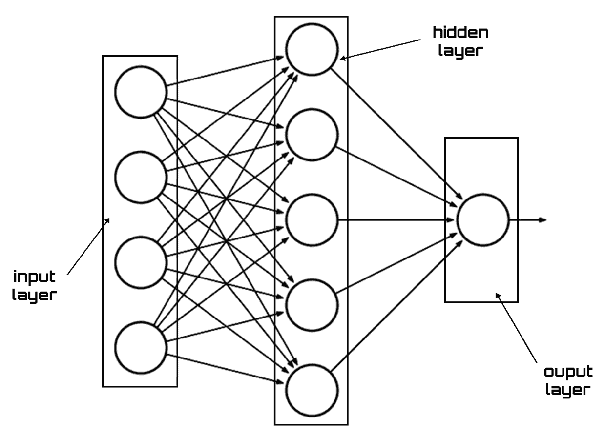

# 第十一章：探索深度强化学习方法

**神经网络**（**NNs**）在获取高度结构化数据的良好特征方面非常有效。然后，我们可以用神经网络来表示我们的 Q 函数，该神经网络以状态和动作作为输入，并输出（给出）相应的 Q 值。**深度强化学习**（**DRL**）方法使用深度神经网络来逼近以下任何强化学习组件：价值函数、策略和模型。

在本章中，我们将逐步学习 DRL。首先，我们将学习人工神经网络的基本概念，并通过实际示例看到如何应用它们。随后，我们将看到如何将这些概念应用于强化学习，以提高算法的性能。

到本章结束时，我们将学习人工神经网络的基本原理，如何将前馈神经网络方法应用于你的数据，以及神经网络算法如何工作。我们将理解深度神经网络用来逼近强化学习组件的基本概念，并将学习如何使用 R 实现深度 Q 网络。最后，我们将学习如何使用 R 实现深度递归 Q 网络。

在本章中，我们将讨论以下主题：

+   介绍神经网络基本概念

+   管理前馈神经网络

+   用于回归的神经网络

+   接近 DRL

+   深度递归 Q 网络

# 技术要求

查看以下视频，了解代码的实际应用：

[`bit.ly/35szk1D`](http://bit.ly/35szk1D)

# 介绍神经网络基本概念

**人工神经网络**（**ANNs**）是数学模型，其目的是尝试模拟一些典型的人类大脑活动，例如模式识别、语言理解、图像感知等。一个 ANN 的架构由一组节点组成，这些节点指代人类大脑中的神经元，节点之间通过加权连接相互连接，模拟神经元之间的突触。网络的输出通过连接权重迭代更新，直到收敛。实验领域收集的数据在输入层提供，网络结果在输出层提供。输入节点代表预测输出神经元所需的独立或预测变量。

神经网络提供了一套非常强大的工具，可以解决分类、回归和非线性控制领域的问题。除了具有较高的处理速度外，神经网络还能够从一组示例中学习解决方案。在许多应用中，这使得我们能够绕过开发物理过程模型的需求，而这一模型往往难以找到，甚至不可能找到。

ANNs 尝试模拟生物神经元的行为。我们来看看具体如何实现的。

# 生物神经网络

神经网络的灵感来源于对生物神经系统信息处理机制的研究，特别是人类大脑；事实上，神经网络的研究正是为了探究这些机制。人工神经网络由许多神经元或简单的处理单元组成。人工神经元模拟生物神经元的特性——人类神经系统中的每个细胞都能够接收、处理并传输电信号。

它由四个基本部分组成，分别是：

+   细胞体

+   突触

+   轴突

+   树突

树突通过突触接收来自其他神经元的电信号，并将其传输到细胞体。在这里，这些信号被加在一起，如果总的兴奋度超过了某个阈值，细胞就会通过轴突将信号传递给其他细胞。

以下图示展示了一个生物神经元的结构：


当信号到达突触时，它会引起一种叫做神经递质的化学物质的释放，这些化学物质进入其他神经元的细胞体。根据突触的类型（可以是兴奋性或抑制性），这些物质分别增加或减少下一个神经元被激活的概率。在每个突触处，都会有一个权重值与之相关，这个权重决定了兴奋或抑制效应的类型和大小。因此，每个神经元都会对来自其他神经元的输入进行加权求和，如果这个求和结果超过了某个阈值，神经元就会被激活。

每个神经元执行的操作持续时间为毫秒级，因此它代表了一个相对较慢的处理系统。然而，整个网络拥有大量的神经元和突触，这些神经元和突触能够并行并同时操作，从而使得实际的处理能力非常强大。此外，生物神经网络对不准确甚至错误的信息具有很高的容忍度；它具有学习和归纳的能力，这使得它在识别和分类操作中表现得非常高效。

神经元的功能调控着大脑的活动，大脑是一个自然优化的解决复杂问题的机器。它由简单的元素构成，经过时间的演化，朝着提升其能力的方向发展：大脑没有中央控制，各个区域共同协作完成任务或解决问题。如果大脑的某一部分停止工作，它仍然能够继续执行任务，尽管可能没有原来的表现那么好。大脑具有容错能力；随着神经元的破坏，其性能会缓慢下降。

# 人工神经网络

类似于生物神经元，人工神经元接收来自不同神经元的输入刺激。每个输入会乘以一个相应的权重，并与其他输入相加，进而通过另一个函数决定神经元的激活水平。

神经网络的架构特点在于输入神经元与输出神经元的区分、突触（或神经元）层数以及反馈连接的存在，如下图所示：


当输入向量（刺激）作用于神经网络的输入神经元时，信号沿着连接以并行方式在内部节点之间传播，直到输出并产生神经网络的响应。在最简单的模型中，每个节点仅处理局部信息，不知道整体处理目标，并且没有记忆。网络的响应和行为本质上取决于其架构和人工突触的值。

在某些情况下，单一的突触层不足以学习输入和输出模式之间的期望关联：在这种情况下，需要使用多层网络，具有内部神经元和多个突触层。这些网络被称为深度神经网络。这样的网络响应是通过逐层计算神经元的激活值，逐渐从内部节点向输出节点推进得到的。

人工神经网络的目标仅仅是通过确定性计算计算所有神经元的输出。基本上，ANN 是一组数学函数逼近。以下元素是 ANN 架构中至关重要的：

+   层

+   权重

+   偏置

+   激活函数

在接下来的部分中，我们将深入探讨这些概念。

# 层类型

我们已经在*人工神经网络*部分介绍了人工神经网络的架构，并且能够分析一个突出不同类型神经元的方案。在该方案中，可以识别出一个层次结构。事实上，我们可以轻松地识别出输入层、一个中间层（称为隐藏层）和输出层，如下图所示：



在之前的图中，可以识别出最简单的架构，包括输入层、一个隐藏层和输出层。

每一层都有自己的任务，通过它所包含的神经元的作用来执行。输入层的作用是将初始数据输入系统，以便后续层进一步处理。从输入层开始，人工神经网络的工作流程启动。

在输入层，人工神经元扮演着不同的角色，因为它们不会接收来自前一层的信息。在一般情况下，它们接收一系列输入，并将信息首次引入系统。然后，这一层将数据传递给下一层，在那里神经元接收加权输入。

人工神经网络中的隐藏层位于输入层和输出层之间。隐藏层的神经元接收一组加权输入，并根据从激活函数接收到的指示产生输出。它代表了整个网络的核心部分，因为正是在这里，输入数据转化为输出响应的“魔法”发生。

隐藏层可以以多种方式操作。在某些情况下，输入是随机加权的；在其他情况下，它们通过迭代过程进行调整。通常，隐藏层的神经元类似于大脑中的生物神经元：它接收其概率输入信号，对其进行处理，并将其转换为对应于生物神经元轴突的输出。

最后，输出层为模型生成特定的输出。虽然它们的生成方式与神经网络中的其他人工神经元非常相似，但输出层中神经元的类型和数量取决于系统必须提供的响应类型。例如，如果我们正在设计一个用于对象分类的神经网络，则输出层将由一个节点组成，该节点将为我们提供此值。事实上，该节点的输出只需提供一个正面或负面的指示，表示目标在输入数据中是否存在。

# 权重和偏置

在人工神经网络中，输入转换为输出依赖于连接权重的贡献。在线性回归中，斜率与输入相乘以提供输出。对于神经网络中的权重，也可以做出相同的论点。实际上，权重是表示每个神经元对最终结果贡献的数值参数。例如，如果输入是 *x[1]*、*x[2]* 和 *x[3]*，则应用于这些输入的突触权重分别表示为 *w[1]*、*w[2]* 和 *w[3]*。

在这种假设下，我们可以通过以下公式表示神经元返回的输出：


在前面的公式中，*i* 是输入的数量。

在前面的公式中，矩阵乘法定义了加权和。为了这个加权和，必须加上偏置，这可以与线性方程中的加截距进行比较。因此，偏置是一个额外的参数，用于调整每个神经元的输出。

神经元的处理过程因此表示如下：


输出由激活函数进行调整。某一层神经元的输出将代表下一层的输入，如下图所示：


这个方案的含义是，我们给输入信号（*x[i]*）赋予一个权重（*w[i]*），它是一个实数，模拟了自然突触。当* w[i]*的值大于零时，通道被称为**兴奋性**；如果值小于零，则通道为抑制性。*w[i]*的绝对值表示连接的强度。

# 激活函数

激活函数在处理系统输出中起着至关重要的作用。激活函数表示一种数学函数，它将输入转换为输出，并根据神经网络定义处理过程。如果没有激活函数的贡献，神经网络将简化为一个简单的线性函数。在线性函数中，从输入到输出的转换通过直接的比例关系实现，如下所示：


简单来说，线性函数是一阶多项式，即一条直线。在现实世界中，大多数问题都是非线性且复杂的。为了解决非线性问题，必须使用激活函数。非线性函数是高阶多项式函数，如下所示：


它是一个包含复杂度因子的非线性函数。激活函数为神经网络添加了非线性特性，并将其表征为通用函数的逼近器。

神经网络可使用许多激活函数。以下是最常用的几种：

+   **Sigmoid**：该函数由 S 形的 Sigmoid 曲线表示。它是最常用的激活函数。它的作用是将输入转换为 0 和 1 之间的值。这样，模型呈现出一种逻辑性质。

+   **单位阶跃**：该函数将输入转换为 0（如果参数为负数），或 1（如果参数为正数）。这样，输出具有二进制性质。这些激活函数用于二进制方案。

+   **双曲正切**：它是一个非线性函数，定义在值的范围内（-1, 1）。这些函数很有趣，因为它们允许神经元具有连续的输出，从而可以进行概率解释。

+   **整流线性单元**（**ReLU**）：它是一个具有线性特性的函数，对于存在域的部分，如果输入是正数，则直接输出输入值；否则，输出为零。其输出范围介于 0 和无限大之间。ReLU 在计算机视觉和语音识别中通过深度神经网络得到应用。

# 管理前馈神经网络

当数据流从输入层传递到隐含层，再到输出层时，我们称之为前馈传播。在这种情况下，转移函数应用于每一层隐藏层。因此，激活函数的值会传播到下一层。下一层可以是另一层隐藏层，或者是输出层。

**前馈**一词用于表示每个节点仅接收来自低层的连接的网络。这些网络会对每个输入模式发出响应，但无法捕捉输入信息可能的时间结构或展示内生的时间动态。

现在让我们进入神经网络的一个关键话题：神经网络训练。

# 神经网络训练

为了选择使神经元开启或关闭的输入值，需要训练网络。这是实现模型中的关键步骤，旨在训练神经网络以从一组对应已知输出的输入中进行泛化。网络的性能在很大程度上取决于呈现给它们的信息：这些信息必须代表网络需要学习的内容。训练是构建神经网络的基础，所使用的示例（训练集）必须仔细选择。

我们将采取逐步的方式来理解具有单一隐藏层的神经网络训练。假设输入层有一个神经元，输出将解决一个二分类问题（预测 0 或 1）。以下是训练网络的所有步骤列表：

1.  将输入加载为矩阵。

1.  使用随机值初始化权重和偏置。这一步仅在开始时进行，之后只需更新它们。

1.  对每个周期重复步骤 4 到 9，直到收敛。

1.  将输入传递到网络中。

1.  从输入层通过隐藏层(s)到输出层，估计输出。

1.  估计输出的误差。

1.  采用输出误差来计算前面层的误差信号。

1.  采用误差信号计算权重变化。

1.  使用权重变化来更新权重。

*步骤 4* 和 *5* 是前向传播，*步骤 6* 到 *9* 是反向传播。

通常，教会网络通过调整神经元权重 (*w[i]*) 来进行泛化的最常用方法是遵循**增量规则**，该规则通过比较网络输出与期望值：将两个值相减，差值用于更新所有输入的权重，其中这些输入的值不为零。

该过程会迭代，直到收敛为止。下图显示了净重调整过程的图示：


在实践中，算法将输入与输出进行比较：计算加权输入值与输出或期望值之间的差异，并利用该差异（误差）重新计算所有输入权重。该过程会反复进行，直到输入和输出之间的误差接近于零。

在接下来的部分中，我们将应用神经网络来解决回归问题。

# 回归神经网络

回归分析是数据科学的起点；事实上，它们是数值模拟中最为理解透彻的模型。回归模型易于解释，因为它们基于坚实的数学基础——可以想象为矩阵代数。线性回归允许我们推导出一个数学公式来代表相应的模型。因此，这些技术极易理解。

回归分析是一种统计过程，旨在识别一组自变量（解释变量）与因变量（响应变量）之间的关系。通过这项技术，可以确定当解释变量变化时，响应变量的值如何变化。

在接下来的段落中，提出了一个回归预测建模问题的示例，旨在理解如何通过神经网络来解决。将使用波士顿数据集作为数据来源；预测测试数据中业主自住住宅的中位数价格。该数据集描述了波士顿郊区房屋的 12 个数值特征，目的是建模这些郊区房屋的价格（以千美元为单位）。因此，这是一个回归预测建模问题，因为输出是一个连续变量。

记住，回归与分类都与预测有关：在分类中，我们试图通过将输出分组为类别（分类变量）来预测输出，而在回归中，我们试图以连续的方式（连续变量）预测输出值。

波士顿数据集的输入属性包括犯罪率、非零售商业区土地比例和化学物质浓度等特征。

获取数据时，我们利用 UCI 机器学习库中的大量数据集，数据链接如下：[`archive.ics.uci.edu/ml`](http://archive.ics.uci.edu/ml)。

实例数量和变量数量如下所示：

+   实例数量：506

+   变量数量：13 个连续变量（包括类属性 `medv`）和 1 个二值属性

所有变量如下所示：

+   `crimper`：每个城镇的人均犯罪率

+   `zn`：规划为大于 25,000 平方英尺地块的住宅用地比例

+   `indus`：每个城镇的非零售商业区土地比例

+   `chas`：查尔斯河虚拟变量（= 1 如果地块与河流相邻；否则为 0）

+   `nox`：氮氧化物浓度（每千万分之一）

+   `rm`：每个住宅的平均房间数

+   `age`：1940 年之前建造的房主自有住房比例

+   `dis`：到波士顿五个就业中心的加权距离

+   `rad`：径向公路可达性指数

+   `tax`：每$10,000 的房产税率

+   `ptratio`：每个城镇的师生比例

+   `lstat`：人口中低社会经济地位的比例

+   `medv`：房主自有住宅的中位数价值（以千美元为单位）

在之前的列表中，`medv`是响应变量，其他 13 个变量是预测变量。我们的目标是开发一个回归模型，用以模拟`medv`值的变化。该模型应该能够识别前 13 列与响应变量`medv`之间的关系（如果存在的话）。

这个数据集已经通过 R 库（MASS）提供，因此我们无需担心获取数据。

首先，我们需要获取数据。正如我们所说的那样，我们可以使用 MASS 库：

1.  让我们加载所需的库：

```py
library(MASS)
```

要安装一个新的库，需要使用`install.packages()`函数。这个功能安装所需的包。需要传递一个包含名称的向量和目标库，之后该命令将从仓库下载并安装这些包。

1.  现在让我们关注如何使实验具有可重复性：

```py
set.seed(5)
```

`set.seed()`命令使得示例可重复，即每次模拟生成的所有随机数始终相同。

1.  现在我们可以加载数据集了：

```py
InputData = Boston
```

1.  我们将只使用对分析有用的变量：

```py
InputData = subset(InputData, select = -c(12) )
```

数据框还包括原始数据集中变量的名称。

让我们先看看数据。

# 探索性分析

现在我们进行探索性分析，看看数据是如何分布的，并提取初步知识。让我们首先使用`str()`函数检查数据集。这个函数返回一个紧凑的 R 对象内部结构总结。

理想情况下，每个基本结构只显示一行：

```py
str(InputData)
```

返回的结果如下：

```py
'data.frame':  506 obs. of  13 variables:
 $ crim   : num  0.00632 0.02731 0.02729 0.03237 0.06905 ...
 $ zn     : num  18 0 0 0 0 0 12.5 12.5 12.5 12.5 ...
 $ indus  : num  2.31 7.07 7.07 2.18 2.18 2.18 7.87 7.87 7.8 ...
 $ chas   : int  0 0 0 0 0 0 0 0 0 0 ...
 $ nox    : num  0.538 0.469 0.469 0.458 0.458 0.458 0.524 ...
 $ rm     : num  6.58 6.42 7.18 7 7.15 ...
 $ age    : num  65.2 78.9 61.1 45.8 54.2 58.7 66.6 96.1 100...
 $ dis    : num  4.09 4.97 4.97 6.06 6.06 ...
 $ rad    : int  1 2 2 3 3 3 5 5 5 5 ...
 $ tax    : num  296 242 242 222 222 222 311 311 311 311 ...
 $ ptratio: num  15.3 17.8 17.8 18.7 18.7 18.7 15.2 15.2 15\. ...
 $ lstat  : num  4.98 9.14 4.03 2.94 5.33 ...
 $ medv   : num  24 21.6 34.7 33.4 36.2 28.7 22.9 27.1 16.5...
```

所以，我们确认数据集包含 506 个观测值和 13 个变量：11 个数值型和 2 个整数型。现在，为了获得数据集的简要总结，我们可以使用`summary()`函数，如下所示：

```py
summary(InputData)
```

`summary()`函数返回一系列数据统计信息。

结果显示如下：


结果分析表明，变量的范围不同。当预测变量的极端值差异很大时，具有极端值的特征对响应变量的权重可能会占主导地位，这会影响预测的准确性。因此，我们可能需要对不同特征下的值进行缩放，以便它们落在一个共同的范围内。通过这一统计过程，可以比较属于不同分布的相同变量，也可以比较以不同单位表示的变量。

请记住，在训练回归算法之前，重新缩放数据是一个好习惯。使用重新缩放技术可以消除数据单位，这使得我们可以轻松比较来自不同位置的数据。

为了重新缩放数据，我们将使用最小-最大方法，将所有数据缩放到[0, 1]范围内。实现这一点的公式如下：


首先，我们需要计算数据库中每一列的最小值和最大值。我们将使用`apply()`函数将函数应用于矩阵的值：

```py
MaxData <- apply(InputData, 2, max)
```

三个参数已经传递：第一个指定要应用函数的数据集（`InputData`）。第二个参数指定函数（2）将应用的索引。由于是矩阵，1 指定行，2 指定列。第三个参数指定要应用的函数，在我们的案例中是`max()`函数。

现在，我们将计算每一列的最小值：

```py
MinData <- apply(InputData, 2, min)
```

现在，我们需要应用`scale()`函数来归一化数据。`scale()`函数对数值矩阵的列进行中心化和/或缩放，如下所示：

```py
DataScaled <- scale(InputData,center = MinData, scale = MaxData - MinData)
```

为了确认数据是否已归一化，我们再次应用`summary()`函数：

```py
summary(DataScaled)
```

打印出以下结果：


让我们开始我们的探索性分析。我们可以通过绘制变量的箱型图来进行，如下所示：

```py
boxplot(BHDataScaled)
```

打印出以下图表：


前面的图表清楚地显示了一些变量具有异常值。例如，变量 crim 显示了最多的离群值。离群值在数值上与其余数据明显不同。含有异常值的变量所获得的统计数据可能会返回错误的信息。

# 训练网络

在训练网络之前，我们必须先拆分数据。我们将从数据拆分开始，将数据按照指定的比例划分为训练集和验证集。在数据集非常大的情况下，这种技术尤其有用。在这种情况下，数据集被划分为两个部分：训练集和测试集。训练集用于训练模型，而测试集则为我们提供了显著的性能估计。当使用缓慢的算法并且需要快速估算性能时，这种方法非常有利。

以下示例将数据集划分为 70%的数据用于训练神经网络模型，其余 30%的数据用于评估模型性能：

```py
IndexData = sample(1:nrow(InputData),round(0.70*nrow(InputData)))
TrainData <- as.data.frame(DataScaled[IndexData,])
TestData <- as.data.frame(DataScaled[-IndexData,])
```

第一行的代码将 70:30 的数据进行拆分，即使用 70%的数据来训练网络，剩下的 30%用于测试网络。在第二行和第三行中，名为`DataScaled`的数据框被拆分为两个新数据框，分别称为`TrainData`和`TestData`。

现在，我们需要设置构建神经网络时使用的公式：

```py
n = names(InputData)
f = as.formula(paste("medv ~",
                     paste(n[!n %in% "medv"],
                           collapse = " + ")))
```

在前面的代码中，我们首先通过`names()`函数获取所有变量名。接下来，我们创建用于构建网络的公式。

`neuralnet()`函数使用紧凑的符号形式的公式。`~`操作符定义了模型。例如，**公式 y ~**模型的意思是，输出 y 由符号方式指定的预测变量建模。该模型由一系列通过`+`操作符分隔的项组成，每项是通过`:`操作符分隔的变量名。

然后，我们将使用`neuralnet`库来构建和训练网络。让我们加载该库：

```py
library("neuralnet")
```

`neuralnet`库用于使用反向传播、弹性反向传播（RPROP）以及带或不带权重回溯的训练神经网络，或者使用修改后的全局收敛版本（GRPROP）。以下表格提供了该包的一些信息：

| 包 | `neuralnet` |
| --- | --- |
| 日期 | 2019-02-07 |
| 版本 | 1.44.2 |
| 标题 | 神经网络的训练 |
| 作者 | Stefan Fritsch, Frauke Guenther, Marvin N. Wright, Marc Suling, Sebastian M. Mueller |

以下列出了该包中最有用的函数：

+   `neuralnet`：神经网络的训练。

+   `compute`：计算给定协变量向量的神经网络结果。

+   `prediction`：总结神经网络的输出、数据以及`glm`对象的拟合值（如果可用）。

+   `plot.nn`：神经网络的绘图方法。

现在，我们可以构建和训练网络。首先，我们必须选择神经元的数量，为此，我们需要了解以下内容：

+   选择较少神经元的层会导致较高的误差；这是因为预测因子可能过于复杂。

+   相反，过多的神经元会使训练数据过载，无法进行泛化。每个隐藏层中的神经元数量应介于输入层和输出层之间，例如取平均值。

+   每个隐藏层中的神经元数量不应超过输入神经元数量的两倍。

我们选择在隐藏层设置十个神经元。别担心——最佳选择通过经验得出：

```py
NetDataModel = neuralnet(f,data=TrainData,hidden=10,linear.output=T)
```

`hidden`参数指定每个隐藏层的神经元数量。`linear.output`参数执行回归（如果`linear.output=TRUE`）或分类（如果`linear.output=FALSE`）。

为了生成模型结果的汇总，我们使用`summary()`函数：

```py
summary(NetDataModel)
```

返回以下结果：

```py
> summary(NetDataModel)
 Length Class      Mode   ca
ll                   5   -none-     call 
response             354   -none-     numeric
covariate           4248   -none-     numeric
model.list             2   -none-     list 
err.fct                1   -none-     function
act.fct                1   -none-     function
linear.output          1   -none-     logical
data                  13   data.frame list 
net.result             1   -none-     list 
weights                1   -none-     list 
startweights           1   -none-     list 
generalized.weights    1   -none-     list 
result.matrix        144   -none-     numeric
```

每个神经网络模型组件显示三个特征：

+   **长度：** 此功能指定该类型包含的元素数量。

+   **类：** 此功能返回有关组件类别的具体指示。

+   **模式：** 此功能描述了组件的类型（数字、列表、函数、逻辑等）。

`plot()`函数绘制一张图，显示神经网络的架构，包括各层、节点和每个连接的权重：

```py
plot(NetDataModel)
```

神经网络图如下所示：


在前面的图示中，黑线表示各层之间的连接；此外，每个连接上的权重值也被打印出来。蓝线显示了每一步中添加的偏置。

# 神经网络模型评估

现在，我们可以使用网络进行预测。为此，我们已经将 30%的数据保留在`TestData`数据框中。现在是时候使用它了：

```py
PredNetTest <- compute(NetDataModel,TestData[,1:12])
```

我们如何判断网络的预测是否准确呢？我们可以使用**均方误差**（**MSE**）作为衡量我们预测与真实数据之间差距的标准。

在算法的第一部分，我们对数据进行了归一化。为了比较数据，我们需要回退并返回到原始数据。一旦数据集的值被恢复，我们就可以通过以下方程计算 MSE：


以下代码执行了 MSE 计算：

```py
PredNetTestStart <- PredNetTest$net.result*(max(InputData$medv)-
                                                         min(InputData$medv))+min(InputData$medv)
TestStart <- as.data.frame((TestData$medv)*(max(InputData$medv)-
                                                min(InputData$medv))+min(InputData$medv))
MSENetData <- sum((TestStart -
                     PredNetTestStart)²)/nrow(TestStart)
```

现在我们有了结果，但我们该与什么进行比较呢？为了与另一个模型进行比较，我们可以构建一个线性回归模型。然后，我们通过应用`lm()`函数来建立线性回归模型。这个函数用于处理线性回归模型，如下所示：

```py
RegressionModel <- lm(medv~., data=InputData)
```

为了生成模型结果的总结，我们可以再次使用`summary()`函数，如下所示：

```py
summary(RegressionModel)
```

以下是返回的结果：


现在，我们将计算基于多重回归的模型的 MSE：

```py
TestDataComp <- InputData[-IndexData,]
PredictLm <- predict(RegressionModel,TestDataComp)
MSERegrData <- sum((PredictLm - TestDataComp$medv)²)/nrow(TestDataComp)
```

最后，我们可以比较两个模型的结果：

```py
cat("MSE for Neural Network Model =",MSENetData,"\n")
cat("MSE for Regression Model =",MSERegrData,"\n")
```

以下是打印出的结果：

```py
> cat("MSE for Neural Network Model =",MSENetData,"\n")
MSE for Neural Network Model = 19.41977332
> cat("MSE for Regression Model =",MSERegrData,"\n")
MSE for Regression Model = 34.83062039
```

从两个模型（神经网络模型与线性回归模型）的比较中可以看出，神经网络获胜（19.4 对 34.8）。

在接下来的部分，我们将看到如何开发一个 DRL 模型。

# 接近 DRL

在第七章，*时间差分学习*中，我们展示了一个实际的例子，使用 Q-learning 来解决车辆路径规划问题。在那个案例中，值函数的估计是通过一个表格完成的，其中每个格子代表一个状态或一个状态-动作对。使用表格表示值函数能够创建简单的算法。在马尔可夫环境下，这个表格允许我们准确地估计值函数，因为它为环境的每一个可能配置分配了在策略迭代过程中预期的表现。然而，使用表格也带来了局限性。这些方法仅适用于状态和动作数目较少的环境。问题不仅限于存储表格所需的大量内存，更主要的是准确估计每个状态-动作对所需的大量数据和时间。换句话说，主要问题在于泛化能力。

为了解决这个问题，我们可以采用一种基于强化学习方法与函数逼近方法结合的方案。下图展示了一个深度 Q 学习方案：


“深度 Q 学习”这一术语指的是一种强化学习方法，它采用神经网络作为价值函数的逼近。因此，它代表了基本 Q 学习方法的进化，因为动作-状态表被神经网络所取代，用以逼近最优价值函数。

这是与前几章看到的方法相比，一种创新的 approach。到目前为止，算法的输入提供了状态和动作，以便提供期望的回报。深度 Q 学习彻底革新了结构，因为它只需要环境的状态作为输入，并提供所有的状态-动作值，因为在环境中可以执行的动作是多样的。

Q 学习是一种在强化学习中广泛使用的算法。最初，当它与神经网络一起使用时，被认为是不稳定的算法，因此其使用被限制在涉及有限维度状态空间的任务和问题中。Q 学习算法和技术可以与深度神经网络（DNN）一起使用。这些算法已展示出卓越的性能。

深度 Q 学习或深度 Q 网络（DQN）是一种用于函数逼近的强化学习方法。它代表了 Q 学习方法的进化，其中动作-状态表被神经网络取代。在这个算法中，学习不再是更新表格，而是调整构成网络的神经元的权重。这个更新过程是通过反向传播技术进行的，正如我们在本章的*神经网络训练*部分中所学到的。

因此，价值函数的学习是基于使用以下函数来修改权重：


在前面的方程中，两个项具有以下含义：

+   *L[t]* 是损失函数。

+   是最优的预期回报。

+    是网络的估计值。

损失函数计算的误差将通过反向步骤（反向传播）在网络中进行传播，遵循梯度下降的逻辑。实际上，梯度指示了函数增长的最大方向；朝相反方向移动，我们将误差降至最小。策略行为通过 e-贪婪方法给出，以确保足够的探索。DQN 的关键方面是经验回放的使用。通过这种技术，代理的经验在每个时间步* t * 时被捕获并保存在一个名为回放记忆的数据集中。

训练通过小批量技术进行，即从回放记忆中随机提取一部分经验样本。通过这种方式，过去的经验被用来更新网络。此外，回放记忆随机选择的子集可以打断连续经验之间的强相关性，从而减少更新之间的方差。

以下是伪代码中的算法：

```py
Initialize Replay Memory D
Initialize Q (s, a) with random weights
repeat Observe initial state s1
    for t = 1 to T do
        Select an action using Q (greedy)
        Perform the action at
        Look at the reward rt and the new state st+1
        Save the observation (st, at, rt, s+ 1) in the Replay Memory D
        Take a sample (sj, aj, rj, sj+1) from D
        Calculate the target T for each observation
        if sj + 1 is Terminal state then
            T = rj
        else
            T = rj + γ maxa Q (sj+1, aj)
        end if
        trains the Q network by minimizing (T - Q (sj, aj))2
    end for
until
```

该算法可以使用 R 和可用于神经网络及强化学习的库来实现。

现在我们来看一个高级的深度强化学习（DRL）示例。

# 深度递归 Q 网络

在上一节《*接近深度强化学习*》中，我们已经提到深度 Q 学习使用神经网络作为价值函数的近似。然而，这种方法有着有限的内存，并且依赖于在每个决策点感知环境状态的可能性。为了克服这个问题，我们可以通过用递归 LSTM 替换第一级全连接神经网络，向**深度 Q 网络**（**DQN**）中添加递归。通过这种方式，得到了**深度递归 Q 网络**（**DRQN**）模型。

让我们从递归神经网络开始。

# 递归神经网络

**递归神经网络**（**RNN**）是一种神经网络模型，其中存在双向信息流。换句话说，在前馈网络中，信号的传播仅以单向连续的方式从输入到输出进行，而递归网络则不同。在递归网络中，这种传播不仅可以发生在一个神经层向后传播到前一个神经层，还可以在同一层中的神经元之间，甚至在神经元与其自身之间发生。

递归网络将在特定的时刻做出决定，这些决定会影响它随后的决策。递归网络有两个输入来源：当前的状态和最近的过去。这些信息被结合起来以确定如何对新数据作出反应。递归网络与前馈网络的不同之处在于，它们加入了与过去决策相关的反馈。这一功能使得递归网络具有记忆，能够执行前馈网络无法完成的任务。

内存的访问是通过内容进行的，而不是通过地址或位置。一种方法是，内存内容是 RNN 节点上激活的模式。其理念是，从一个部分或噪声表示的激活模式开始网络，作为请求的内存内容的表示，然后网络将稳定到所需的内容。

RNN 是一类神经网络，其中至少存在一个神经元之间的反馈连接，形成一个有向循环。一个典型的具有输出层和隐藏层连接的 RNN 如下图所示：


在前面图示的递归网络中，输入层和输出层都用来定义隐藏层的权重。最终，我们可以将 RNN 看作是 ANN 的一种变体：这些变体可以通过不同数量的隐藏层和不同的数据流趋势来特征化。RNN 的特点是数据流的不同趋势，事实上，神经元之间的连接形成了一个循环。递归神经网络可以利用内部记忆进行处理，因为它们在隐藏层之间有连接，这些连接会随时间传播，学习序列数据。

# 总结

在本章中，我们探索了 DRL 的世界。首先，我们学习了神经网络的基本概念。我们理解了层、节点、偏置和传递函数的概念。简而言之，我们了解了全连接神经网络的架构如何构建。随后，我们应用所学的技能，构建了一个神经网络来解决回归问题。接着，我们学习了 DRL 的含义以及神经网络如何用来逼近价值函数。最后，我们分析了另一种形式的 DRL，其中神经网络被递归网络所替代。这些被称为 DRQN 的网络已被证明特别高效。

在下一章，我们将探索使用 TensorFlow 作为后端引擎的 Keras 模型。我们将学习如何使用 Keras 设置一个多层感知器模型。接着，我们将学习如何使用 DRL 平衡一个小车摆系统。
