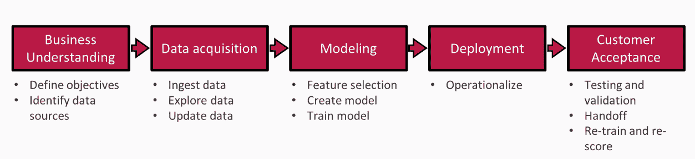
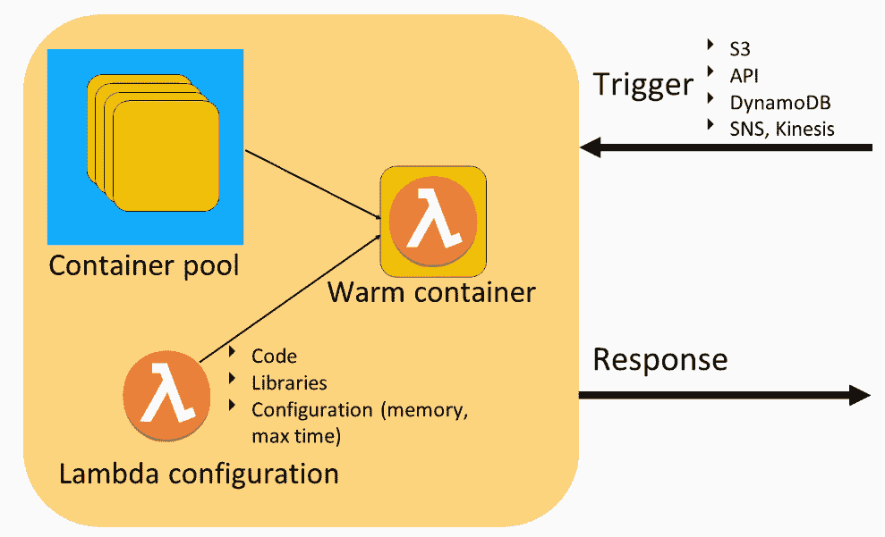
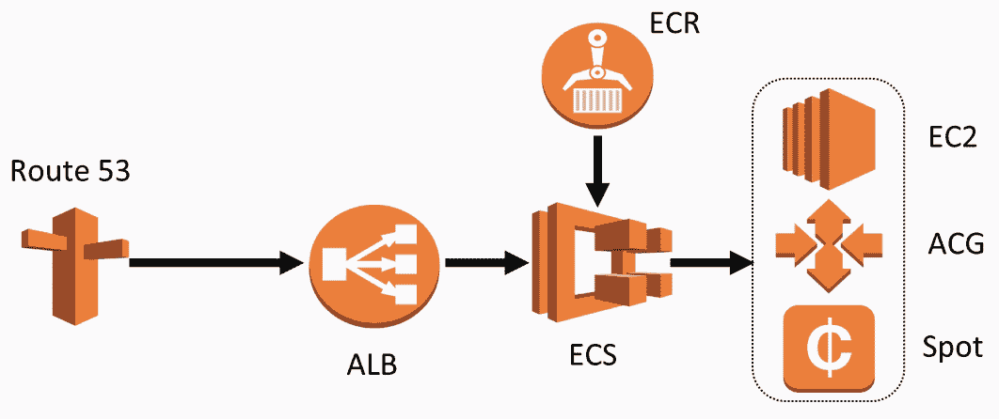
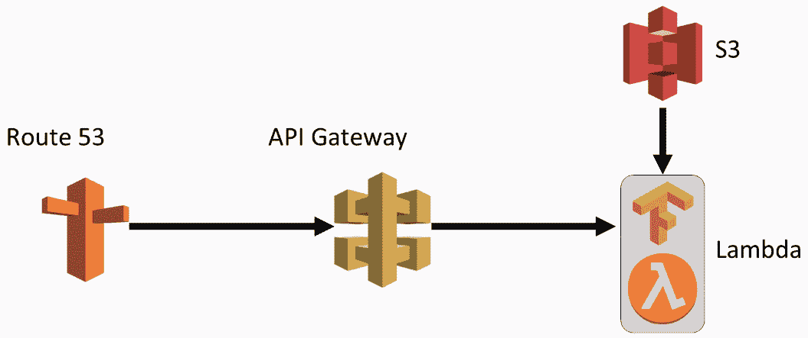

# 第一章：从无服务器计算和 AWS Lambda 开始

本书将鼓励你使用自定义训练的模型与 AWS Lambda 进行配合，并使用简化的无服务器计算方法。稍后，你将实现一些示例项目，展示使用 AWS Lambda 为 TensorFlow 模型提供服务的方式。

在本章中，我们将讨论无服务器深度学习，你将探索为什么无服务器如此受欢迎，以及使用无服务器部署应用程序的优势。同时，你还将了解数据科学流程，以及无服务器如何提供一种简便快捷的方式来部署深度学习应用程序。你还将简要了解我们将在后续章节中制作的示例项目。

你还将学习 AWS 实现的工作原理，包括传统和无服务器的深度学习应用程序部署方式。

特别地，我们将涵盖以下主题：

+   什么是无服务器计算？

+   为什么选择无服务器深度学习？

+   AWS Lambda 函数

+   示例项目

# 什么是无服务器计算？

无服务器计算是一种架构，其代码执行由云提供商管理，这意味着开发者在部署代码时无需担心管理、配置和维护服务器。

让我们讨论应用程序部署的可能方式：

+   **本地**部署让你控制整个基础设施，包括硬件。换句话说，它意味着应用程序运行在我们的机器上，你可以物理访问。

+   然后，你有**基础设施即服务**（**IaaS**），这意味着你无法物理访问服务器，但你控制其中发生的所有事情。

+   接下来，你有**平台即服务**（**PaaS**），在这种模式下，你不能控制操作系统或运行时，但你可以控制我们的代码和容器。

+   最后，你有**功能即服务**（**FaaS**），这是一种无服务器模型，唯一能控制的就是代码本身。它可以大大促进我们在不同应用程序上的工作。

# 为什么选择无服务器深度学习？

让我们理解为什么无服务器基础设施在数据科学流程中部署深度学习模型极为有用。

一般的数据科学流程如下：

+   商业理解：你需要理解业务需求，包括定义目标和可能的数据源。

+   数据获取：你需要查看你打算使用的数据，探索它，尝试找到相关性和空白。

+   建模：你从选择最有前景的特征开始，构建模型并进行训练。

+   部署：你需要将模型投入生产并部署。

+   客户接受度：你可以将结果提供给客户并接收反馈。

之前的要点通过以下图表呈现：

根据从客户那里收到的反馈，你可以更新模型并改变部署方式。部署和客户接受阶段具有迭代性质。这意味着你需要尽早从用户那里获得反馈。为此，我们的部署基础设施必须同时既简单又具备可扩展性，这可以通过无服务器基础设施来完成，从而用于部署深度学习模型。

你需要意识到，我们的深度学习基础设施必须能够与现有基础设施进行集成。

# 无服务器深度学习适用于哪些场景，哪些场景不适用？

无服务器深度学习部署具有很高的可扩展性、简单性，并且启动成本低。它的缺点是时间限制、CPU 限制和内存限制。

# 无服务器深度学习适用于哪些场景？

在接下来的部分中，你将从重申无服务器深度学习部署的优点开始：

+   对于你的项目来说，它非常有用。如果你训练了模型并希望向世界展示，无服务器深度学习将让你在没有复杂部署和前期成本的情况下做到这一点。AWS 还提供每月免费使用。这意味着在 AWS Lambda 中的多个调用将完全免费。例如，在我们将在后续章节讨论的图像识别项目中，运行次数大约为 10 万次。

+   无服务器深度学习非常适合那些希望尽早验证业务假设的早期创业公司。简单性和可扩展性使得小团队可以在没有 AWS 专业知识的情况下开始。AWS Lambda 让你能够轻松计算每个客户的成本，并了解每个用户的创业成本。

+   无服务器深度学习在你已有现有基础设施并希望优化成本时非常方便。与集群架构相比，无服务器架构将更简单、更便宜，并且更易于维护。显著的是，它能降低成本，因为你不需要保留未使用的服务器。

+   无服务器深度学习对于负载非常高的场景非常有用。例如，许多公司在遇到第一分钟有 100 万次请求，而下一分钟没有请求的情况下，难以维护系统。集群要么过大，要么需要一定时间才能扩展。而无服务器架构具有无与伦比的可扩展性，可以让系统在高负载下运行而不会崩溃。

# 无服务器深度学习不适用于哪些场景？

在以下情况下，深度学习将无法工作：

+   如果你的系统的主要特点之一是提供实时响应，而且这是一个非常复杂的模型；例如，如果它是用户与系统之间交互的一部分，那么无服务器架构可能不足以满足你的需求。AWS Lambda 有冷启动延迟以及将模型卸载和加载到内存中的延迟。它确实运行得很快，但可能需要几秒钟的时间。速度高度依赖于模型的大小和复杂性，因此这是你需要事先进行测试的部分。

+   如果你的模型使用大量数据，无服务器深度学习可能会失败。AWS Lambda 有一些限制，比如运行时为 3 GB 和硬盘为 0.5 GB，这意味着你要么需要优化代码的内存使用，要么使用集群。

+   如果你的模型对 CPU 性能或核心数量有要求，那么它可能无法在 Lambda 上启动。没有明确的限制可以预测你的模型是否能够在 AWS Lambda 上启动，因此这需要进行测试。

+   一个极为复杂的模型可能无法在无服务器基础设施上良好运行。所谓复杂的模型，是指超过 1 或 2 GB 的模型。它需要更长的时间从 S3 下载，且 Lambda 可能没有足够的内存来加载它。

上述用例向我们展示了无服务器学习的应用场景，它将帮助我们决定是否使用它。最后，在很多情况下，并没有一个明确的答案，继续在无服务器环境中测试你的模型是有意义的。

现在我们来讨论 Lambda 函数作为无服务器模型的情况。

# Lambda 函数 – AWS 实现的 FaaS

在本节中，我们将讨论 AWS 实现的 FaaS 的工作原理。Lambda 函数是 AWS 实现的 FaaS。AWS 服务会保存 Lambda 配置，基本上包括代码、库和服务内的参数。一旦接收到触发信号，AWS 会从池中提取容器，并将配置放入容器中。然后，它会用事件触发的数据在容器内运行代码。一旦容器生成结果，服务会将其返回给响应。

以下图表展示了 Lambda 函数的工作原理：

Lambda 可以自动扩展，支持最多 10,000 个并发执行。此外，Lambda 定价是按使用量计费的，因此你只需为每次 Lambda 调用付费，当它不运行时，你无需付费。

Lambda 配置包括以下内容：

+   **代码**：这就是你想要在函数中运行的内容。代码需要明确声明你希望服务运行的函数。

+   **库**：这些库使我们能够运行更复杂的流程。你需要将它们与代码本身放在同一个包内。

+   **配置**：这些是决定 Lambda 工作方式的各种参数。

主要参数如下：

+   关系内存和超时

+   运行时（例如，Python 或 Node）

+   触发器，我们将在下一节中描述

+   IAM 角色，提供 Lambda 访问其他内部服务的权限

+   环境参数，允许我们自定义代码的输入参数

# Lambda 触发器

有许多 AWS 服务可以作为 AWS Lambda 的触发器，它们是：

+   **DynamoDB**：这使我们能够在每次数据库中新条目时启动 Lambda 函数

+   **Amazon S3**：这有助于 Lambda 函数启动存储桶中的文件

+   **CloudWatch**：这使我们能够根据时间表（例如，每分钟，每天，或每周四中午）运行 Lambda 函数

+   **Lex**：这通过查看常见的数据科学过程来开始

+   **Kinesis、SQS 和 SNS**：这些使我们能够在事件流中的每个对象上启动 Lambda 函数

有很多不同的触发器，这意味着你可以将 Lambda 绑定到许多不同的服务。

# 为什么在 AWS Lambda 上进行深度学习？

在这里，你将看到 AWS Lambda 的优势：

+   在 AWS Lambda 上编码非常简单。你只需要代码包和库，而不需要 Docker 容器。它使你能够提前开始，并部署与本地运行相同的代码。因此，这对于早期阶段的项目来说非常合适。

+   AWS Lambda 具有极高的可扩展性，更重要的是，你不必管理可扩展性或为其编写单独的逻辑，因为你的数据科学应用可以轻松处理大量任务或与多个用户进行协作。

+   AWS Lambda 的定价非常合理。你只需为实际使用的部分付费，且价格非常实惠。例如，对于图像识别模型，成本为每 20,000 至 30,000 次运行 1 美元。

在下一节，你将了解使用 Lambda 的传统架构和无服务器架构的区别。

# 传统架构与使用 Lambda 的无服务器架构

让我们看一下传统架构和无服务器架构之间的区别。以下图示表示了通过传统架构的深度学习 API：

在上面的传统架构中，你不仅需要处理集群本身，还需要处理所有 API 请求的负载均衡。此外，你还需要管理带有代码和库的 Docker 容器，并找到使用容器注册表部署它的方法。

你需要对 AWS 有广泛的了解才能理解这个架构。虽然它不是特别困难，但对于初学者来说确实可能是个问题。你需要记住，AWS 的深度学习架构将有固定的成本。

让我们讨论一下上述应用程序的无服务器实现。以下图示表示了使用 Lambda 进行深度学习的架构：

在前面的图示中，你可以看到它看起来比传统架构简单得多。你无需管理节点的负载均衡扩展性或容器——你只需放入你的代码库，Lambda 会管理其他所有事项。而且，你可以使用它制作多个不同的原型，你只需为调用付费。这使得 Lambda 成为将深度学习模型提供给用户的完美方式。在接下来的章节中，你将简要了解你将在本书中开发的项目。

# 示例项目

在本节中，你将涵盖在本书过程中开发的项目。你将创建三个项目：

+   深度学习 API

+   深度学习批处理

+   无服务器深度学习工作流

# 深度学习 API

深度学习 API 项目提供了很好的实践体验，因为你可以直接从浏览器看到结果。你将从用于图像识别的深度学习 API 开始。图像识别是深度学习在其中展示出令人难以置信的结果的任务之一，这些结果无法通过其他任何方法实现。你将使用一个现代的、公开可用的预训练 Inception 模型，它是版本独立的。这个项目还将向你展示如何轻松地将开源模型创建一个 API 接口。

# 深度学习批处理

在深度学习批处理项目中，你将深入了解许多公司如何运行深度学习应用程序。这个项目中，你将构建用于图像识别的深度学习批处理。它将向我们展示高 Lambda 可扩展性如何让我们同时处理成千上万的预测任务。

# 无服务器深度学习工作流

在无服务器深度学习工作流项目中，你将重点展示深度学习模型在无服务器架构上的模式。你将为图像识别制作一个无服务器深度学习工作流。该项目将向你展示如何使用 AWS Step Functions 进行现代化的部署技术。你还将学习如何在部署过程中进行 A/B 测试、错误处理以及多步骤过程。这个项目将帮助你理解无服务器部署的潜在应用，并教你如何将这些知识应用到个人项目或公司项目中。

# 总结

在本章中，你了解了无服务器函数、AWS 实现及其服务。你学习了 Lambda 函数，这是 AWS 实现的 FaaS。你还了解了 AWS 实现的 FaaS 的工作原理。之后，你理解了为什么无服务器基础设施在部署深度学习模型时极其有用，以及在部署过程中可能面临的挑战。你还比较了传统方式和无服务器方式在部署深度学习应用时的差异。你研究了无服务器深度学习的适用场景以及不适用场景。最后，你了解了本书中将要学习的各种示例项目。

在下一章中，你将学习如何使用 AWS Lambda 及其部署。
