# 第二章：使用 AWS Lambda 函数开始部署

在本章中，我们将更深入了解 AWS Lambda 并学习它是如何工作的。我们还将讨论部署 Lambda 的不同方式以及在为 AWS Lambda 开发应用时需要考虑的事项。

我们将学习如何设置 AWS 账户以及访问管理。我们还将使用 AWS Lambda 创建一个 Hello World 函数。

我们将覆盖以下主题：

+   AWS Lambda 函数

+   开始使用 AWS 账户

+   无服务器框架简介

+   部署 AWS Lambda 函数

# 技术要求

本章的技术要求如下：

+   AWS 订阅

+   Python 3.6

+   AWS CLI

+   无服务器框架

+   你可以在 [`github.com/PacktPublishing/Hands-On-Serverless-Deep-Learning-with-TensorFlow-and-AWS-Lambda`](https://github.com/PacktPublishing/Hands-On-Serverless-Deep-Learning-with-TensorFlow-and-AWS-Lambda) 找到所有代码。

# AWS Lambda 函数

让我们来看看 AWS Lambda 的前提条件，如下所示：

```py
import sys, os
import mylib
...
def handler(event, context):
  ...
  print("Hello world log")
  return result
```

它包括以下步骤：

1.  导入你已在 AWS Lambda 上安装的库。这包括系统库和一些特定于 AWS 的库。你不必将这些库包含在你的包中。

1.  导入外部库，无论是其他开发者和公司的库，还是你自己的库。你需要将它们包括在你的包中。

1.  实现 `handler` 函数，它处理将请求的主变量作为输入事件和上下文的处理。`event` 是特定于触发器的信息，`context` 是有关 Lambda 的信息，用于处理请求。它包含函数的 ID 和参数。

1.  处理请求。

1.  返回 `result`，这将在同步执行时返回给触发器，或者在异步执行时将其保存到日志中。

你需要记住的是，除了触发器提供的上下文或状态外，你不能使用任何其他上下文或状态。而且，如果你在代码执行过程中打印了某些内容，它会被保存到函数的本地流中。

# AWS Lambda 的优缺点及限制

AWS Lambda 有一些优缺点和限制，如下所述：

+   **优点**：AWS Lambda 非常易于部署。我们无需了解 Docker 或其他容器框架来管理它。它只应包含库和代码。AWS Lambda 可以轻松连接到触发器，这意味着我们可以轻松地将其与其他基础设施集成，而且它非常具有可扩展性，这使得它在生产部署中非常有用。它的成本也相对较低。

+   **缺点**：在多个 Lambda 本地调试时可能很困难。你必须重建整个环境和库，并能够在超时期间检查内存消耗。很难准确估计在 AWS Lambda 上承受高峰负载时的速度。AWS Lambda 是无状态的，这会极大影响你如何组织应用程序。这意味着阶段应该来自触发器。

+   **限制**：在开发过程中，你需要考虑 RAM、磁盘、CPU 和超时的某些限制。

以下图表详细描述了优缺点和限制：

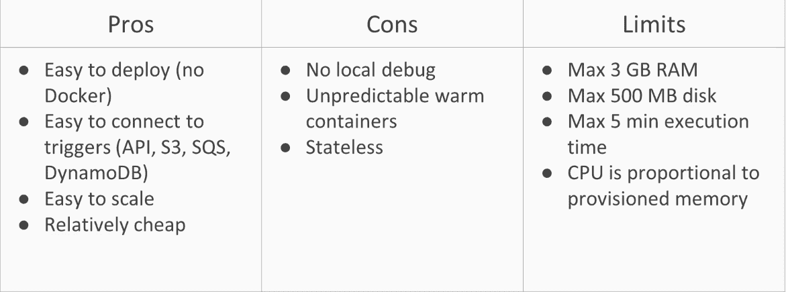

现在，我们已经对 AWS Lambda 的优缺点和限制有了一个大致了解，接下来让我们看看如何创建 AWS 账户的基础知识。

# 开始使用 AWS 账户

在这一部分，你将了解 AWS 免费套餐和 IAM。我们需要一个 AWS 账户来深入学习。

如果你没有 AWS 账户，可以在此注册：[`aws.amazon.com/account/`](https://aws.amazon.com/account/)。

Lambda API 网关、简单队列服务和函数都是 AWS 免费套餐的一部分，因此对于少量的使用不会收费。

# AWS 免费套餐

免费套餐允许你免费使用 AWS 服务。它涵盖了多个不同的 AWS 服务，例如：

+   **AWS Lambda**：这包括 100 万次调用，这使得 Lambda 非常适合托管你的宠物项目

+   **AWS API Gateway**：这包括 100 万个通过付费网关的请求，因此可以扩展至具有 AWS REST API 功能的项目

+   **AWS SQS**：包括 100 万个简单队列服务请求

+   **AWS Step Functions**：这包括 4,000 次步骤函数的状态转换，允许我们创建免费的无服务器工作流

# 身份与访问管理（IAM）

你可以为 AWS 用户创建两种类型的访问权限：

+   **AWS 管理控制访问**：这允许你使用 AWS 网络服务。用户需要有一个登录 ID 和密码，用户将在线使用这些信息。

+   **程序访问**：这允许你使用 AWS 软件开发密钥。用户需要两个密钥：访问密钥 ID 和秘密访问密钥。

现在，让我们创建一个具有程序访问权限的用户。这将允许我们使用无服务器框架，管理 AWS Lambda 的部署和编排。

为了创建用户，我们将按照以下步骤操作：

1.  首先，你需要进入 AWS 控制台并选择 IAM 服务，如下图所示：

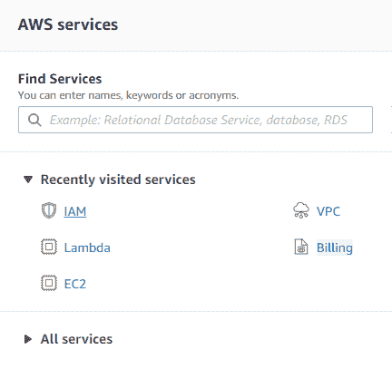

1.  接下来，转到用户页面并点击添加用户，如下所示：

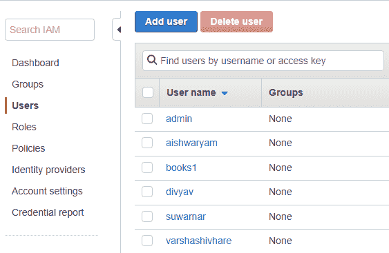

1.  现在，设置名称为 `lambda`，并勾选程序访问复选框：

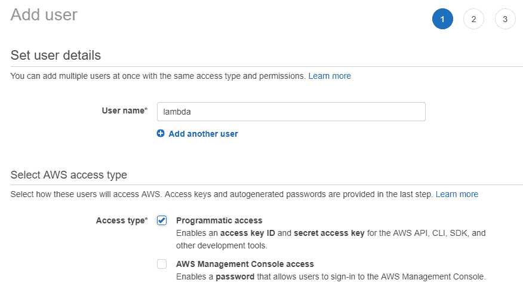

1.  接下来，您需要为用户设置权限，以便使用之前讨论过的 AWS 服务。最简单的方法是选择**直接附加现有策略**，然后选择**AdministratorAccess**策略，如下图所示：

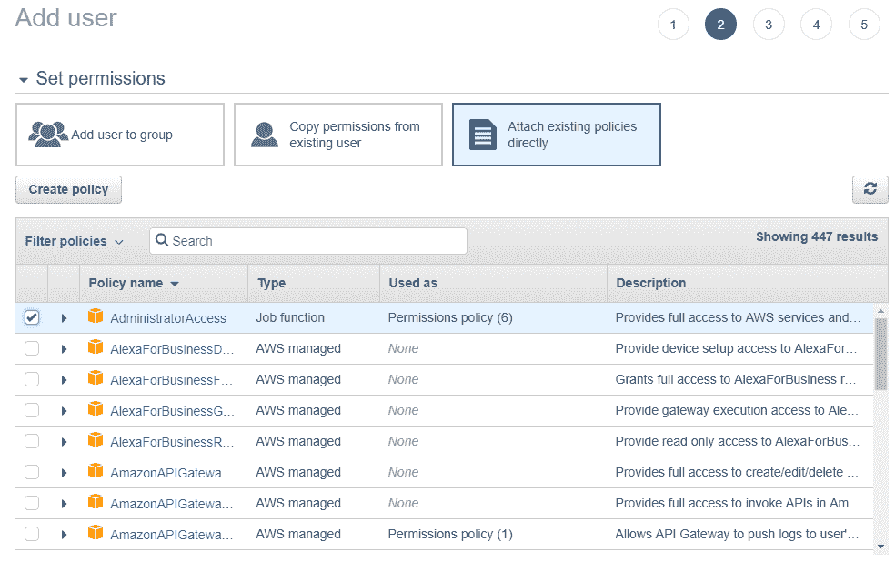

1.  最后，您需要确认所有的选择：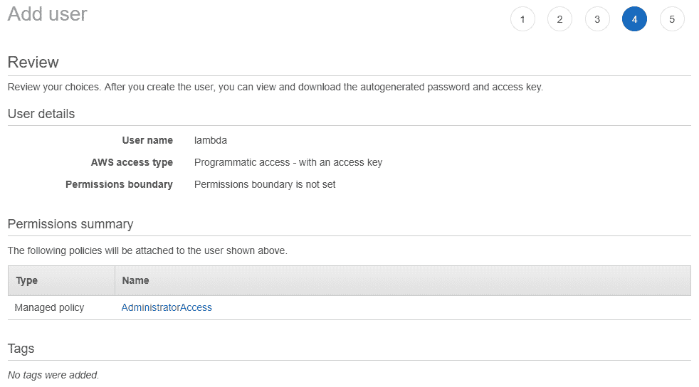

1.  它将显示我们的访问密钥 ID 和密钥访问密钥。您可以从 Web 服务中复制它们或通过 CSV 文件保存它们。稍后在设置无服务器框架时，您将需要这些访问密钥，如图所示：

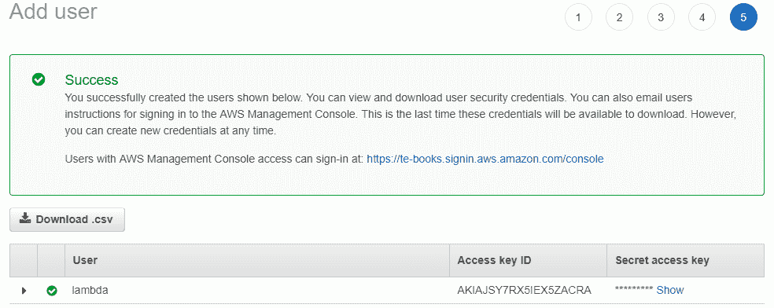

在下一节中，我们将创建一个 Hello World AWS Lambda 函数。

# 创建一个 Hello World AWS Lambda 函数

从 AWS 控制台有三种主要方法来创建一个 Hello World AWS Lambda：

+   我们可以从头开始创建一个 Lambda。这是创建一个简单 Lambda 的最简单方法。

+   我们可以使用现有的蓝图来创建 Lambda。AWS 有一个适用于任何基础 Lambda 的使用目录，您可以使用它从一个接近您想要创建的项目的 Lambda 开始。

+   2018 年，AWS 添加了无服务器应用程序库，用户可以在其中提交他们的 Lambda 配置。这个库包含数百个不同的 Lambda 包，对于在 AWS Lambda 中创建 Hello World 非常有用。

# 使用 Lambda 函数

我们将通过以下几个要点来讨论如何使用 Lambda 函数：

+   您可以使用 AWS 服务 Cloud 9 中的内联编辑器。如果您不想在本地安装任何内容，并希望将所有文件保存在云中，这将非常有用。缺点是，使用内联编辑器进行自动化部署可能非常具有挑战性，同时处理复杂的附加库和多个文件的大型项目也比较困难。

+   您可以通过 Web 界面或命令行上传带有库和代码的 ZIP 文件。这是一个非常简单的过程，您可以轻松地将其自动化。此方法的主要缺点是包的大小有限制，最多只能是 50 MB。

+   上传包的最佳且最流行的方式是通过 S3 桶。它对包没有 50 MB 的限制，尽管我们的 ZIP 库和代码仍然会有 250 MB 的限制。

# AWS Lambda 代码

执行以下步骤以创建 Hello World 代码：

1.  使用您的`lambda` IAM 用户登录。进入 AWS 控制台并选择 AWS Lambda 服务：

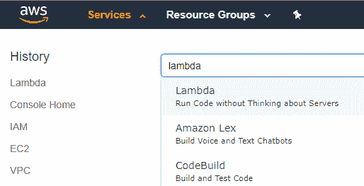

1.  点击**创建函数**，如以下截图所示：

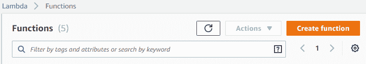

1.  选择**从头开始创建**，如图所示：

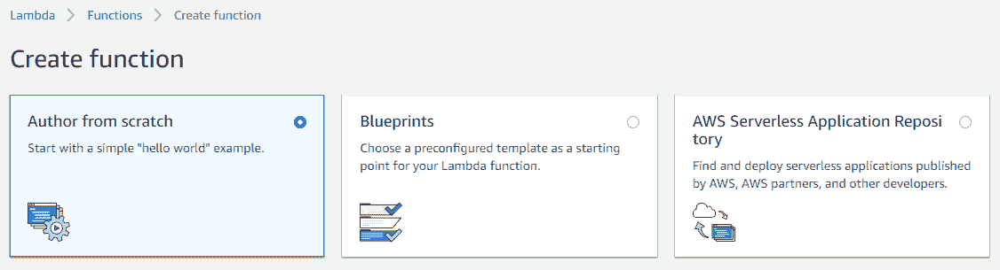

1.  我们需要添加一个名称、运行时和角色。然后，我们需要添加一个角色名称，`helloLambda`。对于策略模板，选择简单的微服务权限，并点击创建函数按钮，如下图所示：

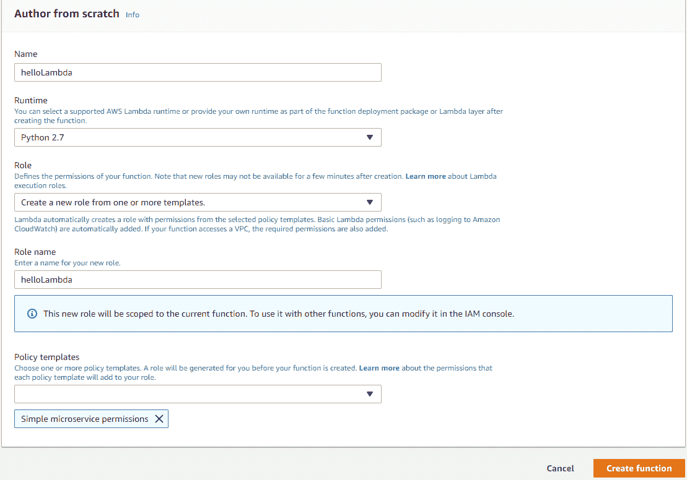

1.  最终，我们得到了 AWS Lambda 的界面。我们得到了连接的触发器、代码编辑器和设置：

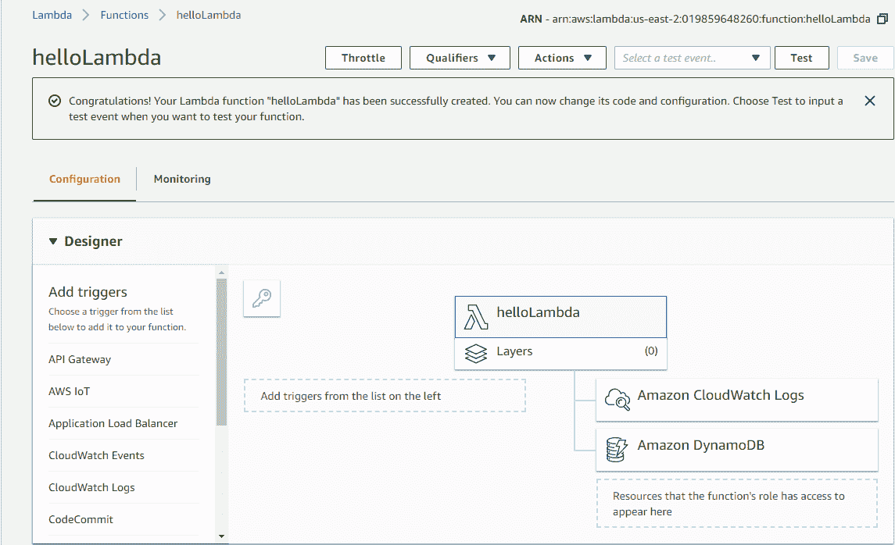

1.  你需要配置测试事件并启动你的第一个 Lambda 函数。对于我们的第一个 Lambda 函数，你只需创建一个空事件：

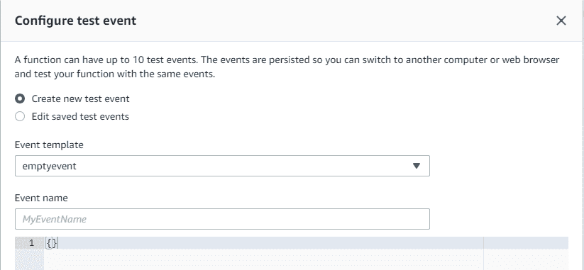

1.  编辑代码并保存后，你会看到 Lambda 已经更新：

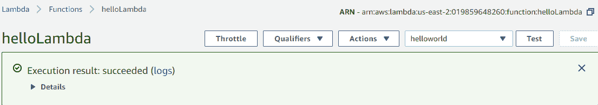

在接下来的章节中，我们将学习无服务器框架。

# 无服务器框架简介

在之前的章节中，我们了解了不同的 Lambda 函数部署方式。虽然 Lambda 包仅仅是包含库和代码的 ZIP 文件，但仍然有如下方式来部署它们。生产使用的部署需要具备以下特性：

+   首先，无服务器框架应该有一个单一的配置文件，在该文件中我们可以设置所有的部署选项和参数。这将使我们在编写启动每个服务的长脚本时节省时间，并且它将使我们能够保存环境的版本。

+   它应该能够创建并附加其他 AWS 服务，以便将它们添加到 Lambda 中。由于大多数使用场景涉及 Lambda 作为更大基础设施的一部分工作，因此将其他基础设施部分单独部署可能会是一个大问题。

+   拥有一个方便的命令行界面非常有帮助，因为这不仅意味着你可以使用一个脚本部署所有内容，还可以设置自动部署。

# 无服务器框架的特性

无服务器框架具有许多有用的特性。它们如下：

+   它是开源的，这意味着无服务器社区帮助构建和维护该框架。这使得该框架保持免费并保持最新。

+   无服务器框架支持不同的公共云平台，如 AWS、Google 云函数和 Azure 函数。这意味着你不必学习上述服务的 UI 是如何工作的。你可以使用相同的通用 UI 在另一个服务上部署函数。

+   无服务器框架具有生产级质量，许多公司使用它来部署无服务器基础设施。

+   它具有插件系统，允许用户为框架创建自定义插件。这使得无服务器框架可以具备多种功能；例如，支持步骤函数。

# 无服务器框架的安装

为了安装无服务器框架，我们需要安装以下功能：

+   我们需要安装 Node 和 NPM（[`nodejs.org/download/`](https://nodejs.org/download/)）。无服务器框架是用 JavaScript 编写的，因此它需要 Node 来执行，NPM 用于处理包。

+   我们需要 Python（[`www.python.org/downloads`](https://www.python.org/downloads)）和 `pip`（[`pip.pypa.io/en/stable/installing/`](https://pip.pypa.io/en/stable/installing/)）来本地运行 Lambda 代码，我们还将在各种命令行界面中使用它。

+   我们需要 AWS 命令行界面（[`docs.aws.amazon.com/cli/latest/userguide/installing.html`](https://docs.aws.amazon.com/cli/latest/userguide/installing.html)），以便无服务器框架能够连接到您的 AWS 账户。然后，我们可以安装无服务器框架，所有内容将得到配置。

无服务器框架的完整安装过程可以在这里找到 [`serverless.com/framework/docs/providers/aws/guide/installation`](https://serverless.com/framework/docs/providers/aws/guide/installation)。

安装无服务器框架非常简单。我们只需运行以下命令：

```py
npm install -g serverless
```

我们可以通过运行以下命令来检查它是否正常工作：

```py
serverless --version
```

这将返回已安装的无服务器框架版本。

# 使用无服务器框架部署 AWS Lambda 函数

我们将从无服务器部署过程的样子开始：

+   我们有用于 Lambda 执行的代码和库。这些与您直接上传 ZIP 包时看到的代码和库相同。从这个角度来看，通过无服务器框架开始部署现有的 Lambda 非常简单。

+   我们有一个配置文件，它基本上包含了有关 Lambda 部署方式的所有信息。

# 配置文件

Lambda 配置文件包含与前面讨论过的相同参数（例如，名称、运行时、内存和超时）。有三个主要区别。

您不仅是在设置触发器，还在设置这些触发器所依赖的服务。您可以设置特定的角色和访问权限。有些访问权限会自动设置，但有些需要您手动配置。最后，您可以设置额外的插件，这些插件将在部署时使用。我们将在部署步骤函数时更详细地了解它们。

# 部署过程

本节介绍了部署过程，这将根据我们的配置文件生成自定义的云形成文件。云形成是 AWS 提供的一项服务，允许我们自动部署多个服务。这个功能对于处理部署过程非常方便，但它的标记语法可能一开始比较难以理解。这就是为什么我们使用服务器配置文件，因为它更具可读性。接下来，服务框架会将库和代码打包成一个单独的包并上传，然后利用之前生成的文件运行 AWS 云形成服务进行部署。

现在，让我们继续使用 serverless 框架进行 Lambda 的实际部署，查看可用的文件。

有两个文件：`index.py` 和 `serverless.yml`。我们来看一下 `index.py`。以下代码将打印输入事件并返回 `Hello World` 消息，如下所示：

```py
def handler(event,context):
    print('Log event',event)
    return 'Hello world'
```

以下代码片段显示了 `serverless.yml` 文件：

```py
service: helloworld

frameworkVersion: ">=1.2.0 <2.0.0"

provider:
  name: aws
  region: us-east-1
  runtime: python3.6
  memorySize: 128
  timeout: 10

functions:
  main:
    handler: index.handler
```

在 `serverless.yml` 版本中，有函数的名称、可用资源和区域。`helloworld` 是我们部署的服务名称。`main` 是函数的名称，`index.handler` 是 `index.py` 文件中的函数名称和文件处理器的名称。

一个服务可能有不同的功能，这就是为什么它们被分开的原因。在部署之前，我们可以先在本地运行 Lambda。这是 serverless 框架的一个好功能，但由于操作系统的差异，它可能不适用于复杂的库。我们可以看到，我们打印了一个空的日志并接收到了 `Hello World` 消息作为输出：

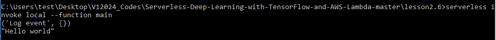

在部署 Lambda 之前，你需要使用以下命令将你的 AWS 账户链接到 serverless：

`serverless config credentials --provider aws --key "Your access key" --secret "Your secret access key"`

你将使用 serverless 框架部署 Lambda。同时，即使你只有一个简单的程序，serverless 框架部署服务时也可能需要一些时间：

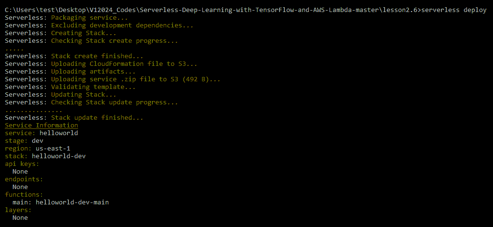

现在，你可以运行 Lambda 代码并查看输出：

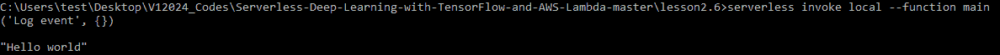

如你所见，它和我们之前收到的相同。这里有两个非常有用的标志，在使用 Lambda 时非常有帮助。第一个标志帮助我们在 Lambda 内部发送自定义事件，从而模拟来自自定义服务的触发事件，而日志则可以让我们看到当前执行的日志。这个日志标志将允许我们查看日志，而数据标志则允许我们发送自定义消息。

# 总结

在这一章中，我们了解了 AWS Lambda 函数，并开始了 AWS 账户的使用。我们还学习了如何创建一个 Hello World 的 AWS Lambda 函数，并介绍了 serverless 框架以及 AWS Lambda 函数的部署。

在下一章，我们将开始部署 TensorFlow 模型，在那里我们将深入了解 TensorFlow 模型及其部署方法。
