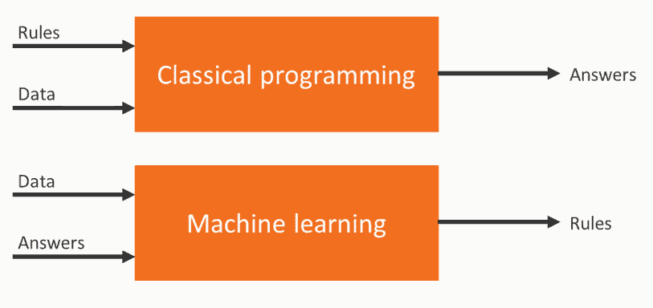
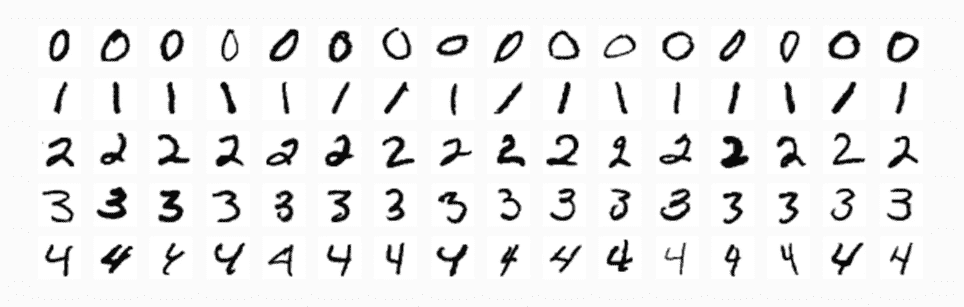
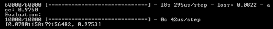
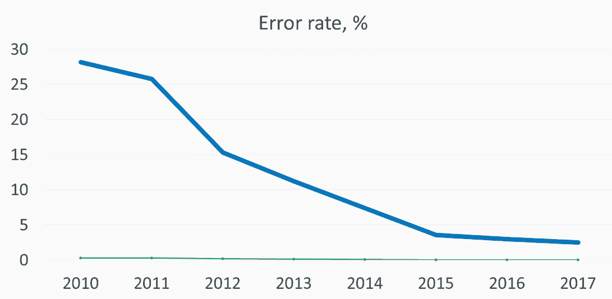
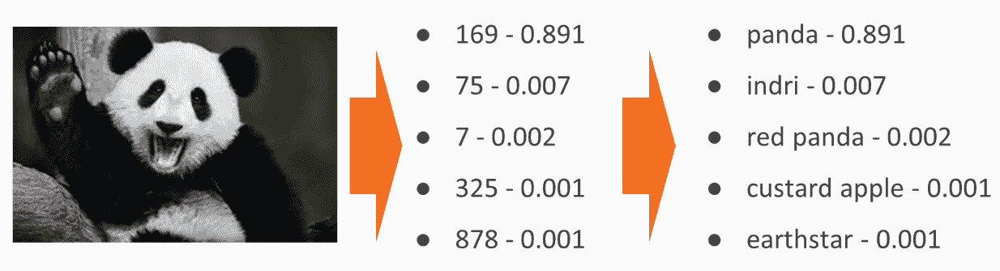
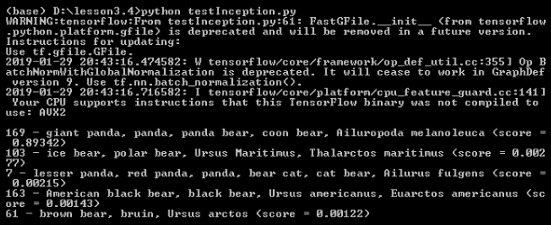

# 第三章：部署 TensorFlow 模型

在本章中，我们将讨论 TensorFlow 框架。首先，我们将描述构建算法的各种方法如何不同。我们还将介绍深度学习及如何训练神经网络，但更重要的是，你将学习如何在应用中使用预训练的神经网络，以及如何找到它们。

我们将涵盖以下主题：

+   构建算法的方法

+   为什么是神经网络？

+   预训练 TensorFlow 模型的代码库

+   图像标题的示例

# 技术要求

+   AWS 订阅

+   Python 3.6

+   AWS CLI

+   无服务器框架

+   你可以在[`github.com/PacktPublishing/Hands-On-Serverless-Deep-Learning-with-TensorFlow-and-AWS-Lambda`](https://github.com/PacktPublishing/Hands-On-Serverless-Deep-Learning-with-TensorFlow-and-AWS-Lambda)找到所有代码。

# 构建算法的方法

构建算法的各种方法是：

+   首先，有确定性算法，它们非常透明和可预测，但对于复杂任务而言，构建一个能够在所有情况下都有效的自定义算法可能非常困难。

+   接下来是机器学习技术，在这种方法中，我们根据从数据中获得的特征来训练模型。我们不需要大量的数据来可靠地训练模型，但我们需要为训练验证和测试创建一个单独的过程。

+   最后是深度学习方法，在这种方法中，我们训练自己的神经网络。其主要优点是我们可以使用原始数据，而不需要预定义的特征。缺点是我们需要大量的数据和计算资源来进行训练。

机器学习方法与经典方法有很大的不同。经典方法使用规则和数据作为输入，答案作为输出。而在机器学习方法中，我们使用数据和答案作为输入，输出的是规则，如下所示：



让我们看看为什么神经网络在近年来变得如此流行。

# 为什么是神经网络？

神经网络在近年来变得流行的原因如下：

+   与过去的价格相比，计算资源现在变得便宜得多。随着公共云的引入，使用这些资源进行大规模运作变得异常简单且经济实惠。

+   机器学习方法需要大量数据，而且现在有大量的公共和私人数据可以用于训练。

+   先进的算法使得可以构建和训练更复杂的神经网络。

让我们讨论一下为什么我们实际上不需要训练神经网络也能成功使用它们。

# 预训练的网络

虽然训练神经网络可能需要大量的计算能力和数据，但部署神经网络可以通过简单的 CPU 来完成。这样，我们可以说，部署一个深度学习模型几乎和在代码中使用外部库一样简单。其次，有一个庞大的社区，很多人和公司将他们预训练的神经网络开源，这意味着你可以自由使用它们。

使用预训练神经网络有两个场景非常方便：

+   第一种情况是当你的任务已经解决时。例如，如果你想进行图像描述并进行*X*分类，你可以使用已经存在的神经网络。

+   第二种情况是当你的任务与已做的任务差别不大，但又有所不同时。然后，你可以使用预训练模型生成特征，稍后可以结合确定性方法或简单的机器学习模型使用这些特征。

大多数预训练模型使用 TensorFlow，因此它目前是深度学习中最流行的框架。它拥有一个庞大的社区，很多人分享他们训练的模型。大多数在生产环境中使用神经网络的公司都在使用 TensorFlow 框架。因此，我们将在下一部分通过一个示例学习如何使用 TensorFlow 进行预训练模型的应用。

# 简单的 TensorFlow 示例

展示深度学习强大能力的一个典型案例是**MNIST**（**修改版美国国家标准与技术研究所数据集**）数据集。它由黑白图像和手写数字组成，如下图所示：



每张图像都根据图像上写的数字进行标注。在这种情况下，任务是根据图像预测标签。使用确定性方法实现这种任务非常困难；正如你在前面的图像中看到的，写同一个数字有很多不同的方式。因此，你不能使用单一模板进行预测。

# MNIST 的训练

在本节中，我们将讨论 MNIST 的模型训练：

1.  首先，我们开始导入`tensorflow`库。在这个示例中，我们将使用 Keras 深度学习框架，它使得设置神经网络的层变得简单。简单来说，Keras 是 TensorFlow 之上的一个封装，因此一切仍然是基于 TensorFlow 的。

1.  接下来，我们需要加载数据并以二进制格式呈现它，因为原始图像的像素值为 0 和 255。我们还将把数据集分为训练集和测试集。这将允许我们衡量神经网络的性能。机器学习方法的一个好习惯是，在训练数据集上训练模型，并在测试数据集上衡量最终得分。这可以确保模型在训练后不会看到它将被评估的数据点。接下来我们将看到具体的解释：

```py
import tensorflow as tf

mnist = tf.keras.datasets.mnist

(x_train, y_train),(x_test, y_test) = mnist.load_data()
x_train, x_test = x_train / 255.0, x_test / 255.0
```

1.  现在，我们需要为我们的神经网络设置各个层。基本上，每一层由若干个神经元和一个激活函数组成。在这个例子中，第一层试图从原始数据中提取更多有用的数据。第二层则试图利用这些数据来为图像是否为 10 个数字中的一个分配概率。

1.  作为模型的一部分，您需要选择三个参数来进行训练过程：

    +   首先是`loss`函数，神经网络将使用它来优化性能。训练过程基本上就是通过减少`loss`函数的值，并试图为神经网络找到最优的权重，使得`loss`函数的值最小。

    +   接下来是`optimizer`，它处理神经网络如何向最优解迭代，以及每次迭代后如何更新权重。

    +   最后，`metrics`允许我们在数据集上衡量神经网络的性能。例如，`accuracy`帮助我们理解数据集中哪些部分被正确分类。这个度量不会直接参与训练过程，主要帮助我们理解网络性能是否有所提升。我们可以通过以下代码来理解前面的解释：

```py
model = tf.keras.models.Sequential([
  tf.keras.layers.Flatten(),
  tf.keras.layers.Dense(512, activation=tf.nn.relu),
  tf.keras.layers.Dense(10, activation=tf.nn.softmax)
])
model.compile(optimizer='adam',
              loss='sparse_categorical_crossentropy',
              metrics=['accuracy'])
```

1.  一切设置好后，我们只需要在训练数据集上进行训练。这可能需要几分钟，具体取决于您计算机的配置。之后，我们可以评估模型在测试集上的表现。我们的模型将达到大约 97%的准确率/测试集，这非常令人印象深刻，正如演示所示，即使是一个简单的神经网络，也能通过如下代码实现这一点：

```py
model.fit(x_train, y_train, epochs=2)
print('Evaluation:')
print(model.evaluate(x_test, y_test))
```

1.  最后，一旦神经网络被训练好，我们可以保存它，以便以后使用。如您所见，这是一个非常简单的过程。模型文件将包含模型架构、层的组成、层的权重和训练配置，以及优化器的状态，这些都可以帮助我们在已经训练的模型上继续训练：

```py
model.save('MNISTmodel.h5')
modelImported = tf.keras.models.load_model('MNISTmodel.h5')
print('Evaluation by imported model:')
print(modelImported.evaluate(x_test, y_test))
```

让我们讨论一下可用的文件。这里只有一个 Python 文件，就是我们将要运行的`testMNIST.py`文件。在这个文件中，我们可以看到我们讨论过的部分，包括数据转换、模型安装、模型训练、模型评估、模型导出和模型导入。

现在，让我们在命令行中运行`testMNIST.py`文件来查看结果。通过运行代码，我们可以看到训练过程，它是以“epoch”为单位进行的。这种神经网络不需要 GPU 进行训练，即使在 CPU 上也可以取得非常好的结果：

```py
python testMNIST.py
```

正如您在下方的截图中所看到的，我们只用了两个 epoch 就达到了 97%的准确率，并成功导出了并导入了模型。我们可以看到导出的重新训练的模型，现在可以在不同的代码中使用：



在下一部分，我们将讨论预训练 TensorFlow 模型的代码库。

# 预训练的 TensorFlow 模型仓库

预训练模型在导入和导出方面非常有能力。简而言之，部署声明包括导入训练好的模型并将输入数据转化为神经网络能够接受的格式。在部署过程中，有一些事情需要牢记：

+   模型可能非常大，例如，可能达到数百兆字节，这使得部署变得更加困难。

+   我们需要保持模型的版本并跟踪其性能。如果你自己训练模型，可能需要根据输入数据的变化或发现更好的架构来更新模型。

+   一些模型需要额外的文件，将预测的数字或值转换为有意义的信息。

# TensorFlow 仓库

TensorFlow 有五个主要的仓库，包含多个精选的模型。它们已经有些成熟，并且非常容易与 TensorFlow 框架一起使用。

如需了解更多关于使用 TensorFlow 训练的最受欢迎模型的信息，请访问此网站：[`github.com/tensorflow/models`](https://github.com/tensorflow/models)。

各个仓库的不同示例如下：

+   图像到文本模型，可以将图像上的内容进行描述

+   图像标题生成，它对图像进行分类

+   Deep speech，它可以识别语音

+   文本摘要，它可以将文章内容进行总结

+   Vid2depth，它基于视频流生成深度图

# TensorFlow Hub

有一个专门为神经网络设计的 TensorFlow Hub 托管平台。TensorFlow Hub 拥有许多优秀的模型，这些模型可以免费使用，并且主要由 Google 训练。它们质量很好，属于最先进的技术水平。TensorFlow Hub 的优势是，在添加模型之前会对其进行检查，而劣势则是它的提交门槛较高。

不同模型的 TensorFlow Hub 可通过以下链接查看：[`tfhub.dev/`](https://tfhub.dev/)。

# GitHub

GitHub 被认为是最大的开源代码仓库。那里发布了无数的模型，但由于没有入门过滤机制，你在生产环境中使用这些模型时需要更加小心。GitHub 的优点是入门门槛低，缺点是可能很难找到相关模型，并且用户需要在部署之前检查模型的工作原理。

在接下来的部分中，我们通过一个示例来学习图像标题生成。

# 图像标题生成示例

图像标注是一个任务，我们需要识别图像中的物体。虽然听起来很简单，但它一直被认为是计算机视觉中最困难的问题之一，因为为每种物体类型制作一个单独的检测器几乎是不可能的。测试图像标注算法的主要方法是将其应用于 ImageNet 数据集。ImageNet 数据集包含 1400 万张图像和超过 20,000 个标签。它于 2010 年推出，每年都会有不同模型的竞赛，近年来由于复杂神经网络的引入，准确率显著提高。

有许多不同的模型和架构能够成功地与 ImageNet 一起工作。我们将看到，随着时间的推移，错误率显著下降。下图展示了 ImageNet 数据集中获胜模型的错误率变化。



我们现在来讨论 Inception v3，它将在稍后的代码示例中使用。

# Inception v3

Inception v3 是由 Google 提出的，并且达到了 3.46% 的错误率。你会发现 Inception v3 显著更复杂。它也需要更多的资源来训练这个模型，但这里的好处是我们不需要训练它就可以使用它。

我们将看看使用 Inception v3 时我们需要什么。模型由 `classify_image_graph_def.pb` 文件中存在的层和权重值组成。

我们还拥有一份标签列表，模型可以在 `imagenet_2012_challenge_label_map_proto.pbtxt` 文件中预测这些标签，并且有一个文档允许将神经网络的结果映射到 `imagenet_synset_to_human_label_map.txt` 文件中的标签。

这是一个熊猫图像的例子。首先，我们接收得分的 ID。最高的得分意味着模型对图像具有该标签的高信心。将 ID 映射到标签名称后，我们可以看到模型正确地检测到了熊猫。以下截图解释了这一点：



# Inception v3 的 TensorFlow 代码

现在，让我们看看任何 Inception v3 模型的代码是怎样的：

1.  首先，我们需要设置一个 TensorFlow 会话。会话是一个环境，在其中张量会被评估。

1.  我们需要通过从文件中加载神经网络来读取并设置它。

1.  接下来，我们需要以神经网络能够读取的格式请求图像。

1.  我们需要运行一个强大的模型并接收一系列行预测，然后将这些预测转化为实际的标签值，如下代码所示：

```py
SESSION = tf.InteractiveSession()
softmax_tensor = tf.get_default_graph().get_tensor_by_name('softmax:0')

predictions = SESSION.run(softmax_tensor,{'DecodeJpeg/contents:0': image_data})

node_loolup.id_to_string(predictions)
```

# 运行代码

让我们看看可用的文件，`inputimage.png` 和 `testinception.py`，我们即将运行这些文件。在这个例子中，我们将使用熊猫图像（`inputimage.png`）。

1.  如以下代码所示，存在 `NodeLookup` 类，它将帮助我们将模型的响应转换为标签名称：

```py
class NodeLookup(object):
    """Converts integer node ID's to human readable labels."""
```

1.  以下代码展示了我们如何读取图像：

```py
image = 'inputimage.png'
image_data = tf.gfile.FastGFile(image, 'rb').read()
```

1.  接下来，这是导入预训练模型的代码：

```py
with tf.gfile.FastGFile('classify_image_graph_def.pb', 'rb') as f:
  graph_def = tf.GraphDef()
  graph_def.ParseFromString(f.read())
  tf.import_graph_def(graph_def, name='')
```

1.  在这里，我们更换了模型：

```py
SESSION = tf.InteractiveSession()
softmax_tensor = tf.get_default_graph().get_tensor_by_name('softmax:0')

predictions = SESSION.run(softmax_tensor,{'DecodeJpeg/contents:0': image_data})
```

1.  最后，我们翻译模型的结果：

```py
predictions = np.squeeze(predictions)
node_lookup = NodeLookup(label_lookup_path='imagenet_2012_challenge_label_map_proto.pbtxt',
  uid_lookup_path='imagenet_synset_to_human_label_map.txt')

top_k = predictions.argsort()[-5:][::-1]
strResult = '%s (score = %.5f)' % (node_lookup.id_to_string(top_k[0]), predictions[top_k[0]])
print()
for node_id in top_k:
    human_string = node_lookup.id_to_string(node_id)
    score = predictions[node_id]
    print('%s - %s (score = %.5f)' % (node_id, human_string, score))
```

1.  现在，我们可以运行代码并查看响应。从以下输出中可以看出，模型成功检测到了图片中的熊猫。由于不涉及训练，代码运行非常快。你可以在不同的图片上尝试此代码，体验一下该模型的潜力：



# 总结

在这一章中，我们研究了构建算法的不同方法。我们讨论了如何训练 TensorFlow 模型以及预训练 TensorFlow 模型的存储库。我们还了解了如何使用 Inception v3 TensorFlow 示例进行图像描述。

在下一章中，我们将学习如何使用 TensorFlow AWS Lambda，在那里我们将进一步了解如何在 AWS Lambda 上使用 TensorFlow 模型。
