# 第四章：在 AWS Lambda 上使用 TensorFlow

在本章中，我们将学习如何在 AWS 上部署 TensorFlow 的架构，并通过预先存在的包和无服务器框架在 AWS Lambda 上部署 TensorFlow。我们还将探讨在 AWS Lambda 上部署各种 Python 框架时的常见问题，并涵盖所有解决这些问题的方案。

我们将涵盖以下主题：

+   使用 AWS Lambda 部署 TensorFlow 的架构

+   在 AWS Lambda 上部署 Python 框架的常见问题

+   使用预先存在的包在 AWS Lambda 上部署 TensorFlow

+   使用无服务器框架部署 TensorFlow

# 技术要求

+   AWS 订阅

+   Python 3.6

+   AWS CLI

+   无服务器框架

+   您可以在以下位置找到所有代码：[`github.com/PacktPublishing/Hands-On-Serverless-Deep-Learning-with-TensorFlow-and-AWS-Lambda`](https://github.com/PacktPublishing/Hands-On-Serverless-Deep-Learning-with-TensorFlow-and-AWS-Lambda)

# 使用 AWS Lambda 部署 TensorFlow 的架构

在本节中，我们将学习如何使用 AWS Lambda 部署 TensorFlow 的架构。部署的一个关键问题是，应该将重新训练的模型存放在哪里，以便在 AWS Lambda 中使用。

有以下三种可能的选项：

+   将模型与代码和库一起保存在部署包中

+   将模型保存在 S3 存储桶中，并在执行时加载到 AWS Lambda 中

+   将模型保存在 FTP 或 HTTP 服务器上，并在执行时加载到 AWS Lambda 中

# 部署包中的模型

这个选项意味着模型位于部署包中。代码将从本地文件系统中导入它。这个选项有自己的优缺点。

# 优点

模型在部署包中的优势如下：

+   由于没有加载模型的开销，我们的部署将有一个非常好的启动速度

+   我们将从一个单一的包开始

+   我们的部署不需要任何外部服务器或 AWS 服务

# 缺点

模型在部署包中的缺点如下：

+   包大小有相当大的限制，这限制了我们模型的可能大小

+   如果需要管理模型的不同版本，可能很难将它们全部保存在一个包中，或者处理不同版本的包

# S3 存储桶中的模型

这个选项意味着我们必须将模型保存在 S3 存储桶中，并在 AWS Lambda 执行期间卸载它。此选项在包大小方面非常有限。

# 优点

模型在 S3 存储桶中的优势如下：

+   初看之下，使用会限制为 500 MB，这是 AWS Lambda 上 TMP 文件夹的最大大小，但实际上可以通过绕过此限制直接将模型下载到内存中

+   管理多个模型会变得更容易，因为你可以使用 AWS Lambda 环境变量为每个你想要使用的模型提供与 S3 存储桶的设备链接。

# 缺点

存放在 S3 存储桶上的模型的缺点如下：

+   我们的启动速度会比之前的案例慢，因为 Lambda 需要先下载模型。

+   需要注意的是，尽管这只在冷启动时发生，但在热启动时，模型已经在内存中。

+   你需要将所有模型上传到 S3 存储桶，作为部署的一部分，并在代码中添加管理不同模型的逻辑。

# 存放在 HTTP/FTP 服务器上的模型

这个选项主要适用于你希望限制 AWS 服务使用、内存或与 AWS 之外的服务进行集成的情况。在部署过程中，AWS Lambda 会从 HTTP 或 FTP 服务器下载模型。

# 优点

模型存放在 HTTP/FTP 服务器上的优点如下：

+   你可以使用多个公开可用的服务与模型进行交互。

+   你无需更新 S3 存储桶中的模型或包内的模型。

# 缺点

存放在 HTTP/FTP 服务器上的模型的缺点如下：

+   这可能比前一个案例还要慢，这是该模型的一个缺点。

+   由于较慢的时间，你需要确保服务器在你的地点是可用的。

# 在 AWS Lambda 上部署 Python 框架时的一般问题

在这一节中，我们将了解 AWS Lambda 的主要限制，也就是包的大小。Lambda 部署包的当前限制是 50 MB。该包应包括库和代码。我们需要适配的两个主要库如下：

+   TensorFlow

+   NumPy

这些库用于矩阵计算。如你所知，单独的这些库非常大，并且在 AWS Lambda 上无法正常运行。正如你在前一节部署中看到的，当我们通过 S3 部署时，我们没有这个限制，只需要面对解压包大小的 250 MB 限制。在这种情况下，为了使其正常工作，我们需要减小包的大小。

# 解决在 AWS Lambda 上部署 Python 框架的问题

有多种方式可以减少包的大小。以下是针对这些问题的解决方案：

+   我们可以压缩共享库，通常这样能实现最佳的大小减少。

+   我们可以删除 `.pyc` 文件，因为它们不会影响库的工作。

+   接下来，我们可以从库中删除测试和可视化文件夹，因为它们在生产环境中没有用处。

+   接下来，我们可以删除 AWS Lambda 上已经存在的库。

+   最后，我们可以检查并删除执行过程中未使用的库，例如 wheel 或 PIP 库。

现在，在以下代码中，有一部分是查找并压缩所有共享库。然后，我们查找并删除所有 `.pyc` 文件。

以下截图展示了前面解释的命令：

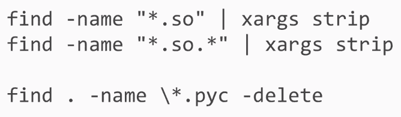

接下来，我们需要删除在执行过程中不会使用到的库，例如`.pip`和`wheel`。最后，我们还可以删除 TensorFlow 库中的一些文件夹。

以下截图展示了前述说明中的不同命令：

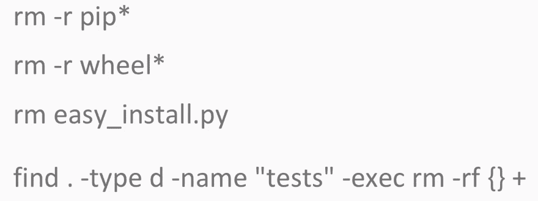

准备 AWS Lambda 的整个包过程可以通过 Docker 完成。虽然在我们将要创建的项目中你不需要使用它，但了解如何准备这类包是很有帮助的。

要安装 Docker，你只需要在命令行中运行三个命令：

1.  你需要获取最新的 Amazon Linux 镜像，我们将在该镜像上运行脚本。

1.  你需要启动一个 Docker 容器，并将管理输出文件夹放在容器内。

1.  你可以在容器内运行脚本，它将为你组装包。以下截图展示了安装 Docker 的所有命令：

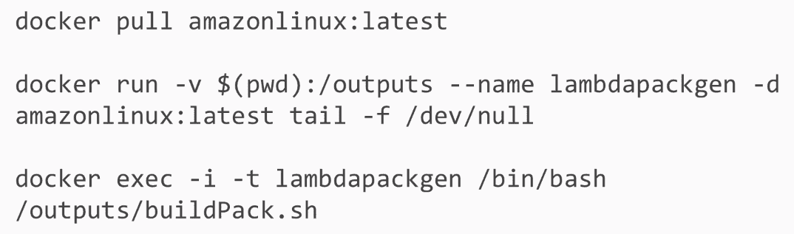

# 使用现有的包在 AWS Lambda 上部署 TensorFlow

在本节中，我们将学习如何使用现有的包在 AWS Lambda 上部署 TensorFlow。在项目文件中，我们有模型文件，这些文件也被称为模型本身，以及能够通过标签翻译模型响应的文件。在`Inception`文件夹和 Lambda 包中，后者也称为`lambdapack`文件夹中的代码和库。

要运行代码，我们需要执行以下步骤：

+   我们将创建 S3 桶，存放模型并上传模型本身

+   接着，我们将修改代码以适应特定的桶，并添加已创建的桶名称

+   最后，我们可以将其打包并上传，以添加到 AWS Lambda

现在，我们将使用 AWS 控制台创建 S3 桶并将文件上传到其中。我们将打开代码并添加刚创建的桶。然后，让我们打包它并上传到 AWS Lambda。

我们需要按照以下步骤进行：

1.  我们需要前往 S3 服务并点击创建桶（Create bucket）：

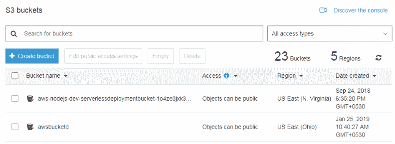

1.  现在，我们可以选择桶名称：

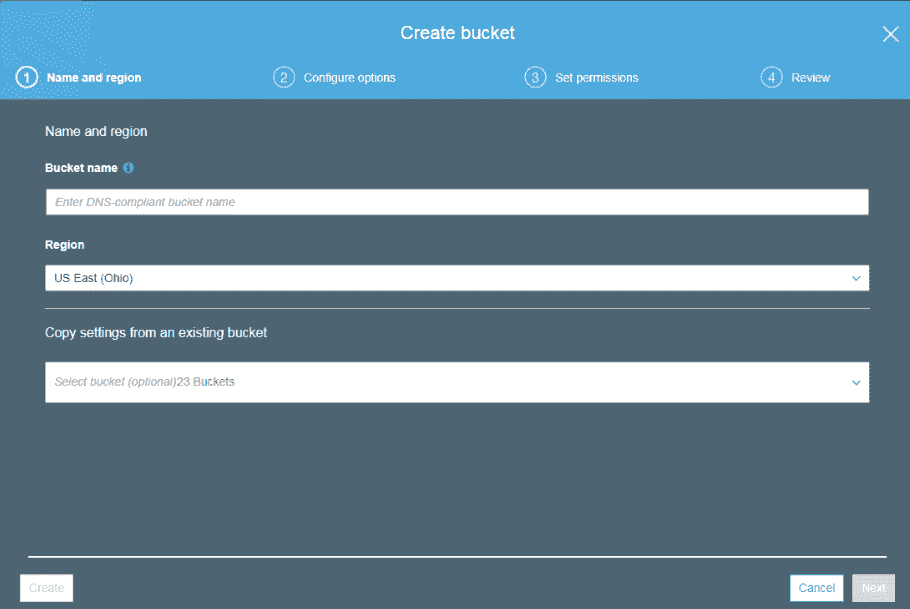

1.  一旦我们设置好桶（bucket），就可以将文件上传到其中。你只需要点击上传（Upload），然后选择文件。在这里，我们只需上传包含库的包，它将开始上传过程，以及包本身。我们还需要上传位于`Inception`文件夹中的模型文件：

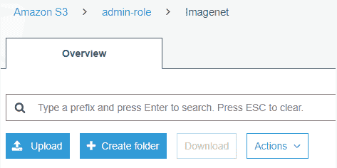

1.  你可以看到，现在我们的 S3 桶中已经有一个包：

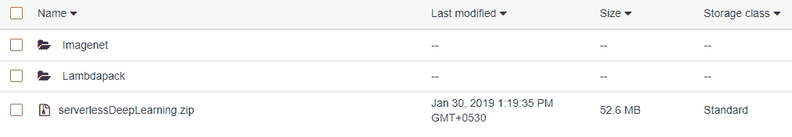

1.  现在，我们必须为我们的 AWS Lambda 创建角色，可以通过 IAM 服务来完成：

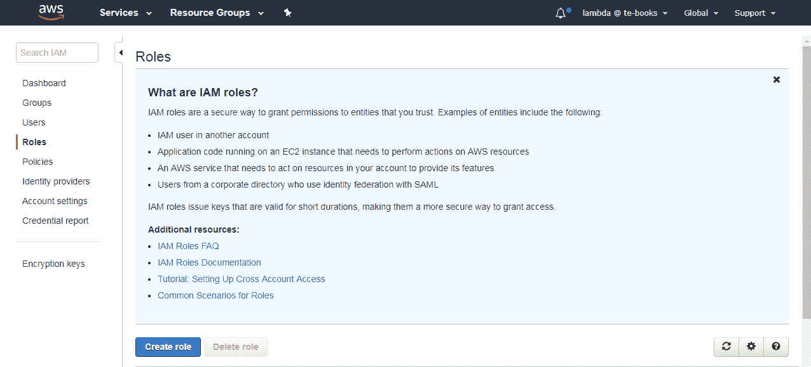

1.  我们需要选择 Lambda 并点击右下角的“下一步：权限”（Next: Permissions）：

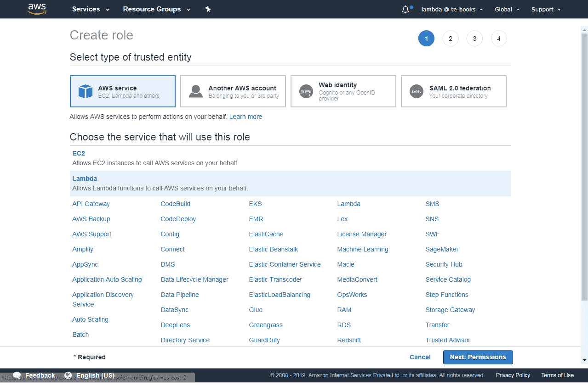

1.  为了简化操作，选择管理员访问并点击下一步：标签，位于屏幕的右下角。这将允许我们的 Lambda 访问所有服务。通常在生产环境中，角色的访问权限会限制为仅访问特定服务。我们将在使用无服务器框架时讨论这个问题：

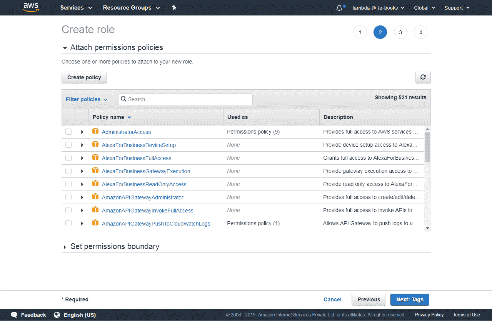

1.  创建角色名称：`lambdaAdminRole`，这将在 Lambda 中创建该角色：

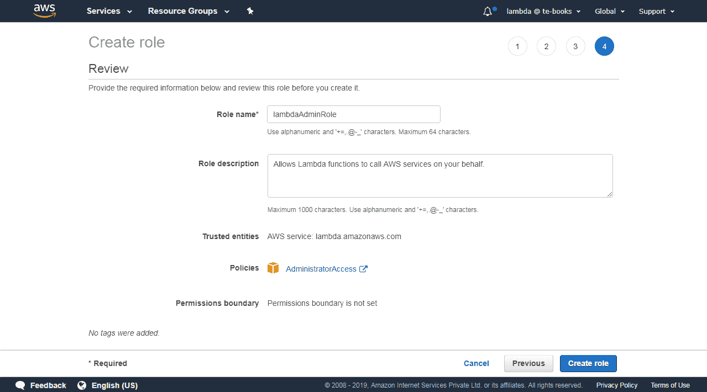

1.  创建 Lambda 函数，进入 Lambda 函数页面并创建该函数。在此处，输入名称`testensorflolambda`，运行环境选择 Python 3.6。对于角色，选择选择一个现有角色，在现有角色中选择`lambdaAdminRole`，然后点击右下角的创建函数：

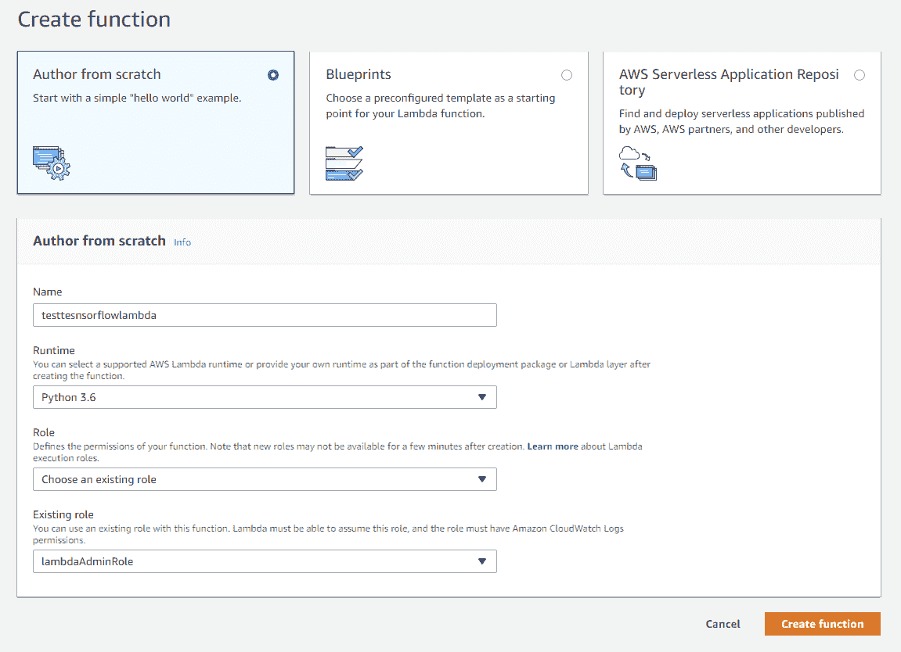

10\. 创建函数后，我们需要将 Handler 修改为`index.handler`：

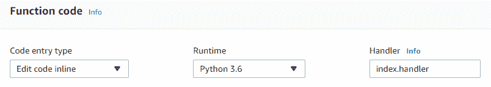

1.  在同一页面，向下滚动，在基础设置标签页中，按照以下截图添加足够的资源：

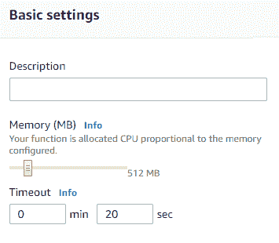

1.  传递包含我们包（S3 存储桶）URL 的链接，并点击右上角的保存：

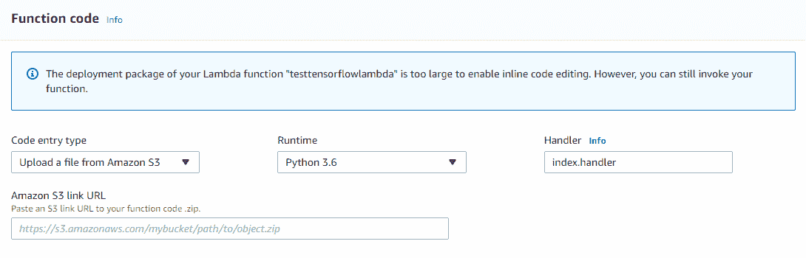

1.  你可以看到函数已经创建。为了测试该函数，点击右上角的测试按钮：

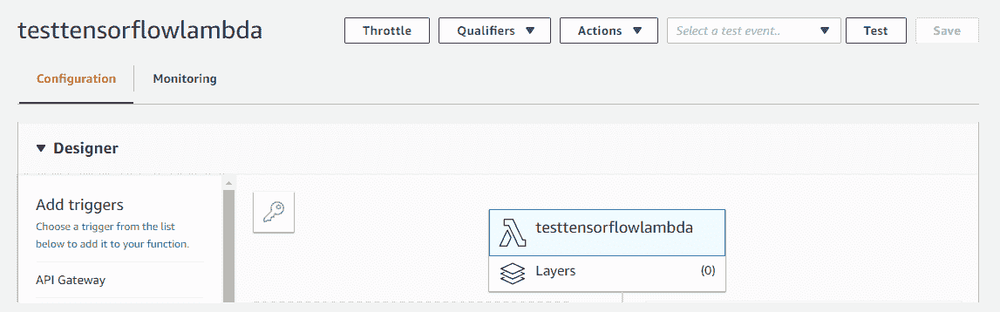

1.  在测试完函数后，它将成功生成以下结果：

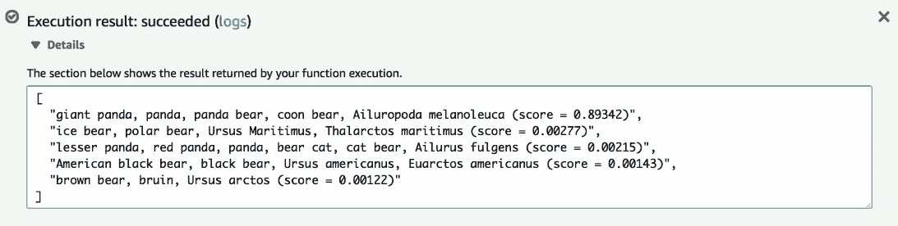

# 使用无服务器框架部署 TensorFlow

首先，我们将查看项目文件。我们在`Inception`文件夹中有模型文件，在`Lambdapack`文件夹中有 Lambda 代码和配置文件`Serverless.yml`。

部署流程将与上一节相同。主要的不同之处在于，我们将通过无服务器 CML 文件提供对存储桶的访问权限，而不是提供 AWS Lambda 管理员角色。我们只需要添加`bucketname`，并按照如下所示运行访问属性：

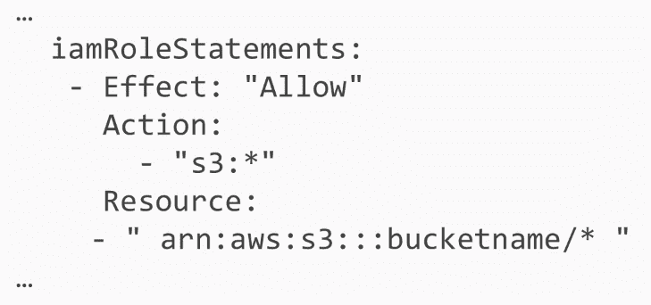

我们需要创建一个 S3 存储桶，将文件上传到其中，然后部署 AWS Lambda。我们将创建一个 S3 存储桶，并通过命令行上传文件：`aws s3 sync.s3://<bucket>/`。

# 创建存储桶

我们首先需要创建一个存储桶，然后将模型文件上传到存储桶，运行无服务器框架，并启动 AWS Lambda。

# Index.py

让我们来看一下可用的文件。我们将查看`index.py`文件，如下所示：

```py
import boto3
import numpy as np
import tensorflow as tf
import os.path
import re
from urllib.request import urlretrieve
import json
SESSION = None
strBucket = 'serverlessdeeplearning'
def handler(event, context):
 global strBucket
 if not os.path.exists('/tmp/imagenet/'):
 os.makedirs('/tmp/imagenet/')
strFile = '/tmp/imagenet/inputimage.jpg'
```

主要的不同之处在于我们在`handler`函数内部运行代码，并且需要从 S3 存储桶下载模型文件和图像文件：

```py
if not os.path.exists('/tmp/imagenet/'):
 os.makedirs('/tmp/imagenet/')
strFile = '/tmp/imagenet/inputimage.jpg'
downloadFromS3(strBucket,'imagenet/inputimage.jpg',strFile)
global SESSION
 if SESSION is None:
downloadFromS3(strBucket,'imagenet/imagenet_2012_challenge_label_map_proto.pbtxt','/tmp/imagenet/imagenet_2012_challenge_label_map_proto.pbtxt')
downloadFromS3(strBucket,'imagenet/imagenet_synset_to_human_label_map.txt','/tmp/imagenet/imagenet_synset_to_human_label_map.txt')
 image = os.path.join('/tmp/imagenet/', 'inputimage.jpg')
 strResult = run_inference_on_image(image)
return strResult
def run_inference_on_image(image):
```

此外，我们还可以利用 AWS Lambda 的一个优势。我们可以将模型文件保存为全局变量。基本上，我们可以将会话定义为全局变量。通过这些，如果我们在上一个 Lambda 执行完毕后立即启动 Lambda，所有模型文件将保存在 RAM 内存中：

```py
global SESSION
 if SESSION is None:
 downloadFromS3(strBucket,'imagenet/imagenet_2012_challenge_label_map_proto.pbtxt','/tmp/imagenet/imagenet_2012_challenge_label_map_proto.pbtxt')
 downloadFromS3(strBucket,'imagenet/imagenet_synset_to_human_label_map.txt','/tmp/imagenet/imagenet_synset_to_human_label_map.txt')
 image = os.path.join('/tmp/imagenet/', 'inputimage.jpg')
 strResult = run_inference_on_image(image)
return strResult
def run_inference_on_image(image):
 image_data = tf.gfile.FastGFile(image, 'rb').read()
 global SESSION
 if SESSION is None:
 SESSION = tf.InteractiveSession()
 create_graph()
```

# Serverless.yml

在`Serverless.yml`文件中，我们需要定义对 S3 桶的访问权限，因为我们将在那里存储模型。除此之外，它将与之前提到的其他 Lambda 的无服务器 CML 文件完全相同：

```py
service: deeplearninglambda
frameworkVersion: ">=1.2.0 <2.0.0"
provider:
  name: aws
  region: us-east-1
  runtime: python3.6
  memorySize: 1536
  timeout: 60
iamRoleStatements:
 - Effect: "Allow"
 Action:
 - "s3:ListBucket"
 Resource:
 - arn:aws:s3:::serverlessdeeplearning
 - Effect: "Allow"
 Action:
 - "s3:GetObject"
 Resource:
 - arn:aws:s3:::serverlessdeeplearning/*
functions:
 main:
 handler: index.handler
```

此外，我们还需要`inputimage.jpg`图像来进行 inception 模型的处理。

让我们看看需要上传到 S3 桶的文件：

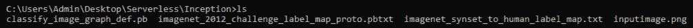

有两个非常方便的命令，一个允许我们创建一个桶，另一个允许我们轻松地将文件上传到桶中：

+   `aws s3api create-bucket --bucket serverlessdeeplearning`

+   `aws s3 sync . s3://serverlessdeeplearning/imagenet`

由于我们已经在此桶中有模型文件，因此现在不需要再保存它，但您可以使用此命令将文件上传到您的桶中。接下来，我们可以返回到包含我们函数的文件夹并运行`serverless deploy`命令。

现在，我们将使用以下命令调用函数：

```py
serverless invoke --function main
```

正如您所看到的，它成功识别了图像。此外，如果我们再次调用该函数，它将运行得更快：

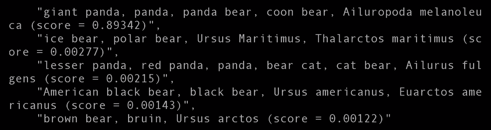

# 总结

在本章中，我们了解了使用 AWS Lambda 部署 TensorFlow 的架构，其中涵盖了使用 AWS Lambda 部署 TensorFlow 的各种选项，以及每个选项的优缺点。我们还讨论了在 AWS Lambda 中部署 Python 框架的一般问题及其解决方案。最后，我们使用现有的包和无服务器框架在 AWS Lambda 上部署了 TensorFlow。

在下一章中，我们将使用 AWS Lambda 创建深度学习 API。
