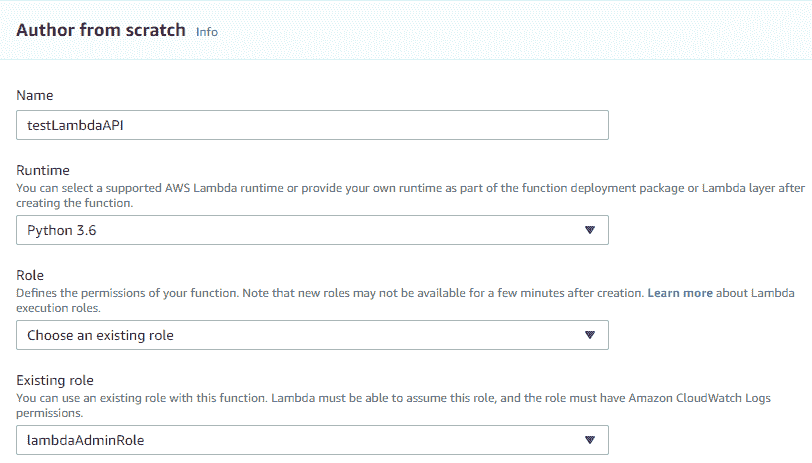
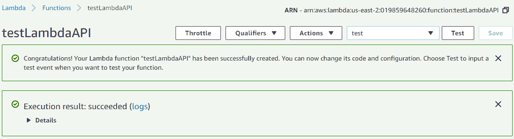
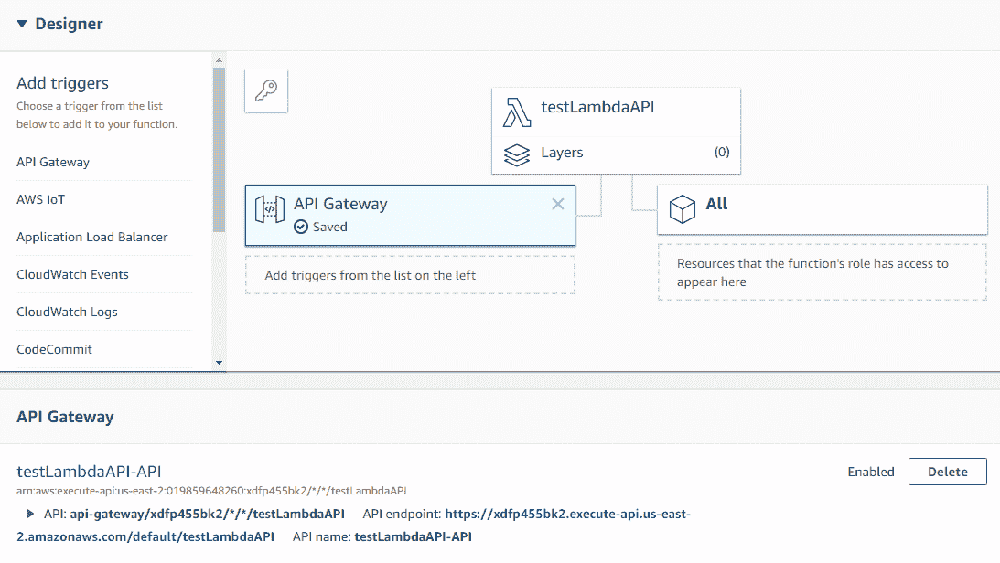
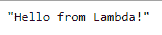
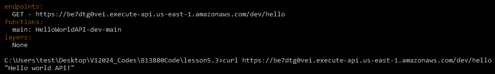
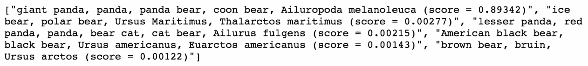

# 第五章：创建深度学习 API

在上一章中，我们学习了如何在 AWS Lambda 上使用 TensorFlow。本章简要介绍了 RESTful API 和 AWS API 网关。我们将学习如何使用无服务器框架创建 API 网关。

在本章中，我们将涵盖以下主题：

+   API 服务

+   AWS API 网关

+   创建深度学习 API 项目

# 技术要求

本章的技术要求如下：

+   AWS 订阅

+   Python 3.6

+   AWS CLI

+   无服务器框架

+   你可以在以下链接找到所有代码：[`github.com/PacktPublishing/Hands-On-Serverless-Deep-Learning-with-TensorFlow-and-AWS-Lambda`](https://github.com/PacktPublishing/Hands-On-Serverless-Deep-Learning-with-TensorFlow-and-AWS-Lambda)

# RESTful API

RESTful API 近年来变得极为流行，随着宏服务的普及，它成为了应用程序内部不同服务之间沟通的通用方式——例如，我们可以在一个应用程序中，使用 RESTful API 服务来连接不同的编程语言和不同的托管平台。

RESTful API 是一种允许不同应用程序之间进行通信的接口，它可以服务于许多用途。RESTful API 使你可以轻松地集成不同的服务。它还允许你在应用程序的前端和后端之间建立简单的连接，并且允许其他开发者使用你的服务。在此背景下，深度学习 API 使你能够轻松地将深度学习模型集成到你的应用中，或者为其他开发者提供一种使用你模型的方式。现在让我们更详细地了解 API 网关服务。

# AWS API 网关

API 网关是一个双重服务，它允许你创建、发布、监控和保护 API。我们不仅可以将 API 网关连接到业务 Lambda，还可以连接到 AWS EC2 实例、**弹性集群**（**ECS**），甚至是 **弹性 Beanstalk**（**EBS**）。它采用按需付费的系统，使其成为一个非常方便的起始服务。让我们来看看 API 网关的具体功能。

# 功能

以下是 API 网关的一些功能：

+   **易于扩展**：API 服务会自动处理扩展问题，这意味着我们不需要担心它是否适合处理峰值负载，也不必担心是否会过度配置资源。

+   **流量管理**：API 网关有一种控制流量的方式。流量管理的主要用例是节流，特别是当我们希望对后端负载进行更均匀的分配时。对于 AWS Lambda 来说，这不是一个问题，因为它几乎可以无限扩展。

+   **授权**：这允许你控制用户对 API 的访问。这意味着我们可以将 API 保持私密，或者将其商业化。这个功能对你的应用程序至关重要。

+   **监控**：此功能使我们能够获取用户级别的使用统计信息。如果我们希望根据用户的使用情况限制他们，或者需要排除故障 API，这将非常重要。

+   **缓存**：这可以通过缓存部分响应来减少发送到后端的请求数量。如果您的应用程序需要处理大量重复请求，那么此功能可以显著减少后端的使用量。

+   **版本控制**：这使您可以管理 API 的多个版本，这对于应用程序的生产非常重要。

现在，让我们来看一下 API 的定价。

# 定价

API Gateway 的主要优点之一是按需付费功能。该服务的定价为每百万个请求 3.5 美元，数据传输费用为每 1 GB 大约 0.09 美元。根据选择的服务，可能会产生其他可选费用。因此，我们需要确保它有助于降低后端成本。我们看到的 API Gateway 的费用对于我们的项目来说是非常实惠的。对于初学者来说，AWS API Gateway 是免费套餐的一部分，每月可免费获得 100 万个请求。请注意，免费套餐仅适用于新用户。

# 创建 API Gateway

现在我们了解了 API Gateway 的费用和功能后，我们将通过 AWS 控制台创建 API Gateway。但在开始之前，我们需要创建并定位 AWS Lambda（在第四章，*在 AWS Lambda 上使用 TensorFlow*中创建），然后我们将学习如何创建 AWS API Gateway 和 AWS Lambda 之间的连接。

# 创建 AWS Lambda 实例

我们将通过 AWS 控制台创建 AWS Lambda 实例并连接到 Gateway。让我们从创建 AWS Lambda 实例开始，并选择在上一章中创建的管理角色，如下图所示：



让我们测试该功能，并检查它是否已通过屏幕右上方的测试选项创建，如下图所示：



现在，让我们通过单击左侧“添加触发器”下的 API Gateway 选项来添加 API Gateway 触发器。在“配置触发器”选项卡下，选择“创建新的 API”并选择 Open API 端点。然后，在“附加设置”中，只需检查 API 名称并单击“添加”以创建 API 并保存。这将为您提供如下图所示的页面，其中包含一个 API 链接，可在浏览器中进行测试：



如您所见，它产生的结果与演示代码相似，如下图所示：



现在我们已经准备好了 AWS Lambda 和 API Gateway，我们将使用无服务器框架创建连接。

# 使用无服务器框架创建 API Gateway

在创建 API 之前，让我们看看我们的项目文件：主 Python 文件（`index.py`）和无服务器配置文件（`serverless.yml`）。让我们查看如下所示的 Python 文件：

```py
import json
def handler(event, context):
print('Log event', event)
return{
'status code': 200;
'body': json.dump('Hello world API!')
}
```

从前面的代码块中，你可以看到这个文件将返回 JSON 响应，而不是字符串给 API 请求。为此，我们需要将 `status code` 更改为 `200`，并将 `body` 更改为 JSON 格式的 `transform`。

在服务器配置文件中，我们将添加一个 `events` 并添加一个 API 端点名称：

```py
functions:
  main:
    handler: index.handler
    events:
      - http: GET hello
```

# 部署无服务器框架

现在让我们使用以下命令来部署服务：

```py
serverless deploy
```

部署成功完成后，它将返回 API Gateway 的 URL。现在使用 `curl` 命令和 URL 测试我们在命令行中得到的 URL：



我们也可以在浏览器中运行该 URL 并测试部署，找到期望的输出。

# 创建第一个 API 项目

现在让我们从创建深度学习 API 项目的示例开始。在开始项目之前，先来看一下我们的文件：主 Python 文件和服务配置文件，以及一些库文件和 Inception 模型。

在这个项目中，我们将添加一个 `events` 部分以及端点名称。在 Python 文件中，我们将对请求返回一个 JSON 响应。此外，我们将使 Lambda 接受请求中的图片链接，并将其应用到一个模块中。然后，我们将部署服务器，并在命令行和浏览器中测试文件，就像在前一节中检查的那样。

当前的配置文件是前一节修改内容的结合，并且非常相似。我们将要进行更改的另一个部分是 Python 文件，在其中我们添加了读取 URL 参数。如你所见，如果没有 URL，我们使用之前获取的图片。但如果我们有 URL 路径，我们可以从该 URL 下载图片。

现在让我们使用 `serverless deploy` 命令部署服务，该命令会提供 API Gateway 的 URL。让我们使用 `curl` 命令和浏览器测试这个 URL，您将看到与前一节中相同的响应：



我们还可以通过下载图片来测试部署。为了测试这一点，我们只需要将图片的 URL 作为参数添加到 API Gateway URL 中。

# 总结

在这一章中，我们学习了 API Gateway 服务和 RESTful API。我们看到 AWS Gateway 如何为我们的应用提供高性价比。然后，我们了解了如何使用 AWS 控制台创建 AWS API Gateway 和 AWS Lambda。我们还通过无服务器框架创建了 AWS Lambda 和 AWS API Gateway 之间的连接。最后，我们使用 API Gateway 创建了深度学习 API 项目。

在下一章，我们将通过连接和明显的 Lambda 小组件来创建交叉管道，*小费很有意思*，我们将在这里学习如何构建深度学习管道。
