# 第六章：创建深度学习管道

在上一章中，我们研究了使用 AWS 控制台创建 API 网关服务以及无服务器框架。本章我们将学习如何使用 AWS 控制台以及无服务器框架创建 SQS 连接。

本章将覆盖以下主题：

+   消息队列

+   介绍 AWS 简单查询服务

+   使用 AWS 控制台和无服务器框架创建 AWS SQS

+   示例项目——深度学习管道

# 技术要求

本章的技术要求如下：

+   AWS 订阅

+   Python 3.6

+   AWS CLI

+   无服务器框架

+   你可以在 [`github.com/PacktPublishing/Hands-On-Serverless-Deep-Learning-with-TensorFlow-and-AWS-Lambda`](https://github.com/PacktPublishing/Hands-On-Serverless-Deep-Learning-with-TensorFlow-and-AWS-Lambda) 查找所有代码

# 消息队列

消息队列是不同服务之间互动的重要附加方式。虽然 RESTful API 有超时限制，但消息队列没有这种缺点。因此，它有助于处理长时间运行的过程或延迟消息。另外，它允许后端负载更均匀。它对于与 AWS Lambda 一起工作并非关键功能，因为 Lambda 可以轻松扩展，但在处理集群时非常有用。最后，消息队列支持重试逻辑，这意味着失败的任务可以被多次重新发送。现在让我们更深入地了解 AWS SQS。

# AWS SQS 介绍

基本上，这是一个 AWS 服务，允许发送、接收和存储消息。它可以连接到任何处理后端。它采用按需付费系统，这使其成为一个非常方便的起点。

# AWS API 网关特性

AWS API 的不同特性如下：

+   它具有极高的可扩展性，你无需管理队列中的其他扩展。

+   该服务处理来自读者的队列访问，因此你无需实现此功能。

+   SQS 拥有可自定义的重试机制，增加了避免错误的概率，从而提高了整体速度。

+   SQS 提供非常简单的 API，你可以在几乎任何编程语言中使用它。

+   最后，它提供加密功能，这对于提高服务的安全性非常有用。

# AWS SQS 定价

SQS 的主要优势之一是按用户付费系统，非常简单。定价为每 100 万次请求 50 美分，每月前 100 万次请求免费。这使它非常适合早期项目。

# 使用 AWS 控制台创建 AWS SQS 连接

在本节中，我们将首先创建一个 AWS Lambda，然后创建简单查询服务，最后将 SQS 连接到 AWS Lambda。

# 创建 AWS Lambda 实例

创建 AWS Lambda 实例的步骤如下：

1.  首先，在“名称”下添加名称，选择运行时为 Python 3.6，将角色设置为“选择现有角色”，然后从现有角色中选择`lambda1`，点击“创建函数”，如图所示：

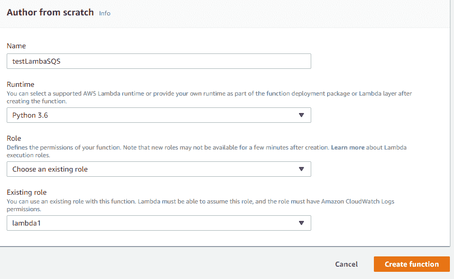

1.  Lambda 函数创建成功，如下截图所示：

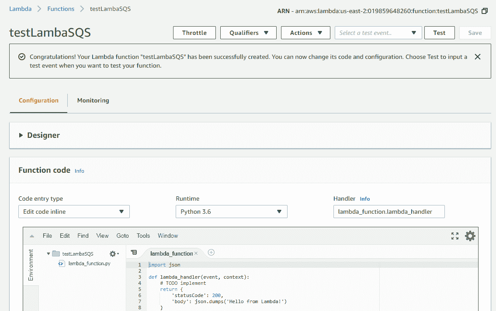

1.  接下来，切换到 SQS 并通过选择“创建新队列”来创建一个 SQS 队列：

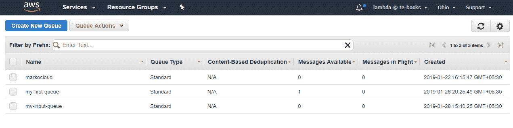

1.  在创建名为 testLambda 的队列后，我们得到如下截图中高亮显示的 SQS ARN：

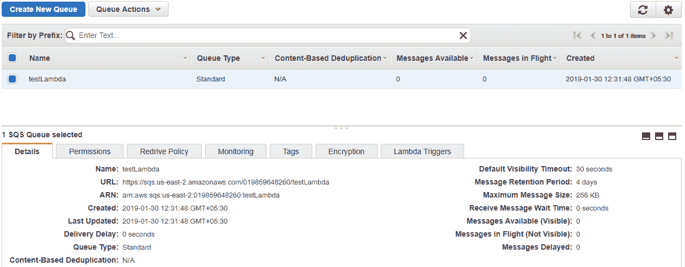

5\. 在左侧的 Designer 标签页中，选择 SQS 作为触发器：

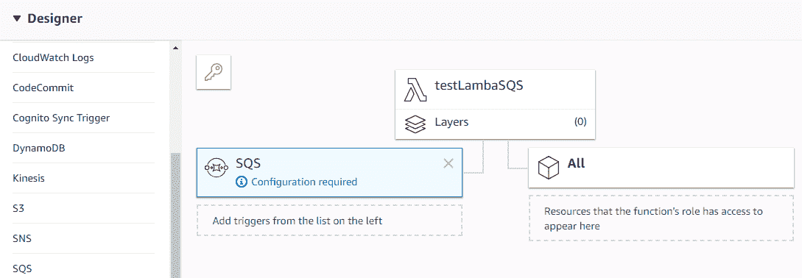

1.  我们将通过选择“队列操作”下拉菜单中的“发送消息”来向队列发送一些消息：

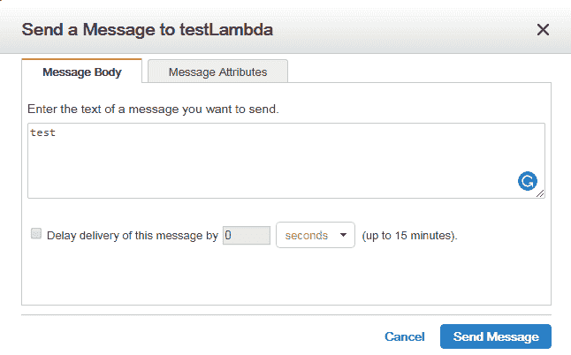

1.  如你所见，我们只有一条可用消息，意味着所有消息都已经被 Lambda 消费，如下截图所示：

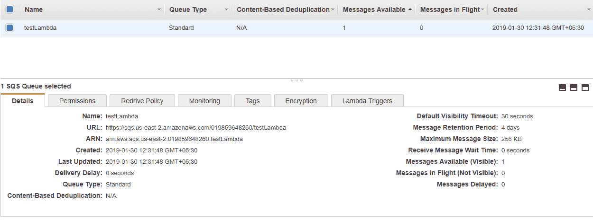

8\. 点击“监控”后，我们会看到如下详细概览：

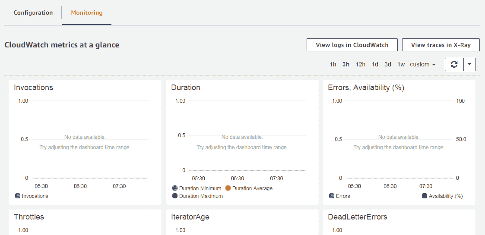

1.  我们还可以通过点击 CloudWatch 中的“查看日志”来查看日志详情，如前述截图所示。每次开始和结束意味着每条消息的调用。

下一部分讲解如何使用无服务器框架创建一个 AWS SQS 连接到 AWS Lambda。

# 使用无服务器框架创建 AWS SQS 连接

要创建 SQS 连接，我们有主 Python 文件和无服务器配置文件。配置文件会稍微复杂一些，我们需要在资源部分定义 SQS，将其作为 Lambda 的事件源，然后允许 Lambda 从 SQS 读取数据。

# Python 文件

对于 Python 文件的主要区别是，我们将不再返回一个字符串，而是写入另一个 SQS 查询，如下所示：

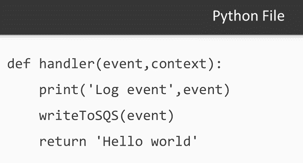

# 代码

在开始编写代码之前，我们首先需要部署无服务器框架，然后通过命令行界面检查它是否能够运行。我们将使用`index.py`文件和`serverless.yml`配置文件来运行代码。

# serverless.yml

在`serverless.yml`文件中，我们可以看到我们在之前章节中讨论的所有部分，特别是定义访问查询的角色部分，我们将在其中读取消息，并且 Lambda 将写入此查询。以下代码展示了解释：

```py
Effect: "Allow"
Action:
    "sqs:ReceiveMessage"
    "sqs:DeleteMessage"
    "sqs:GetQueueAttributes"
Resource:
    arn:aws:sqs:#{AWS::Region}:#{AWS::AccountId}:ReadSQS
```

我们还需要定义其中一个查询将作为事件源，正如下图所示：

```py
events:
    sqs:
      arn:
        Fn::GetAtt:
          ReadSQS
          Arn
```

最后，我们定义查询，这些查询可以在资源部分执行，如代码所示：

```py
resources:
  Resources: 
    WriteSQS: 
      Type: AWS::SQS::Queue
      Properties:
        QueueName: "WriteSQS"
    ReadSQS: 
     Type: AWS::SQS::Queue
     Properties:
        QueueName: "ReadSQS"
```

此外，我们还需要使用插件`serverless-pseudo-parameters`，我们将安装它：

```py
plugins:
  - serverless-pseudo-parameters
```

我们需要从`deployment`包中删除带有前述插件的包，如下所示：

```py
package:
  exclude:
    - node_modules/**
```

下一步是使用此插件访问我们使用的区域 ID 和账户 ID，如下所示：

```py
Resource:
  - arn:aws:sqs:#{AWS::Region}:#{AWS::AccountId}:ReadSQS
Effect: "Allow"
Action:
  - "sqs:SendMessage"
  - "sqs:GetQueueUrl"
Resource:
  - arn:aws:sqs:#{AWS::Region}:#{AWS::AccountId}:WriteSQS
```

你可以在没有这个插件的情况下访问账户 ID 和区域 ID，或者手动查找它们。

# index.py

`index.py`文件非常简单。我们只是读取传入的消息，然后将其写入 SQS。以下是`index.py`的代码：

```py
import boto3

def handler(event,context):
    for message in event['Records']:
        client = boto3.client('sqs')
        sqsAddress = client.get_queue_url(QueueName='WriteSQS')
        response = client.send_message(QueueUrl=sqsAddress['QueueUrl'],
                                        MessageBody=message['body'])
    return
```

我们将看到前面的`index.py`和`serverless.yml`文件在命令行中的输出：

首先，我们需要安装插件`serverless-pseudo-parameters`：

```py
npm install serverless-pseudo-parameters
```

输出如下：

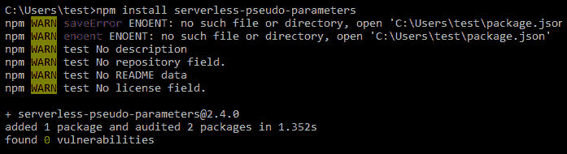

接下来，我们将使用以下命令部署 Lambda：

```py
serverless deploy
```

如你所见，插件已将区域替换为实际的基础区域和账户，如下图所示：

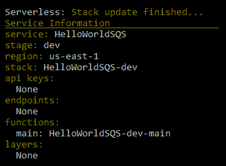

要通过队列发送消息，首先我们需要使用以下命令查找队列的 URL：

```py
aws sqs get-queue-url --queue-name ReadSQS
```

有了队列 URL，我们就可以发送消息。我们看到命令成功执行：

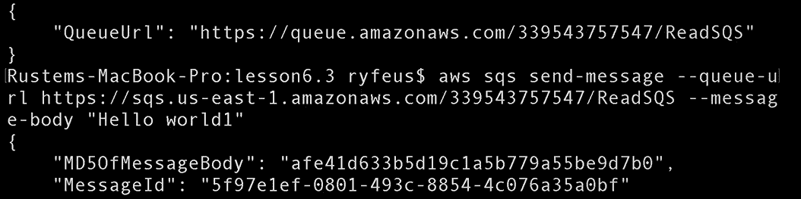

现在我们可以从 SQS 队列中读取相同的消息。基本上，在这里我们可以检查 Lambda 是否已接收到我们发送的消息`Hello world1`，并将其发送到 SQL 写入。我们看到 Lambda 成功运行，并且可以在以下截图中看到结果消息`Hello world1`：

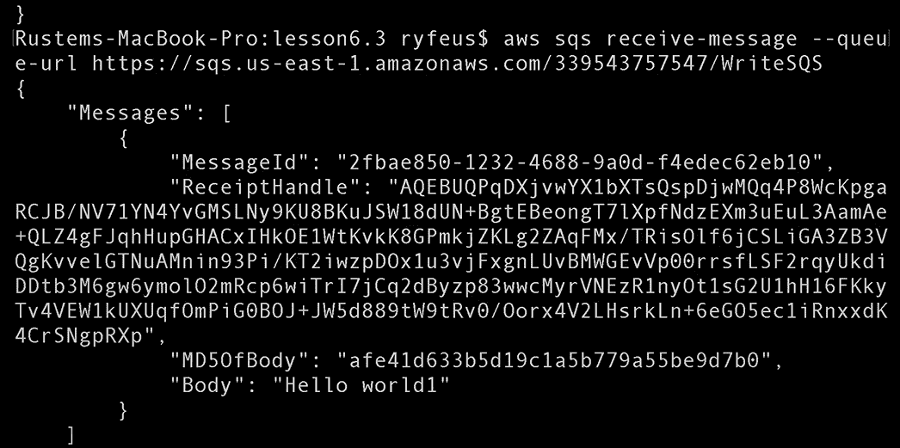

# 示例项目 – 深度学习管道

在项目文件中，我们有主要的 Python 文件、无服务器配置文件、库文件和一个启动模块。配置文件将与我们在前一章中使用的配置文件相同。我们将查看 Python 文件。我们 Python 文件的主要区别在于，我们将不再返回字符串，而是将消息发送到另一个 SQS 查询。此外，我们将使 Lambda 接受消息中的图片链接，然后应用模块进行结构化。部署将与前一节中的类似。

我们将跳过模型的部署，因为我们之前已经讲解过了。

# 代码

首先，我们需要部署无服务器框架，然后可以使用命令行界面检查它是否运行。我们有`index.py`文件和`serverless.yml`配置文件。我们还为 TensorFlow 提供了库，并为无服务器框架预安装了插件。

# 配置文件 - serverless.yml

我们可以看到当前的配置文件来自前面的部分。

我们有一个存储模型的存储桶，如下所示的代码片段：

```py
Effect: "Allow"
Action:
  - "s3:ListBucket"
Resource:
  - arn:aws:s3:::serverlessdeeplearning
Effect: "Allow"
Action:
  - "s3:GetObject"
Resource:
  - arn:aws:s3:::serverlessdeeplearning/*
```

有一个 Lambda 的事件源和资源，如下所示的代码片段：

```py
- sqs:
    arn:
      Fn::GetAtt:
        - DLReadSQS
        - Arn
```

# index.py

在`index.py`文件中，脚本与前一节中的一样。添加了一个额外的部分，即从消息中读取 URL 并将结果写入另一个队列。以下是`index.py`的代码片段：

```py
import boto3
import numpy as np
import tensorflow as tf
import os.path
import re
from urllib.request import urlretrieve
import json
SESSION = None
strBucket = 'serverlessdeeplearning'
def handler(event, context):
    global strBucket
    global SESSION
    if not os.path.exists('/tmp/imagenet/'):
       os.makedirs('/tmp/imagenet/')
       ...
```

以下截图展示了我们如何检索图像并在其上运行模型，因此，我们将模型的结果写入另一个队列，如下所示：

```py
if ('Records' in event):
    for message in event['Records']:
        urlretrieve(message['body'].strip('\''), strFile)
        vecResult = run_inference_on_image(strFile)
        client = boto3.client('sqs')
        sqsAddress = client.get_queue_url(QueueName='DLWriteSQS')
        response = client.send_message(QueueUrl=sqsAddress['QueueUrl'],
                                       MessageBody=vecResult[0])
 else:
        downloadFromS3(strBucket,'imagenet/inputimage.png',strFile)
        strResult = run_inference_on_image(strFile)
```

现在让我们按照如下方式部署服务：

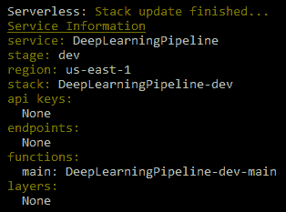

我们将通过命令行界面将带有 URL 的消息发送到第一个队列：

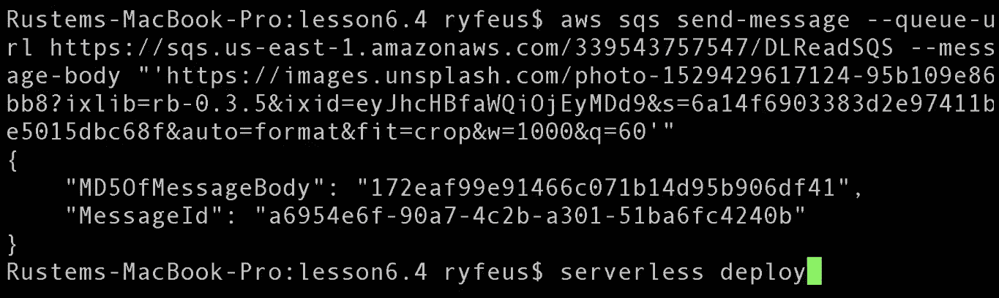

我们可以从另一个队列中读取发送的消息，如下所示：

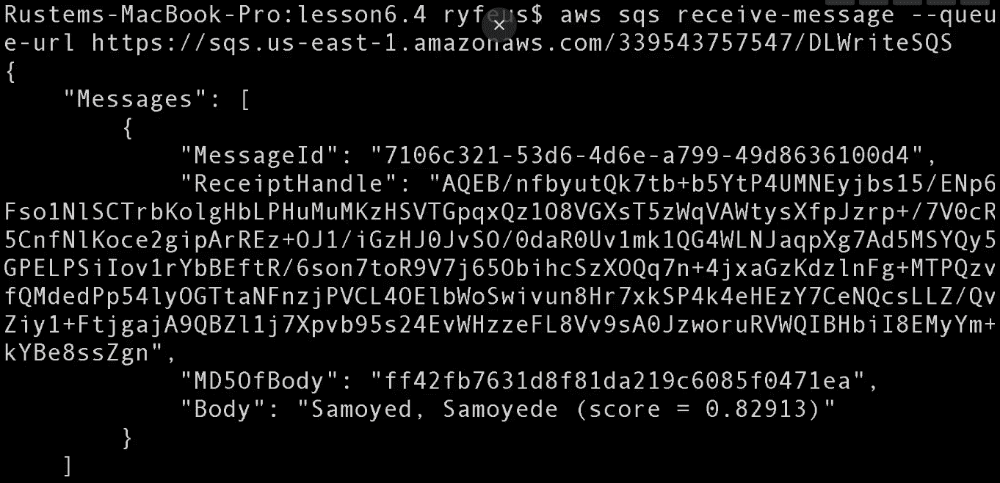

# 总结

在本章中，我们介绍了 AWS SQS，包括其功能以及定价。我们还使用 AWS 控制台和无服务器框架创建了 AWS SQS 连接。

我们学习了`serverless.yml`配置文件和`index.py`文件的部署。本章以一个示例项目结束，该项目是一个深度学习管道。

在下一章中，我们将学习如何通过连接 AWS Lambda 实例和 AWS 函数创建跨越的工作流，并在其中学习如何构建深度学习工作流。
