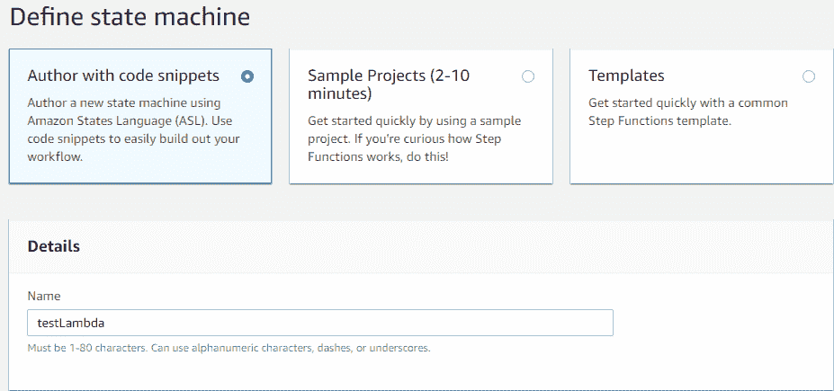

# 第七章：创建深度学习工作流

在本章中，你将学习 AWS Step Functions 服务，并通过使用 AWS 控制台连接到 AWS Lambda 来创建 AWS Step Functions。你还将学习如何使用 Serverless 框架创建 AWS Step Functions 连接，最后，你将查看一个深度学习工作流的示例项目。

我们将涵盖以下主题：

+   AWS Step Functions 服务介绍

+   使用 AWS 控制台创建连接到 AWS Lambda 的 AWS Step Functions 连接

+   使用 Serverless 框架创建 AWS Step Functions 连接

+   深度学习工作流

# 技术要求

本章的技术要求如下：

+   AWS 订阅

+   Python 3.6

+   AWS CLI

+   Serverless 框架

+   你可以在[`github.com/PacktPublishing/Hands-On-Serverless-Deep-Learning-with-TensorFlow-and-AWS-Lambda`](https://github.com/PacktPublishing/Hands-On-Serverless-Deep-Learning-with-TensorFlow-and-AWS-Lambda)找到所有代码。

# AWS Step Functions 服务介绍

本节我们将介绍 AWS Step Functions 服务，包括其功能以及使用该服务的定价信息。

# 处理工作流

处理工作流是不同服务之间交互的额外方法。如果你想在深度学习中构建一个多步骤的过程，它可能意味着加载数据、预处理数据然后运行模型。虽然你可以在每个后端节点之间放置查询，但监控单个任务的处理将变得非常困难。这就是工作流非常方便的地方。基本上，工作流服务在需要时负责调用每个节点，并处理处理作业的中间状态。它让你能够高层次地查看每个任务的状态，并跟踪任务失败和超时。最后，它允许你在工作流中非常灵活地使用组件。

# AWS Step Functions

AWS Step Functions 是一个 AWS 服务，允许你将工作流管理为一个状态机。它可以连接到任何处理后端，并与 AWS Lambda 进行原生集成。它采用按需计费系统，非常便捷。

# AWS Step Functions 功能

现在我们来看看 Step Functions 的具体功能：

+   Step Functions 极具可扩展性，你无需管理扫描或工作流。

+   Step Functions 提供了出色的可视化 UI，便于监控处理作业。

+   状态管理允许你添加复杂的逻辑，例如根据前一个节点的结果选择下一个节点，并且它还支持并行运行多个节点。

+   一些功能提供了方便的重试任务逻辑，使你能够确保任务的处理。

+   内置的错误处理功能允许你处理各种情况。例如，当你遇到某些异常时，你需要一种方式来为错误处理添加逻辑，例如在数据库中将任务标记为失败。

+   调度允许你运行延迟处理任务，非常方便当你需要等待另一个过程完成时。

# AWS Step Functions 定价

Step Functions 的主要优势之一是按需付费系统。非常简单，每 10,000 次请求收费 25 美分，其中每月前 4,000 次请求是免费的。这使其非常适合早期项目。

# Step Functions 与 SQS 的对比

如果我们深入分析 Step Functions 与 SQS 在功能和可能的使用场景上的区别，可以说 SQS 最适合处理简短、简单、低优先级的任务，这些任务的数量可能非常庞大（每天可能有数百万个任务）。而 Step Functions 则最适合处理那些需要多步骤、耗时较长的复杂过程，并且我们希望保证每个任务的交付（每天可能有数千个任务）。在接下来的部分中，你将学习如何使用 AWS 控制台创建 AWS Step Functions 与 AWS Lambda 的连接。

# 使用 AWS 控制台创建 AWS Step Functions 与 AWS Lambda 的连接

在本节中，我们将使用 AWS 控制台创建 Step Functions。创建 Step Function 有两个主要步骤：

1.  创建 AWS Lambda 实例

1.  创建将使用 Lambda 实例的 Step Function

# 创建 AWS Lambda 实例

现在我们将使用 AWS 控制台创建一个 AWS Lambda 实例：

1.  导航到 Lambda 来创建 Lambda 实例。

1.  现在输入名称为`testLambdaStepFunction`，运行时选择 Python 3.6，角色选择“选择现有角色”，现有角色选择`lamdaAdminRole`。然后点击“创建功能”，位于屏幕的右下角：


1.  Lambda 实例已成功创建：


# 创建 Step Function

创建 Step Function 时，我们需要执行以下步骤：

1.  进入 Step Functions 服务并点击“创建状态机”：


1.  在“定义状态机”标签中，输入名称为`testLambda:`：



1.  现在我们需要将`Type`定义为`Task`和`Resource`。对于资源，你需要使用你 Lambda 的 ARN 地址，可以在标签的右上角找到。你可以将其复制并粘贴到状态机定义部分，如下图所示：


1.  现在我们将创建一个 IAM 角色，这一步是自动完成的。输入名称为`StepFunctionTestRole`，然后点击“创建功能”。在你的状态机获得执行权限之前，这将花费一分钟时间：


1.  现在，在我们创建了 Step Function 后，我们可以测试并发送一条简单的消息。为此，请点击“开始执行”：


1.  我们可以在这里看到执行图：


1.  对于每次执行，你可以看到整个步进函数的输入和输出：


1.  我们可以看到每个节点的输入和输出（这可以在“步进详情”标签中查看）。如果有错误，我们将在“异常”标签中看到它。此外，如果你向下滚动，还可以看到执行的时间线：


1.  我们还可以通过点击“步进详情”标签下的“资源”标签中的链接来检查日志。这将带你到以下页面：


因此，我们可以看到步进函数是一个非常方便的服务，用于管理 Lambda 执行。

# 使用无服务器框架为 AWS Lambda 实例创建 AWS 步进函数

在本节中，我们将使用无服务器框架创建步进函数。首先，让我们看看我们的项目文件：一个 Python 文件和无服务器配置文件。在配置文件中，我们将添加一些插件，并描述步进函数，这是一个复杂的内容。

所以，让我们通过开始实时代码来探索无服务器配置文件中的步进函数：

1.  部署无服务器框架。

1.  使用 CLI，检查无服务器框架的部署状态。

1.  现在，通过 AWS 控制台检查步进函数结果。

# 步进函数

让我们通过执行`ls`命令来检查我们拥有的文件列表。如你所见，我们有`index.py`文件和`serverless.yml`配置文件服务文档。我们还为无服务器框架安装了插件。

让我们看看配置文件及其两个主要部分：

1.  首先，我们将添加几个函数，这些函数将在步进函数的不同状态下使用：

```py
function:
    branch:
        handler: index.handlerBranch
    map:
        handler: index.handlerMap
    reduce:
        handler: index.handlerReduce
```

1.  接下来，我们将添加一些插件，这是与步进函数一起工作的必要条件：

```py
plugins:    - serverless-step-functions
    - serverless-pseudo-parameters
```

1.  现在让我们看一下`index.py`文件，在那里你可以看到到目前为止讨论的所有部分：

```py
def handlerMap(event,context):
    return event

def handlerReduce(event,context):
    return event

def handlerBranch(event,context):
    return 'Hello world'
```

# 无服务器部署

现在，让我们通过执行以下命令来部署我们的服务：

```py
serverless deploy
```

上述命令将部署你的服务，如下图所示：


作为部署的一部分，它将提供 API 网关的 URL，如下图所示：


现在让我们在命令行中测试这个 URL：

```py
curl https://dns1519ilj.execute-api.us-east-1.amazonaws.com/dev/startFunction
```

你可以在浏览器中检查结果。在以下截图中，你可以看到我们的步进函数：


在以下截图中，我们可以看到最新的执行成功完成：


你可以检查每个节点的输入和输出。如果有任何错误，可以在“异常”部分检查。

两个分支都返回了 hello world，步进节点将结果合并并将其作为步进函数的结果返回：


这里，让我们检查一下执行的时间线。你还可以看到这些分支几乎是同时启动的。

在下一节中，我们将查看深度学习工作流项目的一个示例。

# 示例项目 – 深度学习工作流

首先，让我们看看以下的项目文件。我们有主 Python 文件、服务集成文件，以及一些库和 Inception 模型。在配置文件中，我们将添加一些插件并描述步骤函数，这是一个复杂的内容。

与我们的 Python 文件的主要区别在于，我们将有三个函数。其中一个将把一组 URL 链接映射成不同的对象。另一个将在链接上运行模型。最后一个将把结果合并。部署结构与上一节中的类似。由于我们在上一章已经覆盖过模型部署到 S3 的部分，这里就跳过。

# 创建模型

这里，我们需要部署无服务器框架，然后使用 CLI 检查痕迹：

1.  让我们来看看配置文件。你可以看到我们需要定义的所有主要部分和角色，以便访问模型：

```py
provider:
  name: aws
  region: us-east-1
  runtime: python3.6
  memorySize: 1536
  timeout: 30
  iamRoleStatements:
    - Effect: "Allow"
       Action:
         - "s3:ListBucket"
       Resource:
         - arn:aws:s3:::serverlessdeeplearning
    - Effect: "Allow"
       Action:
         - "s3:GetObject"
       Resource:
         - arn:aws:s3:::serverlessdeeplearning/*
```

1.  这里是我们将在步骤函数的不同状态下使用的函数：

```py
functions:
  main:
    handler: index.handler
  map:
    handler: index.map
  reduce:
    handler: index.reduce
```

1.  `map` 将启用将传入的事件映射到不同的 Lambda，range 将使得每个链接可以并行地单独处理，而 `reduce` 则有助于将它们合并成一个响应。我们有状态机定义，它与之前讨论的非常相似：

```py
stepFunctions:
  stateMachines:
    DeepLearningWorkflow:
      events:
        - http:
            path: gofunction
            method: POST
      name: DeepLearningWorkflow
      definition:
        StartAt: StartStepF
        States:
          StartStepF:
            Type: Task
            Resource: arn:aws:lambda:#{AWS::Region}:#{AWS::AccountId}:function:${self:service}-${opt:stage}-map
            Next: Parallel
          Parallel:
            Type: Parallel
            Next: EndStepF
            Branches:
              - StartAt: Branch1
                States:
                  Branch1:
                    Type: Task
                    Resource: arn:aws:lambda:#{AWS::Region}:#{AWS::AccountId}:function:${self:service}-${opt:stage}-main
                    InputPath: '$.branch1.url'
                    ResultPath: '$.res'
                    End: True
              - StartAt: Branch2
                States:
                  Branch2:
                    Type: Task
                    Resource: arn:aws:lambda:#{AWS::Region}:#{AWS::AccountId}:function:${self:service}-${opt:stage}-main
                    InputPath: '$.branch2.url'
                    ResultPath: '$.res'
                    End: True
              - StartAt: Branch3
                States:
                  Branch3:
                    Type: Task
                    Resource: arn:aws:lambda:#{AWS::Region}:#{AWS::AccountId}:function:${self:service}-${opt:stage}-main
                    InputPath: '$.branch3.url'
                    ResultPath: '$.res'
                    End: True
          EndStepF:
            Type: Task
            Resource: arn:aws:lambda:#{AWS::Region}:#{AWS::AccountId}:function:${self:service}-${opt:stage}-reduce
            End: true
```

1.  这里是我们所需的插件，以便使函数正常工作：

```py
plugins:
  - serverless-step-functions
  - serverless-pseudo-parameters
```

1.  我们的索引文件与上一节的主要区别是，我们添加了 MapReduce 逻辑。这将使得每个 URL 可以单独处理：

```py
def map(event, context):
    dictMap = {}
    dictMap['branch1'] = {'url':event[0]}
    dictMap['branch2'] = {'url':event[1]}
    dictMap['branch3'] = {'url':event[2]}
    return dictMap

def reduce(event, context):
    vecRes = []
    for res in event:
        vecRes.append(res['res'])
    return vecRes
```

对于这个例子，我们将使用三个 URL，分别对应来自免费图片网站的狗、熊猫和红熊猫图像。

1.  现在我们的模型已经准备好，接下来使用以下命令部署服务：

```py
serverless deploy
```

1.  你将会得到一个 API 的 URL 用于测试。

1.  让我们测试一下这个 URL。我们将需要使用 `curl` 命令，它与之前的用法略有不同。

1.  首先，我们将使用 `POST` 请求而不是 `GET` 请求，并且会提供一个包含链接的列表作为请求的一部分。正如你所看到的，它成功返回了。这次执行表明它成功地将命令发送到了步骤函数：


1.  现在让我们在浏览器中查看图表。我们可以看到它已经完成了执行：


1.  我们可以看到每个分支都收到了一个独立的 URL，并且我们可以看到最终的节点成功地将不同分支的结果合并为一个，并且成功识别了这些图像：


此外，我们可以查看执行的时间线，看到几乎所有分支几乎同时开始。

这意味着并行化真正使我们能够更快地处理链接列表。

# 总结

在本章中，我们学习了 AWS Step Functions 服务，包括其功能和定价。我们还了解了如何通过 AWS 控制台将 AWS Step Functions 连接到 AWS Lambda。我们还看到了如何使用无服务器框架创建步骤函数，并且甚至创建了一个深度学习工作流。
