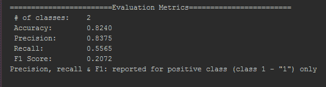

# 第一章：Java 中的深度学习简介

让我们讨论一下各种深度学习库，以便选择最适合当前任务的库。这是一个依赖于具体情境的决策，会根据情况有所不同。在本章中，我们将首先简要介绍深度学习，并探讨为什么 DL4J 是解决深度学习问题的一个好选择。我们还将讨论如何在工作空间中设置 DL4J。

在本章中，我们将涵盖以下内容：

+   深度学习的直觉

+   确定解决深度学习问题的正确网络类型

+   确定正确的激活函数

+   克服过拟合问题

+   确定正确的批处理大小和学习率

+   配置 Maven 以支持 DL4J

+   配置 DL4J 以支持 GPU 加速环境

+   解决安装问题

# 技术要求

要充分利用这本食谱，你需要以下内容：

+   安装 Java SE 7 或更高版本

+   基本的 Java 核心知识

+   DL4J 基础

+   Maven 基础

+   基本的数据分析技能

+   深度学习/机器学习基础

+   操作系统命令基础（Linux/Windows）

+   IntelliJ IDEA IDE（这是管理代码的非常简便和无烦恼的方法；不过，你也可以尝试其他 IDE，如 Eclipse）

+   Spring Boot 基础（将 DL4J 与 Spring Boot 集成，用于 Web 应用）

本书中我们使用的是 DL4J 版本 1.0.0-beta3，除了第七章《构建 LSTM 神经网络进行序列分类》外，在那里我们使用了最新版本 1.0.0-beta4，以避免出现 BUG。

# 深度学习的直觉

如果你是深度学习的新手，可能会好奇它到底与机器学习有什么不同；还是一样的？深度学习是机器学习这个大领域的一个子集。让我们以汽车图像分类问题为例来思考这个问题：


正如你在前面的图示中看到的，我们需要自行执行特征提取，因为传统的机器学习算法无法自行完成这些工作。它们可能在准确性上非常高效，但无法从数据中学习信号。事实上，它们并不会自己学习，仍然依赖于人类的努力：


另一方面，深度学习算法通过自我学习来执行任务。神经网络的工作原理基于深度学习的概念，它们通过自身训练来优化结果。然而，最终的决策过程是隐藏的，无法追踪。深度学习的目标是模仿人类大脑的工作方式。

# 反向传播

神经网络的核心是反向传播算法。请参阅下图所示的示例神经网络结构：


对于任何神经网络，在前向传播过程中，数据从输入层流向输出层。图中的每个圆圈代表一个神经元。每一层都有若干个神经元。我们的数据将在各层之间的神经元中流动。输入需要是数值格式，以支持神经元中的计算操作。每个神经元都分配有一个权重（矩阵）和一个激活函数。通过输入数据、权重矩阵和激活函数，生成每个神经元的概率值。通过损失函数，在输出层计算误差（即与实际值的偏差）。我们在反向传播过程中利用损失值（即从输出层到输入层），通过重新分配权重给神经元来减少损失值。在这个阶段，一些输出层的神经元会分配较高的权重，反之亦然，这取决于损失值的结果。这个过程将一直向后推进，直到输入层，通过更新神经元的权重。在简言之，我们正在追踪损失相对于神经元权重变化的变化率。整个过程（前向传播和反向传播）被称为一个周期（epoch）。在训练过程中，我们会进行多个周期。神经网络会在每个训练周期后优化结果。

# 多层感知器（MLP）

多层感知器（MLP）是一个标准的前馈神经网络，至少有三层：输入层、隐藏层和输出层。隐藏层在结构中位于输入层之后。深度神经网络在结构中有两层或更多的隐藏层，而 MLP 只有一层。

# 卷积神经网络（CNN）

卷积神经网络通常用于图像分类问题，但由于其良好的效果，也可以应用于**自然语言处理**（**NLP**），与词向量结合使用。与普通神经网络不同，CNN 会有额外的层，如卷积层和子采样层。卷积层接受输入数据（如图像），并在其上执行卷积操作。你可以把它理解为对输入应用一个函数。卷积层充当过滤器，将感兴趣的特征传递给下一个子采样层。感兴趣的特征可以是任何东西（例如，在图像的情况下，可以是毛发、阴影等），这些特征可以用来识别图像。在子采样层，来自卷积层的输入会被进一步平滑处理。因此，我们最终得到的是一个分辨率较小、色彩对比度较低的图像，保留了重要的信息。然后，输入会传递给全连接层。全连接层类似于常规的前馈神经网络。

# 循环神经网络（RNN）

RNN 是一个能够处理序列数据的神经网络。在常规的前馈神经网络中，当前的输入仅对下一个层的神经元有影响。相反，RNN 不仅可以接受当前的输入，还能接受先前的输入。它还可以利用内存来记忆之前的输入。因此，它能够在整个训练过程中保持长期依赖关系。RNN 在自然语言处理任务中，特别是在语音识别中非常流行。在实践中，稍作变化的结构**长短期记忆网络**（**LSTM**）常常作为 RNN 的更好替代方案。

# 为什么 DL4J 对深度学习如此重要？

以下几点将帮助你理解为什么 DL4J 在深度学习中如此重要：

+   DL4J 提供商业支持。它是第一个商用级别的、开源的、Java 中的深度学习库。

+   编写训练代码简单而精确。DL4J 支持即插即用模式，这意味着在硬件之间切换（从 CPU 到 GPU）只需修改 Maven 依赖项，无需更改代码。

+   DL4J 使用 ND4J 作为其后端。ND4J 是一个计算库，在大规模矩阵运算中，其速度比 NumPy（Python 中的计算库）快两倍。与其他 Python 库相比，DL4J 在 GPU 环境下展现出更快的训练速度。

+   DL4J 支持在使用 Apache Spark 的集群机器上进行训练，无论是 CPU 还是 GPU。DL4J 引入了分布式训练中的自动并行化。这意味着 DL4J 通过设置工作节点和连接，绕过了额外库的需求。

+   DL4J 是一个非常适合生产的深度学习库。作为一个基于 JVM 的库，DL4J 应用可以轻松与现有的运行在 Java/Scala 中的企业应用集成或部署。

# 确定解决深度学习问题的正确网络类型

识别正确的神经网络类型对于高效解决业务问题至关重要。标准的神经网络对于大多数用例而言是最佳选择，并能产生近似的结果。然而，在某些场景下，核心神经网络架构需要进行修改，以便适应特征（输入）并产生所需的结果。在下面的实例中，我们将通过已知用例的帮助，逐步介绍如何为深度学习问题选择最佳的网络架构。

# 如何实现...

1.  确定问题类型。

1.  确定系统中所涉及的数据类型。

# 它是如何工作的...

为了有效地解决用例，我们需要通过确定问题类型来使用正确的神经网络架构。以下是一些全球性的用例及其相应的 problem 类型，供第一步参考：

+   **欺诈检测问题**：我们希望区分合法和可疑交易，以便从整个交易列表中分离出异常活动。目标是减少假阳性（即错误地将合法交易标记为欺诈）案例。因此，这是一个异常检测问题。

+   **预测问题**：预测问题可以是分类问题或回归问题。对于标记的分类数据，我们可以有离散标签。我们需要针对这些离散标签对数据进行建模。另一方面，回归模型没有离散标签。

+   **推荐问题**：你需要构建一个推荐系统（推荐引擎）来向客户推荐产品或内容。推荐引擎还可以应用于执行任务的代理，例如游戏、自动驾驶、机器人运动等。推荐引擎实施强化学习，并且通过引入深度学习可以进一步增强。

我们还需要知道神经网络所消耗的数据类型。以下是一些使用案例及其相应的数据类型，适用于步骤 2：

+   **欺诈检测问题**：交易通常发生在若干时间步骤中。因此，我们需要持续收集交易数据。这是一个时间序列数据的例子。每个时间序列代表一组新的交易记录。这些时间序列可以是规则的或不规则的。例如，如果你有信用卡交易数据需要分析，那么你拥有的是有标签的数据。如果是来自生产日志的用户元数据，则可能是无标签数据。我们可以有用于欺诈检测分析的有监督/无监督数据集，例如。看看以下的 CSV 有监督数据集：


在前面的截图中，像`amount`、`oldBalanceOrg`等特征是有意义的，每个记录都有一个标签，指示该观察是否为欺诈。

另一方面，无监督数据集不会为你提供任何关于输入特征的线索。它也没有任何标签，如下所示的 CSV 数据所示：


如你所见，特征标签（顶部行）遵循一个编号命名规范，但没有任何关于其对欺诈检测结果重要性的提示。我们还可以拥有时间序列数据，其中交易记录会在一系列时间步骤中被记录。

+   **预测问题**：从组织收集的历史数据可以用来训练神经网络。这些数据通常是简单的文件类型，如 CSV/text 文件。数据可以作为记录获得。对于股市预测问题，数据类型将是时间序列。狗品种预测问题需要提供狗的图片来训练网络。股票价格预测是回归问题的一个例子。股票价格数据集通常是时间序列数据，其中股价在一系列时间步骤中被记录，如下所示：


在大多数股票价格数据集中，包含多个文件。每个文件代表一个公司股市。每个文件都记录了股价在一系列时间步骤中的变化，如此处所示：


+   **推荐问题**：对于产品推荐系统，显性数据可能是网站上发布的客户评价，而隐性数据可能是客户活动历史，例如产品搜索或购买历史。我们将使用未标注的数据来馈送神经网络。推荐系统还可以解决游戏问题或学习需要技能的工作。代理（在强化学习过程中训练以执行任务）可以通过图像帧或任何文本数据（无监督）实时获取数据，根据其状态学习该采取何种行动。

# 还有更多...

以下是可能的深度学习解决方案，用于之前讨论的不同问题类型：

+   **欺诈检测问题**：最优解决方案根据数据的不同而有所变化。我们之前提到了两种数据源。一种是信用卡交易，另一种是基于用户登录/注销活动的元数据。在第一种情况下，我们有标注数据，并且有交易序列需要分析。

循环神经网络可能最适合处理序列数据。你可以添加 LSTM（[`deeplearning4j.org/api/latest/org/deeplearning4j/nn/layers/recurrent/LSTM.html`](https://deeplearning4j.org/api/latest/org/deeplearning4j/nn/layers/recurrent/LSTM.html)）循环层，DL4J 也有相应的实现。对于第二种情况，我们有未标注的数据，最佳选择是变分自编码器（[`deeplearning4j.org/api/latest/org/deeplearning4j/nn/layers/variational/VariationalAutoencoder.html`](https://deeplearning4j.org/api/latest/org/deeplearning4j/nn/layers/variational/VariationalAutoencoder.html)）来压缩未标注数据。

+   **预测问题**：对于使用 CSV 记录的分类问题，前馈神经网络足够了。对于时间序列数据，最佳选择是循环神经网络，因为数据具有序列性。对于图像分类问题，你需要使用 CNN（[`deeplearning4j.org/api/latest/org/deeplearning4j/nn/conf/layers/ConvolutionLayer.Builder.html)`](https://deeplearning4j.org/api/latest/org/deeplearning4j/nn/conf/layers/ConvolutionLayer.Builder.html)。

+   **推荐问题**：我们可以使用**强化学习**（**RL**）来解决推荐问题。强化学习通常用于此类应用场景，并且可能是更好的选择。RL4J 是专为此目的开发的。我们将在第九章中介绍 RL4J，*使用 RL4J 进行强化学习*，因为此时它将是一个较为高级的话题。我们还可以选择更简单的选项，如前馈神经网络（RNN）并采用不同的方法。我们可以将未标注的数据序列馈送到循环神经网络或卷积层，具体根据数据类型（图像/文本/视频）。一旦推荐的内容/产品被分类，你可以应用进一步的逻辑，从列表中根据客户偏好随机拉取产品。

为了选择合适的网络类型，你需要了解数据的类型以及它试图解决的问题。你可以构建的最基本的神经网络是前馈网络或多层感知器。你可以在 DL4J 中使用`NeuralNetConfiguration`来创建多层网络架构。

请参阅以下在 DL4J 中的神经网络配置示例：

```py
MultiLayerConfiguration configuration = new NeuralNetConfiguration.Builder()
 .weightInit(WeightInit.RELU_UNIFORM)
 .updater(new Nesterovs(0.008,0.9))
 .list()
 .layer(new DenseLayer.Builder().nIn(layerOneInputNeurons).nOut(layerOneOutputNeurons).activation(Activation.RELU).dropOut(dropOutRatio).build())
 .layer(new DenseLayer.Builder().nIn(layerTwoInputNeurons).nOut(layerTwoOutputNeurons).activation(Activation.RELU).dropOut(0.9).build())
 .layer(new OutputLayer.Builder(new LossMCXENT(weightsArray))
 .nIn(layerThreeInputNeurons).nOut(numberOfLabels).activation(Activation.SOFTMAX).build())
 .backprop(true).pretrain(false)
 .build();
```

我们为神经网络中的每一层指定激活函数，`nIn()`和`nOut()`表示神经元层的输入/输出连接数。`dropOut()`函数的目的是优化网络性能。我们在第三章中提到过这一点，*构建用于二分类的深度神经网络*。本质上，我们通过随机忽略一些神经元来避免在训练过程中盲目记忆模式。激活函数将在本章的*确定合适的激活函数*部分讨论。其他属性则控制神经元之间权重的分配以及如何处理每个周期计算出的误差。

让我们专注于一个具体的决策过程：选择合适的网络类型。有时，使用自定义架构会得到更好的结果。例如，你可以使用词向量结合 CNN 来执行句子分类。DL4J 提供了`ComputationGraph`([`deeplearning4j.org/api/latest/org/deeplearning4j/nn/graph/ComputationGraph.html`](https://deeplearning4j.org/api/latest/org/deeplearning4j/nn/graph/ComputationGraph.html))实现，以适应 CNN 架构。

`ComputationGraph`允许任意（自定义）神经网络架构。以下是它在 DL4J 中的定义：

```py
public ComputationGraph(ComputationGraphConfiguration configuration) {
 this.configuration = configuration;
 this.numInputArrays = configuration.getNetworkInputs().size();
 this.numOutputArrays = configuration.getNetworkOutputs().size();
 this.inputs = new INDArray[numInputArrays];
 this.labels = new INDArray[numOutputArrays];
 this.defaultConfiguration = configuration.getDefaultConfiguration();//Additional source is omitted from here. Refer to https://github.com/deeplearning4j/deeplearning4j
}
```

实现 CNN 就像为前馈网络构建网络层一样：

```py
public class ConvolutionLayer extends FeedForwardLayer
```

一个 CNN 除了`DenseLayer`和`OutputLayer`外，还包括`ConvolutionalLayer`和`SubsamplingLayer`。

# 确定合适的激活函数

激活函数的目的是引入非线性到神经网络中。非线性有助于神经网络学习更复杂的模式。我们将讨论一些重要的激活函数及其相应的 DL4J 实现。

以下是我们将考虑的激活函数：

+   Tanh

+   Sigmoid

+   ReLU（**修正线性单元**的简称）

+   Leaky ReLU

+   Softmax

在本食谱中，我们将介绍决定神经网络激活函数的关键步骤。

# 如何实现...

1.  **根据网络层选择激活函数**：我们需要知道输入/隐藏层和输出层使用的激活函数。最好为输入/隐藏层使用 ReLU。

1.  **选择合适的激活函数来处理数据杂质**：检查馈送给神经网络的数据。你是否有大部分为负值的输入，导致死神经元出现？根据情况选择合适的激活函数。如果在训练中观察到死神经元，请使用 Leaky ReLU。

1.  **选择合适的激活函数以应对过拟合**：观察每个训练周期的评估指标及其变化。理解梯度行为以及模型在新未见数据上的表现。

1.  **根据预期输出选择合适的激活函数**：首先检查网络的期望结果。例如，当你需要衡量输出类别发生的概率时，可以使用 SOFTMAX 函数。它通常用于输出层。对于任何输入/隐藏层，大多数情况下你需要使用 ReLU。如果不确定该使用哪种激活函数，可以先尝试使用 ReLU；如果它没有改善你的期望，再尝试其他激活函数。

# 它是如何工作的...

对于第 1 步，ReLU 因其非线性行为而被广泛使用。输出层的激活函数取决于期望的输出行为。第 4 步也针对这一点。

对于第 2 步，Leaky ReLU 是 ReLU 的改进版本，用于避免零梯度问题。然而，可能会观察到性能下降。如果在训练过程中观察到死神经元，我们会使用 Leaky ReLU。死神经元指的是对于所有可能的输入，其梯度为零的神经元，这使得它们在训练中没有任何作用。

对于第 3 步，tanh 和 sigmoid 激活函数是相似的，通常用于前馈网络。如果你使用这些激活函数，请确保对网络层进行正则化，以避免梯度消失问题。这些激活函数通常用于分类问题。

# 还有更多...

ReLU 激活函数是非线性的，因此，误差的反向传播可以轻松进行。反向传播是神经网络的核心算法。这是一个学习算法，通过计算神经元权重的梯度下降来更新神经网络。以下是目前在 DL4J 中支持的 ReLU 变体：

+   `ReLU`: 标准的 ReLU 激活函数：

```py
public static final Activation RELU
```

+   `ReLU6`: ReLU 激活函数，其输出最大值为 6，6 是一个任意选择：

```py
public static final Activation RELU6
```

+   `RReLU`: 随机化的 ReLU 激活函数：

```py
public static final Activation RRELU
```

+   `ThresholdedReLU`: 阈值 ReLU：

```py
public static final Activation THRESHOLDEDRELU
```

还有一些其他实现，比如**SeLU**（**缩放指数线性单元**的缩写），它与 ReLU 激活函数类似，但对于负值有一个斜率。

# 应对过拟合问题

正如我们所知，过拟合是机器学习开发者面临的主要挑战。当神经网络架构复杂且训练数据庞大时，过拟合问题尤为严重。提到过拟合时，我们并没有忽视欠拟合的可能性。我们将过拟合和欠拟合放在同一个类别中讨论。让我们讨论一下如何应对过拟合问题。

可能导致过拟合的原因包括但不限于：

+   特征变量的数量相对于数据记录的数量过多。

+   一个复杂的神经网络模型

显而易见，过拟合会降低网络的泛化能力，当发生过拟合时，网络将会拟合噪声而不是信号。在这个方案中，我们将介绍预防过拟合问题的关键步骤。

# 如何操作……

1.  使用`KFoldIterator`进行基于 k 折交叉验证的重采样：

```py
KFoldIterator kFoldIterator = new KFoldIterator(k, dataSet);
```

1.  构建一个更简单的神经网络架构。

1.  使用足够的训练数据来训练神经网络。

# 它是如何工作的……

在步骤 1 中，**`k`**是任意选择的数字，而`dataSet`是代表训练数据的数据集对象。我们执行 k 折交叉验证来优化模型评估过程。

复杂的神经网络架构可能导致网络倾向于记忆模式。因此，神经网络将很难对未见过的数据进行泛化。例如，拥有少量的隐藏层要比拥有数百个隐藏层更好、更高效。这就是步骤 2 的相关性。

相对较大的训练数据将鼓励网络更好地学习，而按批次评估测试数据将增加网络的泛化能力。这就是步骤 3 的相关性。尽管在 DL4J 中有多种类型的数据迭代器和不同方式引入批量大小，但以下是`RecordReaderDataSetIterator`的更常规定义：

```py
public RecordReaderDataSetIterator(RecordReader recordReader,
 WritableConverter converter,
 int batchSize,
 int labelIndexFrom,
 int labelIndexTo,
 int numPossibleLabels,
 int maxNumBatches,
 boolean regression)
```

# 还有更多……

当你执行 k 折交叉验证时，数据被划分为`k`个子集。对于每个子集，我们通过将其中一个子集用于测试，剩余的*k-1*个子集用于训练来进行评估。我们将重复执行这一过程`k`次。实际上，我们使用所有数据进行训练，而不会丢失任何数据，这与浪费部分数据进行测试是不同的。

这里处理了欠拟合问题。然而，请注意，我们仅执行`k`次评估。

当你进行批量训练时，整个数据集会根据批量大小进行划分。如果你的数据集有 1,000 条记录，而批量大小是 8，那么你将有 125 个训练批次。

你还需要注意训练与测试的比例。根据这个比例，每个批次将被划分为训练集和测试集。然后，评估将根据此进行。对于 8 折交叉验证，你评估模型 8 次，但对于批量大小为 8，你将进行 125 次模型评估。

注意这里严格的评估模式，这将有助于提高泛化能力，同时增加欠拟合的几率。

# 确定正确的批量大小和学习率

尽管没有适用于所有模型的特定批量大小或学习率，我们可以通过尝试多个训练实例来找到它们的最佳值。首要步骤是通过模型尝试一组批量大小值和学习率。通过评估额外的参数如`Precision`、`Recall`和`F1 Score`来观察模型的效率。仅仅测试分数并不能确认模型的性能。同时，诸如`Precision`、`Recall`和`F1 Score`这些参数根据使用情况会有所不同。您需要分析您的问题陈述以了解这一点。在这个示例中，我们将介绍确定正确批量大小和学习率的关键步骤。

# 如何操作...

1.  多次运行训练实例并跟踪评估指标。

1.  通过增加学习率运行实验并跟踪结果。

# 工作原理如下...

考虑以下实验以说明第 1 步。

使用批量大小为 8 和学习率为 0.008 对 10,000 条记录进行了以下训练：


对相同数据集进行了批量大小为 50 和学习率为 0.008 的评估：


为了执行第 2 步，我们将学习率增加到 0.6，以观察结果。请注意，超过一定限制的学习率将不会以任何方式提高效率。我们的任务是找到这个限制：



您可以观察到`Accuracy`降低到 82.40%，`F1 Score`降低到 20.7%。这表明`F1 Score`可能是该模型中需要考虑的评估参数。这并不适用于所有模型，我们在尝试了几个批量大小和学习率后得出这一结论。简而言之，您必须重复相同的训练过程，并选择能产生最佳结果的任意值。

# 还有更多内容...

当我们增加批量大小时，迭代次数最终会减少，因此评估次数也会减少。这可能会导致对于大批量大小的数据过拟合。批量大小为 1 与基于整个数据集的批量大小一样无效。因此，您需要从一个安全的任意点开始尝试不同的值。

非常小的学习率将导致收敛速度非常缓慢，这也会影响训练时间。如果学习率非常大，这将导致模型的发散行为。我们需要增加学习率，直到观察到评估指标变得更好。fast.ai 和 Keras 库中有循环学习率的实现；然而，在 DL4J 中并没有实现循环学习率。

# 配置 Maven 以用于 DL4J。

我们需要添加 DL4J/ND4J Maven 依赖项以利用 DL4J 的功能。ND4J 是专为 DL4J 设计的科学计算库。必须在你的 `pom.xml` 文件中提及 ND4J 后端依赖项。在本示例中，我们将在 `pom.xml` 中添加一个特定于 CPU 的 Maven 配置。

# 准备工作。

让我们讨论所需的 Maven 依赖项。我们假设您已经完成了以下工作：

+   已安装 JDK 1.7 或更高版本，并设置了 `PATH` 变量。

+   Maven 已安装并且 `PATH` 变量已设置。

运行 DL4J 需要 64 位 JVM。

设置 JDK 和 Maven 的 `PATH` 变量：

+   **在 Linux 上**：使用 `export` 命令将 Maven 和 JDK 添加到 `PATH` 变量中：

```py
export PATH=/opt/apache-maven-3.x.x/bin:$PATH
export PATH=${PATH}:/usr/java/jdk1.x.x/bin
```

根据安装更换版本号。

+   **在 Windows 上**：从系统属性设置系统环境变量：

```py
set PATH="C:/Program Files/Apache Software Foundation/apache-maven-3.x.x/bin:%PATH%"
 set PATH="C:/Program Files/Java/jdk1.x.x/bin:%PATH%"
```

根据安装更换 JDK 版本号。

# 如何做到……

1.  添加 DL4J 核心依赖项：

```py
<dependency>
 <groupId>org.deeplearning4j</groupId>
 <artifactId>deeplearning4j-core</artifactId>
 <version>1.0.0-beta3</version>
 </dependency>

```

1.  添加 ND4J 本地依赖项：

```py
<dependency>
 <groupId>org.nd4j</groupId>
 <artifactId>nd4j-native-platform</artifactId>
 <version>1.0.0-beta3</version>
 </dependency>

```

1.  添加 DataVec 依赖项以执行 ETL（**提取、转换和加载**）操作：

```py
<dependency>
 <groupId>org.datavec</groupId>
 <artifactId>datavec-api</artifactId>
 <version>1.0.0-beta3</version>
 </dependency>
```

1.  启用日志以进行调试：

```py
<dependency>
 <groupId>org.slf4j</groupId>
 <artifactId>slf4j-simple</artifactId>
 <version>1.7.25</version> //change to latest version
 </dependency> 
```

请注意，在编写本书时，1.0.0-beta 3 是当前 DL4J 的发布版本，并且是本食谱中使用的官方版本。此外，请注意 DL4J 依赖于一个 ND4J 后端用于硬件特定的实现。

# 工作原理……

在添加了 DL4J 核心依赖项和 ND4J 依赖项后，正如步骤 1 和步骤 2 中所述，我们能够创建神经网络。在步骤 2 中，ND4J Maven 配置被提及为 Deeplearnign4j 必要的后端依赖项。ND4J 是 Deeplearning4j 的科学计算库。

ND4J 是为 Java 编写的科学计算库，就像 NumPy 是为 Python 编写的一样。

步骤 3 对于 ETL 过程非常关键：即数据提取、转换和加载。因此，我们在使用数据训练神经网络时肯定需要它。

步骤 4 是可选的，但建议进行，因为记录日志将减少调试所需的工作量。

# 配置 DL4J 以用于 GPU 加速环境。

对于 GPU 驱动硬件，DL4J 提供了不同的 API 实现。这是为了确保有效利用 GPU 硬件，而不浪费硬件资源。资源优化是生产中昂贵的 GPU 应用程序的主要关注点。在本示例中，我们将向 `pom.xml` 中添加一个特定于 GPU 的 Maven 配置。

# 准备工作。

您将需要以下内容才能完成此食谱：

+   JDK 版本为 1.7 或更高，并已安装并添加到 `PATH` 变量中。

+   Maven 已安装并添加到 `PATH` 变量。

+   兼容 NVIDIA 硬件。

+   CUDA v9.2+ 已安装并配置。

+   **cuDNN**（CUDA 深度神经网络）已安装并配置。

# 如何做到……

1.  从 NVIDIA 开发者网站 URL：[`developer.nvidia.com/cuda-downloads`](https://developer.nvidia.com/cuda-downloads) 下载并安装 CUDA v9.2+。

1.  配置 CUDA 依赖项。对于 Linux，打开终端并编辑`.bashrc`文件。运行以下命令，并确保根据你的下载版本替换用户名和 CUDA 版本号：

```py
nano /home/username/.bashrc
 export PATH=/usr/local/cuda-9.2/bin${PATH:+:${PATH}}$

 export LD_LIBRARY_PATH=/usr/local/cuda-9.2/lib64${LD_LIBRARY_PATH:+:${LD_LIBRARY_PATH}}

 source .bashrc

```

1.  对于旧版本的 DL4J，需将`lib64`目录添加到`PATH`中。

1.  运行`nvcc --version`命令以验证 CUDA 的安装。

1.  添加 ND4J CUDA 后端的 Maven 依赖项：

```py
<dependency>
 <groupId>org.nd4j</groupId>
 <artifactId>nd4j-cuda-9.2</artifactId>
 <version>1.0.0-beta3</version>
 </dependency> 
```

1.  添加 DL4J CUDA Maven 依赖项：

```py
<dependency>
 <groupId>org.deeplearning4j</groupId>
 <artifactId>deeplearning4j-cuda-9.2</artifactId>
 <version>1.0.0-beta3</version>
 </dependency> 
```

1.  添加 cuDNN 依赖项，以使用捆绑的 CUDA 和 cuDNN：

```py
<dependency>
 <groupId>org.bytedeco.javacpp-presets</groupId>
 <artifactId>cuda</artifactId>
 <version>9.2-7.1-1.4.2</version>
 <classifier>linux-x86_64-redist</classifier> //system specific
 </dependency>
```

# 工作原理...

我们已经通过步骤 1 到 4 配置了 NVIDIA CUDA。有关更详细的操作系统特定说明，请参考官方的 NVIDIA CUDA 网站：[`developer.nvidia.com/cuda-downloads`](https://developer.nvidia.com/cuda-downloads)。

根据你的操作系统，网站上将显示安装说明。DL4J 版本 1.0.0-beta 3 目前支持 CUDA 安装版本 9.0、9.2 和 10.0。例如，如果你需要为 Ubuntu 16.04 安装 CUDA v10.0，你应按照以下步骤访问 CUDA 网站：


请注意，步骤 3 不适用于 DL4J 的较新版本。对于 1.0.0-beta 及更高版本，所需的 CUDA 库已经与 DL4J 捆绑在一起。然而，这不适用于步骤 7。

此外，在继续执行步骤 5 和 6 之前，请确保`pom.xml`中没有冗余的依赖项（如 CPU 专用依赖项）。

DL4J 支持 CUDA，但通过添加 cuDNN 库可以进一步加速性能。cuDNN 不会作为捆绑包出现在 DL4J 中。因此，请确保从 NVIDIA 开发者网站下载并安装 NVIDIA cuDNN。安装并配置完 cuDNN 后，我们可以按照步骤 7 在 DL4J 应用程序中添加对 cuDNN 的支持。

# 还有更多...

对于多 GPU 系统，你可以通过在应用程序的主方法中加入以下代码来消耗所有 GPU 资源：

```py
CudaEnvironment.getInstance().getConfiguration().allowMultiGPU(true);
```

这是一个临时的解决方法，用于在多 GPU 硬件的情况下初始化 ND4J 后端。通过这种方式，如果有更多的 GPU 可用，我们将不会只限于少量的 GPU 资源。

# 排查安装问题

虽然 DL4J 的设置看起来不复杂，但由于操作系统或系统中安装的应用程序等因素，仍然可能会遇到安装问题。CUDA 安装问题不在本书的范围内。由于未解析的依赖关系引起的 Maven 构建问题可能有多种原因。如果你在一个有自己内部仓库和代理的组织中工作，那么你需要在`pom.xml`文件中进行相关更改。这些问题也不在本书的范围内。在本篇教程中，我们将逐步介绍如何解决 DL4J 常见的安装问题。

# 准备就绪

在继续之前，必须进行以下检查：

+   验证 Java 和 Maven 是否已安装，并且`PATH`变量已配置。

+   验证 CUDA 和 cuDNN 的安装。

+   验证 Maven 构建是否成功，并且依赖项是否已下载到 `~/.m2/repository`。

# 如何操作...

1.  启用日志级别以提供更多关于错误的信息：

```py
Logger log = LoggerFactory.getLogger("YourClassFile.class");
 log.setLevel(Level.DEBUG);
```

1.  验证 JDK/Maven 的安装和配置。

1.  检查是否所有必要的依赖项都已添加到 `pom.xml` 文件中。

1.  删除 Maven 本地仓库的内容并重新构建 Maven，以减轻 DL4J 中的 `NoClassDefFoundError`。在 Linux 中，操作如下：

```py
rm -rf ~/.m2/repository/org/deeplearning4j
 rm -rf ~/.m2/repository/org/datavec
 mvn clean install
```

1.  减少在 DL4J 中出现 `ClassNotFoundException`。如果第 4 步没有帮助解决问题，您可以尝试此方法。DL4J/ND4J/DataVec 应该使用相同的版本。对于与 CUDA 相关的错误堆栈，请检查安装是否正常。

如果添加适当的 DL4J CUDA 版本仍然无法解决问题，请检查您的 cuDNN 安装。

# 它是如何工作的...

为了减少如 `ClassNotFoundException` 之类的异常，主要任务是验证我们是否正确安装了 JDK（第 2 步），以及我们设置的环境变量是否指向正确的位置。第 3 步也很重要，因为缺失的依赖项会导致相同的错误。

在第 4 步中，我们删除本地仓库中冗余的依赖项，并尝试重新构建 Maven。以下是尝试运行 DL4J 应用程序时出现 `NoClassDefFoundError` 的示例：

```py
root@instance-1:/home/Deeplearning4J# java -jar target/dl4j-1.0-SNAPSHOT.jar
 09:28:22.171 [main] INFO org.nd4j.linalg.factory.Nd4jBackend - Loaded [JCublasBackend] backend
 Exception in thread "main" java.lang.NoClassDefFoundError: org/nd4j/linalg/api/complex/IComplexDouble
 at java.lang.Class.forName0(Native Method)
 at java.lang.Class.forName(Class.java:264)
 at org.nd4j.linalg.factory.Nd4j.initWithBackend(Nd4j.java:5529)
 at org.nd4j.linalg.factory.Nd4j.initContext(Nd4j.java:5477)
 at org.nd4j.linalg.factory.Nd4j.(Nd4j.java:210)
 at org.datavec.image.transform.PipelineImageTransform.(PipelineImageTransform.java:93)
 at org.datavec.image.transform.PipelineImageTransform.(PipelineImageTransform.java:85)
 at org.datavec.image.transform.PipelineImageTransform.(PipelineImageTransform.java:73)
 at examples.AnimalClassifier.main(AnimalClassifier.java:72)
 Caused by: java.lang.ClassNotFoundException: org.nd4j.linalg.api.complex.IComplexDouble
```

`NoClassDefFoundError` 的一个可能原因是 Maven 本地仓库中缺少必要的依赖项。因此，我们删除仓库内容并重新构建 Maven 以重新下载依赖项。如果由于中断导致某些依赖项未被下载，现在应该会重新下载。

这是一个在 DL4J 训练期间遇到 `ClassNotFoundException` 的示例：


再次提醒，这可能是版本问题或冗余依赖导致的。

# 还有更多...

除了前面讨论的常见运行时问题，Windows 用户在训练 CNN 时可能会遇到 cuDNN 特定的错误。实际的根本原因可能不同，通常标记为 `UnsatisfiedLinkError`：

```py
o.d.n.l.c.ConvolutionLayer - Could not load CudnnConvolutionHelper
 java.lang.UnsatisfiedLinkError: no jnicudnn in java.library.path
 at java.lang.ClassLoader.loadLibrary(ClassLoader.java:1867) ~[na:1.8.0_102]
 at java.lang.Runtime.loadLibrary0(Runtime.java:870) ~[na:1.8.0_102]
 at java.lang.System.loadLibrary(System.java:1122) ~[na:1.8.0_102]
 at org.bytedeco.javacpp.Loader.loadLibrary(Loader.java:945) ~[javacpp-1.3.1.jar:1.3.1]
 at org.bytedeco.javacpp.Loader.load(Loader.java:750) ~[javacpp-1.3.1.jar:1.3.1]
 Caused by: java.lang.UnsatisfiedLinkError: C:\Users\Jürgen.javacpp\cache\cuda-7.5-1.3-windows-x86_64.jar\org\bytedeco\javacpp\windows-x86_64\jnicudnn.dll: Can't find dependent libraries
 at java.lang.ClassLoader$NativeLibrary.load(Native Method) ~[na:1.8.0_102]
```

执行以下步骤来修复该问题：

1.  在此下载最新的依赖关系检查器：[`github.com/lucasg/Dependencies/`](https://github.com/lucasg/Dependencies/)。

1.  将以下代码添加到您的 DL4J `main()` 方法中：

```py
try {
 Loader.load(<module>.class);
 } catch (UnsatisfiedLinkError e) {
 String path = Loader.cacheResource(<module>.class, "windows-x86_64/jni<module>.dll").getPath();
 new ProcessBuilder("c:/path/to/DependenciesGui.exe", path).start().waitFor();
 }
```

1.  将 `<module>` 替换为遇到问题的 JavaCPP 预设模块的名称；例如，`cudnn`。对于较新的 DL4J 版本，必要的 CUDA 库已经与 DL4J 打包。因此，您不应该再遇到此问题。

如果您觉得可能发现了 DL4J 的 bug 或功能错误，欢迎在 [`github.com/eclipse/deeplearning4j`](https://github.com/eclipse/deeplearning4j) 上创建问题跟踪。

您也可以在这里与 Deeplearning4j 社区进行讨论：[`gitter.im/deeplearning4j/deeplearning4j`](https://gitter.im/deeplearning4j/deeplearning4j)。
