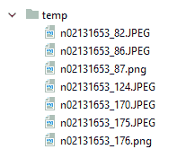
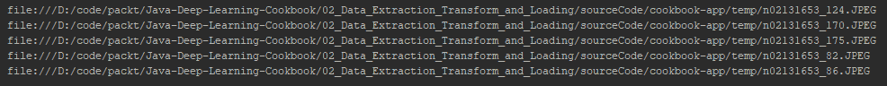
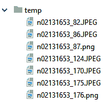
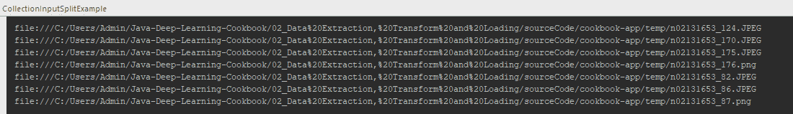
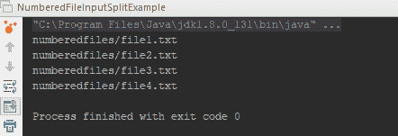
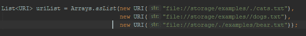
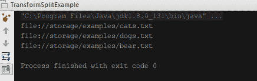
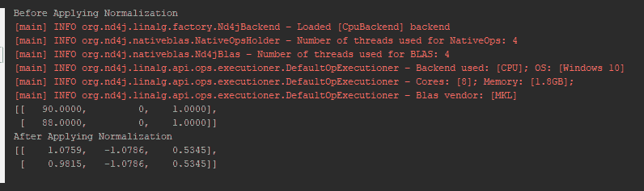

# 第二章：数据提取、转换和加载

让我们讨论任何机器学习难题中最重要的部分：数据预处理和规范化。*垃圾进，垃圾出*是最合适的描述。在这种情况下，我们让更多噪声通过，就会得到更多不希望的输出。因此，你需要在去除噪声的同时保持信号。

另一个挑战是处理各种类型的数据。我们需要将原始数据集转换成神经网络可以理解并执行科学计算的适当格式。我们需要将数据转换成数值向量，以便网络能够理解并且可以轻松应用计算。记住，神经网络仅限于一种类型的数据：向量。

需要一种方法来加载数据到神经网络中。我们不能一次性将 100 万条数据记录放入神经网络——那样会降低性能。这里提到的性能是指训练时间。为了提高性能，我们需要利用数据管道、批量训练以及其他采样技术。

**DataVec**是一个输入/输出格式系统，能够管理我们刚刚提到的所有内容。它解决了每个深度学习难题所带来的最大头疼问题。**DataVec**支持所有类型的输入数据，如文本、图像、CSV 文件和视频。**DataVec**库在 DL4J 中管理数据管道。

在本章中，我们将学习如何使用**DataVec**执行 ETL 操作。这是构建 DL4J 神经网络的第一步。

在本章中，我们将介绍以下配方：

+   读取和遍历数据

+   执行模式转换

+   序列化转换

+   构建转换过程

+   执行转换过程

+   为了提高网络效率对数据进行规范化

# 技术要求

本章将讨论的用例的具体实现可以在[`github.com/PacktPublishing/Java-Deep-Learning-Cookbook/tree/master/02_Data_Extraction_Transform_and_Loading/sourceCode/cookbook-app/src/main/java/com/javadeeplearningcookbook/app`](https://github.com/PacktPublishing/Java-Deep-Learning-Cookbook/tree/master/02_Data_Extraction_Transform_and_Loading/sourceCode/cookbook-app/src/main/java/com/javadeeplearningcookbook/app)找到。

克隆我们的 GitHub 仓库后，导航到`Java-Deep-Learning-Cookbook/02_Data_Extraction_Transform_and_Loading/sourceCode`目录。然后，将`cookbook-app`项目作为 Maven 项目导入，方法是导入`cookbook-app`目录中的`pom.xml`文件。

本章所需的数据集位于`Chapter02`根目录下（`Java-Deep-Learning-Cookbook/02_Data_Extraction_Transform_and_Loading/`）。你可以将其保存在不同的位置，例如你的本地目录，并在源代码中相应地引用。

# 读取和遍历数据

ETL 是神经网络训练中的一个重要阶段，因为它涉及到数据。在我们进行神经网络设计之前，数据的提取、转换和加载需要得到解决。糟糕的数据比效率较低的神经网络更糟糕。我们需要对以下几个方面有一个基本的了解：

+   你尝试处理的数据类型

+   文件处理策略

在这个配方中，我们将展示如何使用 DataVec 读取和迭代数据。

# 准备工作

作为前提，确保在`pom.xml`文件中已添加所需的 Maven 依赖项，用于 DataVec，正如我们在上一章中提到的，*配置 Maven 以支持 DL4J*的配方。

以下是示例`pom.xml`文件：[`github.com/rahul-raj/Java-Deep-Learning-Cookbook/blob/master/02_Data_Extraction_Transform_and_Loading/sourceCode/cookbook-app/pom.xml`](https://github.com/rahul-raj/Java-Deep-Learning-Cookbook/blob/master/02_Data_Extraction_Transform_and_Loading/sourceCode/cookbook-app/pom.xml)。

# 如何操作...

1.  使用**`FileSplit`**管理一系列记录：

```py
String[] allowedFormats=new String[]{".JPEG"};
 FileSplit fileSplit = new FileSplit(new File("temp"), allowedFormats,true)

```

您可以在[`github.com/PacktPublishing/Java-Deep-Learning-Cookbook/blob/master/02_Data%20Extraction%2C%20Transform%20and%20Loading/sourceCode/cookbook-app/src/main/java/com/javadeeplearningcookbook/app/FileSplitExample.java`](https://github.com/PacktPublishing/Java-Deep-Learning-Cookbook/blob/master/02_Data_Extraction_Transform_and_Loading/sourceCode/cookbook-app/src/main/java/com/javadeeplearningcookbook/app/FileSplitExample.java)找到`FileSplit`示例。

1.  使用**`CollectionInputSplit`**管理从文件中的 URI 集合：

```py
FileSplit fileSplit = new FileSplit(new File("temp"));
 CollectionInputSplit collectionInputSplit = new CollectionInputSplit(fileSplit.locations());
```

您可以在[`github.com/PacktPublishing/Java-Deep-Learning-Cookbook/blob/master/02_Data%20Extraction%2C%20Transform%20and%20Loading/sourceCode/cookbook-app/src/main/java/com/javadeeplearningcookbook/app/CollectionInputSplitExample.java`](https://github.com/PacktPublishing/Java-Deep-Learning-Cookbook/blob/master/02_Data_Extraction_Transform_and_Loading/sourceCode/cookbook-app/src/main/java/com/javadeeplearningcookbook/app/CollectionInputSplitExample.java)找到`CollectionInputSplit`示例。

1.  使用**`NumberedFileInputSplit`**来管理带有编号文件格式的数据：

```py
NumberedFileInputSplit numberedFileInputSplit = new NumberedFileInputSplit("numberedfiles/file%d.txt",1,4);
 numberedFileInputSplit.locationsIterator().forEachRemaining(System.out::println);
```

你可以在[`github.com/PacktPublishing/Java-Deep-Learning-Cookbook/blob/master/02_Data%20Extraction%2C%20Transform%20and%20Loading/sourceCode/cookbook-app/src/main/java/com/javadeeplearningcookbook/app/NumberedFileInputSplitExample.java`](https://github.com/PacktPublishing/Java-Deep-Learning-Cookbook/blob/master/02_Data_Extraction_Transform_and_Loading/sourceCode/cookbook-app/src/main/java/com/javadeeplearningcookbook/app/NumberedFileInputSplitExample.java)找到`NumberedFileInputSplit`示例。

1.  使用**`TransformSplit`**将输入 URI 映射到不同的输出 URI：

```py
TransformSplit.URITransform uriTransform = URI::normalize;

 List<URI> uriList = Arrays.asList(new URI("file://storage/examples/./cats.txt"),
 new URI("file://storage/examples//dogs.txt"),
 new URI("file://storage/./examples/bear.txt"));

 TransformSplit transformSplit = new TransformSplit(new CollectionInputSplit(uriList),uriTransform);
```

你可以在[`github.com/PacktPublishing/Java-Deep-Learning-Cookbook/blob/master/02_Data%20Extraction%2C%20Transform%20and%20Loading/sourceCode/cookbook-app/src/main/java/com/javadeeplearningcookbook/app/TransformSplitExample.java`](https://github.com/PacktPublishing/Java-Deep-Learning-Cookbook/blob/master/02_Data_Extraction_Transform_and_Loading/sourceCode/cookbook-app/src/main/java/com/javadeeplearningcookbook/app/TransformSplitExample.java)找到`TransformSplit`示例。

1.  使用`TransformSplit`执行 URI 字符串替换：

```py
InputSplit transformSplit = TransformSplit.ofSearchReplace(new CollectionInputSplit(inputFiles),"-in.csv","-out.csv");      
```

1.  使用`CSVRecordReader`提取神经网络的 CSV 数据：

```py
RecordReader reader = new CSVRecordReader(numOfRowsToSkip,deLimiter);
 recordReader.initialize(new FileSplit(file));
```

你可以在[`github.com/PacktPublishing/Java-Deep-Learning-Cookbook/blob/master/02_Data%20Extraction%2C%20Transform%20and%20Loading/sourceCode/cookbook-app/src/main/java/com/javadeeplearningcookbook/app/recordreaderexamples/CSVRecordReaderExample.java`](https://github.com/PacktPublishing/Java-Deep-Learning-Cookbook/blob/master/02_Data_Extraction_Transform_and_Loading/sourceCode/cookbook-app/src/main/java/com/javadeeplearningcookbook/app/recordreaderexamples/CSVRecordReaderExample.java)找到`CSVRecordReader`示例。

数据集可以在[`github.com/PacktPublishing/Java-Deep-Learning-Cookbook/blob/master/02_Data_Extraction_Transform_and_Loading/titanic.csv`](https://github.com/PacktPublishing/Java-Deep-Learning-Cookbook/blob/master/02_Data_Extraction_Transform_and_Loading/titanic.csv)找到。

1.  使用`ImageRecordReader`提取神经网络的图像数据：

```py
ImageRecordReader imageRecordReader = new ImageRecordReader(imageHeight,imageWidth,channels,parentPathLabelGenerator);
imageRecordReader.initialize(trainData,transform);
```

你可以在[`github.com/PacktPublishing/Java-Deep-Learning-Cookbook/blob/master/02_Data%20Extraction%2C%20Transform%20and%20Loading/sourceCode/cookbook-app/src/main/java/com/javadeeplearningcookbook/app/recordreaderexamples/ImageRecordReaderExample.java`](https://github.com/PacktPublishing/Java-Deep-Learning-Cookbook/blob/master/02_Data_Extraction_Transform_and_Loading/sourceCode/cookbook-app/src/main/java/com/javadeeplearningcookbook/app/recordreaderexamples/ImageRecordReaderExample.java)找到`ImageRecordReader`示例。

1.  使用`TransformProcessRecordReader`对数据进行转换和提取：

```py
RecordReader recordReader = new TransformProcessRecordReader(recordReader,transformProcess);
```

你可以在 [`github.com/PacktPublishing/Java-Deep-Learning-Cookbook/blob/master/02_Data_Extraction_Transform_and_Loading/sourceCode/cookbook-app/src/main/java/com/javadeeplearningcookbook/app/recordreaderexamples/TransformProcessRecordReaderExample.java`](https://github.com/PacktPublishing/Java-Deep-Learning-Cookbook/blob/master/02_Data_Extraction_Transform_and_Loading/sourceCode/cookbook-app/src/main/java/com/javadeeplearningcookbook/app/recordreaderexamples/TransformProcessRecordReaderExample.java) 找到 `TransformProcessRecordReader` 的示例。这个示例的数据集可以在 [`github.com/PacktPublishing/Java-Deep-Learning-Cookbook/blob/master/02_Data_Extraction_Transform_and_Loading/transform-data.csv`](https://github.com/PacktPublishing/Java-Deep-Learning-Cookbook/blob/master/02_Data_Extraction_Transform_and_Loading/transform-data.csv) 找到。

1.  使用 `SequenceRecordReader` 和 `CodecRecordReader` 提取序列数据：

```py
RecordReader codecReader = new CodecRecordReader();
 codecReader.initialize(conf,split);
```

你可以在 [`github.com/PacktPublishing/Java-Deep-Learning-Cookbook/blob/master/02_Data%20Extraction%2C%20Transform%20and%20Loading/sourceCode/cookbook-app/src/main/java/com/javadeeplearningcookbook/app/recordreaderexamples/CodecReaderExample.java`](https://github.com/PacktPublishing/Java-Deep-Learning-Cookbook/blob/master/02_Data_Extraction_Transform_and_Loading/sourceCode/cookbook-app/src/main/java/com/javadeeplearningcookbook/app/recordreaderexamples/CodecReaderExample.java) 找到 `CodecRecordReader` 的示例。

下面的代码展示了如何使用 `RegexSequenceRecordReader`：

```py
RecordReader recordReader = new RegexSequenceRecordReader((\d{2}/\d{2}/\d{2}) (\d{2}:\d{2}:\d{2}) ([A-Z]) (.*)",skipNumLines);
 recordReader.initialize(new NumberedFileInputSplit(path/log%d.txt));
```

你可以在 [`github.com/PacktPublishing/Java-Deep-Learning-Cookbook/blob/master/02_Data_Extraction_Transform_and_Loading/sourceCode/cookbook-app/src/main/java/com/javadeeplearningcookbook/app/recordreaderexamples/RegexSequenceRecordReaderExample.java`](https://github.com/PacktPublishing/Java-Deep-Learning-Cookbook/blob/master/02_Data_Extraction_Transform_and_Loading/sourceCode/cookbook-app/src/main/java/com/javadeeplearningcookbook/app/recordreaderexamples/RegexSequenceRecordReaderExample.java) 找到 `RegexSequenceRecordReader` 的示例。

这个数据集可以在 [`github.com/PacktPublishing/Java-Deep-Learning-Cookbook/blob/master/02_Data_Extraction_Transform_and_Loading/logdata.zip`](https://github.com/PacktPublishing/Java-Deep-Learning-Cookbook/blob/master/02_Data_Extraction_Transform_and_Loading/logdata.zip) 找到。

下面的代码展示了如何使用 `CSVSequenceRecordReader`：

```py
CSVSequenceRecordReader seqReader = new CSVSequenceRecordReader(skipNumLines, delimiter);
 seqReader.initialize(new FileSplit(file));
```

你可以在[`github.com/PacktPublishing/Java-Deep-Learning-Cookbook/blob/master/02_Data%20Extraction%2C%20Transform%20and%20Loading/sourceCode/cookbook-app/src/main/java/com/javadeeplearningcookbook/app/recordreaderexamples/SequenceRecordReaderExample.java`](https://github.com/PacktPublishing/Java-Deep-Learning-Cookbook/blob/master/02_Data_Extraction_Transform_and_Loading/sourceCode/cookbook-app/src/main/java/com/javadeeplearningcookbook/app/recordreaderexamples/SequenceRecordReaderExample.java)找到`CSVSequenceRecordReader`的示例。

该数据集可以在[`github.com/PacktPublishing/Java-Deep-Learning-Cookbook/blob/master/02_Data_Extraction_Transform_and_Loading/dataset.zip`](https://github.com/PacktPublishing/Java-Deep-Learning-Cookbook/blob/master/02_Data_Extraction_Transform_and_Loading/dataset.zip)找到。

1.  使用**`` JacksonLineRecordReader`:` ``**提取 JSON/XML/YAML 数据。

```py
RecordReader recordReader = new JacksonLineRecordReader(fieldSelection, new ObjectMapper(new JsonFactory()));
 recordReader.initialize(new FileSplit(new File("json_file.txt")));
```

你可以在[`github.com/PacktPublishing/Java-Deep-Learning-Cookbook/blob/master/02_Data_Extraction_Transform_and_Loading/sourceCode/cookbook-app/src/main/java/com/javadeeplearningcookbook/app/recordreaderexamples/JacksonLineRecordReaderExample.java`](https://github.com/PacktPublishing/Java-Deep-Learning-Cookbook/blob/master/02_Data_Extraction_Transform_and_Loading/sourceCode/cookbook-app/src/main/java/com/javadeeplearningcookbook/app/recordreaderexamples/JacksonLineRecordReaderExample.java)找到`JacksonLineRecordReader`的示例。

该数据集可以在[`github.com/PacktPublishing/Java-Deep-Learning-Cookbook/blob/master/02_Data_Extraction_Transform_and_Loading/irisdata.txt`](https://github.com/PacktPublishing/Java-Deep-Learning-Cookbook/blob/master/02_Data_Extraction_Transform_and_Loading/irisdata.txt)找到。

# 它是如何工作的……

数据可能分布在多个文件、子目录或多个集群中。由于大小等各种限制，我们需要一种机制来以不同的方式提取和处理数据。在分布式环境中，大量数据可能作为块存储在多个集群中。DataVec 为此使用`InputSplit`。

在第 1 步中，我们查看了`FileSplit`，它是一个`InputSplit`的实现，用于将根目录拆分为多个文件。`FileSplit`会递归地查找指定目录位置中的文件。你还可以传递一个字符串数组作为参数，用来表示允许的扩展名：

+   **示例输入**：带有文件的目录位置：



+   **示例输出**：应用过滤器后的 URI 列表：



在示例输出中，我们删除了所有非`.jpeg`格式的文件路径。如果您希望从 URI 列表中提取数据，就像我们在第 2 步中所做的，`CollectionInputSplit`会非常有用。在第 2 步中，`temp`目录中包含了一组文件，我们使用`CollectionInputSplit`从这些文件中生成了一个 URI 列表。虽然`FileSplit`专门用于将目录拆分为文件（即 URI 列表），`CollectionInputSplit`是一个简单的`InputSplit`实现，用于处理 URI 输入集合。如果我们已经有了一个待处理的 URI 列表，那么可以直接使用`CollectionInputSplit`而不是`FileSplit`。

+   **示例输入**：一个包含文件的目录位置。参考以下截图（包含图像文件的目录作为输入）：



+   **示例输出**：一组 URI 列表。参考前面提到的由`CollectionInputSplit`生成的 URI 列表。



在第 3 步中，`NumberedFileInputSplit`根据指定的编号格式生成 URI。

请注意，我们需要传递一个合适的正则表达式模式，以生成顺序格式的文件名。否则，将会抛出运行时错误。正则表达式使我们能够接受各种编号格式的输入。`NumberedFileInputSplit`将生成一个 URI 列表，您可以将其传递到下一级以提取和处理数据。我们在文件名末尾添加了`%d`正则表达式，以指定文件名末尾存在编号。

+   **示例输入**：一个目录位置，里面有以编号命名格式的文件，例如，`file1.txt`、`file2.txt`和`file3.txt`。

+   **示例输出**：一组 URI 列表：



如果您需要将输入 URI 映射到不同的输出 URI，那么您需要`TransformSplit`。我们在第 4 步中使用它来规范化/转换数据 URI 为所需的格式。如果特征和标签存储在不同位置，它将特别有用。当执行第 4 步时，URI 中的`"."`字符串将被去除，从而生成以下 URI：

+   **示例输入**：一组 URI 集合，类似我们在`CollectionInputSplit`中看到的。然而，`TransformSplit`可以接受有错误的 URI：



+   **示例输出**：格式化后的 URI 列表：



执行第 5 步后，URI 中的`-in.csv`子串将被替换为`-out.csv`。

`CSVRecordReader`是一个简单的 CSV 记录读取器，用于流式处理 CSV 数据。我们可以基于分隔符来形成数据流对象，并指定其他各种参数，例如跳过开头若干行。在第 6 步中，我们使用了`CSVRecordReader`来完成这一操作。

对于 `CSVRecordReader` 示例，使用本章 GitHub 仓库中包含的 `titanic.csv` 文件。你需要在代码中更新目录路径才能使用该文件。

`ImageRecordReader` 是一个用于流式传输图像数据的图像记录读取器。

在第 7 步中，我们从本地文件系统中读取图像。然后，我们根据给定的高度、宽度和通道进行缩放和转换。我们还可以指定要标记的图像数据的标签。为了指定图像集的标签，在根目录下创建一个单独的子目录，每个子目录代表一个标签。

在第 7 步中，`ImageRecordReader` 构造函数中的前两个参数代表图像要缩放到的高度和宽度。我们通常为表示 R、G 和 B 的通道给定值 3。`parentPathLabelGenerator` 将定义如何标记图像中的标签。`trainData` 是我们需要的 `inputSplit`，以便指定要加载的记录范围，而 `transform` 是在加载图像时要应用的图像转换。

对于 `ImageRecordReader` 示例，你可以从 `ImageNet` 下载一些示例图像。每个图像类别将由一个子目录表示。例如，你可以下载狗的图像并将它们放在名为 "dog" 的子目录下。你需要提供包含所有可能类别的父目录路径。

ImageNet 网站可以在 [`www.image-net.org/`](http://www.image-net.org/) 上找到。

`TransformProcessRecordReader` 在用于模式转换过程中时需要一些解释。`TransformProcessRecordReader` 是将模式转换应用于记录读取器后的最终产品。这将确保在将数据传入训练之前，已应用定义的转换过程。

在第 8 步中，`transformProcess` 定义了要应用于给定数据集的一系列转换。这可以是去除不需要的特征、特征数据类型转换等。目的是使数据适合神经网络进行进一步处理。在本章接下来的配方中，你将学习如何创建转换过程。

对于 `TransformProcessRecordReader` 示例，使用本章 GitHub 仓库中包含的 `transform-data.csv` 文件。你需要在代码中更新文件路径才能使用该文件。

在第 9 步中，我们查看了 `SequenceRecordReader` 的一些实现。如果我们有一系列记录需要处理，就使用这个记录读取器。这个记录读取器可以在本地以及分布式环境中使用（例如 Spark）。

对于 `SequenceRecordReader` 示例，你需要从本章的 GitHub 仓库中提取 `dataset.zip` 文件。提取后，你将看到两个子目录：`features` 和 `labels`。在每个目录中都有一系列文件。你需要在代码中提供这两个目录的绝对路径。

`CodecRecordReader` 是一个处理多媒体数据集的记录读取器，可以用于以下目的：

+   H.264（AVC）主配置文件解码器

+   MP3 解码器/编码器

+   Apple ProRes 解码器和编码器

+   H264 基线配置文件编码器

+   Matroska (MKV) 解复用器和复用器

+   MP4（ISO BMF，QuickTime）解复用器/复用器和工具

+   MPEG 1/2 解码器

+   MPEG PS/TS 解复用器

+   Java 播放器小程序解析

+   VP8 编码器

+   MXF 解复用器

`CodecRecordReader` 使用 jcodec 作为底层媒体解析器。

对于 `CodecRecordReader` 示例，你需要在代码中提供一个短视频文件的目录位置。这个视频文件将作为 `CodecRecordReader` 示例的输入。

`RegexSequenceRecordReader` 会将整个文件视为一个单独的序列，并逐行读取。然后，它将使用指定的正则表达式拆分每一行。我们可以将 `RegexSequenceRecordReader` 与 `NumberedFileInputSplit` 结合使用来读取文件序列。在第 9 步中，我们使用 `RegexSequenceRecordReader` 来读取随时间步长记录的事务日志（时间序列数据）。在我们的数据集（`logdata.zip`）中，事务日志是无监督数据，没有特征或标签的说明。

对于 `RegexSequenceRecordReader` 示例，你需要从本章的 GitHub 仓库中提取 `logdata.zip` 文件。提取后，你将看到一系列带编号的事务日志文件。你需要在代码中提供提取目录的绝对路径。

`CSVSequenceRecordReader` 以 CSV 格式读取数据序列。每个序列代表一个单独的 CSV 文件。每一行代表一个时间步。

在第 10 步中，`JacksonLineRecordReader` 将逐行读取 JSON/XML/YAML 数据。它期望每行是有效的 JSON 条目，并且行末没有分隔符。这符合 Hadoop 的惯例，确保分割操作在集群环境中正常工作。如果记录跨越多行，分割可能无法按预期工作，并可能导致计算错误。与 `JacksonRecordReader` 不同，`JacksonLineRecordReader` 不会自动创建标签，且需要在训练时指定配置。

对于 `JacksonLineRecordReader` 示例，你需要提供 `irisdata.txt` 文件的目录位置，该文件位于本章的 GitHub 仓库中。在 `irisdata.txt` 文件中，每一行代表一个 JSON 对象。

# 还有更多...

`JacksonRecordReader` 是一个使用 Jackson API 的记录读取器。与 `JacksonLineRecordReader` 类似，它也支持 JSON、XML 和 YAML 格式。对于 `JacksonRecordReader`，用户需要提供一个要从 JSON/XML/YAML 文件中读取的字段列表。这可能看起来很复杂，但它允许我们在以下条件下解析文件：

+   JSON/XML/YAML 数据没有一致的模式。可以使用 `FieldSelection` 对象提供输出字段的顺序。

+   有些文件中缺少某些字段，但可以通过`FieldSelection`对象提供。

`JacksonRecordReader`也可以与`PathLabelGenerator`一起使用，根据文件路径附加标签。

# 执行模式转换

数据转换是一个重要的数据标准化过程。可能会出现坏数据，例如重复项、缺失值、非数字特征等。我们需要通过应用模式转换对其进行标准化，以便数据可以在神经网络中处理。神经网络只能处理数值特征。在这个过程中，我们将展示模式创建的过程。

# 如何操作……

1.  **识别数据中的异常值**：对于一个特征较少的小型数据集，我们可以通过手动检查来发现异常值/噪声。对于特征较多的数据集，我们可以执行**主成分分析**（**PCA**），如以下代码所示：

```py
INDArray factor = org.nd4j.linalg.dimensionalityreduction.PCA.pca_factor(inputFeatures, projectedDimension, normalize);
 INDArray reduced = inputFeatures.mmul(factor);
```

1.  **使用模式来定义数据结构**：以下是一个客户流失数据集的基本模式示例。你可以从[`www.kaggle.com/barelydedicated/bank-customer-churn-modeling/downloads/bank-customer-churn-modeling.zip/1`](https://www.kaggle.com/barelydedicated/bank-customer-churn-modeling/downloads/bank-customer-churn-modeling.zip/1)下载数据集：

```py
  Schema schema = new Schema.Builder()
 .addColumnString("RowNumber")
 .addColumnInteger("CustomerId")
 .addColumnString("Surname")
 .addColumnInteger("CreditScore")
 .addColumnCategorical("Geography",  
  Arrays.asList("France","Germany","Spain"))
 .addColumnCategorical("Gender", Arrays.asList("Male","Female"))
 .addColumnsInteger("Age", "Tenure")
 .addColumnDouble("Balance")
 .addColumnsInteger("NumOfProducts","HasCrCard","IsActiveMember")
 .addColumnDouble("EstimatedSalary")
 .build();
```

# 它是如何工作的……

在我们开始创建模式之前，我们需要检查数据集中的所有特征。然后，我们需要清理所有噪声特征，例如名称，假设它们对生成的结果没有影响。如果某些特征不清楚，只需保留它们并将其包含在模式中。如果你删除了某个本来是有效信号的特征而不自知，那么你将降低神经网络的效率。这个过程就是在第 1 步中移除异常值并保留有效信号（有效特征）。**主成分分析**（**PCA**）将是一个理想的选择，而且 ND4J 中已经实现了该方法。**PCA**类可以在特征数量较多的数据集中执行降维操作，帮助你减少特征数量，从而降低复杂性。减少特征意味着移除无关特征（异常值/噪声）。在第 1 步中，我们通过调用`pca_factor()`并传入以下参数生成了 PCA 因子矩阵：

+   `inputFeatures`：作为矩阵的输入特征

+   `projectedDimension`：从实际特征集中投影的特征数量（例如，从 1000 个特征中选取 100 个重要特征）

+   `normalize`：一个布尔变量（true/false），表示是否对特征进行标准化（零均值）

矩阵乘法通过调用 `mmul()` 方法来执行，最终结果是 `reduced`，这是我们在执行基于 PCA 因子的降维后使用的特征矩阵。请注意，你可能需要使用输入特征（这些特征是通过 PCA 因子生成的）进行多次训练，以理解信号。

在第 2 步中，我们使用了客户流失数据集（这是我们在下一章中使用的简单数据集）来演示 `Schema` 创建过程。模式中提到的数据类型是针对相应的特征或标签。例如，如果你想为整数特征添加模式定义，那么应该使用 `addColumnInteger()`。类似地，还有其他 `Schema` 方法可以用于管理其他数据类型。

类别变量可以使用 `addColumnCategorical()` 添加，正如我们在第 2 步中提到的那样。在这里，我们标记了类别变量并提供了可能的值。即使我们得到了一个被屏蔽的特征集，只要特征按编号格式排列（例如，`column1`、`column2` 等），我们仍然可以构建它们的模式。

# 还有更多...

总的来说，构建数据集模式的步骤如下：

+   充分了解你的数据。识别噪声和信号。

+   捕获特征和标签。识别类别变量。

+   识别可以应用一热编码的类别特征。

+   注意缺失数据或不良数据。

+   使用类型特定的方法，如 `addColumnInteger()` 和 `addColumnsInteger()`，以整数为特征类型。对于其他数据类型，应用相应的 `Builder` 方法。

+   使用 `addColumnCategorical()` 添加类别变量。

+   调用 `build()` 方法来构建模式。

请注意，你不能跳过/忽略数据集中的任何特征，除非在模式中明确指定。你需要从数据集中移除异常特征，从剩余的特征中创建模式，然后继续进行转换过程进行进一步处理。或者，你也可以将所有特征放在一旁，将所有特征保留在模式中，并在转换过程中定义异常值。

在特征工程/数据分析方面，DataVec 提供了自己的分析引擎，用于对特征/目标变量进行数据分析。对于本地执行，我们可以使用 `AnalyzeLocal` 返回一个数据分析对象，该对象包含数据集每一列的信息。以下是如何从记录读取器对象创建数据分析对象的示例：

```py
DataAnalysis analysis = AnalyzeLocal.analyze(mySchema, csvRecordReader);
 System.out.println(analysis);
```

你还可以通过调用 `analyzeQuality()` 来分析数据集中的缺失值，并检查它是否符合模式要求：

```py
DataQualityAnalysis quality = AnalyzeLocal.analyzeQuality(mySchema, csvRecordReader);
 System.out.println(quality);
```

对于序列数据，你需要使用 `analyzeQualitySequence()` 而不是 `analyzeQuality()`。对于 Spark 上的数据分析，你可以使用 `AnalyzeSpark` 工具类来代替 `AnalyzeLocal`。

# 构建转换过程

模式创建后的下一步是通过添加所有所需的转换来定义数据转换过程。我们可以使用`TransformProcess`管理有序的转换列表。在模式创建过程中，我们仅为数据定义了一个包含所有现有特征的结构，实际上并没有执行转换。让我们看看如何将数据集中的特征从非数值格式转换为数值格式。神经网络无法理解原始数据，除非它被映射到数值向量。在这个示例中，我们将根据给定的模式构建一个转换过程。

# 如何做...

1.  将转换列表添加到`TransformProcess`中。考虑以下示例：

```py
TransformProcess transformProcess = new TransformProcess.Builder(schema)
 .removeColumns("RowNumber","CustomerId","Surname")
 .categoricalToInteger("Gender")
 .categoricalToOneHot("Geography")
 .removeColumns("Geography[France]")
 .build();
```

1.  使用`TransformProcessRecordReader`创建一个记录读取器，以提取并转换数据：

```py
TransformProcessRecordReader transformProcessRecordReader = new TransformProcessRecordReader(recordReader,transformProcess);
```

# 它是如何工作的...

在第 1 步中，我们为数据集添加了所有需要的转换。`TransformProcess`定义了我们想要应用于数据集的所有转换的无序列表。我们通过调用`removeColumns()`移除了任何不必要的特征。在模式创建过程中，我们在`Schema`中标记了分类特征。现在，我们可以实际决定需要对特定的分类变量进行什么样的转换。通过调用`categoricalToInteger()`，分类变量可以转换为整数。如果调用`categoricalToOneHot()`，分类变量可以进行独热编码。请注意，模式必须在转换过程之前创建。我们需要模式来创建**`TransformProcess`**。

在第 2 步中，我们借助**`TransformProcessRecordReader`**应用之前添加的转换。我们需要做的就是使用原始数据创建基础记录读取器对象，并将其传递给**`TransformProcessRecordReader`**，同时传递已定义的转换过程。

# 还有更多...

DataVec 允许我们在转换阶段做更多的事情。以下是`TransformProcess`中提供的其他一些重要转换功能：

+   `addConstantColumn()`：在数据集中添加一个新列，列中的所有值都相同，并且与指定的值一致。此方法接受三个属性：新列的名称、新列的类型和该值。

+   `appendStringColumnTransform()`：将一个字符串附加到指定的列中。此方法接受两个属性：要附加的列和要附加的字符串值。

+   `conditionalCopyValueTransform()`：如果满足某个条件，则用另一个列中指定的值替换列中的值。此方法接受三个属性：要替换值的列、要参考值的列和要使用的条件。

+   `conditionalReplaceValueTransform()`: 如果条件满足，则用指定的值替换列中的值。该方法接受三个属性：要替换值的列、用于替换的值以及要使用的条件。

+   `conditionalReplaceValueTransformWithDefault()`: 如果条件满足，则用指定的值替换列中的值。否则，用另一个值填充该列。该方法接受四个属性：要替换值的列、条件满足时使用的值、条件不满足时使用的值，以及要使用的条件。

    我们可以使用 DataVec 中已编写的内置条件进行转换过程或数据清理过程。例如，我们可以使用`NaNColumnCondition`来替换`NaN`值，使用`NullWritableColumnCondition`来替换空值。

+   `stringToTimeTransform()`: 将字符串列转换为时间列。此方法针对在数据集中以字符串/对象形式保存的日期列。该方法接受三个属性：要使用的列名、要遵循的时间格式以及时区。

+   `reorderColumns()`: 使用新定义的顺序重新排列列。我们可以将列名按照指定顺序作为属性提供给此方法。

+   `filter()`: 根据指定的条件定义一个过滤过程。如果满足条件，则移除该示例或序列；否则，保留示例或序列。该方法只接受一个属性，即要应用的条件/过滤器。`filter()`方法在数据清理过程中非常有用。如果我们想要从指定列中移除`NaN`值，可以创建一个过滤器，如下所示：

```py
Filter filter = new ConditionFilter(new NaNColumnCondition("columnName"));

```

如果我们想要从指定列中移除空值，可以创建一个过滤器，如下所示：

```py
Filter filter =  new ConditionFilter(new NullWritableColumnCondition("columnName"));  

```

+   `stringRemoveWhitespaceTransform()`: 此方法从列值中移除空白字符。该方法只接受一个属性，即需要修剪空白的列。

+   `integerMathOp()`: 此方法用于对整数列执行数学运算，使用标量值。类似的方法适用于如`double`和`long`等类型。该方法接受三个属性：要应用数学运算的整数列、数学运算本身以及用于数学运算的标量值。

`TransformProcess`不仅用于数据处理，还可以通过一定的余地来克服内存瓶颈。

请参考 DL4J API 文档，以了解更多强大的 DataVec 特性，帮助你进行数据分析任务。在 `TransformProcess` 中还支持其他有趣的操作，如 `reduce()` 和 `convertToString()`。如果你是数据分析师，那么你应该知道，许多数据归一化策略可以在此阶段应用。你可以参考 [`deeplearning4j.org/docs/latest/datavec-normalization`](https://deeplearning4j.org/docs/latest/datavec-normalization) 了解更多关于可用归一化策略的信息。

# 序列化转换

DataVec 提供了将转换序列化的功能，使其能够在生产环境中移植。在本食谱中，我们将序列化转换过程。

# 如何操作...

1.  将转换序列化为人类可读的格式。我们可以使用 `TransformProcess` 将其转换为 JSON，如下所示：

```py
String serializedTransformString = transformProcess.toJson()
```

我们可以使用 `TransformProcess` 将其转换为 YAML，如下所示：

```py
String serializedTransformString = transformProcess.toYaml()
```

你可以在 [`github.com/PacktPublishing/Java-Deep-Learning-Cookbook/blob/master/02_Data_Extraction_Transform_and_Loading/sourceCode/cookbook-app/src/main/java/com/javadeeplearningcookbook/app/SerializationExample.java`](https://github.com/PacktPublishing/Java-Deep-Learning-Cookbook/blob/master/02_Data_Extraction_Transform_and_Loading/sourceCode/cookbook-app/src/main/java/com/javadeeplearningcookbook/app/SerializationExample.java) 中找到这个示例。

1.  将 JSON 反序列化为 **`TransformProcess`** 如下所示：

```py
TransformProcess tp = TransformProcess.fromJson(serializedTransformString)

```

你也可以像下面这样将 YAML 加载到 `TransformProcess` 中：

```py
TransformProcess tp = TransformProcess.fromYaml(serializedTransformString)
```

# 它是如何工作的...

在步骤 1 中，`toJson()` 将 `TransformProcess` 转换为 JSON 字符串，而 `toYaml()` 将 `TransformProcess` 转换为 YAML 字符串。

这两种方法都可以用于 `TransformProcess` 的序列化。

在步骤 2 中，`fromJson()` 将 JSON 字符串反序列化为 `TransformProcess`，而 `fromYaml()` 将 YAML 字符串反序列化为 `TransformProcess`。

`serializedTransformString` 是需要转换为 `TransformProcess` 的 JSON/YAML 字符串。

本食谱与应用程序迁移到不同平台时相关。

# 执行转换过程

在定义完转换过程之后，我们可以在受控的管道中执行它。它可以通过批处理执行，或者我们可以将任务分配到 Spark 集群中。如果数据集非常庞大，我们无法直接进行数据输入和执行。可以将任务分配到 Spark 集群上处理更大的数据集。你也可以执行常规的本地执行。在本食谱中，我们将讨论如何在本地以及远程执行转换过程。

# 如何操作...

1.  将数据集加载到 **`RecordReader`** 中。在 `CSVRecordReader` 的情况下，加载 CSV 数据：

```py
RecordReader reader = new CSVRecordReader(0,',');
 reader.initialize(new FileSplit(file)); 

```

1.  使用 `LocalTransformExecutor` 在本地执行转换：

```py
List<List<Writable>> transformed = LocalTransformExecutor.execute(recordReader, transformProcess)
```

1.  使用`SparkTransformExecutor`在 Spark 中执行转换：

```py
JavaRDD<List<Writable>> transformed = SparkTransformExecutor.execute(inputRdd, transformProcess)
```

# 它是如何工作的...

在步骤 1 中，我们将数据集加载到记录读取器对象中。为了演示，我们使用了`CSVRecordReader`。

在步骤 2 中，只有当`TransformProcess`返回非顺序数据时，才能使用`execute()`方法。对于本地执行，假设你已经将数据集加载到一个`RecordReader`中。

关于`LocalTransformExecutor`的示例，请参考此源文件中的`LocalExecuteExample.java`：

[`github.com/PacktPublishing/Java-Deep-Learning-Cookbook/blob/master/02_Data_Extraction_Transform_and_Loading/sourceCode/cookbook-app/src/main/java/com/javadeeplearningcookbook/app/executorexamples/LocalExecuteExample.java`](https://github.com/PacktPublishing/Java-Deep-Learning-Cookbook/blob/master/02_Data_Extraction_Transform_and_Loading/sourceCode/cookbook-app/src/main/java/com/javadeeplearningcookbook/app/executorexamples/LocalExecuteExample.java)。

对于`LocalTransformExecutor`示例，你需要提供`titanic.csv`的文件路径。它位于本章的 GitHub 目录中。

在步骤 3 中，假设你已经将数据集加载到一个 JavaRDD 对象中，因为我们需要在 Spark 集群中执行 DataVec 转换过程。此外，只有当`TransformProcess`返回非顺序数据时，才可以使用`execute()`方法。

# 还有更多...

如果`TransformProcess`返回顺序数据，则应使用`executeSequence()`方法：

```py
List<List<List<Writable>>> transformed = LocalTransformExecutor.executeSequence(sequenceRecordReader, transformProcess)

```

如果你需要根据`joinCondition`将两个记录读取器连接起来，则需要使用`executeJoin()`方法：

```py
List<List<Writable>> transformed = LocalTransformExecutor.executeJoin(joinCondition, leftReader, rightReader) 

```

以下是本地/Spark 执行器方法的概述：

+   `execute()`: 这个方法将转换应用于记录读取器。`LocalTransformExecutor`将记录读取器作为输入，而`SparkTransformExecutor`则需要将输入数据加载到一个 JavaRDD 对象中。这不能用于顺序数据。

+   `executeSequence()`: 这个方法将转换应用于一个序列读取器。然而，转换过程应该从非顺序数据开始，然后将其转换为顺序数据。

+   `executeJoin()`: 这个方法用于根据`joinCondition`将两个不同的输入读取器连接起来。

+   `executeSequenceToSeparate()`: 这个方法将转换应用于一个序列读取器。然而，转换过程应该从顺序数据开始，并返回非顺序数据。

+   `executeSequenceToSequence()`: 这个方法将转换应用于一个序列读取器。然而，转换过程应该从顺序数据开始，并返回顺序数据。

# 为了提高网络效率对数据进行归一化处理

归一化使得神经网络的工作变得更容易。它帮助神经网络将所有特征平等对待，无论它们的数值范围如何。归一化的主要目标是将数据集中的数值安排在一个共同的尺度上，同时不会干扰数值范围之间的差异。并不是所有数据集都需要归一化策略，但如果它们的数值范围不同，那么对数据进行归一化是一个关键步骤。归一化对模型的稳定性/准确性有直接影响。ND4J 提供了多种预处理器来处理归一化。在这个示例中，我们将对数据进行归一化。

# 如何实现...

1.  从数据中创建数据集迭代器。请参考以下 `RecordReaderDataSetIterator` 的演示：

```py
DataSetIterator iterator = new RecordReaderDataSetIterator(recordReader,batchSize);

```

1.  通过调用归一化实现的 `fit()` 方法来对数据集应用归一化。请参考以下 `NormalizerStandardize` 预处理器的演示：

```py
DataNormalization dataNormalization = new NormalizerStandardize();
dataNormalization.fit(iterator);
```

1.  调用 `setPreprocessor()` 设置数据集的预处理器：

```py
iterator.setPreProcessor(dataNormalization);
```

# 其工作原理...

首先，你需要有一个迭代器来遍历和准备数据。在第 1 步中，我们使用记录读取器数据创建了数据集迭代器。迭代器的目的是更好地控制数据以及如何将其呈现给神经网络。

一旦确定了合适的归一化方法（在第 2 步中选择了 `NormalizerStandardize`），我们使用 `fit()` 方法将归一化应用到数据集。`NormalizerStandardize` 会将数据归一化，使得特征值具有零均值和标准差为 1。

本示例的代码可以在 [`github.com/PacktPublishing/Java-Deep-Learning-Cookbook/blob/master/02_Data_Extraction_Transform_and_Loading/sourceCode/cookbook-app/src/main/java/com/javadeeplearningcookbook/app/NormalizationExample.java`](https://github.com/PacktPublishing/Java-Deep-Learning-Cookbook/blob/master/02_Data_Extraction_Transform_and_Loading/sourceCode/cookbook-app/src/main/java/com/javadeeplearningcookbook/app/NormalizationExample.java) 找到。

+   **示例输入**：包含特征变量的数据集迭代器（`INDArray` 格式）。迭代器是根据前面示例中提到的输入数据创建的。

+   **示例输出**：请参考以下快照，查看对输入数据应用归一化后的标准化特征（`INDArray` 格式）：



请注意，在应用归一化时，不能跳过第 3 步。如果不执行第 3 步，数据集将不会自动归一化。

# 还有更多内容...

预处理器通常具有默认的范围限制，从 `0` 到 `1`。如果你没有对数值范围较大的数据集应用归一化（当特征值过低或过高时），神经网络将倾向于偏向那些数值较高的特征值。因此，神经网络的准确性可能会大幅降低。

如果值分布在对称区间内，例如（`0`，`1`），则在训练过程中，所有特征值都被认为是等价的。因此，它也会影响神经网络的泛化能力。

以下是 ND4J 提供的预处理器：

+   `NormalizerStandardize`：一个用于数据集的预处理器，它将特征值归一化，使其具有*零*均值和标准差为 1。

+   `MultiNormalizerStandardize`：一个用于多数据集的预处理器，它将特征值归一化，使其具有零均值和标准差为 1。

+   `NormalizerMinMaxScaler`：一个用于数据集的预处理器，它将特征值归一化，使其位于指定的最小值和最大值之间。默认范围是从 0 到 1。

+   `MultiNormalizerMinMaxScaler`：一个用于多数据集的预处理器，它将特征值归一化，使其位于指定的最小值和最大值之间。默认范围是从 0 到 1。

+   `ImagePreProcessingScaler`：一个用于图像的预处理器，具有最小和最大缩放。默认范围是（`miRange`，`maxRange`）–（`0`，`1`）。

+   `VGG16ImagePreProcessor`：一个专门针对 VGG16 网络架构的预处理器。它计算均值 RGB 值，并将其从训练集中的每个像素值中减去。
