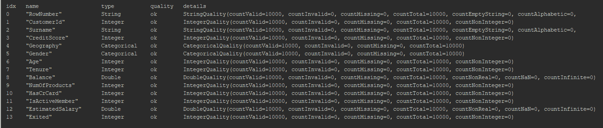
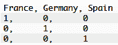

# 第三章：构建用于二分类的深度神经网络

在本章中，我们将使用标准的前馈网络架构开发一个**深度神经网络**（**DNN**）。在我们逐步完成各个配方的过程中，我们会不断向应用程序添加组件和修改内容。如果你还没有阅读过，第一章，*Java 深度学习简介*，以及第二章，*数据提取、转换和加载*，请确保回顾这些内容。这有助于更好地理解本章中的配方。

我们将以客户保持预测为例，演示标准的前馈网络。这是一个至关重要的现实问题，每个企业都希望解决。企业希望在满意的客户身上投入更多资源，因为这些客户往往会成为长期客户。与此同时，预测流失客户有助于企业更加专注于做出能阻止客户流失的决策。

请记住，前馈网络实际上并不能提供有关决策结果的特征提示。它只会预测客户是否继续支持该组织。实际的特征信号是隐藏的，由神经网络来决定。如果你想记录那些控制预测结果的实际特征信号，可以使用自编码器来完成此任务。接下来，让我们来看一下如何为我们上述的用例构建一个前馈网络。

在本章中，我们将涵盖以下内容：

+   从 CSV 输入提取数据

+   从数据中删除异常值

+   对数据应用变换

+   为神经网络模型设计输入层

+   为神经网络模型设计隐藏层

+   为神经网络模型设计输出层

+   对 CSV 数据进行神经网络模型的训练和评估

+   部署神经网络模型并将其用作 API

# 技术要求

确保满足以下要求：

+   JDK 8 已安装并添加到 `PATH`。源代码需要 JDK 8 来执行。

+   Maven 已安装并添加到 `PATH`。我们稍后将使用 Maven 构建应用程序的 JAR 文件。

本章讨论的具体用例（客户保持预测）的实现可以在[`github.com/PacktPublishing/Java-Deep-Learning-Cookbook/blob/master/03_Building_Deep_Neural_Networks_for_Binary_classification/sourceCode/cookbookapp/src/main/java/com/javadeeplearningcookbook/examples/CustomerRetentionPredictionExample.java`](https://github.com/PacktPublishing/Java-Deep-Learning-Cookbook/blob/master/03_Building_Deep_Neural_Networks_for_Binary_classification/sourceCode/cookbookapp/src/main/java/com/javadeeplearningcookbook/examples/CustomerRetentionPredictionExample.java)找到。

克隆我们的 GitHub 仓库后，导航到 `Java-Deep-Learning-Cookbook/03_Building_Deep_Neural_Networks_for_Binary_classification/sourceCode` 目录。然后，通过导入 `pom.xml` 将 `cookbookapp` 项目作为 Maven 项目导入到你的 IDE 中。

数据集已包含在 `cookbookapp` 项目的 `resources` 目录中（`Churn_Modelling.csv`）。

然而，数据集可以在 [`www.kaggle.com/barelydedicated/bank-customer-churn-modeling/downloads/bank-customer-churn-modeling.zip/1`](https://www.kaggle.com/barelydedicated/bank-customer-churn-modeling/downloads/bank-customer-churn-modeling.zip/1) 下载。

# 从 CSV 输入中提取数据

**ETL**（即**提取、转换和加载**的缩写）是网络训练之前的第一阶段。客户流失数据是 CSV 格式的。我们需要提取它，并将其放入记录读取对象中以进一步处理。在这个食谱中，我们从 CSV 文件中提取数据。

# 如何操作...

1.  创建 `CSVRecordReader` 来保存客户流失数据：

```py
RecordReader recordReader = new CSVRecordReader(1,',');
```

1.  向 `CSVRecordReader` 添加数据：

```py
File file = new File("Churn_Modelling.csv");
   recordReader.initialize(new FileSplit(file)); 
```

# 它是如何工作的...

来自数据集的 CSV 数据有 14 个特征。每一行代表一个客户/记录，如下图所示：


我们的数据集是一个包含 10,000 条客户记录的 CSV 文件，其中每条记录都有标签，指示客户是否离开了业务。第 0 至第 13 列表示输入特征。第 14^(列)，`Exited`，表示标签或预测结果。我们正在处理一个监督学习模型，每个预测都被标记为 `0` 或 `1`，其中 `0` 表示满意的客户，`1` 表示已离开的不满意客户。数据集的第一行仅为特征标签，在处理数据时我们不需要这些标签。因此，我们在第 1 步中创建记录读取器实例时跳过了第一行。在第 1 步中，`1` 是需要跳过的行数。此外，我们提到了逗号分隔符（`,`），因为我们使用的是 CSV 文件。在第 2 步中，我们使用了 `FileSplit` 来指定客户流失数据集文件。我们还可以使用其他 `InputSplit` 实现来处理多个数据集文件，如 `CollectionInputSplit`、`NumberedFileInputSplit` 等。

# 从数据中移除异常值

对于监督数据集，手动检查对于特征较少的数据集效果很好。随着特征数量的增加，手动检查变得不切实际。我们需要执行特征选择技术，如卡方检验、随机森林等，来处理大量特征。我们还可以使用自编码器来缩小相关特征的范围。记住，每个特征都应该对预测结果有公平的贡献。因此，我们需要从原始数据集中移除噪声特征，并保持其他所有内容，包括任何不确定的特征。在这个食谱中，我们将演示识别数据中异常值的步骤。

# 如何操作...

1.  在训练神经网络之前，排除所有噪声特征。请在模式转换阶段移除噪声特征：

```py
TransformProcess transformProcess = new TransformProcess.Builder(schema)
 .removeColumns("RowNumber","CustomerId","Surname")
 .build();    
```

1.  使用 DataVec 分析 API 识别缺失值：

```py
DataQualityAnalysis analysis = AnalyzeLocal.analyzeQuality(schema,recordReader);
 System.out.println(analysis); 
```

1.  使用模式转换移除空值：

```py
Condition condition = new NullWritableColumnCondition("columnName");
 TransformProcess transformProcess = new TransformProcess.Builder(schema)
   .conditionalReplaceValueTransform("columnName",new IntWritable(0),condition)
 .build();
```

1.  使用模式转换移除 NaN 值：

```py
Condition condition = new NaNColumnCondition("columnName");
 TransformProcess transformProcess = new TransformProcess.Builder(schema)
   .conditionalReplaceValueTransform("columnName",new IntWritable(0),condition)
 .build();
```

# 它是如何工作的...

如果您还记得我们的客户流失数据集，它包含 14 个特征：


执行第 1 步后，您将剩下 11 个有效特征。以下标记的特征对预测结果没有任何意义。例如，客户的名字并不会影响客户是否会离开公司。


在上述截图中，我们标出了不需要用于训练的特征。这些特征可以从数据集中删除，因为它们对结果没有影响。

在第 1 步中，我们使用`removeColumns()`方法在模式转换过程中标记了数据集中的噪声特征（`RowNumber`、`Customerid`和`Surname`）以供移除。

本章使用的客户流失数据集只有 14 个特征。而且，这些特征标签是有意义的。因此，手动检查已经足够了。如果特征数量较多，您可能需要考虑使用**PCA**（即**主成分分析**），正如上一章所解释的那样。

在第 2 步中，我们使用了`AnalyzeLocal`工具类，通过调用`analyzeQuality()`方法来查找数据集中的缺失值。当您打印出`DataQualityAnalysis`对象中的信息时，应该看到以下结果：



如您在前面的截图中所见，每个特征都对其质量进行了分析（以无效/缺失数据为标准），并显示了计数，以便我们判断是否需要进一步标准化。由于所有特征看起来都正常，我们可以继续进行下一步。

处理缺失值有两种方法。要么删除整个记录，要么用一个值替代。在大多数情况下，我们不会删除记录，而是用一个值来表示缺失。在转换过程中，我们可以使用`conditionalReplaceValueTransform()`或`conditionalReplaceValueTransformWithDefault()`来进行此操作。在第 3/4 步中，我们从数据集中移除了缺失或无效值。请注意，特征需要事先已知。我们不能检查所有特征以完成此操作。目前，DataVec 不支持此功能。您可以执行第 2 步来识别需要注意的特征。

# 还有更多内容...

我们在本章前面讨论了如何使用`AnalyzeLocal`工具类找出缺失值。我们还可以使用`AnalyzeLocal`执行扩展的数据分析。我们可以创建一个数据分析对象，包含数据集中每一列的信息。通过调用`analyze()`可以创建该对象，正如我们在前一章中讨论的那样。如果你尝试打印出数据分析对象的信息，它将如下所示：


它将计算数据集中所有特征的标准差、均值以及最小/最大值。同时，还会计算特征的数量，这对于识别特征中的缺失或无效值非常有帮助。


上面两个截图显示的是通过调用`analyze()`方法返回的数据分析结果。对于客户流失数据集，我们应该有 10,000 个特征总数，因为数据集中的记录总数为 10,000。

# 对数据应用转换

数据转换是一个至关重要的数据标准化过程，必须在将数据输入神经网络之前完成。我们需要将非数值特征转换为数值，并处理缺失值。在本食谱中，我们将执行模式转换，并在转换后创建数据集迭代器。

# 如何做...

1.  将特征和标签添加到模式中：

```py
Schema.Builder schemaBuilder = new Schema.Builder();
 schemaBuilder.addColumnString("RowNumber")
 schemaBuilder.addColumnInteger("CustomerId")
 schemaBuilder.addColumnString("Surname")
 schemaBuilder.addColumnInteger("CreditScore");
```

1.  识别并将分类特征添加到模式中：

```py
schemaBuilder.addColumnCategorical("Geography", Arrays.asList("France","Germany","Spain"))
 schemaBuilder.addColumnCategorical("Gender", Arrays.asList("Male","Female"));
```

1.  从数据集中移除噪声特征：

```py
Schema schema = schemaBuilder.build();
 TransformProcess.Builder transformProcessBuilder = new TransformProcess.Builder(schema);
 transformProcessBuilder.removeColumns("RowNumber","CustomerId","Surname");
```

1.  转换分类变量：

```py
transformProcessBuilder.categoricalToInteger("Gender");
```

1.  通过调用`categoricalToOneHot()`应用独热编码：

```py
transformProcessBuilder.categoricalToInteger("Gender")
 transformProcessBuilder.categoricalToOneHot("Geography");

```

1.  通过调用`removeColumns()`移除`Geography`特征的相关依赖：

```py
transformProcessBuilder.removeColumns("Geography[France]")
```

在这里，我们选择了`France`作为相关变量。

1.  使用`TransformProcessRecordReader`提取数据并应用转换：

```py
TransformProcess transformProcess = transformProcessBuilder.build();
 TransformProcessRecordReader transformProcessRecordReader = new TransformProcessRecordReader(recordReader,transformProcess);
```

1.  创建数据集迭代器以进行训练/测试：

```py
DataSetIterator dataSetIterator = new RecordReaderDataSetIterator.Builder(transformProcessRecordReader,batchSize) .classification(labelIndex,numClasses)
 .build();
```

1.  规范化数据集：

```py
DataNormalization dataNormalization = new NormalizerStandardize();
 dataNormalization.fit(dataSetIterator);
 dataSetIterator.setPreProcessor(dataNormalization);
```

1.  将主数据集迭代器拆分为训练和测试迭代器：

```py
DataSetIteratorSplitter dataSetIteratorSplitter = new DataSetIteratorSplitter(dataSetIterator,totalNoOfBatches,ratio);
```

1.  从`DataSetIteratorSplitter`生成训练/测试迭代器：

```py
DataSetIterator trainIterator = dataSetIteratorSplitter.getTrainIterator();
 DataSetIterator testIterator = dataSetIteratorSplitter.getTestIterator();

```

# 它是如何工作的...

所有特征和标签需要按照第 1 步和第 2 步中提到的添加到模式中。如果我们没有这么做，DataVec 将在数据提取/加载时抛出运行时错误。


在前面的截图中，运行时异常是由于 DataVec 引发的，原因是特征数量不匹配。如果我们为输入神经元提供的值与数据集中的实际特征数量不一致，就会发生这种情况。

从错误描述中可以看出，我们仅在模式中添加了 13 个特征，这导致在执行过程中发生了运行时错误。前三个特征，分别为`Rownumber`、`Customerid`和`Surname`，需要添加到模式中。请注意，尽管我们发现它们是噪声特征，但仍需要在模式中标记这些特征。你也可以手动从数据集中删除这些特征。如果你这么做，就不需要在模式中添加它们，因此也无需在转换阶段处理它们。

对于大型数据集，除非分析结果将其识别为噪声，否则可以将数据集中的所有特征添加到模式中。同样，我们需要将其他特征变量如`Age`、`Tenure`、`Balance`、`NumOfProducts`、`HasCrCard`、`IsActiveMember`、`EstimatedSalary`和`Exited`添加到模式中。添加它们时，请注意变量类型。例如，`Balance`和`EstimatedSalary`具有浮动点精度，因此考虑将它们的数据类型设为 double，并使用`addColumnDouble()`将它们添加到模式中。

我们有两个特征，分别为 gender 和 geography，需要特别处理。这两个特征是非数字型的，它们的特征值表示类别值，而不是数据集中其他字段的数值。任何非数字特征都需要转换为数值，以便神经网络能够对特征值进行统计计算。在步骤 2 中，我们使用`addColumnCategorical()`将类别变量添加到模式中。我们需要在列表中指定类别值，`addColumnCategorical()`将基于指定的特征值标记整数值。例如，类别变量`Gender`中的`Male`和`Female`值将分别被标记为`0`和`1`。在步骤 2 中，我们将类别变量的可能值添加到列表中。如果数据集中有其他未知类别值（与模式中提到的值不同），DataVec 将在执行过程中抛出错误。

在步骤 3 中，我们通过调用`removeColumns()`标记了需要在转换过程中移除的噪声特征。

在步骤 4 中，我们对`Geography`类别变量进行了独热编码。

`Geography`有三个分类值，因此在转换后它将采用 0、1 和 2 的值。转换非数值型值的理想方式是将它们转换为零（0）和一（1）的值。这将显著减轻神经网络的负担。此外，普通的整数编码仅在变量之间存在序数关系时适用。这里的风险在于，我们假设变量之间存在自然的顺序关系。这种假设可能会导致神经网络出现不可预测的行为。因此，我们在第 6 步中删除了相关变量。为了演示，我们在第 6 步中选择了`France`作为相关变量。但你可以从三个分类值中选择任何一个。这是为了消除任何影响神经网络性能和稳定性的相关性依赖。第 6 步后，`Geography`特征的最终模式将如下所示：



在第 8 步中，我们从记录读取器对象创建了数据集迭代器。以下是`RecordReaderDataSetIterator`构建方法的属性及其各自的作用：

+   `labelIndex`：在 CSV 数据中标签（结果）所在的索引位置。

+   `numClasses`：数据集中标签（结果）的数量。

+   `batchSize`：通过神经网络的数据块。如果你指定了批量大小为 10 且有 10,000 条记录，那么将会有 1,000 个批次，每个批次包含 10 条记录。

此外，我们这里有一个二分类问题，因此我们使用了`classification()`方法来指定标签索引和标签数量。

对于数据集中的某些特征，你可能会观察到特征值范围之间的巨大差异。有些特征的数值较小，而有些特征的数值非常大。这些大/小数值可能会被神经网络误解。神经网络可能会错误地为这些特征分配高/低优先级，从而导致错误或波动的预测。为了避免这种情况，我们必须在将数据集输入到神经网络之前对其进行归一化。因此，我们在第 9 步中执行了归一化操作。

在第 10 步中，我们使用`DataSetIteratorSplitter`将主数据集拆分用于训练或测试。

以下是`DataSetIteratorSplitter`的参数：

+   `totalNoOfBatches`：如果你指定了 10 的批量大小并且有 10,000 条记录，那么需要指定 1,000 作为批次的总数。

+   `ratio`：这是分割器分割迭代器集的比例。如果你指定 0.8，这意味着 80%的数据将用于训练，剩余的 20%将用于测试/评估。

# 为神经网络模型设计输入层

输入层设计需要理解数据如何流入系统。我们有 CSV 数据作为输入，需要检查特征来决定输入属性。层是神经网络架构的核心组件。在这个示例中，我们将为神经网络配置输入层。

# 准备工作

我们需要在设计输入层之前决定输入神经元的数量。它可以通过特征形状得出。例如，我们有 13 个输入特征（不包括标签）。但在应用变换后，我们的数据集总共有 11 个特征列。噪声特征被移除，类别变量在模式转换过程中被转化。因此，最终的转换数据将有 11 个输入特征。输入层的输出神经元没有特定要求。如果我们为输入层分配错误数量的输入神经元，可能会导致运行时错误：


DL4J 的错误堆栈几乎可以自解释可能的原因。它指明了需要修复的具体层（前面示例中的`layer0`）。

# 如何操作...

1.  使用`MultiLayerConfiguration`定义神经网络配置：

```py
MultiLayerConfiguration.Builder builder = new NeuralNetConfiguration.Builder().weightInit(WeightInit.RELU_UNIFORM)
 .updater(new Adam(0.015D))
 .list();

```

1.  使用`DenseLayer`定义输入层配置：

```py
builder.layer(new DenseLayer.Builder().nIn(incomingConnectionCount).nOut(outgoingConnectionCount).activation(Activation.RELU)
.build())
.build();
```

# 它是如何工作的...

我们通过调用`layer()`方法向网络中添加了层，如步骤 2 所述。输入层通过`DenseLayer`添加*。*此外，我们需要为输入层添加激活函数。我们通过调用`activation()`方法指定激活函数。我们在第一章中讨论了激活函数，*《Java 深度学习简介》*。你可以使用 DL4J 中可用的激活函数之一来设置`activation()`方法。最常用的激活函数是`RELU`。以下是其他方法在层设计中的作用：

+   `nIn()`：这指的是该层的输入数量。对于输入层，它就是输入特征的数量。

+   `nOut()`：这指的是神经网络中到下一个全连接层的输出数量。

# 为神经网络模型设计隐藏层

隐藏层是神经网络的核心。实际的决策过程发生在那里。隐藏层的设计是基于达到某个层次，超过这个层次，神经网络就无法再优化的水平。这个水平可以定义为产生最佳结果的最优隐藏层数量。

隐藏层是神经网络将输入转化为输出层能够使用并进行预测的不同格式的地方。在这个示例中，我们将为神经网络设计隐藏层。

# 如何操作...

1.  确定输入/输出连接。设置如下：

```py
incoming neurons = outgoing neurons from preceding layer.
 outgoing neurons = incoming neurons for the next hidden layer.
```

1.  使用`DenseLayer`配置隐藏层：

```py
builder.layer(new DenseLayer.Builder().nIn(incomingConnectionCount).nOut(outgoingConnectionCount).activation(Activation.RELU).build());

```

# 它是如何工作的...

第一步，如果神经网络只有一个隐藏层，那么隐藏层中的神经元（输入）的数量应该与前一层的输出连接数相同。如果你有多个隐藏层，你还需要确认前一层隐藏层的这一点。

在确保输入层的神经元数量与前一层的输出神经元数量相同后，你可以使用 `DenseLayer` 创建隐藏层。在第二步中，我们使用 `DenseLayer` 为输入层创建了隐藏层。实际上，我们需要多次评估模型，以了解网络的表现。没有一种常规的层配置适用于所有模型。同时，`RELU` 是隐藏层的首选激活函数，因为它具有非线性特性。

# 为神经网络模型设计输出层

输出层设计需要理解期望的输出。我们的输入是 CSV 数据，输出层则依赖于数据集中的标签数量。输出层是根据隐藏层的学习过程形成实际预测的地方。

在这个方案中，我们将为神经网络设计输出层。

# 如何操作……

1.  确定输入/输出连接。设置以下内容：

```py
incoming neurons = outgoing neurons from preceding hidden layer.
 outgoing neurons = number of labels

```

1.  配置神经网络的输出层：

```py
builder.layer(new OutputLayer.Builder(new LossMCXENT(weightsArray)).nIn(incomingConnectionCount).nOut(labelCount).activation(Activation.SOFTMAX).build())
```

# 它是如何工作的……

第一步，我们需要确保前一层的 `nOut()` 与输出层的 `nIn()` 拥有相同数量的神经元。

所以， `incomingConnectionCount` 应该与前一层的 `outgoingConnectionCount` 相同。

我们在第一章《*Java 中的深度学习介绍*》中讨论过 `SOFTMAX` 激活函数。我们的使用案例（客户流失）是二分类模型的一个例子。我们希望得到一个概率性结果，也就是客户被标记为*开心*或*不开心*的概率，其中 `0` 代表开心的客户，`1` 代表不开心的客户。这个概率将被评估，神经网络将在训练过程中自我训练。

输出层的适当激活函数是`SOFTMAX`。这是因为我们需要计算标签发生的概率，而这些概率的总和应该为 1。`SOFTMAX`与对数损失函数一起，对于分类模型能够产生良好的结果。引入`weightsArray`是为了在数据不平衡的情况下强制优先选择某个标签。在步骤 2 中，输出层是通过`OutputLayer`类创建的。唯一的区别是，`OutputLayer`需要一个误差函数来计算预测时的错误率。在我们的例子中，我们使用了`LossMCXENT`，它是一个多类交叉熵误差函数。我们的客户流失示例遵循二分类模型；然而，由于我们的示例中有两个类（标签），因此仍然可以使用此误差函数。在步骤 2 中，`labelCount`将为 2。

# 训练并评估 CSV 数据的神经网络模型

在训练过程中，神经网络学习执行预期任务。对于每次迭代/周期，神经网络都会评估其训练知识。因此，它会通过更新的梯度值重新迭代各个层，以最小化输出层产生的错误。此外，请注意，标签（`0`和`1`）在数据集中并不是均匀分布的。因此，我们可能需要考虑为在数据集中出现较少的标签添加权重。在实际的训练会话开始之前，强烈建议这样做。在这个例子中，我们将训练神经网络并评估结果模型。

# 如何操作……

1.  创建一个数组为较少的标签分配权重：

```py
INDArray weightsArray = Nd4j.create(new double[]{0.35, 0.65});
```

1.  修改`OutPutLayer`以均衡数据集中的标签：

```py
new OutputLayer.Builder(new LossMCXENT(weightsArray)).nIn(incomingConnectionCount).nOut(labelCount).activation(Activation.SOFTMAX))
.build();
```

1.  初始化神经网络并添加训练监听器：

```py
MultiLayerConfiguration configuration = builder.build();
   MultiLayerNetwork multiLayerNetwork = new MultiLayerNetwork(configuration);
 multiLayerNetwork.init();
 multiLayerNetwork.setListeners(new ScoreIterationListener(iterationCount));
```

1.  添加 DL4J UI Maven 依赖项以分析训练过程：

```py
<dependency>
 <groupId>org.deeplearning4j</groupId>
 <artifactId>deeplearning4j-ui_2.10</artifactId>
 <version>1.0.0-beta3</version>
 </dependency>
```

1.  启动 UI 服务器并添加临时存储来存储模型信息：

```py
UIServer uiServer = UIServer.getInstance();
 StatsStorage statsStorage = new InMemoryStatsStorage();
```

用`FileStatsStorage`替换`InMemoryStatsStorage`（以应对内存限制）：

```py
multiLayerNetwork.setListeners(new ScoreIterationListener(100),
 new StatsListener(statsStorage));
```

1.  为 UI 服务器分配临时存储空间：

```py
uiServer.attach(statsStorage);
```

1.  通过调用`fit()`训练神经网络：

```py
multiLayerNetwork.fit(dataSetIteratorSplitter.getTrainIterator(),100);
```

1.  通过调用`evaluate()`来评估模型：

```py
Evaluation evaluation = multiLayerNetwork.evaluate(dataSetIteratorSplitter.getTestIterator(),Arrays.asList("0","1"));
 System.out.println(evaluation.stats()); //printing the evaluation metrics
```

# 它是如何工作的……

当神经网络提高其泛化能力时，它的效率会增加。神经网络不应该仅仅记住特定标签的决策过程。如果它这么做了，我们的结果将会有偏差并且是错误的。因此，最好使用标签均匀分布的数据集。如果标签不是均匀分布的，那么在计算错误率时我们可能需要调整一些东西。为此，我们在步骤 1 中引入了`weightsArray`，并在步骤 2 中将其添加到`OutputLayer`。

对于 `weightsArray = {0.35, 0.65}`，网络更优先考虑 `1`（客户不满意）的结果。如本章前面讨论的，`Exited` 列代表标签。如果我们观察数据集，很明显标签为 `0`（客户满意）的结果比 `1` 的记录更多。因此，我们需要给 `1` 分配额外的优先级，以便平衡数据集。否则，神经网络可能会过拟合，并且会偏向 `1` 标签。

在步骤 3 中，我们添加了 `ScoreIterationListener` 来记录训练过程的日志。请注意，`iterationCount` 是记录网络得分的迭代次数。记住，`iterationCount` 不是**周期**。我们说一个周期已经完成，当整个数据集已经通过神经网络前后传递一次（反向传播）。

在步骤 8 中，我们使用 `dataSetIteratorSplitter` 获取训练数据集的迭代器，并在其上训练我们的模型。如果你正确配置了日志记录器，你应该能够看到训练实例正在按以下方式进展：


截图中的得分并不是成功率，而是通过误差函数为每次迭代计算的误差率。

我们在步骤 4、5 和 6 中配置了 DL4J **用户界面** (**UI**)。DL4J 提供了一个 UI，可以在浏览器中可视化当前网络状态和训练进度（实时监控）。这将有助于进一步调优神经网络的训练。`StatsListener` 负责在训练开始时触发 UI 监控。UI 服务器的端口号为 `9000`。在训练进行时，可以访问 `localhost:9000` 以查看内容。我们应该能够看到如下内容：


我们可以参考**概览**部分中看到的第一张图来进行模型得分分析。图表中的 `x` 轴表示**迭代次数**，`y` 轴表示**模型得分**。

我们还可以进一步扩展研究，查看训练过程中**激活值**、**梯度**和**更新**参数的表现，可以通过检查图表中绘制的参数值来完成：


图表中的 `x` 轴都表示迭代次数，`y` 轴在参数更新图表中表示参数更新比率，而在激活/梯度图表中则表示标准差。

也可以进行逐层分析。我们只需点击左侧边栏中的**模型**标签，并选择所需的层进行进一步分析：


要分析内存消耗和 JVM 使用情况，我们可以在左侧边栏导航到**系统**标签：


我们也可以在同一位置详细查看硬件/软件的指标：


这对于基准测试也非常有用。正如我们所见，神经网络的内存消耗被明确标出，JVM/堆外内存消耗也在 UI 中提到，以分析基准测试的执行情况。

第 8 步后，评估结果将在控制台上显示：


在上述截图中，控制台显示了评估模型的各种评估指标。我们不能在所有情况下仅依赖某一特定指标，因此，评估模型时最好考虑多个指标。

我们的模型目前的准确率为 85.75%。我们有四个不同的性能指标，分别是准确率、精确率、召回率和 F1 得分。正如你在前面的截图中看到的，召回率指标不太理想，这意味着我们的模型仍然有假阴性案例。F1 得分在这里也很重要，因为我们的数据集具有不均衡的输出类别比例。我们不会详细讨论这些指标，因为它们超出了本书的范围。只要记住，所有这些指标都很重要，不能仅仅依赖准确率。当然，评估的权衡取决于具体问题。当前的代码已经经过优化，因此你会发现评估指标的准确率几乎稳定。对于一个训练良好的网络模型，这些性能指标的值将接近`1`。

检查我们评估指标的稳定性非常重要。如果我们注意到对于未见数据评估指标不稳定，那么我们需要重新考虑网络配置的变化。

输出层的激活函数对输出的稳定性有影响。因此，充分理解输出要求肯定会在选择合适的输出函数（损失函数）时节省大量时间。我们需要确保神经网络具有稳定的预测能力。

# 还有更多内容...

学习率是决定神经网络效率的因素之一。高学习率会使输出偏离实际值，而低学习率则会导致由于收敛慢而学习过程缓慢。神经网络的效率还取决于我们在每一层中分配给神经元的权重。因此，在训练的早期阶段，权重的均匀分布可能会有所帮助。

最常用的方法是向各层引入丢弃法（dropout）。这迫使神经网络在训练过程中忽略一些神经元。这将有效防止神经网络记住预测过程。那么，如何判断一个网络是否记住了结果呢？其实，我们只需要将网络暴露于新数据。如果准确率指标变差，那么说明你遇到了过拟合问题。

提高神经网络效率（从而减少过拟合）另一种可能性是尝试在网络层中使用 L1/L2 正则化。当我们向网络层添加 L1/L2 正则化时，它会在误差函数中增加一个额外的惩罚项。L1 正则化通过惩罚神经元权重的绝对值之和，而 L2 正则化通过惩罚权重的平方和来实现。当输出变量是所有输入特征的函数时，L2 正则化能给出更好的预测。然而，当数据集存在离群点，并且并非所有特征都对预测输出变量有贡献时，L1 正则化更为优先。在大多数情况下，过拟合的主要原因是记忆化问题。此外，如果我们丢弃了过多的神经元，最终会导致欠拟合。这意味着我们丢失了比必要的更多有用数据。

请注意，权衡取舍可能会根据不同问题类型有所不同。仅靠准确度并不能确保每次都能得到良好的模型表现。如果我们不能承受假阳性预测的成本（例如垃圾邮件检测），则应评估精确度。如果我们不能承受假阴性预测的成本（例如欺诈交易检测），则应评估召回率。如果数据集中的类别分布不均，F1 分数是最优的。ROC 曲线适用于每个输出类别的观测值数量大致相等的情况。

一旦评估稳定，我们可以检查如何优化神经网络的效率。有多种方法可以选择。我们可以进行几次训练会话，尝试找出最优的隐藏层数量、训练轮数、丢弃率和激活函数。

以下截图指向了可能影响神经网络效率的各种超参数：


请注意，`dropOut(0.9)`意味着我们在训练过程中忽略 10%的神经元。

截图中的其他属性/方法如下：

+   `weightInit()`：用于指定如何为每一层的神经元分配权重。

+   `updater()`：用于指定梯度更新器配置。`Adam`是一种梯度更新算法。

在第十二章，*基准测试与神经网络优化*中，我们将通过一个超参数优化的示例，自动为你找到最优参数。它仅通过一次程序执行，就代表我们进行了多次训练会话，以找到最优值。如果你对将基准测试应用到实际应用中感兴趣，可以参考第十二章，*基准测试与神经网络优化*。

# 部署神经网络模型并将其用作 API

在训练实例完成后，我们应该能够持久化模型，并且将其作为 API 重用。通过 API 访问客户流失模型，将允许外部应用程序预测客户保持率。我们将使用 Spring Boot 和 Thymeleaf 进行 UI 演示，并将应用程序本地部署和运行。在本教程中，我们将为客户流失示例创建一个 API。

# 准备工作

作为创建 API 的前提条件，您需要运行主要的示例源代码：

[`github.com/PacktPublishing/Java-Deep-Learning-Cookbook/blob/master/03_Building_Deep_Neural_Networks_for_Binary_classification/sourceCode/cookbookapp/src/main/java/com/javadeeplearningcookbook/examples/CustomerRetentionPredictionExample.java`](https://github.com/PacktPublishing/Java-Deep-Learning-Cookbook/blob/master/03_Building_Deep_Neural_Networks_for_Binary_classification/sourceCode/cookbookapp/src/main/java/com/javadeeplearningcookbook/examples/CustomerRetentionPredictionExample.java)

DL4J 有一个名为`ModelSerializer`的工具类，用于保存和恢复模型。我们已经使用**`ModelSerializer`**将模型持久化到磁盘，具体如下：

```py
File file = new File("model.zip");
 ModelSerializer.writeModel(multiLayerNetwork,file,true);
 ModelSerializer.addNormalizerToModel(file,dataNormalization);
```

欲了解更多信息，请参阅：

[`github.com/PacktPublishing/Java-Deep-Learning-Cookbook/blob/master/03_Building_Deep_Neural_Networks_for_Binary_classification/sourceCode/cookbookapp/src/main/java/com/javadeeplearningcookbook/examples/CustomerRetentionPredictionExample.java#L124`](https://github.com/PacktPublishing/Java-Deep-Learning-Cookbook/blob/master/03_Building_Deep_Neural_Networks_for_Binary_classification/sourceCode/cookbookapp/src/main/java/com/javadeeplearningcookbook/examples/CustomerRetentionPredictionExample.java#L124)。

另外，请注意，我们需要将归一化预处理器与模型一起持久化。然后，我们可以在运行时重新使用该归一化器来规范化用户输入。在前面提到的代码中，我们通过调用`addNormalizerToModel()`从`ModelSerializer`持久化了归一化器。

您还需要注意`addNormalizerToModel()`方法的以下输入属性：

+   `multiLayerNetwork`：神经网络训练所使用的模型

+   `dataNormalization`：我们用于训练的归一化器

请参考以下示例来实现具体的 API：

[`github.com/PacktPublishing/Java-Deep-Learning-Cookbook/blob/master/03_Building_Deep_Neural_Networks_for_Binary_classification/sourceCode/cookbookapp/src/main/java/com/javadeeplearningcookbook/api/CustomerRetentionPredictionApi.java`](https://github.com/PacktPublishing/Java-Deep-Learning-Cookbook/blob/master/03_Building_Deep_Neural_Networks_for_Binary_classification/sourceCode/cookbookapp/src/main/java/com/javadeeplearningcookbook/api/CustomerRetentionPredictionApi.java)

在我们的 API 示例中，我们恢复了模型文件（即之前持久化的模型），以生成预测。

# 如何操作...

1.  创建一个方法，用于生成用户输入的架构：

```py
private static Schema generateSchema(){
 Schema schema = new Schema.Builder()
 .addColumnString("RowNumber")
 .addColumnInteger("CustomerId")
 .addColumnString("Surname")
 .addColumnInteger("CreditScore")
 .addColumnCategorical("Geography", Arrays.asList("France","Germany","Spain"))
 .addColumnCategorical("Gender", Arrays.asList("Male","Female"))
 .addColumnsInteger("Age", "Tenure")
 .addColumnDouble("Balance")
 .addColumnsInteger("NumOfProducts","HasCrCard","IsActiveMember")
 .addColumnDouble("EstimatedSalary")
 .build();
 return schema;
 }
```

1.  从模式中创建`TransformProcess`：

```py
private static RecordReader applyTransform(RecordReader recordReader, Schema schema){
 final TransformProcess transformProcess = new TransformProcess.Builder(schema)
 .removeColumns("RowNumber","CustomerId","Surname")
 .categoricalToInteger("Gender")
 .categoricalToOneHot("Geography")
 .removeColumns("Geography[France]")
 .build();
 final TransformProcessRecordReader transformProcessRecordReader = new TransformProcessRecordReader(recordReader,transformProcess);
 return transformProcessRecordReader;
}
```

1.  将数据加载到记录读取器实例中：

```py
private static RecordReader generateReader(File file) throws IOException, InterruptedException {
 final RecordReader recordReader = new CSVRecordReader(1,',');
 recordReader.initialize(new FileSplit(file));
 final RecordReader transformProcessRecordReader=applyTransform(recordReader,generateSchema());
```

1.  使用`ModelSerializer`恢复模型：

```py
File modelFile = new File(modelFilePath);
 MultiLayerNetwork network = ModelSerializer.restoreMultiLayerNetwork(modelFile);
 NormalizerStandardize normalizerStandardize = ModelSerializer.restoreNormalizerFromFile(modelFile);

```

1.  创建一个迭代器来遍历整个输入记录集：

```py
DataSetIterator dataSetIterator = new RecordReaderDataSetIterator.Builder(recordReader,1).build();
 normalizerStandardize.fit(dataSetIterator);
 dataSetIterator.setPreProcessor(normalizerStandardize); 
```

1.  设计一个 API 函数来根据用户输入生成输出：

```py
public static INDArray generateOutput(File inputFile, String modelFilePath) throws IOException, InterruptedException {
 File modelFile = new File(modelFilePath);
 MultiLayerNetwork network = ModelSerializer.restoreMultiLayerNetwork(modelFile);
   RecordReader recordReader = generateReader(inputFile);
 NormalizerStandardize normalizerStandardize = ModelSerializer.restoreNormalizerFromFile(modelFile);
 DataSetIterator dataSetIterator = new RecordReaderDataSetIterator.Builder(recordReader,1).build();
 normalizerStandardize.fit(dataSetIterator);
 dataSetIterator.setPreProcessor(normalizerStandardize);
 return network.output(dataSetIterator);
 }
```

更多示例，请见：[`github.com/PacktPublishing/Java-Deep-Learning-Cookbook/blob/master/03_Building_Deep_Neural_Networks_for_Binary_classification/sourceCode/cookbookapp/src/main/java/com/javadeeplearningcookbook/api/CustomerRetentionPredictionApi.java`](https://github.com/PacktPublishing/Java-Deep-Learning-Cookbook/blob/master/03_Building_Deep_Neural_Networks_for_Binary_classification/sourceCode/cookbookapp/src/main/java/com/javadeeplearningcookbook/api/CustomerRetentionPredictionApi.java)

1.  通过运行 Maven 命令构建一个包含你 DL4J API 项目的阴影 JAR：

```py
mvn clean install
```

1.  运行源目录中包含的 Spring Boot 项目。将 Maven 项目导入到你的 IDE 中：[`github.com/PacktPublishing/Java-Deep-Learning-Cookbook/tree/master/03_Building_Deep_Neural_Networks_for_Binary_classification/sourceCode/spring-dl4j`](https://github.com/PacktPublishing/Java-Deep-Learning-Cookbook/tree/master/03_Building_Deep_Neural_Networks_for_Binary_classification/sourceCode/spring-dl4j)。

在运行配置中添加以下 VM 选项：

```py
-DmodelFilePath={PATH-TO-MODEL-FILE}
```

`PATH-TO-MODEL-FILE`是你存储实际模型文件的位置。它可以在本地磁盘或云端。

然后，运行`SpringDl4jApplication.java`文件：


1.  在`http://localhost:8080/`上测试你的 Spring Boot 应用：


1.  通过上传输入的 CSV 文件来验证功能。

使用一个示例 CSV 文件上传到 Web 应用：**[`github.com/PacktPublishing/Java-Deep-Learning-Cookbook/blob/master/03_Building_Deep_Neural_Networks_for_Binary_classification/sourceCode/cookbookapp/src/main/resources/test.csv`](https://github.com/PacktPublishing/Java-Deep-Learning-Cookbook/blob/master/03_Building_Deep_Neural_Networks_for_Binary_classification/sourceCode/cookbookapp/src/main/resources/test.csv)。**

预测结果将如下所示：


# 它是如何工作的...

我们需要创建一个 API 来接收终端用户的输入并生成输出。终端用户将上传一个包含输入的 CSV 文件，API 则将预测结果返回给用户。

在第 1 步中，我们为输入数据添加了模式。用户输入应该遵循我们训练模型时的模式结构，唯一的区别是`Exited`标签没有添加，因为那是训练模型需要预测的任务。在第 2 步中，我们根据第 1 步创建的`Schema`创建了`TransformProcess`。

在第 3 步中，我们使用第 2 步中的`TransformProcess`创建了一个记录读取器实例。这样可以从数据集中加载数据。

我们预计最终用户会上传批量输入以生成结果。因此，需要按照第 5 步创建一个迭代器，以遍历所有输入记录集。我们使用第 4 步中的预训练模型来设置迭代器的预处理器。另外，我们使用了`batchSize`值为`1`。如果你有更多的输入样本，可以指定一个合理的批量大小。

在第 6 步中，我们使用名为`modelFilePath`的文件路径来表示模型文件的位置。我们将其作为命令行参数从 Spring 应用程序中传递。这样，你可以配置你自己的自定义路径，以保存模型文件。在第 7 步之后，将创建一个带阴影的 JAR 文件，包含所有 DL4J 依赖项，并保存在本地 Maven 仓库中。你也可以在项目的目标仓库中查看该 JAR 文件。

客户留存 API 的依赖项已经添加到 Spring Boot 项目的`pom.xml`文件中，如下所示：

```py
<dependency>
   <groupId>com.javadeeplearningcookbook.app</groupId>
   <artifactId>cookbookapp</artifactId>
   <version>1.0-SNAPSHOT</version>
 </dependency>
```

一旦按照第 7 步创建了带阴影的 JAR 文件，Spring Boot 项目将能够从本地仓库获取依赖项。因此，在导入 Spring Boot 项目之前，你需要先构建 API 项目。同时，确保像第 8 步中提到的那样，将模型文件路径添加为 VM 参数。

简而言之，运行用例所需的步骤如下：

1.  导入并构建客户流失 API 项目：[`github.com/PacktPublishing/Java-Deep-Learning-Cookbook/blob/master/03_Building_Deep_Neural_Networks_for_Binary_classification/sourceCode/cookbookapp/.`](https://github.com/PacktPublishing/Java-Deep-Learning-Cookbook/blob/master/03_Building_Deep_Neural_Networks_for_Binary_classification/sourceCode/cookbookapp/)

1.  运行主示例以训练模型并保存模型文件：[`github.com/PacktPublishing/Java-Deep-Learning-Cookbook/blob/master/03_Building_Deep_Neural_Networks_for_Binary_classification/sourceCode/cookbookapp/src/main/java/com/javadeeplearningcookbook/examples/CustomerRetentionPredictionExample.java.`](https://github.com/PacktPublishing/Java-Deep-Learning-Cookbook/blob/master/03_Building_Deep_Neural_Networks_for_Binary_classification/sourceCode/cookbookapp/src/main/java/com/javadeeplearningcookbook/examples/CustomerRetentionPredictionExample.java)

1.  构建客户流失 API 项目：[`github.com/PacktPublishing/Java-Deep-Learning-Cookbook/blob/master/03_Building_Deep_Neural_Networks_for_Binary_classification/sourceCode/cookbookapp/.`](https://github.com/PacktPublishing/Java-Deep-Learning-Cookbook/tree/master/03_Building_Deep_Neural_Networks_for_Binary_classification/sourceCode/cookbookapp)

1.  通过运行此处的启动器来运行 Spring Boot 项目（使用之前提到的 VM 参数）：[`github.com/PacktPublishing/Java-Deep-Learning-Cookbook/blob/master/03_Building_Deep_Neural_Networks_for_Binary_classification/sourceCode/spring-dl4j/src/main/java/com/springdl4j/springdl4j/SpringDl4jApplication.java.`](https://github.com/PacktPublishing/Java-Deep-Learning-Cookbook/blob/master/03_Building_Deep_Neural_Networks_for_Binary_classification/sourceCode/spring-dl4j/src/main/java/com/springdl4j/springdl4j/SpringDl4jApplication.java)
