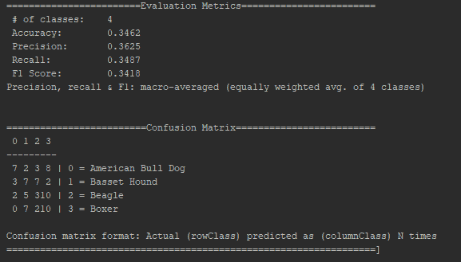
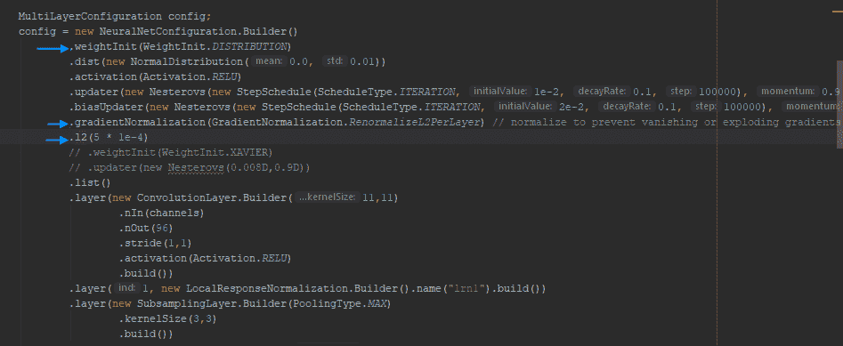
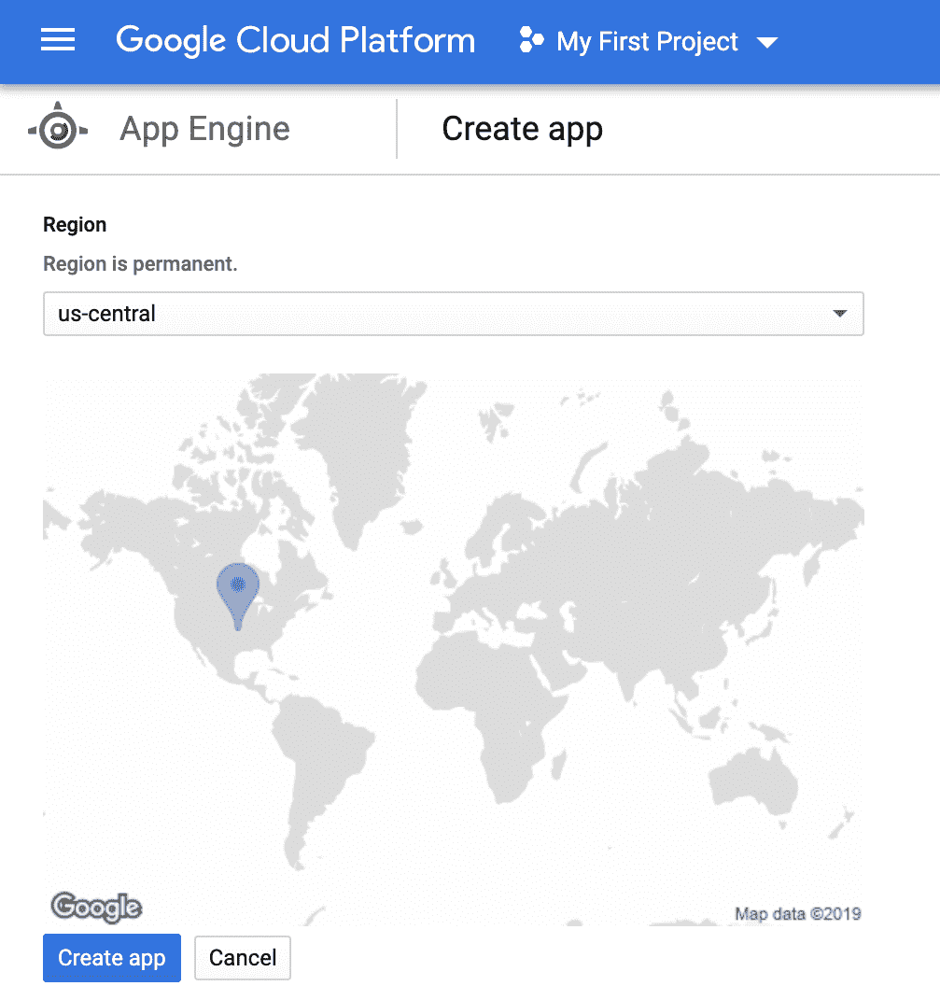
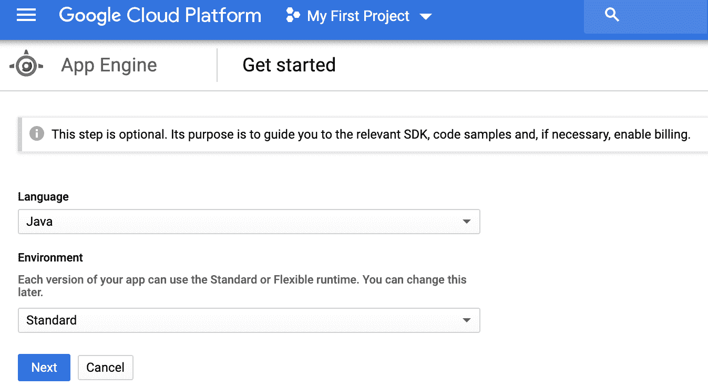
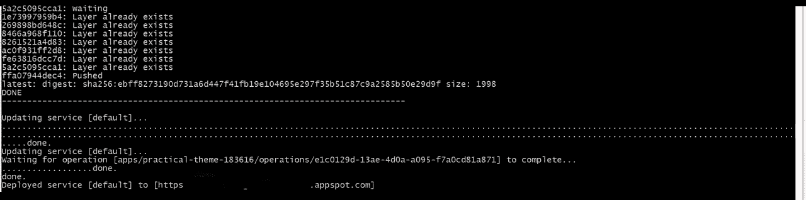

# 第四章：构建卷积神经网络

在本章中，我们将使用 DL4J 开发一个**卷积神经网络**（**CNN**）进行图像分类示例。我们将在逐步推进配方的过程中，逐步开发应用程序的各个组件。本章假设你已经阅读了第一章，《*Java 深度学习简介*》以及第二章，《*数据提取、转换与加载*》，并且你已经按照第一章《*Java 深度学习简介*》中提到的内容在你的计算机上设置了 DL4J。现在，让我们开始讨论本章所需的具体更改。

出于演示目的，我们将对四种不同物种进行分类。CNN 将复杂的图像转换为可以用于预测的抽象格式。因此，CNN 将是解决此图像分类问题的最佳选择。

CNN 就像任何其他深度神经网络一样，抽象了决策过程，并为我们提供了一个将输入转化为输出的接口。唯一的区别是它们支持其他类型的层和不同的层次顺序。与文本或 CSV 等其他类型的输入不同，图像是复杂的。考虑到每个像素都是信息源，训练过程对于大量高分辨率图像将变得资源密集且耗时。

在本章中，我们将涵盖以下配方：

+   从磁盘提取图像

+   为训练数据创建图像变体

+   图像预处理和输入层设计

+   构建 CNN 的隐藏层

+   构建用于输出分类的输出层

+   训练图像并评估 CNN 输出

+   为图像分类器创建 API 端点

# 技术要求

本章讨论的用例实现可以在这里找到：[`github.com/PacktPublishing/Java-Deep-Learning-Cookbook/tree/master/04_Building_Convolutional_Neural_Networks/sourceCode`](https://github.com/PacktPublishing/Java-Deep-Learning-Cookbook/tree/master/04_Building_Convolutional_Neural_Networks/sourceCode)。

克隆我们的 GitHub 仓库后，导航到以下目录：`Java-Deep-Learning-Cookbook/04_Building_Convolutional_Neural_Networks/sourceCode`。然后，通过导入`pom.xml`，将`cookbookapp`项目作为 Maven 项目导入。

你还会找到一个基本的 Spring 项目，`spring-dl4j`，也可以作为 Maven 项目导入。

本章将使用来自牛津的狗品种分类数据集。

主要数据集可以从以下链接下载：

[`www.kaggle.com/zippyz/cats-and-dogs-breeds-classification-oxford-dataset`](https://www.kaggle.com/zippyz/cats-and-dogs-breeds-classification-oxford-dataset)。

要运行本章的源代码，请从以下链接下载数据集（仅限四个标签）：

[`github.com/PacktPublishing/Java-Deep-Learning-Cookbook/raw/master/04_Building%20Convolutional%20Neural%20Networks/dataset.zip`](https://github.com/PacktPublishing/Java-Deep-Learning-Cookbook/raw/master/04_Building%20Convolutional%20Neural%20Networks/dataset.zip)（可以在`Java-Deep-Learning-Cookbook/04_Building Convolutional Neural Networks/`目录中找到）。

解压缩数据集文件。图像保存在不同的目录中。每个目录代表一个标签/类别。为演示目的，我们使用了四个标签。但是，您可以尝试使用来自不同类别的更多图像以运行我们在 GitHub 上的示例。

请注意，我们的示例针对四个类别进行了优化。使用更多标签进行实验需要进一步的网络配置优化。

要在您的 CNN 中利用 OpenCV 库的能力，请添加以下 Maven 依赖项：

```py
<dependency>
 <groupId>org.bytedeco.javacpp-presets</groupId>
 <artifactId>opencv-platform</artifactId>
 <version>4.0.1-1.4.4</version>
 </dependency>
```

我们将使用 Google Cloud SDK 在云中部署应用程序。有关详细说明，请参阅[`github.com/GoogleCloudPlatform/app-maven-plugin`](https://github.com/GoogleCloudPlatform/app-maven-plugin)。有关 Gradle 的说明，请参阅[`github.com/GoogleCloudPlatform/app-gradle-plugin`](https://github.com/GoogleCloudPlatform/app-gradle-plugin)。

# 从磁盘中提取图像

对于基于*N*个标签的分类，父目录中将创建*N*个子目录。提及父目录路径以进行图像提取。子目录名称将被视为标签。在本示例中，我们将使用 DataVec 从磁盘提取图像。

# 操作步骤...

1.  使用`FileSplit`来定义加载到神经网络中的文件范围：

```py
FileSplit fileSplit = new FileSplit(parentDir, NativeImageLoader.ALLOWED_FORMATS,new Random(42));
 int numLabels = fileSplit.getRootDir().listFiles(File::isDirectory).length;
```

1.  使用`ParentPathLabelGenerator`和`BalancedPathFilter`来对标记数据集进行采样并将其分为训练/测试集：

```py
ParentPathLabelGenerator parentPathLabelGenerator = new ParentPathLabelGenerator();
 BalancedPathFilter balancedPathFilter = new BalancedPathFilter(new Random(42),NativeImageLoader.ALLOWED_FORMATS,parentPathLabelGenerator);
 InputSplit[] inputSplits = fileSplit.sample(balancedPathFilter,trainSetRatio,testSetRatio);

```

# 工作原理...

在步骤 1 中，我们使用了`FileSplit`根据文件类型（PNG、JPEG、TIFF 等）来过滤图像。

我们还传入了一个基于单个种子的随机数生成器。此种子值是一个整数（我们的示例中为`42`）。`FileSplit`将能够利用随机种子以随机顺序生成文件路径列表。这将为概率决策引入更多随机性，从而提高模型的性能（准确性指标）。

如果您有一个包含未知数量标签的预制数据集，则计算`numLabels`至关重要。因此，我们使用了`FileSplit`来以编程方式计算它们：

```py
int numLabels = fileSplit.getRootDir().listFiles(File::isDirectory).length; 
```

在步骤 2 中，我们使用了**`ParentPathLabelGenerator`**来根据目录路径为文件生成标签。同时，使用`BalancedPathFilter`来随机化数组中的路径顺序。随机化有助于克服过拟合问题。`BalancedPathFilter`还确保每个标签具有相同数量的路径，并帮助获得用于训练的最佳批次。

使用 `testSetRatio` 为 `20`，数据集的 20% 将用作模型评估的测试集。在第 2 步后，`inputSplits` 中的数组元素将代表训练/测试数据集：

+   `inputSplits[0]` 将代表训练数据集。

+   `inputSplits[1]` 将代表测试数据集。

+   `NativeImageLoader.ALLOWED_FORMATS` 使用 `JavaCV` 加载图像。允许的图像格式有：`.bmp`、`.gif`、`.jpg`、`.jpeg`、`.jp2`、`.pbm`、`.pgm`、`.ppm`、`.pnm`、`.png`、`.tif`、`.tiff`、`.exr` 和 `.webp`。

+   `BalancedPathFilter` 随机化文件路径数组的顺序，并随机移除它们，使每个标签的路径数相同。它还会根据标签在输出中形成路径，以便获得易于优化的训练批次。因此，它不仅仅是随机抽样。

+   `fileSplit.sample()` 根据前述路径过滤器抽样文件路径。

它将进一步将结果拆分为一组 `InputSplit` 对象。每个对象将引用训练/测试集，其大小与前述权重成比例。

# 为训练数据创建图像变体

我们通过创建图像变体并在其基础上进一步训练我们的网络模型，以增强 CNN 的泛化能力。训练 CNN 时，使用尽可能多的图像变体是至关重要的，以提高准确性。我们基本上通过翻转或旋转图像来获得同一图像的更多样本。在本教程中，我们将使用 DL4J 中 `ImageTransform` 的具体实现来转换和创建图像样本。

# 如何做...

1.  使用 `FlipImageTransform` 来水平或垂直翻转图像（随机或非随机）：

```py
ImageTransform flipTransform = new FlipImageTransform(new Random(seed));
```

1.  使用 `WarpImageTransform` 来确定性或随机地扭曲图像的透视：

```py
ImageTransform warpTransform = new WarpImageTransform(new Random(seed),delta);
```

1.  使用 `RotateImageTransform` 以确定性或随机方式旋转图像：

```py
ImageTransform rotateTransform = new RotateImageTransform(new Random(seed), angle);
```

1.  使用 `PipelineImageTransform` 向管道中添加图像变换：

```py
List<Pair<ImageTransform,Double>> pipeline = Arrays.asList(
 new Pair<>(flipTransform, flipImageTransformRatio),
 new Pair<>(warpTransform , warpImageTransformRatio)
 );
 ImageTransform transform = new PipelineImageTransform(pipeline);

```

# 它是如何工作的...

在第 1 步中，如果我们不需要随机翻转而是指定的翻转模式（确定性），那么我们可以进行如下操作：

```py
int flipMode = 0;
ImageTransform flipTransform = new FlipImageTransform(flipMode);
```

`flipMode` 是确定性的翻转模式。

+   `flipMode = 0`: 绕 *x* 轴翻转

+   `flipMode > 0`: 绕 *y* 轴翻转

+   `flipMode < 0`: 绕两个轴翻转

在第 2 步中，我们传入了两个属性：`Random(seed)` 和 `delta`。`delta` 是图像扭曲的幅度。查看以下图像示例，了解图像扭曲的演示：


（图像来源： https://commons.wikimedia.org/wiki/File:Image_warping_example.jpg

许可证：CC BY-SA 3.0

`WarpImageTransform(new Random(seed), delta)` 内部调用以下构造函数：

```py
public WarpImageTransform(java.util.Random random,
 float dx1,
 float dy1,
 float dx2,
 float dy2,
 float dx3,
 float dy3,
 float dx4,
 float dy4
```

它将假设 `dx1=dy1=dx2=dy2=dx3=dy3=dx4=dy4=delta`。

以下是参数描述：

+   `dx1`: 顶部左角的最大 x 轴扭曲量（像素）

+   `dy1`: 顶部左角的最大 y 轴扭曲量（像素）

+   `dx2`: 顶部右角的最大 x 轴扭曲量（像素）

+   `dy2`: 顶部右角的最大 y 轴扭曲量（像素）

+   `dx3`：右下角在`x`方向的最大变形（像素）

+   `dy3`：右下角在`y`方向的最大变形（像素）

+   `dx4`：左下角在`x`方向的最大变形（像素）

+   `dy4`：左下角在`y`方向的最大变形（像素）

在创建`ImageRecordReader`时，delta 的值将根据归一化的宽度/高度自动调整。这意味着给定的 delta 值将相对于创建`ImageRecordReader`时指定的归一化宽度/高度进行处理。假设我们在一个 100 x 100 像素的图像上，在* x * / * y *轴上进行 10 像素的变形。如果该图像被归一化为 30 x 30 大小，那么* x * / * y *轴上将进行 3 像素的变形。由于没有常量/最小/最大`delta`值能解决所有类型的图像分类问题，因此你需要尝试不同的`delta`值。

在步骤 3 中，我们使用了`RotateImageTransform`来执行旋转图像变换，通过在指定角度上旋转图像样本。

在步骤 4 中，我们通过`PipelineImageTransform`的帮助将多个图像变换添加到管道中，以便按顺序或随机地加载它们用于训练。我们创建了一个类型为`List<Pair<ImageTransform,Double>>`的管道。`Pair`中的`Double`值是管道中某个特定元素（`ImageTransform`）执行的*概率*。

图像变换将帮助 CNN 更好地学习图像模式。在变换图像上进行训练将进一步避免过拟合的可能性。

# 还有更多...

`WarpImageTransform`在后台会调用 JavaCPP 方法`warpPerspective()`，并使用给定的属性`interMode`、`borderMode`和`borderValue`。JavaCPP 是一个 API，它解析本地 C/C++文件并生成 Java 接口作为包装器。我们之前在`pom.xml`中添加了 OpenCV 的 JavaCPP 依赖项。这将使我们能够利用 OpenCV 库进行图像变换。

# 图像预处理和输入层设计

归一化是 CNN 的一个关键预处理步骤，就像任何前馈神经网络一样。图像数据是复杂的。每个图像包含多个像素的信息。此外，每个像素都是一个信息源。我们需要归一化这些像素值，以便神经网络在训练时不会出现过拟合或欠拟合的问题。卷积/子采样层在设计 CNN 的输入层时也需要指定。在本方案中，我们将首先进行归一化，然后设计 CNN 的输入层。

# 如何操作...

1.  创建`ImagePreProcessingScaler`进行图像归一化：

```py
DataNormalization scaler = new ImagePreProcessingScaler(0,1);

```

1.  创建神经网络配置并添加默认的超参数：

```py
MultiLayerConfiguration.Builder builder = new NeuralNetConfiguration.Builder().weightInit(WeightInit.DISTRIBUTION)
 .dist(new NormalDistribution(0.0, 0.01))
 .activation(Activation.RELU)
 .updater(new Nesterovs(new StepSchedule(ScheduleType.ITERATION, 1e-2, 0.1, 100000), 0.9))
 .biasUpdater(new Nesterovs(new StepSchedule(ScheduleType.ITERATION, 2e-2, 0.1, 100000), 0.9))
 .gradientNormalization(GradientNormalization.RenormalizeL2PerLayer) // normalize to prevent vanishing or exploding gradients
 .l2(l2RegularizationParam)
 .list();
```

1.  使用`ConvolutionLayer`为 CNN 创建卷积层：

```py
builder.layer(new ConvolutionLayer.Builder(11,11)
 .nIn(channels)
 .nOut(96)
 .stride(1,1)
 .activation(Activation.RELU)
 .build());
```

1.  使用`SubsamplingLayer`配置子采样层：

```py
builder.layer(new SubsamplingLayer.Builder(PoolingType.MAX)
 .kernelSize(kernelSize,kernelSize)
 .build());
```

1.  使用`LocalResponseNormalization`在层之间进行激活归一化：

```py
 builder.layer(1, new LocalResponseNormalization.Builder().name("lrn1").build());
```

# 它是如何工作的...

在步骤 1 中，`ImagePreProcessingScaler` 将像素值标准化到指定的范围（0, 1）。我们将在创建数据迭代器后使用此标准化器。

在步骤 2 中，我们添加了超参数，如 L2 正则化系数、梯度归一化策略、梯度更新算法和全局激活函数（适用于所有层）。

在步骤 3 中，`ConvolutionLayer` 需要您指定核的维度（之前代码中的 11*11）。在 CNN 中，核充当特征检测器：

+   `stride`：指定在像素网格操作中每个样本之间的空间。

+   `channels`：输入神经元的数量。我们在这里提到颜色通道的数量（RGB：3）。

+   `OutGoingConnectionCount`：输出神经元的数量。

在步骤 4 中，**`SubsamplingLayer`** 是一个下采样层，用于减少要传输或存储的数据量，同时保持重要特征的完整。最大池化是最常用的采样方法。`ConvolutionLayer` 后面总是跟着 **`SubsamplingLayer`**。

在 CNN 中，效率是一个具有挑战性的任务。它需要大量图像以及转换操作来进行更好的训练。在步骤 4 中，`LocalResponseNormalization` 提高了 CNN 的泛化能力。在执行 ReLU 激活之前，它会执行归一化操作。

我们将其作为一个独立的层，放置在卷积层和下采样层之间：

+   `ConvolutionLayer` 类似于前馈层，但用于在图像上执行二维卷积操作。

+   **`SubsamplingLayer`** 是 CNN 中池化/下采样所必需的。

+   `ConvolutionLayer` 和 **`SubsamplingLayer`** 一起构成 CNN 的输入层，从图像中提取抽象特征，并将其传递到隐藏层以进行进一步处理。

# 构建 CNN 的隐藏层

CNN 的输入层生成抽象图像并将其传递给隐藏层。抽象图像特征从输入层传递到隐藏层。如果您的 CNN 中有多个隐藏层，那么每个层将有独特的责任来进行预测。例如，其中一个层可以检测图像中的亮暗，而随后的层可以借助前一层的特征来检测边缘/形状。接下来的层可以从前一隐藏层的边缘/特征中辨识出更复杂的物体或配方，以此类推。

在这个方案中，我们将为我们的图像分类问题设计隐藏层。

# 如何操作...

1.  使用 `DenseLayer` 构建隐藏层：

```py
new DenseLayer.Builder()
 .nOut(nOut)
 .dist(new NormalDistribution(0.001, 0.005))
 .activation(Activation.RELU)
 .build();
```

1.  通过调用 `layer()` 添加 `AddDenseLayer` 到层结构中：

```py
builder.layer(new DenseLayer.Builder()
 .nOut(500)
 .dist(new NormalDistribution(0.001, 0.005))
 .activation(Activation.RELU)
 .build());
```

# 它是如何工作的...

在步骤 1 中，隐藏层通过 `DenseLayer` 创建，前面是卷积/下采样层。

在步骤 2 中，注意我们没有提到隐藏层中输入神经元的数量，因为它与前一层（`SubSamplingLayer`）的输出神经元数量相同。

# 构建输出层进行输出分类

我们需要使用逻辑回归（`SOFTMAX`）进行图像分类，从而得到每个图像标签的发生概率。逻辑回归是一种预测分析算法，因此更适合用于预测问题。在本配方中，我们将设计图像分类问题的输出层。

# 如何实现...

1.  使用 `OutputLayer` 设计输出层：

```py
builder.layer(new OutputLayer.Builder(LossFunctions.LossFunction.NEGATIVELOGLIKELIHOOD)
 .nOut(numLabels)
 .activation(Activation.SOFTMAX)
 .build());
```

1.  使用 `setInputType()` 设置输入类型：

```py
builder.setInputType(InputType.convolutional(30,30,3));

```

# 它是如何工作的...

在第一步中，`nOut()` 预期的是我们在前面的配方中使用 `FileSplit` 计算出的图像标签数量。

在第二步中，我们使用 `setInputType()` 设置了卷积输入类型。这将触发输入神经元的计算/设置，并添加预处理器（`LocalResponseNormalization`）以处理从卷积/子采样层到全连接层的数据流。

`InputType` 类用于跟踪和定义激活类型。这对自动添加层间预处理器以及自动设置 `nIn`（输入神经元数量）值非常有用。也正是这样，我们在配置模型时跳过了 `nIn` 值的指定。卷积输入类型的形状是四维的 `[miniBatchSize, channels, height, width]`。

# 训练图像并评估 CNN 输出

我们已经设置了层的配置。现在，我们需要训练 CNN 使其适合预测。在 CNN 中，过滤器值将在训练过程中进行调整。网络将自行学习如何选择合适的过滤器（特征图），以产生最佳结果。我们还将看到，由于计算复杂性，CNN 的效率和性能变成了一个挑战。在这个配方中，我们将训练并评估我们的 CNN 模型。

# 如何实现...

1.  使用 `ImageRecordReader` 加载并初始化训练数据：

```py
ImageRecordReader imageRecordReader = new ImageRecordReader(imageHeight,imageWidth,channels,parentPathLabelGenerator);
 imageRecordReader.initialize(trainData,null);
```

1.  使用 `RecordReaderDataSetIterator` 创建数据集迭代器：

```py
DataSetIterator dataSetIterator = new RecordReaderDataSetIterator(imageRecordReader,batchSize,1,numLabels);
```

1.  将归一化器添加到数据集迭代器中：

```py
DataNormalization scaler = new ImagePreProcessingScaler(0,1);
 scaler.fit(dataSetIterator);
 dataSetIterator.setPreProcessor(scaler);

```

1.  通过调用 `fit()` 来训练模型：

```py
MultiLayerConfiguration config = builder.build();
 MultiLayerNetwork model = new MultiLayerNetwork(config);
 model.init();
 model.setListeners(new ScoreIterationListener(100));
 model.fit(dataSetIterator,epochs);
```

1.  再次训练模型，使用图像转换：

```py
imageRecordReader.initialize(trainData,transform);
 dataSetIterator = new RecordReaderDataSetIterator(imageRecordReader,batchSize,1,numLabels);
 scaler.fit(dataSetIterator);
 dataSetIterator.setPreProcessor(scaler);
 model.fit(dataSetIterator,epochs);
```

1.  评估模型并观察结果：

```py
Evaluation evaluation = model.evaluate(dataSetIterator);
 System.out.println(evaluation.stats()); 

```

评估指标将显示如下：



1.  通过添加以下依赖项来支持 GPU 加速环境：

```py
<dependency>
  <groupId>org.nd4j</groupId>
  <artifactId>nd4j-cuda-9.1-platform</artifactId>
  <version>1.0.0-beta3</version>
 </dependency>

 <dependency>
  <groupId>org.deeplearning4j</groupId>
  <artifactId>deeplearning4j-cuda-9.1</artifactId>
  <version>1.0.0-beta3</version>
 </dependency>
```

# 它是如何工作的...

第一步中包含的参数如下：

+   `parentPathLabelGenerator`—在数据提取阶段创建（请参见本章的 *从磁盘提取图像* 配方）。

+   `channels`—颜色通道的数量（默认值 = `3`，即 RGB）。

+   `ImageRecordReader(imageHeight, imageWidth, channels, parentPathLabelGenerator)`—将实际图像调整为指定大小 `（imageHeight, imageWidth）`，以减少数据加载的工作量。

+   `initialize()` 方法中的 null 属性表示我们没有对转换后的图像进行训练。

在第 3 步中，我们使用`ImagePreProcessingScaler`进行最小-最大归一化。注意，我们需要同时使用`fit()`和`setPreProcessor()`来对数据应用归一化。

对于 GPU 加速的环境，我们可以在第 4 步中使用`PerformanceListener`替代`ScoreIterationListener`，进一步优化训练过程。`PerformanceListener`跟踪每次迭代的训练时间，而`ScoreIterationListener`每隔*N*次迭代报告一次网络的分数。确保按照第 7 步添加 GPU 依赖项。

在第 5 步，我们再次使用之前创建的图像变换来训练模型。确保对变换后的图像也进行归一化处理。

# 还有更多...

我们的 CNN 模型的准确率大约为 50%。我们使用 396 张图像，涵盖 4 个类别，训练了神经网络。对于一台配备 8GB RAM 的 i7 处理器，训练完成需要 15-30 分钟。这可能会根据与训练实例并行运行的其他应用程序有所变化。训练时间也会根据硬件的质量有所不同。如果你使用更多的图像进行训练，将会观察到更好的评估指标。更多的数据有助于提高预测准确性。当然，这也需要更长的训练时间。

另一个重要的方面是实验隐藏层和子采样/卷积层的数量，以获得最佳结果。层数过多可能导致过拟合，因此，你必须通过尝试不同层数的网络配置来实验。不要为`stride`添加过大的值，也不要为图像设置过小的尺寸。这可能会导致过度下采样，从而导致特征丧失。

我们还可以尝试不同的权重值或权重在神经元之间的分配方式，并测试不同的梯度归一化策略，应用 L2 正则化和丢弃法。选择 L1/L2 正则化或丢弃法的常数值并没有固定的经验法则。然而，L2 正则化常数通常较小，因为它迫使权重衰减到零。神经网络通常可以安全地接受 10-20%的丢弃率，超过此范围可能会导致欠拟合。没有一个固定的常数值适用于所有情况，因为它会根据具体情况而有所不同：



GPU 加速的环境将有助于减少训练时间。DL4J 支持 CUDA，并且可以通过使用 cuDNN 进一步加速。大多数二维 CNN 层（如`ConvolutionLayer`和`SubsamplingLayer`）都支持 cuDNN。

**NVIDIA CUDA 深度神经网络**（**cuDNN**）库是一个针对深度学习网络的 GPU 加速原语库。你可以在这里阅读更多关于 cuDNN 的信息：[`developer.nvidia.com/cudnn`](https://developer.nvidia.com/cudnn)。

# 创建图像分类器的 API 端点

我们希望将图像分类器作为 API 在外部应用程序中使用。API 可以被外部访问，并且预测结果可以在不进行任何设置的情况下获取。在本食谱中，我们将为图像分类器创建一个 API 端点。

# 如何操作...

1.  使用`ModelSerializer`持久化模型：

```py
File file = new File("cnntrainedmodel.zip");
 ModelSerializer.writeModel(model,file,true);
 ModelSerializer.addNormalizerToModel(file,scaler);
```

1.  使用`ModelSerializer`恢复训练好的模型，以执行预测：

```py
MultiLayerNetwork network = ModelSerializer.restoreMultiLayerNetwork(modelFile);
 NormalizerStandardize normalizerStandardize = ModelSerializer.restoreNormalizerFromFile(modelFile);
```

1.  设计一个 API 方法，接受用户输入并返回结果。一个示例 API 方法如下所示：

```py
public static INDArray generateOutput(File file) throws IOException, InterruptedException {
 final File modelFile = new File("cnnmodel.zip");
 final MultiLayerNetwork model = ModelSerializer.restoreMultiLayerNetwork(modelFile);
 final RecordReader imageRecordReader = generateReader(file);
 final NormalizerStandardize normalizerStandardize = ModelSerializer.restoreNormalizerFromFile(modelFile);
 final DataSetIterator dataSetIterator = new RecordReaderDataSetIterator.Builder(imageRecordReader,1).build();
 normalizerStandardize.fit(dataSetIterator);
 dataSetIterator.setPreProcessor(normalizerStandardize);
 return model.output(dataSetIterator);
 }

```

1.  创建一个 URI 映射来处理客户端请求，如下所示：

```py
@GetMapping("/")
 public String main(final Model model){
 model.addAttribute("message", "Welcome to Java deep learning!");
 return "welcome";
 }

 @PostMapping("/")
 public String fileUpload(final Model model, final @RequestParam("uploadFile")MultipartFile multipartFile) throws IOException, InterruptedException {
 final List<String> results = cookBookService.generateStringOutput(multipartFile);
 model.addAttribute("message", "Welcome to Java deep learning!");
 model.addAttribute("results",results);
 return "welcome";
 }
```

1.  构建一个`cookbookapp-cnn`项目，并将 API 依赖项添加到你的 Spring 项目中：

```py
<dependency>
 <groupId>com.javadeeplearningcookbook.app</groupId>
 <artifactId>cookbookapp-cnn</artifactId>
 <version>1.0-SNAPSHOT</version>
 </dependency>
```

1.  在服务层创建`generateStringOutput()`方法来提供 API 内容：

```py
@Override
 public List<String> generateStringOutput(MultipartFile multipartFile) throws IOException, InterruptedException {
 //TODO: MultiPartFile to File conversion (multipartFile -> convFile)
 INDArray indArray = ImageClassifierAPI.generateOutput(convFile);

 for(int i=0; i<indArray.rows();i++){
           for(int j=0;j<indArray.columns();j++){
                   DecimalFormat df2 = new DecimalFormat("#.####");
                   results.add(df2.format(indArray.getDouble(i,j)*100)+"%"); 
                //Later add them from list to the model display on UI.
            }            
        }
  convFile.deleteOnExit();
   return results;
 }

```

1.  下载并安装 Google Cloud SDK：[`cloud.google.com/sdk/`](https://cloud.google.com/sdk/)。

1.  在 Google Cloud 控制台运行以下命令，安装 Cloud SDK 的`app-engine-java`组件：

```py
gcloud components install app-engine-java
```

1.  使用以下命令登录并配置 Cloud SDK：

```py
gcloud init
```

1.  在`pom.xml`中添加以下 Maven App Engine 依赖项：

```py
<plugin>
 <groupId>com.google.cloud.tools</groupId>
 <artifactId>appengine-maven-plugin</artifactId>
 <version>2.1.0</version>
 </plugin>
```

1.  根据 Google Cloud 文档，在你的项目中创建`app.yaml`文件：

    [`cloud.google.com/appengine/docs/flexible/java/configuring-your-app-with-app-yaml`](https://cloud.google.com/appengine/docs/flexible/java/configuring-your-app-with-app-yaml)。

1.  导航到 Google App Engine 并点击“创建应用程序”按钮：


1.  选择一个地区并点击“创建应用”：



1.  选择 Java 并点击“下一步”按钮：



现在，你的应用程序引擎已经在 Google Cloud 上创建完成。

1.  使用 Maven 构建 Spring Boot 应用程序：

```py
mvn clean install
```

1.  使用以下命令部署应用程序：

```py
mvn appengine:deploy
```

# 工作原理...

在第 1 步和第 2 步中，我们已经将模型持久化，以便在 API 中重用模型功能。

在第 3 步中，创建一个 API 方法，接受用户输入并返回图像分类器的结果。

在第 4 步中，URI 映射将接受客户端请求（GET/POST）。GET 请求最初将提供主页，POST 请求将处理最终用户的图像分类请求。

在第 5 步中，我们将 API 依赖项添加到了`pom.xml`文件中。为了演示目的，我们构建了 API 的 JAR 文件，且该 JAR 文件存储在本地 Maven 仓库中。对于生产环境，你需要将你的 API（JAR 文件）提交到私有仓库，以便 Maven 可以从那里获取。

在第 6 步中，我们在 Spring Boot 应用程序的服务层调用了 ImageClassifier API，以获取结果并将其返回给控制器类。

在上一章中，我们为了演示目的将应用程序部署到本地。在本章中，我们已将应用程序部署到 Google Cloud。第 7 到 16 步专门介绍了如何在 Google Cloud 中进行部署。

我们使用了 Google App Engine，虽然我们也可以通过 Google Compute Engine 或 Dataproc 以更定制化的方式进行相同的配置。Dataproc 旨在将你的应用部署到 Spark 分布式环境中。

一旦部署成功，你应该能看到类似以下内容：



当你点击 URL（以`https://xx.appspot.com`开头），你应该能够看到一个网页（与上一章中的相同），用户可以在该网页上上传图片进行图像分类。
