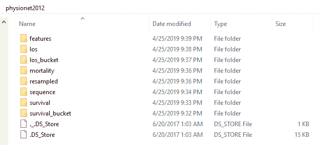
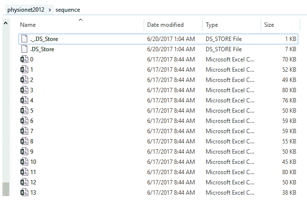
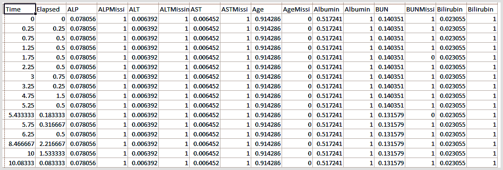
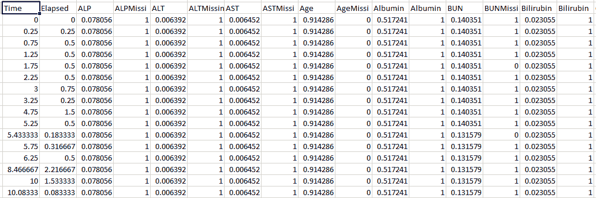
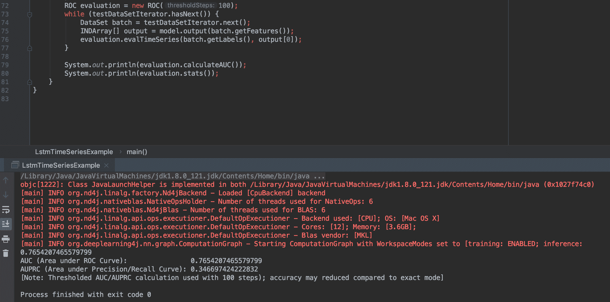

# 第六章：构建用于时间序列的 LSTM 网络

在本章中，我们将讨论如何构建**长短期记忆**（**LSTM**）神经网络来解决医学时间序列问题。我们将使用来自 4,000 名**重症监护病房**（**ICU**）患者的数据。我们的目标是通过给定的一组通用和序列特征来预测患者的死亡率。我们有六个通用特征，如年龄、性别和体重。此外，我们还有 37 个序列特征，如胆固醇水平、体温、pH 值和葡萄糖水平。每个患者都有多个针对这些序列特征的测量记录。每个患者的测量次数不同。此外，不同患者之间测量的时间间隔也有所不同。

由于数据的序列性质，LSTM 非常适合此类问题。我们也可以使用普通的**递归神经网络**（**RNN**）来解决，但 LSTM 的目的是避免梯度消失和梯度爆炸。LSTM 能够捕捉长期依赖关系，因为它具有单元状态。

在本章中，我们将涵盖以下配方：

+   提取和读取临床数据

+   加载和转换数据

+   构建网络的输入层

+   构建网络的输出层

+   训练时间序列数据

+   评估 LSTM 网络的效率

# 技术要求

本章讨论的用例的具体实现可以在这里找到：[`github.com/PacktPublishing/Java-Deep-Learning-Cookbook/blob/master/06_Constructing_LSTM_Network_for_time_series/sourceCode/cookbookapp-lstm-time-series/src/main/java/LstmTimeSeriesExample.java`](https://github.com/PacktPublishing/Java-Deep-Learning-Cookbook/blob/master/06_Constructing_LSTM_Network_for_time_series/sourceCode/cookbookapp-lstm-time-series/src/main/java/LstmTimeSeriesExample.java)。

克隆 GitHub 仓库后，进入`Java-Deep-Learning-Cookbook/06_Constructing_LSTM_Network_for_time_series/sourceCode`目录。然后，通过导入`pom.xml`，将`cookbookapp-lstm-time-series`项目作为 Maven 项目导入。

从这里下载临床时间序列数据：[`skymindacademy.blob.core.windows.net/physionet2012/physionet2012.tar.gz`](https://skymindacademy.blob.core.windows.net/physionet2012/physionet2012.tar.gz)。该数据集来自 PhysioNet 心脏病挑战 2012。

下载后解压文件。你应该会看到以下目录结构：



特征存储在名为`sequence`的目录中，标签存储在名为`mortality`的目录中。暂时忽略其他目录。你需要在源代码中更新特征/标签的文件路径，以便运行示例。

# 提取和读取临床数据

**ETL**（提取、转换、加载的缩写）是任何深度学习问题中最重要的一步。在本方案中，我们将重点讨论数据提取，其中我们将讨论如何提取和处理临床时间序列数据。我们在前几章中了解了常规数据类型，例如普通的 CSV/文本数据和图像。现在，让我们讨论如何处理时间序列数据。我们将使用临床时间序列数据来预测患者的死亡率。

# 如何操作...

1.  创建一个`NumberedFileInputSplit`实例，将所有特征文件合并在一起：

```py
new NumberedFileInputSplit(FEATURE_DIR+"/%d.csv",0,3199);
```

1.  创建一个`NumberedFileInputSplit`实例，将所有标签文件合并在一起：

```py
new NumberedFileInputSplit(LABEL_DIR+"/%d.csv",0,3199);
```

1.  为特征/标签创建记录读取器：

```py
SequenceRecordReader trainFeaturesReader = new CSVSequenceRecordReader(1, ",");
 trainFeaturesReader.initialize(new NumberedFileInputSplit(FEATURE_DIR+"/%d.csv",0,3199));
 SequenceRecordReader trainLabelsReader = new CSVSequenceRecordReader();
 trainLabelsReader.initialize(new NumberedFileInputSplit(LABEL_DIR+"/%d.csv",0,3199));
```

# 它是如何工作的...

时间序列数据是三维的。每个样本由它自己的文件表示。列中的特征值是在不同的时间步骤上测量的，这些时间步骤由行表示。例如，在第 1 步中，我们看到了下面的快照，其中显示了时间序列数据：



每个文件代表一个不同的序列。当你打开文件时，你会看到在不同时间步骤上记录的观察值（特征），如下所示：



标签包含在一个 CSV 文件中，其中包含值`0`表示死亡，值`1`表示生存。例如，对于`1.csv`中的特征，输出标签位于死亡目录下的`1.csv`中。请注意，我们共有 4000 个样本。我们将整个数据集分为训练集和测试集，使得训练数据包含 3200 个样本，测试数据包含 800 个样本。

在第 3 步中，我们使用了`NumberedFileInputSplit`来读取并将所有文件（特征/标签）以编号格式合并在一起。

`CSVSequenceRecordReader`用于读取 CSV 格式的数据序列，其中每个序列都定义在自己的文件中。

如上图所示，第一行仅用于特征标签，需要跳过。

因此，我们创建了以下 CSV 序列读取器：

```py
SequenceRecordReader trainFeaturesReader = new CSVSequenceRecordReader(1, ",");
```

# 加载和转换数据

数据提取阶段之后，我们需要在将数据加载到神经网络之前进行数据转换。在数据转换过程中，确保数据集中的任何非数字字段都被转换为数字字段是非常重要的。数据转换的作用不仅仅是这样。我们还可以去除数据中的噪声并调整数值。在此方案中，我们将数据加载到数据集迭代器中，并按需要转换数据。

在上一个方案中，我们将时间序列数据提取到记录读取器实例中。现在，让我们从这些实例中创建训练/测试迭代器。我们还将分析数据并在需要时进行转换。

# 准备就绪

在我们继续之前，请参考下面的截图中的数据集，以了解每个数据序列的样子：



首先，我们需要检查数据中是否存在任何非数值特征。我们需要将数据加载到神经网络中进行训练，并且它应该是神经网络能够理解的格式。我们有一个顺序数据集，并且看起来没有非数值值。所有 37 个特征都是数值型的。如果查看特征数据的范围，它接近于标准化格式。

# 它是如何做的...

1.  使用 `SequenceRecordReaderDataSetIterator` 创建训练迭代器：

```py
DataSetIterator trainDataSetIterator = new SequenceRecordReaderDataSetIterator(trainFeaturesReader,trainLabelsReader,batchSize,numberOfLabels,false, SequenceRecordReaderDataSetIterator.AlignmentMode.ALIGN_END);
```

1.  使用 `SequenceRecordReaderDataSetIterator` 创建测试迭代器：

```py
DataSetIterator testDataSetIterator = new SequenceRecordReaderDataSetIterator(testFeaturesReader,testLabelsReader,batchSize,numberOfLabels,false, SequenceRecordReaderDataSetIterator.AlignmentMode.ALIGN_END);
```

# 它是如何工作的...

在步骤 1 和 2 中，我们在创建训练和测试数据集的迭代器时使用了`AlignmentMode`。`AlignmentMode` 处理不同长度的输入/标签（例如，一对多和多对一的情况）。以下是一些对齐模式的类型：

+   `ALIGN_END`：这是用于在最后一个时间步对齐标签或输入。基本上，它在输入或标签的末尾添加零填充。

+   `ALIGN_START`：这是用于在第一个时间步对齐标签或输入。基本上，它在输入或标签的末尾添加零填充。

+   `EQUAL_LENGTH`：这假设输入时间序列和标签具有相同的长度，并且所有示例的长度都相同。

+   `SequenceRecordReaderDataSetIterator`：这个工具帮助从传入的记录读取器生成时间序列数据集。记录读取器应基于序列数据，最适合用于时间序列数据。查看传递给构造函数的属性：

```py
DataSetIterator testDataSetIterator = new SequenceRecordReaderDataSetIterator(testFeaturesReader,testLabelsReader,batchSize,numberOfLabels,false, SequenceRecordReaderDataSetIterator.AlignmentMode.ALIGN_END);
```

`testFeaturesReader` 和 `testLabelsReader` 分别是输入数据（特征）和标签（用于评估）的记录读取器对象。布尔属性（`false`）表示我们是否有回归样本。由于我们在讨论时间序列分类问题，这里为 `false`。对于回归数据，必须将其设置为 `true`。

# 构建网络的输入层

LSTM 层将具有门控单元，能够捕捉长期依赖关系，不同于常规 RNN。让我们讨论一下如何在网络配置中添加一个特殊的 LSTM 层。我们可以使用多层网络或计算图来创建模型。

在这个示例中，我们将讨论如何为我们的 LSTM 神经网络创建输入层。在以下示例中，我们将构建一个计算图，并向其中添加自定义层。

# 它是如何做的...

1.  使用 `ComputationGraph` 配置神经网络，如下所示：

```py
ComputationGraphConfiguration.GraphBuilder builder = new NeuralNetConfiguration.Builder()
 .seed(RANDOM_SEED)
 .optimizationAlgo(OptimizationAlgorithm.STOCHASTIC_GRADIENT_DESCENT)
 .weightInit(WeightInit.XAVIER)
 .updater(new Adam())
 .dropOut(0.9)
 .graphBuilder()
 .addInputs("trainFeatures");
```

1.  配置 LSTM 层：

```py
new LSTM.Builder()
 .nIn(INPUTS)
 .nOut(LSTM_LAYER_SIZE)
 .forgetGateBiasInit(1)
 .activation(Activation.TANH)
 .build(),"trainFeatures");
```

1.  将 LSTM 层添加到 `ComputationGraph` 配置中：

```py
builder.addLayer("L1", new LSTM.Builder()
 .nIn(86)
 .nOut(200)
 .forgetGateBiasInit(1)
 .activation(Activation.TANH)
 .build(),"trainFeatures");
```

# 它是如何工作的...

在步骤 1 中，我们在调用 `graphBuilder()` 方法后定义了一个图顶点输入，如下所示：

```py
builder.addInputs("trainFeatures");
```

通过调用`graphBuilder()`，我们实际上是在构建一个图构建器，以创建计算图配置。

一旦 LSTM 层在步骤 3 中被添加到`ComputationGraph`配置中，它们将作为输入层存在于`ComputationGraph`配置中。我们将前面提到的图顶点输入（`trainFeatures`）传递给我们的 LSTM 层，如下所示：

```py
builder.addLayer("L1", new LSTM.Builder()
     .nIn(INPUTS)
     .nOut(LSTM_LAYER_SIZE)
     .forgetGateBiasInit(1)
     .activation(Activation.TANH)
     .build(),"trainFeatures");
```

最后的属性`trainFeatures`指的是图的顶点输入。在这里，我们指定`L1`层为输入层。

LSTM 神经网络的主要目的是捕获数据中的长期依赖关系。`tanh`函数的导数在达到零值之前可以持续很长一段时间。因此，我们使用`Activation.TANH`作为 LSTM 层的激活函数。

`forgetGateBiasInit()`设置忘记门的偏置初始化。`1`到`5`之间的值可能有助于学习或长期依赖关系的捕获。

我们使用`Builder`策略来定义 LSTM 层及其所需的属性，例如`nIn`和`nOut`。这些是输入/输出神经元，正如我们在第三章，*构建二分类深度神经网络*和第四章，*构建卷积神经网络*中所看到的那样。我们通过`addLayer`方法添加 LSTM 层。

# 构建网络的输出层

输出层设计是配置神经网络层的最后一步。我们的目标是实现一个时间序列预测模型。我们需要开发一个时间序列分类器来预测患者的死亡率。输出层的设计应该反映这一目标。在本教程中，我们将讨论如何为我们的用例构建输出层。

# 如何操作...

1.  使用`RnnOutputLayer`设计输出层：

```py
new RnnOutputLayer.Builder(LossFunctions.LossFunction.MCXENT)
 .activation(Activation.SOFTMAX)
 .nIn(LSTM_LAYER_SIZE).nOut(labelCount).build()
```

1.  使用`addLayer()`方法将输出层添加到网络配置中：

```py
builder.addLayer("predictMortality", new RnnOutputLayer.Builder(LossFunctions.LossFunction.MCXENT)
 .activation(Activation.SOFTMAX)
 .nIn(LSTM_LAYER_SIZE).nOut(labelCount).build(),"L1");
```

# 如何工作...

在构建输出层时，注意前一个 LSTM 输入层的`nOut`值。这个值将作为输出层的`nIn`。`nIn`应该与前一个 LSTM 输入层的`nOut`值相同。

在步骤 1 和步骤 2 中，我们实际上是在创建一个 LSTM 神经网络，它是常规 RNN 的扩展版本。我们使用了门控单元来实现某种内部记忆，以保持长期依赖关系。为了使预测模型能够进行预测（如患者死亡率），我们需要通过输出层生成概率。在步骤 2 中，我们看到`SOFTMAX`被用作神经网络输出层的激活函数。这个激活函数在计算特定标签的概率时非常有用。`MCXENT`是 ND4J 中负对数似然误差函数的实现。由于我们使用的是负对数似然损失函数，它将在某次迭代中，当某个标签的概率值较高时，推动结果的输出。

`RnnOutputLayer`更像是常规前馈网络中的扩展版本输出层。我们还可以将`RnnOutputLayer`用于一维的 CNN 层。还有另一个输出层，叫做`RnnLossLayer`，其输入和输出激活相同。在`RnnLossLayer`的情况下，我们有三个维度，分别是`[miniBatchSize, nIn, timeSeriesLength]`和`[miniBatchSize, nOut, timeSeriesLength]`的形状。

请注意，我们必须指定要连接到输出层的输入层。再看看这段代码：

```py
builder.addLayer("predictMortality", new RnnOutputLayer.Builder(LossFunctions.LossFunction.MCXENT)
 .activation(Activation.SOFTMAX)
 .nIn(LSTM_LAYER_SIZE).nOut(labelCount).build(),"L1")
```

我们提到过，`L1`层是从输入层到输出层的。

# 训练时间序列数据

到目前为止，我们已经构建了网络层和参数来定义模型配置。现在是时候训练模型并查看结果了。然后，我们可以检查是否可以修改任何先前定义的模型配置，以获得最佳结果。在得出第一个训练会话的结论之前，务必多次运行训练实例。我们需要观察稳定的输出，以确保性能稳定。

在这个示例中，我们将训练 LSTM 神经网络来处理加载的时间序列数据。

# 如何操作……

1.  从之前创建的模型配置中创建`ComputationGraph`模型：

```py
ComputationGraphConfiguration configuration = builder.build();
   ComputationGraph model = new ComputationGraph(configuration);
```

1.  加载迭代器并使用`fit()`方法训练模型：

```py
for(int i=0;i<epochs;i++){
   model.fit(trainDataSetIterator);
 }
```

你也可以使用以下方法：

```py
model.fit(trainDataSetIterator,epochs);
```

然后，我们可以通过直接在`fit()`方法中指定`epochs`参数来避免使用`for`循环。

# 它是如何工作的……

在第 2 步中，我们将数据集迭代器和训练轮数传递给训练会话。我们使用了一个非常大的时间序列数据集，因此较大的轮数将导致更长的训练时间。此外，较大的轮数并不总是能保证良好的结果，甚至可能导致过拟合。所以，我们需要多次运行训练实验，以找到轮数和其他重要超参数的最佳值。最佳值是指你观察到神经网络性能最大化的界限。

实际上，我们在使用内存门控单元优化训练过程。正如我们之前在*构建网络的输入层*这一部分所讨论的，LSTM 非常适合在数据集中保持长期依赖关系。

# 评估 LSTM 网络的效率

在每次训练迭代后，通过评估模型并与一组评估指标进行比较，来衡量网络的效率。我们根据评估指标进一步优化模型，并在接下来的训练迭代中进行调整。我们使用测试数据集进行评估。请注意，我们在这个用例中执行的是二分类任务。我们预测的是患者存活的概率。对于分类问题，我们可以绘制**接收者操作特征**（**ROC**）曲线，并计算**曲线下面积**（**AUC**）分数来评估模型的表现。AUC 分数的范围是从 0 到 1。AUC 分数为 0 表示 100% 的预测失败，而 1 表示 100% 的预测成功。

# 如何实现...

1.  使用 ROC 进行模型评估：

```py
ROC evaluation = new ROC(thresholdSteps);
```

1.  从测试数据的特征生成输出：

```py
DataSet batch = testDataSetIterator.next();
 INDArray[] output = model.output(batch.getFeatures());
```

1.  使用 ROC 评估实例，通过调用 `evalTimeseries()` 执行评估：

```py
INDArray actuals = batch.getLabels();
   INDArray predictions = output[0]
   evaluation.evalTimeSeries(actuals, predictions);
```

1.  通过调用 `calculateAUC()` 来显示 AUC 分数（评估指标）：

```py
System.out.println(evaluation.calculateAUC());

```

# 它是如何工作的...

在步骤 3 中，`actuals` 是测试输入的实际输出，而 `predictions` 是测试输入的观察输出。

评估指标基于 `actuals` 和 `predictions` 之间的差异。我们使用 ROC 评估指标来找出这个差异。ROC 评估适用于具有输出类别均匀分布的数据集的二分类问题。预测患者死亡率只是另一个二分类难题。

`ROC` 的参数化构造函数中的 `thresholdSteps` 是用于 ROC 计算的阈值步数。当我们减少阈值时，会得到更多的正值。这提高了敏感度，意味着神经网络在对某个项进行分类时将对其类别的唯一分类信心较低。

在步骤 4 中，我们通过调用 `calculateAUC()` 打印了 ROC 评估指标：

```py
evaluation.calculateAUC();
```

`calculateAUC()` 方法将计算从测试数据绘制的 ROC 曲线下的面积。如果你打印结果，你应该看到一个介于 `0` 和 `1` 之间的概率值。我们还可以调用 `stats()` 方法显示整个 ROC 评估指标，如下所示：



`stats()` 方法将显示 AUC 分数以及 **AUPRC**（**精准率/召回率曲线下面积**）指标。AUPRC 是另一种性能评估指标，其中曲线表示精准率和召回率之间的权衡。对于一个具有良好 AUPRC 分数的模型，能够在较少的假阳性结果下找到正样本。
