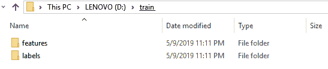
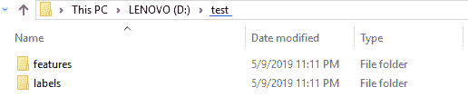
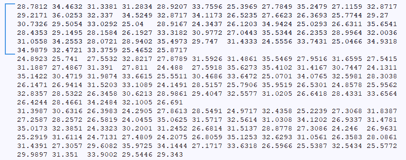
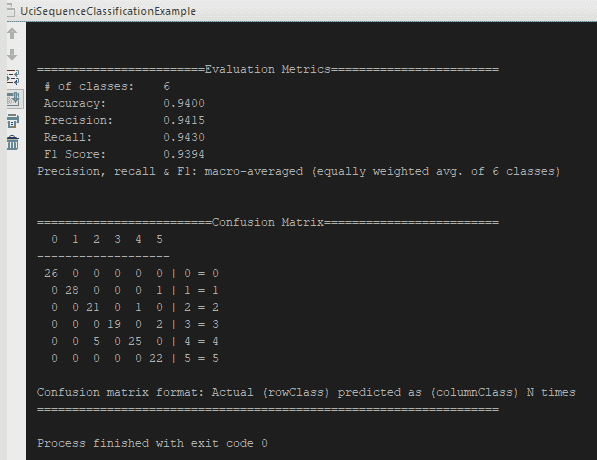
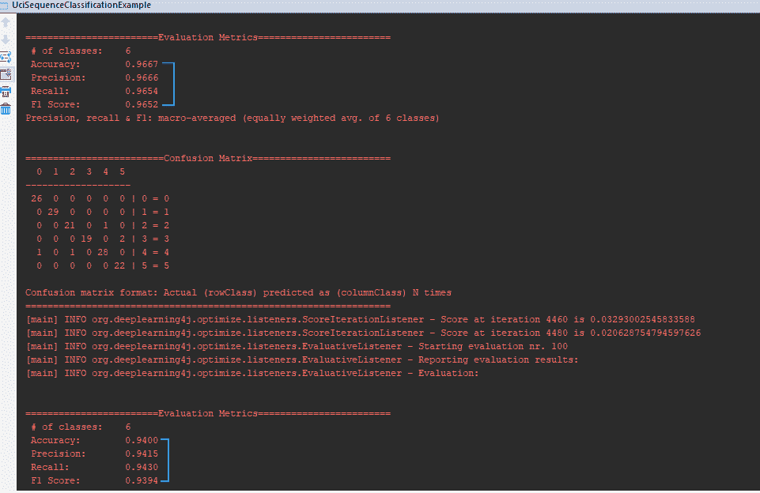

# 第七章：构建用于序列分类的 LSTM 神经网络

在上一章中，我们讨论了如何为多变量特征对时间序列数据进行分类。本章将创建一个**长短期记忆**（**LSTM**）神经网络来对单变量时间序列数据进行分类。我们的神经网络将学习如何对单变量时间序列进行分类。我们将使用**UCI**（即**加利福尼亚大学欧文分校**）的合成控制数据，并以此为基础对神经网络进行训练。数据将有 600 个序列，每个序列之间用新行分隔，方便我们的操作。每个序列将在 60 个时间步骤上记录数据。由于这是单变量时间序列，我们的 CSV 文件中将仅包含每个记录的示例列。每个序列都是一个记录的示例。我们将把这些数据序列分成训练集和测试集，分别进行训练和评估。分类/标签的可能类别如下：

+   正常

+   循环的

+   增长趋势

+   下降趋势

+   向上移动

+   向下移动

本章节我们将介绍以下食谱：

+   提取时间序列数据

+   加载训练数据

+   对训练数据进行归一化

+   构建网络的输入层

+   构建网络的输出层

+   评估 LSTM 网络的分类输出

让我们开始吧。

# 技术要求

本章节的实现代码可以在[`github.com/PacktPublishing/Java-Deep-Learning-Cookbook/blob/master/07_Constructing_LSTM_Neural_network_for_sequence_classification/sourceCode/cookbookapp/src/main/java/UciSequenceClassificationExample.java`](https://github.com/PacktPublishing/Java-Deep-Learning-Cookbook/blob/master/07_Constructing_LSTM_Neural_network_for_sequence_classification/sourceCode/cookbookapp/src/main/java/UciSequenceClassificationExample.java)找到。

克隆我们的 GitHub 仓库后，导航到`Java-Deep-Learning-Cookbook/07_Constructing_LSTM_Neural_network_for_sequence_classification/sourceCode`目录。然后将`cookbookapp`项目作为 Maven 项目导入，通过导入`pom.xml`。

从这个 UCI 网站下载数据：[`archive.ics.uci.edu/ml/machine-learning-databases/synthetic_control-mld/synthetic_control.data`](https://archive.ics.uci.edu/ml/machine-learning-databases/synthetic_control-mld/synthetic_control.data)。

我们需要创建目录来存储训练数据和测试数据。请参阅以下目录结构：



我们需要为训练集和测试集分别创建两个单独的文件夹，然后分别为`features`和`labels`创建子目录：



该文件夹结构是前述数据提取的前提条件。我们在执行提取时会将特征和标签分开。

请注意，在本食谱的所有章节中，我们使用的是 DL4J 版本 1.0.0-beta 3，除了这一章。在执行我们在本章中讨论的代码时，你可能会遇到以下错误：

```py
Exception in thread "main" java.lang.IllegalStateException: C (result) array is not F order or is a view. Nd4j.gemm requires the result array to be F order and not a view. C (result) array: [Rank: 2,Offset: 0 Order: f Shape: [10,1], stride: [1,10]]

```

在写作时，DL4J 的一个新版本已发布，解决了该问题。因此，我们将使用版本 1.0.0-beta 4 来运行本章中的示例。

# 提取时间序列数据

我们正在使用另一个时间序列的用例，但这次我们针对的是时间序列单变量序列分类。在配置 LSTM 神经网络之前，首先需要讨论 ETL。数据提取是 ETL 过程中的第一阶段。本食谱将涵盖该用例的数据提取。

# 如何操作...

1.  使用编程方式对序列数据进行分类：

```py
// convert URI to string
 final String data = IOUtils.toString(new URL(url),"utf-8");
 // Get sequences from the raw data
 final String[] sequences = data.split("\n");
 final List<Pair<String,Integer>> contentAndLabels = new ArrayList<>();
 int lineCount = 0;
 for(String sequence : sequences) {
 // Record each time step in new line
 sequence = sequence.replaceAll(" +","\n");
 // Labels: first 100 examples (lines) are label 0, second 100 examples are label 1, and so on
 contentAndLabels.add(new Pair<>(sequence, lineCount++ / 100));
 }
```

1.  按照编号格式将特征/标签存储在各自的目录中：

```py
for(Pair<String,Integer> sequencePair : contentAndLabels) {
 if(trainCount<450) {
 featureFile = new File(trainfeatureDir+trainCount+".csv");
 labelFile = new File(trainlabelDir+trainCount+".csv");
 trainCount++;
 } else {
 featureFile = new File(testfeatureDir+testCount+".csv");
 labelFile = new File(testlabelDir+testCount+".csv");
 testCount++;
 }
 }

```

1.  使用`FileUtils`将数据写入文件：

```py
FileUtils.writeStringToFile(featureFile,sequencePair.getFirst(),"utf-8");
FileUtils.writeStringToFile(labelFile,sequencePair.getSecond().toString(),"utf-8");
```

# 它是如何工作的...

下载后，当我们打开合成控制数据时，它将如下所示：



在前面的截图中标记了一个单独的序列。总共有 600 个序列，每个序列由新的一行分隔。在我们的示例中，我们可以将数据集划分为 450 个序列用于训练，剩下的 150 个序列用于评估。我们正试图将给定的序列分类到六个已知类别中。

请注意，这是一个单变量时间序列。记录在单个序列中的数据跨越不同的时间步。我们为每个单独的序列创建单独的文件。单个数据单元（观察值）在文件中由空格分隔。我们将空格替换为换行符，以便单个序列中每个时间步的测量值出现在新的一行中。前 100 个序列代表类别 1，接下来的 100 个序列代表类别 2，依此类推。由于我们处理的是单变量时间序列数据，因此 CSV 文件中只有一列。所以，单个特征在多个时间步上被记录。

在步骤 1 中，`contentAndLabels`列表将包含序列到标签的映射。每个序列代表一个标签。序列和标签一起构成一个对。

现在我们可以采用两种不同的方法来划分数据用于训练/测试：

+   随机打乱数据，选择 450 个序列用于训练，剩下的 150 个序列用于评估/测试。

+   将训练/测试数据集划分为类别在数据集中的分布均匀。例如，我们可以将训练数据划分为 420 个序列，每个类别有 70 个样本，共六个类别。

我们使用随机化作为一种提高神经网络泛化能力的手段。每个序列到标签的对都写入一个单独的 CSV 文件，遵循编号的文件命名规则。

在步骤 2 中，我们提到训练用的样本为 450 个，剩余的 150 个用于评估。

在步骤 3 中，我们使用了来自 Apache Commons 库的`FileUtils`将数据写入文件。最终的代码如下所示：

```py
for(Pair<String,Integer> sequencePair : contentAndLabels) {
     if(trainCount<traintestSplit) {
       featureFile = new File(trainfeatureDir+trainCount+".csv");
       labelFile = new File(trainlabelDir+trainCount+".csv");
       trainCount++;
     } else {
       featureFile = new File(testfeatureDir+testCount+".csv");
       labelFile = new File(testlabelDir+testCount+".csv");
       testCount++;
     }
    FileUtils.writeStringToFile(featureFile,sequencePair.getFirst(),"utf-8");
    FileUtils.writeStringToFile(labelFile,sequencePair.getSecond().toString(),"utf-8");
 }
```

我们获取序列数据并将其添加到`features`目录中，每个序列将由一个单独的 CSV 文件表示。类似地，我们将相应的标签添加到单独的 CSV 文件中。

`label` 目录中的`1.csv`将是`feature`目录中`1.csv`特征的对应标签。

# 加载训练数据

数据转换通常是数据提取后的第二个阶段。我们讨论的时间序列数据没有任何非数字字段或噪音（数据已经过清理）。因此，我们可以专注于从数据中构建迭代器，并将其直接加载到神经网络中。在本食谱中，我们将加载单变量时间序列数据用于神经网络训练。我们已经提取了合成控制数据并以合适的格式存储，以便神经网络能够轻松处理。每个序列覆盖了 60 个时间步。在本食谱中，我们将把时间序列数据加载到适当的数据集迭代器中，供神经网络进行进一步处理。

# 它是如何做的...

1.  创建一个`SequenceRecordReader`实例，从时间序列数据中提取并加载特征：

```py
SequenceRecordReader trainFeaturesSequenceReader = new CSVSequenceRecordReader();
 trainFeaturesSequenceReader.initialize(new NumberedFileInputSplit(new File(trainfeatureDir).getAbsolutePath()+"/%d.csv",0,449));
```

1.  创建一个`SequenceRecordReader`实例，从时间序列数据中提取并加载标签：

```py
SequenceRecordReader trainLabelsSequenceReader = new CSVSequenceRecordReader();
 trainLabelsSequenceReader.initialize(new NumberedFileInputSplit(new File(trainlabelDir).getAbsolutePath()+"/%d.csv",0,449));
```

1.  为测试和评估创建序列读取器：

```py
SequenceRecordReader testFeaturesSequenceReader = new CSVSequenceRecordReader();
 testFeaturesSequenceReader.initialize(new NumberedFileInputSplit(new File(testfeatureDir).getAbsolutePath()+"/%d.csv",0,149));
 SequenceRecordReader testLabelsSequenceReader = new CSVSequenceRecordReader();
 testLabelsSequenceReader.initialize(new NumberedFileInputSplit(new File(testlabelDir).getAbsolutePath()+"/%d.csv",0,149));|
```

1.  使用`SequenceRecordReaderDataSetIterator`将数据输入到我们的神经网络中：

```py
DataSetIterator trainIterator = new SequenceRecordReaderDataSetIterator(trainFeaturesSequenceReader,trainLabelsSequenceReader,batchSize,numOfClasses);

DataSetIterator testIterator = new SequenceRecordReaderDataSetIterator(testFeaturesSequenceReader,testLabelsSequenceReader,batchSize,numOfClasses);
```

1.  重写训练/测试迭代器（使用`AlignmentMode`）以支持不同长度的时间序列：

```py
DataSetIterator trainIterator = new SequenceRecordReaderDataSetIterator(trainFeaturesSequenceReader,trainLabelsSequenceReader,batchSize,numOfClasses,false, SequenceRecordReaderDataSetIterator.AlignmentMode.ALIGN_END);
```

# 它是如何工作的...

我们在步骤 1 中使用了`NumberedFileInputSplit`。必须使用`NumberedFileInputSplit`从多个遵循编号文件命名规则的文件中加载数据。请参阅本食谱中的步骤 1：

```py
SequenceRecordReader trainFeaturesSequenceReader = new CSVSequenceRecordReader();
 trainFeaturesSequenceReader.initialize(new NumberedFileInputSplit(new File(trainfeatureDir).getAbsolutePath()+"/%d.csv",0,449));
```

我们在前一个食谱中将文件存储为一系列编号文件。共有 450 个文件，每个文件代表一个序列。请注意，我们已经为测试存储了 150 个文件，如步骤 3 所示。

在步骤 5 中，`numOfClasses`指定了神经网络试图进行预测的类别数量。在我们的示例中，它是`6`。我们在创建迭代器时提到了`AlignmentMode.ALIGN_END`。对齐模式处理不同长度的输入/标签。例如，我们的时间序列数据有 60 个时间步，且只有一个标签出现在第 60 个时间步的末尾。这就是我们在迭代器定义中使用`AlignmentMode.ALIGN_END`的原因，如下所示：

```py
DataSetIterator trainIterator = new SequenceRecordReaderDataSetIterator(trainFeaturesSequenceReader,trainLabelsSequenceReader,batchSize,numOfClasses,false, SequenceRecordReaderDataSetIterator.AlignmentMode.ALIGN_END);
```

我们还可以有时间序列数据，在每个时间步产生标签。这些情况指的是多对多的输入/标签连接。

在步骤 4 中，我们开始使用常规的创建迭代器方式，如下所示：

```py
DataSetIterator trainIterator = new SequenceRecordReaderDataSetIterator(trainFeaturesSequenceReader,trainLabelsSequenceReader,batchSize,numOfClasses);

DataSetIterator testIterator = new SequenceRecordReaderDataSetIterator(testFeaturesSequenceReader,testLabelsSequenceReader,batchSize,numOfClasses);
```

请注意，这不是创建序列读取器迭代器的唯一方法。DataVec 中有多种实现可支持不同的配置。我们还可以在样本的最后时间步对输入/标签进行对齐。为此，我们在迭代器定义中添加了`AlignmentMode.ALIGN_END`。如果时间步长不一致，较短的时间序列将会填充至最长时间序列的长度。因此，如果有样本的时间步少于 60 步，则会将零值填充到时间序列数据中。

# 归一化训练数据

数据转换本身可能不会提高神经网络的效率。同一数据集中大范围和小范围的值可能会导致过拟合（模型捕捉到噪声而非信号）。为了避免这种情况，我们对数据集进行归一化，DL4J 提供了多种实现来完成这一操作。归一化过程将原始时间序列数据转换并拟合到一个确定的值范围内，例如*(0, 1)*。这将帮助神经网络以更少的计算量处理数据。我们在前面的章节中也讨论了归一化，表明它会减少在训练神经网络时对数据集中特定标签的偏倚。

# 如何操作...

1.  创建标准归一化器并拟合数据：

```py
DataNormalization normalization = new NormalizerStandardize();
 normalization.fit(trainIterator);
```

1.  调用`setPreprocessor()`方法以实时规范化数据：

```py
trainIterator.setPreProcessor(normalization);
 testIterator.setPreProcessor(normalization);

```

# 如何工作...

在第 1 步中，我们使用`NormalizerStandardize`来归一化数据集。`NormalizerStandardize`会对数据（特征）进行归一化，使其具有*0*的均值和*1*的标准差。换句话说，数据集中的所有值都将归一化到*(0, 1)*的范围内：

```py
DataNormalization normalization = new NormalizerStandardize();
 normalization.fit(trainIterator);
```

这是 DL4J 中的标准归一化器，尽管 DL4J 中还有其他归一化器实现。还请注意，我们不需要对测试数据调用`fit()`，因为我们使用在训练过程中学习到的缩放参数来缩放测试数据。

我们需要像第 2 步中展示的那样，为训练/测试迭代器调用`setPreprocessor()`方法。一旦使用`setPreprocessor()`设置了归一化器，迭代器返回的数据将会自动使用指定的归一化器进行归一化。因此，重要的是在调用`fit()`方法时同时调用`setPreprocessor()`。

# 构建网络的输入层

层配置是神经网络配置中的一个重要步骤。我们需要创建输入层来接收从磁盘加载的单变量时间序列数据。在这个示例中，我们将为我们的用例构建一个输入层。我们还将添加一个 LSTM 层作为神经网络的隐藏层。我们可以使用计算图或常规的多层网络来构建网络配置。在大多数情况下，常规多层网络就足够了；然而，我们的用例使用的是计算图。在本示例中，我们将为网络配置输入层。

# 如何操作...

1.  使用默认配置配置神经网络：

```py
NeuralNetConfiguration.Builder neuralNetConfigBuilder = new NeuralNetConfiguration.Builder();
 neuralNetConfigBuilder.seed(123);
 neuralNetConfigBuilder.weightInit(WeightInit.XAVIER);
 neuralNetConfigBuilder.updater(new Nadam());
 neuralNetConfigBuilder.gradientNormalization(GradientNormalization.ClipElementWiseAbsoluteValue);
 neuralNetConfigBuilder.gradientNormalizationThreshold(0.5);
```

1.  通过调用`addInputs()`来指定输入层标签：

```py
ComputationGraphConfiguration.GraphBuilder compGraphBuilder = neuralNetConfigBuilder.graphBuilder();
 compGraphBuilder.addInputs("trainFeatures");
```

1.  使用`addLayer()`方法添加 LSTM 层：

```py
compGraphBuilder.addLayer("L1", new LSTM.Builder().activation(Activation.TANH).nIn(1).nOut(10).build(), "trainFeatures");
```

# 工作原理...

在步骤 1 中，我们指定了默认的`seed`值、初始的默认权重（`weightInit`）、权重`updater`等。我们将梯度规范化策略设置为`ClipElementWiseAbsoluteValue`。我们还将梯度阈值设置为`0.5`，作为`gradientNormalization`策略的输入。

神经网络在每一层计算神经元的梯度。我们在*标准化训练数据*这一部分中已经使用标准化器对输入数据进行了标准化。需要提到的是，我们还需要对梯度值进行标准化，以实现数据准备的目标。如步骤 1 所示，我们使用了`ClipElementWiseAbsoluteValue`梯度标准化。它的工作方式是使梯度的绝对值不能超过阈值。例如，如果梯度阈值为 3，则值的范围为[-3, 3]。任何小于-3 的梯度值都将被视为-3，任何大于 3 的梯度值将被视为 3。范围在[-3, 3]之间的梯度值将保持不变。我们已经在网络配置中提到了梯度标准化策略和阈值，如下所示：

```py
neuralNetConfigBuilder.gradientNormalization(GradientNormalization.ClipElementWiseAbsoluteValue);
 neuralNetConfigBuilder.gradientNormalizationThreshold(thresholdValue);
```

在步骤 3 中，`trainFeatures`标签引用了输入层标签。输入基本上是由`graphBuilder()`方法返回的图顶点对象。步骤 2 中指定的 LSTM 层名称（我们示例中的`L1`）将在配置输出层时使用。如果存在不匹配，我们的程序将在执行过程中抛出错误，表示层的配置方式导致它们断开连接。我们将在下一个教程中更深入地讨论这个问题，当时我们将设计神经网络的输出层。请注意，我们尚未在配置中添加输出层。

# 为网络构建输出层

输入/隐藏层设计之后的下一步是输出层设计。正如我们在前面章节中提到的，输出层应该反映你希望从神经网络中获得的输出。根据使用场景的不同，你可能需要一个分类器或回归模型。因此，输出层必须进行配置。激活函数和误差函数需要根据其在输出层配置中的使用进行合理化。本教程假设神经网络的配置已经完成到输入层定义为止。这将是网络配置中的最后一步。

# 如何操作...

1.  使用`setOutputs()`设置输出标签：

```py
compGraphBuilder.setOutputs("predictSequence");
```

1.  使用`addLayer()`方法和`RnnOutputLayer`构造输出层：

```py
compGraphBuilder.addLayer("predictSequence", new RnnOutputLayer.Builder(LossFunctions.LossFunction.MCXENT)
 .activation(Activation.SOFTMAX).nIn(10).nOut(numOfClasses).build(), "L1");
```

# 工作原理...

在第 1 步中，我们为输出层添加了一个`predictSequence`标签。请注意，在定义输出层时，我们提到了输入层的引用。在第 2 步中，我们将其指定为`L1`，这是在前一个步骤中创建的 LSTM 输入层。我们需要提到这一点，以避免在执行过程中因 LSTM 层与输出层之间的断开连接而导致的错误。此外，输出层的定义应该与我们在`setOutput()`方法中指定的层名称相同。

在第 2 步中，我们使用`RnnOutputLayer`构建了输出层。这个 DL4J 输出层实现用于涉及递归神经网络的使用案例。它在功能上与多层感知器中的`OutputLayer`相同，但输出和标签的形状调整是自动处理的。

# 评估 LSTM 网络的分类输出

现在我们已经配置好神经网络，下一步是启动训练实例，然后进行评估。评估阶段对训练实例非常重要。神经网络将尝试优化梯度以获得最佳结果。一个最佳的神经网络将具有良好且稳定的评估指标。因此，评估神经网络以将训练过程引导至期望的结果是很重要的。我们将使用测试数据集来评估神经网络。

在上一章中，我们探讨了时间序列二分类的一个使用案例。现在我们有六个标签进行预测。我们讨论了多种方法来提高网络的效率。在下一步骤中，我们将采用相同的方法，评估神经网络的最佳结果。

# 如何做...

1.  使用`init()`方法初始化`ComputationGraph`模型配置：

```py
ComputationGraphConfiguration configuration = compGraphBuilder.build();
   ComputationGraph model = new ComputationGraph(configuration);
 model.init();
```

1.  设置分数监听器以监控训练过程：

```py
model.setListeners(new ScoreIterationListener(20), new EvaluativeListener(testIterator, 1, InvocationType.EPOCH_END));
```

1.  通过调用`fit()`方法启动训练实例：

```py
model.fit(trainIterator,numOfEpochs);
```

1.  调用`evaluate()`计算评估指标：

```py
Evaluation evaluation = model.evaluate(testIterator);
 System.out.println(evaluation.stats());
```

# 它是如何工作的...

在第 1 步中，我们在配置神经网络的结构时使用了计算图。计算图是递归神经网络的最佳选择。我们使用多层网络得到的评估得分大约为 78%，而使用计算图时得分高达 94%。使用`ComputationGraph`可以获得比常规多层感知器更好的结果。`ComputationGraph`适用于复杂的网络结构，并且可以根据不同层的顺序进行定制。第 1 步中使用了`InvocationType.EPOCH_END`（分数迭代）来在测试迭代结束时调用分数迭代器。

请注意，我们为每次测试迭代调用了分数迭代器，而不是为训练集迭代调用。为了记录每次测试迭代的分数，需要通过调用`setListeners()`设置适当的监听器，在训练事件开始之前，如下所示：

```py
model.setListeners(new ScoreIterationListener(20), new EvaluativeListener(testIterator, 1, InvocationType.EPOCH_END));
```

在第 4 步中，模型通过调用`evaluate()`进行了评估：

```py
Evaluation evaluation = model.evaluate(testIterator);
```

我们将测试数据集以迭代器的形式传递给`evaluate()`方法，这个迭代器是在*加载训练数据*步骤中创建的。

此外，我们使用`stats()`方法来显示结果。对于一个有 100 个训练周期（epochs）的计算图，我们得到以下评估指标：



现在，以下是您可以执行的实验，以便进一步优化结果。

我们在示例中使用了 100 个训练周期。您可以将训练周期从 100 减少，或者将其设置为一个特定的值。注意哪个方向能带来更好的结果。当结果达到最佳时停止。我们可以在每个训练周期结束后评估一次结果，以了解我们应该朝哪个方向继续。请查看以下训练实例日志：



在前面的示例中，准确率在上一个训练周期后下降。因此，您可以决定最佳的训练周期数量。如果我们选择更大的训练周期，神经网络将仅仅记住结果，这会导致过拟合。

在最开始没有对数据进行随机化时，您可以确保六个类别在训练集中的分布是均匀的。例如，我们可以将 420 个样本用于训练，180 个样本用于测试。这样，每个类别将有 70 个样本。然后，我们可以进行随机化，并创建迭代器。请注意，在我们的示例中，我们有 450 个用于训练的样本。在这种情况下，标签/类别的分布并不是唯一的，我们完全依赖于数据的随机化。
