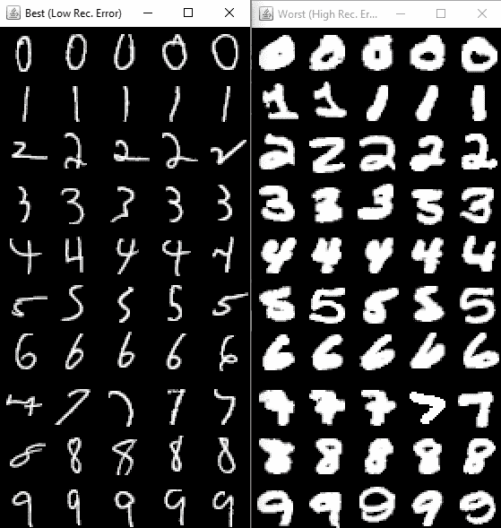

# 第八章：在无监督数据上执行异常检测

在本章中，我们将使用**修改版国家标准与技术研究院**（**MNIST**）数据集，通过一个简单的自编码器进行异常检测，且没有任何预训练。我们将识别给定 MNIST 数据中的离群值。离群数字可以被认为是最不典型或不正常的数字。我们将对 MNIST 数据进行编码，然后在输出层解码回来。然后，我们将计算 MNIST 数据的重建误差。

与数字值相似的 MNIST 样本将具有较低的重建误差。然后，我们将根据重建误差对它们进行排序，并使用 JFrame 窗口显示最佳样本和最差样本（离群值）。自编码器使用前馈网络构建。请注意，我们并没有进行任何预训练。我们可以在自编码器中处理特征输入，并且在任何阶段都不需要 MNIST 标签。

在本章中，我们将涵盖以下食谱：

+   提取并准备 MNIST 数据

+   构建输入的密集层

+   构建输出层

+   使用 MNIST 图像进行训练

+   根据异常得分评估并排序结果

+   保存生成的模型

让我们开始吧。

# 技术要求

本章节的代码可以在这里找到：[`github.com/PacktPublishing/Java-Deep-Learning-Cookbook/blob/master/08_Performing_Anomaly_detection_on_unsupervised%20data/sourceCode/cookbook-app/src/main/java/MnistAnomalyDetectionExample.java`](https://github.com/PacktPublishing/Java-Deep-Learning-Cookbook/blob/master/08_Performing_Anomaly_detection_on_unsupervised%20data/sourceCode/cookbook-app/src/main/java/MnistAnomalyDetectionExample.java)

JFrame 特定的实现可以在这里找到：

[`github.com/PacktPublishing/Java-Deep-Learning-Cookbook/blob/master/08_Performing_Anomaly_detection_on_unsupervised%20data/sourceCode/cookbook-app/src/main/java/MnistAnomalyDetectionExample.java#L134`](https://github.com/PacktPublishing/Java-Deep-Learning-Cookbook/blob/master/08_Performing_Anomaly_detection_on_unsupervised%20data/sourceCode/cookbook-app/src/main/java/MnistAnomalyDetectionExample.java#L134)

克隆我们的 GitHub 仓库后，导航到`Java-Deep-Learning-Cookbook/08_Performing_Anomaly_detection_on_unsupervised data/sourceCode`目录。然后，通过导入`pom.xml`将`cookbook-app`项目作为 Maven 项目导入。

请注意，我们使用的 MNIST 数据集可以在这里找到：[`yann.lecun.com/exdb/mnist/`](http://yann.lecun.com/exdb/mnist/)

但是，我们不需要为本章下载数据集：DL4J 有一个自定义实现，允许我们自动获取 MNIST 数据。我们将在本章中使用它。

# 提取并准备 MNIST 数据

与有监督的图像分类任务不同，我们将对 MNIST 数据集执行异常检测任务。更重要的是，我们使用的是无监督模型，这意味着我们在训练过程中不会使用任何类型的标签。为了启动 ETL 过程，我们将提取这种无监督的 MNIST 数据并将其准备好，以便可以用于神经网络的训练。

# 如何操作...

1.  使用 `MnistDataSetIterator` 为 MNIST 数据创建迭代器：

```py
DataSetIterator iter = new MnistDataSetIterator(miniBatchSize,numOfExamples,binarize);
```

1.  使用 `SplitTestAndTrain` 将基础迭代器拆分为训练/测试迭代器：

```py
DataSet ds = iter.next();
 SplitTestAndTrain split = ds.splitTestAndTrain(numHoldOut, new Random(12345));
```

1.  创建列表以存储来自训练/测试迭代器的特征集：

```py
List<INDArray> featuresTrain = new ArrayList<>();
 List<INDArray> featuresTest = new ArrayList<>();
 List<INDArray> labelsTest = new ArrayList<>();
```

1.  将之前创建的特征/标签列表填充数据：

```py
featuresTrain.add(split.getTrain().getFeatures());
 DataSet dsTest = split.getTest();
 featuresTest.add(dsTest.getFeatures());
 INDArray indexes = Nd4j.argMax(dsTest.getLabels(),1);
 labelsTest.add(indexes);
```

1.  对每个迭代器实例调用 `argmax()`，如果标签是多维的，则将其转换为一维数据：

```py
while(iter.hasNext()){
 DataSet ds = iter.next();
 SplitTestAndTrain split = ds.splitTestAndTrain(80, new Random(12345)); // 80/20 split (from miniBatch = 100)
 featuresTrain.add(split.getTrain().getFeatures());
 DataSet dsTest = split.getTest();
 featuresTest.add(dsTest.getFeatures());
 INDArray indexes = Nd4j.argMax(dsTest.getLabels(),1);
 labelsTest.add(indexes);
 }
```

# 它是如何工作的...

在步骤 1 中，我们使用 `MnistDataSetIterator` 在一个地方提取并加载 MNIST 数据。DL4J 提供了这个专门的迭代器来加载 MNIST 数据，而无需担心自行下载数据。你可能会注意到，MNIST 数据在官方网站上是 `ubyte` 格式。这显然不是我们想要的格式，因此我们需要分别提取所有的图像，以便正确加载到神经网络中。

因此，在 DL4J 中拥有像 `MnistDataSetIterator` 这样的 MNIST 迭代器实现非常方便。它简化了处理 `ubyte` 格式 MNIST 数据的常见任务。MNIST 数据共有 60,000 个训练数字，10,000 个测试数字和 10 个标签。数字图像的尺寸为 28 x 28，数据的形状是扁平化格式：[ `minibatch`，784]。`MnistDataSetIterator` 内部使用 `MnistDataFetcher` 和 `MnistManager` 类来获取 MNIST 数据并将其加载到正确的格式中。在步骤 1 中，`binarize`：`true` 或 `false` 表示是否对 MNIST 数据进行二值化。

请注意，在步骤 2 中，`numHoldOut` 表示用于训练的样本数量。如果 `miniBatchSize` 为 `100` 且 `numHoldOut` 为 `80`，则剩余的 20 个样本用于测试和评估。我们可以使用 `DataSetIteratorSplitter` 代替步骤 2 中提到的 `SplitTestAndTrain` 进行数据拆分。

在步骤 3 中，我们创建了列表来维护与训练和测试相关的特征和标签。它们分别用于训练和评估阶段。我们还创建了一个列表，用于存储来自测试集的标签，在测试和评估阶段将异常值与标签进行映射。这些列表在每次批次发生时都会填充一次。例如，在 `featuresTrain` 或 `featuresTest` 的情况下，一个批次的特征（经过数据拆分后）由一个 `INDArray` 项表示。我们还使用了 ND4J 中的 `argMax()` 函数，它将标签数组转换为一维数组。MNIST 标签从 `0` 到 `9` 实际上只需要一维空间来表示。

在以下代码中，`1` 表示维度：

```py
Nd4j.argMax(dsTest.getLabels(),1);
```

同时请注意，我们使用标签来映射异常值，而不是用于训练。

# 构建输入的密集层

神经网络设计的核心是层架构。对于自编码器，我们需要设计在前端进行编码、在另一端进行解码的密集层。基本上，我们就是通过这种方式重建输入。因此，我们需要设计我们的层结构。

让我们从配置默认设置开始设置我们的自编码器，然后进一步定义自编码器所需的输入层。记住，神经网络的输入连接数应等于输出连接数。

# 如何做...

1.  使用`MultiLayerConfiguration`构建自编码器网络：

```py
NeuralNetConfiguration.Builder configBuilder = new NeuralNetConfiguration.Builder();
 configBuilder.seed(12345);
 configBuilder.weightInit(WeightInit.XAVIER);
 configBuilder.updater(new AdaGrad(0.05));
 configBuilder.activation(Activation.RELU);
 configBuilder.l2(l2RegCoefficient);
 NeuralNetConfiguration.ListBuilder builder = configBuilder.list();
```

1.  使用`DenseLayer`创建输入层：

```py
builder.layer(new DenseLayer.Builder().nIn(784).nOut(250).build());
 builder.layer(new DenseLayer.Builder().nIn(250).nOut(10).build());
```

# 它是如何工作的...

在第 1 步中，在配置通用神经网络参数时，我们设置了默认的学习率，如下所示：

```py
configBuilder.updater(new AdaGrad(learningRate));
```

`Adagrad`优化器基于在训练期间参数更新的频率。`Adagrad`基于矢量化学习率。当接收到更多更新时，学习率会较小。这对于高维度问题至关重要。因此，这个优化器非常适合我们的自编码器应用场景。

在自编码器架构中，我们在输入层执行降维。这也被称为对数据进行编码。我们希望确保从编码数据中解码出相同的特征集合。我们计算重建误差，以衡量我们与编码前的真实特征集合有多接近。在第 2 步中，我们尝试将数据从较高维度（`784`）编码到较低维度（`10`）。

# 构建输出层

作为最后一步，我们需要将数据从编码状态解码回原始状态。我们能否完美地重建输入？如果可以，那么一切都好。否则，我们需要计算相关的重建误差。记住，输出层的输入连接应该与前一层的输出连接相同。

# 如何做...

1.  使用`OutputLayer`创建一个输出层：

```py
OutputLayer outputLayer = new OutputLayer.Builder().nIn(250).nOut(784)
 .lossFunction(LossFunctions.LossFunction.MSE)
 .build();
```

1.  将`OutputLayer`添加到层定义中：

```py
builder.layer(new OutputLayer.Builder().nIn(250).nOut(784)
 .lossFunction(LossFunctions.LossFunction.MSE)
 .build());
```

# 它是如何工作的...

我们提到了**均方误差**（**MSE**）作为与输出层相关的误差函数。`lossFunction`，在自编码器架构中，通常是 MSE。MSE 在计算重建输入与原始输入之间的接近程度时是最优的。ND4J 有一个 MSE 的实现，即`LossFunction.MSE`。

在输出层，我们得到重建后的输入，并且它们的维度与原始输入相同。然后我们将使用误差函数来计算重建误差。在第 1 步中，我们构建了一个输出层，用于计算异常检测的重建误差。重要的是，输入和输出层的输入连接和输出连接需要保持一致。一旦定义了输出层，我们需要将其添加到一个层配置堆栈中，以此来创建神经网络的配置。在第 2 步中，我们将输出层添加到之前维护的神经网络配置构建器中。为了遵循直观的方法，我们首先创建了配置构建器，而不像这里所采用的简单方法：[`github.com/PacktPublishing/Java-Deep-Learning-Cookbook/blob/master/08_Performing_Anomaly_detection_on_unsupervised%20data/sourceCode/cookbook-app/src/main/java/MnistAnomalyDetectionExample.java`](https://github.com/PacktPublishing/Java-Deep-Learning-Cookbook/blob/master/08_Performing_Anomaly_detection_on_unsupervised%20data/sourceCode/cookbook-app/src/main/java/MnistAnomalyDetectionExample.java)。

你可以通过在`Builder`实例上调用`build()`方法来获取配置实例。

# 使用 MNIST 图像进行训练

一旦构建了各层并形成了神经网络，我们就可以启动训练过程。在训练过程中，我们会多次重建输入并评估重建误差。在之前的示例中，我们通过根据需要定义输入和输出层完成了自编码器网络配置。请注意，我们将使用自编码器进行异常检测，因此我们使用其自身的输入特征来训练网络，而不是标签。因为我们使用自编码器进行异常检测，所以我们先编码数据，然后再解码回来以衡量重建误差。基于此，我们列出 MNIST 数据中最可能的异常。

# 如何操作...

1.  选择正确的训练方法。以下是训练过程中预期会发生的情况：

```py
 Input -> Encoded Input -> Decode -> Output
```

所以，我们需要训练输出与输入相对应（理想情况下，输出 ~ 输入）。

1.  使用`fit()`方法训练每个特征集：

```py
int nEpochs = 30;
 for( int epoch=0; epoch<nEpochs; epoch++ ){
 for(INDArray data : featuresTrain){
 net.fit(data,data);
 }
 }
```

# 它是如何工作的...

`fit()`方法接受特征和标签作为第一和第二个属性。我们会将 MNIST 特征与它们自己进行重建。换句话说，我们试图在特征被编码后重新创建它们，并检查它们与实际特征的差异。在训练过程中，我们测量重建误差，并且只关注特征值。因此，输出将与输入进行验证，并类似于自编码器的功能。所以，第 1 步对于评估阶段也至关重要。

请参考以下代码块：

```py
for(INDArray data : featuresTrain){
 net.fit(data,data);
}
```

这就是我们为何将自编码器训练为其自身特征（输入）的原因，在第 2 步中我们通过这种方式调用`fit()`：`net.fit(data,data)`。

# 根据异常评分评估和排序结果

我们需要计算所有特征集的重建误差。根据这个，我们会找出所有 MNIST 数字（0 到 9）的离群数据。最后，我们将在 JFrame 窗口中显示离群数据。我们还需要来自测试集的特征值用于评估。我们还需要来自测试集的标签值，标签不是用来评估的，而是用于将异常与标签关联。然后，我们可以根据每个标签绘制离群数据。标签仅用于在 JFrame 中根据相应的标签绘制离群数据。在本配方中，我们评估了训练好的自编码器模型用于 MNIST 异常检测，然后排序结果并显示出来。

# 如何操作...

1.  构建一个将每个 MNIST 数字与一组(score, feature)对相关联的映射：

```py
Map<Integer,List<Pair<Double,INDArray>>> listsByDigit = new HashMap<>();
```

1.  遍历每一个测试特征，计算重建误差，生成分数-特征对用于显示具有低重建误差的样本：

```py
for( int i=0; i<featuresTest.size(); i++ ){
 INDArray testData = featuresTest.get(i);
 INDArray labels = labelsTest.get(i);
 for( int j=0; j<testData.rows(); j++){
 INDArray example = testData.getRow(j, true);
 int digit = (int)labels.getDouble(j);
 double score = net.score(new DataSet(example,example));
 // Add (score, example) pair to the appropriate list
 List digitAllPairs = listsByDigit.get(digit);
 digitAllPairs.add(new Pair<>(score, example));
 }
 }
```

1.  创建一个自定义的比较器来排序映射：

```py
Comparator<Pair<Double, INDArray>> sortComparator = new Comparator<Pair<Double, INDArray>>() {
 @Override
 public int compare(Pair<Double, INDArray> o1, Pair<Double, INDArray> o2) {
 return Double.compare(o1.getLeft(),o2.getLeft());
 }
 };
```

1.  使用`Collections.sort()`对映射进行排序：

```py
for(List<Pair<Double, INDArray>> digitAllPairs : listsByDigit.values()){
 Collections.sort(digitAllPairs, sortComparator);
 }
```

1.  收集最佳/最差数据，以在 JFrame 窗口中显示用于可视化：

```py
List<INDArray> best = new ArrayList<>(50);
 List<INDArray> worst = new ArrayList<>(50);
 for( int i=0; i<10; i++ ){
 List<Pair<Double,INDArray>> list = listsByDigit.get(i);
 for( int j=0; j<5; j++ ){
 best.add(list.get(j).getRight());
 worst.add(list.get(list.size()-j-1).getRight());
 }
 }
```

1.  使用自定义的 JFrame 实现进行可视化，比如`MNISTVisualizer`，来展示结果：

```py
//Visualize the best and worst digits
 MNISTVisualizer bestVisualizer = new MNISTVisualizer(imageScale,best,"Best (Low Rec. Error)");
 bestVisualizer.visualize();
 MNISTVisualizer worstVisualizer = new MNISTVisualizer(imageScale,worst,"Worst (High Rec. Error)");
 worstVisualizer.visualize();
```

# 它是如何工作的...

通过步骤 1 和步骤 2，对于每个 MNIST 数字，我们维护一个(score, feature)对的列表。我们构建了一个将每个 MNIST 数字与这个列表相关联的映射。最后，我们只需要排序就可以找到最好的/最差的案例。

我们还使用了`score()`函数来计算重建误差：

```py
double score = net.score(new DataSet(example,example));
```

在评估过程中，我们会重建测试特征，并测量它与实际特征值的差异。较高的重建误差表明存在较高比例的离群值。

在步骤 4 之后，我们应该能看到 JFrame 可视化的重建误差，如下所示：



可视化依赖于 JFrame。基本上，我们所做的是从第 1 步中创建的映射中取出*N*个最佳/最差的对。我们制作一个最佳/最差数据的列表，并将其传递给我们的 JFrame 可视化逻辑，以便在 JFrame 窗口中显示离群值。右侧的 JFrame 窗口表示离群数据。我们将 JFrame 的实现留到一边，因为这超出了本书的范围。完整的 JFrame 实现请参考“技术要求”部分中提到的 GitHub 源代码。

# 保存结果模型

模型持久化非常重要，因为它使得无需重新训练即可重复使用神经网络模型。一旦自编码器被训练用于执行离群值检测，我们就可以将模型保存到磁盘以供以后使用。我们在前一章中解释了`ModelSerializer`类，我们用它来保存自编码器模型。

# 如何操作...

1.  使用`ModelSerializer`持久化模型：

```py
File modelFile = new File("model.zip");
 ModelSerializer.writeModel(multiLayerNetwork,file, saveUpdater);
```

1.  向持久化模型中添加一个标准化器：

```py
ModelSerializer.addNormalizerToModel(modelFile,dataNormalization);
```

# 它是如何工作的...

在本章中，我们正式针对 DL4J 版本 1.0.0-beta 3。我们使用`ModelSerializer`将模型保存到磁盘。如果你使用的是新版本 1.0.0-beta 4，还有另一种推荐的保存模型方法，即使用`MultiLayerNetwork`提供的`save()`方法：

```py
File locationToSave = new File("MyMultiLayerNetwork.zip");
   model.save(locationToSave, saveUpdater);
```

如果你希望未来训练网络，使用`saveUpdater = true`。

# 还有更多内容...

要恢复网络模型，调用`restoreMultiLayerNetwork()`方法：

```py
ModelSerializer.restoreMultiLayerNetwork(new File("model.zip"));
```

此外，如果你使用最新版本 1.0.0-beta 4，你可以使用`MultiLayerNetwork`提供的`load()`方法：

```py
MultiLayerNetwork restored = MultiLayerNetwork.load(locationToSave, saveUpdater);
```
