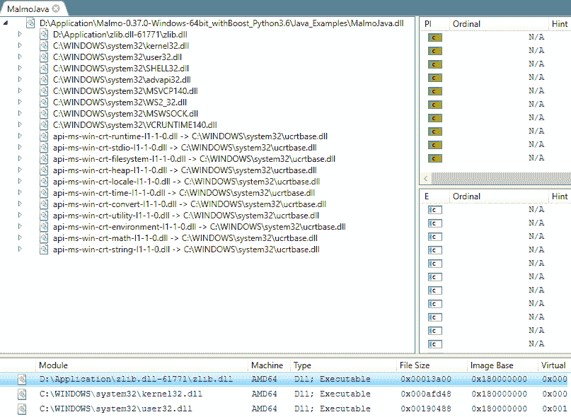
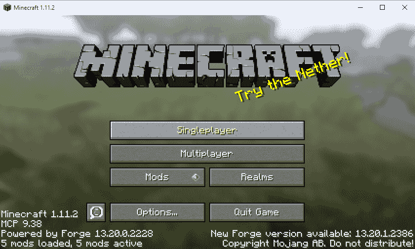
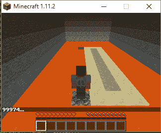
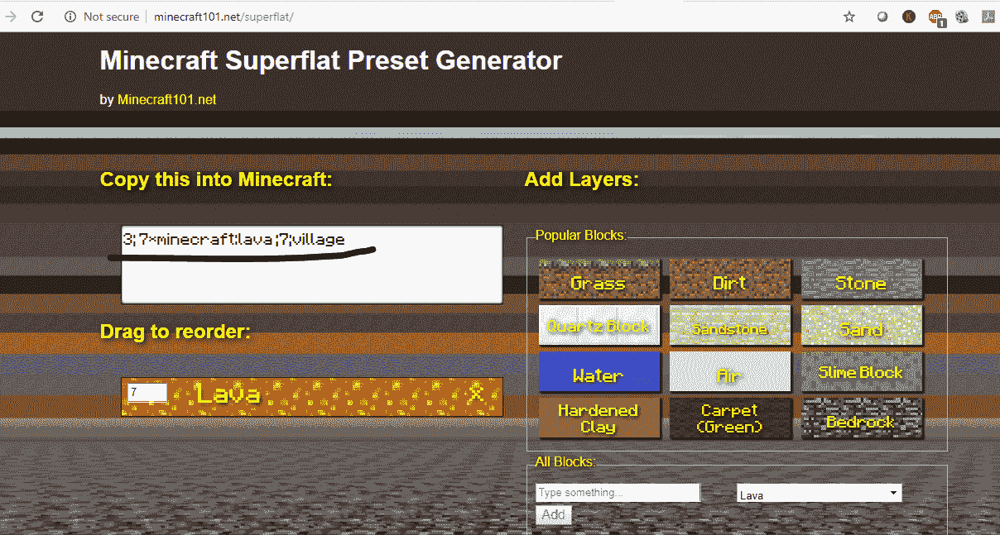
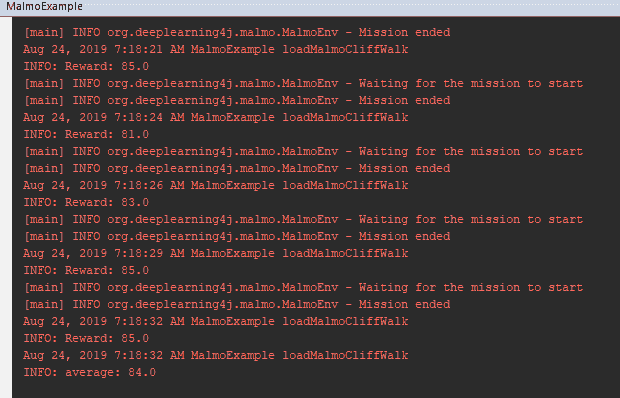
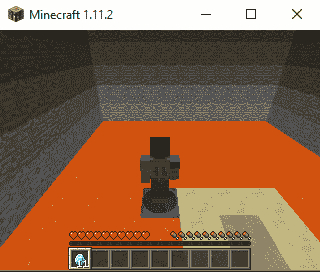

# 第九章：使用 RL4J 进行强化学习

强化学习是一种以目标为导向的机器学习算法，它训练智能体做出一系列决策。对于深度学习模型，我们在现有数据上训练它们，并将学习应用于新数据或未见过的数据。强化学习通过根据持续反馈调整自己的行为来展现动态学习，以最大化奖励。我们可以将深度学习引入强化学习系统，这就是深度强化学习。

RL4J 是一个与 DL4J 集成的强化学习框架。RL4J 支持两种强化学习算法：深度 Q 学习和 A3C（即**异步演员-评论家智能体**）。Q 学习是一种离策略强化学习算法，旨在为给定的状态寻求最佳动作。它通过采取随机动作从当前策略之外的动作中学习。在深度 Q 学习中，我们使用深度神经网络来找到最佳的 Q 值，而不是像常规 Q 学习那样使用值迭代。在本章中，我们将使用 Project Malmo 设置一个由强化学习驱动的游戏环境。Project Malmo 是一个基于 Minecraft 的强化学习实验平台。

本章将涵盖以下内容：

+   设置 Malmo 环境及相关依赖

+   设置数据要求

+   配置和训练一个深度 Q 网络（DQN）智能体

+   评估 Malmo 智能体

# 技术要求

本章的源代码可以在这里找到：

[`github.com/PacktPublishing/Java-Deep-Learning-Cookbook/blob/master/09_Using_RL4J_for_Reinforcement%20learning/sourceCode/cookbookapp/src/main/java/MalmoExample.java`](https://github.com/PacktPublishing/Java-Deep-Learning-Cookbook/blob/master/09_Using_RL4J_for_Reinforcement%20learning/sourceCode/cookbookapp/src/main/java/MalmoExample.java)

克隆我们的 GitHub 仓库后，导航到`Java-Deep-Learning-Cookbook/09_Using_RL4J_for_Reinforcement learning/sourceCode`目录。然后，通过导入`pom.xml`将`cookbookapp`项目作为 Maven 项目导入。

你需要设置一个 Malmo 客户端来运行源代码。首先，根据你的操作系统下载最新的 Project Malmo 版本：[`github.com/Microsoft/malmo/releases`](https://github.com/Microsoft/malmo/releases)

+   对于 Linux 操作系统，按照此处的安装说明操作：[`github.com/microsoft/malmo/blob/master/doc/install_linux.md`](https://github.com/microsoft/malmo/blob/master/doc/install_linux.md)

+   对于 Windows 操作系统，按照此处的安装说明操作：[`github.com/microsoft/malmo/blob/master/doc/install_windows.md`](https://github.com/microsoft/malmo/blob/master/doc/install_windows.md)

+   对于 macOS 操作系统，按照此处的安装说明操作：[`github.com/microsoft/malmo/blob/master/doc/install_macosx.md`](https://github.com/microsoft/malmo/blob/master/doc/install_macosx.md)

要启动 Minecraft 客户端，请导航到 Minecraft 目录并运行客户端脚本：

+   双击`launchClient.bat`（在 Windows 上）。

+   在控制台上运行`./launchClient.sh`（无论是在 Linux 还是 macOS 上）。

如果你在 Windows 上遇到启动客户端时的问题，可以在这里下载依赖关系查看工具：[`lucasg.github.io/Dependencies/`](https://lucasg.github.io/Dependencies/)。

然后，按照以下步骤操作：

1.  解压并运行`DependenciesGui.exe`。

1.  在`Java_Examples`目录中选择`MalmoJava.dll`，查看类似下面所示的缺失依赖项：



如果出现任何问题，缺失的依赖项将在列表中标记出来。你需要添加缺失的依赖项，以便成功重新启动客户端。任何缺失的库/文件应该存在于`PATH`环境变量中。

你可以参考此处的操作系统特定构建说明：

+   [`github.com/microsoft/malmo/blob/master/doc/build_linux.md`](https://github.com/microsoft/malmo/blob/master/doc/build_linux.md) (Linux)

+   [`github.com/microsoft/malmo/blob/master/doc/build_windows.md`](https://github.com/microsoft/malmo/blob/master/doc/build_windows.md) (Windows)

+   [`github.com/microsoft/malmo/blob/master/doc/build_macosx.md`](https://github.com/microsoft/malmo/blob/master/doc/build_macosx.md) (macOS)

如果一切顺利，你应该能看到类似下面的画面：



此外，你需要创建一个任务架构来构建游戏窗口的模块。完整的任务架构可以在本章节的项目目录中找到：[`github.com/PacktPublishing/Java-Deep-Learning-Cookbook/blob/master/09_Using_RL4J_for_Reinforcement%20learning/sourceCode/cookbookapp/src/main/resources/cliff_walking_rl4j.xml`](https://github.com/PacktPublishing/Java-Deep-Learning-Cookbook/blob/master/09_Using_RL4J_for_Reinforcement%20learning/sourceCode/cookbookapp/src/main/resources/cliff_walking_rl4j.xml)。

# 设置 Malmo 环境及其相关依赖

我们需要设置 RL4J Malmo 依赖项来运行源代码。就像任何其他 DL4J 应用一样，我们还需要根据硬件（CPU/GPU）添加 ND4J 后端依赖。在本教程中，我们将添加所需的 Maven 依赖并设置环境来运行应用程序。

# 准备工作

在我们运行 Malmo 示例源代码之前，Malmo 客户端应该已经启动并正常运行。我们的源代码将与 Malmo 客户端进行通信，以便创建并执行任务。

# 如何操作...

1.  添加 RL4J 核心依赖：

```py
<dependency>
 <groupId>org.deeplearning4j</groupId>
 <artifactId>rl4j-core</artifactId>
 <version>1.0.0-beta3</version>
 </dependency>
```

1.  添加 RL4J Malmo 依赖：

```py
<dependency>
 <groupId>org.deeplearning4j</groupId>
 <artifactId>rl4j-malmo</artifactId>
 <version>1.0.0-beta3</version>
 </dependency>
```

1.  为 ND4J 后端添加依赖：

    +   对于 CPU，你可以使用以下配置：

```py
<dependency>
 <groupId>org.nd4j</groupId>
 <artifactId>nd4j-native-platform</artifactId>
 <version>1.0.0-beta3</version>
 </dependency>
```

+   +   对于 GPU，你可以使用以下配置：

```py
<dependency>
 <groupId>org.nd4j</groupId>
 <artifactId>nd4j-cuda-10.0</artifactId>
 <version>1.0.0-beta3</version>
 </dependency>
```

1.  为`MalmoJavaJar`添加 Maven 依赖：

```py
<dependency>
 <groupId>com.microsoft.msr.malmo</groupId>
 <artifactId>MalmoJavaJar</artifactId>
 <version>0.30.0</version>
 </dependency>
```

# 它是如何工作的...

在第 1 步中，我们添加了 RL4J 核心依赖项，将 RL4J DQN 库引入到我们的应用程序中。在第 2 步中，添加了 RL4J Malmo 依赖项，以构建 Malmo 环境并在 RL4J 中构建任务。

我们还需要添加特定于 CPU/GPU 的 ND4J 后端依赖项（第 3 步）。最后，在第 4 步中，我们添加了`MalmoJavaJar`的依赖项（第 4 步），它作为 Java 程序与 Malmo 交互的通信接口。

# 设置数据要求

Malmo 强化学习环境的数据包括代理正在移动的图像帧。Malmo 的示例游戏窗口如下所示。这里，如果代理走过熔岩，它会死亡：



Malmo 要求开发者指定 XML 模式以生成任务。我们需要为代理和服务器创建任务数据，以便在世界中创建方块（即游戏环境）。在本示例中，我们将创建一个 XML 模式来指定任务数据。

# 如何执行此操作...

1.  使用`<ServerInitialConditions>`标签定义世界的初始条件：

```py
Sample:
 <ServerInitialConditions>
 <Time>
 <StartTime>6000</StartTime>
 <AllowPassageOfTime>false</AllowPassageOfTime>
 </Time>
 <Weather>clear</Weather>
 <AllowSpawning>false</AllowSpawning>
 </ServerInitialConditions>
```

1.  访问[`www.minecraft101.net/superflat/`](http://www.minecraft101.net/superflat/)并为超平坦世界创建您自己的预设字符串：



1.  使用`<FlatWorldGenerator>`标签生成具有指定预设字符串的超平坦世界：

```py

<FlatWorldGenerator generatorString="3;7,220*1,5*3,2;3;,biome_1"/>
```

1.  使用`<DrawingDecorator>`标签在世界中绘制结构：

```py
Sample:
 <DrawingDecorator>
 <!-- coordinates for cuboid are inclusive -->
 <DrawCuboid x1="-2" y1="46" z1="-2" x2="7" y2="50" z2="18" type="air" />
 <DrawCuboid x1="-2" y1="45" z1="-2" x2="7" y2="45" z2="18" type="lava" />
 <DrawCuboid x1="1" y1="45" z1="1" x2="3" y2="45" z2="12" type="sandstone" />
 <DrawBlock x="4" y="45" z="1" type="cobblestone" />
 <DrawBlock x="4" y="45" z="12" type="lapis_block" />
 <DrawItem x="4" y="46" z="12" type="diamond" />
 </DrawingDecorator>
```

1.  使用`<ServerQuitFromTimeUp>`标签为所有代理指定时间限制：

```py
<ServerQuitFromTimeUp timeLimitMs="100000000"/>
```

1.  使用`<ServerHandlers>`标签将所有任务处理器添加到方块中：

```py
<ServerHandlers>
 <FlatWorldGenerator>{Copy from step 3}</FlatWorldGenerator>
 <DrawingDecorator>{Copy from step 4}</DrawingDecorator>
 <ServerQuitFromTimeUp>{Copy from step 5}</ServerQuitFromTimeUp>
 </ServerHandlers>
```

1.  在`<ServerSection>`标签下添加`<ServerHandlers>`和`<ServerInitialConditions>`：

```py
<ServerSection>
 <ServerInitialConditions>{Copy from step 1}</ServerInitialConditions>
 <ServerHandlers>{Copy from step 6}</ServerHandlers>
 </ServerSection>
```

1.  定义代理的名称和起始位置：

```py
Sample:
 <Name>Cristina</Name>
 <AgentStart>
   <Placement x="4.5" y="46.0" z="1.5" pitch="30" yaw="0"/>
 </AgentStart>
```

1.  使用`<ObservationFromGrid>`标签定义方块类型：

```py
Sample:
 <ObservationFromGrid>
  <Grid name="floor">
  <min x="-4" y="-1" z="-13"/>
  <max x="4" y="-1" z="13"/>
  </Grid>
 </ObservationFromGrid>
```

1.  使用`<VideoProducer>`标签配置视频帧：

```py
Sample:
 <VideoProducer viewpoint="1" want_depth="false">
 <Width>320</Width>
 <Height>240</Height>
 </VideoProducer>
```

1.  提到当代理与使用`<RewardForTouchingBlockType>`标签的方块类型接触时将获得的奖励点数：

```py
Sample:
 <RewardForTouchingBlockType>
 <Block reward="-100.0" type="lava" behaviour="onceOnly"/>
 <Block reward="100.0" type="lapis_block" behaviour="onceOnly"/>
 </RewardForTouchingBlockType>
```

1.  提到奖励点数以向代理发出命令，使用`<RewardForSendingCommand>`标签：

```py
Sample:
 <RewardForSendingCommand reward="-1"/>
```

1.  使用`<AgentQuitFromTouchingBlockType>`标签为代理指定任务终点：

```py
<AgentQuitFromTouchingBlockType>
  <Block type="lava" />
  <Block type="lapis_block" />
 </AgentQuitFromTouchingBlockType>
```

1.  在`<AgentHandlers>`标签下添加所有代理处理器函数：

```py
<AgentHandlers>
   <ObservationFromGrid>{Copy from step 9}</ObservationFromGrid>
   <VideoProducer></VideoProducer> // Copy from step 10
   <RewardForTouchingBlockType>{Copy from step 11}</RewardForTouchingBlockType>
   <RewardForSendingCommand> // Copy from step 12
   <AgentQuitFromTouchingBlockType>{Copy from step 13}  </AgentQuitFromTouchingBlockType>
 </AgentHandlers>
```

1.  将所有代理处理器添加到`<AgentSection>`中：

```py
<AgentSection mode="Survival">
     <AgentHandlers>
        {Copy from step 14}
     </AgentHandlers>
 </AgentSection>
```

1.  创建一个`DataManager`实例来记录训练数据：

```py
DataManager manager = new DataManager(false);
```

# 它是如何工作的...

在第 1 步中，以下配置被添加为世界的初始条件：

+   `StartTime`：这指定了任务开始时的时间，以千分之一小时为单位。6000 表示中午 12 点。

+   `AllowPassageOfTime`：如果设置为`false`，则会停止昼夜循环。在任务期间，天气和太阳位置将保持不变。

+   `Weather`：这指定了任务开始时的天气类型。

+   `AllowSpawning`：如果设置为`true`，则在任务期间将生成动物和敌对生物。

在*第 2 步*中，我们创建了一个预设字符串来表示在第 3 步中使用的超平面类型。超平面类型指的就是任务中看到的表面类型。

在第 4 步，我们使用 `DrawCuboid` 和 `DrawBlock` 向世界中绘制了结构。

我们遵循三维空间 `(x1,y1,z1)` -> `(x2,y2,z2)` 来指定边界。`type` 属性用于表示块类型。你可以为实验添加任何 198 个可用的块。

在第 6 步，我们将所有与世界创建相关的任务处理程序添加到`<ServerHandlers>`标签下。然后，在第 7 步，我们将它们添加到`<ServerSection>`父标签中。

在第 8 步，`<Placement>`标签用于指定玩家的起始位置。如果未指定起始点，它将随机选择。

在第 9 步，我们指定了游戏窗口中地面块的位置。在第 10 步，`viewpoint` 设置了相机的视角：

```py
viewpoint=0 -> first-person
 viewpoint=1 -> behind
 viewpoint=2 -> facing

```

在第 13 步，我们指定了智能体移动在步骤结束后会停止的块类型。最后，我们在第 15 步的 `AgentSection` 标签中添加了所有特定于智能体的任务处理程序。任务架构创建将在第 15 步结束。

现在，我们需要存储来自任务的训练数据。我们使用 `DataManager` 来处理训练数据的记录。如果`rl4j-data`目录不存在，它会创建该目录，并随着强化学习训练的进行存储训练数据。我们在第 16 步创建 `DataManager` 时传递了 `false` 作为属性。这意味着我们不会持久化训练数据或模型。如果要持久化训练数据和模型，请传递 `true`。请注意，在配置 DQN 时，我们需要用到数据管理器实例。

# 另见

+   请参考以下文档，创建你自己的 Minecraft 世界自定义 XML 架构：

    +   [`microsoft.github.io/malmo/0.14.0/Schemas/Mission.html`](http://microsoft.github.io/malmo/0.14.0/Schemas/Mission.html)

    +   [`microsoft.github.io/malmo/0.30.0/Schemas/MissionHandlers.html`](http://microsoft.github.io/malmo/0.30.0/Schemas/MissionHandlers.html)

# 配置和训练 DQN 智能体

DQN 是一种强化学习的重要类别，称为价值学习。在这里，我们使用深度神经网络来学习最优 Q 值函数。在每次迭代中，网络会近似 Q 值，并根据贝尔曼方程对其进行评估，以衡量智能体的准确性。Q 值应该在智能体在世界中进行动作时得到优化。因此，如何配置 Q-learning 过程非常重要。在这个教程中，我们将配置 DQN 以进行 Malmo 任务，并训练智能体完成任务。

# 准备工作

以下内容的基础知识是此教程的先决条件：

+   Q-learning

+   DQN

Q-learning 基础将有助于在配置 DQN 的 Q-learning 超参数时。

# 如何操作...

1.  为任务创建一个动作空间：

```py
Sample:
 MalmoActionSpaceDiscrete actionSpace =
 new MalmoActionSpaceDiscrete("movenorth 1", "movesouth 1", "movewest 1", "moveeast 1");
 actionSpace.setRandomSeed(rndSeed);

```

1.  为任务创建一个观测空间：

```py
MalmoObservationSpace observationSpace = new MalmoObservationSpacePixels(xSize, ySize);
```

1.  创建一个 Malmo 一致性策略：

```py
MalmoDescretePositionPolicy obsPolicy = new MalmoDescretePositionPolicy();
```

1.  在 Malmo Java 客户端周围创建一个 MDP（**马尔可夫决策过程**）包装器：

```py
Sample:
 MalmoEnv mdp = new MalmoEnv("cliff_walking_rl4j.xml", actionSpace, observationSpace, obsPolicy);
```

1.  使用`DQNFactoryStdConv`创建一个 DQN：

```py
Sample:
 public static DQNFactoryStdConv.Configuration MALMO_NET = new DQNFactoryStdConv.Configuration(
 learingRate,
 l2RegParam,
 updaters,
 listeners
 );
```

1.  使用`HistoryProcessor`对像素图像输入进行缩放：

```py
Sample:
 public static HistoryProcessor.Configuration MALMO_HPROC = new HistoryProcessor.Configuration(
 numOfFrames,
 rescaledWidth,
 rescaledHeight,
 croppingWidth,
 croppingHeight,
 offsetX,
 offsetY,
 numFramesSkip
 );
```

1.  通过指定超参数创建 Q 学习配置：

```py
Sample:
 public static QLearning.QLConfiguration MALMO_QL = new QLearning.QLConfiguration(
 rndSeed,
 maxEpochStep,
 maxStep,
 expRepMaxSize,
 batchSize,
 targetDqnUpdateFreq,
 updateStart,
 rewardFactor,
 gamma,
 errorClamp,
 minEpsilon,
 epsilonNbStep,
 doubleDQN
 );
```

1.  使用`QLearningDiscreteConv`创建 DQN 模型，通过传递 MDP 包装器和`DataManager`：在`QLearningDiscreteConv`构造函数中：

```py
Sample:
 QLearningDiscreteConv<MalmoBox> dql =
 new QLearningDiscreteConv<MalmoBox>(mdp, MALMO_NET, MALMO_HPROC, MALMO_QL, manager);
```

1.  训练 DQN：

```py
dql.train();
```

# 它是如何工作的...

在第 1 步中，我们通过指定一组定义好的 Malmo 动作，为代理定义了一个动作空间。例如，`movenorth 1`表示将代理向北移动一个区块。我们将一个字符串列表传递给`MalmoActionSpaceDiscrete`，指示代理在 Malmo 空间中的动作。

在第 2 步中，我们根据输入图像（来自 Malmo 空间）的位图大小（由`xSize`和`ySize`指定）创建了一个观察空间。此外，我们假设有三个颜色通道（R、G、B）。代理需要在运行之前了解观察空间。我们使用了`MalmoObservationSpacePixels`，因为我们目标是从像素中获取观察。

在第 3 步中，我们使用`MalmoDescretePositionPolicy`创建了一个 Malmo 一致性策略，以确保即将到来的观察处于一致的状态。

MDP 是强化学习中在网格世界环境中使用的一种方法。我们的任务有网格形式的状态。MDP 需要一个策略，强化学习的目标是为 MDP 找到最优策略。`MalmoEnv`是一个围绕 Java 客户端的 MDP 包装器。

在第 4 步中，我们使用任务架构、动作空间、观察空间和观察策略创建了一个 MDP 包装器。请注意，观察策略与代理在学习过程结束时希望形成的策略不同。

在第 5 步中，我们使用**`DQNFactoryStdConv`**通过添加卷积层构建了 DQN。

在第 6 步中，我们配置了`HistoryProcessor`来缩放并移除不需要的像素。`HistoryProcessor`的实际目的是执行经验回放，在这种回放中，代理的过去经验将在决定当前状态的动作时考虑。通过使用`HistoryProcessor`，我们可以将部分状态观察转变为完全观察状态，也就是说，当当前状态是先前状态的积累时。

下面是第 7 步中在创建 Q 学习配置时使用的超参数：

+   `maxEpochStep`：每个周期允许的最大步数。

+   `maxStep`：允许的最大步数。当迭代次数超过`maxStep`指定的值时，训练将结束。

+   `expRepMaxSize`：经验回放的最大大小。经验回放是指基于过去的过渡数量，代理可以决定下一步要采取的行动。

+   `doubleDQN`：这决定了是否在配置中启用了双重 DQN（如果启用，则为 true）。

+   `targetDqnUpdateFreq`：常规的 Q 学习在某些条件下可能会高估动作值。双 Q 学习通过增加学习的稳定性来解决这个问题。双 DQN 的主要思想是在每 `M` 次更新后冻结网络，或者在每 `M` 次更新后平滑平均。`M` 的值被称为 `targetDqnUpdateFreq`。

+   `updateStart`：在开始时进行无操作（什么也不做）的步骤数，以确保 Malmo 任务以随机配置开始。如果代理每次都以相同的方式开始游戏，代理将记住行动序列，而不是根据当前状态学习采取下一个行动。

+   `gamma`：这也被称为折扣因子。折扣因子会乘以未来的奖励，防止代理被高奖励吸引，而不是学习如何采取行动。接近 1 的折扣因子表示考虑来自远期的奖励，而接近 0 的折扣因子表示考虑来自近期的奖励。

+   `rewardFactor`：这是一个奖励缩放因子，用于缩放每一步训练的奖励。

+   `errorClamp`：这会在反向传播期间截断损失函数相对于输出的梯度。对于 `errorClamp = 1`，梯度分量会被截断到范围 *(-1, 1)*。

+   `minEpsilon`：Epsilon 是损失函数相对于激活函数输出的导数。每个激活节点的梯度会根据给定的 epsilon 值计算，以用于反向传播。

+   `epsilonNbStep`：Epsilon 值将在 `epsilonNbStep` 步骤中退火至 `minEpsilon`。

# 还有更多...

我们可以通过在代理路径上放置熔岩来让任务变得更加困难，放置熔岩的条件是执行了一定数量的动作。首先，使用 XML 模式创建一个任务规范：

```py
MissionSpec mission = MalmoEnv.loadMissionXML("cliff_walking_rl4j.xml");
```

现在，设置熔岩挑战任务变得非常简单，如下所示：

```py
mission.drawBlock(xValue, yValue, zValue, "lava");"
 malmoEnv.setMission(mission);
```

`MissionSpec` 是一个类文件，包含在 `MalmoJavaJar` 依赖项中，我们可以用它来设置 Malmo 空间中的任务。

# 评估 Malmo 代理

我们需要评估代理，看看它在游戏中的表现如何。我们刚刚训练了我们的代理让它在世界中导航并达到目标。在这个过程中，我们将评估训练好的 Malmo 代理。

# 准备工作

作为前提，我们需要持久化代理的策略，并在评估期间重新加载它们。

代理在训练后使用的最终策略（在 Malmo 空间中进行移动的策略）可以如下面所示保存：

```py
DQNPolicy<MalmoBox> pol = dql.getPolicy();
 pol.save("cliffwalk_pixel.policy");
```

`dql` 指的是 DQN 模型。我们获取最终的策略，并将它们存储为 `DQNPolicy`。DQN 策略提供模型估计的具有最高 Q 值的动作。

它可以在稍后进行恢复以进行评估/推理：

```py
DQNPolicy<MalmoBox> pol = DQNPolicy.load("cliffwalk_pixel.policy");

```

# 如何操作...

1.  创建一个 MDP 封装器来加载任务：

```py
Sample:
 MalmoEnv mdp = new MalmoEnv("cliff_walking_rl4j.xml", actionSpace, observationSpace, obsPolicy);
```

1.  评估代理：

```py
Sample:
 double rewards = 0;
 for (int i = 0; i < 10; i++) {
 double reward = pol.play(mdp, new HistoryProcessor(MALMO_HPROC));
 rewards += reward;
 Logger.getAnonymousLogger().info("Reward: " + reward);
 }
```

# 它是如何工作的...

Malmo 任务/世界在步骤 1 中启动。在步骤 2 中，`MALMO_HPROC` 是历史处理器配置。你可以参考之前食谱中的第 6 步，查看示例配置。一旦代理被评估，你应该能看到如下结果：



对于每次任务评估，我们都会计算奖励分数。正向奖励分数表示代理已到达目标。最后，我们会计算代理的平均奖励分数。



在上面的截图中，我们可以看到代理已经到达了目标。这是理想的目标位置，无论代理如何决定在方块中移动。训练结束后，代理将形成最终的策略，代理可以利用该策略到达目标，而不会掉入岩浆。评估过程将确保代理已经足够训练，能够独立进行 Malmo 游戏。
