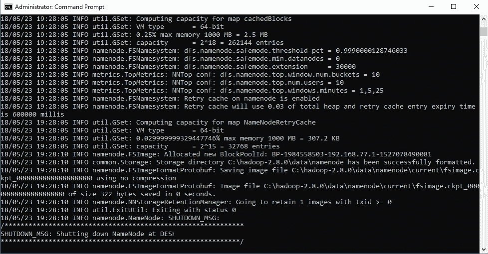
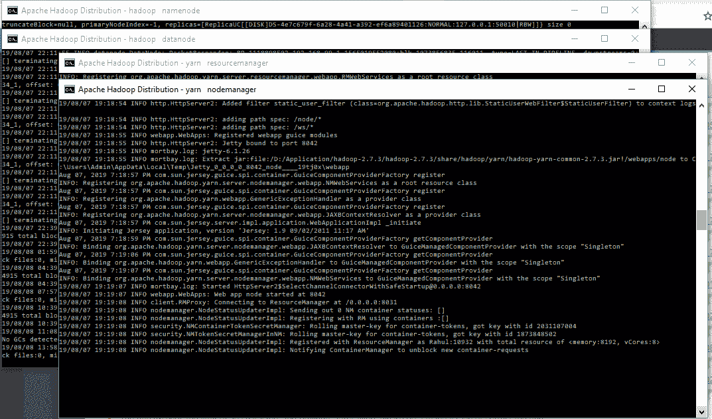
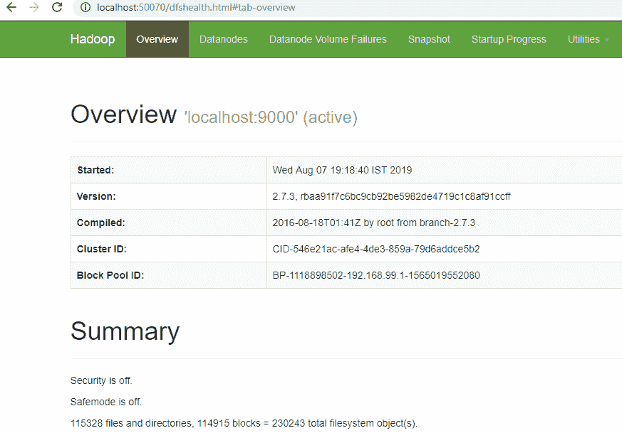
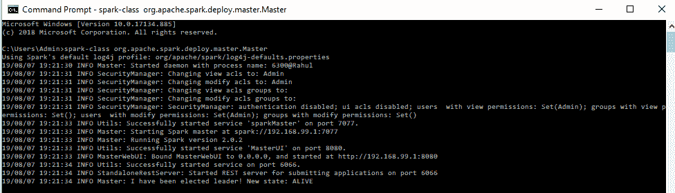
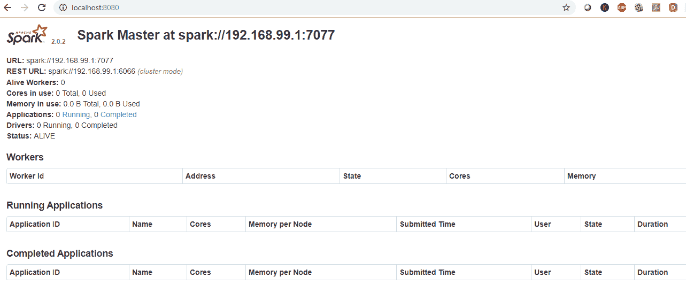
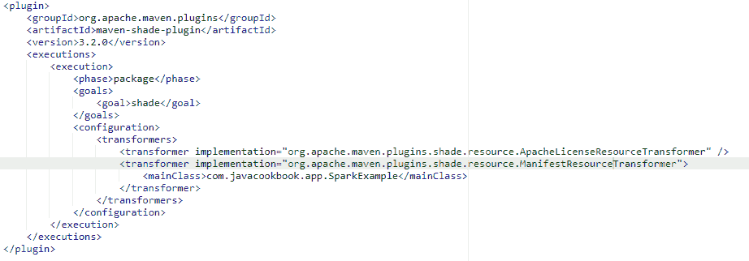
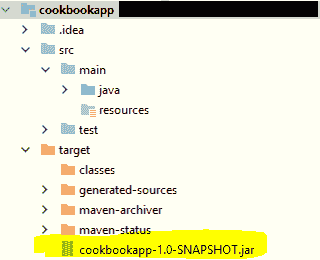

# 第十章：在分布式环境中开发应用程序

随着数据量和并行计算资源需求的增加，传统方法可能表现不佳。到目前为止，我们已经看到大数据开发因这些原因而变得流行，并成为企业最常采用的方法。DL4J 支持在分布式集群上进行神经网络训练、评估和推理。

现代方法将繁重的训练或输出生成任务分配到多台机器上进行训练。这也带来了额外的挑战。在使用 Spark 执行分布式训练/评估/推理之前，我们需要确保满足以下约束条件：

+   我们的数据应该足够大，以至于能证明使用分布式集群的必要性。在 Spark 上的小型网络/数据并不会真正带来性能上的提升，在这种情况下，本地机器执行可能会有更好的效果。

+   我们有多个机器来执行训练/评估或推理。

假设我们有一台配备多个 GPU 处理器的机器。在这种情况下，我们可以简单地使用并行包装器，而不是使用 Spark。并行包装器允许在单台机器上使用多个核心进行并行训练。并行包装器将在第十二章《基准测试和神经网络优化》中讨论，你将在那里了解如何配置它们。此外，如果神经网络每次迭代超过 100 毫秒，可能值得考虑使用分布式训练。

在本章中，我们将讨论如何配置 DL4J 进行分布式训练、评估和推理。我们将为 `TinyImageNet` 分类器开发一个分布式神经网络。在本章中，我们将覆盖以下内容：

+   设置 DL4J 和所需的依赖项

+   为训练创建一个 uber-JAR

+   CPU/GPU 特定的训练配置

+   Spark 的内存设置和垃圾回收

+   配置编码阈值

+   执行分布式测试集评估

+   保存和加载训练好的神经网络模型

+   执行分布式推理

# 技术要求

本章的源代码可以在 [`github.com/PacktPublishing/Java-Deep-Learning-Cookbook/tree/master/10_Developing_applications_in_distributed_environment/sourceCode/cookbookapp/src/main/java/com/javacookbook/app`](https://github.com/PacktPublishing/Java-Deep-Learning-Cookbook/tree/master/10_Developing_applications_in_distributed_environment/sourceCode/cookbookapp/src/main/java/com/javacookbook/app) 找到。

克隆我们的 GitHub 仓库后，进入 `Java-Deep-Learning-Cookbook/10_Developing_applications_in_distributed_environment/sourceCode` 目录。然后，通过导入 `pom.xml` 文件将 `cookbookapp` 项目作为 Maven 项目导入。

在运行实际源代码之前，您需要运行以下预处理脚本之一（`PreProcessLocal.java`或`PreProcessSpark.java`）：

+   [`github.com/PacktPublishing/Java-Deep-Learning-Cookbook/blob/master/10_Developing_applications_in_distributed_environment/sourceCode/cookbookapp/src/main/java/com/javacookbook/app/PreProcessLocal.java`](https://github.com/PacktPublishing/Java-Deep-Learning-Cookbook/blob/master/10_Developing_applications_in_distributed_environment/sourceCode/cookbookapp/src/main/java/com/javacookbook/app/PreProcessLocal.java)

+   [`github.com/PacktPublishing/Java-Deep-Learning-Cookbook/blob/master/10_Developing_applications_in_distributed_environment/sourceCode/cookbookapp/src/main/java/com/javacookbook/app/PreprocessSpark.java`](https://github.com/PacktPublishing/Java-Deep-Learning-Cookbook/blob/master/10_Developing_applications_in_distributed_environment/sourceCode/cookbookapp/src/main/java/com/javacookbook/app/PreprocessSpark.java)

这些脚本可以在`cookbookapp`项目中找到。

您还需要`TinyImageNet`数据集，可以在[`cs231n.stanford.edu/tiny-imagenet-200.zip`](http://cs231n.stanford.edu/tiny-imagenet-200.zip)找到。主页地址为[`tiny-imagenet.herokuapp.com/`](https://tiny-imagenet.herokuapp.com/)。

如果您有一些关于使用 Apache Spark 和 Hadoop 的先验知识，那将是非常有益的，这样您能从本章中获得最大的收益。此外，本章假设您的机器已经安装了 Java 并将其添加到环境变量中。我们推荐使用 Java 1.8 版本。

请注意，源代码对硬件（特别是内存/处理能力）有较高要求。我们建议您的主机机器至少拥有 16 GB 的 RAM，特别是在您将源代码运行在笔记本/台式机上时。

# 设置 DL4J 及其所需依赖项

我们再次讨论如何设置 DL4J，因为我们现在涉及的是一个分布式环境。为了演示目的，我们将使用 Spark 的本地模式。由于此原因，我们可以专注于 DL4J，而不是设置集群、工作节点等。在本示例中，我们将设置一个单节点 Spark 集群（Spark 本地模式），并配置 DL4J 特定的依赖项。

# 准备工作

为了演示分布式神经网络的使用，您需要以下内容：

+   分布式文件系统（Hadoop）用于文件管理

+   分布式计算（Spark）以处理大数据

# 如何实现...

1.  添加以下 Maven 依赖项以支持 Apache Spark：

```py
<dependency>
    <groupId>org.apache.spark</groupId>
    <artifactId>spark-core_2.11</artifactId>
    <version>2.1.0</version>
</dependency>
```

1.  添加以下 Maven 依赖项以支持 Spark 中的`DataVec`：

```py
<dependency>
    <groupId>org.datavec</groupId>
    <artifactId>datavec-spark_2.11</artifactId>
    <version>1.0.0-beta3_spark_2</version>
</dependency>
```

1.  添加以下 Maven 依赖项以支持参数平均：

```py
<dependency>
    <groupId>org.datavec</groupId>
    <artifactId>datavec-spark_2.11</artifactId>
    <version>1.0.0-beta3_spark_2</version>
</dependency>
```

1.  添加以下 Maven 依赖项以支持梯度共享：

```py
<dependency>
    <groupId>org.deeplearning4j</groupId>
    <artifactId>dl4j-spark-parameterserver_2.11</artifactId>
    <version>1.0.0-beta3_spark_2</version>
</dependency>
```

1.  添加以下 Maven 依赖项以支持 ND4J 后端：

```py
<dependency>
    <groupId>org.nd4j</groupId>
    <artifactId>nd4j-native-platform</artifactId>
    <version>1.0.0-beta3</version>
</dependency>
```

1.  添加以下 Maven 依赖项以支持 CUDA：

```py
<dependency>
    <groupId>org.nd4j</groupId>
    <artifactId>nd4j-cuda-x.x</artifactId>
    <version>1.0.0-beta3</version>
</dependency>
```

1.  添加以下 Maven 依赖项以支持 JCommander：

```py
<dependency>
    <groupId>com.beust</groupId>
    <artifactId>jcommander</artifactId>
    <version>1.72</version>
</dependency>
```

1.  从官方网站[`hadoop.apache.org/releases.html`](https://hadoop.apache.org/releases.html)下载 Hadoop 并添加所需的环境变量。

解压下载的 Hadoop 包并创建以下环境变量：

```py
HADOOP_HOME = {PathDownloaded}/hadoop-x.x 
 HADOOP_HDFS_HOME = {PathDownloaded}/hadoop-x.x 
 HADOOP_MAPRED_HOME = {PathDownloaded}/hadoop-x.x 
 HADOOP_YARN_HOME = {PathDownloaded}/hadoop-x.x 
```

将以下条目添加到`PATH`环境变量中：

```py
${HADOOP_HOME}\bin
```

1.  为 Hadoop 创建 name/data 节点目录。导航到 Hadoop 主目录（在`HADOOP_HOME`环境变量中设置），并创建一个名为`data`的目录。然后，在其下创建名为`datanode`和`namenode`的两个子目录。确保已为这些目录提供读/写/删除权限。

1.  导航到`hadoop-x.x/etc/hadoop`并打开`hdfs-site.xml`。然后，添加以下配置：

```py
<configuration>
     <property>
      <name>dfs.replication</name>
      <value>1</value>
     </property>
     <property>
      <name>dfs.namenode.name.dir</name>
      <value>file:/{NameNodeDirectoryPath}</value>
     </property>
     <property>
      <name>dfs.datanode.data.dir</name>
      <value>file:/{DataNodeDirectoryPath}</value>
     </property>
   </configuration>
```

1.  导航到`hadoop-x.x/etc/hadoop`并打开`mapred-site.xml`。然后，添加以下配置：

```py
<configuration>
  <property>
   <name>mapreduce.framework.name</name>
   <value>yarn</value>
  </property>
 </configuration>
```

1.  导航到`hadoop-x.x/etc/hadoop`并打开`yarn-site.xml`。然后，添加以下配置：

```py
<configuration>
  <!-- Site specific YARN configuration properties -->
  <property>
   <name>yarn.nodemanager.aux-services</name>
   <value>mapreduce_shuffle</value>
  </property>
  <property>
   <name>yarn.nodemanager.auxservices.mapreduce.shuffle.class</name>
   <value>org.apache.hadoop.mapred.ShuffleHandler</value>
  </property>
 </configuration>
```

1.  导航到`hadoop-x.x/etc/hadoop`并打开`core-site.xml`。然后，添加以下配置：

```py
<configuration>
  <property>
   <name>fs.default.name</name>
   <value>hdfs://localhost:9000</value>
  </property>
 </configuration> 
```

1.  导航到`hadoop-x.x/etc/hadoop`并打开`hadoop-env.cmd`。然后，将`set JAVA_HOME=%JAVA_HOME%`替换为`set JAVA_HOME={JavaHomeAbsolutePath}`。

添加`winutils` Hadoop 修复（仅适用于 Windows）。你可以从[`tiny.cc/hadoop-config-windows`](http://tiny.cc/hadoop-config-windows)下载此修复程序。或者，你也可以导航到相关的 GitHub 库[`github.com/steveloughran/winutils`](https://github.com/steveloughran/winutils)，获取与你安装的 Hadoop 版本匹配的修复程序。将`${HADOOP_HOME}`中的`bin`文件夹替换为修复程序中的`bin`文件夹。

1.  运行以下 Hadoop 命令来格式化`namenode`：

```py
hdfs namenode –format
```

你应该看到以下输出：



1.  导航到`${HADOOP_HOME}\sbin`并启动 Hadoop 服务：

    +   对于 Windows，运行`start-all.cmd`。

    +   对于 Linux 或任何其他操作系统，从终端运行`start-all.sh`。

你应该看到以下输出：



1.  在浏览器中访问`http://localhost:50070/`并验证 Hadoop 是否正常运行：



1.  从[`spark.apache.org/downloads.html`](https://spark.apache.org/downloads.html)下载 Spark 并添加所需的环境变量。解压包并添加以下环境变量：

```py
SPARK_HOME = {PathDownloaded}/spark-x.x-bin-hadoopx.x
SPARK_CONF_DIR = ${SPARK_HOME}\conf
```

1.  配置 Spark 的属性。导航到`SPARK_CONF_DIR`所在的目录，并打开`spark-env.sh`文件。然后，添加以下配置：

```py
SPARK_MASTER_HOST=localhost

```

1.  通过运行以下命令启动 Spark 主节点：

```py
spark-class org.apache.spark.deploy.master.Master
```

你应该看到以下输出：



1.  在浏览器中访问`http://localhost:8080/`并验证 Hadoop 是否正常运行：



# 它是如何工作的...

在步骤 2 中，为`DataVec`添加了依赖项。我们需要在 Spark 中使用数据转换函数，就像在常规训练中一样。转换是神经网络的一个数据需求，并非 Spark 特有。

例如，我们在第二章中讨论了`LocalTransformExecutor`，*数据提取、转换和加载*。`LocalTransformExecutor`用于非分布式环境中的`DataVec`转换。`SparkTransformExecutor`将在 Spark 中用于`DataVec`转换过程。

在步骤 4 中，我们添加了梯度共享的依赖项。梯度共享使得训练时间更快，它被设计为可扩展和容错的。因此，梯度共享优于参数平均。在梯度共享中，不是将所有参数更新/梯度通过网络传递，而是仅更新那些超过指定阈值的部分。假设我们在开始时有一个更新向量，我们希望将其通过网络传递。为了实现这一点，我们将为更新向量中的大值（由阈值指定）创建一个稀疏二进制向量。我们将使用这个稀疏二进制向量进行进一步的通信。主要思路是减少通信工作量。请注意，其余的更新不会被丢弃，而是会被添加到一个残差向量中，稍后处理。残差向量将被保留用于未来的更新（延迟通信），而不会丢失。DL4J 中的梯度共享是异步 SGD 实现。您可以在这里详细阅读：[`nikkostrom.com/publications/interspeech2015/strom_interspeech2015.pdf`](http://nikkostrom.com/publications/interspeech2015/strom_interspeech2015.pdf)。

在步骤 5 中，我们为 Spark 分布式训练应用程序添加了 CUDA 依赖项。

下面是关于此项的 uber-JAR 要求：

+   如果构建 uber-JAR 的操作系统与集群操作系统相同（例如，在 Linux 上运行并在 Spark Linux 集群上执行），请在`pom.xml`文件中包含`nd4j-cuda-x.x`依赖项。

+   如果构建 uber-JAR 的操作系统与集群操作系统不同（例如，在 Windows 上运行并在 Spark Linux 集群上执行），请在`pom.xml`文件中包含`nd4j-cuda-x.x-platform`依赖项。

只需将`x.x`替换为您安装的 CUDA 版本（例如，`nd4j-cuda-9.2`代表 CUDA 9.2）。

如果集群没有设置 CUDA/cuDNN，可以为集群操作系统包含`redist javacpp-`预设。您可以参考这里的相应依赖项：[`deeplearning4j.org/docs/latest/deeplearning4j-config-cuDNN`](https://deeplearning4j.org/docs/latest/deeplearning4j-config-cudnn)。这样，我们就不需要在每台集群机器上安装 CUDA 或 cuDNN。

在第 6 步中，我们为 JCommander 添加了 Maven 依赖。JCommander 用于解析通过 `spark-submit` 提供的命令行参数。我们需要这个，因为我们将在 `spark-submit` 中传递训练/测试数据的目录位置（HDFS/本地）作为命令行参数。

从第 7 步到第 16 步，我们下载并配置了 Hadoop。记得将`{PathDownloaded}`替换为实际的 Hadoop 包提取位置。同时，将 `x.x` 替换为你下载的 Hadoop 版本。我们需要指定将存储元数据和数据的磁盘位置，这就是为什么我们在第 8 步/第 9 步创建了 name/data 目录。为了进行修改，在第 10 步中，我们配置了`mapred-site.xml`。如果你无法在目录中找到该文件，只需通过复制`mapred-site.xml.template`文件中的所有内容创建一个新的 XML 文件，然后进行第 10 步中提到的修改。

在第 13 步中，我们将 `JAVA_HOME` 路径变量替换为实际的 Java 主目录位置。这样做是为了避免在运行时遇到某些 `ClassNotFound` 异常。

在第 18 步中，确保你下载的是与 Hadoop 版本匹配的 Spark 版本。例如，如果你使用 Hadoop 2.7.3，那么下载的 Spark 版本应该是 `spark-x.x-bin-hadoop2.7`。当我们在第 19 步做出修改时，如果 `spark-env.sh` 文件不存在，则只需通过复制 `spark-env.sh.template` 文件中的内容创建一个新文件 `spark-env.sh`。然后，进行第 19 步中提到的修改。完成此教程中的所有步骤后，你应该能够通过 `spark-submit` 命令执行分布式神经网络训练。

# 为训练创建 uber-JAR

通过 `spark-submit` 执行的训练作业需要在运行时解析所有必需的依赖项。为了管理这个任务，我们将创建一个包含应用程序运行时和其所需依赖项的 uber-JAR。我们将使用 `pom.xml` 中的 Maven 配置来创建 uber-JAR，这样我们就可以进行分布式训练。实际上，我们将创建一个 uber-JAR，并将其提交到 `spark-submit` 来执行 Spark 中的训练作业。

在这个教程中，我们将使用 Maven shade 插件为 Spark 训练创建 uber-JAR。

# 如何操作...

1.  通过将 Maven shade 插件添加到`pom.xml`文件中来创建 uber-JAR（阴影 JAR），如下面所示：



有关更多信息，请参考本书 GitHub 仓库中的`pom.xml`文件：[`github.com/PacktPublishing/Java-Deep-Learning-Cookbook/blob/master/10_Developing%20applications%20in%20distributed%20environment/sourceCode/cookbookapp/pom.xml`](https://github.com/PacktPublishing/Java-Deep-Learning-Cookbook/blob/master/10_Developing%20applications%20in%20distributed%20environment/sourceCode/cookbookapp/pom.xml)。将以下过滤器添加到 Maven 配置中：

```py
<filters>
   <filter>
    <artifact>*:*</artifact>
    <excludes>
     <exclude>META-INF/*.SF</exclude>
     <exclude>META-INF/*.DSA</exclude>
     <exclude>META-INF/*.RSA</exclude>
    </excludes>
   </filter>
 </filters>
```

1.  执行 Maven 命令以构建项目的 Uber-JAR：

```py
mvn package -DskipTests
```

# 它是如何工作的...

在步骤 1 中，您需要指定在执行 JAR 文件时应该运行的主类。在前面的示例中，`SparkExample` 是我们的主类，用于启动训练会话。您可能会遇到如下异常：

```py
Exception in thread “main” java.lang.SecurityException: Invalid signature file digest for Manifest main attributes.
```

一些添加到 Maven 配置中的依赖项可能包含签名的 JAR，这可能会导致如下问题。

在步骤 2 中，我们添加了过滤器以防止在 Maven 构建过程中添加签名的 `.jars`。

在步骤 3 中，我们生成了一个包含所有必需依赖项的可执行 `.jar` 文件。我们可以将此 `.jar` 文件提交给 `spark-submit`，在 Spark 上训练我们的网络。该 `.jar` 文件位于项目的 `target` 目录中：



Maven Shade 插件不是构建 Uber-JAR 文件的唯一方法。然而，推荐使用 Maven Shade 插件而非其他替代方案。其他替代方案可能无法包含来自源 `.jars` 的所需文件。其中一些文件作为 Java 服务加载器功能的依赖项。ND4J 利用 Java 的服务加载器功能。因此，其他替代插件可能会导致问题。

# 训练的 CPU/GPU 特定配置

硬件特定的更改是分布式环境中无法忽视的通用配置。DL4J 支持启用 CUDA/cuDNN 的 NVIDIA GPU 加速训练。我们还可以使用 GPU 执行 Spark 分布式训练。

在这个食谱中，我们将配置 CPU/GPU 特定的更改。

# 如何操作...

1.  从 [`developer.nvidia.com/cuda-downloads`](https://developer.nvidia.com/cuda-downloads) 下载、安装并设置 CUDA 工具包。操作系统特定的设置说明可以在 NVIDIA CUDA 官方网站找到。

1.  通过为 ND4J 的 CUDA 后端添加 Maven 依赖项来配置 Spark 分布式训练的 GPU：

```py
<dependency>
   <groupId>org.nd4j</groupId>
   <artifactId>nd4j-cuda-x.x</artifactId>
   <version>1.0.0-beta3</version>
 </dependency> 
```

1.  通过添加 ND4J 本地依赖项来配置 CPU 用于 Spark 分布式训练：

```py
<dependency>
    <groupId>org.nd4j</groupId>
    <artifactId>nd4j-native-platform</artifactId>
    <version>1.0.0-beta3</version>
 </dependency>
```

# 它是如何工作的...

我们需要启用一个适当的 ND4J 后端，以便能够利用 GPU 资源，正如我们在步骤 1 中提到的那样。在 `pom.xml` 文件中启用 `nd4j-cuda-x.x` 依赖项以进行 GPU 训练，其中 `x.x` 指您安装的 CUDA 版本。

如果主节点在 CPU 上运行，而工作节点在 GPU 上运行，如前面食谱中所述，我们可以包含两个 ND4J 后端（CUDA / 本地依赖）。如果两个后端都在类路径中，CUDA 后端将首先被尝试。如果因某种原因没有加载，那么将加载 CPU 后端（本地）。通过在主节点中更改 `BACKEND_PRIORITY_CPU` 和 `BACKEND_PRIORITY_GPU` 环境变量，也可以更改优先级。后端将根据这些环境变量中的最大值来选择。

在步骤 3 中，我们添加了针对仅有 CPU 硬件的配置。如果主节点/工作节点都配备了 GPU 硬件，那么我们不需要保留此配置。

# 还有更多内容...

我们可以通过将 cuDNN 配置到 CUDA 设备中来进一步优化训练吞吐量。我们可以在没有安装 CUDA/cuDNN 的情况下，在 Spark 上运行训练实例。为了获得最佳的性能支持，我们可以添加 DL4J CUDA 依赖项。为此，必须添加并使以下组件可用：

+   DL4J CUDA Maven 依赖项：

```py
<dependency>
  <groupId>org.deeplearning4j</groupId>
  <artifactId>deeplearning4j-cuda-x.x</artifactId>
  <version>1.0.0-beta3</version>
 </dependency>

```

+   cuDNN 库文件在 [`developer.nvidia.com/cuDNN`](https://developer.nvidia.com/cudnn)。请注意，你需要注册 NVIDIA 网站账户才能下载 cuDNN 库。注册是免费的。请参阅安装指南：[`docs.nvidia.com/deeplearning/sdk/cuDNN-install/index.html`](https://docs.nvidia.com/deeplearning/sdk/cudnn-install/index.html)。

# Spark 的内存设置和垃圾回收

内存管理对于大数据集的分布式训练至关重要，尤其是在生产环境中。它直接影响神经网络的资源消耗和性能。内存管理涉及堆内存和堆外内存空间的配置。DL4J/ND4J 特定的内存配置将在 第十二章 中详细讨论，*基准测试与神经网络优化*。

在本教程中，我们将专注于 Spark 环境下的内存配置。

# 如何操作...

1.  在提交作业到 `spark-submit` 时，添加 `--executor-memory` 命令行参数来设置工作节点的堆内存。例如，我们可以使用 `--executor-memory 4g` 来分配 4 GB 的内存。

1.  添加 `--conf` 命令行参数来设置工作节点的堆外内存：

```py
--conf "spark.executor.extraJavaOptions=-Dorg.bytedeco.javacpp.maxbytes=8G"
```

1.  添加 `--conf` 命令行参数来设置主节点的堆外内存。例如，我们可以使用 `--conf "spark.driver.memoryOverhead=-Dorg.bytedeco.javacpp.maxbytes=8G"` 来分配 8 GB 的内存。

1.  添加 `--driver-memory` 命令行参数来指定主节点的堆内存。例如，我们可以使用 `--driver-memory 4g` 来分配 4 GB 的内存。

1.  通过调用 `workerTogglePeriodicGC()` 和 `workerPeriodicGCFrequency()` 来为工作节点配置垃圾回收，同时使用 `SharedTrainingMaster` 设置分布式神经网络：

```py
new SharedTrainingMaster.Builder(voidConfiguration, minibatch)
   .workerTogglePeriodicGC(true) 
   .workerPeriodicGCFrequency(frequencyIntervalInMs) 
   .build();

```

1.  通过将以下依赖项添加到 `pom.xml` 文件中来启用 DL4J 中的 Kryo 优化：

```py
<dependency>
   <groupId>org.nd4j</groupId>
   <artifactId>nd4j-kryo_2.11</artifactId>
  <version>1.0.0-beta3</version>
 </dependency>
```

1.  使用 `SparkConf` 配置 `KryoSerializer`：

```py
SparkConf conf = new SparkConf();
 conf.set("spark.serializer", "org.apache.spark.serializer.KryoSerializer");
 conf.set("spark.kryo.registrator", "org.nd4j.Nd4jRegistrator");
```

1.  如下所示，添加本地性配置到 `spark-submit`：

```py
--conf spark.locality.wait=0 
```

# 它是如何工作的...

在步骤 1 中，我们讨论了 Spark 特定的内存配置。我们提到过，这可以为主节点/工作节点进行配置。此外，这些内存配置可能依赖于集群资源管理器。

请注意，`--executor-memory 4g`命令行参数是针对 YARN 的。请参考相应的集群资源管理器文档，查找以下参数的相应命令行参数：

+   Spark Standalone: [`spark.apache.org/docs/latest/spark-standalone.html`](https://spark.apache.org/docs/latest/spark-standalone.html)

+   Mesos: [`spark.apache.org/docs/latest/running-on-mesos.html`](https://spark.apache.org/docs/latest/running-on-mesos.html)

+   YARN: [`spark.apache.org/docs/latest/running-on-yarn.html`](https://spark.apache.org/docs/latest/running-on-yarn.html)

对于 Spark Standalone，请使用以下命令行选项配置内存空间：

+   驱动节点的堆内存可以按如下方式配置（`8G` -> 8GB 内存）：

```py
SPARK_DRIVER_MEMORY=8G

```

+   驱动节点的非堆内存可以按如下方式配置：

```py
SPARK_DRIVER_OPTS=-Dorg.bytedeco.javacpp.maxbytes=8G

```

+   工作节点的堆内存可以按如下方式配置：

```py
SPARK_WORKER_MEMORY=8G

```

+   工作节点的非堆内存可以按如下方式配置：

```py
SPARK_WORKER_OPTS=-Dorg.bytedeco.javacpp.maxbytes=8G 

```

在第 5 步中，我们讨论了工作节点的垃圾回收。一般来说，我们可以通过两种方式控制垃圾回收的频率。以下是第一种方法：

```py
Nd4j.getMemoryManager().setAutoGcWindow(frequencyIntervalInMs);
```

这将限制垃圾收集器调用的频率为指定的时间间隔，即`frequencyIntervalInMs`。第二种方法如下：

```py
Nd4j.getMemoryManager().togglePeriodicGc(false);
```

这将完全禁用垃圾收集器的调用。然而，这些方法不会改变工作节点的内存配置。我们可以使用`SharedTrainingMaster`中可用的构建器方法来配置工作节点的内存。

我们调用`workerTogglePeriodicGC()`来禁用/启用周期性**垃圾收集器**（**GC**）调用，并且调用`workerPeriodicGCFrequency()`来设置垃圾回收的频率。

在第 6 步中，我们为 ND4J 添加了对 Kryo 序列化的支持。Kryo 序列化器是一个 Java 序列化框架，有助于提高 Spark 训练过程中的速度和效率。

欲了解更多信息，请参考 [`spark.apache.org/docs/latest/tuning.html`](https://spark.apache.org/docs/latest/tuning.html)。在第 8 步中，本地性配置是一个可选配置，可以用于提高训练性能。数据本地性对 Spark 作业的性能有重大影响。其思路是将数据和代码一起传输，以便计算能够快速执行。欲了解更多信息，请参考 [`spark.apache.org/docs/latest/tuning.html#data-locality`](https://spark.apache.org/docs/latest/tuning.html#data-locality)。

# 还有更多内容...

内存配置通常分别应用于主节点/工作节点。因此，仅在工作节点上进行内存配置可能无法达到所需的效果。我们采取的方法可以根据所使用的集群资源管理器而有所不同。因此，参考关于特定集群资源管理器的不同方法的相关文档非常重要。此外，请注意，集群资源管理器中的默认内存设置不适合（过低）那些高度依赖堆外内存空间的库（ND4J/DL4J）。`spark-submit` 可以通过两种方式加载配置。一种方法是使用 *命令行*，如前所述，另一种方法是将配置指定在 `spark-defaults.conf` 文件中，如下所示：

```py
spark.master spark://5.6.7.8:7077
spark.executor.memory 4g
```

Spark 可以使用 `--conf` 标志接受任何 Spark 属性。我们在本教程中使用它来指定堆外内存空间。你可以在此处阅读有关 Spark 配置的更多信息：[`spark.apache.org/docs/latest/configuration.html`](http://spark.apache.org/docs/latest/configuration.html)：

+   数据集应合理分配驱动程序/执行程序的内存。对于 10 MB 的数据，我们不需要为执行程序/驱动程序分配过多内存。在这种情况下，2 GB 至 4 GB 的内存就足够了。分配过多内存不会带来任何区别，反而可能降低性能。

+   *驱动程序*是主 Spark 作业运行的进程。 *执行器*是分配给工作节点的任务，每个任务有其单独的任务。如果应用程序以本地模式运行，则不一定分配驱动程序内存。驱动程序内存连接到主节点，并且与应用程序在 *集群* 模式下运行时相关。在 *集群* 模式下，Spark 作业不会在提交的本地机器上运行。Spark 驱动组件将在集群内部启动。

+   Kryo 是一个快速高效的 Java 序列化框架。Kryo 还可以执行对象的自动深拷贝/浅拷贝，以获得高速度、低体积和易于使用的 API。DL4J API 可以利用 Kryo 序列化进一步优化性能。然而，请注意，由于 INDArrays 消耗堆外内存空间，Kryo 可能不会带来太多的性能提升。在使用 Kryo 与 `SparkDl4jMultiLayer` 或 `SparkComputationGraph` 类时，请检查相应的日志，以确保 Kryo 配置正确。

+   就像在常规训练中一样，我们需要为 DL4J Spark 添加合适的 ND4J 后端才能正常运行。对于较新版本的 YARN，可能需要一些额外的配置。有关详细信息，请参考 YARN 文档：[`hadoop.apache.org/docs/r3.1.0/hadoop-yarn/hadoop-yarn-site/UsingGpus.html`](https://hadoop.apache.org/docs/r3.1.0/hadoop-yarn/hadoop-yarn-site/UsingGpus.html)。

此外，请注意，旧版本（2.7.x 或更早版本）不原生支持 GPU（GPU 和 CPU）。对于这些版本，我们需要使用节点标签来确保作业运行在仅 GPU 的机器上。

+   如果你进行 Spark 训练，需要注意数据本地性以优化吞吐量。数据本地性确保数据和操作 Spark 作业的代码是一起的，而不是分开的。数据本地性将序列化的代码从一个地方传输到另一个地方（而不是数据块），在那里数据进行操作。它将加速性能，并且不会引入进一步的问题，因为代码的大小远小于数据。Spark 提供了一个名为 `spark.locality.wait` 的配置属性，用于指定在将数据移至空闲 CPU 之前的超时。如果你将其设置为零，则数据将立即被移动到一个空闲的执行器，而不是等待某个特定的执行器变为空闲。如果空闲执行器距离当前任务执行的执行器较远，那么这将增加额外的工作量。然而，我们通过等待附近的执行器变空闲来节省时间。因此，计算时间仍然可以减少。你可以在 Spark 官方文档中阅读更多关于数据本地性的信息：[`spark.apache.org/docs/latest/tuning.html#data-locality`](https://spark.apache.org/docs/latest/tuning.html#data-locality)。

# 配置编码阈值

DL4J Spark 实现利用阈值编码方案跨节点执行参数更新，以减少网络中传输的消息大小，从而降低流量成本。阈值编码方案引入了一个新的分布式训练专用超参数，称为 **编码阈值**。

在这个方案中，我们将在分布式训练实现中配置阈值算法。

# 如何操作...

1.  在 `SharedTrainingMaster` 中配置阈值算法：

```py
TrainingMaster tm = new SharedTrainingMaster.Builder(voidConfiguration, minibatchSize)
   .thresholdAlgorithm(new AdaptiveThresholdAlgorithm(gradientThreshold))
  .build();
```

1.  通过调用 `residualPostProcessor()` 配置残差向量：

```py
TrainingMaster tm = new SharedTrainingMaster.Builder(voidConfiguration, minibatch)
 .residualPostProcessor(new ResidualClippingPostProcessor(clipValue, frequency))
 .build();
```

# 它是如何工作的...

在第 1 步中，我们在 `SharedTrainingMaster` 中配置了阈值算法，默认算法为 `AdaptiveThresholdAlgorithm`。阈值算法将决定分布式训练的编码阈值，这是一个特定于分布式训练的超参数。此外，值得注意的是，我们并没有丢弃其余的参数更新。如前所述，我们将它们放入单独的残差向量，并在后续处理。这是为了减少训练过程中网络流量/负载。**`AdaptiveThresholdAlgorithm`** 在大多数情况下更为优选，以获得更好的性能。

在步骤 2 中，我们使用了`ResidualPostProcessor`来处理残差向量。残差向量是由梯度共享实现内部创建的，用于收集未被指定边界标记的参数更新。大多数`ResidualPostProcessor`的实现都会裁剪/衰减残差向量，以确保其中的值不会相对于阈值过大。`ResidualClippingPostProcessor`就是一种这样的实现。`ResidualPostProcessor`将防止残差向量变得过大，因为它可能需要太长时间来传输，且可能导致过时的梯度问题。

在步骤 1 中，我们调用了`thresholdAlgorithm()`来设置阈值算法。在步骤 2 中，我们调用了`residualPostProcessor()`，以处理用于 DL4J 中的梯度共享实现的残差向量。`ResidualClippingPostProcessor`接受两个属性：`clipValue`和`frequency`。`clipValue`是我们用于裁剪的当前阈值的倍数。例如，如果阈值为`t`，而`clipValue`为`c`，那么残差向量将被裁剪到范围**`[-c*t , c*t]`**。

# 还有更多内容…

阈值背后的理念（在我们的上下文中是编码阈值）是，参数更新将在集群间发生，但仅限于那些符合用户定义的限制（阈值）的值。这个阈值值就是我们所说的编码阈值。参数更新指的是在训练过程中梯度值的变化。过高或过低的编码阈值对于获得最佳结果并不理想。因此，提出一个可接受的编码阈值范围是合理的。这也被称为稀疏度比率，其中参数更新发生在集群之间。

在这篇教程中，我们还讨论了如何为分布式训练配置阈值算法。如果`AdaptiveThresholdAlgorithm`的效果不理想，默认选择是使用它。

以下是 DL4J 中可用的各种阈值算法：

+   `AdaptiveThresholdAlgorithm`：这是默认的阈值算法，在大多数场景下都能很好地工作。

+   `FixedThresholdAlgorithm`：这是一种固定且非自适应的阈值策略。

+   `TargetSparsityThresholdAlgorithm`：这是一种具有特定目标的自适应阈值策略。它通过降低或提高阈值来尝试匹配目标。

# 执行分布式测试集评估

分布式神经网络训练中存在一些挑战。这些挑战包括管理主节点和工作节点之间的不同硬件依赖关系，配置分布式训练以提高性能，跨分布式集群的内存基准测试等。我们在之前的教程中讨论了一些这些问题。在保持这些配置的同时，我们将继续进行实际的分布式训练/评估。在本教程中，我们将执行以下任务：

+   DL4J Spark 训练的 ETL 过程

+   为 Spark 训练创建神经网络

+   执行测试集评估

# 如何执行...

1.  下载、解压并将`TinyImageNet`数据集的内容复制到以下目录位置：

```py
* Windows: C:\Users\<username>\.deeplearning4j\data\TINYIMAGENET_200
 * Linux: ~/.deeplearning4j/data/TINYIMAGENET_200
```

1.  使用`TinyImageNet`数据集创建训练图像批次：

```py
File saveDirTrain = new File(batchSavedLocation, "train");
 SparkDataUtils.createFileBatchesLocal(dirPathDataSet, NativeImageLoader.ALLOWED_FORMATS, true, saveDirTrain, batchSize);
```

1.  使用`TinyImageNet`数据集创建测试图像批次：

```py
File saveDirTest = new File(batchSavedLocation, "test");
 SparkDataUtils.createFileBatchesLocal(dirPathDataSet, NativeImageLoader.ALLOWED_FORMATS, true, saveDirTest, batchSize);
```

1.  创建一个`ImageRecordReader`，它保存数据集的引用：

```py
PathLabelGenerator labelMaker = new ParentPathLabelGenerator();
 ImageRecordReader rr = new ImageRecordReader(imageHeightWidth, imageHeightWidth, imageChannels, labelMaker);
 rr.setLabels(new TinyImageNetDataSetIterator(1).getLabels());
```

1.  从`ImageRecordReader`创建`RecordReaderFileBatchLoader`以加载批数据：

```py
RecordReaderFileBatchLoader loader = new RecordReaderFileBatchLoader(rr, batchSize, 1, TinyImageNetFetcher.NUM_LABELS);
 loader.setPreProcessor(new ImagePreProcessingScaler()); 
```

1.  在源代码开始时使用 JCommander 解析命令行参数：

```py
JCommander jcmdr = new JCommander(this);
 jcmdr.parse(args);
```

1.  使用`VoidConfiguration`为 Spark 训练创建参数服务器配置（梯度共享），如下代码所示：

```py
VoidConfiguration voidConfiguration = VoidConfiguration.builder()
 .unicastPort(portNumber)
 .networkMask(netWorkMask)
 .controllerAddress(masterNodeIPAddress)
 .build();
```

1.  使用`SharedTrainingMaster`配置分布式训练网络，如下代码所示：

```py
TrainingMaster tm = new SharedTrainingMaster.Builder(voidConfiguration, batchSize)
 .rngSeed(12345)
 .collectTrainingStats(false)
 .batchSizePerWorker(batchSize) // Minibatch size for each worker
 .thresholdAlgorithm(new AdaptiveThresholdAlgorithm(1E-3)) //Threshold algorithm determines the encoding threshold to be use.
 .workersPerNode(1) // Workers per node
 .build();
```

1.  为`ComputationGraphConfguration`创建`GraphBuilder`，如下代码所示：

```py
ComputationGraphConfiguration.GraphBuilder builder = new NeuralNetConfiguration.Builder()
 .convolutionMode(ConvolutionMode.Same)
 .l2(1e-4)
 .updater(new AMSGrad(lrSchedule))
 .weightInit(WeightInit.RELU)
 .graphBuilder()
 .addInputs("input")
 .setOutputs("output");

```

1.  使用 DL4J 模型库中的`DarknetHelper`来增强我们的 CNN 架构，如下代码所示：

```py
DarknetHelper.addLayers(builder, 0, 3, 3, 32, 0); //64x64 out
 DarknetHelper.addLayers(builder, 1, 3, 32, 64, 2); //32x32 out
 DarknetHelper.addLayers(builder, 2, 2, 64, 128, 0); //32x32 out
 DarknetHelper.addLayers(builder, 3, 2, 128, 256, 2); //16x16 out
 DarknetHelper.addLayers(builder, 4, 2, 256, 256, 0); //16x16 out
 DarknetHelper.addLayers(builder, 5, 2, 256, 512, 2); //8x8 out
```

1.  配置输出层时，考虑标签的数量和损失函数，如下代码所示：

```py
builder.addLayer("convolution2d_6", new ConvolutionLayer.Builder(1, 1)
 .nIn(512)
 .nOut(TinyImageNetFetcher.NUM_LABELS) // number of labels (classified outputs) = 200
 .weightInit(WeightInit.XAVIER)
 .stride(1, 1)
 .activation(Activation.IDENTITY)
 .build(), "maxpooling2d_5")
 .addLayer("globalpooling", new GlobalPoolingLayer.Builder(PoolingType.AVG).build(), "convolution2d_6")
 .addLayer("loss", new LossLayer.Builder(LossFunctions.LossFunction.NEGATIVELOGLIKELIHOOD).activation(Activation.SOFTMAX).build(), "globalpooling")
 .setOutputs("loss");
```

1.  从`GraphBuilder`创建`ComputationGraphConfguration`：

```py
ComputationGraphConfiguration configuration = builder.build(); 
```

1.  从定义的配置创建`SparkComputationGraph`模型，并为其设置训练监听器：

```py
SparkComputationGraph sparkNet = new SparkComputationGraph(context,configuration,tm);
 sparkNet.setListeners(new PerformanceListener(10, true));
```

1.  创建代表我们之前为训练创建的批文件的 HDFS 路径的`JavaRDD`对象：

```py
String trainPath = dataPath + (dataPath.endsWith("/") ? "" : "/") + "train";
 JavaRDD<String> pathsTrain = SparkUtils.listPaths(context, trainPath);
```

1.  通过调用`fitPaths()`来启动训练实例：

```py
for (int i = 0; i < numEpochs; i++) {
   sparkNet.fitPaths(pathsTrain, loader);
 }

```

1.  创建代表我们之前创建的用于测试的批文件的 HDFS 路径的`JavaRDD`对象：

```py
String testPath = dataPath + (dataPath.endsWith("/") ? "" : "/") + "test";
 JavaRDD<String> pathsTest = SparkUtils.listPaths(context, testPath);
```

1.  通过调用`doEvaluation()`评估分布式神经网络：

```py
Evaluation evaluation = new Evaluation(TinyImageNetDataSetIterator.getLabels(false), 5);
 evaluation = (Evaluation) sparkNet.doEvaluation(pathsTest, loader, evaluation)[0];
 log.info("Evaluation statistics: {}", evaluation.stats());
```

1.  在以下格式中通过`spark-submit`运行分布式训练实例：

```py
spark-submit --master spark://{sparkHostIp}:{sparkHostPort} --class {clssName} {JAR File location absolute path} --dataPath {hdfsPathToPreprocessedData} --masterIP {masterIP}

Example:
 spark-submit --master spark://192.168.99.1:7077 --class com.javacookbook.app.SparkExample cookbookapp-1.0-SNAPSHOT.jar --dataPath hdfs://localhost:9000/user/hadoop/batches/imagenet-preprocessed --masterIP 192.168.99.1
```

# 它是如何工作的....

第一步可以通过`TinyImageNetFetcher`来自动化，如下所示：

```py
TinyImageNetFetcher fetcher = new TinyImageNetFetcher();
 fetcher.downloadAndExtract();
```

对于任何操作系统，数据需要复制到用户的主目录。一旦执行完毕，我们可以获取训练/测试数据集目录的引用，如下所示：

```py
File baseDirTrain = DL4JResources.getDirectory(ResourceType.DATASET, f.localCacheName() + "/train");
 File baseDirTest = DL4JResources.getDirectory(ResourceType.DATASET, f.localCacheName() + "/test");
```

你也可以提到自己本地磁盘或 HDFS 的输入目录位置。你需要在第二步中将其作为`dirPathDataSet`替换。

在第二步和第三步中，我们创建了图像批次，以便优化分布式训练。我们使用了`createFileBatchesLocal()`来创建这些批次，其中数据来源于本地磁盘。如果你想从 HDFS 源创建批次，则可以使用`createFileBatchesSpark()`。这些压缩的批文件将节省空间并减少计算瓶颈。假设我们在一个压缩批次中加载了 64 张图像—我们不需要 64 次不同的磁盘读取来处理该批次文件。这些批次包含了多个文件的原始文件内容。

在第 5 步，我们使用`RecordReaderFileBatchLoader`处理了通过`createFileBatchesLocal()`或`createFileBatchesSpark()`创建的文件批处理对象。如第 6 步所提到的，你可以使用 JCommander 处理来自`spark-submit`的命令行参数，或者编写自己的逻辑来处理这些参数。

在第 7 步，我们使用`VoidConfiguration`类配置了参数服务器。这是一个用于参数服务器的基本配置 POJO 类。我们可以为参数服务器指定端口号、网络掩码等配置。网络掩码在共享网络环境和 YARN 中是非常重要的配置。

在第 8 步，我们开始使用`SharedTrainingMaster`配置分布式网络进行训练。我们添加了重要的配置，例如阈值算法、工作节点数、最小批量大小等。

从第 9 步和第 10 步开始，我们专注于分布式神经网络层配置。我们使用来自 DL4J 模型库的`DarknetHelper`，借用了 DarkNet、TinyYOLO 和 YOLO2 的功能。

在第 11 步，我们为我们的微型`ImageNet`分类器添加了输出层配置。该分类器有 200 个标签，用于进行图像分类预测。在第 13 步，我们使用`SparkComputationGraph`创建了一个基于 Spark 的`ComputationGraph`。如果底层网络结构是`MultiLayerNetwork`，你可以改用`SparkDl4jMultiLayer`。

在第 17 步，我们创建了一个评估实例，如下所示：

```py
Evaluation evaluation = new Evaluation(TinyImageNetDataSetIterator.getLabels(false), 5);
```

第二个属性（前述代码中的`5`）表示值`N`，用于衡量前`N`的准确性指标。例如，如果`true`类别的概率是前`N`个最高的值之一，那么对样本的评估就是正确的。

# 保存和加载训练好的神经网络模型

反复训练神经网络以进行评估并不是一个好主意，因为训练是一项非常耗费资源的操作。这也是为什么模型持久化在分布式系统中同样重要的原因。

在这个教程中，我们将把分布式神经网络模型持久化到磁盘，并在之后加载以供进一步使用。

# 如何操作...

1.  使用`ModelSerializer`保存分布式神经网络模型：

```py
MultiLayerNetwork model = sparkModel.getNetwork();
 File file = new File("MySparkMultiLayerNetwork.bin");
 ModelSerializer.writeModel(model,file, saveUpdater);
```

1.  使用`save()`保存分布式神经网络模型：

```py
MultiLayerNetwork model = sparkModel.getNetwork();
  File locationToSave = new File("MySparkMultiLayerNetwork.bin);
 model.save(locationToSave, saveUpdater);
```

1.  使用`ModelSerializer`加载分布式神经网络模型：

```py
ModelSerializer.restoreMultiLayerNetwork(new File("MySparkMultiLayerNetwork.bin"));
```

1.  使用`load()`加载分布式神经网络模型：

```py
MultiLayerNetwork restored = MultiLayerNetwork.load(savedModelLocation, saveUpdater);
```

# 它是如何工作的...

尽管我们在本地机器上使用`save()`或`load()`进行模型持久化，但在生产环境中这并不是最佳实践。对于分布式集群环境，我们可以在第 1 步和第 2 步使用`BufferedInputStream`/`BufferedOutputStream`将模型保存到集群或从集群加载模型。我们可以像之前展示的那样使用`ModelSerializer`或`save()`/`load()`。我们只需注意集群资源管理器和模型持久化，这可以跨集群进行。

# 还有更多内容...

`SparkDl4jMultiLayer`和`SparkComputationGraph`内部分别使用了`MultiLayerNetwork`和`ComputationGraph`的标准实现。因此，可以通过调用`getNetwork()`方法访问它们的内部结构。

# 执行分布式推理

在本章中，我们讨论了如何使用 DL4J 进行分布式训练。我们还进行了分布式评估，以评估训练好的分布式模型。现在，让我们讨论如何利用分布式模型来解决预测等用例。这被称为推理。接下来，我们将介绍如何在 Spark 环境中进行*分布式*推理。

在本节中，我们将使用 DL4J 在 Spark 上执行分布式推理。

# 如何操作...

1.  通过调用`feedForwardWithKey()`执行`SparkDl4jMultiLayer`的分布式推理，如下所示：

```py
SparkDl4jMultiLayer.feedForwardWithKey(JavaPairRDD<K, INDArray> featuresData, int batchSize);
```

1.  通过调用`feedForwardWithKey()`执行`SparkComputationGraph`的分布式推理：

```py
SparkComputationGraph.feedForwardWithKey(JavaPairRDD<K, INDArray[]> featuresData, int batchSize) ;
```

# 工作原理...

第 1 步和第 2 步中`feedForwardWithKey()`方法的目的是为给定的输入数据集生成输出/预测。该方法返回一个映射。输入数据通过映射中的键表示，结果（输出）通过值（`INDArray`）表示。

`feedForwardWithKey()`接受两个参数：输入数据和用于前馈操作的小批量大小。输入数据（特征）采用`JavaPairRDD<K`, `INDArray>`的格式。

请注意，RDD 数据是无序的。我们需要一种方法将每个输入映射到相应的结果（输出）。因此，我们需要一个键值对，将每个输入映射到其相应的输出。这就是为什么我们在这里使用键值的主要原因。这与推理过程本身无关。*小批量大小*的值用于在内存与计算效率之间进行权衡。
