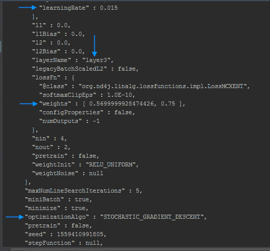

# 第十一章：将迁移学习应用于网络模型

本章将讨论迁移学习方法，它们对于重用先前开发的模型至关重要。我们将展示如何将迁移学习应用于在第三章，*构建二分类深度神经网络*中创建的模型，以及来自 DL4J 模型库 API 的预训练模型。我们可以使用 DL4J 迁移学习 API 来修改网络架构，在训练过程中保持特定层的参数，并微调模型配置。迁移学习能够提高性能，并且可以开发出更高效的模型。我们将从另一个模型中传递已学习的参数到当前的训练会话。如果你已经为前几章设置好了 DL4J 工作区，那么就不需要在`pom.xml`中添加新的依赖项；否则，你需要根据第三章，*构建二分类深度神经网络*中的说明，在`pom.xml`中添加基本的 Deeplearning4j Maven 依赖项。

本章将涵盖以下内容：

+   修改现有的客户保持模型

+   微调学习配置

+   实现冻结层

+   导入和加载 Keras 模型及层

# 技术要求

本章的源代码可以在此找到：[`github.com/PacktPublishing/Java-Deep-Learning-Cookbook/tree/master/11_Applying_Transfer_Learning_to_network_models/sourceCode/cookbookapp/src/main/java`](https://github.com/PacktPublishing/Java-Deep-Learning-Cookbook/tree/master/11_Applying_Transfer_Learning_to_network_models/sourceCode/cookbookapp/src/main/java)。

在克隆 GitHub 仓库后，导航到`Java-Deep-Learning-Cookbook/11_Applying_Transfer_Learning_to_network_models/sourceCode`目录，然后通过导入`pom.xml`*将`cookbookapp`项目作为 Maven 项目导入*。

你需要拥有第三章，*构建二分类深度神经网络*中的预训练模型，才能运行迁移学习示例。模型文件应该在执行第三章，*构建二分类深度神经网络*源代码后保存到本地系统中。在执行本章源代码时，你需要在此加载模型。此外，对于`SaveFeaturizedDataExample`示例，你还需要更新训练/测试目录，以便应用程序能够保存特征化数据集。

# 修改现有的客户保持模型

我们在第三章中创建了一个客户流失模型，*构建二分类深度神经网络*，它能够根据指定数据预测客户是否会离开组织。我们可能希望在新的数据上训练现有模型。迁移学习发生在一个现有模型暴露于类似模型的全新训练时。我们使用`ModelSerializer`类在训练神经网络后保存模型。我们使用前馈网络架构来构建客户保持模型。

在这个实例中，我们将导入一个现有的客户保持模型，并使用 DL4J 迁移学习 API 进一步优化它。

# 如何做……

1.  调用`load()`方法从保存的位置导入模型：

```py
File savedLocation = new File("model.zip");
 boolean saveUpdater = true;
 MultiLayerNetwork restored = MultiLayerNetwork.load(savedLocation, saveUpdater);
```

1.  添加所需的`pom`依赖项以使用`deeplearning4j-zoo`模块：

```py
<dependency>
 <groupId>org.deeplearning4j</groupId>
 <artifactId>deeplearning4j-zoo</artifactId>
 <version>1.0.0-beta3</version>
 </dependency>
```

1.  使用`TransferLearning` API 为`MultiLayerNetwork`添加微调配置：

```py
MultiLayerNetwork newModel = new TransferLearning.Builder(oldModel)
 .fineTuneConfiguration(fineTuneConf)
 .build();
```

1.  使用`TransferLearning` API 为`ComputationGraph`添加微调配置：

```py
ComputationGraph newModel = new TransferLearning.GraphBuilder(oldModel).
 .fineTuneConfiguration(fineTuneConf)
 .build();
```

1.  使用`TransferLearningHelper`配置训练会话。`TransferLearningHelper`可以通过两种方式创建：

    +   传入使用迁移学习构建器（步骤 2）创建的模型对象，并附加冻结层：

```py
 TransferLearningHelper tHelper = new TransferLearningHelper(newModel);
```

1.  +   通过显式指定冻结层，从导入的模型中直接创建：

```py
TransferLearningHelper tHelper = new TransferLearningHelper(oldModel, "layer1")
```

1.  使用`featurize()`方法对训练/测试数据进行特征化：

```py
  while(iterator.hasNext()) {
         DataSet currentFeaturized = transferLearningHelper.featurize(iterator.next());
         saveToDisk(currentFeaturized); //save the featurized date to disk 
        }
```

1.  使用`ExistingMiniBatchDataSetIterator`创建训练/测试迭代器：

```py
DataSetIterator existingTrainingData = new ExistingMiniBatchDataSetIterator(new File("trainFolder"),"churn-"+featureExtractorLayer+"-train-%d.bin");
 DataSetIterator existingTestData = new ExistingMiniBatchDataSetIterator(new File("testFolder"),"churn-"+featureExtractorLayer+"-test-%d.bin");
```

1.  通过调用`fitFeaturized()`在特征化数据上启动训练实例：

```py
 transferLearningHelper.fitFeaturized(existingTrainingData);
```

1.  通过调用`evaluate()`评估未冻结层的模型：

```py
 transferLearningHelper.unfrozenMLN().evaluate(existingTestData);
```

# 它是如何工作的……

在步骤 1 中，如果我们计划稍后训练模型，`saveUpdater`的值将设置为`true`。我们还讨论了 DL4J 模型库 API 提供的预训练模型。一旦我们按照步骤 1 中提到的添加了`deeplearning4j-zoo`依赖项，就可以加载如 VGG16 等预训练模型，方法如下：

```py
ZooModel zooModel = VGG16.builder().build();
 ComputationGraph pretrainedNet = (ComputationGraph)    zooModel.initPretrained(PretrainedType.IMAGENET);
```

DL4J 支持更多在其迁移学习 API 下的预训练模型。

微调配置是将一个训练过的模型调整为执行另一个类似任务的过程。微调配置是迁移学习特有的。在步骤 3 和 4 中，我们为特定类型的神经网络添加了微调配置。以下是使用 DL4J 迁移学习 API 可以进行的可能修改：

+   更新权重初始化方案、梯度更新策略和优化算法（微调）

+   修改特定层而不改变其他层

+   向模型中添加新层

所有这些修改都可以通过迁移学习 API 应用。DL4J 迁移学习 API 提供了一个构建器类来支持这些修改。我们将通过调用`fineTuneConfiguration()`构建方法来添加微调配置。

正如我们之前所见，在第 4 步中，我们使用`GraphBuilder`进行基于计算图的迁移学习。请参考我们的 GitHub 仓库以获取具体示例。请注意，迁移学习 API 会在应用所有指定的修改后，从导入的模型返回一个模型实例。常规的`Builder`类将构建一个`MultiLayerNetwork`实例，而`GraphBuilder`则会构建一个`ComputationGraph`实例。

我们也可能只对某些层进行更改，而不是在所有层之间进行全局更改。主要动机是对那些已识别的层进行进一步优化。这也引出了另一个问题：我们如何知道存储模型的详细信息？为了指定需要保持不变的层，迁移学习 API 要求提供层的属性，如层名/层号。

我们可以使用`getLayerWiseConfigurations()`方法来获取这些信息，如下所示：

```py
oldModel.getLayerWiseConfigurations().toJson()
```

执行上述操作后，你应该看到如下所示的网络配置：



完整网络配置的 Gist URL：[`gist.github.com/rahul-raj/ee71f64706fa47b6518020071711070b`](https://gist.github.com/rahul-raj/ee71f64706fa47b6518020071711070b)

神经网络的配置，如学习率、神经元使用的权重、使用的优化算法、每层特定的配置等，可以从显示的 JSON 内容中验证。

以下是 DL4J 迁移学习 API 支持模型修改的一些可能配置。我们需要层的详细信息（名称/ID）来调用这些方法：

+   `setFeatureExtractor()`: 用于冻结特定层的变化

+   `addLayer()`: 用于向模型中添加一个或多个层

+   `nInReplace()/nOutReplace()`: 通过修改指定层的`nIn`或`nOut`来改变指定层的架构

+   `removeLayersFromOutput()`: 从模型中删除最后`n`个层（从需要添加回输出层的点开始）

请注意，导入的迁移学习模型的最后一层是一个*全连接*层，因为 DL4J 的迁移学习 API 不会强制对导入的模型进行训练配置。所以，我们需要使用`addLayer()`方法向模型添加输出层。

+   `setInputPreProcessor()`: 将指定的预处理器添加到指定的层

在第 5 步中，我们看到了在 DL4J 中应用迁移学习的另一种方式，使用`TransferLearningHelper`。我们讨论了它可以实现的两种方式。当你从迁移学习构建器创建`TransferLearningHelper`时，你还需要指定`FineTuneConfiguration`。在`FineTuneConfiguration`中配置的值将覆盖所有非冻结层的配置。

`TransferLearningHelper` 与传统迁移学习处理方法的不同之处是有原因的。迁移学习模型通常具有冻结层，这些冻结层在整个训练过程中保持常数值。冻结层的作用取决于对现有模型性能的观察。我们也提到了 `setFeatureExtractor()` 方法，用于冻结特定的层。使用这个方法可以跳过某些层。然而，模型实例仍然保留整个冻结和非冻结部分。因此，我们在训练期间仍然使用整个模型（包括冻结和非冻结部分）进行计算。

使用 `TransferLearningHelper`，我们可以通过仅创建非冻结部分的模型实例来减少整体训练时间。冻结的数据集（包括所有冻结参数）将保存到磁盘，我们使用指向非冻结部分的模型实例进行训练。如果我们只需训练一个 epoch，那么 `setFeatureExtractor()` 和迁移学习助手 API 的性能几乎相同。假设我们有 100 层，其中 99 层是冻结的，并且我们进行 `N` 次训练。如果我们使用 `setFeatureExtractor()`，那么我们将为这 99 层做 `N` 次前向传播，这本质上会增加额外的时间和内存消耗。

为了节省训练时间，我们在使用迁移学习助手 API 保存冻结层的激活结果后创建模型实例。这个过程也被称为特征化。目的是跳过冻结层的计算，并只训练非冻结层。

作为先决条件，需要使用迁移学习构建器定义冻结层，或者在迁移学习助手中明确提到这些冻结层。

`TransferLearningHelper` 是在步骤 3 中创建的，如下所示：

```py
TransferLearningHelper tHelper = new TransferLearningHelper(oldModel, "layer2")
```

在前面的例子中，我们明确指定了冻结层的结构，直到 `layer2`。

在步骤 6 中，我们讨论了在特征化后保存数据集。特征化后，我们将数据保存到磁盘。我们将需要获取这些特征化数据以便在其上进行训练。如果将数据集分开并保存到磁盘，训练和评估会变得更加容易。数据集可以使用 `save()` 方法保存到磁盘，如下所示：

```py
currentFeaturized.save(new File(fileFolder,fileName));
```

`saveTodisk()`是保存数据集用于训练或测试的常用方法。实现过程很简单，只需要创建两个不同的目录（train/test），并决定可以用于训练/测试的文件范围。具体实现留给你去做。你可以参考我们的 GitHub 仓库中的示例（`SaveFeaturizedDataExample.java`）：[`github.com/PacktPublishing/Java-Deep-Learning-Cookbook/blob/master/11_Applying%20Transfer%20Learning%20to%20network%20models/sourceCode/cookbookapp/src/main/java/SaveFeaturizedDataExample.java.`](https://github.com/PacktPublishing/Java-Deep-Learning-Cookbook/blob/master/11_Applying_Transfer_Learning_to_network_models/sourceCode/cookbookapp/src/main/java/SaveFeaturizedDataExample.java)

在第 7/8 步中，我们讨论了在特征化数据上训练我们的神经网络。我们的客户保持模型遵循`MultiLayerNetwork`架构。此训练实例将改变未冻结层的网络配置。因此，我们需要评估未冻结层。在第 5 步中，我们仅对特征化的测试数据进行了模型评估，如下所示：

```py
transferLearningHelper.unfrozenMLN().evaluate(existingTestData);
```

如果你的网络具有`ComputationGraph`结构，则可以使用`unfrozenGraph()`方法来代替`unfrozenMLN()`，以获得相同的结果。

# 还有更多...

以下是 DL4J 模型库 API 提供的一些重要的预训练模型：

+   **VGG16**：文中提到的 VGG-16：[`arxiv.org/abs/1409.1556`](https://arxiv.org/abs/1409.1556)。

这是一个非常深的卷积神经网络，旨在解决大规模图像识别任务。我们可以使用迁移学习进一步训练该模型。我们所要做的就是从模型库导入 VGG16：

```py
ZooModel zooModel =VGG16.builder().build();
 ComputationGraph network = (ComputationGraph)zooModel.initPretrained();
```

请注意，DL4J 模型库 API 中 VGG16 模型的底层架构是`ComputationGraph`。

+   **TinyYOLO**：文中提到的 TinyYOLO：[`arxiv.org/pdf/1612.08242.pdf`](https://arxiv.org/pdf/1612.08242.pdf)。

这是一个实时物体检测模型，用于快速且准确的图像分类。我们同样可以在从模型库导入该模型后应用迁移学习，示例如下：

```py
ComputationGraph pretrained = (ComputationGraph)TinyYOLO.builder().build().initPretrained();
```

请注意，DL4J 模型库 API 中 TinyYOLO 模型的底层架构是`ComputationGraph`。

+   **Darknet19**：文中提到的 Darknet19：[`arxiv.org/pdf/1612.08242.pdf`](https://arxiv.org/pdf/1612.08242.pdf)。

这也被称为 YOLOV2，它是一个用于实时物体检测的更快的物体检测模型。我们可以在从模型库导入该模型后，应用迁移学习，示例如下：

```py
 ComputationGraph pretrained = (ComputationGraph) Darknet19.builder().build().initPretrained();

```

# 微调学习配置

在执行迁移学习时，我们可能希望更新权重初始化的策略、哪些梯度需要更新、哪些激活函数需要使用等等。为此，我们会对配置进行微调。在本节中，我们将微调迁移学习的配置。

# 如何做...

1.  使用`FineTuneConfiguration()`管理模型配置中的修改：

```py
FineTuneConfiguration fineTuneConf = new FineTuneConfiguration.Builder()
 .optimizationAlgo(OptimizationAlgorithm.STOCHASTIC_GRADIENT_DESCENT)
 .updater(new Nesterovs(5e-5))
 .activation(Activation.RELU6)
 .biasInit(0.001)
 .dropOut(0.85)
 .gradientNormalization(GradientNormalization.RenormalizeL2PerLayer)
 .l2(0.0001)
 .weightInit(WeightInit.DISTRIBUTION)
 .seed(seed)
 .build();
```

1.  调用`fineTuneConfiguration()`来微调模型配置：

```py
MultiLayerNetwork newModel = new TransferLearning.Builder(oldModel)
.fineTuneConfiguration(fineTuneConf)
.build();
```

# 它是如何工作的...

在第 1 步中我们看到了一个示例的微调实现。微调配置是针对适用于各层的默认/全局更改。因此，如果我们想要从微调配置中排除某些特定层，那么我们需要将这些层冻结。除非我们这么做，否则所有指定修改类型（如梯度、激活等）的当前值将在新模型中被覆盖。

上述所有的微调配置将应用于所有未冻结的层，包括输出层。因此，你可能会遇到由于添加`activation()`和`dropOut()`方法而产生的错误。Dropout 与隐藏层相关，输出激活可能有不同的值范围。一个快速的解决方法是，除非确实需要，否则删除这些方法。否则，使用迁移学习助手 API 从模型中删除输出层，应用微调，然后用特定的激活函数重新添加输出层。

在第 2 步中，如果我们的原始`MultiLayerNetwork`模型包含卷积层，那么也可以在卷积模式上进行修改。如你所料，这适用于从第四章进行迁移学习的图像分类模型，*构建卷积神经网络*。此外，如果你的卷积神经网络需要在支持 CUDA 的 GPU 模式下运行，那么也可以在迁移学习 API 中提到 cuDNN 算法模式。我们可以为 cuDNN 指定一个算法模式（`PREFER_FASTEST`、`NO_WORKSPACE` 或 `USER_SPECIFIED`）。这将影响 cuDNN 的性能和内存使用。使用`cudnnAlgoMode()`方法并设置`PREFER_FASTEST`模式可以提升性能。

# 实现冻结层

我们可能希望将训练实例限制为某些特定的层，这意味着某些层可以保持冻结，以便我们能够集中优化其他层，同时冻结层保持不变。之前我们看过两种实现冻结层的方法：使用常规的迁移学习构建器和使用迁移学习助手。在本例中，我们将为迁移层实现冻结层。

# 如何操作...

1.  通过调用`setFeatureExtractor()`定义冻结层：

```py
MultiLayerNetwork newModel = new TransferLearning.Builder(oldModel)
 .setFeatureExtractor(featurizeExtractionLayer)
 .build();
```

1.  调用`fit()`来启动训练实例：

```py
newModel.fit(numOfEpochs);
```

# 它是如何工作的...

在步骤 1 中，我们使用了`MultiLayerNetwork`进行演示。对于`MultiLayerNetwork`，`featurizeExtractionLayer`指的是层号（整数）。对于`ComputationGraph`，`featurizeExtractionLayer`指的是层名称（`String`）。通过将冻结层管理移交给迁移学习构建器，它可以与其他所有迁移学习功能（例如微调）一起进行分组，从而实现更好的模块化。然而，迁移学习助手有其自身的优势，正如我们在前面的食谱中讨论的那样。

# 导入和加载 Keras 模型及层

有时你可能希望导入一个在 DL4J 模型库 API 中不可用的模型。你可能已经在 Keras/TensorFlow 中创建了自己的模型，或者你可能在使用 Keras/TensorFlow 的预训练模型。无论哪种情况，我们仍然可以使用 DL4J 模型导入 API 从 Keras/TensorFlow 加载模型。

# 准备工作

本食谱假设你已经设置好了 Keras 模型（无论是预训练还是未预训练），并准备将其导入到 DL4J。我们将跳过关于如何将 Keras 模型保存到磁盘的细节，因为它超出了本书的范围。通常，Keras 模型以`.h5`格式存储，但这并不是限制，因为模型导入 API 也可以导入其他格式。作为前提条件，我们需要在`pom.xml`中添加以下 Maven 依赖：

```py
<dependency>
   <groupId>org.deeplearning4j</groupId>
   <artifactId>deeplearning4j-modelimport</artifactId>
   <version>1.0.0-beta3</version>
 </dependency>
```

# 如何做...

1.  使用`KerasModelImport`加载外部`MultiLayerNetwork`模型：

```py
String modelFileLocation = new ClassPathResource("kerasModel.h5").getFile().getPath();
 MultiLayerNetwork model = KerasModelImport.importKerasSequentialModelAndWeights(modelFileLocation);
```

1.  使用`KerasModelImport`加载外部`ComputationGraph`模型：

```py
String modelFileLocation = new ClassPathResource("kerasModel.h5").getFile().getPath();
 ComputationGraph model = KerasModelImport.importKerasModelAndWeights(modelFileLocation);
```

1.  使用`KerasModelBuilder`导入外部模型：

```py
KerasModelBuilder builder = new KerasModel().modelBuilder().modelHdf5Filename(modelFile.getAbsolutePath())
 .enforceTrainingConfig(trainConfigToEnforceOrNot);
 if (inputShape != null) {
 builder.inputShape(inputShape);
 }
 KerasModel model = builder.buildModel();
 ComputationGraph newModel = model.getComputationGraph();
```

# 它是如何工作的...

在步骤 1 中，我们使用`KerasModelImport`从磁盘加载外部 Keras 模型。如果模型是通过调用`model.to_json()`和`model.save_weights()`（在 Keras 中）单独保存的，那么我们需要使用以下变体：

```py
String modelJsonFileLocation = new ClassPathResource("kerasModel.json").getFile().getPath();
 String modelWeightsFileLocation = new ClassPathResource("kerasModelWeights.h5").getFile().getPath();
 MultiLayerNetwork model = KerasModelImport.importKerasSequentialModelAndWeights(modelJsonFileLocation, modelWeightsFileLocation, enforceTrainConfig);
```

注意以下事项：

+   `importKerasSequentialModelAndWeights()`：从 Keras 模型导入并创建`MultiLayerNetwork`

+   `importKerasModelAndWeights()`：从 Keras 模型导入并创建`ComputationGraph`

考虑以下`importKerasModelAndWeights()`方法实现来执行步骤 2：

```py
KerasModelImport.importKerasModelAndWeights(modelJsonFileLocation,modelWeightsFileLocation,enforceTrainConfig);
```

第三个属性，`enforceTrainConfig`，是一个布尔类型，表示是否强制使用训练配置。如果模型是通过调用`model.to_json()`和`model.save_weights()`（在 Keras 中）单独保存的，那么我们需要使用以下变体：

```py
String modelJsonFileLocation = new ClassPathResource("kerasModel.json").getFile().getPath();
 String modelWeightsFileLocation = new ClassPathResource("kerasModelWeights.h5").getFile().getPath();
 ComputationGraph model = KerasModelImport.importKerasModelAndWeights(modelJsonFileLocation,modelWeightsFileLocation,enforceTrainConfig);
```

在步骤 3 中，我们讨论了如何使用`KerasModelBuilder`从外部模型加载`ComputationGraph`。其中一个构建器方法是`inputShape()`。它为导入的 Keras 模型指定输入形状。DL4J 要求指定输入形状。然而，如果你选择前面讨论的前两种方法来导入 Keras 模型，你就不需要处理这些问题。那些方法（`importKerasModelAndWeights()`和`importKerasSequentialModelAndWeights()`）在内部使用`KerasModelBuilder`来导入模型。
