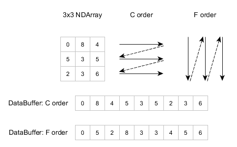
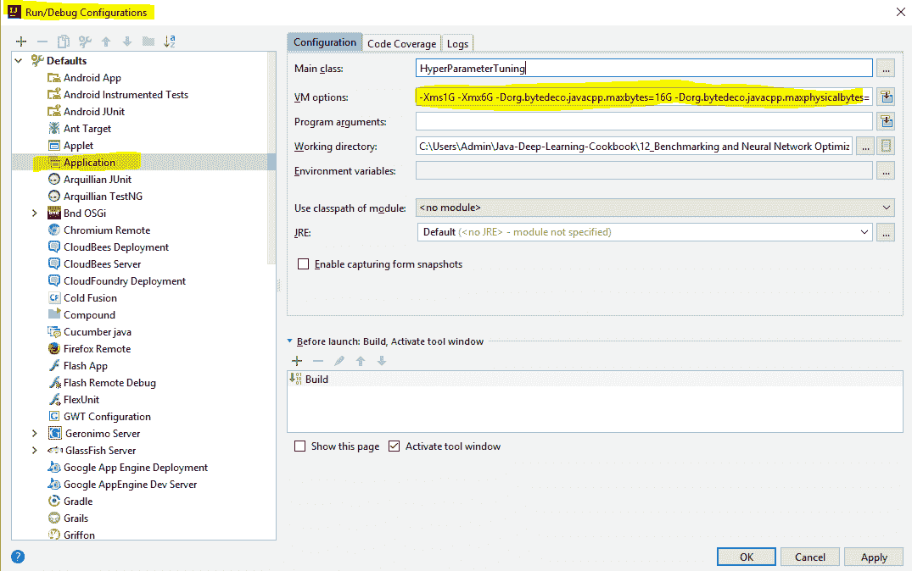
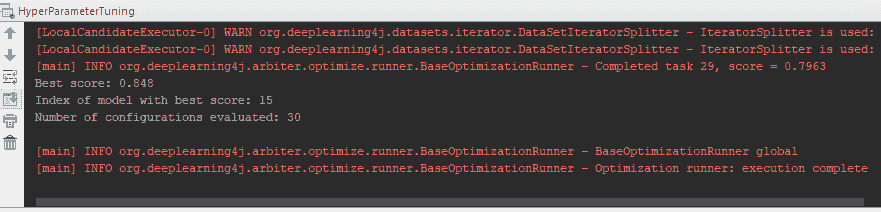
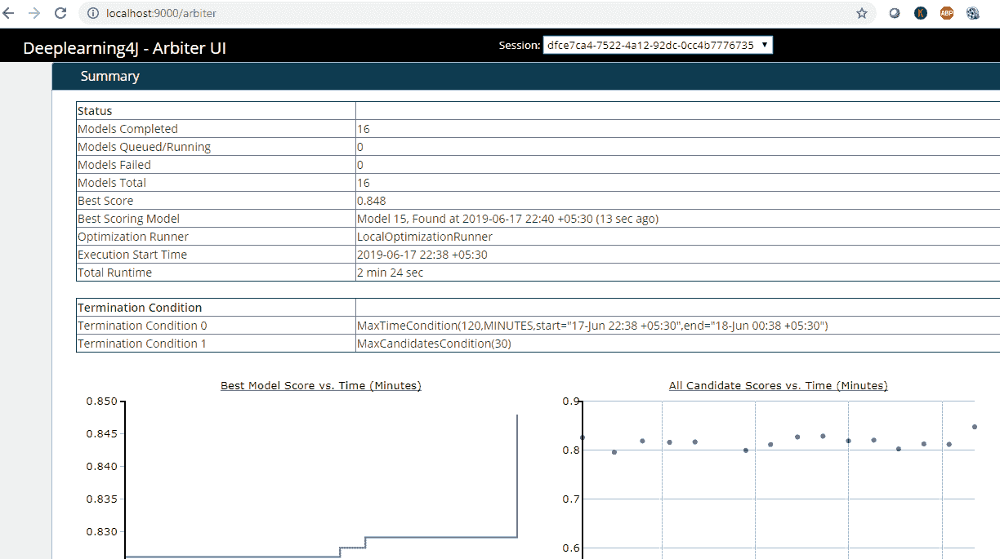

# 第十二章：基准测试与神经网络优化

基准测试是我们用来比较解决方案的标准，以判断它们是否优秀。在深度学习的背景下，我们可能会为表现相当不错的现有模型设定基准。我们可能会根据准确率、处理的数据量、内存消耗和 JVM 垃圾回收调优等因素来测试我们的模型。本章简要讨论了 DL4J 应用程序中的基准测试可能性。我们将从一般指南开始，然后转向更具体的 DL4J 基准测试设置。在本章的最后，我们将介绍一个超参数调优示例，展示如何找到最佳的神经网络参数，以获得最佳的结果。

本章将介绍以下内容：

+   DL4J/ND4J 特定配置

+   设置堆空间和垃圾回收

+   使用异步 ETL

+   使用 arbiter 监控神经网络行为

+   执行超参数调优

# 技术要求

本章的代码位于[`github.com/PacktPublishing/Java-Deep-Learning-Cookbook/tree/master/12_Benchmarking_and_Neural_Network_Optimization/sourceCode/cookbookapp/src/main/java`](https://github.com/PacktPublishing/Java-Deep-Learning-Cookbook/tree/master/12_Benchmarking_and_Neural_Network_Optimization/sourceCode/cookbookapp/src/main/java)。

克隆我们的 GitHub 仓库后，导航到`Java-Deep-Learning-Cookbook/12_Benchmarking_and_Neural_Network_Optimization/sourceCode`目录。然后通过导入`pom.xml`将`cookbookapp`项目作为 Maven 项目导入。

以下是两个示例的链接：

+   超参数调优示例：[`github.com/PacktPublishing/Java-Deep-Learning-Cookbook/blob/master/12_Benchmarking_and_Neural_Network_Optimization/sourceCode/cookbookapp/src/main/java/HyperParameterTuning.java`](https://github.com/PacktPublishing/Java-Deep-Learning-Cookbook/blob/master/12_Benchmarking_and_Neural_Network_Optimization/sourceCode/cookbookapp/src/main/java/HyperParameterTuning.java)

+   Arbiter UI 示例：[`github.com/PacktPublishing/Java-Deep-Learning-Cookbook/blob/master/12_Benchmarking_and_Neural_Network_Optimization/sourceCode/cookbookapp/src/main/java/HyperParameterTuningArbiterUiExample.java`](https://github.com/PacktPublishing/Java-Deep-Learning-Cookbook/blob/master/12_Benchmarking_and_Neural_Network_Optimization/sourceCode/cookbookapp/src/main/java/HyperParameterTuningArbiterUiExample.java)

本章的示例基于一个客户流失数据集（[`github.com/PacktPublishing/Java-Deep-Learning-Cookbook/tree/master/03_Building_Deep_Neural_Networks_for_Binary_classification/sourceCode/cookbookapp/src/main/resources`](https://github.com/PacktPublishing/Java-Deep-Learning-Cookbook/tree/master/03_Building_Deep_Neural_Networks_for_Binary_classification/sourceCode/cookbookapp/src/main/resources)）。该数据集包含在项目目录中。

尽管我们在本章中解释了 DL4J/ND4J 特定的基准测试，但我们建议您遵循一般的基准测试指南。以下是一些常见的神经网络通用基准：

+   **在实际基准任务之前进行预热迭代**：预热迭代指的是在开始实际 ETL 操作或网络训练之前，在基准任务上执行的一组迭代。预热迭代非常重要，因为最初的几次执行会很慢。这可能会增加基准任务的总时长，并可能导致错误或不一致的结论。最初几次迭代的缓慢执行可能是由于 JVM 的编译时间，DL4J/ND4J 库的延迟加载方式，或 DL4J/ND4J 库的学习阶段所致。学习阶段是指执行过程中用于学习内存需求的时间。

+   **多次执行基准任务**：为了确保基准结果的可靠性，我们需要多次执行基准任务。主机系统可能除了基准实例外还在并行运行多个应用程序/进程。因此，运行时性能会随着时间变化。为了评估这种情况，我们需要多次运行基准任务。

+   **了解基准设置的目的和原因**：我们需要评估是否设置了正确的基准。如果我们的目标是操作 a，那么确保只针对操作 a 进行基准测试。同时，我们还必须确保在适当的情况下使用正确的库。始终推荐使用库的最新版本。评估代码中使用的 DL4J/ND4J 配置也非常重要。默认配置在常规情况下可能足够，但为了获得最佳性能，可能需要手动配置。以下是一些默认配置选项，供参考：

    +   内存配置（堆空间设置）。

    +   垃圾回收和工作区配置（更改垃圾回收器调用的频率）。

    +   添加 cuDNN 支持（利用 CUDA 加速的 GPU 机器以获得更好的性能）。

    +   启用 DL4J 缓存模式（为训练实例引入缓存内存）。这将是 DL4J 特定的更改。

我们在第一章中讨论了 cuDNN，*Java 中的深度学习介绍*，同时谈到了 GPU 环境下的 DL4J。这些配置选项将在接下来的教程中进一步讨论。

+   **在不同规模的任务上运行基准**：在多个不同的输入大小/形状上运行基准非常重要，以全面了解其性能。像矩阵乘法这样的数学计算在不同维度下会有所不同。

+   **了解硬件**：使用最小批次大小的训练实例在 CPU 上的表现会比在 GPU 系统上更好。当我们使用较大的批次大小时，观察到的情况恰恰相反。此时，训练实例能够利用 GPU 资源。同样，较大的层大小也能更好地利用 GPU 资源。不了解底层硬件就编写网络配置，将无法发挥其全部潜力。

+   **重现基准测试并理解其局限性**：为了排查性能瓶颈，我们总是需要重现基准测试。评估性能不佳的情况时，了解其发生的环境非常有帮助。除此之外，我们还需要理解某些基准测试的限制。针对特定层设置的基准测试不会告诉你其他层的性能因素。

+   **避免常见的基准测试错误**：

    +   考虑使用最新版本的 DL4J/ND4J。为了应用最新的性能改进，可以尝试使用快照版本。

    +   注意使用的本地库类型（例如 cuDNN）。

    +   进行足够多的迭代，并使用合理的批次大小以获得一致的结果。

    +   在对硬件差异未进行考虑的情况下，不要跨硬件进行结果比较。

为了从最新的性能修复中受益，您需要在本地使用最新版本。如果您想在最新修复上运行源代码，并且新版本尚未发布，那么可以使用快照版本。有关如何使用快照版本的详细信息，请访问 [`deeplearning4j.org/docs/latest/deeplearning4j-config-snapshots`](https://deeplearning4j.org/docs/latest/deeplearning4j-config-snapshots)。

# DL4J/ND4J 特定配置

除了常规的基准测试指南外，我们还需要遵循一些特定于 DL4J/ND4J 的附加基准测试配置。这些是针对硬件和数学计算的重要基准测试配置。

由于 ND4J 是 DL4J 的 JVM 计算库，因此基准测试主要针对数学计算。任何关于 ND4J 的基准测试都可以同样应用于 DL4J。让我们来讨论 DL4J/ND4J 特定的基准测试。

# 准备工作

确保已经从以下链接下载了 cudNN：[`developer.nvidia.com/cudnn`](https://developer.nvidia.com/cudnn)。在尝试将其与 DL4J 配置之前，请先安装它。请注意，cuDNN 并不包含在 CUDA 中，因此仅添加 CUDA 依赖并不足够。

# 如何操作...

1.  分离 `INDArray` 数据以便在不同工作区间使用：

```py
INDArray array = Nd4j.rand(6, 6);
 INDArray mean = array.mean(1);
 INDArray result = mean.detach();
```

1.  删除训练/评估过程中创建的所有工作区，以防它们内存不足：

```py
Nd4j.getWorkspaceManager().destroyAllWorkspacesForCurrentThread();
```

1.  通过调用 `leverageTo()` 在当前工作区使用来自其他工作区的数组实例：

```py
LayerWorkspaceMgr.leverageTo(ArrayType.ACTIVATIONS, myArray);
```

1.  使用 `PerformanceListener` 跟踪每次迭代时花费的时间：

```py
model.setListeners(new PerformanceListener(frequency,reportScore)); 
```

1.  为支持 cuDNN 添加以下 Maven 依赖：

```py
<dependency>
   <groupId>org.deeplearning4j</groupId>
   <artifactId>deeplearning4j-cuda-x.x</artifactId> //cuda version to be specified
   <version>1.0.0-beta4</version>
 </dependency>
```

1.  配置 DL4J/cuDNN 以优先考虑性能而非内存：

```py
MultiLayerNetwork config = new NeuralNetConfiguration.Builder()
 .cudnnAlgoMode(ConvolutionLayer.AlgoMode.PREFER_FASTEST) //prefer performance over memory
 .build();
```

1.  配置`ParallelWrapper`以支持多 GPU 训练/推理：

```py
ParallelWrapper wrapper = new ParallelWrapper.Builder(model)
 .prefetchBuffer(deviceCount)
.workers(Nd4j.getAffinityManager().getNumberOfDevices())
.trainingMode(ParallelWrapper.TrainingMode.SHARED_GRADIENTS)
.thresholdAlgorithm(new AdaptiveThresholdAlgorithm())
 .build();
```

1.  按如下方式配置`ParallelInference`：

```py
ParallelInference inference = new ParallelInference.Builder(model)
 .inferenceMode(InferenceMode.BATCHED)
.batchLimit(maxBatchSize)
 .workers(workerCount)
 .build();

```

# 它是如何工作的……

工作空间是一种内存管理模型，它使得在无需引入 JVM 垃圾回收器的情况下，实现对循环工作负载的内存重用。每次工作空间循环时，`INDArray`的内存内容都会失效。工作空间可以用于训练或推理。

在第 1 步中，我们从工作空间基准测试开始。`detach()`方法将从工作空间中分离出特定的`INDArray`并返回一个副本。那么，我们如何为训练实例启用工作空间模式呢？如果你使用的是最新的 DL4J 版本（从 1.0.0-alpha 版本起），那么此功能默认已启用。本书中我们使用的目标版本是 1.0.0-beta 3。

在第 2 步中，我们从内存中移除了工作空间，如下所示：

```py
Nd4j.getWorkspaceManager().destroyAllWorkspacesForCurrentThread();
```

这将仅销毁当前运行线程中的工作空间。通过在相关线程中运行这段代码，我们可以释放工作空间的内存。

DL4J 还允许你为层实现自定义的工作空间管理器。例如，训练期间某一层的激活结果可以放在一个工作空间中，而推理的结果则可以放在另一个工作空间中。这可以通过 DL4J 的`LayerWorkspaceMgr`来实现，如第 3 步所述。确保返回的数组（第 3 步中的`myArray`）被定义为`ArrayType.ACTIVATIONS`：

```py
LayerWorkspaceMgr.create(ArrayType.ACTIVATIONS,myArray);
```

对于训练/推理，使用不同的工作空间模式是可以的。但推荐在训练时使用`SEPARATE`模式，在推理时使用`SINGLE`模式，因为推理只涉及前向传播，不涉及反向传播。然而，对于资源消耗/内存较高的训练实例，使用`SEPARATE`工作空间模式可能更合适，因为它消耗的内存较少。请注意，`SEPARATE`是 DL4J 中的默认工作空间模式。

在第 4 步中，创建`PerformanceListener`时使用了两个属性：`reportScore`和`frequency`。`reportScore`是一个布尔变量，`frequency`是需要追踪时间的迭代次数。如果`reportScore`为`true`，则会报告得分（就像在`ScoreIterationListener`中一样），并提供每次迭代所花费时间的信息。

在第 7 步中，我们使用了`ParallelWrapper`或`ParallelInference`来支持多 GPU 设备。一旦我们创建了神经网络模型，就可以使用它创建一个并行包装器。我们需要指定设备数量、训练模式以及并行包装器的工作线程数。

我们需要确保训练实例是具备成本效益的。将多个 GPU 添加到系统中并在训练时仅使用一个 GPU 是不现实的。理想情况下，我们希望充分利用所有 GPU 硬件来加速训练/推理过程，并获得更好的结果。`ParallelWrapper`和`ParallelInference`正是为了这个目的。

以下是`ParallelWrapper`和`ParallelInference`支持的一些配置：

+   `prefetchBuffer(deviceCount)`：此并行包装方法指定数据集预取选项。我们在此提到设备的数量。

+   `trainingMode(mode)`：此并行包装方法指定分布式训练方法。`SHARED_GRADIENTS`指的是分布式训练中的梯度共享方法。

+   `workers(Nd4j.getAffinityManager().getNumberOfDevices())`：此并行包装方法指定工作者的数量。我们将工作者的数量设置为可用系统的数量。

+   `inferenceMode(mode)`：此并行推理方法指定分布式推理方法。`BATCHED`模式是一种优化方式。如果大量请求涌入，它会将请求批量处理。如果请求较少，则会按常规处理，不进行批处理。正如你可能猜到的，这是生产环境中的最佳选择。

+   `batchLimit(batchSize)`：此并行推理方法指定批处理大小限制，仅在使用`inferenceMode()`中的`BATCHED`模式时适用。

# 还有更多...

ND4J 操作的性能还可能受到输入数组排序的影响。ND4J 强制执行数组的排序。数学运算（包括一般的 ND4J 操作）的性能取决于输入数组和结果数组的排序。例如，像*z = x + y*这样的简单加法操作的性能会根据输入数组的排序有所变化。这是因为内存步幅的原因：如果内存序列靠得很近，读取它们会更容易，而不是分布得很远。ND4J 在处理更大的矩阵时运算速度更快。默认情况下，ND4J 数组是 C-顺序的。IC 排序指的是行主序排序，内存分配类似于 C 语言中的数组：



（图片由 Eclipse Deeplearning4j 开发团队提供。Deeplearning4j：用于 JVM 的开源分布式深度学习，Apache 软件基金会许可证 2.0。http://deeplearning4j.org）

ND4J 提供了`gemm()`方法，用于在两个 INDArray 之间进行高级矩阵乘法，具体取决于是否需要在转置后进行乘法运算。此方法返回 F 顺序的结果，这意味着内存分配类似于 Fortran 中的数组。F 顺序指的是列主序排序。假设我们传递了一个 C-顺序的数组来收集`gemm()`方法的结果；ND4J 会自动检测它，创建一个 F-顺序数组，然后将结果传递给一个 C-顺序数组。

要了解更多关于数组排序以及 ND4J 如何处理数组排序的信息，请访问[`deeplearning4j.org/docs/latest/nd4j-overview`](https://deeplearning4j.org/docs/latest/nd4j-overview)。

评估用于训练的迷你批次大小也是至关重要的。我们需要在进行多次训练时，尝试不同的迷你批次大小，并根据硬件规格、数据和评估指标进行调整。在启用 CUDA 的 GPU 环境中，如果使用一个足够大的值，迷你批次大小将在基准测试中起到重要作用。当我们谈论一个大的迷你批次大小时，我们是指可以根据整个数据集来合理化的迷你批次大小。对于非常小的迷你批次大小，我们在基准测试后不会观察到 CPU/GPU 有明显的性能差异。与此同时，我们还需要关注模型准确度的变化。理想的迷你批次大小是当我们充分利用硬件性能的同时，不影响模型准确度。事实上，我们的目标是在更好的性能（更短的训练时间）下获得更好的结果。

# 设置堆空间和垃圾回收

内存堆空间和垃圾回收是经常被讨论的话题，但却往往是最常被忽略的基准测试。在使用 DL4J/ND4J 时，你可以配置两种类型的内存限制：堆内存和非堆内存。每当 JVM 垃圾回收器回收一个`INDArray`时，非堆内存将被释放，前提是它不在其他地方使用。在本教程中，我们将设置堆空间和垃圾回收以进行基准测试。

# 如何操作...

1.  向 Eclipse/IntelliJ IDE 中添加所需的 VM 参数，如以下示例所示：

```py
-Xms1G -Xmx6G -Dorg.bytedeco.javacpp.maxbytes=16G -Dorg.bytedeco.javacpp.maxphysicalbytes=20G
```

例如，在 IntelliJ IDE 中，我们可以将 VM 参数添加到运行时配置中：



1.  在更改内存限制以适应硬件后，运行以下命令（用于命令行执行）：

```py
java -Xms1G -Xmx6G -Dorg.bytedeco.javacpp.maxbytes=16G -Dorg.bytedeco.javacpp.maxphysicalbytes=20G YourClassName

```

1.  配置 JVM 的服务器风格代际垃圾回收器：

```py
java -XX:+UseG1GC
```

1.  使用 ND4J 减少垃圾回收器调用的频率：

```py
Nd4j.getMemoryManager().setAutoGcWindow(3000);
```

1.  禁用垃圾回收器调用，而不是执行第 4 步：

```py
Nd4j.getMemoryManager().togglePeriodicGc(false);
```

1.  在内存映射文件中分配内存块，而不是使用 RAM：

```py
WorkspaceConfiguration memoryMap = WorkspaceConfiguration.builder()
 .initialSize(2000000000)
 .policyLocation(LocationPolicy.MMAP)
 .build();
 try (MemoryWorkspace workspace = Nd4j.getWorkspaceManager().getAndActivateWorkspace(memoryMap, "M")) {
 INDArray example = Nd4j.create(10000);
 }
```

# 它是如何工作的...

在第 1 步中，我们进行了堆内存/非堆内存配置。堆内存指的是由 JVM 堆（垃圾回收器）管理的内存。非堆内存则是指不被直接管理的内存，例如 INDArrays 使用的内存。通过以下 Java 命令行选项，我们可以控制堆内存和非堆内存的限制：

+   `-Xms`：此选项定义了应用启动时 JVM 堆将消耗的内存量。

+   `-Xmx`：此选项定义了 JVM 堆在运行时可以消耗的最大内存。它仅在需要时分配内存，且不会超过此限制。

+   `-Dorg.bytedeco.javacpp.maxbytes`：此选项指定非堆内存的限制。

+   `-Dorg.bytedeco.javacpp.maxphysicalbytes`：此选项指定可以分配给应用程序的最大字节数。通常，这个值比`-Xmx`和`maxbytes`的组合值要大。

假设我们想要在堆内最初配置 1 GB，在堆内最大配置 6 GB，在堆外配置 16 GB，并在进程的最大内存为 20 GB，VM 参数将如下所示，并如步骤 1 所示：

```py
-Xms1G -Xmx6G -Dorg.bytedeco.javacpp.maxbytes=16G -Dorg.bytedeco.javacpp.maxphysicalbytes=20G
```

请注意，您需要根据硬件可用内存进行相应调整。

还可以将这些 VM 选项设置为环境变量。我们可以创建一个名为`MAVEN_OPTS`的环境变量并将 VM 选项放置在其中。您可以选择步骤 1 或步骤 2，或者设置环境变量。完成此操作后，可以跳转到步骤 3。

在步骤 3、4 和 5 中，我们讨论了通过一些垃圾收集优化自动管理内存。垃圾收集器管理内存管理并消耗堆内内存。DL4J 与垃圾收集器紧密耦合。如果我们谈论 ETL，每个`DataSetIterator`对象占用 8 字节内存。垃圾收集器可能会进一步增加系统的延迟。为此，我们在步骤 3 中配置了**G1GC**（即**Garbage First Garbage Collector**）调优。

如果我们将 0 毫秒（毫秒）作为属性传递给`setAutoGcWindow()`方法（如步骤 4 所示），它将只是禁用此特定选项。`getMemoryManager()`将返回一个用于更低级别内存管理的后端特定实现的`MemoryManager`。

在步骤 6 中，我们讨论了配置内存映射文件以为**INDArrays**分配更多内存。我们在步骤 4 中创建了一个 1 GB 的内存映射文件。请注意，只有使用`nd4j-native`库时才能创建和支持内存映射文件。内存映射文件比 RAM 中的内存分配速度慢。如果小批量大小的内存需求高于可用 RAM 量，则可以应用步骤 4。

# 这还不是全部……

DL4J 与 JavaCPP 有依赖关系，后者充当 Java 和 C++之间的桥梁：[`github.com/bytedeco/javacpp`](https://github.com/bytedeco/javacpp)。

JavaCPP 基于堆空间（堆外内存）上设置的`-Xmx`值运行。DL4J 寻求垃圾收集器和 JavaCPP 的帮助来释放内存。

对于涉及大量数据的训练会话，重要的是为堆外内存空间（JVM）提供比堆内内存更多的 RAM。为什么？因为我们的数据集和计算涉及到**INDArrays**，并存储在堆外内存空间中。

识别运行应用程序的内存限制非常重要。以下是需要正确配置内存限制的一些情况：

+   对于 GPU 系统，`maxbytes`和`maxphysicalbytes`是重要的内存限制设置。这里我们处理的是堆外内存。为这些设置分配合理的内存允许我们使用更多的 GPU 资源。

+   对于涉及内存分配问题的 `RunTimeException`，一个可能的原因是堆外内存空间不可用。如果我们没有使用 *设置堆空间和垃圾回收* 章节中讨论的内存限制（堆外内存空间）设置，堆外内存空间可能会被 JVM 垃圾回收器回收，从而导致内存分配问题。

+   如果你的环境内存有限，建议不要为 `-Xmx` 和 `-Xms` 选项设置过大的值。例如，如果我们为 8 GB 内存的系统使用 `-Xms6G`，那么仅剩下 2 GB 的内存空间用于堆外内存、操作系统和其他进程。

# 另见

+   如果你有兴趣了解更多关于 G1GC 垃圾回收器的调优内容，可以阅读以下链接：[`www.oracle.com/technetwork/articles/java/g1gc-1984535.html`](https://www.oracle.com/technetwork/articles/java/g1gc-1984535.html)

# 使用异步 ETL

我们使用同步 ETL 进行演示。但在生产环境中，推荐使用异步 ETL。在生产环境中，一个低性能的 ETA 组件可能会导致性能瓶颈。在 DL4J 中，我们使用 `DataSetIterator` 将数据加载到磁盘。它可以从磁盘、内存中加载数据，或者简单地异步加载数据。异步 ETL 在后台使用异步加载器。通过多线程，它将数据加载到 GPU/CPU 中，其他线程负责计算任务。在下面的操作步骤中，我们将在 DL4J 中执行异步 ETL 操作。

# 如何操作...

1.  使用异步预取创建异步迭代器：

```py
DatasetIterator asyncIterator = new AsyncMultiDataSetIterator(iterator);
```

1.  使用同步预取创建异步迭代器：

```py
DataSetIterator shieldIterator = new AsyncShieldDataSetIterator(iterator);
```

# 它是如何工作的...

在第一步中，我们使用 `AsyncMultiDataSetIterator` 创建了一个迭代器。我们可以使用 `AsyncMultiDataSetIterator` 或 `AsyncDataSetIterator` 来创建异步迭代器。`AsyncMultiDataSetIterator` 有多种配置方式。你可以通过传递其他属性来创建 `AsyncMultiDataSetIterator`，例如 `queSize`（一次可以预取的迷你批次的数量）和 `useWorkSpace`（布尔类型，表示是否应该使用工作区配置）。在使用 `AsyncDataSetIterator` 时，我们会在调用 `next()` 获取下一个数据集之前使用当前数据集。还需要注意的是，在没有调用 `detach()` 的情况下不应存储数据集。如果这样做，数据集中 INDArray 数据使用的内存最终会在 `AsyncDataSetIterator` 中被覆盖。对于自定义迭代器实现，确保你在训练/评估过程中不要通过 `next()` 调用初始化大型对象。相反，应将所有初始化工作放在构造函数内，以避免不必要的工作区内存消耗。

在步骤 2 中，我们使用`AsyncShieldDataSetIterator`创建了一个迭代器。要选择退出异步预取，我们可以使用`AsyncShieldMultiDataSetIterator`或`AsyncShieldDataSetIterator`。这些包装器将在数据密集型操作（如训练）中防止异步预取，可以用于调试目的。

如果训练实例每次运行时都执行 ETL 操作，实际上我们每次都在重新创建数据。最终，整个过程（训练和评估）会变得更慢。我们可以通过使用预先保存的数据集来更好地处理这一点。我们在上一章中讨论了使用`ExistingMiniBatchDataSetIterator`进行预保存，当时我们预保存了特征数据，并随后使用`ExistingMiniBatchDataSetIterator`加载它。我们可以将其转换为异步迭代器（如步骤 1 或步骤 2 所示），一举两得：使用异步加载的预保存数据。这本质上是一个性能基准，进一步优化了 ETL 过程。

# 还有更多...

假设我们的迷你批次有 100 个样本，并且我们将`queSize`设置为`10`；每次将预取 1,000 个样本。工作区的内存需求取决于数据集的大小，这来自于底层的迭代器。工作区将根据不同的内存需求进行调整（例如，长度变化的时间序列）。请注意，异步迭代器是通过`LinkedBlockingQueue`在内部支持的。这个队列数据结构以**先进先出**（**FIFO**）模式对元素进行排序。在并发环境中，链式队列通常比基于数组的队列有更高的吞吐量。

# 使用 arbiter 监控神经网络行为

超参数优化/调优是寻找学习过程中超参数的最优值的过程。超参数优化部分自动化了使用某些搜索策略来寻找最佳超参数的过程。Arbiter 是 DL4J 深度学习库的一部分，用于超参数优化。Arbiter 可以通过调整神经网络的超参数来找到高性能的模型。Arbiter 有一个用户界面，用于可视化超参数调优过程的结果。

在这个配方中，我们将设置 arbiter 并可视化训练实例，观察神经网络的行为。

# 如何操作...

1.  在`pom.xml`中添加 arbiter Maven 依赖：

```py
<dependency>
   <groupId>org.deeplearning4j</groupId>
   <artifactId>arbiter-deeplearning4j</artifactId>
   <version>1.0.0-beta3</version>
 </dependency>
 <dependency>
   <groupId>org.deeplearning4j</groupId>
   <artifactId>arbiter-ui_2.11</artifactId>
   <version>1.0.0-beta3</version>
 </dependency>
```

1.  使用`ContinuousParameterSpace`配置搜索空间：

```py
ParameterSpace<Double> learningRateParam = new ContinuousParameterSpace(0.0001,0.01);
```

1.  使用`IntegerParameterSpace`配置搜索空间：

```py
ParameterSpace<Integer> layerSizeParam = new IntegerParameterSpace(5,11);   
```

1.  使用`OptimizationConfiguration`来结合执行超参数调优过程所需的所有组件：

```py
OptimizationConfiguration optimizationConfiguration = new             OptimizationConfiguration.Builder()
 .candidateGenerator(candidateGenerator)
 .dataProvider(dataProvider)
 .modelSaver(modelSaver)
 .scoreFunction(scoreFunction)
 .terminationConditions(conditions)
 .build();
```

# 它是如何工作的...

在步骤 2 中，我们创建了`ContinuousParameterSpace`来配置超参数优化的搜索空间：

```py
ParameterSpace<Double> learningRateParam = new ContinuousParameterSpace(0.0001,0.01);
```

在前述情况下，超参数调优过程将选择学习率在(0.0001, 0.01)范围内的连续值。请注意，仲裁者并不会自动化超参数调优过程。我们仍然需要指定值的范围或选项列表，以便超参数调优过程进行。换句话说，我们需要指定一个搜索空间，其中包含所有有效的值，供调优过程选择最佳组合，从而获得最佳结果。我们还提到了`IntegerParameterSpace`，它的搜索空间是一个整数的有序空间，位于最大/最小值之间。

由于有多个不同配置的训练实例，因此超参数优化调优过程需要一段时间才能完成。最后，将返回最佳配置。

在步骤 2 中，一旦我们使用`ParameterSpace`或`OptimizationConfiguration`定义了搜索空间，我们需要将其添加到`MultiLayerSpace`或`ComputationGraphSpace`中。这些是 DL4J 的`MultiLayerConfiguration`和`ComputationGraphConfiguration`的仲裁者对应物。

然后，我们使用`candidateGenerator()`构建方法添加了`candidateGenerator`。`candidateGenerator`为超参数调优选择候选者（各种超参数组合）。它可以使用不同的方法，如随机搜索和网格搜索，来选择下一个用于超参数调优的配置。

`scoreFunction()`指定在超参数调优过程中用于评估的评估指标。

`terminationConditions()`用于指定所有的训练终止条件。超参数调优随后将进行下一个配置。

# 执行超参数调优

一旦使用`ParameterSpace`或`OptimizationConfiguration`定义了搜索空间，并且有可能的值范围，下一步是使用`MultiLayerSpace`或`ComputationGraphSpace`完成网络配置。之后，我们开始训练过程。在超参数调优过程中，我们会执行多个训练会话。

在这个示例中，我们将执行并可视化超参数调优过程。我们将在演示中使用`MultiLayerSpace`。

# 如何实现...

1.  使用`IntegerParameterSpace`为层大小添加搜索空间：

```py
ParameterSpace<Integer> layerSizeParam = new IntegerParameterSpace(startLimit,endLimit);
```

1.  使用`ContinuousParameterSpace`为学习率添加搜索空间：

```py
ParameterSpace<Double> learningRateParam = new ContinuousParameterSpace(0.0001,0.01);
```

1.  使用`MultiLayerSpace`通过将所有搜索空间添加到相关的网络配置中来构建配置空间：

```py
MultiLayerSpace hyperParamaterSpace = new MultiLayerSpace.Builder()
 .updater(new AdamSpace(learningRateParam))
 .addLayer(new DenseLayerSpace.Builder()
   .activation(Activation.RELU)
   .nIn(11)
   .nOut(layerSizeParam)
   .build())
 .addLayer(new DenseLayerSpace.Builder()
   .activation(Activation.RELU)
   .nIn(layerSizeParam)
   .nOut(layerSizeParam)
   .build())
 .addLayer(new OutputLayerSpace.Builder()
   .activation(Activation.SIGMOID)
   .lossFunction(LossFunctions.LossFunction.XENT)
   .nOut(1)
   .build())
 .build();

```

1.  从`MultiLayerSpace`创建`candidateGenerator`：

```py
Map<String,Object> dataParams = new HashMap<>();
 dataParams.put("batchSize",new Integer(10));

CandidateGenerator candidateGenerator = new RandomSearchGenerator(hyperParamaterSpace,dataParams);
```

1.  通过实现`DataSource`接口来创建数据源：

```py
public static class ExampleDataSource implements DataSource{
  public ExampleDataSource(){
     //implement methods from DataSource
  }
 }
```

我们需要实现四个方法：`configure()`、`trainData()`、`testData()`和`getDataType()`：

+   +   以下是`configure()`的示例实现：

```py
public void configure(Properties properties) {
    this.minibatchSize = Integer.parseInt(properties.getProperty("minibatchSize", "16"));
 }
```

+   +   这是`getDataType()`的示例实现：

```py
public Class<?> getDataType() {
 return DataSetIterator.class;
 }
```

+   +   这是`trainData()`的示例实现：

```py
public Object trainData() {
 try{
 DataSetIterator iterator = new RecordReaderDataSetIterator(dataPreprocess(),minibatchSize,labelIndex,numClasses);
 return dataSplit(iterator).getTestIterator();
 }
 catch(Exception e){
 throw new RuntimeException();
 }
 }
```

+   +   这是`testData()`的示例实现：

```py
public Object testData() {
 try{
 DataSetIterator iterator = new RecordReaderDataSetIterator(dataPreprocess(),minibatchSize,labelIndex,numClasses);
 return dataSplit(iterator).getTestIterator();
 }
 catch(Exception e){
 throw new RuntimeException();
 }
 }
```

1.  创建一个终止条件数组：

```py
TerminationCondition[] conditions = {
   new MaxTimeCondition(maxTimeOutInMinutes, TimeUnit.MINUTES),
   new MaxCandidatesCondition(maxCandidateCount)
};
```

1.  计算使用不同配置组合创建的所有模型的得分：

```py
ScoreFunction scoreFunction = new EvaluationScoreFunction(Evaluation.Metric.ACCURACY);
```

1.  创建`OptimizationConfiguration`并添加终止条件和评分函数：

```py
OptimizationConfiguration optimizationConfiguration = new OptimizationConfiguration.Builder()
 .candidateGenerator(candidateGenerator)
 .dataSource(ExampleDataSource.class,dataSourceProperties)
 .modelSaver(modelSaver)
 .scoreFunction(scoreFunction)
 .terminationConditions(conditions)
 .build();
```

1.  创建`LocalOptimizationRunner`以运行超参数调优过程：

```py
IOptimizationRunner runner = new LocalOptimizationRunner(optimizationConfiguration,new MultiLayerNetworkTaskCreator());
```

1.  向`LocalOptimizationRunner`添加监听器，以确保事件正确记录（跳到第 11 步添加`ArbiterStatusListener`）：

```py
runner.addListeners(new LoggingStatusListener());
```

1.  通过调用`execute()`方法执行超参数调优：

```py
runner.execute();
```

1.  存储模型配置并将`LoggingStatusListener`替换为`ArbiterStatusListener`：

```py
StatsStorage storage = new FileStatsStorage(new File("HyperParamOptimizationStatsModel.dl4j"));
 runner.addListeners(new ArbiterStatusListener(storage));
```

1.  将存储附加到`UIServer`：

```py
UIServer.getInstance().attach(storage);
```

1.  运行超参数调优会话，并访问以下 URL 查看可视化效果：

```py
http://localhost:9000/arbiter
```

1.  评估超参数调优会话中的最佳得分，并在控制台中显示结果：

```py
double bestScore = runner.bestScore();
 int bestCandidateIndex = runner.bestScoreCandidateIndex();
 int numberOfConfigsEvaluated = runner.numCandidatesCompleted();
```

你应该会看到以下快照中显示的输出。显示了模型的最佳得分、最佳模型所在的索引以及在过程中过滤的配置数量：



# 它是如何工作的...

在第 4 步中，我们设置了一种策略，通过该策略从搜索空间中选择网络配置。我们为此目的使用了`CandidateGenerator`。我们创建了一个参数映射来存储所有数据映射，以便与数据源一起使用，并将其传递给`CandidateGenerator`。

在第 5 步中，我们实现了`configure()`方法以及来自`DataSource`接口的另外三个方法。`configure()`方法接受一个`Properties`属性，其中包含所有要与数据源一起使用的参数。如果我们想传递`miniBatchSize`作为属性，则可以创建一个`Properties`实例，如下所示：

```py
Properties dataSourceProperties = new Properties();
 dataSourceProperties.setProperty("minibatchSize", "64");
```

请注意，迷你批量大小需要作为字符串 `"64"` 提供，而不是 `64`。

自定义的`dataPreprocess()`方法对数据进行预处理。`dataSplit()`创建`DataSetIteratorSplitter`来生成训练/评估的迭代器。

在第 4 步中，`RandomSearchGenerator`通过随机方式生成超参数调优的候选项。如果我们明确提到超参数的概率分布，那么随机搜索将根据其概率偏向这些超参数。`GridSearchCandidateGenerator`通过网格搜索生成候选项。对于离散型超参数，网格大小等于超参数值的数量。对于整数型超参数，网格大小与`min(discretizationCount,max-min+1)`相同。

在第 6 步中，我们定义了终止条件。终止条件控制训练过程的进展程度。终止条件可以是`MaxTimeCondition`、`MaxCandidatesCondition`，或者我们可以定义自己的终止条件。

在第 7 步中，我们创建了一个评分函数，用于说明在超参数优化过程中如何评估每个模型。

在第 8 步中，我们创建了包含这些终止条件的 `OptimizationConfiguration`。除了终止条件外，我们还向 `OptimizationConfiguration` 添加了以下配置：

+   模型信息需要存储的位置

+   之前创建的候选生成器

+   之前创建的数据源

+   要考虑的评估指标类型

`OptimizationConfiguration` 将所有组件结合起来执行超参数优化。请注意，`dataSource()` 方法需要两个属性：一个是数据源类的类类型，另一个是我们想要传递的数据源属性（在我们的示例中是 `minibatchSize`）。`modelSaver()` 构建方法要求你指定正在训练的模型的存储位置。我们可以将模型信息（模型评分及其他配置）存储在资源文件夹中，然后创建一个 `ModelSaver` 实例，如下所示：

```py
ResultSaver modelSaver = new FileModelSaver("resources/");
```

为了使用裁判进行可视化，跳过第 10 步，按照第 12 步操作，然后执行可视化任务运行器。

在遵循第 13 和第 14 步的指示之后，你应该能够看到裁判的 UI 可视化，如下所示：



从裁判可视化中找出最佳模型评分非常直观且容易。如果你运行了多个超参数调优的会话，你可以从顶部的下拉列表中选择特定的会话。此时，UI 上显示的其他重要信息也非常易于理解。
