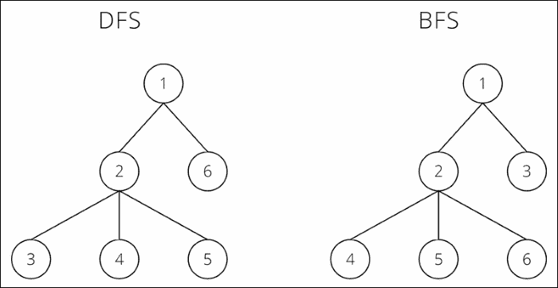
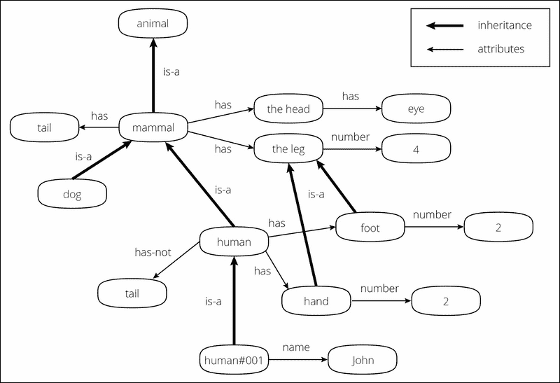
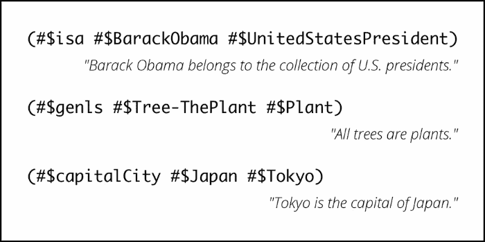
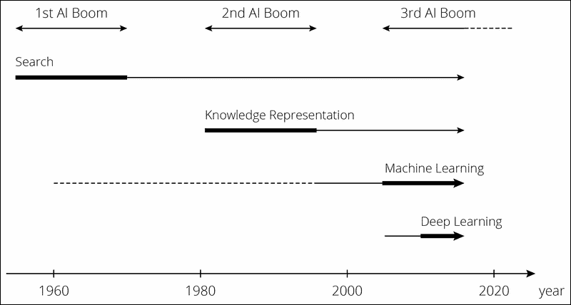
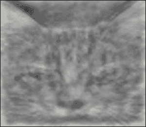
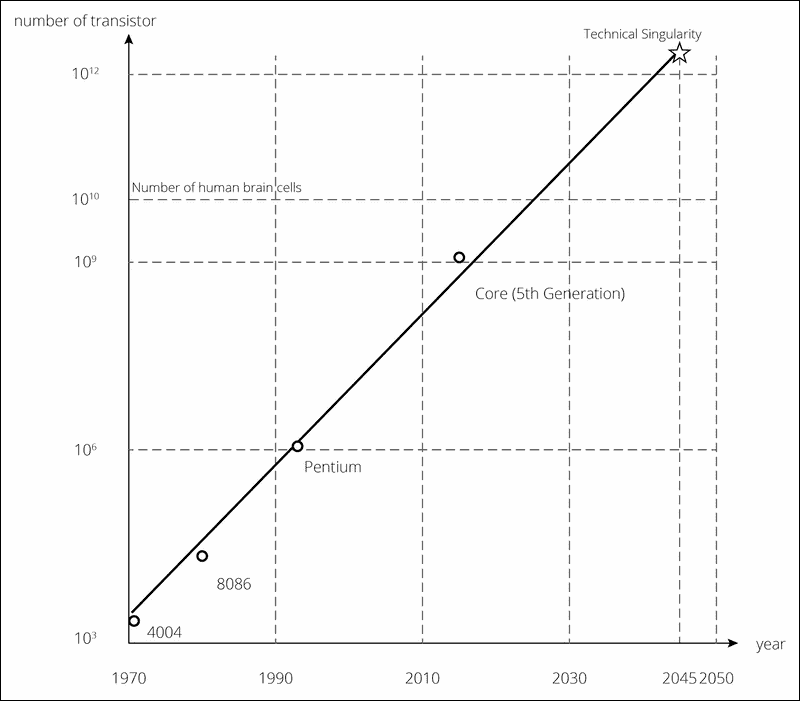

# 第一章：深度学习概述

**人工智能**（**AI**）是您可能最近越来越频繁看到的一个词汇。AI 不仅在学术界成为热门话题，也在商业领域引起了广泛关注。像谷歌和脸书这样的科技巨头已经积极收购与 AI 相关的初创公司。在这些 AI 领域的并购活动尤其活跃，大量资金涌入 AI 行业。2014 年 6 月，日本的 IT/移动运营商软银公司发布了一款名为 Pepper 的机器人，它能够理解人类的情感，且在一年后开始将 Pepper 出售给普通消费者。毫无疑问，这是人工智能领域的一个积极发展。

人工智能的概念已存在数十年。那么，为什么人工智能突然成为热门领域呢？推动近期 AI 相关变革的因素之一，几乎总是与**深度学习**一词一起使用。随着深度学习的精彩登场及其技术能力的指数级增长，人们开始认为人工智能最终将成为现实。看起来深度学习无疑是我们需要掌握的内容。那么，究竟什么是深度学习呢？

为了回答前面的问题，本章将通过回顾人工智能的历史和研究领域，探讨为什么以及如何人工智能（AI）变得如此流行。我们将涉及的主题包括：

+   人工智能的早期方法与技术

+   机器学习简介及其如何演变为深度学习

+   深度学习简介及其一些最新应用案例

如果您已经了解深度学习的基本概念，或者希望了解深度学习的具体算法和实现技术，您可以跳过本章，直接阅读第二章，*机器学习算法——为深度学习做准备*。

尽管深度学习是一项创新技术，但它实际上并不复杂，反而出奇地简单。通过阅读本书，您将看到它的非凡之处。我真诚地希望本书能帮助您更好地理解深度学习，从而促进您的研究和商业发展。

# 人工智能的变迁

那么，为什么现在深度学习会成为焦点呢？你可能会问这个问题，尤其是如果你熟悉机器学习，因为深度学习与其他机器学习算法并没有太大不同（如果你不熟悉这一点也没关系，因为我们会在本书后面讲解）。事实上，我们可以说深度学习是神经网络（机器学习的一种算法）的改进，模仿人类大脑的结构。然而，深度学习能够实现的东西，比任何其他机器学习算法，包括神经网络，都要更为显著和不同。如果你了解深度学习所经历的过程和研究，你会更好地理解深度学习本身。因此，让我们来看看 AI 的发展历程。你可以一边喝着咖啡一边浏览这些内容。

## AI 的定义

突然间，AI 成为了全球的热门话题；然而，事实证明，真正的 AI 还并不存在。当然，研究正在推进以实现真正的 AI，但这还需要更多的时间才能实现。不管你是否高兴，人类的大脑——可以称之为“智慧”——是极为复杂的结构，你无法轻易复制它。

等等——我们看到很多广告中都带有*由 AI 驱动*或*使用 AI*的字眼。这些是骗人的广告吗？实际上，它们确实是！惊讶吗？你可能会看到像*由 AI 推荐系统*或*由 AI 驱动的产品*这样的词语，但这里使用的*AI*并没有表达出 AI 的实际含义。严格来说，AI 这个词被用在一个更广泛的意义上。过去对 AI 的研究以及积累的 AI 技术只实现了 AI 的一部分，但如今人们也开始用这个词来描述这些部分。

我们来看看几个例子。大致上，有三个被广泛认定为 AI 的不同类别：

+   简单的重复性机械动作，是人类事先编程的。例如，那些只处理相同一组工作的高速工业机器人。

+   根据人类设定的规则搜索或猜测给定任务的答案。例如，iRobot Roomba 能够根据碰撞障碍物来推测房间的形状，并沿着房间的形状进行清扫。

+   通过从现有数据中找出可量化的规律，提供未知数据的答案。例如，基于用户购买历史的产品推荐系统，或是在广告网络中分发横幅广告，都属于这一类别。

人们使用 AI 这个词来指代这些范畴，毫无疑问，利用深度学习的新技术也被称为 AI。然而，这些技术在结构和功能上存在差异。那么，究竟哪种技术才应该被具体称为 AI 呢？不幸的是，大家对这个问题的看法不同，答案无法客观地解释。从学术角度来看，已经有一个术语被设定为**强 AI**或**弱 AI**，具体取决于机器能够达到的水平。然而，在本书中，为了避免混淆，AI 被用来指代（*尚未实现的*）与实际人脑难以区分的人类智能。AI 领域正在飞速发展，深度学习驱动下，AI 成为现实的可能性呈指数增长。这个领域现在比历史上任何时候都更加蓬勃发展。这个繁荣会持续多久，取决于未来的研究。

## AI 在过去曾经历过繁荣。

最近，AI 突然成为了热门话题，但这并不是第一次 AI 的繁荣。回顾过去，AI 研究已经进行了几十年，并且有过活跃和不活跃的周期。最近的繁荣是第三次繁荣。因此，一些人认为，这次不过是又一次短暂的繁荣而已。

然而，最新的繁荣与过去的繁荣有着显著的不同。没错，那就是深度学习。深度学习实现了过去技术无法达成的成就。那是什么呢？简而言之，机器能够从给定的数据中自动提取特征量并进行学习。有了这一成就，我们可以看到 AI 成为现实的巨大可能性，因为直到现在，机器无法自行理解新的概念，而人类需要提前输入某些特征量，这些特征量是基于 AI 领域中创建的过去技术。

如果仅仅阅读这个事实，看起来似乎没有太大差别，但其中差距巨大。要到达机器能够自我测量特征量的阶段，经历了漫长的过程。当机器能够通过深度学习获得智能时，人们终于迈出了巨大的步伐。那么，过去的技术和深度学习之间的巨大差异是什么呢？让我们简要回顾一下过去的 AI 领域，以更好地理解这个差异。

第一次人工智能的热潮出现在 1950 年代末。当时，主流的搜索程序研发是基于固定规则——不用说，这些规则是由人类定义的。简单来说，搜索就是分割案例。在这种搜索中，如果我们希望机器执行某个过程，我们必须列出可能需要的每一种模式。机器的计算速度远远快于人类。无论模式有多庞大，机器都能够轻松处理。机器会不断地搜索一百万次，最终会找到最佳答案。然而，即便机器计算速度极快，如果只是盲目地随机搜索答案，仍然需要消耗大量的时间。是的，不要忘记那个限制条件，“时间”。因此，后续的研究聚焦于如何提高搜索效率。在这些研究中，最流行的搜索方法是**深度优先搜索**（**DFS**）和**广度优先搜索**（**BFS**）。

在你能想到的每一种可能模式中，寻找最有效的路径，并在现实的时间限制内做出最佳选择。通过这种方式，你应该能够每次都得到最佳答案。基于这个假设，开发了两种用于树形图数据结构的搜索或遍历算法：DFS 和 BFS。两者都从图或树的根节点开始，DFS 会沿每个分支尽可能深入，直到回溯，而 BFS 则首先探索邻居节点，然后再移动到下一层的邻居节点。以下是展示 DFS 和 BFS 差异的示例图：

这些搜索算法在特定领域中能够实现某些结果，尤其是在象棋和将棋等领域。这个棋盘游戏领域是机器擅长的一个领域。如果提前提供大量的胜负模式、过去的游戏数据以及棋子的所有允许移动，机器就能够评估棋盘位置，并从大量的模式中选择最佳的下一步棋。

对于那些对这个领域感兴趣的人，我们来更详细地看看机器是如何下棋的。假设机器先走"白棋"，并且下一步无论是"白棋"还是"黑棋"，都有 20 种可能的走法。记得之前图示中的树状模型吧。从游戏开始时树的顶部，白棋的下一步有 20 个分支。在其中一个分支下，又有 20 个分支作为黑棋的下一步走法，以此类推。在这种情况下，根据白棋的走法，树下有 20 x 20 = 400 个黑棋分支，再根据黑棋的走法，400 x 20 = 8,000 个白棋分支，8,000 x 20 = 160,000 个黑棋分支，依此类推……如果你愿意的话，可以继续计算下去。

一台机器生成这棵树并从这些分支中评估每一个可能的棋盘位置，在一秒钟内决定最佳安排。它的深度（生成和评估的树的层数）由机器的速度控制。当然，每个不同棋子的运动也应当考虑并嵌入到程序中，因此棋类程序并不像之前认为的那样简单，但在本书中我们不会详细探讨这一点。正如你所看到的，机器能够击败人类下棋并不令人惊讶。机器可以在比人类更短的时间内同时评估和计算大量的模式。机器战胜国际象棋冠军并不是什么新鲜事；机器曾经在与人类的对局中获胜。正因为这些故事，人们预期人工智能将成为现实。

不幸的是，现实并没有那么简单。我们随后发现，面前有一堵大墙阻止我们将搜索算法应用于现实。正如你所知，现实是复杂的。机器擅长根据给定的一组规则快速处理事情，但当只给定一个任务时，它无法自己找到如何行动以及应该应用哪些规则。人类在无意识中评估并丢弃许多与自己无关的事物/选项，并在每次行动时从现实世界的数百万种事物（模式）中做出选择。机器无法像人类一样做出这些无意识的决策。如果我们创造出一台能够恰当地考虑现实世界中发生现象的机器，我们可以假设两种可能性：

+   一台机器试图完成其任务或目的，而不考虑次要发生的事件和可能性

+   一台机器试图完成其任务或目的，而不考虑无关的事件和可能性

这两台机器在面对人类赋予的任务时仍然会冻结并迷失在处理过程中；尤其是后一台机器甚至在进行第一步操作前就会立即冻结。这是因为这些元素几乎是无限的，如果机器试图思考/搜索这些无限的模式，它无法在现实的时间内整理出来。这个问题被认为是人工智能领域的一个重要挑战，它被称为**框架问题**。

机器可以在象棋或将棋领域取得巨大成功，因为搜索空间——机器应该在内部处理的空间——事先是有限的（在特定框架内设置）。你无法写出大量的模式，因此也无法定义最佳解是什么。即使你被迫限制模式的数量或定义最佳解，也无法在经济时间范围内得出结果，因为需要大量的计算。毕竟，那时的研究只会使机器遵循人类设定的详细规则。因此，尽管这种搜索方法在特定领域可能会成功，但远未能实现真正的人工智能。因此，第一次 AI 热潮由于失望而迅速冷却。

第一次 AI 热潮被席卷而去；然而，AI 的研究在一旁继续。第二次 AI 热潮始于 1980 年代。这次，所谓的**知识表示**（**KR**）运动蓬勃发展。知识表示旨在描述机器可以轻松理解的知识。如果世界上所有的知识都整合到一个机器中，机器能够理解这些知识，即使面对复杂任务也应该能够提供正确答案。基于这一假设，开发了各种方法来更好地为机器设计理解知识。例如，网页上的结构化形式——语义网，是试图设计以便机器更容易理解信息的方法的一个例子。语义网如何用知识表示来描述的一个例子如下所示：

让机器获取知识并不像人单方面地命令机器要做什么，而更像是机器能够响应人类的询问然后回答。这在实际世界中应用的一个简单例子是情感分析的一个话题，即正负面分析。如果你事先将定义每个句子中每个单词的正面或负面语调的数据（称为“字典”）输入到机器中，机器就可以比较句子和字典，从而判断句子是正面还是负面。

这种技术用于社交网络或博客上的正负面分析。如果你问机器“对这篇博客文章的反应是正面的还是负面的？”，它会基于其知识（字典）分析评论并回答你。从最初人类设定规则让机器遵循的第一次 AI 热潮，第二次 AI 热潮显示了一些进展。

通过将知识整合到机器中，机器变得无所不能。这个想法本身并不错，用于实现 AI；然而，在实现这一目标时，我们面临着两道高墙。首先，正如你可能已经注意到的那样，要输入所有的现实世界知识现在需要几乎无限的工作量，尤其是在互联网更普遍使用、我们能从网络上获得大量开放数据的今天。在那时，收集数百万条数据并分析、输入到机器中是不现实的。事实上，这项工作在不断进行中，并以**Cyc**（[`www.cyc.com/`](http://www.cyc.com/)）而闻名。Cyc 的最终目标是基于这些知识数据库构建推理引擎，称为**知识库**。以下是使用 Cyc 项目的 KR 的一个示例：

其次，机器并不理解知识的实际含义。即使知识是结构化和系统化的，机器也只会将其理解为标记，而从不理解概念。毕竟，知识是由人类输入的，机器所做的只是根据字典比较数据并假设意义。例如，如果你知道“苹果”和“绿色”的概念，并且被教授“绿苹果 = 苹果 + 绿色”，那么你能够一眼看出“绿苹果是一种绿色的苹果”，而机器却做不到。这被称为**符号接地问题**，被认为是 AI 领域中最大的问题之一，也是框架问题。

这个想法并不错——它确实提高了 AI 的水平——然而，这种方法实际上无法实现真正的 AI，因为它无法创造 AI。因此，第二次 AI 热潮悄然冷却，而 AI 的期望也因此而减少，讨论 AI 的人数也有所减少。当涉及到“我们真的能实现 AI 吗？”这个问题时，回答“不行”的人数逐渐增加。

## 机器学习的发展

当人们试图建立实现 AI 的方法时，一个完全不同的方法逐渐发展成了一种通用技术。这种方法被称为机器学习。即使你对数据挖掘稍有涉猎，也应该听过这个名字。与之前章节提到的简单搜索或基于人类给定知识的假设不同，机器学习是一种强大的工具。直到机器学习出现之前，机器只能从已经输入的数据中搜索答案。关注点在于机器能多快地从存储的知识中提取与问题相关的答案。因此，机器能够迅速回答它已经知道答案的问题，但在面对不知道的问题时会陷入困境。

另一方面，在机器学习中，机器确实是在学习。机器可以根据它所学到的知识来应对未知的问题。那么，你会问，机器是如何学习的呢？这里的*学习*到底是什么意思？简而言之，学习是当机器能够将一个问题分为“是”或“否”时。我们将在下一章详细讨论这一点，但现在可以说，机器学习是一种模式识别的方法。

我们可以说，最终，世界上每一个问题都可以被替换成一个可以通过“是”或“否”来回答的问题。例如，问题“你喜欢什么颜色？”几乎可以看作是问“你喜欢红色吗？你喜欢绿色吗？你喜欢蓝色吗？你喜欢黄色吗？”在机器学习中，利用计算能力和高速处理能力，机器使用大量的训练数据，将复杂的问题替换为“是/否”问题，并找出数据中哪些是“是”，哪些是“否”的规律（换句话说，它学习了）。然后，凭借这些学习，机器假设新给定的数据是“是”还是“否”，并提供答案。总结来说，机器学习可以通过识别和整理数据中的模式，然后在面对未知数据作为问题时，将数据分类为可能的适当模式（预测），从而给出答案。

实际上，这种方法并不是做一些特别困难的事情。人类也会不自觉地将数据分类为模式。例如，如果你在一个聚会上遇到了一个完全符合你类型的男/女，你可能会迫切想知道眼前的男/女是否也对你有相似的感觉。在你的脑海里，你会将他/她的说话方式、外貌、表情或手势与过去的经验（即数据）进行对比，并假设是否会约会！这与基于模式识别的假设是一样的。

机器学习是一种能够通过机器而非人类以机械方式处理这种模式识别的方法。那么，机器是如何识别模式并进行分类的呢？机器学习的分类标准是基于一个叫做**概率统计模型**的数值公式进行的假设。这种方法已经在各种数学模型的基础上进行了研究。

换句话说，学习就是调整模型的参数，一旦学习完成，就会建立一个经过调整参数的模型。机器随后会将未知数据分类到最可能的模式中（也就是说，适合度最好的模式）。数学上的数据分类具有巨大的优势。虽然人类几乎无法处理多维数据或多模式数据，但机器学习可以用几乎相同的数学公式来进行分类。机器只需要增加一个向量或者矩阵的维度数量。（在内部，当它对多维数据进行分类时，并不是通过分类线或分类曲线来完成的，而是通过超平面。）

在这种方法被开发出来之前，机器在没有人类帮助的情况下，无法应对未知数据，但随着机器学习的发展，机器能够应对人类无法处理的数据。研究人员对于机器学习的可能性感到兴奋，纷纷抓住机会开始致力于改进这一方法。机器学习的概念本身有着悠久的历史，但由于缺乏可用数据，研究人员未能进行大量的研究，也未能证明机器学习的实用性。然而，近年来，许多开源数据已在线上提供，研究人员可以轻松使用这些数据来实验他们的算法。随后，第三次人工智能浪潮就这样到来了。围绕机器学习的环境也为其进展提供了推动力。机器学习需要大量数据才能正确识别模式。此外，它还需要具备处理数据的能力。它处理的数据量和模式类型越多，数据量和计算量就越大。因此，很显然，过去的技术无法应对机器学习。

然而，时间在不断前进，更不用说机器的处理能力已经得到了提升。此外，网络也在发展，互联网正在全球范围内传播，因此开放数据的数量也在增加。随着这一发展，任何人只要从网络上提取数据，就可以进行数据挖掘。如今，大家都可以轻松学习机器学习。网络是一个充满文本数据的宝库。通过充分利用这些文本数据在机器学习领域，我们见证了巨大的进步，尤其是在统计自然语言处理方面。机器学习在图像识别和语音识别领域也取得了显著成就，研究人员一直致力于寻找精度最优的方法。

机器学习也被广泛应用于商业世界的各个领域。在自然语言处理领域，**输入法编辑器**（**IME**）中的预测转换很可能已经出现在你的脑海里。图像识别、语音识别、图像搜索以及搜索引擎中的语音搜索都是很好的例子。当然，它并不限于这些领域。它还被应用于各种领域，从营销目标定位，如特定产品的销售预测或广告优化，或者基于预测人类行为来设计商店货架或空间规划，到预测金融市场的走势。可以说，目前商业世界中使用最多的数据挖掘方法就是机器学习。是的，机器学习就是如此强大。目前，如果你听到“AI”这个词，通常是指机器学习所完成的过程。

## 机器学习无法做到的事情

机器通过收集数据并预测答案来学习。的确，机器学习非常有用。得益于机器学习，那些在人类可接受时间范围内难以解决的问题（例如使用 100 维超平面进行分类！）对机器来说却轻松简单。最近，“大数据”已成为一个流行词，顺便提一下，分析这些大数据也主要是通过机器学习来完成的。

然而，不幸的是，即使是机器学习也无法实现人工智能。从“它是否能真正实现人工智能？”的角度来看，机器学习有一个巨大的弱点。在机器学习和人类学习的过程中，有一个很大的区别。你可能已经注意到这个区别，但让我们来看看。机器学习是基于输入数据的模式分类和预测技术。那么，这些输入数据到底是什么？它能使用任何数据吗？当然……不能。显然，如果数据无关紧要，机器是无法做出正确预测的。为了让机器正确学习，它需要拥有合适的数据，但问题就在于，机器无法分辨哪些数据是合适的，哪些数据是不合适的。只有当机器拥有正确的数据时，机器学习才能找到模式。无论问题有多简单或复杂，找到正确数据的任务还是交给人类。

让我们思考这个问题：“你面前的物体是人还是猫？”对于人类来说，答案显而易见，区分它们一点也不难。现在，让我们用机器学习做同样的事情。首先，我们需要准备机器可以读取的格式，换句话说，我们需要分别准备人类和猫的图像数据。这并不是什么特别的事情。问题出现在下一步。你可能只是想直接使用图像数据作为输入，但这样行不通。正如前面提到的，机器无法自行从数据中找出应该学习的内容。机器应该学习的内容需要从原始图像数据中处理并由人类创建。举个例子，在这个例子中，我们可能需要使用可以定义人类和猫之间差异的数据，例如面部颜色、面部部位的位置、面部轮廓等，作为输入数据。这些由人类需要找出的输入值，称为特征。

机器学习无法进行特征工程。这是机器学习的薄弱环节。特征，通常指的是机器学习模型中的变量。由于这个值定量地显示了物体的特征，机器可以适当地处理模式识别。换句话说，你如何设置身份信息的值，会在预测精度上产生巨大差异。机器学习可能存在两种类型的局限性：

+   算法只能在假设训练数据的情况下对数据有效——也就是说，数据具有不同的分布。在许多情况下，学习到的模型并不能很好地进行泛化。

+   即使是经过良好训练的模型，也缺乏做出智能元决策的能力。因此，在大多数情况下，机器学习只在非常狭窄的方向上取得成功。

让我们看一个简单的例子，这样你可以更容易地想象身份信息对模型预测精度的巨大影响。假设有一个公司想要根据资产数量推销一款资产管理套餐。公司希望推荐一个合适的产品，但由于无法询问个人问题，它需要预测客户可能拥有的资产数量并提前做准备。在这种情况下，我们应该考虑什么样的潜在客户作为身份信息？我们可以假设许多因素，例如他们的身高、体重、年龄、地址等，作为身份信息，但显然年龄或居住地比身高或体重更相关。如果你根据身高或体重尝试机器学习，结果可能不太好，因为它是基于不相关的数据进行预测，也就是说，这只是一个随机预测。

因此，机器学习只能在机器读取到合适的身份信息后，才能提供对问题的合适回答。但是，不幸的是，机器无法判断什么是合适的身份信息，而机器学习的精度就依赖于这个特征工程！

机器学习有多种方法，但无法进行特征工程的问题在所有方法中都有出现。尽管已经开发出多种方法，人们也在争夺精度率，但当我们在一定程度上实现了精度后，人们评判一个机器学习方法的好坏，往往取决于它能找到多么优秀的特征。这不再是算法的差异，更像是人的直觉或品味，或者是参数的微调，这根本不能算是创新。各种方法虽然已经被提出，但归根结底，最难的部分还是要想出最好的特征，而这一部分最终必须由人来完成。

# 区分机器与人类的东西

我们已经经历了三个问题：框架问题、符号基础问题和特征工程问题。这些问题与人类完全无关。那么，为什么机器无法解决这些问题呢？我们再来回顾一下这三个问题。如果仔细思考，你会发现最终这三个问题面对的都是同一个问题：

+   框架问题是指机器在接受任务时无法识别应该使用哪些知识

+   符号基础问题在于，机器无法理解将知识结合起来的概念，因为它只是将知识当作标记来识别

+   机器学习中的特征工程问题在于，机器无法发现物体的特征是什么

这些问题只有在机器能够搞清楚*它应该关注事物/现象的哪些特征，以及应该使用什么信息*时，才能解决。毕竟，这就是机器与人类的最大区别。这个世界上的每一个物体都有它固有的特征，而人类擅长捕捉这些特征。这是靠经验还是本能呢？无论如何，人类知道特征，并且基于这些特征，人类能够将一件事物理解为一个“概念”。

现在，我们简要解释一下什么是概念。首先，作为前提，要考虑到这个世界上的每个事物都是由一组符号表示和这些符号的内容构成的。例如，如果你不知道“猫”这个词，走在街上看到一只猫，这是否意味着你无法辨认出那是一只猫呢？不，这并不是真的。你知道它的存在，如果你很快看到另一只猫，你会理解它是“和我之前看到的东西相似的”。后来，如果有人告诉你“那叫做猫”，或者你自己查找，你就能第一次将存在和这个词联系起来。

这个词，“cat”，是**符号表示**，而你所认知的猫的概念是**符号内容**。你可以看到这两者是同一枚硬币的两面。（有趣的是，这两者之间并没有必要性。没有必要将“cat”写作 C-A-T，也没有必要按这种方式发音。即便如此，在我们的理解系统中，这些被认为是不可避免的。如果人们听到“cat”，我们都会想象出同样的东西。）概念，即符号内容。这两个概念有各自的术语。前者叫做**signifiant**，后者叫做**signifié**，这两者作为一对被称为**signe**。（这些词来自法语。你可以分别用英语说 signifier、signified 和 sign。）我们可以说，区分机器和人类的关键在于它是否能够独立获得 signifié。

如果机器能够从给定数据中找到显著特征，会发生什么？对于框架问题，如果机器能够从给定数据中提取显著特征并进行知识表示，那么在思考如何获取必要知识时，它就不会再遇到停滞问题。至于符号基础问题，如果机器能够自己找到特征并理解该特征的概念，它就能够理解输入的符号。

不言而喻，机器学习中的特征工程问题也会得到解决。如果机器能够根据情境或目的自行获取适当的知识，而不是依赖固定情境中的知识，我们就能解决在实现 AI 过程中一直面临的各种问题。现在，机器如何从给定数据中找到重要特征值的方法已经接近完成。是的，最终，这就是深度学习。在下一部分，我将解释这种被认为是 AI 50 多年历史中最大突破的深度学习。

# AI 和深度学习

机器学习，作为第三次 AI 热潮的引擎，作为一种数据挖掘方法非常有用且强大；然而，即便采用这种机器学习的方法，似乎通往实现 AI 的道路已经关闭。特征提取是人类的角色，这里有一道大墙，阻碍了机器学习实现 AI。看起来第三次 AI 热潮也将结束。然而，令人惊讶的是，这一热潮并没有结束，反而迎来了新的浪潮。触发这一浪潮的正是深度学习。

随着深度学习的出现，至少在图像识别和语音识别领域，机器变得能够从输入的数据中自主地获取“应当被决定为特征值的内容”，而不是依赖于人类。一个仅能将符号视为符号表示的机器，已经能够获取概念。

AI 热潮至今与 AI 研究领域的对应图

深度学习首次出现其实是在很久以前，回到 2006 年。加拿大多伦多大学的 Hinton 教授和其他人发布了一篇论文（[`www.cs.toronto.edu/~hinton/absps/fastnc.pdf`](https://www.cs.toronto.edu/~hinton/absps/fastnc.pdf)）。在这篇论文中，提出了一种叫做**深度信念网络**（**DBN**）的方法，这是神经网络的一种扩展，是一种机器学习方法。DBN 使用**MNIST**数据库进行了测试，MNIST 是用于比较各类图像识别方法的精度和准确性的标准数据库。该数据库包括 70,000 个 28 x 28 像素的手写数字图像数据，涵盖从 0 到 9 的数字（其中 60,000 用于训练，10,000 用于测试）。

然后，他们基于训练数据构建了一个预测模型，并根据机器能否正确回答测试用例中写的数字是 0 到 9 中的哪个数字来衡量其准确性。尽管这篇论文提出的结果比传统方法有显著更高的精度，但当时并未引起太多关注，可能是因为它与另一种通用的机器学习方法进行了比较。

然后，在 2012 年稍后，整个人工智能研究界被一种方法震惊了。在全球的图像识别比赛——**Imagenet 大规模视觉识别挑战赛**（**ILSVRC**）中，一种名为 SuperVision 的深度学习方法（严格来说，这是一个团队的名称），由 Hinton 教授和多伦多大学的其他人开发，赢得了比赛。它远远超过了其他竞争者，具有强大的精确度。在这场比赛中，任务是让机器自动区分图像是猫、狗、鸟、车、船等。提供了 1000 万张图像作为学习数据，150,000 张图像用于测试。在这项测试中，每种方法都争夺最低的错误率（即最高的准确率）。

让我们来看一下展示比赛结果的表格：

| 排名 | 队名 | 错误率 |
| --- | --- | --- |
| 1 | SuperVision | 0.15315 |
| 2 | SuperVision | 0.16422 |
| 3 | ISI | 0.26172 |
| 4 | ISI | 0.26602 |
| 5 | ISI | 0.26646 |
| 6 | ISI | 0.26952 |
| 7 | OXFORD_VGG | 0.26979 |
| 8 | XRCE/INRIA | 0.27058 |

你可以看到，SuperVision 和第二名 ISI 之间的错误率差距超过了 10%。第二名之后，差距几乎不到 0.1%。现在你可以明白 SuperVision 在精确度上是如何远远超越其他竞争者的。而且，令人惊讶的是，SuperVision 是第一次参加 ILSVRC，换句话说，图像识别并非他们的常规领域。直到 SuperVision（深度学习）出现之前，图像识别领域的常规方法是机器学习。如前所述，使用机器学习时，特征值必须由人类设置或设计。研究人员基于人类直觉和经验不断地重新设计特征，反复调优参数，最终只能提升精度 0.1%。在深度学习出现之前，研究和竞赛的主要问题是，谁能发明出好的特征工程。因此，当深度学习突然出现时，研究人员一定感到非常惊讶。

还有一个重大事件将深度学习传播到了全球。这个事件发生在 2012 年，同年，世界因 ILSVRC 中的 SuperVision 而震惊，当时谷歌宣布，利用 YouTube 视频作为学习数据，通过谷歌提出的深度学习算法，机器能够自动识别猫。该算法的细节可以在[`googleblog.blogspot.com/2012/06/using-large-scale-brain-simulations-for.html`](http://googleblog.blogspot.com/2012/06/using-large-scale-brain-simulations-for.html)中找到。该算法从 YouTube 视频中提取了 1000 万张图片，并将它们作为输入数据。现在请记住，在机器学习中，人类需要从图像中提取特征值并处理数据。另一方面，在深度学习中，原始图像可以直接作为输入使用。这表明机器本身能够自动从训练数据中寻找特征。在这项研究中，机器学习了“猫”的概念。（尽管这只猫的故事非常有名，但研究同样也涉及了人类图像，并且效果很好。机器学会了什么是人类！）下图展示了该研究中使用 YouTube 视频中的静帧训练后，深度学习所认为的猫的特征：

这两个重大事件给我们留下了深刻的深度学习印象，并引发了至今仍在加速发展的热潮。

在能够识别猫的算法发展之后，谷歌进行了一项新的实验，利用深度学习让机器绘画。这种方法被称为**Inceptionism** ([`googleresearch.blogspot.ch/2015/06/inceptionism-going-deeper-into-neural.html`](http://googleresearch.blogspot.ch/2015/06/inceptionism-going-deeper-into-neural.html))。正如文章中所写，在这种方法中，网络被要求：

> *“无论你看到什么，我都想要更多！”这创造了一个反馈循环：如果一朵云看起来有点像鸟，网络就会让它看起来更像鸟。反过来，这会让网络在下一轮中更强烈地识别出鸟，依此类推，直到一个非常详细的鸟出现，似乎凭空出现。*

虽然神经网络在机器学习中的使用通常是用来检测模式以便能够指定图像，但 Inceptionism 做的正好相反。如以下 Inceptionism 的例子所示，这些画作看起来很奇怪，像是噩梦中的世界：

或者说，它们看起来可能像是艺术作品。让任何人都能尝试 Inceptionism 的工具是公开在 GitHub 上的，名为 Deep Dream（[`github.com/google/deepdream`](https://github.com/google/deepdream)）。该页面上提供了示例实现。如果你会写 Python 代码，可以尝试它们。

好吧，虽然没有什么能阻止深度学习的快速发展，但仍然有一些问题，比如深度学习究竟有什么创新之处？是什么特殊功能大幅提高了其精度？令人惊讶的是，实际上，深度学习在算法上并没有太大差异。如前所述，深度学习是神经网络的一种应用，神经网络是模仿人脑结构的机器学习算法；然而，正是某种设备采用了它并改变了一切。代表性的技术是**预训练**和**丢弃法**（配合激活函数）。这些也是实现过程中的关键词，请记住它们。

首先，深度学习中的*深度*是什么意思呢？如你所知，人脑是一个电路结构，而这个结构非常复杂。它由许多层堆叠起来的复杂电路组成。另一方面，当神经网络算法首次出现时，其结构非常简单。它是人脑结构的简化版本，网络只有几层。因此，它能够识别的模式非常有限。于是，大家开始问“我们能不能像人脑一样积累网络，让它的实现变得复杂？”当然，虽然这种方法已经尝试过了。不幸的是，结果表明，精度其实比仅仅堆积网络时还要低。事实上，我们遇到了简单网络不会出现的各种问题。这是为什么呢？因为在人脑中，一个信号会根据你看到的东西，流向电路的不同部分。基于这些电路部分的不同刺激模式，你能够区分出不同的事物。

为了再现这一机制，神经网络算法通过使用数字对网络的连接进行加权替代。这是一个很好的方法，但很快就会出现问题。如果网络比较简单，权重可以从学习数据中适当地分配，网络能够很好地识别和分类模式。然而，一旦网络变得复杂，连接变得过于密集，权重之间很难做出区分。简而言之，它无法正确地划分出模式。此外，在神经网络中，网络通过采用将训练过程中出现的错误反馈到整个网络的机制来构建一个合适的模型。同样地，如果网络较为简单，反馈可以得到适当的体现，但如果网络有很多层，就会出现一个问题，即错误在反馈到整个网络之前就已经消失——试想一下，如果那个错误被延伸并稀释了。

网络如果构建成复杂结构，事情就会顺利进行的这一设想，最终以令人失望的失败告终。算法本身的概念是非常出色的，但无论从哪个标准来看，都不能称其为一个好的算法；这是世界的普遍理解。虽然深度学习成功地使得网络变得多层化，即使网络变得“深”，但成功的关键在于让每一层逐步学习。之前的算法将整个多层网络视为一个巨大的神经网络，并使其作为一个整体进行学习，这也导致了前面提到的问题。

因此，深度学习采取了让每一层先行学习的方法。这通常被称为预训练。在预训练中，学习从较低维度的层开始，按顺序进行。然后，较低层学习到的数据被作为输入数据传递给下一层。通过这种方式，机器能够通过在低级层学习一个特征，逐渐学习更高层的特征。例如，在学习什么是猫的时候，第一层是轮廓，下一层是眼睛和鼻子的形状，接下来是面部的图像，再往后是面部的细节，依此类推。类似地，可以说人类也采取了相同的学习步骤：先抓住整体的图像，再逐渐观察细节特征。随着每一层逐步学习，学习中的错误反馈也可以在每一层得到适当的反映，从而提高精度。每一层学习的方法也有各自的设备，但这将在后续介绍。

我们还提到过网络变得过于密集的问题。防止这一密集问题的方法被称为**丢弃法**。使用丢弃法的网络通过在网络单元中随机切断一些连接来进行学习。丢弃法在物理上使网络变得稀疏。被切断的连接是随机的，因此每一步学习时都会形成一个不同的网络。仅凭直观看，你可能会怀疑这是否有效，但它大大提高了精度，进而增强了网络的鲁棒性。人类大脑的电路也有不同的地方，根据看到的主题是否反应。丢弃法似乎能够成功地模仿这种机制。通过将丢弃法嵌入算法中，网络权重的调整得到了很好的完成。

深度学习在各个领域都取得了巨大的成功；然而，深度学习当然也有其缺点。正如“深度学习”这个名称所示，这种学习方法的深度非常大。这意味着完成学习的步骤需要很长时间。这个过程中的计算量往往非常庞大。事实上，之前提到的谷歌识别猫的学习过程，使用了 1,000 台计算机，处理了整整三天。相反，尽管深度学习的概念可以使用过去的技术来构思，但它是无法实现的。如果无法轻松使用具有大规模处理能力并能处理海量数据的机器，那么这一方法是不会出现的。

正如我们一直在说的，深度学习只是机器获得类人知识的第一步。没人知道未来会发生什么样的创新。但我们可以预测计算机性能在未来将如何提升。为了预测这一点，我们使用摩尔定律。支持计算机进步的集成电路的性能由其中所载的晶体管数量来表示。摩尔定律展示了这一数字，并且晶体管的数量据说每隔一年半就会翻一番。事实上，计算机 CPU 中的晶体管数量一直在遵循摩尔定律增长。与世界上第一款微处理器——英特尔® 4004 处理器（拥有 1x10³个晶体管）相比，最近的 2015 款第五代英特尔® 酷睿™处理器，竟有 1x10⁹（十亿）个晶体管！如果这种技术继续以这个速度进步，晶体管的数量将超过 100 亿个，超过人类大脑皮层中的细胞数量。

基于摩尔定律，未来 2045 年，预计我们将到达一个被称为**技术奇点**的临界点，那时人类将能够进行技术预测。到那时，预计机器将能够产生自我递归的智能。换句话说，大约 30 年后，AI 将准备就绪。到时的世界会是什么样子……

摩尔定律的历史

英特尔发明的处理器中加载的晶体管数量一直平稳增长，符合摩尔定律。

世界著名的教授斯蒂芬·霍金在接受 BBC 采访时回答道（[`www.bbc.com/news/technology-30290540`](http://www.bbc.com/news/technology-30290540)）：

> *“全人工智能的发展可能意味着人类种族的终结。”*

深度学习会变成一种“黑魔法”吗？的确，技术的进步有时会带来悲剧。实现人工智能仍然遥不可及，但我们在从事深度学习时应保持谨慎。

# 总结

在本章中，你学习了人工智能领域的技术如何演变为深度学习。我们现在知道，人工智能经历了两次繁荣，目前正处于第三次繁荣。第一次繁荣中，开发了诸如深度优先搜索（DFS）和广度优先搜索（BFS）等搜索和遍历算法。随后，第二次繁荣的研究重点是如何用机器容易理解的符号表示知识。

尽管这些繁荣已经消退，但在这些时期发展起来的技术积累了大量人工智能领域的有用知识。第三次繁荣从机器学习算法开始，最初是基于概率统计模型的模式识别和分类。通过机器学习，我们在多个领域取得了巨大进展，但这还不足以实现真正的人工智能，因为我们需要告诉机器要分类的对象的特征是什么。实现机器学习所需的技术被称为特征工程。随后，深度学习出现了，它基于一种机器学习算法——即神经网络。通过深度学习，机器可以自动学习对象的特征，因此深度学习被认为是一项非常创新的技术。深度学习的研究越来越活跃，每天都有新技术被发明出来。本书最后一章第八章，*未来展望*，介绍了一些最新的技术，供参考。

深度学习通常被认为非常复杂，但事实并非如此。如前所述，深度学习是机器学习的演变技术，深度学习本身非常简单却又优雅。我们将在下一章详细介绍更多机器学习算法。通过对机器学习的深入理解，你将轻松掌握深度学习的精髓。
