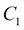
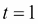
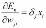

# 第二章：机器学习算法 – 深度学习的准备

在上一章中，你通过回顾人工智能的历史，了解了深度学习是如何发展的。正如你应该已经注意到的，机器学习和深度学习是密不可分的。事实上，你学到了深度学习是机器学习算法的拓展方法。

在本章中，作为理解深度学习的预备练习，你将看到机器学习模式的详细介绍，尤其是你将学习与深度学习密切相关的机器学习方法的实际代码。

在本章中，我们将涵盖以下内容：

+   机器学习的核心概念

+   流行的机器学习算法概览，特别是聚焦于神经网络

+   与深度学习相关的机器学习算法的理论和实现：感知机、逻辑回归和多层感知机

# 开始入门

我们将在本章插入与 Java 相关的机器学习和深度学习源代码。代码使用的 JDK 版本为 1.8，因此需要 Java 8 及以上版本。此外，IDE 使用的是 IntelliJ IDEA 14.1。我们将使用第五章中的外部库，*探索 Java 深度学习库 – DL4J、ND4J 等*，所以我们将从一个新的 Maven 项目开始。

本书中使用的代码根包名为`DLWJ`，即*深度学习与 Java*（Deep Learning with Java）的首字母，我们将根据需要在`DLWJ`下添加新的包或类。请参考下面的截图，它显示的是新建项目后的界面：


代码中会出现一些不符合 Java 编码标准的变量和方法名。这是为了配合公式中的一些字符，帮助提升你的理解并增强可读性。请提前注意这一点。

# 机器学习中的训练需求

你已经知道，机器学习是一种模式识别方法。机器学习通过识别和整理给定的学习数据中的模式来得出答案。仅从这句话看起来可能很简单，但事实是，机器学习要整理出未知数据，换句话说，要建立适当的模型，实际上需要花费相当长的时间。为什么会这样？仅仅整理一下就这么难吗？它为什么要有一个“学习”阶段？

答案当然是肯定的。整理数据确实非常困难。问题越复杂，完美分类数据就越不可能。这是因为当你简单地说“模式分类器”时，几乎有无穷多种分类模式。让我们来看一个非常简单的例子，见下图：


有两种类型的数据：圆形和三角形，以及未知数据——正方形。你不知道正方形在二维坐标空间中属于哪个类别，因此任务是找出正方形属于哪个类别。

你可能会立刻意识到，似乎有一条边界将这两种数据类型分开。如果你决定在何处设置这条边界，看起来你应该能够找出正方形属于哪个类别。那么，接下来我们来决定这条边界。然而，现实中，清晰地定义这条边界并不像想象的那么容易。如果你想设置边界，有各种各样的线需要考虑，如下图所示：


此外，根据边界的位置，你可以看到正方形可能被分配到不同的类别或模式。此外，还可以考虑边界可能是一个非线性边界。

在机器学习中，机器在训练过程中所做的事情是从这些可能的模式中选择最有可能的边界。它会通过处理大量的训练数据逐步自动学习如何整理模式。换句话说，它调整数学模型的参数，并最终决定边界。机器学习决定的边界称为**决策边界**，不一定是线性或非线性边界。如果一个边界能够最好地分类数据，它也可以是一个超平面。数据分布越复杂，决策边界越有可能是非线性边界或超平面。一个典型的例子就是多维分类问题。我们在这个简单的问题中仅仅设置边界就已经遇到了困难，因此不难想象，解决一个更复杂的问题会非常耗时。

# 监督学习与无监督学习

在上一节中，我们看到即使是一个简单的分类问题，也可能有数百万条边界，但很难说哪一条最合适。这是因为，即使我们能正确地整理出已知数据中的模式，也并不意味着未知数据也能按照相同的模式分类。然而，你可以提高正确分类模式的比例。每种机器学习方法都会设定标准，以便执行更好的模式分类器，并决定最可能的边界——决策边界——以提高分类的准确率。当然，这些标准在每种方法中差异很大。在这一节中，我们将了解我们可以采取的所有方法。

首先，机器学习可以大致分为**监督学习**和**无监督学习**。这两者之间的区别在于机器学习的数据集是标记数据还是未标记数据。在监督学习中，机器使用的是标记数据，即输入数据和输出数据的组合，并标明每种类型的数据应分类为哪种模式。当机器获得未知数据时，它会根据标记数据（也就是过去的正确答案）推导出可以应用的模式，并根据这些模式对数据进行分类。例如，在图像识别领域，当你将一些图像输入到机器中时，如果你准备并提供一定数量标记为`cat`的猫的图像和同样数量标记为`human`的人类图像，机器就可以判断该图像属于猫还是人类（或者都不是）。当然，仅仅判断图像是猫还是人类并没有实际应用，但如果你将相同的方法应用到其他领域，就可以创建一个自动标记社交媒体上传照片中人物的系统。正如你现在所看到的，在监督学习中，学习是通过提前由人类准备好的正确数据来进行的。

另一方面，在无监督学习中，机器使用的是未标记的数据。在这种情况下，只有输入数据被提供。那么，机器学习的内容是数据集中包含和涵盖的模式和规则。无监督学习的目的是理解数据的结构。它可以包括一个叫做**聚类**的过程，将具有共同特征的数据分组，或者是提取关联规则的过程。例如，假设有一份与用户的年龄、性别和在线购物趋势相关的数据。那么，你可能会发现 20 多岁男性和 40 多岁女性的品味相似，你可能希望利用这一趋势来改善你的产品营销。这里有一个著名的故事——通过无监督学习发现，很多人会同时购买啤酒和尿布。

你现在知道监督学习和无监督学习之间有很大的区别，但这还不是全部。每种学习方法和每种算法也有所不同。接下来我们将看看一些具有代表性的例子。

## 支持向量机（SVM）

可以说，SVM 是机器学习中最流行的监督学习方法。该方法仍然广泛应用于数据挖掘行业的各个领域。通过 SVM，将每个类别中最接近其他类别的数据点作为标准标记，决策边界使用这些标准来确定，使得每个标记数据点与边界之间的欧几里得距离之和最大化。这个标记的数据点被称为**支持向量**。简单来说，SVM 将决策边界设置在每个模式距离最大的位置。因此，SVM 在其算法中执行的操作被称为**最大化间隔**。以下是 SVM 概念的图示：


如果你只听到这个说法，你可能会想“就这么简单吗？”但使 SVM 最有价值的是一种数学技巧：核技巧，或者称为核方法。这个技巧将看似无法在线性分类的原始数据故意映射到更高维的空间，使其能够在线性上分类而不遇到任何困难。看看以下图示，你就能理解核技巧是如何工作的：


我们有两种类型的数据，分别用圆圈和三角形表示，很明显在二维空间中无法线性地分开这两种数据类型。然而，正如你在前面的图示中看到的，通过将核函数应用于数据（严格来说是训练数据的特征向量），所有数据被转换到更高维的空间，即三维空间，并且可以用二维平面将它们分开。

虽然支持向量机（SVM）既有用又优雅，但它也有一个缺点。由于它将数据映射到更高的维度，计算量往往增加，因此随着计算复杂性的增加，处理时间也往往更长。

## 隐马尔可夫模型（HMM）

HMM 是一种假设数据遵循**马尔可夫过程**的无监督训练方法。马尔可夫过程是一种随机过程，其中未来的状态仅由当前值决定，而与过去的状态无关。HMM 用于预测当仅能观察到一个状态时，观察结果来自哪个状态。

仅凭前面的解释可能无法帮助你完全理解 HMM 的工作原理，所以我们来看看一个例子。HMM 常用于分析一个基本序列。你可能知道，基本序列由四种核苷酸组成，例如 A、T、G、C，实际上这个序列就是由这些核苷酸组成的字符串。仅仅查看这个字符串你什么也得不到，但你确实需要分析哪个部分与哪个基因相关。假设如果任何基本序列是随机排列的，那么当你切割基本序列的任何部分时，每个字符的出现频率应该是四分之一。

然而，如果存在规律性，例如 C 通常紧跟在 G 后面，或者 ATT 组合经常出现，那么每个字符输出的概率将相应地变化。这个规律性就是概率模型，如果输出的概率仅依赖于紧接前面的基础，你可以通过 HMM 从基础序列（=观察）中找出遗传信息（=状态）。

除了这些生物信息学领域，HMM 还常用于需要时间序列模式的领域，比如**自然语言处理**（**NLP**）的句法分析或声音信号处理。我们在这里不深入探讨 HMM，因为它的算法与深度学习关系较少，但如果你感兴趣，可以参考 MIT 出版社的经典书籍，*统计自然语言处理基础*。

## 神经网络

神经网络与机器学习算法稍有不同。虽然其他机器学习方法基于概率或统计学的方法，神经网络是模仿人脑结构的算法。人脑由神经元网络构成。看看下面的图，了解一下这种结构：


一个神经元通过另一个神经元与网络连接，并从突触接受电刺激。当电流超过阈值时，它会被点燃并将电刺激传递给下一个与网络连接的神经元。神经网络根据电刺激的传递方式来区分事物。

神经网络最初是通过数字表示这种电刺激的有监督学习类型。最近，尤其是深度学习的出现，介绍了各种类型的神经网络算法，其中一些是无监督学习。该算法通过学习过程调整网络的权重，从而提高预测能力。深度学习是一种基于神经网络的算法。更多关于神经网络的细节将在后续通过实现进行讲解。

## 逻辑回归

逻辑回归是具有伯努利分布的变量的统计回归模型。虽然 SVM 和神经网络是分类模型，逻辑回归是回归模型，但它确实是有监督学习方法之一。尽管逻辑回归有不同的思维基础，实际上，当你查看其公式时，可以将其视为神经网络的一种。逻辑回归的详细内容将在后续通过实现进行讲解。

如你所见，每种机器学习方法都有独特的特性。根据你希望了解什么，或者希望用数据做什么，选择正确的算法非常重要。深度学习也是如此。深度学习有不同的方法，因此不仅要考虑哪种方法最优，还要考虑在某些情况下不应使用深度学习。选择最适合每种情况的方法非常重要。

## 强化学习

仅供参考，还有一种叫做**强化学习**的机器学习方法。尽管有些人将强化学习归类为无监督学习，但也有人认为，监督学习、无监督学习和强化学习这三种学习算法应该被分别划分为不同的算法类型。以下图示展示了强化学习的基本框架：


代理根据环境的状态采取行动，环境将根据行动发生变化。环境变化后，向代理提供某种奖励机制，代理学习更好的行动选择（决策）。

# 机器学习应用流程

我们已经了解了机器学习的方法及这些方法如何识别模式。在本节中，我们将看到数据挖掘在使用机器学习时采取的流程，或者必须采取的流程。每种机器学习方法都会基于模型参数设置决策边界，但我们不能说调整模型参数是我们唯一需要关注的事情。还有另一个棘手的问题，它实际上是机器学习的弱点：特征工程。决定从原始数据中创建哪些特征，也就是分析对象，是构建适当分类器的必要步骤。而这一过程，和调整模型参数一样，也需要大量的反复试验。在某些情况下，特征工程所需的努力远超过决定一个参数。

因此，当我们简单地说“机器学习”时，实际上有一些任务需要提前完成，作为预处理，以构建一个适当的分类器来处理实际问题。一般来说，这些任务可以总结如下：

+   决定哪种机器学习方法适用于某个问题

+   决定应该使用哪些特征

+   决定使用哪个模型参数设置

只有完成这些任务，机器学习才能作为一个应用变得有价值。

那么，如何决定合适的特征和参数呢？如何让机器学习呢？我们先来看一下下面的图示，它可能会帮助你更容易理解机器学习的整体流程。这是学习流程的总结：


如前图所示，机器学习的学习阶段大致可以分为以下两个步骤：

+   训练

+   测试

从字面上看，模型参数在训练阶段被更新和调整，机器在测试阶段检查模型的优点。我们毫不怀疑，仅凭一次训练和一次测试集，研究或实验几乎无法成功。我们需要反复进行训练 → 测试，训练 → 测试……直到得到合适的模型。

让我们按顺序考虑前面的流程图。首先，你需要将原始数据分为两部分：训练数据集和测试数据集。在这里你需要特别注意的是，训练数据和测试数据必须是分开的。我们通过一个例子来帮助你更容易理解这是什么意思：你正在使用历史价格数据，通过机器学习来预测 S&P 500 的每日价格。（事实上，使用机器学习预测金融工具的价格是一个最活跃的研究领域之一。）

假设你拥有从 2001 年到 2015 年的历史股票价格数据作为原始数据，那么如果你使用 2001 到 2015 年的所有数据进行训练，并且同样在相同的时间段进行测试，会发生什么情况呢？这种情况下，即使你使用的是简单的机器学习或特征工程，得到正确预测的概率可能高达 70%，甚至更高，达到 80%或 90%。然后，你可能会想：“*这真是个大发现！市场其实就是这么简单！现在我可以成为亿万富翁了！*”

但这最终只是短暂的欣喜。现实情况并没有那么顺利。如果你真的用这个模型开始进行投资管理，你就不会得到你预期的表现，甚至会感到困惑。如果你稍微想一下并留心观察，这一点就显而易见了。如果训练数据集和测试数据集相同，你是在用你已经知道答案的数据进行测试。因此，得到高精度是自然而然的结果，因为你是用正确的答案去预测正确的答案。但这对于测试来说毫无意义。如果你想正确评估模型，务必使用不同时间段的数据，例如，训练数据集可以使用 2001 到 2010 年的数据，而测试数据集使用 2011 到 2015 年的数据。在这种情况下，你是用你不知道答案的数据来进行测试，因此你可以得到一个合适的预测精度。这样，你就能避免在投资中走向破产，避免相信那些永远不会成功的投资。

所以，显然你应该分开训练数据集和测试数据集，但你可能不会认为这是什么大问题。然而，在实际的数据挖掘场景中，往往会发生我们在没有意识到的情况下，使用相同的数据进行实验的情况，所以请特别小心。我们在机器学习的情况下讨论过这个问题，但它同样适用于深度学习。

如果你将一个完整的数据集分成两个数据集，第一个用于训练的数据集称为训练数据集。为了获得更好的精度，我们首先需要考虑在训练数据集中创建特征。这种特征工程在一定程度上依赖于人的经验或直觉。在选择能够获得最佳结果的特征之前，可能需要花费大量的时间和精力。此外，每种机器学习方法接受的特征数据格式不同，因为每种方法的模型理论和公式都是独特的。举个例子，我们有一个只能接受整数的模型，一个只能接受非负数值的模型，以及一个只能接受从 0 到 1 之间的实数的模型。让我们回顾一下前面提到的股票价格的例子。由于价格的值在较宽的范围内波动较大，用一个只能接受整数的模型来进行预测可能会很困难。

此外，我们还需要小心确保数据与模型之间的兼容性。我们并不是说不能使用一个可以接受所有 0 到 1 之间实数的模型，如果你想将股票价格本身作为特征。例如，如果你将某一时期的所有股票价格数据除以最大值，数据范围就可以适应 0 到 1 之间，因此你可以使用一个只能接受 0 到 1 之间实数的模型。因此，通过稍微改变数据格式，可能就可以应用某个模型。在进行特征工程时，你需要牢记这一点。一旦你创建了特征并决定了应用哪种机器学习方法，你只需要进行检验。

在机器学习中，特征当然是决定模型精度的重要变量；然而，模型本身，换句话说，算法中的公式，也有参数。调整学习速度或调整允许的误差范围就是这种参数的典型例子。学习速度越快，计算完成所需的时间越短，因此快速的学习速度通常更好。然而，提高学习速度意味着它只提供简短的解决方案。因此，我们应该小心不要失去预期的精度。调整允许误差的范围对于数据中掺杂噪声的情况是有效的。机器判断“这个数据怪不怪？”的标准是由人类决定的。

每种方法当然都有一套特有的参数。例如，对于神经网络，参数之一就是应该有多少个神经元。当我们考虑到支持向量机（SVM）中的核技巧时，如何设置核函数也是需要确定的参数之一。如你所见，机器学习需要定义的参数非常多，哪个参数最好是无法提前得出的。关于如何提前定义模型参数，有一个研究领域专门研究这些参数。

因此，我们需要测试许多参数组合，以确定哪种组合能够返回最佳的精度。由于逐个测试每种组合需要大量时间，标准流程是在并发处理中测试多个具有不同参数组合的模型，然后进行比较。通常情况下，应该设置一定范围的参数已经确定，所以问题并非不能在现实时间范围内解决。

当能够在训练数据集中获得良好精度的模型准备好时，接下来是测试步骤。测试的大致流程是分别应用到训练数据集和相同模型参数上的相同特征工程，然后验证精度。测试中没有特别困难的步骤。计算时间也不长。这是因为从数据中找出模式，换句话说是优化公式中的参数，会产生计算成本。但是，一旦参数调整完成，计算就会立即进行，因为它只是将公式应用到新数据集上。进行测试的原因很简单，就是检查模型是否对训练数据集进行了过度优化。这是什么意思？嗯，在机器学习中，有两种模式，一种是训练集表现良好但测试集表现不佳。

第一种情况是通过将噪声数据混合到训练数据集中而导致的错误优化。这可以与本章早些时候提到的误差容许范围调整有关。世界上的数据通常不干净。可以说，几乎没有数据可以被正确分类为清晰的模式。再举一个股票价格预测的例子。股票价格通常会从先前的股票价格中适度波动，但有时会突然激增或急剧下降。而且，这种不规律的运动中没有或者不应该有规律。另一种情况是，如果你想预测一个国家的作物产量；受异常天气影响的年份数据应该与正常年份的数据大不相同。这些例子是极端的且易于理解，但实际世界中的大多数数据也包含噪声，这使得将数据分类到适当的模式中变得困难。如果只是训练而不调整机器学习的参数，模型会强制将噪声数据分类为一种模式。在这种情况下，训练数据集中的数据可能被正确分类，但由于训练数据集中的噪声数据也被分类了，而测试数据集中不存在噪声，因此测试中的可预测性可能较低。

第二种情况是通过对仅在训练数据集中具有特征的数据进行分类来进行错误优化。例如，假设我们要制作一个英文语音输入的应用程序。为了构建这个应用程序，你应该准备一个关于不同单词发音的语音数据集作为训练数据集。现在，假设你准备了足够的英国英语母语者的语音数据，并且能够创建一个高精度的模型，能够正确地分类训练数据集中的发音。下一步是测试。既然是测试，我们就使用美国英语母语者的语音数据，提供不同的数据。那么结果会怎样呢？你可能不会得到好的精度。此外，如果你尝试让这个应用程序识别非英语母语者的发音，精度将会更低。正如你所知道的，英语在不同地区有不同的发音。如果你没有考虑到这一点，且只用英国英语的训练数据集进行模型优化，即使你在训练集上取得了好结果，在测试集上也无法得到好的结果，甚至在实际应用中也没有什么用处。

这两个问题发生的原因是机器学习模型从训练数据集中学习并且对数据集的拟合过度。这个问题被称为**过拟合问题**，你应该非常小心避免它。机器学习的难点在于，除了特征工程外，你还需要思考如何避免这个过拟合问题。这两个问题——过拟合和特征工程——是部分相关的，因为糟糕的特征工程可能会导致过拟合。

为了避免过拟合问题，除了增加数据量或增加测试次数外，几乎没有其他方法。一般来说，数据量是有限的，因此增加测试次数的方法经常被采用。一个典型的例子是**K 折交叉验证**。在 K 折交叉验证中，所有数据在开始时被分成 K 个数据集。然后，选取其中一个数据集作为测试数据集，其余 K-1 个数据集作为训练数据集。交叉验证在每个分割成 K 的数据集上进行验证，并通过计算这 K 次结果的平均值来衡量精度。最令人担忧的是，训练数据集和测试数据集可能会偶然地都取得很好的精度；然而，通过 K 折交叉验证多次进行测试，可以减少这种偶然事件的概率。你永远不能对过拟合过于担心，因此必须仔细验证结果。

好的，您现在已经阅读了训练集和测试集的流程，并了解了需要记住的关键点。这两者主要集中在数据分析上。例如，如果您的目的是从现有的数据中提取有意义的信息并加以利用，那么您可以遵循这个流程。另一方面，如果您需要一个能够应对新模型的应用程序，那么您需要一个额外的过程，通过训练集和测试集得到的模型参数来进行预测。例如，如果您想从股价数据集中提取一些信息并撰写市场报告，那么下一步就是执行训练集和测试集。或者，如果您想基于数据预测未来的股价，并将其作为投资系统来使用，那么您的目标将是使用训练集和测试集获得的模型构建一个应用程序，并根据您每天或在您设定的每个周期内可以获得的数据来预测价格。在第二种情况下，如果您想使用新增的数据更新模型，那么您需要小心，在下一个模型到达之前完成模型构建的计算。

# 神经网络的理论与算法

在上一节中，您看到了我们使用机器学习进行数据分析时的一般流程。本节将介绍神经网络的理论与算法，神经网络是机器学习的一种方法，为深度学习做准备。

尽管我们简单地说“神经网络”，但它们的历史悠久。神经网络的第一个公开算法叫做**感知机**，由弗兰克·罗森布拉特（Frank Rosenblatt）于 1957 年发布的论文《感知机：一种感知和识别自动机（Project Para）》中提出。从那时起，许多方法被研究、开发并发布，现在神经网络已成为深度学习的一个重要组成部分。虽然我们简单地说“神经网络”，但它有多种类型，我们现在将介绍一些代表性的方法。

## 感知机（单层神经网络）

感知机算法是神经网络算法中结构最简单的模型，它可以进行二分类的线性分类。我们可以说它是神经网络的原型。它是以最简单的方式模拟人类神经元的算法。

以下图为一般模型的示意图：


这里， 显示输入信号， 显示与每个输入信号对应的权重， 显示输出信号。 是激活函数。 显示，字面意思是计算来自输入的数据和。请记住， 在前期应用了特征工程的非线性转换处理，即， 是一个工程化的特征。

然后，感知机的输出可以表示如下：


 被称为阶跃函数。如方程所示，感知机通过将特征向量的每个因子乘以权重，计算它们的和，然后使用阶跃函数激活该和，从而返回输出。输出是感知机估算的结果。在训练过程中，您将把该结果与正确的数据进行比较，并反馈误差。

令  为标记数据的值。那么，该公式可以表示如下：


如果一些标记数据属于类别 1，，我们有 。如果它属于类别 2，，我们有 。另外，如果输入数据被正确分类，我们得到：


因此，将这些方程式组合在一起，我们得到以下正确分类数据的方程：


因此，您可以通过最小化以下函数来提高感知机的可预测性：


这里， 被称为误差函数。 显示了误分类的集合。为了最小化误差函数，使用梯度下降或最速下降，这是一种优化算法，用于通过梯度下降寻找函数的局部最小值。该方程可以描述如下：


这里， 是学习率，这是优化算法的常见参数，用于调整学习速度；而 显示了算法的步骤数。通常，学习率的值越小，算法越可能陷入局部最小值，因为模型不能对旧值进行太多覆盖。然而，如果值太大，模型参数无法收敛，因为值波动过大。因此，实际操作中，学习率通常设置得较大，随着每次迭代逐渐减小。另一方面，使用感知器时，当数据集是线性可分的，已证明算法会收敛，无论学习率的值如何，因此该值被设置为 1。

现在，让我们来看一个实现。包结构如下：


让我们看看前面图片中展示的`Perceptrons.java`的内容。我们将逐一查看主要方法。

首先，我们定义学习所需的参数和常量。如前所述，学习率（在代码中定义为`learningRate`）可以设为 1：

```py
final int train_N = 1000;  // number of training data
final int test_N = 200;   // number of test data
final int nIn = 2;        // dimensions of input data

double[][] train_X = new double[train_N][nIn];  // input data for training
int[] train_T = new int[train_N];               // output data (label) for training

double[][] test_X = new double[test_N][nIn];  // input data for test
int[] test_T = new int[test_N];               // label of inputs
int[] predicted_T = new int[test_N];          // output data predicted by the model

final int epochs = 2000;   // maximum training epochs
final double learningRate = 1.;  // learning rate can be 1 in perceptrons
```

不用多说，机器学习和深度学习需要一个数据集来进行学习和分类。在这里，由于我们希望深入关注与感知器理论密切相关的实现，源代码中生成了一个示例数据集，并用于训练和测试集，定义了一个名为`GaussianDistribution`的类，它返回遵循正态分布或高斯分布的值。至于源代码本身，我们在这里不提及，因为你可以在`GaussianDistribution.java`中看到。我们将学习数据的维度设置为`nIn = 2`，并定义了如下的两种类型的实例：

```py
GaussianDistribution g1 = new GaussianDistribution(-2.0, 1.0, rng);
GaussianDistribution g2 = new GaussianDistribution(2.0, 1.0, rng);
```

你可以通过`g1.random()`得到均值为`-2.0`、方差为`1.0`的正态分布值，通过`g2.random()`得到均值为`2.0`、方差为`1.0`的正态分布值。

使用这些值，通过`[ g1.random(), g2.random() ]`生成了类 1 的 500 个数据属性，另有 500 个数据通过`[ g2.random(), g1.random() ]`生成在类 2 中。此外，请记住，类 1 标签的每个值为`1`，类 2 标签的每个值为`-1`。几乎所有的数据的值都位于`[-2.0, 2.0]`（类 1）和`[2.0, -2.0]`（类 2）附近；因此，它们可以被线性分开，但有些数据可能会因噪声而与另一类混合。

现在我们已经准备好了数据，接下来可以开始构建模型。输入层的单元数`nIn`是这里用来决定模型框架的参数：

```py
Perceptrons classifier = new Perceptrons(nIn);

```

让我们来看一下实际的`Perceptrons`构造函数。感知机模型的参数只有网络的权重`w`——非常简单——如下所示：

```py
public Perceptrons(int nIn) {

   this.nIn = nIn;
   w = new double[nIn];

}
```

下一步终于是训练。学习的迭代将继续，直到达到预先设定的学习集数量，或者正确分类所有的训练数据：

```py
while (true) {
   int classified_ = 0;

   for (int i=0; i < train_N; i++) {
       classified_ += classifier.train(train_X[i], train_T[i], learningRate);
   }

   if (classified_ == train_N) break;  // when all data classified correctly

   epoch++;
   if (epoch > epochs) break;
}
```

在`train`方法中，你可以写下我们刚刚解释的梯度下降算法。在这里，网络的`w`参数被更新：

```py
public int train(double[] x, int t, double learningRate) {

   int classified = 0;
   double c = 0.;

   // check whether the data is classified correctly
   for (int i = 0; i < nIn; i++) {
       c += w[i] * x[i] * t;
   }

   // apply gradient descent method if the data is wrongly classified
   if (c > 0) {
       classified = 1;
   } else {
       for (int i = 0; i < nIn; i++) {
           w[i] += learningRate * x[i] * t;
       }
   }

   return classified;
}
```

一旦完成足够数量的学习并结束，下一步是进行测试。首先，让我们检查在经过良好训练的模型中，测试数据被分类到了哪个类别：

```py
for (int i = 0; i < test_N; i++) {
   predicted_T[i] = classifier.predict(test_X[i]);
}
```

在`predict`方法中，只需通过网络激活输入。这里使用的阶跃函数定义在`ActivationFunction.java`中：

```py
public int predict (double[] x) {

   double preActivation = 0.;

   for (int i = 0; i < nIn; i++) {
       preActivation += w[i] * x[i];
   }

   return step(preActivation);
}
```

随后，我们使用测试数据评估该模型。你可能需要更多的解释来执行这一部分。

一般来说，机器学习方法的性能是通过基于混淆矩阵的准确率、精确度和召回率来衡量的。混淆矩阵总结了预测类别与真实类别的比较结果，并以以下表格的形式显示：

|   | p_predicted | n_predicted |
| --- | --- | --- |
| **p_actual** | 真阳性（TP） | 假阴性（FN） |
| **n_actual** | 假阳性（FP） | 真阴性（TN） |

这三个指标如下所示：


准确率显示的是所有数据中被正确分类的数据比例，而精确度显示的是实际正确数据与预测为正的所有数据的比例，召回率则是预测为正的数据与实际正数据的比例。这里是对应的代码：

```py
int[][] confusionMatrix = new int[2][2];
double accuracy = 0.;
double precision = 0.;
double recall = 0.;

for (int i = 0; i < test_N; i++) {

   if (predicted_T[i] > 0) {
       if (test_T[i] > 0) {
           accuracy += 1;
           precision += 1;
           recall += 1;
           confusionMatrix[0][0] += 1;
       } else {
           confusionMatrix[1][0] += 1;
       }
   } else {
       if (test_T[i] > 0) {
           confusionMatrix[0][1] += 1;
       } else {
           accuracy += 1;
           confusionMatrix[1][1] += 1;
       }
   }

}

accuracy /= test_N;
precision /= confusionMatrix[0][0] + confusionMatrix[1][0];
recall /= confusionMatrix[0][0] + confusionMatrix[0][1];

System.out.println("----------------------------");
System.out.println("Perceptrons model evaluation");
System.out.println("----------------------------");
System.out.printf("Accuracy:  %.1f %%\n", accuracy * 100);
System.out.printf("Precision: %.1f %%\n", precision * 100);
System.out.printf("Recall:    %.1f %%\n", recall * 100);
```

当你编译并运行`Perceptron.java`时，你可以获得 99.0%的准确率，98.0%的精确度和 100%的召回率。这意味着实际的正数据被正确分类，但也有一些数据被错误预测为正类，而实际上是负类。在这个源代码中，由于数据集是用于演示的，所以没有包括 K 折交叉验证。上面示例中的数据集是程序生成的，并且噪声数据很少。因此，准确率、精确度和召回率都很高，因为数据可以很好地分类。然而，如上所述，当你获得很好的结果时，仍然需要仔细检查结果。

## 逻辑回归

逻辑回归顾名思义是回归模型。但当你查看公式时，你会发现逻辑回归是一个线性分离模型，它是对感知机的概括。

逻辑回归可以看作是神经网络的一种形式。使用感知机时，激活函数是阶跃函数，而在逻辑回归中，使用的是（逻辑）sigmoid 函数。sigmoid 函数的方程可以表示如下：


该函数的图形可以如下所示：


`sigmoid` 函数将任意实数值映射到 0 到 1 之间的值。因此，逻辑回归的输出可以被视为每个类别的后验概率。方程可以描述如下：


这些方程可以结合起来表示：


这里， 是正确的数据。你可能注意到，这些数据的范围与感知机的范围不同。

根据前面的方程，`likelihood` 函数（估计模型参数的最大似然）可以表示如下：


其中：


如你所见，网络的权重以及偏置  也是需要优化的参数。

我们现在需要做的是最大化似然函数，但由于该函数具有数学乘积，计算会令人担忧。为了简化计算，我们对似然函数取对数（log）。此外，我们替换符号，将目标转化为最小化负对数 `likelihood` 函数。由于对数是单调递增的，幅度关系不会改变。方程可以表示如下：


你可以同时看到误差函数。这种类型的函数被称为交叉熵误差函数。

类似于感知机，我们可以通过计算模型参数的梯度来优化模型， 和 。梯度可以描述如下：


有了这些方程，我们可以按如下方式更新模型参数：


从理论上讲，我们使用刚才提到的方程并实现它们没有问题。然而，正如你所看到的，你必须计算所有数据的总和，以便在每次迭代时计算梯度。当数据集的规模变大时，这将极大增加计算成本。

因此，通常会采用另一种方法，即部分从数据集中选取一些数据，仅通过计算选取数据的和来计算梯度，并更新参数。这种方法被称为**随机梯度下降**（**SGD**），因为它随机选择数据的一个子集。用于一次更新的数据子集称为**小批量**。

### 提示

使用小批量的 SGD 有时被称为**小批量随机梯度下降**（**MSGD**）。从数据集中随机选择一个数据进行在线学习的方式被称为 SGD，以区分这两者。然而，在本书中，MSGD 和 SGD 都称为 SGD，因为当小批量大小为 1 时，它们是相同的。由于每个数据的学习会增加计算成本，使用小批量学习更为优越。

在逻辑回归的实现中，由于它可以通过下一节介绍的多类逻辑回归来覆盖，我们在这里不写代码。你可以参考本节中的多类逻辑回归代码。

## 多类逻辑回归

逻辑回归也可以应用于多类分类。在二类分类中，激活函数是 sigmoid 函数，你可以通过评估输出值从 0 到 1 来对数据进行分类。那么，当类的数量为 K 时，我们如何分类数据呢？幸运的是，这并不困难。我们可以通过将输出的方程更改为 K 维的类别成员概率向量来分类多类数据，我们使用`softmax`函数来做到这一点，它是 sigmoid 函数的多元版本。每个类别的后验概率可以表示如下：


这样，与二类情况相同，你可以得到如下的似然函数和负对数似然函数：


在这里， ，。此外， 是正确数据向量的第 K 个元素，，它对应于 `n` *th* 训练数据。如果输入数据属于类 `k`，那么的值为 1；否则，值为 0。

损失函数相对于模型参数、权重向量和偏置的梯度可以描述如下：


现在让我们通过查看源代码来更好地理解理论。除了模型所需的变量外，你还可以看到一些与小批量（mini-batch）相关的变量：

```py
int minibatchSize = 50;  //  number of data in each minibatch
int minibatch_N = train_N / minibatchSize; //  number of minibatches

double[][][] train_X_minibatch = new double[minibatch_N][minibatchSize][nIn];  // minibatches of training data
int[][][] train_T_minibatch = new int[minibatch_N][minibatchSize][nOut];       // minibatches of output data for training
```

以下代码是将训练数据进行随机打乱的过程，这样每个小批量的数据就可以随机应用于 SGD：

```py
List<Integer> minibatchIndex = new ArrayList<>();  // data index for minibatch to apply SGD
for (int i = 0; i < train_N; i++) minibatchIndex.add(i);
Collections.shuffle(minibatchIndex, rng);  // shuffle data index for SGD
```

由于我们可以看到多类分类问题，我们生成一个包含三类的样本数据集。除了在感知机中使用的均值和方差外，我们还使用了根据正态分布生成的数据集，训练数据和测试数据的均值为`0.0`，方差为 1.0，属于第 3 类。换句话说，每一类的数据遵循正态分布，均值分别为`[-2.0, 2.0]`、`[2.0, -1.0]`和`[0.0, 0.0]`，方差为`1.0`。我们将训练数据定义为`int`类型，测试数据定义为整数类型，以便在评估模型时更容易处理测试数据。此外，每个标注数据被定义为数组，因为它遵循多类分类：

```py
train_T[i] = new int[]{1, 0, 0};
test_T[i] = new Integer[]{1, 0, 0};
```

然后我们使用之前定义的`minibatchIndex`将训练数据划分为一个小批量：

```py
for (int i = 0; i < minibatch_N; i++) {
   for (int j = 0; j < minibatchSize; j++) {
       train_X_minibatch[i][j] = train_X[minibatchIndex.get(i * minibatchSize + j)];
       train_T_minibatch[i][j] = train_T[minibatchIndex.get(i * minibatchSize + j)];
   }
}
```

现在我们已经准备好了数据，接下来实际构建模型：

```py
LogisticRegression classifier = new LogisticRegression(nIn, nOut);
```

逻辑回归模型的参数是`W`，网络的权重，以及偏置`b`：

```py
public LogisticRegression(int nIn, int nOut) {

   this.nIn = nIn;
   this.nOut = nOut;

   W = new double[nOut][nIn];
   b = new double[nOut];

}
```

训练是通过每个小批量完成的。如果你设置`minibatchSize = 1`，那么训练就变成了所谓的在线训练：

```py
for (int epoch = 0; epoch < epochs; epoch++) {
   for (int batch = 0; batch < minibatch_N; batch++) {
       classifier.train(train_X_minibatch[batch], train_T_minibatch[batch], minibatchSize, learningRate);
   }
   learningRate *= 0.95;
}
```

在这里，学习率逐渐减小，以便模型能够收敛。现在，针对实际的训练`train`方法，你可以将其简要地分为两个部分，如下所示：

1.  使用小批量数据计算`W`和`b`的梯度。

1.  使用梯度更新`W`和`b`：

    ```py
    // 1\. calculate gradient of W, b
    for (int n = 0; n < minibatchSize; n++) {

       double[] predicted_Y_ = output(X[n]);

       for (int j = 0; j < nOut; j++) {
           dY[n][j] = predicted_Y_[j] - T[n][j];

           for (int i = 0; i < nIn; i++) {
               grad_W[j][i] += dY[n][j] * X[n][i];
           }

           grad_b[j] += dY[n][j];
       }
    }

    // 2\. update params
    for (int j = 0; j < nOut; j++) {
       for (int i = 0; i < nIn; i++) {
           W[j][i] -= learningRate * grad_W[j][i] / minibatchSize;
       }
       b[j] -= learningRate * grad_b[j] / minibatchSize;
    }

    return dY;
    ```

在`train`方法的末尾，`return dY`返回预测数据和正确数据之间的误差值。虽然这对于逻辑回归本身并非强制要求，但对于后续介绍的机器学习和深度学习算法是必要的。

接下来是测试。执行测试的过程与感知机的过程基本相同。

首先，使用`predict`方法，通过训练好的模型预测输入数据：

```py
for (int i = 0; i < test_N; i++) {
   predicted_T[i] = classifier.predict(test_X[i]);
}
```

`predict`方法和`output`方法的调用方式如下所示：

```py
public Integer[] predict(double[] x) {

   double[] y = output(x);  // activate input data through learned networks
   Integer[] t = new Integer[nOut]; // output is the probability, so cast it to label

   int argmax = -1;
   double max = 0.;

   for (int i = 0; i < nOut; i++) {
       if (max < y[i]) {
           max = y[i];
           argmax = i;
       }
   }

   for (int i = 0; i < nOut; i++) {
       if (i == argmax) {
           t[i] = 1;
       } else {
           t[i] = 0;
       }
   }

   return t;
}

public double[] output(double[] x) {

   double[] preActivation = new double[nOut];

   for (int j = 0; j < nOut; j++) {

       for (int i = 0; i < nIn; i++) {
           preActivation[j] += W[j][i] * x[i];
       }

       preActivation[j] += b[j];  // linear output
   }

   return softmax(preActivation, nOut);
}
```

首先，使用`output`方法激活输入数据。如你从输出的底部可以看到，激活函数使用了`softmax`函数。`softmax`在`ActivationFunction.java`中定义，通过这个函数会返回一个显示每个类概率的数组，因此你只需要获取数组中概率最大的元素的索引。这个索引代表了预测的类别。

最后，让我们评估模型。再次介绍混淆矩阵用于模型评估，但要小心，因为这次我们有多类分类问题，因此你需要为每个类分别计算精度或召回率：

```py
int[][] confusionMatrix = new int[patterns][patterns];
double accuracy = 0.;
double[] precision = new double[patterns];
double[] recall = new double[patterns];

for (int i = 0; i < test_N; i++) {
   int predicted_ = Arrays.asList(predicted_T[i]).indexOf(1);
   int actual_ = Arrays.asList(test_T[i]).indexOf(1);

   confusionMatrix[actual_][predicted_] += 1;
}

for (int i = 0; i < patterns; i++) {
   double col_ = 0.;
   double row_ = 0.;

   for (int j = 0; j < patterns; j++) {

       if (i == j) {
           accuracy += confusionMatrix[i][j];
           precision[i] += confusionMatrix[j][i];
           recall[i] += confusionMatrix[i][j];
       }

       col_ += confusionMatrix[j][i];
       row_ += confusionMatrix[i][j];
   }
   precision[i] /= col_;
   recall[i] /= row_;
}

accuracy /= test_N;

System.out.println("------------------------------------");
System.out.println("Logistic Regression model evaluation");
System.out.println("------------------------------------");
System.out.printf("Accuracy: %.1f %%\n", accuracy * 100);
System.out.println("Precision:");
for (int i = 0; i < patterns; i++) {
   System.out.printf(" class %d: %.1f %%\n", i+1, precision[i] * 100);
}
System.out.println("Recall:");
for (int i = 0; i < patterns; i++) {
   System.out.printf(" class %d: %.1f %%\n", i+1, recall[i] * 100);
```

## 多层感知机（多层神经网络）

单层神经网络存在一个巨大问题。感知机或逻辑回归对能够线性分类的问题有效，但它们根本无法解决非线性问题。例如，它们甚至无法解决图中所示的最简单的 XOR 问题：


由于现实世界中的大多数问题都是非线性的，感知机和逻辑回归无法用于实际应用。因此，算法被改进以应对非线性问题。这就是多层感知机（或**多层神经网络**，**MLPs**）。正如你从名字中看到的，通过在输入层和输出层之间添加另一个叫做隐藏层的层，网络具有表达各种模式的能力。这是 MLP 的图形模型：


最重要的是不要引入跳层连接。在神经网络中，保持模型具有前馈网络结构对理论和实现更有利。遵循这些规则，并通过增加隐藏层的数量，你可以在不使模型过于复杂的情况下，逼近任意函数。

现在，让我们看看如何计算输出。乍一看它似乎很复杂，但它按相同方式累积每一层的网络权重或激活方案，所以你只需将每一层的方程结合起来。每个输出可以如下表示：


这里， 是隐藏层的激活函数， 是输出层。

如前所述，对于多类别分类，输出层的激活函数可以通过使用`softmax`函数高效计算，误差函数如下所示：


对于单层网络，仅在输入层反映该误差即可，但对于多层网络，除非在隐藏层和输入层都反映误差，否则神经网络无法整体学习。

幸运的是，在前馈网络中，有一种被称为`反向传播`的算法，它使得模型能够通过前向和后向追踪网络来高效传播误差。让我们来看一下该算法的机制。为了使方程更易读，我们将思考在线训练中的误差函数的估算，如下所示：


现在我们可以仅考虑它的梯度，。由于在大多数实际应用中，数据集中的所有数据通常是独立同分布的，我们在定义时不会遇到问题，正如我们刚才所提到的那样。

前馈网络中的每个单元显示为与该单元连接的网络权重的总和，因此可以表示为以下广义项：


请小心，因为这里的不仅仅是输入层的值（当然，这可以是输入层的值）。另外，是非线性激活函数。权重的梯度和偏置的梯度可以如下所示：


现在，介绍下一个方程中定义的符号：


然后，我们得到：



因此，当我们比较这些方程时，输出单元可以描述如下：


此外，隐藏层的每个单元是：


因此，引入了**反向传播公式**。这样，delta 被称为**反向传播**误差。通过计算`反向传播`误差，可以计算权重和偏置。看起来公式可能很难理解，但它基本上是在接收到来自连接单元的错误反馈后更新权重，因此并不难。

现在，让我们以一个简单的 XOR 问题为例来看一下实现。你在阅读源代码时会有更好的理解。该包的结构如下：


算法的基本流程写在`MultiLayerPerceptrons.java`中，但实际的反向传播部分写在`HiddenLayer.java`中。我们使用多类逻辑回归作为输出层。由于`LogisticRegression.java`没有变化，代码在本节中不展示。在`ActivationFunction.java`中，加入了 sigmoid 函数和双曲正切函数的导数。双曲正切函数也是一个常用的激活函数，常作为 sigmoid 的替代。此外，在`RandomGenerator.java`中，写了生成均匀分布随机数的方法。这是为了随机初始化隐藏层的权重，这部分非常重要，因为模型通常会根据这些初始值陷入局部最优解，从而导致无法正确分类数据。

让我们看一下`MultiLayerPerceptrons.java`的内容。在`MultiLayerPerceptrons.java`中，每一层都分别定义了不同的类：`HiddenLayer`类用于隐藏层，`LogisticRegression`类用于输出层。这些类的实例分别定义为`hiddenLayer`和`logisticLayer`：

```py
public MultiLayerPerceptrons(int nIn, int nHidden, int nOut, Random rng) {

   this.nIn = nIn;
   this.nHidden = nHidden;
   this.nOut = nOut;

   if (rng == null) rng = new Random(1234);
   this.rng = rng;

   // construct hidden layer with tanh as activation function
   hiddenLayer = new HiddenLayer(nIn, nHidden, null, null, rng, "tanh");  // sigmoid or tanh

   // construct output layer i.e. multi-class logistic layer
   logisticLayer = new LogisticRegression(nHidden, nOut);

}
```

MLP 的参数是隐藏层`HiddenLayer`和输出层`LogisticRegression`的权重`W`和偏置`b`。由于输出层与之前介绍的相同，我们这里不再查看代码。`HiddenLayer`的构造函数如下：

```py
public HiddenLayer(int nIn, int nOut, double[][] W, double[] b, Random rng, String activation) {

   if (rng == null) rng = new Random(1234);  // seed random

   if (W == null) {

       W = new double[nOut][nIn];
       double w_ = 1\. / nIn;

       for(int j = 0; j < nOut; j++) {
           for(int i = 0; i < nIn; i++) {
               W[j][i] = uniform(-w_, w_, rng);  // initialize W with uniform distribution
           }
       }

   }

   if (b == null) b = new double[nOut];

   this.nIn = nIn;
   this.nOut = nOut;
   this.W = W;
   this.b = b;
   this.rng = rng;

   if (activation == "sigmoid" || activation == null) {

       this.activation = (double x) -> sigmoid(x);
       this.dactivation = (double x) -> dsigmoid(x);

   } else if (activation == "tanh") {

       this.activation = (double x) -> tanh(x);
       this.dactivation = (double x) -> dtanh(x);

   }  else {
       throw new IllegalArgumentException("activation function not supported");
   }

}
```

`W`会被随机初始化，且与单元数相匹配。这个初始化过程实际上很复杂，因为如果初始值没有很好地分布，会让你更频繁地遇到局部最小值问题。因此，在实际场景中，模型通常会使用一些随机种子进行测试。激活函数可以使用 sigmoid 函数或双曲正切函数。

MLP 的训练可以通过前向传播和反向传播依次进行神经网络的传播：

```py
public void train(double[][] X, int T[][], int minibatchSize, double learningRate) {

   double[][] Z = new double[minibatchSize][nIn];  // outputs of hidden layer (= inputs of output layer)
   double[][] dY;

   // forward hidden layer
   for (int n = 0; n < minibatchSize; n++) {
       Z[n] = hiddenLayer.forward(X[n]);  // activate input units
   }

   // forward & backward output layer
   dY = logisticLayer.train(Z, T, minibatchSize, learningRate);

   // backward hidden layer (backpropagate)
   hiddenLayer.backward(X, Z, dY, logisticLayer.W, minibatchSize, learningRate);
}
```

`hiddenLayer.backward`部分给出了隐藏层对来自逻辑回归的预测误差`dY`的反向传播。请注意，逻辑回归的输入数据也是反向传播所必需的：

```py
public double[][] backward(double[][] X, double[][] Z, double[][] dY, double[][] Wprev, int minibatchSize, double learningRate) {

   double[][] dZ = new double[minibatchSize][nOut];  // backpropagation error

   double[][] grad_W = new double[nOut][nIn];
   double[] grad_b = new double[nOut];

   // train with SGD
   // calculate backpropagation error to get gradient of W, b
   for (int n = 0; n < minibatchSize; n++) {

       for (int j = 0; j < nOut; j++) {

           for (int k = 0; k < dY[0].length; k++) {  // k < ( nOut of previous layer )
               dZ[n][j] += Wprev[k][j] * dY[n][k];
           }
           dZ[n][j] *= dactivation.apply(Z[n][j]);

           for (int i = 0; i < nIn; i++) {
               grad_W[j][i] += dZ[n][j] * X[n][i];
           }

           grad_b[j] += dZ[n][j];
       }
   }

   // update params
   for (int j = 0; j < nOut; j++) {
       for(int i = 0; i < nIn; i++) {
           W[j][i] -= learningRate * grad_W[j][i] / minibatchSize;
       }
       b[j] -= learningRate * grad_b[j] / minibatchSize;
   }

   return dZ;
}
```

你可能会认为这个算法很复杂且难以理解，因为参数看起来很复杂，但实际上我们所做的与逻辑回归的`train`方法几乎相同：我们计算`W`和`b`的梯度，并在小批量的单位上更新模型参数，仅此而已。那么，MLP 能学习 XOR 问题吗？通过运行`MultiLayerPerceptrons.java`来检查结果。

结果只输出模型的准确率、精确度和召回率的百分比，但例如，如果你使用`LogisticRegression`的`predict`方法导出预测数据，你可以看到它实际预测的概率，如下所示：

```py
double[] y = output(x);  // activate input data through learned networks
Integer[] t = new Integer[nOut]; // output is the probability, so cast it to label

System.out.println(  Arrays.toString(y) );
```

我们刚刚展示了多层感知机（MLP）可以近似 XOR 的函数。此外，已证明 MLP 可以近似任何函数。我们在这里不深入数学细节，但你可以很容易地想象，MLP 拥有的单元越多，它们能够表达和近似的函数就越复杂。

# 总结

在本章中，作为深度学习的准备，我们深入探讨了神经网络，这是机器学习的算法之一。你学习了单层神经网络的三种代表性算法：感知器、逻辑回归和多类逻辑回归。我们看到单层神经网络无法解决非线性问题，但这个问题可以通过多层神经网络来解决——即在输入层和输出层之间有一个或多个隐藏层的网络。对为什么 MLP 能够解决非线性问题的直观理解是，通过增加层数和单元数量，网络可以学习更复杂的逻辑运算，从而具备表达更复杂函数的能力。让模型具备这一能力的关键是反向传播算法。通过将输出的误差反向传播到整个网络，模型会在每次迭代中更新和调整，以便更好地拟合训练数据，最终优化以近似数据的函数。

在下一章中，你将学习深度学习的概念和算法。由于你现在已经掌握了机器学习算法的基础知识，因此你将毫不困难地学习深度学习。
