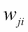
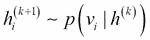
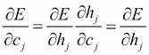
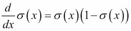
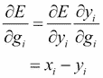
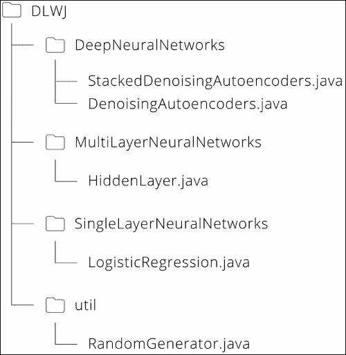

# 第三章：深度置信网络与堆叠去噪自编码器

从本章到下一章，你将学习深度学习的算法。我们将一步步地跟随基础数学理论，全面理解每一个算法。一旦你掌握了深度学习的基本概念和理论，你就可以轻松地将它们应用到实际应用中。

在这一章中，你将学习到的主题包括：

+   深度学习为何能成为突破性技术

+   深度学习与过去的机器学习（神经网络）之间的区别

+   深度学习的典型算法、**深度置信网络**（**DBN**）和**堆叠去噪自编码器**（**SDA**）的理论与实现

# 神经网络的失败

在前一章中，你了解了神经网络的典型算法，并且看到非线性分类问题无法通过感知器解决，但可以通过构建多层的神经网络模型来解决。换句话说，非线性问题可以通过在输入层和输出层之间插入一个隐藏层来学习和解决。仅此而已；但是通过增加一层中的神经元数量，神经网络作为一个整体能够表达更多的模式。如果我们忽略时间成本或过拟合问题，理论上，神经网络可以逼近任何函数。

那么，我们可以这样想吗？如果我们增加隐藏层的数量——反复堆叠隐藏层——神经网络能否解决任何复杂问题？提出这个想法是很自然的。而且，顺理成章，这个想法已经被研究过了。然而，事实证明，这个尝试并没有取得好的效果。仅仅堆叠层数并没有让神经网络解决世界上的问题。相反，某些情况下，层数较少的网络在预测时准确度反而更高。

为什么会出现这些情况？神经网络层数更多的确可以有更多的表现能力。那么，问题出在哪里呢？嗯，这是由前馈网络中学习算法的特性引起的。正如我们在前一章看到的，反向传播算法用于在多层神经网络中高效地传播学习误差。在这个算法中，误差会在神经网络的每一层反向传播，并依次传递到输入层。通过将输出层的误差反向传播到输入层，网络的权重会在每一层按顺序进行调整，从而优化整个网络的权重。

问题出现在这里。如果网络的层数较少，从输出层反向传播的误差可以很好地帮助调整每一层的权重。然而，一旦层数增加，误差在每次反向传播时都会逐渐消失，无法有效调整网络的权重。在靠近输入层的层，误差根本不会被反馈。

连接层之间稠密的神经网络无法调整权重。因此，整个网络的权重无法优化，学习自然无法顺利进行。这个严重的问题被称为**消失梯度问题**，它一直困扰着研究人员，成为神经网络长期存在的巨大难题，直到深度学习的出现才得以突破。神经网络算法在早期阶段就达到了瓶颈。

# 神经网络的反击

由于消失梯度问题，神经网络在机器学习领域失去了人气。我们可以说，神经网络在现实世界中的数据挖掘应用案例，相比于其他典型算法（如逻辑回归和支持向量机）显得格外少。

然而，深度学习的出现打破了所有现有的常规。正如你所知，深度学习是由神经网络层层堆叠而成。换句话说，它就是深度神经网络，并且在某些领域产生了令人震惊的可预测性。现在，说到人工智能研究，毫不夸张地说，它就是对深度神经网络的研究。可以说，这正是神经网络的反击。那么，为什么在深度学习中消失梯度问题不再重要呢？这与过去的算法有什么不同？

在这一部分，我们将探讨深度学习为何能够产生如此强大的可预测性以及它的机制。

## 深度学习的演变——突破点是什么？

我们可以说，有两个算法引发了深度学习的流行。第一个，如第一章《深度学习概述》中所提到的，是由 Hinton 教授开创的 DBN([`www.cs.toronto.edu/~hinton/absps/fastnc.pdf`](https://www.cs.toronto.edu/~hinton/absps/fastnc.pdf))。第二个是由 Vincent 等人提出的 SDA([`www.iro.umontreal.ca/~vincentp/Publications/denoising_autoencoders_tr1316.pdf`](http://www.iro.umontreal.ca/~vincentp/Publications/denoising_autoencoders_tr1316.pdf))。SDA 是在 DBN 介绍后不久提出的。它采用类似 DBN 的方式，虽然算法的细节不同，但仍然记录了即使在深层情况下也具有高预测性的结果。

那么，解决消失梯度问题的常见方法是什么呢？也许你正在紧张地准备解决复杂的方程式，以理解 DBN 或 SDA，但别担心。DBN 绝对是一个可以理解的算法。相反，它的机制本身非常简单。深度学习是通过一个非常简单且优雅的解决方案建立的。这个解决方案就是：**逐层训练**。仅此而已。你可能会觉得看到它时觉得显而易见，但正是这个方法让深度学习变得流行。

如前所述，理论上，如果神经网络的单元或层数更多，它应该具有更多的表达能力，并增加它能够解决的问题的数量。但它工作得不好，因为误差无法正确地反馈到每一层，并且整个网络的参数无法正确调整。这就是引入逐层学习创新的地方。由于每一层独立调整网络的权重，即使层数堆叠起来，整个网络（即模型的参数）也能得到正确的优化。

以前的模型效果不好，因为它们试图直接将输出层的误差反向传播到输入层，并试图通过调整网络的权重来优化自己。因此，算法转向了逐层训练，模型优化也就顺利进行了。这就是深度学习的突破。

然而，尽管我们简单地说是**逐层训练**，我们仍然需要技术来实现学习。而且，理所当然地说，整个网络的参数调整不能仅仅通过逐层训练来完成。我们还需要最终的调整。这个逐层训练阶段叫做**预训练**，而最后的调整阶段叫做**微调**。我们可以说，DBN 和 SDA 中引入的一个更大特点就是预训练，但这两个特点都是深度学习必要流程的一部分。我们如何进行预训练？微调可以做什么？让我们逐一探讨这些问题。

## 预训练的深度学习

深度学习更像是具有累积隐藏层的神经网络。预训练中的逐层训练在每一层进行学习。然而，你可能仍然有以下问题：如果两个层都是隐藏层（即既不是输入层也不是输出层），那么训练是如何进行的？输入和输出是什么？

在思考这些问题之前，请再次提醒自己以下几点（反复强调）：深度学习是堆叠层的神经网络。这意味着，模型参数仍然是网络中的权重（和偏置）。由于这些权重（和偏置）需要在每一层之间进行调整，在标准的三层神经网络中（即输入层、隐藏层和输出层），我们只需要优化输入层和隐藏层之间以及隐藏层和输出层之间的权重。然而，在深度学习中，两个隐藏层之间的权重也需要进行调整。

首先，我们来思考一下一个层的输入。你可以通过快速思考轻松地理解这一点。从前一层传播过来的值会作为输入直接进入当前层。前一层传播过来的值，实际上就是通过网络的权重将前一层的值向前传播到当前层，就像一般的前馈网络一样。写起来看似简单，但如果你进一步探究并尝试理解它的含义，你会发现它具有重要的意义。前一层的值作为输入，意味着前一层（或前几层）学习到的特征成为当前层的输入，从而当前层就能从给定的数据中学习到新的特征。换句话说，在深度学习中，特征是分阶段（且半自动）从输入数据中学习的。这意味着，层次越深，学习到的特征就越复杂。这是普通的多层神经网络做不到的，也是为什么人们说“机器可以学习概念”的原因。

现在，让我们来思考一下输出。请记住，思考输出就意味着思考它是如何学习的。DBN 和 SDA 在学习方法上完全不同，但两者都满足以下条件：为了使输出值与输入值相等而进行学习。你可能会想“你在说什么？”但这就是使深度学习成为可能的技术。

值从隐藏层进入，再回到输入层，技术是调整网络的权重（也就是使输出值与输入值相等）以消除当时的误差。该图示可以如下所示：


从表面上看，它与标准的神经网络有所不同，但其实没有什么特别的。如果我们故意将输入层和输出层分别画出，机制与普通神经网络是相同的：


对于人类来说，这种*匹配输入和输出*的行为并不直观，但对于机器来说，这是一个有效的动作。那么，它是如何通过匹配输出层和输入层来从输入数据中学习特征的呢？

需要一点解释吗？我们可以这样理解：在机器学习算法中，包括神经网络，学习的目的是最小化模型预测输出与数据集输出之间的误差。其机制是通过从输入数据中寻找模式来去除误差，并使具有相同模式的数据输出相同的值（例如，0 或 1）。那么，如果我们将输出值转化为输入值，结果会怎样呢？

当我们观察需要通过深度学习整体解决的问题时，输入数据从根本上来说是一个可以划分为某些模式的数据集。这意味着输入数据中存在一些共同特征。如果是这样，在学习过程中，每个输出值成为相应的输入数据时，网络的权重应该被调整，以更多地关注反映这些共同特征的部分。而且，即使是在同一类别中分类的数据，学习也应该处理减少对非共同特征部分的权重，也就是噪声部分。

现在你应该理解了在某一层中输入和输出是什么，以及学习是如何进行的。一旦某一层的预训练完成，网络将转到下一层的学习。然而，正如你在以下图像中看到的，请记住，当网络转向下一层的学习时，隐藏层会变成输入层：


这里的关键是，预训练后的层可以视为普通的前馈神经网络，其中网络的权重会被调整。因此，如果我们考虑输入值，我们可以简单地计算从输入层到当前层通过网络传播的值。

到目前为止，我们已经了解了预训练的流程（即逐层训练）。在深度神经网络的隐藏层中，通过学习输入与输出匹配的方式，输入数据的特征逐步被提取出来。现在，可能有些人会问：我明白通过预训练输入数据的特征可以逐步学习，但仅此并不能解决分类问题。那么，如何解决分类问题呢？

在预训练过程中，未提供关于哪些数据属于哪个类别的信息。这意味着预训练是无监督训练，它仅通过输入数据分析隐藏模式。如果无法用于解决问题，尽管它提取了特征，这就毫无意义。因此，模型需要完成一步以正确解决分类问题。那就是微调。微调的主要作用如下：

1.  为完成预训练的深度神经网络添加一个输出层，并进行监督学习。

1.  对整个深度神经网络进行最终调整。

这可以通过以下方式来说明：


输出层中的监督训练使用了机器学习算法，如逻辑回归或支持向量机（SVM）。通常，考虑到计算量和精度的平衡，逻辑回归使用得更为频繁。

在微调过程中，有时只有输出层的权重会被调整，但通常包括预训练中已经调整过权重的层在内，整个神经网络的权重都会被调整。这意味着标准学习算法，换句话说，反向传播算法，像处理单一多层神经网络一样应用于深度神经网络。因此，解决更复杂分类问题的神经网络模型得以完成。

即便如此，你可能会有以下问题：为什么即使在层次堆叠的多层神经网络中，学习仍然与标准反向传播算法配合良好？难道没有梯度消失问题吗？这些问题可以通过预训练来解决。让我们思考一下：问题的根本在于，在没有预训练的多层神经网络中，由于反馈错误不正确，导致每个网络的权重没有得到正确调整；换句话说，就是发生了梯度消失问题的多层神经网络。另一方面，一旦完成预训练，学习就从网络权重几乎已经调整好的地方开始。因此，适当的误差可以传播到接近输入层的层。因此，称之为微调。通过预训练和微调，最终深度神经网络通过拥有深层次的结构，成为具有更强表达能力的神经网络。

从下一节开始，我们将最终回顾 DBN 和 SDA 这两种深度学习算法的理论与实现。但在此之前，让我们再次回顾一下深度学习的流程。下面是该流程的简化图：


模型的参数在预训练过程中会逐层优化，然后在微调过程中作为单一深度神经网络进行调整。深度学习，作为人工智能的突破，是一个非常简单的算法。

# 深度学习算法

现在，让我们回顾一下深度学习算法的理论与实现。在这一章中，我们将讨论 DBN 和 SDA（以及相关方法）。这些算法在 2012 到 2013 年间得到了爆炸式的研究，正是那时深度学习开始迅速传播，并点燃了深度学习的热潮。尽管有两种方法，但基本流程是相同的，并与前面一节中提到的预训练和微调一致。它们之间的区别在于应用了哪种预训练（即无监督训练）算法。

因此，如果深度学习中有困难的地方，应该是无监督训练的理论和方程式。不过，你不必担心。所有的理论和实现都会逐一讲解，请仔细阅读接下来的章节。

## 受限玻尔兹曼机

DBN 中逐层训练的方法，预训练，被称为**受限玻尔兹曼机**（**RBM**）。首先，让我们看一下构成 DBN 基础的 RBM。由于 RBM 代表受限玻尔兹曼机，当然也有一种方法叫做**玻尔兹曼机**（**BMs**）。或者说，BMs 是一种更标准的形式，而 RBM 是它的特殊情况。两者都是神经网络的一种，且都是由 Hinton 教授提出的。

RBM 和 DBN 的实现可以在不理解 BMs 详细理论的情况下完成，但为了理解这些概念，我们将简要看一下 BMs 所基于的思想。首先，让我们看看以下图形，它展示了 BMs 的图示模型：


BMs 看起来复杂是因为它们是全连接的，但实际上它们只是具有两层的简单神经网络。通过重新排列网络中的所有单元来更好地理解，BMs 可以表示如下：


请记住，通常在 BMs 和 RBMs 中，输入/输出层被称为**可见层**（通常使用一个隐藏层，因为它是网络从可观察条件推测隐性条件的层）。另外，可见层的神经元被称为**可见单元**，隐藏层的神经元被称为**隐藏单元**。前面图中的符号描述与这些名称相匹配。

如图所示，BMs 的结构与标准神经网络并没有太大不同。然而，它的思维方式有一个显著特点。这个特点是采用了神经网络中的*能量*概念。每个单元都有一个随机状态，整个网络的能量取决于每个单元的状态。（第一个采用能量概念的网络模型被称为**霍普菲尔德网络**，而 BMs 是它的扩展版本。由于霍普菲尔德网络的细节与深度学习不完全相关，因此本书不做详细解释。）记住正确数据的条件是网络的稳态和这些网络拥有的最小能量。另一方面，如果将带噪声的数据提供给网络，每个单元都有不同的状态，但不是稳态，因此其条件会使网络过渡以稳定整个网络，换句话说，就是将其转化为稳态。

这意味着模型的权重被调整，每个单元的状态会被传递，以最小化网络的能量函数。这些操作可以去除噪声并从输入中整体提取特征。尽管网络的能量听起来很庞大，但并不难理解，因为最小化能量函数与最小化误差函数有相同的效果。

BM 的概念非常出色，但在实际应用中却出现了各种问题。最大的问题是，BM 是完全连接的网络，需要消耗大量的计算时间。因此，提出了 RBM（限制玻尔兹曼机）。RBM 通过对 BM 进行限制，使其能够在现实的时间框架内解决各种问题。与 BM 一样，RBM 是基于网络能量的模型。我们来看一下下面的 RBM 示意图：


这里，是可见层单元的数量，是隐藏层单元的数量。表示可见单元的值，表示隐藏单元的值，是这两个单元之间的权重。如你所见，BM 和 RBM 的区别在于，RBM 没有同一层之间的连接。由于这一限制，计算量减少，能够应用于实际问题。

现在，让我们来看看理论。

### 提示

请注意，作为前提，RBM 中每个可见单元和隐藏单元所能取的值通常是{0, 1}，即二进制（这与 BM 相同）。

如果我们扩展这个理论，它也可以处理连续值。然而，这可能会使方程变得复杂，而这并不是理论的核心，而且在教授 Hinton 提出的原始 DBN 中，使用的是二进制。因此，本书中我们也会实现二进制 RBM。带有二进制输入的 RBM 有时被称为**伯努利 RBM**。

RBM 是基于能量的模型，可见层或隐藏层的状态被视为随机变量。我们将按顺序查看这些方程式。首先，每个可见单元通过网络传播到隐藏单元。在此过程中，每个隐藏单元根据其传播输入生成的概率分布，取一个二进制值：


在这里，是隐藏层的偏置，表示 Sigmoid 函数。

这一次，传播是从隐藏层反向传播到可见层，通过相同的网络进行。与之前的情况一样，每个可见单元根据传播值生成的概率分布，取一个二进制值。


这里，是可见层的偏置。期望这些可见单元的值与原始输入值匹配。这意味着，如果，网络的权重作为模型参数，且、，即可见层和隐藏层的偏置，作为向量参数表示，，它倾向于，以便使得能获得的概率接近的分布。

对于这项学习，需要定义能量函数，即评价函数。能量函数表示如下：


此外，显示网络行为的联合概率密度函数可以表示如下：


从前面的公式出发，训练参数的方程式将被确定。我们可以得到如下方程：


因此，**对数似然**可以表示如下：


然后，我们将计算每个梯度相对于模型参数的导数。导数可以按如下方式计算：


中间的一些方程比较复杂，但通过模型的概率分布项和原始数据，实际上变得很简单。

因此，每个参数的梯度可以表示如下：


现在，我们可以找到梯度的方程，但当我们尝试直接应用这个方程时会遇到问题。考虑一下这一项。这个项意味着我们需要计算所有{0, 1}模式的概率分布，而这些模式可以视为包含数据中实际上不存在的模式的输入数据。

我们很容易想象这一项如何引起组合爆炸，这意味着我们无法在现实的时间框架内解决它。为了解决这个问题，引入了使用吉布斯采样近似数据的方法，称为**对比散度**（**CD**）。现在让我们来看一下这个方法。

这里，是输入向量。同时，是通过对这个输入向量进行 k 次采样得到的输入（输出）向量。

然后，我们得到：



因此，在重新迭代吉布斯采样后，近似时，似然函数的导数可以表示如下：


因此，模型参数可以如下表示：


这里，是迭代次数，是学习率。如前面的公式所示，通常，执行 k 次采样的 CD 被表示为 CD-k。已知在将该算法应用于实际问题时，CD-1 就足够了。

现在，让我们了解 RMB 的实现。包结构如下图所示：


让我们看一下`RestrictedBoltzmannMachines.java`文件。由于主方法的第一部分只是定义模型所需的变量并生成演示数据，我们在这里不讨论它。

所以，在我们生成模型实例的部分，你可能会注意到在参数中有许多`null`值：

```py
// construct RBM
RestrictedBoltzmannMachines nn = new RestrictedBoltzmannMachines(nVisible, nHidden, null, null, null, rng);
```

当你查看构造函数时，你可能会知道这些`null`值是 RBM 的权重矩阵、隐单元的偏置和可见单元的偏置。我们在这里将参数定义为`null`，因为它们是为 DBN 的实现而设定的。在构造函数中，它们被初始化如下：

```py
   if (W == null) {

       W = new double[nHidden][nVisible];
       double w_ = 1\. / nVisible;

       for (int j = 0; j < nHidden; j++) {
           for (int i = 0; i < nVisible; i++) {
               W[j][i] = uniform(-w_, w_, rng);
           }
       }
   }

   if (hbias == null) {
       hbias = new double[nHidden];

       for (int j = 0; j < nHidden; j++) {
           hbias[j] = 0.;
       }
   }

   if (vbias == null) {
       vbias = new double[nVisible];

       for (int i = 0; i < nVisible; i++) {
           vbias[i] = 0.;
       }
   }
```

下一步是训练。每个小批量都应用 CD-1：

```py
// train with contrastive divergence
for (int epoch = 0; epoch < epochs; epoch++) {
   for (int batch = 0; batch < minibatch_N; batch++) {
       nn.contrastiveDivergence(train_X_minibatch[batch], minibatchSize, learningRate, 1);
   }
   learningRate *= 0.995;
}
```

现在，让我们深入探讨 RBM 的关键点，即`contrastiveDivergence`方法。当我们实际运行这个程序时，CD-1 可以得到足够的解（因此在演示中我们使用了 k = 1），但是这个方法也被定义用来处理 CD-k：

```py
// CD-k : CD-1 is enough for sampling (i.e. k = 1)
sampleHgivenV(X[n], phMean_, phSample_);

for (int step = 0; step < k; step++) {

   // Gibbs sampling
   if (step == 0) {
       gibbsHVH(phSample_, nvMeans_, nvSamples_, nhMeans_, nhSamples_);
   } else {
       gibbsHVH(nhSamples_, nvMeans_, nvSamples_, nhMeans_, nhSamples_);
   }

}
```

看起来在 CD-k 中使用了两种不同类型的方法，`sampleHgivenV`和`gibbsHVH`，但是当你查看`gibbsHVH`时，你会发现：

```py
public void gibbsHVH(int[] h0Sample, double[] nvMeans, int[] nvSamples, double[] nhMeans, int[] nhSamples) {
   sampleVgivenH(h0Sample, nvMeans, nvSamples);
   sampleHgivenV(nvSamples, nhMeans, nhSamples);
}
```

所以，CD-k 仅由两个采样方法组成，`sampleVgivenH`和`sampleHgivenV`。

正如方法名称所示，`sampleHgivenV`是一个根据给定的可见单元值生成隐层的概率分布和采样数据的函数，反之亦然：

```py
public void sampleHgivenV(int[] v0Sample, double[] mean, int[] sample) {

   for (int j = 0; j < nHidden; j++) {
       mean[j] = propup(v0Sample, W[j], hbias[j]);
       sample[j] = binomial(1, mean[j], rng);
   }

}

public void sampleVgivenH(int[] h0Sample, double[] mean, int[] sample) {

   for(int i = 0; i < nVisible; i++) {
       mean[i] = propdown(h0Sample, i, vbias[i]);
       sample[i] = binomial(1, mean[i], rng);
   }
}
```

设置各自均值的`propup`和`propdown`标签是通过`sigmoid`函数激活每个单元值的方法：

```py
public double propup(int[] v, double[] w, double bias) {

   double preActivation = 0.;

   for (int i = 0; i < nVisible; i++) {
       preActivation += w[i] * v[i];
   }
   preActivation += bias;

   return sigmoid(preActivation);
}

public double propdown(int[] h, int i, double bias) {

   double preActivation = 0.;

   for (int j = 0; j < nHidden; j++) {
       preActivation += W[j][i] * h[j];
   }
   preActivation += bias;

   return sigmoid(preActivation);
}
```

设置样本值的`binomial`方法在`RandomGenerator.java`中定义。该方法根据二项分布返回`0`或`1`。使用此方法，每个单元的值变成二进制：

```py
public static int binomial(int n, double p, Random rng) {
   if(p < 0 || p > 1) return 0;

   int c = 0;
   double r;

   for(int i=0; i<n; i++) {
       r = rng.nextDouble();
       if (r < p) c++;
   }

   return c;
}
```

一旦通过采样获得了近似值，我们需要做的就是计算`model`参数的梯度，并通过小批量更新参数。这里没有什么特别的：

```py
// calculate gradients
for (int j = 0; j < nHidden; j++) {
   for (int i = 0; i < nVisible; i++) {
       grad_W[j][i] += phMean_[j] * X[n][i] - nhMeans_[j] * nvSamples_[i];
   }

   grad_hbias[j] += phMean_[j] - nhMeans_[j];
}

for (int i = 0; i < nVisible; i++) {
   grad_vbias[i] += X[n][i] - nvSamples_[i];
}

// update params
for (int j = 0; j < nHidden; j++) {
   for (int i = 0; i < nVisible; i++) {
       W[j][i] += learningRate * grad_W[j][i] / minibatchSize;
   }

   hbias[j] += learningRate * grad_hbias[j] / minibatchSize;
}

for (int i = 0; i < nVisible; i++) {
   vbias[i] += learningRate * grad_vbias[i] / minibatchSize;
}
```

现在我们完成了`model`的训练。接下来是一般情况下的测试和评估，但请注意，由于 RBM 是一个生成模型，无法通过准确度等标准来评估模型。而是让我们简单看一下 RBM 如何改变噪声数据。由于训练后的 RBM 可以看作是一个神经网络，其权重会进行调整，因此模型可以通过简单地将输入数据（即噪声数据）传递通过网络来获得重建数据：

```py
public double[] reconstruct(int[] v) {

   double[] x = new double[nVisible];
   double[] h = new double[nHidden];

   for (int j = 0; j < nHidden; j++) {
       h[j] = propup(v, W[j], hbias[j]);
   }

   for (int i = 0; i < nVisible; i++) {
       double preActivation_ = 0.;

       for (int j = 0; j < nHidden; j++) {
           preActivation_ += W[j][i] * h[j];
       }
       preActivation_ += vbias[i];

       x[i] = sigmoid(preActivation_);
   }

   return x;
}
```

## 深度置信网络（DBNs）

DBNs 是一种深度神经网络，其中将逻辑回归添加到 RBM 作为输出层。由于实现所需的理论已经解释过了，我们可以直接进入实现部分。包的结构如下：


程序的流程非常简单，顺序如下：

1.  设置模型的参数。

1.  构建模型。

1.  对模型进行预训练。

1.  微调模型。

1.  测试和评估模型。

就像在 RBM 中一样，设置主方法的第一步是声明变量和创建演示数据的代码（此处省略说明）。

请检查演示数据中，输入层的单元数为 60，隐藏层有 2 层，它们的单元数总和为 20，输出层的单元数为 3。现在，让我们通过*构建模型*部分的代码：

```py
// construct DBN
System.out.print("Building the model...");
DeepBeliefNets classifier = new DeepBeliefNets(nIn, hiddenLayerSizes, nOut, rng);
Sy
stem.out.println("done.");
```

`hiddenLayerSizes` 变量是一个数组，它的长度表示深度神经网络中的隐藏层数量。深度学习算法需要大量的计算，因此程序会输出当前状态，以便我们查看哪个过程正在进行。`hiddenLayerSizes` 变量是一个数组，它的长度表示深度神经网络中的隐藏层数量。每一层在构造函数中构建。

### 提示

请记住，`sigmoidLayers` 和 `rbmLayers` 当然是不同的对象，但它们的权重和偏置是共享的。

这是因为，如理论部分所述，预训练进行的是逐层训练，而整个模型可以看作是一个神经网络：

```py
// construct multi-layer
for (int i = 0; i < nLayers; i++) {
   int nIn_;
   if (i == 0) nIn_ = nIn;
   else nIn_ = hiddenLayerSizes[i-1];

   // construct hidden layers with sigmoid function
   //   weight matrices and bias vectors will be shared with RBM layers
   sigmoidLayers[i] = new HiddenLayer(nIn_, hiddenLayerSizes[i], null, null, rng, "sigmoid");

   // construct RBM layers
   rbmLayers[i] = new RestrictedBoltzmannMachines(nIn_, hiddenLayerSizes[i], sigmoidLayers[i].W, sigmoidLayers[i].b, null, rng);
}

// logistic regression layer for output
logisticLayer = new LogisticRegression(hiddenLayerSizes[nLayers-1], nOut);
```

构建模型后，首先需要做的是预训练：

```py
// pre-training the model
System.out.print("Pre-training the model...");
classifier.pretrain(train_X_minibatch, minibatchSize, train_minibatch_N, pretrainEpochs, pretrainLearningRate, k);
System.out.println("done.");
```

预训练需要使用每个`minibatch`来处理，但同时也是每一层进行处理。因此，所有训练数据首先传递给`pretrain`方法，然后在该方法中处理每个小批量的数据：

```py
public void pretrain(int[][][] X, int minibatchSize, int minibatch_N, int epochs, double learningRate, int k) {

   for (int layer = 0; layer < nLayers; layer++) {  // pre-train layer-wise
       for (int epoch = 0; epoch < epochs; epoch++) {
           for (int batch = 0; batch < minibatch_N; batch++) {

               int[][] X_ = new int[minibatchSize][nIn];
               int[][] prevLayerX_;

               // Set input data for current layer
               if (layer == 0) {
                   X_ = X[batch];
               } else {

                   prevLayerX_ = X_;
                   X_ = new int[minibatchSize][hiddenLayerSizes[layer-1]];

                   for (int i = 0; i < minibatchSize; i++) {
                       X_[i] = sigmoidLayers[layer-1].outputBinomial(prevLayerX_[i], rng);
                   }
               }

               rbmLayers[layer].contrastiveDivergence(X_, minibatchSize, learningRate, k);
           }
       }
   }

}
```

由于实际学习是通过 RBM 的 CD-1 进行的，代码中的 DBN 描述非常简单。在 DBN（RBM）中，每一层的单元具有二值值，因此无法使用`HiddenLayer`的输出方法，因为它返回的是双精度数值。因此，类中添加了`outputBinomial`方法，它返回`int`类型（代码在此省略）。预训练完成后，下一步是微调。

### 提示

小心不要使用在预训练中已经使用过的训练数据。

如果我们将整个数据集同时用于预训练和微调，我们很容易陷入过拟合。因此，验证数据集需要与训练数据集分开准备，并用于微调：

```py
// fine-tuning the model
System.out.print("Fine-tuning the model...");
for (int epoch = 0; epoch < finetuneEpochs; epoch++) {
   for (int batch = 0; batch < validation_minibatch_N; batch++) {
       classifier.finetune(validation_X_minibatch[batch], validation_T_minibatch[batch], minibatchSize, finetuneLearningRate);
   }
   finetuneLearningRate *= 0.98;
}
System.out.println("done.");
```

在`finetune`方法中，应用了多层神经网络中的反向传播算法，其中输出层使用逻辑回归。为了在多个隐藏层之间反向传播单元值，我们定义了变量来维护每一层的输入：

```py
public void finetune(double[][] X, int[][] T, int minibatchSize, double learningRate) {

   List<double[][]> layerInputs = new ArrayList<>(nLayers + 1);
   layerInputs.add(X);

   double[][] Z = new double[0][0];
   double[][] dY;

   // forward hidden layers
   for (int layer = 0; layer < nLayers; layer++) {

       double[] x_;  // layer input
       double[][] Z_ = new double[minibatchSize][hiddenLayerSizes[layer]];

       for (int n = 0; n < minibatchSize; n++) {

           if (layer == 0) {
               x_ = X[n];
           } else {
               x_ = Z[n];
           }

           Z_[n] = sigmoidLayers[layer].forward(x_);
       }

       Z = Z_.clone();
       layerInputs.add(Z.clone());
   }

   // forward & backward output layer
   dY = logisticLayer.train(Z, T, minibatchSize, learningRate);

   // backward hidden layers
   double[][] Wprev;
   double[][] dZ = new double[0][0];

   for (int layer = nLayers - 1; layer >= 0; layer--) {

       if (layer == nLayers - 1) {
           Wprev = logisticLayer.W;
       } else {
           Wprev = sigmoidLayers[layer+1].W;
           dY = dZ.clone();
       }

       dZ = sigmoidLayers[layer].backward(layerInputs.get(layer), layerInputs.get(layer+1), dY, Wprev, minibatchSize, learningRate);
   }
}
```

DBN 的训练部分与前面的代码中的内容一致。困难的部分可能是 RBM 的理论和实现，所以你可能会觉得只看 DBN 的代码并不难。

由于训练后的 DBN 可以看作一个（深度）神经网络，因此在尝试预测未知数据属于哪个类别时，你只需要在每一层进行前向传播：

```py
public Integer[] predict(double[] x) {

   double[] z = new double[0];

   for (int layer = 0; layer < nLayers; layer++) {

       double[] x_;

       if (layer == 0) {
           x_ = x;
       } else {
           x_ = z.clone();
       }

       z = sigmoidLayers[layer].forward(x_);
   }

   return logisticLayer.predict(z);
}
```

至于评估，由于与之前的分类器模型差异不大，因此不需要特别解释。

恭喜！你现在已经掌握了一个深度学习算法的知识。你可能比预期的更容易理解它。然而，深度学习的难点实际上在于设置参数，比如设置有多少个隐藏层，每个隐藏层有多少个单元，学习率，迭代次数等等。需要设置的参数比机器学习方法多得多。请记住，当你将其应用到实际问题中时，这一点可能会感到困难。

## 去噪自编码器

在 SDA 的预训练中使用的方法被称为**去噪自编码器**（**DA**）。可以说，DA 是一种强调输入与输出等价关系的方法。这是什么意思呢？DA 的处理内容如下：DA 故意向输入数据中添加一些噪声，并部分破坏数据，然后通过恢复损坏的数据到原始输入数据的过程进行学习。这种故意添加噪声的方法在输入数据值为[0, 1]时可以轻松实现；通过强制将相关部分的值变为 0。如果数据值超出了这个范围，可以通过添加高斯噪声等方式来实现，但在本书中，我们将基于[0, 1]的情况来理解算法的核心部分。

在 DA 中，输入/输出层被称为可见层。DA 的图形模型与 RBM 的形状相同，但为了更好地理解，我们可以按照以下图示：


这里，是被破坏的数据，带有噪声的输入数据。然后，前向传播到隐藏层和输出层可以表示如下：


这里，表示隐藏层的偏置，表示可见层的偏置。同时，表示 sigmoid 函数。如前面的图示所示，破坏输入数据并映射到隐藏层的过程称为**编码**，而将编码后的数据映射回原始输入数据的过程称为**解码**。然后，DA 的评估函数可以表示为原始输入数据和解码数据的负对数似然函数：


这里，是模型参数，即可见层和隐藏层的权重与偏置。我们需要做的就是找到这些参数对评估函数的梯度。为了方便变形方程，我们在这里定义了这些函数：


然后，我们得到：


使用这些函数，每个参数的梯度可以表示如下：



因此，只需要两个项。我们逐一推导它们：


这里，我们利用了`sigmoid`函数的导数：



同样，我们得到：


因此，可以得到以下方程：


另一方面，我们还可以得到以下结果：



因此，每个参数的更新方程如下：


这里，是迭代次数，是学习率。尽管 DA 在变形方面需要一些技巧，但与 RBM 相比，你会发现理论本身非常简单。

现在，让我们进行实现。包结构与 RBM 的结构相同。


至于模型参数，除了隐藏层中的单元数量外，添加到输入数据中的噪声量也是 DA 中的一个参数。这里，破坏水平设置为 `0.3`。通常，这个值常设置为 `0.1 ~ 0.3`：

```py
double corruptionLevel = 0.3;
```

从构建模型到训练的流程与 RBM 相同。尽管在 RBM 中，训练方法称为 `contrastiveDivergence`，但在 DA 中它被简单地设置为 `train`：

```py
// construct DA
DenoisingAutoencoders nn = new DenoisingAutoencoders(nVisible, nHidden, null, null, null, rng);

// train
for (int epoch = 0; epoch < epochs; epoch++) {
   for (int batch = 0; batch < minibatch_N; batch++) {
       nn.train(train_X_minibatch[batch], minibatchSize, learningRate, corruptionLevel);
   }
}
```

`train` 的内容如理论部分所述。首先，对输入数据添加噪声，然后进行编码和解码：

```py
// add noise to original inputs
double[] corruptedInput = getCorruptedInput(X[n], corruptionLevel);

// encode
double[] z = getHiddenValues(corruptedInput);

// decode
double[] y = getReconstructedInput(z);
```

添加噪声的过程，如前所述，是将数据对应部分的值强制设为 `0`：

```py
public double[] getCorruptedInput(double[] x, double corruptionLevel) {

   double[] corruptedInput = new double[x.length];

   // add masking noise
   for (int i = 0; i < x.length; i++) {
       double rand_ = rng.nextDouble();

       if (rand_ < corruptionLevel) {
           corruptedInput[i] = 0.;
       } else {
           corruptedInput[i] = x[i];
       }
   }

   return corruptedInput;
}
```

其他过程只是简单的激活和传播，所以我们这里不再详细讲解。梯度计算遵循数学方程：

```py
// calculate gradients

// vbias
double[] v_ = new double[nVisible];

for (int i = 0; i < nVisible; i++) {
   v_[i] = X[n][i] - y[i];
   grad_vbias[i] += v_[i];
}

// hbias
double[] h_ = new double[nHidden];

for (int j = 0; j < nHidden; j++) {

   for (int i = 0; i < nVisible; i++) {
       h_[j] = W[j][i] * (X[n][i] - y[i]);
   }

   h_[j] *= z[j] * (1 - z[j]);
   grad_hbias[j] += h_[j];
}

// W
for (int j = 0; j < nHidden; j++) {
   for (int i = 0; i < nVisible; i++) {
       grad_W[j][i] += h_[j] * corruptedInput[i] + v_[i] * z[j];
   }
}
```

与 RBM 相比，DA 的实现也相当简单。当你测试（`重构`）模型时，不需要破坏数据。与标准神经网络一样，你只需根据网络的权重前向传播给定的输入：

```py
public double[] reconstruct(double[] x) {

   double[] z = getHiddenValues(x);
   double[] y = getReconstructedInput(z);

   return y;
}
```

## 堆叠去噪自编码器（SDA）

SDA 是具有堆叠 DA 层的深度神经网络。就像 DBN 由 RBM 和逻辑回归组成一样，SDA 由 DA 和逻辑回归组成：



DBN 和 SDA 的实现流程没有太大区别。尽管在预训练中 RBM 和 DA 存在差异，但微调的内容完全相同。因此，可能不需要过多解释。

预训练的方法没有太大不同，但请注意，原本在 DBN 中使用的 `int` 类型已改为双精度类型，因为 DA 可以处理 `[0, 1]`，而非二进制：

```py
public void pretrain(double[][][] X, int minibatchSize, int minibatch_N, int epochs, double learningRate, double corruptionLevel) {

   for (int layer = 0; layer < nLayers; layer++) {
       for (int epoch = 0; epoch < epochs; epoch++) {
           for (int batch = 0; batch < minibatch_N; batch++) {

               double[][] X_ = new double[minibatchSize][nIn];
               double[][] prevLayerX_;

               // Set input data for current layer
               if (layer == 0) {
                   X_ = X[batch];
               } else {

                 prevLayerX_ = X_;
                 X_ = new double[minibatchSize][hiddenLayerSizes[layer-1]];

                   for (int i = 0; i < minibatchSize; i++) {
                       X_[i] = sigmoidLayers[layer-1].output(prevLayerX_[i]);
                   }
               }

               daLayers[layer].train(X_, minibatchSize, learningRate, corruptionLevel);
           }
       }
   }

}
```

学习后的 `predict` 方法与 DBN 完全相同。考虑到 DBN 和 SDA 在学习后可以视为一个多层神经网络（即预训练和微调），因此大多数过程是相通的。

总的来说，SDA 比 DBN 更容易实现，但获得的精度几乎相同。这就是 SDA 的优点。

# 总结

在本章中，我们探讨了之前神经网络算法的问题以及深度学习的突破。你还了解了 DBN 和 SDA 的理论与实现，这些算法推动了深度学习的繁荣，以及分别在每种方法中使用的 RBM 和 DA。

在下一章中，我们将介绍更多的深度学习算法。它们采取不同的方法来获得高精度，并且发展得相当成熟。
