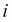
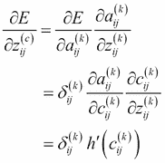

# 第四章：Dropout 和卷积神经网络

在本章中，我们继续深入探讨深度学习的算法。DBN 和 SDA 所采用的预训练方法的确是一种创新方法，但深度学习也有其他创新方法。在这些方法中，我们将详细介绍一些特别突出的算法，具体如下：

+   Dropout 学习算法

+   卷积神经网络

这两种算法对于理解和掌握深度学习都非常重要，所以一定要跟上进度。

# 没有预训练的深度学习算法

在上一章中，你学到了层级训练与预训练是 DBN 和 SDA 的突破性进展。这些算法需要预训练的原因是，因为在神经网络中，由于简单堆叠的层次结构，会出现一个问题，输出误差会逐渐消失，在这样的网络中效果不好（我们称之为梯度消失问题）。无论是想改进现有方法，还是重新发明方法，深度学习算法都需要预训练——你可以这么理解。

然而，实际上，本章中的深度学习算法并没有预训练阶段，尽管在没有预训练的深度学习算法中，我们依然可以得到更高精度和准确度的结果。为什么会发生这种情况呢？这里给出一个简短的原因。让我们思考一下为什么会出现梯度消失问题——记得反向传播的公式吗？一个层中的 delta 会通过字面上的反向传播网络分布到前一层的所有单元。这意味着在所有单元都紧密连接的网络中，反向传播到每个单元的误差值会变得很小。从反向传播的公式中可以看出，权重的梯度是通过单元之间权重和 delta 的乘积得到的。因此，我们的网络中项数越多，网络越密集，发生下溢的可能性就越大。这就导致了梯度消失问题。

因此，我们可以说，如果能够避免上述问题而不使用预训练，那么机器就能够在深度神经网络中正常学习。为了实现这一点，我们需要安排如何连接网络。本章中的深度学习算法就是通过各种方法将这种构思付诸实践的。

# Dropout

如果网络过于密集导致问题，只需强制其变得稀疏。这样，消失梯度问题就不会发生，学习也可以正常进行。基于这种思想的算法就是**dropout**算法。针对深度神经网络的 dropout 算法首次提出于*通过防止特征检测器共同适应来改进神经网络*（Hinton 等，2012，[`arxiv.org/pdf/1207.0580.pdf`](http://arxiv.org/pdf/1207.0580.pdf)），并在*Dropout: A Simple Way to Prevent Neural Networks from Overfitting*（Srivastava 等，2014，[`www.cs.toronto.edu/~hinton/absps/JMLRdropout.pdf`](https://www.cs.toronto.edu/~hinton/absps/JMLRdropout.pdf)）中得到了完善。在 dropout 中，一些单元在训练时被强制“丢弃”。这是什么意思呢？让我们看一下以下图示——首先是神经网络：


这个图没有什么特别之处。它是一个标准的神经网络，包含一个输入层、两个隐藏层和一个输出层。其次，通过向该网络应用 dropout，图形模型可以表示为以下方式：


从网络中丢弃的单元用叉号表示。如前图所示，丢弃的单元在网络中被解释为不存在。这意味着在应用 dropout 学习算法时，我们需要改变原始神经网络的结构。幸运的是，从计算角度来看，应用 dropout 到网络并不困难。你可以先构建一个常规的深度神经网络。然后，通过向每一层的所有单元添加一个 dropout 掩码——一个简单的二进制掩码——来应用 dropout 学习算法。在二进制掩码中，值为 0 的单元就是从网络中被丢弃的单元。

这可能会让你想起上一章讨论过的 DA（或 SDA），因为 DA 和 dropout 乍一看非常相似。DA 在实现时也会将二进制掩码添加到数据中来破坏输入数据。然而，它们之间有两个显著的不同点。首先，虽然这两种方法都有向神经元添加掩码的过程，但 DA 只将掩码应用于输入层的单元，而 dropout 则将其应用于隐藏层的单元。某些 dropout 算法会同时向输入层和隐藏层应用掩码，但这与 DA 仍然不同。第二，在 DA 中，一旦生成了损坏的输入数据，这些数据将在整个训练周期中使用，而在 dropout 中，每个训练周期使用的数据都会有不同的掩码。这意味着每次迭代时训练的神经网络形状都会不同。dropout 掩码会根据 dropout 的概率在每一层中生成。

你可能会有一个问题——即使每一步网络的形状不同，我们也能训练这个模型吗？答案是肯定的。你可以这样理解——通过 dropout 方法，网络能够得到很好的训练，因为它将更多的权重放在现有的神经元上，以反映输入数据的特征。然而，dropout 有一个缺点，那就是它需要比其他算法更多的训练周期来训练和优化模型，这意味着它需要更多的时间才能优化。这里介绍了一种新的技术来减少这个问题。尽管 dropout 算法本身是在较早之前就被发明的，但仅仅使用这个方法并不足以让深度神经网络具备泛化能力并获得高精度率。通过再加入一种使网络更加稀疏的技术，我们得以让深度神经网络获得更高的准确性。这项技术就是对激活函数的改进，可以说这是一种简单而优雅的解决方案。

到目前为止解释的所有神经网络方法都使用了 sigmoid 函数或双曲正切作为激活函数。使用这些函数可能会取得不错的结果。然而，正如你从它们的曲线形状中可以看到的，当某一层的输入值或误差值相对较大或较小时，这些曲线会饱和并导致梯度消失。

解决这个问题的激活函数之一是**整流器**。一个应用了整流器的单元叫做**整流线性单元**（**ReLU**）。我们可以将激活函数本身称为 ReLU。这个函数可以用以下方程描述：


该函数可以通过以下图形表示：


图中的虚线是一个被称为**softplus 函数**的函数，它的导数是逻辑斯蒂函数，可以描述如下：


这仅供参考：我们有以下关系，作为整流器的平滑近似。如你从上面的图中所见，由于整流器比 sigmoid 函数和双曲正切函数简单得多，你可以很容易猜到，当它应用于深度学习算法时，时间成本会降低。此外，由于整流器的导数——在计算反向传播误差时是必需的——也很简单，因此我们还可以进一步缩短时间成本。导数的方程可以表示如下：


由于整流器及其导数都非常稀疏，我们可以轻松想象，通过训练，神经网络也将变得更加稀疏。你可能还注意到，我们不再需要担心梯度饱和问题，因为我们不再有 sigmoid 函数和双曲正切包含的因果曲线。

使用 dropout 技术和修正函数（rectifier），一个简单的深度神经网络可以在没有预训练的情况下学习一个问题。就实现 dropout 算法所用的方程式而言，它们并不复杂，因为它们只是将 dropout 掩码添加到多层感知机中的简单方法。我们按顺序来看一下它们：


这里，表示激活函数，在本例中是修正函数。你看，前面的方程式是没有 dropout 的隐藏层单元的方程式。dropout 做的就是将掩码应用到这些单元上。它可以表示如下：


这里，表示 dropout 的概率，通常设置为 0.5。前向激活到此为止。从方程式可以看出，二进制掩码项是与一般神经网络的唯一不同之处。此外，在反向传播过程中，我们还需要将掩码添加到 delta 中。假设我们有以下方程式：


有了这个，我们可以按如下方式定义 delta：


这里，表示评估函数（这些方程式与我们在第二章中提到的相同，*机器学习算法 – 准备深度学习*）。我们得到了以下方程式：


这里，delta 可以按如下方式描述：


现在我们已经有了实现所需的所有方程式，接下来让我们深入到实现中。包结构如下：


首先，我们需要的是修正函数（rectifier）。像其他激活函数一样，我们在`ActivationFunction.java`中实现它，命名为`ReLU`：

```py
public static double ReLU(double x) {
   if(x > 0) {
       return x;
   } else {
       return 0.;
   }
}
```

同时，我们将`dReLU`定义为修正函数的导数：

```py
public static double dReLU(double y) {
   if(y > 0) {
       return 1.;
   } else {
       return 0.;
   }
}
```

相应地，我们更新了`HiddenLayer.java`的构造函数，以支持`ReLU`：

```py
if (activation == "sigmoid" || activation == null) {

   this.activation = (double x) -> sigmoid(x);
   this.dactivation = (double x) -> dsigmoid(x);

} else if (activation == "tanh") {

   this.activation = (double x) -> tanh(x);
   this.dactivation = (double x) -> dtanh(x);

} else if (activation == "ReLU") {

   this.activation = (double x) -> ReLU(x);
   this.dactivation = (double x) -> dReLU(x);

} else {
   throw new IllegalArgumentException("activation function not supported");
}
```

现在让我们来看一下`Dropout.java`。在源代码中，我们将构建一个包含两层隐藏层的神经网络，并且 dropout 的概率设置为 0.5：

```py
int[] hiddenLayerSizes = {100, 80};
double pDropout = 0.5;
```

`Dropout.java`的构造函数可以按如下方式编写（由于该网络只是一个简单的深度神经网络，代码也非常简单）：

```py
public Dropout(int nIn, int[] hiddenLayerSizes, int nOut, Random rng, String activation) {

   if (rng == null) rng = new Random(1234);

   if (activation == null) activation = "ReLU";

   this.nIn = nIn;
   this.hiddenLayerSizes = hiddenLayerSizes;
   this.nOut = nOut;
   this.nLayers = hiddenLayerSizes.length;
   this.hiddenLayers = new HiddenLayer[nLayers];
   this.rng = rng;

   // construct multi-layer
   for (int i = 0; i < nLayers; i++) {
       int nIn_;
       if (i == 0) nIn_ = nIn;
       else nIn_ = hiddenLayerSizes[i - 1];

       // construct hidden layer
       hiddenLayers[i] = new HiddenLayer(nIn_, hiddenLayerSizes[i], null, null, rng, activation);
   }

   // construct logistic layer
   logisticLayer = new LogisticRegression(hiddenLayerSizes[nLayers - 1], nOut);
}
```

如前所述，现在我们有了支持`ReLU`的`HiddenLayer`类，我们可以使用`ReLU`作为激活函数。

一旦模型构建完成，接下来我们要做的就是用 dropout 训练模型。训练的方法简单地称为`train`。由于在计算反向传播误差时，我们需要一些层的输入，因此我们首先定义一个叫做`layerInputs`的变量来缓存它们各自的输入值：

```py
List<double[][]> layerInputs = new ArrayList<>(nLayers+1);
layerInputs.add(X);
```

这里，`X`是原始训练数据。我们还需要为每一层缓存 dropout 掩码以进行反向传播，因此我们将其定义为`dropoutMasks`：

```py
List<int[][]> dropoutMasks = new ArrayList<>(nLayers);
```

训练以前向激活的方式开始。看看我们如何将 dropout 掩码应用到值上；我们只是将激活值与二进制掩码相乘：

```py
// forward hidden layers
for (int layer = 0; layer < nLayers; layer++) {

   double[] x_;  // layer input
   double[][] Z_ = new double[minibatchSize][hiddenLayerSizes[layer]];
   int[][] mask_ = new int[minibatchSize][hiddenLayerSizes[layer]];

   for (int n = 0; n < minibatchSize; n++) {

       if (layer == 0) {
           x_ = X[n];
       } else {
           x_ = Z[n];
       }

       Z_[n] = hiddenLayers[layer].forward(x_);
       mask_[n] = dropout(Z_[n], pDrouput);  // apply dropout mask to units
   }

   Z = Z_;
   layerInputs.add(Z.clone());

   dropoutMasks.add(mask_);
}
```

`Dropout.java` 中也定义了 dropout 方法。如公式所示，该方法返回遵循伯努利分布的值：

```py
public int[] dropout(double[] z, double p) {

   int size = z.length;
   int[] mask = new int[size];

   for (int i = 0; i < size; i++) {
       mask[i] = binomial(1, 1 - p, rng);
       z[i] *= mask[i]; // apply mask
   }

   return mask;
}
```

在通过隐藏层的前向传播之后，训练数据会在逻辑回归的输出层进行前向传播。然后，像其他神经网络算法一样，每一层的误差会通过网络反向传播。在这里，我们将缓存的掩码应用于误差，这样它的值就会在相同的网络中进行反向传播：

```py
// forward & backward output layer
D = logisticLayer.train(Z, T, minibatchSize, learningRate);

// backward hidden layers
for (int layer = nLayers - 1; layer >= 0; layer--) {

   double[][] Wprev_;

   if (layer == nLayers - 1) {
       Wprev_ = logisticLayer.W;
   } else {
       Wprev_ = hiddenLayers[layer+1].W;
   }

   // apply mask to delta as well
   for (int n = 0; n < minibatchSize; n++) {
       int[] mask_ = dropoutMasks.get(layer)[n];

       for (int j = 0; j < D[n].length; j++) {
           D[n][j] *= mask_[j];
       }
   }

   D = hiddenLayers[layer].backward(layerInputs.get(layer), layerInputs.get(layer+1), D, Wprev_, minibatchSize, learningRate);
}
```

训练完成后，进入测试阶段。但在将测试数据应用于已经调优的模型之前，我们需要配置网络的权重。不能简单地将 dropout 掩码应用于测试数据，因为掩码会改变每个网络的形状，这可能会导致不同的结果，因为某个特定的单元可能对某些特征有显著的影响。相反，我们做的是平滑网络的权重，这意味着我们模拟一个全体单元都被掩盖的网络。这个过程可以通过以下公式完成：


如公式所示，所有权重都与非 dropout 的概率相乘。我们为此定义的方法是`pretest`：

```py
public void pretest(double pDropout) {

   for (int layer = 0; layer < nLayers; layer++) {

       int nIn_, nOut_;

       if (layer == 0) {
           nIn_ = nIn;
       } else {
           nIn_ = hiddenLayerSizes[layer];
       }

       if (layer == nLayers - 1) {
           nOut_ = nOut;
       } else {
           nOut_ = hiddenLayerSizes[layer+1];
       }

       for (int j = 0; j < nOut_; j++) {
           for (int i = 0; i < nIn_; i++) {
               hiddenLayers[layer].W[j][i] *= 1 - pDropout;
           }
       }
   }
}
```

我们必须在测试前调用一次此方法。由于网络是一个通用的多层神经网络，对于预测，我们所需要做的就是通过网络执行前向激活：

```py
public Integer[] predict(double[] x) {

   double[] z = new double[0];

   for (int layer = 0; layer < nLayers; layer++) {

       double[] x_;

       if (layer == 0) {
           x_ = x;
       } else {
           x_ = z.clone();
       }

       z = hiddenLayers[layer].forward(x_);
   }

   return logisticLayer.predict(z);
}
```

与 DBN 和 SDA 相比，dropout MLP 要简单得多，且更容易实现。它暗示着，通过混合两种或更多技术，我们可以获得更高的精度。

# 卷积神经网络

你学到的所有机器学习/深度学习算法都假定输入数据是一维的。然而，现实世界中的数据不一定是一维的。一个典型的例子是图像。尽管我们仍然可以从实现的角度将二维（或更高维度）数据转换为一维数组，但最好是构建一个可以处理二维数据的模型。否则，当数据被展平为一维时，数据中某些嵌入的信息，例如位置关系，可能会丢失。

为了解决这个问题，提出了一种叫做**卷积神经网络**（**CNN**）的算法。在 CNN 中，特征通过卷积层和池化层（稍后会解释）从二维输入数据中提取，然后这些特征会输入到普通的多层感知器（MLP）中。MLP 的这种预处理灵感来自人类的视觉区域，可以描述如下：

+   将输入数据划分为多个领域。这个过程相当于人类的感受野。

+   从各自的领域中提取特征，如边缘和位置畸变。

利用这些特征，MLP 可以相应地进行数据分类。

CNN 的图形模型与其他神经网络不同。以下是 CNN 的简要示例：


你可能从这幅图中无法完全理解 CNN 是什么。此外，你可能会觉得 CNN 相对复杂，难以理解。但你不需要担心这一点。CNN 的图形模型确实复杂，且包含诸如卷积和池化等不熟悉的术语，这些术语在其他深度学习算法中是听不到的。然而，当你一步步地看模型时，其实并没有什么难以理解的地方。CNN 由几种专门调整的层组成，旨在进行图像识别。我们将在下一小节中逐一介绍每一层。在前面的图中，网络中有两个卷积层和池化（**下采样**）层，以及全连接的多层感知机。我们首先来看卷积层的作用。

## 卷积

卷积层实际上执行卷积操作，这意味着应用多个滤波器到图像上以提取特征。这些滤波器称为**核**，卷积后的图像称为**特征图**。我们来看一下下面的图像（已分解为颜色值）和核：


通过这些，卷积所做的操作如下所示：


核在图像上滑动，并将核内值的和作为乘法滤波器返回。你可能已经注意到，通过改变核值，你可以提取多种特征。假设你有如下所述的核值：


你会看到左边的核提取了图像的边缘，因为它强调了颜色差异，而右边的核则模糊了图像，因为它降低了原始值。CNN 的一个伟大之处在于，在卷积层中，你不需要手动设置这些核值。一旦初始化，CNN 本身将通过学习算法自动学习合适的值（这意味着在 CNN 中训练的参数是核的权重），最终能够非常精确地分类图像。

现在，让我们思考一下，为什么具有卷积层（卷积核）的神经网络能够以更高的精度进行预测。关键在于**局部感受野**。在除了 CNN 之外的大多数神经网络层中，所有神经元都是完全连接的。这甚至导致稍微不同的数据，比如说一像素的平行数据会被认为是完全不同的数据，因为这些数据会传播到隐藏层的不同神经元，而人类则很容易理解它们是相同的。通过完全连接层，神经网络确实能够识别更复杂的模式，但与此同时，它们缺乏泛化能力和灵活性。相比之下，你可以看到卷积层中神经元之间的连接仅限于它们的卷积核大小，这使得模型在处理平移过的图像时更具鲁棒性。因此，具有局部感受野的神经网络在优化卷积核时能够获得**平移不变性**。

每个卷积核都有自己的值，并从图像中提取相应的特征。请记住，特征图的数量与卷积核的数量始终相同，这意味着如果我们有 20 个卷积核，我们就有 20 个特征图，也就是卷积后的图像。这可能会令人困惑，所以我们来探讨另一个例子。假设有一张灰度**图像**和 20 个**卷积核**，那么有多少个**特征图**呢？答案是二十。这二十张图像将被传播到下一层。如下所示：


那么，如果我们有一张 3 通道的图像（例如，RGB 图像），且卷积核的数量为 20，那么会有多少个特征图呢？答案仍然是 20。但这次，卷积过程与灰度（即单通道）图像有所不同。当图像有多个通道时，卷积核将分别适应每个通道。因此，在这种情况下，我们首先会得到 60 个卷积后的图像，分别由 3 个通道的每个通道对应 20 张映射后的图像组成。然后，所有原本来自同一图像的卷积图像将合并成一个特征图。因此，我们将得到 20 个特征图。换句话说，图像被分解成不同通道的数据，应用卷积核后再重新合并成混合通道的图像。你可以从前面图示的流程中轻松地想象，当我们将卷积核应用于多通道图像以生成分解后的图像时，应该对每个通道应用相同的卷积核。这个流程如下图所示：


从计算角度来看，卷积核的数量由权重张量的维度表示。稍后你会看到如何实现这一点。

## 池化

与卷积层相比，池化层的工作相对简单。它们实际上不会自己训练或学习，而只是对从卷积层传播过来的图像进行下采样。为什么我们需要进行下采样？你可能认为这样会丢失一些重要的信息。但在这里，再次像卷积层一样，这个过程是必要的，以便让网络保持平移不变性。

下采样的方法有很多，但其中最大池化是最著名的。它可以表示为：


在最大池化层中，输入图像被分割成一组不重叠的子数据，每个数据输出最大值。这个过程不仅保持了其平移不变性，还减少了上层的计算。通过卷积和池化，CNN 可以从输入中获取鲁棒的特征。

## 方程和实现

现在我们知道了卷积和最大池化的基本概念，接下来我们用方程来描述整个模型。我们将在下面的方程中使用卷积的图示：


如图所示，如果我们有一个大小为的图像和大小为的卷积核，那么卷积可以表示为：


在这里，是卷积核的权重，也就是模型的参数。只需记住，我们从 0 开始描述每个求和，而不是从 1 开始，这样你能更好地理解。可是，考虑到多卷积层时，这个方程还不够，因为它没有包含来自通道的信息。幸运的是，这并不难，因为我们只需在卷积核中加入一个参数就可以实现。扩展后的方程可以表示为：


在这里，表示图像的通道。如果核的数量是，通道的数量是，那么我们有。然后，从方程中可以看出，卷积图像的大小是。

卷积后，所有卷积后的值将通过激活函数进行激活。我们将使用 Rectifier（当下最流行的激活函数）来实现 CNN，但你也可以使用 Sigmoid 函数、双曲正切函数或任何其他可用的激活函数。经过激活后，我们得到：


这里，表示偏置，即另一个模型参数。你可以看到，没有和的下标，也就是说，我们有，这是一个一维数组。这样，我们就完成了卷积层的前向传播。

接下来是最大池化层。传播过程可以简单地写成如下形式：


这里，和是池化滤波器的大小，而表示池化层的输出。通常，和都设置为相同的值，通常为 2~4。

这两层——卷积层和最大池化层——通常按此顺序排列，但你不一定必须按这个顺序。你可以在最大池化之前放置两个卷积层。例如，虽然我们将激活函数放在卷积后面，但有时它会被设置在最大池化之后，而不是卷积之后。为了简单起见，我们将按卷积–激活–最大池化的顺序实现 CNN。

### 提示

这里有一个重要的提示，虽然核权重将从数据中学习，但架构、核的大小以及池化的大小都是模型参数。

简单的 MLP 在卷积层和最大池化层后面，用于分类数据。这里，由于 MLP 只能接受一维数据，我们需要将下采样后的数据展平，作为预处理步骤，以适配 MLP 的输入层。在 MLP 之前已经完成了特征提取，因此将数据格式化为一维数据不会成为问题。因此，一旦模型优化完成，CNN 就能够对图像数据进行分类。为此，与其他神经网络一样，反向传播算法被应用于 CNN 以训练模型。我们在这里不提及与 MLP 相关的公式。

MLP 的输入层的误差被反向传播到最大池化层，这时它会被重新展平为二维，以便正确适应模型。由于最大池化层没有模型参数，它只是将误差反向传播到前一层。该公式可以描述如下：


这里，表示评估函数。然后，这个误差被反向传播到卷积层，利用这个误差我们可以计算权重和偏置的梯度。由于偏置与激活函数在反向传播时出现在卷积之前，下面我们先来看偏置的梯度，公式如下：


为了继续进行这个方程，我们定义以下内容：


我们还定义：


通过这些，我们得到：


我们可以用相同的方式计算权重（卷积核）的梯度：


因此，我们可以更新模型参数。如果我们只有一个卷积层和一个最大池化层，那么刚才给出的方程就是我们需要的全部。然而，当我们考虑多卷积层时，我们还需要计算卷积层的误差。这个可以表示如下：


在这里，我们得到：



所以，误差可以写成如下形式：


在计算这个时，我们必须小心，因为可能会出现 或者，其中特征图之间没有元素。为了解决这个问题，我们需要在它们的左上角添加零填充。然后，方程实际上就是一个卷积，卷积核沿两个轴翻转。尽管卷积神经网络中的方程看起来很复杂，但它们其实只是每个参数的求和。

有了前面所有的方程，我们现在可以实现 CNN，接下来让我们看看如何实现它。包结构如下：


`ConvolutionNeuralNetworks.java` 用于构建 CNN 的模型框架，卷积层和最大池化层的训练算法，以及前向传播和反向传播的具体实现写在 `ConvolutionPoolingLayer.java` 中。在演示中，我们的原始图像大小为 `12`  ` 12`，且只有一个通道：

```py
final int[] imageSize = {12, 12};
final int channel = 1;
```

图像将通过两个 `ConvPoolingLayer`（卷积层和最大池化层）进行传播。第一层中的卷积核数量设置为 `10`，大小为 `3`  ` 3`，第二层中设置为 `20`，大小为 `2`  ` 2`。池化滤波器的大小都设置为 `2`  ` 2`：

```py
int[] nKernels = {10, 20};
int[][] kernelSizes = { {3, 3}, {2, 2} };
int[][] poolSizes = { {2, 2}, {2, 2} };
```

在第二个最大池化层之后，特征图的数量为 `20`，大小为 `2`  ` 2`。这些特征图然后被展平为 `80` 个单元，并将被传递到具有 `20` 个神经元的隐藏层：

```py
int nHidden = 20;
```

然后我们创建了三个带有少量噪声的简单示范数据。这里我们将省略创建示范数据的代码。如果我们展示数据，示例如下：


现在让我们构建模型。构造函数类似于其他深度学习模型，且相对简单。我们首先构建多个`ConvolutionPoolingLayers`。每一层的大小在方法中计算：

```py
// construct convolution + pooling layers
for (int i = 0; i < nKernels.length; i++) {
   int[] size_;
   int channel_;

   if (i == 0) {
       size_ = new int[]{imageSize[0], imageSize[1]};
       channel_ = channel;
   } else {
       size_ = new int[]{pooledSizes[i-1][0], pooledSizes[i-1][1]};
       channel_ = nKernels[i-1];
   }

   convolvedSizes[i] = new int[]{size_[0] - kernelSizes[i][0] + 1, size_[1] - kernelSizes[i][1] + 1};
   pooledSizes[i] = new int[]{convolvedSizes[i][0] / poolSizes[i][0], convolvedSizes[i][1] / poolSizes[i][0]};

   convpoolLayers[i] = new ConvolutionPoolingLayer(size_, channel_, nKernels[i], kernelSizes[i], poolSizes[i], convolvedSizes[i], pooledSizes[i], rng, activation);
}
```

当你查看`ConvolutionPoolingLayer`类的构造函数时，你可以看到核（kernel）和偏置（bias）是如何定义的：

```py
if (W == null) {

   W = new double[nKernel][channel][kernelSize[0]][kernelSize[1]];

   double in_ = channel * kernelSize[0] * kernelSize[1];
   double out_ = nKernel * kernelSize[0] * kernelSize[1] / (poolSize[0] * poolSize[1]);
   double w_ = Math.sqrt(6\. / (in_ + out_));

   for (int k = 0; k < nKernel; k++) {
       for (int c = 0; c < channel; c++) {
           for (int s = 0; s < kernelSize[0]; s++) {
               for (int t = 0; t < kernelSize[1]; t++) {
                   W[k][c][s][t] = uniform(-w_, w_, rng);
               }
           }
       }
   }
}

if (b == null) b = new double[nKernel];
```

接下来是 MLP 的构建。传递数据时，别忘了将下采样后的数据展平：

```py
// build MLP
flattenedSize = nKernels[nKernels.length-1] * pooledSizes[pooledSizes.length-1][0] * pooledSizes[pooledSizes.length-1][1];

// construct hidden layer
hiddenLayer = new HiddenLayer(flattenedSize, nHidden, null, null, rng, activation);

// construct output layer
logisticLayer = new LogisticRegression(nHidden, nOut);
```

一旦模型构建完成，我们需要训练它。在`train`方法中，我们缓存所有前向传播的数据，以便在反向传播时使用：

```py
// cache pre-activated, activated, and downsampled inputs of each convolution + pooling layer for backpropagation
List<double[][][][]> preActivated_X = new ArrayList<>(nKernels.length);
List<double[][][][]> activated_X = new ArrayList<>(nKernels.length);
List<double[][][][]> downsampled_X = new ArrayList<>(nKernels.length+1);  // +1 for input X
downsampled_X.add(X);

for (int i = 0; i < nKernels.length; i++) {
   preActivated_X.add(new double[minibatchSize][nKernels[i]][convolvedSizes[i][0]][convolvedSizes[i][1]]);
   activated_X.add(new double[minibatchSize][nKernels[i]][convolvedSizes[i][0]][convolvedSizes[i][1]]);
   downsampled_X.add(new double[minibatchSize][nKernels[i]][convolvedSizes[i][0]][convolvedSizes[i][1]]);
}
```

`preActivated_X`用于卷积特征图，`activated_X`用于激活后的特征，`downsampled_X`用于下采样后的特征。我们将原始数据放入并缓存到`downsampled_X`中。实际的训练从通过卷积和最大池化的前向传播开始：

```py
// forward convolution + pooling layers
double[][][] z_ = X[n].clone();
for (int i = 0; i < nKernels.length; i++) {
   z_ = convpoolLayers[i].forward(z_, preActivated_X.get(i)[n], activated_X.get(i)[n]);
   downsampled_X.get(i+1)[n] = z_.clone();
}
```

`ConvolutionPoolingLayer`的`forward`方法很简单，由`convolve`和`downsample`组成。`convolve`函数执行卷积操作，`downsample`执行最大池化操作：

```py
public double[][][] forward(double[][][] x, double[][][] preActivated_X, double[][][] activated_X) {

   double[][][] z = this.convolve(x, preActivated_X, activated_X);
   return  this.downsample(z);
```

`preActivated_X`和`activated_X`的值是在卷积方法中设置的。你可以看到该方法只是简单地遵循之前解释的方程式：

```py
public double[][][] convolve(double[][][] x, double[][][] preActivated_X, double[][][] activated_X) {

   double[][][] y = new double[nKernel][convolvedSize[0]][convolvedSize[1]];

   for (int k = 0; k < nKernel; k++) {
       for (int i = 0; i < convolvedSize[0]; i++) {
           for(int j = 0; j < convolvedSize[1]; j++) {

               double convolved_ = 0.;

               for (int c = 0; c < channel; c++) {
                   for (int s = 0; s < kernelSize[0]; s++) {
                       for (int t = 0; t < kernelSize[1]; t++) {
                           convolved_ += W[k][c][s][t] * x[c][i+s][j+t];
                       }
                   }
               }

               // cache pre-activated inputs
               preActivated_X[k][i][j] = convolved_ + b[k];
               activated_X[k][i][j] = this.activation.apply(preActivated_X[k][i][j]);
               y[k][i][j] = activated_X[k][i][j];
           }
       }
   }

   return y;
}
```

`downsample`方法同样遵循方程式：

```py
public double[][][] downsample(double[][][] x) {

   double[][][] y = new double[nKernel][pooledSize[0]][pooledSize[1]];

   for (int k = 0; k < nKernel; k++) {
       for (int i = 0; i < pooledSize[0]; i++) {
           for (int j = 0; j < pooledSize[1]; j++) {

               double max_ = 0.;

               for (int s = 0; s < poolSize[0]; s++) {
                   for (int t = 0; t < poolSize[1]; t++) {

                       if (s == 0 && t == 0) {
                           max_ = x[k][poolSize[0]*i][poolSize[1]*j];
                           continue;
                       }
                       if (max_ < x[k][poolSize[0]*i+s][poolSize[1]*j+t]) {
                           max_ = x[k][poolSize[0]*i+s][poolSize[1]*j+t];
                       }
                   }
               }

               y[k][i][j] = max_;
           }
       }
   }

   return y;
}
```

你可能会认为我们在这里犯了些错误，因为这些方法中有很多`for`循环，但实际上并没有问题。正如你从 CNN 的方程式中看到的，算法需要很多循环，因为它有很多参数。这里的代码是正常工作的，但实际上，你可以将最内层循环的一部分定义并移动到其他方法中。为了更好地理解，我们在这里实现了带有许多嵌套循环的 CNN，以便将代码与方程式进行比较。你现在可以看到，CNN 需要大量时间才能得到结果。

在我们进行数据下采样后，需要将其展平：

```py
// flatten output to make it input for fully connected MLP
double[] x_ = this.flatten(z_);
flattened_X[n] = x_.clone();
```

数据随后被转发到隐藏层：

```py
// forward hidden layer
Z[n] = hiddenLayer.forward(x_);
```

输出层使用多类逻辑回归，然后将误差（delta）反向传播到隐藏层：

```py
// forward & backward output layer
dY = logisticLayer.train(Z, T, minibatchSize, learningRate);

// backward hidden layer
dZ = hiddenLayer.backward(flattened_X, Z, dY, logisticLayer.W, minibatchSize, learningRate);

// backpropagate delta to input layer
for (int n = 0; n < minibatchSize; n++) {
   for (int i = 0; i < flattenedSize; i++) {
       for (int j = 0; j < nHidden; j++) {
           dX_flatten[n][i] += hiddenLayer.W[j][i] * dZ[n][j];
       }
   }

   dX[n] = unflatten(dX_flatten[n]);  // unflatten delta
}

// backward convolution + pooling layers
dC = dX.clone();
for (int i = nKernels.length-1; i >= 0; i--) {
   dC = convpoolLayers[i].backward(downsampled_X.get(i), preActivated_X.get(i), activated_X.get(i), downsampled_X.get(i+1), dC, minibatchSize, learningRate);
}
```

`ConvolutionPoolingLayer`的`backward`方法与`forward`方法相同，也很简单。最大池化的反向传播写在`upsample`中，卷积的反向传播写在`deconvolve`中：

```py
public double[][][][] backward(double[][][][] X, double[][][][] preActivated_X, double[][][][] activated_X, double[][][][] downsampled_X, double[][][][] dY, int minibatchSize, double learningRate) {

   double[][][][] dZ = this.upsample(activated_X, downsampled_X, dY, minibatchSize);
   return this.deconvolve(X, preActivated_X, dZ, minibatchSize, learningRate);

}
```

`upsample`的作用只是将误差（delta）传递到卷积层：

```py
public double[][][][] upsample(double[][][][] X, double[][][][] Y, double[][][][] dY, int minibatchSize) {

   double[][][][] dX = new double[minibatchSize][nKernel][convolvedSize[0]][convolvedSize[1]];

   for (int n = 0; n < minibatchSize; n++) {

       for (int k = 0; k < nKernel; k++) {
           for (int i = 0; i < pooledSize[0]; i++) {
               for (int j = 0; j < pooledSize[1]; j++) {

                   for (int s = 0; s < poolSize[0]; s++) {
                       for (int t = 0; t < poolSize[1]; t++) {

                           double d_ = 0.;

                           if (Y[n][k][i][j] == X[n][k][poolSize[0]*i+s][poolSize[1]*j+t]) {
                               d_ = dY[n][k][i][j];
                           }

                           dX[n][k][poolSize[0]*i+s][poolSize[1]*j+t] = d_;
                       }
                   }
               }
           }
       }
   }

   return dX;
}
```

在`deconvolve`中，我们需要更新模型参数。由于我们使用小批量训练模型，我们首先计算梯度的总和：

```py
// calc gradients of W, b
for (int n = 0; n < minibatchSize; n++) {
   for (int k = 0; k < nKernel; k++) {

       for (int i = 0; i < convolvedSize[0]; i++) {
           for (int j = 0; j < convolvedSize[1]; j++) {

               double d_ = dY[n][k][i][j] * this.dactivation.apply(Y[n][k][i][j]);

               grad_b[k] += d_;

               for (int c = 0; c < channel; c++) {
                   for (int s = 0; s < kernelSize[0]; s++) {
                       for (int t = 0; t < kernelSize[1]; t++) {
                           grad_W[k][c][s][t] += d_ * X[n][c][i+s][j+t];
                       }
                   }
               }
           }
       }
   }
}
```

然后，使用这些梯度更新权重和偏置：

```py
// update gradients
for (int k = 0; k < nKernel; k++) {
   b[k] -= learningRate * grad_b[k] / minibatchSize;

   for (int c = 0; c < channel; c++) {
       for (int s = 0; s < kernelSize[0]; s++) {
           for(int t = 0; t < kernelSize[1]; t++) {
               W[k][c][s][t] -= learningRate * grad_W[k][c][s][t] / minibatchSize;
           }
       }
   }
}
```

与其他算法不同，我们必须在 CNN 中分别计算参数和误差（delta）：

```py
// calc delta
for (int n = 0; n < minibatchSize; n++) {
   for (int c = 0; c < channel; c++) {
       for (int i = 0; i < imageSize[0]; i++) {
           for (int j = 0; j < imageSize[1]; j++) {

               for (int k = 0; k < nKernel; k++) {
                   for (int s = 0; s < kernelSize[0]; s++) {
                       for (int t = 0; t < kernelSize[1]; t++) {

                           double d_ = 0.;

                           if (i - (kernelSize[0] - 1) - s >= 0 && j - (kernelSize[1] - 1) - t >= 0) {
                               d_ = dY[n][k][i-(kernelSize[0]-1)-s][j-(kernelSize[1]-1)-t] * this.dactivation.apply(Y[n][k][i- (kernelSize[0]-1)-s][j-(kernelSize[1]-1)-t]) * W[k][c][s][t];
                           }

                           dX[n][c][i][j] += d_;
                       }
                   }
               }
           }
       }
   }
}
```

现在我们训练模型，接下来进入测试部分。测试或预测的方法简单地进行前向传播，就像其他算法一样：

```py
public Integer[] predict(double[][][] x) {

   List<double[][][]> preActivated = new ArrayList<>(nKernels.length);
   List<double[][][]> activated = new ArrayList<>(nKernels.length);

   for (int i = 0; i < nKernels.length; i++) {
       preActivated.add(new double[nKernels[i]][convolvedSizes[i][0]][convolvedSizes[i][1]]);
       activated.add(new double[nKernels[i]][convolvedSizes[i][0]][convolvedSizes[i][1]]);
   }

   // forward convolution + pooling layers
   double[][][] z = x.clone();
   for (int i = 0; i < nKernels.length; i++) {
       z = convpoolLayers[i].forward(z, preActivated.get(i), activated.get(i));
   }

   // forward MLP
   return logisticLayer.predict(hiddenLayer.forward(this.flatten(z)));
}
```

恭喜！CNN 的内容到此为止。现在你可以运行代码，看看它是如何工作的。在这里，我们使用的是二维数据作为输入的 CNN，但如果我们扩展模型，CNN 也可以处理三维数据。我们可以预期它在医学领域的应用，例如，从人类大脑的三维扫描数据中发现恶性肿瘤。

卷积和池化过程最初由 LeCun 等人在 1998 年发明（[`yann.lecun.com/exdb/publis/pdf/lecun-98.pdf`](http://yann.lecun.com/exdb/publis/pdf/lecun-98.pdf)），然而正如你从代码中看到的，它需要大量计算。我们可以假设，这种方法在当时可能不适合用于计算机的实际应用，更不用说让它变得深度了。CNN 近年来受到更多关注的原因可能是计算机的性能和能力得到了极大的发展。但即便如此，我们不能否认这个问题。因此，在我们拥有一定数据量的 CNN 时，使用 GPU 而非 CPU 似乎是实际可行的。由于将算法优化为 GPU 的实现较为复杂，我们在这里不会编写代码。相反，在第五章，*探索 Java 深度学习库 – DL4J、ND4J 等*和第七章，*其他重要的深度学习库*，你将看到能够利用 GPU 的深度学习库。

# 总结

在本章中，你学习了两种不需要预训练的深度学习算法：带有丢弃法的深度神经网络和 CNN。高精度率的关键在于如何让网络变得稀疏，而丢弃法是实现这一目标的技术之一。另一种技术是修正器，即激活函数，它可以解决 sigmoid 函数和双曲正切函数中出现的饱和问题。CNN 是最流行的图像识别算法，具有两个特点：卷积和最大池化。这两者使得模型具备了平移不变性。如果你对丢弃法、修正器和其他激活函数如何提高神经网络的性能感兴趣，以下的文献可能会是很好的参考：*深度稀疏修正器神经网络*（Glorot 等人，2011，[`www.jmlr.org/proceedings/papers/v15/glorot11a/glorot11a.pdf`](http://www.jmlr.org/proceedings/papers/v15/glorot11a/glorot11a.pdf)），*使用深度卷积神经网络进行 ImageNet 分类*（Krizhevsky 等人，2012，[`papers.nips.cc/paper/4824-imagenet-classification-with-deep-convolutional-neural-networks.pdf`](https://papers.nips.cc/paper/4824-imagenet-classification-with-deep-convolutional-neural-networks.pdf)），以及*Maxout 网络*（Goodfellow 等人，2013，[`arxiv.org/pdf/1302.4389.pdf`](http://arxiv.org/pdf/1302.4389.pdf)）。

虽然你现在已经了解了流行且有用的深度学习算法，但仍有许多算法在本书中没有提及。这个研究领域越来越活跃，新的算法层出不穷。但别担心，因为所有算法都基于相同的根基：神经网络。现在你已经掌握了理解或实现模型所需的思维方式，遇到任何模型时，你都能完全理解。

我们已经从零开始实现了深度学习算法，以帮助你完全理解它们。在接下来的章节中，你将看到我们如何使用深度学习库来实现这些算法，从而促进我们的研究或应用。
