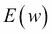

# 第五章：探索 Java 深度学习库——DL4J、ND4J 及更多

在前几章中，你学习了深度学习算法的核心理论，并从零开始实现了它们。虽然我们现在可以说，深度学习的实现并不那么困难，但我们不能否认，实施模型仍然需要一些时间。为了解决这个问题，在本章中，你将学习如何使用 Java 深度学习库编写代码，这样我们就可以更多地专注于数据分析的关键部分，而不是琐碎的细节。

本章中你将学习的主题包括：

+   Java 深度学习库简介

+   示例代码以及如何使用该库编写你自己的代码

+   一些优化模型以提高精度率的附加方法

# 从头实现与使用库/框架

我们在第二章中实现了神经网络的机器学习算法，*机器学习算法——为深度学习做准备*，并在第三章，*深度信念网络与堆叠去噪自编码器*和第四章，*Dropout 和卷积神经网络*中从头实现了许多深度学习算法。当然，我们可以通过一些定制将自己的代码应用于实际应用，但在我们想要利用它们时必须小心，因为我们不能否认它们未来可能引发的问题。可能是什么问题呢？以下是可能的情况：

+   我们编写的代码缺少一些更好的优化参数，因为我们只是为了简化问题并帮助你更好地理解概念而实现了算法的核心部分。虽然你仍然可以使用这些代码来训练和优化模型，但通过添加你自己实现的额外参数，你可以获得更高的精度率。

+   如前章所述，本书中仍有许多有用的深度学习算法未被解释。虽然你现在已经掌握了深度学习算法的核心组件，但你可能需要实现额外的类或方法，以在你的领域和应用中获得期望的结果。

+   假定的时间消耗对应用非常关键，尤其是当你考虑分析大量数据时。确实，相较于 Python 和 R 等其他流行语言，Java 在速度方面有更好的性能，但你仍然需要考虑时间成本。一个可行的解决方案是使用 GPU 代替 CPU，但这需要复杂的实现来调整代码以适应 GPU 计算。

这些是主要的因果问题，你可能还需要考虑到我们没有在代码中处理异常。

这并不意味着从头实现会有致命的错误。我们编写的代码可以作为处理某些规模数据的应用程序；然而，如果你使用大规模数据挖掘，通常需要深度学习，那么你需要考虑，你所实现的基础部分需要进一步编码。这意味着，你需要记住，从头实现具有更大的灵活性，因为在必要时你可以更改代码，但同时它也有负面影响，即算法的调优和维护必须独立完成。

那么，如何解决刚才提到的问题呢？这就是库（或框架）派上用场的地方。得益于全球对深度学习的积极研究，世界各地有许多使用各种编程语言开发并发布的库。当然，每个库都有各自的特点，但每个库共同具备的特点可以总结如下：

+   只需定义深度学习的层结构，就可以完成模型的训练。你可以专注于参数设置和调优，而无需考虑算法。

+   大多数库作为开源项目向公众开放，并且每天都在积极更新。因此，如果出现 bug，很有可能这些 bug 会被迅速修复（当然，如果你自己修复它并提交到项目中，这也是受欢迎的）。

+   在 CPU 和 GPU 之间切换程序运行非常容易。由于库补充了 GPU 计算中的繁琐编码部分，你可以专注于实现，而无需考虑 CPU 或 GPU，只要机器支持 GPU。

简而言之，你可以省去所有在从头实现库时可能会遇到的麻烦部分。得益于此，你可以将更多时间花在核心数据挖掘部分，因此，如果你希望利用实际应用，使用库进行数据分析时效率更高的可能性也会大大增加。

然而，过度依赖库并不好。使用库虽然方便，但也有一些缺点，如下所列：

+   由于你可以轻松构建各种深度学习模型，你可以在没有具体理解模型所依赖的理论的情况下进行实现。如果我们只考虑与特定模型相关的实现，这可能不是问题，但当你想结合其他方法或在应用模型时考虑其他方法时，可能会遇到无法处理的风险。

+   你不能使用库中不支持的算法，因此可能会遇到无法选择自己想用的模型的情况。这个问题可以通过版本升级来解决，但另一方面，过去某些实现的部分可能由于规范更改而被弃用。此外，我们不能排除库的开发突然终止或由于许可证的突然变更，使用该库变为收费的可能性。在这些情况下，你之前开发的代码可能无法再使用。

+   你从实验中获得的精度取决于库的实现方式。例如，如果我们在两个不同的库中使用相同的神经网络模型进行实验，得到的结果可能会有很大的不同。这是因为神经网络算法包括随机操作，而且机器的计算精度是有限的，即在计算过程中，基于实现方法的不同，计算值可能会有波动。

由于你在前几章中已经很好地理解了深度学习算法的基本概念和理论，因此我们不需要担心第一个问题。然而，我们需要小心剩下的两个问题。从下一节开始，将介绍如何使用库进行实现，并且我们将更加关注刚刚讨论的优缺点。

# 介绍 DL4J 和 ND4J

全球范围内已经开发了很多深度学习库。2015 年 11 月，**TensorFlow**（[`www.tensorflow.org/`](http://www.tensorflow.org/)），由 Google 开发的机器学习/深度学习库，公开发布并引起了广泛关注。

当我们看一下开发库所使用的编程语言时，大多数公开的库都是用 Python 开发的或使用 Python API。TensorFlow 的后端是用 C++开发的，但也可以用 Python 编写代码。本书重点讲解使用 Java 学习深度学习，因此其他语言开发的库将在第七章中简要介绍，*其他重要的深度学习库*。

那么，我们有哪些基于 Java 的库可以使用呢？实际上，积极开发的库并不多（也许还有一些未公开的项目）。然而，我们实际上可以使用的库只有一个：**Deeplearning4j**（**DL4J**）。官方项目页面的 URL 是[`deeplearning4j.org/`](http://deeplearning4j.org/)。这个库也是开源的，源代码全部发布在 GitHub 上，网址是[`github.com/deeplearning4j/deeplearning4j`](https://github.com/deeplearning4j/deeplearning4j)。该库由 Skymind 开发（[`www.skymind.io/`](http://www.skymind.io/)）。这个库是什么样的库呢？如果你查看项目页面，它是这样介绍的：

> *"Deeplearning4j 是第一个为 Java 和 Scala 编写的商业级开源分布式深度学习库。与 Hadoop 和 Spark 集成，DL4J 旨在用于商业环境，而非作为研究工具。Skymind 是它的商业支持部门。"*
> 
> *Deeplearning4j 旨在成为尖端的即插即用，注重约定而非配置，这使得非研究人员能够快速进行原型开发。DL4J 具有可扩展的自定义功能。它在 Apache 2.0 许可证下发布，DL4J 的所有衍生作品归其作者所有。*

当你阅读到这里时，你会发现 DL4J 的最大特点是它是以与 Hadoop 集成为前提设计的。这表明，DL4J 非常适合处理大规模数据，且比其他库更具可扩展性。此外，DL4J 支持 GPU 计算，因此能够更快速地处理数据。

此外，DL4J 内部使用一个名为**Java 的 N 维数组**（**ND4J**）的库。该项目页面为[`nd4j.org/`](http://nd4j.org/)。与 DL4J 相同，这个库也作为开源项目发布在 GitHub 上：[`github.com/deeplearning4j/nd4j`](https://github.com/deeplearning4j/nd4j)。该库的开发者与 DL4J 相同，都是 Skymind。正如库名所示，这是一个科学计算库，使我们能够处理多功能的*n*维数组对象。如果你是 Python 开发者，可以通过类比 NumPy 来更容易理解它，因为 ND4J 是一个受 NumPy 启发的库。ND4J 还支持 GPU 计算，DL4J 能够进行 GPU 集成的原因就是它在内部使用了 ND4J。

在 GPU 上与它们一起工作能带来什么好处？让我们简要看一下这一点。CPU 和 GPU 之间最大的区别在于核心数量的差异。GPU，顾名思义，是一个图形处理单元，最初是一个用于图像处理的集成电路。这也是 GPU 能够优化同时处理相同命令的原因。并行处理是它的强项。另一方面，CPU 需要处理各种命令，这些任务通常是按顺序处理的。与 CPU 相比，GPU 擅长处理大量简单的任务，因此像深度学习训练迭代这样的计算是它的专长。

ND4J 和 DL4J 对于深度学习中的研究和数据挖掘非常有用。从下一节开始，我们将通过简单的例子来看它们是如何用于深度学习的。因为你现在应该已经理解了深度学习的核心理论，所以你可以很容易理解这些内容。希望你能将其应用于你的研究领域或业务中。

# 使用 ND4J 的实现

由于有很多情况下 ND4J 本身就能方便地使用，因此在深入 DL4J 的解释之前，让我们简要了解一下如何使用 ND4J。如果你只打算使用 ND4J，一旦创建了一个新的 Maven 项目，你可以通过在`pom.xml`中添加以下代码来使用 ND4J：

```py
<properties>
   <nd4j.version>0.4-rc3.6</nd4j.version>
</properties>

<dependencies>
   <dependency>
       <groupId>org.nd4j</groupId>
       <artifactId>nd4j-jblas</artifactId>
       <version>${nd4j.version}</version>
   </dependency>
   <dependency>
       <groupId>org.nd4j</groupId>
       <artifactId>nd4j-perf</artifactId>
       <version>${nd4j.version}</version>
   </dependency>
</dependencies>
```

这里，`<nd4j.version>`描述了 ND4J 的最新版本，但在实际实现代码时，请检查它是否已经更新。另外，使用 ND4J 时从 CPU 切换到 GPU 非常简单。如果你已经安装了 CUDA 7.0 版本，那么你只需按照以下方式定义`artifactId`：

```py
<dependency>
   <groupId>org.nd4j</groupId>
   <artifactId>nd4j-jcublas-7.0</artifactId>
   <version>${nd4j.version}</version>
</dependency>
```

你可以根据你的配置替换`<artifactId>`的版本。

让我们看一个使用 ND4J 进行计算的简单例子。我们在 ND4J 中使用的类型是`INDArray`，即`Array`的扩展类型。我们首先导入以下依赖：

```py
import org.nd4j.linalg.api.ndarray.INDArray;
import org.nd4j.linalg.factory.Nd4j;
```

然后，我们定义`INDArray`如下：

```py
INDArray x = Nd4j.create(new double[]{1, 2, 3, 4, 5, 6}, new int[]{3, 2});
System.out.println(x);
```

`Nd4j.create`接受两个参数。前者定义了`INDArray`中的实际值，后者定义了向量（矩阵）的形状。通过运行这段代码，你将得到以下结果：

```py
[[1.00,2.00]
 [3.00,4.00]
 [5.00,6.00]]
```

由于`INDArray`可以通过`System.out.print`输出其值，因此调试非常简单。标量计算也可以轻松完成。像下面这样将 1 加到`x`：

```py
x.add(1);

```

然后，你将得到以下输出：

```py
[[2.00,3.00]
 [4.00,5.00]
 [6.00,7.00]]

```

此外，`INDArray`中的计算可以轻松完成，以下例子展示了这一点：

```py
INDArray y = Nd4j.create(new double[]{6, 5, 4, 3, 2, 1}, new int[]{3, 2});
```

然后，基本的算术运算可以表示如下：

```py
x.add(y)
x.sub(y)
x.mul(y)
x.div(y)
```

这些将返回以下结果：

```py
[[7.00,7.00]
 [7.00,7.00]
 [7.00,7.00]]
[[-5.00,-3.00]
 [-1.00,1.00]
 [3.00,5.00]]
[[6.00,10.00]
 [12.00,12.00]
 [10.00,6.00]]
[[0.17,0.40]
 [0.75,1.33]
 [2.50,6.00]]

```

此外，ND4J 具有破坏性算术运算符。当你写下`x.addi(y)`命令时，`x`会改变自己的值，因此`System.out.println(x);`将返回以下输出：

```py
[[7.00,7.00]
 [7.00,7.00]
 [7.00,7.00]]

```

同样，`subi`、`muli` 和 `divi` 也是破坏性操作符。还有许多其他方法可以方便地进行向量或矩阵之间的计算。更多信息可以参考 [`nd4j.org/documentation.html`](http://nd4j.org/documentation.html)，[`nd4j.org/doc/`](http://nd4j.org/doc/) 和 `http://nd4j.org/apidocs/`。

让我们再看一个例子，看看如何使用 ND4J 编写机器学习算法。我们将实现最简单的例子——感知机，基于 第二章 中编写的源代码，*机器学习算法——为深度学习做准备*。我们设置包名 `DLWJ.examples.ND4J`，文件（类）名为 `Perceptrons.java`。

首先，让我们添加以下两行从 ND4J 导入：

```py
import org.nd4j.linalg.api.ndarray.INDArray;
import org.nd4j.linalg.factory.Nd4j;
```

该模型有两个参数：输入层的 `num` 和权重。前者与之前的代码相同；然而，后者不是 `Array`，而是 `INDArray`：

```py
public int nIn;       // dimensions of input data
public INDArray w;
```

从构造函数中可以看到，由于感知机的权重表示为一个向量，因此行数设置为输入层中单元的数量，列数设置为 1。这个定义在这里写出：

```py
public Perceptrons(int nIn) {

   this.nIn = nIn;
   w = Nd4j.create(new double[nIn], new int[]{nIn, 1});

}
```

然后，由于我们将模型参数定义为 `INDArray`，我们还将演示数据、训练数据和测试数据定义为 `INDArray`。你可以在主方法的开头看到这些定义：

```py
INDArray train_X = Nd4j.create(new double[train_N * nIn], new int[]{train_N, nIn});  // input data for training
INDArray train_T = Nd4j.create(new double[train_N], new int[]{train_N, 1});          // output data (label) for training

INDArray test_X = Nd4j.create(new double[test_N * nIn], new int[]{test_N, nIn});  // input data for test
INDArray test_T = Nd4j.create(new double[test_N], new int[]{test_N, 1});          // label of inputs
INDArray predicted_T = Nd4j.create(new double[test_N], new int[]{test_N, 1});     // output data predicted by the model
```

当我们将一个值替换到 `INDArray` 中时，我们使用 `put`。请注意，使用 `put` 设置的任何值只能是 `scalar` 类型的值：

```py
train_X.put(i, 0, Nd4j.scalar(g1.random()));
train_X.put(i, 1, Nd4j.scalar(g2.random()));
train_T.put(i, Nd4j.scalar(1));
```

模型构建和训练的流程与之前的代码相同：

```py
// construct perceptrons
Perceptrons classifier = new Perceptrons(nIn);

// train models
while (true) {
   int classified_ = 0;

   for (int i=0; i < train_N; i++) {
       classified_ += classifier.train(train_X.getRow(i), train_T.getRow(i), learningRate);
   }

   if (classified_ == train_N) break;  // when all data classified correctly

   epoch++;
   if (epoch > epochs) break;
}
```

每一条训练数据都通过 `getRow()` 被传递给 `train` 方法。首先，我们来看一下 `train` 方法的完整内容：

```py
public int train(INDArray x, INDArray t, double learningRate) {

   int classified = 0;

   // check if the data is classified correctly
   double c = x.mmul(w).getDouble(0) * t.getDouble(0);

   // apply steepest descent method if the data is wrongly classified
   if (c > 0) {
       classified = 1;
   } else {
       w.addi(x.transpose().mul(t).mul(learningRate));
   }

   return classified;
}
```

我们首先将注意力集中在以下代码上：

```py
   // check if the data is classified correctly
   double c = x.mmul(w).getDouble(0) * t.getDouble(0);
```

这是检查感知机是否正确分类数据的部分，如下所示的方程：


从代码中可以看到，`.mmul()` 是用于向量或矩阵之间的乘法。我们在 第二章，*机器学习算法——为深度学习做准备* 中写了这部分计算，如下所示：

```py
   double c = 0.;

   // check if the data is classified correctly
   for (int i = 0; i < nIn; i++) {
       c += w[i] * x[i] * t;
   }
```

通过对比两段代码，可以看到向量或矩阵之间的乘法可以轻松通过 `INDArray` 来写，因此你可以直观地实现算法，只需要跟随方程即可。

更新模型参数的方程如下：

```py
       w.addi(x.transpose().mul(t).mul(learningRate));
```

在这里，同样，你可以像编写数学方程一样实现代码。方程表示如下：


上次我们实现这一部分时，是通过 `for` 循环来编写的：

```py
for (int i = 0; i < nIn; i++) {
   w[i] += learningRate * x[i] * t;
}
```

此外，训练后的预测也是标准的前向激活，表示为以下方程：


在这里：


我们可以仅用一行代码简单地定义 `predict` 方法，如下所示：

```py
public int predict(INDArray x) {

   return step(x.mmul(w).getDouble(0));
}
```

当你运行程序时，可以看到其精度和准确性，召回率与我们使用之前代码得到的结果相同。

因此，通过将算法实现类比于数学方程，它将极大地帮助你。我们这里仅实现感知器，但请尝试自行实现其他算法。

# 使用 DL4J 的实现

ND4J 是一个帮助你轻松方便实现深度学习的库。然而，你仍然需要自己实现算法，这与前几章的实现方式没有太大区别。换句话说，ND4J 只是一个使得计算数值变得更容易的库，并不是专门为深度学习算法优化的库。使得深度学习更容易处理的库是 DL4J。幸运的是，关于 DL4J，有一些包含典型方法的示例代码已经发布在 GitHub 上（[`github.com/deeplearning4j/dl4j-0.4-examples`](https://github.com/deeplearning4j/dl4j-0.4-examples)）。这些示例代码的前提是你使用的是 DL4J 的版本 0.4-*。当你实际克隆该仓库时，请再次检查最新版本。在这一节中，我们将从这些示例程序中提取出基本部分并进行查看。我们将在此节中引用 [`github.com/yusugomori/dl4j-0.4-examples`](https://github.com/yusugomori/dl4j-0.4-examples) 上的分支仓库作为截图示例。

## 设置

首先，从我们克隆的仓库中设置环境。如果你使用 IntelliJ，可以从 **文件** | **新建** | **从现有源导入项目** 中导入该项目，选择仓库的路径。然后，选择 **从外部模型导入项目**，并选择 **Maven**，如下所示：


除了点击**下一步**，其他步骤不需要做任何特殊操作。请注意，支持的 JDK 版本为 1.7 或更高版本。由于在前几章中我们已经需要版本 1.8 或更高版本，这应该不是问题。一旦顺利完成设置，你可以确认目录结构如下：


一旦你设置好了项目，我们首先来看一下 `pom.xml`。你可以看到与 DL4J 相关的包的描述如下所示：

```py
<dependency>
   <groupId>org.deeplearning4j</groupId>
   <artifactId>deeplearning4j-nlp</artifactId>
   <version>${dl4j.version}</version>
</dependency>

<dependency>
   <groupId>org.deeplearning4j</groupId>
   <artifactId>deeplearning4j-core</artifactId>
   <version>${dl4j.version}</version>
</dependency>
```

另外，你可以从以下内容看到 DL4J 依赖于 ND4J：

```py
<dependency>
   <groupId>org.nd4j</groupId>
   <artifactId>nd4j-x86</artifactId>
   <version>${nd4j.version}</version>
</dependency>
```

如果你想在 GPU 上运行程序，所需要做的就是修改这一部分代码。如前所述，如果你安装了 CUDA，可以按如下方式编写：

```py
<dependency>
   <groupId>org.nd4j</groupId>
   <artifactId>nd4j-jcublas-XXX</artifactId>
   <version>${nd4j.version}</version>
</dependency>
```

这里，`XXX` 是 CUDA 的版本号，取决于你机器的偏好。仅使用这个进行 GPU 计算是非常棒的。我们无需做任何特殊的操作，可以专注于深度学习的实现。

DL4J 开发和使用的另一个特征库是 **Canova**。对应于 `pom.xml` 的部分如下：

```py
<dependency>
   <artifactId>canova-nd4j-image</artifactId>
   <groupId>org.nd4j</groupId>
   <version>${canova.version}</version>
</dependency>
<dependency>
   <artifactId>canova-nd4j-codec</artifactId>
   <groupId>org.nd4j</groupId>
   <version>${canova.version}</version>
</dependency>
```

当然，Canova 也是一个开源库，其源代码可以在 GitHub 上查看，地址是 [`github.com/deeplearning4j/Canova`](https://github.com/deeplearning4j/Canova)。正如该页面所述，Canova 是一个用于将原始数据向量化为机器学习工具可以使用的向量格式的库。这也有助于我们专注于数据挖掘中的更重要部分，因为数据格式化在任何研究或实验中都是不可或缺的。

## 构建

让我们来看看示例中的源代码，了解如何构建一个深度学习模型。在这个过程中，你还会看到一些你还未学习的深度学习术语，并得到简要解释。这些示例实现了各种模型，如 MLP、DBN 和 CNN，但这里有一个问题。正如在 `README.md` 中看到的那样，一些方法没有生成良好的精度。这是因为，正如前一部分所解释的那样，机器的计算精度是有限的，在过程中的计算值波动完全依赖于实现的差异。因此，从实际情况来看，学习无法顺利进行，尽管理论上应该是可行的。你可以通过改变种子值或调整参数来获得更好的结果，但由于我们希望专注于如何使用这个库，我们将以一个精度更高的模型为例。

### DBNIrisExample.java

我们首先来看看位于 `deepbelief` 包中的 `DBNIrisExample.java`。文件名中的 "Iris" 是一个常用于衡量机器学习方法精度或准确性的基准数据集之一。该数据集包含来自 3 个类别的 150 条数据，每个类别包含 50 个实例，每个类别对应一种鸢尾花的类型。输入特征数为 4，因此输出的类别数为 3。一个类别可以与另外两个类别线性可分；而后两个类别之间则不是线性可分的。

实现从设置配置开始。以下是需要设置的变量：

```py
final int numRows = 4;
final int numColumns = 1;
int outputNum = 3;
int numSamples = 150;
int batchSize = 150;
int iterations = 5;
int splitTrainNum = (int) (batchSize * .8);
int seed = 123;
int listenerFreq = 1;
```

在 DL4J 中，输入数据最多可以是二维数据，因此你需要指定数据的行数和列数。由于 Iris 数据是一维的，`numColumns`被设置为`1`。这里的`numSamples`是总数据量，`batchSize`是每个小批量的数据量。由于总数据为 150 且相对较小，`batchSize`被设置为相同的数量。这意味着学习是在不将数据拆分为小批量的情况下进行的。`splitTrainNum`是决定训练数据和测试数据分配的变量。这里，80%的数据用于训练，20%用于测试。在前一节中，`listenerFreq`决定了我们在过程中多频繁地查看损失函数的值并记录。这里将其设置为 1，意味着在每个 epoch 后记录一次值。

随后，我们需要获取数据集。在 DL4J 中，已经准备了一个可以轻松获取典型数据集（如 Iris、MINST 和 LFW）的类。因此，如果你想获取 Iris 数据集，只需要写以下这行代码：

```py
DataSetIterator iter = new IrisDataSetIterator(batchSize, numSamples);
```

以下两行代码用于格式化数据：

```py
DataSet next = iter.next();
next.normalizeZeroMeanZeroUnitVariance();
```

这段代码将数据拆分为训练数据和测试数据，并分别存储：

```py
SplitTestAndTrain testAndTrain = next.splitTestAndTrain(splitTrainNum, new Random(seed));
DataSet train = testAndTrain.getTrain();
DataSet test = testAndTrain.getTest();
```

如你所见，它通过将 DL4J 准备的所有数据处理成`DataSet`类，简化了数据处理。

现在，让我们实际构建一个模型。基本结构如下：

```py
MultiLayerConfiguration conf = new NeuralNetConfiguration.Builder().layer().layer() … .layer().build();
MultiLayerNetwork model = new MultiLayerNetwork(conf);
model.init();
```

代码首先定义了模型配置，然后根据定义构建和初始化实际模型。让我们来看看配置的细节。开始时，整个网络被设置好：

```py
MultiLayerConfiguration conf = new NeuralNetConfiguration.Builder()
   .seed(seed)
   .iterations(iterations)
   .learningRate(1e-6f)
   .optimizationAlgo(OptimizationAlgorithm.CONJUGATE_GRADIENT)
   .l1(1e-1).regularization(true).l2(2e-4)
   .useDropConnect(true)
   .list(2)
```

配置设置是自解释的。然而，由于你之前没有学习过正则化，我们简要地了解一下它。

正则化防止神经网络模型过拟合，并使模型更加通用。为此，评估函数被带有惩罚项地重写如下：


这里，表示向量范数。当时，正则化被称为 L1 正则化；当时，则为 L2 正则化。分别称为 L1 范数和 L2 范数。因此，我们在代码中有`.l1()`和`.l2()`。是超参数。这些正则化项使得模型更加稀疏。L2 正则化也称为权重衰减，旨在防止梯度消失问题。

`.useDropConnect()`命令用于启用 dropout，而`.list()`用于定义层数，排除输入层。

当你设置完整个模型后，下一步是配置每一层。在这段示例代码中，模型没有定义为深度神经网络。定义了一个单一的 RBM 层作为隐藏层：

```py
.layer(0, new RBM.Builder(RBM.HiddenUnit.RECTIFIED, RBM.VisibleUnit.GAUSSIAN)
 .nIn(numRows * numColumns)
 .nOut(3)
 .weightInit(WeightInit.XAVIER)
 .k(1)
 .activation("relu")
 .lossFunction(LossFunctions.LossFunction.RMSE_XENT)
 .updater(Updater.ADAGRAD)
 .dropOut(0.5)
 .build()
)
```

这里，第一行中的`0`是层的索引，`.k()`用于对比散度。由于 Iris 数据是浮动值，我们不能使用二进制 RBM。因此，我们这里使用`RBM.VisibleUnit.GAUSSIAN`，使得模型能够处理连续值。另外，关于该层的定义，特别需要提到的是`Updater.ADAGRAD`的作用。它用于优化学习率。现在，我们继续进行模型结构的设置，优化器的详细解释将在本章末尾介绍。

后续的输出层非常简单，易于理解：

```py
 .layer(1, new OutputLayer.Builder(LossFunctions.LossFunction.MCXENT)
   .nIn(3)
   .nOut(outputNum)
   .activation("softmax")
   .build()
)
```

因此，神经网络已经通过三层结构构建：输入层、隐藏层和输出层。这个示例的图形模型可以如下表示：


在构建模型后，我们需要训练网络。这里，代码同样非常简单：

```py
model.setListeners(Arrays.asList((IterationListener) new ScoreIterationListener(listenerFreq)));
model.fit(train);
```

由于第一行是记录过程，我们需要做的就是写下`model.fit()`来训练模型。

使用 DL4J 测试或评估模型也很容易。首先，设置评估的变量如下：

```py
Evaluation eval = new Evaluation(outputNum);
INDArray output = model.output(test.getFeatureMatrix());
```

然后，我们可以使用以下代码获取特征矩阵的值：

```py
eval.eval(test.getLabels(), output);
log.info(eval.stats());
```

运行代码后，我们将得到如下结果：

```py
==========================Scores=====================================
 Accuracy:  0.7667
 Precision: 1
 Recall:    0.7667
 F1 Score:  0.8679245283018869
=====================================================================

```

`F1 Score`，也叫做`F-Score`或`F-measure`，是精准度和召回率的调和均值，其表示方式如下：


这个值通常也用来衡量模型的性能。此外，正如示例中所写的，你可以通过以下代码查看实际值和预测值：

```py
for (int i = 0; i < output.rows(); i++) {
   String actual = test.getLabels().getRow(i).toString().trim();
   String predicted = output.getRow(i).toString().trim();
   log.info("actual " + actual + " vs predicted " + predicted);
}
```

就是这样，整个训练和测试过程就完成了。前面代码中的神经网络并不深，但你只需通过改变配置来轻松构建深度神经网络，如下所示：

```py
MultiLayerConfiguration conf = new NeuralNetConfiguration.Builder()
       .seed(seed)
       .iterations(iterations)
       .learningRate(1e-6f)
       .optimizationAlgo(OptimizationAlgorithm.CONJUGATE_GRADIENT)
       .l1(1e-1).regularization(true).l2(2e-4)
       .useDropConnect(true)
       .list(3)
       .layer(0, new RBM.Builder(RBM.HiddenUnit.RECTIFIED, RBM.VisibleUnit.GAUSSIAN)
                       .nIn(numRows * numColumns)
                       .nOut(4)
                       .weightInit(WeightInit.XAVIER)
                       .k(1)
                       .activation("relu")
                       .lossFunction(LossFunctions.LossFunction.RMSE_XENT)
                       .updater(Updater.ADAGRAD)
                       .dropOut(0.5)
                       .build()
       )
       .layer(1, new RBM.Builder(RBM.HiddenUnit.RECTIFIED, RBM.VisibleUnit.GAUSSIAN)
                       .nIn(4)
                       .nOut(3)
                       .weightInit(WeightInit.XAVIER)
                       .k(1)
                       .activation("relu")
                       .lossFunction(LossFunctions.LossFunction.RMSE_XENT)
                       .updater(Updater.ADAGRAD)
                       .dropOut(0.5)
                       .build()
       )
       .layer(2, new OutputLayer.Builder(LossFunctions.LossFunction.MCXENT)
                       .nIn(3)
                       .nOut(outputNum)
                       .activation("softmax")
                       .build()
       )
       .build();
```

如你所见，使用 DL4J 构建深度神经网络只需要简单的实现。一旦设置好模型，你需要做的就是调整参数。例如，增加迭代次数或更改种子值会返回更好的结果。

### CSVExample.java

在前面的示例中，我们使用作为基准指标的数据集来训练模型。当你想要使用自己准备的数据进行训练和测试时，可以很方便地从 CSV 文件中导入数据。让我们来看一下`CSVExample.java`，它在 CSV 包中。第一步是初始化 CSV 读取器，代码如下：

```py
RecordReader recordReader = new CSVRecordReader(0,",");
```

在 DL4J 中，有一个叫做`CSVRecordReader`的类，你可以轻松地从 CSV 文件中导入数据。`CSVRecordReader`类中的第一个参数表示应该跳过文件中的多少行。当文件包含头部行时，这非常方便。第二个参数是分隔符。要实际读取文件并导入数据，代码可以如下编写：

```py
recordReader.initialize(new FileSplit(new ClassPathResource("iris.txt").getFile()));
```

使用这段代码，`resources/iris.txt` 文件将被导入到模型中。文件中的值与 Iris 数据集中的值相同。为了使用这些初始化的数据进行模型训练，我们定义了如下的迭代器：

```py
DataSetIterator iterator = new RecordReaderDataSetIterator(recordReader,4,3);
DataSet next = iterator.next();
```

在之前的示例中，我们使用了 `IrisDataSetIterator` 类，但在这里使用了 `RecordReaderDataSetIterator` 类，因为我们使用了自己准备的数据。值 `4` 和 `3` 分别是特征和标签的数量。

构建和训练模型几乎可以与前面的示例中描述的过程相同。在这个例子中，我们构建了一个具有两个隐藏层的深度神经网络，使用了丢弃法和修正线性单元（ReLU），即我们有一个输入层 - 隐藏层 - 隐藏层 - 输出层，如下所示：

```py
MultiLayerConfiguration conf = new NeuralNetConfiguration.Builder()
       .seed(seed)
       .iterations(iterations)
       .constrainGradientToUnitNorm(true).useDropConnect(true)
       .learningRate(1e-1)
       .l1(0.3).regularization(true).l2(1e-3)
       .constrainGradientToUnitNorm(true)
       .list(3)
       .layer(0, new DenseLayer.Builder().nIn(numInputs).nOut(3)
               .activation("relu").dropOut(0.5)
               .weightInit(WeightInit.XAVIER)
               .build())
       .layer(1, new DenseLayer.Builder().nIn(3).nOut(2)
               .activation("relu")
               .weightInit(WeightInit.XAVIER)
               .build())
       .layer(2, new OutputLayer.Builder(LossFunctions.LossFunction.NEGATIVELOGLIKELIHOOD)
               .weightInit(WeightInit.XAVIER)
               .activation("softmax")
               .nIn(2).nOut(outputNum).build())
       .backprop(true).pretrain(false)
       .build();
```

我们可以使用以下几行代码来运行模型：

```py
MultiLayerNetwork model = new MultiLayerNetwork(conf);
model.init();
```

图形化的模型如下：


然而，这次的训练代码方式与前一个示例略有不同。之前，我们通过以下代码将数据分为训练数据和测试数据：

```py
SplitTestAndTrain testAndTrain = next.splitTestAndTrain(splitTrainNum, new Random(seed));
```

这表明我们在 `.splitTestAndTrain()` 方法中对数据进行了洗牌。在这个示例中，我们使用以下代码设置训练数据：

```py
next.shuffle();
SplitTestAndTrain testAndTrain = next.splitTestAndTrain(0.6);
```

如你所见，这里首先对数据进行了洗牌，然后将其分为训练数据和测试数据。请注意，`.splitTestAndTrain()` 方法中的参数类型是不同的。这是有益的，因为我们不必精确计算数据或训练数据的数量。实际训练是通过以下代码完成的：

```py
model.fit(testAndTrain.getTrain());
```

评估模型的方式与之前的示例相同：

```py
Evaluation eval = new Evaluation(3);
DataSet test = testAndTrain.getTest();
INDArray output = model.output(test.getFeatureMatrix());
eval.eval(test.getLabels(), output);
log.info(eval.stats());
```

使用前面的代码，我们得到了以下结果：

```py
==========================Scores=====================================
 Accuracy:  1
 Precision: 1
 Recall:    1
 F1 Score:  1.0
=====================================================================

```

除了基准指标的数据集之外，你现在可以分析任何你拥有的数据。

为了使模型更加深度，只需像下面这样添加一层：

```py
MultiLayerConfiguration conf = new NeuralNetConfiguration.Builder()
       .seed(seed)
       .iterations(iterations)
       .constrainGradientToUnitNorm(true).useDropConnect(true)
       .learningRate(0.01)
       .l1(0.0).regularization(true).l2(1e-3)
       .constrainGradientToUnitNorm(true)
       .list(4)
       .layer(0, new DenseLayer.Builder().nIn(numInputs).nOut(4)
               .activation("relu").dropOut(0.5)
               .weightInit(WeightInit.XAVIER)
               .build())
       .layer(1, new DenseLayer.Builder().nIn(4).nOut(4)
               .activation("relu").dropOut(0.5)
               .weightInit(WeightInit.XAVIER)
               .build())
       .layer(2, new DenseLayer.Builder().nIn(4).nOut(4)
               .activation("relu").dropOut(0.5)
               .weightInit(WeightInit.XAVIER)
               .build())
       .layer(3, new OutputLayer.Builder(LossFunctions.LossFunction.NEGATIVELOGLIKELIHOOD)
               .weightInit(WeightInit.XAVIER)
               .activation("softmax")
               .nIn(4).nOut(outputNum).build())
       .backprop(true).pretrain(false)
       .build();
```

## CNNMnistExample.java/LenetMnistExample.java

相较于其他模型，CNN 因其结构比较复杂，但我们无需担心这些复杂性，因为我们可以通过 DL4J 轻松实现 CNN。让我们来看一下卷积包中的 `CNNMnistExample.java`。在这个例子中，我们使用 MNIST 数据集（[`yann.lecun.com/exdb/mnist/`](http://yann.lecun.com/exdb/mnist/)）训练模型，它是最著名的基准指标之一。正如在第一章，*深度学习概述*中提到的，该数据集包含了从 0 到 9 的 70,000 个手写数字数据，每个数字的高和宽均为 28 像素。

首先，我们定义了模型所需的值：

```py
int numRows = 28;
int numColumns = 28;
int nChannels = 1;
int outputNum = 10;
int numSamples = 2000;
int batchSize = 500;
int iterations = 10;
int splitTrainNum = (int) (batchSize*.8);
int seed = 123;
int listenerFreq = iterations/5;
```

由于 MNIST 中的图像都是灰度数据，因此通道数被设置为`1`。在本示例中，我们使用`70,000`个数据中的`2,000`个，并将其拆分为训练数据和测试数据。这里的小批量大小为`500`，因此训练数据被分成了 4 个小批量。进一步地，每个小批量中的数据被拆分为训练数据和测试数据，并将每一份测试数据存储在`ArrayList`中：

```py
List<INDArray> testInput = new ArrayList<>();
List<INDArray> testLabels = new ArrayList<>();
```

在之前的示例中，我们不需要设置`ArrayList`，因为只有一个批次。对于`MnistDataSetIterator`类，我们只需使用以下方法就能设置 MNIST 数据：

```py
DataSetIterator mnistIter = new MnistDataSetIterator(batchSize,numSamples, true);
```

然后，我们构建了一个包含卷积层和子采样层的模型。在这里，我们有一个卷积层和一个最大池化层，后面紧跟着一个输出层。CNN 的配置结构与其他算法略有不同：

```py
MultiLayerConfiguration.Builder builder = new NeuralNetConfiguration.Builder().layer().layer(). … .layer()
new ConvolutionLayerSetup(builder,numRows,numColumns,nChannels);
MultiLayerConfiguration conf = builder.build();
MultiLayerNetwork model = new MultiLayerNetwork(conf);
model.init();
```

不同之处在于，我们不能直接从配置构建模型，因为我们需要提前告诉构建器通过`ConvolutionLayerSetup()`设置卷积层。每个`.layer()`都需要使用相同的编码方法。卷积层定义如下：

```py
.layer(0, new ConvolutionLayer.Builder(10, 10)
       .stride(2,2)
       .nIn(nChannels)
       .nOut(6)
       .weightInit(WeightInit.XAVIER)
       .activation("relu")
       .build())
```

这里，`ConvolutionLayer.Builder()`中的`10`值表示卷积核的大小，而`.nOut()`中的`6`值表示卷积核的数量。同时，`.stride()`定义了卷积核的步幅大小。我们从头实现的第四章，*Dropout 和卷积神经网络*，仅具有等同于`.stride(1, 1)`的功能。数字越大，所需时间越少，因为它减少了卷积所需的计算量，但我们同时也必须小心，这可能会降低模型的精度。无论如何，现在我们可以更灵活地实现卷积。

`subsampling`层的描述如下：

```py
.layer(1, new SubsamplingLayer.Builder(SubsamplingLayer.PoolingType.MAX, new int[] {2,2})
       .build())
```

这里，`{2, 2}`是池化窗口的大小。你可能已经注意到，我们不需要为每一层（包括输出层）设置输入的大小。一旦设置了模型，这些值会自动设置。

输出层的写法与其他模型相同：

```py
.layer(2, new OutputLayer.Builder(LossFunctions.LossFunction.NEGATIVELOGLIKELIHOOD)
       .nOut(outputNum)
       .weightInit(WeightInit.XAVIER)
       .activation("softmax")
       .build())
```

本示例的图形模型如下所示：


在构建完模型后，就进入训练环节。由于我们有多个小批量数据，因此我们需要在所有批次中迭代训练。通过在这种情况下使用`DataSetIterator`和`mnistIter`的`.hasNext()`，这一点可以轻松实现。整个训练过程可以写成如下形式：

```py
model.setListeners(Arrays.asList((IterationListener) new ScoreIterationListener(listenerFreq)));
while(mnistIter.hasNext()) {
   mnist = mnistIter.next();
   trainTest = mnist.splitTestAndTrain(splitTrainNum, new Random(seed));
   trainInput = trainTest.getTrain();
   testInput.add(trainTest.getTest().getFeatureMatrix());
   testLabels.add(trainTest.getTest().getLabels());
   model.fit(trainInput);
}
```

这里，测试数据和测试标签已被存储以供后续使用。

在测试过程中，我们需要再次迭代测试数据的评估过程，因为我们有多个小批量数据：

```py
for(int i = 0; i < testInput.size(); i++) {
   INDArray output = model.output(testInput.get(i));
   eval.eval(testLabels.get(i), output);
}
```

然后，我们使用与其他示例中相同的方法：

```py
log.info(eval.stats());
```

这将返回如下结果：

```py
==========================Scores=====================================
 Accuracy:  0.832
 Precision: 0.8783
 Recall:    0.8334
 F1 Score:  0.8552464933704985
=====================================================================

```

刚才举的例子是具有一个卷积层和一个子采样层的模型，但你在`LenetMnistExample.java`中有深度卷积神经网络。在这个例子中，有两个卷积层和子采样层，之后是完全连接的多层感知机：

```py
MultiLayerConfiguration.Builder builder = new NeuralNetConfiguration.Builder()
       .seed(seed)
       .batchSize(batchSize)
       .iterations(iterations)
       .regularization(true).l2(0.0005)
       .learningRate(0.01)
       .optimizationAlgo(OptimizationAlgorithm.STOCHASTIC_GRADIENT_DESCENT)
       .updater(Updater.NESTEROVS).momentum(0.9)
       .list(6)
       .layer(0, new ConvolutionLayer.Builder(5, 5)
               .nIn(nChannels)
               .stride(1, 1)
               .nOut(20).dropOut(0.5)
               .weightInit(WeightInit.XAVIER)
               .activation("relu")
               .build())
       .layer(1, new SubsamplingLayer.Builder(SubsamplingLayer.PoolingType.MAX, new int[]{2, 2})
               .build())
       .layer(2, new ConvolutionLayer.Builder(5, 5)
               .nIn(20)
               .nOut(50)
               .stride(2,2)
               .weightInit(WeightInit.XAVIER)
               .activation("relu")
               .build())
       .layer(3, new SubsamplingLayer.Builder(SubsamplingLayer.PoolingType.MAX, new int[]{2, 2})
               .build())
       .layer(4, new DenseLayer.Builder().activation("tanh")
               .nOut(500).build())
       .layer(5, new OutputLayer.Builder(LossFunctions.LossFunction.NEGATIVELOGLIKELIHOOD)
               .nOut(outputNum)
               .weightInit(WeightInit.XAVIER)
               .activation("softmax")
               .build())
       .backprop(true).pretrain(false);
new ConvolutionLayerSetup(builder,28,28,1);
```

正如你在第一个卷积层中看到的，dropout 可以轻松地应用于使用 DL4J 的 CNN。

使用这个模型，我们得到以下结果：

```py
==========================Scores=====================================
 Accuracy:  0.8656
 Precision: 0.8827
 Recall:    0.8645
 F1 Score:  0.873490476878917
=====================================================================

```

你可以从 MNIST 数据集页面([`yann.lecun.com/exdb/mnist/`](http://yann.lecun.com/exdb/mnist/))看到，最先进的结果远优于上述结果。在这里，你会再次意识到，参数、激活函数和优化算法的组合是多么重要。

## 学习率优化

到目前为止，我们已经学习了各种深度学习算法；你可能已经注意到，它们有一个共同的参数：学习率。学习率在方程中定义，用于更新模型参数。那么，为什么不考虑一些算法来优化学习率呢？最初，这些方程描述如下：


这里：


这里，是步数，是学习率。众所周知，随着每次迭代减少学习率的值，模型的精度会更高，但我们应该谨慎确定衰减，因为学习率的突然下降会导致模型崩溃。学习率是模型的一个参数，那么为什么不优化它呢？为了做到这一点，我们需要知道最佳的学习率应该是多少。

设置学习率的最简单方法是使用动量，表示如下：


这里，，称为**动量系数**。这个超参数通常初始设置为 0.5 或 0.9，然后进行微调。

动量实际上是一种简单但有效的调整学习率的方法，但**ADAGRAD**（由 Duchi 等人提出，见[`www.magicbroom.info/Papers/DuchiHaSi10.pdf`](http://www.magicbroom.info/Papers/DuchiHaSi10.pdf)）被认为是一种更好的方法。该方程描述如下：


这里：


理论上，这种方法效果很好，但在实践中，我们通常使用以下方程来防止发散：


或者我们使用：


ADAGRAD 比动量更容易使用，因为其值会自动设置，我们无需设置额外的超参数。

Zeiler 提出的 ADADELTA（[`arxiv.org/pdf/1212.5701.pdf`](http://arxiv.org/pdf/1212.5701.pdf)）被认为是一个更好的优化器。这是一种基于算法的优化器，不能用一个简单的公式表示。以下是 ADADELTA 的描述：

+   初始化：

    +   初始化累积变量：

    并且：

    

+   迭代 ：

    +   计算：

    +   累积梯度：

    +   计算更新：

    +   累积更新：

    +   应用更新：

这里， 和  是超参数。你可能认为 ADADELTA 比较复杂，但在使用 DL4J 实现时，你不需要担心这种复杂性。

DL4J 还支持其他优化方法，比如 **RMSProp**、**RMSProp** + 动量法，以及 **Nesterov 加速梯度下降** **法**。然而，我们不会深入讨论这些方法，因为实际上，动量法、ADAGRAD 和 ADADELTA 已经足够优化学习率了。

# 总结

在本章中，你学习了如何使用 ND4J 和 DL4J 库实现深度学习模型。这两个库都支持 GPU 计算，且使我们能够轻松地实现这些模型。ND4J 是一个用于科学计算的库，支持向量化，使得在数组中实现计算更加简便，因为我们不需要在其中编写迭代。由于机器学习和深度学习算法中有许多涉及向量计算的公式，比如内积和元素级的乘法，ND4J 也有助于实现这些操作。

DL4J 是一个用于深度学习的库，通过跟随库中的一些示例，你看到我们可以轻松地构建、训练和评估各种类型的深度学习模型。此外，在构建模型时，你还学习了为什么正则化对于获得更好的结果是必要的。你还了解了学习率的一些优化方法：动量法、ADAGRAD 和 ADADELTA。这些都可以通过 DL4J 轻松实现。

你掌握了深度学习算法的核心理论和实现方法，并且现在能够轻松实现它们。我们可以说，我们已经完成了本书的理论部分。因此，在下一章中，我们将首先探讨深度学习算法如何适应实际应用，然后再深入其他可能的领域和应用想法。
