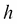
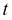
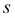
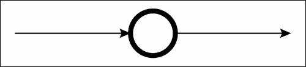
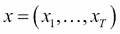
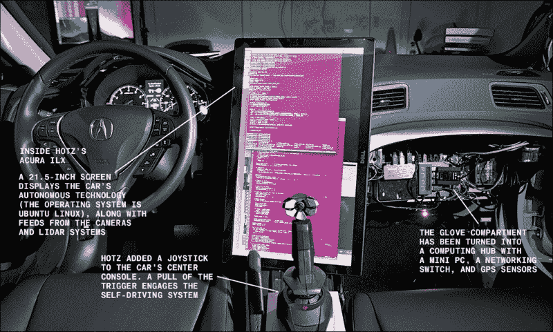

# 第六章：实践应用的方法——递归神经网络及其他

在前几章中，你已经学到了很多关于深度学习的知识。现在你应该已经理解了深度神经网络的概念、理论和实现的基础知识。你还学到，通过利用深度学习库，你可以相对容易地在各种数据上进行深度学习算法的实验。接下来的步骤是探讨深度学习如何应用于广泛的其他领域，以及如何将其用于实际应用。

因此，在本章中，我们将首先看看深度学习是如何实际应用的。在这里，你会看到，深度学习实际应用的案例仍然非常少。但为什么尽管这是如此创新的方法，应用案例却不多呢？问题出在哪里？稍后，我们将深入思考原因。接下来，我们还将讨论我们可以将深度学习应用到哪些领域，并探讨人工智能相关的所有领域中哪些可以应用深度学习。

本章涵盖的主题包括：

+   图像识别、自然语言处理以及与它们相关的神经网络模型和算法

+   将深度学习模型转化为实际应用的困难

+   深度学习可以应用的可能领域，以及如何接近这些领域的思路

我们将探索这个巨大人工智能浪潮的潜力，这将为你在研究、商业和各种活动中使用深度学习提供思路和启示。

# 深度学习活跃的领域

我们经常听到深度学习的研究一直在进行，这确实是事实。许多公司，特别是像谷歌、Facebook、微软和 IBM 这样的科技巨头，都在深度学习的研究上投入了巨额资金，我们也时常听到有公司收购了这些研究团队。然而，当我们深入了解时，会发现深度学习本身有各种类型的算法，以及这些算法可以应用的领域。即便如此，深度学习在哪些领域已经被应用或可以被应用，仍然是一个不为大众所熟知的事实。由于“人工智能”这个词被广泛使用，人们无法准确理解哪些技术用于哪些产品。因此，在本节中，我们将探讨人们在实际应用中积极尝试采用深度学习的领域。

## 图像识别

深度学习最常应用的领域是图像识别。正是 Hinton 教授及其团队的发明提出了“深度学习”这一术语。他们的算法在一次图像识别竞赛中创下了历史最低的错误率。为改进算法所做的持续研究带来了更好的成果。如今，利用深度学习的图像识别技术已经逐渐被广泛应用于研究和实际产品中。例如，Google 利用深度学习自动生成 YouTube 的缩略图，或在 Google Photos 中自动标记和搜索照片。像这些流行的产品一样，深度学习主要应用于图像标记或分类。例如，在机器人领域，深度学习被用来帮助机器人识别周围的物体。

我们能够支持这些产品和这个行业的原因在于，深度学习更适合图像处理，这也正是它能够实现比其他领域应用更高精度的原因。只有图像识别的精度和召回率如此之高，才能说明这个行业具有广阔的潜力。使用深度学习算法进行 MNIST 图像分类的错误率为 0.21%（[`cs.nyu.edu/~wanli/dropc/`](http://cs.nyu.edu/~wanli/dropc/)），这一比率已经接近人类的记录（[`arxiv.org/pdf/0710.2231v1.pdf`](http://arxiv.org/pdf/0710.2231v1.pdf)）。换句话说，如果我们仅仅讨论图像识别领域，那么它不过是机器可能超越人类的事实。那么，为什么只有图像识别能取得如此高的精度，而其他领域的技术方法还需要大量改进呢？

其中一个原因是深度学习中特征提取的结构非常适合处理图像数据。在深度神经网络中，许多层次是逐层堆叠的，每一层都从训练数据中提取特征。此外，图像数据本身也可以看作是一个分层结构。当你查看图像时，你会不自觉地首先捕捉到简洁的特征，然后再深入观察更详细的特征。因此，深度学习特征提取的固有特性与我们感知图像的方式非常相似，从而使我们能够准确地识别图像的特征。尽管基于深度学习的图像识别仍然需要进一步改进，特别是在机器如何理解图像及其内容方面，但仅仅通过采用深度学习对图像数据进行采样而不进行预处理，能够获得高精度，这显然表明深度学习与图像数据是非常匹配的。

另一个原因是人们一直在缓慢但稳定地改进算法。例如，在深度学习算法中，卷积神经网络（CNN）在图像识别中能够获得最佳精度，并且每次遇到困难或任务时都会有所改进。卷积层中的局部感受野被替代为卷积核，以避免网络变得过于密集。此外，为了避免网络对图像位置差距过度反应，还发明了如最大池化（max-pooling）等下采样方法。这些方法最初是通过对如何识别在某个框架中书写的手写字母（如邮政编码）进行试验和错误的过程产生的。因此，许多新的方法被寻求来使神经网络算法适应实际应用。像卷积神经网络（CNN）这样复杂的模型，也是基于这些积累而来且稳定的改进。虽然深度学习不需要特征工程，但我们仍需考虑解决特定问题的合适方法，也就是说，我们无法构建全能的模型，这就是优化领域的**无免费午餐定理**（**NFLT**）。

在图像识别领域，深度学习能够达到的分类精度极高，实际上，它已经开始用于实际应用。然而，仍然有许多领域可以应用深度学习。图像与许多行业密切相关。未来，将会有更多的应用案例和更多行业将深度学习加以利用。在本书的接下来的章节中，让我们思考如何将图像识别应用于哪些行业。

## 自然语言处理

在图像识别之后，深度学习研究进展最为显著的领域是**自然语言处理**（**NLP**）。该领域的研究有可能成为未来最活跃的研究方向。关于图像识别，深度学习所能达到的预测精度几乎已经接近极限，因为它能够执行比人类更好的分类。另一方面，虽然深度学习大大提升了模型的性能，但在自然语言处理领域，依然有许多任务需要解决。

对于某些产品和实际应用，深度学习已经得到了应用。例如，基于深度学习的自然语言处理（NLP）被应用于谷歌的语音搜索、语音识别和谷歌翻译。此外，IBM Watson 是一个认知计算系统，它能够理解和学习自然语言，并支持人类决策。它能够从大量文档中提取关键词和实体，并具有标注文档的功能。这些功能作为 Watson API 向公众开放，任何人都可以在不受限制的情况下利用它。

正如从前面的示例中可以看到的，NLP 本身有广泛且多样的类型。在基本技术方面，我们有句子内容分类、单词分类和单词意义的指定。此外，像中文或日文这类不在单词之间留空格的语言需要形态学分析，这也是 NLP 中的另一项技术。

NLP 涉及许多需要研究的内容，因此它需要明确其目标是什么，问题是什么，以及如何解决这些问题。使用哪种模型最好，如何有效地获得高精度，是应该谨慎探讨的话题。至于图像识别，CNN 方法是通过解决面临的任务而发明的。现在，让我们考虑在神经网络和 NLP 的应用中分别可以想到什么方法，以及可能遇到的困难。理解过去的试验和错误过程对未来的研究和应用将非常有帮助。

### 用于 NLP 的前馈神经网络

NLP 的基本问题是“给定一个或多个特定的单词，预测下一个单词”。然而，这个问题过于简单；如果你试图用神经网络来解决它，你很快会面临几个困难，因为作为 NLP 样本数据的文档或句子具有以下特征：

+   每个句子的长度不固定而是可变的，单词的数量非常庞大

+   可能会遇到一些不可预见的问题，比如拼写错误、缩写等

+   句子是顺序数据，因此包含时间信息

为什么这些特征会造成问题呢？记住一般神经网络的模型结构。对于神经网络的训练和测试，每一层的神经元数量（包括输入层）需要预先固定，并且所有样本数据的网络大小需要一致。与此同时，输入数据的长度并不固定，可能会有很大变化。这意味着样本数据不能直接应用于模型，至少不能原样应用。没有对这些数据进行添加/修改，神经网络无法进行分类或生成。

我们必须固定输入数据的长度，其中一种处理方法是将句子从头开始按顺序分成若干个固定长度的词块。这种方法称为**N-gram**。这里，*N*表示每个项的大小，大小为 1 的**N-gram**叫做**unigram**，大小为 2 的是**bigram**，大小为 3 的是**trigram**。当大小更大时，通常会根据*N*的值来命名，比如*four-gram*、*five-gram*，依此类推。

让我们看看 N-gram 是如何在 NLP 中工作的。这里的目标是计算在给定一些历史信息的情况下，某个单词的概率 ，这些历史信息包括 ;。我们将一串  单词表示为 。然后，我们想要计算的概率是 ，通过应用概率链式法则，我们可以得到：

起初看起来这些条件概率可能对我们有帮助，但实际上并没有，因为我们没有办法计算一个单词在一长串前置单词之后的精确概率，。由于句子的结构非常灵活，我们不能简单地利用样本文档和语料库来估计这个概率。这就是 N-gram 的作用所在。实际上，我们有两种方法来解决这个问题：原始的 N-gram 模型和基于 N-gram 的神经网络模型。在深入研究神经网络之前，我们将先了解第一个模型，全面理解 NLP 领域的发展。

使用 N-gram 时，我们不是计算一个单词在其完整历史下的概率，而是通过最后的*N*个单词来近似历史。例如，二元模型仅通过前一个单词的条件概率来近似一个单词的概率，，从而得到如下方程：

类似地，我们可以将 N-gram 的方程进行推广和扩展。在这种情况下，单词的概率可以表示如下：

我们得到如下方程：

请记住，这些基于 N-gram 的近似值是基于一种叫做**马尔可夫模型**的概率模型，在这种模型中，一个单词的概率仅依赖于前一个单词。

现在我们需要做的是估计这些 N-gram 的概率，那么我们该如何估计它们呢？一种简单的方式叫做**最大似然估计**（**MLE**）。这种方法通过从语料库中获取词频并进行归一化来估计概率。所以，当我们以二元组为例时，我们可以得到：

在上述公式中，  表示一个单词或单词序列的计数。由于分母，即以某个单词开头的所有二元组计数之和，  等于该单词的单元语法计数 ，因此前面的方程可以描述如下：

因此，我们也可以将最大似然估计（MLE）推广到 N-gram。

尽管这是 NLP 中基于 N-gram 的基本方法，但我们现在知道如何计算 N-gram 的概率。

与这种方法不同，神经网络模型预测在给定特定历史的条件下，单词  的条件概率， ； 。一种 NLP 模型被称为**神经网络语言模型** (**NLMM**)，([`www.jmlr.org/papers/volume3/bengio03a/bengio03a.pdf`](http://www.jmlr.org/papers/volume3/bengio03a/bengio03a.pdf))，其可以表示为如下：

这里， 是词汇表的大小，词汇表中的每个单词都是一个 N 维向量，其中只有该单词的索引设置为 1，其它索引都为 0。这种表示方法叫做 *1-of-N 编码*。NLMM 的输入是前一个单词的索引，即  和 （因此它们是 *n-gram*）。由于大小 *N* 通常在 5,000 到 200,000 之间，NLMM 的输入向量非常稀疏。然后，每个单词被映射到投影层，进行连续空间表示。这个从离散空间到连续空间的线性投影（激活）基本上是一个查找表，包含  项，其中  表示特征维度。投影矩阵对于上下文中不同的单词位置是共享的，并激活单词向量到投影层单位 ，其维度为 。投影之后是隐藏层。由于投影层位于连续空间中，模型结构从此处起与其他神经网络相同。因此，激活可以表示为如下形式：

在这里， 表示激活函数， 表示投影层和隐藏层之间的权重， 表示隐藏层的偏置。因此，我们可以得到如下的输出单元：

在这里， 表示隐藏层和输出层之间的权重， 表示输出层的偏置。给定特定历史信息的词语 *i* 的概率  可以通过 softmax 函数计算得出：

正如你所看到的，在 NNLM 中，模型同时预测所有词汇的概率。由于该模型现在使用标准神经网络描述，我们可以使用标准的反向传播算法来训练模型。

NNLM 是一种使用神经网络和 N-gram 的 NLP 方法。虽然 NNLM 解决了如何固定输入数量的问题，但最佳的 *N* 只能通过反复试验找到，这是整个模型构建过程中最困难的部分。此外，我们必须确保不要过多依赖输入的时间序列信息。

### 深度学习用于 NLP

带有 N-gram 的神经网络在某些情况下可能有效，但也存在一些问题，例如，哪些 n-grams 会返回最佳结果，以及 n-grams（即模型的输入）是否仍然具有上下文？这些问题不仅存在于 NLP 中，也存在于所有具有时间序列数据的领域，如降水、股票价格、每年土豆的产量、电影等。由于在现实世界中我们有大量这样的数据，因此不能忽视潜在的问题。那么，如何才能让神经网络在时间序列数据上进行训练呢？

#### 循环神经网络

一种能够在网络中保留数据上下文的神经网络模型是 **循环神经网络** (**RNN**)，这一模型积极研究深度学习算法的演变。以下是一个非常简单的 RNN 图形模型：

标准神经网络与 RNN 的区别在于，RNN 在时间上存在隐藏层之间的连接。时间点的输入会在时间点的隐藏层中激活，并被保留在该隐藏层中，随后与时间点的输入一起传播到时间点的隐藏层中。这使得网络能够包含过去数据的状态并反映它们。你可能会认为 RNN 是一个动态模型，但如果你在每个时间步展开该模型，你会看到 RNN 其实是一个静态模型：

由于每个时间步的模型结构与一般神经网络相同，因此你可以使用反向传播算法训练该模型。然而，在训练时需要考虑时间相关性，且有一种称为**时间反向传播**（**BPTT**）的技术来处理这一点。在 BPTT 中，参数的误差和梯度会被反向传播到过去的各层：

因此，RNN 能够在模型中保留上下文。理论上，网络在每个时间步应该考虑到直到该时刻为止的整个序列，但实际上，通常会对模型应用具有一定长度的时间窗口，以简化计算或避免消失梯度问题和梯度爆炸问题。BPTT 使得层间的训练成为可能，这也是为什么 RNN 常被认为是深度神经网络之一的原因。我们还有像堆叠 RNN 这样的深度 RNN 算法，其中隐藏层是堆叠的。

RNN 已被应用于自然语言处理（NLP），实际上是该领域最成功的模型之一。最初优化用于 NLP 的模型被称为**递归神经网络语言模型**（**RNNLM**），由 Mikolov 等人提出（[`www.fit.vutbr.cz/research/groups/speech/publi/2010/mikolov_interspeech2010_IS100722.pdf`](http://www.fit.vutbr.cz/research/groups/speech/publi/2010/mikolov_interspeech2010_IS100722.pdf)）。该模型的架构可以如下所示：

该网络有三层：输入层、隐藏层和输出层。隐藏层也常被称为上下文层或状态层。每一层相对于时间点的值可以表示如下：

这里， 表示 sigmoid 函数， 表示 softmax 函数。由于输入层包含了在时间  的状态层，它能够将整个上下文传递给网络。模型架构表明，RNNLM 能够查找比前馈 NNLM 更广泛的上下文，在后者中，上下文的长度被限制为 *N*（-gram）。

在训练 RNN 时，应该考虑整个时间和上下文，但如前所述，我们通常会截断时间长度，因为 BPTT 需要大量计算，并且在学习长期依赖时常常导致梯度消失/爆炸问题，因此该算法通常被称为**截断 BPTT**。如果我们按照时间展开 RNNLM，模型可以如下所示（在图中，展开的时间 ）：

这里  是输出的标签向量。然后，输出的误差向量可以表示如下：

我们得到以下方程：

这里  是展开的时间：

上面的图片是隐藏层激活函数的导数。由于我们在这里使用的是 sigmoid 函数，因此得到了前面的方程。然后，我们可以得到过去的误差，如下所示：

使用这些方程式，我们现在可以更新模型的权重矩阵：

这里， 是学习率。在 RNNLM 中有趣的是，矩阵中的每个向量显示了训练后单词之间的差异。这是因为  是将每个单词映射到潜在空间的矩阵，因此训练后，映射的单词向量包含了单词的含义。例如，“king” - “man” + “woman”的向量计算将返回“queen”。DL4J 支持 RNN，因此你可以轻松地使用该库实现这个模型。

#### 长短期记忆网络

使用标准的 RNN 进行训练需要截断的 BPTT。你可能会怀疑 BPTT 是否真的能够足够训练模型，以反映整个上下文，而这一点是非常真实的。这就是为什么引入了一种特殊的 RNN——**长短期记忆**（**LSTM**）网络来解决长期依赖问题。LSTM 看起来相当复杂，但让我们简要探讨一下 LSTM 的概念。

首先，我们必须考虑如何在网络中存储和传递过去的信息。虽然通过给连接设置上限可以简单地缓解梯度爆炸问题，但梯度消失问题仍需要深入考虑。一种可能的方法是引入一个单元，它永久地保存其输入和梯度的值。因此，当你查看标准神经网络中的隐藏层单元时，它可以简单地描述如下：

这里没有什么特别的。然后，通过向网络添加一个单元，网络现在可以在神经元中记住过去的信息。这里添加的神经元具有线性激活，并且其值通常设置为 1。这个神经元，或单元，被称为**常数误差旋转器**（**CEC**），因为误差在神经元中像旋转木马上循环，不会消失。CEC 作为存储单元，存储过去的输入。它解决了梯度消失问题，但也引发了另一个问题。由于所有传播过的数据都存储在神经元中，它可能也会存储噪声数据：

这个问题可以分解为两个问题：*输入权重冲突*和*输出权重冲突*。输入权重冲突的关键思想是，保持网络中的某些信息，直到它变得必要；只有当相关信息到来时，神经元才被激活，否则不激活。类似地，输出权重冲突可以出现在所有类型的神经网络中；神经元的值只有在必要时才传播，否则不传播。只要神经元之间的连接通过网络的权重来表示，我们就无法解决这些问题。因此，必须采用另一种表示方法或技术来控制输入和输出的传播。那么我们该如何做到这一点呢？答案是，在 CEC 前后放置像“门”一样的单元，分别称为**输入门**和**输出门**。门的图形模型可以描述如下：

理想情况下，门应返回与输入对应的离散值 0 或 1，门关闭时返回 0，打开时返回 1，因为它是一个门，但在编程上，门的值设置为 0 到 1 之间的值，以便能够通过反向传播（BPTT）进行良好的训练。

现在看起来我们可以在精确的时间点获取和存储精确的信息，但仍然存在一个问题。仅有两个门——输入门和输出门——存储在 CEC 中的记忆无法通过几个步骤轻松刷新。因此，我们需要一个额外的门，能够动态地改变 CEC 的值。为此，我们在架构中添加了一个**遗忘门**，用来控制何时应当抹去记忆。当门的值变为 0 或接近 0 时，CEC 中保存的值会被新记忆覆盖。通过这三个门，单元现在可以记住过去的信息或上下文，因此它被称为**LSTM 块**或**LSTM** **记忆块**，因为它更像一个块，而非单个神经元。以下是表示 LSTM 块的图示：

标准的 LSTM 结构已经在之前完全解释过了，但有一种技术可以提高它的性能，我们现在将对此进行解释。每个门都接收来自输入单元和 LSTM 中所有单元的输出的连接，但没有来自 CEC 的直接连接。这意味着我们无法看到网络的真实隐藏状态，因为一个块的输出依赖于输出门；只要输出门关闭，任何门都无法访问 CEC，而 CEC 也因此缺乏关键信息，这可能会降低 LSTM 的性能。一种简单但有效的解决方案是从 CEC 向块中的门添加连接。这些被称为**窥视孔连接**，它们作为标准的加权连接起作用，唯一的不同是，错误不会通过窥视孔连接从门传播回去。窥视孔连接允许所有的门在输出门关闭时仍能假设隐藏状态。现在你已经学到了很多术语，因此，整个连接的基本架构可以描述如下：

为了简化，图示中描述了单一的 LSTM 块。你可能会感到困惑，因为前面的模型非常复杂。然而，当你一步步地分析这个模型时，你会明白 LSTM 网络是如何解决 NLP 中的困难的。给定一个输入序列 ，每个网络单元可以按以下方式计算：

在前面的公式中，是从输入门到输入的权重矩阵，是从遗忘门到输入的权重矩阵，是从输出门到输入的权重矩阵。是从单元到输入的权重矩阵，是从单元到 LSTM 输出的权重矩阵，是从输出到 LSTM 输出的权重矩阵。，，和是用于窥视孔连接的对角权重矩阵。项表示偏置向量，是输入门的偏置向量，是遗忘门的偏置向量，是输出门的偏置向量，是 CEC 单元的偏置向量，是输出偏置向量。这里，和是单元输入和单元输出的激活函数。表示 Sigmoid 函数，表示 Softmax 函数。是向量的逐元素乘积。

本书中我们不会继续跟随进一步的数学公式，因为通过应用 BPTT 它们会变得非常复杂，但你可以尝试使用 DL4J 实现 LSTM 和 RNN。由于 CNN 是在图像识别领域中发展起来的，RNN 和 LSTM 则是为了逐步解决 NLP 中的问题而发展起来的。尽管这两种算法只是使用 NLP 获取更好性能的一种方法，且仍需要改进，但既然我们是使用语言进行交流的生物，NLP 的发展必然会带来技术创新。关于 LSTM 的应用，你可以参考*Sequence to Sequence Learning with Neural Networks*（Sutskever 等，[`arxiv.org/pdf/1409.3215v3.pdf`](http://arxiv.org/pdf/1409.3215v3.pdf)），而对于更近期的算法，你可以参考*Grid Long Short-Term Memory*（Kalchbrenner 等，[`arxiv.org/pdf/1507.01526v1.pdf`](http://arxiv.org/pdf/1507.01526v1.pdf)）以及*Show, Attend and Tell: Neural Image Caption Generation with Visual Attention*（Xu 等，[`arxiv.org/pdf/1502.03044v2.pdf`](http://arxiv.org/pdf/1502.03044v2.pdf)）。

# 深度学习的困难

深度学习在图像识别领域已经达到了比人类更高的精度，并且已应用于许多实际应用中。同样，在自然语言处理（NLP）领域，也进行了很多模型的研究。那么，深度学习在其他领域的应用情况如何呢？令人惊讶的是，深度学习在许多领域中仍未被成功应用。这是因为深度学习与过去的算法相比确实具有创新性，并且无疑让我们在实现人工智能的道路上迈出了重要一步；然而，当它用于实际应用时，也会遇到一些问题。

第一个问题是深度学习算法中有过多的模型参数。当你学习算法的理论和实现时，我们并未详细讨论，但实际上，深度神经网络相较于过去的神经网络或其他机器学习算法，拥有许多需要决定的超参数。这意味着我们必须经历更多的试验与错误才能获得高精度。定义神经网络结构的参数组合，如隐藏层的数量或每个隐藏层的单位数，需要大量实验。此外，像学习率等训练和测试配置的参数也需要确定。还有，每个算法特有的参数，如 SDA 中的腐蚀水平和 CNN 中的卷积核大小，也需要额外的试错。因此，深度学习提供的卓越性能是通过持续的参数调优来支撑的。然而，人们往往只关注深度学习的一面——它可以获得极高的精度——而忽视了达到这一点所需的艰苦过程。深度学习不是魔法。

此外，深度学习在训练和分类简单问题的数据时常常失败。深度神经网络的结构非常深且复杂，以至于权重无法得到良好的优化。在优化方面，数据量也是至关重要的。这意味着深度神经网络在每次训练时需要大量的时间。总而言之，深度学习的价值体现在以下几点：

+   它解决了当人们不知道应该如何对特征进行分类时的复杂且困难的问题

+   有足够的训练数据来适当地优化深度神经网络

与那些通过不断更新数据来持续更新模型的应用相比，一旦使用一个大规模且变化不大的数据集构建了模型，适用于深度学习的应用通常会较为合适。

因此，当你观察业务领域时，你会发现存在更多的情况是，现有的机器学习比使用深度学习能够获得更好的结果。例如，假设我们希望在电商中向用户推荐合适的产品。在这个电商平台中，许多用户每天都会购买大量商品，因此购买数据会每日大量更新。在这种情况下，你是否会使用深度学习来利用这些数据获得高精度的分类和推荐，以提高用户购买的转化率？可能不会，因为使用现有的机器学习算法，如朴素贝叶斯、协同过滤、支持向量机（SVM）等，我们可以从实际角度获得足够的精度，并且可以更快速地更新模型和进行计算，这通常是更受欢迎的。这也是深度学习在商业领域应用较少的原因。当然，在任何领域中，获得更高的精度是更好的，但实际上，高精度和所需的计算时间存在权衡关系。虽然深度学习在研究领域具有重要意义，但考虑到实际应用，它仍然面临许多障碍。

此外，深度学习算法并不完美，仍然需要在其模型本身上进行很多改进。例如，如前所述，RNN 只能满足如何将过去的信息反映到网络中或如何获得精准度，尽管它通过像 LSTM 这样的技术加以改善。而且，深度学习距离真正的人工智能还很远，尽管与过去的算法相比，它无疑是一项伟大的技术。虽然算法的研究在积极推进，但与此同时，我们还需要一个突破，才能将深度学习推广并渗透到更广泛的社会中。也许这不仅仅是模型的问题。深度学习之所以突然爆发，是因为它得到了硬件和软件领域巨大发展的支撑。深度学习与周边技术的发展密切相关。

如前所述，在深度学习能够更实际地应用于现实世界之前，仍然有许多障碍需要克服，但这并非不可能实现。我们无法突然发明出能够实现技术奇点的人工智能，但有些领域和方法可以立刻应用深度学习。在接下来的章节中，我们将思考深度学习可以在哪些行业中得到应用。希望这能为你的业务或研究领域播下新的想法种子。

# 最大化深度学习可能性和能力的方法

我们可以通过几种方法将深度学习应用到不同的行业。虽然根据任务或目的的不同，方法可能有所不同，但我们可以将这些方法简要地分为以下三种：

+   **面向领域的方法**：利用已经经过充分研究的深度学习算法或模型，这些算法或模型能够带来出色的性能

+   **基于问题拆解的方法**：这将深度学习显然可以应用的待解决问题替换为一个不同的问题，在这个问题上深度学习能够得到很好的应用。

+   **基于结果导向的方法**：这探讨了如何通过深度学习表达输出的新方式。

这些方法将在以下小节中详细解释。每种方法都根据其适用的行业或领域进行划分，并指出哪些地方不适用，但它们中的任何一种都可能为你的未来活动提供重要的启示。目前，深度学习的应用案例仍然很少，且对其应用领域存在偏见，但这也意味着应该有很多机会去创造创新和新事物。最近，利用深度学习的初创公司逐渐涌现，其中一些已经取得了一定程度的成功。根据你的想法，你可以对世界产生重大影响。

## 基于领域导向的方法

这种方法不需要新的技术或算法。显然有一些领域非常适合当前的深度学习技术，这里提出的概念是深入挖掘这些领域。如前所述，经过实际研究和开发的深度学习算法主要集中在图像识别和自然语言处理（NLP）上，我们将探索一些与它们能很好融合的领域。

### 医学

医学领域应该通过深度学习进行发展。肿瘤或癌症在扫描图像中被检测出来。这无非是能够利用深度学习的一个最强大的功能——图像识别技术。利用深度学习帮助早期发现疾病并识别疾病种类，能够显著提高精确度。由于卷积神经网络（CNN）可以应用于 3D 图像，因此 3D 扫描图像应该可以相对容易地进行分析。通过在当前医学领域更广泛地采用深度学习，深度学习应能带来巨大的贡献。

我们也可以说，深度学习在未来可以对医学领域产生显著的帮助。医学领域一直受到严格的监管；然而，某些国家正在推动放宽监管，可能是因为信息技术的近期发展及其潜力。因此，医学领域和信息技术的结合将带来商业机会，产生协同效应。例如，如果远程医疗更为普及，诊断或疾病识别可能不仅仅依靠扫描图像，还可以依靠实时显示的图像。另外，如果电子病历变得普及，利用深度学习分析医学数据将变得更加容易。这是因为医学记录本身就是一个文本和图像的数据集，非常适合深度学习。通过这种方式，未知疾病的症状也可以被发现。

### 汽车

我们可以说，行驶中的汽车周围的环境是由图像序列和文字组成的。其他汽车和景观是图像，道路标志则是文字。这意味着我们也可以在这里运用深度学习技术，并且通过改进驾驶辅助功能，降低事故风险。可以说，驾驶辅助的终极形式是自动驾驶汽车，目前这一领域主要由谷歌和特斯拉在攻克。一个既著名又引人入胜的例子是，乔治·霍茨（George Hotz），iPhone 的首位黑客，曾在自己的车库里打造了一辆自动驾驶汽车。该车的外观被《彭博商业周刊》的一篇文章介绍过（[`www.bloomberg.com/features/2015-george-hotz-self-driving-car/`](http://www.bloomberg.com/features/2015-george-hotz-self-driving-car/)），文章中还附有以下图片：

自动驾驶汽车已经在美国进行了测试，但由于其他国家的交通规则和道路条件不同，这一想法需要进一步研究和开发，才能在全球范围内普及使用。该领域成功的关键在于学习和识别周围的汽车、行人、景象和交通标志，并准确判断如何处理它们。

与此同时，我们不必仅仅集中在利用深度学习技术应用于汽车的实际车身上。假设我们可以开发一个智能手机应用程序，具备我们刚刚描述的相同功能，即识别和分类周围的图像和文字。那么，如果你把智能手机放置在车里，就可以将其用作车载导航应用程序。此外，例如，它还可以作为盲人导航应用程序，为他们提供准确可靠的方向指引。

### 广告技术

广告（ad）技术可以通过深度学习扩展其覆盖范围。当我们说广告技术时，目前指的是优化广告横幅或展示产品的推荐系统或广告网络。另一方面，当我们说广告时，不仅仅指横幅或广告网络。根据媒体类型，世界上有各种各样的广告，如电视广告、广播广告、报纸广告、海报、传单等等。我们也有数字广告活动，如 YouTube、Vine、Facebook、Twitter、Snapchat 等等。广告本身已经改变了其定义和内容，但所有广告有一个共同点：它们由图像和/或语言组成。这意味着它们是深度学习擅长的领域。直到现在，我们只能通过基于用户行为的指标，如**页面浏览量** (**PV**)、**点击率** (**CTR**) 和 **转化率** (**CVR**) 来估计广告的效果，但如果我们应用深度学习技术，未来可能能够分析广告的实际内容并自动生成广告。特别是由于电影和视频只能通过图像识别和自然语言处理进行分析，视频识别将逐渐成为广告技术之外的重要发展方向。

### 职业或实践

医生、律师、专利律师和会计师等职业被认为是深度学习可以取代的岗位。例如，如果自然语言处理（NLP）的精确度和准确性提高，任何需要专业知识的审查工作都可以交给机器处理。由于机器可以承担这些耗时的阅读任务，人们可以更多地专注于高价值的工作。此外，如果机器能够对过去的司法案件或医疗病例进行分类，识别哪些疾病引起了哪些症状等，我们就可以建立像苹果的 Siri 这样的应用程序，回答那些通常需要专业知识的问题。那么，当医生或律师因忙碌无法及时提供帮助时，机器也能够在一定程度上处理这些专业案件。

人们常说人工智能会取代人类的工作，但我个人认为这不准确。实际上，机器取代的是那些琐碎的工作，这些本应由人类完成。一个从事 AI 编程的软件工程师可以被视为拥有专业工作，但这种工作在未来也会发生变化。例如，想象一下与汽车相关的工作，目前的工作是制造标准化汽车，但未来，工程师将像一级方程式赛车的 pit crew 一样工作。

### 体育

深度学习无疑也能为体育领域作出贡献。在被称为运动科学的研究领域中，分析和研究体育数据变得越来越重要。例如，你可能知道《点球成金》这本书或电影。在这部电影中，通过在棒球中采用回归模型，他们大大提高了球队的胜率。观看体育赛事本身非常激动人心，但另一方面，体育也可以看作是一段图像序列和数字数据。由于深度学习擅长识别人类无法发现的特征，因此，找出为什么某些球员得分高而其他球员得分低将变得更加容易。

我们提到的这些领域只是深度学习能够显著推动发展的众多领域中的一小部分。我们从一个领域是否有图像或文本的角度进行了探讨，但当然，深度学习对于简单的数字数据分析也应当展现出强大的性能。深度学习应该能够应用到许多其他领域，如生物信息学、金融、农业、化学、天文学、经济学等。

## 以问题为导向的方法

这种方法可能与传统机器学习算法中采用的方法相似。我们已经讨论过特征工程是提高机器学习精度的关键。现在我们可以说，特征工程可以分为以下两部分：

+   在机器学习模型的约束下进行工程设计。典型的例子是将输入数据设为离散型或连续型。

+   通过机器学习提高精度的特征工程。这通常依赖于研究人员的直觉。

在狭义上，特征工程被认为是第二部分，而这正是深度学习不需要关注的部分；而第一部分无疑是重要的，甚至对于深度学习也是如此。例如，使用深度学习预测股价是困难的。股价波动大且难以定义输入数据。此外，如何应用输出值也是一个难题。让深度学习处理这些输入和输出也被认为是广义上的特征工程。如果没有对原始数据和/或你希望预测的数据进行限制，将这些数据集插入到机器学习和深度学习算法中（包括神经网络）是困难的。

然而，我们可以采取某种方法，通过分解输入和/或输出来应用模型于这些先前的问题。就像之前在 NLP 中解释的那样，你可能曾想过，首先将无数的单词转换为特征是不可能的，但正如你所知道的，我们可以通过用稀疏向量表示单词，并将 N-grams 组合起来，来训练前馈神经网络。当然，我们不仅可以使用神经网络，还可以使用其他机器学习算法，如支持向量机（SVM）。因此，我们可以在深度学习尚未应用的领域，通过工程方法将特征与深度学习模型很好地契合，从而开辟一个新领域。与此同时，当我们聚焦于 NLP 时，我们可以看到，RNN 和 LSTM 的开发是为了正确解决 NLP 中遇到的困难或任务。这可以被看作是与特征工程相对的做法，因为在这种情况下，问题是通过分解模型来适配特征解决的。

那么，如何利用工程方法进行股价预测呢？其实，考虑输入，也就是特征，并不难。举个例子，如果你每天预测股价，使用每日股价作为特征会很难计算，但如果你使用当天与前一天之间的价格变化率，那么处理起来会更容易，因为股价保持在一定范围内，梯度也不容易爆炸。与此同时，困难的地方在于如何处理输出。股价当然是连续的数值，因此输出可能是各种值。这意味着，在神经网络模型中，输出层的单元数是固定的，它们无法处理这个问题。那么我们该怎么办呢——应该放弃吗？！不，稍等一下。很遗憾，我们无法预测股价本身，但有一种替代的预测方法。

在这里，问题在于我们可以将股价预测分类为无限多种模式。那么，我们能否将它们转换为有限模式呢？是的，我们可以。让我们强行把它们转化一下。考虑一个最极端但容易理解的案例：利用截至今天的股价数据预测明天的股价，严格来说是收盘价，是上涨还是下跌。对于这个案例，我们可以用一个深度学习模型来表示，具体如下：

在前面的图片中， 表示某一天的开盘价，； 表示收盘价， 是最高价， 是实际价格。这里使用的特征仅为示例，实际应用时需要进行调整。关键在于，用这种问题替代原始任务，可以使深度神经网络理论上进行数据分类。此外，如果按照上涨或下跌的幅度来分类数据，您可以做出更精细的预测。例如，您可以按以下表格所示对数据进行分类：

| 类别 | 描述 |
| --- | --- |
| 类别 1 | 比收盘价上涨超过 3 百分比 |
| 类别 2 | 比收盘价上涨 1~3 百分比 |
| 类别 3 | 比收盘价上涨 0~1 百分比 |
| 类别 4 | 比收盘价下跌 0~-1 百分比 |
| 类别 5 | 比收盘价下跌 1~-3 百分比 |
| 类别 6 | 比收盘价下跌超过 -3 百分比 |

无论预测是否真正有效，换句话说，分类是否有效，都无法在事前确定，直到我们进行验证。不过，通过将输出分为多个类别，股票价格的波动可以在相当窄的范围内进行预测。一旦我们能够将任务应用于神经网络，那么接下来我们需要做的就是检查哪个模型得到更好的结果。在这个示例中，由于股价是时间序列数据，我们可以应用 RNN。如果我们将股价图表视为图像数据，我们也可以使用 CNN 来预测未来的股价。

所以，现在我们已经参考示例思考了方法，但总结起来，我们可以说：

+   **模型特征工程**：这意味着设计输入或调整值，以适应深度学习模型，或通过设置输出限制来实现分类。

+   **特征模型工程**：这意味着设计新的神经网络模型或算法，以解决某一特定领域的问题。

第一个方法需要设计输入和输出，以便适应模型，而第二个方法则需要采用数学方法。如果您意识到让项目的预测有所限制，那么特征工程可能会更容易启动。

## 面向输出的方法

前面提到的两种方法，旨在通过深度学习提高特定领域任务或问题的正确答案比例。当然，这对于深度学习而言是至关重要的部分，也是其价值体现的地方；然而，将精度提高到最终极限，可能并不是利用深度学习的唯一方法。另一种方法是通过稍微改变视角，利用深度学习来设计输出。让我们来看看这意味着什么。

深度学习被 AI 研究人员和技术专家称为一种创新的方法，但大众仍然不了解它的伟大。相反，他们更关注机器做不到的事情。例如，人们并不关注使用 CNN 进行图像识别的 MNIST，它的错误率比人类还低，但却批评机器无法完美识别图像。这可能是因为人们一提到 AI，就会对其产生很高的期待，想象它的能力。我们可能需要改变这种心态。让我们考虑一下 DORAEMON，这个在日本非常著名、全球也家喻户晓的漫画人物——一只拥有高智能和 AI 的机器人，但常常犯傻。我们会批评他吗？不会，我们只是笑一笑，或者当作笑话来看，并不会太认真。再想想电影《钢铁侠》中的 DUMMY / DUM-E，这个机器人手臂也有 AI，但同样会犯傻错误。看看，它们会犯错，但我们仍然喜欢它们。

通过这种方式，可能更好地强调机器会犯错这一点。改变用户界面中的表达部分，可能会成为人们采用人工智能的触发点，而不仅仅是最先研究某个算法。谁知道呢？从创造性领域的角度思考，可能更容易引起世界的兴趣，而不是从精确度的角度。谷歌的 Deep Dream 就是一个很好的例子。当艺术或设计与深度学习合作时，我们可以做更多令人兴奋的事情。

# 总结

在这一章中，你学会了如何利用深度学习算法进行实际应用。已经得到广泛研究的领域包括图像识别和自然语言处理（NLP）。在学习 NLP 领域时，我们研究了两种新的深度学习模型：RNN 和 LSTM 网络，这些网络可以通过时间序列数据进行训练。这些模型使用的训练算法是 BPTT。你还学到了三种最大化深度学习能力的方法：面向领域的方法、面向细分的方法和面向输出的方法。每种方法有不同的角度，都可以最大化深度学习的可能性。

而且……恭喜你！你刚刚完成了使用 Java 进行深度学习的学习部分。虽然这本书中仍有一些模型尚未提及，但你可以确信，掌握和使用它们不会有问题。下一章将介绍一些用其他编程语言实现的库，所以放轻松，看看就好。
