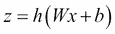
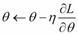
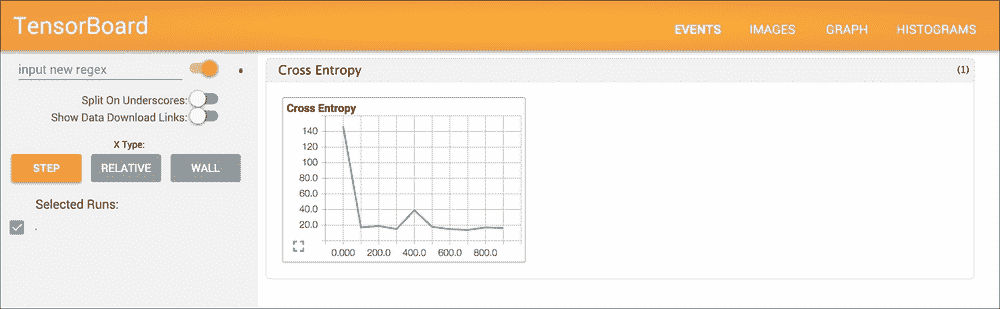
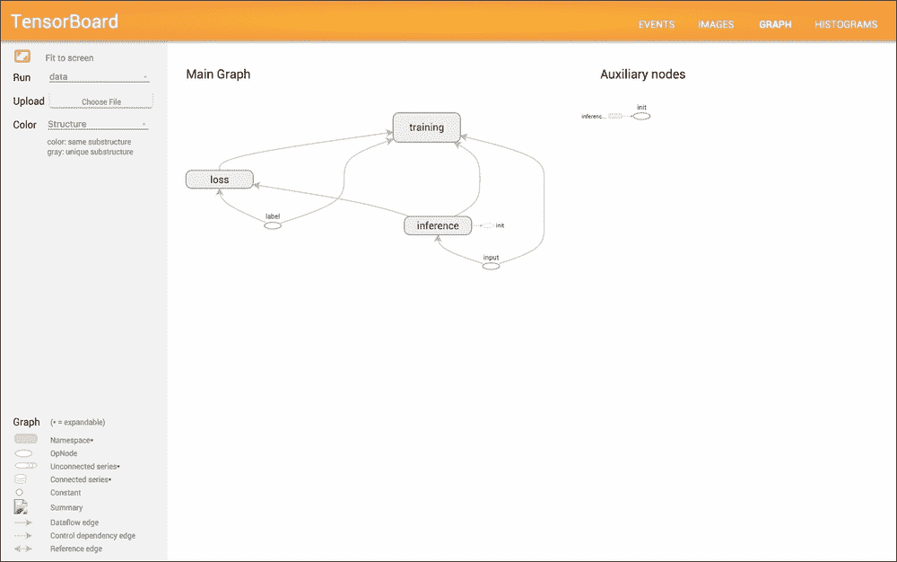
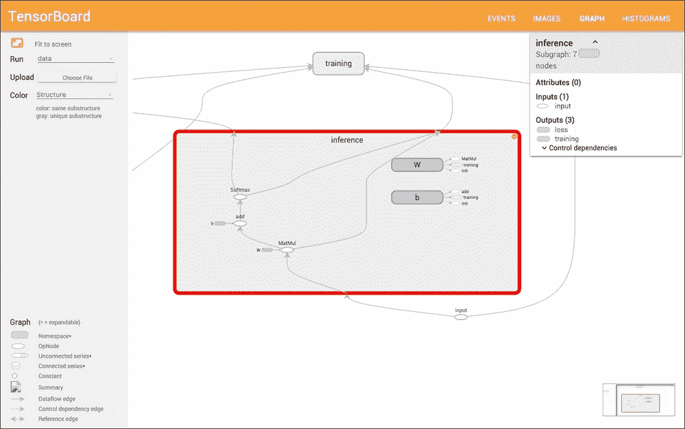

# 第七章：其他重要的深度学习库

在这一章，我们将讨论其他深度学习库，特别是使用非 Java 编程语言的库。以下是一些最著名、最成熟的库：

+   Theano

+   TensorFlow

+   Caffe

你将简要了解每个库。由于我们将在这里主要使用 Python 来实现它们，如果你不是 Python 开发者，可以跳过本章。本章介绍的所有库都支持 GPU 实现，并具有其他特殊功能，所以让我们深入了解它们。

# Theano

Theano 是为深度学习开发的，但它实际上不是一个深度学习库；它是一个用于科学计算的 Python 库。文档可在[`deeplearning.net/software/theano/`](http://deeplearning.net/software/theano/)找到。页面上介绍了几个特性，如 GPU 的使用，但最显著的特点是 Theano 支持**计算微分**或**自动微分**，而 Java 科学计算库 ND4J 不支持这一功能。这意味着，使用 Theano 时，我们无需自己计算模型参数的梯度，Theano 会自动完成这项工作。由于 Theano 处理了算法中最复杂的部分，数学表达式的实现变得不那么困难。

让我们看看 Theano 如何计算梯度。首先，我们需要在机器上安装 Theano。安装可以通过`pip install Theano`或`easy_install Theano`命令完成。然后，以下是导入和使用 Theano 的代码：

```py
import theano
import theano.tensor as T

```

在 Theano 中，所有变量都作为张量进行处理。例如，我们有`scalar`、`vector`和`matrix`，`d`代表双精度，`l`代表长整型，等等。像`sin`、`cos`、`log`和`exp`这样的通用函数也在`theano.tensor`下定义。因此，如前所示，我们经常使用张量的别名`T`。

作为简要了解 Theano 实现的第一步，考虑非常简单的抛物线曲线。实现代码保存在`DLWJ/src/resources/theano/1_1_parabola_scalar.py`中，你可以参考它。首先，我们定义`x`如下：

```py
x = T.dscalar('x')

```

这个定义在 Python 中是独特的，因为`x`没有值，它只是一个符号。在这种情况下，`x`是类型为`d`（双精度）的`scalar`。然后我们可以非常直观地定义`y`及其梯度。实现如下：

```py
y = x ** 2
dy = T.grad(y, x)

```

所以，`dy`应该包含`2x`。让我们检查一下是否可以得到正确的答案。我们需要额外做的是将`math`函数注册到 Theano 中：

```py
f = theano.function([x], dy)

```

然后你可以轻松地计算梯度的值：

```py
print f(1)  # => 2.0
print f(2)  # => 4.0

```

非常简单！这就是 Theano 的强大之处。这里我们有一个`scalar`类型的`x`，但是你也可以通过简单地将`x`定义为以下形式，轻松实现向量（甚至矩阵）计算：

```py
x = T.dvector('x')
y = T.sum(x ** 2)

```

我们不会在这里深入探讨，但你可以在`DLWJ/src/resources/theano/1_2_parabola_vector.py`和`DLWJ/src/resources/theano/1_3_parabola_matrix.py`中找到完整的代码。

当我们考虑使用 Theano 实现深度学习算法时，可以在 GitHub 的*Deep Learning Tutorials*（[`github.com/lisa-lab/DeepLearningTutorials`](https://github.com/lisa-lab/DeepLearningTutorials)）找到一些非常好的示例。在本章中，我们将概述标准的 MLP 实现，让你更好地理解 Theano。作为快照，fork 后的仓库可以在[`github.com/yusugomori/DeepLearningTutorials`](https://github.com/yusugomori/DeepLearningTutorials)查看。首先，我们来看看`mlp.py`。隐藏层的模型参数是权重和偏置：

```py
W = theano.shared(value=W_values, name='W', borrow=True)
b = theano.shared(value=b_values, name='b', borrow=True)
```

两个参数都使用`theano.shared`定义，以便可以通过模型访问和更新。激活函数可以表示为如下：



这表示激活函数，即代码中的双曲正切函数。因此，相应的代码写成如下：

```py
lin_output = T.dot(input, self.W) + self.b
self.output = (
    lin_output if activation is None
    else activation(lin_output)
)
```

这里也支持线性激活。同样，输出层的参数`W`和`b`，即逻辑回归层，在`logistic_sgd.py`中定义并初始化：

```py
self.W = theano.shared(
    value=numpy.zeros(
        (n_in, n_out),
        dtype=theano.config.floatX
    ),
    name='W',
    borrow=True
)

self.b = theano.shared(
    value=numpy.zeros(
        (n_out,),
        dtype=theano.config.floatX
    ),
    name='b',
    borrow=True
)
```

多类别逻辑回归的激活函数是`softmax`函数，我们可以直接写出并定义输出，如下所示：

```py
self.p_y_given_x = T.nnet.softmax(T.dot(input, self.W) + self.b)
```

我们可以将预测值写为：

```py
self.y_pred = T.argmax(self.p_y_given_x, axis=1)
```

在训练方面，由于反向传播算法的方程是从损失函数及其梯度中计算得出的，我们需要做的就是定义要最小化的函数，即负对数似然函数：

```py
def negative_log_likelihood(self, y):
    return -T.mean(T.log(self.p_y_given_x)[T.arange(y.shape[0]), y])
```

在这里，我们计算的是均值，而不是和，用于评估整个小批量（mini-batch）。

有了这些前面的值和定义，我们可以实现 MLP。再次强调，我们需要做的就是定义 MLP 的方程和符号。以下是代码的提取：

```py
class MLP(object):
    def __init__(self, rng, input, n_in, n_hidden, n_out):
        # self.hiddenLayer = HiddenLayer(...)
        # self.logRegressionLayer = LogisticRegression(...)

        # L1 norm
        self.L1 = (
             abs(self.hiddenLayer.W).sum()
             + abs(self.logRegressionLayer.W).sum()
        )

        # square of L2 norm
        self.L2_sqr = (
           (self.hiddenLayer.W ** 2).sum()
            + (self.logRegressionLayer.W ** 2).sum()
        )

        # negative log likelihood of MLP
        self.negative_log_likelihood = (
           self.logRegressionLayer.negative_log_likelihood
        )

        # the parameters of the model
        self.params = self.hiddenLayer.params + self.logRegressionLayer.params
```

然后，你可以构建并训练模型。让我们来看一下`test_mlp()`中的代码。一旦加载数据集并构建 MLP，你可以通过定义代价函数来评估模型：

```py
cost = (
    classifier.negative_log_likelihood(y)
    + L1_reg * classifier.L1
    + L2_reg * classifier.L2_sqr
)
```

有了这个代价函数，我们只需一行代码就能获得模型参数的梯度：

```py
gparams = [T.grad(cost, param) for param in classifier.params]
```

以下是更新参数的公式：

```py
updates = [
    (param, param - learning_rate * gparam)
    for param, gparam in zip(classifier.params, gparams)
]
```

第一个括号中的代码遵循此公式：



然后，最后我们定义实际的训练函数：

```py
train_model = theano.function(
    inputs=[index],
    outputs=cost,
    updates=updates,
    givens={
        x: train_set_x[index * batch_size: (index + 1) * batch_size],
        y: train_set_y[index * batch_size: (index + 1) * batch_size]
    }
)
```

每个索引的输入和标签对应于*givens*中的`x`，`y`，因此当给定`index`时，参数会通过`updates`进行更新。因此，我们可以通过训练周期和小批量的迭代来训练模型：

```py
while (epoch < n_epochs) and (not done_looping):
    epoch = epoch + 1
        for minibatch_index in xrange(n_train_batches):
           minibatch_avg_cost = train_model(minibatch_index)
```

原始代码中有测试和验证部分，但我们刚才提到的是最基本的结构。使用 Theano 时，梯度的方程将不再需要推导。

# TensorFlow

TensorFlow 是由 Google 开发的机器学习和深度学习库。项目页面在[`www.tensorflow.org/`](https://www.tensorflow.org/)，所有代码都公开在 GitHub 上，地址为[`github.com/tensorflow/tensorflow`](https://github.com/tensorflow/tensorflow)。TensorFlow 本身是用 C++编写的，但它提供了 Python 和 C++的 API。我们在本书中关注的是 Python 实现。安装可以通过`pip`、`virtualenv`或`docker`完成。安装指南可以在[`www.tensorflow.org/versions/master/get_started/os_setup.html`](https://www.tensorflow.org/versions/master/get_started/os_setup.html)找到。安装完成后，你可以通过编写以下代码导入并使用 TensorFlow：

```py
import tensorflow as tf

```

TensorFlow 建议你将深度学习代码实现为以下三个部分：

+   `inference()`：它使用给定的数据进行预测，定义了模型的结构

+   `loss()`：它返回要优化的误差值

+   `training()`：它通过计算梯度来应用实际的训练算法

我们将遵循这个指南。一个适合初学者的 MNIST 分类教程介绍在[`www.tensorflow.org/versions/master/tutorials/mnist/beginners/index.html`](https://www.tensorflow.org/versions/master/tutorials/mnist/beginners/index.html)，这个教程的代码可以在`DLWJ/src/resources/tensorflow/1_1_mnist_simple.py`找到。在这里，我们考虑优化教程中介绍的代码。你可以在`DLWJ/src/resources/tensorflow/1_2_mnist.py`查看完整代码。

首先，我们需要考虑的是获取 MNIST 数据。幸运的是，TensorFlow 也提供了获取数据的代码，地址为[`github.com/tensorflow/tensorflow/blob/master/tensorflow/examples/tutorials/mnist/input_data.py`](https://github.com/tensorflow/tensorflow/blob/master/tensorflow/examples/tutorials/mnist/input_data.py)，我们将代码放入同一目录。然后，通过编写以下代码，你可以导入 MNIST 数据：

```py
import input_data

```

可以使用以下代码导入 MNIST 数据：

```py
mnist = input_data.read_data_sets("MNIST_data/", one_hot=True)
```

类似于 Theano，我们定义变量时不赋予实际值，而是作为占位符：

```py
x_placeholder = tf.placeholder("float", [None, 784])
label_placeholder = tf.placeholder("float", [None, 10])
```

这里，`784`是输入层的单元数，`10`是输出层的单元数。这样做是因为占位符中的值会随着小批量数据的变化而变化。一旦定义了占位符，你就可以继续进行模型的构建和训练。在`inference()`中，我们用`softmax`函数设置了非线性激活：

```py
def inference(x_placeholder):

    W = tf.Variable(tf.zeros([784, 10]))
    b = tf.Variable(tf.zeros([10]))

    y = tf.nn.softmax(tf.matmul(x_placeholder, W) + b)

    return y
```

这里，`W`和`b`是模型的参数。`loss`函数，即`cross_entropy`函数，在`loss()`中定义如下：

```py
def loss(y, label_placeholder):
    cross_entropy = - tf.reduce_sum(label_placeholder * tf.log(y))

    return cross_entropy
```

有了`inference()`和`loss()`的定义，我们可以通过编写以下代码来训练模型：

```py
def training(loss):
    train_step = tf.train.GradientDescentOptimizer(0.01).minimize(loss)

    return train_step
```

`GradientDescentOptimizer()` 应用梯度下降算法。但要小心，因为这个方法只是定义了训练的方法，实际的训练尚未执行。TensorFlow 还支持 `AdagradOptimizer()`、`MomentumOptimizer()` 以及其他主要的优化算法。

之前解释的代码和方法用于定义模型。要执行实际的训练，你需要初始化一个 TensorFlow 会话：

```py
init = tf.initialize_all_variables()
sess.run(init)
```

然后我们用小批量数据训练模型。所有小批量数据会存储在 `feed_dict` 中，然后在 `sess.run()` 中使用：

```py
for i in range(1000):
    batch_xs, batch_ys = mnist.train.next_batch(100)
    feed_dict = {x_placeholder: batch_xs, label_placeholder: batch_ys}

    sess.run(train_step, feed_dict=feed_dict)
```

这就是模型训练的全部内容。非常简单，对吧？你可以通过编写以下代码来展示结果：

```py
def res(y, label_placeholder, feed_dict):
    correct_prediction = tf.equal(
        tf.argmax(y, 1), tf.argmax(label_placeholder, 1)
    )

    accuracy = tf.reduce_mean(
        tf.cast(correct_prediction, "float")
    )

   print sess.run(accuracy, feed_dict=feed_dict)
```

`TensorFlow` 使得实现深度学习变得非常简单，而且非常有用。此外，`TensorFlow` 还有一个强大的功能——`TensorBoard`，可以用来可视化深度学习。只需在之前的代码片段中添加几行代码，我们就可以使用这个有用的功能。

让我们先看看模型是如何可视化的。代码位于 `DLWJ/src/resources/tensorflow/1_3_mnist_TensorBoard.py`，所以只需运行它。在你运行程序后，输入以下命令：

```py
$ tensorboard --logdir=<ABOSOLUTE_PATH>/data

```

这里，`<ABSOLUTE_PATH>` 是程序的绝对路径。然后，如果你在浏览器中访问 `http://localhost:6006/`，你会看到以下页面：



这展示了 `cross_entropy` 的值变化过程。此外，当你点击头部菜单中的 **GRAPH** 时，你可以看到模型的可视化：



当你点击页面中的 **inference** 时，你可以看到模型结构：



现在我们来看看代码内部。为了启用可视化，你需要用作用域将整个区域包裹起来：*with* `tf.Graph().as_default()`。通过添加这个作用域，作用域中声明的所有变量将显示在图中。显示的名称可以通过以下方式设置 `name` 标签：

```py
x_placeholder = tf.placeholder("float", [None, 784], name="input")
label_placeholder = tf.placeholder("float", [None, 10], name="label")
```

定义其他作用域会在图中创建节点，这里就是 `inference()`、`loss()` 和 `training()` 展现其实际价值的地方。你可以定义各自的作用域，而不会失去任何可读性：

```py
def inference(x_placeholder):
    with tf.name_scope('inference') as scope:
        W = tf.Variable(tf.zeros([784, 10]), name="W")
        b = tf.Variable(tf.zeros([10]), name="b")

        y = tf.nn.softmax(tf.matmul(x_placeholder, W) + b)

    return y

def loss(y, label_placeholder):
    with tf.name_scope('loss') as scope:
        cross_entropy = - tf.reduce_sum(label_placeholder * tf.log(y))

        tf.scalar_summary("Cross Entropy", cross_entropy)

    return cross_entropy

def training(loss):
    with tf.name_scope('training') as scope:
        train_step = tf.train.GradientDescentOptimizer(0.01).minimize(loss)

    return train_step
```

`loss()` 中的 `tf.scalar_summary()` 会使变量显示在 **EVENTS** 菜单中。为了启用可视化，我们需要以下代码：

```py
summary_step = tf.merge_all_summaries()
init = tf.initialize_all_variables()

summary_writer = tf.train.SummaryWriter('data', graph_def=sess.graph_def)
```

然后，可以通过以下代码添加变量的处理过程：

```py
summary = sess.run(summary_step, feed_dict=feed_dict)
summary_writer.add_summary(summary, i)
```

当我们使用更复杂的模型时，这种可视化功能会变得更加有用。

# Caffe

Caffe 是一个以速度著称的库。官方项目页面是[`caffe.berkeleyvision.org/`](http://caffe.berkeleyvision.org/)，GitHub 页面是[`github.com/BVLC/caffe`](https://github.com/BVLC/caffe)。类似于 TensorFlow，Caffe 主要使用 C++ 开发，但它提供了 Python 和 MATLAB 的 API。此外，Caffe 的独特之处在于，您不需要任何编程经验，您只需编写配置或协议文件，即 `.prototxt` 文件，就可以进行深度学习的实验和研究。在这里，我们专注于基于协议的方法。

Caffe 是一个非常强大的库，能够快速构建、训练和测试模型；然而，安装该库以获得其许多优势有些困难。如您从[`caffe.berkeleyvision.org/installation.html`](http://caffe.berkeleyvision.org/installation.html)的安装指南中看到的，您需要提前安装以下内容：

+   CUDA

+   BLAS（ATLAS、MKL 或 OpenBLAS）

+   OpenCV

+   Boost

+   其他：snappy、leveldb、gflags、glog、szip、lmdb、protobuf 和 hdf5

然后，从 GitHub 页面克隆仓库，并从 `Makefile.config.example` 创建 `Makefile.config` 文件。您可能需要提前安装 Anaconda（一个 Python 发行版）来运行 `make` 命令。您可以从[`www.continuum.io/downloads`](https://www.continuum.io/downloads)下载它。运行 `make`、`make test` 和 `make runtest` 命令后（您可能想使用 `-jN` 选项，如 `make -j4` 或 `make -j8` 来加速过程），如果测试通过，您将看到 Caffe 的强大功能。那么，让我们来看一个示例。进入 `$CAFFE_ROOT`，即您克隆仓库的路径，并输入以下命令：

```py
$ ./data/mnist/get_mnist.sh
$ ./examples/mnist/train_lenet.sh

```

这就是解决标准 MNIST 分类问题所需的全部内容，使用 CNN。那么，发生了什么呢？当您查看 `train_lenet.sh` 时，您会看到以下内容：

```py
#!/usr/bin/env sh

./build/tools/caffe train --solver=examples/mnist/lenet_solver.prototxt
```

它简单地使用协议文件 `lenet_solver.prototxt` 运行 `caffe` 命令。此文件配置了模型的超参数，例如学习率和动量。该文件还引用了网络配置文件，在这种情况下是 `lenet_train_test.prototxt`。您可以使用类似 JSON 的描述定义每一层：

```py
layer {
  name: "conv1"
  type: "Convolution"
  bottom: "data"
  top: "conv1"
  param {
    lr_mult: 1
  }
  param {
    lr_mult: 2
  }
  convolution_param {
    num_output: 20
    kernel_size: 5
    stride: 1
    weight_filler {
      type: "xavier"
    }
    bias_filler {
      type: "constant"
    }
  }
}
```

基本上，协议文件分为两个部分：

+   **Net**：此项定义了模型的详细结构，并描述了每一层，从而构成了整个神经网络

+   **Solver**：此项定义了优化设置，如使用 CPU/GPU、迭代次数以及模型的超参数，如学习率

当您需要将深度学习应用于大数据集并采用主要方法时，Caffe 是一个很好的工具。

# 摘要

在本章中，你学习了如何使用 Theano、TensorFlow 和 Caffe 实现深度学习算法和模型。它们都有各自独特且强大的功能，每一个都非常有用。如果你对其他库和框架感兴趣，可以参考 *Chainer* （[`chainer.org/`](http://chainer.org/)）、*Torch* （[`torch.ch/`](http://torch.ch/)）、*Pylearn2* （[`deeplearning.net/software/pylearn2/`](http://deeplearning.net/software/pylearn2/)）、*Nervana* （[`neon.nervanasys.com/`](http://neon.nervanasys.com/)）等。你还可以参考一些基准测试（[`github.com/soumith/convnet-benchmarks`](https://github.com/soumith/convnet-benchmarks) 和 [`github.com/soumith/convnet-benchmarks/issues/66`](https://github.com/soumith/convnet-benchmarks/issues/66)），当你实际考虑使用前面提到的库之一来构建应用时。

在本书中，你学习了机器学习和深度学习的基本理论和算法，以及深度学习在研究/商业领域中的应用。凭借你在这里获得的知识和技术，你应该能够应对任何面临的问题。虽然实现人工智能仍然需要更多的步骤，但你现在拥有了实现创新的最佳机会。
