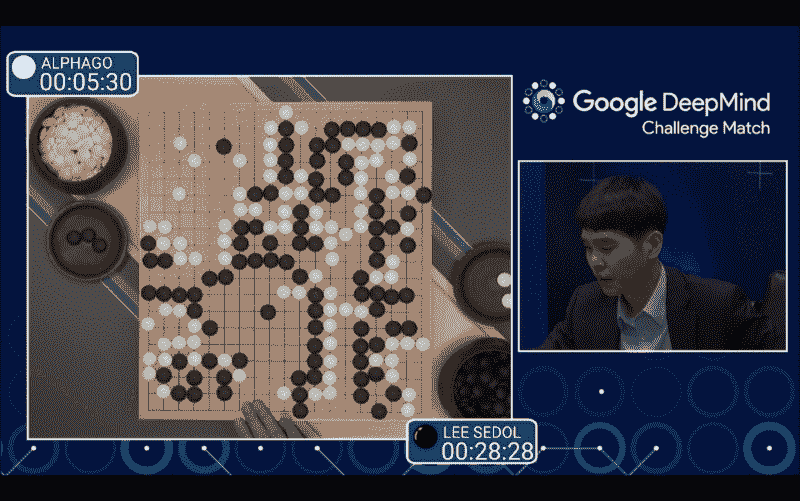
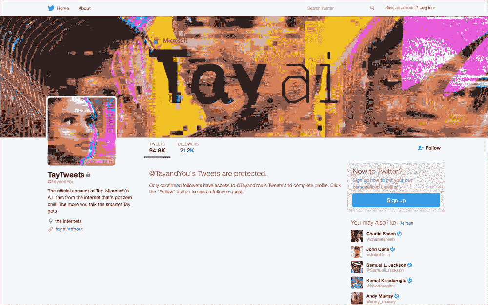
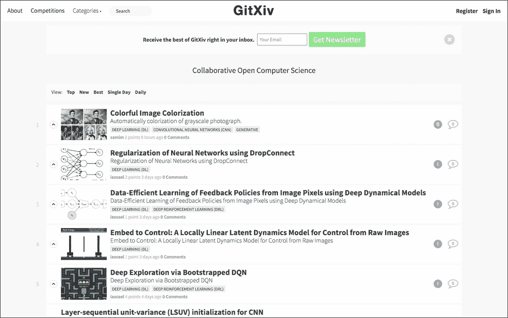
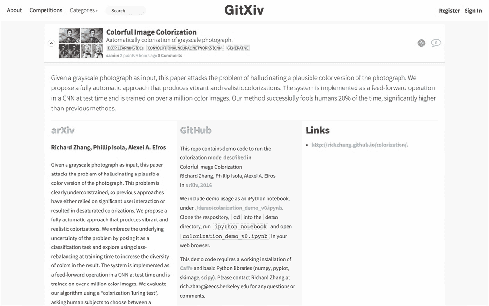
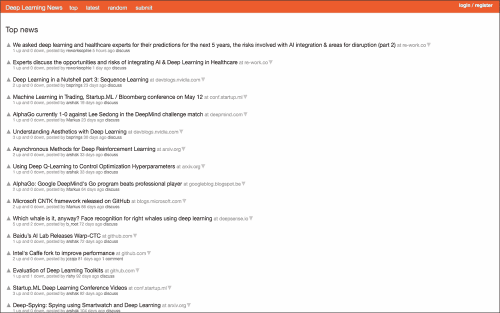

# 第八章：未来展望

在前几章中，我们学习了深度学习的概念、理论、实现方法以及如何使用相关库。现在你已经掌握了深度学习的基本技巧，所以不必担心。另一方面，深度学习的发展非常迅速，明天可能就会有新的模型问世。关于人工智能或深度学习的重大新闻每天都会接连发布。既然你已经掌握了基本技巧，你可以快速学习即将到来的人工智能和深度学习新技术。现在，让我们暂时抛开技术细节，思考人工智能领域将会走向何方，或者说应该走向何方。深度学习的未来是什么？在最后一章，我们来思考这个问题。本章将讨论以下主题：

+   深度学习行业的热点话题

+   如何管理人工智能技术

+   如何进一步进行深度学习的研究

关于最后一个主题——进一步学习，我推荐一个关于深度学习的网站。你可以通过思考下一步可能出现的技术，或者运用你已掌握的技巧进行创新，而不是单纯地跟随人工智能技术的发展步伐，从而保持领先。

# 深度学习的最新突破

引发人工智能热潮的深度学习，势头无法停歇。每天都有新的研究成果报道。如在第六章中提到的，*实际应用方法——递归神经网络及更多*，许多研究人员都在进行图像识别和自然语言处理的竞争。当然，深度学习不仅限于这两个领域，还应用于许多其他领域。这些应用的成果非常令人振奋。

在这场人工智能热潮中，2016 年 3 月，围棋界因一件事而震动。围棋是一种棋盘游戏，两名玩家争夺更多的领土。'人工智能战胜人类围棋选手'的消息不仅震惊了围棋界，也震惊了全世界。当一台机器，也就是人工智能，战胜了人类围棋选手时，这个消息引起了广泛关注。被谷歌收购的 DeepMind（[`deepmind.com/`](https://deepmind.com/)）开发了这个围棋人工智能，名为 AlphaGo，而 AlphaGo 在谷歌 DeepMind 挑战赛中以四胜一负的成绩战胜了世界级选手李世石。每场比赛都通过 YouTube 进行了直播，许多人实时观看了比赛。如果你还没有观看过，可以在 YouTube 上观看所有五场比赛：

+   **比赛 1**：[`www.youtube.com/watch?v=vFr3K2DORc8`](https://www.youtube.com/watch?v=vFr3K2DORc8)

+   **比赛 2**：[`www.youtube.com/watch?v=l-GsfyVCBu0`](https://www.youtube.com/watch?v=l-GsfyVCBu0)

+   **比赛 3**：[`www.youtube.com/watch?v=qUAmTYHEyM8`](https://www.youtube.com/watch?v=qUAmTYHEyM8)

+   **比赛 4**：[`www.youtube.com/watch?v=yCALyQRN3hw`](https://www.youtube.com/watch?v=yCALyQRN3hw)

+   **Match 5**: [`www.youtube.com/watch?v=mzpW10DPHeQ`](https://www.youtube.com/watch?v=mzpW10DPHeQ)

在这些比赛中，第一场比赛，Match 1，特别引起了人们的关注。此外，从超过 135 万次的页面访问量来看，可以看出很多人观看了 AlphaGo 输给李世石的唯一比赛，即第 4 场比赛的视频。以下是捕捉到 Match 1 一幕的图像：

AlphaGo 击败李世石的时刻（[`www.youtube.com/watch?v=vFr3K2DORc8`](https://www.youtube.com/watch?v=vFr3K2DORc8)）

这不仅令人工智能研究者激动，也令整个世界兴奋的时刻，但为什么这则新闻会如此受关注呢？举个例子，1997 年，国际商业机器公司开发的深蓝在国际象棋比赛中击败了世界冠军。当然，那时也成为重大新闻，因为这也是机器击败人类的时刻。那么，当这并非机器首次击败人类时，AlphaGo 击败李世石的胜利为何如此震撼世界呢？国际象棋和围棋有什么不同呢？嗯，区别在于围棋的棋型复杂性。事实上，围棋的策略模式比国际象棋多得多。在流行的棋类游戏如国际象棋、将棋和围棋中，用于决定胜负的模式数量如下：

+   国际象棋：10,120

+   将棋：10,220

+   围棋：10,360

甚至看着这些数字，你就可以看出围棋的策略是多么复杂，很容易想象机器也需要大量的计算。由于这巨大数量的棋型，直到最近，人们认为 AlphaGo 在现实时间内击败人类是不可能的，或者说要等 100 年或 200 年 AlphaGo 才会击败人类。人们认为机器在现实时间内计算围棋的棋型是不可能的。但是现在，在短短几年内，机器已经击败了人类。根据 Google 研究博客，在 DeepMind 挑战赛之前的 1.5 个月内，DeepMind 能够预测人类的棋步 57%的时间（[`googleresearch.blogspot.jp/2016/01/alphago-mastering-ancient-game-of-go.html`](http://googleresearch.blogspot.jp/2016/01/alphago-mastering-ancient-game-of-go.html)）。机器战胜人类的事实确实产生了影响，但机器能够在现实时间内学习围棋策略的事实更为令人惊讶。DeepMind 应用了深度神经网络与蒙特卡洛树搜索和强化学习的组合，显示了深度神经网络算法的应用广度。

# 预期的下一步行动

自从 AlphaGo 的新闻被媒体报道以来，AI 热潮无疑得到了推动。你可能会注意到，最近在媒体上听到“深度学习”这个词的频率更高了。这可以说是全球对 AI 的期望已大大提高。值得注意的是，原本是技术术语的“深度学习”如今在日常新闻中被广泛使用。你可以看到**AI**这一词的形象正在发生变化。可能就在几年前，如果人们听到 AI 这个词，许多人会联想到一个实际的机器人，但现在呢？“AI”这个词现在经常被使用——而且不特别有意识地——与软件或应用程序相关，已被视为司空见惯。这无非是表明，世界已经开始正确理解为研究而发展的 AI。如果一项技术走错方向，就会产生排斥，或者有人开始错误地开发技术；然而，似乎目前这股 AI 技术热潮正朝着一个良好的方向发展。

尽管我们对人工智能的发展感到兴奋，但不可避免地，一些人会感到某些恐惧或焦虑。很容易想象，有些人可能认为机器主导人类的世界，像科幻电影或小说中的情节那样，迟早会到来，特别是在 AlphaGo 战胜李世石后，曾经被认为机器不可能战胜人类的围棋世界，感到焦虑的人可能会增加。然而，尽管一则“机器战胜人类”的新闻，如果单纯关注“机器获胜”这一事实，可能会被认为是负面的，但这绝对不是负面新闻。相反，这是对人类的重大好消息。为什么？这里有两个原因。

第一个原因是，Google DeepMind 挑战赛是一场人类处于不利局面的比赛。不仅仅是围棋，卡牌游戏或体育比赛中，我们通常会在比赛前研究对手可能使用的策略，基于对手的行动模式来制定我们的策略。当然，DeepMind 研究了职业围棋选手的策略和玩法，而人类却无法充分研究机器的玩法，因为 DeepMind 在 Google DeepMind 挑战赛前的最后时刻一直在学习和不断变化其行动模式。因此，可以说存在信息偏差或不利条件。李世石在这些不利条件下赢得一局是非常了不起的。同时，这也表明 AI 将进一步发展。

另一个原因是我们发现，机器不太可能摧毁人类的价值，反而有助于推动人类的进一步发展。在 Google DeepMind 挑战赛中，一台机器使用了人类以前从未使用过的策略。这一事实让我们感到非常惊讶，但同时也意味着我们发现了一项人类需要研究的新事物。深度学习显然是一项伟大的技术，但我们不应忘记，神经网络涉及模仿人脑结构的算法。换句话说，它的基础与人类的思维模式相同。通过仅仅增加计算速度，机器能够发现人脑无法计算的模式遗漏。AlphaGo 可以与 AlphaGo 进行对局，并从这场对局的结果中学习。与人类不同，机器可以 24 小时不断地进行学习，因此它能够快速发现新的模式。在这个过程中，机器会发现一个全新的模式，这可以供人类进一步研究围棋。通过研究人类无法发现的新策略，我们的围棋世界将得到扩展，我们也能更加享受围棋。无需多言，不仅是机器在学习，人类也在学习。在各个领域，机器会发现一些人类之前没有注意到的新事物，每次人类面对这些新发现时，他们也在进步。

AI 和人类处于一种互补的关系中。再重复一遍，机器擅长计算大量的模式，并发现尚未被发现的模式，这超出了人类的能力。另一方面，AI 目前无法从完全新的概念中创造出新想法。相反，这恰恰是人类擅长的领域。机器只能在给定的知识范围内进行判断。例如，如果 AI 仅仅接收到许多种狗的图像作为输入数据，它可以判断这是什么种类的狗，但如果是猫，AI 就会尽最大努力根据自己对狗的知识来判断它是什么种类的狗。

AI 在某种意义上其实是一个无辜的存在，它只是根据自己获得的知识给出最可能的答案。思考应该为 AI 提供什么样的知识才能使其进步，这是人类的任务。如果你提供新的知识，AI 将再次根据给定的知识以相当快的速度计算出最可能的答案。人们的兴趣和知识也会因成长的环境不同而有所不同，AI 也同样如此。这意味着，AI 的*个性*，以及它是否对人类产生好或坏的影响，取决于 AI 所接触到的个人/群体。一个典型的例子就是微软开发的 AI Tay（`https://www.tay.ai`）。2016 年 3 月 23 日，Tay 在 Twitter 上发布了以下推文：*hellooooooo world!!!*

Tay 从 Twitter 上用户之间的互动中获取知识，并发布新的推文。这个试验本身非常有趣。

然而，刚对公众开放后，问题就发生了。在 Twitter 上，用户通过向 Tay 的账户输入歧视性知识恶作剧。因为这个原因，Tay 开始不断发布包含性别歧视表达的推文。而且，在 Tay 出现在 Twitter 上的仅一天后，Tay 就消失了，留下了以下推文：*c u soon humans need sleep now so many conversations today thx*。

如果你访问 Tay 的 Twitter 账户页面（[`twitter.com/tayandyou`](https://twitter.com/tayandyou)），推文已经被保护，你无法再看到它们：

Tay 的 Twitter 账户目前已关闭

这正是人工智能被人类错误训练的结果。在过去几年中，人工智能技术受到了广泛关注，这可能是加速人工智能技术发展的因素之一。现在，下一步应该考虑的是人工智能与人类之间的互动。人工智能本身只是众多技术之一。技术的好坏取决于人类如何使用它；因此，我们应该小心如何控制这项技术，否则整个人工智能领域可能会在未来收缩。人工智能在某些狭窄的领域表现得特别好，但远未达到压倒性的程度，也远未达到当前科幻作品中的设想。人工智能未来如何发展，取决于我们如何运用知识和技术管理。

我们确实应该关注如何控制这项技术，但不能减缓其发展的速度。考虑到近期机器人热潮，如 Facebook 将推出 Bot 商店的消息（[`techcrunch.com/2016/03/17/facebooks-messenger-in-a-bot-store/`](http://techcrunch.com/2016/03/17/facebooks-messenger-in-a-bot-store/)），我们不难想象用户与应用程序之间的互动会变成以聊天界面为基础，人工智能将逐步融入普通用户的日常生活。为了让更多人了解人工智能，我们应该进一步开发人工智能技术，并使其更加方便人们使用。

深度学习和人工智能得到了更多关注，这意味着如果你想在这个领域取得出色的成果，你可能会面临激烈的竞争。你想进行的实验很可能已经被别人做过。深度学习领域正成为初创企业竞争非常激烈的一个领域。如果你拥有大量数据，你可以通过分析这些数据来获得优势，但如果没有，你就需要考虑如何在有限的数据下进行实验。尽管如此，如果你想取得出色的表现，最好时刻记住以下几点：

### 提示

深度学习只能判断训练中提供的知识范围内的事物。

基于此，你可以通过以下两种方法获得有趣的结果：

+   使用能够轻松生成训练和测试所需输入数据和输出数据的数据进行实验

+   在实验中，使用完全不同类型的数据，分别用于训练和测试

对于第一种方法，例如，你可以检查使用 CNN 进行的自动着色。这一技术已经在公开的项目中引入，在线访问链接为[`tinyclouds.org/colorize/`](http://tinyclouds.org/colorize/)，或者在论文中可以找到，链接为[`arxiv.org/pdf/1603.08511v1.pdf`](http://arxiv.org/pdf/1603.08511v1.pdf)。这个想法是自动为灰度图像着色。如果你有彩色图像——这些图像应该很容易获得——你可以通过编写快速脚本生成灰度图像。这样，你就准备好了训练所需的输入数据和输出数据。能够准备大量数据意味着你可以更容易地进行测试，并且更常获得高精度。以下是其中一个测试的例子：

两者都引用自[`tinyclouds.org/colorize/`](http://tinyclouds.org/colorize/)

模型的输入是左侧的灰度图像，输出是中间的图像，右侧的图像是有真实颜色的图像。

对于第二种方法，使用完全不同类型的数据，分别用于训练和测试。在一个实验中，我们故意提供 AI 不知道的数据，并让随机答案和正确答案之间的差距变得有趣/好玩。例如，在*关于图像生成故事*（[`medium.com/@samim/generating-stories-about-images-d163ba41e4ed`](https://medium.com/@samim/generating-stories-about-images-d163ba41e4ed)）中，他们为神经网络提供了一张相扑选手的图片，而神经网络只研究了其中的一个项目，并引入了以下内容：浪漫小说，然后测试神经网络的反应。结果如下：

引用自[`medium.com/@samim/generating-stories-about-images-d163ba41e4ed`](https://medium.com/@samim/generating-stories-about-images-d163ba41e4ed)

这个实验本身基于一个名为`neural-storyteller`的方式（[`github.com/ryankiros/neural-storyteller`](https://github.com/ryankiros/neural-storyteller)），但由于给定的数据包含了一个想法，因此得到了有趣的结果。由此可见，将你的新想法添加到已经开发的方式中，也可以获得有趣的结果。

# 深度学习的有用新闻来源

好了，最后，让我们挑选两个网站，它们对于未来深度学习的动态观察以及学习越来越多的新知识会非常有用。这将帮助你的学习。

第一个是**GitXiv**（[`gitxiv.com/`](http://gitxiv.com/)）。首页如下：

在 GitXiv 上，主要是基于论文的文章，但除了提供论文链接外，还设置了用于测试的代码链接，因此你可以缩短研究时间。当然，它会不断更新新的实验，所以你可以查看哪些方法是主流，或者现在深度学习在什么领域最热。如果你注册了电子邮件地址，它会持续向你发送最新信息。你应该试试看：

第二个是**Deep Learning News** ([`news.startup.ml/`](http://news.startup.ml/))。这是一个收集深度学习和机器学习相关话题的链接集合。它的界面与**Hacker News** ([`news.ycombinator.com/`](https://news.ycombinator.com/))相同，后者处理整个技术行业的新闻，因此如果你知道 Hacker News，你应该会对其布局很熟悉：

Deep Learning News 上的信息更新并不是非常频繁，但它不仅提供了实现或技术方面的技巧，还包括了哪些领域可以应用深度学习的提示，并且提供了深度学习和机器学习相关的活动信息，因此对创意或灵感的激发非常有帮助。如果你浏览一下首页列表中的网址，可能会激发你的一些好点子。

除了我们在这里选出的这两个网站外，还有更多有用的资源、材料和社区，比如 Google+ 上的深度学习小组 ([`plus.google.com/communities/112866381580457264725`](https://plus.google.com/communities/112866381580457264725))，因此你应该关注适合你的媒体。无论如何，现在这个行业发展迅速，始终关注最新的信息是非常必要的。

# 摘要

在本章中，我们从 AlphaGo 作为突发新闻的例子出发，探讨了深度学习将如何或应该发展。机器在某些领域战胜人类并不可怕，反而是人类成长的机会。另一方面，如果人工智能技术处理不当，这项伟大的技术可能会朝着错误的方向发展，正如 Tay 的例子所示。因此，我们应小心谨慎，不要破坏这项正在稳步发展的技术。

深度学习是一个拥有巨大潜力的领域，一个创意就能改变一个时代。如果你在不久的将来构建人工智能，这个人工智能可以说是一个纯粹的存在，尚没有任何知识。思考该如何教导人工智能，如何与其互动，以及如何将人工智能用于造福人类，都是人类的工作。作为本书的读者，你将引领这项新技术朝着正确的方向发展。最后，我希望你能积极参与到人工智能领域的前沿。
