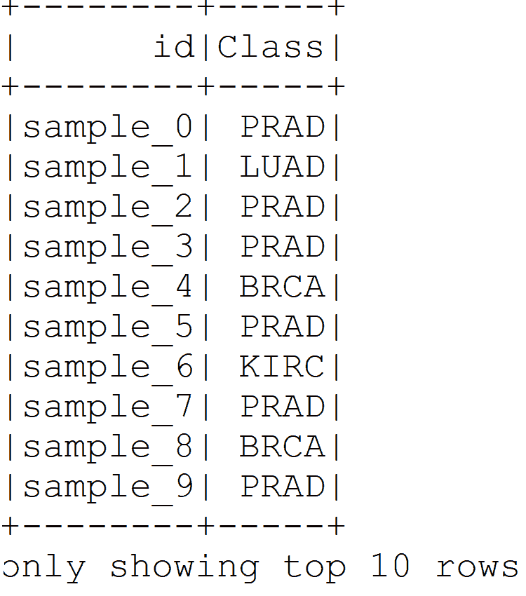
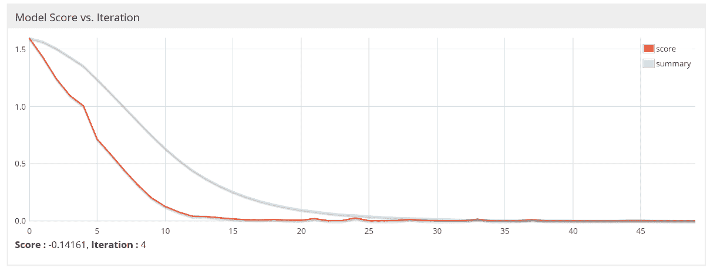

# 第二章：使用递归类型网络进行癌症类型预测

大规模的癌症基因组学数据通常以多平台和异构形式存在。这些数据集在生物信息学方法和计算算法方面带来了巨大的挑战。许多研究人员提出利用这些数据克服多个挑战，将经典的机器学习算法作为癌症诊断和预后的主要方法或辅助元素。

本章中，我们将使用一些深度学习架构来进行癌症类型分类，数据来自 The Cancer Genome Atlas（TCGA）中整理的高维数据集。首先，我们将描述该数据集并进行一些预处理，使得数据集可以输入到我们的网络中。然后，我们将学习如何准备编程环境，接下来使用一个开源深度学习库**Deeplearning4j**（**DL4J**）进行编码。首先，我们将再次回顾 Titanic 生存预测问题，并使用 DL4J 中的**多层感知器**（**MLP**）实现。

然后，我们将使用一种改进的**递归神经网络**（**RNN**）架构，称为**长短期记忆**（**LSTM**），进行癌症类型预测。最后，我们将了解一些与此项目及 DL4J 超参数/网络调优相关的常见问题。

简而言之，本章将学习以下内容：

+   癌症基因组学中的深度学习

+   癌症基因组学数据集描述

+   开始使用 Deeplearning4j

+   使用 LSTM-RNN 开发癌症类型预测模型

+   常见问题

# 癌症基因组学中的深度学习

生物医学信息学包括与生物系统研究相关的数据分析、数学建模和计算仿真技术的开发。近年来，我们见证了生物计算的巨大飞跃，结果是大量信息丰富的资源已可供我们使用。这些资源涵盖了诸如解剖学、建模（3D 打印机）、基因组学和药理学等多个领域。

生物医学信息学最著名的成功案例之一来自基因组学领域。**人类基因组计划**（**HGP**）是一个国际研究项目，旨在确定人类 DNA 的完整序列。这个项目是计算生物学中最重要的里程碑之一，并为其他项目提供了基础，包括致力于对人类大脑进行基因组测序的人类大脑计划。本文所使用的数据也是 HGP 的间接成果。

大数据时代大约从过去十年开始，标志着数字信息的激增，相比其模拟对手。仅在 2016 年，16.1 泽字节的数字数据被生成，预计到 2025 年将达到每年 163 泽字节。虽然这是一则好消息，但仍然存在一些问题，尤其是在数据存储和分析方面。对于后者，简单的机器学习方法在常规数据分析中的应用已不再有效，应被深度神经网络学习方法所取代。深度学习通常被认为能非常有效地处理这些类型的大型复杂数据集。

与其他重要领域一样，生物医学领域也受到了大数据现象的影响。最主要的大型数据来源之一是诸如基因组学、代谢组学和蛋白质组学等 omics 数据。生物医学技术和设备的创新，如 DNA 测序和质谱分析，导致了 -omics 数据的巨大积累。

通常，-omics 数据充满了真实性、变异性和高维度性。这些数据集来源于多个，甚至有时是不兼容的数据平台。这些特性使得这些类型的数据适合应用深度学习方法。对 -omics 数据的深度学习分析是生物医学领域的主要任务之一，因为它有可能成为个性化医疗的领导者。通过获取一个人 omics 数据的信息，可以更好地应对疾病，治疗可以集中于预防措施。

癌症通常被认为是世界上最致命的疾病之一，主要是由于其诊断和治疗的复杂性。它是一种涉及多种基因突变的遗传性疾病。随着癌症治疗中遗传学知识重要性的逐渐受到重视，最近出现了多个记录癌症患者遗传数据的项目。其中最著名的项目之一是**癌症基因组图谱**（**TCGA**）项目，该项目可在 TCGA 研究网络上找到：[`cancergenome.nih.gov/`](http://cancergenome.nih.gov/)。

如前所述，生物医学领域，包括癌症研究，已经有许多深度学习应用。在癌症研究中，大多数研究者通常使用 -omics 或医学影像数据作为输入。多个研究工作聚焦于癌症分析。其中一些使用组织病理图像或 PET 图像作为数据来源。大多数研究集中于基于这些图像数据的分类，采用**卷积神经网络**（**CNNs**）。

然而，许多研究使用-omics 数据作为其数据来源。Fakoor 等人使用患者的基因表达数据对各种类型的癌症进行了分类。由于每种癌症类型的数据维度不同，他们首先使用**主成分分析**（**PCA**）来减少微阵列基因表达数据的维度。

主成分分析（PCA）是一种统计技术，用于强调数据的变化并提取数据集中最显著的模式；主成分是基于真实特征向量的最简单的多元分析方法。PCA 通常用于使数据探索更易于可视化。因此，PCA 是数据探索分析和构建预测模型中最常用的算法之一。

然后，他们应用稀疏和堆叠自编码器对多种癌症进行分类，包括急性髓性白血病、乳腺癌和卵巢癌。

有关详细信息，请参阅以下文献：《使用深度学习增强癌症诊断与分类》，作者：R. Fakoor 等人，发表于 2013 年国际机器学习会议论文集中。

另一方面，Ibrahim 等人使用了来自六种癌症的基因/miRNA 特征选择的 miRNA 表达数据。他们提出了一种新的多级特征选择方法，名为**MLFS**（**多级基因/miRNA 特征选择**的简称），该方法基于**深度置信网络（DBN）**和无监督主动学习。

您可以在以下文献中阅读更多内容：《使用深度置信网络和主动学习的多级基因/miRNA 特征选择》，作者：R. Ibrahim 等人，发表于 2014 年 36 届国际工程医学生物学学会年会（EMBC）论文集，页 3957-3960，IEEE，2014。

最后，Liang 等人使用多平台基因组学和临床数据对卵巢癌和乳腺癌患者进行了聚类。卵巢癌数据集包含 385 名患者的基因表达、DNA 甲基化和 miRNA 表达数据，这些数据从**癌症基因组图谱（TCGA）**下载。

您可以在以下文献中阅读更多内容：《多平台癌症数据的集成数据分析与多模态深度学习方法》，作者：M. Liang 等人，发表于《分子药学》期刊，卷 12，页 928-937，IEEE/ACM 计算生物学与生物信息学学报，2015。

乳腺癌数据集包括基因表达数据和相应的临床信息，如生存时间和复发时间数据，这些数据由荷兰癌症研究所收集。为了处理这些多平台数据，他们使用了**多模态深度置信网络**（**mDBN**）。

首先，他们为每种数据实现了一个深度置信网络（DBN）以获取其潜在特征。然后，另一个用于执行聚类的深度置信网络使用这些潜在特征作为输入。除了这些研究人员外，还有大量研究正在进行，旨在为癌症基因组学、识别和治疗提供重要推动。

# 癌症基因组学数据集描述

基因组学数据涵盖与生物体 DNA 相关的所有数据。尽管在本论文中我们还将使用其他类型的数据，如转录组数据（RNA 和 miRNA），但为了方便起见，所有数据将统称为基因组数据。人类基因组学的研究在最近几年取得了巨大的突破，这得益于 HGP（1984-2000）在测序人类 DNA 全序列方面的成功。

受此影响最大的领域之一是与遗传学相关的所有疾病的研究，包括癌症。通过对 DNA 进行各种生物医学分析，出现了各种类型的-组学或基因组数据。以下是一些对癌症分析至关重要的-组学数据类型：

+   **原始测序数据**：这对应于整个染色体的 DNA 编码。一般来说，每个人体内的每个细胞都有 24 种染色体，每条染色体由 4.6 亿至 2.47 亿个碱基对组成。每个碱基对可以用四种不同的类型进行编码，分别是**腺嘌呤**（`A`）、**胞嘧啶**（`C`）、**鸟嘌呤**（`G`）和**胸腺嘧啶**（`T`）。因此，原始测序数据由数十亿个碱基对数据组成，每个碱基对都用这四种类型之一进行编码。

+   **单核苷酸多态性**（**SNP**）数据：每个人都有不同的原始序列，这会导致基因突变。基因突变可能导致实际的疾病，或者仅仅是外貌上的差异（如发色），也可能什么都不发生。当这种突变仅发生在单个碱基对上，而不是一段碱基对序列时，这被称为**单核苷酸多态性**（**SNP**）。

+   **拷贝数变异**（**CNV**）数据：这对应于发生在碱基对序列中的基因突变。突变可以有多种类型，包括碱基对序列的缺失、碱基对序列的倍增以及碱基对序列在染色体其他部位的重排。

+   **DNA 甲基化数据**：这对应于染色体上某些区域发生的甲基化量（甲基基团连接到碱基对上）。基因启动子区域的甲基化量过多可能会导致基因沉默。DNA 甲基化是我们每个器官表现出不同功能的原因，尽管它们的 DNA 序列是相同的。在癌症中，这种 DNA 甲基化被破坏。

+   **基因表达数据**：这对应于某一时刻从基因中表达的蛋白质数量。癌症的发生通常是由于致癌基因（即引发肿瘤的基因）表达过高、抑癌基因（即防止肿瘤的基因）表达过低，或两者兼有。因此，基因表达数据的分析有助于发现癌症中的蛋白质生物标志物。我们将在本项目中使用这种数据。

+   **miRNA 表达数据**：对应于在特定时间内表达的微小 RNA 的数量。miRNA 在 mRNA 阶段起到蛋白质沉默的作用。因此，基因表达数据的分析有助于发现癌症中的 miRNA 生物标志物。

有多个基因组数据集的数据库，其中可以找到上述数据。它们中的一些专注于癌症患者的基因组数据。这些数据库包括：

+   **癌症基因组图谱**（**TCGA**）：**[`cancergenome.nih.gov/`](https://cancergenome.nih.gov/)**

+   **国际癌症基因组联盟**（**ICGC**）：**[`icgc.org/`](https://icgc.org/)**

+   **癌症体细胞突变目录**（**COSMIC**）：**[`cancer.sanger.ac.uk/cosmic`](https://cancer.sanger.ac.uk/cosmic)**

这些基因组数据通常伴随着患者的临床数据。临床数据可以包括一般的临床信息（例如，年龄或性别）以及他们的癌症状态（例如，癌症的位置或癌症的分期）。所有这些基因组数据本身具有高维度的特点。例如，每个患者的基因表达数据是基于基因 ID 构建的，达到约 60,000 种类型。

此外，一些数据本身来自多个格式。例如，70%的 DNA 甲基化数据来自乳腺癌患者，剩余 30%则是来自不同平台的整理数据。因此，这个数据集有两种不同的结构。因此，为了分析基因组数据并处理其异质性，研究人员通常采用强大的机器学习技术，甚至是深度神经网络。

现在让我们看看一个可以用于我们目的的实际数据集。我们将使用从 UCI 机器学习库下载的基因表达癌症 RNA-Seq 数据集（有关更多信息，请参见[`archive.ics.uci.edu/ml/datasets/gene+expression+cancer+RNA-Seq#`](https://archive.ics.uci.edu/ml/datasets/gene+expression+cancer+RNA-Seq)）。


泛癌症分析项目的数据收集流程（来源：“Weinstein, John N., et al. 'The cancer genome atlas pan-cancer analysis project.' Nature Genetics 45.10 (2013): 1113-1120”）

这个数据集是从以下论文中报告的另一个数据集的随机子集：Weinstein, John N., et al. *The cancer genome atlas pan-cancer analysis project*. *Nature Genetics 45.10 (2013): 1113-1120*。前面的图示展示了泛癌症分析项目的数据收集流程。

项目的名称是泛癌症分析项目。该项目汇集了来自不同部位发生原发肿瘤的数千名患者的数据。它涵盖了 12 种肿瘤类型（见前面图示的左上角面板），包括：

+   **胶质母细胞瘤**（**GBM**）

+   **急性淋巴细胞白血病**（**AML**）

+   **头颈部鳞状细胞癌**（**HNSC**）

+   **肺腺癌**（**LUAD**）

+   **肺鳞状细胞癌** (**LUSC**)

+   **乳腺癌** (**BRCA**)

+   **肾脏透明细胞癌** (**KIRC**)

+   **卵巢癌** (**OV**)

+   **膀胱癌** (**BLCA**)

+   **结肠腺癌** (**COAD**)

+   **子宫颈和子宫内膜癌** (**UCEC**)

+   **直肠腺癌** (**READ**)

这组数据是 RNA-Seq (HiSeq) PANCAN 数据集的一部分。它是从患有不同类型肿瘤的患者（如 BRCA、KIRC、COAD、LUAD 和 PRAD）中随机提取的基因表达数据。

该数据集是从 801 名癌症患者中随机收集的，每名患者有 20,531 个属性。样本（实例）按行存储。每个样本的变量（属性）是通过 illumina HiSeq 平台测量的 RNA-Seq 基因表达水平。每个属性都被赋予一个虚拟名称（`gene_XX`）。属性的顺序与原始提交一致。例如，`sample_0`上的`gene_1`的基因表达水平显著且有差异，数值为`2.01720929003`。

当你下载数据集时，你会看到有两个 CSV 文件：

+   `data.csv`**：** 包含每个样本的基因表达数据

+   `labels.csv`**：** 与每个样本相关的标签

让我们来看一下处理过的数据集。请注意，由于高维度性，我们只会看到一些选择的特征，以下截图中第一列表示样本 ID（即匿名患者 ID）。其余列表示某些基因在患者肿瘤样本中的表达情况：


样本基因表达数据集

现在看一下*图 3*中的标签。在这里，`id`包含样本 ID，`Class`表示癌症标签：



样本被分类为不同的癌症类型

现在你可以理解为什么我选择了这个数据集。尽管我们没有太多样本，但这个数据集仍然是非常高维的。此外，这种高维数据集非常适合应用深度学习算法。

好的。那么，如果给定了特征和标签，我们能否根据特征和真实标签对这些样本进行分类呢？为什么不呢？我们将尝试使用 DL4J 库解决这个问题。首先，我们需要配置我们的编程环境，以便开始编写代码。

# 准备编程环境

在本节中，我们将讨论如何在开始编写代码之前配置 DL4J、ND4s、Spark 和 ND4J。使用 DL4J 时需要的前提条件如下：

+   Java 1.8+（仅限 64 位）

+   用于自动构建和依赖管理的 Apache Maven

+   IntelliJ IDEA 或 Eclipse IDE

+   用于版本控制和 CI/CD 的 Git

以下库可以与 DJ4J 集成，以增强你在开发机器学习应用时的 JVM 体验：

+   **DL4J**：核心神经网络框架，提供了许多深度学习架构和底层功能。

+   **ND4J**：可以被认为是 JVM 的 NumPy。它包括一些基本的线性代数操作，例如矩阵创建、加法和乘法。

+   **DataVec**：这个库在执行特征工程的同时，支持 ETL 操作。

+   **JavaCPP**：这个库充当 Java 与本地 C++之间的桥梁。

+   **Arbiter**：这个库为深度学习算法提供基本的评估功能。

+   **RL4J**：为 JVM 提供深度强化学习。

+   **ND4S**：这是一个科学计算库，并且它也支持 JVM 语言中的 n 维数组。

如果你在你喜欢的 IDE 中使用 Maven，我们可以在`pom.xml`文件中定义项目属性来指定版本：

```py
<properties>
        <project.build.sourceEncoding>UTF-8</project.build.sourceEncoding>
        <java.version>1.8</java.version>
        <nd4j.version>1.0.0-alpha</nd4j.version>
        <dl4j.version>1.0.0-alpha</dl4j.version>
        <datavec.version>1.0.0-alpha</datavec.version>
        <arbiter.version>1.0.0-alpha</arbiter.version>
        <logback.version>1.2.3</logback.version>
        <dl4j.spark.version>1.0.0-alpha_spark_2</dl4j.spark.version>
</properties>
```

然后使用以下依赖项，这些依赖项是 DL4J、ND4S、ND4J 等所需要的：

```py
<dependencies>
    <dependency>
        <groupId>org.nd4j</groupId>
        <artifactId>nd4j-native</artifactId>
        <version>${nd4j.version}</version>
    </dependency>
    <dependency>
        <groupId>org.deeplearning4j</groupId>
        <artifactId>dl4j-spark_2.11</artifactId>
        <version>1.0.0-alpha_spark_2</version>
    </dependency>
    <dependency>
        <groupId>org.nd4j</groupId>
        <artifactId>nd4j-native</artifactId>
        <version>1.0.0-alpha</version>
        <type>pom</type>
    </dependency>
    <dependency>
        <groupId>org.deeplearning4j</groupId>
        <artifactId>deeplearning4j-core</artifactId>
        <version>${dl4j.version}</version>
    </dependency>
    <dependency>
        <groupId>org.deeplearning4j</groupId>
        <artifactId>deeplearning4j-nlp</artifactId>
        <version>${dl4j.version}</version>
    </dependency>
    <dependency>
        <groupId>org.deeplearning4j</groupId>
        <artifactId>deeplearning4j-zoo</artifactId>
        <version>${dl4j.version}</version>
    </dependency>
    <dependency>
        <groupId>org.deeplearning4j</groupId>
        <artifactId>arbiter-deeplearning4j</artifactId>
        <version>${arbiter.version}</version>
    </dependency>
    <dependency>
        <groupId>org.deeplearning4j</groupId>
        <artifactId>arbiter-ui_2.11</artifactId>
        <version>${arbiter.version}</version>
    </dependency>
    <dependency>
        <artifactId>datavec-data-codec</artifactId>
        <groupId>org.datavec</groupId>
        <version>${datavec.version}</version>
    </dependency>
    <dependency>
        <groupId>org.apache.httpcomponents</groupId>
        <artifactId>httpclient</artifactId>
        <version>4.3.5</version>
    </dependency>
    <dependency>
        <groupId>ch.qos.logback</groupId>
        <artifactId>logback-classic</artifactId>
        <version>${logback.version}</version>
        </dependency>
</dependencies>
```

顺便说一下，DL4J 随 Spark 2.1.0 一起提供。此外，如果你的机器上没有配置本地系统 BLAS，ND4J 的性能会降低。当你执行 Scala 编写的简单代码时，你将看到以下警告：

```py
****************************************************************
 WARNING: COULD NOT LOAD NATIVE SYSTEM BLAS
 ND4J performance WILL be reduced
 ****************************************************************
```

然而，安装和配置 BLAS（如`OpenBLAS`或`IntelMKL`）并不难；你可以花些时间去完成它。更多细节可以参考以下网址：[`nd4j.org/getstarted.html#open`](http://nd4j.org/getstarted.html#open)。

干得好！我们的编程环境已经准备好用于简单的深度学习应用开发。现在是时候动手写一些示例代码了。

# 使用 DL4J 重新审视泰坦尼克号生存预测

在前一章中，我们使用基于 Spark 的 MLP 解决了泰坦尼克号生存预测问题。我们还看到，通过使用基于 Spark 的 MLP，用户几乎无法了解层次结构的使用情况。此外，超参数等的定义也不够明确。

因此，我所做的是使用训练数据集，并进行了预处理和特征工程。然后，我将预处理后的数据集随机分为训练集和测试集（具体来说，70%用于训练，30%用于测试）。首先，我们按照如下方式创建 Spark 会话：

```py
SparkSession spark = SparkSession.builder()
                  .master("local[*]")
                  .config("spark.sql.warehouse.dir", "temp/")// change accordingly
                  .appName("TitanicSurvivalPrediction")
                  .getOrCreate();
```

在本章中，我们看到有两个 CSV 文件。然而，`test.csv`没有提供任何实际的标签。因此，我决定只使用`training.csv`文件，以便我们可以比较模型的性能。所以我们通过 Spark 的`read()` API 读取训练数据集：

```py
Dataset<Row> df = spark.sqlContext()
                .read()
                .format("com.databricks.spark.csv")
                .option("header", "true") // Use first line of all files as header
                .option("inferSchema", "true") // Automatically infer data types
                .load("data/train.csv");
```

我们在第一章《深度学习入门》中看到，`Age`和`Fare`列有许多空值。因此，在这里，我直接用这些列的均值来替换缺失值，而不是为每一列编写`UDF`：

```py
Map<String, Object> m = new HashMap<String, Object>();
m.put("Age", 30);
m.put("Fare", 32.2);
Dataset<Row> trainingDF1 = df2.na().fill(m);  
```

要深入了解如何处理缺失/空值和机器学习，感兴趣的读者可以阅读 Boyan Angelov 的博客，链接如下：[`towardsdatascience.com/working-with-missing-data-in-machine-learning-9c0a430df4ce`](https://towardsdatascience.com/working-with-missing-data-in-machine-learning-9c0a430df4ce)。

为了简化，我们还可以删除一些列，例如“`PassengerId`”、“`Name`”、“`Ticket`”和“`Cabin`”：

```py
Dataset<Row> trainingDF2 = trainingDF1.drop("PassengerId", "Name", "Ticket", "Cabin");
```

现在，进入难点了。类似于基于 Spark ML 的估计器，基于 DL4J 的网络也需要数字形式的训练数据。因此，我们现在必须将类别特征转换为数值。为此，我们可以使用`StringIndexer()`转换器。我们要做的是为“`Sex`”和“`Embarked`”列创建两个`StringIndexer`：

```py
StringIndexer sexIndexer = new StringIndexer()
                                    .setInputCol("Sex")
                                    .setOutputCol("sexIndex")
                                    .setHandleInvalid("skip");//// we skip column having nulls

StringIndexer embarkedIndexer = new StringIndexer()
                                    .setInputCol("Embarked")
                                    .setOutputCol("embarkedIndex")
                                    .setHandleInvalid("skip");//// we skip column having nulls
```

然后我们将它们串联成一个管道。接下来，我们将执行转换操作：

```py
Pipeline pipeline = new Pipeline().setStages(new PipelineStage[] {sexIndexer, embarkedIndexer});
```

接着，我们将拟合管道，转换数据，并删除“`Sex`”和“`Embarked`”列，以获取转换后的数据集：

```py
Dataset<Row> trainingDF3 = pipeline.fit(trainingDF2).transform(trainingDF2).drop("Sex", "Embarked");
```

然后，我们的最终预处理数据集将只包含数值特征。请注意，DL4J 将最后一列视为标签列。这意味着 DL4J 会将“`Pclass`”、“`Age`”、“`SibSp`”、“`Parch`”、“`Fare`”、“`sexIndex`”和“`embarkedIndex`”视为特征。因此，我将“`Survived`”列放在了最后：

```py
Dataset<Row> finalDF = trainingDF3.select("Pclass", "Age", "SibSp","Parch", "Fare",                                                                   
                                           "sexIndex","embarkedIndex", "Survived");
finalDF.show();
```

然后，我们将数据集随机拆分为 70%训练集和 30%测试集。即，我们使用 70%数据进行训练，剩余的 30%用于评估模型：

```py
Dataset<Row>[] splits = finalDF.randomSplit(new double[] {0.7, 0.3}); 
Dataset<Row> trainingData = splits[0]; 
Dataset<Row> testData = splits[1];
```

最后，我们将两个 DataFrame 分别保存为 CSV 文件，供 DL4J 使用：

```py
trainingData
      .coalesce(1)// coalesce(1) writes DF in a single CSV
      .write() 
      .format("com.databricks.spark.csv")
      .option("header", "false") // don't write the header
      .option("delimiter", ",") // comma separated
      .save("data/Titanic_Train.csv"); // save location

testData
      .coalesce(1)// coalesce(1) writes DF in a single CSV
      .write() 
      .format("com.databricks.spark.csv")
      .option("header", "false") // don't write the header
      .option("delimiter", ",") // comma separated
      .save("data/Titanic_Test.csv"); // save location
```

此外，DL4J 不支持训练集中的头信息，因此我故意跳过了写入头信息。

# 多层感知器网络构建

正如我在前一章中提到的，基于 DL4J 的神经网络由多个层组成。一切从`MultiLayerConfiguration`开始，它组织这些层及其超参数。

超参数是一组决定神经网络学习方式的变量。有很多参数，例如：更新模型权重的次数和频率（称为**epoch**），如何初始化网络权重，使用哪种激活函数，使用哪种更新器和优化算法，学习率（即模型学习的速度），隐藏层有多少层，每层有多少神经元等等。

现在，我们来创建网络。首先，创建层。类似于我们在第一章中创建的 MLP，*深度学习入门*，我们的 MLP 将有四层：

+   **第 0 层**：输入层

+   **第 1 层**：隐藏层 1

+   **第 2 层**：隐藏层 2

+   **第 3 层**：输出层

更技术性地讲，第一层是输入层，然后将两层作为隐藏层放置。对于前三层，我们使用 Xavier 初始化权重，激活函数为 ReLU。最后，输出层放置在最后。这一设置如下图所示：


泰坦尼克号生存预测的多层感知器输入层

我们已经指定了神经元（即节点），输入和输出的数量相等，并且输出的神经元数量是任意的。考虑到输入和特征非常少，我们设置了一个较小的值：

```py
DenseLayer input_layer = new DenseLayer.Builder()
                .weightInit(WeightInit.XAVIER)
                .activation(Activation.RELU)
                .nIn(numInputs)
                .nOut(16)
                .build();
```

# 隐藏层 1

输入层的神经元数量等于输入层的输出。然后输出的数量是任意值。我们设置了一个较小的值，考虑到输入和特征非常少：

```py
DenseLayer hidden_layer_1 = new DenseLayer.Builder()
                .weightInit(WeightInit.XAVIER)
                .activation(Activation.RELU)
                .nIn(16).nOut(32)
                .build();
```

# 隐藏层 2

输入层的神经元数量等于隐藏层 1 的输出。然后输出的数量是一个任意值。再次考虑到输入和特征非常少，我们设置了一个较小的值：

```py
 DenseLayer hidden_layer_2 = new DenseLayer.Builder()
                .weightInit(WeightInit.XAVIER)
                .activation(Activation.RELU)
                .nIn(32).nOut(16)
                .build();
```

# 输出层

输入层的神经元数量等于隐藏层 1 的输出。然后输出的数量等于预测标签的数量。再次考虑到输入和特征非常少，我们设置了一个较小的值。

我们使用了 Softmax 激活函数，它为我们提供了一个类的概率分布（输出的总和为 1.0），并且在二分类（XNET）中使用交叉熵作为损失函数，因为我们想将输出（概率）转换为离散类别，即零或一：

```py
OutputLayer output_layer = new OutputLayer.Builder(LossFunction.XENT) // XENT for Binary Classification
                .weightInit(WeightInit.XAVIER)
                .activation(Activation.SOFTMAX)
                .nIn(16).nOut(numOutputs)
                .build();
```

XNET 用于二分类的逻辑回归。更多信息可以查看 DL4J 中的 `LossFunctions.java` 类。

现在我们通过指定 `NeuralNetConfiguration` 来创建一个 `MultiLayerConfiguration`，然后进行训练。使用 DL4J 时，我们可以通过调用 `NeuralNetConfiguration.Builder()` 上的 `layer` 方法来添加一层，指定其在层的顺序中的位置（以下代码中的零索引层是输入层）：

```py
MultiLayerConfiguration MLPconf = new NeuralNetConfiguration.Builder().seed(seed)
                .optimizationAlgo(OptimizationAlgorithm.STOCHASTIC_GRADIENT_DESCENT)
                .weightInit(WeightInit.XAVIER)
                .updater(new Adam(0.0001))
                .list()
                    .layer(0, input_layer)
                    .layer(1, hidden_layer_1)
                    .layer(2, hidden_layer_2)
                    .layer(3, output_layer)
                .pretrain(false).backprop(true).build();// no pre-traning required    
```

除了这些之外，我们还指定了如何设置网络的权重。例如，如前所述，我们使用 Xavier 作为权重初始化，并使用 **随机梯度下降**（**SGD**）优化算法，Adam 作为更新器。最后，我们还指定不需要进行任何预训练（通常在 DBN 或堆叠自编码器中是需要的）。然而，由于 MLP 是一个前馈网络，我们将反向传播设置为 true。

# 网络训练

首先，我们使用之前的 `MultiLayerConfiguration` 创建一个 `MultiLayerNetwork`。然后我们初始化网络并开始在训练集上训练：

```py
MultiLayerNetwork model = new MultiLayerNetwork(MLPconf);
model.init();
log.info("Train model....");
for( int i=0; i<numEpochs; i++ ){
    model.fit(trainingDataIt);
        }
```

在前面的代码块中，我们通过调用 `model.fit()` 在训练集（在我们案例中为 `trainingDataIt`）上开始训练模型。现在我们来讨论一下如何准备训练集和测试集。好吧，对于读取训练集或测试集格式不正确的数据（特征为数值，标签为整数），我创建了一个名为 `readCSVDataset()` 的方法：

```py
private static DataSetIterator readCSVDataset(String csvFileClasspath, int batchSize, 
               int labelIndex, int numClasses) throws IOException, InterruptedException {
        RecordReader rr = new CSVRecordReader();
        File input = new File(csvFileClasspath);
        rr.initialize(new FileSplit(input));
        DataSetIterator iterator = new RecordReaderDataSetIterator(rr, batchSize, labelIndex, numClasses);
        return iterator;
    }
```

如果你看前面的代码块，你会发现它基本上是一个包装器，用来读取 CSV 格式的数据，然后 `RecordReaderDataSetIterator()` 方法将记录读取器转换为数据集迭代器。从技术上讲，`RecordReaderDataSetIterator()` 是分类的主要构造函数。它接受以下参数：

+   `RecordReader`：这是提供数据来源的 `RecordReader`

+   `batchSize`：输出 `DataSet` 对象的批量大小（即，示例数量）

+   `labelIndex`：由`recordReader.next()`获取的标签索引可写值（通常是`IntWritable`）

+   `numPossibleLabels`：分类的类别数量（可能的标签）

这将把输入的类别索引（在 `labelIndex` 位置，整数值为 `0` 到 `numPossibleLabels-1`，包括）转换为相应的 one-hot 输出/标签表示。接下来让我们看看如何继续。首先，我们展示训练集和测试集的路径：

```py
String trainPath = "data/Titanic_Train.csv";
String testPath = "data/Titanic_Test.csv";

int labelIndex = 7; // First 7 features are followed by the labels in integer 
int numClasses = 2; // number of classes to be predicted -i.e survived or not-survived
int numEpochs = 1000; // Number of training eopich

int seed = 123; // Randome seed for reproducibilty
int numInputs = labelIndex; // Number of inputs in input layer
int numOutputs = numClasses; // Number of classes to be predicted by the network 

int batchSizeTraining = 128;         
```

现在，让我们准备要用于训练的数据：

```py
DataSetIterator trainingDataIt = *readCSVDataset*(trainPath, batchSizeTraining, labelIndex, numClasses);
```

接下来，让我们准备要分类的数据：

```py
int batchSizeTest = 128;
DataSetIterator testDataIt = *readCSVDataset*(testPath, batchSizeTest, labelIndex, numClasses);
```

太棒了！我们已经成功准备好了训练和测试的`DataSetIterator`。记住，我们在为其他问题准备训练和测试集时，将几乎采用相同的方法。

# 评估模型

一旦训练完成，接下来的任务是评估模型。我们将在测试集上评估模型的性能。对于评估，我们将使用`Evaluation()`；它创建一个包含两种可能类别（存活或未存活）的评估对象。从技术上讲，Evaluation 类计算评估指标，如精确度、召回率、F1、准确率和马修斯相关系数。最后一个用于评估二分类器。现在让我们简要了解这些指标：

**准确率**是正确预测样本与总样本的比例：


**精确度**是正确预测的正样本与总预测正样本的比例：


**召回率**是正确预测的正样本与实际类别中所有样本的比例——是的：


**F1 分数**是精确度和召回率的加权平均值（调和均值）：


**马修斯相关系数**（**MCC**）是衡量二分类（两类）质量的指标。MCC 可以通过混淆矩阵直接计算，计算公式如下（假设 TP、FP、TN 和 FN 已经存在）：


与基于 Apache Spark 的分类评估器不同，在使用基于 DL4J 的评估器解决二分类问题时，应该特别注意二分类指标，如 F1、精确度、召回率等。

好的，我们稍后再讨论这些。首先，让我们对每个测试样本进行迭代评估，并从训练好的模型中获取网络的预测。最后，`eval()`方法将预测结果与真实类别进行对比：

```py
*log*.info("Evaluate model...."); 
Evaluation eval = new Evaluation(2) // for class 1 

while(testDataIt.hasNext()){
DataSet next = testDataIt.next(); 
INDArray output = model.output(next.getFeatureMatrix());
eval.eval(next.getLabels(), output);
}
*log*.info(eval.stats());
*log*.info("****************Example finished********************");
>>>
 ==========================Scores========================================
 # of classes: 2
 Accuracy: 0.6496
 Precision: 0.6155
 Recall: 0.5803
 F1 Score: 0.3946
 Precision, recall & F1: reported for positive class (class 1 - "1") only
 =======================================================================
```

哎呀！不幸的是，我们在类别 1 的分类准确率上没有取得很高的成绩（即 65%）。现在，我们将为这个二分类问题计算另一个指标，叫做 MCC。

```py
// Compute Matthews correlation coefficient 
EvaluationAveraging averaging = EvaluationAveraging.*Macro*; 
double MCC = eval.matthewsCorrelation(averaging); 
System.*out*.println("Matthews correlation coefficient: "+ MCC);
>>>
 Matthews's correlation coefficient: 0.22308172619187497
```

现在让我们根据 Matthews 论文（详情请见 [www.sciencedirect.com/science/article/pii/0005279575901099](http://www.sciencedirect.com/science/article/pii/0005279575901099)）来解释这个结果，论文中描述了以下属性：C = 1 表示完全一致，C = 0 表示预测与随机预测一样，没有任何改善，而 C = -1 表示预测与观察结果完全不一致。

接下来，我们的结果显示出一种弱的正相关关系。好吧！尽管我们没有获得很好的准确率，但你们仍然可以尝试调整超参数，甚至更换其他网络，比如 LSTM，这是我们在下一部分将讨论的内容。但我们会为解决癌症预测问题而进行这些工作，这也是本章的主要目标。所以请继续关注我！

# 使用 LSTM 网络进行癌症类型预测

在前一部分中，我们已经看到了我们的数据（即特征和标签）是什么样的。现在，在这一部分中，我们尝试根据标签对这些样本进行分类。然而，正如我们所看到的，DL4J 需要数据以一个明确的格式，以便用于训练模型。所以让我们进行必要的数据预处理和特征工程。

# 数据集准备用于训练

由于我们没有任何未标记的数据，我想随机选择一些样本用于测试。还有一点是，特征和标签分为两个独立的文件。因此，我们可以先进行必要的预处理，然后将它们合并在一起，以便我们的预处理数据包含特征和标签。

然后剩余的部分将用于训练。最后，我们将训练集和测试集保存在单独的 CSV 文件中，以供以后使用。首先，让我们加载样本并查看统计信息。顺便说一下，我们使用 Spark 的 `read()` 方法，但也指定了必要的选项和格式：

```py
Dataset<Row> data = spark.read()
                .option("maxColumns", 25000)
                .format("com.databricks.spark.csv")
                .option("header", "true") // Use first line of all files as header
                .option("inferSchema", "true") // Automatically infer data types
                .load("TCGA-PANCAN-HiSeq-801x20531/data.csv");// set your path accordingly
```

然后我们看到一些相关的统计信息，例如特征数量和样本数量：

```py
int numFeatures = data.columns().length;
long numSamples = data.count();
System.*out*.println("Number of features: " + numFeatures);
System.*out*.println("Number of samples: " + numSamples);
>>>
 Number of features: 20532
 Number of samples: 801
```

因此，数据集中有来自 `801` 名不同患者的 `801` 个样本，且数据集的维度过高，共有 `20532` 个特征。此外，在 *图 2* 中，我们看到 `id` 列仅表示患者的匿名 ID，因此我们可以直接删除它：

```py
Dataset<Row> numericDF = data.drop("id"); // now 20531 features left
```

然后我们使用 Spark 的 `read()` 方法加载标签，并指定必要的选项和格式：

```py
Dataset<Row> labels = spark.read()
                .format("com.databricks.spark.csv")
                .option("header", "true") // Use first line of all files as header
                .option("inferSchema", "true") // Automatically infer data types
                .load("TCGA-PANCAN-HiSeq-801x20531/labels.csv");
labels.show(10);
```


我们已经看到标签数据框是什么样子的。我们将跳过 `id` 列。然而，`Class` 列是类别型的。正如我所说，DL4J 不支持对类别标签进行预测。因此，我们需要将其转换为数字型（更具体地说是整数型）；为此，我将使用 Spark 的 `StringIndexer()`。

首先，创建一个 `StringIndexer()`；我们将索引操作应用于 `Class` 列，并将其重命名为 `label`。另外，我们会跳过空值条目：

```py
StringIndexer indexer = new StringIndexer()
                        .setInputCol("Class")
                        .setOutputCol("label")
                        .setHandleInvalid("skip");// skip null/invalid values
```

然后我们通过调用 `fit()` 和 `transform()` 操作来执行索引操作，如下所示：

```py
Dataset<Row> indexedDF = indexer.fit(labels)
                         .transform(labels)
                         .select(col("label")
                         .cast(DataTypes.IntegerType));// casting data types to integer
```

现在让我们看一下索引化后的 DataFrame：

```py
indexedDF.show();
```


太棒了！现在我们所有的列（包括特征和标签）都是数字类型。因此，我们可以将特征和标签合并成一个单一的 DataFrame。为此，我们可以使用 Spark 的`join()`方法，如下所示：

```py
Dataset<Row> combinedDF = numericDF.join(indexedDF);
```

现在我们可以通过随机拆分`combindedDF`来生成训练集和测试集，如下所示：

```py
Dataset<Row>[] splits = combinedDF.randomSplit(newdouble[] {0.7, 0.3});//70% for training, 30% for testing
Dataset<Row> trainingData = splits[0];
Dataset<Row> testData = splits[1];
```

现在让我们查看每个数据集中的样本数量：

```py
System.out.println(trainingData.count());// number of samples in training set
System.out.println(testData.count());// number of samples in test set
>>>
 561
 240
```

因此，我们的训练集有`561`个样本，测试集有`240`个样本。最后，将这两个数据集保存为单独的 CSV 文件，供以后使用：

```py
trainingData.coalesce(1).write()
                .format("com.databricks.spark.csv")
                .option("header", "false")
                .option("delimiter", ",")
                .save("data/TCGA_train.csv");

testData.coalesce(1).write()
                .format("com.databricks.spark.csv")
                .option("header", "false")
                .option("delimiter", ",")
                .save("data/TCGA_test.csv");
```

现在我们已经有了训练集和测试集，我们可以用训练集训练网络，并用测试集评估模型。考虑到高维度，我更愿意尝试一个更好的网络，比如 LSTM，它是 RNN 的改进变体。此时，关于 LSTM 的一些背景信息将有助于理解其概念。

# 循环神经网络和 LSTM 网络

如在第一章《深入浅出深度学习》中讨论的那样，RNN 利用来自过去的信息；它们可以在具有高度时间依赖性的数据中进行预测。更明确的架构可以在下图中找到，其中时间共享的权重**w2**（用于隐藏层）必须与**w1**（用于输入层）和**w3**（用于输出层）一起学习。从计算角度来看，RNN 处理许多输入向量来生成输出向量。想象一下，以下图中每个矩形都有一个向量深度和其他特殊的隐藏特性：


一个 RNN 架构，其中所有层的权重都必须随着时间学习。

然而，我们通常只需要查看最近的信息来执行当前任务，而不是存储的信息或很久以前到达的信息。这在 NLP 中的语言建模中经常发生。让我们来看一个常见的例子：


如果相关信息之间的间隔较小，RNN 可以学会利用过去的信息。

假设我们想开发一个基于深度学习的自然语言处理（NLP）模型，来预测基于前几个词的下一个词。作为人类，如果我们试图预测“*Berlin is the capital of...*”中的最后一个词，在没有更多上下文的情况下，下一个词最可能是*Germany*。在这种情况下，相关信息与位置之间的间隔较小。因此，RNN 可以轻松地学会使用过去的信息。

然而，考虑一个稍长的例子：“*Reza grew up in Bangladesh. He studied in Korea. He speaks fluent...*” 现在要预测最后一个词，我们需要更多的上下文。在这个句子中，最新的信息告诉网络，下一个词很可能是某种语言的名称。然而，如果我们将焦点缩小到语言层面，孟加拉国（前面的话语中的信息）的背景将是必需的。


如果相关信息与所需位置之间的间隙更大，RNN 无法学习使用过去的信息

在这里，信息之间的间隔比之前的例子要大，因此 RNN 无法学习映射这些信息。然而，深层网络中的梯度是通过多层网络中激活函数的多个梯度相乘（即乘积）来计算的。如果这些梯度非常小或接近零，梯度将容易消失。另一方面，当它们大于 1 时，可能会导致梯度爆炸。因此，计算和更新变得非常困难。让我们更详细地解释这些问题。

RNN 的这两个问题被统称为 **梯度消失-爆炸** 问题，直接影响模型的性能。实际上，反向传播时，RNN 会展开，形成 *一个非常深* 的前馈神经网络。RNN 无法获得长期上下文的原因正是这个现象；如果在几层内梯度消失或爆炸，网络将无法学习数据之间的高时间距离关系。

因此，RNN 无法处理长期依赖关系、梯度爆炸和梯度消失问题是其严重缺点。此时，LSTM 就作为救世主出现了。

正如名字所示，短期模式不会在长期中被遗忘。LSTM 网络由相互连接的单元（LSTM 块）组成。每个 LSTM 块包含三种类型的门：输入门、输出门和遗忘门。它们分别实现对单元记忆的写入、读取和重置功能。这些门不是二元的，而是模拟的（通常由一个 sigmoid 激活函数管理，映射到 *[0, 1]* 范围内，其中零表示完全抑制，1 表示完全激活）。

我们可以将 LSTM 单元看作一个基本的单元，但它的训练会更快收敛，并且能够检测数据中的长期依赖关系。现在问题是：LSTM 单元是如何工作的？基本 LSTM 单元的架构如下图所示：


LSTM 单元的框图

现在，让我们来看一下这个架构背后的数学符号。如果我们不看 LSTM 盒子内部的内容，LSTM 单元本身看起来与常规内存单元完全相同，只是它的状态被分为两个向量，*h(t)* 和 *c(t)*：

+   `c` 是单元

+   *h(t)* 是短期状态

+   *c(t)* 是长期状态

现在，让我们打开这个“盒子”！关键思想是网络能够学习以下内容：

+   存储什么在长期状态中

+   丢弃什么

+   阅读内容

用更简化的话来说，在 STM 中，原始 RNN 的所有隐藏单元都被内存块替代，每个内存块包含一个内存单元，用于存储输入历史信息，并且有三个门用于定义如何更新信息。这些门是输入门、遗忘门和输出门。

这些门的存在使得 LSTM 单元能够记住信息并维持无限期。实际上，如果输入门低于激活阈值，单元将保持前一个状态；如果当前状态启用，它将与输入值相结合。顾名思义，遗忘门重置单元的当前状态（当其值被清零时），而输出门决定是否执行单元的值。

尽管长期状态会被复制并通过 tanh 函数传递，但在 LSTM 单元内部，需要在两个激活函数之间进行整合。例如，在下面的图示中，tanh 决定了哪些值需要加入状态，而这依赖于 sigmoid 门的帮助：


LSTM 单元结构的内部组织

现在，由于本书并不打算讲授理论，我想在这里停止讨论，但有兴趣的读者可以在 DL4J 网站上找到更多细节：[`deeplearning4j.org/lstm.html`](https://deeplearning4j.org/lstm.html)。

# 数据集准备

在上一节中，我们准备了训练集和测试集。然而，我们需要做一些额外的工作，使它们能够被 DL4J 使用。更具体地说，DL4J 期望训练数据是数字类型，且最后一列是标签列，剩下的列是特征。

现在，我们将尝试按此方式准备我们的训练集和测试集。首先，我们展示保存训练集和测试集的文件：

```py
String trainPath = "data/TCGA_train.csv"; // training set
String testPath = "data/TCGA_test.csv"; // test set
```

然后，我们定义所需的参数，如特征数量、类别数量和批量大小。在这里，我使用`128`作为`batchSize`，但根据需要进行调整：

```py
int labelIndex = 20531;// number of features
int numClasses = 5; // number of classes to be predicted
int batchSize = 128; // batch size (feel free to adjust)
```

这个数据集用于训练：

```py
DataSetIterator trainingDataIt = readCSVDataset(trainPath, batchSize, labelIndex, numClasses);
```

这是我们想要分类的数据：

```py
DataSetIterator testDataIt = *readCSVDataset*(testPath, batchSize, labelIndex, numClasses);
```

如果你看到前面两行，你可以意识到`readCSVDataset()`本质上是一个读取 CSV 格式数据的包装器，然后`RecordReaderDataSetIterator()`方法将记录读取器转换为数据集迭代器。更多详细信息，请参见 *使用 DL4J 重新审视泰坦尼克号生存预测* 部分。

# LSTM 网络构建

如在泰坦尼克号生存预测部分讨论的那样，一切从`MultiLayerConfiguration`开始，它组织这些层及其超参数。我们的 LSTM 网络由五层组成。输入层后面是三层 LSTM 层。最后一层是 RNN 层，也是输出层。

更技术性地说，第一层是输入层，然后有三层作为 LSTM 层。对于 LSTM 层，我们使用 Xavier 初始化权重。我们使用 SGD 作为优化算法，Adam 更新器，激活函数是 tanh。

最后，RNN 输出层有一个 softmax 激活函数，它为我们提供了一个类别的概率分布（即输出之和为*1.0*），并且 MCXENT 是多类别交叉熵损失函数。这个设置如图所示：


用于泰坦尼克号生存预测的多层感知机。它采用 20,531 个特征和固定的偏置（即 1），并生成多类别的输出。

为了创建 LSTM 层，DL4J 提供了 LSTM 和 GravesLSTM 类。后者是一个基于*有监督序列标注的循环神经网络*（详见 [`www.cs.toronto.edu/~graves/phd.pdf`](http://www.cs.toronto.edu/~graves/phd.pdf)）的 LSTM 递归网络。

GravesLSTM 与 CUDA 不兼容。因此，建议在 GPU 上进行训练时使用 LSTM。否则，GravesLSTM 比 LSTM 更快。

现在，在我们开始创建网络之前，让我们定义所需的超参数，例如输入/隐藏/输出节点（神经元）的数量：

```py
// Network hyperparameters
int numInputs = labelIndex; // number of input features
int numOutputs = numClasses; // number of classes to be predicted
int numHiddenNodes = 5000; // too many features, so 5000 sounds good
```

我们现在创建一个网络配置并进行网络训练。使用 DL4J，你可以通过在`NeuralNetConfiguration.Builder()`上调用`layer`来添加一个层，并指定它在层的顺序中的位置（以下代码中的零索引层是输入层）：

```py
// Create network configuration and conduct network training
MultiLayerConfiguration LSTMconf = new NeuralNetConfiguration.Builder()
            .seed(seed)    //Random number generator seed for improved repeatability. Optional.
            .optimizationAlgo(OptimizationAlgorithm.STOCHASTIC_GRADIENT_DESCENT)
            .weightInit(WeightInit.XAVIER)
            .updater(new Adam(0.001))
            .list()
            .layer(0, new LSTM.Builder()
                        .nIn(numInputs)
                        .nOut(numHiddenNodes)
                        .activation(Activation.RELU)
                        .build())
            .layer(1, new LSTM.Builder()
                        .nIn(numHiddenNodes)
                        .nOut(numHiddenNodes)
                        .activation(Activation.RELU)
                        .build())
            .layer(2, new LSTM.Builder()
                        .nIn(numHiddenNodes)
                        .nOut(numHiddenNodes)
                        .activation(Activation.RELU)
                        .build())
            .layer(3, new RnnOutputLayer.Builder()
                        .activation(Activation.SOFTMAX)
                        .lossFunction(LossFunction.MCXENT)
                        .nIn(numHiddenNodes)
                        .nOut(numOutputs)
                        .build())
            .pretrain(false).backprop(true).build();
```

最后，我们还指定了我们不需要进行任何预训练（这通常在 DBN 或堆叠自编码器中是必要的）。

# 网络训练

首先，我们使用之前的`MultiLayerConfiguration`创建一个`MultiLayerNetwork`。然后，我们初始化网络并开始在训练集上进行训练：

```py
MultiLayerNetwork model = new MultiLayerNetwork(LSTMconf);
model.init();

log.info("Train model....");
for(int i=0; i<numEpochs; i++ ){
    model.fit(trainingDataIt);
 }
```

通常，这种类型的网络有许多超参数。让我们打印网络中的参数数量（以及每一层的参数数量）：

```py
Layer[] layers = model.getLayers();
int totalNumParams = 0;
for( int i=0; i<layers.length; i++ ){
         int nParams = layers[i].numParams();
        System.*out*.println("Number of parameters in layer " + i + ": " + nParams);
       totalNumParams += nParams;
}
System.*out*.println("Total number of network parameters: " + totalNumParams);
>>>
 Number of parameters in layer 0: 510655000
 Number of parameters in layer 1: 200035000
 Number of parameters in layer 2: 200035000
 Number of parameters in layer 3: 25005
 Total number of network parameters: 910750005
```

正如我所说，我们的网络有 9.1 亿个参数，这非常庞大。在调整超参数时，这也提出了很大的挑战。然而，我们将在常见问题解答部分看到一些技巧。

# 评估模型

一旦训练完成，接下来的任务就是评估模型。我们将评估模型在测试集上的表现。对于评估，我们将使用`Evaluation()`方法。这个方法创建一个评估对象，包含五个可能的类别。首先，我们将遍历每个测试样本，并从训练好的模型中获取网络的预测。最后，`eval()`方法会检查预测结果与真实类别的匹配情况：

```py
*log*.info("Evaluate model....");
Evaluation eval = new Evaluation(5) // for 5 classes
while(testDataIt.hasNext()){
        DataSet next = testDataIt.next();
        INDArray output = model.output(next.getFeatureMatrix());
        eval.eval(next.getLabels(), output);
}
*log*.info(eval.stats());
*log*.info("****************Example finished********************");
>>>
 ==========================Scores========================================
  # of classes:    5
  Accuracy:        0.9950
  Precision:       0.9944
  Recall:          0.9889
  F1 Score:        0.9915
 Precision, recall & F1: macro-averaged (equally weighted avg. of 5 classes)
 ========================================================================
 ****************Example finished********************
```

哇！不可思议！我们的 LSTM 网络准确地分类了这些样本。最后，让我们看看分类器在每个类别中的预测情况：

```py
Predictions labeled as 0 classified by model as 0: 82 times
 Predictions labeled as 1 classified by model as 1: 17 times
 Predictions labeled as 1 classified by model as 2: 1 times
 Predictions labeled as 2 classified by model as 2: 35 times
 Predictions labeled as 3 classified by model as 3: 31 times
 Predictions labeled as 4 classified by model as 4: 35 times
```

使用 LSTM 进行癌症类型预测的预测准确率异常高。我们的网络是不是欠拟合了？有没有办法观察训练过程？换句话说，问题是为什么我们的 LSTM 神经网络显示 100% 的准确率。我们将在下一节尝试回答这些问题。请继续关注！

# 常见问题解答（FAQ）

既然我们已经以一个可接受的准确度解决了泰坦尼克号生存预测问题，还有一些实际的方面需要考虑，这些方面不仅涉及此问题本身，也涉及整体的深度学习现象。在本节中，我们将看到一些可能已经在你脑海中的常见问题。这些问题的答案可以在*附录 A* 中找到。

1.  我们不能使用 MLP 来解决癌症类型预测问题，处理这么高维的数据吗？

1.  RNN 类型的网络可以使用哪些激活函数和损失函数？

1.  递归神经网络的最佳权重初始化方法是什么？

1.  应该使用哪种更新器和优化算法？

1.  在泰坦尼克号生存预测问题中，我们的准确率不高。可能的原因是什么？我们如何提高准确率？

1.  使用 LSTM 进行癌症类型预测的预测准确率异常高。我们的网络是不是欠拟合了？有没有办法观察训练过程？

1.  我应该使用哪种类型的 RNN 变种，也就是 LSTM 还是 GravesLSTM？

1.  为什么我的神经网络会抛出 nan 分数值？

1.  如何配置/更改 DL4J UI 端口？

# 总结

在本章中，我们学习了如何基于从 TCGA 收集的高维基因表达数据集对癌症患者进行肿瘤类型分类。我们的 LSTM 架构成功地达到了 100% 的准确率，这是非常出色的。然而，我们也讨论了很多与 DL4J 相关的方面，这些内容将对后续章节非常有帮助。最后，我们还解答了一些关于该项目、LSTM 网络和 DL4J 超参数/网络调优的常见问题。

在下一章中，我们将看到如何开发一个端到端项目，使用基于 Scala 和 DL4J 框架的 CNN 来处理多标签（每个实体可以属于多个类别）的图像分类问题，数据集来自真实的 Yelp 图像数据。我们还将在开始之前讨论一些 CNN 的理论方面。然而，我们会讨论如何调整超参数，以获得更好的分类结果。

# 问题的答案

**问题 1 的答案**：答案是肯定的，但不太舒适。这意味着像深度 MLP 或 DBN 这样的非常深的前馈网络可以通过多次迭代进行分类。

然而，坦率地说，MLP 是最弱的深度架构，对于像这样的高维数据并不理想。此外，自 DL4J 1.0.0-alpha 版本以来，DL4J 已弃用了 DBN。最后，我仍然想展示一个 MLP 网络配置，以防你想尝试。

```py
// Create network configuration and conduct network training
MultiLayerConfiguration MLPconf = new NeuralNetConfiguration.Builder().seed(seed)
                .optimizationAlgo(OptimizationAlgorithm.STOCHASTIC_GRADIENT_DESCENT)
                .updater(new Adam(0.001)).weightInit(WeightInit.XAVIER).list()
                .layer(0,new DenseLayer.Builder().nIn(numInputs).nOut(32)
                        .weightInit(WeightInit.XAVIER)
                        .activation(Activation.RELU).build())
                .layer(1,new DenseLayer.Builder().nIn(32).nOut(64).weightInit(WeightInit.XAVIER)
                        .activation(Activation.RELU).build())
                .layer(2,new DenseLayer.Builder().nIn(64).nOut(128).weightInit(WeightInit.XAVIER)
                        .activation(Activation.RELU).build())
                .layer(3, new OutputLayer.Builder(LossFunction.XENT).weightInit(WeightInit.XAVIER)
                        .activation(Activation.SOFTMAX).weightInit(WeightInit.XAVIER).nIn(128)
                        .nOut(numOutputs).build())
                .pretrain(false).backprop(true).build();    
```

然后，只需将代码行 `MultiLayerNetwork model = new MultiLayerNetwork(LSTMconf);` 更改为 `**MultiLayerNetwork** model = **new** **MultiLayerNetwork**(MLPconf);`。读者可以在 `CancerPreddictionMLP.java` 文件中看到完整的源代码。

**问题 2 的答案：** 关于激活函数的选择，有两个方面需要注意。

**隐藏层的激活** **函数：** 通常，ReLU 或 leakyrelu 激活函数是不错的选择。其他一些激活函数（如 tanh、sigmoid 等）更容易出现梯度消失问题。然而，对于 LSTM 层，tanh 激活函数仍然是常用的选择。

这里有个注意点：一些人不想使用修正线性单元（ReLU）的原因是，它在与平滑的非线性函数（例如在 RNN 中使用的 sigmoid）相比，表现得似乎不太好（更多内容请参见 [`arxiv.org/pdf/1312.4569.pdf`](https://arxiv.org/pdf/1312.4569.pdf)）。即使 tanh 在 LSTM 中的效果也要好得多。因此，我在 LSTM 层使用了 tanh 作为激活函数。

**输出层的激活** **函数：** 对于分类问题，建议使用 Softmax 激活函数并结合负对数似然/MCXENT。但是，对于回归问题，“IDENTITY”激活函数是一个不错的选择，损失函数使用 MSE。简而言之，选择取决于具体应用。

**问题 3 的答案：** 好吧，我们需要确保网络的权重既不太大也不太小。我不推荐使用随机初始化或零初始化；通常，Xavier 权重初始化是一个不错的选择。

**问题 4 的答案：** 除非 SGD 收敛得很好，否则 momentum/rmsprop/adagrad 优化器是一个不错的选择。然而，我常常使用 Adam 作为更新器，并且也观察到了良好的表现。

**问题 5 的答案：** 好吧，这个问题没有明确的答案。实际上，可能有几个原因。例如，可能我们没有选择合适的超参数。其次，数据量可能不足。第三，我们可能在使用其他网络，如 LSTM。第四，我们可能没有对数据进行标准化。

好吧，对于第三种方法，你当然可以尝试使用类似的 LSTM 网络；我在癌症类型预测中使用了它。对于第四种方法，标准化数据总是能带来更好的分类准确率。现在问题是：你的数据分布是什么样的？你是否正确地进行缩放？连续值必须在 -1 到 1、0 到 1 的范围内，或者是均值为 0、标准差为 1 的正态分布。

最后，我想给你一个关于 Titanic 示例中的数据标准化的具体例子。为此，我们可以使用 DL4J 的 `NormalizerMinMaxScaler()`。一旦我们创建了训练数据集迭代器，就可以实例化一个 `NormalizerMinMaxScaler()` 对象，然后通过调用 `fit()` 方法对数据进行标准化。最后，使用 `setPreProcessor()` 方法执行转换，如下所示：

```py
NormalizerMinMaxScaler preProcessor = new NormalizerMinMaxScaler();
preProcessor.fit(trainingDataIt);
trainingDataIt.setPreProcessor(preProcessor);
```

现在，对于测试数据集迭代器，我们应用相同的标准化方法以获得更好的结果，但不调用`fit()`方法：

```py
testDataIt.setPreProcessor(preProcessor);
```

更详细地说，`NormalizerMinMaxScaler ()`作为数据集的预处理器，将特征值（以及可选的标签值）标准化到最小值和最大值之间（默认情况下，是 0 到 1 之间）。读者可以在`CancerPreddictionMLP.java`文件中查看完整的源代码。在此标准化之后，我在类 1 上获得了稍微更好的结果，如下所示（你也可以尝试对类 0 做相同的操作）：

```py
==========================Scores========================================
 # of classes: 2
 Accuracy: 0.6654
 Precision: 0.7848
 Recall: 0.5548
 F1 Score: 0.2056
 Precision, recall & F1: reported for positive class (class 1 - "1") only
 ========================================================================
```

**问题 6 的回答：** 在实际情况中，神经网络达到 100%准确率是很罕见的。然而，如果数据是线性可分的，那么是有可能的！请查看以下散点图，图中黑线清楚地将红点和深蓝点分开：


非常清晰且线性可分的数据点

更技术性地说，由于神经元的输出（在通过激活函数之前）是输入的线性组合，因此由单个神经元组成的网络可以学习到这个模式。这意味着，如果我们的神经网络将这条线划对了，实际上是有可能达到 100%准确率的。

现在，回答第二部分：可能不是。为了证明这一点，我们可以通过观察训练损失、得分等，在 DL4J UI 界面上查看训练过程，DL4J UI 是用于在浏览器中实时可视化当前网络状态和训练进度的界面。

UI 通常用于帮助调整神经网络的参数，也就是选择超参数以获得良好的网络性能。这些内容已经包含在`CancerPreddictionLSTM.java`文件中，所以不用担心，继续进行即可。

**步骤 1：将 DL4J 的依赖项添加到你的项目中**

在下面的依赖标签中，`_2.11`后缀用于指定 Scala 版本，以便与 Scala Play 框架一起使用。你应该相应地进行设置：

```py
<dependency>
    <groupId>org.deeplearning4j</groupId>
    <artifactId>deeplearning4j-ui_2.11</artifactId>
    <version>${dl4j.version}</version>
</dependency>
```

**步骤 2：在项目中启用 UI**

这相对简单。首先，你需要按照以下方式初始化用户界面后端：

```py
UIServer uiServer = UIServer.*getInstance*();
```

接着，你需要配置网络信息存储的位置。然后可以添加 StatsListener 来收集这些信息：

```py
StatsStorage statsStorage = new InMemoryStatsStorage();
```

最后，我们将 StatsStorage 实例附加到 UI 界面：

```py
uiServer.attach(statsStorage); 
int listenerFrequency = 1;
model.setListeners(new StatsListener(statsStorage, listenerFrequency));
```

**步骤 3：通过调用 fit()方法开始收集信息** 当你在网络上调用`fit`方法时，信息将会被收集并传送到 UI 界面。

**步骤 4：访问 UI** 配置完成后，可以在[`localhost:9000/train`](http://localhost:9000/train)访问 UI。现在，回答“我们的网络是否欠拟合？有没有方法观察训练过程？”我们可以在概览页面上观察到**模型得分与迭代图表**。如在[`deeplearning4j.org/visualization`](https://deeplearning4j.org/visualization)的模型调优部分所建议，我们得到了以下观察结果**：**

+   总体分数与迭代次数应随时间下降

+   分数没有持续增长，而是在迭代过程中急剧下降

问题可能在于折线图中没有噪声，而这实际上是理想的情况（也就是说，折线应该在一个小范围内上下波动）。

现在为了解决这个问题，我们可以再次对数据进行归一化，并重新训练以查看性能差异。好吧，我希望大家自己去试试。还有一个提示是遵循我们在问题 5 中讨论的相同数据归一化方法。



LSTM 模型的得分随迭代次数变化

现在，还有一个观察结果值得提及。例如，梯度直到最后才消失，这从下图中可以看得更清楚：


LSTM 网络在不同迭代之间的梯度

最终，激活函数始终如一地发挥了作用，从下图中可以更清楚地看到这一点：


LSTM 网络的激活函数在不同层之间始终如一地发挥着作用

关键是还有许多因素需要考虑。然而，实际上，调整神经网络往往更多的是一种艺术而非科学，而且正如我所说，我们还没有考虑到许多方面。不过，不要担心；我们将在接下来的项目中看到它们。所以坚持住，让我们继续看下一个问题。

**问题 7 的答案：** LSTM 支持 GPU/CUDA，但 GravesLSTM 仅支持 CUDA，因此目前不支持 CuDNN。不过，如果你想要更快的训练和收敛，建议使用 LSTM 类型。

**问题 8 的答案：** 在训练神经网络时，反向传播涉及在非常小的梯度上进行乘法操作。这是由于在表示实数时有限精度的问题；非常接近零的值无法表示。

它引入了算术下溢问题，这种情况通常发生在像 DBN、MLP 或 CNN 这样的深度网络中。此外，如果你的网络抛出 NaN，那么你需要重新调整网络，以避免非常小的梯度。

**问题 9 的答案：** 你可以通过使用 org.deeplearning4j.ui.port 系统属性来设置端口。更具体地说，例如，要使用端口 `9001`，在启动时将以下内容传递给 JVM：

`-Dorg.deeplearning4j.ui.port=9001`
