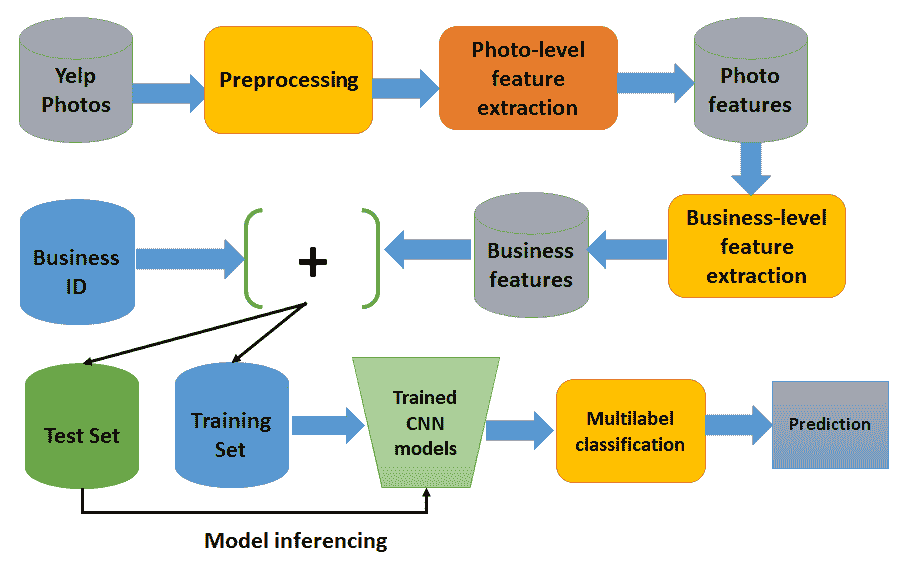

# 第三章：使用卷积神经网络进行多标签图像分类

在上一章中，我们开发了一个基于 LSTM 网络准确分类癌症患者的项目。这个问题在生物医学信息学中具有挑战性。不幸的是，当涉及到分类多媒体对象（如图像、音频或视频）时，线性机器学习模型和其他常规**深度神经网络**（**DNN**）模型，如**多层感知器**（**MLP**）或**深度置信网络**（**DBN**），常常无法学习或建模图像中的非线性特征。

另一方面，**卷积神经网络**（**CNNs**）可以用来克服这些限制。在 CNN 中，神经元之间的连接模式受到人类视觉皮层的启发，这种连接方式更准确地模拟了人类视觉，因此非常适合图像处理相关任务。因此，CNN 在多个领域取得了杰出的成功：计算机视觉、自然语言处理（NLP）、多媒体分析、图像搜索等。

考虑到这一动机，在本章中，我们将看到如何基于 Scala 和**Deeplearning4j**（**DL4J**）框架，在真实的 Yelp 图像数据集上，开发一个端到端的项目来处理多标签（即每个实体可以属于多个类别）图像分类问题。在正式开始之前，我们还将讨论一些 CNN 的理论方面内容。尽管如此，我们也会讨论如何调整超参数，以获得更好的分类结果。简而言之，在整个端到端项目中，我们将学习以下主题：

+   常规 DNN 的缺点

+   CNN 架构：卷积操作和池化层

+   使用卷积神经网络（CNN）进行大规模图像分类

+   常见问题（FAQ）

# 图像分类及深度神经网络（DNN）的缺点

在本项目中，我们将展示一个逐步的示例，展示如何使用 Scala 和 CNN 开发真实生活中的机器学习（ML）图像分类项目。一个这样的图像数据源是 Yelp，那里有很多照片和许多用户上传的照片。这些照片提供了跨类别的丰富本地商业信息。因此，使用这些照片，理解照片的背景并开发机器学习应用并非易事。我们将看到如何使用 DL4j 平台在 Java 中实现这一点。但是，在正式开始之前，了解一些理论背景是必要的。

在我们开始使用 CNN 开发端到端的图像分类项目之前，先来看看常规 DNN 的缺点。尽管常规 DNN 对于小图像（例如，MNIST 和 CIFAR-10）工作正常，但对于大规模和高质量图像，它因为需要大量的超参数而无法处理。例如，一张 200 × 200 的图像有 40,000 个像素，如果第一层只有 2,000 个神经元，那么仅第一层就会有 8000 万个不同的连接。因此，如果网络非常深，可能会有数十亿个参数。

CNN 通过使用部分连接层来解决这个问题。因为连续层只部分连接，而且由于其权重被大量复用，CNN 的参数远少于全连接的 DNN，这使得训练速度更快，减少了过拟合的风险，并且需要的训练数据大大减少。

此外，当 CNN 学会了可以检测特定特征的卷积核时，它可以在图像的任何位置检测该特征。相比之下，当 DNN 在某个位置学习到一个特征时，它只能在该特定位置检测到该特征。由于图像通常具有非常重复的特征，CNN 在图像处理任务（如分类）中能够比 DNN 更好地进行泛化，且需要的训练样本更少。

重要的是，DNN 并没有关于像素如何组织的先验知识：它不知道邻近的像素是相近的。CNN 的架构则嵌入了这种先验知识。较低的层通常识别图像中小区域的特征，而较高的层则将低级特征组合成更大的特征。这对于大多数自然图像来说效果很好，使得 CNN 相比 DNN 在处理图像时具有决定性的优势：


常规 DNN 与 CNN 的对比，其中每一层的神经元以 3D 排列

例如，在前面的图示中，左侧展示了一个常规的三层神经网络。右侧的 ConvNet 则将其神经元排列成三维（宽度、高度和深度），如图中某一层所示。`CNN`的每一层都将 3D 结构转化为神经元激活的 3D 输出结构。红色的输入层包含图像，因此其宽度和高度就是图像的尺寸，而深度则为三（红色、绿色和蓝色通道）。

因此，我们所看到的所有多层神经网络都由一长串神经元组成，我们必须在将图像输入网络之前，将其展平为 1D。然而，直接将 2D 图像输入 CNN 是可能的，因为 CNN 中的每一层都是以 2D 的形式表示的，这使得将神经元与其对应的输入进行匹配变得更加容易。我们将在接下来的部分中看到这方面的例子。

另一个重要的事实是，特征图中的所有神经元共享相同的参数，因此大大减少了模型中的参数数量。更重要的是，一旦 CNN 学会了在一个位置识别某个模式，它也可以在其他位置做到相同的事情。

# CNN 架构

在 CNN 网络中，层与层之间的连接方式与 MLP 或 DBN 显著不同。**卷积**（**conv**）层是 CNN 中的主要层类型，其中每个神经元都与输入图像的某个区域相连，这个区域称为**感受野**。

更具体地说，在卷积神经网络（CNN）架构中，几个卷积层以级联方式连接：每个卷积层后面跟着一个**整流线性单元**（**ReLU**）层，再是一个池化层，然后是更多的卷积层（+ReLU），接着是另一个池化层，依此类推。每个卷积层的输出是一组由单个核过滤器生成的特征图，然后这些特征图作为新的输入传递到下一层。在全连接层中，每个神经元生成一个输出，并跟随一个激活层（即 Softmax 层）：


卷积神经网络（CNN）的概念架构

如前图所示，池化层通常放置在卷积层之后（即两个卷积层之间）。池化层将卷积区域划分为子区域，然后，使用最大池化或平均池化技术选择一个代表性值，以减少后续层的计算时间。通过这种方式，卷积神经网络（CNN）可以被视为一个特征提取器。为了更清晰地理解这一点，请参考以下图示：


卷积神经网络（CNN）是一个端到端的网络，既作为特征提取器，又作为分类器。通过这种方式，它可以在（给定足够的训练数据的条件下）准确识别给定输入图像的标签。例如，它可以分类输入图像为一只老虎。

特征对其空间位置的鲁棒性也得到了增强。更具体来说，当特征图作为图像属性并通过灰度图像时，它随着网络的推进逐渐变小，但它通常也会变得越来越深，因为会添加更多的特征图。卷积操作为这个问题提供了解决方案，因为它减少了自由参数的数量，使得网络可以更深而参数更少。

# 卷积操作

卷积是一个数学运算，它将一个函数滑动到另一个函数上并测量它们逐点相乘的完整性。卷积层可能是卷积神经网络中最重要的构建模块。对于第一个卷积层，神经元并不是连接到输入图像中的每一个像素，而是只连接到它们感受野中的像素（参考前面的图示），而第二个卷积层中的每个神经元仅连接到第一层中位于小矩形内的神经元：


每个卷积神经元仅处理其感受野内的数据

在 第二章《使用递归类型网络进行癌症类型预测》中，我们已经看到所有的多层神经网络（例如，MLP）都有由大量神经元组成的层，并且我们必须在将输入图像喂入网络之前将其展平为 1D。而在 CNN 中，每一层是 2D 表示的，这使得将神经元与其关联输入匹配变得更容易。

感受野用于通过强制相邻层之间的局部连接模式来利用空间局部性。

这种架构使得网络能够在第一个隐藏层集中处理低级特征，然后在下一个隐藏层将它们组合成更高级的特征，依此类推。这种分层结构在现实世界的图像中很常见，这也是 CNN 在图像识别中表现如此出色的原因之一。

# 池化和填充操作

一旦你理解了卷积层的工作原理，池化层就很容易掌握。池化层通常在每个输入通道上独立工作，因此输出深度与输入深度相同。或者，你可以对深度维度进行池化，正如我们接下来会看到的那样，在这种情况下，图像的空间维度（例如，高度和宽度）保持不变，但通道数会减少。让我们从 TensorFlow API 文档中看看池化层的正式定义（详细信息请参见 [`github.com/petewarden/tensorflow_makefile/blob/master/tensorflow/python/ops/nn.py`](https://github.com/petewarden/tensorflow_makefile/blob/master/tensorflow/python/ops/nn.py)）：

“池化操作对输入张量进行矩形窗口扫描，为每个窗口计算一个归约操作（平均值、最大值或带有 argmax 的最大值）。每个池化操作使用一个称为 ksize 的矩形窗口，窗口之间通过偏移步幅进行分隔。例如，如果步幅都为 1，则使用每个窗口；如果步幅都为 2，则每个维度中使用每隔一个窗口，依此类推。”

类似于卷积层，池化层中的每个神经元与前一层中位于小矩形感受野内的有限数量的神经元相连接。然而，必须定义大小、步幅和填充类型。因此，总结来说，池化层的输出可以按以下方式计算：

```py
output[i] = reduce(value[strides * i:strides * i + ksize])  
```

其中索引也会考虑在内，与填充值一起使用。换句话说，使用池化的目标是对输入图像进行子采样，以减少计算负载、内存使用和参数数量。这有助于避免训练阶段的过拟合。

池化神经元没有权重。因此，它只使用聚合函数（如最大值或均值）聚合输入。

卷积操作的空间语义依赖于所选择的填充方案。填充是增加输入数据大小的操作：

+   **对于 1D 输入**：仅仅是一个数组附加一个常数，例如，`c`

+   **对于二维输入**：一个矩阵被 `c` 包围

+   **对于多维输入（即 nD 输入）**：nD 超立方体被 `c` 包围

现在，问题是，常数 `c` 是什么？在大多数情况下（但并非总是如此），`c` 是零，称为 **零填充**。这一概念可以进一步分解为两种类型的填充，分别叫做 `VALID` 和 `SAME`，具体说明如下：

+   **VALID 填充**：仅丢弃最右侧的列（或最底部的行）。

+   **SAME 填充**：在这种方案中，填充均匀地应用于左侧和右侧。然而，如果需要添加的列数是奇数，则会额外在右侧添加一列。

我们在下面的图中图示了前面的定义。如果我们希望某一层与前一层具有相同的高度和宽度，通常会在输入周围添加零。这称为 `SAME` 或零填充。

`SAME` 这个术语意味着输出特征图与输入特征图具有相同的空间维度。

另一方面，零填充被引入以根据需要使形状匹配，填充均匀地应用于输入图的每一侧。而 `VALID` 填充表示没有填充，只丢弃最右侧的列（或最底部的行）：


`SAME` 与 `VALID` 填充在 CNN 中的比较

在下面的图中，我们使用一个 2 × 2 池化核，步幅为 2 且没有填充。只有每个池化核中的最大输入值才会传递到下一层，其他的输入则被丢弃（我们稍后会看到这一点）：


使用最大池化的示例，即下采样

# 全连接层（密集层）

在网络的最上层，添加了一个常规的全连接层（前馈神经网络或密集层），它的作用类似于一个可能由几个全连接层（+ReLU）组成的 MLP，最终层输出预测结果：通常使用 Softmax 层，它会输出多类分类的估计类概率。

到目前为止，我们已经具备了关于 CNN 和它们在图像分类中的架构的最基本理论知识。接下来是做一个动手项目，涉及大规模 Yelp 图像的分类。在 Yelp 上，有许多照片和用户上传的照片，这些照片提供了丰富的本地商业信息，涵盖多个类别。教会计算机理解这些照片的背景并不是一项容易的任务。

Yelp 的工程师们正在公司内部从事基于深度学习的图像分类项目（更多内容请见 [`engineeringblog.yelp.com/2015/10/how-we-use-deep-learning-to-classify-business-photos-at-yelp.html`](https://engineeringblog.yelp.com/2015/10/how-we-use-deep-learning-to-classify-business-photos-at-yelp.html)）。

# 使用 CNN 进行多标签图像分类

在本节中，我们将展示一个系统化的例子，介绍如何开发实际的机器学习项目来进行图像分类。然而，我们首先需要了解问题描述，以便知道需要进行什么样的图像分类。此外，在开始之前，了解数据集是必要的。

# 问题描述

如今，食物自拍和以照片为中心的社交叙事正成为社交趋势。因此，大量包含食物的自拍照和餐厅照片被上传到社交媒体和网站上。在许多情况下，食物爱好者还会提供书面评论，这些评论可以显著提升商家的知名度（例如餐厅）。

例如，数百万独立访客访问了 Yelp 网站，并写下了超过 1.35 亿条评论。此外，许多照片和用户正在上传照片。然而，商家可以发布照片并与客户交流。通过这种方式，Yelp 通过向本地商家**出售广告**赚钱。

一个有趣的事实是，这些照片提供了跨类别的丰富本地商户信息。因此，开发深度学习应用来理解这些照片的背景将是一项有用的任务。请查看以下截图以获取一些洞察：


从 Yelp 数据集中挖掘一些关于商家的见解

因此，如果我们得到属于某个商家的照片，我们需要构建一个模型，使其能够自动为餐厅的用户上传照片打上多个标签，以预测商家的属性。最终，该项目的目标是将 Yelp 照片转化为文字。

# 数据集描述

这个有趣项目的 Yelp 数据集是从 [`www.kaggle.com/c/yelp-restaurant-photo-classification`](https://www.kaggle.com/c/yelp-restaurant-photo-classification) 下载的。我们已获得 Yelp 的许可，前提是这些图片不会被重新分发。不过，您需要从 [`www.yelp.com/dataset`](https://www.yelp.com/dataset) 获取使用许可。

提交评论是很棘手的。当 Yelp 用户想要提交评论时，他们必须手动从 Yelp 社区注释的九个不同标签中选择餐厅的标签，这些标签与数据集相关联。具体如下：

+   `0`：`适合午餐`

+   `1`：`适合晚餐`

+   `2`：`接受预订`

+   `3`：`户外座位`

+   `4`：`餐厅价格昂贵`

+   `5`：`提供酒水`

+   `6`：`有桌面服务`

+   `7`：`环境优雅`

+   `8`：`适合孩子`

因此，这是一个多标签多类别分类问题，其中每个商家可以有一个或多个之前列出的九个特征。因此，我们必须尽可能准确地预测这些标签。数据集中有六个文件，如下所示：

+   `train_photos.tgz`：用于训练集的照片（234,842 张图片）

+   `test_photos.tgz`：将用作测试集的照片（237,152 张图像）

+   `train_photo_to_biz_ids.csv`：提供照片 ID 与商业 ID 之间的映射（234,842 行）

+   `test_photo_to_biz_ids.csv`：提供照片 ID 与商业 ID 之间的映射（1,190,225 行）

+   `train.csv`：这是主要的训练数据集，包括商业 ID 和其对应的标签（2000 行）

+   `sample_submission.csv`：一个示例提交文件——参考正确的格式来提交你的预测结果，包括 `business_id` 和相应的预测标签

# 删除无效图像

我不知道为什么，但每个图像文件夹（训练集和测试集）中也包含一些临时图像，这些图像的名称模式为 `_*.jpg`，但并不是真正的图像。因此，我使用以下 UNIX 命令将其删除：

```py
$ find . -type f -name "._*.jpg" -exec rm -f {} ;
```

然后，我解压并将每个 `.csv` 文件复制到名为 `label` 的文件夹中。此外，我将训练图像和测试图像分别移动到 `train` 和 `test` 文件夹（即在 `images` 文件夹内）。简而言之，经过提取和复制后，我们项目中使用的文件夹结构如下。因此，最终的结构将如下所示：


大型电影评论数据集中的文件夹结构

# 整体项目的工作流程

既然我们已经知道这是一个多标签多分类图像分类问题，我们就必须处理多个实例问题**。** 由于 DL4J 没有提供如何解决多标签多分类图像分类问题的示例，我找到 Andrew Brooks 的博客文章（见 [`brooksandrew.github.io/simpleblog/articles/convolutional-neural-network-training-with-dl4j/`](http://brooksandrew.github.io/simpleblog/articles/convolutional-neural-network-training-with-dl4j/)）为此项目提供了动机**。**

我只是将餐厅的标签应用到所有与之相关的图像，并将每个图像当作一个单独的记录。更技术性一点来说，我将每个类别当作一个单独的二分类问题来处理。然而，在项目的开始部分，我们将看到如何在 Java 中将 `.jpg` 格式的图像读取为矩阵表示。接着，我们将进一步处理并准备这些图像，以便它们能够被卷积神经网络（CNN）接受。此外，由于图像的形状和大小并不统一，我们需要进行几轮图像预处理操作，例如将每张图像调整为统一的尺寸，再应用灰度滤镜：


卷积神经网络（CNN）在图像分类中的概念化视图

然后，我们在每个类别的训练数据上训练九个 CNN。一旦训练完成，我们会保存训练好的模型、CNN 配置和参数，以便之后可以恢复它们。接着，我们应用一个简单的聚合函数为每个餐厅分配类别，每个餐厅都有多个与之关联的图片，每张图片都有一个属于九个类别的概率向量。接下来，我们对测试数据进行评分，最后，我们使用测试图像评估模型。

现在，让我们看看每个 CNN 的结构。每个网络将有两个卷积层、两个子采样层、一个全连接层和一个输出层作为全连接层。第一层是卷积层，接着是一个子采样层，然后是另一个卷积层，接下来是一个子采样层，然后是一个全连接层，最后是一个输出层。我们稍后会看到每一层的具体结构。简而言之，Java 类（`YelpImageClassifier.java`）的工作流程如下：

1.  我们从`train.csv`文件中读取所有的商家标签

1.  然后，我们读取并创建一个从图像 ID 到商家 ID 的映射，格式为 imageID | busID

1.  然后，我们从`photoDir`目录中生成一个图像列表进行加载和处理，这有助于我们检索某些数量图像的图像 ID

1.  然后，我们读取并处理图像，生成 photoID | 向量的映射

1.  我们将步骤 3 和步骤 4 的输出连接起来，以对齐商家特征、图像 ID 和标签 ID，从而提取图像特征

1.  然后，我们为多标签设置构建九个 CNN，分别对应九个可能的标签

1.  然后，我们训练所有的 CNN，并指定模型保存位置

1.  *步骤 2*到*步骤 6*会多次重复，以从测试集提取特征

1.  最后，我们评估模型并将预测结果保存在 CSV 文件中

现在，让我们看看前面的步骤在高级图示中的样子，如下所示：



DL4j 图像处理管道，用于图像分类

内容太多了吗？别担心；我们现在将详细查看每个步骤。如果你仔细查看前面的步骤，你会发现步骤 1 到步骤 5 是图像处理和特征构造。然后，步骤 6 是训练九个 CNN，接着在步骤 7 中，我们保存训练好的 CNN，以便在结果提交时恢复它们。

# 图像预处理

当我尝试开发这个应用程序时，我发现照片的形状和大小各不相同：有些图片是高的，有些是宽的，有些是外景的，有些是室内的，而且大部分是食物。此外，图像的形状也各不相同（尽管大多数图像大致是方形的），像素数量也不同，其中许多图像的尺寸正好是 500 x 375：


调整大小后的图（左侧是原始的高图，右侧是方形图）

我们已经看到，卷积神经网络（CNN）无法处理形状和大小各异的图像。虽然有很多强大且高效的图像处理技术可以提取出**感兴趣区域**（**ROI**），但说实话，我并不是图像处理方面的专家，所以我决定将这一步骤保持简单。简单来说，我将所有图像都做成正方形，但仍然尽量保持它们的质量。问题在于，ROI 在大多数情况下是集中在图像中心的。所以，仅捕捉每个图像的中间正方形并不是一项简单的任务。不过，我们还需要将每个图像转换为灰度图像。让我们将不规则形状的图像裁剪为正方形。看看下面的图像，左侧是原始图像，右侧是裁剪后的正方形图像。

我们已经生成了一个正方形图像，但我们是如何做到的呢？首先，我检查了图像的高度和宽度是否相同，然后对图像进行了调整大小。在另外两种情况下，我裁剪了图像的中心区域。以下方法完成了这个任务（但是请随时执行`SquaringImage.java`脚本以查看输出）：

```py
private static BufferedImage makeSquare(BufferedImage img) {
        int w = img.getWidth();
        int h = img.getHeight();
        int dim = Math.min(w, h);

        if (w == h) {
            return img;
        } else if (w > h) {
            return Scalr.crop(img, (w - h) / 2, 0, dim, dim);
        } else {
            return Scalr.crop(img, 0, (h - w) / 2, dim, dim);
        }
    }
```

做得很好！现在我们所有的训练图像都已经变成正方形，接下来的步骤是使用导入预处理任务来调整它们的大小。我决定将所有图像的大小调整为 128 x 128。让我们看看调整大小后的图像是什么样子的（原始图像）：


图像调整大小（分别为 256 x 256、128 x 128、64 x 64 和 32 x 32）

以下方法完成了这个任务（但是请随时执行`imageUtils.java`脚本以查看演示）：

```py
// resize pixels
    public static BufferedImage resizeImg(BufferedImage img, int width, int height) {
        return Scalr.resize(img, Scalr.Method.BALANCED, width, height);
    }
```

顺便说一下，关于图像的调整大小和裁剪正方形，我使用了一些内置的图像读取包和一些第三方处理包：

```py
import javax.imageio.ImageIO;
import org.imgscalr.Scalr;
```

要使用上述包，请在 Maven 友好的`pom.xml`文件中添加以下依赖项（有关依赖项的完整列表，请参阅本章提供的`pom.xml`文件）：

```py
<dependency>
      <groupId>org.imgscalr</groupId>
      <artifactId>imgscalr-lib</artifactId>
      <version>4.2</version>
</dependency>
<dependency>
      <groupId>org.datavec</groupId>
      <artifactId>datavec-data-image</artifactId>
      <version>${dl4j.version}</version>
</dependency>
```

处理彩色图像更具趣味性且效果更好，基于 DL4J 的 CNN 也可以处理彩色图像。然而，为了简化计算，使用灰度图像更为理想。尽管如此，这种方法可以使整体表示更加简单且节省空间。

我们来举个例子：我们将每个 256 x 256 像素的图像调整大小，这样它的特征数就变成了 16,384，而不是像彩色图像那样是 16,384 x 3（因为彩色图像有三个 RGB 通道）（执行`GrayscaleConverter.java`来查看演示）。让我们看看转换后的图像会是什么样子：


左侧是原始图像，右侧是经过 RGB 均值化处理的灰度图像

上述转换是通过两个方法实现的，分别是`pixels2Gray()`和`makeGray()`。前者将 RGB 像素转换为相应的灰度像素。让我们来看一下这个方法的签名：

```py
private static int pixels2Gray(int R, int G, int B) {
        return (R + G + B) / 3;
    }
private static BufferedImage makeGray(BufferedImage testImage) {
        int w = testImage.getWidth();
        int h = testImage.getHeight();
        for (int w1 = 0; w1 < w; w1++) {
            for (int h1 = 0; h1 < h; h1++) {
                int col = testImage.getRGB(w1, h1);
                int R = (col & 0xff0000) / 65536;
                int G = (col & 0xff00) / 256;
                int B = (col & 0xff);
                int graycol = pixels2Gray(R, G, B);
                testImage.setRGB(w1, h1, new Color(graycol, graycol, graycol).getRGB());
            }
        }
        return testImage;
    }
```

那么，背后发生了什么？我们将所有之前的三步操作链接在一起：先将所有图像变成正方形，然后将它们转换为 256 x 256 的大小，最后将调整大小后的图像转换为灰度图像（假设`x`是待转换的图像）：

```py
convertedImage = ImageIO.read(new File(x))
          .makeSquare()
          .resizeImg(resizeImgDim, resizeImgDim) // (128, 128)
         .image2gray();
```

因此，总结来说，现在所有图像都是灰度图，但只有在平方和调整大小之后。以下图像可以给我们一些关于转换步骤的概念：


调整大小的图像（左边是原始的高图，右边是平方后的图）

之前的链式操作也带来了一些额外的工作。现在，将这三步代码整合在一起，我们终于可以准备好所有图像：

```py
//imageUtils.java
public class imageUtils {
    // image 2 vector processing
    private static Integer pixels2gray(Integer red, Integer green, Integer blue){
        return (red + green + blue) / 3;
    }
    private static List<Integer> pixels2color(Integer red, Integer green, Integer blue) {
        return Arrays.asList(red, green, blue);
    }

private static <T> List<T> image2vec(BufferedImage img, Function<Triple<Integer, Integer, Integer>, T> f) {
        int w = img.getWidth();
        int h = img.getHeight();

        ArrayList<T> result = new ArrayList<>();
        for (int w1 = 0; w1 < w; w1++ ) {
            for (int h1 = 0; h1 < h; h1++) {
                int col = img.getRGB(w1, h1);
                int red =  (col & 0xff0000) / 65536;
                int green = (col & 0xff00) / 256;
                int blue = (col & 0xff);
                result.add(f.apply(new Triple<>(red, green, blue)));
            }
        }
        return result;
    }

    public static List<Integer> image2gray(BufferedImage img) {
        return image2vec(img, t -> pixels2gray(t.getFirst(), t.getSecond(), t.getThird()));
    }

    public static List<Integer> image2color(BufferedImage img) {
        return image2vec(img, t -> pixels2color(t.getFirst(), t.getSecond(), t.getThird()))
                .stream()
                .flatMap(l -> l.stream())
                .collect(Collectors.toList());
    }

    // make image square
    public static BufferedImage makeSquare(BufferedImage img) {
        int w = img.getWidth();
        int h = img.getHeight();
        int dim = Math.min(w, h);

        if (w == h) {
            return img;
        } else if (w > h) {
            return Scalr.crop(img, (w-h)/2, 0, dim, dim);
        } else  {
            return Scalr.crop(img, 0, (h-w)/2, dim, dim);
        }
    }

    // resize pixels
public static BufferedImage resizeImg(BufferedImage img, int width, int height) {
        return Scalr.resize(img, Scalr.Method.BALANCED, width, height);
    }
}
```

# 提取图像元数据

到目前为止，我们已经加载并预处理了原始图像。然而，我们还不了解添加到图像上的元数据，而这些元数据是 CNN 学习所需要的。因此，是时候加载那些包含每个图像元数据的 CSV 文件了。

我写了一个名为`readMetadata()`的方法，用于以 CSV 格式读取这些元数据，以便它能被两个其他方法`readBusinessLabels`和`readBusinessToImageLabels`使用。这三个方法在`CSVImageMetadataReader.java`脚本中定义。以下是`readMetadata()`方法的签名：

```py
public static List<List<String>> readMetadata(String csv, List<Integer> rows) throws IOException {
        boolean defaultRows = rows.size() == 1 && rows.get(0) == -1;
        LinkedList<Integer> rowsCopy = null;
        if (!defaultRows) {
            rowsCopy = new LinkedList<>(rows);
        }
        try(BufferedReader bufferedReader = new BufferedReader(new InputStreamReader(new FileInputStream(new File(csv))))) {
            ArrayList<List<String>> arrayList = new ArrayList<>();
            String line = bufferedReader.readLine();
            int i = 0;
            while (line != null) {
                if (defaultRows || rowsCopy.getFirst() == i) {
                    if (!defaultRows) {
                        rowsCopy.removeFirst();
                    }
                    arrayList.add(Arrays.asList(line.split(",")));
                }
                line = bufferedReader.readLine();
                i++;
            }
            return arrayList;
        }
    }
```

`readBusinessLabels()`方法将业务 ID 映射到标签，形式为 businessID | Set(labels)：

```py
public static Map<String, Set<Integer>> readBusinessLabels(String csv) throws IOException {
        return readBusinessLabels(csv, DEFAULT_ROWS);
    }

public static Map<String, Set<Integer>> readBusinessLabels(String csv, List<Integer> rows) throws IOException {
        return readMetadata(csv, rows).stream()
                .skip(1)
                .map(l -> parseBusinessLabelsKv(l))
                .collect(Collectors.toMap(e -> e.getKey(), e -> e.getValue()));
    }
```

`readBusinessToImageLabels()`方法将图像 ID 映射到业务 ID，形式为 imageID | businessID：

```py
public static Map<Integer, String> readBusinessToImageLabels(String csv) throws IOException {
        return readBusinessToImageLabels(csv, DEFAULT_ROWS);
    }

public static Map<Integer, String> readBusinessToImageLabels(String csv, List<Integer> rows) throws IOException {
        return readMetadata(csv, rows).stream()
                .skip(1)
                .map(l -> parseBusinessToImageLabelsKv(l))
                .collect(Collectors.toMap(e -> e.getKey(), e -> e.getValue(), useLastMerger()));
    }
```

# 图像特征提取

到目前为止，我们已经看到了如何预处理图像并通过将它们与原始图像链接来提取图像元数据。现在，我们需要从这些预处理过的图像中提取特征，以便将它们输入到 CNN 中。

我们需要进行特征提取的映射操作，用于业务、数据和标签。这三个操作将确保我们不会丢失任何图像的来源（参见`imageFeatureExtractor.java`脚本）：

+   业务 ID | businessID 的业务映射

+   形式为 imageID | 图像数据的数据映射

+   业务 ID | 标签的标签映射

首先，我们必须定义一个正则表达式模式，从`CSVImageMetadataReaderclass`中提取 jpg 名称，该模式用于与训练标签进行匹配：

```py
public static Pattern patt_get_jpg_name = Pattern.compile("[0-9]");
```

然后，我们提取与各自业务 ID 关联的所有图像 ID：

```py
public static List<Integer> getImgIdsFromBusinessId(Map<Integer, String> bizMap, List<String> businessIds) {
        return bizMap.entrySet().stream().filter(x -> 
                 businessIds.contains(x.getValue())).map(Map.Entry::getKey)
                .collect(Collectors.toList());
    }
```

现在，我们需要加载并处理所有已经预处理过的图像，通过将它们与之前示例中提取的业务 ID 进行映射，来提取图像 ID：

```py
public static List<String> getImageIds(String photoDir, Map<Integer, String> businessMap, 
                                       List<String> businessIds) {
        File d = new File(photoDir);
        List<String> imgsPath = Arrays.stream(d.listFiles()).map(f -> 
                                f.toString()).collect(Collectors.toList());
        boolean defaultBusinessMap = businessMap.size() == 1 && businessMap.get(-1).equals("-1");
        boolean defaultBusinessIds = businessIds.size() == 1 && businessIds.get(0).equals("-1");
        if (defaultBusinessMap || defaultBusinessIds) {
            return imgsPath;
        } else {
            Map<Integer, String> imgsMap = imgsPath.stream()
                    .map(x -> new AbstractMap.SimpleEntry<Integer, String>(extractInteger(x), x))
                    .collect(Collectors.toMap(e -> e.getKey(), e -> e.getValue()));
            List<Integer> imgsPathSub = imageFeatureExtractor.getImgIdsFromBusinessId(
                                        businessMap, businessIds);
            return imgsPathSub.stream().filter(x -> imgsMap.containsKey(x)).map(x -> imgsMap.get(x))
                    .collect(Collectors.toList());
        }
    }
```

在上面的代码块中，我们从 photoDir 目录（原始图像所在的位置）获取了一张图像列表。`ids`参数是一个可选参数，用于从 photoDir 加载的图像中进行子集选择。到目前为止，我们已经成功提取出所有与至少一个业务相关的图像 ID。接下来的步骤是读取并处理这些图像，将它们转换为图像 ID → 向量映射：

```py
public static Map<Integer, List<Integer>> processImages(List<String> imgs, int resizeImgDim, int nPixels) {
        Function<String, AbstractMap.Entry<Integer, List<Integer>>> handleImg = x -> {
            BufferedImage img = null;
            try {
                img = ImageIO.read(new File(x));
            } catch (IOException e) {
                e.printStackTrace();
            }
            img = makeSquare(img);
            img = resizeImg(img, resizeImgDim, resizeImgDim);
            List<Integer> value = image2gray(img);
            if(nPixels != -1) {
                value = value.subList(0, nPixels);
            }
            return new AbstractMap.SimpleEntry<Integer, List<Integer>>(extractInteger(x), value);
        };

        return imgs.stream().map(handleImg).filter(e -> !e.getValue().isEmpty())
                .collect(Collectors.toMap(e -> e.getKey(), e -> e.getValue()));
    }
```

在前面的代码块中，我们将图像读取并处理成了 photoID → 向量映射。`processImages()` 方法接受以下参数：

+   `images`：`getImageIds()` 方法中的图像列表

+   `resizeImgDim`：重新调整方形图像的尺寸

+   `nPixels`：用于采样图像的像素数，以显著减少测试特征时的运行时间

干得好！我们距离提取训练 CNN 所需的数据只差一步。特征提取的最后一步是提取像素数据，该数据由四个对象组成，用来跟踪每个图像——即 imageID、businessID、标签和像素数据：


图像数据表示

因此，如前面的图示所示，主数据结构是由四种数据类型（即四个元组）构成——`imgID`、`businessID`、`像素数据向量` 和 `标签`：

因此，我们应该有一个包含这些对象所有部分的类。别担心，我们所需要的一切都在 `FeatureAndDataAligner.java` 脚本中定义。一旦我们通过在 `YelpImageClassifier.java` 脚本（在主方法下）中使用以下代码行实例化 `FeatureAndDataAligner`，就能提供 `businessMap`、`dataMap` 和 `labMap`：

```py
FeatureAndDataAligner alignedData = new FeatureAndDataAligner(dataMap, businessMap, Optional.*of*(labMap));
```

在这里，由于在测试数据上评分时没有这些信息，因此使用了 `labMap` 的选项类型——也就是说，它是可选的。现在，让我们来看一下我是如何实现的。我们从正在使用的类的构造函数开始，初始化前述数据结构：

```py
private Map<Integer, List<Integer>> dataMap;
private Map<Integer, String> bizMap;
private Optional<Map<String, Set<Integer>>> labMap;
private List<Integer> rowindices;

public FeatureAndDataAligner(Map<Integer, List<Integer>> dataMap, Map<Integer, String> bizMap, Optional<Map<String, Set<Integer>>> labMap) {
        this(dataMap, bizMap, labMap, dataMap.keySet().stream().collect(Collectors.toList()));
    }
```

现在，我们通过 `FeatureAndDataAligner.java` 类的构造函数初始化这些值，如下所示：

```py
public FeatureAndDataAligner(Map<Integer, List<Integer>> dataMap, Map<Integer, String> bizMap, Optional<Map<String, Set<Integer>>> labMap,List<Integer> rowindices) {
        this.dataMap = dataMap;
        this.bizMap = bizMap;
        this.labMap = labMap;
        this.rowindices = rowindices;
    }
```

现在，在对齐数据时，如果 `labMap` 为空——也就是没有提供训练数据——也可以使用以下方法：

```py
public FeatureAndDataAligner(Map<Integer, List<Integer>> dataMap, Map<Integer, String> bizMap) {
        this(dataMap, bizMap, Optional.empty(), dataMap.keySet().stream().collect(Collectors.toList()));
    }
```

现在，我们需要将图像 ID 和图像数据与业务 ID 对齐。为此，我编写了 `BusinessImgageIds()` 方法：

```py
public List<Triple<Integer, String, List<Integer>>> alignBusinessImgageIds(Map<Integer, List<Integer>> dataMap, Map<Integer, String> bizMap) {
        return alignBusinessImgageIds(dataMap, bizMap, dataMap.keySet().stream().collect(Collectors.toList()));
    }   
```

实际实现位于以下重载方法中，如果图像没有业务 ID，则返回可选值：

```py
public List<Triple<Integer, String, List<Integer>>> alignBusinessImgageIds(Map<Integer, List<Integer>> dataMap, Map<Integer, String> bizMap, List<Integer> rowindices) {
        ArrayList<Triple<Integer, String, List<Integer>>> result = new ArrayList<>();
        for (Integer pid : rowindices) {
            Optional<String> imgHasBiz = Optional.ofNullable(bizMap.get(pid));
            String bid = imgHasBiz.orElse("-1");
            if (dataMap.containsKey(pid) && imgHasBiz.isPresent()) {
               result.add(new ImmutableTriple<>(pid, bid, dataMap.get(pid)));
            }
        }
        return result;
    }
```

最后，如前面的图示所示，我们现在需要对齐标签，它是一个由 `dataMap`、`bizMap`、`labMap` 和 `rowindices` 组成的四元组列表：

```py
private List<Quarta<Integer, String, List<Integer>, Set<Integer>>> alignLabels(Map<Integer, List<Integer>>   
                                                                   dataMap, Map<Integer, String>             
                                                                   bizMap,Optional<Map<String, 
 Set<Integer>>> labMap,  
                                                                   List<Integer> rowindices) {
        ArrayList<Quarta<Integer, String, List<Integer>, Set<Integer>>> result = new ArrayList<>();
        List<Triple<Integer, String, List<Integer>>> a1 = alignBusinessImgageIds(dataMap, 
                                                                                 bizMap, rowindices);
        for (Triple<Integer, String, List<Integer>> p : a1) {
            String bid = p.getMiddle();
            Set<Integer> labs = Collections.emptySet();
            if (labMap.isPresent() && labMap.get().containsKey(bid)) {
                 labs = labMap.get().get(bid);
            }
            result.add(new Quarta<>(p.getLeft(), p.getMiddle(), p.getRight(), labs));
        }
        return result;
    }
```

在前面的代码块中，`Quarta` 是一个帮助我们维护所需数据结构的 case 类，如下所示：

```py
public static class Quarta <A, B, C, D> {
        public final A a;
        public final B b;
        public final C c;
        public final D d;

        public Quarta(A a, B b, C c, D d) {
            this.a = a;
            this.b = b;
            this.c = c;
            this.d = d;
        }
    }
```

最后，我们预先计算并保存数据，这样该方法在每次调用时就不需要重新计算了：

```py
 private volatile List<Quarta<Integer, String, List<Integer>, Set<Integer>>> _data = null;
// pre-computing and saving data as a val so method does not need to re-compute each time it is called.
public List<Quarta<Integer, String, List<Integer>, Set<Integer>>> data() {
        if (_data == null) {
            synchronized (this) {
                if (_data == null) {
                    _data = alignLabels(dataMap, bizMap, labMap, rowindices);
                }
            }
        }
        return _data;
    }
```

最后，如前面代码块中所使用的，我们现在创建了一些获取方法，以便在每次调用时，我们可以轻松地为每个业务获取 `图像 ID`、`业务 ID`、业务标签和图像：

```py
// getter functions
public List<Integer> getImgIds() {
        return data().stream().map(e -> e.a).collect(Collectors.toList());
    }
public List<String> getBusinessIds() {
        return data().stream().map(e -> e.b).collect(Collectors.toList());
    }
public List<List<Integer>> getImgVectors() {
        return data().stream().map(e -> e.c).collect(Collectors.toList());
    }
public List<Set<Integer>> getBusinessLabels() {
        return data().stream().map(e -> e.d).collect(Collectors.toList());
    }
public Map<String, Integer> getImgCntsPerBusiness() {
        return getBusinessIds().stream().collect(Collectors.groupingBy(Function.identity())).entrySet()
                .stream().map(e -> new AbstractMap.SimpleEntry<>(e.getKey(), e.getValue().size()))
                .collect(Collectors.toMap(e -> e.getKey(), e -> e.getValue()));
    }
```

很好！到目前为止，我们已经成功提取了训练 CNN 所需的特征。然而，问题是当前形式下的特征仍然不适合直接输入到 CNN 中。这是因为我们只有特征向量而没有标签。因此，它需要另一个中间转换。

# 准备 ND4J 数据集

如前所述，我们需要进行中间转换，以准备包含特征向量和标签的训练集：图像中的特征，但标签来自业务标签。

为此，我们有`makeND4jDataSets`类（有关详细信息，请参见`makeND4jDataSets.java`）。该类从`List[(imgID, bizID, labels, pixelVector)]`数据结构中通过`alignLables`函数创建 ND4J 数据集对象。首先，我们使用`makeDataSet()`方法如下所示来准备数据集：

```py
public static DataSet makeDataSet(FeatureAndDataAligner alignedData, int bizClass) {
        INDArray alignedXData = makeDataSetTE(alignedData);
        List<Set<Integer>> labels = alignedData.getBusinessLabels();
        float[][] matrix2 = labels.stream().map(x -> (x.contains(bizClass) ? new float[]{1, 0} 
                             : new float[]{0, 1})).toArray(float[][]::new);
        INDArray alignedLabs = toNDArray(matrix2);
        return new DataSet(alignedXData, alignedLabs);
    }
```

然后，我们还需要将前面的数据结构转换为`INDArray`，这样它就可以被 CNN 使用：

```py
public static INDArray makeDataSetTE(FeatureAndDataAligner alignedData) {
        List<List<Integer>> imgs = alignedData.getImgVectors();
        double[][] matrix = new double[imgs.size()][];
        for (int i = 0; i < matrix.length; i++) {
            List<Integer> img = imgs.get(i);
            matrix[i] = img.stream().mapToDouble(Integer::doubleValue).toArray();
        }
        return toNDArray(matrix);
    }
```

在前面的代码块中，`toNDArray()`方法用于将 double 或 float 矩阵转换为`INDArray`格式：

```py
// For converting floar matrix to INDArray
private static INDArray toNDArray(float[][] matrix) {
          return Nd4j.*create*(matrix);
             }
// For converting double matrix to INDArray
private static INDArray toNDArray(double[][] matrix) {
            return Nd4j.*create*(matrix);
                  }
```

太棒了！我们成功地从图像中提取了所有元数据和特征，并将训练数据准备成了 ND4J 格式，现在可以被基于 DL4J 的模型使用。然而，由于我们将使用 CNN 作为模型，我们仍然需要在网络构建过程中通过使用`convolutionalFlat`操作将这个二维对象转换为四维。无论如何，我们将在下一节中看到这一点。

# 训练、评估和保存训练好的 CNN 模型

到目前为止，我们已经看到了如何准备训练集。现在，我们面临更具挑战性的部分，因为我们必须用 234,545 张图像来训练我们的卷积神经网络（CNN），尽管测试阶段可以通过有限数量的图像来简化，例如，500 张图像。因此，最好使用 DL4j 的`MultipleEpochsIterator`以批量模式训练每个 CNN，这个数据集迭代器可以对数据集进行多次遍历。

`MultipleEpochsIterator`是一个数据集迭代器，用于对数据集进行多次遍历。更多信息请参见[`deeplearning4j.org/doc/org/deeplearning4j/datasets/iterator/MultipleEpochsIterator.html`](https://deeplearning4j.org/doc/org/deeplearning4j/datasets/iterator/MultipleEpochsIterator.html)。

# 网络构建

以下是重要超参数及其详细信息的列表。在这里，我将尝试构建一个五层的 CNN，如下所示：

+   第一层有一个`ConvolutionLayer`，具有 6 x 6 卷积核、一个通道（因为它们是灰度图像）、步长为 2 x 2，并且有 20 个特征图，其中 ReLU 是激活函数：

```py
ConvolutionLayer layer_0 = new ConvolutionLayer.Builder(6,6)
            .nIn(nChannels)
            .stride(2,2) // default stride(2,2)
            .nOut(20) // # of feature maps
            .dropOut(0.7) // dropout to reduce overfitting
            .activation(Activation.*RELU*) // Activation: rectified linear units
            .build();
```

+   第一层有`SubsamplingLayer`最大池化，步长为 2x2。因此，通过使用步长，我们按 2 的因子进行下采样。注意，只有 MAX、AVG、SUM 和 PNORM 是支持的。这里，卷积核的大小将与上一个`ConvolutionLayer`的滤波器大小相同。因此，我们不需要显式定义卷积核的大小：

```py
SubsamplingLayer layer_1 = new SubsamplingLayer
                .Builder(SubsamplingLayer.PoolingType.*MAX*)
                .stride(2, 2)
                .build();
```

+   第二层是一个具有 6 x 6 卷积核、一个通道（因为它们是灰度图像）、步长为 2 x 2、并且有 20 个输出神经元的`ConvolutionLayer`，其激活函数为 RELU。我们将使用 Xavier 进行网络权重初始化：

```py
ConvolutionLayer layer_2= new ConvolutionLayer.Builder(6, 6)
            .stride(2, 2) // nIn need not specified in later layers
            .nOut(50)
            .activation(Activation.*RELU*) // Activation: rectified linear units
            .build();
```

+   层 3 有 `SubsamplingLayer` 最大池化，并且步幅为 2 x 2。因此，使用步幅，我们将数据下采样 2 倍。请注意，只有 MAX、AVG、SUM 和 PNORM 被支持。这里，卷积核大小将与上一层 `ConvolutionLayer` 的滤波器大小相同。因此，我们不需要显式地定义卷积核大小：

```py
SubsamplingLayer layer_3 = new SubsamplingLayer
           .Builder(SubsamplingLayer.PoolingType.*MAX*)
           .stride(2, 2)
           .build();
```

+   层 4 有一个 `DenseLayer`，即一个完全连接的前馈层，通过反向传播进行训练，具有 50 个神经元，并且使用 ReLU 作为激活函数。需要注意的是，我们不需要指定输入神经元的数量，因为它假定输入来自前面的 `ConvolutionLayer`：

```py
DenseLayer layer_4 = new DenseLayer.Builder() // Fully connected layer
               .nOut(500)
               .dropOut(0.7) // dropout to reduce overfitting
              .activation(Activation.*RELU*) // Activation: rectified linear units 
             .build();
```

+   层 5 是一个 `OutputLayer`，具有两个输出神经元，由 softmax 激活驱动（即，对类别的概率分布）。我们使用 XENT（即二分类的交叉熵）作为损失函数来计算损失：

```py
OutputLayer layer_5 = new OutputLayer.Builder(LossFunctions.LossFunction.*XENT*)
          .nOut(outputNum) // number of classes to be predicted
          .activation(Activation.*SOFTMAX*)
          .build();
```

除了这些层，我们还需要执行图像展平——即，将一个 2D 对象转换为一个 4D 可消耗的对象，使用 CNN 层通过调用以下方法：

```py
convolutionalFlat(numRows, numColumns, nChannels))
```

因此，总结来说，使用 DL4J，我们的 CNN 将如下所示：

```py
MultiLayerConfiguration conf = new NeuralNetConfiguration.Builder()
           .seed(seed)a
           .miniBatch(true) // for MultipleEpochsIterator
           .optimizationAlgo(OptimizationAlgorithm.*STOCHASTIC_GRADIENT_DESCENT*)
           .updater(new Adam(0.001)) // Aama for weight updater
           .weightInit(WeightInit.*XAVIER*) //Xavier weight init
           .list()
                    .layer(0, layer_0)
                    .layer(1, layer_1)
                    .layer(2, layer_2)
                    .layer(3, layer_3)
                    .layer(4, layer_4)
                   .layer(5, layer_5)
            .setInputType(InputType.*convolutionalFlat*(numRows, numColumns, nChannels))
            .backprop(true).pretrain(false)
            .build();
```

与训练相关的其他重要方面如下所示：

+   **样本数量**：如果你在没有 GPU 的情况下训练所有图像，也就是使用 CPU，那么可能需要几天时间。当我尝试使用 50,000 张图像时，在一台配备 Core i7 处理器和 32 GB 内存的机器上，花费了整整一天。现在，你可以想象整个数据集训练需要多长时间。此外，即使你以批处理模式进行训练，它也需要至少 256 GB 的内存。

+   **训练轮数**：这是指对所有训练记录进行迭代的次数。由于时间限制，我进行了 10 轮训练。

+   **批次数量**：这是每个批次中的记录数，例如，32、64 和 128。我使用了 128。

现在，使用前面的超参数，我们可以开始训练我们的 CNN。以下代码完成了这个任务。首先，我们准备训练集，然后定义所需的超参数，接着，我们对数据集进行标准化，使得 ND4j 数据框架被编码，以便将所有被认为是正确的标签标记为 1，其他标签标记为 0。然后，我们对编码后的数据集进行行和标签的洗牌。

然后，我们需要分别使用 `ListDataSetIterator` 和 `MultipleEpochsIterator` 为数据集创建迭代器。一旦数据集转换为批处理模型，我们就可以开始训练构建的 CNN：

```py
log.info("Train model....");
for( int i=0; i<nepochs; i++ ){
      model.fit(epochitTr);
}
```

一旦训练完成，我们可以在测试集上评估模型：

```py
log.info("Evaluate model....");
Evaluation eval = new Evaluation(outputNum)

while (epochitTe.hasNext()) {
       DataSet testDS = epochitTe.next(nbatch);
       INDArray output = model.output(testDS.getFeatureMatrix());
       eval.eval(testDS.getLabels(), output);
}
```

当评估完成后，我们现在可以检查每个 CNN 的结果（运行 `YelpImageClassifier.java` 脚本）：

```py
System.*out*.println(eval.stats())
>>>
 ==========================Scores========================================
 Accuracy: 0.5600
 Precision: 0.5584
 Recall: 0.5577
 F1 Score: 0.5926
 Precision, recall & F1: reported for positive class (class 1 - "1") only
 ========================================================================
```

哎呀！不幸的是，我们没有看到好的准确率。然而，别担心，因为在 FAQ 部分，我们将看到如何改善这个问题。最后，我们可以保存逐层网络配置和网络权重，以便以后使用（即，在提交前进行评分）：

```py
if (!saveNN.isEmpty()) {
      // model config
      FileUtils.write(new File(saveNN + ".json"), model.getLayerWiseConfigurations().toJson());
      // model parameters
      DataOutputStream dos = new DataOutputStream(Files.*newOutputStream*(Paths.*get*(saveNN + ".bin")));
      Nd4j.*write*(model.params(), dos);
         }
    log.info("****************Example finished********************");
}
```

在之前的代码中，我们还保存了一个包含所有网络配置的 JSON 文件，以及一个保存所有 CNN 权重和参数的二进制文件。这是通过`saveNN()`和`loadNN()`两个方法实现的，两个方法定义在`NetwokSaver.java`脚本中。首先，让我们看一下`saveNN()`方法的签名，如下所示：

```py
public void saveNN(MultiLayerNetwork model, String NNconfig, String NNparams) throws IOException {
       // save neural network config
       FileUtils.write(new File(NNconfig), model.getLayerWiseConfigurations().toJson());

       // save neural network parms
      DataOutputStream dos = new  DataOutputStream(Files.*newOutputStream*(Paths.*get*(NNparams)));        
      Nd4j.*write*(model.params(), dos);
  }
```

这个思路既有远见又很重要，因为正如我之前所说的，你不会重新训练整个网络来评估新的测试集。例如，假设你只想测试一张图像。关键是，我们还提供了另一个名为`loadNN()`的方法，它可以读取我们之前创建的`.json`和`.bin`文件并将其加载到`MultiLayerNetwork`中，这样就可以用来对新的测试数据进行评分。这个方法如下所示：

```py
public static MultiLayerNetwork loadNN(String NNconfig, String NNparams) throws IOException {
        // get neural network config
        MultiLayerConfiguration confFromJson = MultiLayerConfiguration
                .fromJson(FileUtils.readFileToString(new File(NNconfig)));

        // get neural network parameters
        DataInputStream dis = new DataInputStream    (new FileInputStream(NNparams));
        INDArray newParams = Nd4j.read(dis);

        // creating network object
        MultiLayerNetwork savedNetwork = new MultiLayerNetwork(confFromJson);
        savedNetwork.init();
        savedNetwork.setParameters(newParams);

        return savedNetwork;
    }
```

# 对模型进行评分

我们将使用的评分方法很简单。它通过对图像级预测结果求平均，来为业务级标签分配标签。我是以简单的方式实现的，但你也可以尝试使用更好的方法。我做的是：如果所有图像属于类别`0`的概率平均值大于某个阈值（比如 0.5），则将该业务分配为标签`0`：

```py
public static INDArray scoreModel(MultiLayerNetwork model, INDArray ds) {
        return model.output(ds);
    }
```

然后，我从`scoreModel()`方法中收集了模型的预测结果，并将其与`alignedData`合并：

```py
/** Take model predictions from scoreModel and merge with alignedData*/
public static List<Pair<String, Double>> aggImgScores2Business(INDArray scores,
                                         FeatureAndDataAligner alignedData) {
        assert(scores.size(0) == alignedData.data().size());
        ArrayList<Pair<String, Double>> result = new ArrayList<Pair<String, Double>>();

        for (String x : alignedData.getBusinessIds().stream().distinct().collect(Collectors.toList())) {
            //R irows = getRowIndices4Business(alignedData.getBusinessIds(), x);
            List<String> ids = alignedData.getBusinessIds();
            DoubleStream ret = IntStream.range(0, ids.size())
                    .filter(i -> ids.get(i).equals(x))
                    .mapToDouble(e -> scores.getRow(e).getColumn(1).getDouble(0,0));
            double mean = ret.sum() / ids.size();
            result.add(new ImmutablePair<>(x, mean));
        }
        return result;
    }
```

最后，我们可以恢复训练和保存的模型，重新加载它们，并生成 Kaggle 的提交文件。关键是，我们需要将每个模型的图像预测结果汇总为业务评分。

# 提交文件生成

为此，我编写了一个名为`ResultFileGenerator.java`的类。根据 Kaggle 网页的要求，我们需要以`business_ids, labels`格式写入结果。在这里，`business_id`是对应业务的 ID，标签是多标签预测。让我们看看我们如何轻松实现这一点。

首先，我们将每个模型的图像预测结果聚合为业务评分。然后，我们将前面的数据结构转换为一个列表，每个`bizID`对应一个元组(`bizid`, `List[Double]`)，其中`Vector[Double]`是概率向量：

```py
public static List<Pair<String, List<Double>>> SubmitObj(FeatureAndDataAligner alignedData,
                                               String modelPath,
                                               String model0,
                                               String model1,
                                               String model2,
                                               String model3,
                                               String model4,
                                               String model5,
                                               String model6,
                                               String model7,
                                               String model8) throws IOException {
        List<String> models = Arrays.asList(model0, model1, 
                                            model2, model3, 
                                            model4, model5, 
                                            model6, model7, model8);
        ArrayList<Map<String, Double>> big = new ArrayList<>();
        for (String m : models) {
            INDArray ds = makeND4jDataSets.makeDataSetTE(alignedData);
            MultiLayerNetwork model = NetworkSaver.loadNN(modelPath + m + ".json", 
                                                          modelPath + m + ".bin");
            INDArray scores = ModelEvaluation.scoreModel(model, ds);
            List<Pair<String, Double>> bizScores = ModelEvaluation.
                                                   aggImgScores2Business(scores, alignedData);
            Map<String, Double> map = bizScores.stream().collect(Collectors.toMap(
                                                                 e -> e.getKey(), e -> e.getValue()));
            big.add(map);
              }

        // transforming the data structure above into a List for each bizID containing a Tuple (bizid, 
           List[Double]) where the Vector[Double] is the the vector of probabilities: 
        List<Pair<String, List<Double>>> result = new ArrayList<>();
        Iterator<String> iter = alignedData.data().stream().map(e -> e.b).distinct().iterator();
        while (iter.hasNext()) {
            String x = iter.next();
            result.add(new MutablePair(x, big.stream().map(x2 -> 
                                       x2.get(x)).collect(Collectors.toList())));
        }
        return result;
    }
```

因此，一旦我们从每个模型中汇总结果后，就需要生成提交文件：

```py
public static void writeSubmissionFile(String outcsv, List<Pair<String, List<Double>>> phtoObj, double thresh) throws FileNotFoundException {
        try (PrintWriter writer = new PrintWriter(outcsv)) {
            writer.println("business_ids,labels");
            for (int i = 0; i < phtoObj.size(); i++) {
                Pair<String, List<Double>> kv = phtoObj.get(i);
                StringBuffer sb = new StringBuffer();
                Iterator<Double> iter = kv.getValue().stream().filter(x -> x >= thresh).iterator();
                for (int idx = 0; iter.hasNext(); idx++) {
                    iter.next();
                    if (idx > 0) {
                        sb.append(' ');
                    }
                    sb.append(Integer.toString(idx));
                }
                String line = kv.getKey() + "," + sb.toString();
                writer.println(line);
            }
        }
    }
```

现在我们已经完成了到目前为止的所有操作，接下来我们可以结束并生成 Kaggle 的样本预测和提交文件。为了简便起见，我随机选取了 20,000 张图像以节省时间。感兴趣的读者也可以尝试为所有图像构建 CNN。然而，这可能需要几天时间。不过，我们将在常见问题部分提供一些性能调优的建议。

# 通过执行 main()方法来完成所有操作

让我们通过查看程序化方式来总结整体讨论（参见主`YelpImageClassifier.java`类）：

```py
public class YelpImageClassifier {
    public static void main(String[] args) throws IOException {
        Map<String, Set<Integer>> labMap = readBusinessLabels("Yelp/labels/train.csv");        
        Map<Integer, String> businessMap = readBusinessToImageLabels("Yelp/labels
                                                                      /train_photo_to_biz_ids.csv");
        List<String> businessIds = businessMap.entrySet().stream().map(e -> 
                                                    e.getValue()).distinct().collect(Collectors.toList());
        // 100 images
        List<String> imgs = getImageIds("Yelp/images/train/", businessMap, businessIds).subList(0, 100); 
        System.out.println("Image ID retreival done!");

        Map<Integer, List<Integer>> dataMap = processImages(imgs, 64);
        System.out.println("Image processing done!");

        FeatureAndDataAligner alignedData = new FeatureAndDataAligner(dataMap, 
                                                                      businessMap, Optional.of(labMap));
        //System.out.println(alignedData.data());
        System.out.println("Feature extraction done!");

        // Training one model for one class at a time
        CNNEpochs.trainModelEpochs(alignedData, 0, "results/models/model0"); 
        CNNEpochs.trainModelEpochs(alignedData, 1, "results/models/model1");
        CNNEpochs.trainModelEpochs(alignedData, 2, "results/models/model2");
        CNNEpochs.trainModelEpochs(alignedData, 3, "results/models/model3");
        CNNEpochs.trainModelEpochs(alignedData, 4, "results/models/model4");
        CNNEpochs.trainModelEpochs(alignedData, 5, "results/models/model5");
        CNNEpochs.trainModelEpochs(alignedData, 6, "results/models/model6");
        CNNEpochs.trainModelEpochs(alignedData, 7, "results/models/model7");
        CNNEpochs.trainModelEpochs(alignedData, 8, "results/models/model8");

        // processing test data for scoring
        Map<Integer, String> businessMapTE = readBusinessToImageLabels("Yelp/labels
                                                                        /test_photo_to_biz.csv");
        List<String> imgsTE = getImageIds("Yelp/images/test/", businessMapTE,                                     
                                  businessMapTE.values().stream()
                                  .distinct().collect(Collectors.toList()))
                                  .subList(0, 100);

        Map<Integer, List<Integer>> dataMapTE = processImages(imgsTE, 64); // make them 64x64
        FeatureAndDataAligner alignedDataTE = new FeatureAndDataAligner(dataMapTE, 
                                                  businessMapTE, Optional.empty());

        // creating csv file to submit to kaggle (scores all models)
        List<Pair<String, List<Double>>> Results = SubmitObj(alignedDataTE, "results/models/", 
                                                             "model0", "model1", "model2", 
                                                             "model3", "model4", "model5", 
                                                             "model6", "model7", "model8");
        writeSubmissionFile("results/kaggleSubmission/kaggleSubmitFile.csv", Results, 0.50);

       // example of how to score just model
        INDArray dsTE = makeND4jDataSets.makeDataSetTE(alignedDataTE);
        MultiLayerNetwork model = NetworkSaver.loadNN("results/models/model0.json", 
                                                      "results/models/model0.bin");
        INDArray predsTE = ModelEvaluation.scoreModel(model, dsTE);
        List<Pair<String, Double>> bizScoreAgg = ModelEvaluation
                                                .aggImgScores2Business(predsTE, alignedDataTE);
        System.out.println(bizScoreAgg);
    }
}
```

确实，我们还没有实现出色的分类精度。然而，我们仍然可以尝试通过调优超参数来提高效果。接下来的部分将提供一些见解。

# 常见问题（FAQ）

尽管我们已经解决了这个多标签分类问题，但我们得到的准确率仍然不尽如人意。因此，在本节中，我们将看到一些**常见问题**（**FAQ**），这些问题可能已经浮现在你的脑海中。了解这些问题的答案可能有助于提高我们训练的 CNN 的准确性。这些问题的答案可以在附录中找到：

1.  在实现此项目时，我可以尝试调优哪些超参数？

1.  我的机器在运行这个项目时遇到了 OOP 错误。我该怎么办？

1.  在使用完整图像训练网络时，我的 GPU 出现了 OOP 错误。我该怎么办？

1.  我理解使用 CNN 在这个项目中的预测准确性仍然非常低。我们的网络是过拟合还是欠拟合？有没有办法观察训练过程的情况？

1.  我非常感兴趣将这个项目实现为 Scala 版本。我该怎么做？

1.  对于这个需要处理大规模图像的项目，我应该使用哪种优化器？

1.  我们有多少个超参数？我还想查看每一层的超参数。

# 总结

本章中，我们已经看到如何使用 DL4J 框架上的 CNNs 开发一个实际应用。我们已经了解了如何通过九个 CNN 和一系列复杂的特征工程与图像处理操作来解决多标签分类问题。尽管我们未能实现更高的准确性，但我们鼓励读者在代码中调整超参数，并尝试在相同的数据集上使用相同的方法。

此外，推荐使用所有图像训练 CNN，以便网络可以获得足够的数据来学习 Yelp 图像中的特征。还有一个建议是改进特征提取过程，以便 CNN 能够获得更多的高质量特征。

在下一章中，我们将看到如何实现并部署一个实用的深度学习项目，该项目根据包含的单词将评论文本分类为正面或负面。将使用包含 50,000 条评论（训练和测试）的电影评论数据集。

将使用结合了 Word2Vec（即广泛应用于 NLP 的词嵌入技术）和 LSTM 网络的建模方法：将使用预训练的 Google 新闻向量模型作为神经词嵌入。然后，将训练向量和标签输入 LSTM 网络，以对其进行负面或正面情感的分类。此方法将评估在测试集上训练的模型。

# 问题解答

**问题 1 的答案**：以下超参数非常重要，必须进行调优以获得优化结果：

+   Dropout 用于随机关闭某些神经元（即特征检测器），以防止过拟合。

+   学习率优化—Adagrad 可用于特征特定的学习率优化。

+   正则化—L1 和/或 L2 正则化

+   梯度归一化和裁剪

+   最后，应用批量归一化以减少训练中的内部协方差偏移。

现在，对于 dropout，我们可以在每个卷积层和密集层中添加 dropout，如果出现过拟合，模型会特别调整以适应训练数据集，因此不会用于泛化。因此，尽管它在训练集上表现良好，但在测试数据集和随后的测试中的表现较差，因为它缺乏泛化能力。

无论如何，我们可以在 CNN 和 DenseLayer 上应用 dropout。现在，为了更好的学习率优化，可以使用 Adagrad 进行特征特定的学习率优化。然后，为了更好的正则化，我们可以使用 L1 和/或 L2。因此，考虑到这一点，我们的网络配置应该如下所示：

```py
ConvolutionLayer layer_0 = new ConvolutionLayer.Builder(6, 6)
                .nIn(nChannels)
                .stride(2, 2) // default stride(2,2)
                .nOut(20) // # of feature maps
                .dropOut(0.7) // dropout to reduce overfitting
                .activation(Activation.RELU) // Activation: rectified linear units
                .build();
        SubsamplingLayer layer_1 = new SubsamplingLayer.Builder(SubsamplingLayer.PoolingType.MAX)
                .stride(2, 2)
                .build();
        ConvolutionLayer layer_2 = new ConvolutionLayer.Builder(6, 6)
                .stride(2, 2) // nIn need not specified in later layers
                .nOut(50)
                .activation(Activation.RELU) // Activation: rectified linear units
                .build();
        SubsamplingLayer layer_3 = new SubsamplingLayer.Builder(SubsamplingLayer.PoolingType.MAX)
                .stride(2, 2)
                .build();
        DenseLayer layer_4 = new DenseLayer.Builder() // Fully connected layer
                .nOut(500)
                .dropOut(0.7) // dropout to reduce overfitting
                .activation(Activation.RELU) // Activation: rectified linear units
                .gradientNormalization(GradientNormalization.ClipElementWiseAbsoluteValue)
                .gradientNormalizationThreshold(10)
                .build();
        OutputLayer layer_5 = new OutputLayer.Builder(LossFunctions.LossFunction.XENT)
                .nOut(outputNum) // number of classes to be predicted
                .gradientNormalization(GradientNormalization.ClipElementWiseAbsoluteValue)
                .gradientNormalizationThreshold(10)
                .activation(Activation.SOFTMAX)
                .build();
        MultiLayerConfiguration conf = new NeuralNetConfiguration.Builder().seed(seed).miniBatch(true)
                .optimizationAlgo(OptimizationAlgorithm.STOCHASTIC_GRADIENT_DESCENT
                .l2(0.001) // l2 reg on all layers
                .updater(new AdaGrad(0.001))
                .weightInit(WeightInit.XAVIER) // Xavier weight init
                .list()
                        .layer(0, layer_0)
                        .layer(1, layer_1)
                        .layer(2, layer_2)
                        .layer(3, layer_3)
                        .layer(4, layer_4)
                         .layer(5, layer_5)
                .setInputType(InputType.convolutionalFlat(numRows, numColumns, nChannels))
                .backprop(true).pretrain(false) // Feedforward hence no pre-train.
                .build();
```

**问题 2 的答案**：由于分层架构的角度和卷积层的影响，训练 CNN 需要大量的 RAM。这是因为反向传播的反向传递需要所有在前向传播过程中计算出的中间值。幸运的是，在推理阶段，当下一个层计算完成时，当前层所占的内存会被释放。

同样，正如前面所述，DL4J 建立在 ND4J 之上，而 ND4J 利用了堆外内存管理。这使得我们可以控制堆外内存的最大使用量。我们可以设置`org.bytedeco.javacpp.maxbytes`系统属性。例如，对于单次 JVM 运行，您可以传递`-Dorg.bytedeco.javacpp.maxbytes=1073741824`来将堆外内存限制为 1GB。

**问题 3 的答案**：正如我之前提到的，用 Yelp 的 50,000 张图像训练 CNN 需要一天时间，使用的是一台拥有 i7 处理器和 32GB RAM 的机器。自然地，对所有图像进行此操作可能需要一周时间。因此，在这种情况下，使用 GPU 训练显然更为合理。

幸运的是，我们已经看到，DL4J 可以在分布式 GPU 上运行，也可以在本地运行。为此，它有我们所称的**反向传播**，或者它能够运行的不同硬件类型。最后，有一个有趣的问题是：如果我们的 GPU 内存不足该怎么办？好吧，如果在训练 CNN 时 GPU 内存不足，下面有五种方法可以尝试解决这个问题（除了购买更大内存的 GPU）：

+   减小小批量大小

+   通过增大一个或多个层的步幅来减少维度，但不要使用 PCA 或 SVD

+   除非必须使用非常深的网络，否则可以移除一层或多层。

+   使用 16 位浮点数代替 32 位浮点数（但需要牺牲一定的精度）

+   将 CNN 分布到多个设备（即 GPU/CPU）

欲了解更多关于使用 DL4J 在 GPU 上进行分布式训练的信息，请参考第八章，*分布式深度学习 - 使用卷积 LSTM 网络进行视频分类*。

**问题 4 的回答**：确实，我们并没有获得良好的准确率。然而，有几个原因解释为什么我们没有进行超参数调优。其次，我们没有用所有图像来训练网络，因此我们的网络没有足够的数据来学习 Yelp 图像。最后，我们仍然可以从以下图表中看到模型与迭代得分及其他参数，因此我们可以看到我们的模型并没有过拟合：


模型与迭代得分及 LSTM 情感分析器的其他参数

**问题 5 的回答**：是的，这是可能的，因为 Scala 也是一种 JVM 语言，所以将这个 Java 项目转换成 Scala 不会太难。尽管如此，我的其中一本书也在 Scala 中解决了这个相同的问题。

这是参考资料：Md. Rezaul Karim，*Scala 机器学习项目*，Packt Publishing Ltd.，2018 年 1 月。请注意，在那本书中，我使用的是旧版本的 ND4J 和 DL4J，但我相信你可以通过遵循这个项目来进行升级。

**问题 6 的回答**：由于在 CNN 中，目标函数之一是最小化评估的成本，我们必须定义一个优化器。DL4j 支持以下优化器：

+   SGD（仅学习率）

+   Nesterov 的动量

+   Adagrad

+   RMSProp

+   Adam

+   AdaDelta

如需更多信息，感兴趣的读者可以参考 DL4J 页面上关于可用更新器的内容：[`deeplearning4j.org/updater`](https://deeplearning4j.org/updater)。

**问题 7 的回答**：只需在网络初始化后立即使用以下代码：

```py
//Print the number of parameters in the network (and for each layer)
Layer[] layers = model.getLayers();
int totalNumParams = 0;
for( int i=0; i<layers.length; i++ ){
          int nParams = layers[i].numParams();
          System.*out*.println("Number of parameters in layer " + i + ": " + nParams);
          totalNumParams += nParams;
        }
System.*out*.println("Total number of network parameters: " + totalNumParams);
```

```py
>>>
 Number of parameters in layer 0: 740
 Number of parameters in layer 1: 0
 Number of parameters in layer 2: 36050
 Number of parameters in layer 3: 0
 Number of parameters in layer 4: 225500
 Number of parameters in layer 5: 1002
 Total number of network parameters: 263292
```

这也告诉我们，子采样层没有任何超参数。尽管如此，如果你想创建一个 MLP 或 DBN，我们将需要数百万个超参数。然而，在这里，我们可以看到我们只需要 263,000 个超参数。
