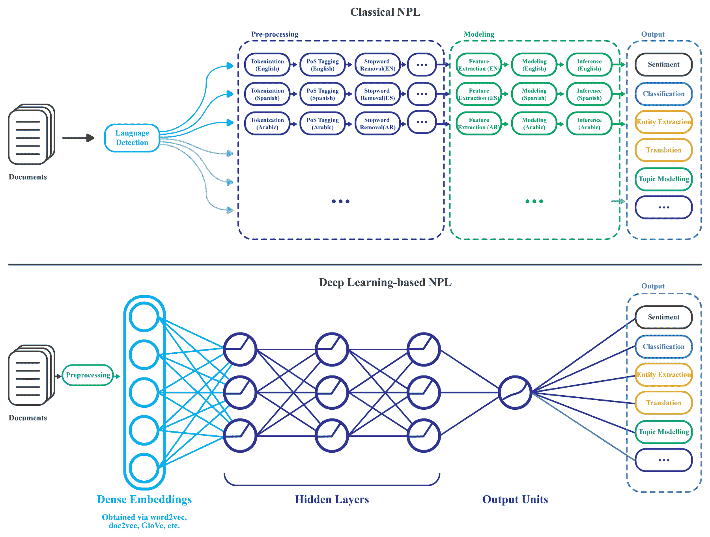

# 第四章：使用 Word2Vec 和 LSTM 网络进行情感分析

情感分析是一种系统化的方式，用于识别、提取、量化并研究情感状态和主观信息。这在**自然语言处理**（**NLP**）、文本分析和计算语言学中广泛应用。本章演示了如何实现并部署一个实践性的深度学习项目，该项目基于文本中的词汇将评论文本分类为积极或消极。将使用一个包含 50k 评论（训练加测试）的电影评论大数据集。

将应用结合使用 Word2Vec（即 NLP 中广泛使用的词嵌入技术）和**长短期记忆**（**LSTM**）网络的建模方法：将使用预训练的 Google 新闻向量模型作为神经词嵌入。然后，将训练向量与标签一起输入 LSTM 网络，分类为消极或积极情感。最后，对测试集进行已训练模型的评估。

此外，它还展示了如何应用文本预处理技术，如分词器、停用词移除和**词频-逆文档频率**（**TF-IDF**）以及**Deeplearning4j**（**DL4J**）中的词嵌入操作。

然而，它还展示了如何保存已训练的 DL4J 模型。之后，保存的模型将从磁盘恢复，并对来自 Amazon Cell、Yelp 和 IMDb 的其他小规模评论文本进行情感预测。最后，它还解答了与项目相关的一些常见问题及可能的前景。

以下主题将在本端到端项目中覆盖：

+   NLP 中的情感分析

+   使用 Word2Vec 进行神经词嵌入

+   数据集收集与描述

+   使用 DL4J 保存和恢复预训练模型

+   使用 Word2Vec 和 LSTM 开发情感分析模型

+   常见问题解答（FAQ）

# 情感分析是一项具有挑战性的任务

自然语言处理中的文本分析旨在处理和分析大规模的结构化和非结构化文本，以发现隐藏的模式和主题，并推导出上下文的意义和关系。文本分析有很多潜在的应用场景，如情感分析、主题建模、TF-IDF、命名实体识别和事件提取。

情感分析包括许多示例应用场景，如分析人们在 Facebook、Twitter 等社交媒体上的政治观点。同样，分析 Yelp 上的餐厅评论也是情感分析的另一个优秀例子。通常使用像 OpenNLP 和 Stanford NLP 这样的 NLP 框架和库来实现情感分析。

然而，在使用文本分析情感时，尤其是分析非结构化文本时，我们必须找到一种强大且高效的特征工程方法，将文本转换为数字。然而，在模型训练之前，数据的转换可能经历多个阶段，然后再进行部署并最终执行预测分析。此外，我们应当预期对特征和模型属性进行进一步优化。我们甚至可以探索一种完全不同的算法，作为新工作流的一部分，重复整个任务流程。

当你看一行文本时，我们会看到句子、短语、单词、名词、动词、标点符号等等，这些东西组合在一起具有一定的意义和目的。人类在理解句子、单词、俚语、注解和上下文方面非常擅长。这是经过多年的练习和学习如何阅读/书写规范的语法、标点、感叹词等的结果。

例如，两个句子：*DL4J 使预测分析变得简单* 和 *预测分析使 DL4J 变得简单*，可能导致相同的句子向量具有相同的长度，这个长度等于我们选择的词汇的大小。第二个问题是，“is”和“DL4J”这两个词的数值索引值都是 1，但我们的直觉告诉我们，“is”与“DL4J”相比并不重要。再来看第二个例子：当你在 Google 上搜索字符串*hotels in Berlin*时，我们希望获得与*bnb*、*motel*、*lodging*、*accommodation*等相关的柏林的结果。

当普通词汇出现时，自然语言学习变得更加复杂。以“银行”（bank）这个词为例。它既与金融机构相关，也与水边的陆地相关。现在，如果一个自然句子中包含“bank”一词，并且与金融、金钱、国库和利率等词语一同出现，我们可以理解它的含义是前者。然而，如果它周围的词语是水、海岸、河流、湖泊等，那么它指的就是后者。那么，问题来了：我们是否可以利用这一概念来处理歧义和同义词，并使我们的模型学习得更好？



经典机器学习与基于深度学习的自然语言处理（NLP）

然而，自然语言句子也包含模糊词汇、俚语、琐碎的词语以及特殊字符，这些都使得整体理解和机器学习变得复杂。

我们已经看到如何使用独热编码（one-hot encoding）或字符串索引器（StringIndexer）技术将分类变量（甚至单词）转换为数字形式。然而，这类程序通常无法理解复杂句子中的语义，特别是对于长句子或甚至单个单词。因此，人类的词汇并没有天然的相似性概念。因此，我们自然不会尝试复制这种能力，对吧？

我们如何构建一个简单、可扩展、更快的方法来处理常规的文本或句子，并推导出一个词与其上下文词之间的关系，然后将它们嵌入到数十亿个词中，从而在数值向量空间中产生极好的词表示，以便机器学习模型可以使用它们呢？让我们通过 Word2Vec 模型来找到答案。

# 使用 Word2Vec 进行神经网络词嵌入。

Word2Vec 是一个两层的神经网络，它处理文本并将其转化为数值特征。通过这种方式，Word2Vec 的输出是一个词汇表，其中每个词都被嵌入到向量空间中。结果向量可以输入到神经网络中，以更好地理解自然语言。小说家 EL Doctorow 在他的书《*Billy Bathgate*》中以诗意的方式表达了这个思想：

“这就像数字是语言，就像语言中的所有字母都被转化为数字，因此它是每个人都以相同方式理解的东西。你失去了字母的声音，无论它们是咔嚓声、啪嗒声、触碰上腭的声音，还是发出‘哦’或‘啊’的声音，任何可能被误读的东西，或是它通过音乐或图像欺骗你心智的东西，全都消失了，连同口音一同消失，你获得了一种完全新的理解，一种数字的语言，一切变得像墙上的文字一样清晰。所以，正如我所说，有一个特定的时刻，是时候去读这些数字了。”

在使用 BOW 和 TF-IDF 时，所有词都被投射到相同的位置，并且它们的向量被平均化：我们考虑了词的重要性，但没有考虑在文档集合或单个文档中词序的重要性。

由于历史中词的顺序不会影响投影，BOW 和 TF-IDF 都没有可以处理这个问题的特征。Word2Vec 通过使用上下文预测目标词（使用**连续词袋法**（**CBOW**））或使用一个词来预测目标上下文（这就是所谓的**连续跳字法**）来将每个词编码成一个向量。

+   **N-gram 与跳字法（skip-gram）**：词是一次一个地读入向量，并在一定范围内来回扫描。

+   **CBOW**：CBOW 技术使用一个连续分布的上下文表示。

+   **连续跳字法（Continuous skip-gram）**：与 CBOW 不同，这种方法尝试最大化基于同一句话中的另一个词来分类当前词。

我曾经经历过，增加范围可以提高结果词向量的质量，但也会增加计算复杂度。由于距离较远的词通常与当前词的关系不如近距离的词密切，因此我们通过在训练样本中从这些远离的词中采样较少，来减少对它们的权重。由于模型构建和预测，所需的时间也会增加。

从架构的角度来看，可以通过以下图示看到对比分析，其中架构根据上下文预测当前单词，而 skip-gram 根据当前单词预测周围的单词：


CBOW 与 skip-gram（来源：Tomas Mikolov 等人，《高效估计向量空间中的词表示》，https://arxiv.org/pdf/1301.3781.pdf）

# 数据集和预训练模型说明

我们将使用大型电影评论数据集来训练和测试模型。此外，我们还将使用带有情感标签的句子数据集来对产品、电影和餐厅的评论进行单一预测。

# 用于训练和测试的大型电影评论数据集

前者是一个用于二元情感分类的数据集，包含的数据量远超过之前的基准数据集。该数据集可以从[`ai.stanford.edu/~amaas/data/sentiment/`](http://ai.stanford.edu/~amaas/data/sentiment/)下载。或者，我使用了来自 DL4J 示例的 Java 方法，该方法也可以下载并提取此数据集。

我想特别感谢以下出版物：Andrew L. Maas, Raymond E. Daly, Peter T. Pham, Dan Huang, Andrew Y. Ng, 和 Christopher Potts。（2011），*用于情感分析的词向量学习*，《第 49 届计算语言学协会年会（ACL 2011）》。

该数据集包含 50,000 条电影评论及其对应的二元情感极性标签。评论被平均分配为 25,000 条用于训练集和测试集。标签的总体分布是平衡的（25,000 条正面评论和 25,000 条负面评论）。我们还包含了额外的 50,000 条未标记的文档，用于无监督学习。在标记的训练/测试集中，如果评论得分<=4 分（满分 10 分），则视为负面评论，而得分>=7 分则视为正面评论。然而，评分较为中立的评论未包含在数据集中。

# 数据集的文件夹结构

数据集中有两个文件夹，分别是`train`和`test`，用于训练集和测试集。每个文件夹下有两个子文件夹，分别是`pos`和`neg`，其中包含带有二进制标签（pos, neg）的评论。评论以名为`id_rating.txt`的文本文件存储，其中`id`是唯一的 ID，`rating`是 1-10 分的星级评分。查看以下图示可以更清楚地了解目录结构：


大型电影评论数据集中的文件夹结构

例如，`test/pos/200_8.txt`文件是一个正面标签的测试集示例，具有唯一 ID 200 和 IMDb 评分为 8/10。`train/unsup/`目录中的所有评分均为零，因为该部分数据集省略了评分。让我们看一个来自 IMDb 的示例正面评论：

"《布罗姆威尔高中》是一部卡通喜剧。它与其他一些关于学校生活的节目同时播放，比如《教师》。我在教育行业工作了 35 年，我认为《布罗姆威尔高中》的讽刺性比《教师》更贴近现实。为了生存而拼命挣扎的财务问题、那些能透彻看穿他们可悲老师虚伪的有洞察力的学生、整个情况的琐碎性，都让我想起了我所知道的学校和它们的学生。当我看到一集中有个学生一再试图烧掉学校时，我立刻回想起……在……高中。经典台词：督察：我来是为了开除你们的一位老师。学生：欢迎来到布罗姆威尔高中。我想我的很多同龄人可能觉得《布罗姆威尔高中》太夸张了。真遗憾，这并不夸张！"

因此，从前面的评论文本中，我们可以理解到，相应的观众给《布罗姆威尔高中》（一部关于位于伦敦南部的英国高中、英加合制的成人动画剧集，更多信息可以见 [`en.wikipedia.org/wiki/Bromwell_High`](https://en.wikipedia.org/wiki/Bromwell_High)）给出了积极的评价，即积极的情感。

# 情感标注数据集描述

情感标注句子数据集是从 UCI 机器学习库下载的，网址是 [`archive.ics.uci.edu/ml/datasets/Sentiment+Labelled+Sentences`](http://archive.ics.uci.edu/ml/datasets/Sentiment+Labelled+Sentences)。这个数据集是 Kotzias 的研究成果，并且在以下出版物中使用：*从群体到个体标签使用深度特征*，Kotzias 等，KDD' 2015。

该数据集包含标注为积极或消极情感的句子，这些句子来源于产品、电影和餐馆的评论。评论是一个制表符分隔的文件，其中包含评论句子和得分，得分为 1（表示积极）或 0（表示消极）。我们来看一个来自 Yelp 的示例评论及其标签：

*"我感到恶心，因为我几乎可以肯定那是人类的头发。"*

在前面的评论文本中，得分为 0，因此它是一个负面评论，表达了客户的负面情感。另一方面，有 500 个积极句子和 500 个消极句子。

这些是从更大的评论数据集中随机选择的。作者试图选择那些有明确积极或消极含义的句子；目标是没有选择中立句子。这些评论句子来自三个不同的网站/领域，具体如下：

+   [`www.imdb.com/`](https://www.imdb.com/)

+   [`www.amazon.com/`](https://www.amazon.com/)

+   [`www.yelp.com/`](https://www.yelp.com/)

# Word2Vec 预训练模型

与其从头开始生成一个新的 Word2Vec 模型，不如使用 Google 预训练的新闻词向量模型，它提供了 CBOW 和 skip-gram 架构的高效实现，用于计算单词的向量表示。这些表示随后可以用于许多 NLP 应用和进一步的研究。

可以从 [`code.google.com/p/word2vec/`](https://code.google.com/p/word2vec/) 手动下载模型。Word2Vec 模型以文本语料库为输入，输出词向量。它首先从训练文本数据构建词汇表，然后学习单词的向量表示。

有两种方法可以实现 Word2Vec 模型：使用连续词袋模型（CBOW）和连续跳字模型（skip-gram）。Skip-gram 速度较慢，但对不常见的单词效果更好，而 CBOW 速度较快。

生成的词向量文件可以作为许多自然语言处理和机器学习应用中的特征。

# 使用 Word2Vec 和 LSTM 进行情感分析

首先，让我们定义问题。给定一条电影评论（原始文本），我们需要根据评论中的单词将其分类为正面或负面，即情感分析。我们通过结合 Word2Vec 模型和 LSTM 来实现：评论中的每个单词都通过 Word2Vec 模型向量化，然后输入到 LSTM 网络中。如前所述，我们将在大型电影评论数据集中训练数据。现在，以下是整体项目的工作流程：

+   首先，我们下载电影/产品评论数据集

+   然后我们创建或重用一个现有的 Word2Vec 模型（例如，Google News 词向量）

+   然后我们加载每条评论文本，并将单词转换为向量，将评论转换为向量序列

+   然后我们创建并训练 LSTM 网络

+   然后我们保存训练好的模型

+   然后我们在测试集上评估模型

+   然后我们恢复训练好的模型，并评估情感标注数据集中的一条评论文本

现在，让我们看看如果我们遵循前面的工作流程，`main()` 方法会是什么样子：

```py
public static void main(String[] args) throws Exception {
       Nd4j.getMemoryManager().setAutoGcWindow(10000);// see more in the FAQ section
       wordVectors = WordVectorSerializer.loadStaticModel(new File(WORD_VECTORS_PATH)); // Word2vec path   
       downloadAndExtractData(); // download and extract the dataset
       networkTrainAndSaver(); // create net, train and save the model
       networkEvaluator(); // evaluate the model on test set
       sampleEvaluator(); // evaluate a simple review from text/file.
}
```

让我们将前面的步骤分解成更小的步骤。我们将从使用 Word2Vec 模型的 dataset 准备开始。

# 使用 Word2Vec 模型准备训练集和测试集

现在，为了准备训练和测试数据集，首先我们必须下载以下三个文件：

+   一个 Google 训练的 Word2Vec 模型

+   一个大型电影评论数据集

+   一个情感标注数据集

预训练的 Word2Vec 可从 [`code.google.com/p/word2vec/`](https://code.google.com/p/word2vec/) 下载，然后我们可以手动设置 Google News 向量的位置：

```py
public static final String WORD_VECTORS_PATH = "/Downloads/GoogleNews-vectors-negative300.bin.gz";
```

然后，我们将从以下 URL 下载并提取大型电影评论数据集。

```py
public static final String DATA_URL = "http://ai.stanford.edu/~amaas/data/sentiment/aclImdb_v1.tar.gz";
```

现在，让我们设置保存位置并提取训练/测试数据：

```py
public static final String DATA_PATH = FilenameUtils.concat(System.getProperty("java.io.tmpdir"), "dl4j_w2vSentiment/");
```

现在，我们可以手动下载或在我们喜欢的位置提取数据集，或者使用以下方法以自动化方式完成。请注意，我对原始的 DL4J 实现做了些许修改：

```py
public static void downloadAndExtractData() throws Exception {
  //Create directory if required
  File directory = new File(DATA_PATH);

  if(!directory.exists()) directory.mkdir();
  //Download file:
  String archizePath = DATA_PATH + "aclImdb_v1.tar.gz";
  File archiveFile = new File(archizePath);
  String extractedPath = DATA_PATH + "aclImdb";
  File extractedFile = new File(extractedPath);

  if( !archiveFile.exists() ){
    System.out.println("Starting data download (80MB)...");
    FileUtils.copyURLToFile(new URL(DATA_URL), archiveFile);
    System.out.println("Data (.tar.gz file) downloaded to " + archiveFile.getAbsolutePath());

    //Extract tar.gz file to output directory
    DataUtilities.extractTarGz(archizePath, DATA_PATH);
  } else {
    //Assume if archive (.tar.gz) exists, then data has already been extracted
    System.out.println("Data (.tar.gz file) already exists at " + archiveFile.getAbsolutePath());

    if( !extractedFile.exists()){
    //Extract tar.gz file to output directory
      DataUtilities.extractTarGz(archizePath, DATA_PATH);
    } else {
      System.out.println("Data (extracted) already exists at " + extractedFile.getAbsolutePath());
    }
  }
}
```

在前述方法中，使用 HTTP 协议从我提到的 URL 下载数据集，然后将数据集解压到我们提到的位置。为此，我使用了 Apache Commons 的`TarArchiveEntry`、`TarArchiveInputStream`和`GzipCompressorInputStream`工具。感兴趣的读者可以在[`commons.apache.org/`](http://commons.apache.org/)查看更多细节。

简而言之，我提供了一个名为`DataUtilities.java`的类，其中有两个方法，`downloadFile()`和`extractTarGz()`，用于下载和解压数据集。

首先，`downloadFile()`方法接受远程 URL（即远程文件的 URL）和本地路径（即下载文件的位置）作为参数，如果文件不存在，则下载远程文件。现在，让我们看看签名是怎样的：

```py
public static boolean downloadFile(String remoteUrl, String localPath) throws IOException {
  boolean downloaded = false;

  if (remoteUrl == null || localPath == null)
       return downloaded;

  File file = new File(localPath);
  if (!file.exists()) {
    file.getParentFile().mkdirs();
    HttpClientBuilder builder = HttpClientBuilder.create();
    CloseableHttpClient client = builder.build();
    try (CloseableHttpResponse response = client.execute(new HttpGet(remoteUrl))) {
      HttpEntity entity = response.getEntity();
      if (entity != null) {
        try (FileOutputStream outstream = new FileOutputStream(file)) {
          entity.writeTo(outstream);
          outstream.flush();
          outstream.close();
        }
      }
    }
    downloaded = true;
  }
  if (!file.exists())
  throw new IOException("File doesn't exist: " + localPath);
  return downloaded;
}
```

其次，`extractTarGz()`方法接受输入路径（即`ism`输入文件路径）和输出路径（即输出目录路径）作为参数，并将`tar.gz`文件解压到本地文件夹。现在，让我们看看签名是怎样的：

```py
public static void extractTarGz(String inputPath, String outputPath) throws IOException {
  if (inputPath == null || outputPath == null)
       return;

  final int bufferSize = 4096;
  if (!outputPath.endsWith("" + File.separatorChar))
      outputPath = outputPath + File.separatorChar;

  try (TarArchiveInputStream tais = new TarArchiveInputStream( new GzipCompressorInputStream(new BufferedInputStream(
                                      new FileInputStream(inputPath))))) {
    TarArchiveEntry entry;
    while ((entry = (TarArchiveEntry) tais.getNextEntry()) != null) {
      if (entry.isDirectory()) {
        new File(outputPath + entry.getName()).mkdirs();
      } else {
        int count;
        byte data[] = newbyte[bufferSize];
        FileOutputStream fos = new FileOutputStream(outputPath + entry.getName());
        BufferedOutputStream dest = new BufferedOutputStream(fos, bufferSize);
        while ((count = tais.read(data, 0, bufferSize)) != -1) {
              dest.write(data, 0, count);
        }
        dest.close();
      }
    }
  }
}
```

现在，要使用前述方法，您必须导入以下包：

```py
import org.apache.commons.compress.archivers.tar.TarArchiveEntry;
import org.apache.commons.compress.archivers.tar.TarArchiveInputStream;
import org.apache.commons.compress.compressors.gzip.GzipCompressorInputStream;
```

顺便提一下，Apache Commons 是一个专注于可重用 Java 组件各个方面的 Apache 项目。更多信息请见[`commons.apache.org/`](https://commons.apache.org/)。

最后，可以从[`archive.ics.uci.edu/ml/machine-learning-databases/00331/`](https://archive.ics.uci.edu/ml/machine-learning-databases/00331/)下载情感标签数据集。完成这些步骤后，接下来的任务是准备训练集和测试集。为此，我编写了一个名为`SentimentDatasetIterator`的类，它是一个专门为我们项目中使用的 IMDb 评论数据集定制的`DataSetIterator`。不过，它也可以应用于任何用于自然语言处理文本分析的文本数据集。这个类是`SentimentExampleIterator.java`类的一个小扩展，该类是 DL4J 示例提供的。感谢 DL4J 团队让我们的工作变得更轻松。

`SentimentDatasetIterator`类从情感标签数据集的训练集或测试集中获取数据，并利用 Google 预训练的 Word2Vec 生成训练数据集。另一方面，使用一个单独的类别（负面或正面）作为标签，预测每个评论的最终时间步。除此之外，由于我们处理的是不同长度的评论，并且只有在最终时间步有一个输出，我们使用了填充数组。简而言之，我们的训练数据集应该包含以下项，即 4D 对象：

+   从每个评论文本中提取特征

+   标签为 1 或 0（即，分别表示正面和负面）

+   特征掩码

+   标签掩码

那么，让我们从以下构造函数开始，它用于以下目的：

```py
private final WordVectors wordVectors;
private final int batchSize;
private final int vectorSize;
private final int truncateLength;
private int cursor = 0;
private final File[] positiveFiles;
private final File[] negativeFiles;
private final TokenizerFactory tokenizerFactory;

public SentimentDatasetIterator(String dataDirectory, WordVectors wordVectors, 
                                 int batchSize, int truncateLength, boolean train) throws IOException {
  this.batchSize = batchSize;
  this.vectorSize = wordVectors.getWordVector(wordVectors.vocab().wordAtIndex(0)).length;
  File p = new File(FilenameUtils.concat(dataDirectory, "aclImdb/" + (train ? "train" : "test") 
                                         + "/pos/") + "/");
  File n = new File(FilenameUtils.concat(dataDirectory, "aclImdb/" + (train ? "train" : "test")
                                         + "/neg/") + "/");
  positiveFiles = p.listFiles();
  negativeFiles = n.listFiles();

  this.wordVectors = wordVectors;
  this.truncateLength = truncateLength;
  tokenizerFactory = new DefaultTokenizerFactory();
  tokenizerFactory.setTokenPreProcessor(new CommonPreprocessor());
}
```

在前面的构造函数签名中，我们使用了以下目的：

+   用于跟踪 IMDb 评论数据集中正面和负面评论文件

+   将评论文本分词，去除停用词和未知词

+   如果最长的评论超过`truncateLength`，只取前`truncateLength`个词

+   Word2Vec 对象

+   批量大小，即每个小批量的大小，用于训练

一旦初始化完成，我们将每个评论测试加载为字符串。然后，我们在正面和负面评论之间交替：

```py
List<String> reviews = new ArrayList<>(num);
boolean[] positive = newboolean[num];

for(int i=0; i<num && cursor<totalExamples(); i++ ){
  if(cursor % 2 == 0){
    //Load positive review
    int posReviewNumber = cursor / 2;
    String review = FileUtils.readFileToString(positiveFiles[posReviewNumber]);
    reviews.add(review);
    positive[i] = true;
  } else {
    //Load negative review
    int negReviewNumber = cursor / 2;
    String review = FileUtils.readFileToString(negativeFiles[negReviewNumber]);
    reviews.add(review);
    positive[i] = false;
  }
  cursor++;
}
```

然后，我们将评论分词，并过滤掉未知词（即不包含在预训练的 Word2Vec 模型中的词，例如停用词）：

```py
List<List<String>> allTokens = new ArrayList<>(reviews.size());
int maxLength = 0;

for(String s : reviews){
  List<String> tokens = tokenizerFactory.create(s).getTokens();
  List<String> tokensFiltered = new ArrayList<>();
 for(String t : tokens ){
 if(wordVectors.hasWord(t)) tokensFiltered.add(t);
  }
  allTokens.add(tokensFiltered);
  maxLength = Math.*max*(maxLength,tokensFiltered.size());
}
```

然后，如果最长评论超过阈值`truncateLength`，我们只取前`truncateLength`个词：

```py
if(maxLength > truncateLength) 
    maxLength = truncateLength;
```

然后，我们创建用于训练的数据。在这里，由于我们有两个标签，正面或负面，因此我们有`reviews.size()`个不同长度的示例：

```py
INDArray features = Nd4j.create(newint[]{reviews.size(), vectorSize, maxLength}, 'f');
INDArray labels = Nd4j.create(newint[]{reviews.size(), 2, maxLength}, 'f');
```

现在，由于我们处理的是不同长度的评论，并且在最终时间步只有一个输出，我们使用填充数组，其中掩码数组在该时间步对该示例的数据存在时为 1，如果数据只是填充则为 0：

```py
INDArray featuresMask = Nd4j.*zeros*(reviews.size(), maxLength);
INDArray labelsMask = Nd4j.*zeros*(reviews.size(), maxLength);
```

需要注意的是，为特征和标签创建掩码数组是可选的，并且也可以为空。然后，我们获取第*i*^(th)文档的截断序列长度，获取当前文档的所有词向量，并将其转置以适应第二和第三个特征形状。

一旦我们准备好词向量，我们将它们放入特征数组的三个索引位置中，该位置等于`NDArrayIndex.interval(0, vectorSize)`，包括 0 和当前序列长度之间的所有元素。然后，我们为每个存在特征的位置分配 1，也就是在 0 和序列长度之间的区间。

现在，涉及标签编码时，我们将负面评论文本设置为[0, 1]，将正面评论文本设置为[1, 0]。最后，我们指定此示例在最终时间步有输出：

```py
for( int i=0; i<reviews.size(); i++ ){
  List<String> tokens = allTokens.get(i);
  int seqLength = Math.min(tokens.size(), maxLength);
  final INDArray vectors = wordVectors.getWordVectors(tokens.subList(0, seqLength)).transpose();
  features.put(new INDArrayIndex[] {
      NDArrayIndex.point(i), NDArrayIndex.all(), NDArrayIndex.interval(0, seqLength)
    }, vectors);

  featuresMask.get(new INDArrayIndex[] {NDArrayIndex.point(i), NDArrayIndex.interval(0,      
                   seqLength)}).assign(1);
  int idx = (positive[i] ? 0 : 1);
  int lastIdx = Math.min(tokens.size(),maxLength);

  labels.putScalar(newint[]{i,idx,lastIdx-1},1.0);
  labelsMask.putScalar(newint[]{i,lastIdx-1},1.0);
}
```

请注意，限制 NLP 中 dropout 应用的主要问题是它不能应用于循环连接，因为聚合的 dropout 掩码会随着时间的推移有效地将嵌入值归零——因此，前面的代码块中使用了特征掩码。

到此为止，所有必要的元素都已准备好，因此最后，我们返回包含特征、标签、`featuresMask`和`labelsMask`的`NDArray`（即 4D）数据集：

```py
return new DataSet(features,labels,featuresMask,labelsMask);
```

更详细地说，使用`DataSet`，我们将创建一个具有指定输入`INDArray`和标签（输出）`INDArray`的数据集，并（可选地）为特征和标签创建掩码数组。

最后，我们将使用以下调用方式获取训练集：

```py
SentimentDatasetIterator train = new SentimentDatasetIterator(DATA_PATH, wordVectors, 
                                                              batchSize, truncateReviewsToLength, true);
```

太棒了！现在我们可以在下一步中通过指定层和超参数来创建我们的神经网络。

# 网络构建、训练和保存模型

如《Titanic 生存预测》部分所讨论的那样，一切从`MultiLayerConfiguration`开始，它组织这些层及其超参数。我们的 LSTM 网络由五层组成。输入层后跟三层 LSTM 层。然后，最后一层是 RNN 层，也是输出层。

更技术性地讲，第一层是输入层，接着三层作为 LSTM 层。对于 LSTM 层，我们使用 Xavier 初始化权重，使用 SGD 作为优化算法，并配合 Adam 更新器，我们使用 Tanh 作为激活函数。最后，RNN 输出层具有 Softmax 激活函数，给出类别的概率分布（也就是说，它输出的总和为 1.0）以及 MCXENT，这是多类交叉熵损失函数。

为了创建 LSTM 层，DL4J 提供了 LSTM 和`GravesLSTM`类。后者是一个基于 Graves 的 LSTM 循环网络，但没有 CUDA 支持：使用 RNN 进行监督序列标注（详情请参见[`www.cs.toronto.edu/~graves/phd.pdf`](http://www.cs.toronto.edu/~graves/phd.pdf)）。现在，在开始创建网络之前，首先让我们定义所需的超参数，如输入/隐藏/输出节点的数量（即神经元）：

```py
// Network hyperparameters: Truncate reviews with length greater than this
static int truncateReviewsToLength = 30;
static int numEpochs = 10; // number of training epochs
static int batchSize = 64; //Number of examples in each minibatch
static int vectorSize = 300; //Size of word vectors in Google Word2Vec
static int seed = 12345; //Seed for reproducibility
static int numClasses = 2; // number of classes to be predicted
static int numHiddenNodes = 256;
```

现在我们将创建一个网络配置并进行网络训练。使用 DL4J，你通过调用`NeuralNetConfiguration.Builder()`上的`layer`方法来添加一层，并指定它在层中的顺序（下面代码中的零索引层是输入层）：

```py
MultiLayerConfiguration LSTMconf = new NeuralNetConfiguration.Builder()
     .seed(seed)
     .updater(new Adam(1e-8)) // Gradient updater with Adam
     .l2(1e-5) // L2 regularization coefficient for weights
     .optimizationAlgo(OptimizationAlgorithm.STOCHASTIC_GRADIENT_DESCENT)
     .weightInit(WeightInit.XAVIER)
     .gradientNormalization(GradientNormalization.ClipElementWiseAbsoluteValue)
     .gradientNormalizationThreshold(1.0)     
     .trainingWorkspaceMode(WorkspaceMode.SEPARATE).inferenceWorkspaceMode(WorkspaceMode.SEPARATE)
     .list()
     .layer(0, new LSTM.Builder()
           .nIn(vectorSize)
           .nOut(numHiddenNodes)
           .activation(Activation.TANH)
           .build())
     .layer(1, new LSTM.Builder()
           .nIn(numHiddenNodes)
           .nOut(numHiddenNodes)
           .activation(Activation.TANH)
           .build())
     .layer(2, new RnnOutputLayer.Builder()
          .activation(Activation.SOFTMAX)
          .lossFunction(LossFunction.XENT)
          .nIn(numHiddenNodes)
          .nOut(numClasses)
          .build())
    .pretrain(false).backprop(true).build();
```

最后，我们还指定不需要进行任何预训练（这通常在深度信念网络或堆叠自编码器中需要）。然后，我们初始化网络并开始在训练集上进行训练：

```py
MultiLayerNetwork model = new MultiLayerNetwork(LSTMconf);
model.init();
```

通常，这种类型的网络有很多超参数。让我们打印出网络中的参数数量（以及每一层的参数）：

```py
Layer[] layers = model.getLayers();
int totalNumParams = 0;
for(int i=0; i<layers.length; i++ ){
  int nParams = layers[i].numParams();
  System.out.println("Number of parameters in layer " + i + ": " + nParams);
  totalNumParams += nParams;
}
System.out.println("Total number of network parameters: " + totalNumParams);

>>
 Number of parameters in layer 0: 570,368
 Number of parameters in layer 1: 525,312
 Number of parameters in layer 2: 514
 Total number of network parameters: 1,096,194
```

如我所说，我们的网络有 100 万参数，这是非常庞大的。这在调整超参数时也带来了很大的挑战。不过，我们将在常见问题解答部分看到一些技巧。

```py
MultiLayerNetwork net = new MultiLayerNetwork(LSTMconf);
net.init();
net.setListeners(new ScoreIterationListener(1));
for (int i = 0; i < numEpochs; i++) {
  net.fit(train);
  train.reset();
  System.out.println("Epoch " + (i+1) + " finished ...");
}
System.out.println("Training has been completed");
```

训练完成后，我们可以保存训练好的模型，以便模型持久化和后续重用。为此，DL4J 通过`ModelSerializer`类的`writeModel()`方法提供对训练模型的序列化支持。此外，它还提供了通过`restoreMultiLayerNetwork()`方法恢复已保存模型的功能。

我们将在接下来的步骤中看到更多内容。不过，我们也可以保存网络更新器，即动量、RMSProp、Adagrad 等的状态：

```py
File locationToSave = new File(modelPath); //location and file format
boolean saveUpdater = true; // we save the network updater too
ModelSerializer.writeModel(net, locationToSave, saveUpdater);
```

# 恢复训练好的模型并在测试集上进行评估

一旦训练完成，下一步任务就是评估模型。我们将在测试集上评估模型的表现。为了评估，我们将使用`Evaluation()`，它创建一个评估对象，包含两个可能的类。

首先，让我们对每个测试样本进行迭代评估，并从训练好的模型中获得网络的预测结果。最后，`eval()`方法将预测结果与真实类别进行比对：

```py
public static void networkEvaluator() throws Exception {
      System.out.println("Starting the evaluation ...");
      boolean saveUpdater = true;

      //Load the model
      MultiLayerNetwork restoredModel = ModelSerializer.restoreMultiLayerNetwork(modelPath, saveUpdater);
      //WordVectors wordVectors = getWord2Vec();
      SentimentDatasetIterator test = new SentimentDatasetIterator(DATA_PATH, wordVectors, batchSize,   
                                                                   truncateReviewsToLength, false);
      Evaluation evaluation = restoredModel.evaluate(test);
      System.out.println(evaluation.stats());
      System.out.println("----- Evaluation completed! -----");
}

>>>
 ==========================Scores========================================
 # of classes: 2
 Accuracy: 0.8632
 Precision: 0.8632
 Recall: 0.8632
 F1 Score: 0.8634
 Precision, recall, and F1: Reported for positive class (class 1 -"negative") only
 ========================================================================
```

使用 LSTM 进行情感分析的预测准确率约为 87%，考虑到我们没有专注于超参数调优，这个结果还是不错的！现在，让我们看看分类器在每个类别上的预测情况：

```py
Predictions labeled as positive classified by model as positive: 10,777 times
 Predictions labeled as positive classified by model as negative: 1,723 times
 Predictions labeled as negative classified by model as positive: 1,696 times
 Predictions labeled as negative classified by model as negative: 10,804 times
```

类似于第二章，*使用递归类型网络预测癌症类型*，我们现在将计算一个称为马修斯相关系数的度量，用于这个二分类问题：

```py
// Compute Matthews correlation coefficient
EvaluationAveraging averaging = EvaluationAveraging.*Macro*;
double MCC = eval.matthewsCorrelation(averaging);
System.*out*.println("Matthews correlation coefficient: "+ MCC);

>>
 Matthews's correlation coefficient: 0.22308172619187497
```

这显示了一个弱正相关，表明我们的模型表现相当不错。接下来，我们将使用训练好的模型进行推理，也就是对样本评论文本进行预测。

# 对样本评论文本进行预测

现在，让我们来看看我们的训练模型如何泛化，也就是说，它在来自情感标注句子数据集的未见过的评论文本上的表现如何。首先，我们需要从磁盘中恢复训练好的模型：

```py
System.*out*.println("Starting the evaluation on sample texts ...");
boolean saveUpdater = true;

MultiLayerNetwork restoredModel = ModelSerializer.*restoreMultiLayerNetwork*(*modelPath*, saveUpdater);
SentimentDatasetIterator test = new SentimentDatasetIterator(*DATA_PATH*, *wordvectors*, *batchSize*, 
                                                             *truncateReviewsToLength*, false);
```

现在，我们可以随机提取两条来自 IMDb、Amazon 和 Yelp 的评论文本，其中第一条表示正面情感，第二条表示负面情感（根据已知标签）。然后，我们可以创建一个包含评论字符串和标签的 HashMap：

```py
String IMDb_PositiveReview = "Not only did it only confirm that the film would be unfunny and generic, but 
                              it also managed to give away the ENTIRE movie; and I'm not exaggerating - 
                              every moment, every plot point, every joke is told in the trailer";

String IMDb_NegativeReview = "One character is totally annoying with a voice that gives me the feeling of 
                              fingernails on a chalkboard.";

String Amazon_PositiveReview = "This phone is very fast with sending any kind of messages and web browsing 
                                is significantly faster than previous phones i have used";

String Amazon_NegativeReview = "The one big drawback of the MP3 player is that the buttons on the phone's 
                             front cover that let you pause and skip songs lock out after a few seconds.";

String Yelp_PositiveReview = "My side Greek salad with the Greek dressing was so tasty, and the pita and 
                              hummus was very refreshing.";

String Yelp_NegativeReview = "Hard to judge whether these sides were good because we were grossed out by 
                              the melted styrofoam and didn't want to eat it for fear of getting sick.";
```

然后，我们创建一个包含前面字符串的数组：

```py
String[] reviews = {IMDb_PositiveReview, IMDb_NegativeReview, Amazon_PositiveReview, 
                    Amazon_NegativeReview, Yelp_PositiveReview, Yelp_NegativeReview};

String[] sentiments = {"Positive", "Negative", "Positive", "Negative", "Positive", "Negative"};
Map<String, String> reviewMap = new HashMap<String, String>();

reviewMap.put(reviews[0], sentiments[0]);
reviewMap.put(reviews[1], sentiments[1]);
reviewMap.put(reviews[2], sentiments[2]);
reviewMap.put(reviews[3], sentiments[3]);
```

然后，我们遍历这个映射并使用预训练的模型进行样本评估，如下所示：

```py
System.out.println("Starting the evaluation on sample texts ...");         
for (Map.Entry<String, String> entry : reviewMap.entrySet()) {
            String text = entry.getKey();
            String label = entry.getValue();

            INDArray features = test.loadFeaturesFromString(text, truncateReviewsToLength);
            INDArray networkOutput = restoredModel.output(features);

            int timeSeriesLength = networkOutput.size(2);
            INDArray probabilitiesAtLastWord = networkOutput.get(NDArrayIndex.point(0), 
                              NDArrayIndex.all(), NDArrayIndex.point(timeSeriesLength - 1));

            System.out.println("-------------------------------");
            System.out.println("\n\nProbabilities at last time step: ");
            System.out.println("p(positive): " + probabilitiesAtLastWord.getDouble(0));
            System.out.println("p(negative): " + probabilitiesAtLastWord.getDouble(1));

            Boolean flag = false;
            if(probabilitiesAtLastWord.getDouble(0) > probabilitiesAtLastWord.getDouble(1))
                flag = true;
            else
                flag = false;
            if (flag == true) {
                System.out.println("The text express a positive sentiment, actually it is " + label);
            } else {
                System.out.println("The text express a negative sentiment, actually it is " + label);
            }
        }
    System.out.println("----- Sample evaluation completed! -----");
    }
```

如果仔细查看前面的代码块，你会发现我们通过提取特征将每条评论文本转化为时间序列。然后，我们计算了网络输出（即概率）。接着，我们比较概率，也就是说，如果概率是正面情感的概率，我们就设置标志为真，否则为假。这样，我们就做出了最终的类别预测决定。

我们还在前面的代码块中使用了`loadFeaturesFromString()`方法，它将评论字符串转换为`INDArray`格式的特征。它接受两个参数，`reviewContents`，即要向量化的评论内容，以及`maxLength`，即评论文本的最大长度。最后，它返回给定输入字符串的`features`数组：

```py
public INDArray loadFeaturesFromString(String reviewContents, int maxLength){
        List<String> tokens = tokenizerFactory.create(reviewContents).getTokens();
        List<String> tokensFiltered = new ArrayList<>();
        for(String t : tokens ){
            if(wordVectors.hasWord(t)) tokensFiltered.add(t);
        }
        int outputLength = Math.max(maxLength,tokensFiltered.size());
        INDArray features = Nd4j.create(1, vectorSize, outputLength);

        for(int j=0; j<tokens.size() && j<maxLength; j++ ){
            String token = tokens.get(j);
            INDArray vector = wordVectors.getWordVectorMatrix(token);
            features.put(new INDArrayIndex[]{NDArrayIndex.point(0), 
                          NDArrayIndex.all(), NDArrayIndex.point(j)}, vector);
        }
        return features;
    }
```

如果你不想截断，只需使用`Integer.MAX_VALUE`。

现在，让我们回到原来的讨论。令人捧腹的是，我们使其更具人性化，也就是说，没有使用激活函数。最后，我们打印每条评论文本及其相关标签的结果：

```py
> Probabilities at last time step:
 p(positive): 0.003569001331925392
 p(negative): 0.9964309930801392
 The text express a negative sentiment, actually, it is Positive

p(positive): 0.003569058608263731
 p(negative): 0.9964308738708496
 The text express a negative sentiment, actually, it is Negative
 -------------------------------
 Probabilities at last time step:
 p(positive): 0.003569077467545867
 p(negative): 0.9964308738708496
 The text express a negative sentiment, actually, it is Negative

p(positive): 0.003569045104086399
 p(negative): 0.9964308738708496
 The text express a negative sentiment, actually, it is Positive
 -------------------------------
 Probabilities at last time step:
 p(positive): 0.003570008557289839
 p(negative): 0.996429979801178
 The text express a negative sentiment, actually, it is Positive

p(positive): 0.0035690285731106997
 p(negative): 0.9964309930801392
 The text express a negative sentiment, actually, it is Negative

----- Sample evaluation completed! -----
```

所以，我们的训练模型做出了 50%的错误预测，尤其是它总是将正面评论预测为负面评论。简而言之，它在泛化到未知文本时表现得不好，这可以通过 50%的准确率看出来。

现在，可能会有一个愚蠢的问题浮现出来。我们的网络是否出现了欠拟合？有没有办法观察训练过程？换句话说，问题是：为什么我们的 LSTM 神经网络没有显示出更高的准确性？我们将在下一节中尝试回答这些问题。所以请继续关注！

# 常见问题（FAQ）

现在我们已经通过可接受的准确度解决了情感分析问题，但该问题以及整体深度学习现象中还有其他实际方面需要考虑。在本节中，我们将看到一些可能已经在你脑海中的常见问题。问题的答案可以在附录 A 中找到：

1.  我理解使用 LSTM 进行情感分析的预测准确度仍然是合理的。然而，它在情感标注数据集上的表现并不理想。我们的网络是否出现了过拟合？有没有办法观察训练过程？

1.  考虑到大量的评论文本，我们可以在 GPU 上进行训练吗？

1.  关于问题 2，我们是否可以完全使用 Spark 来执行整个过程？

1.  我在哪里可以获取更多的情感分析训练数据集？

1.  我们是否可以使用`extractTarGz()`方法，而不是手动以`.zip`格式下载训练数据？

1.  我的机器内存有限。能否给我一个关于 DL4J 中内存管理和垃圾回收工作的提示？

# 总结

在本章中，我们已经看到如何实现并部署一个实际的深度学习项目，该项目基于评论文本的内容将其分类为正面或负面。我们使用了一个包含 50,000 条评论（训练和测试）的大规模电影评论数据集。应用了结合 Word2Vec（即在 NLP 中广泛使用的词嵌入技术）和 LSTM 网络的建模方法：使用了预训练的 Google 新闻向量模型作为神经网络词嵌入。

然后，将训练向量与标签一起输入 LSTM 网络，该网络成功地将它们分类为负面或正面情感。接着，它在测试集上评估了训练好的模型。此外，我们还看到了如何在 DL4J 中应用基于文本的预处理技术，如分词器、停用词去除和 TF-IDF，以及词嵌入操作。

在下一章中，我们将看到一个完整的示例，展示如何使用 DL4J 迁移学习 API 开发一个深度学习项目来分类图像。通过这个应用，用户将能够修改现有模型的架构，微调现有模型的学习配置，并在训练过程中保持指定层的参数不变，这也被称为冻结。

# 问题的答案

**问题 1 的答案**：我们已经看到我们的训练模型在测试集上的表现相当不错，准确率为 87%。现在，如果我们查看模型与迭代分数以及以下图表中的其他参数，我们可以看到我们的模型没有过拟合：


LSTM 情感分析器的模型与迭代得分及其他参数

现在，对于情感标注的句子，训练好的模型表现不佳。可能有几个原因。比如，我们的模型只用电影评论数据集进行训练，但在这里，我们尝试强迫模型在不同类型的数据集上进行表现，例如 Amazon 和 Yelp。然而，我们没有仔细调整超参数。

**问题 2 的答案**：是的，实际上，这将非常有帮助。为此，我们必须确保我们的编程环境已经准备好。换句话说，首先，我们必须在机器上配置 CUDA 和 cuDNN。

然而，确保你的机器已安装并配置了具有足够内存和 CUDA 计算能力的 NVIDIA GPU。如果你不知道如何配置这些前提条件，请参考此 URL：[`docs.nvidia.com/deeplearning/sdk/cudnn-install/`](https://docs.nvidia.com/deeplearning/sdk/cudnn-install/)。一旦你的机器安装了 CUDA/cuDNN，在`pom.xml`文件中，你需要添加两个条目：

+   项目属性中的后端

+   CUDA 作为平台依赖

对于第 1 步，属性现在应如下所示：

```py
<properties>
        <project.build.sourceEncoding>UTF-8</project.build.sourceEncoding>
        <java.version>1.8</java.version>
        <nd4j.backend>nd4j-cuda-9.0-platform</nd4j.backend>
        <nd4j.version>1.0.0-alpha</nd4j.version>
        <dl4j.version>1.0.0-alpha</dl4j.version>
        <datavec.version>1.0.0-alpha</datavec.version>
        <arbiter.version>1.0.0-alpha</arbiter.version>
        <logback.version>1.2.3</logback.version>
 </properties>
```

现在，对于第 2 步，在`pop.xml`文件中添加以下依赖项（即，在 dependencies 标签内）：

```py
<dependency>
         <groupId>org.nd4j</groupId>
         <artifactId>nd4j-cuda-9.0-platform</artifactId>
         <version>${nd4j.version}</version>
</dependency>
```

然后，更新 Maven 项目，所需的依赖项将自动下载。现在，除非我们在多个 GPU 上执行训练，否则不需要进行任何更改。然而，只需再次运行相同的脚本来执行训练。然后，你将在控制台上看到以下日志：

```py
17:03:55.317 [main] INFO org.nd4j.linalg.factory.Nd4jBackend - Loaded [JCublasBackend] backend
 17:03:55.360 [main] WARN org.reflections.Reflections - given scan urls are empty. set urls in the configuration
 17:04:06.410 [main] INFO org.nd4j.nativeblas.NativeOpsHolder - Number of threads used for NativeOps: 32
 17:04:08.118 [main] DEBUG org.nd4j.jita.concurrency.CudaAffinityManager - Manually mapping thread [18] to device [0], out of [1] devices...
 17:04:08.119 [main] DEBUG org.nd4j.jita.concurrency.CudaAffinityManager - Manually mapping thread [19] to device [0], out of [1] devices...
 17:04:08.119 [main] DEBUG org.nd4j.jita.concurrency.CudaAffinityManager - Manually mapping thread [20] to device [0], out of [1] devices...
 17:04:08.119 [main] DEBUG org.nd4j.jita.concurrency.CudaAffinityManager - Manually mapping thread [21] to device [0], out of [1] devices...
 17:04:08.119 [main] DEBUG org.nd4j.jita.concurrency.CudaAffinityManager - Manually mapping thread [22] to device [0], out of [1] devices...
 17:04:08.119 [main] DEBUG org.nd4j.jita.concurrency.CudaAffinityManager - Manually mapping thread [23] to device [0], out of [1] devices...
 17:04:08.123 [main] INFO org.nd4j.nativeblas.Nd4jBlas - Number of threads used for BLAS: 0
 17:04:08.127 [main] INFO org.nd4j.linalg.api.ops.executioner.DefaultOpExecutioner - Backend used: [CUDA]; OS: [Windows 10]
 17:04:08.127 [main] INFO org.nd4j.linalg.api.ops.executioner.DefaultOpExecutioner - Cores: [8]; Memory: [7.0GB];
 17:04:08.127 [main] INFO org.nd4j.linalg.api.ops.executioner.DefaultOpExecutioner - Blas vendor: [CUBLAS]
 17:04:08.127 [main] INFO org.nd4j.linalg.jcublas.ops.executioner.CudaExecutioner - Device opName: [GeForce GTX 1050]; CC: [6.1]; Total/free memory: [4294967296]
```

然而，在第八章，*分布式深度学习 - 使用卷积 LSTM 网络进行视频分类*，我们将看到如何在多个 GPU 上使一切变得更快并且可扩展。

**问题 3 的答案**：是的，实际上，这将非常有帮助。为此，我们必须确保我们的编程环境已经准备好。换句话说，首先，我们必须在机器上配置 Spark。一旦你的机器安装了 CUDA/cuDNN，我们只需配置 Spark。在`pom.xml`文件中，你需要添加两个条目：

+   项目属性中的后端

+   Spark 依赖

对于第 1 步，属性现在应如下所示：

```py
<properties>
        <project.build.sourceEncoding>UTF-8</project.build.sourceEncoding>
        <java.version>1.8</java.version>
        <nd4j.backend>nd4j-cuda-9.0-platform</nd4j.backend>
        <nd4j.version>1.0.0-alpha</nd4j.version>
        <dl4j.version>1.0.0-alpha</dl4j.version>
        <datavec.version>1.0.0-alpha</datavec.version>
        <arbiter.version>1.0.0-alpha</arbiter.version>
        <dl4j.spark.version>1.0.0-alpha_spark_2</dl4j.spark.version>
        <logback.version>1.2.3</logback.version>
 </properties>
```

现在，对于第 2 步，在`pop.xml`文件中添加以下依赖项（即，在 dependencies 标签内）：

```py
<dependency>
      <groupId>org.deeplearning4j</groupId>
      <artifactId>dl4j-spark_2.11</artifactId>
      <version>1.0.0-alpha_spark_2</version>
</dependency>
```

然后，更新 Maven 项目，所需的依赖项将自动下载。现在，除非我们在多个 GPU 上执行训练，否则不需要进行任何更改。然而，我们需要将训练/测试数据集转换为 Spark 兼容的 JavaRDD。

我已在`SentimentAnalyzerSparkGPU.java`文件中编写了所有步骤，可以用于查看整体步骤如何工作。一般警告是，如果你在 Spark 上执行训练，DL4J UI 将无法正常工作，因为与 Jackson 库存在交叉依赖。为此，我们必须首先通过调用`sparkSession()`方法创建`JavaSparkContext`，如下所示：

```py
public static JavaSparkContext *spark*;
static int *batchSizePerWorker* = 16;

public static JavaSparkContext getJavaSparkContext () {
                    SparkConf sparkConf = new SparkConf();
                    sparkConf.set("spark.locality.wait", "0");
                    sparkConf.setMaster("local[*]").setAppName("DL4J Spark");
 *spak* = new JavaSparkContext(sparkConf);
 return *spark*;
}
```

然后，我们需要将情感训练数据集迭代器转换为 JavaRDD 数据集。首先，我们创建一个数据集列表，然后按如下方式将每个训练样本添加到列表中：

```py
List<DataSet> trainDataList = new ArrayList<>();
while(train.hasNext()) {
       trainDataList.add(train.next());
    }
```

然后，我们通过调用`sparkSession()`方法创建`JavaSparkContext`，如下所示：

```py
spark = createJavaSparkContext();
```

最后，我们利用 Spark 的`parallelize()`方法创建数据集的 JavaRDD，随后可以用它通过 Spark 执行训练：

```py
JavaRDD<DataSet> trainData = *spark*.parallelize(trainDataList);
```

然后，Spark 的`TrainingMaster`使用`ParameterAveragingTrainingMaster`，它帮助通过 Spark 执行训练。更多细节请参阅第八章，*分布式深度学习 – 使用卷积 LSTM 网络进行视频分类*：

```py
TrainingMaster<?, ?> tm = (TrainingMaster<?, ?>) new ParameterAveragingTrainingMaster
               .Builder(*batchSizePerWorker*)             
               .averagingFrequency(5).workerPrefetchNumBatches(2)
               .batchSizePerWorker(*batchSizePerWorker*).build();
```

接着，我们创建`SparkDl4jMultiLayer`，而不是像之前那样仅创建`MultilayerNetwork`：

```py
SparkDl4jMultiLayer sparkNet = new SparkDl4jMultiLayer(*spark*, LSTMconf, tm);
```

然后，我们创建一个训练监听器，按如下方式记录每次迭代的分数：

```py
sparkNet.setListeners(Collections.<IterationListener>*singletonList*(new ScoreIterationListener(1)));
sparkNet.setListeners(new ScoreIterationListener(1));
```

最后，我们按如下方式开始训练：

```py
for (int i = 0; i < *numEpochs*; i++) {
         sparkNet.fit(trainData);
         System.*out*.println("Epoch " + (i+1) + " has been finished ...");
       }
```

然而，使用这种方法有一个缺点，即我们不能像这样直接保存训练后的模型，而是必须首先使用训练数据来拟合网络，并将输出收集为`MultiLayerNetwork`，如下所示：

```py
MultiLayerNetwork outputNetwork = sparkNet.fit(trainData);

//Save the model
File locationToSave = new File(*modelPath*);

boolean saveUpdater = true;
ModelSerializer.*writeModel*(outputNetwork, locationToSave, saveUpdater);
```

**问题 4 的答案**：你可以从许多来源获得情感分析数据集。以下是其中的一些：

+   来自 Google 的庞大 n-gram 数据集：[storage.googleapis.com/books/ngrams/books/datasetsv2.html](http://storage.googleapis.com/books/ngrams/books/datasetsv2.html)

+   Twitter 情感：[`www.sananalytics.com/lab/twitter-sentiment/`](http://www.sananalytics.com/lab/twitter-sentiment/)

+   UMICH SI650—Kaggle 上的情感分类数据集：[`inclass.kaggle.com/c/si650winter11/data`](http://inclass.kaggle.com/c/si650winter11/data)

+   多领域情感数据集：[`www.cs.jhu.edu/~mdredze/datasets/sentiment/`](http://www.cs.jhu.edu/~mdredze/datasets/sentiment/)

**问题 5 的答案**：答案是否定的，但稍加努力我们可以使其工作。为此，我们可以使用 Apache commons 中的`ZipArchiveInputStream`和`GzipCompressorInputStream`类，代码如下：

```py
public static void extractZipFile(String inputPath, String outputPath) 
               throws IOException { if (inputPath == null || outputPath == null)
 return;
 final int bufferSize = 4096;
 if (!outputPath.endsWith("" + File.*separatorChar*))
                            outputPath = outputPath + File.*separatorChar*; 
 try (ZipArchiveInputStream tais = new ZipArchiveInputStream(new 
                         GzipCompressorInputStream(
                             new BufferedInputStream(new FileInputStream(inputPath))))) {
                             ZipArchiveEntry entry;
 while ((entry = (ZipArchiveEntry) tais.getNextEntry()) != null) {
 if (entry.isDirectory()) {
 new File(outputPath + entry.getName()).mkdirs();
                               } else {
                                int count; 
                                byte data[] = newbyte[bufferSize];
                                FileOutputStream fos = new FileOutputStream(outputPath + entry.getName());
                                BufferedOutputStream dest = new BufferedOutputStream(fos, bufferSize);
                                while ((count = tais.read(data, 0, bufferSize)) != -1) {
                                       dest.write(data, 0, count);
                                       }
                            dest.close();
                       }
                 }
           }
}
```

**问题 6 的答案**：嗯，这个问题只有在你的机器内存不足时才需要关注。对于这个应用程序，当我在我的 32 GB 内存的笔记本上运行该项目时，我并未遇到任何面向对象的类型问题。

除了这一步，我们还可以选择使用 DL4J 的垃圾回收，尤其是因为你的端口内存受限。DL4J 提供了一种名为`getMemoryManager()`的方法，它返回一个特定于后端的`MemoryManager`实现，用于低级内存管理。此外，我们还必须启用周期性的`System.gc()`调用，并设置调用之间的最小时间（以毫秒为单位）。让我们来看一个例子：

```py
Nd4j.getMemoryManager().setAutoGcWindow(10000); // min 10s between calls
```

然而，只需将`windowMillis`设置为`0`，即可禁用此选项。
