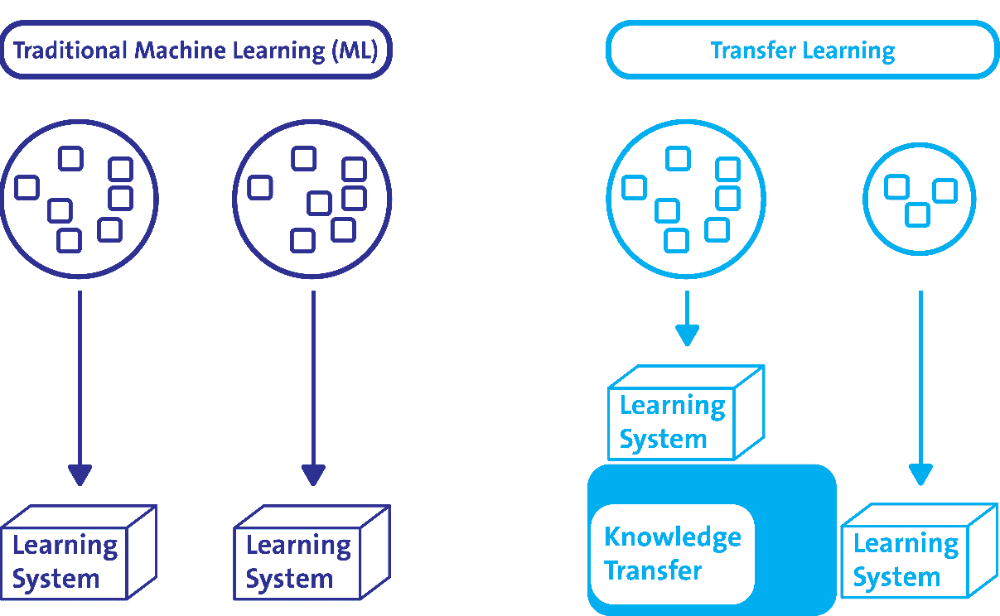
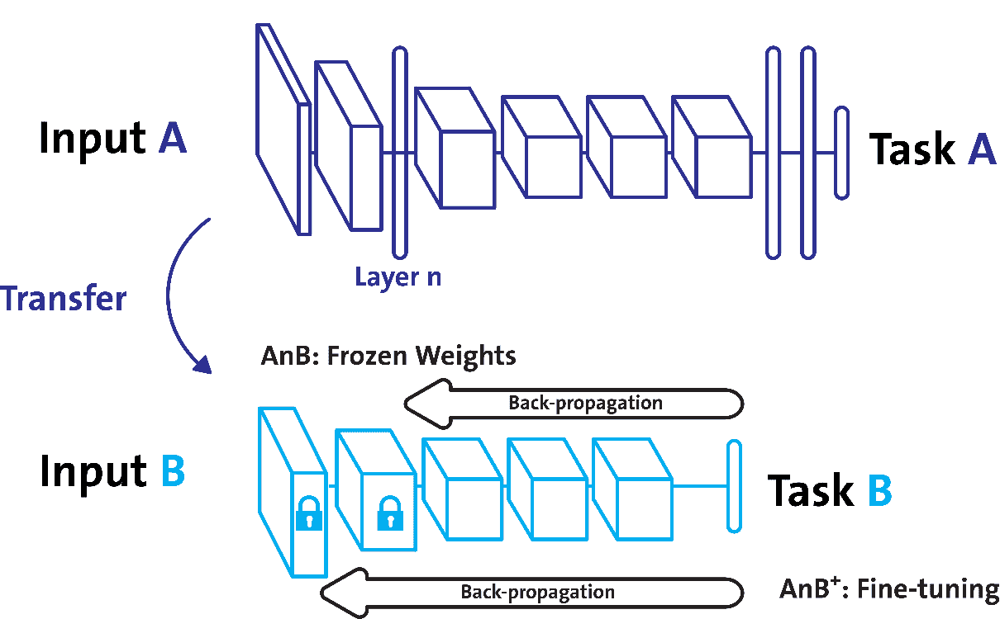
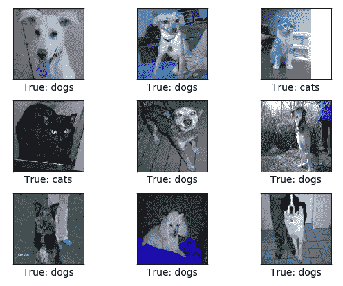
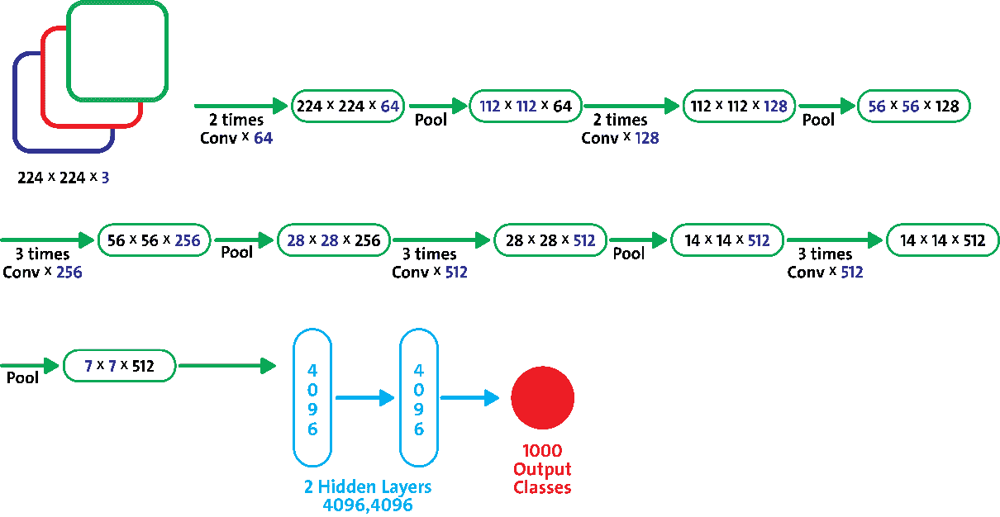
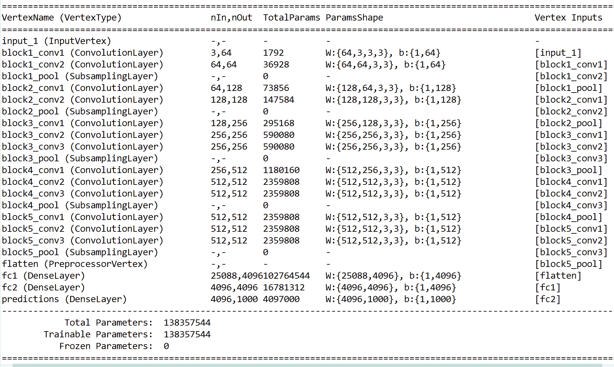
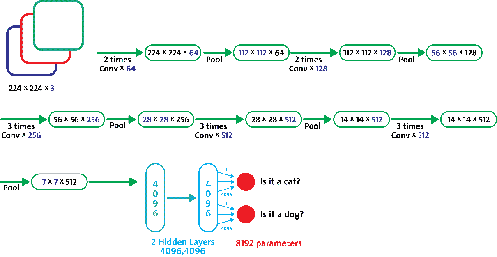
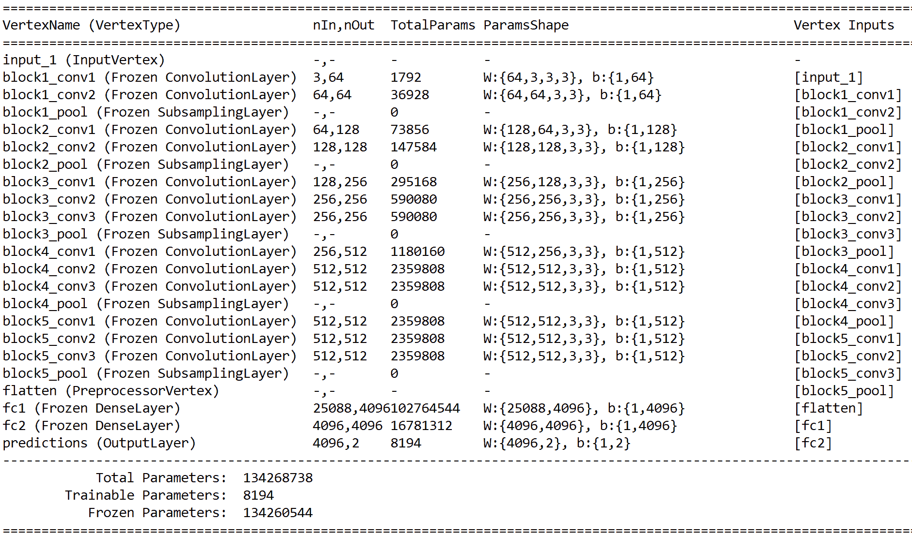
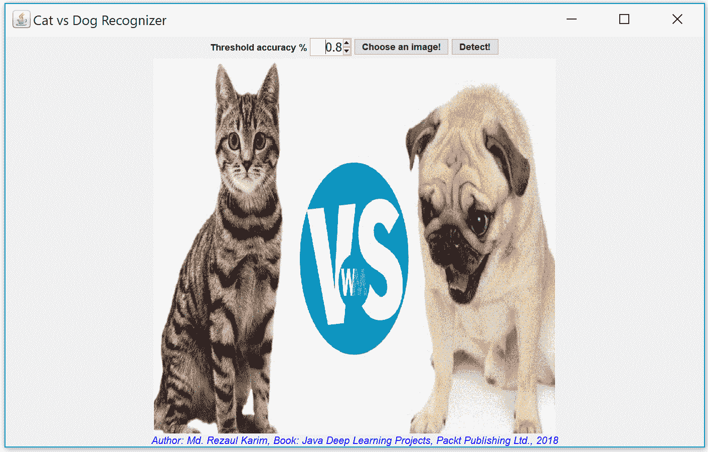
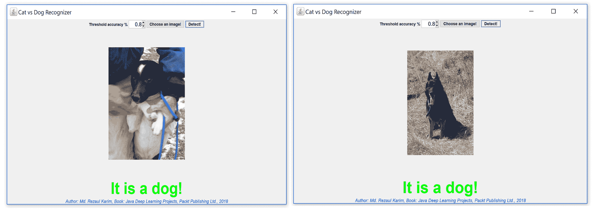
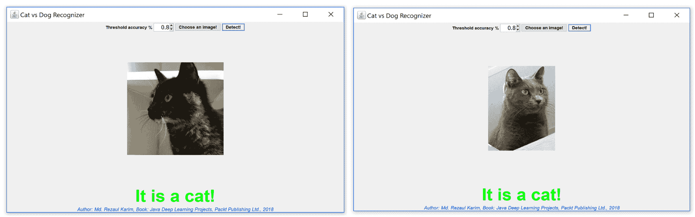

# 第五章：图像分类的迁移学习

在第三章，*多标签* *图像分类使用卷积神经网络*，我们展示了如何使用基于 Java 的卷积神经网络（CNN）和**Deeplearning4J**（**DL4J**）框架，在实际的 Yelp 图像数据集上开发一个端到端的项目来处理多标签图像分类问题。为此，我们从头开始开发了一个 CNN 模型。

不幸的是，从零开始开发这样的模型是非常耗时的，并且需要大量的计算资源。其次，有时我们甚至可能没有足够的数据来训练如此深的网络。例如，ImageNet 是目前最大的图像数据集之一，拥有数百万张带标签的图像。

因此，我们将开发一个端到端的项目，使用已通过 ImageNet 训练的预训练 VGG-16 模型来解决狗与猫的图像分类问题。最后，我们将把所有内容打包成一个 Java JFrame 和 JPanel 应用程序，以便让整体流程更加易懂。简而言之，整个端到端项目将帮助我们学习以下内容：

+   图像分类的迁移学习

+   使用迁移学习开发图像分类器

+   数据集的收集与描述

+   开发一个狗与猫检测器用户界面

+   **常见问题解答** (**FAQs**)

# 使用预训练的 VGG16 进行图像分类

目前机器学习领域最有用且新兴的应用之一是使用迁移学习技术；它提供了不同框架和平台之间的高可移植性。

一旦你训练好一个神经网络，你得到的就是一组训练好的超参数值。例如，**LeNet-5**有 60k 个参数值，**AlexNet**有 6000 万个，**VGG-16**有大约 1.38 亿个参数。这些架构的训练使用了从 1000 张到数百万张图像，通常这些架构非常深，拥有数百层，这些层都贡献了大量的超参数。

现在有很多开源社区成员甚至是科技巨头，他们已经公开了这些预训练模型，供研究（以及行业）使用，大家可以恢复并重用这些模型来解决类似问题。例如，假设我们想要将新图像分类到 AlexNet 的 1000 个类别之一，或者 LeNet-5 的 10 个类别中。我们通常不需要处理这么多参数，而只需关注一些选择出来的参数（我们很快就会看到一个例子）。

简而言之，我们不需要从头开始训练如此深的网络，而是重用现有的预训练模型；我们仍然能够实现可接受的分类准确率。从技术上讲，我们可以使用该预训练模型的权重作为特征提取器，或者直接用它初始化我们的架构，然后进行微调以适应我们的新任务。

在这方面，使用迁移学习技术来解决自己的问题时，可能有三种选择：

+   **将深度 CNN 用作固定特征提取器**：如果我们不再关心 ImageNet 中它的 1,000 个类别，我们可以通过移除输出层来重用预训练的 ImageNet，它具有一个完全连接的层。这样，我们可以将其他所有层视为特征提取器。即使在使用预训练模型提取了特征之后，你也可以将这些特征输入到任何线性分类器中，例如 softmax 分类器，甚至是线性 SVM！

+   **微调深度 CNN**：尝试微调整个网络，甚至大多数层，可能会导致过拟合。因此，需要额外的努力，使用反向传播在新任务上微调预训练的权重。

+   **重用带检查点的预训练模型**：第三种广泛使用的场景是下载互联网上公开的检查点。如果你没有足够的计算能力从头训练模型，你可以选择这个场景，只需使用已发布的检查点初始化模型，然后进行少量微调。

在这一点上，你可能会产生一个有趣的问题：传统的机器学习和使用迁移学习的机器学习有什么区别？嗯，在传统的机器学习中，你不会将任何知识或表示转移到其他任务中，而迁移学习则不同。

与传统机器学习不同，源任务和目标任务或领域不必来自相同的分布，但它们必须是相似的。此外，你可以在训练样本较少或没有足够计算能力的情况下使用迁移学习。



传统机器学习与迁移学习

# DL4J 和迁移学习

现在，让我们看看 DL4J 是如何通过其迁移学习 API 为我们提供这些功能的。DL4J 的迁移学习 API 使用户能够（更多信息请见[`deeplearning4j.org/transfer-learning`](https://deeplearning4j.org/transfer-learning)）：

+   修改现有模型的架构

+   微调现有模型的学习配置

+   在训练过程中保持指定层的参数（也叫**冻结层**）不变

这些功能在下图中有所体现，我们通过迁移学习技术解决任务 B（与任务 A 相似）：



迁移学习的工作原理

在下一节中，我们将深入探讨如何使用 DL4J 与预训练模型来帮助我们进行迁移学习。

# 使用迁移学习开发图像分类器

在下一节中，我们将展示如何根据狗和猫的原始图像进行区分。我们还将看到如何实现我们的第一个 CNN 模型来处理具有三通道的原始彩色图像。

这个项目深受（但进行了大量扩展）Klevis Ramo 的文章《Java 图像猫与狗识别与深度神经网络》启发（[`ramok.tech/`](http://ramok.tech/)）。

`code`文件夹包含三个包，每个包中有一些 Java 文件。它们的功能如下：

+   `com.packt.JavaDL.DogvCatClassification.Train`：

    +   `TrainCatvsDogVG16.java`：用于训练网络，并将训练好的模型保存到用户指定的位置。最后，它输出结果。

    +   `PetType.java`：包含一个`enum`类型，指定宠物类型（即，猫、狗和未知）。

    +   `VG16CatvDogEvaluator.java`：恢复由`TrainCatvsDogVG16.java`类保存到指定位置的训练模型。然后它在测试集和验证集上进行评估。最后，输出结果。

+   `com.packt.JavaDL.DogvCatClassification.Classifier`：

    +   `PetClassfier.java`：为用户提供上传样本图像的机会（即，狗或猫）。然后，用户可以通过高级用户界面进行检测。

+   `com.packt.JavaDL.DogvCatClassification.UI`：

    +   `ImagePanel.java`：通过扩展 Java 的 JPanel 类，作为图像面板使用

    +   `UI.java`：创建上传图像的用户界面并显示结果

    +   `ProgressBar.java`：显示进度条

我们将一步步进行探讨。首先，让我们看看数据集的描述。

# 数据集收集与描述

对于这个端到端项目，我们将使用微软提供的狗与猫数据集，该数据集曾作为臭名昭著的“狗与猫分类问题”的竞赛平台。数据集可以从[`www.microsoft.com/en-us/download/details.aspx?id=54765.`](https://www.microsoft.com/en-us/download/details.aspx?id=54765.)下载。

训练文件夹包含 25k 张狗和猫的图像，其中标签是文件名的一部分。然而，测试文件夹包含 12.5k 张根据数字 ID 命名的图像。现在让我们看看从这 25k 张图像中随机选取的一些样本：



显示随机选择的图像的真实标签

对于测试集中的每一张图像，我们必须预测该图像是否包含一只狗（*1 = 狗，0 = 猫*）。简而言之，这是一个二分类问题。

# 架构选择与采纳

如前所述，我们将重用 VGG-16 的预训练模型，该模型已使用来自 ImageNet 的不同猫狗品种图像进行了训练（请参阅[这里](http://www.image-net.org/challenges/LSVRC/2014/results#clsloc)的列表）。原始的 VGG-16 模型有 1,000 个要预测的图像类别，如下图所示：



原始 VGG-16 模型架构

幸运的是，训练好的模型和网络权重已经可以在 DL4J 网站上找到（参见 [`blob.deeplearning4j.org/models/vgg16_dl4j_inference.zip`](http://blob.deeplearning4j.org/models/vgg16_dl4j_inference.zip)），大小约为 500 MB。

你可以手动下载和恢复，或者更好的方式是采用 DL4J 的方式，只需指定预训练类型（直到 DL4J 1.0.0 alpha 版本时，只有四种预训练类型可用，如 ImageNet、CIFAR、MNIST 和 VGG-Face）。

后者非常简单；只需使用以下几行代码，训练好的模型将自动下载（但这需要根据网络速度花费一些时间）：

```py
ZooModel zooModel = new VGG16();
LOGGER.info(" VGG16 model is getting downloaded...");
ComputationGraph preTrainedNet = (ComputationGraph) zooModel.initPretrained(PretrainedType.IMAGENET);
```

在前面的代码片段中，`ComputationGraph` 类被用来实例化一个计算图，它是一个具有任意（即有向无环）连接结构的神经网络。这个图结构也可以有任意数量的输入和输出。

```py
LOGGER.info(preTrainedNet.summary());
```

现在，让我们来看一下网络架构，包括进出神经元的数量、参数形状和参数数量：



VGG-16 模型架构作为计算图

现在我们已经有了预训练的模型，利用它，我们可以预测最多 1,000 个类别。而可训练的参数数量等于总参数数量：1.38 亿。训练这么多参数是件很困难的事。

然而，由于我们只需要预测两个类别，因此我们需要稍微修改模型架构，使其仅输出两个类别，而不是 1,000 个。所以我们保持其他部分不变。修改后的 VGG-16 网络将如下所示：



从输入层到最后一个全连接层（即 fc2）被冻结

在前面的图示中，我们冻结了直到最后一个池化层并使用初始权重。绿色部分是我们希望训练的主题，因此我们只训练最后一层，针对两个类别。换句话说，在我们的案例中，我们将从输入层到最后一个全连接层（即`fc2`）冻结。也就是说，`featurizeExtractionLayer` 变量的值将是 `fc2`。

然而，在此之前，让我们定义一些属性，比如种子、类别数量以及我们想冻结到哪一层：

```py
private static final long seed = 12345;
private static final String FREEZE_UNTIL_LAYER = "fc2";
private static final int NUM_CLASS = 2;
```

然后我们实例化微调的配置，这将覆盖所有非冻结层的值，并使用此处设置的值：

```py
FineTuneConfiguration fineTuneConf = new FineTuneConfiguration.Builder()    
         .optimizationAlgo(OptimizationAlgorithm.STOCHASTIC_GRADIENT_DESCENT)
         .updater(new Adam(0.001))
         .seed(seed)
         .build();
```

**FineTuneConfiguration** 是微调的配置。在此配置中设置的值将覆盖每个非冻结层中的值。有兴趣的读者可以查看 [`deeplearning4j.org/doc/org/deeplearning4j/nn/transferlearning/FineTuneConfiguration.html`](https://deeplearning4j.org/doc/org/deeplearning4j/nn/transferlearning/FineTuneConfiguration.html)。

然后，我们创建一个配置图，它将完成这项工作：它将作为转移学习器，使用预训练的 VGG-16 模型：

```py
ComputationGraph vgg16Transfer = new TransferLearning.GraphBuilder(preTrainedNet)
       .fineTuneConfiguration(fineTuneConf)
       .setFeatureExtractor(FREEZE_UNTIL_LAYER)
       .removeVertexKeepConnections("predictions")
       .setWorkspaceMode(WorkspaceMode.SEPARATE)
       .addLayer("predictions", new OutputLayer
                  .Builder(LossFunctions.LossFunction.NEGATIVELOGLIKELIHOOD)
                  .nIn(4096).nOut(NUM_CLASS)
                  .weightInit(WeightInit.XAVIER)
                  .activation(Activation.SOFTMAX).build(), FREEZE_UNTIL_LAYER)
       .build();
vgg16Transfer.setListeners(new ScoreIterationListener(5));
LOGGER.info(vgg16Transfer.summary());
```

以下截图展示了前一个代码片段的输出：



冻结网络仅有 8,194 个可训练参数

在前面的代码中，我们移除了之前计算的预测，改用了我们的方法，使得修改后的网络仅通过重新添加一个新的预测层来预测两个类别。

此外，`setFeatureExtractor` 方法通过指定一个层顶点作为特征提取器来冻结权重。然后，指定的层顶点及其路径上的层（从输入顶点到该层的路径）将被冻结，参数保持不变。

因此，我们将只训练 8,192 个参数（在 1.38 亿个参数中），从最后一层到两个输出；另外两个参数是两个类别的偏置。简而言之，通过冻结至 fc2 层，现在可训练参数从 1.38 亿减少至 8,194（即 *8,192 个网络参数 + 2 个偏置参数*）。

# 训练集和测试集准备

现在我们已经创建了一个 **ComputationGraph**，接下来需要为微调阶段准备训练集和测试集。但在此之前，我们需要定义一些参数，例如允许的格式和数据路径：

```py
public static final Random RAND_NUM_GEN = new Random(*seed*);
public static final String[] ALLOWED_FORMATS = BaseImageLoader.*ALLOWED_FORMATS*;
public static ParentPathLabelGenerator *LABEL_GENERATOR_MAKER* = new ParentPathLabelGenerator();
public static BalancedPathFilter *PATH_FILTER* = new BalancedPathFilter(RAND_NUM_GEN, ALLOWED_FORMATS, LABEL_GENERATOR_MAKER);
```

简要讨论一下 **MultiLayerNetwork** 和 **ComputationGraph** 之间的区别。在 DL4J 中，有两种类型的网络由多个层组成：

+   **MultiLayerNetwork**：我们至今使用的神经网络层堆栈。

+   **ComputationGraph**：允许构建具有以下特性的网络：多个网络输入数组和多个网络输出（适用于分类和回归）。在这种网络类型中，层通过有向无环图连接结构相互连接。

无论如何，进入正题。设置完参数后，接下来的任务是定义文件路径。读者应该在训练时遵循此路径或提供准确的路径：

```py
public static String DATA_PATH = "data/DoG_CaT/data";
public static final String TRAIN_FOLDER = DATA_PATH + "/train";
public static final String *TEST_FOLDER* = DATA_PATH + "/test";
File trainData = new File(TRAIN_FOLDER);
```

接着，我们将使用基于 **JavaCV** 库的 `NativeImageLoader` 类来加载图像，允许的格式包括 `.bmp`、`.gif`、`.jpg`、`.jpeg`、`.jp2`、`.pbm`、`.pgm`、`.ppm`、`.pnm`、`.png`、`.tif`、`.tiff`、`.exr` 和 `.webp`：

**JavaCV** 使用来自 JavaCPP 预设的多个计算机视觉库的封装（例如 OpenCV 和 FFmpeg）。更多详细信息请访问 [`github.com/bytedeco/javacv`](https://github.com/bytedeco/javacv)。

```py
FileSplit train = new FileSplit(trainData, NativeImageLoader.ALLOWED_FORMATS, RAND_NUM_GEN);
```

一旦从图像中提取特征，我们将特征空间随机划分为 80%用于训练，剩余 20%用于验证训练过程，以防止过拟合：

```py
private static final int TRAIN_SIZE = 80;
InputSplit[] sample = train.sample(*PATH_FILTER*, TRAIN_SIZE, 100 - TRAIN_SIZE);
```

此外，我们的 DL4J 网络无法直接处理这种格式的数据，但我们需要将其转换为 `DataSetIterator` 格式：

```py
DataSetIterator trainIterator = getDataSetIterator(sample[0]);
DataSetIterator devIterator = getDataSetIterator(sample[1]);
```

在之前的代码行中，我们通过`getDataSetIterator()`方法将训练集和验证集都转换为`DataSetIterator`。该方法的签名如下：

```py
public static DataSetIterator getDataSetIterator(InputSplit sample) throws IOException {
    ImageRecordReader imageRecordReader = new ImageRecordReader(224, 224, 3, *LABEL_GENERATOR_MAKER*);
    imageRecordReader.initialize(sample);

    DataSetIterator iterator = new RecordReaderDataSetIterator(imageRecordReader, 
                               BATCH_SIZE, 1, NUM_CLASS);
    iterator.setPreProcessor(new VGG16ImagePreProcessor());
    return iterator;
}
```

太棒了！到目前为止，我们已经成功地准备好了训练集。不过，请记住，这个过程可能需要一些时间，因为需要处理 12,500 张图像。

现在我们可以开始训练了。不过，你可能会好奇为什么我们没有提到测试集。嗯，没错！我们肯定也需要使用测试集。不过，让我们在网络评估步骤中再讨论这个问题。

# 网络训练与评估

既然训练集和测试集已经准备好，我们就可以开始训练了。不过，在此之前，我们需要定义一些数据集准备的超参数：

```py
private static final int EPOCH = 100;
private static final int BATCH_SIZE = 128;
private static final int SAVING_INTERVAL = 100;
```

此外，我们还指定了训练好的模型将保存的路径，以便未来重复使用：

```py
private static final String SAVING_PATH = "bin/CatvsDog_VG16_TrainedModel_Epoch100_v1.zip";
```

现在我们可以开始训练网络了。我们将进行综合训练，使得训练使用训练集，而验证则使用验证集进行。最后，网络将使用测试集评估网络性能。因此，我们还需要准备测试集：

```py
File testData = new File(TEST_FOLDER);
FileSplit test = new FileSplit(testData, NativeImageLoader.ALLOWED_FORMATS, RAND_NUM_GEN);
DataSetIterator testIterator = *getDataSetIterator*(test.sample(*PATH_FILTER*, 1, 0)[0]);
```

然后，我们开始训练；我们使用了 128 的批量大小和 100 个 epoch。因此，第一次`while`循环将执行 100 次。接着，第二个内部`while`循环将执行 196 次（25,000 张猫狗图像/128）：

```py
int iEpoch = 0;
int i = 0;
while (iEpoch < EPOCH) {
 while (trainIterator.hasNext()) {
        DataSet trained = trainIterator.next();
        vgg16Transfer.fit(trained);
 if (i % SAVING_INTERVAL == 0 && i != 0) {
            ModelSerializer.*writeModel*(vgg16Transfer, new File(SAVING_PATH), false);
 *evaluateOn*(vgg16Transfer, devIterator, i);
        }
        i++;
    }
    trainIterator.reset();
    iEpoch++;
    evaluateOn(vgg16Transfer, testIterator, iEpoch);
}
```

这样，我们已经尝试使训练变得更快，但仍然可能需要几个小时甚至几天，具体取决于设置的 epoch 数量。而且，如果训练是在 CPU 上进行而不是 GPU，那么可能需要几天时间。对我来说，100 个 epoch 花了 48 小时。顺便提一下，我的机器配备的是 Core i7 处理器、32GB 内存和 GeForce GTX 1050 GPU。

时代与迭代

一个 epoch 是对数据的完全遍历，而一个迭代是对指定批量大小的一次前向传播和一次反向传播。

无论如何，一旦训练完成，训练好的模型将保存在之前指定的位置。现在让我们看看训练的结果如何。为此，我们将查看验证集上的表现（如前所述，我们使用了总训练集的 15%作为验证集，也就是 5,000 张图像）：

```py
>>>
 Cat classified by model as cat: 2444 times
 Cat classified by model as dog: 56 times
 Dog classified by model as cat: 42 times
 Dog classified by model as dog: 2458 times
 ==========================Scores==========================
 # of classes: 2
 Accuracy: 0.9800
 Precision: 0.9804
 Recall: 0.9806
 F1 Score: 0.9800
 ========================================================

```

然后，当我们在完整测试集（即 12,500 张图像）上评估模型时，我得到了以下的性能指标：

```py
>>>
 Cat classified by model as cat: 6178 times
 Cat classified by model as dog: 72 times
 Dog classified by model as cat: 261 times
 Dog classified by model as dog: 5989 times
 ==========================Scores===================
 # of classes: 2
 Accuracy: 0.9693
 Precision: 0.9700
 Recall: 0.9693
 F1 Score: 0.9688
 ==================================================
```

# 恢复训练好的模型并进行推理

既然我们已经看过了模型的表现，值得探索一下恢复已训练模型的可行性。换句话说，我们将恢复训练好的模型，并在验证集和测试集上评估网络性能：

```py
private staticfinal String TRAINED_PATH_MODEL = "bin/CatvsDog_VG16_TrainedModel_Epoch100_v1.zip";
ComputationGraph computationGraph = ModelSerializer.restoreComputationGraph(new File(TRAINED_PATH_MODEL));

VG16CatvDogEvaluator().runOnTestSet(computationGraph);
VG16CatvDogEvaluator().runOnValidationSet(computationGraph);
```

在前面一行代码中，首先，我们从磁盘恢复了训练好的模型；然后，我们在测试集（完整测试集）和验证集（训练集的 20%）上进行了评估。

现在，让我们看一下`runOnTestSet()`方法的签名，它很简单，因为我们在前面的子节中已经描述了类似的工作流程：

```py
private void runOnTestSet(ComputationGraph computationGraph) throws IOException {
        File trainData = new File(TrainCatvsDogVG16.TEST_FOLDER);
        FileSplit test = new FileSplit(trainData, NativeImageLoader.ALLOWED_FORMATS,             
                                       TrainCatvsDogVG16.RAND_NUM_GEN);

        InputSplit inputSplit = test.sample(TrainCatvsDogVG16.*PATH_FILTER*, 100, 0)[0];
        DataSetIterator dataSetIterator = TrainCatvsDogVG16.getDataSetIterator(inputSplit);
        TrainCatvsDogVG16.evaluateOn(computationGraph, dataSetIterator, 1);
}
```

现在，让我们看一下`runOnValidationSet`方法的签名：

```py
private void runOnValidationSet(ComputationGraph computationGraph) throws IOException {
        File trainData = new File(TrainCatvsDogVG16.TRAIN_FOLDER);
        FileSplit test = new FileSplit(trainData, NativeImageLoader.ALLOWED_FORMATS,     
                                       TrainCatvsDogVG16.RAND_NUM_GEN);

        InputSplit inputSplit = test.sample(TrainCatvsDogVG16.*PATH_FILTER*, 15, 80)[0];
        DataSetIterator dataSetIterator = TrainCatvsDogVG16.getDataSetIterator(inputSplit);
        TrainCatvsDogVG16.evaluateOn(computationGraph, dataSetIterator, 1);
}
```

# 进行简单推理

现在我们已经看到，我们训练的模型在测试集和验证集上都表现出色。那么，为什么不开发一个 UI 来帮助我们简化操作呢？如前所述，我们将开发一个简单的 UI，它将允许我们上传一张样本图片，然后我们应该能够通过按下一个按钮来检测它。这部分是纯 Java 实现的，所以我在这里不讨论细节。

如果我们运行`PetClassifier.java`类，它首先加载我们训练的模型，并作为后台部署该模型。然后它调用`UI.java`类来加载用户界面，界面如下所示：



猫狗识别器的 UI

在控制台中，你应该看到以下日志/消息：

```py
19:54:52.496 [pool-1-thread-1] INFO org.nd4j.linalg.factory.Nd4jBackend - Loaded [CpuBackend] backend
19:54:52.534 [pool-1-thread-1] WARN org.reflections.Reflections - given scan urls are empty. set urls in the configuration
19:54:52.865 [pool-1-thread-1] INFO org.nd4j.nativeblas.NativeOpsHolder - Number of threads used for NativeOps: 4
19:54:53.249 [pool-1-thread-1] INFO org.nd4j.nativeblas.Nd4jBlas - Number of threads used for BLAS: 4
19:54:53.252 [pool-1-thread-1] INFO org.nd4j.linalg.api.ops.executioner.DefaultOpExecutioner - Backend used: [CPU]; OS: [Windows 10]
19:54:53.252 [pool-1-thread-1] INFO org.nd4j.linalg.api.ops.executioner.DefaultOpExecutioner - Cores: [8]; Memory: [7.0GB];
19:54:53.252 [pool-1-thread-1] INFO org.nd4j.linalg.api.ops.executioner.DefaultOpExecutioner - Blas vendor: [OPENBLAS]
19:55:09.015 [pool-1-thread-1] DEBUG org.reflections.Reflections - going to scan these urls:
 ...
9:55:13.394 [pool-1-thread-1] INFO org.deeplearning4j.nn.graph.ComputationGraph - Starting ComputationGraph with WorkspaceModes set to [training: NONE; inference: SEPARATE]
19:55:13.394 [pool-1-thread-1] DEBUG org.reflections.Reflections - going to scan these urls:
19:55:13.779 [pool-1-thread-1] INFO com.packt.JavaDL.DogvCatClassification.UI.UI - Model loaded successfully!
```

现在，让我们上传一些来自测试集的照片（这更有意义，因为我们正在重新使用训练好的模型，而该模型只训练了训练集，因此测试集中的图片仍然是未见过的）：



我们的猫狗识别器能够识别具有不同形状和颜色的狗的图片

因此，我们训练好的模型能够识别不同形状、尺寸和颜色的狗的图片。现在，让我们尝试上传几张猫的图片，看看它是否能正常工作：



我们的猫狗识别器能够识别具有不同形状和颜色的猫的图片

# 常见问题解答（FAQ）

现在，我们已经通过卓越的准确性解决了猫狗分类问题，但转移学习和深度学习现象的其他实际方面也需要考虑。在本节中，我们将看到一些你可能已经在脑海中的常见问题，答案可以在附录 A 找到。

1.  我可以用自己的动物图片来训练模型吗？

1.  使用所有图片进行训练太慢了。我该怎么做？

1.  我可以将这个应用程序打包成一个 Web 应用吗？

1.  我可以使用 VGG-19 来完成这个任务吗？

1.  我们有多少个超参数？我还想查看每一层的超参数。

# 总结

在本章中，我们使用转移学习技术解决了一个有趣的猫狗分类问题。我们使用了一个预训练的 VGG16 模型及其权重，然后通过使用来自 Kaggle 的现实生活猫狗数据集进行微调训练。

训练完成后，我们保存了训练好的模型，以便于模型的持久化和后续复用。我们看到，训练好的模型能够成功地检测并区分具有不同尺寸、质量和形状的猫狗图片。

即使是经过训练的模型/分类器，也可以用于解决现实生活中的猫狗问题。总结来说，这种技术通过一些最小的努力可以扩展，并用于解决类似的图像分类问题，适用于二分类和多分类问题。

在下一章中，我们将展示如何开发一个端到端的项目，在视频片段持续播放时从视频帧中检测物体。我们还将学习如何利用预训练的 `TinyYOLO` 模型，它是原始 YOLOv2 模型的一个小型变体。

此外，我们还将讨论一些典型的图像和视频中的物体检测挑战。然后，我们将展示如何使用边界框和非最大抑制技术来解决这些问题。最后，我们将展示如何使用 JavaCV 库和 DL4J 库处理视频片段。最后，我们还将解答一些常见问题，这些问题对于采纳和扩展这个项目非常有帮助。

# 问题解答

**问题 1 的回答**：是的，当然可以。不过，请注意，你必须提供足够数量的图像，最好每种动物类型至少提供几千张图像。否则，模型将无法训练得很好。

**问题 2 的回答**：一个可能的原因是你尝试一次性喂入所有图像，或者你在使用 CPU 训练（而你的机器配置不佳）。前者可以通过简单的方式解决；我们可以采用批量模式进行训练，这也是深度学习时代推荐的方式。

后者的情况可以通过将训练从 CPU 迁移到 GPU 来解决。不过，如果你的机器没有 GPU，你可以尝试迁移到 Amazon GPU 实例，支持单个（p2.xlarge）或多个 GPU（例如，p2.8xlarge）。

**问题 3 的回答**：提供的应用程序应该足够帮助你理解应用的有效性。不过，这个应用程序仍然可以包装成一个 Web 应用程序，在后台提供训练好的模型。

我经常使用 Spring Boot 框架（更多信息请参见 [`projects.spring.io/spring-boot/`](https://projects.spring.io/spring-boot/)）来完成这项工作。除此之外，Java CUBA Studio 也可以使用（请参见 [`www.cuba-platform.com/`](https://www.cuba-platform.com/)）。

如本章前面提到的，VGG-16 是 VGG-19 的一个小型变体。不幸的是，无法直接使用 VGG-19。不过，读者可以尝试使用 Keras 导入 VGG-19。

**问题 6 的回答**：只需在网络初始化后立即使用以下代码：

```py
//Print the number of parameters in the network (and for each layer)
Layer[] layers = model.getLayers();
int totalNumParams = 0;

for( int i=0; i<layers.length; i++ ){
         int nParams = layers[i].numParams();
         System.*out*.println("Number of parameters in layer " + i + ": " + nParams);
         totalNumParams += nParams;
}
System.*out*.println("Total number of network parameters: " + totalNumParams);
>>>
 Number of parameters in layer 0: 1792
 Number of parameters in layer 1: 36928
 Number of parameters in layer 2: 0
 Number of parameters in layer 3: 73856
 Number of parameters in layer 4: 147584
 Number of parameters in layer 5: 0
 Number of parameters in layer 6: 295168
 Number of parameters in layer 7: 590080
 Number of parameters in layer 8: 590080
 Number of parameters in layer 9: 0
 Number of parameters in layer 10: 1180160
 Number of parameters in layer 11: 2359808
 Number of parameters in layer 12: 2359808
 Number of parameters in layer 13: 0
 Number of parameters in layer 14: 2359808
 Number of parameters in layer 15: 2359808
 Number of parameters in layer 16: 2359808
 Number of parameters in layer 17: 0
 Number of parameters in layer 18: 102764544
 Number of parameters in layer 19: 16781312
 Number of parameters in layer 20: 8194
 Total number of network parameters: 134268738
```
