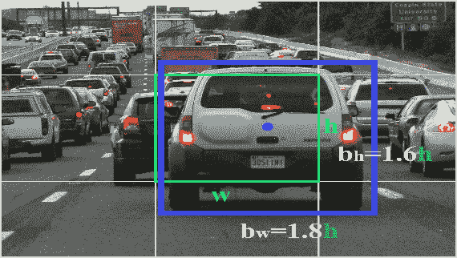
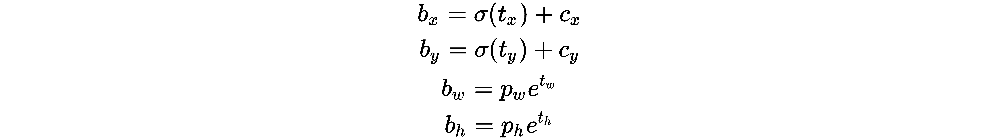

# 第六章：使用 YOLO、JavaCV 和 DL4J 进行实时物体检测

```py
Deep Convolutional Neural Networks (DCNN) have been used in computer vision—for example, image classification, image feature extraction, object detection, and semantic segmentation. Despite such successes of state-of-the-art approaches for object detection from still images, detecting objects in a video is not an easy job.
```

考虑到这一缺点，在本章中，我们将开发一个端到端的项目，该项目将在视频片段连续播放时从视频帧中检测物体。我们将利用训练好的 YOLO 模型进行迁移学习，并在**Deeplearning4j**（**DL4J**）的基础上使用 JavaCV 技术来实现。简而言之，以下主题将贯穿整个端到端的项目：

+   物体检测

+   视频中物体检测的挑战

+   使用 YOLO 与 DL4J

+   常见问题解答（FAQ）

# 图像与视频中的物体检测

深度学习已广泛应用于各种计算机视觉任务，如图像分类、物体检测、语义分割和人体姿态估计。当我们打算解决图像中的物体检测问题时，整个过程从物体分类开始。接着我们进行物体定位，最后进行物体检测。

本项目深受 Klevis Ramo 的《Java 自动驾驶——汽车检测》一文的启发（[`ramok.tech/`](http://ramok.tech/)）。同时，部分理论概念（但在此需求下已显著扩展）已获得作者的授权。

# 物体分类、定位与检测

在物体分类问题中，给定一张图像（或视频片段），我们关心的是它是否包含感兴趣的区域（ROI）或物体。更正式地说，就是“图像包含一辆车”与“图像不包含任何车”。为了解决这个问题，在过去的几年中，ImageNet 和 PASCAL VOC（详见[`host.robots.ox.ac.uk/pascal/VOC/`](http://host.robots.ox.ac.uk/pascal/VOC/)）被广泛使用，并且基于深度卷积神经网络（CNN）架构。

此外，当然，最新的技术进展（即软硬件的进步）也推动了性能提升，达到了新的水平。尽管如此，尽管最先进的方法在静态图像中的成功，视频中的物体检测依然不容易。然而，从视频中进行物体检测引出了许多新的问题、可能性和挑战，如何有效且稳健地解决视频中的物体检测问题。

解答这个问题并不容易。首先，让我们一步步地尝试解决这个问题。首先，让我们先尝试解决静态图像的情况。好吧，当我们想要使用 CNN 来预测图像是否包含特定物体时，我们需要在图像中定位物体的位置。为此，我们需要指定物体在图像中的位置，并与分类任务一起完成。这通常通过用矩形框标记物体来完成，矩形框通常被称为边界框（bounding box）。

现在，边界框的概念是，在视频的每一帧中，算法需要对每个类别的物体标注边界框和置信度分数。为了清楚地理解这一点，我们来看一下什么是边界框。边界框通常由中心 (*b^x*, *b^y*)、矩形高度 (*b^h*) 和矩形宽度 (*b^w*) 来表示，如下图所示：


边界框表示

现在我们知道如何表示这样的边界框，我们可以理解在我们的训练数据中定义这些信息所需的内容，针对每张图像中的每个物体。只有这样，网络才能输出以下内容：

+   图像类别的概率（例如，20% 的概率是汽车，60% 的概率是公交车，10% 的概率是卡车，或 10% 的概率是火车）

+   此外，定义物体边界框的四个变量

仅知道这些信息还不够。有趣的是，凭借关于边界框点的最小上下文信息（即中心、宽度和高度），我们的模型仍然能够进行预测，并为我们提供更详细的内容视图。换句话说，采用这种方法，我们可以解决物体定位问题，但它仍然仅适用于单一物体。

因此，我们甚至可以进一步推进，不仅仅定位单一物体，而是定位图像中的多个或所有物体，这将帮助我们向物体检测问题迈进。尽管原始图像的结构保持不变，但我们需要在单张图像中处理多个边界框。

现在，为了解决这个问题，一种最先进的技术是将图像划分为较小的矩形。我们已经看到的五个额外变量（*P^c, b^x, b^y*, *b^h*, *b^w*）以及每个边界框的正常预测概率，仍然适用。

这个想法听起来很简单，但它在实际中如何运作呢？如果我们只需要处理一个静态图像分类问题，事情会变得更简单。使用一种朴素方法，即从成千上万张汽车图像中裁剪出每一张汽车图像，然后训练一个卷积神经网络（例如，VGG-19）来使用所有这些图像训练模型（尽管每张图像的大小可能不同）。


典型的高速公路交通

现在，为了处理这种情况，我们可以使用滑动矩形窗口扫描图像，每次让我们的模型预测其中是否有汽车。正如我们所看到的，通过使用不同大小的矩形，我们可以为汽车及其位置推测出非常不同的形状。

尽管这种方法在检测汽车方面效果很好，但假设一个更实际的问题，比如开发自动驾驶应用。在典型的高速公路上，城市甚至郊区，会有许多汽车、公交车、卡车、摩托车、自行车和其他交通工具。此外，还会有行人、交通标志、桥梁、隔离带和路灯等其他物体。这些因素会使场景变得更加复杂。然而，实际图像的尺寸会与裁剪图像的尺寸差异很大（即，实际图像要大得多）。此外，在前方，许多汽车可能正在接近，因此需要手动调整大小、特征提取，然后进行手工训练。

另一个问题是训练算法的慢速，因此它不能用于实时视频目标检测。这个应用将被构建出来，以便大家可以学到一些有用的知识，从而将相同的知识扩展并应用到新兴的应用中，比如自动驾驶。

不管怎样，让我们回到最初的讨论。当矩形（向右、向左、向上和向下）移动时，许多共享的像素可能无法被重用，而是被反复重新计算。即使使用非常精确和不同大小的边界框，这种方法也无法非常准确地标出物体的边界框。

因此，模型可能无法非常准确地输出车辆的类别，因为框中可能只包含物体的一部分。这可能导致自动驾驶汽车容易发生事故——即，可能会与其他车辆或物体发生碰撞。为了摆脱这一限制，当前最先进的一个方法是使用**卷积滑动窗口**（**CSW**）解决方案，这在 YOLO 中被广泛使用（我们稍后会看到）。

# 卷积滑动窗口（CSW）

在前面的子章节中，我们看到基于朴素滑动窗口的方法存在严重的性能缺陷，因为这种方法无法重用已经计算出的许多值。

然而，当每个独立的窗口移动时，我们需要为所有像素执行数百万个超参数计算才能得到预测。实际上，通过引入卷积，大部分计算可以被重用（参见第五章，*使用迁移学习的图像分类*，了解更多关于使用预训练的深度卷积神经网络（DCNN）架构进行图像分类的迁移学习）。这一点可以通过两种增量方式实现：

+   通过将全连接 CNN 层转化为卷积

+   使用 CSW

我们已经看到，无论人们使用的是哪种 DCNN 架构（例如，DarkNet、VGG-16、AlexNet、ImageNet、ResNet 和 Inception），无论其大小和配置如何，最终它们都被用来喂入全连接神经网络，具有不同数量的层，并根据类别输出多个预测结果。

此外，这些深度架构通常有非常多的层，以至于很难很好地解释它们。因此，选择一个更小的网络听起来是一个合理的选择。在以下图示中，网络以一个 32 x 32 x 3 的彩色图像（即 RGB）作为输入。然后，它使用相同的卷积，这使得前两个维度（即宽度 x 高度）保持不变，仍为 3 x 3 x 64，以获得输出 32 x 32 x 64。通过这种方式，第三维度（即 64）与卷积矩阵保持一致。


然后，放置一个最大池化层来减少宽度和高度，但保持第三维度不变，仍为 16 x 16 x 64。之后，将减少后的层输入到一个密集层，该层有两个隐藏层，每个隐藏层包含 256 和 128 个神经元。最后，网络使用 Softmax 层输出五个类别的概率。

现在，让我们看看如何将**全连接**（**FC**）层替换为卷积层，同时保持输入的线性函数为 16 x 16 x 64，如下图所示：


在前面的图示中，我们只是将 FC 层替换为卷积滤波器。实际上，一个 16 x 16 x 256 的卷积滤波器相当于一个 16 x 16 x 64 x 256 的矩阵。在这种情况下，第三维度 64 总是与输入的第三维度 16 x 16 x 64 相同。因此，它可以通过省略 64 来表示为 16 x 16 x 256 的卷积滤波器，这实际上相当于对应的 FC 层。以下的数学公式可以解答这个问题：

*输出: 1 x 1 x 256 = 输入: [16 x 16 x 64] * 卷积: [16 x 16 x 64 x 256]*

上述数学公式意味着输出 1 x 1 x 256 的每个元素都是输入 16 x 16 x 64 中相应元素的线性函数。我们将 FC 层转换为卷积层的原因是，它将为我们提供更多的灵活性来生成网络的输出：对于 FC 层，我们将始终得到相同的输出大小，也就是类别的数量。

现在，为了看到将 FC 层替换为卷积滤波器的效果，我们需要使用一个更大的输入图像，比如 36 x 36 x 3。如果我们使用简单的滑动窗口技术，步长为 2 并且有 FC，我们需要将原始图像的大小移动九次才能覆盖所有区域，因此也需要执行九次模型。因此，采用这种方法显然没有意义。相反，让我们尝试将这个新的更大的矩阵作为输入，应用到我们只包含卷积层的新模型中。


现在，我们可以看到输出已经从 1 x 1 x 5 变成了 3 x 3 x 5，这与全连接（FC）进行对比时有所不同。再回想一下基于 CSW 的方法，我们必须将滑动窗口移动九次以覆盖所有图像，这巧妙地与卷积的 3 x 3 输出相等，不过，每个 3 x 3 的单元代表了一个 1 x 1 x 5 类别的滑动窗口的概率预测结果！因此，最终输出不再是仅有的一个 1 x 1 x 5 并经过 9 次滑动窗口移动，而是通过一次操作得到的 3 x 3 x 5。

现在，采用基于 CSW 的方法，我们已经能够解决图像中的物体检测问题。然而，这种方法并不十分准确，但仍然能在精度稍逊的情况下产生一个可接受的结果。不过，当涉及到实时视频时，情况变得更加复杂。我们将在本章稍后看到 YOLO 是如何解决剩余的局限性的。现在，先让我们试着理解从视频片段中检测物体的底层复杂性。

# 从视频中进行物体检测

在深入研究之前，让我们先思考一个简单的情境。假设我们有一个视频片段，包含一只猫或狼在森林中的移动。现在，我们希望在每个时间点上检测到这个移动中的动物。

下图展示了这种情境下的挑战。红色框是实际标注。图像上半部分（即`a`）显示静态图像物体检测方法在帧间存在较大的时间波动，甚至在实际标注的边界框上。波动可能是由运动模糊、视频失焦、部分遮挡或姿态问题引起的。相邻帧中同一物体的框的信息需要被利用，以便在视频中进行物体检测。

另一方面，(`b`)显示了跟踪能够关联同一物体的框。然而，由于遮挡、外观变化和姿态变化，跟踪框可能会漂移到非目标物体上。物体检测器应与跟踪算法结合，以便在漂移发生时持续开始新的跟踪。


从视频中进行物体检测的挑战（来源：Kai Kang 等，《基于卷积神经网络的视频管道物体检测》）

有一些方法可以解决这个问题。然而，大多数方法侧重于检测一种特定类别的物体，比如行人、汽车或有动作的人类。

幸运的是，类似于静态图像中的物体检测能够协助图像分类、定位和物体检测等任务，准确检测视频中的物体也可能提升视频分类的性能。通过定位视频中的物体，也可以更清晰地描述视频的语义含义，从而增强视频任务的鲁棒性。

换句话说，现有的通用目标检测方法无法有效解决这个问题。它们的性能可能会受到视频中物体外观变化较大的影响。例如，在上面的图（`a`）中，如果猫最初面对相机然后转身，背部的图像可能无法有效地被识别为猫，因为它包含的纹理信息很少，而且不太可能包含在训练数据中。然而，这是一个更简单的场景，我们只需要检测一个物体（即动物）。

当我们想为自动驾驶汽车开发应用程序时，我们将不得不处理许多物体和考虑因素。无论如何，由于我们无法在本章中涵盖所有方面，我们就以最基本的知识来解决这个问题。

此外，从零开始实现和训练这些类型的应用程序既耗时又具有挑战性。因此，如今，迁移学习技术正在成为流行且可行的选择。通过利用已经训练好的模型，我们可以更轻松地进行开发。一个这样的训练过的目标检测框架是 YOLO，它是最先进的实时目标检测系统之一。这些挑战和像 YOLO 这样的框架激励我以最小的努力开发这个项目。

# 只看一次（YOLO）

尽管我们已经通过引入卷积滑动窗口解决了静态图像中的目标检测问题，但即便使用了多个边界框尺寸，我们的模型可能仍然无法输出非常准确的边界框。让我们看看 YOLO 是如何很好地解决这个问题的：


使用边界框规格，我们查看每张图像并标记我们想要检测的目标

我们需要以特定的方式标记训练数据，以便 YOLO 算法能够正确工作。YOLO V2 格式要求边界框的尺寸为*b^x*、*b^y*、*b^h*、*b^w*，这些尺寸必须相对于原始图像的宽度和高度。

首先，我们通常会查看每一张图像，并标记我们想要检测的目标。之后，每张图像会被分割成更小的矩形（框），通常是 13 x 13 个矩形，但在这里为了简化，我们使用 8 x 9 个矩形。边界框（蓝色）和目标可以属于多个框（绿色），因此我们只将目标和边界框分配给包含目标中心的框（黄色框）。

通过这种方式，我们用四个附加变量（除了识别目标是汽车外）训练我们的模型（*b^x*、*b^y*、*b^h* 和 *b^w*），并将这些变量分配给拥有目标中心的框*b^x*、*b^y*。由于神经网络是用这些标记过的数据训练的，它也会预测这四个变量（除了目标是什么）的值或边界框。

我们不再使用预定义的边界框大小进行扫描并尝试拟合物体，而是让模型学习如何用边界框标记物体。因此，边界框现在是灵活的。这无疑是一种更好的方法，边界框的准确性更高、更灵活。

让我们看看现在如何表示输出，考虑到我们在类别（例如 1-汽车，2-行人）旁边添加了四个变量（*b^x*，*b^y*，*b^h* 和 *b^w*）。实际上，还添加了另一个变量 *P^c*，它简单地告诉我们图像是否包含我们想要检测的任何物体。

+   **P^c =1(red)**: 这意味着至少有一个物体存在，所以值得关注概率和边界框。

+   **P^c =0(red)**: 该图像没有我们想要的任何物体，因此我们不关心概率或边界框规格。

结果预测，*b[w,]* 和 `b[h]`，是通过图像的高度和宽度进行归一化的。（训练标签是这样选择的。）因此，如果包含汽车的边界框预测 `b[x]` 和 `b[y]` 为 (0.3, 0.8)，那么在 13 x 13 特征图上的实际宽度和高度为 (13 x 0.3, 13 x 0.8)。

YOLO 预测的边界框是相对于拥有物体中心的框（黄色）来定义的。框的左上角从 (0, 0) 开始，右下角是 (1, 1)。由于该点位于框内，因此在这种情况下，sigmoid 激活函数确保中心 (`b[x]` , `b[y]`) 的值在 0 到 1 之间，如下图所示：


Sigmoid 激活函数确保中心点 (`b[x]` , `b[y]`) 的值在 0 到 1 之间。

虽然 `b[h]`，*b[^w]* 是按照框的 `w` 和 `h` 值（黄色）按比例计算的，值可以大于 1（对于正值使用指数）。从图中我们可以看到，边界框的宽度 `b[w]` 几乎是框宽度 `w` 的 1.8 倍。类似地，`b[h]` 约为框高度 `h` 的 1.6 倍，如下图所示：



现在，问题是物体包含在边界框中的概率是多少？要回答这个问题，我们需要知道物体得分，它表示物体被包含在边界框中的概率。对于红色及邻近的网格，它应该接近 1，而对于角落的网格来说，几乎是 0。以下公式描述了网络输出如何被转换以获取边界框预测：



在前面的公式中，`b[x]`，`b[y]`，`b[w]` 和 `b[h]` 分别是我们预测的 `x`、`y` 中心坐标、宽度和高度。另一方面，`t[x]`，`t[y]`，`t[w]` 和 `t[h]` 是网络输出的值。此外，`c[x]` 和 `c[y]` 是网格的左上坐标。最后，`p[w]` 和 `p[h]` 是框的锚点尺寸。

物体性得分也通过 sigmoid 函数进行处理，因为它需要被解释为概率。然后，使用类别置信度表示检测到的物体属于特定类别的概率。预测后，我们查看预测框与最初标记的真实边界框的交集程度。我们试图最大化它们之间的交集，因此理想情况下，预测的边界框与标记的边界框完全重叠。

简而言之，我们提供足够的带有边界框的标注数据（*b^x*，*b^y*，*b^h*，*b^w*），然后将图像分割并分配给包含中心的框，使用 CSW 网络进行训练并预测物体及其位置。所以，首先我们进行分类，然后本地化物体并检测它。

到目前为止，我们已经能够克服大部分障碍，使用 YOLO 解决了问题。然而，实际上还有两个小问题需要解决。首先，尽管在训练时物体被分配到一个框中（即包含物体中心的框），但在推理时，训练好的模型会假设有多个框（即黄色框）包含物体的中心（即红色框）。因此，这种混淆为同一物体引入了额外的边界框。

幸运的是，非最大抑制算法可以解决这个问题：首先，算法选择一个具有最大*P^c*概率的预测框，这样它的值介于 0 和 1 之间，而不是二进制的 0 或 1 值。然后，移除与该框交集超过某个阈值的每个框。重复相同的逻辑，直到没有更多的边界框剩余。其次，由于我们预测多个物体（如汽车、火车、公共汽车等），两个或更多物体的中心可能位于一个框内。这个问题可以通过引入锚框来解决：


一个锚框规范

通过锚框，我们选择几种经常用于检测目标的边界框形状。然后，通过对输出应用对数空间变换，预测边界框的维度，再将其乘以锚框。

# 开发一个实时物体检测项目

在这一部分，我们将使用预训练的 YOLO 模型（即迁移学习）、DL4J 和 OpenCV 开发一个视频物体分类应用程序，可以检测视频帧中的标签，如汽车和树木。坦率地说，这个应用程序实际上是将图像检测问题扩展到视频检测。所以让我们开始吧。

# 步骤 1 - 加载一个预训练的 YOLO 模型

自 Alpha 版本 1.0.0 以来，DL4J 通过 ZOO 提供了一个 Tiny YOLO 模型。为此，我们需要在 Maven 友好的`pom.xml`文件中添加一个依赖项：

```py
<dependency>
  <groupId>org.deeplearning4j</groupId>
  <artifactId>deeplearning4j-zoo</artifactId>
  <version>${dl4j.version}</version>
</dependency>
```

除此之外，如果可能的话，确保你通过添加以下依赖项来使用 CUDA 和 cuDNN（更多细节请参见第二章，*使用递归类型网络进行癌症类型预测*）：

```py
<dependency>
  <groupId>org.nd4j</groupId>
  <artifactId>nd4j-cuda-9.0-platform</artifactId>
  <version>${nd4j.version}</version>
</dependency>
<dependency>
  <groupId>org.deeplearning4j</groupId>
  <artifactId>deeplearning4j-cuda-9.0</artifactId>
  <version>${dl4j.version}</version>
</dependency>
```

然后，我们准备加载预训练的 Tiny YOLO 模型作为`ComputationGraph`，代码如下：

```py
private ComputationGraph model; 
private TinyYoloModel() { 
        try { 
            model = (ComputationGraph) new TinyYOLO().initPretrained(); 
            createObjectLabels(); 
        } catch (IOException e) { 
            throw new RuntimeException(e); 
        } 
    }  
```

在前面的代码片段中，`createObjectLabels()`方法指的是用于训练 YOLO 2 模型的 PASCAL 视觉物体类（PASCAL VOC）数据集中的标签。该方法的签名如下所示：

```py
private HashMap<Integer, String> labels;  
void createObjectLabels() { 
        if (labels == null) { 
            String label = "aeroplanen" + "bicyclen" + "birdn" + "boatn" + "bottlen" + "busn" + "carn" + 
                    "catn" + "chairn" + "cown" + "diningtablen" + "dogn" + "horsen" + "motorbiken" + 
                    "personn" + "pottedplantn" + "sheepn" + "sofan" + "trainn" + "tvmonitor"; 
            String[] split = label.split("\n"); 
            int i = 0; 
            labels = new HashMap<>(); 
            for(String label1 : split) { 
                labels.put(i++, label1); 
            } 
        } 
    } 
```

现在，让我们创建一个 Tiny YOLO 模型实例：

```py
 static final TinyYoloModel yolo = new TinyYoloModel(); 
    public static TinyYoloModel getPretrainedModel() { 
        return yolo; 
    } 
```

现在，出于好奇，让我们看看模型架构以及每一层的超参数数量：

```py
TinyYoloModel model = TinyYoloModel.getPretrainedModel(); 
System.out.println(TinyYoloModel.getSummary()); 
```


预训练 Tiny YOLO 模型的网络总结和层结构

因此，我们的 Tiny YOLO 模型在其 29 层网络中大约有 160 万个参数。然而，原始 YOLO 2 模型的层数更多。有兴趣的读者可以查看原始 YOLO 2，链接地址为[`github.com/yhcc/yolo2/blob/master/model_data/model.png`](https://github.com/yhcc/yolo2/blob/master/model_data/model.png)。

# 步骤 2 - 从视频片段生成帧

现在，为了处理实时视频，我们可以使用视频处理工具或框架，如 JavaCV 框架，它可以将视频拆分为单独的帧，并获取图像的高度和宽度。为此，我们需要在`pom.xml`文件中包含以下依赖项：

```py
<dependency>
  <groupId>org.bytedeco</groupId>
  <artifactId>javacv-platform</artifactId>
  <version>1.4.1</version>
</dependency>
```

JavaCV 使用 JavaCPP 预设的库包装器，这些库通常被计算机视觉领域的研究人员使用（例如，OpenCV 和 FFmpeg），并提供了有用的工具类，使它们的功能在 Java 平台上（包括 Android）更容易使用。更多细节请参见[`github.com/bytedeco/javacv`](https://github.com/bytedeco/javacv)。

对于这个项目，我收集了两段视频片段（每段 1 分钟），它们应该能让你对自动驾驶汽车有一个初步了解。我从 YouTube 上下载了以下链接的数据集：

+   *构建自动驾驶汽车 - 本地数据集 - 白天*：[`www.youtube.com/watch?v=7BjNbkONCFw`](https://www.youtube.com/watch?v=7BjNbkONCFw)

+   *构建自动驾驶汽车 - 本地数据集 - 夜间*：[`www.youtube.com/watch?v=ev5nddpQQ9I`](https://www.youtube.com/watch?v=ev5nddpQQ9I)

从 YouTube 下载后（或其他方式），我将它们重命名如下：

+   `SelfDrivingCar_Night.mp4`

+   `SelfDrivingCar_Day.mp4`

现在，如果你播放这些视频片段，你会看到德国人开车时时速达到 160 km/h 甚至更快。现在，让我们解析视频（首先使用白天 1）并查看一些属性，了解视频质量的硬件要求：

```py
String videoPath = "data/SelfDrivingCar_Day.mp4"; 
FFmpegFrameGrabber frameGrabber = new FFmpegFrameGrabber(videoPath); 
frameGrabber.start(); 

Frame frame; 
double frameRate = frameGrabber.getFrameRate(); 
System.out.println("The inputted video clip has " + frameGrabber.getLengthInFrames() + " frames"); 
System.out.println("Frame rate " + framerate + "fps"); 
>>>
 The inputted video clip has 1802 frames.
 The inputted video clip has frame rate of 29.97002997002997.
```

然后，我们抓取每一帧，并使用`Java2DFrameConverter`；它帮助我们将帧转换为 JPEG 图片：

```py
Java2DFrameConverter converter = new Java2DFrameConverter(); 
// grab the first frame 
frameGrabber.setFrameNumber(1); 
frame = frameGrabber.grab(); 
BufferedImage bufferedImage = converter.convert(frame); 
System.out.println("First Frame" + ", Width: " + bufferedImage.getWidth() + ", Height: " + bufferedImage.getHeight()); 

// grab the second frame 
frameGrabber.setFrameNumber(2); 
frame = frameGrabber.grab(); 
bufferedImage = converter.convert(frame); 
System.out.println("Second Frame" + ", Width: " + bufferedImage.getWidth() + ", Height: " + bufferedImage.getHeight()); 
>>>
 First Frame: Width-640, Height-360
 Second Frame: Width-640, Height-360
```

这样，前面的代码将生成 1,802 张 JPEG 图片，与相同数量的帧一一对应。我们来看看生成的图片：


从视频片段到视频帧再到图像

因此，这段 1 分钟长的视频片段包含了相当数量的帧（即 1,800 帧），并且每秒 30 帧。简而言之，这段视频的分辨率为 720p。所以，你可以理解，处理这个视频需要较好的硬件配置，特别是配置 GPU 会有帮助。

# 第三步 – 将生成的帧输入 Tiny YOLO 模型

现在我们知道了片段的一些属性，可以开始生成帧并传递给 Tiny YOLO 预训练模型。首先，让我们看看一种不太重要但透明的方法：

```py
private volatile Mat[] v = new Mat[1]; 
private String windowName = "Object Detection from Video"; 
try { 
    for(int i = 1; i < frameGrabber.getLengthInFrames();     
    i+ = (int)frameRate) { 
                frameGrabber.setFrameNumber(i); 
                frame = frameGrabber.grab(); 
                v[0] = new OpenCVFrameConverter.ToMat().convert(frame); 
                model.markObjectWithBoundingBox(v[0], frame.imageWidth, 
                                               frame.imageHeight, true, windowName); 
                imshow(windowName, v[0]); 

                char key = (char) waitKey(20); 
                // Exit on escape: 
                if (key == 27) { 
                    destroyAllWindows(); 
                    break; 
                } 
            } 
        } catch (IOException e) { 
            e.printStackTrace(); 
        } finally { 
            frameGrabber.stop(); 
        } 
        frameGrabber.close(); 
```

在前面的代码块中，我们将每一帧传送到模型。然后，我们使用`Mat`类以 n 维、密集、数值化的多通道（即 RGB）数组表示每一帧。

要了解更多信息，请访问[`docs.opencv.org/trunk/d3/d63/classcv_1_1Mat.html#details`](https://docs.opencv.org/trunk/d3/d63/classcv_1_1Mat.html#details)。

换句话说，我们将视频片段分割成多个帧，并逐一传入 Tiny YOLO 模型进行处理。通过这种方式，我们对整张图像应用了一个神经网络。

# 第四步 – 从图像帧中进行物体检测

Tiny YOLO 从每帧中提取特征，生成一个 n 维的、密集的、数值化的多通道数组。然后将每张图像分割成较少数量的矩形（边界框）：

```py
public void markObjectWithBoundingBox(Mat file, int imageWidth, int imageHeight, boolean newBoundingBOx,
                                      String winName) throws Exception { 
        // parameters matching the pretrained TinyYOLO model
        int W = 416; // width of the video frame  
        int H = 416; // Height of the video frame 
        int gW = 13; // Grid width 
        int gH = 13; // Grid Height 
        double dT = 0.5; // Detection threshold 

        Yolo2OutputLayer outputLayer = (Yolo2OutputLayer) model.getOutputLayer(0); 
        if (newBoundingBOx) { 
            INDArray indArray = prepareImage(file, W, H); 
            INDArray results = model.outputSingle(indArray); 
            predictedObjects = outputLayer.getPredictedObjects(results, dT); 
            System.out.println("results = " + predictedObjects); 
            markWithBoundingBox(file, gW, gH, imageWidth, imageHeight); 
        } else { 
            markWithBoundingBox(file, gW, gH, imageWidth, imageHeight); 
        } 
        imshow(winName, file); 
    }
```

在前面的代码中，`prepareImage()`方法将视频帧作为图像传入，使用`NativeImageLoader`类进行解析，进行必要的预处理，并提取图像特征，进一步转换成`INDArray`格式，供模型使用：

```py
INDArray prepareImage(Mat file, int width, int height) throws IOException { 
        NativeImageLoader loader = new NativeImageLoader(height, width, 3); 
        ImagePreProcessingScaler imagePreProcessingScaler = new ImagePreProcessingScaler(0, 1); 
        INDArray indArray = loader.asMatrix(file); 
        imagePreProcessingScaler.transform(indArray); 
        return indArray; 
    } 
```

然后，`markWithBoundingBox()`方法将在有多个边界框的情况下用于非最大抑制。

# 第五步 – 在有多个边界框的情况下进行非最大抑制

由于 YOLO 每个物体可能预测多个边界框，因此需要实施非最大抑制；它将所有属于同一物体的检测结果合并。因此，我们不再使用*b^x*、*b^y*、*b^h*和*b^w*，**而是可以使用左上角和右下角的坐标。`gridWidth`和`gridHeight`是我们将图像分割成的小框数量。在我们的情况下，这个值是 13 x 13，其中`w`和`h`分别是原始图像帧的宽度和高度：

```py
void markObjectWithBoundingBox(Mat file, int gridWidth, int gridHeight, int w, int h, DetectedObject obj) {  
        double[] xy1 = obj.getTopLeftXY(); 
        double[] xy2 = obj.getBottomRightXY(); 
        int predictedClass = obj.getPredictedClass(); 
        int x1 = (int) Math.round(w * xy1[0] / gridWidth); 
        int y1 = (int) Math.round(h * xy1[1] / gridHeight); 
        int x2 = (int) Math.round(w * xy2[0] / gridWidth); 
        int y2 = (int) Math.round(h * xy2[1] / gridHeight); 
        rectangle(file, new Point(x1, y1), new Point(x2, y2), Scalar.RED); 
        putText(file, labels.get(predictedClass), new Point(x1 + 2, y2 - 2), 
                                 FONT_HERSHEY_DUPLEX, 1, Scalar.GREEN); 
    } 
```

最后，我们去除那些与最大抑制框重叠的物体，具体操作如下：

```py
static void removeObjectsIntersectingWithMax(ArrayList<DetectedObject> detectedObjects, 
                                             DetectedObject maxObjectDetect) { 
        double[] bottomRightXY1 = maxObjectDetect.getBottomRightXY(); 
        double[] topLeftXY1 = maxObjectDetect.getTopLeftXY(); 
        List<DetectedObject> removeIntersectingObjects = new ArrayList<>(); 
        for(DetectedObject detectedObject : detectedObjects) { 
            double[] topLeftXY = detectedObject.getTopLeftXY(); 
            double[] bottomRightXY = detectedObject.getBottomRightXY(); 
            double iox1 = Math.max(topLeftXY[0], topLeftXY1[0]); 
            double ioy1 = Math.max(topLeftXY[1], topLeftXY1[1]); 

            double iox2 = Math.min(bottomRightXY[0], bottomRightXY1[0]); 
            double ioy2 = Math.min(bottomRightXY[1], bottomRightXY1[1]); 

            double inter_area = (ioy2 - ioy1) * (iox2 - iox1); 

            double box1_area = (bottomRightXY1[1] - topLeftXY1[1]) * (bottomRightXY1[0] - topLeftXY1[0]); 
            double box2_area = (bottomRightXY[1] - topLeftXY[1]) * (bottomRightXY[0] - topLeftXY[0]); 

            double union_area = box1_area + box2_area - inter_area; 
            double iou = inter_area / union_area;  

            if(iou > 0.5) { 
                removeIntersectingObjects.add(detectedObject); 
            } 
        } 
        detectedObjects.removeAll(removeIntersectingObjects); 
    } 
```

在第二个代码块中，我们将每张图像缩放为 416 x 416 x 3（即，W x H x 3 RGB 通道）。然后，这张缩放后的图像被传递给 Tiny YOLO 进行预测，并标记边界框，操作如下：


我们的 Tiny YOLO 模型预测图像中检测到的物体的类别

一旦`markObjectWithBoundingBox()`方法执行完成，下面的日志将被生成并显示在控制台上，包括预测的类别、*b^x*、*b^y*、*b^h*、*b^w*以及置信度（即检测阈值）：

```py
[4.6233e-11]], predictedClass=6),
DetectedObject(exampleNumber=0,
centerX=3.5445247292518616, centerY=7.621537864208221,
width=2.2568163871765137, height=1.9423424005508423,
confidence=0.7954192161560059,
classPredictions=[[ 1.5034e-7], [ 3.3064e-9]...
```

# 第六步 – 整合所有步骤并运行应用程序

既然到目前为止我们已经知道了我们方法的整体工作流程，现在可以将所有内容汇总，看看它是否真的有效。然而，在此之前，让我们先看一下不同 Java 类的功能：

+   `FramerGrabber_ExplorartoryAnalysis.java`：此类展示了如何从视频片段中抓取帧并将每一帧保存为 JPEG 图像。此外，它还展示了一些视频片段的探索性属性。

+   `TinyYoloModel.java`：此类实例化 Tiny YOLO 模型并生成标签。它还创建并标记带有边界框的对象。然而，它展示了如何处理每个对象的多个边界框的非最大抑制。

+   `ObjectDetectorFromVideo.java`：主类。它持续抓取帧并将其传递给 Tiny YOLO 模型（即，直到用户按下*Esc*键）。然后，它成功预测每个对象的相应类别，这些对象被检测到，并位于正常或重叠的边界框内，使用非最大抑制（如果需要）。

简而言之，首先，我们创建并实例化 Tiny YOLO 模型。然后我们抓取每一帧，并将每一帧视为单独的 JPEG 图像。接着，我们将所有图像传递给模型，模型根据之前概述的方式进行处理。整个工作流程现在可以通过以下 Java 代码进行描述：

```py
// ObjectDetectorFromVideo.java
public class ObjectDetectorFromVideo{ 
    private volatile Mat[] v = new Mat[1]; 
    private String windowName; 

    public static void main(String[] args) throws java.lang.Exception { 
        String videoPath = "data/SelfDrivingCar_Day.mp4"; 
        TinyYoloModel model = TinyYoloModel.getPretrainedModel(); 

        System.out.println(TinyYoloModel.getSummary()); 
        new ObjectDetectionFromVideo().startRealTimeVideoDetection(videoPath, model); 
    } 

    public void startRealTimeVideoDetection(String videoFileName, TinyYoloModel model) 
           throws java.lang.Exception { 
        windowName = "Object Detection from Video"; 
        FFmpegFrameGrabber frameGrabber = new FFmpegFrameGrabber(videoFileName); 
        frameGrabber.start(); 

        Frame frame; 
        double frameRate = frameGrabber.getFrameRate(); 
        System.out.println("The inputted video clip has " + frameGrabber.getLengthInFrames() + " frames"); 
        System.out.println("The inputted video clip has frame rate of " + frameRate); 

        try { 
            for(int i = 1; i < frameGrabber.getLengthInFrames(); i+ = (int)frameRate) { 
                frameGrabber.setFrameNumber(i); 
                frame = frameGrabber.grab(); 
                v[0] = new OpenCVFrameConverter.ToMat().convert(frame); 
                model.markObjectWithBoundingBox(v[0], frame.imageWidth, frame.imageHeight, 
                                                true, windowName); 
                imshow(windowName, v[0]); 

                char key = (char) waitKey(20); 
                // Exit on escape: 
                if(key == 27) { 
                    destroyAllWindows(); 
                    break; 
                } 
            } 
        } catch (IOException e) { 
            e.printStackTrace(); 
        } finally { 
            frameGrabber.stop(); 
        } 
        frameGrabber.close(); 
    } 
} 
```

一旦执行前述类，应用程序应加载预训练模型，并且用户界面应加载，显示每个被分类的对象：


我们的 Tiny YOLO 模型可以同时从视频片段中预测多辆汽车（白天）

现在，为了查看我们的模型在夜间模式下的有效性，我们可以对夜间数据集进行第二次实验。为此，只需在`main()`方法中更改一行，如下所示：

```py
String videoPath = "data/SelfDrivingCar_Night.mp4";
```

执行前述类时，应用程序应该加载预训练模型，并且用户界面应该加载，显示每个被分类的对象：


我们的 Tiny YOLO 模型可以同时从视频片段中预测多辆汽车（夜间）

此外，为了查看实时输出，可以执行给定的屏幕录制片段，展示应用程序的输出。

# 常见问题解答（FAQs）

在本节中，我们将看到一些可能已经出现在你脑海中的常见问题。有关这些问题的答案，请参阅附录 A。

1.  我们不能从头开始训练 YOLO 吗？

1.  我在想是否可以使用 YOLO v3 模型。

1.  我需要对代码做哪些更改才能使其适用于我自己的视频片段？

1.  提供的应用程序可以检测视频片段中的汽车和其他车辆。然而，处理并不流畅，似乎停滞不前。我该如何解决这个问题？

1.  我可以扩展这个应用程序，使其能够处理来自摄像头的实时视频吗？

# 总结

在本章中，我们了解了如何开发一个端到端的项目，该项目可以在视频剪辑连续播放时从视频帧中检测对象。我们学习了如何利用预训练的 Tiny YOLO 模型，它是原始 YOLO v2 模型的一个更小的变种。

此外，我们还讨论了从静态图像和视频中进行目标检测时常见的一些挑战，并介绍了如何使用边界框和非最大抑制技术解决这些问题。我们学习了如何利用 JavaCV 库在 DL4J 之上处理视频剪辑。最后，我们还回顾了一些常见问题，这些问题对于实现和扩展这个项目非常有帮助。

在下一章中，我们将学习如何开发异常检测系统，这在金融公司（如银行、保险公司和信用合作社）的欺诈分析中非常有用。这是一个推动业务增长的重要任务。我们将使用无监督学习算法，如变分自编码器和重构概率。

# 问题的答案

**问题 1 的回答**：我们可以从头开始训练一个 YOLO 网络，但那会需要大量的工作（以及昂贵的 GPU 计算时间）。作为工程师和数据科学家，我们希望尽可能利用现成的库和机器学习模型，因此我们将使用一个预训练的 YOLO 模型，以便更快、更便宜地将我们的应用程序投入生产。

**问题 2 的回答**：也许可以，但最新的 DL4J 发布版本仅提供 YOLO v2。然而，当我与他们的 Gitter（见[`deeplearning4j.org/`](https://deeplearning4j.org/)）进行交流时，他们告诉我，通过一些额外的努力，你可以让它工作。我的意思是，你可以通过 Keras 导入导入 YOLO v3。不幸的是，我尝试过，但没能完全实现。

**问题 3 的回答**：你应该能够直接输入你自己的视频。不过，如果无法正常工作，或者抛出任何不必要的异常，那么视频的属性，如帧率、宽度和每一帧的高度，应该与边界框的规格一致。

**问题 4 的回答**：嗯，我已经说明过，你的机器应该有良好的硬件配置，处理过程不应该造成任何延迟。例如，我的机器有 32GB 的内存，Core i7 处理器，GeForce GTX 1050 GPU，4GB 的主内存，应用程序运行得非常流畅。

**问题 5 的回答**：也许可以。在这种情况下，视频的主要来源应该是直接来自网络摄像头。根据[`github.com/bytedeco/javacv`](https://github.com/bytedeco/javacv)提供的文档，JavaCV 还带有硬件加速的全屏图像显示、易于使用的方法来在多个核心上并行执行代码、以及对摄像头、投影仪等设备的用户友好的几何和颜色校准。
