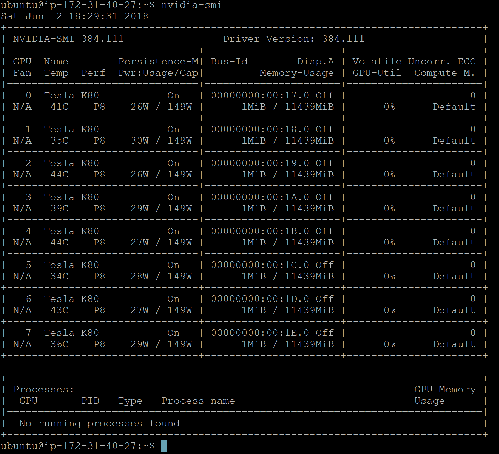
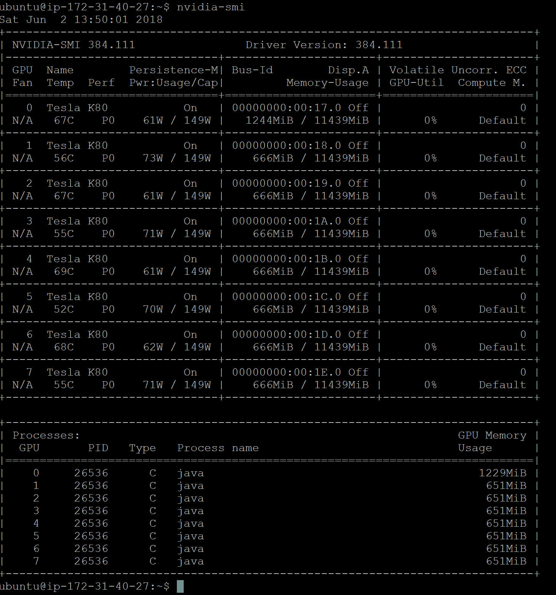
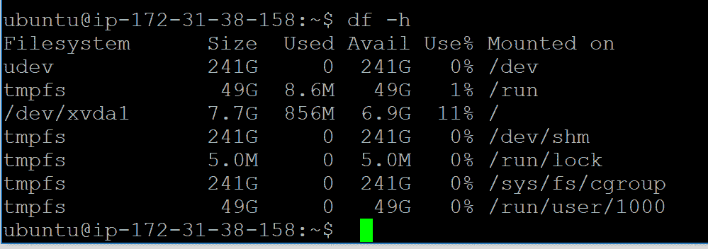

# 第八章：分布式深度学习 – 使用卷积 LSTM 网络进行视频分类

到目前为止，我们已经看到如何在数字和图像上开发基于深度学习的项目。然而，将类似的技术应用于视频片段，例如从视频中进行人类活动识别，并不是一件简单的事。

在本章中，我们将看到如何将深度学习方法应用于视频数据集。我们将描述如何处理和提取大量视频片段的特征。然后，我们将通过在多个设备（CPU 和 GPU）上分配训练，并使其并行运行，从而使整体管道变得可扩展且更快。

我们将看到一个完整的示例，展示如何使用**Deeplearning4j**（**DL4J**）开发一个深度学习应用程序，准确地分类大型视频数据集（如 UCF101 数据集）。该应用程序结合了 CNN 和 LSTM 网络，克服了独立 CNN 或 RNN **长短时记忆**（**LSTM**）网络的局限性。

训练将在 Amazon EC2 GPU 计算集群上进行。最终，这个端到端项目可以作为从视频中进行人类活动识别的入门指南。简而言之，我们将在整个端到端项目中学习以下主题：

+   在多个 GPU 上进行分布式深度学习

+   数据集收集与描述

+   使用卷积-LSTM 网络开发视频分类器

+   常见问题解答（FAQ）

# 在多个 GPU 上进行分布式深度学习

如前所述，我们将看到一个系统的示例，展示如何使用卷积-LSTM 网络对`UCF101`数据集中的大量视频片段进行分类。然而，首先我们需要知道如何将训练分配到多个 GPU 上。在之前的章节中，我们讨论了多种先进技术，如网络权重初始化、批量归一化、更快的优化器、适当的激活函数等，这些无疑有助于网络更快地收敛。然而，单机训练一个大型神经网络可能需要数天甚至数周。因此，这种方法不适用于处理大规模数据集。

理论上，神经网络的分布式训练主要有两种方法：数据并行和模型并行。DL4J 依赖于数据并行，称为具有参数平均的分布式深度学习。然而，多媒体分析通常会使事情变得更加复杂，因为从一个视频片段中，我们可以看到成千上万的帧和图像等等。为了避免这个问题，我们将首先在一台机器上的多个设备上分配计算，然后在多个机器的多个设备上进行分布式训练，具体如下：


在多个设备上并行执行 DL4J Java 应用程序

例如，你通常可以在一台机器上使用八个 GPU 训练神经网络，而不必使用跨多台机器的 16 个 GPU，原因很简单——在多机器设置中，网络通信带来的额外延迟。下图显示了如何配置 DL4J 来使用 CUDA 和 cuDNN 控制 GPU 并加速 DNN：


DL4J 使用 CUDA 和 cuDNN 来控制 GPU 并加速 DNN。

# 在 GPU 上使用 DL4J 进行分布式训练

DL4J 既支持分布式 GPU，也支持本地（即有 CPU 后端的）GPU。它允许用户在单个 GPU 上本地运行，比如 Nvidia Tesla、Titan 或 GeForce GTX，也可以在 Nvidia GRID GPU 上的云端运行。我们还可以在安装了多个 GPU 的 Amazon AWS EC2 GPU 集群上进行训练。

为了在 GPU 上训练神经网络，你需要对根目录下的 `pom.xml` 文件进行一些更改，例如属性设置和依赖管理，以拉取 DL4J 团队提供的必需依赖。首先，我们处理项目属性，如下所示：

```py
<properties>
        <project.build.sourceEncoding>UTF-8</project.build.sourceEncoding>
        <java.version>1.8</java.version>
        <jdk.version>1.8</jdk.version>
        <nd4j.backend>nd4j-cuda-9.0-platform</nd4j.backend>
        <nd4j.version>1.0.0-alpha</nd4j.version>
        <dl4j.version>1.0.0-alpha</dl4j.version>
        <datavec.version>1.0.0-alpha</datavec.version>
        <arbiter.version>1.0.0-alpha</arbiter.version>
        <logback.version>1.2.3</logback.version>
</properties>
```

在前面的 `<properties>` 标签中，如条目所示，我们将使用 DL4J 1.0.0-alpha 版本，并以 CUDA 9.0 平台作为后端。此外，我们计划使用 Java 8。不过，还定义了一个额外的 `logback` 属性。

Logback 是流行的 log4j 项目的继任者，承接了 log4j 的发展。Logback 的架构足够通用，能够在不同情况下应用。目前，logback 被划分为三个模块：logback-core、logback-classic 和 logback-access。欲了解更多信息，请参阅 [`logback.qos.ch/`](https://logback.qos.ch/)。

我假设你已经配置好了 CUDA 和 cuDNN，并且相应地设置了路径。一旦我们定义了项目属性，接下来重要的任务是定义与 GPU 相关的依赖，如下所示：

```py
<dependency>
     <groupId>org.nd4j</groupId>
     <artifactId>nd4j-cuda-9.0-platform</artifactId>
     <version>${nd4j.version}</version>
</dependency>
<dependency>
      <groupId>org.deeplearning4j</groupId>
      <artifactId>deeplearning4j-cuda-9.0</artifactId>
      <version>${dl4j.version}</version>
</dependency>
```

其中，ND4J 是支持 DL4J 的数值计算引擎，充当其后端，或者说是它工作的不同硬件类型。如果你的系统安装了多个 GPU，你可以在数据并行模式下训练模型，这被称为 **多 GPU 数据并行**。DL4J 提供了一个简单的封装器，可以实例化，类似于这样：

```py
// ParallelWrapper will take care of load balancing between GPUs. ParallelWrapper wrapper = new ParallelWrapper.Builder(YourExistingModel)
     .prefetchBuffer(24)
     .workers(8)
     .averagingFrequency(1)
     .reportScoreAfterAveraging(true)
     .useLegacyAveraging(false)
     .build();
```

更具体的示例如下所示：

```py
ParallelWrapper wrapper = new ParallelWrapper.Builder(net)            
            .prefetchBuffer(8)// DataSets prefetching options. Set to number of actual devices
            .workers(8)// set number of workers equal to number of available devices 
            .averagingFrequency(3)// rare averaging improves performance, but reduce accuracy           
            .reportScoreAfterAveraging(true) // if set TRUE, on every averaging model's score reported
            .build();
```

`ParallelWrapper` 将现有模型作为主要参数，并通过将工作者数量保持为等于或大于机器上 GPU 数量的方式进行并行训练。

在 `ParallelWrapper` 内，初始模型将被复制，每个工作者将训练自己的模型。在 `averagingFrequency(X)` 中的每 `N` 次迭代后，所有模型将被平均，并继续训练。现在，要使用此功能，请在 `pom.xml` 文件中使用以下依赖：

```py
<dependency>
      <groupId>org.deeplearning4j</groupId>
      <artifactId>deeplearning4j-parallel-wrapper_2.11</artifactId>
      <version>${dl4j.version}</version>
</dependency>
```

对于最新的文档，感兴趣的读者可以查看以下链接：[`deeplearning4j.org/gpu`](https://deeplearning4j.org/gpu)。

现在我们已经对如何在多个 GPU 之间分配基于深度学习的训练有了理论理解。在接下来的部分中，我们将很快看到一个动手示例。

# 使用卷积 – LSTM 进行视频分类

在本节中，我们将开始结合卷积、最大池化、全连接和递归层来对每一帧视频进行分类。具体来说，每个视频包含多个持续多帧的人的活动（尽管它们在帧之间移动），并且可能离开画面。首先，让我们更详细地了解我们将用于此项目的数据集。

# UCF101 – 动作识别数据集

`UCF101`是一个真实动作视频的动作识别数据集，收集自 YouTube，包含 101 个动作类别，涵盖了 13,320 个视频。视频收集时考虑到了摄像机运动、物体外观与姿势、物体尺度、视角、杂乱背景和光照条件的变化。

101 个动作类别的视频进一步被聚类成 25 个组（每个组中的剪辑具有共同的特征，例如背景和视角），每个组包含四到七个同一动作的视频。共有五个动作类别：人类与物体交互、仅身体动作、人类与人类交互、演奏乐器和体育运动。

关于该数据集的更多事实：

+   `UCF101` 视频包含不同的帧长度，每个视频剪辑的帧数范围在 100 到 300 帧之间。

+   `UCF101`使用`XVID`压缩标准（即`.avi`格式）

+   `UCF101`数据集的图片大小为 320 x 240

+   `UCF101`数据集包含不同视频文件中的不同类别。

数据集的高层次概览如下：


来自`UCF50`数据集的一些随机剪辑（来源：[`crcv.ucf.edu/data/UCF50.php`](http://crcv.ucf.edu/data/UCF50.php)）

# 预处理和特征工程

处理视频文件是一项非常具有挑战性的任务，尤其是当涉及到通过处理和互操作不同的编码来读取视频剪辑时；这是一个繁琐的工作。此外，视频剪辑可能包含失真帧，这在提取高质量特征时是一个障碍。

考虑到这些问题，在本小节中，我们将看到如何通过处理视频编码问题来预处理视频剪辑，并详细描述特征提取过程。

# 解决编码问题

在 Java 中处理视频数据是一项繁琐的工作（因为我们没有像 Python 那样多的库），尤其是当视频采用旧的`.avi`格式时。我在 GitHub 上看到一些博客和示例，使用 JCodec Java 库版本 0.1.5（或 0.2.3）来读取和解析 MP4 格式的`UCF101`视频剪辑。

即使 DL4J 也依赖于 datavec-data-codec，它依赖于旧版的 JCodec API，且与新版本不兼容。不幸的是，即使是新版的 JCodec 也无法读取`UCF101`视频。因此，我决定使用 FFmpeg 来处理 MP4 格式的视频。这属于 JavaCV 库，之前的章节中已经讨论过了。总之，要使用这个库，只需在`pom.xml`文件中添加以下依赖：

```py
<dependency>
       <groupId>org.bytedeco</groupId>
       <artifactId>javacv-platform</artifactId>
       <version>1.4.1</version>
</dependency>
```

由于`UCF101`是`.avi`格式，我在使用 JCodec 或 FFmpeg 库处理时遇到了困难。因此，我手动将视频转换为`MP4`格式。

为此，我编写了一个 Python 脚本（名为`prepare.py`，可以在本章的代码库中找到）。这个 Python 脚本会下载、解压和解码完整的`UCF101`数据集，但根据硬件配置和互联网速度，可能需要几个小时。尽管将 Python 代码放在此书中并不相关，我还是把它放在这里，以便大家能够了解整个过程，因此请看一下这个代码：

```py
import os

ROOT = os.path.dirname(os.path.abspath(__file__))
DATA = os.path.join(ROOT, 'VideoData')
UCF_RAW = os.path.join(ROOT, 'VideoData', 'UCF101')
UCF_MP4 = os.path.join(ROOT, 'VideoData', 'UCF101_MP4')

if not os.path.isdir(UCF_MP4):
    print("Start converting UCF101 dataset to MP4...")
    filepaths = []

    for label_dir in os.listdir(os.path.join(UCF_RAW)):
        for file in os.listdir(os.path.join(UCF_RAW, label_dir)):
            filepath = (UCF_RAW, label_dir, file)
            filepaths.append(filepath)
    files_len = len(filepaths)
    os.mkdir(UCF_MP4)

    for i, (_, label_dir, file_avi) in enumerate(filepaths):
        if file_avi.endswith('.avi'):
            file_mp4 = file_avi.rstrip('.avi') + '.mp4'
            input_filepath = os.path.join(UCF_RAW, label_dir, file_avi)
            output_filepath = os.path.join(UCF_MP4, label_dir, file_mp4)

            if not os.path.isfile(output_filepath):
                output_dir = os.path.join(UCF_MP4, label_dir)
                if not os.path.isdir(output_dir):
                    os.mkdir(output_dir)
                os.system('ffmpeg -v error -i %s -strict -2 %s' % (input_filepath, output_filepath))
        print("%d of %d files converted" % (i+1, files_len))
print("Dataset ready")
```

如代码所示，你只需从[`crcv.ucf.edu/data/UCF101.php`](http://crcv.ucf.edu/data/UCF101.php)下载`UCF101`数据集，并将其放入`VideoData/UCF101`文件夹中。然后，Python 使用内置的 FFmpeg 包将所有`.avi`文件转换为`.mp4`格式，并在执行`$ python3 prepare.py`命令后保存到`VideoData/UCF101_MP4`目录。

# 数据处理工作流

一旦文件转换为 MP4 格式，我们就可以开始提取特征。现在，为了处理`UCF101`数据集并提取特征，我编写了另外三个 Java 类，具体如下：

+   `UCF101Reader.java`**：**这是视频文件读取、解码和转换为 ND4J 向量的主要入口点。它接收数据集的完整路径并创建神经网络所需的`DataSetIterator`。此外，它还生成所有类的列表，并为每个类分配顺序整数。

+   `UCF101ReaderIterable.java`：该类读取所有视频片段并使用 JCodec 进行解码。

+   `RecordReaderMultiDataSetIterator.java`：这与 DL4J 提供的类似，但这是一个改进版，在新版本的 JCodec 上表现良好。

然后，为了准备训练和测试集，使用了`UCF101Reader.getDataSetIterator()`方法。该方法读取每个视频片段，但首先，根据参数和偏移值决定读取多少个示例（视频文件）。这些参数然后传递给`UCF101ReaderIterable`。该方法的签名如下：

```py
public UCF101Reader(String dataDirectory) {
        this.dataDirectory = dataDirectory.endsWith("/") ? dataDirectory : dataDirectory + "/";
          }

public DataSetIterator getDataSetIterator(int startIdx, int nExamples, int miniBatchSize) throws Exception {
    ExistingDataSetIterator iter = new ExistingDataSetIterator(createDataSetIterable(startIdx, 
                                                               nExamples, miniBatchSize));
        return new AsyncDataSetIterator(iter,1);
    }
```

在此方法中，`ExistingDataSetIterator`作为一个封装器，提供了一个`DataSetIterator`接口，用于现有的 Java `Iterable<DataSet>`和`Iterator<DataSet>`。然后，使用`UCF101Reader.UCF101ReaderIterable()`方法创建标签映射（类名到整数索引）和逆标签映射，如下所示：

```py
private UCF101RecordIterable createDataSetIterable(int startIdx, int nExamples, int miniBatchSize) 
                                                   throws IOException {
        return new UCF101RecordIterable(dataDirectory, labelMap(), V_WIDTH, V_HEIGHT,startIdx, nExamples);
                  }
```

如您所见，`dataDirectory` 是 MP4 格式视频的目录，(`V_WIDTH`, `V_HEIGHT`) 表示视频帧的大小，而 `labelMap()` 则提供每个视频剪辑的映射：

```py
public static final int V_WIDTH = 320;
public static final int V_HEIGHT = 240;
public static final int V_NFRAMES = 100;
private final String dataDirectory;
private volatile Map<Integer, String> _labelMap;
```

因此，`labelMap()` 的签名如下：

```py
public Map<Integer, String> labelMap() throws IOException {
        if(_labelMap == null) {
            synchronized (this) {
                if(_labelMap == null) {
                    File root = new File(dataDirectory);
                    _labelMap = Files.list(root.toPath()).map(f -> f.getFileName().toString())
                            .sorted().collect(HashMap::new, (h, f) -> h.put(h.size(), f), (h, o) -> {});
                }
            }
        }
        return _labelMap;
    }
```

然后，`UCF101ReaderIterable.iterator()` 用于创建网络所需的 `DataSet` 迭代器。此迭代器传递给 `ExistingDataSetIterator`，以符合神经网络 API 所需的形式，如下所示：

```py
// The @NotNull Annotation ensures iterator() method des not return null.
@NotNull
@Override
public Iterator<DataSet> iterator() {
        return rowsStream(dataDirectory).skip(this.skip).limit(this.limit).flatMap(p -> 
               dataSetsStreamFromFile(p.getKey(), p.getValue())).iterator();
    }
```

此外，`AsyncDataSetIterator` 用于在单独的线程中进行所有数据处理。而 `UCF101ReaderIterable.rowStream()` 则列出所有数据集文件，并创建文件和相应类标签的序列，如下所示：

```py
public static Stream<Pair<Path, String>> rowsStream(String dataDirectory) {
        try {
            List<Pair<Path, String>> files = Files.list(Paths.get(dataDirectory)).flatMap(dir -> {
                try {
                    return Files.list(dir).map(p -> Pair.of(p, dir.getFileName().toString()));
                } catch (IOException e) {
                    e.printStackTrace();
                    return Stream.empty();
                }
            }).collect(Collectors.toList());
            Collections.shuffle(files, new Random(43));
            return files.stream();
        } catch (IOException e) {
            e.printStackTrace();
            return Stream.empty();
        }
    }
```

接下来，使用 `UCF101ReaderIterable.dataSetStreamFromFile()` 方法将基础迭代器转换为 Java 流。这只是将迭代器转换为流的技术步骤。因为在 Java 中，通过流更方便地过滤一些元素并限制流中的元素数量。看一下这段代码！

```py
private Stream<DataSet> dataSetsStreamFromFile(Path path, String label) {
        return StreamSupport.stream(Spliterators.spliteratorUnknownSize(dataSetsIteratorFromFile(path, 
                                    label), Spliterator.ORDERED), false);
    }
```

`UCF101ReaderIterable.dataSetIteratorFromFile()` 方法接收视频文件路径，然后创建帧读取器（`FrameGrab`—JCodec 类）。最后，将帧读取器传递给 `RecordReaderMultiDataSetIterator.nextDataSet`，如下所示：

```py
private Iterator<DataSet> dataSetsIteratorFromFile(Path path, String label) {
        FileChannelWrapper _in = null;
        try {
            _in = NIOUtils.readableChannel(path.toFile());
            MP4Demuxer d1 = MP4Demuxer.createMP4Demuxer(_in);
            SeekableDemuxerTrack videoTrack_ = (SeekableDemuxerTrack)d1.getVideoTrack();
            FrameGrab fg = new FrameGrab(videoTrack_, new AVCMP4Adaptor(videoTrack_.getMeta()));

            final int framesTotal = videoTrack_.getMeta().getTotalFrames();
            return Collections.singleton(recordReaderMultiDataSetIterator.nextDataSet(_in, framesTotal, 
                  fg, labelMapInversed.get(label), labelMap.size())).iterator();
        } catch(IOException | JCodecException e) {
            e.printStackTrace();
            return Collections.emptyIterator();
        }
    }
```

在上述代码块中，使用 `RecordReaderMultiDataSetIterator.nextDataSet()` 方法将每个视频帧转换为与 DL4J 兼容的 `DataSet`。`DataSet` 是从帧生成的特征向量和使用单热编码生成的标签向量的组合。

嗯，这个逻辑基于 DL4J 的 `RecordReaderMultiDataSetIterator` 类，但必要的支持来自最新的 JCodec API。然后我们使用 `UCF101RecordIterable.labelToNdArray()` 方法将标签编码为 ND4J 的 `INDArray` 格式：

```py
private INDArray labelToNdArray(String label) {
 int maxTSLength = 1; // frames per dataset
 int labelVal = labelMapInversed.get(label);
          INDArray arr = Nd4j.*create*(new int[]{1, classesCount}, 'f');
          arr.put(0, labelVal, 1f);
 return arr;
}
```

前面提到的工作流程步骤可以在以下图表中描述：


特征提取过程中的数据流

# 检查视频帧的简易 UI

我开发了一个简单的 UI 应用程序，使用 Java Swing 来测试代码是否正确处理帧。此 UI 读取 MP4 格式的输入视频文件，并像简单的视频播放器一样逐帧显示给读者。该 UI 应用程序名为 `JCodecTest.java`。

在 `JCodecTest.java` 类中，`testReadFrame()` 方法利用 `FrameGrab` 类的 `getFrameFromFile()` 方法（即来自 JavaCV 库），检查每个视频剪辑的帧提取过程是否正常工作。这是方法签名：

```py
private void testReadFrame(Consumer<Picture> consumer) throws IOException, JCodecException {
        // Read the clip sequentially one by one
        next:
        for(Iterator<Pair<Path, String>> iter = rowsStream().iterator(); iter.hasNext(); ) {
            Pair<Path, String> pair = iter.next();
            Path path = pair.getKey();
            pair.getValue();

            for(int i = 0; i < 100; i++) {
                try {
                    // Hold video frames as pictures
                    Picture picture = FrameGrab.getFrameFromFile(path.toFile(), i);
                    consumer.accept(picture);
                } catch (Throwable ex) {
                    System.out.println(ex.toString() + " frame " + i + " " + path.toString());
                    continue next;
                }
            }
            System.out.println("OK " + path.toString());
        }
    }
```

在上述代码块中，`rowsStream()` 方法如下所示：

```py
private Stream<Pair<Path, String>> rowsStream() {
        try {
            return Files.list(Paths.get(dataDirectory)).flatMap(dir -> {
                try {
                    return Files.list(dir).map(p -> Pair.of(p, dir.getFileName().toString()));
                } catch (IOException e) {
                    e.printStackTrace();
                    return Stream.empty();
                }
            });
        } catch (IOException e) {
            e.printStackTrace();
            return Stream.empty();
        }
    }
```

要查看此方法的有效性，读者可以执行包含 `main()` 方法的 `JCodecTest.java` 类，如下所示：

```py
private String dataDirectory = "VideoData/UCF101_MP4/";
public static void main(String[] args) throws IOException, JCodecException {
        JCodecTest test = new JCodecTest();
        test.testReadFrame(new FxShow());
}
```

一旦执行，您将体验以下输出，如此屏幕截图所示：


JCodecTest.java 类检查每个视频片段的帧提取是否正常工作

# 准备训练集和测试集

如前所述，`UCF101Reader.java` 类用于提取特征并准备训练集和测试集。首先，我们设置并展示 Java 中 MP4 文件的路径，如下所示：

```py
String dataDirectory = "VideoData/UCF101_MP4/";// Paths to video dataset
```

需要注意的是，使用视频片段训练网络花费了我大约 45 小时，使用的是 `EC2 p2.8xlarge` 机器。然而，我第二次没有那样的耐心，因此，我只利用了包含 1,112 个视频片段的视频类别来进行训练：


UCF101 数据集目录结构（MP4 版本）

然后我们定义了用于准备训练集和测试集的迷你批次大小。对于我们的情况，我设置了 128，如下所示：

```py
private static int *miniBatchSize* = 128;
private static int *NUM_EXAMPLE* = 10;
UCF101Reader reader = new UCF101Reader(dataDirectory);
```

我们定义了提取过程从哪个文件开始：

```py
int examplesOffset = 0; // start from N-th file
```

然后我们决定使用多少个视频片段来训练网络，而 `UCF101Reader.fileCount()` 方法返回 `UCF101_MP4` 目录中视频片段的数量。看看这行代码：

```py
int nExamples = Math.*min*(NUM_*EXAMPLE*, reader.fileCount());
```

接下来，我们计算测试集的起始索引。我们使用 80% 的数据进行训练，其余 20% 用于测试。让我们看看这段代码：

```py
int testStartIdx = examplesOffset + Math.*max*(2, (int) (0.8 * nExamples)); //80% in train, 20% in test 
int nTest = nExamples - testStartIdx + examplesOffset;
System.*out*.println("Dataset consist of " + reader.fileCount() + " video clips, use " 
                    + nExamples + " of them");
```

现在我们准备训练集。为此，`getDataSetIterator()` 方法会返回一个 `DataSetIterator`，包含所有视频片段，除了那些计划用于测试集的片段。请查看这段代码：

```py
System.*out*.println("Starting training...");
DataSetIterator trainData = reader.getDataSetIterator(examplesOffset, nExamples - nTest, *miniBatchSize*);
```

然后我们准备测试集。为此，同样 `getDataSetIterator()` 方法会返回一个 `DataSetIterator`，包含所有视频片段，除了那些计划用于测试集的片段。请查看这段代码：

```py
System.out.println("Use " + String.*valueOf*(nTest) + " video clips for test"); 
DataSetIterator testData = reader.getDataSetIterator(testStartIdx, nExamples, *miniBatchSize*);
```

太棒了！到目前为止，我们已经能够准备好训练集和测试集。接下来的步骤是创建网络并进行训练。

# 网络创建与训练

现在，我们开始通过结合卷积层、最大池化层、全连接层（前馈）和递归层（LSTM）来创建网络，对每一帧视频进行分类。首先，我们需要定义一些超参数和必要的实例化，如下所示：

```py
private static MultiLayerConfiguration *conf*;
private static MultiLayerNetwork *net*; 
private static String *modelPath* = "bin/ConvLSTM_Model.zip";
private static int *NUM_CLASSES*;
private static int *nTrainEpochs* = 100;
```

这里，`NUM_CLASSES` 是 `UCF101` 数据集中的类别数量，计算方法是数据集根目录下目录的数量：

```py
*NUM_CLASSES* = reader.labelMap().size();
```

然后，我们通过调用 `networkTrainer()` 方法开始训练。正如我之前所说，我们将结合卷积层、最大池化层、全连接层（前馈）和递归层（LSTM）来对视频片段的每一帧进行分类。训练数据首先输入到卷积层（层 0），然后经过子采样（层 1），再输入到第二个卷积层（层 2）。接着，第二个卷积层将数据传递到全连接层（层 3）。

需要注意的是，对于第一个 CNN 层，我们有 CNN 预处理器输入宽度/高度为 13 x 18，这反映了 320 x 240 的图片大小。这样，密集层作为 LSTM 层（层 4）的输入层（但你也可以使用常规的 LSTM）。然而，重要的是要注意，密集层的输入大小为 2,340（即 13 * 18 * 10）。

然后，递归反馈连接到 RNN 输出层，该层使用 softmax 激活函数来进行类别的概率分布。我们还使用梯度归一化来处理梯度消失和梯度爆炸问题，最后一层的反向传播使用截断 BPTT。除此之外，我们还使用了一些其他超参数，这些参数不言而喻。以下图显示了该网络设置：


网络架构

现在，从编码的角度来看，`networkTrainer()`方法具有以下网络配置：

```py
//Set up network architecture:
 conf = new NeuralNetConfiguration.Builder()
                .seed(12345)
                .l2(0.001) //l2 regularization on all layers
                .updater(new Adam(0.001)) // we use Adam as updater
                .list()
                .layer(0, new ConvolutionLayer.Builder(10, 10)
                        .nIn(3) //3 channels: RGB
                        .nOut(30)
                        .stride(4, 4)
                        .activation(Activation.RELU)
                        .weightInit(WeightInit.RELU)
                        .build()) //Output: (130-10+0)/4+1 = 31 -> 31*31*30
                .layer(1, new SubsamplingLayer.Builder(SubsamplingLayer.PoolingType.MAX)
                        .kernelSize(3, 3)
                        .stride(2, 2).build()) //(31-3+0)/2+1 = 15
                .layer(2, new ConvolutionLayer.Builder(3, 3)
                        .nIn(30)
                        .nOut(10)
                        .stride(2, 2)
                        .activation(Activation.RELU)
                        .weightInit(WeightInit.RELU)
                        .build()) //Output: (15-3+0)/2+1 = 7 -> 7`7`10 = 490
                .layer(3, new DenseLayer.Builder()
                        .activation(Activation.RELU)
                        .nIn(2340) // 13 * 18 * 10 = 2340, see CNN layer width x height
                        .nOut(50)
                        .weightInit(WeightInit.RELU)
                        .gradientNormalization(GradientNormalization.ClipElementWiseAbsoluteValue)
                        .gradientNormalizationThreshold(10)
                        .updater(new AdaGrad(0.01))// for faster convergence
                        .build())
                .layer(4, new LSTM.Builder()
                        .activation(Activation.SOFTSIGN)
                        .nIn(50)
                        .nOut(50)
                        .weightInit(WeightInit.XAVIER)
                        .updater(new AdaGrad(0.008))
                        .gradientNormalization(GradientNormalization.ClipElementWiseAbsoluteValue)
                        .gradientNormalizationThreshold(10)
                        .build())
                .layer(5, new RnnOutputLayer.Builder(LossFunctions.LossFunction.MCXENT)
                        .activation(Activation.SOFTMAX)
                        .nIn(50)
                        .nOut(NUM_CLASSES)    
                        .weightInit(WeightInit.XAVIER)
                        .gradientNormalization(GradientNormalization.ClipElementWiseAbsoluteValue)
                        .gradientNormalizationThreshold(10)
                        .build())
                .inputPreProcessor(0, new RnnToCnnPreProcessor(UCF101Reader.V_HEIGHT, 
                                   UCF101Reader.V_WIDTH, 3))
                .inputPreProcessor(3, new CnnToFeedForwardPreProcessor(13, 18, 10))
                .inputPreProcessor(4, new FeedForwardToRnnPreProcessor())
                .pretrain(false).backprop(true)
                .backpropType(BackpropType.TruncatedBPTT)
                .tBPTTForwardLength(UCF101Reader.V_NFRAMES / 5)
                .tBPTTBackwardLength(UCF101Reader.V_NFRAMES / 5)
                .build();
```

接下来，根据前述的网络配置设置，我们创建并初始化了一个`MultiLayerNetwork`，如下所示：

```py
*net* = new MultiLayerNetwork(*conf*);
*net*.init();
*net*.setListeners(new ScoreIterationListener(1));
```

然后，我们可以观察每一层的参数数量，如下所示：

```py
System.*out*.println("Number of parameters in network: " + *net*.numParams());
for(int i=0; i<*net*.getnLayers(); i++){
    System.*out*.println("Layer " + i + " nParams = " + *net*.getLayer(i).numParams());
}
```

<q>>>></q> 网络中的参数数量：149599

第零层 nParams = 9030

第一层 nParams = 0

第二层 nParams = 2710

第三层 nParams = 117050

第四层 nParams = 20350

第五层 nParams = 459

最后，我们使用这个训练集开始训练：

```py
for (int i = 0; i < *nTrainEpochs*; i++) {
         int j = 0;
         while(trainData.hasNext()) {
               long start = System.*nanoTime*();
               DataSet example = trainData.next();
               *net*.fit(example);
               System.*out*.println(" Example " + j + " processed in " 
                                 + ((System.*nanoTime*() - start) / 1000000) + " ms");
               j++;
              }
       System.*out*.println("Epoch " + i + " complete");
}
```

我们使用`saveConfigs()`方法保存训练好的网络和视频配置，该方法的签名非常直接，正如你所看到的：

```py
private static void saveConfigs() throws IOException {
         Nd4j.*saveBinary*(*net*.params(),new File("bin/videomodel.bin"));
         FileUtils.*writeStringToFile*(new File("bin/videoconf.json"), *conf*.toJson());
  }
```

然后，我们使用`saveNetwork()`方法保存训练好的模型，以便以后进行推理；其代码如下：

```py
privates tatic void saveNetwork() throws IOException {
         File locationToSave = new File(*modelPath*);
 boolean saveUpdater = true;
         ModelSerializer.*writeModel*(*net*, locationToSave, saveUpdater);
}
```

# 性能评估

为了评估网络性能，我编写了`evaluateClassificationPerformance()`方法，该方法接受测试集和`evalTimeSeries`评估，如下所示：

```py
private static void evaluateClassificationPerformance(MultiLayerNetwork net, int testStartIdx, 
                     int nExamples, DataSetIterator testData) throws Exception {
          Evaluation evaluation = new Evaluation(*NUM_CLASSES*);
 while(testData.hasNext()) {
                DataSet dsTest = testData.next();
                INDArray predicted = net.output(dsTest.getFeatureMatrix(), false);
                INDArray actual = dsTest.getLabels(); 
                evaluation.evalTimeSeries(actual, predicted);
                 }
          System.*out*.println(evaluation.stats());
}
>>>
 Predictions labeled as 0 classified by model as 0: 493 times
 Predictions labeled as 0 classified by model as 7: 3 times
 Predictions labeled as 1 classified by model as 6: 287 times
 Predictions labeled as 1 classified by model as 7: 1 times
 Predictions labeled as 2 classified by model as 6: 758 times
 Predictions labeled as 2 classified by model as 7: 3 times
 Predictions labeled as 3 classified by model as 6: 111 times
 Predictions labeled as 3 classified by model as 7: 1 times
 Predictions labeled as 4 classified by model as 6: 214 times
 Predictions labeled as 4 classified by model as 7: 2 times
 Predictions labeled as 5 classified by model as 6: 698 times
 Predictions labeled as 5 classified by model as 7: 3 times
 Predictions labeled as 6 classified by model as 6: 128 times
 Predictions labeled as 6 classified by model as 5: 1 times
 Predictions labeled as 7 classified by model as 7: 335 times
 Predictions labeled as 8 classified by model as 8: 209 times
 Predictions labeled as 8 classified by model as 7: 2 times
 ==========================Scores===================
 # of classes: 9
 Accuracy: 0.4000
 Precision: 0.39754
 Recall: 0.4109
 F1 Score: 0.4037
 Precision, recall & F1: macro-averaged (equally weighted avg. of 9 classes)
 ======================================================
```

现在，为了更清晰地遵循上述步骤，以下是包含这些步骤的`main()`方法：

```py
public static void main(String[] args) throws Exception {        
        String dataDirectory = "VideoData/UCF101_MP4/";
        UCF101Reader reader = new UCF101Reader(dataDirectory); 
        NUM_CLASSES = reader.labelMap().size();        

        int examplesOffset = 0; // start from N-th file
        int nExamples = Math.min(NUM_EXAMPLE, reader.fileCount()); // use only "nExamples" for train/test
        int testStartIdx = examplesOffset + Math.max(2, (int) (0.9 * nExamples)); //90% train, 10% in test
        int nTest = nExamples - testStartIdx + examplesOffset;
        System.out.println("Dataset consist of " + reader.fileCount() + " images, use "
                           + nExamples + " of them");        

        //Conduct learning
        System.out.println("Starting training...");       
        DataSetIterator trainData = reader.getDataSetIterator(examplesOffset, 
                                    nExamples - nTest, miniBatchSize);        
        networkTrainer(reader, trainData);

        //Save network and video configuration
        saveConfigs();

        //Save the trained model
        saveNetwork();

        //Evaluate classification performance:
        System.out.println("Use " + String.valueOf(nTest) + " images for validation");
        DataSetIterator testData = reader.getDataSetIterator(testStartIdx, nExamples, miniBatchSize);
        evaluateClassificationPerformance(net,testStartIdx,nTest, testData);        
    }
```

我们尚未达到更高的准确率。可能有许多原因导致这种情况。例如，我们只使用了少数类别（即仅使用了 9 个类别中的 9 个）。因此，我们的模型没有足够的训练数据来学习。此外，大多数超参数设置过于简单。

# 在 AWS 深度学习 AMI 9.0 上的分布式训练

到目前为止，我们已经看到如何在单个 GPU 上进行训练和推理。然而，为了以并行和分布式的方式加速训练，拥有一台或服务器上有多个 GPU 是一个可行的选择。实现这一点的简单方法是使用 AMAZON EC2 GPU 计算实例。

例如，P2 非常适合用于分布式深度学习框架，这些框架预安装了最新的深度学习框架（MXNet、TensorFlow、Caffe、Caffe2、PyTorch、Keras、Chainer、Theano 和 CNTK）的二进制文件，并分别在虚拟环境中运行。

更大的优势在于，它们已经完全配置了 NVidia CUDA 和 cuDNN。有兴趣的读者可以查看[`aws.amazon.com/ec2/instance-types/p2/`](https://aws.amazon.com/ec2/instance-types/p2/)。以下是 P2 实例配置和定价的简要概览：


P2 实例详情

对于这个项目，我决定使用`p2.8xlarge`。你也可以创建它，但请确保你已经提交了至少一个实例的限制增加请求，这可能需要三天时间。如果你不知道怎么做，直接在 AWS 上创建一个帐户并完成验证；然后进入 EC2 管理控制台。在左侧面板中，点击“限制”标签，它会带你到一个页面，在这里你可以通过点击“请求限制增加”链接来提交增加限制的请求。

无论如何，我假设你知道这些简单的内容，所以我将继续创建一个`p2.8xlarge`类型的实例。在左侧面板中，点击实例菜单，它应该会带你进入以下页面：


选择一个深度学习 AMI

一个简单的选项是创建一个已经配置了 CUDA 和 cuDNN 的深度学习 AMI（Ubuntu）版本 9.0，该版本可以在八个 GPU 上使用。另一个好处是它具有 32 个计算核心和 488GB 的内存；这对我们的数据集也足够。因此，除了使用只有九个类别的视频片段外，我们还可以使用完整的数据集进行训练。

然而，注意，由于我们将使用基于 JVM 的 DL4J，因此必须安装并配置 Java（需要设置`JAVA_HOME`）。首先，通过 SSH 或使用 SFTP 客户端连接到您的实例。然后，在 Ubuntu 上，我们可以通过以下几个命令来完成，具体如下面所示：

```py
$ sudo apt-get install python-software-properties
$ sudo apt-get update
$ sudo add-apt-repository ppa:webupd8team/java
$ sudo apt-get update
```

然后，根据您要安装的版本，执行以下其中一个命令：

```py
$ sudo apt-get install oracle-java8-installer
```

安装后，别忘了设置 Java home。只需应用以下命令（假设 Java 已安装在`/usr/lib/jvm/java-8-oracle`）：

```py
$ echo "export JAVA_HOME=/usr/lib/jvm/java-8-oracle" >> ~/.bashrc
$ echo "export PATH=$PATH:$JAVA_HOME/bin" >> ~/.bashrc
$ source ~/.bashrc
```

现在让我们来看一下`Java_HOME`，如下所示：

```py
$ echo $JAVA_HOME
```

现在，您应该在终端看到以下结果：

```py
/usr/lib/jvm/java-8-oracle
```

最后，我们通过执行以下命令来检查 Java 是否已成功安装（您可能会看到最新版本！）：

```py
$ java -version
>>>
 java version "1.8.0_121"
 Java(TM) SE Runtime Environment (build 1.8.0_121-b15)
 Java HotSpot(TM) 64-Bit Server VM (build 25.121-b15, mixed mode)
```

太棒了！我们已经能够在我们的实例上设置并配置 Java 了。接下来，让我们通过在终端发出`nvidia-smi`命令，查看 GPU 驱动是否已配置：



显示 Tesla K80 GPU 的 p2.8xlarge 实例

如我们所见，最初没有使用 GPU，但它清楚地指出，在该实例上已安装并配置了八个 Tesla K80 GPU。现在我们的 GPU 和机器已经完全配置好，我们可以专注于项目。我们将使用与之前差不多的代码，但做一些最小的修改。我们需要进行的第一个更改是在 `main()` 方法的开头添加以下代码：

```py
CudaEnvironment.getInstance().getConfiguration()
       .allowMultiGPU(true) // key option enabled
       .setMaximumDeviceCache(2L * 1024L * 1024L * 1024L) // large cache
       .allowCrossDeviceAccess(true); // cross-device access for faster model averaging over a piece
```

然后我们使用 ParallelWrapper 在八个 GPU 上进行训练，它负责 GPU 之间的负载均衡。网络构建与之前相同，如下所示：

```py
*net* = new MultiLayerNetwork(*conf*);
*net*.init(); 

ParallelWrapper wrapper = new ParallelWrapper.Builder(net)
       .prefetchBuffer(8)// DataSets prefetching options. Set this with respect to number of devices
       .workers(8)// set number of workers equal to number of available devices -i.e. 8 for p2.8xlarge 
       .averagingFrequency(3)// rare averaging improves performance, but might reduce model accuracy           
       .reportScoreAfterAveraging(true) // if set TRUE, on every avg. model score will be reported 
       .build();
```

现在我们通过拟合完整的测试集来开始训练，如下所示：

```py
for (int i = 0; i < nTrainEpochs; i++) {
     wrapper.fit(trainData);
     System.out.println("Epoch " + i + " complete"); 
    }
```

这就是我们需要做的全部。然而，请确保在 `VideoClassificationExample.java` 文件的开头导入以下内容，以便使用 `CudaEnvironment` 和 `ParallelWrapper`，如下面所示：

```py
import org.nd4j.jita.conf.CudaEnvironment; 
import org.deeplearning4j.parallelism.ParallelWrapper;
```

尽管如此，我仍然认为展示 `main()` 方法和 `networkTrainer()` 方法的代码会很有帮助。此外，为了避免可能的混淆，我编写了两个 Java 类，分别用于单个和多个 GPU：

+   `VideoClassificationExample.java`**:** 用于单个 GPU 或 CPU

+   `VideoClassificationExample_MUltipleGPU.java`：用于 AWS EC2 实例上的多个 GPU

因此，后者类有一个方法，`networkTrainer()`，用于创建一个用于分布式训练的网络，如下所示：

```py
private static void networkTrainer(UCF101Reader reader, DataSetIterator trainData) throws Exception {        
    //Set up network architecture:
    conf = new NeuralNetConfiguration.Builder()
                .seed(12345)
                .l2(0.001) //l2 regularization on all layers
                .updater(new Adam(0.001))
                .list()
                .layer(0, new ConvolutionLayer.Builder(10, 10)
                        .nIn(3) //3 channels: RGB
                        .nOut(30)
                        .stride(4, 4)
                        .activation(Activation.RELU)
                        .weightInit(WeightInit.RELU)
                        .build())   //Output: (130-10+0)/4+1 = 31 -> 31*31*30
                .layer(1, new SubsamplingLayer.Builder(SubsamplingLayer.PoolingType.MAX)
                        .kernelSize(3, 3)
                        .stride(2, 2).build())   //(31-3+0)/2+1 = 15
                .layer(2, new ConvolutionLayer.Builder(3, 3)
                        .nIn(30)
                        .nOut(10)
                        .stride(2, 2)
                        .activation(Activation.RELU)
                        .weightInit(WeightInit.RELU)
                        .build())   //Output: (15-3+0)/2+1 = 7 -> 7`7`10 = 490
                .layer(3, new DenseLayer.Builder()
                        .activation(Activation.RELU)
                        .nIn(2340) // 13 * 18 * 10 = 2340, see CNN layer width x height
                        .nOut(50)
                        .weightInit(WeightInit.RELU)
                        .gradientNormalization(GradientNormalization.ClipElementWiseAbsoluteValue)
                        .gradientNormalizationThreshold(10)
                        .updater(new AdaGrad(0.01))
                        .build())
                .layer(4, new LSTM.Builder()
                        .activation(Activation.SOFTSIGN)
                        .nIn(50)
                        .nOut(50)
                        .weightInit(WeightInit.XAVIER)
                        .updater(new AdaGrad(0.008))
                        .gradientNormalization(GradientNormalization.ClipElementWiseAbsoluteValue)
                        .gradientNormalizationThreshold(10)
                        .build())
                .layer(5, new RnnOutputLayer.Builder(LossFunctions.LossFunction.MCXENT)
                        .activation(Activation.SOFTMAX)
                        .nIn(50)
                        .nOut(NUM_CLASSES)    
                        .weightInit(WeightInit.XAVIER)
                        .gradientNormalization(GradientNormalization.ClipElementWiseAbsoluteValue)
                        .gradientNormalizationThreshold(10)
                        .build())
                .inputPreProcessor(0, new RnnToCnnPreProcessor(UCF101Reader.V_HEIGHT, 
                                   UCF101Reader.V_WIDTH, 3))
                .inputPreProcessor(3, new CnnToFeedForwardPreProcessor(13, 18, 10))
                .inputPreProcessor(4, new FeedForwardToRnnPreProcessor())
                .pretrain(false).backprop(true)
                .backpropType(BackpropType.TruncatedBPTT)
                .tBPTTForwardLength(UCF101Reader.V_NFRAMES / 5)
                .tBPTTBackwardLength(UCF101Reader.V_NFRAMES / 5)
                .build();

        net = new MultiLayerNetwork(conf);
        net.init();
        net.setListeners(new ScoreIterationListener(1));

        System.out.println("Number of parameters in network: " + net.numParams());
        for( int i=0; i<net.getnLayers(); i++ ){
            System.out.println("Layer " + i + " nParams = " + net.getLayer(i).numParams());
        }

    // ParallelWrapper will take care of load balancing between GPUs.
    ParallelWrapper wrapper = new ParallelWrapper.Builder(net)            
            .prefetchBuffer(8)// DataSets prefetching options. Set value with respect to number of devices
            .workers(8)// set number of workers equal to number of available devices 
            .averagingFrequency(3)// rare avg improves performance, but might reduce accuracy           
            .reportScoreAfterAveraging(true) // if set TRUE, on every avg. model score will be reported
            .build();

   for (int i = 0; i < nTrainEpochs; i++) {
                wrapper.fit(trainData);
                System.out.println("Epoch " + i + " complete");
        }
    }
```

现在 `main()` 方法如下所示：

```py
public static void main(String[] args) throws Exception {  
        // Workaround for CUDA backend initialization
        CudaEnvironment.getInstance()
                .getConfiguration()
                .allowMultiGPU(true)
                .setMaximumDeviceCache(2L * 1024L * 1024L * 1024L)
                .allowCrossDeviceAccess(true);   

        String dataDirectory = "/home/ubuntu/UCF101_MP4/";
        UCF101Reader reader = new UCF101Reader(dataDirectory); 
        NUM_CLASSES = reader.labelMap().size();        

        int examplesOffset = 0; // start from N-th file
        int nExamples = Math.min(NUM_EXAMPLE, reader.fileCount()); // use only "nExamples" for train/test
        int testStartIdx = examplesOffset + Math.max(2, (int) (0.9 * nExamples)); //90% train, 10% in test
        int nTest = nExamples - testStartIdx + examplesOffset;

        System.out.println("Dataset consist of " + reader.fileCount() + " images, use " 
                          + nExamples + " of them");        

        //Conduct learning
        System.out.println("Starting training...");       
        DataSetIterator trainData = reader.getDataSetIterator(examplesOffset, 
                                    nExamples - nTest, miniBatchSize);        
        networkTrainer(reader, trainData);

        //Save network and video configuration
        saveConfigs();

        //Save the trained model
        saveNetwork();

        //Evaluate classification performance:
        System.out.println("Use " + String.valueOf(nTest) + " images for validation");
        DataSetIterator testData = reader.getDataSetIterator(testStartIdx, nExamples, 10);
        evaluateClassificationPerformance(net,testStartIdx,nTest, testData);        
    }

```

这是我们在执行 `VideoClassificationExample_MUltipleGPU.java` 类之前所需要的一切。还应该注意，从终端运行独立的 Java 类并不是一个好主意。因此，我建议创建一个 `fat .jar` 文件并包含所有依赖项。为此，使用任何 SFTP 客户端将代码移到实例上。然后安装 `maven`：

```py
$sudo apt-get install maven
```

一旦安装了 maven，我们可以开始创建包含所有依赖项的 fat JAR 文件，如下所示：

```py
$ sudo mvn clean install
```

然后，过了一段时间，一个 fat JAR 文件将在目标目录中生成。我们移动到该目录并执行 JAR 文件，如下所示：

```py
$ cd target/
$ java -Xmx30g -jar VideoClassifier-0.0.1-SNAPSHOT-jar-with-dependencies.jar
```

此时，请确保您已正确设置所有路径并具有必要的权限。好吧，我假设一切都设置好了。那么，执行前面的命令将迫使 DL4J 选择 BLAS、CUDA 和 cuDNN，并执行训练和其他步骤。大致上，您应该在终端上看到如下日志：

```py
ubuntu@ip-172-31-40-27:~/JavaDeepLearningDL4J/target$ java -Xmx30g -jar VideoClassifier-0.0.1-SNAPSHOT-jar-with-dependencies.jar
```

前面的命令应该开始训练，您应该在终端/命令行中观察到以下日志：

```py
Dataset consist of 1112 images, use 20 of them
Starting training...
18:57:34.815 [main] INFO org.nd4j.linalg.factory.Nd4jBackend - Loaded [JCublasBackend] backend
18:57:34.844 [main] WARN org.reflections.Reflections - given scan urls are empty. set urls in the configuration
18:57:47.447 [main] INFO org.nd4j.nativeblas.NativeOpsHolder - Number of threads used for NativeOps: 32
18:57:51.433 [main] DEBUG org.nd4j.jita.concurrency.CudaAffinityManager - Manually mapping thread [28] to device [0], out of [8] devices...
18:57:51.441 [main] INFO org.nd4j.nativeblas.Nd4jBlas - Number of threads used for BLAS: 0
18:57:51.447 [main] INFO org.nd4j.linalg.api.ops.executioner.DefaultOpExecutioner - Backend used: [CUDA]; OS: [Linux]
18:57:51.447 [main] INFO org.nd4j.linalg.api.ops.executioner.DefaultOpExecutioner - Cores: [32]; Memory: [26.7GB];
18:57:51.447 [main] INFO org.nd4j.linalg.api.ops.executioner.DefaultOpExecutioner - Blas vendor: [CUBLAS]
18:57:51.452 [main] INFO org.nd4j.linalg.jcublas.ops.executioner.CudaExecutioner - Device opName: [Tesla K80]; CC: [3.7]; Total/free memory: [11995578368]
18:57:51.452 [main] INFO org.nd4j.linalg.jcublas.ops.executioner.CudaExecutioner - Device opName: [Tesla K80]; CC: [3.7]; Total/free memory: [11995578368]
18:57:51.452 [main] INFO org.nd4j.linalg.jcublas.ops.executioner.CudaExecutioner - Device opName: [Tesla K80]; CC: [3.7]; Total/free memory: [11995578368]
 18:57:51.452 [main] INFO org.nd4j.linalg.jcublas.ops.executioner.CudaExecutioner - Device opName: [Tesla K80]; CC: [3.7]; Total/free memory: [11995578368]
18:57:51.452 [main] INFO org.nd4j.linalg.jcublas.ops.executioner.CudaExecutioner - Device opName: [Tesla K80]; CC: [3.7]; Total/free memory: [11995578368]
18:57:51.452 [main] INFO org.nd4j.linalg.jcublas.ops.executioner.CudaExecutioner - Device opName: [Tesla K80]; CC: [3.7]; Total/free memory: [11995578368]
18:57:51.452 [main] INFO org.nd4j.linalg.jcublas.ops.executioner.CudaExecutioner - Device opName: [Tesla K80]; CC: [3.7]; Total/free memory: [11995578368]
18:57:51.452 [main] INFO org.nd4j.linalg.jcublas.ops.executioner.CudaExecutioner - Device opName: [Tesla K80]; CC: [3.7]; Total/free memory: [11995578368]
18:57:51.697 [main] DEBUG org.nd4j.jita.handler.impl.CudaZeroHandler - Creating bucketID: 1
18:57:51.706 [main] DEBUG org.nd4j.jita.handler.impl.CudaZeroHandler - Creating bucketID: 2
18:57:51.711 [main] DEBUG org.reflections.Reflections - going to scan these urls:
jar:file:/home/ubuntu/JavaDeepLearningDL4J/target/VideoClassifier-0.0.1-SNAPSHOT-jar-with-dependencies.jar!/.
...
```

然后训练应该开始。现在让我们检查一下 DL4J 是否正在利用所有的 GPU。要确认这一点，再次在终端执行 `nvidia-smi` 命令，它应该显示如下内容：



显示在 p2.8 xlarge 实例上的 Tesla K80 GPU 的资源使用情况

由于视频片段较多，训练需要几个小时。训练完成后，代码应提供相似或稍微更好的分类准确率。

# 常见问题解答（FAQs）

现在我们已经解决了视频分类问题，但准确率较低。这个问题及整体深度学习现象还有其他实际方面需要考虑。在本节中，我们将看到一些可能出现在你脑海中的常见问题。答案可以在附录 A 中找到。

1.  我的机器上安装了多块 GPU（例如，两个），但 DL4J 只使用一个。我该如何解决这个问题？

1.  我已经在 AWS 上配置了一个 p2.8 xlarge EC2 GPU 计算实例。然而，在安装和配置 CUDA 和 cuDNN 时，显示磁盘空间不足。如何解决这个问题？

1.  我了解如何在 AWS EC2 AMI 实例上进行分布式训练。然而，我的机器有一块低端 GPU，且经常出现 GPU OOP 错误。我该如何解决这个问题？

1.  我可以将这个应用程序视为从视频中进行人体活动识别吗？

# 总结

在本章中，我们开发了一个完整的深度学习应用程序，利用 `UCF101` 数据集对大量视频数据集进行分类。我们应用了结合 CNN 和 LSTM 网络的 DL4J，克服了单独使用 CNN 或 RNN LSTM 网络的局限性。

最后，我们展示了如何在多个设备（CPU 和 GPU）上并行和分布式地进行训练。总的来说，这个端到端的项目可以作为从视频中进行人体活动识别的入门教程。虽然我们在训练后没有取得高准确率，但在具有完整视频数据集和超参数调优的网络中，准确率肯定会提高。

下一章将介绍如何设计一个由批评和奖励驱动的机器学习系统。我们将看到如何使用 DL4J、RL4J 和神经网络 Q 学习来开发一个演示版 GridWorld 游戏，其中 Q 学习起到 Q 函数的作用。我们将从强化学习及其理论背景开始，帮助更容易理解这些概念。

# 问题答案

**问题 1 的答案：** 这意味着训练没有分布式进行，也就是说系统强制你使用单个 GPU。现在，为了解决这个问题，只需在 `main()` 方法的开头添加以下代码：

```py
CudaEnvironment.getInstance().getConfiguration().allowMultiGPU(true);
```

**问题 2 的答案：** 这个问题显然与 AWS EC2 相关。不过，我会提供一个简短的解释。如果你查看默认的启动设备，它只分配了 7.7 GB 的空间，但大约 85% 的空间被分配给了 udev 设备，如下所示：



显示 p2.8xlarge 实例上的存储

为了消除这个问题，在创建实例时，你可以在启动设备中指定足够的存储，如下所示：


增加 p2.8xlarge 实例默认启动设备上的存储

**问题 3 的答案**：好吧，如果是这种情况，你可能可以在 CPU 上进行训练，而不是 GPU。然而，如果必须在 GPU 上进行训练，我建议使用 `HALF` 数据类型。

如果你的机器和代码能够支持使用半精度数学运算，你可以将其作为数据类型启用。这将确保 DL4J 使用的 GPU 内存减少一半。要启用此功能，只需将以下代码行添加到 `main()` 方法的开头（即使是在多 GPU 允许的代码之前）：

```py
DataTypeUtil.setDTypeForContext(DataBuffer.Type.HALF);
```

使用 `HALF` 数据类型将强制你的网络压缩精度，低于 `float` 或 `double` 类型。然而，调优网络可能会更困难。

**问题 4 的答案**：我们尚未成功达到良好的准确率。这是本章端到端的主要目标。因此，在使用完整的视频数据集进行训练并调优超参数后，准确率肯定会提高。

最后，老实说，如果你想将一个应用程序投入生产，Java 可能不是完美的选择。我之所以这么说，是因为许多从视频片段提取高级特征的库都是用 Python 编写的，而且那些库也可以使用。
