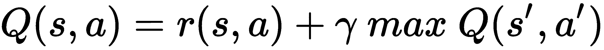
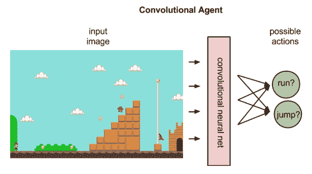

# 第九章：使用深度强化学习玩 GridWorld 游戏

作为人类，我们通过经验学习。我们并非一夜之间或偶然变得如此迷人。多年的赞美与批评都帮助塑造了今天的我们。我们通过反复尝试不同的肌肉运动，直到学会骑自行车。当你执行动作时，有时会立刻获得奖励，这就是 **强化学习**（**RL**）。

本章将专注于设计一个由批评和奖励驱动的机器学习系统。我们将看到如何使用 **Deeplearning4j**（**DL4J**）、**reinforcement learning 4j**（**RL4J**）和作为 Q 函数的神经网络 Q 学习开发一个示范性 GridWorld 游戏。我们将从强化学习及其理论背景开始，以便更容易理解这个概念。简而言之，本章将涵盖以下主题：

+   强化学习中的符号表示、策略和效用

+   深度 Q 学习算法

+   使用深度 Q 学习开发 GridWorld 游戏

+   常见问题解答（FAQ）

# 强化学习的符号表示、策略和效用

监督学习和无监督学习看似位于两个极端，而强化学习则介于二者之间。它不是监督学习，因为训练数据来自于算法在探索与利用之间做出的决策。

此外，它也不是无监督学习，因为算法会从环境中获取反馈。只要你处于一个执行某个动作后能够获得奖励的状态，你就可以使用强化学习来发现一系列能够获得最大期望奖励的动作。强化学习代理的目标是最大化最终获得的总奖励。第三个主要子元素是价值函数。

奖励决定了状态的即时可取性，而价值则表示了状态的长期可取性，考虑到可能跟随的状态和这些状态中的可用奖励。价值函数是相对于所选策略来指定的。在学习阶段，代理会尝试那些能够确定具有最高价值状态的动作，因为这些动作最终会带来最好的奖励。

强化学习技术已经被应用到许多领域。目前正在追求的一个总体目标是创建一个只需要任务描述的算法。当这种表现得以实现时，它将被广泛应用于各个领域。

# 强化学习中的符号表示

你可能注意到，强化学习的术语涉及将算法化身为在特定情境中采取动作以获取奖励。事实上，算法通常被称为一个与环境互动的代理。

你可以将其视为一个通过传感器感知并通过执行器与环境互动的智能硬件代理。因此，强化学习理论在机器人技术中的广泛应用也就不足为奇了。现在，为了进一步展开讨论，我们需要了解一些术语：

+   **环境**：这是一个具有多个状态和在状态之间转换机制的系统。例如，在 GridWorld 游戏中，代理的环境就是网格空间本身，定义了状态以及代理如何通过奖励到达目标。

+   **代理**：这是一个与环境互动的自主系统。例如，在我们的 GridWorld 游戏中，代理就是玩家。

+   **状态**：环境中的状态是一组完全描述环境的变量。

+   **目标**：它也是一个状态，提供比任何其他状态更高的折扣累计奖励。在我们的 GridWorld 游戏中，目标状态是玩家最终希望达到的状态，但通过积累尽可能高的奖励。

+   **动作**：动作定义了不同状态之间的转换。因此，在执行一个动作后，代理可以从环境中获得奖励或惩罚。

+   **策略**：它定义了一组基于动作的规则，用于在给定状态下执行和实施动作。

+   **奖励**：这是对好坏动作/移动的正负量度（即得分）。最终，学习的目标是通过最大化得分（奖励）来达到目标。因此，奖励本质上是训练代理的训练集。

+   **回合（也称为试验）**：这是从初始状态（即代理的位置）到达目标状态所需的步骤数。

我们将在本节稍后讨论更多关于策略和效用的内容。下图展示了状态、动作和奖励之间的相互作用。如果你从状态 `s[1]` 开始，可以执行动作 `a[1]` 来获得奖励 *r (s[1], a[1])*。箭头表示动作，状态由圆圈表示：


当代理执行一个动作时，状态会产生奖励。

机器人执行动作以在不同状态之间转换。但它如何决定采取哪种动作呢？实际上，这完全依赖于使用不同的或具体的策略。

# 政策

在强化学习中，策略是一组规则或一种战略。因此，学习的一个目标是发现一种良好的策略，能够观察到每个状态下动作的长期后果。所以，从技术上讲，策略定义了在给定状态下要采取的行动。下图展示了在任何状态下的最优动作：


策略定义了在给定状态下要采取的动作。

短期后果很容易计算：它只是奖励。尽管执行一个动作会得到即时奖励，但贪心地选择最大奖励的动作并不总是最好的选择。根据你的强化学习问题的定义，可能会有不同类型的策略，如下所述：

+   当一个代理总是通过执行某个动作来追求最高的即时奖励时，我们称之为**贪心策略**。

+   如果一个动作是任意执行的，则该策略称为**随机策略**。

+   当神经网络通过反向传播和来自环境的明确反馈更新权重来学习选择动作的策略时，我们称之为**策略梯度**。

如果我们想要制定一个健壮的策略来解决强化学习问题，我们必须找到一个在表现上优于随机策略和贪心策略的最优策略。在这一章中，我们将看到为什么策略梯度更加直接和乐观。

# 效用

长期奖励是**效用**。为了决定采取什么动作，代理可以选择产生最高效用的动作，并以贪心方式进行选择。执行一个动作 `a` 在状态 `s` 时的效用表示为函数 *Q(s, a)*，称为效用函数。效用函数根据由状态和动作组成的输入，预测即时奖励和最终奖励，正如以下图所示：


使用效用函数

# 神经网络 Q 学习

大多数强化学习算法可以归结为三个主要步骤：推断、执行和学习。在第一步中，算法使用到目前为止所获得的知识，从给定的状态 `s` 中选择最佳动作 `a`。接下来，它执行该动作，以找到奖励 `r` 和下一个状态 *s'*。

然后，它使用新获得的知识 *(s, r, a, s')* 来改进对世界的理解。这些步骤甚至可以通过 Q 学习算法进行更好的公式化，Q 学习算法或多或少是深度强化学习的核心。

# Q 学习简介

使用 *(s, r, a, s')* 计算获得的知识只是计算效用的一种简单方法。因此，我们需要找到一种更健壮的方式来计算它，使得我们通过递归地考虑未来动作的效用来计算特定状态-动作对 *(s, a)* 的效用。当前动作的效用不仅受到即时奖励的影响，还受到下一个最佳动作的影响，如下式所示，这称为**Q 函数**：



在前面的公式中，*s'* 表示下一个状态，*a'* 表示下一个动作，执行动作 `a` 在状态 `s` 时的奖励表示为 *r(s, a)*。其中，*γ* 是一个超参数，称为**折扣因子**。如果 *γ* 为 `0`，则代理选择一个特定的动作，最大化即时奖励。较高的 *γ* 值将使代理更重视考虑长期后果。

在实践中，我们需要考虑更多这样的超参数。例如，如果期望吸尘机器人快速学习解决任务，但不一定要求最优解，那么我们可能会设置一个更高的学习速率。

另外，如果允许机器人有更多的时间去探索和利用，我们可能会降低学习速率。我们将学习速率称为*α*，并将我们的效用函数更改如下（请注意，当*α = 1*时，这两个方程是相同的）：


总结来说，一个 RL 问题可以通过了解这个*Q(s, a)*函数来解决。这促使研究人员提出了一种更先进的**QLearning**算法，称为**神经 Q 学习**，它是一种用于计算状态-动作值的算法，属于**时序差分**（**TD**）算法类别，意味着它涉及到动作执行和奖励获得之间的时间差异。

# 神经网络作为 Q 函数

现在我们知道了状态和需要执行的动作。然而，`QLearning`智能体需要了解形如（状态 x 动作）的搜索空间。下一步是创建图形或搜索空间，它是负责任何状态序列的容器。`QLSpace`类定义了`QLearning`算法的搜索空间（状态 x 动作），如下面的图所示：


状态转移矩阵与 QLData（Q 值、奖励、概率）

拥有状态和动作列表的最终用户可以提供搜索空间。或者，它可以通过提供状态数来自动创建，具体通过以下参数：

+   **状态**：Q 学习搜索空间中定义的所有可能状态的序列

+   **目标**：一系列表示目标状态的标识符

然而，传统的这种搜索空间（或查找表）表示方式有时效率不高；因为在大多数有趣的问题中，我们的状态-动作空间太大，无法存储在表中，例如*吃豆人*游戏。相反，我们需要进行泛化，并在状态之间进行模式匹配。换句话说，我们需要我们的 Q 学习算法能够说，*这种状态的值是 X*，而不是说，*这个特定、超具体的状态的值是 X*。

这里可以使用基于神经网络的 Q 学习，而不是查找表作为我们的`Q`(`s`, `a`)，它接受状态`s`和动作`a`，并输出该状态-动作对的值。然而，正如我之前提到的，神经网络有时包含数百万个与之相关的参数，这些参数就是权重。因此，我们的`Q`函数实际上看起来像`Q`(`s`, `a`, *θ*)，其中*θ*是一个参数向量。

我们将通过反复更新神经网络的*θ*参数来代替反复更新表格中的值，从而使其学会为我们提供更好的状态-动作值估计。顺便提一下，我们可以像训练其他神经网络一样，使用梯度下降（反向传播）来训练这样的深度 Q 学习网络。

例如，如果状态（搜索空间）通过图像表示，神经网络可以对智能体的可能动作进行排名，从而预测可能的奖励。例如，向左跑返回五分，向上跳返回七分，向下跳返回两分，而向左跑则不返回任何奖励。



使用神经网络进行基于强化学习的游戏

为了实现这一点，我们不需要为每个动作都运行网络，而是只需在我们需要获取*max Q*（`s`′，`a`′）时运行它，也就是在新状态*s'*下对每个可能的动作获取*max Q*值。

我们将看到如何使用`MultiLayerNetwork`和 DL4J 的`MultiLayerConfiguration`配置创建这样的深度 Q 学习网络。因此，神经网络将充当我们的 Q*-*函数。现在，我们已经对强化学习（RL）和 Q 学习有了最基本的理论了解，是时候开始编写代码了。

# 使用深度 Q 网络开发 GridWorld 游戏

现在我们将深入了解**深度 Q 网络**（**DQN**），以训练一个智能体玩 GridWorld，这是一个简单的基于文本的游戏。游戏中有一个 4x4 的方格，放置了四个物体：一个智能体（玩家）、一个陷阱、一个目标和一堵墙。


GridWorld 项目结构

项目具有以下结构：

+   `DeepQNetwork.java`：提供 DQN 的参考架构

+   `Replay.java`：生成 DQN 的重放记忆，确保深度网络的梯度稳定，不会在多个回合中发散

+   `GridWorld.java`：用于训练 DQN 和玩游戏的主类。

顺便提一下，我们在 GPU 和 cuDNN 上执行训练，以加快收敛速度。如果您的机器没有 GPU，您也可以使用 CPU 后端。

# 生成网格

我们将开发一个简单的游戏，每次初始化一个完全相同的网格。游戏从智能体（`A`）、目标（*+*）、陷阱（-）和墙（`W`）开始。每场游戏中，所有元素都被随机放置在网格上。这样，Q 学习只需要学习如何将智能体从已知的起始位置移动到已知的目标位置，而不碰到陷阱（这会带来负面奖励）。请看这张截图：


一个显示游戏元素（即智能体、目标、陷阱和墙）的 GridWorld 游戏网格

简而言之，游戏的目标是到达目标点，在那里智能体会获得一个数值奖励。为了简化，我们将避免陷阱；如果智能体落入陷阱，它将被处罚，获得负奖励。

墙壁也能阻挡代理人的路径，但它不会提供奖励或惩罚，所以我们可以放心。由于这是定义状态的一种简单方式，代理人可以执行以下动作（即，行为）：

+   向上

+   向下

+   向左

+   向右

这样，动作 `a` 可以定义为如下：`a ∈ A {up, down, left, right}`。现在让我们看看，基于前面的假设，网格会是什么样子的：

```py
// Generate the GridMap
int size = 4;
float[][] generateGridMap() {
        int agent = rand.nextInt(size * size);
        int goal = rand.nextInt(size * size);

        while(goal == agent)
            goal = rand.nextInt(size * size);
        float[][] map = new float[size][size];

        for(int i = 0; i < size * size; i++)
            map[i / size][i % size] = 0;
        map[goal / size][goal % size] = -1;
        map[agent / size][agent % size] = 1;

        return map;
    }
```

一旦网格构建完成，可以按如下方式打印出来：

```py
void printGrid(float[][] Map) {
        for(int x = 0; x < size; x++) {
            for(int y = 0; y < size; y++) {
                System.out.print((int) Map[x][y]);
            }
            System.out.println(" ");
        }
        System.out.println(" ");
    }
```

# 计算代理人和目标位置

现在，代理人的搜索空间已经准备好。接下来，让我们计算代理人和目标的初始位置。首先，我们计算代理人在网格中的初始位置，如下所示：

```py
// Calculate the position of agent
int calcAgentPos(float[][] Map) {
        int x = -1;
        for(int i = 0; i < size * size; i++) {
            if(Map[i / size][i % size] == 1)
                return i;
        }
        return x;
    }
```

然后我们计算目标的位置，如下所示：

```py
// Calculate the position of goal. The method takes the grid space as input
int calcGoalPos(float[][] Map) {
        int x = -1;// start from the initial position

        // Then we loop over the grid size say 4x4 times
        for(int i = 0; i < size * size; i++) {
            // If the mapped position is the initial position, we update the position 
            if(Map[i / size][i % size] == -1)
                return i;
        }
        return x; // agent cannot move to any other cell
    }
```

现在，生成的网格可以视为四个独立的网格平面，每个平面代表每个元素的位置。在下图中，代理人当前的网格位置是 (3, 0)，墙壁位于 (0, 0)，陷阱位于 (0, 1)，目标位于 (1, 0)，这也意味着所有其他元素为 0：


生成的网格可以视为四个独立的网格平面

因此，我们设计了网格，使得某些物体在相同的 `x`，`y` 位置（但不同的 `z` 位置）包含一个 `1`，这表示它们在网格上的位置相同。

# 计算动作掩码

在这里，我们将所有输出设置为 0，除了我们实际看到的动作对应的输出，这样网络就可以根据与独热编码动作对应的掩码来乘以输出。然后我们可以将 0 作为所有未知动作的目标，这样我们的神经网络应该能够很好地执行。当我们想要预测所有动作时，可以简单地传递一个全为 1 的掩码：

```py
// Get action mask
int[] getActionMask(float[][] CurrMap) {
        int retVal[] = { 1, 1, 1, 1 };

        int agent = calcAgentPos(CurrMap); //agent current position
        if(agent < size) // if agent's current pos is less than 4, action mask is set to 0
            retVal[0] = 0;
        if(agent >= (size * size - size)) // if agent's current pos is 12, we set action mask to 0 too
            retVal[1] = 0;
        if(agent % size == 0) // if agent's current pos is 0 or 4, we set action mask to 0 too
            retVal[2] = 0;
        if(agent % size == (size - 1))// if agent's current pos is 7/11/15, we set action mask to 0 too
            retVal[3] = 0;

        return retVal; // finally, we return the updated action mask. 
    }
```

# 提供指导动作

现在代理人的行动计划已经确定。接下来的任务是为代理人提供一些指导，使其从当前的位置朝着目标前进。例如，并非所有的动作都是准确的，也就是说，某些动作可能是无效的：

```py
// Show guidance move to agent 
float[][] doMove(float[][] CurrMap, int action) {
        float nextMap[][] = new float[size][size];
        for(int i = 0; i < size * size; i++)
            nextMap[i / size][i % size] = CurrMap[i / size][i % size];

        int agent = calcAgentPos(CurrMap);
        nextMap[agent / size][agent % size] = 0;

        if(action == 0) {
            if(agent - size >= 0)
                nextMap[(agent - size) / size][agent % size] = 1;
            else {
                System.out.println("Bad Move");
                System.exit(0);
            }
        } else if(action == 1) {
            if(agent + size < size * size)
                nextMap[(agent + size) / size][agent % size] = 1;
            else {
                System.out.println("Bad Move");
                System.exit(0);
            }
        } else if (action == 2) {
            if((agent % size) - 1 >= 0)
                nextMap[agent / size][(agent % size) - 1] = 1;
            else {
                System.out.println("Bad Move");
                System.exit(0);
            }
        } else if(action == 3) {
            if((agent % size) + 1 < size)
                nextMap[agent / size][(agent % size) + 1] = 1;
            else {
                System.out.println("Bad Move");
                System.exit(0);
            }
        }
        return nextMap;
    }
```

在前面的代码块中，我们将动作编码为如下：`0`代表向上，`1`代表向下，`2`代表向左，`3`代表向右。否则，我们将该动作视为无效操作，代理人将受到惩罚。

# 计算奖励

现在，代理人已经获得了一些指导——强化信号——接下来的任务是计算代理人执行每个动作的奖励。看看这段代码：

```py
// Compute reward for an action 
float calcReward(float[][] CurrMap, float[][] NextMap) {
        int newGoal = calcGoalPos(NextMap);// first, we calculate goal position for each map
        if(newGoal == -1) // if goal position is the initial position (i.e. no move)
            return (size * size + 1); // we reward the agent to 4*4+ 1 = 17 (i.e. maximum reward)
        return -1f; // else we reward -1.0 for each bad move 
    }
```

# 为输入层展平输入

然后我们需要将网络的输出转换为一个 1D 特征向量，供 DQN 使用。这个展平过程获取了网络的输出；它将所有结构展平，形成一个单一的长特征向量，供全连接层使用。看看这段代码：

```py
INDArray flattenInput(int TimeStep) {
        float flattenedInput[] = new float[size * size * 2 + 1];

        for(int a = 0; a < size; a++) {
            for(int b = 0; b < size; b++) {
                if(FrameBuffer[a][b] == -1)
                    flattenedInput[a * size + b] = 1;
                else
                    flattenedInput[a * size + b] = 0;
                if(FrameBuffer[a][b] == 1)
                    flattenedInput[size * size + a * size + b] = 1;
                else
                    flattenedInput[size * size + a * size + b] = 0;
            }
        }
        flattenedInput[size * size * 2] = TimeStep;
        return Nd4j.create(flattenedInput);
    }
```

到目前为止，我们仅创建了 `GridWorld` 的逻辑框架。因此，我们在开始游戏之前创建了 `DQN`。

# 网络构建与训练

正如我所说，我们将使用 `MultiLayerNetwork` 和 DL4J 的 `MultiLayerConfiguration` 配置创建一个 DQN 网络，它将作为我们的 Q 函数。因此，第一步是通过定义 `MultiLayerConfiguration` 创建一个 `MultiLayerNetwork`。由于状态有 64 个元素—4 x 4 x 4—我们的网络需要一个包含 64 个单元的输入层，两个隐藏层，分别有 164 和 150 个单元，以及一个包含 4 个单元的输出层，用于四种可能的动作（上、下、左、右）。具体如下：


DQN 网络的结构，显示输入层、两个隐藏层和输出层

然而，我们将使用经验回放内存来训练我们的 DQN，它将帮助我们存储智能体观察到的转换。这将允许 DQN 在后续使用这些数据。通过从中随机采样，构建一个批次的转换可以去相关。研究表明，这大大稳定并改善了 DQN 的训练过程。按照前述配置，以下代码可用于创建这样的 `MultiLayerConfiguration`：

```py
int InputLength = size * size * 2 + 1;
int HiddenLayerCount = 150;

MultiLayerConfiguration conf = new NeuralNetConfiguration.Builder()
                .seed(12345)    //Random number generator seed for improved repeatability. Optional.
                .optimizationAlgo(OptimizationAlgorithm.STOCHASTIC_GRADIENT_DESCENT)
                .weightInit(WeightInit.XAVIER)
                .updater(new Adam(0.001))
                .l2(0.001) // l2 regularization on all layers
                .list()
                .layer(0, new DenseLayer.Builder()
                        .nIn(InputLength)
                        .nOut(HiddenLayerCount)
                        .weightInit(WeightInit.XAVIER)
                        .activation(Activation.RELU)
                        .build())
                .layer(1, new DenseLayer.Builder()
                        .nIn(HiddenLayerCount)
                        .nOut(HiddenLayerCount)
                        .weightInit(WeightInit.XAVIER)
                        .activation(Activation.RELU)
                        .build())
                .layer(2,new OutputLayer.Builder(LossFunction.MSE)
                        .nIn(HiddenLayerCount)
                        .nOut(4) // for 4 possible actions
                        .weightInit(WeightInit.XAVIER)
                        .activation(Activation.IDENTITY)
                        .weightInit(WeightInit.XAVIER)
                        .build())
                .pretrain(false).backprop(true).build();
```

然后，我们使用这个配置创建一个 DQN：

```py
DeepQNetwork RLNet = new DeepQNetwork(conf, 100000, .99f, 1d, 1024, 500, 1024, InputLength, 4);
```

我们稍后会讨论参数，但在此之前，我们先看看如何创建这样一个深度架构。首先，我们定义一些参数：

```py
int ReplayMemoryCapacity;
List<Replay> ReplayMemory;
double Epsilon;
float Discount;

MultiLayerNetwork DeepQ; // Initial DeepQNet
MultiLayerNetwork TargetDeepQ; // Target DeepQNet

int BatchSize;
int UpdateFreq;
int UpdateCounter;
int ReplayStartSize;
Random r;

int InputLength;
int NumActions;

INDArray LastInput;
int LastAction;
```

然后，我们定义构造函数来初始化这些参数：

```py
DeepQNetwork(MultiLayerConfiguration conf, int replayMemoryCapacity, float discount, double epsilon, int batchSize, int updateFreq, int replayStartSize, int inputLength, int numActions){
        // First, we initialize both the DeepQNets
 DeepQ = new MultiLayerNetwork(conf);
        DeepQ.init();

        TargetDeepQ = new MultiLayerNetwork(conf);
        TargetDeepQ.init();

        // Then we initialize the target DeepQNet's params
        TargetDeepQ.setParams(DeepQ.params());
        ReplayMemoryCapacity = replayMemoryCapacity;

        Epsilon = epsilon;
        Discount = discount;

        r = new Random();
        BatchSize = batchSize;
        UpdateFreq = updateFreq;
        UpdateCounter = 0;

        ReplayMemory = new ArrayList<Replay>();
        ReplayStartSize = replayStartSize;
        InputLength = inputLength;
        NumActions = numActions;
    }
```

以下是该算法主循环的实现：

1.  我们设置了一个 `for` 循环，直到游戏进行完毕。

1.  我们运行 Q 网络的前向传播。

1.  我们使用的是 epsilon-贪心策略，因此在时间 `t` 时，以 *ϵ* 的概率，*智能体* 选择一个随机行动。然而，以 1−*ϵ* 的概率，执行来自我们神经网络的最大 Q 值对应的行动。

1.  然后，智能体采取一个行动 `a`，该行动在前一步骤中已确定；我们观察到一个新的状态 `s`′ 和奖励 `r[t]`[+1]。

1.  然后，使用 `s`′ 执行 Q 网络的前向传播，并存储最高的 Q 值（maxQ）。

1.  然后，计算智能体的目标值作为奖励 + (gamma * maxQ)，用于训练网络，其中 gamma 是一个参数（0<=*γ*<=1）。

1.  我们的目标是更新与我们刚刚采取的行动相关联的四种可能输出的输出。在这里，智能体的目标输出向量与第一次执行时的输出向量相同，唯一不同的是与行动相关联的输出 *奖励 + (gamma * maxQ)*。

上述步骤是针对一个回合的，然后循环会根据用户定义的回合数进行迭代。此外，首先构建网格，然后计算并保存每个动作的下一个奖励。简而言之，上述步骤可以表示如下：

```py
GridWorld grid = new GridWorld();
grid.networkConstruction();

// We iterate for 100 episodes
for(int m = 0; m < 100; m++) {
            System.out.println("Episode: " + m);
            float CurrMap[][] = grid.generateGridMap();

            grid.FrameBuffer = CurrMap;
            int t = 0;
            grid.printGrid(CurrMap);

            for(int i = 0; i < 2 * grid.size; i++) {
                int a = grid.RLNet.getAction(grid.flattenInput(t), grid.getActionMask(CurrMap));

                float NextMap[][] = grid.doMove(CurrMap, a);
                float r = grid.calcReward(CurrMap, NextMap);
                grid.addToBuffer(NextMap);
                t++;

                if(r == grid.size * grid.size + 1) {
                    grid.RLNet.observeReward(r, null, grid.getActionMask(NextMap));
                    break;
                }

                grid.RLNet.observeReward(r, grid.flattenInput(t), grid.getActionMask(NextMap));
                CurrMap = NextMap;
            }
}
```

在前面的代码块中，网络计算每个迷你批次的扁平化输入数据所观察到的奖励。请看一下：

```py
void observeReward(float Reward, INDArray NextInputs, int NextActionMask[]){
        addReplay(Reward, NextInputs, NextActionMask);

        if(ReplayStartSize <  ReplayMemory.size())
            networkTraining(BatchSize);
        UpdateCounter++;
        if(UpdateCounter == UpdateFreq){
            UpdateCounter = 0;
            System.out.println("Reconciling Networks");
            reconcileNetworks();
        }
    }    
```

上述奖励被计算出来，用于估算最优的未来值：

```py
int getAction(INDArray Inputs , int ActionMask[]){
        LastInput = Inputs;
        INDArray outputs = DeepQ.output(Inputs);

        System.out.print(outputs + " ");
        if(Epsilon > r.nextDouble()) {
             LastAction = r.nextInt(outputs.size(1));
             while(ActionMask[LastAction] == 0)
                 LastAction = r.nextInt(outputs.size(1));
             System.out.println(LastAction);
             return LastAction;
        }        
        LastAction = findActionMax(outputs , ActionMask);
        System.out.println(LastAction);
        return LastAction;
    }
```

在前面的代码块中，通过取神经网络输出的最大值来计算未来的奖励。来看一下这个：

```py
int findActionMax(INDArray NetOutputs , int ActionMask[]){
        int i = 0;
        while(ActionMask[i] == 0) i++;

        float maxVal = NetOutputs.getFloat(i);
        int maxValI = i;

        for(; i < NetOutputs.size(1) ; i++){
            if(NetOutputs.getFloat(i) > maxVal && ActionMask[i] == 1){
                maxVal = NetOutputs.getFloat(i);
                maxValI = i;
            }
        }
        return maxValI;
    }    
```

如前所述，观察到的奖励是在网络训练开始后计算的。组合输入的计算方式如下：

```py
INDArray combineInputs(Replay replays[]){
        INDArray retVal = Nd4j.create(replays.length , InputLength);
        for(int i = 0; i < replays.length ; i++){
            retVal.putRow(i, replays[i].Input);
        }
        return retVal;
    }
```

然后，网络需要计算下一次传递的组合输入。来看一下这段代码：

```py
INDArray combineNextInputs(Replay replays[]){
        INDArray retVal = Nd4j.create(replays.length , InputLength);
        for(int i = 0; i < replays.length ; i++){
            if(replays[i].NextInput != null)
                retVal.putRow(i, replays[i].NextInput);
        }
        return retVal;
    }
```

在之前的代码块中，每个时间步的地图通过`addToBuffer()`方法保存，如下所示：

```py
void addToBuffer(float[][] nextFrame) { 
          FrameBuffer = nextFrame;
}
```

然后，DQNet 将输入展平后以批量的方式输入每一回合，开始训练。然后根据当前输入和目标输入，通过最大化奖励来计算当前和目标输出。来看一下这个代码块：

```py
void networkTraining(int BatchSize){
        Replay replays[] = getMiniBatch(BatchSize);
        INDArray CurrInputs = combineInputs(replays);
        INDArray TargetInputs = combineNextInputs(replays);

        INDArray CurrOutputs = DeepQ.output(CurrInputs);
        INDArray TargetOutputs = TargetDeepQ.output(TargetInputs);

        float y[] = new float[replays.length];
        for(int i = 0 ; i < y.length ; i++){
            int ind[] = { i , replays[i].Action };
            float FutureReward = 0 ;
            if(replays[i].NextInput != null)
                FutureReward = findMax(TargetOutputs.getRow(i) , replays[i].NextActionMask);
            float TargetReward = replays[i].Reward + Discount * FutureReward ;
            CurrOutputs.putScalar(ind , TargetReward ) ;
        }
        //System.out.println("Avgerage Error: " + (TotalError / y.length) );

        DeepQ.fit(CurrInputs, CurrOutputs);
    }
```

在前面的代码块中，通过最大化神经网络输出的值来计算未来的奖励，如下所示：

```py
float findMax(INDArray NetOutputs , int ActionMask[]){
        int i = 0;
        while(ActionMask[i] == 0) i++;

        float maxVal = NetOutputs.getFloat(i);
        for(; i < NetOutputs.size(1) ; i++){
            if(NetOutputs.getFloat(i) > maxVal && ActionMask[i] == 1){
                maxVal = NetOutputs.getFloat(i);
            }
        }
        return maxVal;
    }
```

正如我之前所说，这是一个非常简单的游戏，如果智能体采取动作 2（即，向左），一步就能到达目标。因此，我们只需保持所有其他输出与之前相同，改变我们所采取动作的输出。所以，实现经验回放是一个更好的主意，它在在线学习方案中给我们提供了小批量更新。

它的工作方式是我们运行智能体收集足够的过渡数据来填充回放记忆，而不进行训练。例如，我们的记忆大小可能为 10,000。然后，在每一步，智能体将获得一个过渡；我们会将其添加到记忆的末尾，并弹出最早的一个。来看一下这段代码：

```py
void addReplay(float reward , INDArray NextInput , int NextActionMask[]){
        if(ReplayMemory.size() >= ReplayMemoryCapacity )
            ReplayMemory.remove( r.nextInt(ReplayMemory.size()) );

        ReplayMemory.add(new Replay(LastInput , LastAction , reward , NextInput , NextActionMask));
    }
```

然后，从记忆中随机抽取一个小批量的经验，并在其上更新我们的 Q 函数，类似于小批量梯度下降。来看一下这段代码：

```py
Replay[] getMiniBatch(int BatchSize){
        int size = ReplayMemory.size() < BatchSize ? ReplayMemory.size() : BatchSize ;
        Replay[] retVal = new Replay[size];

        for(int i = 0 ; i < size ; i++){
            retVal[i] = ReplayMemory.get(r.nextInt(ReplayMemory.size()));
        }
        return retVal;        
    }
```

# 玩 GridWorld 游戏

对于这个项目，我没有使用任何可视化来展示状态和动作，而是采用了一种基于文本的游戏，正如我之前提到的那样。然后你可以运行`GridWorld.java`类（包含主方法），使用以下方式调用：

```py
DeepQNetwork RLNet = new DeepQNetwork(conf, 100000, .99f, 1d, 1024, 500, 1024, InputLength, 4);
```

在这个调用中，以下是参数描述：

+   `conf`：这是用于创建 DQN 的`MultiLayerConfiguration`

+   `100000`：这是回放记忆的容量。

+   `.99f`：折扣因子

+   `1d`：这是 epsilon

+   `1024`：批量大小

+   `500`：这是更新频率；第二个 1,024 是回放开始的大小

+   `InputLength`：这是输入的长度，大小为 x x 2 + 1 = 33（考虑到 size=4）

+   `4`：这是智能体可以执行的可能动作的数量。

我们将 epsilon（*ϵ*贪婪动作选择）初始化为 1，并且在每一回合后会减少一个小量。这样，最终它会降到 0.1 并保持不变。基于之前的设置，应该开始训练，训练过程会开始生成一个表示每个时间戳的地图网格，并输出 DQN 对于上/下/左/右顺序的结果，接着是最高值的索引。

我们没有用于图形表示游戏的模块。所以，在前面的结果中，0、1、-1 等数字代表了每五个回合中每个时间戳的地图。括号中的数字只是 DQN 的输出，后面跟着最大值的索引。看看这个代码块：

```py
Scanner keyboard = new Scanner(System.in);
for(int m = 0; m < 10; m++) {
            grid.RLNet.SetEpsilon(0);
            float CurrMap[][] = grid.generateGridMap();
            grid.FrameBuffer = CurrMap;

            int t = 0;
            float tReward = 0;

            while(true) {
                grid.printGrid(CurrMap);
                keyboard.nextLine();

                int a = grid.RLNet.getAction(grid.flattenInput(t), grid.getActionMask(CurrMap));
                float NextMap[][] = grid.doMove(CurrMap, a);
                float r = grid.calcReward(CurrMap, NextMap);

                tReward += r;
                grid.addToBuffer(NextMap);
                t++;
                grid.RLNet.observeReward(r, grid.flattenInput(t), grid.getActionMask(NextMap));

                if(r == grid.size * grid.size + 1)
                    break;
                CurrMap = NextMap;
            }
            System.out.println("Net Score: " + (tReward));
        }
        keyboard.close();
    }

>>>
 Episode: 0
 0000
 01-10
 0000
 0000
 [[ 0.2146, 0.0337, -0.0444, -0.0311]] 2
 [[ 0.1105, 0.2139, -0.0454, 0.0851]] 0
 [[ 0.0678, 0.3976, -0.0027, 0.2667]] 1
 [[ 0.0955, 0.3379, -0.1072, 0.2957]] 3
 [[ 0.2498, 0.2510, -0.1891, 0.4132]] 0
 [[ 0.2024, 0.4142, -0.1918, 0.6754]] 2
 [[ 0.1141, 0.6838, -0.2850, 0.6557]] 1
 [[ 0.1943, 0.6514, -0.3886, 0.6868]] 0
 Episode: 1
 0000
 0000
 1000
 00-10
 [[ 0.0342, 0.1792, -0.0991, 0.0369]] 0
 [[ 0.0734, 0.2147, -0.1360, 0.0285]] 1
 [[ 0.0044, 0.1295, -0.2472, 0.1816]] 3
 [[ 0.0685, 0.0555, -0.2153, 0.2873]] 0
 [[ 0.1479, 0.0558, -0.3495, 0.3527]] 3
 [[ 0.0978, 0.3776, -0.4362, 0.4475]] 0
 [[ 0.1010, 0.3509, -0.4134, 0.5363]] 2
 [[ 0.1611, 0.3717, -0.4411, 0.7929]] 3
 ....
 Episode: 9
 0000
 1-100
 0000
 0000
 [[ 0.0483, 0.2899, -0.1125, 0.0281]] 3
 0000
 0000
 0-101
 0000
 [[ 0.0534, 0.2587, -0.1539, 0.1711]] 1
 Net Score: 10.0
```

因此，代理已经能够获得总分 10（即正分）。

# 常见问题解答（FAQs）

既然我们已经解决了 GridWorld 问题，那么在强化学习和整体深度学习现象中还有其他实际方面需要考虑。在本节中，我们将看到一些你可能已经想过的常见问题。答案可以在附录中找到。

1.  什么是 Q 学习中的 Q？

1.  我理解我们在 GPU 和 cuDNN 上进行了训练以加速收敛。然而，我的机器上没有 GPU。我该怎么办？

1.  没有可视化，因此很难跟踪代理朝向目标的移动。

1.  给出更多强化学习的例子。

1.  我如何调和我们获得的小批处理处理结果？

1.  我如何调和 DQN？

1.  我想保存已训练的网络。我可以做到吗？

1.  我想恢复已保存（即已训练）的网络。我可以做到吗？

# 总结

在本章中，我们展示了如何使用 DL4J、RL4J 和神经 Q 学习开发一个演示版 GridWorld 游戏，其中 Q 学习充当 Q 函数。我们还提供了开发深度 Q 学习网络以玩 GridWorld 游戏所需的一些基本理论背景。然而，我们没有开发任何模块来可视化代理在整个回合中的移动。

在下一章，我们将开发一个非常常见的端到端电影推荐系统项目，但使用神经**因式分解机**（**FM**）算法。该项目将使用 MovieLens 100 万数据集。我们将使用 RankSys 和基于 Java 的 FM 库来预测用户的电影评分和排名。尽管如此，Spark ML 将用于对数据集进行探索性分析。

# 问题的答案

**问题 1 的回答：** 不要将 Q 学习中的 Q 与我们在前面部分讨论的 Q 函数混淆。Q 函数始终是接受状态和动作并返回该状态-动作对值的函数名称。强化学习方法涉及 Q 函数，但不一定是 Q 学习算法。

**问题 2 的回答：** 不用担心，你也可以在 CPU 后端进行训练。在这种情况下，只需从 `pom.xml` 文件中删除与 CUDA 和 cuDNN 相关的条目，并用 CPU 版本替换它们。相应的属性为：

```py
<properties>
       <project.build.sourceEncoding>UTF-8</project.build.sourceEncoding>
       <java.version>1.8</java.version>
        <nd4j.version>1.0.0-alpha</nd4j.version>
       <dl4j.version>1.0.0-alpha</dl4j.version>
      <datavec.version>1.0.0-alpha</datavec.version>
       <arbiter.version>1.0.0-alpha</arbiter.version>
      <logback.version>1.2.3</logback.version>
</properties>
```

不要使用这两个依赖项：

```py
<dependency>
       <groupId>org.nd4j</groupId>
        <artifactId>nd4j-cuda-9.0-platform</artifactId>
        <version>${nd4j.version}</version>
</dependency>
<dependency>
       <groupId>org.deeplearning4j</groupId>
       <artifactId>deeplearning4j-cuda-9.0</artifactId>
       <version>${dl4j.version}</version>
</dependency>
```

只使用一个，如下所示：

```py
<dependency>
     <groupId>org.nd4j</groupId>
     <artifactId>nd4j-native</artifactId>
     <version>${nd4j.version}</version>
</dependency>
```

那么你已经准备好使用 CPU 后端了。

**问题 3 的答案：** 如前所述，最初的目标是开发一个简单的基于文本的游戏。然而，通过一些努力，所有的动作也可以进行可视化。我希望读者自行决定。然而，可视化模块将在不久后添加到 GitHub 仓库中。

**问题 4 的答案：** 好吧，DL4J GitHub 仓库中有一些 RL4J 的基本示例，地址是[`github.com/deeplearning4j/dl4j-examples/`](https://github.com/deeplearning4j/dl4j-examples/tree/master/rl4j-examples/src/main/java/org/deeplearning4j/examples/rl4j)。欢迎尝试扩展它们以满足你的需求。

**问题 5 的答案：** 处理每个小批次可以为该小批次使用的输入提供最佳的权重/偏置结果。这个问题涉及到几个子问题：i) 我们如何调和所有小批次得到的结果？ii) 我们是否取平均值来得出训练网络的最终权重/偏置？

因此，每个小批次包含单独错误梯度的平均值。如果你有两个小批次，你可以取这两个小批次的梯度更新的平均值来调整权重，以减少这些样本的误差。

**问题 6 的答案：** 参考问题 5 以获得理论理解。然而，在我们的示例中，使用来自 DL4J 的`setParams()`方法，它有助于调和网络：

```py
void reconcileNetworks(){
     TargetDeepQ.setParams(DeepQ.params());
    }
```

现在问题是：我们在哪些地方使用这种调和方法呢？答案是，在计算奖励时（参见`observeReward()`方法）。

**问题 7 的答案：** 保存 DQN 与保存其他基于 DL4J 的网络类似。为此，我编写了一个名为`saveNetwork()`的方法，它将网络参数作为单个 ND4J 对象以 JSON 格式保存。看一下这个：

```py
public boolean saveNetwork(String ParamFileName , String JSONFileName){
        //Write the network parameters for later use:
        try(DataOutputStream dos = new DataOutputStream(Files.newOutputStream(Paths.get(ParamFileName)))){
            Nd4j.write(DeepQ.params(),dos);
        } catch(IOException e) {
            System.out.println("Failed to write params");
            return false;
        }

        //Write the network configuration:
        try{
            FileUtils.write(new File(JSONFileName), DeepQ.getLayerWiseConfigurations().toJson());
        } catch (IOException e) {
            System.out.println("Failed to write json");
            return false;
        }
        return true;
    }
```

**问题 8 的答案：** 恢复 DQN 与保存其他基于 DL4J 的网络类似。为此，我编写了一个名为`restoreNetwork()`的方法，它调和参数并将保存的网络重新加载为`MultiLayerNetwork`。如下所示：

```py
public boolean restoreNetwork(String ParamFileName , String JSONFileName){
        //Load network configuration from disk:
        MultiLayerConfiguration confFromJson;
        try{
            confFromJson = MultiLayerConfiguration.fromJson(FileUtils.readFileToString(new 
                                                            File(JSONFileName)));
        } catch(IOException e1) {
            System.out.println("Failed to load json");
            return false;
        }

        //Load parameters from disk:
        INDArray newParams;
        try(DataInputStream dis = new DataInputStream(new FileInputStream(ParamFileName))){
            newParams = Nd4j.read(dis);
        } catch(FileNotFoundException e) {
            System.out.println("Failed to load parems");
            return false;
        } catch (IOException e) {
            System.out.println("Failed to load parems");
            return false;
        }
        //Create a MultiLayerNetwork from the saved configuration and parameters 
        DeepQ = new MultiLayerNetwork(confFromJson); 
        DeepQ.init(); 

        DeepQ.setParameters(newParams); 
        reconcileNetworks();
        return true;        
    }   
```
