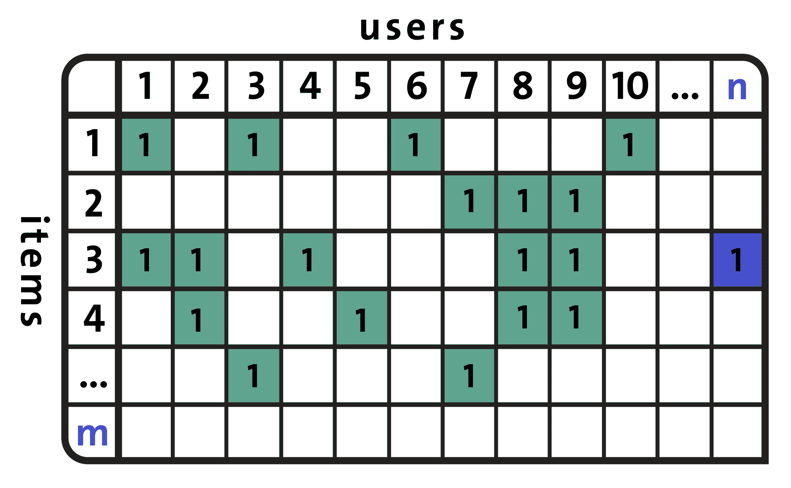
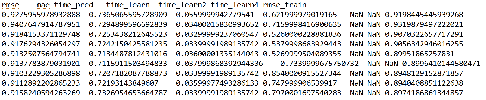
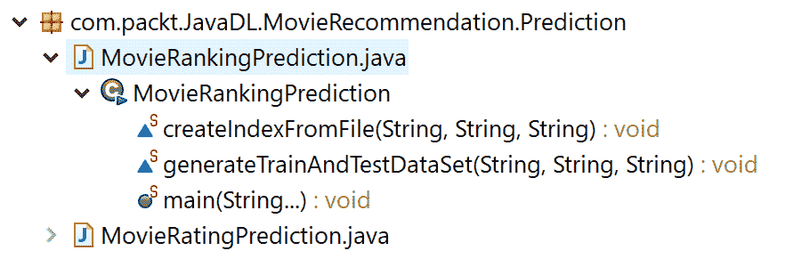

# 第十章：使用因式分解机开发电影推荐系统

**因式分解机**（**FM**）是一组通过引入第二阶特征交互来增强线性模型性能的算法，这些交互在**矩阵分解**（**MF**）算法中是缺失的，并且这种增强方式是监督式的。因此，相比于经典的**协同过滤**（**CF**）方法，因式分解机非常稳健，并且因其能够用于发现两种不同实体之间交互的潜在特征，在个性化和推荐系统中越来越受欢迎。

在本章中，我们将开发一个样例项目，用于预测评分和排名，以展示其有效性。尽管如此，在使用基于 RankSys 库的 FM 实现项目之前，我们将看到一些关于使用 MF 和 CF 的推荐系统的理论背景。总的来说，本章将涵盖以下主题：

+   推荐系统

+   矩阵分解与协同过滤方法

+   开发基于 FM 的电影推荐系统

+   常见问题解答（FAQ）

# 推荐系统

推荐技术本质上是信息代理，它们尝试预测用户可能感兴趣的物品，并向目标用户推荐最合适的物品。这些技术可以根据它们使用的信息来源进行分类。例如，用户特征（年龄、性别、收入、地点）、物品特征（关键词、类型）、用户-物品评分（显式评分、交易数据）以及其他对推荐过程有用的用户和物品信息。

因此，推荐系统，也称为**推荐引擎**（**RE**），是信息过滤系统的一个子类，帮助预测基于用户提供的评分或偏好来推荐物品。近年来，推荐系统变得越来越流行。

# 推荐方法

开发推荐引擎（RE）以生成推荐列表有几种方法，例如，协同过滤、基于内容的过滤、基于知识的推荐或基于个性的方法。

# 协同过滤方法

通过使用 CF 方法，可以基于用户的过去行为构建推荐引擎（RE）。对于已消费的物品会给出数值评分。有时，推荐也可以基于其他用户做出的决策，这些用户也购买了相同的物品，并使用一些广泛应用的数据挖掘算法，如 Apriori 或 FP-growth。以下图示展示了不同推荐系统的一些概念：


不同推荐系统的比较视图

尽管这些是成功的推荐系统，基于 CF 的方法往往会面临以下三大问题：

+   **冷启动：** 有时，当需要大量关于用户的数据来做出更准确的推荐系统时，它们可能会卡住。

+   **可扩展性：** 使用一个包含数百万用户和商品的数据集进行推荐计算时，通常需要大量的计算能力。

+   **稀疏性：** 这通常发生在众包数据集上，特别是当大量商品在主要电商网站上出售时。所有推荐数据集在某种意义上都是众包的。这是几乎所有推荐系统的普遍问题，尤其是当系统需要为大量商品提供服务，并且有足够多的用户时，并不仅限于电商网站。

在这种情况下，活跃用户可能只对所有销售的物品中的一个小子集进行评分，因此即使是最受欢迎的物品也只有很少的评分。因此，用户与物品的矩阵变得非常稀疏。换句话说，处理一个大规模的稀疏矩阵在计算上是非常具有挑战性的。

为了克服这些问题，某种类型的协同过滤算法采用矩阵分解，这是一个低秩矩阵近似技术。我们将在本章稍后看到一个示例。

# 基于内容的过滤方法

使用基于内容的过滤方法时，利用物品的一系列离散特征来推荐具有相似属性的其他物品。有时，这些方法基于物品的描述和用户偏好的个人资料。这些方法试图推荐与用户过去喜欢的物品相似的物品，或者是用户当前正在使用的物品。

基于内容的过滤方法的一个关键问题是系统是否能够根据用户对一个内容源的行为来学习其偏好，并将这些偏好应用到其他内容类型上。当这种类型的推荐引擎（RE）被部署时，就可以用来预测用户可能感兴趣的物品或物品的评分。

# 混合推荐系统

如你所见，使用协同过滤和基于内容的过滤方法各有优缺点。因此，为了克服这两种方法的局限性，近年来的趋势表明，混合方法可以更有效且准确。有时，像**矩阵分解**（**SVD**）这样的因子化方法被用来增强其鲁棒性。

# 基于模型的协同过滤

协同过滤方法分为基于记忆的，如基于用户的算法和基于模型的协同过滤（推荐使用核映射）。在基于模型的协同过滤技术中，用户和产品通过一组小的因子来描述，这些因子也叫做**潜在因子**（**LFs**）。然后使用这些潜在因子来预测缺失的条目。**交替最小二乘法**（**ALS**）算法用于学习这些潜在因子。

与基于记忆的方法相比，基于模型的方法可以更好地处理原始矩阵的稀疏性。它还具有可扩展性、更快的速度，并且能够避免过拟合问题。然而，它缺乏灵活性和适应性，因为很难向模型中添加数据。现在，让我们来看一下协同过滤方法中的一个重要元素——效用矩阵。

# 效用矩阵

在基于协同过滤的推荐系统中，存在两类实体：用户和物品（物品指的是产品，如电影、游戏和歌曲）。作为用户，你可能对某些物品有偏好。因此，这些偏好必须从关于物品、用户或评分的数据中推导出来。这些数据通常表现为效用矩阵，例如用户-物品对。此类值可以表示用户对某个物品的偏好程度。

下表展示了一个示例效用矩阵，表示用户对电影的评分，评分范围为 1 到 5，其中 5 为最高评分。**HP1**、**HP2**和**HP3**分别是*哈利·波特 I*、*II*和*III*的缩写，**TW**代表*暮光之城*，**SW1**、**SW2**和**SW3**分别代表*星球大战 I*、*II*和*III*。字母`A`、`B`、`C`和`D`代表用户：


效用矩阵（用户与电影的矩阵）

在用户-电影对中有许多空白项。这意味着用户尚未对这些电影进行评分，这增加了稀疏性。使用此矩阵的目标是预测效用矩阵中的空白项。假设我们好奇是否用户`A`会喜欢**SW2**。由于矩阵中没有太多数据，这个预测是困难的。

因此，关于电影的其他属性，如制片人、导演、主演，甚至是它们名字的相似性，都可以用来计算电影**SW1**和**SW2**的相似度。这种相似性会引导我们得出结论，由于`A`不喜欢**SW1**，他们也不太可能喜欢**SW2**。

然而，对于更大的数据集，这种方法可能不起作用。因此，当数据量更大时，我们可能会观察到评分**SW1**和**SW2**的用户倾向于给它们相似的评分。最终，我们可以得出结论，`A`也会给**SW2**一个低评分，类似于`A`对**SW1**的评分。然而，这种方法有一个严重的缺点，称为**冷启动问题**。

# 协同过滤方法中的冷启动问题

冷启动问题这个词听起来有些滑稽，但正如其名字所示，它源自汽车。在推荐引擎中，冷启动问题只是意味着一种尚未达到最佳状态的情况，导致引擎无法提供最理想的结果。

在协同过滤方法中，推荐系统会识别与当前用户有相似偏好的用户，并推荐那些志同道合的用户喜欢的物品。由于冷启动问题，这种方法无法考虑没有人在社区中评分的物品。

使用基于协同过滤（CF）方法的推荐引擎根据用户的行为推荐每个物品。物品的用户行为越多，越容易判断哪些用户可能对该物品感兴趣，以及哪些其他物品与之相似。随着时间的推移，系统将能够提供越来越准确的推荐。当新的物品或用户被添加到用户-物品矩阵时，以下问题就会发生：



用户与物品矩阵有时会导致冷启动问题

在这种情况下，推荐引擎对这个新用户或新物品的了解还不够。基于内容的过滤方法，类似于因子分解机（FM），是一种可以结合使用以缓解冷启动问题的方法。

# 推荐系统中的因子分解机

在实际生活中，大多数推荐问题假设我们拥有一个由（用户、物品和评分）元组构成的评分数据集。然而，在许多应用中，我们有大量的物品元数据（标签、类别和类型），这些可以用来做出更好的预测。

这就是使用因子分解机（FMs）与特征丰富数据集的好处之一，因为模型中可以自然地加入额外的特征，且可以使用维度参数建模高阶交互。

一些最近的研究类型展示了哪些特征丰富的数据集能够提供更好的预测：

+   Xiangnan He 和 Tat-Seng Chua，*Neural Factorization Machines for Sparse Predictive Analytics*。发表于 SIGIR '17 会议，东京新宿，日本，2017 年 8 月 07-11 日

+   Jun Xiao, Hao Ye, Xiangnan He, Hanwang Zhang, Fei Wu 和 Tat-Seng Chua（2017）。*Attentional Factorization Machines: Learning the Weight of Feature Interactions via Attention Networks* IJCAI，澳大利亚墨尔本，2017 年 8 月 19-25 日

这些论文解释了如何将现有数据转化为特征丰富的数据集，并且如何在该数据集上实现因子分解机（FMs）。因此，研究人员正试图使用因子分解机（FMs）来开发更准确和更强大的推荐引擎（REs）。在接下来的章节中，我们将开始开发基于因子分解机（FMs）的电影推荐项目。为此，我们将使用 Apache Spark 和 RankSys 库。

现有的推荐算法需要一个由*(用户、物品、评分)*元组构成的消费（产品）或评分（电影）数据集。这些类型的数据集主要被协同过滤（CF）算法的变种使用。协同过滤（CF）算法已被广泛采用，并且证明能够产生良好的结果。

然而，在许多情况下，我们也有大量的物品元数据（标签、类别和类型），这些可以用来做出更好的预测。不幸的是，协同过滤（CF）算法并未使用这些类型的元数据。

FM 可以利用这些特征丰富（元）数据集。FM 可以消耗这些额外的特征来建模更高阶的交互，并指定维度参数`d`。最重要的是，FM 也经过优化，可以处理大规模的稀疏数据集。因此，二阶 FM 模型就足够了，因为没有足够的信息来估计更复杂的交互：


一个示例训练数据集，表示一个个性化问题，特征向量 x 和目标 y。在这里，行代表电影，而列包括导演、演员和类型等信息

假设预测问题的数据集由设计矩阵`X` ∈ ℝ*^n*^(x`p`)描述。在前面的图中，*i^(th)*行，x*[i]* ∈ ℝ*^(p;)*是`X`中的一个案例，描述了一个包含`p`个实值变量的情况，且`y[i]`是第`i`个案例的预测目标。或者，我们可以将这个集合描述为一组元组*(x,y)*的集合，其中（再次）`x` ∈ ℝ*^p*是特征向量，`y`是其对应的目标或标签。

换句话说，在图 7 中，每一行表示一个特征向量`x[i]`及其对应的目标`y[i]`。为了更容易理解，特征被分组为：活动用户（蓝色）、活动商品（红色）、相同用户评分的其他电影（橙色）、时间（月）（绿色）以及最后评分的电影（棕色）。

然后，FM 算法使用以下因子化的交互参数，建模`p`个输入变量在`x`中的所有嵌套交互（最多到 d*阶）：


在这个方程中，*vs*代表与每个变量（用户和商品）相关的`k`维潜在向量，而括号操作符表示内积。许多机器学习方法中都使用这种数据矩阵和特征向量的表示方式，例如线性回归或支持向量机（SVM）。

然而，如果你熟悉矩阵分解（MF）模型，那么前面的公式应该看起来很熟悉：它包含一个全局偏差，以及用户/商品特定的偏差，并且包括用户与商品的交互。现在，如果我们假设每个*x(j)*向量仅在位置`u`和`i`处非零，我们得到经典的 MF 模型：


然而，FM 也可以用于分类或回归，并且在处理大规模稀疏数据集时，比传统算法（如线性回归）计算效率更高。正是因为这个特点，FM 被广泛用于推荐系统：用户数和商品数通常非常大，尽管实际的推荐数量非常少（用户并不会对所有可用商品进行评分！）。

# 使用因子分解机（FM）开发电影推荐系统

在本项目中，我们将展示如何从 MovieLens 1M 数据集中进行排名预测。首先，我们将准备数据集。然后，我们将训练 FM 算法，最终预测电影的排名和评分。项目代码的结构如下：


电影评分和排名预测项目结构

总结来说，该项目的结构如下：

+   **EDA：** 该包用于对 MovieLens 1M 数据集进行探索性分析。

+   **工具、FMCore 和 DataUtils：** 这些是核心的 FM 库。为了这个项目，我使用了（但进行了扩展）`RankSys` 库（可以查看 `GitHub` 仓库：[`github.com/RankSys/RankSys`](https://github.com/RankSys/RankSys)）。

+   **预处理：** 这个包用于将 `MovieLens` 1M 数据集转换为 LibFM 格式。

+   **预测：** 这个包用于电影评分和排名预测。

+   **GraphUtil：** 该包用于在迭代过程中可视化一些性能指标。

我们将一步步讲解所有这些包。不过，了解数据集是必须的。

# 数据集描述和探索性分析

MovieLens 1M 小型数据集是从 MovieLens 网站下载（并已获得必要的许可）并使用的，网址为：[`grouplens.org/datasets/movielens/`](https://grouplens.org/datasets/movielens/)。我由衷感谢 F. Maxwell Harper 和 Joseph A. Konstan 提供的这个数据集。该数据集已发表于 *MovieLens 数据集：历史与背景*，ACM 交互智能系统事务（TiiS）5（4），文章 19（2015 年 12 月），共 19 页。

数据集包含三个文件：`movies.dat`、`ratings.dat` 和 `users.dat`，分别与电影、评分和用户相关。文件中包含 1,000,209 个匿名评分，涵盖约 3,900 部电影，评分由 6,040 名于 2000 年加入 MovieLens 的用户提供。所有评分都存储在 `ratings.dat` 文件中，格式如下：

```py
UserID::MovieID::Rating::Timestamp
```

描述如下：

+   `用户 ID`：范围在 1 到 6,040 之间

+   `电影 ID`：范围在 1 到 3,952 之间

+   `评分`：这些评分采用 5 星制

+   `时间戳`：这是以秒为单位表示的

请注意，每个用户至少评价了 20 部电影。电影信息则保存在 `movies.dat` 文件中，格式如下：

```py
MovieID::Title::Genres
```

描述如下：

+   `标题`：这些与 IMDb 提供的标题相同（包括上映年份）

+   `类别`：这些是用逗号（,）分隔的，每部电影被分类为动作、冒险、动画、儿童、喜剧、犯罪、剧情、战争、纪录片、奇幻、黑色电影、恐怖、音乐、悬疑、浪漫、科幻、惊悚和西部

最后，用户信息保存在 `users.dat` 文件中，格式如下：

```py
UserID::Gender::Age::Occupation::Zip-code 
```

所有的个人信息是用户自愿提供的，且没有经过准确性检查。只有那些提供了部分个人信息的用户才会被包含在此数据集中。M 代表男性，F 代表女性，性别由此标识。年龄选择以下范围：

+   1: 未满 18 岁

+   18: 18-24

+   25: 25-34

+   35: 35-44

+   45: 45-49

+   50: 50-55

+   56: 56 岁以上

职业从以下选项中选择：

+   0: 其他，或未指定

+   1: 学术/教育工作者

+   2: 艺术家

+   3: 文员/行政

+   4: 大学/研究生学生

+   5: 客服

+   6: 医生/医疗保健

+   7: 高管/经理

+   8: 农民

+   9: 家庭主妇

+   10: K-12 学生

+   11: 律师

+   12: 程序员

+   13: 退休

+   14: 销售/市场营销

+   15: 科学家

+   16: 自雇

+   17: 技术员/工程师

+   18: 工匠/技工

+   19: 失业

+   20: 作家

现在我们了解了数据集，接下来可以开始进行探索性分析。首先，我们将创建一个 Spark 会话，作为 Spark 程序的入口：

```py
SparkSession spark = new Builder()
                  .master("local[*]")
                  .config("spark.sql.warehouse.dir", "temp/")// change accordingly
                  .appName("MovieRecommendation")
                  .getOrCreate();
```

然后，我们将加载并解析`rating.dat`文件，进行一些探索性分析。以下代码行应该返回数据框 rating：

```py
// Read RatingsFile
Dataset<Row> df1 = spark.read()
                .format("com.databricks.spark.csv")
                .option("inferSchemea", "true")
                .option("header", "true")
                .load(ratingsFile);

Dataset<Row> ratingsDF = df1.select(df1.col("userId"), df1.col("movieId"),
                df1.col("rating"), df1.col("timestamp"));
ratingsDF.show(10);
```

输出结果如下：


接下来，我们将加载`movies.dat`并准备电影数据框：

```py
// Read MoviesFile
Dataset<Row> df2 = spark.read()
                .format("com.databricks.spark.csv")
                .option("inferSchema", "true")
                .option("header", "true")
                .load(movieFile);

Dataset<Row> moviesDF = df2.select(df2.col("movieId"), df2.col("title"), df2.col("genres"));
moviesDF.show(10);
```

输出结果如下：


然后，我们将注册两个数据框作为临时表，以便更容易进行查询。要注册这两个数据集，以下代码行需要被使用：

```py
ratingsDF.createOrReplaceTempView("ratings");
moviesDF.createOrReplaceTempView("movies");
```

请注意，这将通过在内存中创建一个临时视图作为表，帮助加快内存查询的速度。然后，我们将选择探索一些与评分和电影相关的统计信息：

```py
long numberOfRatings = ratingsDF.count();
long numberOfUsers = ratingsDF.select(ratingsDF.col("userId")).distinct().count();
long numberOfMovies = ratingsDF.select(ratingsDF.col("movieId")).distinct().count();

String print = String.*format*("Got %d ratings from %d users on %d movies.", numberOfRatings, numberOfUsers, numberOfMovies);
System.*out*.println(print);
```

输出结果如下：

```py
Got 100004 ratings from 671 users on 9066 movies.
```

现在，让我们获取最大和最小评分以及评分过电影的用户数量。不过，你需要对我们刚刚在内存中创建的评分表执行一个 SQL 查询。在这里执行查询非常简单，类似于从 MySQL 数据库或关系型数据库管理系统（RDBMS）中进行查询。

然而，如果你不熟悉基于 SQL 的查询，建议你查看 SQL 查询规范，了解如何使用`SELECT`从特定表中进行选择，如何使用`ORDER`进行排序，如何使用`JOIN`关键字执行连接操作。

好吧，如果你知道 SQL 查询，你应该使用如下复杂的 SQL 查询获取一个新的数据集：

```py
// Get the max, min ratings along with the count of users who have rated a movie.
Dataset<Row> sqlDF = spark.sql(
                "SELECT movies.title, movierates.maxr, movierates.minr, movierates.cntu "
                        + "FROM (SELECT "
                        + "ratings.movieId, MAX(ratings.rating) AS maxr,"
                        + "MIN(ratings.rating) AS minr, COUNT(distinct userId) AS cntu "
                        + "FROM ratings "
                        + "GROUP BY ratings.movieId) movierates "
                        + "JOIN movies ON movierates.movieId=movies.movieId "
                        + "ORDER BY movierates.cntu DESC");
sqlDF.show(10);
```

输出结果如下：


现在，为了深入了解，我们需要更多地了解用户及其评分。让我们找出前 10 个最活跃的用户，以及他们评分的电影次数：

```py
// Top 10 active users and how many times they rated a movie.
Dataset<Row> mostActiveUsersSchemaRDD = spark.sql(
                "SELECT ratings.userId, count(*) AS ct "
                        + "FROM ratings "
                        + "GROUP BY ratings.userId "
                        + "ORDER BY ct DESC LIMIT 10");
mostActiveUsersSchemaRDD.show(10);
```

输出结果如下：


最后，让我们看一下某个特定用户，找出例如用户 668 评分高于 4 的电影：

```py
// Movies that user 668 rated higher than 4
Dataset<Row> userRating = spark.sql(
                "SELECT ratings.userId, ratings.movieId, ratings.rating, movies.title "
                        + "FROM ratings JOIN movies "
                        + "ON movies.movieId=ratings.movieId "
                        + "WHERE ratings.userId=668 AND ratings.rating > 4");
userRating.show(10);
```

输出结果如下：


# 电影评分预测

首先，我们使用 FM 算法进行评分预测，该算法通过`PointWiseGradientDescent`学习。我们从数据预处理和转换为 LibFM 格式开始。要运行此评分预测，请按以下执行顺序：

1.  首先，执行`MovieLensFormaterWithMetaData.java`；生成`LibFM`格式的`MovieLens`数据。

1.  然后，执行`SplitDataWithMetaData.java`来准备训练集、测试集和验证集。

1.  最后，执行`MovieRatingPrediction.java`，这是主类。

# 将数据集转换为 LibFM 格式

我们要重用的基于 FM 的模型只能消耗 LibFM 格式的训练数据，这与 LibSVM 格式差不多。因此，首先我们必须将 MovieLens 1M 数据集格式化，以便训练数据集包含用户、电影和现有评分信息。

LibFM 格式类似于 LibSVM 格式，但有一些基本的区别。更多信息，感兴趣的读者可以查看[`www.libfm.org/libfm-1.42.manual.pdf`](http://www.libfm.org/libfm-1.42.manual.pdf)。

同时，新特性将由用户信息和电影信息生成。首先，我们将定义输入（这将根据用户、电影和评分更新）和输出文件路径，如下所示：

```py
//MovieLensFormaterWithMetaData.java
private static String *inputfilepath**;* private static String *outputfilepath*;
```

然后，我们定义数据路径和输出文件夹，用于保存生成的 LibFM 格式数据：

```py
String foldername = "ml-1m";
String outFolder = "outFolder";
```

接着，我们定义目标列，这是 FM 模型要预测的内容。此外，我们还删除了时间戳列：

```py
private static int *targetcolumn* = 0;
private static String *deletecolumns* = "3";
```

然后，我们设置分隔符为`::`并进行偏移：

```py
private static String *separator* = "::";
private static int *offset* = 0;
```

接着，我们读取并解析用户数据（即`users.dat`），并为用户的类型、年龄和职业信息创建三个`Map<Integer, String>`：

```py
Set<Integer> deletecolumnsset = new HashSet<Integer>();
Map<String, Integer> valueidmap = new HashMap<String, Integer>(); 

*targetcolumn* = 2; // movielens format
String[] deletecolumnarr = *deletecolumns*.split(";"); 

for(String deletecolumn : deletecolumnarr) { 
          deletecolumnsset.add(Integer.*parseInt*(deletecolumn));
       }
*inputfilepath* = foldername + File.*separator* + "users.dat"; 
Reader fr = new FileReader(*inputfilepath*); 
BufferedReader br = new BufferedReader(fr); 

Map<Integer, String> usergenemap = new HashMap<Integer, String>();
Map<Integer, String> useragemap = new HashMap<Integer, String>();
Map<Integer, String> useroccupationmap = new HashMap<Integer, String>(); 

String line;
while (br.ready()) {
             line = br.readLine();
             String[] arr = line.split(*separator*); 
             usergenemap.put(Integer.*parseInt*(arr[0]), arr[1]); 
             useragemap.put(Integer.*parseInt*(arr[0]), arr[2]);
             useroccupationmap.put(Integer.*parseInt*(arr[0]), arr[3]);
          } 
br.close();
fr.close();
```

然后，我们解析电影数据集，创建一个`Map<Integer, String>`来存储电影信息：

```py
*inputfilepath* = foldername + File.*separator* + "movies.dat"; 
fr = new FileReader(*inputfilepath*); 
br = new BufferedReader(fr);

Map<Integer, String> moviemap = new HashMap<Integer, String>();

while (br.ready()) {
              line = br.readLine(); 
              String[] arr = line.split(*separator*); 
               moviemap.put(Integer.*parseInt*(arr[0]), arr[2]); 
}
br.close();
fr.close();
```

然后，我们解析评分数据集，创建一个`Map<Integer, String>`来存储现有的评分。此外，我们定义了 LibFM 格式下将保存评分数据的输出文件名：

```py
inputfilepath = foldername + File.separator + "ratings.dat";
outputfilepath = outFolder + File.separator + "ratings.libfm";
BufferedWriter writer = new BufferedWriter(new OutputStreamWriter(new FileOutputStream(outputfilepath)));

        fr = new FileReader(inputfilepath);
        br = new BufferedReader(fr);

        while(br.ready()) {
            line = br.readLine();
            String[] arr = line.split(separator);
            StringBuilder sb = new StringBuilder();
            sb.append(arr[targetcolumn]);

            int columnidx = 0;
            int userid = Integer.parseInt(arr[0]);
            int movieid = Integer.parseInt(arr[1]);

            for(int i = 0; i < arr.length; i++) {
                if(i != targetcolumn && !deletecolumnsset.contains(i)) {
                    String useroritemid = Integer.toString(columnidx) + " " + arr[i];

                    if(!valueidmap.containsKey(useroritemid)) {
                        valueidmap.put(useroritemid, offset++);
                    }

                    sb.append(" ");
                    sb.append(valueidmap.get(useroritemid));
                    sb.append(":1");

                    columnidx++;
                }
```

然后，我们开始添加一些属性，如性别信息、年龄、职业和电影类别信息：

```py
// Add attributes
String gender = usergenemap.get(userid);
String attributeid = "The gender information " + gender;

 if(!valueidmap.containsKey(attributeid)) {
                valueidmap.put(attributeid, offset++);
            }

            sb.append(" ");
            sb.append(valueidmap.get(attributeid));
            sb.append(":1");

            String age = useragemap.get(userid);
            attributeid = "The age information " + age;

            if(!valueidmap.containsKey(attributeid)) {
                valueidmap.put(attributeid, offset++);
            }

            sb.append(" ");
            sb.append(valueidmap.get(attributeid));
            sb.append(":1");

            String occupation = useroccupationmap.get(userid);
            attributeid = "The occupation information " + occupation;

            if(!valueidmap.containsKey(attributeid)) {
                valueidmap.put(attributeid, offset++);
            }

            sb.append(" ");
            sb.append(valueidmap.get(attributeid));
            sb.append(":1");

            String movieclassdesc = moviemap.get(movieid);
            String[] movieclassarr = movieclassdesc.split("\\|");

            for(String movieclass : movieclassarr) {
                attributeid = "The movie class information " + movieclass;
                if(!valueidmap.containsKey(attributeid)) {
                    valueidmap.put(attributeid, offset++);
                }

                sb.append(" ");
                sb.append(valueidmap.get(attributeid));
                sb.append(":1");
}
```

在前面的代码块中，`:1`代表用户为哪个电影提供了评分。最后，我们添加元数据，`userid`和`movieid`：

```py
//add metadata information, userid and movieid
sb.append("#");
sb.append(userid);
sb.append(" "+movieid);
writer.write(sb.toString());
writer.newLine();
```

现在，生成的评分数据集（执行`MovieLensFormaterWithMetaData.java`后）将以 LibFM 格式保存在`formatted_data`目录下，文件名为`ratings.libfm`，其结构如下：


# 训练集和测试集的准备

现在我们已经了解了如何转换评分、电影和元数据，接下来我们可以开始从 LibFM 格式的数据中创建训练集、测试集和验证集。首先，我们设置将要使用的 LibFM 文件的路径，如下所示：

```py
//SplitDataWithMetaData.java
private static String *ratinglibFM* = *formattedDataPath* + "/" + "ratings.libfm"; // input
private static String *ratinglibFM_train* = *formattedDataPath* + "/" + "ratings_train.libfm"; // for traning
private static String *ratinglibFM_test* = *formattedDataPath* + "/" + "ratings_test.libfm"; // for testing
private static String *ratinglibFM_test_meta* = *formattedDataPath* +"/"+"ratings_test.libfm.meta";// metadata
private static String *ratinglibFM_valid* = *formattedDataPath* + "/" + "ratings_valid.libfm"; // validation
```

然后，我们展示输出目录，用于写入分割后的训练集、验证集和测试集：

```py
private static String *formattedDataPath* = "outFolder";
```

接着，我们实例化一个`BufferedWriter`，用于写入分割后的文件：

```py
Reader fr = new FileReader(ratinglibFM);
Random ra = new Random();

BufferedWriter trainwrite = new BufferedWriter(new OutputStreamWriter(new FileOutputStream(ratinglibFM_train)));

BufferedWriter testwrite = new BufferedWriter(new OutputStreamWriter(new FileOutputStream(ratinglibFM_test)));

BufferedWriter testmetawrite = new BufferedWriter(new OutputStreamWriter(new                       FileOutputStream(ratinglibFM_test_meta)));   

BufferedWriter validwrite = new BufferedWriter(new OutputStreamWriter(new FileOutputStream(ratinglibFM_valid)));

BufferedReader br = new BufferedReader(fr);
String line = null;
int testline = 0;

while(br.ready()) {
       line = br.readLine();
       String[] arr = line.split("#");
       String info = arr[0];

       double dvalue = ra.nextDouble();
       if(dvalue>0.9)
            {
             validwrite.write(info);
             validwrite.newLine();
            }

       else if(dvalue <= 0.9 && dvalue>0.1) {
                trainwrite.write(info);
                trainwrite.newLine();
         } else {
                testwrite.write(info);
                testwrite.newLine();
           if(arr.length==2)
                {
                testmetawrite.write(arr[1] + " " + testline);
                testmetawrite.newLine();
                testline++;
            }
         }
  }
```

最后，我们关闭文件指针以释放资源：

```py
br.close();
fr.close();

trainwrite.flush();
trainwrite.close();

testwrite.flush();
testwrite.close();

validwrite.flush();
validwrite.close();

testmetawrite.flush();
testmetawrite.close();
```

现在，结果评分数据集（执行`SplitDataWithMetaData.java`后）将以 LibFM 格式保存在`formatted_data`目录中，格式与 LibSVM 类似：


最后，目录（即`formatted_data`）将包含以下文件：


太棒了！现在我们的数据集已经准备好，我们可以使用 FM 算法开始进行电影评分预测了。

# 电影评分预测

现在，所有训练、验证和评估所需的数据集都已准备就绪，我们可以开始训练 FM 模型。我们首先展示训练数据的文件名：

```py
final String trainFile = *formattedDataPath*+ "/" + "ratings_train.libfm";
```

然后，我们设置测试数据文件路径：

```py
final String testFile = *formattedDataPath*+ "/" + "ratings_test.libfm";
```

然后，我们设置测试元数据文件路径：

```py
final String testMetaFile = *formattedDataPath*+ "/" + "ratings_test.libfm.meta";
```

然后，设置最终预测输出文件的文件名：

```py
final String outputFile = *formattedDataPath*+ "/" + "predict_output.txt";
```

然后，我们设置日志、指标、时间等每次迭代的文件写入路径（但不用担心，我们也会看到图形形式的结果）：

```py
final String rLog = *outPut* + "/" + "metrics_logs.txt";
```

然后，我们设置 k0、k1 和 k2 的维度，使得 k0 用于偏置，k1 用于单向交互，k2 用于双向交互的维度：

```py
final String dimension = "1,1,8"; // tunable parameters
```

我们将迭代训练 100 次迭代次数：

```py
final String iterations = "100"; // tunable parameter
```

接着，我们为 SGD 设置学习率——优化器试图最小化误差的速率：

```py
final String learnRate = "0.01"; // tunable and learnable parameter
```

现在优化器已经知道了学习率，接下来的重要参数是设置正则化参数，以防止训练时过拟合。

基于 Java 的 FM 库需要三种正则化：偏置、单向和双向正则化。因此，FM 库接受的格式是 r0、r1、r2。这里，r0 是偏置正则化，r1 是单向正则化，r2 是双向正则化：

```py
final String regularization = "0,0,0.1";
```

然后，我们初始化用于初始化双向因子的标准差：

```py
final String stdDeviation = "0.1";
```

然后，我们使用`LibSVMDataProvider()`类加载训练集和测试集：

```py
System.*out*.println("Loading train...t");
DataProvider train = new LibSVMDataProvider();
Properties trainproperties = new Properties();

trainproperties.put(Constants.*FILENAME*, trainFile);
train.load(trainproperties,false);

System.*out*.println("Loading test... t");
DataProvider test = new LibSVMDataProvider();
Properties testproperties = new Properties();

testproperties.put(Constants.*FILENAME*, testFile);
test.load(testproperties,false);
```

一旦训练集和测试集加载完成，我们开始创建用户-物品表（即主表）：

```py
int num_all_attribute = Math.*max*(train.getFeaturenumber(), test.getFeaturenumber());
DataMetaInfo meta = new DataMetaInfo(num_all_attribute);
meta.debug();
Debug.*openConsole*();
```

然后，我们实例化因式分解机，在开始训练之前：

```py
FmModel fm = new FmModel();
```

然后，使用`init()`方法初始化实例化和训练以下 FM 模型所需的参数：

```py
public FmModel()
    {
        num_factor = 0;
        initmean = 0;
        initstdev = 0.01;
        reg0 = 0.0;
        regw = 0.0;
        regv = 0.0; 
        k0 = true;
        k1 = true;
    }
```

`init()`方法的签名如下：

```py
public void init()
    {
        w0 = 0;
        w = new double[num_attribute];
        v = new DataPointMatrix(num_factor, num_attribute);
        Arrays.fill(w, 0);
        v.init(initmean, initstdev);
        m_sum = new double[num_factor];
        m_sum_sqr = new double[num_factor];
    }
```

然后，我们设置主类的属性数和标准差：

```py
fm.num_attribute = num_all_attribute;
fm.initstdev = Double.*parseDouble*(stdDeviation);
```

然后，我们设置因式分解的维度数量。在我们的例子中，我们有三种交互——用户、电影和评分：

```py
Integer[] dim = *getIntegerValues*(dimension);
assert (dim.length == 3);
fm.k0 = dim[0] != 0;
fm.k1 = dim[1] != 0;
fm.num_factor = dim[2];
```

前面的值实际上是通过`getIntegerValues()`方法解析的，该方法接受维度作为字符串并使用`,`进行拆分。

最后，它只返回用于模型进行交互的维度的整数值。使用以下签名来实现：

```py
static public Integer[] getIntegerValues(String parameter) {
        Integer[] result = null;
        String[] strresult = Util.tokenize(parameter, ",");
        if(strresult!=null && strresult.length>0) {
            result = new Integer[strresult.length];
            for(int i=0;i<strresult.length;i++) {
                result[i] = Integer.parseInt(strresult[i]);
            }
        }
        return result;
    }
```

然后，我们将学习方法设置为**随机梯度下降**（**SGD**）：

```py
FmLearn fml = new FmLearnSgdElement();
((FmLearnSgd) fml).num_iter = Integer.*parseInt*(iterations);

fml.fm = fm;
fml.max_target = train.getMaxtarget();
fml.min_target = train.getMintarget();
fml.meta = meta;
```

接着，我们定义要执行的任务类型。在我们的例子中，它是回归。然而，我们将使用 `TASK_CLASSIFICATION` 进行分类：

```py
fml.task = TaskType.*TASK_REGRESSION*
```

然后，我们设置正则化：

```py
Double[] reg = *getDoubleValues*(regularization);
assert ((reg.length == 3)); // should meet 3 way regularization

fm.reg0 = reg[0];
fm.regw = reg[1];
fm.regv = reg[2];
```

然后，关于学习率，我们必须设置每层的学习率（单独设置），这与 DL4J 库不同：

```py
FmLearnSgd fmlsgd = (FmLearnSgd) (fml);

if (fmlsgd != null) {
        Double[] lr = *getDoubleValues*(learnRate);
        assert (lr.length == 1);
        fmlsgd.learn_rate = lr[0];
        Arrays.*fill*(fmlsgd.learn_rates, lr[0]);
}
```

前面的值实际上是通过 `getDoubleValues()` 方法解析的，该方法接受一个字符串形式的学习率，并使用 `,` 进行分割。最后，它返回一个单一的学习率值供模型使用。此方法的签名如下：

```py
static public Double[] getDoubleValues(String parameter) {
        Double[] result;
        String[] strresult = Util.tokenize(parameter, ",");
        if(strresult!=null && strresult.length>0) {
            result = new Double[strresult.length];
            for(int i=0; i<strresult.length; i++) {
                result[i] = Double.parseDouble(strresult[i]);
            }
        }
        else {
            result = new Double[0];
        }
        return result;
    }
```

现在所有的超参数都已经设置好，我们准备开始训练了。与 DL4J FM 不同的是，它提供了一个 `learn()` 方法来学习模型：

```py
fml.learn(train, test);
```

`learn()` 方法是一个抽象方法，接收训练集和测试集：

```py
//FmLearn.java
public abstract void learn(DataProvider train, DataProvider test) throws Exception;
```

`learn()` 方法的具体实现需要同时传入训练集和测试集。然后，它会打乱训练集，以避免训练中的偏差。接着，使用 `predict()` 方法进行预测操作，基于我们一开始定义的任务类型（在我们这个例子中是回归）。

最后，它会在测试集上评估模型，并计算训练集和测试集的均方误差（MSE）。该方法的实际实现如下：

```py
//FmLearnSgdElement.java
public void learn(DataProvider train, DataProvider test)  throws Exception{
        super.learn(train, test);
        List<Double> iterationList=new ArrayList<Double>();
        List<Double> trainList=new ArrayList<Double>();
        List<Double> testList=new ArrayList<Double>();

        // SGD
        for(int i = 0; i < num_iter; i++) {
            try
            {
                double iteration_time = Util.getusertime();
                train.shuffle();
                for(train.getData().begin(); !train.getData().end(); train.getData().next()) {
                    double p = fm.predict(train.getData().getRow(), sum, sum_sqr);
                    double mult = 0;

                    if(task == TaskType.TASK_REGRESSION) {
                        p = Math.min(max_target, p);
                        p = Math.max(min_target, p);
                        mult = -(train.getTarget()[train.getData().getRowIndex()]-p);
                    } else if(task == TaskType.TASK_CLASSIFICATION) {
                        mult = -train.getTarget()[train.getData().getRowIndex()]*
                                (1.0-1.0/(1.0+Math.exp(-train.getTarget()[train.getData()
                                .getRowIndex()]*p)));
                    }                
                    SGD(train.getData().getRow(), mult, sum);                    
                }                
                iteration_time = (Util.getusertime() - iteration_time);
                double rmse_train = evaluate(train);
                double rmse_test = evaluate(test);
                iterationList.add((double)i);
                testList.add(rmse_test);
                trainList.add(rmse_train);

                String print = String.format("#Iterations=%2d::  
                               Train_RMSE=%-10.5f  Test_RMSE=%-10.5f", i, rmse_train, rmse_test);
                Debug.println(print);
                if(log != null) {
                    log.log("rmse_train", rmse_train);
                    log.log("time_learn", iteration_time);
                    log.newLine();
                }
            }
            catch(Exception e)
            {
                throw new JlibfmRuntimeException(e);// Exception library for Java FM
            }
        }    
        PlotUtil_Rating.plot(convertobjectArraytoDouble(iterationList.toArray()),
                convertobjectArraytoDouble(testList.toArray()),
                convertobjectArraytoDouble(trainList.toArray()));

    }
```

在前面的代码块中，FM 模型通过考虑三元交互等方式进行预测操作，类似于其他回归算法，并将预测结果计算为概率：

```py
// FmModel.java, we create a sparse matrix 
public double predict(SparseRow x, double[] sum, double[] sum_sqr)
    {
        double result = 0;
        if(k0) {    
            result += w0;
        }
        if(k1) {
            for(int i = 0; i < x.getSize(); i++) {
                result += w[x.getData()[i].getId()] * x.getData()[i].getValue();
            }
        }
        for(int f = 0; f < num_factor; f++) {
            sum[f] = 0;
            sum_sqr[f] = 0;
            for(int i = 0; i < x.getSize(); i++) {
                double d = v.get(f,x.getData()[i].getId()) * x.getData()[i].getValue();
                sum[f] = sum[f]+d;
                sum_sqr[f] = sum_sqr[f]+d*d;
            }
            result += 0.5 * (sum[f]*sum[f] - sum_sqr[f]);
        }

        return result;
 }
```

然而，最后，使用 `PlotUtil_Rating` 类中的 `plot()` 方法对每次迭代的训练和测试 MSE 进行可视化。我们稍后会讨论这个类。

此外，我们还初始化了日志记录，以便在控制台上打印计算的结果和进度：

```py
System.*out*.println("logging to " + rLog);
RLog rlog = new RLog(rLog);
fml.log = rlog;
fml.init();
rlog.init();
fm.debug();
fml.debug();
```

最后，我们在测试集上评估模型。由于我们的任务是回归任务，我们计算每次迭代的回归指标，例如 RMSE：

```py
String print = String.*format*("#Iterations=%s:: Train_RMSE=%-10.5f Test_RMSE=%-10.5f", iterations, fml.evaluate(train), fml.evaluate(test));
System.*out*.println(print);
```

```py
>>> Loading train...
 Loading test...
 #attr=9794 #groups=1
 #attr_in_group[0]=9794
 logging to outFolder/output.txt
 num_attributes=9794
 use w0=true
 use w1=true
 dim v =8
 reg_w0=0.0
 reg_w=0.0
 reg_v=0.0
 init ~ N(0.0,0.1)
 num_iter=100
 task=TASK_REGRESSION
 min_target=1.0
 max_target=5.0
 learnrate=0.01
 learnrates=0.01,0.01,0.01
 #iterations=100
 #Iterations= 0:: Train_RMSE=0.92469 Test_RMSE=0.93231
 #Iterations= 1:: Train_RMSE=0.91460 Test_RMSE=0.92358
 #Iterations= 2:: Train_RMSE=0.91595 Test_RMSE=0.92535
 #Iterations= 3:: Train_RMSE=0.91238 Test_RMSE=0.92313
 ...
 #Iterations=98:: Train_RMSE=0.84275 Test_RMSE=0.88206
 #Iterations=99:: Train_RMSE=0.84068 Test_RMSE=0.87832
```

最后，我们将预测结果及所有相关的指标保存在一个文件中：

```py
// prediction at the end
String print = String.format("#Iterations=%s::  Train_RMSE=%-10.5f  Test_RMSE=%-10.5f", iterations, fml.evaluate(train), fml.evaluate(test));
System.out.println(print);

// save prediction
Map<Integer, String> ratingsMetaData = new HashMap<>();
if(Files.exists(Paths.get(testMetaFile))) {
            BufferedReader bufferedReader = new BufferedReader(new FileReader(testMetaFile));
            String line;

            while((line = bufferedReader.readLine()) != null) {
                String[] splitLine = line.split("\\s+");
                if(splitLine.length > 0) {
                    Integer indexKey = Integer.parseInt(splitLine[2]);
                    String userIdmovieIdValue = splitLine[0] + " " +  splitLine[1];
                    ratingsMetaData.put(indexKey, userIdmovieIdValue);
                }
            }
        }

double[] pred = new double[test.getRownumber()];
fml.predict(test, pred);
Util.save(ratingsMetaData, pred, outputFile);

String FILENAME = Constants.FILENAME;
// Save the trained FM model 
fmlsgd.saveModel(FILENAME);
```

前面的代码块将生成两个文件，分别是 `predict_output.txt` 和 `metrics_logs.txt`，用于分别写入预测结果和日志。例如，`predicted_output.txt` 文件中的一个样本显示第二列是电影 ID，第三列是预测评分（满分 5.0），如下所示：

```py
1 3408 4.40
 1 2797 4.19
 1 720 4.36
 1 1207 4.66
 2 1537 3.92
 2 1792 3.39
 2 1687 3.32
 2 3107 3.55
 2 3108 3.46
 2 3255 3.65
```

另一方面，`metrics_logs.txt` 显示了包括 RMSE、MAE 和日志等指标，如下图所示：



然而，由于仅凭这些数值难以理解训练状态和预测效果，我决定将它们绘制成图。以下图展示了每次迭代的训练和测试阶段的 MSE：


每次迭代的训练和测试 MSE（100 次迭代）

前述图表显示，训练误差和测试误差一致，这意味着 FM 模型没有过拟合。该图表还显示，错误数量仍然很高。然后，我将训练迭代了 1,000 次，发现错误有所减少，具体内容如下图所示：


每次迭代的训练和测试均方误差（MSE），最多迭代 1,000 次

现在，为了绘制前述图表，我在`PlotUtil_Rating.java`类中编写了一个`plot()`方法，使用`JFreeChart`库绘制训练和测试误差/迭代：

```py
public static void plot(double[] iterationArray, double[] testArray, double[] trainArray) {
    final XYSeriesCollection dataSet = new XYSeriesCollection();
    addSeries(dataSet, iterationArray, testArray, "Test MSE per iteration");
    addSeries(dataSet, iterationArray, trainArray, "Training MSE per iteration");

    final JFreeChart chart = ChartFactory.createXYLineChart(
            "Training and Test error/iteration (1000 iterations)", // chart title
            "Iteration", // x axis label
            "MSE", // y axis label
            dataSet, // data
            PlotOrientation.VERTICAL,
            true, // include legend
            true, // tooltips
            false // urls
    );

    final ChartPanel panel = new ChartPanel(chart);
    final JFrame f = new JFrame();
    f.add(panel);
    f.setDefaultCloseOperation(WindowConstants.EXIT_ON_CLOSE);
    f.pack();
    f.setVisible(true);
}
```

而`XYSeries`类中的`addSeries()`方法用于为图表添加系列：

```py
private static void addSeries (final XYSeriesCollection dataSet, double[] x, double[] y, final String label){
    final XYSeries s = new XYSeries(label);
    for(int j = 0; j < x.length; j++ ) s.add(x[j], y[j]);
    dataSet.addSeries(s);
}
```

# 哪个更有意义；– 排名还是评分？

在开发电影推荐系统时，评分预测还是排名预测更具逻辑性？如果每个用户的评分量足够高，分解用户-产品矩阵是最好的方法。在我看来，然而，如果数据集过于稀疏，预测可能会非常不准确。

知道这一点后，我开始探索 RankSys 库，并发现其中一位贡献者认为排名更具逻辑性，尽管他没有提供任何解释。后来，我与一些推荐系统的开发者和研究人员交流，了解到他可能指的是，排名由于评分和项目数量之间的差距，对预测误差不那么敏感。原因是排名保留了层次结构，而不依赖于绝对评分。

基于此理解，后来我决定向排名预测迈出一步。为此，我编写了一个单独的类`RankingPrediction.java`，用于预测测试集中的每个用户的电影排名，其结构如下：



电影排名预测子项目结构

该类有三个方法，具体如下：

+   `createIndexFromFile()`：此方法用于根据传入方法参数的文件创建索引。

+   `generateTrainAndTestDataSet()`：此方法用于将数据分为训练集和测试集，这是评估数据挖掘模型的重要部分。

+   `main()`：此方法用于创建项目和用户的索引，并用于以下操作：

    +   一组用户的索引

    +   一组项目的索引

    +   存储由`FastUserIndex`和`FastItemIndex`提供的用户和项目的偏好/评分

    +   创建一个推荐接口，将由`FMRecommender`使用

    +   使用一个因式分解机，该机器使用`RMSE-like 损失`，并均衡地采样负实例

首先，我们设置输入数据文件的路径：

```py
final String folderPath = "ml-1m";
final String indexPath = "index";
final String userFileName = "users.dat";
final String moviesFileName = "movies.dat";
final String ratingsFileName = "ratings.dat";
final String encodingUTF8 = "UTF-8";

final String userDatPath = folderPath + "/" + userFileName;
final String movieDatPath = folderPath + "/" + moviesFileName;
```

接下来，我们设置之前提到的用户和电影索引路径：

```py
final String indexPath = "index";
final String userIndexPath = indexPath + "/" + "userIndex";
final String movieIndexPath = indexPath + "/" + "movieIndex";
```

然后，我们设置结果文件的路径，训练集和测试集将在该路径生成：

```py
String trainDataPath = indexPath + "/ratings_train";
String testDataPath = indexPath + "/ratings_test";
final String ratingsDatPath = folderPath + "/" + ratingsFileName;
```

然后，我们为`users.dat`文件中的所有用户创建用户索引。在这里，用户在内部由从 0（包括）到索引用户数量（不包括）的数字索引表示：

```py
FastUserIndex<Long> userIndex = SimpleFastUserIndex.*load*(UsersReader.*read*(userIndexPath, *lp*));
```

在前面的代码行中，我们使用了 RankSys 库中的`SimpleFastUserIndex`类，它帮助我们创建了一个由名为`IdxIndex`的双向映射支持的`FastUserIndex`的简单实现。

然后，我们为`movies.dat`文件中的所有项目创建项目索引。这为一组项目创建了索引。在这里，项目在内部由从 0（包括）到索引项目数量（不包括）的数字索引表示：

```py
FastItemIndex<Long> itemIndex = SimpleFastItemIndex.*load*(ItemsReader.*read*(movieIndexPath, *lp*));
```

在前面的代码行中，我们使用了 RankSys 库中的`SimpleFastItemIndex`类，它帮助我们创建了一个由名为`IdxIndex`的双向映射支持的`FastItemIndex`的简单实现。然后，我们存储了由`FastUserIndex`和`FastItemIndex`提供的用户和项目的偏好/评分：

```py
FastPreferenceData<Long, Long> trainData = SimpleFastPreferenceData.*load*(SimpleRatingPreferencesReader.*get*().read(trainDataPath, *lp*, *lp*), userIndex, itemIndex);

FastPreferenceData<Long, Long> testData = SimpleFastPreferenceData.*load*(SimpleRatingPreferencesReader.*get*().read(testDataPath, *lp*, *lp*), userIndex, itemIndex);
```

然后，我们调用这两个方法来创建用户和项目索引：

```py
if (!Files.*exists*(Paths.*get*(userIndexPath))) {
     *createIndexFromFile*(userDatPath, encodingUTF8, userIndexPath);
}

if (!Files.*exists*(Paths.*get*(movieIndexPath))) {
 *createIndexFromFile*(movieDatPath, encodingUTF8, movieIndexPath);
}
```

在前面的 if 语句中，我们使用`createIndexFromFile()`方法从文件中生成了索引，该方法如下所示：

```py
static void createIndexFromFile(String fileReadPath, String encodings, String fileWritePath) throws IOException {
        BufferedReader bufferedReader = new BufferedReader(new InputStreamReader(new FileInputStream(
                        fileReadPath), Charset.forName(encodings)));
        BufferedWriter writer = new BufferedWriter(new OutputStreamWriter(
                        new FileOutputStream(fileWritePath)));

        String line;
        while((line = bufferedReader.readLine()) != null) {
            StringBuilder builder = new StringBuilder();
            String[] lineArray = line.split("::");
            builder.append(lineArray[0]);
            writer.write(builder.toString());
            writer.newLine();
        }

        writer.flush();

        bufferedReader.close();
        writer.close();
    }
```

一旦索引文件生成，我们就开始生成训练集和测试集，如下所示：

```py
if ( !Files.*exists*(Paths.*get*(trainDataPath))) {
 *generateTrainAndTestDataSet*(ratingsDatPath, trainDataPath, testDataPath);
}
```

在这个代码块中，我们使用了`generateTrainAndTestDataSet()`方法来生成训练集和测试集：

```py
static void generateTrainAndTestDataSet(String ratingsDatPath, String trainDataPath, String testDataPath) throws IOException {
        BufferedWriter writerTrain = new BufferedWriter(new OutputStreamWriter(
                        new FileOutputStream(trainDataPath)));

        BufferedWriter writerTest = new BufferedWriter(new OutputStreamWriter(
                        new FileOutputStream(testDataPath)));

        BufferedReader bufferedReader = new BufferedReader(new FileReader(ratingsDatPath));
        List<String> dummyData = new ArrayList<>();
        String line;

        while((line = bufferedReader.readLine()) != null) {
            String removeDots = line.replaceAll("::", "\t");
            dummyData.add(removeDots);
        }

        bufferedReader.close();

        Random generator = new Random();
        int dataSize = dummyData.size();
        int trainDataSize = (int)(dataSize * (2.0 / 3.0));
        int i = 0;

        while(i < trainDataSize){
            int random = generator.nextInt(dummyData.size()-0) + 0;
            line = dummyData.get(random);
            dummyData.remove(random);
            writerTrain.write(line);
            writerTrain.newLine();
            i++;
        }

        int j = 0;
        while(j < (dataSize - trainDataSize)){
            writerTest.write(dummyData.get(j));
            writerTest.newLine();
            j++;
        }

        writerTrain.flush();
        writerTrain.close();

        writerTest.flush();
        writerTest.close();
    }
```

前述方法将 2/3 作为训练集，1/3 作为测试集。最后，文件指针被关闭，以释放资源。如果前三个 if 语句成功执行，您应该会看到生成了两个索引文件和两个其他文件（分别用于训练集和测试集）：


然后，我们创建一个推荐接口，它将由`FMRecommender`类使用，该类生成没有任何推荐项限制的推荐：

```py
Map<String, Supplier<Recommender<Long, Long>>> recMap = new HashMap<>();
```

最后，包装偏好因子分解机以与 RankSys 用户-偏好对配合使用。然后，我们通过设置学习率、正则化和标准差来训练模型，并使用`PointWiseGradientDescent`迭代训练最多 100 次。FM 然后使用类似 RMSE 的损失，并通过负实例的平衡抽样：

```py
// Use Factorisation machine that uses RMSE-like loss with balanced sampling of negative instances:
String outFileName = "outFolder/Ranking_RMSE.txt";
recMap.put(outFileName, Unchecked.supplier(() -> {
            double negativeProp = 2.0D;

            FMData fmTrain = new OneClassPreferenceFMData(trainData, negativeProp);
            FMData fmTest = new OneClassPreferenceFMData(testData, negativeProp);

            double learnRate = 0.01D; // Learning Rate
            int numIter = 10; // Number of Iterations
            double sdev = 0.1D;
            double regB = 0.01D;

            double[] regW = new double[fmTrain.numFeatures()];
            Arrays.fill(regW, 0.01D);
            double[] regM = new double[fmTrain.numFeatures()];

            Arrays.fill(regM, 0.01D);
            int K = 100;

            // returns enclosed FM
 FM fm = new FM(fmTrain.numFeatures(), K, new Random(), sdev);
            (new PointWiseGradientDescent(learnRate, numIter, PointWiseError.rmse(), 
                                          regB, regW, regM)).learn(fm, fmTrain, fmTest);
             // From general purpose factorization machines to preference FM for user-preference  
            PreferenceFM<Long, Long> prefFm = new PreferenceFM<Long, Long>(userIndex, itemIndex, fm);

            return new FMRecommender<Long, Long>(prefFm);
        }));
```

在前面的代码块中，FM 模型使用`learn()`方法进行训练，该方法与上一节中用于预测评分的`learn()`方法非常相似。然后，为了评估模型，首先，我们设置目标用户和`SimpleRecommendationFormat`，该格式为制表符分隔的用户-项目评分三元组（即原始数据集中的内容）：

```py
Set<Long> targetUsers = testData.getUsersWithPreferences().collect(Collectors.*toSet*());
//Format of the recommendation generated by the FM recommender model as <user, prediction)
RecommendationFormat<Long, Long> format = new SimpleRecommendationFormat<>(*lp*, *lp*);
Function<Long, IntPredicate> filter = FastFilters.*notInTrain*(trainData);
int maxLength = 100;
```

然后，我们调用`RecommenderRunner`接口来生成推荐并根据格式打印出来：

```py
// Generate recommendations and print it based on the format.
RecommenderRunner<Long, Long> runner = new FastFilterRecommenderRunner<>(userIndex, itemIndex, targetUsers.stream(), filter, maxLength);

 recMap.forEach(Unchecked.biConsumer((name, recommender) -> {
            System.out.println("Ranking prediction is ongoing...");
            System.out.println("Result will be saved at " + name);
            try(RecommendationFormat.Writer<Long, Long> writer = format.getWriter(name)) {
                runner.run(recommender.get(), writer);
            }
        }));
```

前面的代码块将在测试集上执行评估，并将推荐写入我们之前指定的文本文件：

```py
>>
 Ranking prediction is ongoing...
 Result will be saved at outFolder/Ranking_RMSE.txt
 INFO: iteration n = 1 t = 3.92s
 INFO: iteration n = 2 t = 3.08s
 INFO: iteration n = 3 t = 2.88s
 INFO: iteration n = 4 t = 2.84s
 INFO: iteration n = 5 t = 2.84s
 INFO: iteration n = 6 t = 2.88s
 INFO: iteration n = 7 t = 2.87s
 INFO: iteration n = 8 t = 2.86s
 INFO: iteration n = 9 t = 2.94s
 ...
 INFO: iteration n = 100 t = 2.87s
 Graph plotting...
```

预测结果已保存在 outFolder/Ranking_RMSE.txt

现在，让我们来看看输出文件：

```py
944 2396 0.9340957389234708
 944 593 0.9299994477666256
 944 1617 0.9207678675263278
 944 50 0.9062805385053954
 944 1265 0.8740234972054955
 944 589 0.872143533435846
 944 480 0.8659624750023733
 944 2028 0.8649344355656503
 944 1580 0.8620307480644472
 944 2336 0.8576568651679782
 944 1196 0.8570902991702303
```

这张来自输出文件的快照显示了用户 944 对不同电影的预测排名。现在我们可以看到我们的 FM 模型已经预测了用户的电影排名，接下来检查模型在准确性和执行时间方面的表现是有意义的。

为此，我编写了一个名为`PlotUtil_Rank.java`的类。该类接受度量类型和迭代次数，并使用`plot()`方法生成图表：

```py
public static void plot(double[] iterationArray, double[] timeArray, String chart_type, int iter) {
        String series = null;
        String title = null;
        String x_axis = null;
        String y_axis = null;

        if(chart_type =="MSE"){        
            series = "MSE per Iteration (" + iter + " iterations)";
            title = "MSE per Iteration (" + iter + " iterations)";
            x_axis = "Iteration";
            y_axis = "MSE";
        }else {
            series = "Time per Iteration (" + iter + " iterations)";
            title = "Time per Iteration (" + iter + " iterations)";
            x_axis = "Iteration";
            y_axis = "Time";            
        }
            final XYSeriesCollection dataSet = new XYSeriesCollection();
            addSeries(dataSet, iterationArray, timeArray, series);

            final JFreeChart chart = ChartFactory.createXYLineChart(
                    title, // chart title
                    x_axis, // x axis label
                    y_axis, // y axis label
                    dataSet, // data
                    PlotOrientation.VERTICAL,
                    true, // include legend
                    true, // tooltips
                    false // urls
                    );

        final ChartPanel panel = new ChartPanel(chart);
        final JFrame f = new JFrame();
        f.add(panel);
        f.setDefaultCloseOperation(WindowConstants.EXIT_ON_CLOSE);
        f.pack();
        f.setVisible(true);
    }
```

该方法进一步从`PointWiseGradientDescent.java`类中调用。首先，我们创建两个`ArrayList`类型的`Double`来存储执行时间和 MSE：

```py
//PointWiseGradientDescent.java
List<Double> timeList = new ArrayList<Double>();
List<Double> errList = new ArrayList<Double>();
```

然后，对于每次迭代，`;` `learn()` 方法会生成每次迭代的 MSE 误差和时间，并将它们放入列表中：

```py
iter = t;
long time1 = System.*nanoTime*() - time0;
iterationList.add((double)iter);
timeList.add((double)time1 / 1_000_000_000.0);
errList.add(error(fm, test));
```

最后，调用`plot()`方法绘制图表，如下所示：

```py
PlotUtil_Rank.*plot*(convertobjectArraytoDouble(iterationList.toArray()),     convertobjectArraytoDouble(errList.toArray()), "MSE", iter); 

PlotUtil_Rank.*plot*(convertobjectArraytoDouble(iterationList.toArray()), convertobjectArraytoDouble(timeList.toArray()), "TIME", iter);
```

顺便提一下，`convertobjectArraytoDouble()`，在下面的代码中显示，用于将对象数组转换为双精度数值，以作为绘图的数据点：

```py
public double [] convertobjectArraytoDouble(Object[] objectArray){
 double[] doubleArray = newdouble[objectArray.length];
               //Double[ ]doubleArray=new Double();
 for(int i = 0; i < objectArray.length; i++){
                   Object object = objectArray[i]; 
                   String string = object.toString(); double dub = Double.*valueOf*(string).doubleValue();
                   doubleArray[i] = dub;
                       }
 return doubleArray;
     }
```

上述调用应该生成两个图表。首先，我们看到每次迭代的 MSE，接下来的图表报告了 100 次迭代的相同数据：


每次迭代的 MSE（最多到第 100 次迭代）

然后，我们看到每次迭代的时间，接下来的图表报告了第 100 次迭代的相同数据：


每次迭代的时间（最多到第 100 次迭代）

最后，从第二个图表中，我们无法得出重要的结论，除了每次迭代的执行时间波动很大。然而，在第 90 次迭代时，每次迭代所需的时间已经达到饱和。

另一方面，MSE 在第 20 次迭代后大幅下降，从 0.16 降到 0.13，但在第 25 次迭代后趋于饱和。这意味着仅增加迭代次数并不能进一步减少 MSE。因此，我建议你在改变迭代次数的同时，也要尝试调整其他超参数。

# 常见问题解答（FAQs）

现在我们已经看到如何开发一个电影推荐系统，预测用户对电影的评分和排名，还有一些问题也需要我们关注。同时，本章没有涵盖/讨论该库，因此我建议你仔细阅读文档。

然而，我们仍然会在本节中看到一些你可能已经想过的常见问题。你可以在附录中找到这些问题的答案。

1.  如何保存一个训练好的 FM 模型？

1.  如何从磁盘恢复一个已保存的 FM 模型？

1.  我可以使用 FM 算法来解决分类任务吗？

1.  给我几个 FM 算法应用的示例用例。

1.  我可以使用 FM 算法进行 Top-N 推荐吗？

# 总结

在本章中，我们学习了如何使用 FM 开发一个电影推荐系统，FM 是一组算法，通过以监督的方式引入缺失在矩阵分解算法中的二阶特征交互，从而增强线性模型的性能。

然而，在深入讨论使用基于 RankSys 库的 FM 实现项目之前，我们已经看过了使用矩阵分解和协同过滤的推荐系统的理论背景。由于页面限制，我没有详细讨论该库。建议读者查阅 GitHub 上的 API 文档：[`github.com/RankSys/RankSys`](https://github.com/RankSys/RankSys)。

这个项目不仅涵盖了由个人用户进行的电影评分预测，还讨论了排名预测。因此，我们还使用了 FM（因子分解机）来预测电影的排名。

这或多或少是我们开发一个端到端 Java 项目的旅程的结束。然而，我们还没有结束！在下一章中，我们将讨论一些深度学习的最新趋势。然后，我们将看到一些可以使用 DL4J 库实现的新兴用例，或者至少我们会看到一些指引。

# 问题的答案

**问题 1 的答案**：为此，您可以通过提供输入模型文件名来调用`saveModel()`方法：

```py
String FILENAME = Constants.FILENAME;
// Save the trained FM model 
fmlsgd.saveModel(FILENAME);
```

`saveModel()`方法如下：

```py
public void saveModel(String FILENAME) throws Exception
    {
        FILENAME = Constants.FILENAME;
        FileOutputStream fos = null;
        DataOutputStream dos = null;        
        try {      
            fos = new FileOutputStream(FILENAME);
            dos = new DataOutputStream(fos);
            dos.writeBoolean(fm.k0);
            dos.writeBoolean(fm.k1);
            dos.writeDouble(fm.w0);
            dos.writeInt(fm.num_factor);
            dos.writeInt(fm.num_attribute);
            dos.writeInt(task.ordinal());
            dos.writeDouble(max_target);
            dos.writeDouble(min_target);

            for(int i=0;i<fm.num_attribute;i++)
            {
                dos.writeDouble(fm.w[i]);
            }

            for(int i=0;i<fm.num_factor;i++)
            {
                dos.writeDouble(fm.m_sum[i]);
            }

            for(int i=0;i<fm.num_factor;i++)
            {
                dos.writeDouble(fm.m_sum_sqr[i]);
            }

            for(int i_1 = 0; i_1 < fm.num_factor; i_1++) {
                for(int i_2 = 0; i_2 < fm.num_attribute; i_2++) {                    
                    dos.writeDouble(fm.v.get(i_1,i_2));
                }
            }

            dos.flush();
        }
        catch(Exception e) {
            throw new JlibfmRuntimeException(e);
        } finally {          
             if(dos!=null)
                dos.close();
             if(fos!=null)
                fos.close();
        }
    }
```

然后，该方法将把训练模型的所有元数据（包括维度、排名、权重和属性信息）保存到磁盘。

**问题 2 的答案**：为此，您可以通过提供输入模型文件名来调用`restoreModel()`方法：

```py
public void restoreModel(String FILENAME) throws Exception
    {
        FILENAME = Constants.FILENAME;
        InputStream is = null;
        DataInputStream dis = null;        
        try {      
            is = new FileInputStream(FILENAME);          
            dis = new DataInputStream(is);

            fm.k0 = dis.readBoolean();
            fm.k1 = dis.readBoolean();
            fm.w0 = dis.readDouble();
            fm.num_factor = dis.readInt();
            fm.num_attribute = dis.readInt();

            if(dis.readInt() == 0)
            {
               task = TaskType.TASK_REGRESSION;
            }
            else
            {
               task = TaskType.TASK_CLASSIFICATION;
            }

            max_target = dis.readDouble();
            min_target = dis.readDouble();

            fm.w = new double[fm.num_attribute];

            for(int i=0;i<fm.num_attribute;i++)
            {
                fm.w[i] = dis.readDouble();
            }

            fm.m_sum = new double[fm.num_factor];
            fm.m_sum_sqr = new double[fm.num_factor];

            for(int i=0;i<fm.num_factor;i++)
            {
               fm.m_sum[i] = dis.readDouble();
            }

            for(int i=0;i<fm.num_factor;i++)
            {
                fm.m_sum_sqr[i] = dis.readDouble();
            }

            fm.v = new DataPointMatrix(fm.num_factor, fm.num_attribute);

            for(int i_1 = 0; i_1 < fm.num_factor; i_1++) {
                for(int i_2 = 0; i_2 < fm.num_attribute; i_2++) {        
                    fm.v.set(i_1,i_2, dis.readDouble());
                }
            }

        }
        catch(Exception e) {
            throw new JlibfmRuntimeException(e);
        } finally {          
             if(dis!=null)
                dis.close();
             if(is!=null)
                is.close();
        }
    }
```

该方法的调用将恢复保存的模型，包括从磁盘加载的训练模型的所有元数据（例如，维度、排名、权重和属性信息）。

**问题 3 的答案**：是的，当然可以。这种算法对于非常稀疏的数据集也非常有效。您只需要确保预测标签为整数，并且任务类型是分类，即`task == TaskType.TASK_CLASSIFICATION`。

**问题 4 的答案**：有几个使用 FM 方法的应用场景。例如：

+   预测用户是否会在一个会话中购买某个物品，基于用户在该会话中点击的事件序列。如果他/她会购买，那么他/她将购买哪些物品？这个问题被称为 RecSys Challenge 2015（更多内容见[`2015.recsyschallenge.com/challenge.html`](http://2015.recsyschallenge.com/challenge.html)）。

    想要查看示例解决方案的读者可以参考以下书籍：《Deep Learning with TensorFlow - Second Edition》，Karim 等人著，Packt 出版社，2018 年 3 月（更多内容见[`www.packtpub.com/big-data-and-business-intelligence/deep-learning-tensorflow-second-edition`](https://www.packtpub.com/big-data-and-business-intelligence/deep-learning-tensorflow-second-edition)）。

+   *基于行为、产品和客户数据的混合推荐系统中使用因式分解机*（更多内容请见[`dl.acm.org/citation.cfm?id=2796542`](https://dl.acm.org/citation.cfm?id=2796542)）。

**问题 5 的回答**：是的，你可以从隐式反馈中提取（如评论、事件、交易等），因为将评分预测结果转换为 Top-N 列表是一个简单的工作。然而，我认为目前没有开源实现可用，但你当然可以通过大幅修改 LibFM 来尝试使用成对排序。
