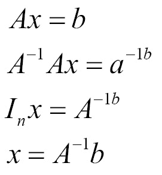

# 第一章：神经网络的数学

神经网络用户需要对神经网络的概念、算法及其背后的数学有一定的了解。良好的数学直觉和对多种技术的理解对于深入掌握算法的内部运作并获得良好的结果是必要的。理解这些技术所需的数学量及数学水平是多维度的，并且也取决于兴趣。在本章中，你将通过理解用于解决复杂计算问题的数学，来学习神经网络。本章涵盖了神经网络所需的线性代数、微积分和优化的基础知识。

本章的主要目的是为接下来的章节设置数学基础。

本章将涵盖以下主题：

+   理解线性代数

+   理解微积分

+   优化

# 理解线性代数

线性代数是数学的一个重要分支。理解线性代数对于**深度学习**（即神经网络）至关重要。在本章中，我们将介绍线性代数的关键基础知识。线性代数处理线性方程组。我们不再只处理标量，而是开始处理矩阵和向量。通过线性代数，我们可以描述深度学习中的复杂运算。

# 环境设置

在我们深入研究数学及其性质之前，设置开发环境至关重要，因为它将为我们提供执行所学概念所需的设置，意味着安装编译器、依赖项以及**IDE**（**集成开发环境**）来运行我们的代码库。

# 在 Pycharm 中设置 Python 环境

最好使用像 Pycharm 这样的集成开发环境（IDE）来编辑 Python 代码，因为它提供了开发工具和内置的代码辅助功能。代码检查使编码和调试变得更快、更简便，确保你能专注于学习神经网络所需的数学知识这一最终目标。

以下步骤展示了如何在 Pycharm 中设置本地 Python 环境：

1.  转到首选项，验证 TensorFlow 库是否已安装。如果没有，请按照[`www.tensorflow.org/install/`](https://www.tensorflow.org/install/)上的说明安装 TensorFlow：


1.  保持 TensorFlow 的默认选项并点击确定。

1.  最后，右键点击源文件并点击运行 'matrices'：


# 线性代数结构

在接下来的部分，我们将描述线性代数的基本结构。

# 标量、向量和矩阵

标量、向量和矩阵是数学中的基本对象。基本定义如下：

+   标量是通过一个称为**大小**的单一数字或数值来表示的。

+   向量是按顺序排列的数字数组。每个数字都有一个唯一的索引来标识。向量表示空间中的一个点，每个元素给出了沿不同轴的坐标。

+   矩阵是一个二维数字数组，其中每个数字通过两个索引（*i*、*j*）来标识。

# 张量

拥有可变数量轴的数字数组称为**张量**。例如，对于三个轴，它通过三个索引（*i*、*j*、*k*）来标识。

以下图像总结了一个张量，描述了一个二阶张量对象。在三维笛卡尔坐标系中，张量的分量将形成矩阵：


图片参考来自张量维基 [`en.wikipedia.org/wiki/Tensor`](https://en.wikipedia.org/wiki/Tensor)

# 操作

以下主题将描述线性代数的各种操作。

# 向量

`Norm`函数用于获取向量的大小；向量*x*的范数衡量了从原点到点*x*的距离。它也被称为 范数，其中*p=2* 被称为**欧几里得范数**。

以下示例展示了如何计算给定向量的 范数：

```py
import tensorflow as tf

vector = tf.constant([[4,5,6]], dtype=tf.float32)
eucNorm = tf.norm(vector, ord="euclidean")

with tf.Session() as sess:
print(sess.run(eucNorm))
```

列表的输出为 8.77496。

# 矩阵

矩阵是一个二维的数字数组，其中每个元素由两个索引标识，而不仅仅是一个。如果一个实数矩阵*X*的高度为*m*，宽度为*n*，则我们说*X ∈ Rm × n*。这里的*R*是实数集。

以下示例展示了如何将不同的矩阵转换为张量对象：

```py
# convert matrices to tensor objects
import numpy as np
import tensorflow as tf

# create a 2x2 matrix in various forms
matrix1 = [[1.0, 2.0], [3.0, 40]]
matrix2 = np.array([[1.0, 2.0], [3.0, 40]], dtype=np.float32)
matrix3 = tf.constant([[1.0, 2.0], [3.0, 40]])

print(type(matrix1))
print(type(matrix2))
print(type(matrix3))

tensorForM1 = tf.convert_to_tensor(matrix1, dtype=tf.float32)
tensorForM2 = tf.convert_to_tensor(matrix2, dtype=tf.float32)
tensorForM3 = tf.convert_to_tensor(matrix3, dtype=tf.float32)

print(type(tensorForM1))
print(type(tensorForM2))
print(type(tensorForM3))
```

列表的输出如下所示：

```py
<class 'list'>
<class 'numpy.ndarray'>
<class 'tensorflow.python.framework.ops.Tensor'>
<class 'tensorflow.python.framework.ops.Tensor'>
<class 'tensorflow.python.framework.ops.Tensor'>
<class 'tensorflow.python.framework.ops.Tensor'>
```

# 矩阵乘法

矩阵*A*和矩阵*B*的矩阵乘法是第三个矩阵*C*：

*C = AB*

矩阵的逐元素积称为**哈达玛积**，表示为*A.B*。

两个维度相同的向量*x*和*y*的点积是矩阵乘积*x*转置*y*。矩阵乘积*C = AB*就像计算*C[i,j]*，即矩阵*A*的第*i*行与矩阵*B*的第*j*列的点积：


以下示例展示了使用张量对象的哈达玛积和点积：

```py
import tensorflow as tf

mat1 = tf.constant([[4, 5, 6],[3,2,1]])
mat2 = tf.constant([[7, 8, 9],[10, 11, 12]])

*# hadamard product (element wise)* mult = tf.multiply(mat1, mat2)

*# dot product (no. of rows = no. of columns)* dotprod = tf.matmul(mat1, tf.transpose(mat2))

with tf.Session() as sess:
    print(sess.run(mult))
    print(sess.run(dotprod))
```

列表的输出如下所示：

```py
[[28 40 54][30 22 12]]
 [[122 167][ 46 64]]
```

# 迹操作符

矩阵*A*的迹操作符*Tr(A)*给出矩阵所有对角线元素的和。以下示例展示了如何在张量对象上使用迹操作符：

```py
import tensorflow as tf

mat = tf.constant([
 [0, 1, 2],
 [3, 4, 5],
 [6, 7, 8]
], dtype=tf.float32)

 *# get trace ('sum of diagonal elements') of the matrix* mat = tf.trace(mat)

 with tf.Session() as sess:
    print(sess.run(mat))
```

列表的输出为*12.0*。

# 矩阵转置

矩阵的转置是矩阵沿主对角线的镜像。对称矩阵是任何等于其自身转置的矩阵：


以下示例展示了如何在张量对象上使用转置操作符：

```py
import tensorflow as tf

x = [[1,2,3],[4,5,6]]
x = tf.convert_to_tensor(x)
xtrans = tf.transpose(x)

y=([[[1,2,3],[6,5,4]],[[4,5,6],[3,6,3]]])
y = tf.convert_to_tensor(y)
ytrans = tf.transpose(y, perm=[0, 2, 1])

with tf.Session() as sess:
   print(sess.run(xtrans))
   print(sess.run(ytrans))
```

列表的输出如下所示：

```py
[[1 4] [2 5] [3 6]]
```

# 矩阵对角线

对角矩阵通常由零组成，只有主对角线上的元素非零。并非所有对角矩阵都必须是方阵。

使用对角部分操作，我们可以获得给定矩阵的对角线，为了创建一个具有给定对角线的矩阵，我们可以使用 `tensorflow` 的 `diag` 操作。以下示例展示了如何在张量对象上使用对角操作：

```py
import tensorflow as tf

mat = tf.constant([
 [0, 1, 2],
 [3, 4, 5],
 [6, 7, 8]
], dtype=tf.float32)

*# get diagonal of the matrix* diag_mat = tf.diag_part(mat)

*# create matrix with given diagonal* mat = tf.diag([1,2,3,4])

with tf.Session() as sess:
   print(sess.run(diag_mat))
   print(sess.run(mat))
```

输出结果如下所示：

```py
[ 0\.  4\.  8.]
[[1 0 0 0][0 2 0 0] [0 0 3 0] [0 0 0 4]]
```

# 单位矩阵

单位矩阵是一个矩阵 *I*，它在与任何向量相乘时不会改变该向量，例如 *V*，当与 *I* 相乘时。

以下示例展示了如何为给定大小计算单位矩阵：

```py
import tensorflow as tf

identity = tf.eye(3, 3)

with tf.Session() as sess:
   print(sess.run(identity))  
```

输出结果如下所示：

```py
[[ 1\.  0\.  0.] [ 0\.  1\.  0.] [ 0\.  0\.  1.]]
```

# 逆矩阵

*I* 的矩阵逆表示为 。考虑以下方程式；使用逆矩阵和不同的 *b* 值来求解时，*x* 可以有多个解。请注意以下性质：


****

以下示例展示了如何使用 `matrix_inverse` 操作计算矩阵的逆：

```py
import tensorflow as tf

mat = tf.constant([[2, 3, 4], [5, 6, 7], [8, 9, 10]], dtype=tf.float32)
print(mat)

inv_mat = tf.matrix_inverse(tf.transpose(mat))

with tf.Session() as sess:
print(sess.run(inv_mat))
```

# 求解线性方程

TensorFlow 可以使用 `solve` 操作求解一系列线性方程。我们首先解释不使用库的情况，然后再使用 `solve` 函数。

一个线性方程的表示如下：

*ax + b = yy - ax = b*

*y - ax = b*

*y/b - a/b(x) = 1*

我们的任务是根据观察到的点来求解前述方程中的 *a* 和 *b* 值。首先，创建矩阵点。第一列表示 *x* 值，第二列表示 *y* 值。

假设 *X* 是输入矩阵，*A* 是我们需要学习的参数；我们设立一个类似于 *AX=B* 的系统，因此， 。

以下示例通过代码展示了如何求解线性方程：

*3x+2y = 15*

*4x−y = 10*

```py
import tensorflow as tf

# equation 1
x1 = tf.constant(3, dtype=tf.float32)
y1 = tf.constant(2, dtype=tf.float32)
point1 = tf.stack([x1, y1])

# equation 2
x2 = tf.constant(4, dtype=tf.float32)
y2 = tf.constant(-1, dtype=tf.float32)
point2 = tf.stack([x2, y2])

# solve for AX=C
X = tf.transpose(tf.stack([point1, point2]))
C = tf.ones((1,2), dtype=tf.float32)

A = tf.matmul(C, tf.matrix_inverse(X))

with tf.Session() as sess:
    X = sess.run(X)
    print(X)

    A = sess.run(A)
    print(A)

b = 1 / A[0][1]
a = -b * A[0][0]
print("Hence Linear Equation is: y = {a}x + {b}".format(a=a, b=b))
```

列表的输出结果如下所示：

```py
[[ 3\. 4.][ 2\. -1.]]
 [[ 0.27272728 0.09090909]]
Hence Linear Equation is: y = -2.9999999999999996x + 10.999999672174463
```

圆的标准方程是 *x2+y2+dx+ey+f=0*；为了求解其中的参数 *d*、*e* 和 *f*，我们使用 TensorFlow 的 solve 操作，如下所示：

```py
# canonical circle equation
# x2+y2+dx+ey+f = 0
# dx+ey+f=−(x2+y2) ==> AX = B
# we have to solve for d, e, f

points = tf.constant([[2,1], [0,5], [-1,2]], dtype=tf.float64)
X = tf.constant([[2,1,1], [0,5,1], [-1,2,1]], dtype=tf.float64)
B = -tf.constant([[5], [25], [5]], dtype=tf.float64)

A = tf.matrix_solve(X,B)

with tf.Session() as sess:
    result = sess.run(A)
    D, E, F = result.flatten()
    print("Hence Circle Equation is: x**2 + y**2 + {D}x + {E}y + {F} = 0".format(**locals()))
```

列表的输出结果如下所示：

```py
Hence Circle Equation is: x**2 + y**2 + -2.0x + -6.0y + 5.0 = 0
```

# 奇异值分解

当我们将一个整数分解为它的质因数时，我们可以了解该整数的一些有用性质。同样，当我们分解一个矩阵时，我们也能理解许多并非直接显现的功能性属性。矩阵有两种分解方式，分别是特征值分解和奇异值分解。

所有实数矩阵都有奇异值分解，但特征值分解则并非所有矩阵都适用。例如，如果一个矩阵不是方阵，那么特征值分解就不可定义，我们必须使用奇异值分解。

**奇异值分解** (**SVD**) 在数学形式上是三个矩阵 *U*、*S* 和 *V* 的乘积，其中 *U* 是 *m*r*，*S* 是 *r*r*，*V* 是 *r*n*：


以下示例展示了使用 TensorFlow `svd`操作对文本数据进行 SVD：

```py
import numpy as np
import tensorflow as tf
import matplotlib.pyplot as plts

path = "/neuralnetwork-programming/ch01/plots"

text = ["I", "like", "enjoy",
         "deep", "learning", "NLP", "flying", "."]
xMatrix = np.array([[0,2,1,0,0,0,0,0],
              [2,0,0,1,0,1,0,0],
              [1,0,0,0,0,0,1,0],
              [0,1,0,0,1,0,0,0],
              [0,0,0,1,0,0,0,1],
              [0,1,0,0,0,0,0,1],
              [0,0,1,0,0,0,0,1],
              [0,0,0,0,1,1,1,0]], dtype=np.float32)

X_tensor = tf.convert_to_tensor(xMatrix, dtype=tf.float32)

# tensorflow svd
with tf.Session() as sess:
    s, U, Vh = sess.run(tf.svd(X_tensor, full_matrices=False))

for i in range(len(text)):
    plts.text(U[i,0], U[i,1], text[i])

plts.ylim(-0.8,0.8)
plts.xlim(-0.8,2.0)
plts.savefig(path + '/svd_tf.png')

# numpy svd
la = np.linalg
U, s, Vh = la.svd(xMatrix, full_matrices=False)

print(U)
print(s)
print(Vh)

# write matrices to file (understand concepts)
file = open(path + "/matx.txt", 'w')
file.write(str(U))
file.write("\n")
file.write("=============")
file.write("\n")
file.write(str(s))
file.close()

for i in range(len(text)):
    plts.text(U[i,0], U[i,1], text[i])

plts.ylim(-0.8,0.8)
plts.xlim(-0.8,2.0)
plts.savefig(path + '/svd_np.png')
```

该输出如下所示：

```py
[[ -5.24124920e-01  -5.72859168e-01   9.54463035e-02   3.83228481e-01   -1.76963374e-01  -1.76092178e-01  -4.19185609e-01  -5.57702743e-02]
[ -5.94438076e-01   6.30120635e-01  -1.70207784e-01   3.10038358e-0
 1.84062332e-01  -2.34777853e-01   1.29535481e-01   1.36813134e-01]
[ -2.56274015e-01   2.74017543e-01   1.59810841e-01   3.73903001e-16
  -5.78984618e-01   6.36550903e-01  -3.32297325e-16  -3.05414885e-01]
[ -2.85637408e-01  -2.47912124e-01   3.54610324e-01  -7.31901303e-02
  4.45784479e-01   8.36141407e-02   5.48721075e-01  -4.68012422e-01]
[ -1.93139315e-01   3.38495038e-02  -5.00790417e-01  -4.28462476e-01
 3.47110212e-01   1.55483231e-01  -4.68663752e-01  -4.03576553e-01]
[ -3.05134684e-01  -2.93989003e-01  -2.23433599e-01  -1.91614240e-01
 1.27460942e-01   4.91219401e-01   2.09592804e-01   6.57535374e-01]
[ -1.82489842e-01  -1.61027774e-01  -3.97842437e-01  -3.83228481e-01
 -5.12923241e-01  -4.27574426e-01   4.19185609e-01  -1.18313827e-01]
[ -2.46898428e-01   1.57254755e-01   5.92991650e-01  -6.20076716e-01
 -3.21868137e-02  -2.31065080e-01  -2.59070963e-01   2.37976909e-01]]
[ 2.75726271  2.67824793  1.89221275  1.61803401  1.19154561  0.94833982
 0.61803401  0.56999218]
[[ -5.24124920e-01  -5.94438076e-01  -2.56274015e-01  -2.85637408e-01
 -1.93139315e-01  -3.05134684e-01  -1.82489842e-01  -2.46898428e-01]
[  5.72859168e-01  -6.30120635e-01  -2.74017543e-01   2.47912124e-01
 -3.38495038e-02   2.93989003e-01   1.61027774e-01  -1.57254755e-01]
[ -9.54463035e-02   1.70207784e-01  -1.59810841e-01  -3.54610324e-01
 5.00790417e-01   2.23433599e-01   3.97842437e-01  -5.92991650e-01]
[  3.83228481e-01   3.10038358e-01  -2.22044605e-16  -7.31901303e-02
 -4.28462476e-01  -1.91614240e-01  -3.83228481e-01  -6.20076716e-01]
[ -1.76963374e-01   1.84062332e-01  -5.78984618e-01   4.45784479e-01
 3.47110212e-01   1.27460942e-01  -5.12923241e-01  -3.21868137e-02]
[  1.76092178e-01   2.34777853e-01  -6.36550903e-01  -8.36141407e-02
 -1.55483231e-01  -4.91219401e-01   4.27574426e-01   2.31065080e-01]
[  4.19185609e-01  -1.29535481e-01  -3.33066907e-16  -5.48721075e-01
  4.68663752e-01  -2.09592804e-01  -4.19185609e-01   2.59070963e-01]
[ -5.57702743e-02   1.36813134e-01  -3.05414885e-01  -4.68012422e-01
 -4.03576553e-01   6.57535374e-01  -1.18313827e-01   2.37976909e-01]]
```

下面是前述数据集的 SVD 图示：


# 特征值分解

特征值分解是最著名的分解技术之一，我们将矩阵分解为一组特征向量和特征值。

对于方阵，特征向量* v *是一个向量，使得乘以* A *后只改变* v *的尺度：

*Av = λv*

标量* λ *称为与此特征向量对应的特征值。

矩阵* A *的特征值分解如下所示：


矩阵的特征值分解描述了许多关于矩阵的有用细节。例如，当且仅当任何特征值为零时，矩阵是奇异的。

# 主成分分析

**主成分分析**（**PCA**）将给定的数据集投影到一个低维线性空间，以使得投影数据的方差最大化。PCA 需要协方差矩阵的特征值和特征向量，协方差矩阵是* X *的乘积，其中* X *是数据矩阵。

对数据矩阵* X *进行的 SVD 如下所示：


以下示例展示了使用 SVD 进行 PCA：

```py
import numpy as np
import tensorflow as tf
import matplotlib.pyplot as plt
import plotly.plotly as py
import plotly.graph_objs as go
import plotly.figure_factory as FF
import pandas as pd

path = "/neuralnetwork-programming/ch01/plots"
logs = "/neuralnetwork-programming/ch01/logs"

xMatrix = np.array([[0,2,1,0,0,0,0,0],
              [2,0,0,1,0,1,0,0],
              [1,0,0,0,0,0,1,0],
              [0,1,0,0,1,0,0,0],
              [0,0,0,1,0,0,0,1],
              [0,1,0,0,0,0,0,1],
              [0,0,1,0,0,0,0,1],
              [0,0,0,0,1,1,1,0]], dtype=np.float32)

def pca(mat):
    mat = tf.constant(mat, dtype=tf.float32)
    mean = tf.reduce_mean(mat, 0)
    less = mat - mean
    s, u, v = tf.svd(less, full_matrices=True, compute_uv=True)

    s2 = s ** 2
    variance_ratio = s2 / tf.reduce_sum(s2)

    with tf.Session() as session:
        run = session.run([variance_ratio])
    return run

if __name__ == '__main__':
    print(pca(xMatrix))
```

列表的输出如下所示：

```py
[array([  4.15949494e-01,   2.08390564e-01,   1.90929279e-01,
         8.36438537e-02,   5.55494241e-02,   2.46047471e-02,
         2.09326427e-02,   3.57540098e-16], dtype=float32)]
```

# 微积分

前几节中的主题涵盖了标准线性代数的内容；但未涉及的是基础微积分。尽管我们使用的微积分相对简单，但其数学形式可能看起来非常复杂。本节将介绍一些矩阵微积分的基本形式，并附有几个例子。

# 梯度

函数关于实值矩阵* A *的梯度定义为* A *的偏导数矩阵，表示如下：


TensorFlow 不进行数值微分，而是支持自动微分。通过在 TensorFlow 图中指定操作，它可以自动在图中运行链式法则，并且由于它知道我们指定的每个操作的导数，因此能够自动将它们组合起来。

以下示例展示了使用 MNIST 数据训练网络，MNIST 数据库由手写数字组成。它有一个包含 60,000 个样本的训练集和一个包含 10,000 个样本的测试集。数字已进行尺寸归一化。

这里执行了反向传播，没有使用任何 API，并且导数是手动计算的。我们在 1,000 次测试中获得了 913 个正确结果。这个概念将在下一章介绍。

```py
mnist dataset and initialize weights and biases:
```

```py
import tensorflow as tf

# get mnist dataset
from tensorflow.examples.tutorials.mnist import input_data
data = input_data.read_data_sets("MNIST_data/", one_hot=True)

# x represents image with 784 values as columns (28*28), y represents output digit
x = tf.placeholder(tf.float32, [None, 784])
y = tf.placeholder(tf.float32, [None, 10])

# initialize weights and biases [w1,b1][w2,b2]
numNeuronsInDeepLayer = 30
w1 = tf.Variable(tf.truncated_normal([784, numNeuronsInDeepLayer]))
b1 = tf.Variable(tf.truncated_normal([1, numNeuronsInDeepLayer]))
w2 = tf.Variable(tf.truncated_normal([numNeuronsInDeepLayer, 10]))
b2 = tf.Variable(tf.truncated_normal([1, 10]))
```

现在我们定义一个具有非线性`sigmoid`函数的两层网络；应用平方损失函数并使用反向传播算法进行优化，如下所示：

```py
# non-linear sigmoid function at each neuron
def sigmoid(x):
    sigma = tf.div(tf.constant(1.0), tf.add(tf.constant(1.0), tf.exp(tf.negative(x))))
    return sigma

# starting from first layer with wx+b, then apply sigmoid to add non-linearity
z1 = tf.add(tf.matmul(x, w1), b1)
a1 = sigmoid(z1)
z2 = tf.add(tf.matmul(a1, w2), b2)
a2 = sigmoid(z2)

# calculate the loss (delta)
loss = tf.subtract(a2, y)

# derivative of the sigmoid function der(sigmoid)=sigmoid*(1-sigmoid)
def sigmaprime(x):
    return tf.multiply(sigmoid(x), tf.subtract(tf.constant(1.0), sigmoid(x)))

# backward propagation
dz2 = tf.multiply(loss, sigmaprime(z2))
db2 = dz2
dw2 = tf.matmul(tf.transpose(a1), dz2)

da1 = tf.matmul(dz2, tf.transpose(w2))
dz1 = tf.multiply(da1, sigmaprime(z1))
db1 = dz1
dw1 = tf.matmul(tf.transpose(x), dz1)

# finally update the network
eta = tf.constant(0.5)
step = [
    tf.assign(w1,
              tf.subtract(w1, tf.multiply(eta, dw1)))
    , tf.assign(b1,
                tf.subtract(b1, tf.multiply(eta,
                                             tf.reduce_mean(db1, axis=[0]))))
    , tf.assign(w2,
                tf.subtract(w2, tf.multiply(eta, dw2)))
    , tf.assign(b2,
                tf.subtract(b2, tf.multiply(eta,
                                             tf.reduce_mean(db2, axis=[0]))))
]

acct_mat = tf.equal(tf.argmax(a2, 1), tf.argmax(y, 1))
acct_res = tf.reduce_sum(tf.cast(acct_mat, tf.float32))

sess = tf.InteractiveSession()
sess.run(tf.global_variables_initializer())

for i in range(10000):
    batch_xs, batch_ys = data.train.next_batch(10)
    sess.run(step, feed_dict={x: batch_xs,
                              y: batch_ys})
    if i % 1000 == 0:
        res = sess.run(acct_res, feed_dict=
        {x: data.test.images[:1000],
         y: data.test.labels[:1000]})
        print(res)
```

该输出如下所示：

```py
Extracting MNIST_data
125.0
814.0
870.0
874.0
889.0
897.0
906.0
903.0
922.0
913.0
```

现在，让我们使用 TensorFlow 进行自动微分。以下示例展示了使用 `GradientDescentOptimizer`。我们在 1,000 次测试中得到了 924 次正确的结果。

```py
import tensorflow as tf

# get mnist dataset
from tensorflow.examples.tutorials.mnist import input_data
data = input_data.read_data_sets("MNIST_data/", one_hot=True)

# x represents image with 784 values as columns (28*28), y represents output digit
x = tf.placeholder(tf.float32, [None, 784])
y = tf.placeholder(tf.float32, [None, 10])

# initialize weights and biases [w1,b1][w2,b2]
numNeuronsInDeepLayer = 30
w1 = tf.Variable(tf.truncated_normal([784, numNeuronsInDeepLayer]))
b1 = tf.Variable(tf.truncated_normal([1, numNeuronsInDeepLayer]))
w2 = tf.Variable(tf.truncated_normal([numNeuronsInDeepLayer, 10]))
b2 = tf.Variable(tf.truncated_normal([1, 10]))

# non-linear sigmoid function at each neuron
def sigmoid(x):
    sigma = tf.div(tf.constant(1.0), tf.add(tf.constant(1.0), tf.exp(tf.negative(x))))
    return sigma

# starting from first layer with wx+b, then apply sigmoid to add non-linearity
z1 = tf.add(tf.matmul(x, w1), b1)
a1 = sigmoid(z1)
z2 = tf.add(tf.matmul(a1, w2), b2)
a2 = sigmoid(z2)

# calculate the loss (delta)
loss = tf.subtract(a2, y)

# derivative of the sigmoid function der(sigmoid)=sigmoid*(1-sigmoid)
def sigmaprime(x):
    return tf.multiply(sigmoid(x), tf.subtract(tf.constant(1.0), sigmoid(x)))

# automatic differentiation
cost = tf.multiply(loss, loss)
step = tf.train.GradientDescentOptimizer(0.1).minimize(cost)

acct_mat = tf.equal(tf.argmax(a2, 1), tf.argmax(y, 1))
acct_res = tf.reduce_sum(tf.cast(acct_mat, tf.float32))

sess = tf.InteractiveSession()
sess.run(tf.global_variables_initializer())

for i in range(10000):
    batch_xs, batch_ys = data.train.next_batch(10)
    sess.run(step, feed_dict={x: batch_xs,
                              y: batch_ys})
    if i % 1000 == 0:
        res = sess.run(acct_res, feed_dict=
        {x: data.test.images[:1000],
         y: data.test.labels[:1000]})
        print(res)
```

其输出如下所示：

```py
96.0
 777.0
 862.0
 870.0
 889.0
 901.0
 911.0
 905.0
 914.0
 924.0
```

以下示例展示了使用梯度下降的线性回归：

```py
import tensorflow as tf
import numpy
import matplotlib.pyplot as plt
rndm = numpy.random

# config parameters
learningRate = 0.01
trainingEpochs = 1000
displayStep = 50

# create the training data
trainX = numpy.asarray([3.3,4.4,5.5,6.71,6.93,4.168,9.779,6.182,7.59,2.167,
                         7.042,10.791,5.313,7.997,5.654,9.27,3.12])
trainY = numpy.asarray([1.7,2.76,2.09,3.19,1.694,1.573,3.366,2.596,2.53,1.221,
                         2.827,3.465,1.65,2.904,2.42,2.94,1.34])
nSamples = trainX.shape[0]

# tf inputs
X = tf.placeholder("float")
Y = tf.placeholder("float")

# initialize weights and bias
W = tf.Variable(rndm.randn(), name="weight")
b = tf.Variable(rndm.randn(), name="bias")

# linear model
linearModel = tf.add(tf.multiply(X, W), b)

# mean squared error
loss = tf.reduce_sum(tf.pow(linearModel-Y, 2))/(2*nSamples)

# Gradient descent
opt = tf.train.GradientDescentOptimizer(learningRate).minimize(loss)

# initializing variables
init = tf.global_variables_initializer()

# run
with tf.Session() as sess:
    sess.run(init)

    # fitting the training data
    for epoch in range(trainingEpochs):
        for (x, y) in zip(trainX, trainY):
            sess.run(opt, feed_dict={X: x, Y: y})

        # print logs
        if (epoch+1) % displayStep == 0:
            c = sess.run(loss, feed_dict={X: trainX, Y:trainY})
            print("Epoch is:", '%04d' % (epoch+1), "loss=", "{:.9f}".format(c), "W=", sess.run(W), "b=", sess.run(b))

    print("optimization done...")
    trainingLoss = sess.run(loss, feed_dict={X: trainX, Y: trainY})
    print("Training loss=", trainingLoss, "W=", sess.run(W), "b=", sess.run(b), '\n')

    # display the plot
    plt.plot(trainX, trainY, 'ro', label='Original data')
    plt.plot(trainX, sess.run(W) * trainX + sess.run(b), label='Fitted line')
    plt.legend()
    plt.show()

    # Testing example, as requested (Issue #2)
    testX = numpy.asarray([6.83, 4.668, 8.9, 7.91, 5.7, 8.7, 3.1, 2.1])
    testY = numpy.asarray([1.84, 2.273, 3.2, 2.831, 2.92, 3.24, 1.35, 1.03])

    print("Testing... (Mean square loss Comparison)")
    testing_cost = sess.run(
        tf.reduce_sum(tf.pow(linearModel - Y, 2)) / (2 * testX.shape[0]),
        feed_dict={X: testX, Y: testY})
    print("Testing cost=", testing_cost)
    print("Absolute mean square loss difference:", abs(trainingLoss - testing_cost))

    plt.plot(testX, testY, 'bo', label='Testing data')
    plt.plot(trainX, sess.run(W) * trainX + sess.run(b), label='Fitted line')
    plt.legend()
    plt.show()
```

其输出如下所示：

```py
Epoch is: 0050 loss= 0.141912043 W= 0.10565 b= 1.8382
 Epoch is: 0100 loss= 0.134377643 W= 0.11413 b= 1.7772
 Epoch is: 0150 loss= 0.127711013 W= 0.122106 b= 1.71982
 Epoch is: 0200 loss= 0.121811897 W= 0.129609 b= 1.66585
 Epoch is: 0250 loss= 0.116592340 W= 0.136666 b= 1.61508
 Epoch is: 0300 loss= 0.111973859 W= 0.143304 b= 1.56733
 Epoch is: 0350 loss= 0.107887231 W= 0.149547 b= 1.52241
 Epoch is: 0400 loss= 0.104270980 W= 0.15542 b= 1.48017
 Epoch is: 0450 loss= 0.101070963 W= 0.160945 b= 1.44043
 Epoch is: 0500 loss= 0.098239250 W= 0.166141 b= 1.40305
 Epoch is: 0550 loss= 0.095733419 W= 0.171029 b= 1.36789
 Epoch is: 0600 loss= 0.093516059 W= 0.175626 b= 1.33481
 Epoch is: 0650 loss= 0.091553882 W= 0.179951 b= 1.3037
 Epoch is: 0700 loss= 0.089817807 W= 0.184018 b= 1.27445
 Epoch is: 0750 loss= 0.088281371 W= 0.187843 b= 1.24692
 Epoch is: 0800 loss= 0.086921677 W= 0.191442 b= 1.22104
 Epoch is: 0850 loss= 0.085718453 W= 0.194827 b= 1.19669
 Epoch is: 0900 loss= 0.084653646 W= 0.198011 b= 1.17378
 Epoch is: 0950 loss= 0.083711281 W= 0.201005 b= 1.15224
 Epoch is: 1000 loss= 0.082877308 W= 0.203822 b= 1.13198
 optimization done...
 Training loss= 0.0828773 W= 0.203822 b= 1.13198
Testing... (Mean square loss Comparison)
 Testing cost= 0.0957726
 Absolute mean square loss difference: 0.0128952
```

图表如下：


下图展示了使用模型在测试数据上的拟合曲线：


# Hessian

梯度是向量函数的第一导数，而 Hessian 是第二导数。我们现在来讲解一下符号表示：


与梯度类似，Hessian 仅在 *f(x)* 是实值时才定义。

使用的代数函数是 。

以下示例展示了使用 TensorFlow 实现 Hessian：

```py
import tensorflow as tf
import numpy as np

X = tf.Variable(np.random.random_sample(), dtype=tf.float32)
y = tf.Variable(np.random.random_sample(), dtype=tf.float32)

def createCons(x):
    return tf.constant(x, dtype=tf.float32)

function = tf.pow(X, createCons(2)) + createCons(2) * X * y + createCons(3) * tf.pow(y, createCons(2)) + createCons(4) * X + createCons(5) * y + createCons(6)

# compute hessian
def hessian(func, varbles):
    matrix = []
    for v_1 in varbles:
        tmp = []
        for v_2 in varbles:
            # calculate derivative twice, first w.r.t v2 and then w.r.t v1
            tmp.append(tf.gradients(tf.gradients(func, v_2)[0], v_1)[0])
        tmp = [createCons(0) if t == None else t for t in tmp]
        tmp = tf.stack(tmp)
        matrix.append(tmp)
    matrix = tf.stack(matrix)
    return matrix

hessian = hessian(function, [X, y])

sess = tf.Session()
sess.run(tf.initialize_all_variables())
print(sess.run(hessian))
```

其输出如下所示：

```py
 [[ 2\.  2.] [ 2\.  6.]]
```

# 行列式

行列式为我们提供了关于矩阵的信息，这在求解线性方程和寻找矩阵的逆矩阵时非常有用。

对于给定的矩阵 *X*，行列式如下所示：


以下示例展示了如何使用 TensorFlow 获取行列式：

```py
import tensorflow as tf
import numpy as np

x = np.array([[10.0, 15.0, 20.0], [0.0, 1.0, 5.0], [3.0, 5.0, 7.0]], dtype=np.float32)

det = tf.matrix_determinant(x)

with tf.Session() as sess:
    print(sess.run(det))
```

其输出如下所示：

```py
-15.0
```

# 优化

作为深度学习的一部分，我们通常希望优化一个函数的值，使其最小化或最大化 *f(x)* 相对于 *x*。一些优化问题的例子包括最小二乘法、逻辑回归和支持向量机。许多这些技术将在后续章节中详细讨论。

# 优化器

我们将在这里研究 `AdamOptimizer`；TensorFlow `AdamOptimizer` 使用 Kingma 和 Ba 的 Adam 算法来管理学习率。Adam 相较于简单的 `GradientDescentOptimizer` 有许多优点。首先，它使用参数的移动平均，这使得 Adam 可以使用较大的步长，并且能够在没有精细调整的情况下收敛到该步长。

Adam 的缺点是它需要为每个训练步骤中的每个参数执行更多的计算。`GradientDescentOptimizer` 也可以使用，但它需要更多的超参数调优，才能更快地收敛。

以下示例展示了如何使用 `AdamOptimizer`：

+   `tf.train.Optimizer` 创建一个优化器

+   `tf.train.Optimizer.minimize(loss, var_list)` 将优化操作添加到计算图中

这里，自动微分计算梯度时不需要用户输入：

```py
import numpy as np
import seaborn
import matplotlib.pyplot as plt
import tensorflow as tf

# input dataset
xData = np.arange(100, step=.1)
yData = xData + 20 * np.sin(xData/10)

# scatter plot for input data
plt.scatter(xData, yData)
plt.show()

# defining data size and batch size
nSamples = 1000
batchSize = 100

# resize
xData = np.reshape(xData, (nSamples,1))
yData = np.reshape(yData, (nSamples,1))

# input placeholders
x = tf.placeholder(tf.float32, shape=(batchSize, 1))
y = tf.placeholder(tf.float32, shape=(batchSize, 1))

# init weight and bias
with tf.variable_scope("linearRegression"):
 W = tf.get_variable("weights", (1, 1), initializer=tf.random_normal_initializer())
 b = tf.get_variable("bias", (1,), initializer=tf.constant_initializer(0.0))

 y_pred = tf.matmul(x, W) + b
 loss = tf.reduce_sum((y - y_pred)**2/nSamples)

# optimizer
opt = tf.train.AdamOptimizer().minimize(loss)
with tf.Session() as sess:
    sess.run(tf.global_variables_initializer())

    # gradient descent loop for 500 steps
    for _ in range(500):
     # random minibatch
     indices = np.random.choice(nSamples, batchSize)

     X_batch, y_batch = xData[indices], yData[indices]

     # gradient descent step
     _, loss_val = sess.run([opt, loss], feed_dict={x: X_batch, y: y_batch})
```

这是数据集的散点图：


这是在数据上学习到的模型的图示：


# 总结

在本章中，我们介绍了理解神经网络所需的数学概念，并回顾了与张量相关的一些数学内容。我们还展示了如何在 TensorFlow 中执行数学运算。在接下来的章节中，我们将反复应用这些概念。
