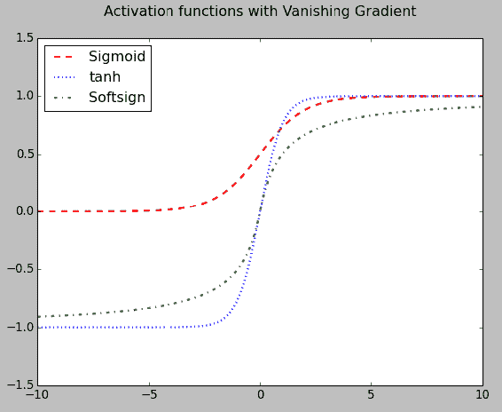

# 第二章：深度前馈网络

在第一章中，你学习了驱动各种神经网络背后逻辑的数学知识。在本章中，我们将重点讨论最基本的神经网络——**前馈神经网络**。我们还将研究具有多个隐藏层的深度前馈网络，以提高模型的准确性。

我们将涵盖以下主题：

+   定义前馈网络

+   理解反向传播

+   在 TensorFlow 中实现前馈网络

+   分析鸢尾花数据集

+   创建用于图像分类的前馈网络

# 定义前馈网络

深度前馈网络，也称为前馈神经网络，有时也被称为**多层感知机**（**MLPs**）。前馈网络的目标是逼近 *f∗* 的函数。例如，对于一个分类器，*y = f∗(x)* 将输入 *x* 映射到标签 *y*。前馈网络定义了从输入到标签的映射 *y = f(x;θ)*。它学习参数 *θ* 的值，以得到最佳的函数逼近。

我们在第五章中讨论了 RNN，*递归神经网络*。前馈网络是递归网络的概念性基石，后者驱动了许多自然语言应用。前馈神经网络之所以被称为网络，是因为它们由许多不同的函数组合而成，这些函数在有向无环图中被组合在一起。

该模型与一个有向无环图相关联，描述了函数如何组合在一起。例如，有三个函数 *f(1)*、*f(2)* 和 *f(3)*，它们组合成 *f(x) = f(3)(f(2)(f(1)(x)))*。这些链式结构是神经网络中最常用的结构。在这种情况下，*f(1)* 被称为**第一层**，*f(2)* 被称为**第二层**，以此类推。链的整体长度给出了模型的深度。正是这个术语产生了“深度学习”这个名字。前馈网络的最后一层被称为**输出层**。


图示展示了在输入 x 上激活的各种函数，形成一个神经网络

这些网络被称为神经网络，因为它们受到神经科学的启发。每一层隐藏层是一个向量，这些隐藏层的维度决定了模型的宽度。

# 理解反向传播

当使用前馈神经网络接受输入 *x* 并生成输出 *yˆ* 时，信息通过网络元素向前流动。输入 *x* 提供信息，接着传播到每一层的隐藏单元，并产生 *yˆ*。这叫做 **前向传播**。在训练过程中，前向传播一直持续，直到产生一个标量成本 *J(θ)*。反向传播算法，通常称为反向传播，允许成本的信息然后向后流经网络，从而计算梯度。

计算梯度的解析表达式很简单，但数值计算该表达式可能非常耗费计算资源。反向传播算法通过一种简单且廉价的过程实现这一点。

反向传播仅指计算梯度的方法，而另一种算法，如随机梯度下降，指的是实际的机制。

# 使用 TensorFlow 实现前馈网络

使用 TensorFlow 实现前馈网络非常简单，通过为隐藏层定义占位符，计算激活值，并利用它们来计算预测。我们以一个使用前馈网络进行分类的示例为例：

```py
X = tf.placeholder("float", shape=[None, x_size])
y = tf.placeholder("float", shape=[None, y_size])
weights_1 = initialize_weights((x_size, hidden_size), stddev)
weights_2 = initialize_weights((hidden_size, y_size), stddev)
sigmoid = tf.nn.sigmoid(tf.matmul(X, weights_1))
y = tf.matmul(sigmoid, weights_2)
```

一旦定义了预测值张量，我们就可以计算 `cost` 函数：

```py
cost = tf.reduce_mean(tf.nn.OPERATION_NAME(labels=<actual value>, logits=<predicted value>))
updates_sgd = tf.train.GradientDescentOptimizer(sgd_step).minimize(cost)
```

在这里，`OPERATION_NAME` 可能是以下之一：

+   `tf.nn.sigmoid_cross_entropy_with_logits`: 计算传入的 `logits` 和 `labels` 的 sigmoid 交叉熵：

```py
sigmoid_cross_entropy_with_logits(
  _sentinel=None,
  labels=None,
  logits=None,
  name=None
)Formula implemented is max(x, 0) - x * z + log(1 + exp(-abs(x)))
```

`_sentinel`: 用于防止位置参数。内部使用，请勿使用。

`labels`: 与 logits 具有相同类型和形状的张量。

`logits`: 类型为 `float32` 或 `float64` 的张量。实现的公式是（*x = logits*，*z = labels*）`max(x, 0) - x * z + log(1 + exp(-abs(x)))`。

+   `tf.nn.softmax`: 对传入的张量执行 `softmax` 激活。这仅仅是归一化，确保张量中每一行的概率总和为 1。不能直接用于分类。

```py
softmax = exp(logits) / reduce_sum(exp(logits), dim)
```

`logits`: 非空张量。必须是以下类型之一——half、`float32` 或 `float64`。

`dim`: 执行 `softmax` 的维度。默认值为 `-1`，表示最后一个维度。

`name`: 操作的名称（可选）。

`tf.nn.log_softmax`: 计算 `softmax` 函数的对数，并有助于归一化欠拟合。该函数也仅是一个归一化函数。

```py
log_softmax(
 logits,
 dim=-1,
 name=None
)
```

`logits`: 非空张量。必须是以下类型之一——half、`float32` 或 `float64`。

`dim`: 执行 `softmax` 的维度。默认值为 `-1`，表示最后一个维度。

`name`: 操作的名称（可选）。

+   `tf.nn.softmax_cross_entropy_with_logits`

```py
softmax_cross_entropy_with_logits(
  _sentinel=None,
  labels=None,
  logits=None,
  dim=-1,
  name=None
)
```

`_sentinel`: 用于防止位置参数。仅供内部使用。

`labels`: 每一行的`labels[i]`必须是有效的概率分布。

`logits`: 未缩放的对数概率。

`dim`: 类维度。默认为 `-1`，即最后一个维度。

`name`: 操作的名称（可选）。

```py
softmax cross entropy between logits and labels. While the classes are mutually exclusive, their probabilities need not be. All that is required is that each row of labels is a valid probability distribution. For exclusive labels, use (where one and only one class is true at a time) sparse_softmax_cross_entropy_with_logits.
```

+   `tf.nn.sparse_softmax_cross_entropy_with_logits`

```py
sparse_softmax_cross_entropy_with_logits(
  _sentinel=None,
  labels=None,
  logits=None,
  name=None
)
```

`labels`: 形状为 [*d_0*，*d_1*，*...*，*d_(r-1)*]（其中 *r* 为标签和结果的秩）和 `dtype` 为 `int32` 或 `int64` 的张量。标签中的每个条目必须是 [*0*，`num_classes`] 中的索引。其他值将在 CPU 上运行时引发异常，并在 GPU 上返回对应的 NaN 损失和梯度行。

`logits`: 形状为 [*d_0*，*d_1*，*...*，*d_(r-1)*，`num_classes`]，类型为 `float32` 或 `float64` 的未缩放对数概率张量。

上面的代码计算了 `logits` 和 `labels` 之间的稀疏 `softmax` 交叉熵。给定标签的概率被认为是独占的。软类是不允许的，并且标签的向量必须为每一行的 `logits` 提供一个特定的真实类别索引。

+   `tf.nn.weighted_cross_entropy_with_logits`

```py
weighted_cross_entropy_with_logits(
  targets,
  logits,
  pos_weight,
  name=None
)
```

`targets`: 与 logits 形状和类型相同的张量。

`logits`: 类型为 `float32` 或 `float64` 的张量。

`pos_weight`: 用于正例的系数。

这与 `sigmoid_cross_entropy_with_logits()` 类似，不同之处在于 `pos_weight` 通过加权正误差与负误差之间的成本来调节召回率和精确度。

# 分析 Iris 数据集

让我们来看一个使用 Iris 数据集的前馈示例。

你可以从 [`github.com/ml-resources/neuralnetwork-programming/blob/ed1/ch02/iris/iris.csv`](https://github.com/ml-resources/neuralnetwork-programming/blob/ed1/ch02/iris/iris.csv) 下载数据集，从 [`github.com/ml-resources/neuralnetwork-programming/blob/ed1/ch02/iris/target.csv`](https://github.com/ml-resources/neuralnetwork-programming/blob/ed1/ch02/iris/target.csv) 下载目标标签。

在 Iris 数据集中，我们将使用 150 行数据，每种鸢尾花（Iris setosa、Iris virginica 和 Iris versicolor）各有 50 个样本。

从三种鸢尾花中比较花瓣的几何形状：

**Iris Setosa**、**Iris Virginica** 和 **Iris Versicolor**。


在数据集中，每行包含每个花样本的数据：萼片长度、萼片宽度、花瓣长度、花瓣宽度和花的种类。花种类以整数存储，0 表示 Iris setosa，1 表示 Iris versicolor，2 表示 Iris virginica。

首先，我们将创建一个 `run()` 函数，该函数接受三个参数——隐藏层大小 `h_size`、权重的标准差 `stddev`，以及随机梯度下降的步长 `sgd_step`：

```py
def run(h_size, stddev, sgd_step)
```

输入数据加载通过 `numpy` 中的 `genfromtxt` 函数完成。加载的 Iris 数据具有形状 L: 150 和 W: 4。数据加载到 `all_X` 变量中。目标标签从 `target.csv` 加载到 `all_Y` 中，形状为 L: 150，W: 3：

```py
def load_iris_data():
    from numpy import genfromtxt
    data = genfromtxt('iris.csv', delimiter=',')
    target = genfromtxt('target.csv', delimiter=',').astype(int)
    # Prepend the column of 1s for bias
    L, W  = data.shape
    all_X = np.ones((L, W + 1))
    all_X[:, 1:] = data
    num_labels = len(np.unique(target))
    all_y = np.eye(num_labels)[target]
    return train_test_split(all_X, all_y, test_size=0.33, random_state=RANDOMSEED)
```

数据加载完成后，我们根据 `x_size`、`y_size` 和 `h_size` 初始化权重矩阵，并将标准差传递给 `run()` 方法：

+   `x_size`= 5

+   `y_size`= 3

+   `h_size` = 128（或为隐藏层中选择的任意神经元数量）

```py
# Size of Layers
x_size = train_x.shape[1] # Input nodes: 4 features and 1 bias
y_size = train_y.shape[1] # Outcomes (3 iris flowers)
# variables
X = tf.placeholder("float", shape=[None, x_size])
y = tf.placeholder("float", shape=[None, y_size])
weights_1 = initialize_weights((x_size, h_size), stddev)
weights_2 = initialize_weights((h_size, y_size), stddev)
```

接下来，我们使用在`forward_propagration()`函数中定义的激活函数`sigmoid`进行预测：

```py
def forward_propagation(X, weights_1, weights_2):
    sigmoid = tf.nn.sigmoid(tf.matmul(X, weights_1))
    y = tf.matmul(sigmoid, weights_2)
    return y
```

首先，计算从输入`X`和`weights_1`得到的`sigmoid`输出。然后，这个输出将用于通过`sigmoid`和`weights_2`的矩阵乘法计算`y`：

```py
y_pred = forward_propagation(X, weights_1, weights_2)
predict = tf.argmax(y_pred, dimension=1)
```

接下来，我们定义成本函数和使用梯度下降法进行优化。我们来看一下正在使用的`GradientDescentOptimizer`。它定义在`tf.train.GradientDescentOptimizer`类中，并实现了梯度下降算法。

要构建实例，我们使用以下构造函数并将`sgd_step`作为参数传入：

```py
# constructor for GradientDescentOptimizer
__init__(
  learning_rate,
  use_locking=False,
  name='GradientDescent'
)
```

传入的参数在这里解释：

+   `learning_rate`：一个张量或浮动值。用于学习率。

+   `use_locking`：如果为 True，则在更新操作中使用锁。

+   `name`：应用梯度时创建的操作的可选名称前缀。默认名称为`"GradientDescent"`。

以下是实现`cost`函数的代码列表：

```py
cost = tf.reduce_mean(tf.nn.softmax_cross_entropy_with_logits(labels=y, logits=y_pred))
updates_sgd = tf.train.GradientDescentOptimizer(sgd_step).minimize(cost)
```

接下来，我们将实现以下步骤：

1.  初始化 TensorFlow 会话：

```py
sess = tf.Session()
```

1.  使用`tf.initialize_all_variables()`初始化所有变量；返回的对象用于实例化会话。

1.  遍历`steps`（从 1 到 50）。

1.  对`train_x`和`train_y`中的每一步，执行`updates_sgd`。

1.  计算`train_accuracy`和`test_accuracy`。

我们将每个步骤的准确率存储在一个列表中，以便绘制图表：

```py
    init = tf.initialize_all_variables()
    steps = 50
    sess.run(init)
    x  = np.arange(steps)
    test_acc = []
    train_acc = []
    print("Step, train accuracy, test accuracy")
    for step in range(steps):
        # Train with each example
        for i in range(len(train_x)):
            sess.run(updates_sgd, feed_dict={X: train_x[i: i + 1], y: train_y[i: i + 1]})

        train_accuracy = np.mean(np.argmax(train_y, axis=1) ==
                                 sess.run(predict, feed_dict={X: train_x, y: train_y}))
        test_accuracy = np.mean(np.argmax(test_y, axis=1) ==
                                sess.run(predict, feed_dict={X: test_x, y: test_y}))

        print("%d, %.2f%%, %.2f%%"
              % (step + 1, 100\. * train_accuracy, 100\. * test_accuracy))

        test_acc.append(100\. * test_accuracy)
        train_acc.append(100\. * train_accuracy)
```

# 代码执行

让我们为`h_size`设置为`128`，标准差为`0.1`，`sgd_step`为`0.01`，运行这段代码：

```py
def run(h_size, stddev, sgd_step):
 ...

def main():
run(128,0.1,0.01)

if __name__ == '__main__':
main()
```

上述代码输出以下图表，图表绘制了步数与测试和训练准确率的关系：


让我们比较 SGD 步骤的变化及其对训练准确率的影响。以下代码与之前的代码示例非常相似，但我们将重新运行它并使用多个 SGD 步骤，看看 SGD 步骤如何影响准确率水平。

```py
def run(h_size, stddev, sgd_steps):
    ....
    test_accs = []
    train_accs = []
    time_taken_summary = []
    for sgd_step in sgd_steps:
        start_time = time.time()
        updates_sgd = tf.train.GradientDescentOptimizer(sgd_step).minimize(cost)
        sess = tf.Session()
        init = tf.initialize_all_variables()
        steps = 50
        sess.run(init)
        x  = np.arange(steps)
        test_acc = []
        train_acc = []

        print("Step, train accuracy, test accuracy")

        for step in range(steps):
                # Train with each example
                for i in range(len(train_x)):
                    sess.run(updates_sgd, feed_dict={X: train_x[i: i + 1], 
                              y: train_y[i: i + 1]})

                train_accuracy = np.mean(np.argmax(train_y, axis=1) ==
                                         sess.run(predict, 
                                         feed_dict={X: train_x, y: train_y}))
                test_accuracy = np.mean(np.argmax(test_y, axis=1) ==
                                        sess.run(predict, 
                                        feed_dict={X: test_x, y: test_y}))

                print("%d, %.2f%%, %.2f%%"
                      % (step + 1, 100\. * train_accuracy, 100\. * test_accuracy))
                #x.append(step)
                test_acc.append(100\. * test_accuracy)
                train_acc.append(100\. * train_accuracy)
        end_time = time.time()
        diff = end_time -start_time
        time_taken_summary.append((sgd_step,diff))
        t = [np.array(test_acc)]
        t.append(train_acc)
        train_accs.append(train_acc)
```

上述代码的输出将是一个数组，包含每个 SGD 步长值的训练和测试准确率。在我们的示例中，我们调用了`sgd_steps`函数，SGD 步长值为`[0.01, 0.02, 0.03]`：

```py
def main():
    sgd_steps = [0.01,0.02,0.03]
    run(128,0.1,sgd_steps)

if __name__ == '__main__':
    main()
```

这是展示训练准确率如何随`sgd_steps`变化的图表。对于`0.03`的 SGD 值，由于步长较大，它能更快地达到更高的准确率。


# 实现带有图像的前馈神经网络

现在我们将探讨如何使用前馈神经网络对图像进行分类。我们将使用`notMNIST`数据集。该数据集包含九个字母的图像，从 A 到 I。

NotMNIST 数据集类似于 MNIST 数据集，但它专注于字母而非数字（[`yaroslavvb.blogspot.in/2011/09/notmnist-dataset.html`](http://yaroslavvb.blogspot.in/2011/09/notmnist-dataset.html)）

我们已经将原始数据集缩小为较小的版本，以便您可以轻松入门。下载 ZIP 文件并将其解压到包含数据集的文件夹中，[`1drv.ms/f/s!Av6fk5nQi2j-kniw-8GtP8sdWejs`](https://1drv.ms/f/s!Av6fk5nQi2j-kniw-8GtP8sdWejs)。

Python 的 pickle 模块实现了一种用于序列化和反序列化 Python 对象结构的算法。**Pickling** 是将 Python 对象层次结构转换为字节流的过程，unpickling 是其逆操作，将字节流转换回对象层次结构。Pickling（和 unpickling）也被称为 **序列化**、**编组**，[1] 或 **扁平化**。

首先，我们使用 `maybe_pickle(..)` 方法从以下文件夹列表加载 `numpy.ndarray` 格式的图像：

```py
test_folders = ['./notMNIST_small/A', './notMNIST_small/B', './notMNIST_small/C', './notMNIST_small/D',
'./notMNIST_small/E', './notMNIST_small/F', './notMNIST_small/G', './notMNIST_small/H', 
'./notMNIST_small/I', './notMNIST_small/J']
train_folders = ['./notMNIST_large_v2/A', './notMNIST_large_v2/B', './notMNIST_large_v2/C', './notMNIST_large_v2/D',
'./notMNIST_large_v2/E', './notMNIST_large_v2/F', './notMNIST_large_v2/G', './notMNIST_large_v2/H',
'./notMNIST_large_v2/I', './notMNIST_large_v2/J']
maybe_pickle(data_folders, min_num_images_per_class, force=False):
```

`maybe_pickle` 使用 `load_letter` 方法从单个文件夹加载图像到 `ndarray`：

```py
def load_letter(folder, min_num_images):
  image_files = os.listdir(folder)
  dataset = np.ndarray(shape=(len(image_files), image_size, image_size),
                         dtype=np.float32)
  num_images = 0
  for image in image_files:
    image_file = os.path.join(folder, image)
    try:
      image_data = (ndimage.imread(image_file).astype(float) - 
                    pixel_depth / 2) / pixel_depth
      if image_data.shape != (image_size, image_size):
        raise Exception('Unexpected image shape: %s' % str(image_data.shape))
      dataset[num_images, :, :] = image_data
      num_images = num_images + 1
    except IOError as e:
      print('Could not read:', image_file, ':', e, '- it\'s ok, skipping.')

  dataset = dataset[0:num_images, :, :]
  if num_images < min_num_images:
    raise Exception('Fewer images than expected: %d < %d' %
                    (num_images, min_num_images))

  print('Dataset tensor:', dataset.shape)
  print('Mean:', np.mean(dataset))
  print('Standard deviation:', np.std(dataset))
  return dataset
```

`maybe_pickle` 方法分别对两组文件夹 `train_folders` 和 `test_folders` 进行调用：

```py
train_datasets = maybe_pickle(train_folders, 100)
test_datasets = maybe_pickle(test_folders, 50)
```

输出类似于以下屏幕截图。

第一张屏幕截图显示了 `dataset_names` 列表变量的值：


以下屏幕截图显示了 `dataset_names` 变量在 `notMNIST_small` 数据集中的值：


接下来，调用 `merge_datasets`，将每个字符的 pickle 文件合并为以下 `ndarray`：

+   `valid_dataset`

+   `valid_labels`

+   `train_dataset`

+   `train_labels`

```py
train_size = 1000
valid_size = 500
test_size = 500

valid_dataset, valid_labels, train_dataset, train_labels = merge_datasets(
    train_datasets, train_size, valid_size)
  _, _, test_dataset, test_labels = merge_datasets(test_datasets, test_size)
```

前面代码的输出列出如下：

```py
Training dataset and labels shape: (1000, 28, 28) (1000,)
Validation dataset and labels shape: (500, 28, 28) (500,)
Testing dataset and labels shape: (500, 28, 28) (500,)
```

最后，通过将每个 `ndarray` 存储为键值对来创建 `noMNIST.pickle` 文件，其中键包括 `train_dataset`、`train_labels`、`valid_dataset`、`valid_labels`、`test_dataset` 和 `test_labels`，值为相应的 `ndarray`，如以下代码所示：

```py

  try:
    f = open(pickle_file, 'wb')
    save = {
      'train_dataset': train_dataset,
      'train_labels': train_labels,
      'valid_dataset': valid_dataset,
      'valid_labels': valid_labels,
      'test_dataset': test_dataset,
      'test_labels': test_labels,
    }
    pickle.dump(save, f, pickle.HIGHEST_PROTOCOL)
    f.close()
  except Exception as e:
    print('Unable to save data to', pickle_file, ':', e)
    raise
```

这是生成 `notMNIST.pickle` 文件的完整代码：

```py
from __future__ import print_function
import numpy as np
import os
from scipy import ndimage
from six.moves import cPickle as pickle

data_root = '.' # Change me to store data elsewhere

num_classes = 10
np.random.seed(133)

test_folders = ['./notMNIST_small/A', './notMNIST_small/B', './notMNIST_small/C', './notMNIST_small/D',
                './notMNIST_small/E', './notMNIST_small/F', './notMNIST_small/G', './notMNIST_small/H', 
                './notMNIST_small/I', './notMNIST_small/J']
train_folders = ['./notMNIST_large_v2/A', './notMNIST_large_v2/B', './notMNIST_large_v2/C', './notMNIST_large_v2/D',
                 './notMNIST_large_v2/E', './notMNIST_large_v2/F', './notMNIST_large_v2/G', './notMNIST_large_v2/H',
                 './notMNIST_large_v2/I', './notMNIST_large_v2/J']

image_size = 28  # Pixel width and height.
pixel_depth = 255.0

def load_letter(folder, min_num_images):
  image_files = os.listdir(folder)
  dataset = np.ndarray(shape=(len(image_files), image_size, image_size),
                         dtype=np.float32)
  num_images = 0
  for image in image_files:
    image_file = os.path.join(folder, image)
    try:
      image_data = (ndimage.imread(image_file).astype(float) - 
                    pixel_depth / 2) / pixel_depth
      if image_data.shape != (image_size, image_size):
        raise Exception('Unexpected image shape: %s' % str(image_data.shape))
      dataset[num_images, :, :] = image_data
      num_images = num_images + 1
    except IOError as e:
      print('Could not read:', image_file, ':', e, '- it\'s ok, skipping.')

  dataset = dataset[0:num_images, :, :]
  if num_images < min_num_images:
    raise Exception('Fewer images than expected: %d < %d' %
                    (num_images, min_num_images))

  print('Dataset tensor:', dataset.shape)
  print('Mean:', np.mean(dataset))
  print('Standard deviation:', np.std(dataset))
  return dataset

def maybe_pickle(data_folders, min_num_images_per_class, force=False):
  dataset_names = []
  for folder in data_folders:
    set_filename = folder + '.pickle'
    dataset_names.append(set_filename)
    if os.path.exists(set_filename) and not force:
      print('%s already present - Skipping pickling.' % set_filename)
    else:
      print('Pickling %s.' % set_filename)
      dataset = load_letter(folder, min_num_images_per_class)
      try:
        with open(set_filename, 'wb') as f:
          #pickle.dump(dataset, f, pickle.HIGHEST_PROTOCOL)
          print(pickle.HIGHEST_PROTOCOL)
          pickle.dump(dataset, f, 2)
      except Exception as e:
        print('Unable to save data to', set_filename, ':', e)

  return dataset_names

def make_arrays(nb_rows, img_size):
  if nb_rows:
    dataset = np.ndarray((nb_rows, img_size, img_size), dtype=np.float32)
    labels = np.ndarray(nb_rows, dtype=np.int32)
  else:
    dataset, labels = None, None
```

让我们看看之前创建的 pickle 文件如何加载数据并运行具有一个隐藏层的网络。

首先，我们将从 `notMNIST.pickle` 文件中加载训练、测试和验证数据集（`ndarray`）：

```py
with open(pickle_file, 'rb') as f:
 save = pickle.load(f)
 training_dataset = save['train_dataset']
 training_labels = save['train_labels']
 validation_dataset = save['valid_dataset']
 validation_labels = save['valid_labels']
 test_dataset = save['test_dataset']
 test_labels = save['test_labels']

print 'Training set', training_dataset.shape, training_labels.shape
print 'Validation set', validation_dataset.shape, validation_labels.shape
print 'Test set', test_dataset.shape, test_labels.shape
```

您将看到类似于以下内容的输出：

```py
Training set (1000, 28, 28) (1000,)
Validation set (500, 28, 28) (500,)
Test set (500, 28, 28) (500,)
```

接下来，我们将 `dataset` 重塑为二维数组，以便数据能更容易地通过 TensorFlow 进行处理：

```py
def reformat(dataset, labels):
 dataset = dataset.reshape((-1, image_size * image_size)).astype(np.float32)
 # Map 0 to [1.0, 0.0, 0.0 ...], 1 to [0.0, 1.0, 0.0 ...]
 labels = (np.arange(num_of_labels) == labels[:, None]).astype(np.float32)
 return dataset, labels
train_dataset, train_labels = reformat(training_dataset, training_labels)
 valid_dataset, valid_labels = reformat(validation_dataset, validation_labels)
 test_dataset, test_labels = reformat(test_dataset, test_labels)

 print 'Training dataset shape', train_dataset.shape, train_labels.shape
 print 'Validation dataset shape', valid_dataset.shape, valid_labels.shape
 print 'Test dataset shape', test_dataset.shape, test_labels.shape
```

您将看到以下输出：

```py
Training dataset shape (1000, 784) (1000, 10)
Validation dataset shape (500, 784) (500, 10)
Test dataset shape (500, 784) (500, 10)
```

接下来，我们定义图形，返回将加载所有变量的内容。

每个权重和偏差的大小列在这里，其中 `image_size` = 28 和 `no_of_neurons` = 1024。

隐藏层中神经元的数量应该是最优的。神经元太少会导致准确度较低，而神经元太多则会导致过拟合。

| **神经网络中的层** | **权重** | **偏差** |
| --- | --- | --- |
| 1 | 行 = 28 x 28 = 784 列 = 1024 | 1024 |
| 2 | 行 = 1024 列 = 10 | 10 |

我们将初始化 TensorFlow 图，并从训练、验证和测试数据集及标签中初始化占位符变量。

我们还将为两个层定义权重和偏置：

```py
graph = tf.Graph()
 no_of_neurons = 1024
 with graph.as_default():
   # Placeholder that will be fed
   # at run time with a training minibatch in the session
   tf_train_dataset = tf.placeholder(tf.float32,
     shape=(batch_size, image_size * image_size))
   tf_train_labels = tf.placeholder(tf.float32, shape=(batch_size, num_of_labels))
   tf_valid_dataset = tf.constant(valid_dataset)
   tf_test_dataset = tf.constant(test_dataset)

   # Variables.
   w1 = tf.Variable(tf.truncated_normal([image_size * image_size, no_of_neurons]))
   b1 = tf.Variable(tf.zeros([no_of_neurons]))

   w2 = tf.Variable(
   tf.truncated_normal([no_of_neurons, num_of_labels]))
   b2 = tf.Variable(tf.zeros([num_of_labels]))
```

接下来，我们定义隐藏层张量和计算得到的 logit：

```py
hidden1 = tf.nn.relu(tf.matmul(tf_train_dataset, w1) + b1)
logits = tf.matmul(hidden1, w2) + b2
```

我们网络的损失函数将基于对交叉熵应用`softmax`函数后的`logits`：

```py
loss = tf.reduce_mean(
     tf.nn.softmax_cross_entropy_with_logits(logits=logits, labels=tf_train_labels))
# Training computation.

loss = tf.reduce_mean(
     tf.nn.softmax_cross_entropy_with_logits(logits=logits, labels=tf_train_labels))

   # Optimizer.
   optimizer = tf.train.GradientDescentOptimizer(0.5).minimize(loss)
```

接下来，我们计算`logits`（预测值）；请注意，我们使用`softmax`来归一化`logits`：

```py
train_prediction = tf.nn.softmax(logits)
```

计算测试和验证预测。请注意，此处使用的激活函数是`RELU`，用于计算`w1`和`b1`：

```py
tf.nn.relu(tf.matmul(tf_valid_dataset, w1) + b1)
 valid_prediction = tf.nn.softmax(
     tf.matmul( tf.nn.relu(tf.matmul(tf_valid_dataset, w1) + b1), 
                w2
              ) + b2)
 test_prediction = tf.nn.softmax(
     tf.matmul(tf.nn.relu(tf.matmul(tf_test_dataset, w1) + b1), w2) + b2)
```

现在我们将创建一个 TensorFlow 会话，并将通过神经网络加载的数据集传递进去：

```py
with tf.Session(graph=graph) as session:
  tf.initialize_all_variables().run()
  print("Initialized")
  for step in xrange(num_steps):
   offset = (step * batch_size) % (train_labels.shape[0] - batch_size)
   # Generate a minibatch.
   batch_data = train_dataset[offset:(offset + batch_size), :]
   batch_labels = train_labels[offset:(offset + batch_size), :]
   feed_dict = {tf_train_dataset: batch_data, tf_train_labels: batch_labels}
   _, l, predictions = session.run(
     [optimizer, loss, train_prediction], feed_dict=feed_dict)
   minibatch_accuracy = accuracy(predictions, batch_labels)
   validation_accuracy = accuracy(
    valid_prediction.eval(), valid_labels)
   if (step % 10 == 0):
     print("Minibatch loss at step", step, ":", l)
     print("Minibatch accuracy: %.1f%%" % accuracy(predictions, batch_labels))
     print("Validation accuracy: %.1f%%" % validation_accuracy)
minibatch_acc.append( minibatch_accuracy)
validation_acc.append( validation_accuracy)
t = [np.array(minibatch_acc)]
t.append(validation_acc)
```

完整代码可以在[`github.com/rajdeepd/neuralnetwork-programming/blob/ed1/ch02/nomnist/singlelayer-neural_network.py`](https://github.com/rajdeepd/neuralnetwork-programming/blob/ed1/ch02/nomnist/singlelayer-neural_network.py)找到。

完整代码可以在前述 GitHub 链接中找到。请注意，我们正在将验证精度和小批量精度追加到一个数组中，稍后我们将绘制这个数组：

```py
 print("Test accuracy: %.1f%%" % accuracy(test_prediction.eval(), test_labels))
 title = "NotMNIST DataSet - Single Hidden Layer - 1024 neurons Activation function: RELU"
 label = ['Minibatch Accuracy', 'Validation Accuracy']
 draw_plot(x, t, title, label)

```

让我们看看前面代码生成的图表：


小批量精度在第 8 次迭代时达到 100，而验证精度停留在 60。

# 分析激活函数对前馈网络精度的影响

在之前的示例中，我们使用了`RELU`作为激活函数。TensorFlow 支持多种激活函数。我们来看看这些激活函数如何影响验证精度。我们将生成一些随机值：

```py
x_val = np.linspace(start=-10., stop=10., num=1000)
```

然后生成激活输出：

```py
 # ReLU activation
  y_relu = session.run(tf.nn.relu(x_val))
  # ReLU-6 activation
  y_relu6 = session.run(tf.nn.relu6(x_val))
  # Sigmoid activation
  y_sigmoid = session.run(tf.nn.sigmoid(x_val))
  # Hyper Tangent activation
  y_tanh = session.run(tf.nn.tanh(x_val))
  # Softsign activation
  y_softsign = session.run(tf.nn.softsign(x_val))

  # Softplus activation
  y_softplus = session.run(tf.nn.softplus(x_val))
  # Exponential linear activation
  y_elu = session.run(tf.nn.elu(x_val))
```

绘制激活与`x_val`的关系：

```py
plt.plot(x_val, y_softplus, 'r--', label='Softplus', linewidth=2)
plt.plot(x_val, y_relu, 'b:', label='RELU', linewidth=2)
plt.plot(x_val, y_relu6, 'g-.', label='RELU6', linewidth=2)
plt.plot(x_val, y_elu, 'k-', label='ELU', linewidth=1)
plt.ylim([-1.5,7])
plt.legend(loc='top left')
plt.title('Activation functions', y=1.05)
plt.show()
plt.plot(x_val, y_sigmoid, 'r--', label='Sigmoid', linewidth=2)
plt.plot(x_val, y_tanh, 'b:', label='tanh', linewidth=2)
plt.plot(x_val, y_softsign, 'g-.', label='Softsign', linewidth=2)
plt.ylim([-1.5,1.5])
plt.legend(loc='top left')
plt.title('Activation functions with Vanishing Gradient', y=1.05)
plt.show()
```

以下截图展示了绘图结果：


比较**带有消失梯度的激活函数**的图表如下：



现在让我们看看激活函数如何影响 NotMNIST 数据集的验证精度。

我们修改了之前的示例，以便在`main()`中将激活函数作为参数传递：

```py
RELU = 'RELU'
RELU6 = 'RELU6'
CRELU = 'CRELU'
SIGMOID = 'SIGMOID'
ELU = 'ELU'
SOFTPLUS = 'SOFTPLUS'
def activation(name, features):
  if name == RELU:
    return tf.nn.relu(features)
  if name == RELU6:
    return tf.nn.relu6(features)
  if name == SIGMOID:
    return tf.nn.sigmoid(features)
  if name == CRELU:
    return tf.nn.crelu(features)
  if name == ELU:
    return tf.nn.elu(features)
  if name == SOFTPLUS:
    return tf.nn.softplus(features)
```

`run()`函数的定义包括我们之前定义的登录：

```py
batch_size = 128
#activations = [RELU, RELU6, SIGMOID, CRELU, ELU, SOFTPLUS]
activations = [RELU, RELU6, SIGMOID, ELU, SOFTPLUS]
plot_loss = False
def run(name):
 print(name)
 with open(pickle_file, 'rb') as f:
   save = pickle.load(f)
   training_dataset = save['train_dataset']
   training_labels = save['train_labels']
   validation_dataset = save['valid_dataset']
   validation_labels = save['valid_labels']
   test_dataset = save['test_dataset']
   test_labels = save['test_labels'] 
 train_dataset, train_labels = reformat(training_dataset, training_labels)
 valid_dataset, valid_labels = reformat(validation_dataset, 
    validation_labels)
 test_dataset, test_labels = reformat(test_dataset, test_labels)

 graph = tf.Graph()
 no_of_neurons = 1024
 with graph.as_default():

 tf_train_dataset = tf.placeholder(tf.float32,
 shape=(batch_size, image_size * image_size))
 tf_train_labels = tf.placeholder(tf.float32, shape=(batch_size, 
   num_of_labels))
 tf_valid_dataset = tf.constant(valid_dataset)
 tf_test_dataset = tf.constant(test_dataset)
 # Define Variables.
 # Training computation...
 # Optimizer ..
 # Predictions for the training, validation, and test data.
 train_prediction = tf.nn.softmax(logits)
 valid_prediction = tf.nn.softmax(
 tf.matmul(activation(name,tf.matmul(tf_valid_dataset, w1) + b1), w2) + b2)
 test_prediction = tf.nn.softmax(
 tf.matmul(activation(name,tf.matmul(tf_test_dataset, w1) + b1), w2) + b2)

 num_steps = 101
 minibatch_acc = []
 validation_acc = []
 loss_array = []
 with tf.Session(graph=graph) as session:
   tf.initialize_all_variables().run()
   print("Initialized")
   for step in xrange(num_steps):
     offset = (step * batch_size) % (train_labels.shape[0] - batch_size)
     # Generate a minibatch.
     batch_data = train_dataset[offset:(offset + batch_size), :]
     batch_labels = train_labels[offset:(offset + batch_size), :]
     feed_dict = {tf_train_dataset: batch_data, tf_train_labels: batch_labels}

     _, l, predictions = session.run(
      [optimizer, loss, train_prediction], feed_dict=feed_dict)
     minibatch_accuracy = accuracy(predictions, batch_labels)
     validation_accuracy = accuracy(
      valid_prediction.eval(), valid_labels)
     if (step % 10 == 0):
       print("Minibatch loss at step", step, ":", l)
       print("Minibatch accuracy: %.1f%%" % accuracy(predictions,
         batch_labels))
       print("Validation accuracy: %.1f%%" % accuracy(
     valid_prediction.eval(), valid_labels))
     minibatch_acc.append(minibatch_accuracy)
     validation_acc.append(validation_accuracy)
     loss_array.append(l)
     print("Test accuracy: %.1f%%" % accuracy(test_prediction.eval(),
       test_labels))
     return validation_acc, loss_array
```

前述列表中的图表展示如下截图：


不同激活函数的验证精度

如前面的图表所示，RELU 和 RELU6 提供了最大验证精度，接近 60%。现在，让我们看看不同激活函数在训练过程中损失如何变化：


不同激活函数的训练损失随步骤变化的图示

对于大多数激活函数，训练损失收敛到零，尽管 RELU 在短期内效果最差。

# 总结

在这一章中，我们构建了第一个神经网络，它仅为前馈神经网络，并使用它进行鸢尾花数据集的分类，后来又应用于 NotMNIST 数据集。你学习了像**激活函数**等如何影响预测的验证准确性。

在下一章，我们将探讨卷积神经网络，它对于图像数据集更为先进且有效。
