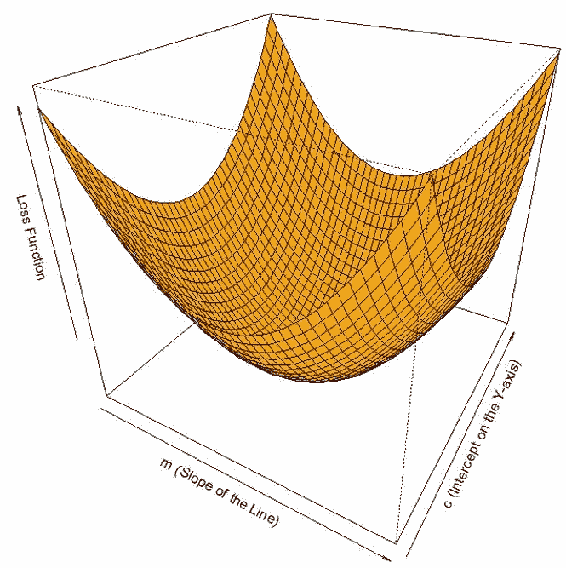
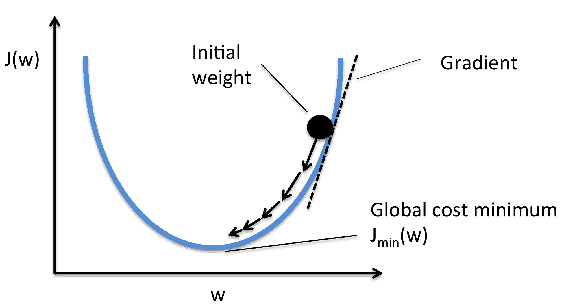
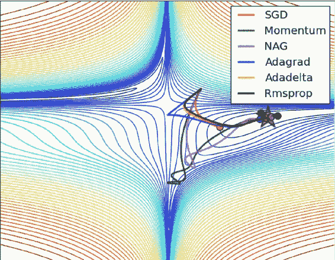
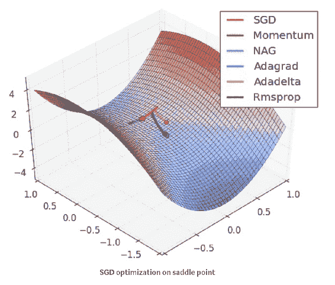
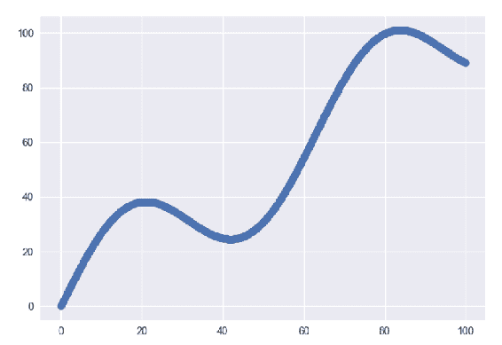
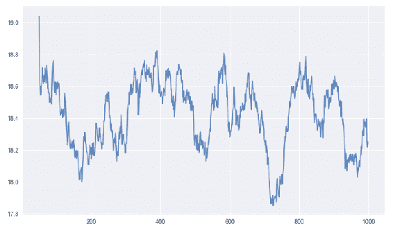
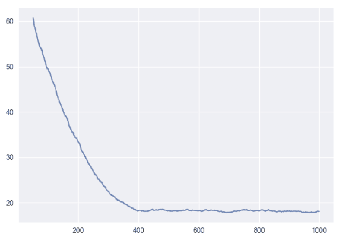

# 第三章：神经网络的优化

深度学习中的许多应用需要解决优化问题。优化是指将我们所处理的对象带向其最终状态。通过优化过程解决的问题必须提供数据，提供模型常量和参数，函数中描述总体目标函数及一些约束条件。

在本章中，我们将探讨 TensorFlow 流水线和 TensorFlow 库提供的各种优化模型。涵盖的主题列表如下：

+   优化基础

+   优化器的类型

+   梯度下降

+   选择正确的优化器

# 什么是优化？

寻找极大值或极小值的过程基于约束条件。选择优化算法对深度学习模型的影响可能意味着在几分钟、几小时或几天内产生不同的结果。

优化是深度学习的核心。大多数学习问题都可以简化为优化问题。让我们设想，我们正在为一组数据解决一个问题。使用这些预处理过的数据，我们通过解决一个优化问题来训练模型，优化模型的权重，以使其符合所选择的损失函数和某些正则化函数。

模型的超参数在模型的高效训练中起着重要作用。因此，使用不同的优化策略和算法来测量模型超参数的合适和值是至关重要的，这些超参数会影响模型的学习过程，并最终影响模型的输出。

# 优化器的类型

首先，我们将查看优化算法的高级类别，然后深入研究各个优化器。

**一阶优化**算法使用梯度值相对于参数来最小化或最大化损失函数。常用的一阶优化算法是梯度下降。在这里，一阶导数告诉我们函数在某个特定点是增加还是减少。一阶导数给出了一条切线，与误差曲面上的某点相切。

函数的导数依赖于单一变量，而函数的梯度依赖于多个变量。

**二阶优化**算法使用二阶导数，也称为**海森矩阵**，来最小化或最大化给定的损失函数。这里，海森矩阵是二阶偏导数的矩阵。二阶导数的计算代价较高，因此不常使用。二阶导数告诉我们一阶导数是增加还是减少，从而反映了函数的曲率。二阶导数给出了一个二次曲面，它与误差曲面的形状相切。

二阶导数计算成本较高，但二阶优化方法的优势在于它不会忽略或忽视曲面的弯曲性。同时，逐步性能也更好。在选择优化方法时，关键要注意，一级优化方法计算简单且时间消耗较少，在大数据集上收敛速度较快。而二阶方法仅在已知二阶导数时更快，且在时间和内存上的计算开销较大，速度较慢且计算代价较高。

二阶优化方法有时比一阶梯度下降方法表现得更好，因为二阶方法永远不会在收敛缓慢的路径上卡住，即不会卡在鞍点附近，而梯度下降有时会卡住并无法收敛。

# 梯度下降

梯度下降是一种最小化函数的算法。一组参数定义了一个函数，梯度下降算法从初始参数值集开始，逐步逼近最小化该函数的参数值集。

这种迭代最小化通过微积分实现，沿函数梯度的负方向一步步推进，如下图所示：



梯度下降是最成功的优化算法。如前所述，它用于在神经网络中更新权重，从而最小化损失函数。接下来，我们将讨论一个重要的神经网络方法——反向传播。在这个过程中，我们首先进行前向传播，计算输入与相应权重的点积，然后将激活函数应用于加权和，将输入转化为输出，并向模型中添加非线性因素，使得模型能够学习几乎任何任意的功能映射。

接下来，我们在神经网络中进行反向传播，传递误差项并使用梯度下降更新权重值，如下图所示：



# 梯度下降的不同变种

**标准梯度下降**，也称为**批量梯度下降**，将计算整个数据集的梯度，但只进行一次更新。因此，对于那些极大且无法完全加载到内存中的数据集，它可能会非常缓慢且难以控制。接下来，让我们看看能解决这个问题的算法。

**随机梯度下降**（**SGD**）在每个训练样本上执行参数更新，而小批量梯度下降则在每个批次的 *n* 个训练样本上执行更新。SGD 的问题在于，由于频繁的更新和波动，最终会使收敛到准确最小值变得复杂，并且由于持续的波动，可能会不断超出目标。而小批量梯度下降则解决了这个问题，它通过减少参数更新中的方差，从而实现更好且稳定的收敛。SGD 和小批量梯度下降可以互换使用。

梯度下降的总体问题包括选择合适的学习率，以避免在较小值时出现收敛缓慢，或者在较大值时出现发散，并且对所有参数更新应用相同的学习率。如果数据稀疏，我们可能不希望对所有参数进行相同程度的更新。最后，还需要处理鞍点问题。

# 优化梯度下降的算法

现在，我们将探讨优化梯度下降的各种方法，以便为每个参数计算不同的学习率、计算动量并防止学习率衰减。

为了解决 SGD 高方差振荡的问题，发现了一种叫做 **动量** 的方法；它通过沿着正确的方向进行加速，并在无关方向上减缓振荡，来加速 SGD。基本上，它会将上一步更新向量的一部分加到当前更新向量中。动量值通常设置为 0.9。动量可以加速收敛并减少振荡，使收敛更稳定。

**Nesterov 加速梯度** 解释了当我们达到最小值时，也就是曲线的最低点，动量相当大，且由于动量过大，它并不会在该点减速，这可能会导致错过最小值并继续上升。Nesterov 提出了我们首先基于之前的动量进行一次较大的跳跃，然后计算梯度，接着进行修正，从而更新参数。这个更新可以防止我们过快地前进，从而错过最小值，并且使模型对变化更敏感。

**Adagrad** 允许学习率根据参数自适应调整。因此，对于不常见的参数，它执行较大的更新，而对于常见的参数，它执行较小的更新。因此，Adagrad 非常适合处理稀疏数据。其主要缺点是学习率总是在逐渐减小和衰减。使用 AdaDelta 可以解决学习率衰减的问题。

**AdaDelta** 解决了 AdaGrad 中学习率逐渐减小的问题。在 AdaGrad 中，学习率是通过将 1 除以平方根和计算的。在每个阶段，我们都会将另一个平方根加入总和，这会导致分母不断减小。现在，AdaDelta 不再对所有以前的平方根求和，而是使用滑动窗口，这允许总和减小。

**自适应矩估计**（**Adam**）为每个参数计算自适应学习率。与 AdaDelta 类似，Adam 不仅存储过去平方梯度的衰减平均值，还存储每个参数的动量变化。Adam 在实践中表现良好，是目前最常用的优化方法之一。

以下两张图（图片来源：Alec Radford）展示了前面描述的优化算法的优化行为。我们看到它们在损失曲面的等高线上的行为随时间变化。Adagrad、RMsprop 和 Adadelta 几乎迅速朝着正确的方向前进并快速收敛，而 momentum 和 NAG 则偏离轨道。由于 NAG 通过提前查看并向最小值移动，从而提高响应能力，很快就能修正其方向。



第二张图展示了算法在鞍点的行为。**SGD**、**Momentum** 和 **NAG** 在打破对称性方面遇到挑战，但它们最终能够慢慢摆脱鞍点，而 **Adagrad**、**Adadelta** 和 **RMsprop** 则沿着负斜率下坡，从下图可以看到：



# 选择哪个优化器

如果输入数据稀疏，或者我们希望在训练复杂的神经网络时实现快速收敛，使用自适应学习率方法能得到最佳结果。我们还不需要调整学习率。对于大多数情况，Adam 通常是一个不错的选择。

# 通过示例进行优化

让我们以线性回归为例，我们通过最小化从直线到每个数据点的距离的平方，来找到最佳拟合的直线。这就是我们称其为最小二乘回归的原因。本质上，我们将问题表述为一个优化问题，其中我们尝试最小化损失函数。

让我们设置输入数据并查看散点图：

```py
# input data
xData = np.arange(100, step=.1)
yData = xData + 20 * np.sin(xData/10)
```



定义数据大小和批次大小：

```py
# define the data size and batch sizenSamples = 1000
batchSize = 100
```

我们将需要调整数据大小以符合 TensorFlow 输入格式，如下所示：

```py
# resize input for tensorflowxData = np.reshape(xData, (nSamples, 1))
 yData = np.reshape(yData, (nSamples, 1)) 
```

以下范围初始化了`weights`和`bias`，并描述了线性模型和损失函数：

```py
with tf.variable_scope("linear-regression-pipeline"):
     W = tf.get_variable("weights", (1,1), initializer=tf.random_normal_initializer())
     b = tf.get_variable("bias", (1, ), initializer=tf.constant_initializer(0.0))

     *#* model
yPred = tf.matmul(X, W) + b
     *#* loss function
loss = tf.reduce_sum((y - yPred)**2/nSamples)
```

然后我们设置优化器来最小化损失：

```py
# set the optimizer
 #optimizer = tf.train.GradientDescentOptimizer(learning_rate=0.001).minimize(loss)
 #optimizer = tf.train.AdamOptimizer(learning_rate=.001).minimize(loss)
 #optimizer = tf.train.AdadeltaOptimizer(learning_rate=.001).minimize(loss)
 #optimizer = tf.train.AdagradOptimizer(learning_rate=.001).minimize(loss)
 #optimizer = tf.train.MomentumOptimizer(learning_rate=.001, momentum=0.9).minimize(loss)
 #optimizer = tf.train.FtrlOptimizer(learning_rate=.001).minimize(loss)
 optimizer = tf.train.RMSPropOptimizer(learning_rate=.001).minimize(loss)  We then select the mini batch and run the optimizers errors = []
 with tf.Session() as sess:
     # init variables
     sess.run(tf.global_variables_initializer())

     for _ in range(1000):
         # select mini batchindices = np.random.choice(nSamples, batchSize)
         xBatch, yBatch = xData[indices], yData[indices]
         # run optimizer_, lossVal = sess.run([optimizer, loss], feed_dict={X: xBatch, y: yBatch})
         errors.append(lossVal)

 plt.plot([np.mean(errors[i-50:i]) for i in range(len(errors))])
 plt.show()
 plt.savefig("errors.png")
```

上述代码的输出如下：



我们还得到一个滑动曲线，如下所示：



# 总结

在本章中，我们学习了优化技术的基本原理和不同类型。优化是一个复杂的主题，很多因素取决于我们数据的性质和大小。此外，优化还取决于权重矩阵。这些优化器大多针对图像分类或预测任务进行了训练和调整。然而，对于定制或新的使用案例，我们需要通过反复试验来确定最佳解决方案。
