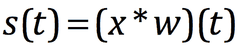
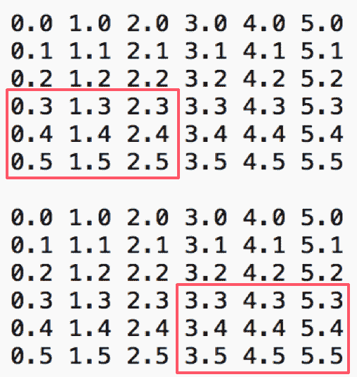
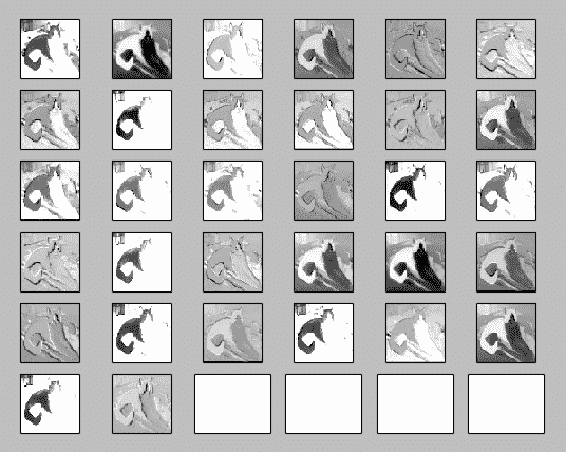
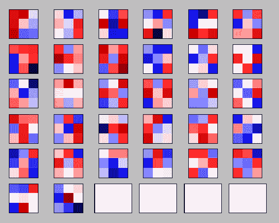

# 第四章：卷积神经网络

卷积网络（参考 *LeCun[1]*，2013），也被称为**卷积**神经网络

或**CNNs**，是一种特定类型的神经网络，它使用网格状拓扑处理数据。举例来说，时间序列数据可以看作是一个 1D 网格，按规律时间间隔采样，或者图像数据是一个二维像素网格。卷积神经网络的名字意味着该网络采用了一种叫做**卷积**的数学运算。卷积是一种特定的线性运算。卷积网络是使用卷积（一个数学运算）代替至少一层中的常规矩阵乘法的神经网络。

首先，我们将描述卷积的数学运算。然后我们将讨论池化的概念以及它如何帮助 CNN。我们还将探讨在 TensorFlow 中实现卷积网络。

在本章的末尾，我们将使用 TensorFlow 的 CNN 实现来对斯坦福数据集中的狗和猫进行分类。

Lecun[1] : [`yann.lecun.com/exdb/lenet/`](http://yann.lecun.com/exdb/lenet/)

在本章中，我们将涵盖以下主题：

+   CNN 概述与直觉

+   卷积运算

+   池化

+   使用卷积网络进行图像分类

# CNN 概述与直觉

CNN 由多个卷积层、池化层和最终的全连接层组成。这比我们在第二章中讨论的纯前馈网络更高效，*深度前馈网络*。


上述图示通过**卷积层** | **最大池化** | **卷积** | **最大池化** | **全连接层**进行，这就是一个 CNN 架构

# 单一卷积层计算

首先让我们直观地讨论卷积层的计算方式。卷积层的参数包括一组可学习的滤波器（也称为**张量**）。每个滤波器在空间上很小（深度、宽度和高度），但它会延伸到输入体积（图像）的完整深度。卷积神经网络的第一层滤波器通常大小为 5 x 5 x 3（即宽度和高度为五个像素，深度为三个，因为图像有三个颜色通道的深度）。在前向传播过程中，滤波器会在输入体积的宽度和高度上滑动（或**卷积**），并在任何点上计算滤波器与输入的点积。当滤波器在输入体积的宽度和高度上滑动时，它会产生一个二维激活图，显示该滤波器在每个空间位置的响应。网络将学习到，当它们看到某种视觉特征时，滤波器会激活，例如在第一层看到某种方向的边缘或某种颜色的斑点，或者在网络的更高层检测到整个蜂窝状或轮状的模式。一旦我们在每个卷积层中拥有一整套滤波器（例如，12 个滤波器），每个滤波器都会产生一个独立的二维激活图。我们将这些激活图沿深度维度堆叠在一起，生成输出体积。


32 x 32 像素的图像被 5 x 5 滤波器卷积处理

上面的图像展示了一个 32 x 32 x 3 的图像，在其上应用了一个 5 x 5 x 3 的滤波器。


每个滤波器与图像块之间的点积结果生成一个单一的数值

接下来，让我们对上面创建的滤波器进行卷积处理，遍历整个图像，每次移动一个像素。最终的输出将是 28 x 28 x 1。这被称为**激活图**。


通过对图像应用滤波器生成的激活图

考虑将两个滤波器依次使用，这将产生两个大小为 28 x 28 x 1 的激活图。


对单个图像应用两个滤波器会生成两个激活图

如果我们使用六个这样的滤波器，最终得到的图像大小将是 28 x 28 x 3。卷积神经网络（ConvNet）是由这样的卷积层组成，并交替使用激活函数，如**Relu**。


将六个 5 x 5 x 3 的滤波器应用到图像上，结果生成 28 x 28 x 6 的激活图

让我们按照 TensorFlow 的术语正式定义卷积神经网络（CNN）。

**定义**：卷积神经网络（CNN）是一种至少包含一层（`tf.nn.conv2d`）的神经网络，该层对输入和可配置的卷积核进行卷积运算，生成该层的输出。卷积通过将卷积核（滤波器）应用于输入层（张量）中的每一个点来进行。它通过滑动卷积核在输入张量上生成一个过滤后的输出。

**使用案例**：以下示例是一个边缘检测滤波器，应用于输入图像，使用卷积


通过在输入图像上应用卷积核进行边缘检测

CNN 遵循一个过程，匹配的信息结构类似于猫的条纹皮层中的细胞布局结构。当信号通过猫的条纹皮层时，某些层会在视觉模式被突出时发出信号。例如，当水平线穿过某一层时，该层的细胞会激活（增加其输出信号）。CNN 会表现出类似的行为，其中神经元簇会根据训练中学习到的模式进行激活。基于预标记数据进行训练后，CNN 会有某些层在水平/垂直线通过时激活。

匹配水平/垂直线将是一个有用的神经网络架构，但 CNN 通过将多个简单模式层叠来匹配复杂模式。这些模式被称为**滤波器**或**卷积核**。训练的目标是调整这些卷积核权重，以最小化损失函数。训练这些滤波器是通过结合多个层并使用梯度下降或其他优化技术来学习权重。

# TensorFlow 中的 CNN

CNN 由卷积层（通过 `tf.nn.conv2d` 定义）、非线性层（`tf.nn.relu`）、最大池化层（`tf.nn.max_pool`）和全连接层（`tf.matmul`）组成。以下图像显示了典型的 CNN 层及其在 TensorFlow 中的对应实现：


将 CNN 层映射到 TensorFlow 函数

# TensorFlow 中的图像加载

现在让我们来看一下 TensorFlow 如何加载图像。我们定义一个包含三个小图像的常量数组，并将它们加载到会话中：

```py
sess = tf.InteractiveSession()
image_batch = tf.constant([
   [ # First Image
     [[255, 0, 0], [255, 0, 0], [0, 255, 0]],
     [[255, 0, 0], [255, 0, 0], [0, 255, 0]]
   ],
   [ # Second Image
     [[0, 0, 0], [0, 255, 0], [0, 255, 0]],
     [[0, 0, 0], [0, 255, 0], [0, 255, 0]]
   ],
   [ # Third Image
     [[0, 0, 255], [0, 0, 255], [0, 0, 255]],
     [[0, 0, 255], [0, 0, 255], [0, 0, 255]]
   ]
 ])
 print(image_batch.get_shape())
 print(sess.run(image_batch)[1][0][0])
```

上述代码的输出显示了张量的形状以及第一张图像的第一个像素。在这个示例代码中，创建了一个包含三张图像的图像数组。每张图像的高度为两像素，宽度为三像素，并采用 RGB 色彩空间。示例代码的输出显示图像的数量作为第一个维度的大小，Dimension(1)。每张图像的高度是第二个维度的大小，Dimension(2)，每张图像的宽度是第三个维度，Dimension(3)，而颜色通道的数组大小是最后一个维度，Dimension(3)：

```py
(3, 2, 3, 3)
[255 0 0]
```

# 卷积操作

卷积操作是卷积神经网络（CNN）的关键组成部分；这些操作使用输入张量和滤波器来计算输出。关键在于决定可用的参数来调整它们。

假设我们在追踪一个物体的位置。它的输出是一个单一的 *x(t)*，表示物体在时间 *t* 的位置。*x* 和 *t* 都是实数值，也就是说，我们可以在任何时刻获得不同的读数。假设我们的测量有噪声。为了获得一个较少噪声的物体位置估计，我们希望将多个测量值进行平均。最近的测量对我们来说更为相关；我们希望这成为一个加权平均，赋予最近的测量更高的权重。我们可以使用加权函数 *w(a)* 来计算，其中 *a* 是测量的时间（测量发生的时刻）。

如果我们在每个时刻应用加权平均操作，我们将得到一个新的函数，提供物体位置的平滑估计：


这个操作称为**卷积**。卷积操作用星号表示：



这里，

+   *w* 是卷积核

+   *x* 是输入

+   *s* 是输出，也称为**特征图**

# 图像上的卷积

如果我们使用一个二维图像 *I* 作为输入，我们可能还想使用一个二维卷积核 *K*。前面的方程将如下所示：


由于卷积函数是可交换的，我们可以将前面的方程写成如下形式：


将 *i - m* 和 *j - n* 改为加法被称为互相关，因为这正是 TensorFlow 实现的：


让我们定义一个简单的输入和卷积核，并在 TensorFlow 中运行 `conv2d` 操作。我们来看一下简单的图像输入和卷积核输入。下图展示了一个基本的图像、卷积核和应用卷积操作后的期望输出：


基本图像及应用于其上的卷积核示例

现在我们来看一下当步幅为 1, 1, 1, 1 时如何得到输出：


通过将卷积核应用于输入来计算输出

接下来，我们将在 TensorFlow 中实现相同的操作：

```py
i = tf.constant([
                 [1.0, 1.0, 1.0, 0.0, 0.0],
                 [0.0, 0.0, 1.0, 1.0, 1.0],
                 [0.0, 0.0, 1.0, 1.0, 0.0],
                 [0.0, 0.0, 1.0, 0.0, 0.0]], dtype=tf.float32)
k = tf.constant([
                [1.0, 0.0, 1.0],
                [0.0, 1.0, 0.0],
                [1.0, 0.0, 1.0]
        ], dtype=tf.float32),
kernel = tf.reshape(k, [3, 3, 1, 1], name='kernel')
image = tf.reshape(i, [1, 4, 5, 1], name='image')
res = tf.squeeze(tf.nn.conv2d(image, kernel, strides=[1, 1, 1, 1], padding="VALID"))
# VALID means no padding
with tf.Session() as sess:
    print sess.run(res)
```

上述代码段的输出如下——这与我们手动计算的结果相同：

```py
[[ 3\. 3\. 3.]
 [ 2\. 2\. 4.]]
```

# 步幅

卷积的主要目的是减少图像的维度（宽度、高度和通道数）。图像越大，所需的处理时间就越长。

`strides` 参数使卷积核在图像中跳过一些像素，并且不将这些像素包含在输出中。`strides` 参数决定了当使用更大的图像和更复杂的卷积核时，卷积操作如何与卷积核一起工作。由于卷积是将卷积核滑动输入，因此它使用 `strides` 参数来确定它如何遍历输入，而不是遍历输入的每一个元素。

让我们看一下下面的示例，我们将一个 3 x 3 x 1 的卷积核以步幅 1, 3, 3, 1 移动到一个 6 x 6 x 1 的图像上：


第一步，卷积核以步幅 1,3,3,1 滑动

卷积核在步骤 3 和 4 中跨越以下元素：



卷积核在输入上滑动的步骤 3 和 4

让我们在 TensorFlow 中实现这个，输出将是一个 4 x 4 x 1 的张量：

```py
import tensorflow as tf

def main():
  session = tf.InteractiveSession()
  input_batch = tf.constant([
    [ # First Input (6x6x1)
      [[0.0], [1.0], [2.0], [3.0], [4.0], [5.0]],
      [[0.1], [1.1], [2.1], [3.1], [4.1], [5.1]],
      [[0.2], [1.2], [2.2], [3.2], [4.2], [5.2]],
      [[0.3], [1.3], [2.3], [3.3], [4.3], [5.3]],
      [[0.4], [1.4], [2.4], [3.4], [4.4], [5.4]],
      [[0.5], [1.5], [2.5], [3.5], [4.5], [5.5]],
  ],
 ])
kernel = tf.constant([ # Kernel (3x3x1)
  [[[0.0]], [[0.5]], [[0.0]]],
  [[[0.0]], [[0.5]], [[0.0]]],
  [[[0.0]], [[0.5]], [[0.0]]]
])

# NOTE: the change in the size of the strides parameter.
conv2d = tf.nn.conv2d(input_batch, kernel, strides=[1, 3, 3, 1], padding='SAME')
conv2d_output = session.run(conv2d)
print(conv2d_output)
if __name__ == '__main__':
main()
```

输出类似于下面的列表，其中 1、3、3、1 的步幅在前面的图像中形成了四个红色框，并与卷积核相乘：

```py
[[[[ 1.64999998][ 6.1500001 ]]
  [[ 2.0999999 ][ 6.60000038]]]]
```

# 池化

池化层通过减少输入张量的大小来帮助防止过拟合并提高性能。通常，它们用于缩小输入，保留重要信息。与 `tf.nn.conv2d` 相比，池化是一种更快速的输入大小缩减机制。

TensorFlow 支持以下池化机制：

+   平均值

+   最大池化

+   最大值与索引

每个池化操作使用大小为 `ksize` 的矩形窗口，窗口之间的间隔由 `strides` 决定。如果 `strides` 全部为 1（1, 1, 1, 1），则每个窗口都会被使用；如果 `strides` 全部为 2（1, 2, 2, 1），则每个维度中会跳过一个窗口，以此类推。

# 最大池化

以下定义的函数提供了对输入 4D 张量的最大池化 `tf.nn.max_pool`：

```py
max_pool(
  value, ksize, strides, padding, data_format='NHWC', name=None
)
```

上述参数的解释如下：

+   `value`：这是一个形状为 [batch, height, width, channels] 的 4D 张量，类型为 `tf.float32`，需要进行最大池化操作。

+   `ksize`：这是一个整数列表，`length >= 4`。输入张量每个维度的窗口大小。

+   `strides`：这是一个整数列表，`length >= 4`。每个维度的滑动窗口步幅。

+   `padding`：这是一个字符串，可以是 `VALID` 或 `SAME`。填充算法。以下部分解释了 `VALID` 和 `SAME` 填充。


参考：[`stackoverflow.com/questions/37674306/what-is-the-difference-between-same-and-valid-padding-in-tf-nn-max-pool-of-t`](https://stackoverflow.com/questions/37674306/what-is-the-difference-between-same-and-valid-padding-in-tf-nn-max-pool-of-t)

+   `data_format`：这是一个字符串，支持 `NHWC` 和 `NCHW` 格式。

+   `name`：这是操作的可选名称。

# 示例代码

以下代码演示了使用 `VALID` 填充模式对张量进行最大池化：

```py
import tensorflow as tf

batch_size=1
input_height = 3
input_width = 3
input_channels = 1

def main():
  sess = tf.InteractiveSession()
  layer_input = tf.constant([
    [
     [[1.0], [0.2], [2.0]],
     [[0.1], [1.2], [1.4]],
     [[1.1], [0.4], [0.4]]
    ] 
  ])

# The strides will look at the entire input by using the image_height and image_width
kernel = [batch_size, input_height, input_width, input_channels]
max_pool = tf.nn.max_pool(layer_input, kernel, [1, 1, 1, 1], "VALID")
print(sess.run(max_pool))

if __name__ == '__main__':
  main()
```

上述代码的输出将在 3 x 3 x 1 的窗口中给出最大值：

```py
[[[[ 2.]]]]
```

以下图表说明了最大池化的逻辑：


如图所示，最大池化根据步幅为 1, 1, 1 的窗口选择了最大值。

# 平均池化

它对输入张量执行平均池化。输出中的每个条目是相应大小的 `ksize` 窗口中的值的平均值。它通过 `tf.nn.avg_pool` 方法定义：

```py
avg_pool( value, ksize, strides, padding, data_format='NHWC', name=None)
```

我们来看看使用`avg_pool`的简单 2D 张量的代码示例：

```py
import tensorflow as tf

batch_size=1
input_height = 3
input_width = 3
input_channels = 1

def main():
  sess = tf.InteractiveSession()
  layer_input = tf.constant([
    [
      [[1.0], [0.2], [2.0]],
      [[0.1], [1.2], [1.4]],
      [[1.1], [0.4], [0.4]]
    ]
  ])

  # The strides will look at the entire input by using the image_height and image_width
  kernel = [batch_size, input_height, input_width, input_channels]
  avg_pool = tf.nn.avg_pool(layer_input, kernel, [1, 1, 1, 1], "VALID")
  print(sess.run(avg_pool))

if __name__ == '__main__': 
    main()
```

上述代码的输出是张量中所有值的平均值。

*平均值 = (1.0 + 0.2 + 2.0 + 0.1 + 1.2 + 1.4 + 1.1 + 0.4 + 0.4) / 9 = 0.86666*

```py
[[[[ 0.86666667]]]]
```

# 使用卷积网络进行图像分类

让我们看一个更实际的 CNN 使用案例；我们将使用斯坦福狗与猫数据集。该数据集包含 100 多张狗和猫的图片。

你可以从以下位置下载该数据集（每类 100 张图片）：[`s3.amazonaws.com/neural-networking-book/ch04/dogs_vs_cats.tar.gz`](https://s3.amazonaws.com/neural-networking-book/ch04/dogs_vs_cats.tar.gz)

1.  导入相关的函数和 Python 类：

```py
import matplotlib.pyplot as plt
import tensorflow as tf
import pandas as pd
import numpy as np
from sklearn.metrics import confusion_matrix
import time
from datetime import timedelta
import math
import dataset
import random
```

1.  我们将定义卷积层的参数。共有三个卷积层，参数如下：

| **层编号** | **层类型** | **滤波器/神经元数量** |
| --- | --- | --- |
| 1 | 卷积 | 32 个滤波器 |
| 2 | 卷积 | 32 个滤波器 |
| 3 | 卷积 | 64 个滤波器 |
| 4 | 全连接层 | 128 个神经元 |

网络拓扑可以通过以下图示表示：


以下代码有助于理解参数：

```py
# Convolutional Layer 1.
filter_size1 = 3 
num_filters1 = 32

# Convolutional Layer 2.
filter_size2 = 3
num_filters2 = 32

# Convolutional Layer 3.
filter_size3 = 3
num_filters3 = 64

# Fully-connected layer.
# Number of neurons in fully-connected layer.
fc_size = 128

# Number of color channels for the images: 1 channel for gray-scale.
num_channels = 3

# image dimensions (only squares for now)
img_size = 128

# Size of image when flattened to a single dimension
img_size_flat = img_size * img_size * num_channels

# Tuple with height and width of images used to reshape arrays.
img_shape = (img_size, img_size)
```

1.  定义类别数量（此处为两个类别）和其他变量。我们使用了斯坦福数据集，并将其缩减为每类 100 张狗和猫的图片，以便于处理：

```py
# class info
classes = ['dogs', 'cats']
num_classes = len(classes)

# batch size
batch_size = 2

# validation split
validation_size = .2
total_iterations = 0
early_stopping = None  # use None if you don't want to implement early stoping
home = '/home/ubuntu/Downloads/dogs_vs_cats'
train_path = home + '/train-cat-dog-100/'
test_path = home + '/test-cat-dog-100/'
checkpoint_dir = home + "/models/"
```

首先让我们将数据集读入张量。读取逻辑在`dataset`类中定义：

```py
data = dataset.read_train_sets(train_path, img_size, classes, validation_size=validation_size)
```

这里，定义了`train_path`、`image_size`、`classes`和`validation_size`。让我们看看`read_train_sets(..)`的实现：

```py
def read_train_sets(train_path, image_size, classes, validation_size=0):
  class DataSets(object):
    pass
  data_sets = DataSets()

  images, labels, ids, cls = load_train(train_path, image_size, classes)
  images, labels, ids, cls = shuffle(images, labels, ids, cls)  # shuffle the data

  if isinstance(validation_size, float):
    validation_size = int(validation_size * images.shape[0])

  validation_images = images[:validation_size]
  validation_labels = labels[:validation_size]
  validation_ids = ids[:validation_size]
  validation_cls = cls[:validation_size]

  train_images = images[validation_size:]
  train_labels = labels[validation_size:]
  train_ids = ids[validation_size:]
  train_cls = cls[validation_size:]

  data_sets.train = DataSet(train_images, train_labels, train_ids, train_cls)
  data_sets.valid = DataSet(validation_images, validation_labels, validation_ids, 
   validation_cls)

  return data_sets
```

该方法进一步调用`load_train(...)`，返回一个数据类型为`numpy.array`的数据：

```py
def load_train(train_path, image_size, classes) :
 images = labels = []
 ids = cls = []
 # load data into arrays
 images = np.array(images) 
 labels = np.array(labels) 
 ids = np.array(ids) 
 cls =  np.array(cls)   
 return images, labels, ids, cls
```

加载到训练中的数据是`validation_set`的一个函数；它是根据图像数组的第一维计算得到的：


我们计算`validation_size`，如下代码所示：

```py
validation_size = int(validation_size * images.shape[0])
```

由于我们将验证集大小设置为`0.2`，计算结果为`58.2`，四舍五入为`58`：


同样，我们创建测试数据集，`test_images`和`test_ids`：

```py
test_images, test_ids = dataset.read_test_set(test_path, img_size)
```

这里，`read_test_set(...)`是一个内部调用的函数：

```py
def read_test_set(test_path, image_size):
  images, ids  = load_test(test_path, image_size)
  return images, ids
```

`read_test_set(test_path, image_size)`又会调用`load_test(test_path, image_size)`，其代码如下：

```py
def load_test(test_path, image_size):
  path = os.path.join(test_path, '*g')
  files = sorted(glob.glob(path))

  X_test = []
  X_test_id = []
  print("Reading test images")
  for fl in files:
      flbase = os.path.basename(fl)
      img = cv2.imread(fl)
      img = cv2.resize(img, (image_size, image_size), fx=0.5, fy=0.5,
        interpolation=cv2.INTER_LINEAR)

      #img = cv2.resize(img, (image_size, image_size), cv2.INTER_LINEAR)
      X_test.append(img)
      X_test_id.append(flbase)

  ### because we're not creating a DataSet object for the test images, 
  ### normalization happens here
  X_test = np.array(X_test, dtype=np.uint8)
  X_test = X_test.astype('float32')
  X_test = X_test / 255

  return X_test, X_test_id
```

1.  我们来看看创建的各种`numpy`数组的尺寸：

```py
print("Size of:")
print("- Training-set:\t\t{}".format(len(data.train.labels)))
print("- Test-set:\t\t{}".format(len(test_images)))
print("- Validation-set:\t{}".format(len(data.valid.labels)))
```

```py
Size of:Size of:
- Training-set: 233
- Test-set: 100
- Validation-set: 58
```

1.  在 3 x 3 网格中绘制九张随机图片，并标注相应的类别：

```py
 images, cls_true = data.train.images, data.train.cls
 plot_images(images=images, cls_true=cls_true
```

这里，`plot_images`函数在以下代码块中定义：

```py
def plot_images(images, cls_true, cls_pred=None):

    if len(images) == 0:
        print("no images to show")
        return 
    else:
        random_indices = random.sample(range(len(images)), min(len(images), 9))

    images, cls_true  = zip(*[(images[i], cls_true[i]) for i in random_indices])

    # Create figure with 3x3 sub-plots.
    fig, axes = plt.subplots(3, 3)
    fig.subplots_adjust(hspace=0.3, wspace=0.3)

    for i, ax in enumerate(axes.flat):
        # Plot image.
        print(images[i])
        ax.imshow(images[i].reshape(img_size, img_size, num_channels))
        print(images[i].size)
        print(img_size)
        print(num_channels)
        # Show true and predicted classes.
        if cls_pred is None:
            xlabel = "True: {0}".format(cls_true[i])
        else:
            xlabel = "True: {0}, Pred: {1}".format(cls_true[i], cls_pred[i])

        # Show the classes as the label on the x-axis.
        ax.set_xlabel(xlabel)

        # Remove ticks from the plot.
        ax.set_xticks([])
        ax.set_yticks([])

    # Ensure the plot is shown correctly with multiple plots
    # in a single Notebook cell.
    plt.show()
```

以下是我们代码的输出：


数据集中的九张随机图片

# 定义输入图像的张量和第一个卷积层

接下来，我们将为输入图像和第一个卷积层定义张量。

# 输入张量

创建一个占位符，形状为`shape[None, img_size_flat]`，并将其重塑为`[-1, img_size, img_size, num_channels]`：

```py
x = tf.placeholder(tf.float32, shape=[None, img_size_flat], name='x')
x_image = tf.reshape(x, [-1, img_size, img_size, num_channels])
```

这里，参数`img_size`和`num_channels`的值如下：

+   `img_size` = 128

+   `num_channels` = 3

# 第一个卷积层

在将输入张量重塑为`x_image`后，我们将创建第一个卷积层：

```py

layer_conv1, weights_conv1 = new_conv_layer(input=x_image,
                                            num_input_channels=num_channels,
                                            filter_size=filter_size1,
                                            num_filters=num_filters1,
                                            use_pooling=True)
print(layer_conv1)
```

`new_conv_layer(...)`函数在这里定义。让我们来看一下传递给该函数的每个变量的值：


```py
def new_conv_layer(input,              # The previous layer.
                   num_input_channels, # Num. channels in prev. layer.
                   filter_size,        # Width and height of each filter.
                   num_filters,        # Number of filters.
                   use_pooling=True):  # Use 2x2 max-pooling.

    # Shape of the filter-weights for the convolution.
    # This format is determined by the TensorFlow API.
    shape = [filter_size, filter_size, num_input_channels, num_filters]

    # Create new weights aka. filters with the given shape.
    weights = new_weights(shape=shape)

    # Create new biases, one for each filter.
    biases = new_biases(length=num_filters)

    # Create the TensorFlow operation for convolution.
    # Note the strides are set to 1 in all dimensions.
    # The first and last stride must always be 1,
    # because the first is for the image-number and
    # the last is for the input-channel.
    # But e.g. strides=[1, 2, 2, 1] would mean that the filter
    # is moved 2 pixels across the x- and y-axis of the image.
    # The padding is set to 'SAME' which means the input image
    # is padded with zeroes so the size of the output is the same.
    layer = tf.nn.conv2d(input=input,
                         filter=weights,
                         strides=[1, 1, 1, 1],
                         padding='SAME')

    # Add the biases to the results of the convolution.
    # A bias-value is added to each filter-channel.
    layer += biases

    # Use pooling to down-sample the image resolution?
    if use_pooling:
        # This is 2x2 max-pooling, which means that we
        # consider 2x2 windows and select the largest value
        # in each window. Then we move 2 pixels to the next window.
        layer = tf.nn.max_pool(value=layer,
                               ksize=[1, 2, 2, 1],
                               strides=[1, 2, 2, 1],
                               padding='SAME')

    # Rectified Linear Unit (ReLU).
    # It calculates max(x, 0) for each input pixel x.
    # This adds some non-linearity to the formula and allows us
    # to learn more complicated functions.
    layer = tf.nn.relu(layer)

    # Note that ReLU is normally executed before the pooling,
    # but since relu(max_pool(x)) == max_pool(relu(x)) we can
    # save 75% of the relu-operations by max-pooling first.

    # We return both the resulting layer and the filter-weights
    # because we will plot the weights later.
    return layer, weights
```

运行时，变量的值如下：


如果我们运行此代码，`print(..)`语句的输出将如下所示：

```py
Tensor("Relu:0", shape=(?, 64, 64, 32), dtype=float32)
```

输出显示了从输入层 1 传出的输出张量的形状。

# 第二个卷积层

在第二个卷积层中，我们将第一个层的输出作为输入，并使用以下参数构建一个新层：


首先，我们为真实的`y`和真实的`y`的类别（类别标签）定义一个占位符：

```py
y_true = tf.placeholder(tf.float32, shape=[None, num_classes], name='y_true')

y_true_cls = tf.argmax(y_true, dimension=1)
```

这两个变量的形状如下：


```py

layer_conv2, weights_conv2 = new_conv_layer(input=layer_conv1,
                                            num_input_channels=num_filters1,filter_size=filter_size2,num_filters=num_filters2,use_pooling=True)
```

其中，以下是各个值：

+   `num_input_channels` = 3

+   `filter_size` = 3

+   `num_filters` = 32

这是打印输出的结果：

```py
Tensor("Relu_1:0", shape=(?, 32, 32, 32), dtype=float32)
```

# 第三个卷积层

该层将第二层的输出作为输入。让我们看看输入是如何进入该层的：


```py
shape = [filter_size, filter_size, num_input_channels, num_filters] weights = new_weights(shape=shape)
```

```py
layer_conv3, weights_conv3 = new_conv_layer(input=layer_conv2,
                                            num_input_channels=num_filters2,filter_size=filter_size3,num_filters=num_filters3,use_pooling=True) 
```

```py
print(layer_conv3)
```

`layer_conv3`的形状如下：

```py
Tensor("Relu_2:0", shape=(?, 16, 16, 64), dtype=float32)
```

# 扁平化该层

接下来，我们将该层扁平化为`num`图像和`num`特征，在本例中为 16,384。如果你注意到最后一层的输出，我们已经使用以下逻辑进行了扁平化：16 x 16 x 64 = 16,384：

```py
layer_flat, num_features = flatten_layer(layer_conv3)
```

如果我们打印这些值，你将看到以下输出：

```py
Tensor("Reshape_1:0", shape=(?, 16384), dtype=float32)
16384
```

# 全连接层

在第四和第五层中，我们定义了全连接层：

```py
layer_fc1 = new_fc_layer(input=layer_flat,
                         num_inputs=num_features,
                         num_outputs=fc_size,
                         use_relu=True)
```

其中

+   `layer_flat`：最后一层的扁平化

+   `num_features`：特征数量

+   `fc_size`：输出数量

下图显示了传递给`new_fc_layer()`的值：


```py
print(layer_fc1)
```

打印的值如下：

```py
Tensor("Relu_3:0", shape=(?, 128), dtype=float32)
```

接下来是第二个全连接层，其中该函数接受以下参数：

+   `layer_fc1`：来自第一个全连接层的输出

+   `num_inputs`：128

+   `num_inputs`：`num_classes`，此处为 2

+   `use_relu`：一个布尔函数，用于指定是否使用`relu`；此处为`False`

```py
layer_fc2 = new_fc_layer(input=layer_fc1,
                         num_inputs=fc_size,
                         num_outputs=num_classes,
                         use_relu=False)
```

让我们看看第二个全连接层的输出：

```py
print(layer_fc2)
```

```py
Tensor("add_4:0", shape=(?, 2), dtype=float32)
```

# 定义代价函数和优化器

对来自`layer_fc2`（第二个全连接层）的输出应用 Softmax。

在数学中，`softmax` 函数或归一化指数函数^([[1]](https://en.wikipedia.org/wiki/Softmax_function#cite_note-bishop-1))^(:198) 是[逻辑斯蒂函数](https://en.wikipedia.org/wiki/Logistic_function)的推广，它将任意实值的 K 维向量 Z 压缩为一个 K 维实值向量 *σ(z)*，该向量的取值范围为 [*0*，*1*]，并且所有值的和为 *1*。该函数的公式如下：


```py
y_pred = tf.nn.softmax(layer_fc2)
y_pred_cls = tf.argmax(y_pred, dimension=1)
```

计算交叉熵：

```py
cross_entropy = tf.nn.softmax_cross_entropy_with_logits(
  logits=layer_fc2,
  labels=y_true)
cost = tf.reduce_mean(cross_entropy)
```

# 优化器

接下来，我们定义基于 Adam 优化器的优化器。

Adam 与随机梯度下降算法有所不同。随机梯度下降为所有权重更新维持一个单一的学习率（称为**alpha**），并且学习率在训练过程中不会改变。

该算法为每个网络权重（参数）维持一个学习率，并随着学习的展开进行单独调整。它通过估计梯度的一阶和二阶矩，计算不同参数的自适应学习率。

Adam 结合了随机梯度下降的两种扩展的优点。

**自适应梯度算法**（**AdaGrad**）为每个参数维持一个单独的学习率，它在稀疏梯度的机器学习问题（例如自然语言处理和计算机视觉问题）中提高性能。**均方根传播**（**RMSProp**）为每个参数维持学习率；这些学习率根据最近的梯度平均值进行调整（即权重变化的速度）。

```py
optimizer = tf.train.AdamOptimizer(learning_rate=1e-4).minimize(cost)
```

我们还计算了 `correct_prediction` 和 `accuracy` 的变量：

```py
correct_prediction = tf.equal(y_pred_cls, y_true_cls)
accuracy = tf.reduce_mean(tf.cast(correct_prediction, tf.float32))
```

# 第一轮

初始化会话，并对 `num_iterations=1` 调用 `optimize()` 函数：

```py
session = tf.Session()
session.run(tf.global_variables_initializer())
batch_size = 2
train_batch_size = batch_size
optimize(num_iterations = 1, data=data, train_batch_size=train_batch_size, x=x, y_true=y_true,
session=session, optimizer=optimizer, cost=cost, accuracy=accuracy)
```

这里，`optimize()` 函数在以下代码块中定义：

```py
def optimize(num_iterations, data, train_batch_size, x, y_true, session, optimizer, cost, accuracy):
    # Ensure we update the global variable rather than a local copy.
    global total_iterations

    # Start-time used for printing time-usage below.
    start_time = time.time()

    best_val_loss = float("inf")
    patience = 0

    for i in range(total_iterations,
                   total_iterations + num_iterations):

        # Get a batch of training examples.
        # x_batch now holds a batch of images and
        # y_true_batch are the true labels for those images.
        x_batch, y_true_batch, _, cls_batch = data.train.next_batch(train_batch_size)
        x_valid_batch, y_valid_batch, _, valid_cls_batch = data.valid.next_batch(train_batch_size)

        # Convert shape from [num examples, rows, columns, depth]
        # to [num examples, flattened image shape]

        x_batch = x_batch.reshape(train_batch_size, img_size_flat)
        x_valid_batch = x_valid_batch.reshape(train_batch_size, img_size_flat)

        # Put the batch into a dict with the proper names
        # for placeholder variables in the TensorFlow graph.
        feed_dict_train = {x: x_batch,
                           y_true: y_true_batch}

        feed_dict_validate = {x: x_valid_batch,
                              y_true: y_valid_batch}

        # Run the optimizer using this batch of training data.
        # TensorFlow assigns the variables in feed_dict_train
        # to the placeholder variables and then runs the optimizer.
        session.run(optimizer, feed_dict=feed_dict_train)

        # Print status at end of each epoch (defined as full pass through 
        # training dataset).
        if i % int(data.train.num_examples/batch_size) == 0: 
            val_loss = session.run(cost, feed_dict=feed_dict_validate)
            epoch = int(i / int(data.train.num_examples/batch_size))

            #print_progress(epoch, feed_dict_train, feed_dict_validate, val_loss)
            print_progress(session, accuracy, epoch, feed_dict_train, feed_dict_validate,
              val_loss)

            if early_stopping:    
                if val_loss < best_val_loss:
                    best_val_loss = val_loss
                    patience = 0
                else:
                    patience += 1

                if patience == early_stopping:
                    break

    # Update the total number of iterations performed.
    total_iterations += num_iterations

    # Ending time.
    end_time = time.time()

    # Difference between start and end-times.
    time_dif = end_time - start_time

    # Print the time-usage.
    print("Time elapsed: " + str(timedelta(seconds=int(round(time_dif)))))
```

输出打印了训练、验证准确率和验证损失，内容如下：

```py
Epoch 1 --- Training Accuracy: 100.0%, Validation Accuracy: 50.0%, Validation Loss: 0.705
```

打印 `Test-Set` 的准确率：

```py
print_validation_accuracy(x, y_true, y_pred_cls, session, data, show_example_errors=True, show_confusion_matrix=False)
Epoch 2 --- Training Accuracy: 50.0%, Validation Accuracy: 100.0%, Validation Loss: 0.320
Accuracy on Test-Set: 43.1% (25 / 58)
```

接下来，让我们对模型进行 `100` 次迭代优化：

```py
optimize(num_iterations=100, data=data, train_batch_size=train_batch_size, x=x, y_true=y_true,session=session, optimizer=optimizer, cost=cost, accuracy=accuracy)

print_validation_accuracy(x, y_true, y_pred_cls, session, data, show_example_errors=True,
                              show_confusion_matrix=False)
Accuracy on Test-Set: 62.1% (36 / 58)
```

输出中也显示了假阳性：


显示假阳性的输出

# 绘制过滤器及其对图像的影响

让我们对两张测试图像应用两层过滤器，看看它们的变化：

```py
image1 = test_images[0] 
plot_image(image1)
```

`plot_image(image1)` 函数的输出如下面的图像所示：


```py
image2 = test_images[13]
plot_image(image2)
```

应用过滤器后的 `image2` 输出如下：


**卷积层 1**：以下是层 1 权重的图示：


层 1 的过滤器应用于图像 1：

```py
plot_conv_layer(layer=layer_conv1, image=image1, session=session, x=x)
```


层 1 的过滤器应用于图像 2：

```py
plot_conv_layer(layer=layer_conv1, image=image2, session=session, x=x)
```



**卷积层 2**：现在绘制第二个卷积层的滤波器权重。第一卷积层有 16 个输出通道，意味着第二个卷积层有 16 个输入通道。第二个卷积层每个输入通道都有一组滤波器权重。我们首先绘制第一个通道的滤波器权重。

Layer 2 权重：

```py
plot_conv_weights(weights=weights_conv1, session=session)
```


Conv2 的权重，输入通道 0。正权重为红色，负权重为蓝色

第二个卷积层有 16 个输入通道，因此我们可以制作另外 15 个类似这样的滤波器权重图。我们只需再制作一个，用于第二个通道的滤波器权重：

```py
plot_conv_weights(weights=weights_conv2, session=session, input_channel=1)
```



正权重为红色，负权重为蓝色

使用第二个卷积层的滤波器绘制图像 1 和图像 2：

```py
plot_conv_layer(layer=layer_conv2, image=image1, session=session, x=x)
plot_conv_layer(layer=layer_conv2, image=image2, session=session, x=x)
```


Conv2 的权重，输入通道 1。图像 1 经第 2 层滤波器过滤


显示经第 2 层滤波器过滤的图像 2

**卷积层 3**：让我们打印第 3 层的权重；这一层有 64 个滤波器。这是图像 1 和图像 2 通过每个滤波器后的效果：

```py
plot_conv_weights(weights=weights_conv3, session=session, input_channel=0)
```


Conv2 的权重，输入通道 0。正权重为红色，负权重为蓝色

```py
plot_conv_weights(weights=weights_conv3, session=session, input_channel=1)
```


Conv2 的权重，输入通道 1。正权重为红色，负权重为蓝色。

**通过第 3 层滤波器绘制通过的图像**：执行以下语句绘制通过第 3 层 64 个卷积滤波器的图像 1 和图像 2：

```py
plot_conv_layer(layer=layer_conv3, image=image1, session=session, x=x)
plot_conv_layer(layer=layer_conv3, image=image2, session=session, x=x)
```


图像 1，使用第 2 层滤波器绘制的图像

下面是来自 conv3 的卷积滤波器图像：


图像 2，使用第 3 层滤波器绘制

通过这些，我们完成了猫与狗数据集的分析，在这里我们使用了一个五层 CNN，包括三个隐藏层和两个全连接层来构建我们的模型。

# 摘要

在本章中，您学习了卷积的基础知识，以及为什么它是图像标签预测的有效机制。您学习了诸如 `strides` 和填充等基本概念。接着以斯坦福数据集中猫与狗的示例展开，我们使用了三个卷积层来构建神经网络，并使用两个全连接层展示如何用于图像分类。我们还绘制了三层的权重，并看到滤波器如何修改图像。我们还讨论了图像池化等概念，以及它如何帮助使 CNN 更高效。

在下一章，我们将介绍一种不同类型的神经网络，叫做**循环神经网络**（**RNN**），它处理时间序列数据或用于**自然语言处理**（**NLP**），以预测序列中的下一个词。
